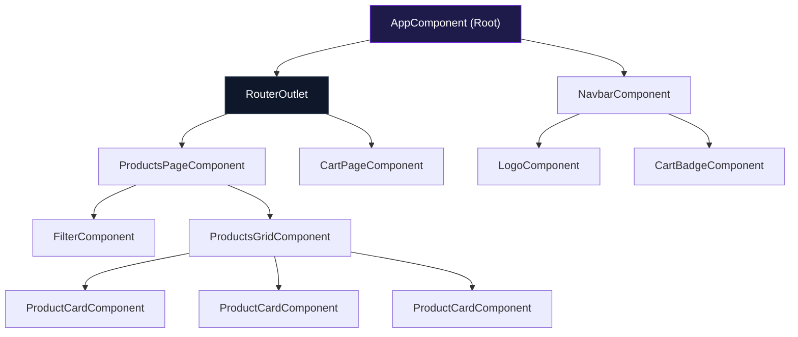
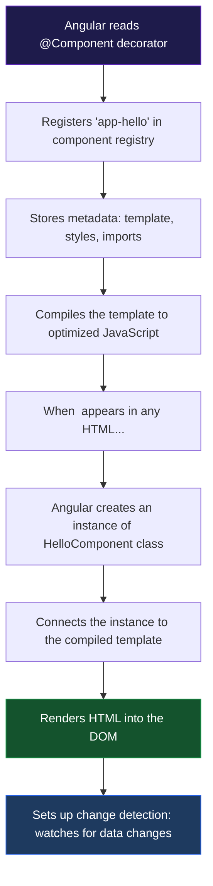
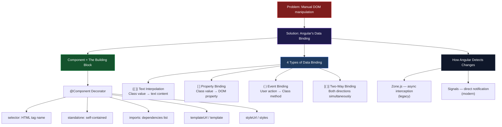

# الفصل الثاني — Angular: التشريح الكامل للـ Component

> **المتطلبات:** [[01-TypeScript-For-Angular]] — لازم تعرف الـ Interfaces والـ Decorators والـ Access Modifiers قبل ما تبدأ. الفصل ده بيبني فوقهم مباشرةً.

---

## البداية — المشكلة الحقيقية اللي Angular جاءت تحلّها

سنة 2010، كانت فيه مشكلة حقيقية وكبيرة بتواجه كل developer بيبني web application.

المشكلة مش إن JavaScript بطيئة أو إن HTML ضعيف. المشكلة كانت أعمق: **إزاي تخلّي الـ UI "يعكس" الـ data تلقائياً؟**

تخيّل معايا الـ scenario ده:

```
User is logged in → show "Welcome, Mohamed!" + show Cart icon + hide Login button
User logs out     → show "Please sign in"   + hide Cart icon + show Login button
User adds to cart → update cart count badge from 2 to 3
User deletes item → update cart count badge from 3 to 2
User changes name → update "Welcome, Mohamed!" to "Welcome, Ahmed!"
```

في plain JavaScript — كل تغيير في الـ data كان لازم يصحبه تعديل يدوي في الـ DOM:

```javascript
// Every single state change requires manual DOM surgery
function onLogin(user) {
  document.getElementById('welcome-msg').textContent = 'Welcome, ' + user.name + '!';
  document.getElementById('cart-icon').style.display = 'block';
  document.getElementById('login-btn').style.display = 'none';
  document.getElementById('logout-btn').style.display = 'block';
  document.querySelector('.user-avatar').src = user.avatar;
  // ... and 10 more lines for other elements
}

function onLogout() {
  document.getElementById('welcome-msg').textContent = 'Please sign in';
  document.getElementById('cart-icon').style.display = 'none';
  document.getElementById('login-btn').style.display = 'block';
  document.getElementById('logout-btn').style.display = 'none';
  // ... and 10 more lines
}

function onCartUpdate(newCount) {
  document.querySelector('.cart-badge').textContent = newCount;
  if (newCount === 0) {
    document.querySelector('.cart-icon').classList.remove('has-items');
  } else {
    document.querySelector('.cart-icon').classList.add('has-items');
  }
}
```

كل تغيير في الـ state = كود DOM manipulation يدوي. وكل ما التطبيق اتكبّر، الكود ده بقى:
- **هش** — تغيير في HTML يكسر الـ JavaScript
- **متكرر** — نفس الـ logic في 10 أماكن
- **صعب الـ debug** — مش واضح مين بيحدّث مين
- **مستحيل الـ testing** — مربوط بالـ DOM مباشرةً

Angular (وقبله Backbone، وبعده React وVue) جاءوا بفكرة ثورية:

> **بدل ما تتكلم للـ DOM مباشرةً — اتكلّم للـ data بس. وخلّي الـ framework مسؤول إنه يحدّث الـ DOM.**

بمعنى آخر: بدل ما تقول "غيّر النص في الـ h1 لـ Welcome Ahmed" — قول "اسم المستخدم هو Ahmed" والـ framework هيعمل باقي الشغل.

ده اسمه **Declarative Programming** — بتوصف النتيجة المطلوبة مش الخطوات.

```
Imperative (old): "Find the element, then set its textContent to this value"
Declarative (Angular): "This h1 always shows {{ user.name }}" — Angular handles the rest
```

> بس قبل ما نشوف إزاي Angular بتعمل ده — لازم نفهم اللبنة الأساسية في أي Angular app. إيه هي؟

---

## [[01-What-Is-A-Component]] — "وحدة البناء" — LEGO بس أذكى

الفكرة الأساسية في Angular بسيطة جداً: الـ UI بتاعك مش صفحة واحدة كبيرة — هو **مجموعة قطع صغيرة** كل قطعة مسؤولة عن نفسها.

اسم كل قطعة: **Component**.

تخيّل صفحة e-commerce عادية:

```
┌──────────────────────────────────────────────────────────────┐
│                    NAVBAR COMPONENT                          │
│  [Logo]    [Home] [Products] [Cart(3)]    [Welcome, Ali ▾]   │
├───────────────────────┬──────────────────────────────────────┤
│                       │                                      │
│  FILTER COMPONENT     │         PRODUCTS GRID                │
│  ┌─────────────────┐  │  ┌──────────┐  ┌──────────┐         │
│  │ Category: All ▾ │  │  │  PRODUCT │  │  PRODUCT │         │
│  │ Price: 0-5000   │  │  │  CARD    │  │  CARD    │  ...    │
│  │ Rating: ★★★+    │  │  │  COMP    │  │  COMP    │         │
│  └─────────────────┘  │  └──────────┘  └──────────┘         │
│                       │                                      │
├───────────────────────┴──────────────────────────────────────┤
│                    FOOTER COMPONENT                          │
└──────────────────────────────────────────────────────────────┘
```

كل صندوق = **Component منفصل**.

الـ `NavbarComponent` مش بيعرف أي حاجة عن الـ `ProductCardComponent`. الـ `FilterComponent` مش بيعرف إن في `FooterComponent` موجود.

**كل Component = unit مستقل عنده:**
- **Template** — الـ HTML بتاعه
- **Class** — الـ TypeScript: الـ data والـ logic
- **Styles** — الـ CSS الخاص بيه (مش بيأثر على باقي التطبيق)

---

### ليه الـ Isolation مهمة؟

لأن الـ `ProductCardComponent` ممكن تكتبه **مرة واحدة** وتستخدمه في:
- صفحة الـ Products (بيتكرر ١٠٠ مرة)
- صفحة الـ Search Results
- صفحة الـ Wishlist
- صفحة الـ Related Products

من غير ما تكتب نفس الـ HTML والـ CSS والـ logic أكتر من مرة.

ده اسمه **Reusability** — وهو واحد من أهم مبادئ هندسة البرمجيات.

---

### الـ Component Tree

في أي Angular app، الـ components بتتكوّن على شكل شجرة:



في القمة دايماً: **AppComponent** — اللي Angular بتبدأ بيه.
من تحته: components تانية، كل واحدة ممكن تحتوي على components أصغر منها.

> تمام. فهمنا إن Angular بتتكوّن من Components. دلوقتي السؤال العملي: إزاي بنكتب component بالكود؟

---

## [[02-Anatomy-Of-A-Component]] — "تشريح الـ Component"

الـ Component في Angular = TypeScript class عليها الـ `@Component` decorator.

بس خليني أبدأ بأبسط component ممكن، ثم نكبّره خطوة خطوة:

```typescript
import { Component } from '@angular/core';

@Component({
  selector: 'app-hello',
  template: `<h1>Hello, World!</h1>`,
})
export class HelloComponent {
  // empty for now
}
```

اتشغّل في الـ browser — هتشوف:
```html
<h1>Hello, World!</h1>
```

بس إزاي Angular عرف يعمل ده؟ وإيه اللي حصل بالظبط؟

---

### تحت الغطاء — إيه اللي يحصل فعلاً

لما Angular بتقرأ الـ `@Component` decorator، بتعمل حاجات كتير:



من غير الـ `@Component` — Angular مش بتعرف إن الـ class دي component خالص. بتعملها زي أي TypeScript class عادية.

---

### الـ 3 ملفات بتاعة أي Component

في المشاريع الحقيقية، كل component بيكون في 3 ملفات:

```
app/
└── product-card/
    ├── product-card.component.ts    ← TypeScript class + decorator
    ├── product-card.component.html  ← Template (HTML)
    └── product-card.component.css   ← Styles (CSS)
```

```typescript
// product-card.component.ts
@Component({
  selector:    'app-product-card',
  templateUrl: './product-card.component.html',  // separate HTML file
  styleUrl:    './product-card.component.css',   // separate CSS file
  standalone:  true,
})
export class ProductCardComponent {
  productName  = 'Angular Course';
  productPrice = 500;
}
```

```html
<!-- product-card.component.html -->
<div class="card">
  <h3>{{ productName }}</h3>
  <p>Price: {{ productPrice }} EGP</p>
</div>
```

```css
/* product-card.component.css */
.card {
  border: 1px solid #ccc;
  padding: 16px;
  border-radius: 8px;
}
```

> بس مش لازم دايماً 3 ملفات. لو الـ template صغير تقدر تكتبه inline. خليني أشرح كل property في الـ decorator بالتفصيل.

---

## [[03-Component-Decorator-Deep-Dive]] — كل Property في `@Component` بالتفصيل

```typescript
@Component({
  selector:    'app-product-card',
  standalone:  true,
  imports:     [...],
  templateUrl: './product-card.component.html',
  template:    `...`,       // alternative to templateUrl
  styleUrl:    './product-card.component.css',
  styles:      [`...`],     // alternative to styleUrl
  changeDetection: ChangeDetectionStrategy.OnPush,
})
```

---

### Property 1: `selector` — "اسم الـ Component في الـ HTML"

الـ `selector` بيحدد إيه الـ HTML tag اللي هيمثّل الـ component ده في أي template تاني:

```typescript
selector: 'app-product-card'
// Usage: <app-product-card></app-product-card>
```

لما Angular تشوف `<app-product-card>` في أي HTML — بتعمل instance جديد من الـ `ProductCardComponent` وبترندر الـ template بتاعه محلّه.

---

**ليه الـ prefix `app-` إجباري بالعرف؟**

HTML عنده elements أصلية: `<div>`, `<span>`, `<input>`, `<button>`, `<select>`, إلخ. لو سمّيت component بتاعك `<input>` أو `<button>` — Angular هيتخبّط مع الـ HTML الأصلي.

الـ `app-` بيقول صراحةً: "ده custom element — مش HTML standard."

في المشاريع الكبيرة، بيستخدموا prefix يعبّر عن الـ feature:
```
app-        ← general components
auth-       ← authentication components
admin-      ← admin panel components
shared-     ← reusable shared components
```

---

**أنواع الـ selector:**

```typescript
// 1. Element selector (most common — use this always)
selector: 'app-card'
// <app-card></app-card>

// 2. Attribute selector (used for directives — next chapter)
selector: '[appHighlight]'
// <p appHighlight>Text</p>

// 3. Class selector (rarely used)
selector: '.my-widget'
// <div class="my-widget"></div>
```

في 99% من الـ components بتستخدم **element selector**. الـ attribute وclass selectors بتيجي مع الـ **Directives** اللي بنشرحها في فصل لاحق.

---

### Property 2: `standalone: true` — "الاستقلالية الكاملة"

```typescript
standalone: true
```

ده واحد من أهم التغييرات في Angular الحديث. عشان تفهمه، محتاج تعرف الـ history القصيرة:

**قبل Angular 14 — عصر النظام القديم:**

```typescript
// OLD WAY: every component had to belong to an NgModule
// NgModule = a "container" that owned a group of components

@NgModule({
  declarations: [
    ProductCardComponent,     // ← components live here
    ProductListComponent,
    FilterComponent,
  ],
  imports: [
    CommonModule,             // ← shared dependencies declared here
    ReactiveFormsModule,
    RouterModule,
  ],
  exports: [ProductCardComponent]  // ← make it usable in other modules
})
export class ProductsModule {}
```

المشكلة: لو `ProductCardComponent` محتاجة `CommonModule` — مش بتضيفها في الـ component نفسها. بتضيفها في الـ NgModule. وبعدين Angular بيوصّلها للـ component بطريقة غير مباشرة.

النتيجة: كود غير واضح، أخطاء صعبة الفهم، وصعوبة في تتبع "مين محتاج إيه من فين."

---

**Angular 14+ — عصر الـ Standalone:**

```typescript
// NEW WAY: component declares its own dependencies directly
@Component({
  selector:   'app-product-card',
  standalone: true,                           // ← self-contained
  imports:    [CommonModule, RouterLink],     // ← MY dependencies, declared here
  template:   `...`,
})
export class ProductCardComponent {}
```

دلوقتي كل component بتقول مباشرةً "أنا محتاج كده وكده." مفيش وسيط. مفيش NgModule. مفيش mystery.

**من Angular 17 فصاحياً — `standalone: true` هو الـ default.** بتقدر تحذفه من الكتابة، بس كتابته أوضح.

---

### Property 3: `imports` — "قائمة الاحتياجات"

```typescript
imports: [CommonModule, ReactiveFormsModule, RouterLink]
```

كل حاجة بتستخدمها في الـ template لازم تكون هنا. لو حاجة ناقصة — Angular بيطلع error فوراً:

```
Error: 'NgIf' is not a standalone component/directive/pipe...
Or:
Error: Can't bind to 'formGroup' since it isn't a known property of 'form'
```

**الأشياء اللي هتحتاجها كتير:**

```typescript
imports: [
  // — Control Flow (Angular 17+ built-in — no import needed for @if, @for)
  // But for old *ngIf and *ngFor syntax:
  CommonModule,         // includes NgIf, NgFor, NgClass, NgStyle, NgSwitch

  // — Forms
  ReactiveFormsModule,  // [formGroup], formControlName, FormBuilder
  FormsModule,          // [(ngModel)] — template-driven forms

  // — Router
  RouterLink,           // routerLink="/home"
  RouterLinkActive,     // routerLinkActive="active-class"
  RouterOutlet,         // <router-outlet> — for the root/layout component

  // — Pipes
  AsyncPipe,            // | async — for Observables in templates
  DatePipe,             // | date
  CurrencyPipe,         // | currency
  DecimalPipe,          // | number
  UpperCasePipe,        // | uppercase
  LowerCasePipe,        // | lowercase
  TitleCasePipe,        // | titlecase

  // — Other components you use in this component's template
  ProductCardComponent, // <app-product-card> — must be imported!
  NavbarComponent,      // <app-navbar>
  LoadingSpinnerComponent, // <app-loading-spinner>
]
```

**القاعدة الذهبية:** إذا كتبت حاجة في الـ template وAngular مش بيعرفها — الحل دايماً في الـ `imports` array.

---

### Property 4: `templateUrl` vs `template`

```typescript
// Option A: separate HTML file (for real, complex templates)
templateUrl: './product-card.component.html'

// Option B: inline template (for simple, small templates)
template: `
  <div class="card">
    <h3>{{ name }}</h3>
    <button (click)="buy()">Buy</button>
  </div>
`,
```

**متى تستخدم أيهم؟**

| | `templateUrl` | `template` |
|---|---|---|
| الحجم | أي حجم — حتى 500 سطر | صغير جداً — أقل من 10-15 سطر |
| الـ IDE support | كامل (autocomplete، lint) | محدود داخل الـ backticks |
| الـ organization | أفضل — ملفات منفصلة | أسرع للـ prototyping |
| الاستخدام | المشاريع الحقيقية دايماً | Examples والـ demos |

---

### Property 5: `styleUrl` vs `styles`

```typescript
// Option A: separate CSS file
styleUrl: './product-card.component.css'

// Option B: inline styles
styles: [`
  .card { border: 1px solid #ccc; padding: 16px; }
  h3 { color: #333; }
`]
```

---

**الـ Style Encapsulation — ميزة مهمة جداً:**

الـ CSS اللي بتكتبها في component **ما بتأثّرش على باقي التطبيق تلقائياً**. ده بيسموه **View Encapsulation**.

```css
/* product-card.component.css */
h3 { color: red; }
/* This ONLY affects <h3> elements inside ProductCardComponent */
/* NOT all h3 elements in the app! */
```

Angular بيعمل ده بإنه بيضيف attribute فريد لكل element في الـ component:

```html
<!-- After Angular processing: -->
<h3 _ngcontent-abc-123>Product Name</h3>
<!-- And the CSS becomes: -->
<style>h3[_ngcontent-abc-123] { color: red; }</style>
```

النتيجة: CSS بتاع كل component معزول تلقائياً. مش محتاج تقلق من الـ class name conflicts.

---

### Property 6: `changeDetection` — "متى Angular يعيد الرسم؟"

```typescript
changeDetection: ChangeDetectionStrategy.OnPush
// OR (default):
changeDetection: ChangeDetectionStrategy.Default
```

ده موضوع كبير بنشرحه بالتفصيل في [[02.5-Control-Flow-DI-Signals]]. للوقت الحالي: اعرف إنه موجود وإنه بيؤثر على الـ performance.

> عرفنا كل property في الـ `@Component`. دلوقتي خليني أوريك إزاي الـ class بتتكلم مع الـ template — ده هو قلب Angular.

---

## [[04-The-Component-Class]] — "المخ" بتاع الـ Component

الـ TypeScript class هي اللي بتمسك كل حاجة بيتحتاجها الـ template: الـ data، الـ logic، والـ methods.

```typescript
@Component({
  selector:   'app-user-profile',
  standalone: true,
  imports:    [],
  template: `
    <div class="profile">
      <h2>{{ fullName }}</h2>
      <p>Member since: {{ memberSince }}</p>
      <p>Posts: {{ postCount }}</p>
    </div>
  `,
})
export class UserProfileComponent {
  // — DATA (properties) —
  firstName   = 'Mohamed';
  lastName    = 'Ahmed';
  memberSince = 2023;
  postCount   = 142;

  // — COMPUTED DATA (methods used as getters) —
  get fullName(): string {
    return `${this.firstName} ${this.lastName}`;
    // template uses {{ fullName }} — Angular calls this getter
  }
}
```

الـ template بيقرأ من الـ class مباشرةً. أي property موجودة في الـ class — تقدر تستخدمها في الـ template.

---

### أنواع الـ Data في الـ Component Class

```typescript
export class ShopComponent {
  // 1. Primitive values
  title       = 'My Shop';
  itemCount   = 0;
  isOpen      = true;
  description = 'Welcome to our store';

  // 2. Objects
  currentUser = {
    name: 'Ali',
    email: 'ali@example.com',
    role: 'admin' as 'admin' | 'viewer',
  };

  // 3. Arrays
  categories  = ['Electronics', 'Books', 'Clothing', 'Food'];
  items: Item[] = [];

  // 4. Nullable values (before data loads from API)
  selectedItem: Item | null = null;
  errorMessage: string | null = null;

  // 5. Loading state
  isLoading = false;
}
```

كل حاجة هنا ممكن تتعرض في الـ template بنفس الأسماء.

---

### الـ Methods — "الأوامر" اللي الـ Template ينفّذها

```typescript
export class ShopComponent {
  cartItems: string[] = [];
  isLoggedIn = false;

  // Called when user clicks "Add to Cart"
  addToCart(itemName: string): void {
    this.cartItems.push(itemName);
    console.log(`Added: ${itemName}. Cart has ${this.cartItems.length} items.`);
  }

  // Called when user clicks "Clear Cart"
  clearCart(): void {
    this.cartItems = [];
  }

  // Called when user clicks "Login"
  toggleLogin(): void {
    this.isLoggedIn = !this.isLoggedIn;
  }

  // Computed value — used in template like a property
  get cartCount(): number {
    return this.cartItems.length;
  }
}
```

```html
<!-- template uses the class methods and properties directly -->
<p>Items in cart: {{ cartCount }}</p>
<button (click)="addToCart('Laptop')">Add Laptop</button>
<button (click)="clearCart()">Clear</button>
```

> تمام. عندنا class فيها data وmethods. دلوقتي السؤال الجوهري: إزاي الـ data بتوصل للـ HTML؟ ده هو الـ Data Binding.

---

## [[05-Data-Binding-Complete]] — "ربط الـ Class بالـ Template" — الصورة الكاملة

**Data Binding** هو الآلية اللي بتخلّي الـ TypeScript class والـ HTML template يتكلموا مع بعض.

في Angular فيه **4 أنواع** من الـ Data Binding:

```
Class ──── {{ }} ────► Template     Text Interpolation
Class ──── [  ] ────► Template     Property Binding
Template ── (  ) ────► Class       Event Binding
Class ◄──── [( )] ───► Template    Two-Way Binding
```

خليني أشرح كل واحدة بالتفصيل مع فهم عميق لـ "ليه موجودة."

---

## [[06-Text-Interpolation]] — `{{ }}` — "إظهار القيم كنص"

`{{ expression }}` — Angular بيحسب الـ expression دي ويحطّ نتيجتها كـ **text content** جوّا الـ element.

```typescript
@Component({
  selector: 'app-greeting',
  standalone: true,
  template: `
    <!-- Simple variable -->
    <h1>{{ title }}</h1>

    <!-- Property access -->
    <p>Hello, {{ user.firstName }}!</p>

    <!-- Arithmetic -->
    <p>Total: {{ price * quantity }}</p>

    <!-- Method call -->
    <p>{{ getGreeting() }}</p>

    <!-- Ternary -->
    <p>{{ isOnline ? 'Online 🟢' : 'Offline 🔴' }}</p>

    <!-- String method -->
    <p>{{ username.toUpperCase() }}</p>

    <!-- Array length -->
    <p>You have {{ notifications.length }} notifications</p>
  `,
})
export class GreetingComponent {
  title         = 'Dashboard';
  user          = { firstName: 'Mohamed', lastName: 'Ahmed' };
  price         = 150;
  quantity      = 3;
  isOnline      = true;
  username      = 'm.ahmed';
  notifications = ['msg1', 'msg2', 'msg3'];

  getGreeting(): string {
    const hour = new Date().getHours();
    if (hour < 12) return 'Good morning!';
    if (hour < 17) return 'Good afternoon!';
    return 'Good evening!';
  }
}
```

**الـ output:**
```html
<h1>Dashboard</h1>
<p>Hello, Mohamed!</p>
<p>Total: 450</p>
<p>Good afternoon!</p>
<p>Online 🟢</p>
<p>M.AHMED</p>
<p>You have 3 notifications</p>
```

---

### ما هو مسموح وما هو ممنوع في `{{ }}`

```html
<!-- ✅ ALLOWED — expressions that produce a value -->
{{ 2 + 2 }}                          <!-- arithmetic -->
{{ 'hello' + ' ' + 'world' }}        <!-- string concat -->
{{ user?.name ?? 'Guest' }}          <!-- optional chaining + nullish coalescing -->
{{ items.length > 0 ? 'Full' : 'Empty' }} <!-- ternary -->
{{ getFormattedDate(createdAt) }}    <!-- method call -->
{{ user.role | uppercase }}          <!-- pipe — transforms value for display -->

<!-- ❌ NOT ALLOWED — assignments and side effects -->
{{ x = 5 }}         <!-- ❌ assignment -->
{{ i++ }}           <!-- ❌ increment -->
{{ new Date() }}    <!-- ❌ new keyword -->
{{ console.log() }} <!-- ❌ accessing global functions directly -->
```

**ليه Angular يمنع الـ assignments؟**

لأن الـ template المفروض يكون **قراءة فقط**. هو عارض للـ data — مش معدّل ليها. لو سمح بالـ assignments، الـ template هيبقى له side effects وهيبقى صعب جداً تـ debug.

---

### `{{ }}` محدوديتها — بتعمل text بس

ده أهم حاجة تفهمها عن `{{ }}`:

```html
<!-- ✅ This works — showing text inside paragraph -->
<p>{{ userName }}</p>

<!-- ⚠️ This has a problem — for boolean attributes -->
<button disabled="{{ isLoading }}">Submit</button>
<!-- When isLoading = false → disabled="false" (a non-empty string!)
     Browsers treat any non-empty string as truthy for boolean attributes
     So the button is ALWAYS disabled — even when isLoading = false! -->

<!-- ⚠️ This also has timing issues — for src attribute -->

<!-- The browser might try to load the image BEFORE Angular processes {{ }}
     Resulting in a 404 request for the literal string "{{ avatarUrl }}" -->
```

لهذه الأسباب وجد النوع التاني من الـ binding.

> الـ `{{ }}` بتعمل text. بس أحياناً محتاج تربط قيمة بـ **property** في الـ DOM مش بـ text content. ده اللي بيحله الـ `[ ]`.

---

## [[07-Property-Binding]] — `[ ]` — "الربط بخصائص الـ DOM"

الـ `[property]="expression"` — بياخد قيمة TypeScript ويمررها مباشرةً كـ **JavaScript property** للـ DOM element.

```typescript
@Component({
  selector: 'app-product',
  standalone: true,
  template: `
    <!-- Bind src — passes the actual URL string as img.src property -->
    

    <!-- Bind disabled — passes actual boolean, not string -->
    <button [disabled]="isLoading">
      {{ isLoading ? 'Saving...' : 'Save Changes' }}
    </button>

    <!-- Bind href -->
    <a [href]="profileUrl">View Profile</a>

    <!-- Bind value to pre-fill an input -->
    <input [value]="defaultText" type="text" />

    <!-- Bind a component's @Input property (next chapter) -->
    <app-card [title]="cardTitle" [isHighlighted]="true"></app-card>
  `,
})
export class ProductComponent {
  imageUrl    = 'https://example.com/laptop.jpg';
  productName = 'Gaming Laptop';
  isLoading   = false;
  profileUrl  = '/users/123';
  defaultText = 'Enter your name';
  cardTitle   = 'Featured Product';
}
```

---

### الفرق العميق بين `{{ }}` و `[ ]`

هنا بيحصل أكبر confusion للمبتدئين. خليني أشرح بمثال واحد بسيط:

```html
<!-- Scenario: isLoading = false -->

<!-- Text Interpolation — converts to STRING -->
<button disabled="{{ isLoading }}">Submit</button>
<!-- Angular converts false → "false" (a string)
     HTML sees: disabled="false"
     "false" is a non-empty string — truthy in HTML boolean attributes
     Result: button IS disabled ❌ WRONG BEHAVIOR -->

<!-- Property Binding — passes actual BOOLEAN -->
<button [disabled]="isLoading">Submit</button>
<!-- Angular passes the actual boolean value false
     JavaScript DOM property: button.disabled = false
     Result: button is NOT disabled ✅ CORRECT BEHAVIOR -->
```

**الفرق الجوهري:**

```
{{ }}  → converts any value to STRING → inserts as text
[ ]    → passes the ACTUAL JavaScript value → sets DOM property directly
```

```typescript
// For strings: both work similarly
// For booleans, numbers, objects, arrays: use [ ] always

{{ isAdmin }}          // renders as text: "true" or "false" (string)
[disabled]="isAdmin"   // passes actual boolean — what you almost always want
```

---

### Class Binding — تطبيق مهم لـ `[ ]`

```html
<!-- Add a single class conditionally -->
<div [class.active]="isSelected">Item</div>
<!-- [class.CLASSNAME]="CONDITION" -->
<!-- When isSelected = true  → <div class="active"> -->
<!-- When isSelected = false → <div class=""> -->

<!-- Add multiple classes from an object -->
<div [ngClass]="{
  'text-success':  status === 'active',
  'text-danger':   status === 'error',
  'text-warning':  status === 'pending',
  'font-bold':     isImportant
}">Status</div>
<!-- Only the classes whose value is truthy get added -->
```

```typescript
export class ListItemComponent {
  isSelected  = false;
  isImportant = true;
  status      = 'active'; // 'active' | 'error' | 'pending'
}
```

---

### Style Binding — تطبيق تاني لـ `[ ]`

```html
<!-- Set a single CSS property -->
<p [style.color]="errorMessage ? 'red' : 'green'">{{ message }}</p>

<!-- Set a CSS property with a unit -->
<div [style.width.px]="progressPercent * 3">Progress</div>
<!-- If progressPercent = 75 → width: 225px -->

<div [style.font-size.rem]="scale">Text</div>
<!-- If scale = 1.5 → font-size: 1.5rem -->

<!-- Set multiple styles from an object -->
<div [ngStyle]="{
  'color':           textColor,
  'background-color': bgColor,
  'font-size':        fontSize + 'px',
  'font-weight':      isBold ? 'bold' : 'normal'
}">Styled text</div>
```

---

### Attribute Binding — لما الـ Property مش موجودة

```html
<!-- colspan is an HTML ATTRIBUTE — not a DOM property -->
<!-- This WON'T work: -->
<td [colspan]="spanCount">...</td>
<!-- Error: Can't bind to 'colspan' since it isn't a known property of 'td' -->

<!-- This WORKS — attr. prefix for HTML attributes without DOM properties -->
<td [attr.colspan]="spanCount">...</td>

<!-- Other common attr bindings: -->
<input [attr.aria-label]="inputLabel" />
<button [attr.data-testid]="'submit-btn'" />
<tr [attr.data-id]="row.id">...</tr>
```

**كيف تعرف متى تستخدم `[attr.x]` بدل `[x]`؟**

لو Angular طلعت الـ error: `Can't bind to 'X' since it isn't a known property` — جرب `[attr.X]` بدلها.

---

**الصورة الكاملة للـ Property Binding:**

```
TypeScript Class          HTML Template         DOM (browser)
┌─────────────────┐       ┌──────────────────┐  ┌─────────────────────┐
│ isLoading = true │──[ ]──│ [disabled]="..." │──│ button.disabled=true │
│ imgUrl = '...'  │──[ ]──│ [src]="..."      │──│ img.src='...'        │
│ isActive = false│──[ ]──│ [class.active]   │──│ element.classList    │
│ color = 'red'   │──[ ]──│ [style.color]    │──│ element.style.color  │
└─────────────────┘       └──────────────────┘  └─────────────────────┘

Direction: TypeScript → DOM (one-way)
```

> ممتاز. عرفنا إزاي نبعت data من TypeScript للـ DOM. بس ده اتجاه واحد. إيه اللي بيحصل في الاتجاه الآخر — لما المستخدم يعمل حاجة؟

---

## [[08-Event-Binding]] — `( )` — "الاستماع لأحداث المستخدم"

الـ `(event)="handler"` — بيقول لـ Angular "لما الـ event ده يحصل على الـ element ده — استدعي الـ method دي."

```typescript
@Component({
  selector: 'app-interactive',
  standalone: true,
  template: `
    <!-- Click event -->
    <button (click)="onButtonClick()">Click Me</button>

    <!-- Keyboard events -->
    <input (keyup)="onKeyUp($event)" placeholder="Type something..." />
    <input (keyup.enter)="onEnterPressed()" placeholder="Press Enter..." />
    <input (keydown.escape)="onEscapePressed()" placeholder="Press Escape..." />

    <!-- Focus events -->
    <input (focus)="onFocus()" (blur)="onBlur()" placeholder="Focus/Blur..." />

    <!-- Mouse events -->
    <div (mouseover)="onHover(true)" (mouseout)="onHover(false)">
      Hover over me
    </div>

    <!-- Form submit -->
    <form (ngSubmit)="onFormSubmit()">
      <input type="text" />
      <button type="submit">Submit</button>
    </form>
  `,
})
export class InteractiveComponent {
  onButtonClick()     { console.log('Button was clicked!'); }
  onKeyUp(e: KeyboardEvent) { console.log('Key:', e.key); }
  onEnterPressed()    { console.log('Enter pressed!'); }
  onEscapePressed()   { console.log('Escape pressed!'); }
  onFocus()           { console.log('Input focused'); }
  onBlur()            { console.log('Input lost focus'); }
  onHover(state: boolean) { console.log('Hovering:', state); }
  onFormSubmit()      { console.log('Form submitted!'); }
}
```

---

### `(ngSubmit)` vs `(submit)` — فرق مهم

```html
<!-- (submit) — native HTML form submit -->
<form (submit)="handleSubmit()">
<!-- Problem: triggers a page reload by default!
     You'd need to call event.preventDefault() manually -->

<!-- (ngSubmit) — Angular's enhanced form submit -->
<form (ngSubmit)="handleSubmit()">
<!-- Angular automatically calls preventDefault() for you
     No page reload. This is what you should always use. -->
```

---

### الـ `$event` — ما يحمله الـ Event Object

`$event` هو الـ DOM event object اللي JavaScript بيبعته لأي event listener. محتواه بيختلف حسب نوع الـ event:

```typescript
@Component({
  selector: 'app-event-demo',
  standalone: true,
  template: `
    <input (input)="onInput($event)" />
    <button (click)="onClick($event)">Click</button>
    <div (mousemove)="onMouseMove($event)">Move here</div>
  `,
})
export class EventDemoComponent {

  onInput(event: Event) {
    // InputEvent for text inputs
    const input = event.target as HTMLInputElement;
    const value = input.value;  // what the user typed
    console.log('User typed:', value);
  }

  onClick(event: MouseEvent) {
    // MouseEvent for clicks
    console.log('Clicked at X:', event.clientX, 'Y:', event.clientY);
    console.log('Was Ctrl held?', event.ctrlKey);
    console.log('Was Shift held?', event.shiftKey);
    // event.target = the element that was clicked
    // event.currentTarget = the element with the listener
  }

  onMouseMove(event: MouseEvent) {
    console.log('Mouse position:', event.clientX, event.clientY);
  }
}
```

---

### إرسال معاملات مخصصة مع الـ Event

```html
<!-- Pass a static value -->
<button (click)="deleteItem('item-123')">Delete</button>

<!-- Pass a dynamic value from the template context -->
@for (product of products; track product.id) {
  <div>
    <h3>{{ product.name }}</h3>
    <button (click)="addToCart(product)">Add to Cart</button>
    <button (click)="removeItem(product.id)">Remove</button>
  </div>
}

<!-- Pass both the value and the event -->
<button (click)="handleClick(product, $event)">Buy</button>
```

```typescript
deleteItem(id: string) { ... }
addToCart(product: Product) { ... }
removeItem(id: string) { ... }
handleClick(product: Product, event: MouseEvent) {
  event.stopPropagation(); // prevent event from bubbling up
  this.buy(product);
}
```

---

### الصورة الكاملة للـ Data Flow دلوقتي

```
TypeScript Class                         HTML Template
┌──────────────────────────┐             ┌──────────────────────────┐
│                          │             │                          │
│  name = 'Mohamed'        │──{{ }}──►   │  <h1>Mohamed</h1>        │
│  isLoading = true        │──[ ]───►    │  <button disabled>       │
│  imgUrl = '...'          │──[ ]───►    │           │
│                          │             │                          │
│  onSubmit()  ◄───────────│──( )────    │  <form (ngSubmit)>       │
│  onDelete()  ◄───────────│──( )────    │  <button (click)>        │
│                          │             │                          │
└──────────────────────────┘             └──────────────────────────┘

{{ }} and [ ]  =  TypeScript  →  Template  (one-way: class updates UI)
( )            =  Template   →  TypeScript  (one-way: user updates class)
```

> لاحظ: الـ `[ ]` و`{{ }}` بيبعتوا data في اتجاه واحد — من TypeScript للـ HTML. والـ `( )` بيبعت في الاتجاه العكسي. بس أحياناً محتاج الاتجاهين في نفس الوقت — زي input field بتريد تعرض فيه قيمة وفي نفس الوقت لما المستخدم يكتب فيه تحدّث القيمة. ده اللي بييجي بعد كده.

---

## [[09-Two-Way-Binding]] — `[( )]` — "الاتجاهين في نفس الوقت"

`[(ngModel)]` هو اختصار لـ `[value]` + `(input)` معاً في سطر واحد:

```html
<!-- The LONG WAY — property binding + event binding -->
<input
  [value]="username"
  (input)="username = $event.target.value"
/>
<!-- [value]: shows current value in the input -->
<!-- (input): updates username when user types -->

<!-- The SHORT WAY — two-way binding -->
<input [(ngModel)]="username" />
<!-- Exactly equivalent — Angular expands it to the above -->
```

**لازم `FormsModule` في الـ `imports`:**

```typescript
@Component({
  selector:   'app-form',
  standalone: true,
  imports:    [FormsModule],  // ← required for [(ngModel)]
  template: `
    <input [(ngModel)]="userName" placeholder="Enter name" />
    <p>Hello, {{ userName }}!</p>
    <!-- The paragraph updates in real-time as the user types -->
  `,
})
export class FormComponent {
  userName = '';
}
```

---

### لماذا اسمه "Banana in a Box"؟

```
[( )]
 └┘
 🍌  The parentheses inside look like a banana
└──┘
📦  The square brackets around look like a box

Banana in a Box!
```

---

### `[(ngModel)]` vs Reactive Forms — متى تستخدم أيهم؟

```
[(ngModel)]      → Template-Driven Forms → simple, quick, less control
Reactive Forms   → FormGroup + FormControl → complex, powerful, testable
```

**القاعدة:** في المشاريع الجدية، بتستخدم **Reactive Forms** بس. الـ `[(ngModel)]` للأشياء البسيطة جداً أو الـ prototypes.

**لا تخلطهم في نفس الـ `<form>`** — هيطلع errors غريبة.

---

### مقارنة الـ 4 أنواع جنب بعض

```html
<!-- 1. Text Interpolation — value as TEXT CONTENT -->
<p>{{ userName }}</p>
<!-- Use when: displaying text inside elements -->

<!-- 2. Property Binding — set DOM PROPERTY -->
<input [value]="userName" />
<button [disabled]="isLoading" />

<!-- Use when: setting element properties (not text content) -->

<!-- 3. Event Binding — handle USER ACTIONS -->
<button (click)="save()" />
<input (input)="onType($event)" />
<form (ngSubmit)="onSubmit()" />
<!-- Use when: responding to user interactions -->

<!-- 4. Two-Way Binding — BOTH directions simultaneously -->
<input [(ngModel)]="searchTerm" />
<!-- Use when: input that both shows and updates a variable -->
```

---

### مثال شامل — الـ 4 أنواع معاً في Component واحد

```typescript
@Component({
  selector: 'app-search-box',
  standalone: true,
  imports: [FormsModule],
  template: `
    <!-- Two-way binding: shows current query AND updates it -->
    <input
      [(ngModel)]="searchQuery"
      [placeholder]="placeholderText"
      [disabled]="isSearching"
      (keyup.enter)="performSearch()"
    />

    <!-- Property binding: disabled when no query OR already searching -->
    <button
      [disabled]="searchQuery.length === 0 || isSearching"
      (click)="performSearch()"
    >
      {{ isSearching ? 'Searching...' : 'Search' }}
    </button>

    <!-- Text interpolation: show current state -->
    <p>Searching for: "{{ searchQuery }}"</p>
    <p [style.color]="resultCount > 0 ? 'green' : 'red'">
      {{ resultCount }} results found
    </p>
  `,
})
export class SearchBoxComponent {
  searchQuery     = '';
  placeholderText = 'Search products...';
  isSearching     = false;
  resultCount     = 0;

  performSearch(): void {
    if (!this.searchQuery.trim()) return;
    this.isSearching = true;
    // Simulate search delay
    setTimeout(() => {
      this.resultCount = Math.floor(Math.random() * 100);
      this.isSearching = false;
    }, 1000);
  }
}
```

> عرفنا كل أنواع الـ Data Binding. دلوقتي خليني أشرح حاجة مهمة جداً بتشغّل كل ده وراء الكواليس — إزاي Angular بتعرف إن في تغيير وتحدّث الـ DOM.

---

## [[10-How-Angular-Updates-DOM]] — "إزاي Angular بتشوف التغيير"

ده من أكثر الأسئلة اللي بتيجي في الإنترفيو. خليني أشرح بطريقة بتبقى واضحة.

### المشكلة الأصلية

```typescript
export class CounterComponent {
  count = 0;

  increment() {
    this.count++;
    // count is now 1
    // But how does Angular KNOW to update {{ count }} in the HTML?
    // Angular is not observing the variable directly
    // There's no "onChange" event on a plain JavaScript property
  }
}
```

---

### الحل القديم — Zone.js "العين الساهرة"

Angular كان بيستخدم مكتبة اسمها **Zone.js**. الـ Zone.js بتعمل حاجة جريئة: بتـ"تلف" حول **كل** الـ async operations في الـ browser:

```
setTimeout   → Zone.js intercepts it
setInterval  → Zone.js intercepts it
Promises     → Zone.js intercepts it
DOM events   → Zone.js intercepts it
HTTP calls   → Zone.js intercepts it
```

لما أي async operation تخلص — Zone.js بتصحّي Angular: "في حاجة اتغيّرت ممكن — اعمل check."

Angular بعدين بيعمل **Change Detection Cycle**: بيمشي على كل component في الـ tree وبيقارن كل قيمة مربوطة بالـ template بقيمتها اللي في آخر render. لو في فرق — يحدّث الـ DOM.

```
User clicks button
    → Zone.js: "async event happened!"
    → Angular: "run change detection"
    → Angular checks ALL components
    → Finds: count changed from 0 to 1
    → Updates DOM: {{ count }} → "1"
```

---

### الحل الحديث — Signals "الإبلاغ المباشر"

من Angular 16، Angular قدّم الـ **Signals**. فكرة مختلفة تماماً:

بدل ما Angular يخمّن "ممكن يكون في تغيير" — الـ Signal بيقول لـ Angular مباشرةً "أنا اتغيّرت."

```typescript
import { signal, computed } from '@angular/core';

export class CounterComponent {
  // A "smart" variable — Angular knows when it changes
  count = signal(0);

  // A derived value — auto-recalculates when count changes
  doubleCount = computed(() => this.count() * 2);

  increment() {
    this.count.set(this.count() + 1);
    // Angular INSTANTLY knows: "count signal changed, update templates that read it"
    // No Zone.js guessing. No full tree scan.
  }
}
```

```html
<!-- Reading a signal requires calling it like a function -->
<p>Count: {{ count() }}</p>
<p>Double: {{ doubleCount() }}</p>

<button (click)="increment()">+1</button>
```

---

### Zone.js vs Signals — الفرق العملي

| | Zone.js (قديم) | Signals (حديث) |
|---|---|---|
| كيف Angular يعرف؟ | بالتخمين بعد كل async operation | مباشرةً — Signal ينادي Angular |
| كيف تكتب الـ variable؟ | `count = 0` | `count = signal(0)` |
| كيف تقرأ في الـ template؟ | `{{ count }}` | `{{ count() }}` — must call as function |
| كيف تغيّر القيمة؟ | `this.count++` | `this.count.set(newValue)` |
| الأداء | بيـcheck كل حاجة | بيـcheck اللي اتغيّر بس |
| الـ overhead | كبير في apps كبيرة | أقل بكتير |

---

### `signal()` — الأنواع الثلاثة

```typescript
import { signal, computed, effect } from '@angular/core';

// 1. signal() — a writable reactive value
const name    = signal('Mohamed');
const count   = signal(0);
const isOpen  = signal(false);
const items   = signal<string[]>([]);

// Reading: call like a function
console.log(name());   // 'Mohamed'
console.log(count());  // 0

// Writing: .set() for replacement
name.set('Ahmed');
count.set(5);

// Writing: .update() for transformation (based on current value)
count.update(current => current + 1);
items.update(list => [...list, 'new item']);

// Writing: .mutate() for objects/arrays (deprecated in newer Angular — use .update)
// Prefer .update with spread for immutability

// 2. computed() — read-only, auto-recalculates
const fullName = computed(() => `${firstName()} ${lastName()}`);
// fullName() recalculates whenever firstName or lastName changes
// You CANNOT call fullName.set() — it's read-only

// 3. effect() — runs a side effect when signals change
effect(() => {
  console.log('Count changed to:', count());
  // This runs whenever count() changes
  // Useful for: logging, syncing to localStorage, external APIs
});
```

---

**مثال كامل بـ Signals:**

```typescript
@Component({
  selector: 'app-cart',
  standalone: true,
  template: `
    <div class="cart">
      <h2>Shopping Cart</h2>
      <p>Items: {{ itemCount() }}</p>
      <p>Total: {{ total() }} EGP</p>

      @for (item of items(); track item.id) {
        <div class="item">
          <span>{{ item.name }}</span>
          <span>{{ item.price }} EGP</span>
          <button (click)="removeItem(item.id)">Remove</button>
        </div>
      } @empty {
        <p>Your cart is empty.</p>
      }

      <button (click)="clearCart()" [disabled]="itemCount() === 0">
        Clear Cart
      </button>
    </div>
  `,
})
export class CartComponent {
  interface CartItem { id: number; name: string; price: number; }

  items = signal<CartItem[]>([]);

  // computed() automatically updates when items() changes
  itemCount = computed(() => this.items().length);
  total     = computed(() =>
    this.items().reduce((sum, item) => sum + item.price, 0)
  );

  addItem(item: CartItem) {
    this.items.update(current => [...current, item]);
    // itemCount() and total() auto-update — no manual calculation needed
  }

  removeItem(id: number) {
    this.items.update(current => current.filter(i => i.id !== id));
  }

  clearCart() {
    this.items.set([]);
  }
}
```

> الـ Signals مستقبل Angular. بنشرحهم أعمق في [[02.5-Control-Flow-DI-Signals]]. بس دلوقتي عارفين الـ picture كاملة — إزاي Angular بتبني Component، بتربطه بالـ Template، وبتراقب التغييرات.

---

## 🗺️ الخريطة الكاملة للـ Chapter ده



---

## ✅ Checkpoint — أسئلة الإنترفيو

**س: إيه الـ Component في Angular وليه موجود؟**
> Component هو الوحدة الأساسية في Angular — بيجمع HTML template + TypeScript class + CSS في unit مستقل وقابل لإعادة الاستخدام. موجود لحل مشكلة الـ DOM manipulation اليدوي: بدل ما تقول "حدّث الـ DOM"، بتقول "غيّر الـ data" وAngular بيتكفل بالباقي.

**س: إيه الفرق بين `{{ }}` و `[ ]`؟**
> `{{ }}` بتحول أي قيمة لـ string وتحطّها كـ text content. `[ ]` بتمرر الـ JavaScript value الفعلية لـ DOM property. لو المتغير boolean: `{{ isDisabled }}` هيطبع "true"/"false" كنص، بس `[disabled]="isDisabled"` هيمرر الـ boolean الفعلي للـ DOM — وهو اللي JavaScript وHTML بيتعاملوا معاه صح.

**س: إيه الفرق بين `( )` و `[( )]`؟**
> `( )` event binding بس — من الـ HTML للـ TypeScript. `[( )]` هو اختصار لـ `[value]` + `(input)` — بيعمل sync في الاتجاهين: الـ variable بيتعرض في الـ input، ولما المستخدم يكتب بيتحدّث الـ variable.

**س: إيه الفرق بين Zone.js والـ Signals في الـ Change Detection؟**
> Zone.js بتلف حول كل الـ async operations وبعد كل حاجة منهم بتقول لـ Angular "ممكن يكون في تغيير — اعمل scan لكل الـ components." Signals مختلفة: كل signal بيعلم Angular مباشرةً لما يتغيّر، فـ Angular بيحدّث بس الـ components اللي بتستخدم الـ signal ده بدون full scan.

**س: ليه `standalone: true` موجودة؟**
> لأن Angular القديم كان يطلب من كل component إنها تكون جزء من NgModule — class وسيطة بتعرّف الـ dependencies. NgModule كان بيسبب confusion لأن الـ link بين "component محتاج X" وبين "X متاح" كانت غير مباشرة. `standalone: true` خلّى كل component تعلن احتياجاتها مباشرةً في الـ imports array بتاعتها — أوضح وأبسط.

---

## 🛠️ Practical Exercise — بناء Components من الصفر

### Task 1 — اقرأ، توقّع، افهم

```typescript
@Component({
  selector: 'app-ticket',
  standalone: true,
  imports: [FormsModule],
  template: `
    <div [class.vip]="isVip" [class.expired]="isExpired">
      <h2>{{ eventName | uppercase }}</h2>
      <p>Seat: {{ row }}-{{ seat }}</p>
      <p>Price: {{ price * (isVip ? 1.5 : 1) }} EGP</p>
      <input [(ngModel)]="holderName" placeholder="Your name" />
      <p>Ticket for: {{ holderName || 'Unknown' }}</p>
      <button
        [disabled]="isExpired || !holderName"
        (click)="checkIn()"
      >
        {{ isExpired ? 'Expired' : 'Check In' }}
      </button>
    </div>
  `,
})
export class TicketComponent {
  eventName  = 'angular conf 2025';
  row        = 'B';
  seat       = 14;
  price      = 200;
  isVip      = true;
  isExpired  = false;
  holderName = '';

  checkIn() {
    console.log(`${this.holderName} checked in to ${this.eventName}`);
    this.isExpired = true;
  }
}
```

**أجب على الأسئلة دي:**

1. الـ `eventName` هيظهر إزاي في الـ `<h2>` ولماذا؟
2. الـ `price` هيظهر كام؟ ولو غيّرت `isVip = false` هيبقى كام؟
3. الـ button — disabled ولا enabled؟ لماذا؟
4. لو المستخدم كتب اسمه في الـ input — إيه اللي هيتغيّر في الـ UI فوراً؟
5. بعد الضغط على "Check In" — إيه اللي هيحصل؟
6. ليه `holderName || 'Unknown'` وليس `holderName ?? 'Unknown'`؟

---

### Task 2 — اكمل الناقص

```typescript
@Component({
  selector: 'app-score-board',
  standalone: true,
  imports: [/* (1) */],
  template: `
    <div>
      <h1>/* (2) عرض الـ title */</h1>

      <!-- (3) Disable input when gameOver is true -->
      <input
        /* (3) */
        placeholder="Player name"
        /* (4) Two-way bind to playerName */
      />

      <button
        /* (5) Disable when playerName is empty OR gameOver is true */
        /* (6) Call addScore() on click */
      >
        Add Score
      </button>

      <p>/* (7) عرض الـ score */</p>

      <!-- (8) Show "GAME OVER!" only when gameOver is true -->

      <!-- (9) Show a different message when gameOver is false -->

    </div>
  `,
})
export class ScoreBoardComponent {
  title      = 'Score Board';
  playerName = '';
  score      = 0;
  gameOver   = false;

  addScore() {
    this.score += 10;
    if (this.score >= 100) {
      this.gameOver = true;
    }
  }
}
```

---

### Task 3 — اكتب Component كاملة

اكتب `PasswordStrengthComponent` بيأخد password من المستخدم ويحسب قوّته:

**المطلوب:**
- Input للـ password مع `[(ngModel)]`
- عرض "Strength: Weak / Medium / Strong" بناءً على الطول
- لون الـ strength label بيتغيّر (`red` / `orange` / `green`)
- زرار "Submit" disabled لو الـ password أقل من 8 characters
- عداد بيعرض عدد الـ characters الحالي

```typescript
// Rules:
// < 6 chars  → Weak   (red)
// 6-10 chars → Medium (orange)
// > 10 chars → Strong (green)

@Component({
  selector: 'app-password-strength',
  standalone: true,
  imports: [/* add what you need */],
  template: `
    <!-- your template here -->
  `,
})
export class PasswordStrengthComponent {
  password = '';

  // Add computed properties:
  get strength(): 'Weak' | 'Medium' | 'Strong' { /* ... */ }
  get strengthColor(): string { /* ... */ }
  get charCount(): number { /* ... */ }
  get isValid(): boolean { /* ... */ }
}
```

---

### Task 4 — Plain Variable vs Signal

```typescript
// Version A — plain variable
export class TimerA {
  seconds = 0;

  start() {
    setInterval(() => {
      this.seconds++;
    }, 1000);
  }
}

// Version B — signal
export class TimerB {
  seconds = signal(0);

  start() {
    setInterval(() => {
      this.seconds.update(s => s + 1);
    }, 1000);
  }
}
```

**في الـ template:**
```html
<!-- Version A -->
<p>{{ seconds }}</p>

<!-- Version B -->
<p>{{ seconds() }}</p>
```

**أجب:**
1. إيه الفرق في طريقة القراءة في الـ template؟
2. إيه الفرق في طريقة التحديث في الـ class؟
3. في Zoneless Angular (بدون Zone.js) — أيهم هيشتغل صح بدون أي إعداد إضافي؟ ولماذا؟

---

## 🫒 زتونة الإنترفيو

> **"A Component is Angular's fundamental building block — a TypeScript class decorated with @Component that combines a template, logic, and scoped styles. The @Component decorator registers the class with Angular and defines its selector, template, and dependencies via the imports array. Data flows from the class to the template via {{ }} for text and [ ] for DOM properties. User actions flow back to the class via ( ) event binding. Two-way binding [( )] is shorthand for both directions simultaneously. Change Detection — whether via Zone.js or Signals — is how Angular knows when to synchronize the DOM with your data."**

---

*Next → [[02.5-Control-Flow-DI-Signals]] — عارفين إزاي نبني Component ونربط الـ data. دلوقتي: إزاي نتحكم في هيكل الـ template بـ `@if` و`@for`؟ وإزاي نشارك الـ state بين Components مختلفة بالـ Services؟ وإيه الـ Signals بالتفصيل؟*
