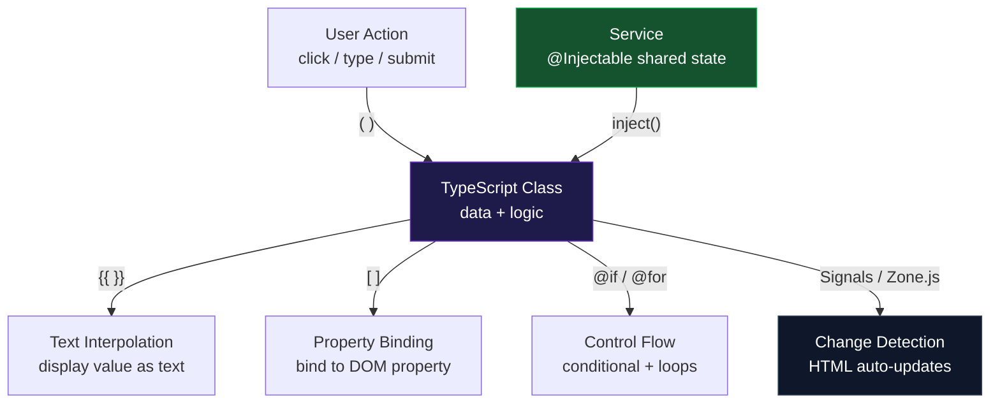

# الفصل الثاني — Angular: من الصفر للبنية الكاملة

> **المتطلبات:** [[01-TypeScript-For-Angular]] — لازم تكون عارف الـ Interfaces والـ Decorators قبل ما تكمل.

---

## البداية — المشكلة اللي Angular جاءت تحلها

خليني أفرض عليك موقف بسيط.

عندك صفحة HTML فيها قائمة أسماء. وعندك زرار "Add Name". لما تضغط الزرار، الاسم يتضاف للقائمة.

```html
<!-- plain HTML + JavaScript -->
<ul id="list"></ul>
<button onclick="addName()">Add Name</button>

<script>
  const names = [];

  function addName() {
    names.push("New Name");

    // now manually update the DOM
    const ul = document.getElementById("list");
    const li = document.createElement("li");
    li.textContent = "New Name";
    ul.appendChild(li);
  }
</script>
```

ده شغّال. بس فيه مشكلة واحدة بتكبر مع الوقت:

**أنت مسؤول عن مزامنة الـ data مع الـ UI يدوياً.**

لما الـ `names` array تتغير — مش بيحصل أي حاجة في الـ UI أوتوماتيك. أنت اللي لازم تقول للـ DOM "اتحدّث". كل تغيير في الـ data = سطر كود تاني تحدّث فيه الـ DOM.

في تطبيق حقيقي فيه عشرات المتغيرات وعشرات الصفحات — ده بيبقى كود هش جداً وصعب الـ maintenance.

**Angular حل المشكلة دي بفكرة واحدة:** ربط الـ data بالـ UI بشكل أوتوماتيك. لما تغيّر متغير في الـ TypeScript — الـ HTML بيتحدث من غيرك.

ده اسمه **Data Binding** — وهو قلب Angular.

> بس قبل ما نوصل لـ Data Binding، محتاجين نفهم الوحدة الأساسية اللي Angular بتبني بيها كل حاجة. إيه هي؟

---

## [[01-What-Is-A-Component]] — "LEGO" بناء الـ UI

Angular بتبني الـ UI من قطع صغيرة اسمها **Components**.

كل Component = وحدة مستقلة عندها:
- **Template** — الـ HTML بتاعها
- **Class** — الـ TypeScript اللي بيمسك الـ data والـ logic
- **Styles** — الـ CSS الخاص بيها

تخيل إنك بتبني صفحة فيها:
- Navbar في الأعلى
- بطاقات بيانات في النص
- Footer في الأسفل

```
┌─────────────────────────────────────┐
│         NavbarComponent             │
├─────────────────────────────────────┤
│  ┌──────────┐  ┌──────────┐         │
│  │  Card    │  │  Card    │  ...    │
│  │Component │  │Component │         │
│  └──────────┘  └──────────┘         │
├─────────────────────────────────────┤
│         FooterComponent             │
└─────────────────────────────────────┘
```

كل صندوق = Component منفصل. الـ `NavbarComponent` مش بيعرف حاجة عن الـ `CardComponent` والعكس. كل واحد مسؤول عن نفسه بس.

**ليه ده مهم؟** لأنك تقدر تعمل `CardComponent` مرة واحدة وتستخدمه في 10 صفحات مختلفة من غير ما تكتبه تاني.

> تمام. عرفنا إن Angular بتبنى من Components. بس إزاي بنعمل Component بالظبط في الكود؟

---

## [[02-Making-A-Component]] — أول component في حياتك

Component في Angular = TypeScript class عليها الـ `@Component` decorator.

```typescript
import { Component } from '@angular/core';

@Component({
  selector: 'app-greeting',
  template: `<h1>Hello, World!</h1>`,
})
export class GreetingComponent {
  // the TypeScript class — data and logic go here
}
```

خليني أشرح كل سطر:

**`import { Component } from '@angular/core'`** — بتجيب الـ `Component` decorator من مكتبة Angular نفسها. من غير الـ import ده، الكود مش هيشتغل.

**`@Component({...})`** — ده الـ decorator اللي اتكلمنا عنه في الفصل الأول. هو اللي بيقول لـ Angular "الـ class دي مش class عادية — دي Component."

**`selector: 'app-greeting'`** — ده الاسم اللي هتستخدمه في أي HTML تاني عشان تعرض الـ component دي. يعني لو كتبت `<app-greeting></app-greeting>` في أي مكان — Angular هيحط محتوى الـ component دي هناك.

**`template: '...'`** — ده الـ HTML بتاع الـ component. ممكن تكتبه inline هنا زي كده، أو في ملف منفصل (هنشوف ده بعدين).

**`export class GreetingComponent {}`** — الـ TypeScript class نفسها. دلوقتي فاضية، بس هنا هتحط الـ data والـ logic.

---

### الـ selector — "اسم الـ Component في الـ HTML"

الـ selector بيحدد إزاي هتستخدم الـ component في الـ HTML:

```typescript
selector: 'app-greeting'
// usage anywhere: <app-greeting></app-greeting>

selector: 'app-user-card'
// usage anywhere: <app-user-card></app-user-card>
```

**ليه بيبدأ بـ `app-`؟**

HTML عنده elements أصلية زي `<button>`, `<input>`, `<div>`. لو سمّيت component بتاعك `<input>` — Angular هيتخبّط مع الـ HTML الأصلي. الـ `app-` prefix بيقول "ده custom element ملكيتي — مش HTML أصلي."

---

### template vs templateUrl — inline ولا ملف منفصل؟

```typescript
// Option 1: inline template (for small components)
@Component({
  selector: 'app-greeting',
  template: `<h1>Hello!</h1>`,
  //         ^ backticks allow multi-line strings
})

// Option 2: separate HTML file (for real components)
@Component({
  selector: 'app-greeting',
  templateUrl: './greeting.component.html',
  //            ^ path to the HTML file
})
```

في المشاريع الحقيقية بتستخدم `templateUrl` دايماً — لأن الـ template بيبقى طويل ومحتاج ملف منفصل.

نفس الكلام بالنسبة للـ CSS:

```typescript
// Option 1: inline styles
styles: [`h1 { color: red; }`]

// Option 2: separate CSS file
styleUrl: './greeting.component.css'
```

---

### `standalone: true` — "Component بدون وصاية"

هتشوف الكلمة دي في كل component حديث:

```typescript
@Component({
  selector: 'app-greeting',
  standalone: true,       // ← this
  template: `<h1>Hello!</h1>`,
})
```

القصة: في Angular القديم (قبل 2022) كل component كان لازم يبقى جوّا حاجة اسمها **NgModule** — زي "مجلد تنظيمي" Angular كان بيطلبه. لو ناسي تضيف component في الـ NgModule — بيطلع error غريب.

من Angular 14 فصاحياً، ممكن تعمل component "مستقلة" من غير NgModule — وده اللي بيعمله `standalone: true`. من Angular 17+، ده بقى الـ default.

> ممتاز. عرفنا إزاي نعمل component. دلوقتي — إزاي نحط فيها data ونعرضها في الـ HTML؟

---

## [[03-Data-In-Component]] — الـ Class والـ Template يتكلموا

الـ TypeScript class هي "المخ" — بتمسك الـ data. الـ template هو "الوش" — بيعرضها.

```typescript
@Component({
  selector: 'app-profile',
  template: `
    <h2>{{ name }}</h2>
    <p>Age: {{ age }}</p>
  `,
})
export class ProfileComponent {
  name = 'Mohamed';   // data lives here
  age  = 25;          // data lives here
}
```

الـ `{{ name }}` و`{{ age }}` دول اللي بيقرأوا الـ data من الـ class ويعرضوها في الـ HTML. ده اسمه **Text Interpolation** — وهو أبسط نوع من الـ Data Binding.

لما قيمة `name` تتغير في الـ class — الـ HTML بيتحدث أوتوماتيك. مش محتاج تعمل حاجة.

---

### إيه اللي يحصل لما Angular تشغّل ده؟

```
                ┌─────────────────────────┐
                │   ProfileComponent      │
  TypeScript    │   name = 'Mohamed'      │
    Class       │   age  = 25             │
                └────────────┬────────────┘
                             │ Angular reads
                             │ the values
                             ▼
                ┌─────────────────────────┐
                │   <h2>Mohamed</h2>       │
  HTML          │   <p>Age: 25</p>         │
  Output        └─────────────────────────┘
```

Angular بيقرأ الـ `{{ name }}`، بيدور على الـ `name` property في الـ class، وبيحط قيمتها في الـ HTML.

> حلو. بس الـ `{{ }}` بتعرض text بس. إيه اللي بيحصل لو محتاج تربط property الـ HTML نفسه بقيمة — زي تـdisable button أو تحدد `src` صورة؟

---

## [[04-Property-Binding]] — `[ ]` — "الربط من TypeScript للـ DOM"

الـ square brackets بتربط قيمة TypeScript بـ **property** في الـ DOM — مش text.

```html
<!-- Disable a button when loading is true -->
<button [disabled]="loading">Submit</button>
<!-- When loading = true  → button is disabled -->
<!-- When loading = false → button is enabled -->

<!-- Set image source dynamically -->

<!-- equivalent to: element.src = imageUrl -->

<!-- Set a link's href -->
<a [href]="profileUrl">View Profile</a>
```

**الفرق بين `{{ }}` و`[ ]`:**

```html
<!-- Text Interpolation — puts a VALUE as text content -->
<p>{{ userName }}</p>
<!-- result: <p>Mohamed</p> -->

<!-- Property Binding — sets an HTML property -->
<input [value]="userName" />
<!-- result: input box pre-filled with "Mohamed" -->
<!-- but if user types something, userName doesn't change — one-way only -->
```

الـ `{{ }}` بتعمل text. الـ `[ ]` بتعمل ربط لـ property.

---

### مثال عملي واضح

```typescript
@Component({
  selector: 'app-submit-btn',
  template: `
    <button [disabled]="isLoading">
      {{ isLoading ? 'Loading...' : 'Submit' }}
    </button>
  `,
})
export class SubmitButtonComponent {
  isLoading = false;

  startLoading() {
    this.isLoading = true;
    // button text changes to "Loading..."
    // button becomes disabled
    // all automatically — no DOM manipulation
  }
}
```

> تمام. عرفنا نبعت data من TypeScript للـ HTML. بس إيه اللي بيحصل لما المستخدم يعمل حاجة في الـ HTML — زي click أو كتابة؟ إزاي الـ HTML يبعت للـ TypeScript؟

---

## [[05-Event-Binding]] — `( )` — "الاستماع للمستخدم"

الـ parentheses بتقول لـ Angular "لما الـ event ده يحصل — استدعي الـ method دي":

```html
<!-- Call submitForm() when button is clicked -->
<button (click)="submitForm()">Submit</button>

<!-- Call onType() on every keystroke -->
<input (input)="onType($event)" />

<!-- Call onEnter() when user presses Enter -->
<input (keyup.enter)="onEnter()" />

<!-- Call onSubmit() when form is submitted -->
<form (ngSubmit)="onSubmit()">...</form>
```

**الـ `$event` — إيه ده؟**

`$event` هو الـ DOM event object نفسه. بيحتوي على معلومات عن اللي حصل:

```typescript
@Component({
  selector: 'app-search',
  template: `<input (input)="onSearch($event)" placeholder="Search..." />`,
})
export class SearchComponent {
  onSearch(event: Event) {
    const input = event.target as HTMLInputElement;
    const value = input.value; // what the user typed
    console.log('User typed:', value);
  }
}
```

---

### الصورة الكاملة — البيانات بتتحرك في الاتجاهين

```
┌─────────────────────────────────────────┐
│            Angular Component             │
│                                          │
│  TypeScript Class                        │
│  ┌──────────────────────┐                │
│  │  name = 'Mohamed'    │ ──[Property   │
│  │  isLoading = false   │   Binding]──► │  HTML Template
│  │                      │               │  <h2>{{ name }}</h2>
│  │  onSubmit() { ... }  │ ◄─(Event  ─── │  <button (click)="onSubmit()">
│  └──────────────────────┘   Binding)    │
└─────────────────────────────────────────┘

[ ] = TypeScript → HTML (one direction)
( ) = HTML → TypeScript (one direction)
{{ }} = TypeScript → HTML as text (one direction)
```

> عارفين ازاي نبعت data للـ HTML وازاي نسمع للـ events. بس فيه حاجة بتحتاجها كتير — إنك تعرض أو تخبي جزء من الـ HTML بناءً على شرط. إزاي؟

---

## [[06-Control-Flow]] — `@if` و`@for` — "المنطق جوّا الـ HTML"

### `@if` — عرض أو إخفاء بناءً على شرط

```html
@if (isLoggedIn) {
  <p>Welcome back!</p>
}
<!-- If isLoggedIn = false → the <p> doesn't exist in the DOM at all -->
<!-- Not just hidden — completely removed -->
```

**مع `@else`:**

```html
@if (isLoggedIn) {
  <button (click)="logout()">Logout</button>
} @else {
  <button (click)="login()">Login</button>
}
```

**مع `@else if`:**

```html
@if (isLoading) {
  <p>Loading...</p>
} @else if (hasError) {
  <p>Something went wrong.</p>
} @else {
  <p>Data loaded!</p>
}
```

**الفرق المهم بين `@if` وبين CSS `display: none`:**

```html
<!-- CSS approach — element EXISTS in DOM, just invisible -->
<div [style.display]="isVisible ? 'block' : 'none'">...</div>
<!-- still runs change detection, still takes memory -->

<!-- @if approach — element does NOT EXIST when condition is false -->
@if (isVisible) {
  <div>...</div>
}
<!-- completely removed — no memory, no change detection -->
```

`@if` أكفأ لأي block معقد.

---

### `@for` — عرض قائمة من البيانات

```typescript
@Component({
  selector: 'app-names-list',
  template: `
    @for (name of names; track name) {
      <li>{{ name }}</li>
    }
  `,
})
export class NamesListComponent {
  names = ['Ali', 'Sara', 'Ahmed', 'Nour'];
}
```

**النتيجة في الـ HTML:**
```html
<li>Ali</li>
<li>Sara</li>
<li>Ahmed</li>
<li>Nour</li>
```

Angular بيكرر الـ `<li>` لكل عنصر في الـ `names` array.

---

**الـ `track` — ليه إجباري؟**

```html
@for (item of items; track item.id) { ... }
```

لما الـ list تتغير (حاجة اتضافت أو اتحذفت) — Angular محتاج يعرف "أيه الـ element اللي اتغيّر بالظبط؟" عشان يحدث بس اللي اتغيّر مش يعيد رسم الـ list كلها من الأول.

الـ `track` بيقوله "استخدم الـ `id` كـ unique identifier لكل عنصر."

```html
<!-- if items have unique IDs — always prefer this -->
@for (item of items; track item.id) { ... }

<!-- if items are simple strings — track by value -->
@for (name of names; track name) { ... }

<!-- if no unique ID exists — track by index (least efficient) -->
@for (item of items; track $index) { ... }
```

---

**متغيرات مجانية جوّا `@for`:**

```html
@for (name of names; track name; let i = $index, let isLast = $last) {
  <li>
    {{ i + 1 }}. {{ name }}
    @if (isLast) { ← last item }
  </li>
}
```

المتغيرات المتاحة:
- `$index` — الترتيب (0، 1، 2 ...)
- `$first` — true للعنصر الأول
- `$last` — true للعنصر الأخير
- `$even` — true للعناصر الزوجية
- `$odd` — true للعناصر الفردية
- `$count` — عدد العناصر الكلي

---

**`@empty` — لما القائمة فاضية:**

```html
@for (name of names; track name) {
  <li>{{ name }}</li>
} @empty {
  <p>No names yet.</p>
}
```

---

### `@switch` — لما عندك حالات كتير

```html
@switch (dayOfWeek) {
  @case ('Saturday') { <p>Weekend!</p> }
  @case ('Sunday')   { <p>Weekend!</p> }
  @case ('Monday')   { <p>Back to work.</p> }
  @default           { <p>Midweek.</p> }
}
```

> ممتاز — عرفنا نعرض data ونسمع للـ events ونتحكم في الـ HTML بالـ logic. بس لحد دلوقتي كل component شايل الـ data بتاعته هو. إيه اللي بيحصل لما عايز component يبعت data لـ component تاني؟

---

## [[07-Dependency-Injection]] — "المخزن المشترك"

### المشكلة أولاً

تخيل عندك component بيعرض اسم المستخدم في الـ Navbar، وcomponent تاني بيعرض اسمه في الـ Profile page.

كل واحد فيهم شايل نسخة من الـ data؟ أولاً ده تكرار. وثانياً لما أحدهم يتغير — التاني مش بيعرف.

الحل: حاجة مشتركة بيهم الاتنين، "مخزن مركزي" بيمسك الـ data، وكل component يسأله عنها.

Angular بيعمل ده من خلال مفهوم اسمه **Dependency Injection** — وأداته الأساسية هي الـ **Service**.

---

### الـ Service — "الخادم المشترك"

**Service** هو TypeScript class عادية — بس Angular بيديرها ويعملها instance واحد ويوزعه على كل component يطلبه.

```typescript
import { Injectable } from '@angular/core';

@Injectable({
  providedIn: 'root',   // ← makes this service available everywhere
})
export class GreetingService {
  message = 'Hello from the service!';

  getGreeting(name: string): string {
    return `Hello, ${name}!`;
  }
}
```

**`@Injectable({ providedIn: 'root' })`** — ده الـ decorator اللي بيقول لـ Angular "الـ class دي service — اتكفل بإنشاءها وتوزيعها."

الـ `providedIn: 'root'` معناها: "اعمل instance واحد بس من الـ service دي، وخليه متاح في كل حتة في التطبيق."

---

### إزاي Component تستخدم Service؟

```typescript
import { Component } from '@angular/core';
import { inject } from '@angular/core';
import { GreetingService } from './greeting.service';

@Component({
  selector: 'app-hello',
  template: `<p>{{ greeting }}</p>`,
  standalone: true,
})
export class HelloComponent {
  private greetingService = inject(GreetingService);
  //                         ^
  // "Angular, give me the GreetingService instance"
  // Angular creates it once, then gives same instance to everyone who asks

  greeting = this.greetingService.getGreeting('Mohamed');
}
```

**`inject(GreetingService)`** — الـ function دي بتقول لـ Angular "أنا محتاج الـ service دي." Angular بيدور في سجله، لو الـ service موجودة يرجعها، لو لأ يعملها الأول.

---

### الـ Singleton — الـ instance الوحيد

```
                     Angular Injector (Registry)
                    ┌──────────────────────────────┐
                    │  GreetingService → instance A │
                    └──────────┬───────────────────┘
                               │
              ┌────────────────┼────────────────┐
              │                │                │
              ▼                ▼                ▼
      NavbarComponent   ProfileComponent   SettingsComponent
    inject(Greeting)   inject(Greeting)   inject(Greeting)
      gets instance A    gets instance A    gets instance A
```

الثلاثة components بيشاركوا **نفس الـ instance**. لو الـ Navbar غيّر `message` في الـ service — الـ Profile والـ Settings بيشوفوا التغيير على طول.

---

### طريقتان لـ Injection

**الطريقة الحديثة — `inject()` function:**

```typescript
export class HelloComponent {
  private greetingService = inject(GreetingService);
  // clean, flat, each service is a named property
}
```

**الطريقة الكلاسيكية — Constructor:**

```typescript
export class HelloComponent {
  constructor(private greetingService: GreetingService) {}
  // same result, different syntax
  // more common in older Angular code
}
```

كلاهما بيوصلك لنفس النتيجة. الـ `inject()` أحدث وأنظف — هتشوفها في كل Angular حديث.

**قاعدة مهمة:** `inject()` لازم تتكتب في "injection context" — يعني في الـ class fields أو في الـ constructor بس. مش جوّا methods:

```typescript
export class MyComponent {
  private service = inject(MyService); // ✅ class field — fine

  doSomething() {
    const s = inject(MyService); // ❌ Error: not in injection context
  }
}
```

> عرفنا الـ Services والـ DI. دلوقتي سؤال مهم: لو غيّرت قيمة في الـ service أو في الـ component — إزاي Angular بيعرف يحدّث الـ HTML؟ مين "الشاهد" اللي بيراقب التغييرات؟

---

## [[08-Change-Detection]] — "من يراقب التغييرات؟"

ده السؤال اللي بيفرق بين فاهم Angular ومش فاهم.

```typescript
export class CounterComponent {
  count = 0;

  increment() {
    this.count++;
    // we just changed count — how does Angular know to update the HTML?
  }
}
```

لو كتبت `this.count++` في JavaScript عادي — مش بيحصل حاجة في الـ UI. أنت اللي بتحدّث الـ DOM يدوياً.

في Angular — الـ HTML بيتحدث أوتوماتيك. بس **كيف**؟

---

### الطريقة القديمة — Zone.js

Angular كان بيستخدم مكتبة اسمها **Zone.js**. الـ Zone.js بتعمل حاجة مجنونة: بتـ"تلف" حول كل الـ async operations في الـ browser:

```
setTimeout    → Zone.js wraps it
click events  → Zone.js wraps it
HTTP calls    → Zone.js wraps it
Promises      → Zone.js wraps it
```

لما أي واحدة من دول تخلص، Zone.js بتصحّي Angular: "في حاجة اتغيّرت — اعمل check."

Angular بعدين بيمشي على كل component ويقارن قيم الـ variables الحالية بالقيم اللي كانت قبل. لو في فرق — يحدّث الـ HTML.

---

### الطريقة الحديثة — Signals (Angular 16+)

الـ Signals هي متغيرات Angular يعرف يراقبها بشكل مباشر — من غير ما يحتاج يـ"يخمّن" إن في تغيير.

```typescript
import { signal } from '@angular/core';

export class CounterComponent {
  count = signal(0); // a "trackable" value
  //      ^^^^^^
  // Angular knows about this value — not a plain variable

  increment() {
    this.count.set(this.count() + 1);
    //         ^^^           ^^^
    // .set() to update     () to read
    // Angular INSTANTLY knows to re-render — no guessing
  }
}
```

```html
<!-- reading a signal in template — notice the () -->
<p>Count: {{ count() }}</p>
```

**الفرق في بساطة:**

| | Plain Variable | Signal |
|---|---|---|
| Angular يعرف التغيير؟ | بالخمن (Zone.js) | مباشرةً |
| كيف تقرأ؟ | `count` | `count()` |
| كيف تغيّر؟ | `count++` | `count.set(count() + 1)` |
| الأداء | يـcheck كل حاجة | يـcheck المحتاج بس |

الـ Signals هم مستقبل Angular. في الفصول الجاية هنتعمق فيهم أكتر.

---

## 🗺️ خريطة الفصل كاملة



---

## ✅ Checkpoint — أسئلة إنترفيو

**س: إيه الفرق بين `{{ }}` و `[ ]`؟**
> `{{ }}` بيحول قيمة TypeScript لـ text ويحطها كمحتوى للـ element. `[ ]` بيربط قيمة TypeScript بـ property في الـ DOM (زي `disabled`, `src`, `href`). الأول للـ text content، التاني للـ HTML properties.

**س: إيه فايدة الـ `track` في `@for`؟**
> بيقول لـ Angular ازاي يعرّف كل عنصر في الـ list. لما القائمة تتغيّر، Angular بيحدّث بس العناصر اللي اتغيّرت فعلاً — مش بيعيد رسم الـ list كلها من الصفر. بيُحسّن الـ performance بشكل كبير.

**س: إيه الـ Service وليه بيبقى Singleton؟**
> الـ Service هو TypeScript class بـ `@Injectable` — Angular بيديره ويعمله instance واحد ويوزّعه على كل component يطلبه. بيبقى Singleton لأن `providedIn: 'root'` بيسجّله في الـ Root Injector المشترك في كل التطبيق. النتيجة: كل component بيشوف نفس الـ data.

**س: إيه الفرق بين Zone.js والـ Signals في الـ Change Detection؟**
> Zone.js بتلف حول كل الـ async operations وبتصحّي Angular "ممكن يكون في تغيير — اعمل check على كل حاجة." الـ Signals هي متغيرات trackable — Angular بيعرف بالضبط امتى اتغيّروا ومين بيستخدمهم، فبيحدّث بس اللي محتاج من غير overhead.

---

## 🛠️ Practical Exercise — من Data للـ UI

### Task 1 — اقرأ وتنبّأ

```typescript
@Component({
  selector: 'app-card',
  standalone: true,
  template: `
    <div>
      <h2>{{ title }}</h2>
      <p>{{ description }}</p>
      <button [disabled]="isSold">
        {{ isSold ? 'Sold Out' : 'Buy Now' }}
      </button>
    </div>
  `,
})
export class CardComponent {
  title       = 'Angular Book';
  description = 'Learn Angular from scratch';
  isSold      = false;
}
```

**بدون ما تشغّل أي code — أجب:**
1. الـ HTML النهائي اللي هيظهر للمستخدم هيبقى إيه؟
2. لو غيّرت `isSold = true` — إيه اللي هيتغير في الـ UI؟
3. لو حبيت تضيف event بيطبع "clicked!" في الـ console لما الزرار يتضغط — هتضيف إيه بالظبط؟

---

### Task 2 — اكمل الناقص

```typescript
@Component({
  selector: 'app-list',
  standalone: true,
  template: `
    <!-- Display the 'title' property as an h1 -->
    ___________

    <!-- Loop over 'items' array, display each item in a <li> -->
    ___________
      <li>___________</li>
    ___________

    <!-- Show "Empty list." when items array is empty -->
    ___________
      <p>Empty list.</p>
    ___________
  `,
})
export class ListComponent {
  title = 'My Favorites';
  items = ['Angular', 'TypeScript', 'RxJS'];
}
```

---

### Task 3 — اكتب Service بسيط

اكتب `StorageService` فيه:
- property `items: string[]` مبدئياً فاضية
- method `add(item: string)` تضيف item للـ array
- method `remove(item: string)` تشيل item من الـ array
- method `getAll()` ترجع الـ array كاملة

```typescript
@Injectable({ providedIn: 'root' })
export class StorageService {
  // your implementation here
}
```

بعدين فكّر: لو component A استدعى `add('Angular')` — وcomponent B استدعى `getAll()` — هيشوف إيه ولماذا؟

---

### Task 4 — Signal vs Plain Variable

```typescript
// Version A — plain variable
export class CounterA {
  count = 0;
  increment() { this.count++; }
}

// Version B — signal
export class CounterB {
  count = signal(0);
  increment() { this.count.set(this.count() + 1); }
}
```

**أجب:**
1. في الـ template — إيه الفرق في طريقة قراءة `count` في الاتنين؟
2. ليه الـ Signals "أذكى" من Angular's perspective؟
3. لو شغّلت Angular بـ Zoneless mode — أيهم هيشتغل صح وأيهم ممكن يبقى فيه مشكلة؟

---

## 🫒 زتونة الإنترفيو

> **"Angular solves the problem of keeping the UI in sync with data. A Component is a self-contained unit with a template, a class, and styles. Data flows from class to template via `{{ }}` and `[ ]`. User actions flow from template to class via `( )`. Shared state lives in Services, which Angular creates once as singletons and distributes via Dependency Injection. Change Detection — classically via Zone.js, modernly via Signals — is how Angular knows when to re-render."**

---

*Next → [[03-Template-Syntax]] — عرفنا الأساسيات. دلوقتي هنتعمق في كل notation في الـ template بالتفصيل — الـ Two-Way Binding والـ Pipes والـ Lifecycle Hooks.*
