# الفصل 2.5 — Control Flow والـ Services والـ Signals: التحكم الكامل

> **المتطلبات:** [[02-Angular-Architecture]] — لازم تعرف الـ Component والـ Data Binding كاملاً قبل ما تبدأ. الفصل ده بيكمل الصورة.

---

## البداية — إيه اللي ناقص؟

في الفصل السابق تعلمنا إزاي نبني Component ونربط الـ data بيها. بس لو فكّرت في أي UI حقيقي، هتلاقي 3 حاجات أساسية ناقصة:

**أولاً:** أنا مش عايز أعرض كل حاجة دايماً. عايز أعرض الـ "Logout" button بس لو المستخدم logged in. عايز أخبي الـ error message لو مفيش error. **محتاج control على هيكل الـ HTML نفسه.**

**ثانياً:** لو عندي 100 product — مش هكتب 100 سطر HTML. **محتاج أكرر element بناءً على data.**

**ثالثاً:** لو الـ `ProductListComponent` و`CartComponent` و`NavbarComponent` كلهم محتاجين يعرفوا عدد items في الـ cart — مش هكتب نفس الـ data في كل component. **محتاج مكان مشترك.**

الثلاثة محاور دي هم موضوع الفصل ده.

> نبدأ بالأول: إزاي نتحكم في هيكل الـ HTML بالـ Control Flow.

---

## [[01-The-Old-Way]] — قبل Angular 17: الـ Structural Directives

قبل ما تفهم `@if` و`@for`، لازم تعرف إن في قديم الزمان (قبل Angular 17) الكود كان بيتكتب بشكل مختلف:

```html
<!-- OLD WAY — Angular 2 to 16 -->
<div *ngIf="isLoggedIn">Welcome back!</div>
<div *ngIf="!isLoggedIn">Please sign in.</div>

<ul>
  <li *ngFor="let item of items; let i = index">{{ i }}. {{ item }}</li>
</ul>

<span [ngSwitch]="status">
  <span *ngSwitchCase="'active'">Active</span>
  <span *ngSwitchCase="'inactive'">Inactive</span>
  <span *ngSwitchDefault>Unknown</span>
</span>
```

الـ `*ngIf`, `*ngFor`, `*ngSwitch` كانوا **Structural Directives** — directives بتغير هيكل الـ DOM.

المشكلة؟ الـ `*` prefix كان confusing، الـ syntax كان verbose، وما كانش في `@else` مباشرة — كنت محتاج تستخدم `<ng-template>`.

من **Angular 17** — جاء **Block Template Syntax** الجديد: `@if`, `@for`, `@switch`. أوضح، أسهل، وأقوى.

---

## [[02-if-block]] — `@if` — "عرض أو إزالة من الوجود"

الـ `@if` بيتحكم في **وجود أو غياب** الـ element في الـ DOM — مش مجرد إظهاره أو إخفائه.

```html
@if (isLoggedIn) {
  <p>Welcome back!</p>
}
```

لو `isLoggedIn = false` — الـ `<p>` مش موجود في الـ DOM خالص. مش `display: none`. مش `visibility: hidden`. ممسوح.

---

### الفرق العميق بين `@if` وبين CSS

ده concept بيحصل فيه confusion كتير:

```html
<!-- Approach 1: CSS hide/show -->
<div [style.display]="isLoggedIn ? 'block' : 'none'">
  <heavy-dashboard></heavy-dashboard>
  <!-- Exists in DOM. Runs change detection. Uses memory. -->
  <!-- Even when "hidden", the component is alive and running -->
</div>

<!-- Approach 2: @if remove/add -->
@if (isLoggedIn) {
  <heavy-dashboard></heavy-dashboard>
  <!-- Does NOT exist in DOM when false -->
  <!-- No memory, no change detection, no lifecycle -->
  <!-- Component is created fresh each time condition becomes true -->
  <!-- Component is destroyed each time condition becomes false -->
}
```

```
                       isLoggedIn = false     isLoggedIn = true
                       ──────────────────     ─────────────────
CSS display:none       DOM: exists (hidden)   DOM: exists (shown)
                       CD: running            CD: running
                       Memory: used           Memory: used

@if                    DOM: not present       DOM: present
                       CD: not running        CD: running
                       Memory: freed          Memory: used
```

**متى تستخدم `@if` ومتى CSS؟**

| الحالة | الأفضل |
|---|---|
| محتوى ثقيل (charts, complex components) | `@if` — يوفر memory |
| Modal أو dialog | `@if` — تُنشأ عند الفتح وتُدمَّر عند الإغلاق |
| Toggle سريع جداً (100ms interval) | CSS — إنشاء/تدمير كل مرة أغلى من الإخفاء |
| Loading skeleton | `@if` — لا تريد الـ skeleton يُعمَّل change detection |

---

### `@if` مع `@else`

```html
@if (isLoggedIn) {
  <button (click)="logout()">Logout</button>
} @else {
  <button (click)="login()">Login</button>
}
```

---

### `@if` مع `@else if` — سلسلة من الحالات

```typescript
@Component({
  selector: 'app-order-status',
  standalone: true,
  template: `
    <div class="status-panel">
      @if (isLoading) {
        <div class="spinner">Loading order details...</div>
      } @else if (error) {
        <div class="error-box">
          <p>❌ Failed to load order: {{ error }}</p>
          <button (click)="retry()">Try Again</button>
        </div>
      } @else if (!order) {
        <p>📭 No order found with this ID.</p>
      } @else if (order.status === 'cancelled') {
        <div class="cancelled-box">
          <p>🚫 This order was cancelled on {{ order.cancelledAt | date }}.</p>
        </div>
      } @else {
        <div class="order-details">
          <h2>Order #{{ order.id }}</h2>
          <p>Status: {{ order.status }}</p>
          <p>Total: {{ order.total | currency:'EGP' }}</p>
        </div>
      }
    </div>
  `,
})
export class OrderStatusComponent {
  isLoading = true;
  error: string | null = null;
  order: any = null;
  // ...
}
```

Angular بيتحقق من الشروط **بالترتيب من فوق لتحت** — أول شرط `true` يتعرض وباقيهم يتجاهلوا.

---

### `@if` والـ Type Narrowing — تضييق النوع

ده ميزة خفية بس قوية جداً.

```typescript
interface Admin {
  name: string;
  permissions: string[];
}

@Component({
  selector: 'app-panel',
  standalone: true,
  template: `
    @if (currentAdmin) {
      <!-- Inside this block: TypeScript KNOWS currentAdmin is Admin (not null) -->
      <h2>Welcome, {{ currentAdmin.name }}</h2>
      <!-- No need for currentAdmin?.name — TypeScript already narrowed the type -->

      @if (currentAdmin.permissions.includes('delete')) {
        <button (click)="deleteAll()">Delete All</button>
      }
    } @else {
      <p>Access denied. Please log in as admin.</p>
    }
  `,
})
export class PanelComponent {
  currentAdmin: Admin | null = null;
}
```

جوّا `@if (currentAdmin)` — TypeScript بيفهم إن `currentAdmin` مش null. تقدر تستخدمه من غير `?.` ومن غير `!`.

---

### `@if` مع القيم المعقدة

```html
<!-- Check array length -->
@if (notifications.length > 0) {
  <div class="notification-badge">{{ notifications.length }}</div>
}

<!-- Check object property -->
@if (user?.role === 'admin') {
  <a routerLink="/admin">Admin Panel</a>
}

<!-- Check two conditions -->
@if (isLoggedIn && hasVerifiedEmail) {
  <p>Full access granted.</p>
}

<!-- Assign to variable in condition (Angular 17+) -->
@if (getUserDetails() as user) {
  <!-- 'user' is the result of getUserDetails() — no re-evaluation -->
  <p>{{ user.name }} — {{ user.email }}</p>
}
```

الـ `as` alias مهم جداً لما بتستدعي method في الـ condition — بيمنع Angular من استدعائها كذا مرة.

> عرفنا نتحكم في عرض أو غياب الـ elements. بس إيه اللي بيحصل لما عندي list من الـ data وعايز أعرضها كلها؟

---

## [[03-for-block]] — `@for` — "تكرار بذكاء"

الـ `@for` بيأخد array ويكرر الـ template لكل عنصر فيها.

```typescript
@Component({
  selector: 'app-city-list',
  standalone: true,
  template: `
    <ul>
      @for (city of cities; track city) {
        <li>{{ city }}</li>
      }
    </ul>
  `,
})
export class CityListComponent {
  cities = ['Cairo', 'Alexandria', 'Giza', 'Aswan'];
}
```

**النتيجة:**
```html
<ul>
  <li>Cairo</li>
  <li>Alexandria</li>
  <li>Giza</li>
  <li>Aswan</li>
</ul>
```

Angular أخد الـ `<li>` template وكرّره 4 مرات — مرة لكل `city` في الـ array.

---

### الـ `track` — الأهم في `@for`

```html
@for (item of items; track item.id) { ... }
```

ده مش optional في Angular 17+ — هو **إجباري**. بس ليه موجود أصلاً؟

خليني أشرح بمثال: تخيل عندك list من 5 items وAngular رسمها:

```html
<li>Item A</li>  ← DOM node #1
<li>Item B</li>  ← DOM node #2
<li>Item C</li>  ← DOM node #3
<li>Item D</li>  ← DOM node #4
<li>Item E</li>  ← DOM node #5
```

بعدين المستخدم حذف "Item C". الـ array بقت `[A, B, D, E]`. Angular محتاج يحدّث الـ DOM.

**بدون `track` (أو بـ `track $index`):**
```
Angular doesn't know which DOM node corresponds to which item
It destroys ALL 5 nodes and creates 4 new ones
Expensive! Animations break! Input focus is lost!
```

**بـ `track item.id`:**
```
Angular knows: item.id=1 → node #1, item.id=2 → node #2, etc.
It removes only node #3 (Item C)
Keeps nodes #1, #2, #4, #5 — just re-renders their content
Cheap! Animations work! Focus preserved!
```

```
Before: [A(id:1), B(id:2), C(id:3), D(id:4), E(id:5)]
After:  [A(id:1), B(id:2),          D(id:4), E(id:5)]

With track by id:
  → Remove only the DOM node for id:3
  → Keep all other nodes untouched

Without track (uses position):
  → Position 3 now has D, position 4 has E
  → Angular sees: content at pos 3 changed (C→D), content at pos 4 changed (D→E)
  → Updates positions 3 and 4, and removes position 5
  → Less efficient AND potentially incorrect with stateful elements
```

---

### كيف تختار قيمة الـ `track`؟

```html
<!-- Best: unique ID from your data source -->
@for (product of products; track product.id) { ... }
@for (user of users; track user._id) { ... }

<!-- For simple primitives (strings/numbers with no duplicates): -->
@for (city of cities; track city) { ... }

<!-- Last resort — when items have no unique identifier: -->
@for (item of dynamicItems; track $index) { ... }
<!-- Warning: if items can be reordered, this causes incorrect behavior -->
<!-- Because position (index) changes even if content doesn't -->
```

---

### متغيرات `@for` المجانية

داخل الـ `@for` block، Angular بيديك متغيرات إضافية مجانية:

```typescript
@Component({
  selector: 'app-leaderboard',
  standalone: true,
  template: `
    <table>
      @for (
        player of players;
        track player.id;
        let i = $index,
            first = $first,
            last = $last,
            even = $even,
            odd = $odd,
            count = $count
      ) {
        <tr
          [class.gold]="i === 0"
          [class.silver]="i === 1"
          [class.bronze]="i === 2"
          [class.striped]="even"
          [class.last-row]="last"
        >
          <td>{{ i + 1 }}</td>
          <td>{{ player.name }}</td>
          <td>{{ player.score }}</td>
          @if (first) {
            <td>🏆 Champion</td>
          } @else if (last) {
            <td>{{ count }} / {{ count }}</td>
          } @else {
            <td>{{ i + 1 }} / {{ count }}</td>
          }
        </tr>
      }
    </table>
  `,
})
export class LeaderboardComponent {
  players = [
    { id: 1, name: 'Ali',   score: 9500 },
    { id: 2, name: 'Sara',  score: 8200 },
    { id: 3, name: 'Ahmed', score: 7100 },
    { id: 4, name: 'Nour',  score: 6400 },
  ];
}
```

| المتغير | النوع | المعنى |
|---|---|---|
| `$index` | `number` | الترتيب (يبدأ من 0) |
| `$first` | `boolean` | `true` للعنصر الأول |
| `$last` | `boolean` | `true` للعنصر الأخير |
| `$even` | `boolean` | `true` للـ indexes الزوجية (0, 2, 4...) |
| `$odd` | `boolean` | `true` للـ indexes الفردية (1, 3, 5...) |
| `$count` | `number` | إجمالي عدد العناصر |

---

### `@empty` — لما الـ Array فاضية

```html
<div class="results">
  @for (result of searchResults; track result.id) {
    <app-result-card [result]="result" />
  } @empty {
    <div class="no-results">
      <p>🔍 No results found for "{{ searchQuery }}"</p>
      <button (click)="clearSearch()">Clear Search</button>
    </div>
  }
</div>
```

الـ `@empty` block بيتعرض تلقائياً لما `searchResults` يكون:
- Array فاضية `[]`
- `null`
- `undefined`

من غيره — كنت هتكتب `@if (results.length === 0)` بشكل منفصل.

---

### Nesting — `@for` جوّا `@for`

```typescript
interface Category {
  id: number;
  name: string;
  items: { id: number; label: string }[];
}

@Component({
  selector: 'app-menu',
  standalone: true,
  template: `
    <nav>
      @for (category of menu; track category.id) {
        <div class="menu-group">
          <h3>{{ category.name }}</h3>
          <ul>
            @for (item of category.items; track item.id) {
              <li>{{ item.label }}</li>
            } @empty {
              <li class="empty">No items in this category.</li>
            }
          </ul>
        </div>
      } @empty {
        <p>Menu is empty.</p>
      }
    </nav>
  `,
})
export class MenuComponent {
  menu: Category[] = [
    {
      id: 1,
      name: 'Electronics',
      items: [
        { id: 11, label: 'Phones' },
        { id: 12, label: 'Laptops' },
      ],
    },
    {
      id: 2,
      name: 'Books',
      items: [
        { id: 21, label: 'Programming' },
        { id: 22, label: 'Design' },
        { id: 23, label: 'Business' },
      ],
    },
  ];
}
```

Angular بيـrender الـ nested loops بشكل فعال — كل مستوى بيتتبّع بـ `track` منفصل.

> فهمنا `@if` و`@for`. فيه حالة تالتة شائعة: لما عندي متغير بياخد قيمة من مجموعة قيم محددة وعايز أعرض حاجة مختلفة لكل قيمة.

---

## [[04-switch-block]] — `@switch` — "الحكم على الحالات"

الـ `@switch` بيقيّم expression مرة واحدة ويقارنه بـ `@case` values:

```typescript
@Component({
  selector: 'app-payment-status',
  standalone: true,
  template: `
    <div class="payment-status">
      @switch (payment.status) {
        @case ('pending') {
          <div class="badge yellow">
            ⏳ Payment pending...
            <p>Usually takes 1-2 business days.</p>
          </div>
        }
        @case ('processing') {
          <div class="badge blue">
            ⚙️ Processing your payment
            <progress [value]="payment.progress" max="100"></progress>
          </div>
        }
        @case ('completed') {
          <div class="badge green">
            ✅ Payment successful!
            <p>Receipt sent to {{ payment.email }}</p>
          </div>
        }
        @case ('failed') {
          <div class="badge red">
            ❌ Payment failed
            <p>Reason: {{ payment.failureReason }}</p>
            <button (click)="retryPayment()">Retry</button>
          </div>
        }
        @case ('refunded') {
          <div class="badge grey">
            🔄 Refunded on {{ payment.refundDate | date }}
          </div>
        }
        @default {
          <div class="badge grey">Unknown status: {{ payment.status }}</div>
        }
      }
    </div>
  `,
})
export class PaymentStatusComponent {
  payment = {
    status: 'processing' as string,
    progress: 65,
    email: 'user@example.com',
    failureReason: '',
    refundDate: null,
  };

  retryPayment() { /* ... */ }
}
```

---

### `@switch` مقابل `@if / @else if` — متى تستخدم أيهم؟

```html
<!-- Use @switch when: checking ONE variable against MULTIPLE specific values -->
@switch (userRole) {
  @case ('admin')    { <admin-panel />    }
  @case ('editor')   { <editor-tools />  }
  @case ('viewer')   { <view-only />     }
  @default           { <guest-view />    }
}
<!-- Clean. Each case is a fixed value. -->

<!-- Use @if/@else if when: complex conditions, ranges, multiple variables -->
@if (score >= 90) {
  <span>A</span>
} @else if (score >= 80) {
  <span>B</span>
} @else if (score >= 70) {
  <span>C</span>
} @else {
  <span>F</span>
}
<!-- Can't do ranges in @switch — @if is better here -->
```

---

### الـ Control Flow القديم — لما تشوفه في مشاريع قديمة

```html
<!-- You will see this in older codebases — know how to read it -->

<!-- Old @if equivalent: -->
<div *ngIf="condition">...</div>
<div *ngIf="condition; else elseBlock">...</div>
<ng-template #elseBlock>...</ng-template>

<!-- Old @for equivalent: -->
<li *ngFor="let item of items; let i = index; let last = last">{{ item }}</li>

<!-- Old @switch equivalent: -->
<div [ngSwitch]="status">
  <span *ngSwitchCase="'active'">Active</span>
  <span *ngSwitchDefault>Unknown</span>
</div>
```

مش محتاج تكتبه — بس لازم تعرف تقراه لما تشوف legacy code.

> خلصنا Control Flow. دلوقتي نوصل لواحدة من أهم الـ concepts في Angular: إزاي نشارك data ولوجيك بين components مختلفة.

---

## [[05-services-why]] — Services: "لماذا يوجد؟"

خليني أضربلك مثال واقعي. عندك 4 components كلهم محتاجين يعرفوا عدد items في الـ cart:

```
┌─────────────────────────────────────────────────────┐
│                    App                              │
│                                                     │
│   ┌──────────────────────────────────────────────┐  │
│   │  Navbar: "Cart (3)"                          │  │
│   └──────────────────────────────────────────────┘  │
│                                                     │
│   ┌──────────────┐     ┌──────────────────────────┐ │
│   │  Product Page│     │  Cart Sidebar            │ │
│   │  + Add to    │     │  Item 1  Item 2  Item 3  │ │
│   │  Cart button │     │  Total: 450 EGP          │ │
│   └──────────────┘     └──────────────────────────┘ │
│                                                     │
│   ┌──────────────────────────────────────────────┐  │
│   │  Checkout Button: "Proceed (3 items)"        │  │
│   └──────────────────────────────────────────────┘  │
└─────────────────────────────────────────────────────┘
```

**الأسلوب الغلط — كل component يمسك نسخته:**

```typescript
// NavbarComponent:
cartCount = 0; // its own copy

// ProductPageComponent:
cartCount = 0; // another copy — not synced with Navbar!

// CartSidebarComponent:
cartItems = []; // yet another separate state

// CheckoutComponent:
itemCount = 0; // another copy
```

لما المستخدم يضيف item في `ProductPage` — الـ Navbar ما تعرفش. الـ Sidebar ما تعرفش. كلهم بيشوفوا قيم مختلفة.

**الأسلوب الصح — Service واحدة:**

```typescript
// CartService — ONE place for cart state
@Injectable({ providedIn: 'root' })
export class CartService {
  items: CartItem[] = [];
  // Every component injects THIS service — same instance — same data
}

// NavbarComponent:
private cart = inject(CartService);
// Reading from cart.items — always up to date

// ProductPageComponent:
private cart = inject(CartService);
// Calling cart.addItem() — updates the SAME cart.items

// CartSidebarComponent:
private cart = inject(CartService);
// Reading cart.items — sees changes made by ProductPage immediately
```

**Service = المكان المشترك للـ data والـ logic.**

---

## [[06-service-anatomy]] — تشريح الـ Service

```typescript
import { Injectable } from '@angular/core';

@Injectable({
  providedIn: 'root',
})
export class CartService {
  // SHARED STATE — all components get the same data
  items: CartItem[] = [];

  // SHARED LOGIC — all components use the same methods
  addItem(item: CartItem): void {
    const existing = this.items.find(i => i.id === item.id);
    if (existing) {
      existing.quantity++;
    } else {
      this.items.push({ ...item, quantity: 1 });
    }
  }

  removeItem(id: string): void {
    this.items = this.items.filter(i => i.id !== id);
  }

  get total(): number {
    return this.items.reduce((sum, i) => sum + i.price * i.quantity, 0);
  }

  get count(): number {
    return this.items.reduce((sum, i) => sum + i.quantity, 0);
  }

  clear(): void {
    this.items = [];
  }
}
```

---

### الـ `@Injectable` Decorator — تشريح كامل

```typescript
@Injectable({
  providedIn: 'root'
  //          ^^^^^^
  // WHERE should Angular register this service?
})
```

الـ `@Injectable` بيعمل حاجتين:
1. بيقول لـ Angular "الـ class دي يمكن inject فيها"
2. بيحدد **أين** Angular يسجّلها في الـ Injector Tree

---

### الـ Injector Tree — "شجرة الخدمات"

Angular مش بيملكش injector واحد — عنده **شجرة من الـ injectors**:

```
Platform Injector (rarest — across multiple Angular apps)
    └── Root Injector (providedIn: 'root' — one instance for whole app)
            └── Environment Injector (lazy loaded routes — new instance per route)
                    └── Component Injector (rare — new instance per component)
```

**`providedIn: 'root'` — الأكثر استخداماً:**

```typescript
@Injectable({ providedIn: 'root' })
export class CartService {}
// ONE instance for the ENTIRE app
// Created once when first requested, reused forever
// Tree-shakeable: if nobody injects it, Angular removes it from the bundle
```

**`providers` array في الـ component — instance خاص:**

```typescript
@Component({
  selector: 'app-widget',
  providers: [WidgetStateService],
  // Creates a NEW instance of WidgetStateService for THIS component
  // and all its children
  // When component is destroyed — the service instance is destroyed too
})
export class WidgetComponent {}
```

ده نادر الاستخدام — بس مهم تعرفه. لما تريد service بتحتفظ بـ state خاص بـ component معين.

---

### التسجيل اليدوي في `app.config.ts`

```typescript
// app.config.ts — for app-wide services
export const appConfig: ApplicationConfig = {
  providers: [
    // Explicit registration (same effect as providedIn: 'root')
    { provide: CartService, useClass: CartService },

    // Provide a different implementation (useful for testing)
    { provide: PaymentService, useClass: MockPaymentService },

    // Provide a value directly
    { provide: 'API_URL', useValue: 'https://api.example.com' },

    // Provide using a factory function
    {
      provide: LoggingService,
      useFactory: () => new LoggingService(environment.production ? 'error' : 'debug'),
    },
  ]
};
```

---

## [[07-inject-function-deep]] — `inject()` — التشريح الكامل

الـ `inject()` function هي الطريقة الحديثة لطلب dependency من Angular:

```typescript
import { inject } from '@angular/core';
import { CartService } from './cart.service';

@Component({ selector: 'app-navbar', standalone: true, template: '' })
export class NavbarComponent {
  private cart = inject(CartService);
  //             ^^^^^^
  // Angular:
  // 1. Reads the type: CartService
  // 2. Looks up the Injector Tree for CartService
  // 3. Finds it in Root Injector (since providedIn: 'root')
  // 4. Returns the existing singleton instance
  // 5. Assigns it to this.cart

  get cartCount() {
    return this.cart.count;
  }
}
```

---

### الـ Injection Context — "متى تقدر تستدعي `inject()`؟"

`inject()` مش بتشتغل في أي مكان. لازم تكون في **injection context**:

```typescript
export class MyComponent {
  // ✅ Class field initializer — injection context
  private service1 = inject(Service1);

  // ✅ Constructor — injection context
  constructor() {
    const service2 = inject(Service2);
    this.doSomething(service2);
  }

  // ✅ Constructor body of a base class
  // ✅ Factory functions passed to Angular APIs

  someMethod() {
    // ❌ NOT an injection context
    const s = inject(SomeService);
    // Error: inject() must be called from an injection context
    // (such as a constructor, a factory function, field initializer, or a function
    // used with `runInInjectionContext`)
  }
}
```

**ليه هذا القيد؟**

لأن الـ Injector بيبقى معروف بس لما Angular بتنشئ الـ class. بعدين، الـ injector مش متاح بشكل مباشر من أي مكان في الكود.

---

### Constructor Injection vs `inject()` — مقارنة عملية

```typescript
// Constructor Injection — classic style
export class ProfileComponent {
  private userService:  UserService;
  private router:       Router;
  private formBuilder:  FormBuilder;
  private titleService: Title;

  constructor(
    userService: UserService,
    router: Router,
    formBuilder: FormBuilder,
    titleService: Title,
  ) {
    this.userService  = userService;
    this.router       = router;
    this.formBuilder  = formBuilder;
    this.titleService = titleService;
  }
  // Problems: repetition, order matters, verbose
}

// Modern shorthand Constructor Injection
export class ProfileComponent {
  constructor(
    private userService:  UserService,
    private router:       Router,
    private formBuilder:  FormBuilder,
    private titleService: Title,
  ) {}
  // Better. But constructor grows with each dependency.
}

// inject() style — cleanest
export class ProfileComponent {
  private userService  = inject(UserService);
  private router       = inject(Router);
  private formBuilder  = inject(FormBuilder);
  private titleService = inject(Title);
  // Each dependency is a named class property
  // No constructor needed
  // No ordering constraints
  // Easy to add/remove
}
```

---

### الـ Singleton — الإثبات العملي

```typescript
@Injectable({ providedIn: 'root' })
export class CounterService {
  value = 0;
  readonly id = Math.random(); // unique ID per instance
}

// ComponentA:
export class ComponentA {
  private counter = inject(CounterService);
  // counter.id = 0.7832 (example)

  increment() { this.counter.value++; }
}

// ComponentB (in a completely different part of the app):
export class ComponentB {
  private counter = inject(CounterService);
  // counter.id = 0.7832 — SAME instance!

  ngOnInit() {
    console.log(this.counter.value);
    // If ComponentA called increment() 3 times → logs 3
    // They share the SAME service instance
  }
}
```

ده هو جوهر الـ Services: نفس الـ instance، نفس الـ data، في كل مكان.

---

### مثال شامل — Service مع الـ Components

```typescript
// notification.service.ts
@Injectable({ providedIn: 'root' })
export class NotificationService {
  private messages: string[] = [];

  add(message: string): void {
    this.messages.push(message);
  }

  getAll(): string[] {
    return [...this.messages];
  }

  clear(): void {
    this.messages = [];
  }

  get count(): number {
    return this.messages.length;
  }
}

// button.component.ts — triggers notifications
@Component({
  selector: 'app-action-button',
  standalone: true,
  template: `<button (click)="doAction()">Do Something</button>`,
})
export class ActionButtonComponent {
  private notifs = inject(NotificationService);

  doAction() {
    // Simulate some work
    this.notifs.add('Action completed successfully!');
    this.notifs.add('Report generated at ' + new Date().toLocaleTimeString());
  }
}

// notification-center.component.ts — displays notifications
@Component({
  selector: 'app-notification-center',
  standalone: true,
  template: `
    <div class="notif-center">
      <h3>Notifications ({{ notifs.count }})</h3>
      @for (msg of notifs.getAll(); track msg) {
        <p>{{ msg }}</p>
      } @empty {
        <p>No notifications.</p>
      }
      @if (notifs.count > 0) {
        <button (click)="notifs.clear()">Clear All</button>
      }
    </div>
  `,
})
export class NotificationCenterComponent {
  notifs = inject(NotificationService);
  // SAME instance as ActionButtonComponent
  // When ActionButton calls notifs.add() → this component sees it immediately
}
```

> عرفنا Services والـ DI بالتفصيل. دلوقتي الـ Services اللي بنا بيها بتستخدم plain properties. بس في مشاكل — لما الـ property تتغيّر في الـ Service، الـ components مش بتعرف أوتوماتيك. الحل؟ Signals.

---

## [[08-signals-deep]] — Signals: "المتغير الذكي"

في الفصل السابق عرفنا `signal()` بشكل مختصر. دلوقتي بنتعمق.

### المشكلة اللي Signals جاءت تحلها

```typescript
@Injectable({ providedIn: 'root' })
export class CartService {
  items: CartItem[] = [];

  addItem(item: CartItem) {
    this.items.push(item);
    // items changed — but Angular doesn't know unless Zone.js fires
    // Or unless you manually call ChangeDetectorRef.markForCheck()
  }
}

// In NavbarComponent:
export class NavbarComponent {
  cart = inject(CartService);
  // Template: {{ cart.items.length }}
  // Problem: when cart.items changes, when does this update?
  // With Zone.js: works (because Zone.js sees the click event that triggered addItem)
  // Without Zone.js (Zoneless): might NOT update — Angular doesn't know
}
```

الـ Signals بتحل ده بإنها "تُعلم" Angular مباشرةً لما قيمتها تتغيّر:

```typescript
@Injectable({ providedIn: 'root' })
export class CartService {
  items = signal<CartItem[]>([]);
  // A "smart" array — Angular is subscribed to it

  addItem(item: CartItem) {
    this.items.update(current => [...current, item]);
    // Signal knows it changed → Angular immediately updates any template reading items()
    // No Zone.js needed. No manual change detection.
  }
}

// In NavbarComponent:
export class NavbarComponent {
  cart = inject(CartService);
  // Template: {{ cart.items().length }}
  //                        ^^
  // Reading the signal — Angular tracks this dependency
  // When items signal changes → this template re-renders automatically
}
```

---

## [[09-signal-api]] — الـ Signal API كاملاً

### `signal()` — إنشاء قيمة reactive

```typescript
import { signal } from '@angular/core';

// Primitive values
const count      = signal(0);
const name       = signal('Mohamed');
const isOpen     = signal(false);
const rating     = signal(4.5);

// Objects
const user       = signal({ name: 'Ali', age: 25 });

// Arrays
const items      = signal<string[]>([]);
const products   = signal<Product[]>([]);

// Nullable
const selected   = signal<Product | null>(null);
```

---

### Reading a Signal

```typescript
// In TypeScript — call like a function
console.log(count());     // 0
console.log(name());      // 'Mohamed'
console.log(items());     // []
console.log(selected());  // null

// In template — same syntax
// {{ count() }}
// {{ name() }}
// @if (selected()) { ... }
// @for (item of items(); track item.id) { ... }
```

**ليه بنكتب `()` لقراءة الـ signal؟**

لأن Angular بيستخدم الـ `()` كـ trigger للـ **dependency tracking**. لما Angular بتـrender الـ template وبتشوف `count()` — بتسجّل: "الـ template ده يعتمد على `count` signal." لما `count` يتغيّر — Angular يعرف تحديداً أيه الـ templates المحتاجة تُعاد رسمها.

لو كان `count` plain variable — Angular ما كانتش تعرف مَن يقرؤه.

---

### Updating a Signal

```typescript
const count = signal(0);
const user  = signal({ name: 'Ali', score: 0 });
const items = signal<string[]>([]);

// .set() — replace the value entirely
count.set(10);
user.set({ name: 'Sara', score: 100 });

// .update() — compute new value from current
count.update(current => current + 1);
// current = current value (0) → returns 1 → count is now 1

count.update(c => c * 2);
// current = 1 → returns 2 → count is now 2

// For objects — immutable update (create new object)
user.update(current => ({
  ...current,       // spread existing properties
  score: current.score + 10  // override specific property
}));
// Creates new object: { name: 'Sara', score: 110 }
// Signal detects: new reference → update templates

// For arrays — immutable update (create new array)
items.update(current => [...current, 'new item']);
// Creates new array with the new item appended
// Signal detects: new reference → update templates

// ❌ WRONG — mutation doesn't trigger update
items().push('new item');
// We pushed to the EXISTING array — same reference
// Signal doesn't detect this change → templates won't update!
```

**قاعدة مهمة للـ Signals:** دايماً اعمل **new reference** عند التحديث. الـ Signal بيشوف "هل الـ reference اتغيّرت؟" — مش محتويات الـ object.

---

## [[10-computed]] — `computed()` — "القيم المشتقة"

الـ `computed()` بيعمل signal قيمته **مشتقة** من signals تانية — وبيتحسب أوتوماتيك لما الـ dependencies تتغيّر:

```typescript
import { signal, computed } from '@angular/core';

const firstName = signal('Mohamed');
const lastName  = signal('Ahmed');
const age       = signal(25);

// Derived values — auto-recalculate when dependencies change
const fullName  = computed(() => `${firstName()} ${lastName()}`);
const isAdult   = computed(() => age() >= 18);
const greeting  = computed(() => `Hello, ${fullName()}! You are ${isAdult() ? 'an adult' : 'a minor'}.`);

// Reading:
console.log(fullName());  // "Mohamed Ahmed"
console.log(greeting());  // "Hello, Mohamed Ahmed! You are an adult."

// Update a dependency:
lastName.set('Ali');
console.log(fullName());  // "Mohamed Ali" — auto-recalculated!
console.log(greeting());  // "Hello, Mohamed Ali! You are an adult."
```

---

### `computed()` في Service — الـ Derived State

```typescript
@Injectable({ providedIn: 'root' })
export class CartService {
  items = signal<CartItem[]>([]);

  // Derived signals — auto-update when items changes
  count = computed(() =>
    this.items().reduce((sum, item) => sum + item.quantity, 0)
  );

  total = computed(() =>
    this.items().reduce((sum, item) => sum + item.price * item.quantity, 0)
  );

  isEmpty = computed(() => this.items().length === 0);

  hasExpensiveItems = computed(() =>
    this.items().some(item => item.price > 1000)
  );
}
```

```html
<!-- In any component that injects CartService: -->
<span class="badge">{{ cart.count() }}</span>
<p>Total: {{ cart.total() | currency:'EGP' }}</p>

@if (cart.isEmpty()) {
  <p>Your cart is empty.</p>
}

@if (cart.hasExpensiveItems()) {
  <p>💎 You have premium items in your cart!</p>
}
```

كل الـ computed values بتتحدث أوتوماتيك لما `items` تتغيّر — من غير أي كود إضافي.

---

### `computed()` — Read-Only

```typescript
const count = signal(0);
const doubled = computed(() => count() * 2);

doubled.set(10); // ❌ TypeScript Error: Property 'set' does not exist on type 'Signal<number>'
doubled.update(v => v + 1); // ❌ Same error

// computed() signals are READ-ONLY
// You change them by changing their dependencies:
count.set(5);       // count = 5
console.log(doubled()); // doubled = 10 (auto-recalculated)
```

---

### Lazy Evaluation — الـ computed "كسول"

```typescript
const expensiveComputed = computed(() => {
  console.log('Computing...');
  return someHeavyCalculation();
});

// The function does NOT run at creation time
// It runs ONLY when someone reads it:
console.log(expensiveComputed()); // "Computing..." then result
console.log(expensiveComputed()); // No "Computing..." — cached! Same dependencies.

// When dependency changes:
dependency.set(newValue);
// computed is marked as "stale" — but NOT recalculated yet

// Next read:
console.log(expensiveComputed()); // "Computing..." — recalculated because stale
```

الـ `computed()` بتكون "stale" لما dependency تتغيّر — بس مش بتحسب غير لما حد يقراها. ده **Lazy Evaluation** وهو بيحسّن الـ performance.

---

## [[11-effect]] — `effect()` — "ردود الفعل الجانبية"

الـ `effect()` بيشغّل function كل ما أي signal بيقراها تتغيّر:

```typescript
import { signal, effect } from '@angular/core';

// Must be called in injection context (constructor or field initializer)
export class ThemeComponent {
  theme = signal<'light' | 'dark'>('light');

  constructor() {
    // effect() runs IMMEDIATELY once (to establish dependencies)
    // then runs again whenever any signal it reads changes
    effect(() => {
      // Angular notes: "this effect reads theme()"
      const currentTheme = this.theme();
      document.body.setAttribute('data-theme', currentTheme);
      console.log('Theme changed to:', currentTheme);
    });
  }

  toggleTheme() {
    this.theme.update(t => t === 'light' ? 'dark' : 'light');
    // → effect runs again automatically
  }
}
```

---

### حالات الاستخدام الصحيحة لـ `effect()`

```typescript
export class AppComponent {
  // 1. Sync state to localStorage
  userPreferences = signal({ theme: 'light', fontSize: 16 });

  constructor() {
    effect(() => {
      localStorage.setItem('prefs', JSON.stringify(this.userPreferences()));
    });

    // 2. Sync to document title
    effect(() => {
      document.title = `${this.pageTitle()} — My App`;
    });

    // 3. Logging/debugging
    effect(() => {
      console.log('[Debug] Cart changed:', this.cartService.items());
    });

    // 4. Trigger analytics
    effect(() => {
      if (this.currentPage()) {
        analytics.trackPageView(this.currentPage());
      }
    });
  }

  pageTitle = signal('Home');
  currentPage = signal('');
  cartService = inject(CartService);
}
```

---

### `effect()` تحذيرات

```typescript
effect(() => {
  // ❌ DON'T update a signal inside an effect that reads it — infinite loop!
  this.count.set(this.count() + 1);
  // This reads count() → effect depends on count
  // Then sets count → count changes → effect runs again → infinite loop!
});

// ✅ If you must update a signal in effect — use allowSignalWrites option:
effect(() => {
  const currentCount = this.count();
  // some logic...
  this.derivedValue.set(currentCount * 2);
}, { allowSignalWrites: true });
// But be careful — this can still cause infinite loops if not designed correctly
```

---

## [[12-toSignal]] — `toSignal()` — جسر RxJS والـ Signals

في الحياة الواقعية، Angular عندها HTTP calls (تُرجع Observables) وعندها Signals. الـ `toSignal()` بيحوّل Observable لـ Signal:

```typescript
import { toSignal } from '@angular/core/rxjs-interop';
import { inject } from '@angular/core';
import { HttpClient } from '@angular/common/http';

@Component({
  selector: 'app-posts',
  standalone: true,
  template: `
    @if (posts()) {
      @for (post of posts()!; track post.id) {
        <article>
          <h3>{{ post.title }}</h3>
          <p>{{ post.body | slice:0:100 }}...</p>
        </article>
      }
    } @else {
      <p>Loading posts...</p>
    }
  `,
})
export class PostsComponent {
  private http = inject(HttpClient);

  // Convert HTTP Observable to Signal
  posts = toSignal(
    this.http.get<Post[]>('https://jsonplaceholder.typicode.com/posts'),
    { initialValue: null }
    // initialValue: what the signal holds BEFORE the Observable emits
    // null means "not loaded yet"
  );
  // posts is now Signal<Post[] | null>
  // No subscribe() needed in TypeScript
  // No unsubscribe() needed — toSignal handles cleanup automatically
  // Template reads posts() — updates when HTTP response arrives
}
```

**مقارنة بدون `toSignal`:**

```typescript
// Without toSignal — manual subscribe
export class PostsComponent implements OnInit, OnDestroy {
  posts: Post[] | null = null;
  private sub!: Subscription;

  ngOnInit() {
    this.sub = this.http.get<Post[]>('...').subscribe(data => {
      this.posts = data;
    });
  }

  ngOnDestroy() {
    this.sub.unsubscribe();
  }
}
// 15 lines. Manual lifecycle. Manual cleanup.

// With toSignal — clean
export class PostsComponent {
  posts = toSignal(this.http.get<Post[]>('...'), { initialValue: null });
}
// 1 line. Automatic cleanup. Works with Zoneless.
```

---

## [[13-signal-inputs]] — `input()` — الـ @Input الجديد

من Angular 17.1، ممكن تعمل component inputs كـ Signals بدل `@Input()`:

```typescript
import { Component, input, output } from '@angular/core';

// OLD WAY:
export class OldCard {
  @Input({ required: true }) title!: string;
  @Input() subtitle = 'No subtitle';
  @Input() isHighlighted = false;
}

// NEW WAY — signal-based inputs:
export class NewCard {
  // Required input — compile error if parent doesn't provide it
  title = input.required<string>();
  // title() reads the current value

  // Optional input with default
  subtitle = input('No subtitle');
  // subtitle() reads the value — 'No subtitle' if not provided by parent

  // Optional typed input
  isHighlighted = input<boolean>(false);
  // isHighlighted() reads the value
}
```

```html
<!-- Parent template — usage is the same: -->
<app-new-card
  [title]="product.name"
  [subtitle]="product.category"
  [isHighlighted]="product.isFeatured"
/>
```

```html
<!-- Child template — reads input like any signal: -->
<div [class.highlighted]="isHighlighted()">
  <h3>{{ title() }}</h3>
  <p>{{ subtitle() }}</p>
</div>
```

**ليه `input()` أفضل من `@Input()`؟**

لأن الـ `input()` بيرجع Signal — يعني ممكن تستخدمه في `computed()` و`effect()`:

```typescript
export class PricedCard {
  price    = input.required<number>();
  quantity = input(1);

  // computed() that depends on signal inputs — auto-updates!
  total = computed(() => this.price() * this.quantity());
}
```

```html
<p>Total: {{ total() | currency }}</p>
<!-- Updates whenever price or quantity inputs change -->
```

مع `@Input()` القديم — كنت محتاج `ngOnChanges` أو getter معقد عشان تعمل نفس الحاجة.

---

## 🗺️ الخريطة الكاملة للفصل

```mermaid
flowchart TD
    A["Control Flow<br/>@if / @for / @switch"] --> A1["@if: exists or doesn't<br/>Type narrowing"]
    A --> A2["@for: loop with track<br/>DOM reconciliation"]
    A --> A3["@switch: match cases<br/>Cleaner than if/else chain"]

    B["Services & DI"] --> B1["Why: shared state & logic"]
    B --> B2["@Injectable providedIn root<br/>Singleton"]
    B --> B3["Injector Tree<br/>Root vs Component scope"]
    B --> B4["inject() function<br/>Injection context rule"]

    C["Signals"] --> C1["signal(): reactive value<br/>.set() .update()"]
    C --> C2["computed(): derived value<br/>Lazy, read-only"]
    C --> C3["effect(): side effects<br/>Runs on dependency change"]
    C --> C4["toSignal(): RxJS bridge<br/>Auto-unsubscribe"]
    C --> C5["input(): signal-based @Input<br/>Works with computed()"]

    A --> D["Complete Angular Component"]
    B --> D
    C --> D

    style D fill:#14532d,color:#fff,stroke:#16a34a
    style A fill:#1e1b4b,color:#fff,stroke:#6d28d9
    style B fill:#1e3a5f,color:#fff,stroke:#2563eb
    style C fill:#3b1a0e,color:#fff,stroke:#ea580c
```



---

## ✅ Checkpoint — أسئلة الإنترفيو

**س: إيه الفرق بين `@if` وبين `[style.display]="condition ? 'block' : 'none'"`؟**
> `@if` بيزيل الـ element من الـ DOM كاملاً لما الشرط يكون false — مفيش memory usage، مفيش change detection. الـ CSS approach بتخبّي الـ element بس هو لسه موجود في الـ DOM ولسه بيستهلك resources. استخدم `@if` للـ content الثقيل والـ CSS للـ toggles السريعة جداً.

**س: ليه `track` إجباري في `@for` وإيه الذي يحدث بدونه؟**
> `track` بيقول لـ Angular إزاي يعرّف كل element في الـ list بـ unique identifier. لما الـ list تتغيّر، Angular يحدّث بس العناصر المتغيّرة ويبقي الباقي. بدون `track` صحيح — Angular ممكن يدمّر ويعيد إنشاء عناصر لم تتغيّر، وهذا مكلف وبيكسر الـ animations والـ focus.

**س: إيه الفرق بين `providedIn: 'root'` وبين `providers: [MyService]` في الـ component؟**
> `providedIn: 'root'` بيسجّل الـ service في الـ Root Injector — instance واحد للتطبيق كله. `providers: [MyService]` في الـ `@Component` بيعمل instance جديد خاص بالـ component ده وأي child منه — بيتدمر لما الـ component يتدمر. استخدم الأول للـ shared state، والثاني للـ isolated state.

**س: إيه الفرق بين `signal()` و `computed()` و`effect()`؟**
> `signal()` = قيمة reactive تقدر تغيّرها بـ `.set()` أو `.update()`. `computed()` = قيمة مشتقة read-only بتُحسب أوتوماتيك من signals تانية. `effect()` = كود بيتنفذ كـ side effect كل ما signal بيقراها تتغيّر — مناسب لـ localStorage sync وlogging وDOM manipulation خارج Angular.

**س: إيه `toSignal()` ولماذا نستخدمها؟**
> `toSignal()` بتحوّل Observable (زي HTTP call) لـ Signal — بدون `subscribe()` يدوي وبدون `unsubscribe()` في `ngOnDestroy`. Angular بتتكفل بالـ cleanup أوتوماتيك لما الـ component يتدمر. النتيجة: كود أقصر، لا memory leaks، وتعمل بشكل صحيح مع Zoneless Angular.

---

## 🛠️ Practical Exercise — التطبيق الكامل

### Task 1 — اقرأ وتنبّأ

```typescript
@Injectable({ providedIn: 'root' })
export class ScoreService {
  scores = signal<number[]>([]);

  highest = computed(() =>
    this.scores().length === 0 ? 0 : Math.max(...this.scores())
  );

  average = computed(() => {
    const list = this.scores();
    if (list.length === 0) return 0;
    return list.reduce((a, b) => a + b, 0) / list.length;
  });

  add(score: number) {
    this.scores.update(current => [...current, score]);
  }
}

@Component({
  selector: 'app-score',
  standalone: true,
  template: `
    @for (score of service.scores(); track $index) {
      <span [class.top]="score === service.highest()">{{ score }}</span>
    } @empty {
      <p>No scores yet.</p>
    }
    <p>Highest: {{ service.highest() }}</p>
    <p>Average: {{ service.average() | number:'1.1-1' }}</p>
    <button (click)="addScore()">Add Score</button>
  `,
})
export class ScoreComponent {
  service = inject(ScoreService);
  private round = 0;

  addScore() {
    this.service.add([85, 92, 78, 95, 88][this.round++ % 5]);
  }
}
```

**بعد ضغط الزرار 3 مرات:**
1. ما هي قيمة `service.scores()`؟
2. ما هي قيمة `service.highest()`؟
3. ما هي قيمة `service.average()`؟
4. أيهم من الـ `<span>` elements هيكون عنده الـ class `top`؟

---

### Task 2 — اكمل الـ Service

```typescript
// Requirements:
// 1. Holds a list of tasks
// 2. Can add a task (with a title)
// 3. Can toggle a task (mark as done/undone)
// 4. Can delete a task
// 5. completedCount — auto-calculated
// 6. pendingCount — auto-calculated
// 7. allDone — true when all tasks are done

interface Task {
  id: number;
  title: string;
  done: boolean;
}

@Injectable({ providedIn: 'root' })
export class TodoService {
  private nextId = 1;

  tasks = signal<Task[]>([]);

  completedCount = computed(() => /* ??? */);
  pendingCount   = computed(() => /* ??? */);
  allDone        = computed(() => /* ??? */);

  add(title: string): void {
    // ??? immutable update
  }

  toggle(id: number): void {
    // ??? find the task and flip its 'done' property
    // remember: immutable update!
  }

  delete(id: number): void {
    // ??? filter out the task with this id
  }
}
```

---

### Task 3 — اكتب Component كاملة

اكتب `TodoAppComponent` يستخدم الـ `TodoService` من Task 2:

```typescript
@Component({
  selector: 'app-todo',
  standalone: true,
  imports: [FormsModule],
  template: `
    <!-- Input to add new task + button -->
    <!-- Show task count: "3 tasks, 1 done" -->
    <!-- Show "All done! 🎉" when allDone is true -->

    <!-- List of tasks: -->
    <!--   Each task shows its title -->
    <!--   Checkbox to toggle done state -->
    <!--   Delete button -->
    <!--   Visual difference for done tasks (strikethrough or opacity) -->

    <!-- @empty: show "No tasks yet. Add one above!" -->
  `,
})
export class TodoAppComponent {
  // inject service, add properties as needed
}
```

---

### Task 4 — Signals vs Service

```typescript
// Version A: state in component
@Component({ selector: 'app-a', standalone: true, template: '...' })
export class ComponentA {
  count = signal(0);
}

// Version B: state in service
@Injectable({ providedIn: 'root' })
export class SharedCountService {
  count = signal(0);
}

@Component({ selector: 'app-b', standalone: true, template: '...' })
export class ComponentB {
  shared = inject(SharedCountService);
}

@Component({ selector: 'app-c', standalone: true, template: '...' })
export class ComponentC {
  shared = inject(SharedCountService);
}
```

**أجب:**
1. لو `ComponentA` غيّر `count` — هل أي component تاني يعرف؟ ليه؟
2. لو `ComponentB` غيّر `shared.count` — هل `ComponentC` يعرف؟ ليه؟
3. لو المستخدم راح لصفحة تانية ورجع — الـ count في أيهم هيبقى محفوظ؟ ليه؟
4. متى تختار Version A ومتى Version B؟

---

## 🫒 زتونة الإنترفيو

> **"Control Flow in Angular uses `@if`, `@for`, and `@switch` to declaratively control the DOM structure — `@if` removes elements entirely (not just hides them), `@for` requires `track` for efficient DOM reconciliation. Services with `@Injectable({ providedIn: 'root' })` create singletons that share state and logic across the entire application via Dependency Injection — `inject()` is the modern API. Signals (`signal`, `computed`, `effect`) make state reactive without Zone.js: Angular tracks which templates read which signals and updates only those templates when a signal changes. `toSignal()` bridges RxJS Observables to Signals with automatic unsubscription."**

---

*Next → [[03-Template-Syntax-and-Lifecycle]] — عارفين Architecture وControl Flow والـ Services والـ Signals. دلوقتي بنتعمق في الـ Template Syntax الكاملة والـ Lifecycle Hooks — متى يتشغّل كل حاجة في حياة الـ Component.*
