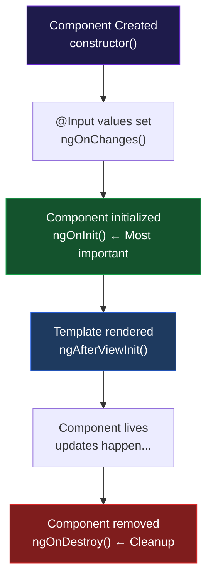
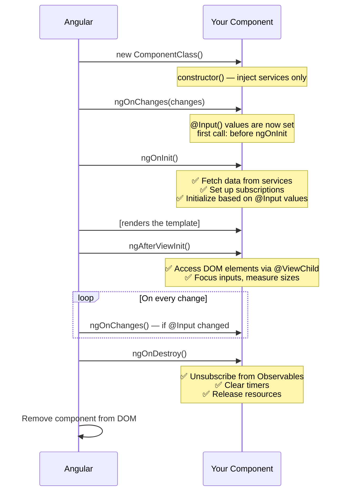

# الفصل الثالث — Template Syntax والـ Lifecycle: لغة التخاطب بين TypeScript والـ HTML

> **المتطلبات:** [[02-Angular-Architecture]] — لازم تعرف الـ Component والـ Class والـ Template قبل ما تبدأ.

---

## البداية — المشكلة اللي كل الـ notations دي جاءت تحلها

في الفصل اللي فات عرفنا إن Angular بتربط الـ TypeScript class بالـ HTML template. بس السؤال اللي بيبقى جوّا دماغك: **إزاي بالظبط؟**

تخيل معايا component بسيط:

```typescript
export class ProfileComponent {
  name     = 'Mohamed';
  age      = 25;
  isOnline = true;
  avatar   = 'https://example.com/photo.jpg';
}
```

وعندي template HTML محتاج:
- يعرض الاسم كـ heading
- يعرض العمر كـ paragraph
- لو `isOnline = true` يضيف CSS class معينة على الـ div
- يحط الـ `avatar` كـ `src` لصورة
- لما user يضغط زرار — يبعت event للـ TypeScript

كل واحدة من المتطلبات دي محتاجة **notation مختلفة** في الـ template. وكل notation موجودة لحل مشكلة محددة.

الفصل ده هو رحلة من أبسط حاجة — عرض text — لأعقد حاجة — إدارة دورة حياة الـ component كاملة.

> نبدأ بأبسط حاجة: عرض قيمة متغير كـ text في الـ HTML.

---

## [[01-Text-Interpolation]] — `{{ }}` — "النافذة على الـ TypeScript"

الـ `{{ }}` هي أبسط ربط ممكن بين الـ TypeScript والـ HTML. بتقول لـ Angular: "اقرأ الـ expression ده من الـ class وحوّله لـ text وحطّه هنا."

```typescript
@Component({
  selector: 'app-profile',
  standalone: true,
  template: `
    <h1>{{ name }}</h1>
    <p>Age: {{ age }}</p>
    <p>Next year: {{ age + 1 }}</p>
    <p>{{ isOnline ? 'Online 🟢' : 'Offline 🔴' }}</p>
    <p>{{ name.toUpperCase() }}</p>
  `,
})
export class ProfileComponent {
  name     = 'Mohamed';
  age      = 25;
  isOnline = true;
}
```

**النتيجة في الـ HTML:**
```html
<h1>Mohamed</h1>
<p>Age: 25</p>
<p>Next year: 26</p>
<p>Online 🟢</p>
<p>MOHAMED</p>
```

لاحظ إن Angular مش بيعرض الـ `{{ }}` بتاعتك — هو بيحل الـ expression الجواها ويعرض النتيجة.

---

### إيه اللي مسموح بيه جوّا `{{ }}`؟

```html
{{ name }}                          <!-- variable value -->
{{ age + 1 }}                       <!-- arithmetic expression -->
{{ firstName + ' ' + lastName }}    <!-- string concatenation -->
{{ isOnline ? 'Yes' : 'No' }}       <!-- ternary operator -->
{{ name.toUpperCase() }}            <!-- method call on a value -->
{{ getFullName() }}                 <!-- calling a class method -->
{{ items.length }}                  <!-- property access -->
```

### إيه اللي **مش** مسموح بيه؟

```html
{{ x = 5 }}      <!-- ❌ assignments — templates are read-only -->
{{ new Date() }} <!-- ❌ 'new' keyword — use a method or pipe instead -->
{{ i++ }}        <!-- ❌ increment/decrement — side effects not allowed -->
```

Angular عمداً بيمنع الـ side effects جوّا الـ `{{ }}` لأن الـ template المفروض يكون **قراءة فقط** — عارض للـ data مش معدّل ليها.

---

### الـ `{{ }}` بتعمل text — بس!

ده المحدودية الأساسية بتاعتها. هي بتعرض القيمة كـ **نص** جوّا الـ element.

بس إيه اللي بيحصل لو محتاج مش أعرض نص — محتاج أربط الـ `src` بتاع صورة، أو أـ`disable` زرار، أو أضيف CSS class؟

```html
<!-- WRONG — won't work as expected -->

<!-- This creates: src="https://..." as a string attribute -->
<!-- But browsers might try to load the image BEFORE Angular processes the {{ }} -->
<!-- And some properties simply don't work with text interpolation at all -->

<button disabled="{{ isLoading }}">Submit</button>
<!-- This ALWAYS disables the button because any non-empty string is truthy -->
<!-- Even disabled="false" still disables the button! -->
```

لازمنا notation تانية بتتعامل مع الـ **properties** مش الـ **text**.

> وده بالظبط اللي جاء يعمله الـ `[ ]`.

---

## [[02-Property-Binding]] — `[ ]` — "ربط TypeScript بخصائص الـ DOM"

الـ square brackets بتربط قيمة من الـ TypeScript class بـ **property** في الـ DOM — مش بـ text content.

الفرق الجوهري:

```
{{ }}  → converts value to STRING and puts it as text content
[ ]    → passes the actual VALUE directly to a DOM property
```

```typescript
@Component({
  selector: 'app-demo',
  standalone: true,
  template: `
    <!-- Bind src to a string variable -->
    

    <!-- Disable button based on boolean -->
    <button [disabled]="isLoading">
      {{ isLoading ? 'Saving...' : 'Save' }}
    </button>

    <!-- Bind href to a string -->
    <a [href]="profileLink">View Profile</a>

    <!-- Set input's value from a variable -->
    <input [value]="defaultName" />
  `,
})
export class DemoComponent {
  avatarUrl   = 'https://example.com/photo.jpg';
  isLoading   = false;
  profileLink = '/users/123';
  defaultName = 'Mohamed';
}
```

---

### الفرق العملي الدقيق بين `{{ }}` و `[ ]`

```html
<!-- Text interpolation — always a string, always text content -->
<p>{{ userName }}</p>
<!-- result: <p>Mohamed</p>  — userName is converted to string -->

<!-- Property binding — passes the actual JavaScript value -->
<input [value]="userName" />
<!-- result: input.value = "Mohamed"  — the actual string, not a text node -->

<!-- The critical difference with booleans: -->
<button disabled="{{ isLoading }}">...</button>
<!-- When isLoading = false → disabled="false" → STILL disabled (non-empty string!) -->

<button [disabled]="isLoading">...</button>
<!-- When isLoading = false → disabled = false (actual boolean) → NOT disabled ✅ -->
```

ده مهم جداً. الـ `[ ]` بتبعت القيمة الفعلية — boolean، object، array — مش string.

---

### Class Binding و Style Binding — تطبيق عملي لـ `[ ]`

من أكتر الاستخدامات اللي هتشوفها كل يوم:

```html
<!-- Add/remove a single CSS class based on condition -->
<div [class.active]="isSelected">Item</div>
<!-- When isSelected = true  → <div class="active"> -->
<!-- When isSelected = false → <div class=""> -->

<!-- Bind multiple classes at once using an object -->
<div [ngClass]="{
  'text-success': isValid,
  'text-danger':  isError,
  'fw-bold':      isImportant
}">Status Message</div>
<!-- Angular adds only the classes whose values are true -->

<!-- Bind a single style property -->
<p [style.color]="isError ? 'red' : 'green'">Result</p>

<!-- Bind a style property with a unit -->
<div [style.font-size.px]="fontSize">Text</div>
<!-- If fontSize = 16 → font-size: 16px -->
```

---

### الـ Attribute Binding — لما الـ Property مش موجودة

بعض الـ HTML attributes مش ليها DOM property مقابلة. زي `colspan` في الـ tables:

```html
<!-- This won't work — 'colspan' is an attribute, not a DOM property -->
<td [colspan]="2">Cell</td>

<!-- Use attr. prefix for HTML attributes -->
<td [attr.colspan]="2">Cell</td>

<!-- Other examples -->
<button [attr.aria-label]="buttonLabel">...</button>
<input [attr.data-testid]="'submit-btn'" />
```

القاعدة: لو Angular بتقولك "can't bind to 'X' — it's not a known property" → جرب `[attr.X]`.

---

### الصورة لحد دلوقتي

```
TypeScript Class
┌──────────────────┐
│  name = 'Ali'    │ ──── {{ name }} ────► <h1>Ali</h1>
│  loading = true  │ ──── [disabled] ───► button is disabled
│  imgUrl = '...'  │ ──── [src] ────────► 
└──────────────────┘
```

الـ data بتتحرك في اتجاه واحد: **من TypeScript للـ HTML**.

بس طيب — إيه اللي بيحصل لما المستخدم يعمل حاجة في الـ HTML؟ يضغط زرار، يكتب في input، يختار من قائمة؟ إزاي الـ HTML يبعت للـ TypeScript؟

> ده اللي جاء يحله الـ `( )`.

---

## [[03-Event-Binding]] — `( )` — "الاستماع لأحداث المستخدم"

الـ parentheses عكس الـ `[ ]` تماماً: بدل ما تبعت data من TypeScript للـ HTML، بتبعت events من الـ HTML للـ TypeScript.

```
TypeScript Class                    HTML Template
┌──────────────────┐               ┌──────────────────┐
│                  │  [property]   │                  │
│   data ──────────┼─────────────► │   displays it    │
│                  │               │                  │
│   method() ◄─────┼─────────────  │   user action    │
│                  │  (event)      │                  │
└──────────────────┘               └──────────────────┘
```

```typescript
@Component({
  selector: 'app-counter',
  standalone: true,
  template: `
    <p>Count: {{ count }}</p>
    <button (click)="increment()">+1</button>
    <button (click)="reset()">Reset</button>
  `,
})
export class CounterComponent {
  count = 0;

  increment() {
    this.count++;
    // Angular detects the change and re-renders the {{ count }}
  }

  reset() {
    this.count = 0;
  }
}
```

كل ما تضغط "+1" — الـ `(click)` event بيستدعي `increment()`. الـ `count` بيتزود. Angular بيشوف التغيير وبيحدّث الـ `{{ count }}` في الـ HTML.

---

### أنواع الـ Events الشائعة

```html
<!-- Mouse events -->
<button (click)="onSubmit()">Submit</button>
<div (mouseover)="onHover()">Hover me</div>
<div (dblclick)="onDoubleClick()">Double click</div>

<!-- Keyboard events -->
<input (keyup)="onKeyUp($event)" />
<input (keyup.enter)="onEnter()" />     <!-- fires ONLY on Enter key -->
<input (keydown.escape)="onEscape()" /> <!-- fires ONLY on Escape key -->

<!-- Input events -->
<input (input)="onInput($event)" />   <!-- fires on EVERY keystroke -->
<input (change)="onChange($event)" /> <!-- fires when input LOSES FOCUS with new value -->
<input (blur)="onBlur()" />           <!-- fires when input loses focus (any reason) -->
<input (focus)="onFocus()" />         <!-- fires when input gains focus -->

<!-- Form events -->
<form (ngSubmit)="onFormSubmit()">...</form>
<!-- (ngSubmit) is Angular's version of (submit) — it prevents page refresh automatically -->
```

---

### الـ `$event` — إيه ده؟

`$event` هو الـ DOM event object بالظبط — نفس اللي JavaScript بيبعته في `addEventListener`. بيحتوي على معلومات عن اللي حصل:

```typescript
@Component({
  selector: 'app-search',
  standalone: true,
  template: `
    <input
      (input)="onType($event)"
      (keyup.enter)="onSearch()"
      placeholder="Search..."
    />
    <p>You typed: {{ searchTerm }}</p>
  `,
})
export class SearchComponent {
  searchTerm = '';

  onType(event: Event) {
    // $event is the DOM InputEvent
    // event.target is the <input> element
    const input = event.target as HTMLInputElement;
    this.searchTerm = input.value;
    // as the user types, searchTerm updates, and {{ searchTerm }} re-renders
  }

  onSearch() {
    console.log('Searching for:', this.searchTerm);
  }
}
```

---

### إرسال معاملات إضافية مع الـ event

```html
<!-- Pass a value directly from the template -->
<button (click)="deleteItem(item.id)">Delete</button>

<!-- Pass both the item AND the event -->
<button (click)="handleClick(item, $event)">Click</button>
```

```typescript
deleteItem(id: string) {
  console.log('Deleting item:', id);
}

handleClick(item: any, event: MouseEvent) {
  console.log('Item:', item);
  console.log('Click position:', event.clientX, event.clientY);
}
```

---

### الـ `[ ]` والـ `( )` معاً على نفس العنصر

Angular بتستخدم الاتنين في نفس الوقت كتير:

```html
<input
  [value]="searchTerm"
  (input)="searchTerm = $event.target.value"
/>
<!-- [value] = TypeScript → HTML (shows current value) -->
<!-- (input) = HTML → TypeScript (updates when user types) -->
```

ده بيخلي الـ input يعرض قيمة `searchTerm` دايماً، وفي نفس الوقت لما المستخدم يكتب — `searchTerm` بيتحدث.

الحالة دي شائعة جداً — لدرجة إن Angular عمل ليها shorthand.

> وده بالظبط اللي هو الـ `[( )]`.

---

## [[04-Two-Way-Binding]] — `[( )]` — "الـ Banana in a Box"

الـ `[( )]` هو اختصار للـ `[property]` + `(event)` في نفس الوقت. الاسم الشعبي بتاعه: **"banana in a box"** — لأن `()` تبان زي موزة جوّا `[]`.

```html
<!-- Long form: -->
<input [value]="username" (input)="username = $event.target.value" />

<!-- Short form — two-way binding: -->
<input [(ngModel)]="username" />
<!-- Exactly the same behavior — just shorter -->
```

لازم `FormsModule` في الـ `imports` عشان `[(ngModel)]` يشتغل:

```typescript
import { FormsModule } from '@angular/forms';

@Component({
  selector: 'app-form',
  standalone: true,
  imports: [FormsModule],  // ← required for [(ngModel)]
  template: `
    <input [(ngModel)]="username" />
    <p>Hello, {{ username }}!</p>
    <!-- as user types, the paragraph updates instantly -->
  `,
})
export class FormComponent {
  username = '';
}
```

---

### متى تستخدم `[(ngModel)]` ومتى لأ؟

```
Template-Driven Forms → use [(ngModel)]
Reactive Forms        → use formControlName (different approach entirely)
```

الـ **Reactive Forms** هي الأقوى والأكثر استخداماً في المشاريع الجدية — وبنشرحها في فصل منفصل. فيه قاعدة واحدة: **لا تخلط الاثنين**. لو بتستخدم Reactive Forms — ما تستخدمش `[(ngModel)]` في نفس الـ form.

---

### خلاصة الـ 4 notations مع بعض

```html
<!-- 1. Text Interpolation — show value as text -->
<p>{{ username }}</p>

<!-- 2. Property Binding — TypeScript → DOM property -->
<input [value]="username" />
<button [disabled]="isLoading">Save</button>

<!-- 3. Event Binding — DOM event → TypeScript method -->
<button (click)="save()">Save</button>
<input (input)="onType($event)" />

<!-- 4. Two-Way Binding — both directions simultaneously -->
<input [(ngModel)]="username" />
```

```
    TypeScript Class
         │  ▲
  [ ] ──►│  │◄── ( )
  {{ }}──►│  │
   [( )] ─┤  ├─ [( )]
         ▼  │
       HTML Template
```

> ممتاز — عرفنا إزاي نعرض data ونسمع للـ events ونعمل two-way sync. دلوقتي محتاجين نتحكم في **هيكل** الـ template نفسه: نعرض أجزاء وتخبي أجزاء تانية بناءً على الـ data. إزاي؟

---

## [[05-Control-Flow-If]] — `@if` — "عرض أو إزالة بناءً على شرط"

لما كنا بنعمل DOM manipulation يدوي، كنا بنكتب:

```javascript
if (isLoggedIn) {
  document.getElementById('menu').style.display = 'block';
} else {
  document.getElementById('menu').style.display = 'none';
}
```

Angular بيعملها بشكل أنيق في الـ template نفسه:

```html
@if (isLoggedIn) {
  <div class="user-menu">
    <p>Welcome back!</p>
    <button (click)="logout()">Logout</button>
  </div>
}
```

لو `isLoggedIn = false` — الـ `<div>` ده **مش موجود في الـ DOM خالص**. مش hidden. مش invisible. ممسوح.

---

### `@if` مع `@else`

```html
@if (isLoggedIn) {
  <button (click)="logout()">Logout</button>
} @else {
  <button (click)="login()">Login</button>
}
```

---

### `@if` مع `@else if` — لما عندك أكتر من حالة

```typescript
@Component({
  selector: 'app-status',
  standalone: true,
  template: `
    @if (isLoading) {
      <p>⏳ Loading data...</p>
    } @else if (hasError) {
      <p>❌ Something went wrong: {{ errorMessage }}</p>
    } @else if (isEmpty) {
      <p>📭 No items found.</p>
    } @else {
      <p>✅ {{ itemCount }} items loaded.</p>
    }
  `,
})
export class StatusComponent {
  isLoading    = false;
  hasError     = false;
  isEmpty      = false;
  errorMessage = '';
  itemCount    = 0;
}
```

Angular بيقيّم الشروط بالترتيب من فوق لتحت. أول شرط `true` هو اللي بيتعرض.

---

### `@if` مع Type Narrowing — تضييق النوع

```typescript
interface User {
  name: string;
  role: 'admin' | 'viewer';
}

@Component({
  selector: 'app-dash',
  standalone: true,
  template: `
    @if (currentUser) {
      <p>Welcome, {{ currentUser.name }}</p>
      <!-- Inside this block, TypeScript KNOWS currentUser is not null -->
      <!-- So currentUser.name is safe — no need for currentUser?.name -->
    } @else {
      <p>Please log in.</p>
    }
  `,
})
export class DashComponent {
  currentUser: User | null = null;
}
```

ده ميزة قوية — Angular's `@if` بيعمل **type narrowing** تلقائياً. جوّا الـ `@if` block، TypeScript عارف إن القيمة مش null.

---

### الفرق المهم بين `@if` و CSS

```html
<!-- CSS approach — element EXISTS in DOM, just invisible -->
<div [style.display]="isVisible ? 'block' : 'none'">Heavy content...</div>
<!-- Problem: the component is still created, still runs change detection,
     still takes memory — even when invisible -->

<!-- @if approach — element does NOT EXIST when false -->
@if (isVisible) {
  <div>Heavy content...</div>
}
<!-- When false: no DOM node, no change detection, no memory usage -->
```

القاعدة: استخدم `@if` لأي content ممكن يكون absent لفترات طويلة. استخدم CSS `hidden` بس لما الـ toggle بيحصل كتير جداً وسريع.

> فهمنا التحكم في الـ elements الفردية. بس إيه اللي بيحصل لما عندي **قائمة** من البيانات وعايز أعرضها كلها؟

---

## [[06-Control-Flow-For]] — `@for` — "تكرار لكل عنصر في القائمة"

بدل ما تكتب `<li>` لكل عنصر يدوياً — Angular بيكررها أوتوماتيك:

```typescript
@Component({
  selector: 'app-names',
  standalone: true,
  template: `
    <ul>
      @for (name of names; track name) {
        <li>{{ name }}</li>
      }
    </ul>
  `,
})
export class NamesComponent {
  names = ['Ali', 'Sara', 'Ahmed', 'Nour'];
}
```

**النتيجة:**
```html
<ul>
  <li>Ali</li>
  <li>Sara</li>
  <li>Ahmed</li>
  <li>Nour</li>
</ul>
```

Angular أخد الـ `<li>` template ده وكرّره 4 مرات — مرة لكل عنصر في الـ `names` array.

---

### الـ `track` — ليه إجباري؟

```html
@for (item of items; track item.id) { ... }
```

لما الـ list تتغيّر (حاجة اتضافت، اتحذفت، أو اتغيّرت) — Angular محتاج يعرف "أيه الـ item اللي اتغيّر بالظبط؟" عشان يحدّث بس اللي محتاج مش يمسح الـ DOM كله ويعيد رسمه من الصفر.

```
Before change: [A, B, C, D]
After change:  [A, B, X, D]   ← only C changed to X

Without track: destroy all 4 <li> elements, create 4 new ones ← expensive
With track:    find the <li> for C, update it to X ← cheap
```

```html
<!-- Best: track by unique ID from database -->
@for (product of products; track product.id) { ... }

<!-- If no ID: track by the value itself (only for primitives like strings/numbers) -->
@for (name of names; track name) { ... }

<!-- Last resort: track by position in array (if items can be reordered, this is wrong) -->
@for (item of items; track $index) { ... }
```

---

### المتغيرات المجانية داخل `@for`

```html
@for (item of items; track item.id; let i = $index, let first = $first, let last = $last) {
  <div
    [class.first-item]="first"
    [class.last-item]="last"
  >
    {{ i + 1 }}. {{ item.name }}

    @if (last) {
      <span>← last item</span>
    }
  </div>
}
```

| المتغير | المعنى |
|---|---|
| `$index` | رقم الـ element (يبدأ من 0) |
| `$first` | `true` للعنصر الأول |
| `$last` | `true` للعنصر الأخير |
| `$even` | `true` للعناصر ذات الـ index الزوجي (0, 2, 4) |
| `$odd` | `true` للعناصر ذات الـ index الفردي (1, 3, 5) |
| `$count` | إجمالي عدد العناصر |

---

### `@empty` — لما القائمة فاضية

ده حاجة دايماً محتاجها — عرض "No results" لما الـ array فاضية:

```html
<ul>
  @for (task of tasks; track task.id) {
    <li>{{ task.title }}</li>
  } @empty {
    <li>No tasks yet. Add one!</li>
  }
</ul>
```

بدون `@empty` كنت محتاج تكتب:
```html
@if (tasks.length === 0) {
  <li>No tasks yet.</li>
}
```

الـ `@empty` أنظف وأوضح في القصد.

---

### `@for` مع Objects

```typescript
interface Product {
  id: number;
  name: string;
  price: number;
  inStock: boolean;
}

@Component({
  selector: 'app-products',
  standalone: true,
  template: `
    <div class="grid">
      @for (product of products; track product.id) {
        <div class="card">
          <h3>{{ product.name }}</h3>
          <p>{{ product.price }} EGP</p>

          @if (product.inStock) {
            <button (click)="addToCart(product)">Add to Cart</button>
          } @else {
            <span>Out of Stock</span>
          }
        </div>
      } @empty {
        <p>No products available.</p>
      }
    </div>
  `,
})
export class ProductsComponent {
  products: Product[] = [
    { id: 1, name: 'Laptop',  price: 25000, inStock: true  },
    { id: 2, name: 'Mouse',   price: 350,   inStock: true  },
    { id: 3, name: 'Monitor', price: 8000,  inStock: false },
  ];

  addToCart(product: Product) {
    console.log('Added:', product.name);
  }
}
```

لاحظ إزاي ركّبنا `@for` مع `@if` جوّاه — Angular بيسمح بـ nesting لا نهائي.

> شرحنا الشرط البسيط `@if` والتكرار `@for`. بس أحياناً بيكون عندي متغير ممكن ياخد قيمة من 4 أو 5 قيم — مش بس true/false. المنطق بيبقى كأنه switch. إيه الحل؟

---

## [[07-Control-Flow-Switch]] — `@switch` — "لما الحالات أكتر من اتنين"

```typescript
@Component({
  selector: 'app-order',
  standalone: true,
  template: `
    <div class="status-badge">
      @switch (orderStatus) {
        @case ('pending') {
          <span class="badge yellow">⏳ Pending</span>
        }
        @case ('processing') {
          <span class="badge blue">⚙️ Processing</span>
        }
        @case ('shipped') {
          <span class="badge purple">🚚 Shipped</span>
        }
        @case ('delivered') {
          <span class="badge green">✅ Delivered</span>
        }
        @case ('cancelled') {
          <span class="badge red">❌ Cancelled</span>
        }
        @default {
          <span class="badge grey">❓ Unknown</span>
        }
      }
    </div>
  `,
})
export class OrderComponent {
  orderStatus = 'processing';
}
```

لو كتبت ده بـ `@if / @else if` — هيبقى:

```html
@if (orderStatus === 'pending')    { ... }
@else if (orderStatus === 'processing') { ... }
@else if (orderStatus === 'shipped')    { ... }
<!-- ... and so on -->
```

الـ `@switch` أنظف وأوضح لما الشروط كلها على نفس المتغير.

> الـ 3 control flow blocks غطّوا كيف نتحكم في الـ structure. دلوقتي عندنا حاجة مختلفة: أحياناً محتاج أمسك reference لـ element في الـ HTML من الـ TypeScript — عشان مثلاً أعمله focus أو أقرأ قيمته. إزاي؟

---

## [[08-Template-Reference-Variables]] — `#` — "اسم لـ element في الـ HTML"

الـ `#` بيديك reference مباشرة لـ DOM element أو Angular component من جوّا الـ template:

```html
<!-- Create a reference named 'emailBox' pointing to this input -->
<input #emailBox type="email" placeholder="Enter email" />

<!-- Now use it anywhere in the same template -->
<button (click)="console.log(emailBox.value)">Log Value</button>
<p>Current value: {{ emailBox.value }}</p>
```

الـ `emailBox` هنا هو الـ `HTMLInputElement` نفسه — مش string، مش Angular wrapper — الـ DOM element الحقيقي. تقدر تستدعي عليه أي property أو method بتاع الـ `HTMLInputElement`.

---

### استخدام عملي — focus تلقائي

```html
<input #searchInput type="text" placeholder="Search..." />
<button (click)="searchInput.focus()">Focus Search</button>
<!-- When button is clicked, the input gets keyboard focus -->
<!-- No TypeScript code needed — all in the template -->
```

---

### إرسال الـ Reference كـ parameter

```typescript
@Component({
  selector: 'app-form',
  standalone: true,
  template: `
    <input #nameInput type="text" />
    <button (click)="greet(nameInput)">Greet</button>
  `,
})
export class FormComponent {
  greet(inputEl: HTMLInputElement) {
    alert('Hello, ' + inputEl.value + '!');
    inputEl.value = ''; // clear the input after greeting
  }
}
```

---

### `@ViewChild` — الـ Reference في الـ TypeScript نفسه

الـ `#` بيديك الـ reference في الـ **template**. لو عايزه في الـ **TypeScript class** — بتستخدم `@ViewChild`:

```typescript
import { ViewChild, ElementRef, AfterViewInit } from '@angular/core';

@Component({
  selector: 'app-login',
  standalone: true,
  template: `
    <input #emailInput type="email" placeholder="Email" />
    <button (click)="submit()">Login</button>
  `,
})
export class LoginComponent implements AfterViewInit {
  @ViewChild('emailInput') emailInput!: ElementRef<HTMLInputElement>;
  //           ^                ^
  // the name in #emailInput    the TypeScript property

  ngAfterViewInit() {
    // After the template is rendered, focus the email input automatically
    this.emailInput.nativeElement.focus();
  }
}
```

الـ `!` بعد `emailInput` هنا لأن Angular بيضيف القيمة في `ngAfterViewInit` مش في الـ constructor — وده اللي سنشرحه في الـ Lifecycle Hooks.

> وده يودّينا بشكل طبيعي للموضوع التالي. ذكرنا `ngAfterViewInit` — بس إيه ده وإيه باقي الـ hooks؟ بس قبل كده، فيه أداة مهمة جداً في الـ template نفسها محتاجين نشرحها: الـ Pipes.

---

## [[09-Pipes]] — "المصفاة" بين الـ Data والـ Display

الـ data في الـ TypeScript كتير ما بتبقاش بالشكل اللي عايزه يتعرض للمستخدم. مثلاً:

- `createdAt = '2024-01-15T10:30:00Z'` → المستخدم عايز يشوف `Jan 15, 2024`
- `price = 29.99` → المستخدم عايز يشوف `$29.99`
- `title = 'clean code'` → المستخدم عايز يشوف `Clean Code`

بدل ما تعمل conversion في الـ TypeScript وتخزّن نسخة تانية من الـ data — Angular عنده **Pipes**: transformations بتحصل مباشرةً في الـ template وقت العرض، من غير ما تغيّر الـ data الأصلية.

```html
{{ value | pipeName }}
{{ value | pipeName:argument }}
{{ value | pipe1 | pipe2 }}  <!-- chaining -->
```

---

### الـ Built-in Pipes

```html
<!-- Date formatting -->
{{ createdAt | date }}                   <!-- Jan 15, 2024 -->
{{ createdAt | date:'dd/MM/yyyy' }}      <!-- 15/01/2024 -->
{{ createdAt | date:'EEEE, MMMM d' }}    <!-- Monday, January 15 -->

<!-- Currency -->
{{ price | currency }}                   <!-- $29.99 (default: USD) -->
{{ price | currency:'EGP' }}             <!-- EGP 29.99 -->
{{ price | currency:'EGP':'symbol':'1.0-0' }} <!-- EGP 30 (no decimals) -->

<!-- Text case -->
{{ name | uppercase }}    <!-- MOHAMED ALI -->
{{ name | lowercase }}    <!-- mohamed ali -->
{{ name | titlecase }}    <!-- Mohamed Ali -->

<!-- Numbers -->
{{ 1234567 | number }}         <!-- 1,234,567 -->
{{ 3.14159 | number:'1.2-2' }} <!-- 3.14 (min 1 digit, 2-2 decimal places) -->

<!-- Slice -->
{{ longText | slice:0:100 }}   <!-- first 100 characters -->
{{ items | slice:0:5 }}        <!-- first 5 items from array -->

<!-- JSON — extremely useful for debugging -->
{{ myObject | json }}          <!-- { "name": "Ali", "age": 25 } -->
```

---

### الـ `async` Pipe — الأهم على الإطلاق

ده الـ pipe اللي هتستخدمه كل يوم لما تجيب data من الـ backend.

فيه مفهوم اسمه **Observable** — هنشرحه بالتفصيل في فصل RxJS. بس بالاختصار: هو "وعد" بداتا هتيجي في المستقبل (من HTTP request مثلاً).

```typescript
// Without async pipe — manual subscribe in TypeScript
export class ProductsComponent implements OnInit, OnDestroy {
  products: Product[] = [];
  private sub!: Subscription;

  ngOnInit() {
    this.sub = this.productService.getProducts().subscribe(data => {
      this.products = data; // store the data when it arrives
    });
  }

  ngOnDestroy() {
    this.sub.unsubscribe(); // must manually clean up!
  }
}
```

```html
@for (product of products; track product.id) {
  <div>{{ product.name }}</div>
}
```

---

```typescript
// With async pipe — no subscribe, no unsubscribe, no stored variable
export class ProductsComponent {
  products$ = this.productService.getProducts();
  // the $ suffix is a convention: means "this is an Observable"
  // we don't subscribe — we let the template handle it
}
```

```html
@for (product of (products$ | async) ?? []; track product.id) {
  <div>{{ product.name }}</div>
}
<!-- async pipe:
     1. subscribes to the Observable
     2. shows nothing until data arrives
     3. re-renders when data arrives
     4. automatically unsubscribes when component is destroyed — no memory leak! -->
```

الـ `?? []` معناها: "لو الـ value لسه `null` (قبل ما الـ data تيجي) — استخدم array فاضية بدلاً منها" — عشان `@for` ما يوقعش.

الـ `async` pipe هو سبب بيتذكّر كتير من الـ Angular developers ليه بيحبوا Angular.

---

### Custom Pipes — لما الـ Built-in مش كفاية

```typescript
import { Pipe, PipeTransform } from '@angular/core';

@Pipe({
  name: 'truncate',  // the name used in templates: {{ text | truncate:50 }}
  standalone: true,
})
export class TruncatePipe implements PipeTransform {
  transform(value: string, limit: number = 100): string {
    if (value.length <= limit) return value;
    return value.slice(0, limit) + '...';
  }
}
```

```html
<!-- Usage: -->
{{ description | truncate:80 }}
<!-- If description is longer than 80 chars, it gets cut with "..." -->
```

> ممتاز. انتهينا من كل الـ template syntax. الآن فيه سؤال عملي مهم: كل الأمثلة اللي فاتت افترضنا إن الـ data موجودة في الـ class من الأول. بس في الواقع — الـ component بيمر بـ "مراحل حياة": بييجي للوجود، بيتحدّث، وبيموت. وكل مرحلة فيها وقت مناسب لتشغيل كود معين. ده اللي بيعالجه الـ Lifecycle.

---

## [[10-Lifecycle-Hooks]] — "دورة حياة الـ Component"

كل component في Angular بيمر بمراحل: بيتخلق، بيتعرض، بيتحدّث، وبيتحذف. Angular بيديك **hooks** — methods بيستدعيها في كل مرحلة لو كتبتها في الـ class.



---

## [[11-Constructor]] — "الميلاد" — بس للـ Injection فقط

```typescript
import { Component } from '@angular/core';
import { inject } from '@angular/core';

export class LoginComponent {
  private userService = inject(UserService);
  //                    ^^^^^
  // inject() runs during class field initialization
  // which is equivalent to running in the constructor
  // This is the ONLY thing the constructor-phase is for

  constructor() {
    // At this point:
    // ✅ Services are injected
    // ❌ @Input() values are NOT yet set
    // ❌ Template is NOT yet rendered
    // ❌ @ViewChild references are NOT available

    // ✅ OK: injecting services (but prefer inject() in class fields)
    // ❌ NOT OK: calling APIs, accessing DOM, reading @Input values
  }
}
```

قاعدة بسيطة: الـ **constructor** للـ injection فقط. كل حاجة تانية في `ngOnInit`.

> بس ليه؟ ليه مش نحط كل حاجة في الـ constructor؟

لأن Angular بيعمل الـ object في الـ constructor — بس الـ object مش جاهز بالكامل لحد ما `ngOnInit` تتنفذ. الـ `@Input` values مش بتتضبط غير بعد الـ constructor. والـ template مش بتتعمل render غير بعد `ngOnInit`.

---

## [[12-ngOnInit]] — "الاستعداد للعمل" — أهم hook على الإطلاق

```typescript
import { OnInit } from '@angular/core';

export class ProfileComponent implements OnInit {
  // Tells TypeScript: "this class must have ngOnInit()"
  // Not required, but good practice for documentation

  userName  = '';
  userScore = 0;

  private userService = inject(UserService);

  ngOnInit() {
    // Called ONCE after Angular fully initializes the component
    // At this point:
    // ✅ @Input() values ARE set
    // ✅ Services ARE available
    // ❌ Template is NOT yet rendered (@ViewChild not available yet)

    // Perfect for:
    // ✅ Fetching data from a service/API
    // ✅ Setting up subscriptions
    // ✅ Complex initialization that depends on @Input values

    this.userName  = this.userService.getName();
    this.userScore = this.userService.getScore();
  }
}
```

---

### مثال واقعي — component بيجيب data عند الـ init

```typescript
interface Post {
  id: number;
  title: string;
  body: string;
}

@Component({
  selector: 'app-post-list',
  standalone: true,
  template: `
    @if (isLoading) {
      <p>Loading posts...</p>
    } @else {
      @for (post of posts; track post.id) {
        <div class="post-card">
          <h3>{{ post.title }}</h3>
          <p>{{ post.body | slice:0:100 }}...</p>
        </div>
      } @empty {
        <p>No posts found.</p>
      }
    }
  `,
})
export class PostListComponent implements OnInit {
  posts: Post[] = [];
  isLoading = true;

  private postService = inject(PostService);

  ngOnInit() {
    // Fetch posts when component is ready
    this.postService.getPosts().subscribe(data => {
      this.posts     = data;
      this.isLoading = false;
    });
    // subscribe() and Observables are covered in detail in the RxJS chapter
  }
}
```

---

## [[13-ngOnChanges]] — "لما الـ Input يتغير"

الـ `ngOnChanges` بيتنفذ **قبل** `ngOnInit` وكمان **كل مرة** تتغيّر فيها `@Input()` property.

عشان تفهم ده محتاج تعرف الـ `@Input()` — اللي هو طريقة component يستقبل data من component أعلى منه. بنشرحه بالتفصيل في فصل Component Communication. بس الجوهر:

```typescript
// Parent template sends a value:
// <app-card [title]="selectedTitle"></app-card>

// Child component receives it via @Input:
export class CardComponent implements OnChanges {
  @Input() title = '';
  //^^^^^
  // This property receives its value from the parent

  ngOnChanges(changes: SimpleChanges) {
    // Called every time 'title' changes in the parent
    // Also called once BEFORE ngOnInit on first render

    if (changes['title']) {
      const before = changes['title'].previousValue;
      const after  = changes['title'].currentValue;
      const isFirst = changes['title'].firstChange;

      console.log(`Title changed: "${before}" → "${after}"`);
      console.log('Is this the first time?', isFirst);
    }
  }
}
```

---

### تحذير مهم — `ngOnChanges` مش بيشتغل مع mutations

```typescript
// In parent:
this.user.name = 'New Name';
// ❌ ngOnChanges in child WILL NOT fire
// Angular compares object references, not their content
// The reference to 'user' didn't change — just something inside it

this.user = { ...this.user, name: 'New Name' };
// ✅ ngOnChanges WILL fire — we created a NEW object reference
```

ده مبدأ مهم اسمه **Immutability** — وهو أحد أسباب إن الـ Signals أبسط في التعامل.

---

## [[14-ngOnDestroy]] — "قبل الرحيل — نظّف وراك"

```typescript
import { OnDestroy } from '@angular/core';
import { Subscription } from 'rxjs';

export class LiveFeedComponent implements OnInit, OnDestroy {
  messages: string[] = [];
  private feedSubscription!: Subscription;

  ngOnInit() {
    // Subscribe to a live feed of messages
    this.feedSubscription = this.feedService.messages$.subscribe(msg => {
      this.messages.push(msg);
    });
    // every time a new message arrives, it gets added to the list
  }

  ngOnDestroy() {
    // Called ONCE just before Angular removes this component from the DOM
    // CRITICAL: clean up your subscriptions here

    this.feedSubscription.unsubscribe();
    // Without this — even after the component is gone from the screen:
    // - the subscription is still alive
    // - every new message still runs the callback
    // - the callback holds a reference to this component
    // - the component never gets garbage collected → MEMORY LEAK
  }
}
```

---

### تصوير الـ memory leak بيحصل إزاي

```
User navigates to /feed → LiveFeedComponent created → subscription started
User navigates to /home → LiveFeedComponent REMOVED from DOM

Without ngOnDestroy cleanup:
  feedService.messages$ still has the callback registered
  The callback still references the LiveFeedComponent object
  LiveFeedComponent can NOT be garbage collected
  New messages still run the dead component's callback
  User navigates back and forth 10 times → 10 dead components in memory
  App gets slower and slower → eventual crash
```

```
With ngOnDestroy cleanup:
  feedSubscription.unsubscribe()
  feedService.messages$ releases the callback reference
  LiveFeedComponent has no more references → garbage collected ✅
```

---

### تنظيف Timer كمان مهم

```typescript
export class ClockComponent implements OnInit, OnDestroy {
  currentTime = '';
  private timer!: ReturnType<typeof setInterval>;

  ngOnInit() {
    this.timer = setInterval(() => {
      this.currentTime = new Date().toLocaleTimeString();
    }, 1000);
  }

  ngOnDestroy() {
    clearInterval(this.timer);
    // Without this, the interval keeps running every second
    // even after the component is gone from the screen
  }
}
```

---

## [[15-ngAfterViewInit]] — "بعد ما الـ Template يتعمل Render"

كل الـ hooks السابقة بتتنفذ قبل ما الـ template يتعمل render. `ngAfterViewInit` بيتنفذ **بعد** ما Angular رسم الـ template وكل الـ child components.

```typescript
import { AfterViewInit, ViewChild, ElementRef } from '@angular/core';

@Component({
  selector: 'app-search-page',
  standalone: true,
  template: `
    <h1>Search</h1>
    <input #searchInput type="text" placeholder="Type to search..." />
  `,
})
export class SearchPageComponent implements AfterViewInit {
  @ViewChild('searchInput') searchInput!: ElementRef<HTMLInputElement>;

  ngAfterViewInit() {
    // Called ONCE after the template is fully rendered
    // NOW @ViewChild references are available — the DOM elements exist

    this.searchInput.nativeElement.focus();
    // Auto-focus the search input when the page loads
    // This works because the <input> element now EXISTS in the DOM
  }
}
```

---

### ليه مش ممكن نعمل ده في `ngOnInit`؟

```typescript
ngOnInit() {
  // At this point, the template is NOT rendered yet
  // The <input> element does NOT exist in the DOM yet
  this.searchInput.nativeElement.focus();
  // ❌ ERROR: Cannot read properties of undefined
  // searchInput is undefined — @ViewChild hasn't found the element yet
}

ngAfterViewInit() {
  // Template IS rendered — element EXISTS
  this.searchInput.nativeElement.focus();
  // ✅ Works perfectly
}
```

---

## 🗺️ خريطة الـ Lifecycle كاملة



---

## ✅ Checkpoint — جدول مرجعي للـ Hooks

| Hook | متى | استخدمه لـ |
|---|---|---|
| `constructor` | أول حاجة تحصل | Inject services فقط |
| `ngOnChanges` | قبل `ngOnInit` وكل ما `@Input` يتغير | React للـ input changes |
| `ngOnInit` | مرة واحدة بعد أول `ngOnChanges` | Fetch data، setup subscriptions |
| `ngAfterViewInit` | بعد render الـ template | Access DOM via `@ViewChild` |
| `ngOnDestroy` | قبل إزالة الـ component | Unsubscribe، cleanup |

---

## أسئلة إنترفيو شائعة

**س: إيه الفرق بين `{{ }}` و `[ ]`؟**
> `{{ }}` بتحوّل القيمة لـ string وتحطّها كـ text content. `[ ]` بتبعت القيمة الفعلية لـ DOM property — boolean يفضل boolean، object يفضل object. الـ `[disabled]="false"` مش هيـdisable الزرار، بس `disabled="false"` هيـdisable لأن أي string non-empty بتبقى truthy.

**س: إيه الفرق بين `(click)` و `[(ngModel)]`؟**
> `(click)` بيسمع لـ event واحدة وبيستدعي method. `[(ngModel)]` هو syntactic sugar لـ `[value]` + `(input)` معاً — بيعمل sync في الاتجاهين بين المتغير والـ input.

**س: ليه الـ `track` في `@for` إجباري؟**
> بيديل Angular طريقة تعرّف كل element بـ unique ID. لما القائمة تتغير، Angular بيحدّث بس العناصر اللي اتغيّرت فعلاً بدل ما يمسح كل الـ DOM ويعيد رسمه — performance optimization مهم.

**س: إيه الـ memory leak وإزاي `ngOnDestroy` بيحلّها؟**
> لما component بيـsubscribe لـ Observable ومبيـunsubscribeش — الـ Observable بيفضل ماسك reference للـ component حتى بعد ما يتحذف من الـ DOM، يعني مش بيتـ garbage collect. `ngOnDestroy` بيتنفذ قبل الإزالة مباشرةً — المكان الصح لـ `subscription.unsubscribe()`.

**س: إيه الفرق بين `ngOnInit` والـ `constructor`؟**
> في الـ constructor: الـ `@Input()` values مش متضبطة لسه، والـ template مش معمول render. في `ngOnInit`: كل الـ `@Input()` values جاهزة، Angular جهّزت كل حاجة. لذلك الـ API calls والـ subscriptions والـ initialization المعقدة تبقى في `ngOnInit` دايماً.

---

## 🛠️ Practical Exercise — Template Syntax من الألف للياء

### Task 1 — اقرأ وتنبّأ بالـ Output

```typescript
@Component({
  selector: 'app-product',
  standalone: true,
  template: `
    <div>
      <h2>{{ name | titlecase }}</h2>
      <p>Price: {{ price | currency:'EGP':'symbol':'1.0-0' }}</p>

      @if (quantity > 0) {
        <span [style.color]="quantity < 5 ? 'orange' : 'green'">
          {{ quantity }} in stock
        </span>
        <button [disabled]="quantity === 0" (click)="buy()">
          Buy Now
        </button>
      } @else {
        <span style="color:red">Out of Stock</span>
      }
    </div>
  `,
})
export class ProductComponent {
  name     = 'angular course';
  price    = 1250;
  quantity = 3;

  buy() {
    this.quantity--;
    console.log('Purchased! Remaining:', this.quantity);
  }
}
```

**أجب بدون تشغيل الكود:**
1. الـ `name` هيظهر إزاي في الـ UI؟
2. الـ `price` هيظهر إزاي؟
3. الزرار هيكون enabled أو disabled؟ ولماذا؟
4. لون الـ quantity badge هيكون إيه؟
5. لو المستخدم ضغط "Buy Now" 3 مرات — إيه اللي هيتغير في الـ UI؟

---

### Task 2 — اكمل الناقص

```typescript
@Component({
  selector: 'app-task-list',
  standalone: true,
  template: `
    <h1>___(1)___</h1>
    <!-- Show title using interpolation -->

    <ul>
      <!-- (2) Loop over 'tasks', track by task.id -->
      ___(2)___
        <li>
          <!-- (3) Show task.name -->
          ___(3)___

          <!-- (4) If task.done is true, show "✅", else show "⬜" -->
          ___(4)___

          <!-- (5) Call markDone(task.id) when button is clicked -->
          <button ___(5)___>Done</button>
        </li>
      <!-- (6) If tasks is empty, show "No tasks!" -->
      ___(6)___
        <li>No tasks!</li>
      ___(end)___
    </ul>
  `,
})
export class TaskListComponent {
  title = 'My Tasks';
  tasks = [
    { id: 1, name: 'Learn Angular',    done: true  },
    { id: 2, name: 'Build a project',  done: false },
    { id: 3, name: 'Get a job',        done: false },
  ];

  markDone(id: number) {
    const task = this.tasks.find(t => t.id === id);
    if (task) task.done = true;
  }
}
```

---

### Task 3 — اكتب Component بـ Lifecycle

اكتب `TimerComponent` بيعرض timer بيعدّ ثواني من 0 للأعلى:

```typescript
@Component({
  selector: 'app-timer',
  standalone: true,
  template: `
    <p>Elapsed: {{ seconds }} seconds</p>
    <button (click)="reset()">Reset</button>
  `,
})
export class TimerComponent implements OnInit, OnDestroy {
  seconds = 0;
  // 1. declare a property to store the interval reference

  ngOnInit() {
    // 2. start an interval that increments 'seconds' every 1000ms
  }

  ngOnDestroy() {
    // 3. clear the interval (prevent memory leak)
  }

  reset() {
    // 4. reset seconds to 0
  }
}
```

**بعد ما تكتبه، فكّر:**
- لو ما كتبتش `ngOnDestroy` — إيه اللي هيحصل لو المستخدم فتح وأغلق الـ timer 10 مرات؟
- ليه لازم نـclear الـ interval في `ngOnDestroy` وليس في `reset()`؟

---

### Task 4 — Custom Pipe

اكتب pipe اسمه `initials` بياخد اسم كامل ويرجع الحروف الأولى:

```typescript
// Expected behavior:
// "Mohamed Ahmed" → "MA"
// "Sara Ali Hassan" → "SAH"
// "Ahmed" → "A"

@Pipe({ name: 'initials', standalone: true })
export class InitialsPipe implements PipeTransform {
  transform(fullName: string): string {
    // your implementation here
    // hint: split by space, take first char of each word, join
  }
}
```

**Usage in template:**
```html
<span>{{ 'Mohamed Ahmed' | initials }}</span>   <!-- MA -->
<span>{{ 'Sara Ali Hassan' | initials }}</span> <!-- SAH -->
```

---

## 🫒 زتونة الإنترفيو

> **"Angular templates have four fundamental notations: `{{ }}` displays values as text, `[ ]` binds TypeScript values to DOM properties, `( )` listens to DOM events and calls TypeScript methods, and `[( )]` is a two-way sync shortcut. Control flow via `@if`, `@for`, and `@switch` replaces manual DOM manipulation entirely. Pipes transform display values without mutating data. And lifecycle hooks — especially `ngOnInit` for initialization and `ngOnDestroy` for cleanup — give you precise control over when your code runs relative to the component's existence in the DOM."**

---

*Next → [[04-RxJS-Observables]] — في كل مثال في الفصل ده استخدمنا `.subscribe()` من غير ما نشرحه. الـ `Observable` والـ `subscribe` هم قلب Angular في التعامل مع الـ async operations — من HTTP calls للـ real-time events. ده فصل RxJS.*
