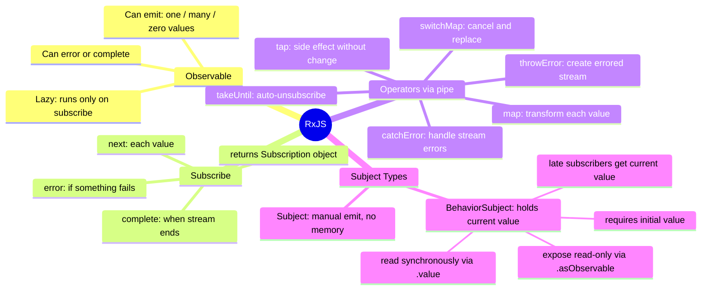

# الفصل الرابع — RxJS: فن التعامل مع الزمن

> **المتطلبات:** [[03-Template-Syntax-and-Lifecycle]] — لازم تعرف الـ Component والـ `subscribe()` من أي مثال عدى قدامك.

---

## البداية — مشكلة الزمن في البرمجة

في الكود المتزامن (**synchronous**) — كل حاجة بتحصل بالترتيب:

```typescript
const name  = 'Mohamed';             // line 1: runs
const upper = name.toUpperCase();    // line 2: runs immediately after
console.log(upper);                  // line 3: runs immediately after
// No surprises. No waiting. No "maybe".
```

بس في الواقع، الجزء الأكبر من البرمجة فيه **انتظار**:
- انتظار HTTP response من الـ backend
- انتظار المستخدم يكتب في input
- انتظار timer
- انتظار WebSocket message

في JavaScript، الانتظار ده اسمه **asynchronous programming**. وعندنا تاريخياً أكتر من طريقة للتعامل بيه.

---

### الطريقة الأولى — Callbacks (عصر الفوضى)

```javascript
// Get user, then get their posts, then get comments on first post
getUser(id, function(user) {
  getPosts(user.id, function(posts) {
    getComments(posts[0].id, function(comments) {
      getReactions(comments[0].id, function(reactions) {
        // by now the nesting is a nightmare
        // this is "Callback Hell" — or "Pyramid of Doom"
      });
    });
  });
});
```

المشكلة: كود مش قابل للقراءة، وصعب تـhandle فيه الـ errors.

---

### الطريقة التانية — Promises (تحسين جوهري)

```javascript
getUser(id)
  .then(user => getPosts(user.id))
  .then(posts => getComments(posts[0].id))
  .then(comments => console.log(comments))
  .catch(err => console.error(err));
```

أفضل بكتير. بس Promises عندها **3 قيود** بتظهر في التطبيقات الكبيرة:

**القيد الأول:** Promise بتـemit **قيمة واحدة بس** — بعدين خلاص. مش تقدر تـemit قيمة تانية. مناسبة لـ HTTP request، مش مناسبة لـ stream of keystrokes.

**القيد الثاني:** Promise مش قابلة للـ **cancel**. لو بعتها ومش محتاجها — هي لسه شغّالة.

**القيد الثالث:** Promise بتبدأ **فوراً** لما تتعمل — سواء في حد listening ولا لأ.

---

### الطريقة التالتة — Observables (ما جاء بيه RxJS)

الـ **Observable** هو الحل الأشمل. تخيله كـ "stream" — نهر من القيم بيجري مع الوقت:

```
Promise:    ────────────────[value]▶  (one value, then done)

Observable: ──[v1]──[v2]──[v3]──[v4]▶  (multiple values over time)
         OR: ────────────────[v1]──▶  (one value — just like a Promise)
         OR: ──[v1]──[v2]──❌         (emits some values then errors)
         OR: ──[v1]──[v2]──|          (emits then completes normally)
         OR: ────────────────────────▶  (never completes — like WebSocket)
```

Observable ممكن:
- تـemit **قيمة واحدة** (زي HTTP response)
- تـemit **قيم كتير مع الوقت** (زي keystrokes)
- تـ**error** في أي وقت
- تـ**complete** (تقول "خلصت، مش هيجي أي قيمة تانية")
- ما تـemit **حاجة خالص** (valid — بس نادر)

الفرق الأكبر بين Observable وPromise في جملة واحدة:

> **Promise = قيمة واحدة في المستقبل. Observable = تسلسل من القيم على مدار الوقت.**

> طيب — ده كله نظري. إزاي بنكتب Observable بالفعل؟

---

## [[01-Creating-Observables]] — "تشغيل الـ Stream"

الـ Observable بتعملها باستخدام `new Observable()`:

```typescript
import { Observable } from 'rxjs';

const numbers$ = new Observable<number>(subscriber => {
  // This function runs when someone SUBSCRIBES — not before
  subscriber.next(1);    // emit value 1
  subscriber.next(2);    // emit value 2
  subscriber.next(3);    // emit value 3
  subscriber.complete(); // signal: no more values coming
});
```

الـ `$` في نهاية الاسم هو **convention** بيقول "ده Observable" — مش إجباري بس ناس كتير بتستخدمه.

**نقطة مهمة — الـ Observable كسولة (Lazy):**

```typescript
const numbers$ = new Observable<number>(subscriber => {
  console.log('I am running!');
  subscriber.next(42);
});

// At this point — NOTHING has run yet
// The console.log hasn't executed
// No code inside the Observable has run

numbers$.subscribe(value => console.log('Got:', value));
// NOW the code runs:
// Console: "I am running!"
// Console: "Got: 42"
```

مقارنةً بالـ Promise:

```typescript
const promise = new Promise(resolve => {
  console.log('I run IMMEDIATELY!'); // runs right now, no waiting
  resolve(42);
});
// Console: "I run IMMEDIATELY!" — even if nobody is waiting for the result
```

**الـ Observable لا تشتغل إلا لما حد يـsubscribe.**

في Angular هتشوف ده في الـ HTTP calls — لما بتكتب `return this.http.get(...)` في Service ما بيحصل request خالص. الـ request بيتبعت بس لما الـ component يـsubscribe.

> إذن — الـ Observable موجودة بس ما شتغلتش لسه. إزاي نستمع لقيمها؟

---

## [[02-Subscribe]] — "الاستماع للـ Stream"

```typescript
numbers$.subscribe({
  next:     value => console.log('Got value:', value),
  error:    err   => console.error('Error occurred:', err),
  complete: ()    => console.log('Stream is done.')
});
// Console:
// Got value: 1
// Got value: 2
// Got value: 3
// Stream is done.
```

الـ subscribe بياخد object فيه 3 callbacks — أي منهم اختياري:

| Callback | متى بيتستدعى | |
|---|---|---|
| `next` | كل ما الـ Observable تـemit قيمة | الأكثر استخداماً |
| `error` | لو حصل خطأ (HTTP fail، exception) | لازم دايماً تكتبه |
| `complete` | لما الـ stream تنتهي بنجاح | اختياري في معظم الحالات |

**قاعدة مهمة:** بعد `error` — الـ `complete` ما بيتستدعاش. هما حالتان حصرية.

---

### الـ Subscription Object — "تذكرة الاشتراك"

لما تـsubscribe — بيرجعلك object من نوع `Subscription`:

```typescript
import { Subscription } from 'rxjs';

const sub: Subscription = numbers$.subscribe({
  next: value => console.log(value)
});

// Later — when you want to stop listening:
sub.unsubscribe();
// The callback will no longer be called
// Even if the Observable emits more values — you won't receive them
```

ده مهم جداً في Angular — هنشوف ليه بعدين في الـ memory leaks section.

> عرفنا نعمل Observable ونـsubscribe فيها. بس المحتوى الجاي من الـ Observable مش دايماً بالشكل اللي عايزه. محتاج أحوّل أو أفلتر أو أـhandle errors. إزاي؟

---

## [[03-Pipe-And-Operators]] — "خط تجميع القيم"

تخيل مصنع فيه خط إنتاج. الخامة بتدخل من جهة وبتخرج منتج نهائي من الجهة التانية. في النص — محطات تحويل: محطة بتقطع، محطة بتصبغ، محطة بتفحص.

الـ **operators** في RxJS هم المحطات دي. و**`pipe()`** هو خط الإنتاج نفسه:

```typescript
observable$.pipe(
  operator1(),
  operator2(),
  operator3()
).subscribe(finalValue => ...);
```

القيم بتتدفق من الـ observable، بتعدي على كل operator بالترتيب، وبتوصل للـ subscribe محوّلة.

```
Observable emits 5
    ↓ enters pipe()
    ↓ map: 5 * 2 = 10
    ↓ filter: 10 > 5? yes, passes through
    ↓ reaches subscribe()
subscribe gets 10
```

---

## [[04-map]] — "تحويل كل قيمة"

`map()` بياخد كل قيمة بتيجي، بيطبق عليها function، ويبعت النتيجة للأمام:

```typescript
import { of } from 'rxjs';
import { map } from 'rxjs/operators';

// of() creates an Observable that emits the given values and completes
of(1, 2, 3, 4, 5).pipe(
  map(n => n * 2)
).subscribe(value => console.log(value));
// Console: 2, 4, 6, 8, 10
```

**الاستخدام الأشهر في Angular — تحويل الـ HTTP response:**

```typescript
// HTTP returns: { success: true, data: [...books] }
// But the component just wants the books array

this.http.get<{ success: boolean; data: Book[] }>('/api/books').pipe(
  map(response => response.data)
  // transforms: { success, data: [...] } → [...books]
).subscribe(books => {
  this.books = books; // component gets the array directly
});
```

من غير `map` — الـ component هيحتاج يكتب `response.data` في كل مكان. مع `map` — بتعمل التحويل مرة واحدة في الـ service.

---

## [[05-tap]] — "الاستراق بدون تغيير"

`tap()` بيخليك "تطل" على القيمة اللي بتعدي من غير ما تغيّرها. القيمة بتعدي **بدون أي تحويل**:

```typescript
this.http.post('/api/auth/login', { email, password }).pipe(
  tap(response => {
    // "I can see the response, but I won't change it"
    console.log('Server responded:', response); // logging
    if (response.data?.token) {
      localStorage.setItem('token', response.data.token); // side effect: save token
    }
    // The response continues downstream UNCHANGED
  })
).subscribe(response => {
  // gets the FULL response — tap didn't modify it
  console.log('In subscribe:', response); // same object as above
});
```

**متى تستخدم `tap` بدل `map`؟**

- `map` → لما عايز **تحوّل** القيمة إلى شكل مختلف
- `tap` → لما عايز تعمل **side effect** (logging, localStorage, UI update) من غير ما تغيّر القيمة الأصلية

```typescript
// map: input → DIFFERENT output
map(response => response.data)          // ApiResponse → Book[]

// tap: input → SAME output (unchanged)
tap(response => saveToken(response))    // ApiResponse → ApiResponse (same)
```

> عرفنا نحوّل القيم. بس إيه اللي بيحصل لما الـ Observable تـerror؟ HTTP call فشلت مثلاً؟

---

## [[06-catchError]] — "إمساك الأخطاء في الـ Stream"

لما HTTP request تفشل — Angular مش بيـthrow exception عادي. هو بيبعت الـ error في الـ Observable stream. `catchError` بيمسك الـ error ده ويديك فرصة تتعامل معاه:

```typescript
import { catchError, throwError, of } from 'rxjs';

// Option 1: handle error and return a fallback value
this.http.get<Book[]>('/api/books').pipe(
  catchError(err => {
    console.error('Failed to load books:', err.status);
    return of([]); // return empty array instead of crashing
    // of([]) creates an Observable that emits [] and completes
    // The subscriber gets [] — no error, graceful degradation
  })
).subscribe(books => {
  this.books = books; // might be [] if the request failed
});

// Option 2: handle error and re-throw (most common in services)
this.http.post('/api/auth/login', credentials).pipe(
  tap(res => saveToken(res)),
  catchError(err => {
    // Do something global first (log, show notification)
    console.error('Login failed with status:', err.status);
    return throwError(() => err); // re-throw so component can handle it too
  })
).subscribe({
  next: () => this.router.navigate(['/home']),
  error: err => this.showError(err.error?.message) // component handles its own UI
});
```

---

### `throwError()` — عمل Observable ينتج خطأ

`throwError` بيعمل Observable إذا اشترك فيه حد — بيبعت error فوراً:

```typescript
import { throwError } from 'rxjs';

// Old syntax (avoid):
throwError('something went wrong');

// Correct syntax — factory function:
throwError(() => new Error('something went wrong'));
throwError(() => existingError); // re-throw an existing error
```

ليه factory function وليس مباشرة؟ لأن الـ factory كسول — ما بيتنفذش غير لما حد يـsubscribe. عشان ما تتعملش Error objects من غير داعي.

> فهمنا error handling. دلوقتي فيه حاجة أقوى — إيه اللي بيحصل لما الـ Observable تيجي **من جوه observable تاني**؟

---

## [[07-switchMap]] — "إلغاء والبدء من جديد"

ده من أقوى الـ operators وأكثرها إثارة للتساؤل في البداية.

**المشكلة:** تخيل search بيبعت HTTP request لكل حرف يكتبه المستخدم:

```
User types 'a'  → sends GET /api/search?q=a  (request 1)
User types 'an' → sends GET /api/search?q=an (request 2)
User types 'ang' → sends GET /api/search?q=ang (request 3)
```

المشكلة: الـ requests مش لازم توصل بالترتيب. Request 1 ممكن تاخد وقت أطول من request 3. النتيجة: الـ UI هيعرض نتائج "a" بعدين نتائج "ang"! **race condition**.

```
                          Time →
Request 'a'   ──────────────────────[result A]▶
Request 'an'  ────────────[result B]▶
Request 'ang' ──[result C]▶

Without switchMap:
subscribe gets: C, B, A — WRONG! last received wins
```

`switchMap` بيحل ده بإنه **يلغي الـ request السابق** لما request جديد يبدأ:

```typescript
import { switchMap } from 'rxjs/operators';

this.searchControl.valueChanges.pipe(
  // valueChanges is an Observable that emits on every keystroke
  switchMap(query => this.searchService.search(query))
  // When a new query arrives:
  //   1. CANCEL the previous in-flight HTTP request
  //   2. START a new HTTP request with the new query
  //   3. Only the LATEST request's result reaches subscribe
).subscribe(results => {
  this.results = results; // always the result for the latest query
});
```

```
                          Time →
Request 'a'   ────X  (cancelled when 'an' arrived)
Request 'an'  ────X  (cancelled when 'ang' arrived)
Request 'ang' ──────[result C]▶

With switchMap:
subscribe gets: C — CORRECT!
```

`switchMap` مناسب كل ما تريد "ابدأ شغل جديد وألغي القديم":
- Search as you type ✅
- Route changes (load new page data) ✅
- Refresh on button click ✅

---

## [[08-takeUntil]] — "اشترك لحد ما أقولك وقف"

في الـ Chapter التالت قلنا إنك لازم تـunsubscribe في `ngOnDestroy` عشان تتجنب memory leaks. الطريقة الكلاسيكية:

```typescript
// The manual way — works but gets verbose with many subscriptions
private sub1!: Subscription;
private sub2!: Subscription;
private sub3!: Subscription;

ngOnInit() {
  this.sub1 = observable1$.subscribe(...);
  this.sub2 = observable2$.subscribe(...);
  this.sub3 = observable3$.subscribe(...);
}

ngOnDestroy() {
  this.sub1.unsubscribe();
  this.sub2.unsubscribe();
  this.sub3.unsubscribe();
}
```

مع `takeUntil` بتعمل نفس الحاجة بطريقة أنظف:

```typescript
import { Subject, takeUntil } from 'rxjs';

export class MyComponent implements OnInit, OnDestroy {
  private destroy$ = new Subject<void>();
  // A Subject we control — when it emits, all subscriptions stop

  ngOnInit() {
    // Add takeUntil to every subscription
    observable1$.pipe(takeUntil(this.destroy$)).subscribe(...);
    observable2$.pipe(takeUntil(this.destroy$)).subscribe(...);
    observable3$.pipe(takeUntil(this.destroy$)).subscribe(...);
    // No need to store subscription objects
  }

  ngOnDestroy() {
    this.destroy$.next();     // emit — triggers all takeUntil to unsubscribe
    this.destroy$.complete(); // clean up the Subject itself
  }
}
```

`takeUntil(this.destroy$)` معناها: "اشترك عادي، **لحد ما** الـ `destroy$` تـemit أي قيمة — وبعدين وقف."

لما `ngOnDestroy` بتستدعي `destroy$.next()` — كل الـ observables اللي عندهم `takeUntil(this.destroy$)` بيتوقفوا في نفس اللحظة.

> فهمنا إزاي نتحكم في دورة حياة الـ subscriptions. دلوقتي فيه نوع خاص من الـ Observables بنشتغل معاه كتير في Angular — الـ Subject.

---

## [[09-Subject]] — "Observable تقدر تـemit فيها بنفسك"

الـ Observable العادية — أنت الـ subscriber بس. مش تقدر تـpush قيم فيها من بره.

الـ `Subject` مختلف: هو **Observable + Observer في نفس الوقت**. تقدر تـsubscribe فيه وتـemit منه:

```typescript
import { Subject } from 'rxjs';

const announce$ = new Subject<string>();

// Subscribe (listen):
announce$.subscribe(msg => console.log('A heard:', msg));
announce$.subscribe(msg => console.log('B heard:', msg));

// Emit (push values):
announce$.next('Hello everyone!');
// Console: "A heard: Hello everyone!"
// Console: "B heard: Hello everyone!"

announce$.next('Meeting at 3pm');
// Console: "A heard: Meeting at 3pm"
// Console: "B heard: Meeting at 3pm"
```

الـ Subject ده زي **loudspeaker** — أي حد بيتكلم فيه، كل المشتركين بيسمعوه.

---

### المشكلة مع Subject — "الوصول المتأخر"

```typescript
const news$ = new Subject<string>();

announce$.next('Breaking news: Angular 21 released!');
// A message was sent — but nobody subscribed yet!

// Someone subscribes AFTER the message was sent:
announce$.subscribe(msg => console.log(msg));
// Gets NOTHING — missed the message

announce$.next('Follow-up news');
// NOW the subscriber gets: "Follow-up news"
// But missed: "Breaking news: Angular 21 released!"
```

ده **Hot Observable** — زي التلفزيون. لو فاتتك الأخبار الساعة 8 — فاتتك. مش هترجع.

في Angular، ده بيبقى مشكلة كبيرة مع الـ auth state. لو الـ Navbar اشترك في الـ authStatus$ بعد ما المستخدم اتسجل — هيفوته إن المستخدم logged in ويظهر "Login" بدل "Logout".

> اللحل؟ الـ BehaviorSubject.

---

## [[10-BehaviorSubject]] — "Subject بذاكرة"

`BehaviorSubject` هو Subject خاص بـ 3 مميزات إضافية:
1. **لازم يبدأ بقيمة** — initial value إجباري
2. **كل subscriber جديد بيوصله القيمة الحالية فوراً** — مش بيفوته حاجة
3. **بتقدر تقرأ قيمته دلوقتي بدون ما تـsubscribe**

```typescript
import { BehaviorSubject } from 'rxjs';

const isLoggedIn$ = new BehaviorSubject<boolean>(false);
//                                               ^^^^^
//                                    initial value — required

// Subscriber A:
isLoggedIn$.subscribe(val => console.log('A:', val));
// Immediately: "A: false" ← gets the CURRENT value right away

// Push new value:
isLoggedIn$.next(true);
// Console: "A: true"

// Subscriber B joins AFTER the change:
isLoggedIn$.subscribe(val => console.log('B:', val));
// Immediately: "B: true" ← gets the CURRENT value (true), not the initial (false)

isLoggedIn$.next(false);
// Console: "A: false"
// Console: "B: false"

// Read current value synchronously (no subscribe):
console.log(isLoggedIn$.value);      // false
console.log(isLoggedIn$.getValue()); // false (same thing)
```

مقارنة مرئية:

```
Subject:
  emit 1  ──▶ [subscriber A gets 1]
  emit 2  ──▶ [subscriber A gets 2]
                                [B subscribes here]
  emit 3  ──▶ [A gets 3] [B gets 3]
  B missed: 1 and 2

BehaviorSubject (initial = 0):
  emit 1  ──▶ [A gets 1]
  emit 2  ──▶ [A gets 2]
                                [B subscribes here]
              [B gets 2 immediately — the CURRENT value]
  emit 3  ──▶ [A gets 3] [B gets 3]
  B got: 2 (current when it subscribed) and 3
```

---

### `asObservable()` — "قراءة فقط"

في Service بتعملها للـ state management:

```typescript
@Injectable({ providedIn: 'root' })
export class UserService {
  private loggedIn$ = new BehaviorSubject<boolean>(false);
  //      ^^^^^^^
  // private: only THIS service can call .next() — change the state

  authStatus$ = this.loggedIn$.asObservable();
  //            ^^^^^^^^^^^^^^^^^^^^^^^^^^^^^^
  // public: components can subscribe to READ the state
  // but .asObservable() removes .next() — they CANNOT change it
}
```

```typescript
// In any component:
const userService = inject(UserService);

// ✅ Can subscribe (read):
userService.authStatus$.subscribe(val => this.isLoggedIn = val);

// ❌ Cannot push values (write):
userService.authStatus$.next(true);
// TypeScript Error: Property 'next' does not exist on type 'Observable<boolean>'
```

ده **Encapsulation** مطبق على reactive programming. الـ state بتتحكم فيه من مكان واحد بس — الـ service نفسها.

---

### مثال شامل — Service بـ BehaviorSubject

```typescript
interface CartItem {
  productId: string;
  name: string;
  price: number;
  quantity: number;
}

@Injectable({ providedIn: 'root' })
export class CartService {
  private items$ = new BehaviorSubject<CartItem[]>([]);
  // private: only CartService modifies the cart

  cart$ = this.items$.asObservable();
  // public: any component can read the cart

  // Computed observable — total price
  total$ = this.items$.pipe(
    map(items => items.reduce((sum, item) => sum + item.price * item.quantity, 0))
  );
  // Whenever items$ changes, total$ automatically recalculates

  addItem(item: CartItem) {
    const current = this.items$.value; // read current array synchronously
    const exists  = current.find(i => i.productId === item.productId);

    if (exists) {
      // Update quantity if item already in cart
      this.items$.next(
        current.map(i =>
          i.productId === item.productId
            ? { ...i, quantity: i.quantity + 1 }
            : i
        )
      );
    } else {
      this.items$.next([...current, item]); // add new item
    }
    // Any component subscribed to cart$ gets the updated array instantly
  }

  removeItem(productId: string) {
    this.items$.next(
      this.items$.value.filter(i => i.productId !== productId)
    );
  }

  clearCart() {
    this.items$.next([]);
  }

  getCount(): number {
    return this.items$.value.reduce((sum, i) => sum + i.quantity, 0);
  }
}
```

أي component يـinject الـ `CartService` ويـsubscribe في `cart$` هيشوف التغييرات فوراً لما `addItem` أو `removeItem` يتستدعوا من أي مكان في التطبيق.

---

### مقارنة Subject vs BehaviorSubject

| | `Subject` | `BehaviorSubject` |
|---|---|---|
| Initial value | ❌ غير مطلوب | ✅ إجباري |
| Late subscriber يوصله الحالي؟ | ❌ | ✅ فوراً |
| تقدر تقرأ القيمة بدون subscribe؟ | ❌ | ✅ `.value` |
| الاستخدام الأمثل | Events عابرة (click، notification) | State مستمر (auth، cart، theme) |

> الـ BehaviorSubject واضح ليه هو الخيار الأفضل للـ state. دلوقتي خليني أجمع كل ده في مثال عملي كامل يبين إزاي الـ RxJS بيشتغل في Angular service حقيقية.

---

## [[11-Putting-It-Together]] — Service كاملة بـ RxJS

هنبني `NotificationService` كاملة من الصفر — بتجمع كل الـ concepts:

```typescript
import { Injectable }          from '@angular/core';
import { BehaviorSubject, Observable, timer } from 'rxjs';
import { map, tap }            from 'rxjs/operators';

interface Notification {
  id: number;
  message: string;
  type: 'success' | 'error' | 'info';
}

@Injectable({ providedIn: 'root' })
export class NotificationService {

  // Internal state — private, only this service modifies it
  private notifications$ = new BehaviorSubject<Notification[]>([]);
  private nextId         = 1;

  // Public read-only stream — components subscribe to this
  notifications = this.notifications$.asObservable();

  // Derived Observable — computed from notifications$
  // automatically updates whenever notifications$ changes
  count$ = this.notifications$.pipe(
    map(list => list.length)
  );

  // Add a notification
  add(message: string, type: Notification['type'] = 'info'): void {
    const notification: Notification = {
      id:      this.nextId++,
      message,
      type,
    };

    // Spread the current array and add the new notification
    this.notifications$.next([...this.notifications$.value, notification]);
  }

  // Remove a specific notification by ID
  remove(id: number): void {
    this.notifications$.next(
      this.notifications$.value.filter(n => n.id !== id)
    );
  }

  // Add a notification that auto-removes after 3 seconds
  addTemporary(message: string, type: Notification['type'] = 'info'): void {
    this.add(message, type);

    const addedId = this.nextId - 1; // ID of the notification we just added

    timer(3000).subscribe(() => {
      // timer(3000) emits once after 3 seconds, then completes
      this.remove(addedId);
    });
  }

  // Clear all notifications
  clear(): void {
    this.notifications$.next([]);
  }
}
```

**استخدامه في component:**

```typescript
@Component({
  selector: 'app-notifications',
  standalone: true,
  imports: [AsyncPipe],
  template: `
    <div class="notifications">

      <!-- count$ is an Observable — use async pipe to unwrap it -->
      @if ((count$ | async) ?? 0 > 0) {
        <p>You have {{ count$ | async }} notifications</p>
      }

      <!-- notifications is an Observable — async pipe handles subscribe/unsubscribe -->
      @for (notif of (notifications | async) ?? []; track notif.id) {
        <div [class]="'notif notif-' + notif.type">
          {{ notif.message }}
          <button (click)="dismiss(notif.id)">×</button>
        </div>
      }

    </div>
  `,
})
export class NotificationsComponent {
  private notifService = inject(NotificationService);

  notifications = this.notifService.notifications;
  count$        = this.notifService.count$;

  dismiss(id: number) {
    this.notifService.remove(id);
  }
}
```

لاحظ: **مفيش `subscribe()` في الـ TypeScript class** — الـ `async` pipe في الـ template بتـsubscribe وبتـunsubscribe أوتوماتيك. مفيش memory leaks ممكنة.

---

## 🗺️ خريطة RxJS كاملة



---

## ✅ Checkpoint — أسئلة إنترفيو RxJS

**س: إيه الفرق بين Observable وPromise؟**
> Promise بتـemit قيمة واحدة، بتبدأ فوراً لما تتعمل، ومش قابلة للـcancel. Observable بتـemit قيم كتير مع الوقت، كسولة (بتبدأ بس لما حد يـsubscribe)، وقابلة للـcancel بالـ `unsubscribe()`. كلهم async، بس Observable أقوى بكتير.

**س: إيه الفرق بين `map` و`tap`؟**
> `map` بيحوّل القيمة — input مختلف عن output. `tap` بيديك نظرة على القيمة من غير ما يغيّرها — input = output. استخدم `map` للـ transformation، `tap` للـ side effects زي logging وsaveToken.

**س: إيه الفرق بين `Subject` و`BehaviorSubject`؟**
> `Subject` مش عنده initial value ولا بيحفظ آخر قيمة — late subscribers مش بيوصلهم حاجة. `BehaviorSubject` لازم يبدأ بقيمة وبيديها لكل subscriber جديد فوراً. استخدم `BehaviorSubject` لأي state مستمر (logged in، cart، settings).

**س: ليه بنستخدم `.asObservable()` مع الـ BehaviorSubject؟**
> لأن `BehaviorSubject` عنده `.next()` — يعني أي حد عنده reference ليه يقدر يغيّر الـ state. `.asObservable()` بيحوّله لـ Observable عادي — قراءة فقط بدون `.next()`. ده encapsulation: State بتتغير من مكان واحد (الـ service) فقط.

**س: إيه الـ `switchMap` وامتى تستخدمه؟**
> لما عندك observable بيـemit values وكل value عايز تبدأ observable جديد، وعايز تلغي الـ observable القديم لو جاء جديد. الاستخدام الكلاسيكي: search-as-you-type — كل keystroke بيبدأ HTTP request وبيلغي اللي قبله.

---

## 🛠️ Practical Exercise — من الصفر للـ BehaviorSubject

### Task 1 — اقرأ وتنبّأ

```typescript
import { BehaviorSubject } from 'rxjs';

const score$ = new BehaviorSubject<number>(0);

score$.subscribe(val => console.log('Player 1:', val));

score$.next(10);
score$.next(25);

score$.subscribe(val => console.log('Player 2:', val));

score$.next(30);

console.log('Final score:', score$.value);
```

**اكتب بالترتيب كل حاجة هتطلع في الـ console:**

---

### Task 2 — اكمل الـ operators

```typescript
import { of } from 'rxjs';
import { map, tap, filter } from 'rxjs/operators';

const products$ = of(
  { name: 'Laptop', price: 25000, inStock: true  },
  { name: 'Mouse',  price: 350,   inStock: false },
  { name: 'Desk',   price: 4500,  inStock: true  },
  { name: 'Chair',  price: 6000,  inStock: false },
);

products$.pipe(
  // (1) Keep only products that are in stock
  filter(___),

  // (2) Log each product name (side effect, don't change the value)
  tap(___),

  // (3) Transform each product to just its name and price
  map(product => ({ name: product.name, price: product.price })),

).subscribe(item => console.log(item));

// Expected output:
// "Processing: Laptop"
// "Processing: Desk"
// { name: 'Laptop', price: 25000 }
// { name: 'Desk',   price: 4500  }
```

---

### Task 3 — اكتب `ThemeService` من الصفر

```typescript
// A service that manages light/dark mode for the whole app
// Requirements:
// 1. Starts in 'light' mode
// 2. Any component can subscribe to the current theme
// 3. Only the service itself can change the theme (encapsulation)
// 4. Components can read current theme synchronously (for initial render)
// 5. Has a toggle() method that switches between 'light' and 'dark'
// 6. Has a setTheme(theme) method for explicit setting

@Injectable({ providedIn: 'root' })
export class ThemeService {
  // your implementation here
}
```

**بعد ما تكتبه، اعمل `ThemeToggleComponent` بسيط:**

```typescript
@Component({
  selector: 'app-theme-toggle',
  standalone: true,
  imports: [AsyncPipe],
  template: `
    <!-- Show current theme using async pipe -->
    <!-- Call toggle() when button is clicked -->
    <!-- Bonus: add [class.dark-mode] binding to a wrapper div -->
  `,
})
export class ThemeToggleComponent {
  // inject ThemeService and use it
}
```

---

### Task 4 — تفكير في الـ memory leaks

```typescript
@Component({ selector: 'app-live-feed', standalone: true, template: '...' })
export class LiveFeedComponent implements OnInit {
  messages: string[] = [];

  private feedService = inject(FeedService);

  ngOnInit() {
    // FeedService has a messages$ BehaviorSubject that emits a new message every second
    this.feedService.messages$.subscribe(msg => {
      this.messages.push(msg);
    });
    // No unsubscribe. No takeUntil. No ngOnDestroy.
  }
}
```

**أجب:**
1. المستخدم فتح الـ LiveFeed page ثم راح لصفحة تانية — إيه اللي حصل في الـ memory؟
2. لو المستخدم فتح وأغلق الصفحة 10 مرات — كام subscription شغال في الـ background؟
3. إزاي تصلح الكود ده بطريقتين مختلفتين؟

---

## 🫒 زتونة الإنترفيو

> **"RxJS is Angular's language for async programming. An Observable is a lazy stream that emits values over time — unlike a Promise which fires immediately and emits once. `pipe()` chains operators to transform the stream: `map` transforms values, `tap` performs side effects, `catchError` handles failures. A `BehaviorSubject` is the foundation of Angular state management: it holds a current value, gives it to late subscribers immediately, and exposes itself as a read-only Observable via `.asObservable()` for encapsulation. Every subscription must eventually be unsubscribed — either manually in `ngOnDestroy`, or automatically via `takeUntil` or the `async` pipe."**

---

*Next → [[05-Services-And-HTTP]] — عرفنا RxJS. دلوقتي إزاي بنبني Service كاملة تتكلم مع Backend؟ الـ HttpClient وكيف بيعمل HTTP calls typed وآمنة.*
