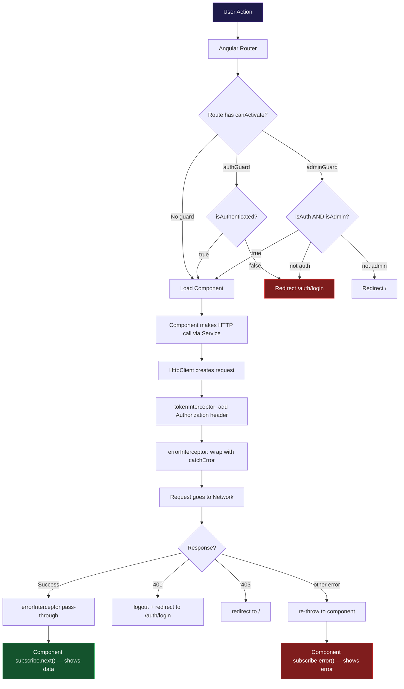

# الفصل الخامس — Services والـ HTTP والـ Interceptors والـ Guards

> **المتطلبات:** [[04-RxJS]] — لازم تعرف الـ Observable والـ subscribe والـ pipe والـ operators. ده هو المكان اللي كل ده بيتطبق فيه.

---

## البداية — لحظة الحقيقة

في كل الفصول اللي فاتت، كنا بنشتغل على **data وهمية**:

```typescript
export class ProductsComponent {
  products = ['Laptop', 'Mouse', 'Keyboard']; // مش حقيقي
  user = { name: 'Mohamed', role: 'admin' };  // مش حقيقي
  cartCount = 3;                               // مش حقيقي
}
```

ده كان مناسب للتعلم. بس في التطبيق الحقيقي — الـ data بتيجي من **Server**.

المستخدم يفتح الموقع → الـ Angular app تبعت request لسيرفر → السيرفر يرجع JSON → الـ app تعرضه.

```
User opens the app
      ↓
Angular app (running in browser)
      ↓ HTTP Request
Backend Server (Node.js / Python / Java / any)
      ↓ HTTP Response (JSON)
Angular app
      ↓
User sees real data
```

الفصل ده هو رحلة اتصال الـ Angular بالـ Backend — من أول request لحد ما الـ data تتعرض، مع حماية الـ routes وإضافة الـ token لكل request تلقائياً.

---

### ليه الـ Architecture مهمة قبل الكود

في Angular، الـ HTTP calls مش بتتعمل في الـ Component مباشرة. فيه تقسيم واضح:

```
Component  →  "مسؤول عن الـ UI بس"
Service    →  "مسؤول عن الـ logic والـ data"
HttpClient →  "الأداة اللي بتبعت الـ HTTP requests"
```

**ليه مش نكتب الـ HTTP call في الـ Component مباشرة؟**

```typescript
// Bad approach — HTTP in component directly
@Component({ ... })
export class ProductsComponent {
  products: Product[] = [];

  ngOnInit() {
    // Calling HTTP directly from component — problematic!
    this.http.get<Product[]>('/api/products').subscribe(data => {
      this.products = data;
    });
  }
}
```

المشكلة:
- لو **3 components** كلهم محتاجين نفس الـ products — ستكتب نفس الكود 3 مرات
- لو الـ API URL اتغيّر — تغيّره في 3 أماكن
- لو الـ logic اتغيّر (مثلاً: فلترة الـ response) — تغيّره في 3 أماكن
- مش قابل للـ **testing** — مش تقدر تعمل fake HTTP بسهولة

```typescript
// Good approach — HTTP in service
@Injectable({ providedIn: 'root' })
export class ProductService {
  getProducts(): Observable<Product[]> {
    return this.http.get<Product[]>('/api/products');
    // One place — all components use this method
  }
}

// In any component that needs products:
export class ProductsComponent {
  private productService = inject(ProductService);

  ngOnInit() {
    this.productService.getProducts().subscribe(data => {
      this.products = data;
    });
  }
}
```

الـ Service هو **"المخزن المركزي للـ logic"** — اكتبه مرة، استخدمه في أي مكان.

> قبل ما نكتب أي HTTP call — Angular محتاج نـ"تفعّل" الـ HTTP Client. إزاي؟

---

## [[01-setup-http]] — "تفعيل الـ HTTP Client"

الـ `HttpClient` في Angular مش متاح by default. محتاج تسجّله في `app.config.ts` — وده ملف بيشتغل مرة واحدة عند بدء التطبيق ويحدد إيه المكونات الأساسية المتاحة للتطبيق كله.

```typescript
// src/app/app.config.ts
import { ApplicationConfig }   from '@angular/core';
import { provideRouter }       from '@angular/router';
import {
  provideHttpClient,
  withFetch,
} from '@angular/common/http';
import { routes } from './app.routes';

export const appConfig: ApplicationConfig = {
  providers: [
    provideRouter(routes),

    provideHttpClient(
      withFetch()
      // withFetch() يخلي Angular يستخدم الـ fetch() API
      // بدلاً من الـ XMLHttpRequest القديم
      // أسرع وأحدث وبيشتغل مع Angular SSR
    ),
  ],
};
```

بعد ما تضيف `provideHttpClient()` — أي Service في التطبيق تقدر تعمل:

```typescript
private http = inject(HttpClient);
// والـ HttpClient جاهز لاستخدامه
```

---

### الـ `environment.ts` — إزاي تتجنب hardcoding الـ URL

في المشاريع الحقيقية مش بتكتب الـ URL مباشرة في الـ Service — بتستخدم **environment files**:

```typescript
// src/environments/environment.ts (development)
export const environment = {
  production: false,
  apiUrl: 'http://localhost:3000/api',
};

// src/environments/environment.prod.ts (production)
export const environment = {
  production: true,
  apiUrl: 'https://api.myapp.com/api',
};
```

```typescript
// In your service:
import { environment } from '../../environments/environment';

@Injectable({ providedIn: 'root' })
export class PostService {
  private baseUrl = environment.apiUrl;
  // In development: 'http://localhost:3000/api'
  // In production:  'https://api.myapp.com/api'
  // Angular swaps the file automatically during ng build --prod
}
```

ده بيخليك تبني الـ app مرة وتـdeploy على servers مختلفة من غير ما تغيّر الكود.

> تمام، الـ setup جاهز. خليني أبني أول service بتكلم backend حقيقي خطوة بخطوة.

---

## [[02-build-first-service]] — بناء أول Service خطوة بخطوة

هنبني `PostService` بتشتغل مع الـ API العام: `https://jsonplaceholder.typicode.com`

ده API حقيقي مجاني ممكن تجربه من غير setup.

---

### الخطوة 1 — تعريف الـ Interface

قبل أي كود — لازم نعرف شكل الـ data:

```typescript
// src/app/models/post.model.ts
export interface Post {
  id:     number;
  title:  string;
  body:   string;
  userId: number;
}

// Interface for creating a new post (no id yet — server generates it)
export interface CreatePostDto {
  title:  string;
  body:   string;
  userId: number;
}
```

---

### الخطوة 2 — الـ Service الأساسي

```typescript
// src/app/services/post.service.ts
import { Injectable, inject } from '@angular/core';
import { HttpClient }          from '@angular/common/http';
import { Observable }          from 'rxjs';
import { Post, CreatePostDto } from '../models/post.model';

@Injectable({ providedIn: 'root' })
export class PostService {

  private http    = inject(HttpClient);
  private baseUrl = 'https://jsonplaceholder.typicode.com';

  // GET all posts
  getAll(): Observable<Post[]> {
    return this.http.get<Post[]>(`${this.baseUrl}/posts`);
    // this.http.get<Post[]>(...) does NOT send a request yet
    // It returns an Observable — a "description" of a future request
    // The request is sent ONLY when someone subscribes to this Observable
  }

  // GET one post by id
  getById(id: number): Observable<Post> {
    return this.http.get<Post>(`${this.baseUrl}/posts/${id}`);
    // URL: /posts/1, /posts/42, etc.
  }

  // POST — create a new post
  create(data: CreatePostDto): Observable<Post> {
    return this.http.post<Post>(`${this.baseUrl}/posts`, data);
    // Angular automatically:
    //   - converts data object to JSON string
    //   - sets Content-Type: application/json header
  }

  // PATCH — partial update
  update(id: number, changes: Partial<Post>): Observable<Post> {
    return this.http.patch<Post>(`${this.baseUrl}/posts/${id}`, changes);
  }

  // DELETE
  delete(id: number): Observable<void> {
    return this.http.delete<void>(`${this.baseUrl}/posts/${id}`);
  }
}
```

---

### الخطوة 3 — الـ Component اللي بيستخدم الـ Service

```typescript
// src/app/components/post-list.component.ts
import { Component, OnInit, inject } from '@angular/core';
import { PostService }               from '../services/post.service';
import { Post }                      from '../models/post.model';

@Component({
  selector:   'app-post-list',
  standalone: true,
  template: `
    <!-- Loading state -->
    @if (isLoading) {
      <div class="loading">
        <p>⏳ Loading posts...</p>
      </div>
    }

    <!-- Error state -->
    @else if (errorMessage) {
      <div class="error">
        <p>❌ {{ errorMessage }}</p>
        <button (click)="loadPosts()">Try Again</button>
      </div>
    }

    <!-- Success state -->
    @else {
      <div class="posts-container">
        <h2>Posts ({{ posts.length }})</h2>

        @for (post of posts; track post.id) {
          <article class="post-card">
            <h3>{{ post.title }}</h3>
            <p>{{ post.body | slice:0:150 }}...</p>
            <button (click)="deletePost(post.id)">Delete</button>
          </article>
        } @empty {
          <p>No posts found.</p>
        }
      </div>
    }
  `,
})
export class PostListComponent implements OnInit {
  private postService = inject(PostService);

  posts:        Post[]        = [];
  isLoading:    boolean       = false;
  errorMessage: string | null = null;

  ngOnInit() {
    this.loadPosts();
  }

  loadPosts() {
    this.isLoading    = true;
    this.errorMessage = null;

    this.postService.getAll().subscribe({
      next: (data) => {
        this.posts     = data;
        this.isLoading = false;
      },
      error: (err) => {
        this.errorMessage = 'Failed to load posts. Please try again.';
        this.isLoading    = false;
        console.error('Error:', err);
      },
    });
  }

  deletePost(id: number) {
    this.postService.delete(id).subscribe({
      next: () => {
        // Remove from local array — no need for another HTTP call
        this.posts = this.posts.filter(post => post.id !== id);
      },
      error: (err) => {
        alert('Failed to delete post.');
      },
    });
  }
}
```

ده هو **الـ Pattern الأساسي** في كل Angular app:
1. `isLoading = true` → تبعت الـ request
2. Response يجي → تحط الـ data وتعمل `isLoading = false`
3. Error يجي → تحط الـ error message وتعمل `isLoading = false`

> خليني أشرح كل HTTP method بالتفصيل مع أمثلة حقيقية.

---

## [[03-http-get-deep]] — الـ GET: كل تفاصيله

الـ GET هو أبسط وأكثر HTTP method استخداماً. بتجيب data من الـ server.

---

### GET بسيط — جلب كل البيانات

```typescript
// GET /api/products → returns all products
getAllProducts(): Observable<Product[]> {
  return this.http.get<Product[]>(`${this.baseUrl}/products`);
}
```

---

### GET بـ URL Parameter — جلب عنصر واحد

```typescript
// GET /api/products/42 → returns product with id=42
getProductById(id: number): Observable<Product> {
  return this.http.get<Product>(`${this.baseUrl}/products/${id}`);
  //                                                          ^^
  // Template literal to embed the id in the URL
}
```

```typescript
// Usage in component:
this.productService.getProductById(42).subscribe({
  next: (product) => {
    this.product = product;
    this.pageTitle = product.name;
  },
  error: (err) => {
    if (err.status === 404) {
      this.error = 'Product not found';
    }
  },
});
```

---

### GET مع Query Parameters — البحث والفلترة والصفحات

```typescript
// GET /api/products?search=laptop&page=2&limit=10
searchProducts(query: string, page: number = 1): Observable<Product[]> {
  return this.http.get<Product[]>(`${this.baseUrl}/products`, {
    params: {
      search: query,
      page:   page.toString(),
      // !! params must be strings — numbers need .toString()
      limit:  '10',
    }
  });
}
```

**مثال أكثر تعقيداً مع `HttpParams`:**

```typescript
import { HttpParams } from '@angular/common/http';

// GET /api/products?minPrice=100&maxPrice=500&category=electronics&inStock=true
getFilteredProducts(filters: {
  minPrice?: number;
  maxPrice?: number;
  category?: string;
  inStock?:  boolean;
}): Observable<Product[]> {

  let params = new HttpParams();
  // HttpParams is immutable — each .set() returns a new object

  if (filters.minPrice !== undefined) {
    params = params.set('minPrice', filters.minPrice.toString());
  }
  if (filters.maxPrice !== undefined) {
    params = params.set('maxPrice', filters.maxPrice.toString());
  }
  if (filters.category) {
    params = params.set('category', filters.category);
  }
  if (filters.inStock !== undefined) {
    params = params.set('inStock', filters.inStock.toString());
  }

  return this.http.get<Product[]>(`${this.baseUrl}/products`, { params });
}
```

```typescript
// Usage:
this.productService.getFilteredProducts({
  minPrice: 100,
  maxPrice: 500,
  category: 'electronics',
}).subscribe(products => {
  this.products = products;
});
// Sends: GET /api/products?minPrice=100&maxPrice=500&category=electronics
```

---

### GET مع Custom Headers

```typescript
// Some APIs need extra headers beyond Authorization
getProtectedData(): Observable<SensitiveData> {
  return this.http.get<SensitiveData>(`${this.baseUrl}/sensitive`, {
    headers: {
      'X-API-Key':    'my-api-key-123',
      'X-Request-ID': Math.random().toString(36).slice(2),
      // unique ID per request — useful for debugging
    }
  });
}
```

> شرحنا GET بالكامل. دلوقتي الـ POST — اللي بيبعت data للـ server.

---

## [[04-http-post-deep]] — الـ POST: إرسال Data للـ Server

الـ POST بيبعت data جديدة للـ server عشان يحفظها.

```typescript
// POST /api/posts — create a new post
createPost(data: CreatePostDto): Observable<Post> {
  return this.http.post<Post>(`${this.baseUrl}/posts`, data);
  // Angular automatically:
  //   ✓ converts data to JSON: JSON.stringify(data)
  //   ✓ sets header: Content-Type: application/json
  //   ✓ sets header: Accept: application/json
}
```

---

### الـ Component اللي بيبعت POST

```typescript
@Component({
  selector:   'app-create-post',
  standalone: true,
  imports:    [FormsModule],
  template: `
    <form (ngSubmit)="onSubmit()">
      <input
        [(ngModel)]="title"
        name="title"
        placeholder="Post title"
        required
      />
      <textarea
        [(ngModel)]="body"
        name="body"
        placeholder="Post body"
        rows="5"
      ></textarea>
      <button
        type="submit"
        [disabled]="isSubmitting || !title || !body"
      >
        {{ isSubmitting ? 'Creating...' : 'Create Post' }}
      </button>
      @if (successMessage) {
        <p class="success">{{ successMessage }}</p>
      }
      @if (errorMessage) {
        <p class="error">{{ errorMessage }}</p>
      }
    </form>
  `,
})
export class CreatePostComponent {
  private postService = inject(PostService);
  private router      = inject(Router);

  title:          string  = '';
  body:           string  = '';
  isSubmitting:   boolean = false;
  successMessage: string  = '';
  errorMessage:   string  = '';

  onSubmit() {
    if (!this.title.trim() || !this.body.trim()) return;

    this.isSubmitting  = true;
    this.errorMessage  = '';
    this.successMessage = '';

    this.postService.createPost({
      title:  this.title,
      body:   this.body,
      userId: 1,
    }).subscribe({
      next: (createdPost) => {
        this.isSubmitting   = false;
        this.successMessage = `Post created with id: ${createdPost.id}`;
        // Navigate to the new post after 1 second
        setTimeout(() => {
          this.router.navigate(['/posts', createdPost.id]);
        }, 1000);
      },
      error: (err) => {
        this.isSubmitting = false;
        this.errorMessage = err.message || 'Failed to create post.';
      },
    });
  }
}
```

---

## [[05-put-patch-delete]] — PUT وPATCH وDELETE

---

### PUT vs PATCH — الفرق الحقيقي

ده فرق بيحصل فيه confusion كتير:

```
PUT   → أبعت الـ resource كامل — كأنك بتستبدل الـ record بالكامل
PATCH → أبعت بس الـ fields اللي اتغيّرت — والباقي يفضل زي ما هو
```

```typescript
interface UserProfile {
  id:        number;
  firstName: string;
  lastName:  string;
  email:     string;
  phone:     string;
  bio:       string;
  avatar:    string;
}

// PUT — must send ALL fields
updateProfileFull(id: number, fullProfile: UserProfile): Observable<UserProfile> {
  return this.http.put<UserProfile>(`${this.baseUrl}/users/${id}`, fullProfile);
  // If you forget to send 'phone' → server might set it to null!
  // Use when: you have a form that shows ALL fields
}

// PATCH — send ONLY what changed
updateProfilePartial(
  id:      number,
  changes: Partial<UserProfile>  // Partial<T> = all fields optional
): Observable<UserProfile> {
  return this.http.patch<UserProfile>(`${this.baseUrl}/users/${id}`, changes);
  // Example: changes = { bio: 'New bio text' }
  // Server updates only bio — all other fields stay the same
  // Use when: user edits one specific field
}
```

```typescript
// Real example — user edits their bio only:
updateBio(userId: number, newBio: string) {
  return this.http.patch<UserProfile>(
    `${this.baseUrl}/users/${userId}`,
    { bio: newBio }  // only send the changed field
  );
}
```

---

### DELETE — حذف resource

```typescript
// DELETE /api/posts/42 — delete post with id=42
deletePost(id: number): Observable<void> {
  return this.http.delete<void>(`${this.baseUrl}/posts/${id}`);
  // Most APIs return 204 No Content on successful delete
  // void type = we don't expect a response body
}
```

```typescript
// In component — delete with optimistic UI:
deletePost(postId: number) {
  // Optimistic update: remove from UI immediately (before server confirms)
  const deletedPost = this.posts.find(p => p.id === postId);
  this.posts = this.posts.filter(p => p.id !== postId);

  this.postService.deletePost(postId).subscribe({
    next: () => {
      // Server confirmed — nothing more to do
      console.log('Deleted successfully');
    },
    error: (err) => {
      // Server failed — restore the deleted item
      if (deletedPost) {
        this.posts = [...this.posts, deletedPost];
      }
      this.errorMessage = 'Failed to delete. Please try again.';
    },
  });
}
```

---

## [[06-typed-responses-deep]] — الـ TypeScript Safety في HTTP

الـ generic type في الـ HttpClient بيديك فائدتين:
1. **Autocomplete** — تعرف إيه الـ properties الموجودة في الـ response
2. **Compile-time errors** — TypeScript يمسك الأخطاء قبل ما تشغّل الكود

```typescript
// ❌ Without types — 'any' response
this.http.get('/api/posts').subscribe(data => {
  data.tittle;       // typo — no error! Will crash at runtime
  data.TITLE;        // wrong case — no error!
  data.price * 100;  // maybe doesn't have price — no error!
});

// ✅ With types — full safety
this.http.get<Post[]>('/api/posts').subscribe(data => {
  data[0].title;     // ✅ TypeScript knows: title is string
  data[0].tittle;    // ❌ Compile error: 'tittle' doesn't exist on Post
  data[0].price;     // ❌ Compile error: 'price' doesn't exist on Post
  data[0].id * 100;  // ✅ TypeScript knows: id is number
});
```

---

### الـ API Wrapper — الشكل الشائع للـ Responses

كتير من الـ backends بترجع الـ data بشكل wrapped:

```json
{
  "success": true,
  "message": "ok",
  "data": [
    { "id": 1, "title": "First Post" },
    { "id": 2, "title": "Second Post" }
  ]
}
```

```typescript
// Interface for the wrapper
interface ApiResponse<T> {
  success: boolean;
  message: string;
  data:    T;
}

// Typed correctly:
getPosts(): Observable<ApiResponse<Post[]>> {
  return this.http.get<ApiResponse<Post[]>>('/api/posts');
}

// Component usage:
this.postService.getPosts().subscribe(response => {
  // TypeScript knows the structure:
  this.posts   = response.data;       // Post[]
  this.message = response.message;    // string
  this.ok      = response.success;    // boolean
});

// OR — unwrap in service with map():
import { map } from 'rxjs/operators';

getPostsUnwrapped(): Observable<Post[]> {
  return this.http.get<ApiResponse<Post[]>>('/api/posts').pipe(
    map(response => response.data)
    // component gets Post[] directly — no wrapper to deal with
  );
}
```

---

## [[07-error-handling-deep]] — التعامل مع الأخطاء بالتفصيل

### الـ `HttpErrorResponse` — تشريح كامل

لما HTTP request تفشل — Angular مش بيـthrow exception عادي. الـ error بييجي في الـ Observable stream كـ `HttpErrorResponse` object:

```typescript
import { HttpErrorResponse } from '@angular/common/http';

this.postService.create(data).subscribe({
  next: (result) => { /* success */ },
  error: (err: HttpErrorResponse) => {
    // err.status — the HTTP status code number
    console.log(err.status);       // 400, 401, 403, 404, 500, etc.

    // err.statusText — the status text
    console.log(err.statusText);   // "Bad Request", "Not Found", etc.

    // err.error — the response BODY
    // This is your backend's JSON error object
    console.log(err.error);
    // Example: { success: false, message: "Email already exists", field: "email" }

    // err.error?.message — your backend's custom message
    console.log(err.error?.message);  // "Email already exists"

    // err.url — the URL that failed
    console.log(err.url);          // "https://api.myapp.com/api/users"

    // err.message — Angular's internal message (less useful for users)
    console.log(err.message);      // "Http failure response for ..."
  },
});
```

---

### الـ Error Status Codes — معناها وكيف تتعامل معها

```typescript
error: (err: HttpErrorResponse) => {
  let userMessage: string;

  switch (err.status) {
    case 0:
      // Network error — no internet, server is down, CORS issue
      // err.status === 0 means the request never reached the server
      userMessage = '⚠️ No internet connection or server is unreachable.';
      break;

    case 400:
      // Bad Request — you sent invalid data
      // The server understood your request but rejected it (validation error)
      userMessage = err.error?.message || 'Invalid data. Please check your input.';
      break;

    case 401:
      // Unauthorized — you're not authenticated
      // Token is missing, expired, or invalid
      // Usually handled globally by errorInterceptor
      userMessage = 'Your session expired. Please log in again.';
      break;

    case 403:
      // Forbidden — you're authenticated but not authorized
      // You're logged in but don't have permission
      userMessage = 'You don\'t have permission to do this.';
      break;

    case 404:
      // Not Found — the resource doesn't exist
      userMessage = 'The item you\'re looking for doesn\'t exist.';
      break;

    case 409:
      // Conflict — resource already exists (e.g., duplicate email)
      userMessage = err.error?.message || 'This item already exists.';
      break;

    case 422:
      // Unprocessable Entity — validation failed on server
      userMessage = err.error?.message || 'Please check your input.';
      break;

    case 429:
      // Too Many Requests — rate limited
      userMessage = 'Too many attempts. Please wait a moment.';
      break;

    case 500:
      // Internal Server Error — server bug (not your fault)
      userMessage = 'Server error. Please try again later.';
      break;

    case 503:
      // Service Unavailable — server is overloaded or down for maintenance
      userMessage = 'Service temporarily unavailable. Please try later.';
      break;

    default:
      userMessage = `Something went wrong (${err.status}). Please try again.`;
  }

  this.errorMessage = userMessage;
}
```

---

### Error Handling في الـ Service مع `catchError`

أحياناً محتاج تعالج الـ error في الـ Service نفسها — مش بس في الـ Component:

```typescript
import { catchError, throwError, of } from 'rxjs';

// Option A — return fallback value on error (graceful degradation)
getProducts(): Observable<Product[]> {
  return this.http.get<Product[]>('/api/products').pipe(
    catchError(err => {
      console.error('Failed to load products:', err);

      if (err.status === 0) {
        // No internet — return empty array (maybe from local cache)
        return of([]);
        // of([]) creates an Observable that emits [] and completes
        // The component gets [] — no crash, no error shown to user
      }

      // For other errors — re-throw to let component handle them
      return throwError(() => err);
    })
  );
}

// Option B — transform the error to a user-friendly message
createProduct(data: CreateProductDto): Observable<Product> {
  return this.http.post<Product>('/api/products', data).pipe(
    catchError((err: HttpErrorResponse) => {
      const msg = err.error?.message || 'Failed to create product';
      return throwError(() => new Error(msg));
      // Component's error handler gets: Error("Failed to create product")
      // Cleaner than raw HttpErrorResponse for the component to deal with
    })
  );
}
```

---

### مثال كامل — Loading States Pattern

ده الـ pattern الأكثر استخداماً في كل Angular app:

```typescript
@Component({
  selector:   'app-user-profile',
  standalone: true,
  template: `
    <div class="profile-page">
      @if (isLoading) {
        <!-- Skeleton loader while fetching -->
        <div class="skeleton">
          <div class="skeleton-avatar"></div>
          <div class="skeleton-text"></div>
          <div class="skeleton-text short"></div>
        </div>
      } @else if (error) {
        <!-- Error state with retry button -->
        <div class="error-state">
          <p>{{ error }}</p>
          <button (click)="loadUser()">🔄 Retry</button>
        </div>
      } @else if (user) {
        <!-- Success state — show the data -->
        <div class="user-card">
          
          <h2>{{ user.name }}</h2>
          <p>{{ user.email }}</p>
          <p>Posts: {{ user.postsCount }}</p>
        </div>
      }
    </div>
  `,
})
export class UserProfileComponent implements OnInit {
  private userService = inject(UserService);
  private route       = inject(ActivatedRoute);

  user:      User | null  = null;
  isLoading: boolean      = false;
  error:     string | null = null;

  ngOnInit() {
    this.loadUser();
  }

  loadUser() {
    const userId = this.route.snapshot.params['id'];

    this.isLoading = true;
    this.error     = null;
    this.user      = null;

    this.userService.getById(userId).subscribe({
      next: (userData) => {
        this.user      = userData;
        this.isLoading = false;
      },
      error: (err: HttpErrorResponse) => {
        this.error     = err.status === 404
          ? 'User not found.'
          : 'Failed to load user. Please try again.';
        this.isLoading = false;
      },
    });
  }
}
```

> فهمنا HTTP كامل. دلوقتي فيه مشكلة كبيرة: كل request محتاجة `Authorization: Bearer <token>` header. لو ضفتها يدوياً في كل request — هيبقى كود متكرر في كل service. الحل؟ الـ **Interceptors**.

---

## [[08-interceptors-concept]] — الـ Interceptors: "حارس كل Request"

### الـ Metaphor أولاً

تخيّل إنك بتشتغل في شركة وعندك بطاقة موظف. كل ما بتدخل أي باب في الشركة — الـ security guard بيطلبها.

بدل ما تمسك البطاقة وتوريها في كل باب يدوياً — فيه نظام أوتوماتيك بيـattach البطاقة لأي شخص يحاول يدخل أي باب.

```
Without interceptor:
  getProducts()   → manually add Authorization header
  getOrders()     → manually add Authorization header
  createPost()    → manually add Authorization header
  updateProfile() → manually add Authorization header
  deleteComment() → manually add Authorization header
  ... every single HTTP call in every single service

With tokenInterceptor:
  getProducts()   → interceptor adds header automatically ✅
  getOrders()     → interceptor adds header automatically ✅
  createPost()    → interceptor adds header automatically ✅
  updateProfile() → interceptor adds header automatically ✅
  deleteComment() → interceptor adds header automatically ✅
  Services don't need to do ANYTHING
```

الـ Interceptor هو **middleware** بيشتغل تلقائياً لكل HTTP request وresponse في التطبيق كله.

---

### الـ Interceptor Pipeline — الصورة الكاملة

```
Component calls: postService.createPost(data)
         ↓
   HttpClient creates request:
   POST /api/posts
   Body: { title: "...", body: "..." }
   Headers: { Content-Type: application/json }
         ↓
┌──────────────────────────────────────────────────────┐
│              OUTGOING (Request) PIPELINE              │
│                                                      │
│  [Interceptor 1: tokenInterceptor]                   │
│  → reads token: "eyJhbGci..."                        │
│  → clones request with Authorization header          │
│  → calls next(clonedRequest)                         │
│                                                      │
│  [Interceptor 2: errorInterceptor]                   │
│  → wraps the response with .pipe(catchError(...))    │
│  → calls next(req) — passes to network               │
└──────────────────────────────────────────────────────┘
         ↓
   Request goes to the network:
   POST /api/posts
   Authorization: Bearer eyJhbGci...
   Content-Type: application/json
   Body: { title: "...", body: "..." }
         ↓
   Backend processes request and sends response
         ↓
┌──────────────────────────────────────────────────────┐
│             INCOMING (Response) PIPELINE              │
│  (Runs in REVERSE order — unwinding the stack)       │
│                                                      │
│  [Interceptor 2: errorInterceptor — unwinding]       │
│  → if error: handle 401 (logout) or 403 (redirect)  │
│  → re-throw error for component to handle           │
│  → if success: pass through unchanged               │
│                                                      │
│  [Interceptor 1: tokenInterceptor — unwinding]       │
│  → nothing to do for responses — pass through        │
└──────────────────────────────────────────────────────┘
         ↓
   Component's subscribe({ next, error }) receives result
```

---

### الـ Interceptor Function — الشكل العام

```typescript
import { HttpInterceptorFn } from '@angular/common/http';

export const myInterceptor: HttpInterceptorFn = (req, next) => {
  //                                              ^^^  ^^^^
  //                                         request  next handler

  // req  = the outgoing HTTP request object (READ-ONLY — immutable)
  // next = a function: call next(req) to pass the request to the next step
  //        it returns Observable<HttpEvent<unknown>> — the response stream

  console.log(`[HTTP] ${req.method} ${req.url}`);

  // MUST return the Observable from next():
  return next(req);
  // This passes the request forward and returns the response Observable
  // The component's subscribe() is attached to this Observable
};
```

---

### ليه الـ Request مش قابل للتعديل المباشر؟

```typescript
export const wrongInterceptor: HttpInterceptorFn = (req, next) => {
  // ❌ This does NOTHING — HttpHeaders is also immutable!
  req.headers.set('Authorization', 'Bearer token');
  // .set() returns a NEW HttpHeaders object — doesn't modify the original
  // The original req.headers is unchanged

  // ❌ This gives TypeScript error:
  // req.url = 'https://new-url.com';
  // Error: Cannot assign to 'url' because it is a read-only property

  return next(req); // passes the UNCHANGED request
};
```

**ليه Angular يجعله Immutable؟**

لأن نفس الـ request object ممكن يتـreference في أكتر من مكان. لو واحد غيّره in-place — التاني هيشوف الـ request المتغيّر من غير ما يعرف. الـ Immutability بيضمن إن كل interceptor بيشتغل على نسخة واضحة معروفة.

**الحل: `req.clone()`**

```typescript
export const correctInterceptor: HttpInterceptorFn = (req, next) => {
  // Create a NEW request based on req — with modifications:
  const modifiedReq = req.clone({
    setHeaders: {
      'Authorization': 'Bearer my-token',
    }
  });
  // modifiedReq = copy of req + the Authorization header
  // req is UNCHANGED

  return next(modifiedReq); // send the modified copy
};
```

```typescript
// Everything req.clone() can change:
const modified = req.clone({
  // Add/replace headers
  setHeaders: {
    'Authorization': `Bearer ${token}`,
    'X-Request-ID':  generateId(),
  },

  // Append to existing headers (without replacing)
  headers: req.headers.append('X-Extra', 'value'),

  // Change the URL
  url: req.url.replace('http://', 'https://'),

  // Add/replace query params
  setParams: { version: 'v2', locale: 'ar' },

  // Change the response type expected
  responseType: 'blob', // for file downloads

  // Include cookies in cross-origin requests
  withCredentials: true,
});
```

> فهمنا مفهوم الـ Interceptors. دلوقتي نبني الاثنين اللي بتحتاجهم في أي Angular app.

---

## [[09-token-interceptor-full]] — Token Interceptor: من البداية للنهاية

### الـ TokenService أولاً

الـ Token Interceptor محتاج service بتقرأ وتكتب الـ JWT:

```typescript
// src/app/services/token.service.ts
import { Injectable } from '@angular/core';

@Injectable({ providedIn: 'root' })
export class TokenService {
  private readonly TOKEN_KEY = 'jwt_token';
  // Constant key name — if you change it, change it in ONE place only

  // Save token to localStorage
  setToken(token: string): void {
    localStorage.setItem(this.TOKEN_KEY, token);
    // localStorage persists across browser refreshes (unlike sessionStorage)
  }

  // Read token from localStorage
  getToken(): string | null {
    return localStorage.getItem(this.TOKEN_KEY);
    // Returns the token string if exists, null if not
  }

  // Remove token (on logout)
  removeToken(): void {
    localStorage.removeItem(this.TOKEN_KEY);
  }

  // Check if user is authenticated (token exists and not expired)
  isAuthenticated(): boolean {
    const token = this.getToken();
    if (!token) return false;

    try {
      // JWT structure: header.payload.signature
      // Decode the payload (middle part):
      const payload = JSON.parse(atob(token.split('.')[1]));
      // atob() decodes base64
      // payload.exp = expiry time in Unix seconds

      return payload.exp * 1000 > Date.now();
      // Convert seconds to milliseconds and compare to now
      // true = token is still valid
      // false = token has expired
    } catch {
      return false; // invalid token format
    }
  }

  // Decode token and return the user data inside it
  getUser(): { id: string; email: string; role: string } | null {
    const token = this.getToken();
    if (!token) return null;

    try {
      return JSON.parse(atob(token.split('.')[1]));
      // Returns: { id: "...", email: "...", role: "admin", exp: ... }
    } catch {
      return null;
    }
  }
}
```

---

### الـ Token Interceptor نفسه

```typescript
// src/app/interceptors/token.interceptor.ts
import { HttpInterceptorFn } from '@angular/common/http';
import { inject }             from '@angular/core';
import { TokenService }       from '../services/token.service';

export const tokenInterceptor: HttpInterceptorFn = (req, next) => {

  // ─── Step 1: Get the current token ────────────────────────────────
  const token = inject(TokenService).getToken();
  // inject() works here because interceptors run in injection context
  // .getToken() = localStorage.getItem('jwt_token') → string | null

  // ─── Step 2: If no token — pass request as-is ─────────────────────
  if (!token) {
    return next(req);
    // No token = user is not logged in
    // Pass the request without Authorization header
    // This is correct for: /api/auth/login, /api/auth/register, /api/public/...
  }

  // ─── Step 3: Clone request with Authorization header ──────────────
  const requestWithToken = req.clone({
    setHeaders: {
      Authorization: `Bearer ${token}`,
      // ☝️ "Bearer " + the token
      // RFC 6750 defines this format for token authentication
      // The space between "Bearer" and the token is REQUIRED
      // Backend reads: request.headers['authorization'].split(' ')[1]
    }
  });
  // requestWithToken = copy of req with Authorization header added
  // req itself is unchanged (still immutable)

  // ─── Step 4: Send the request with the token ──────────────────────
  return next(requestWithToken);
  // Angular sends requestWithToken to the network
  // Backend receives: Authorization: Bearer eyJhbGci...
};
```

---

### تتبع الرحلة الكاملة

```
User is logged in. Token = "eyJhbGci..."

1. ProfileComponent calls: profileService.getCurrentUser()

2. profileService does: this.http.get('/api/users/me')
   Request created:
   GET /api/users/me
   Headers: { Accept: application/json }
   (no Authorization yet)

3. tokenInterceptor runs:
   → inject(TokenService).getToken() → "eyJhbGci..."
   → token exists → clone the request
   → cloned request:
     GET /api/users/me
     Headers: {
       Accept: application/json,
       Authorization: "Bearer eyJhbGci..."
     }
   → next(clonedRequest)

4. Network sends:
   GET /api/users/me HTTP/1.1
   Host: api.myapp.com
   Authorization: Bearer eyJhbGci...
   Accept: application/json

5. Backend validates token → sends back user data
   Status: 200 OK
   Body: { id: "123", name: "Mohamed", email: "..." }

6. ProfileComponent's subscribe.next() gets the user data
```

---

## [[10-error-interceptor-full]] — Error Interceptor: التعامل العالمي مع الأخطاء

```typescript
// src/app/interceptors/error.interceptor.ts
import { HttpInterceptorFn, HttpErrorResponse } from '@angular/common/http';
import { inject }                               from '@angular/core';
import { catchError, throwError }               from 'rxjs';
import { Router }                               from '@angular/router';
import { TokenService }                         from '../services/token.service';

export const errorInterceptor: HttpInterceptorFn = (req, next) => {
  const tokenService = inject(TokenService);
  const router       = inject(Router);

  return next(req).pipe(
    // next(req) returns the response Observable
    // .pipe() attaches operators to that Observable
    // If request SUCCEEDS → catchError is skipped entirely
    // If request FAILS → catchError intercepts the error

    catchError((err: HttpErrorResponse) => {

      // ─── Handle 401 Unauthorized ──────────────────────────────────
      if (err.status === 401) {
        // 401 = server doesn't recognize your token
        // Causes: token expired, token was tampered with, token is missing
        // Solution: force logout and send to login page

        tokenService.removeToken();
        // Remove the invalid token from localStorage

        router.navigate(['/auth/login']);
        // Send user to login page
        // They need to log in again to get a fresh token
      }

      // ─── Handle 403 Forbidden ─────────────────────────────────────
      if (err.status === 403) {
        // 403 = server KNOWS who you are (token is valid)
        //       but you DON'T HAVE PERMISSION for this action
        // Example: regular user tries to access admin-only endpoint
        // Solution: redirect to home (NOT logout — token is still valid!)

        router.navigate(['/']);
        // Go to home page
        // We don't logout — they're still logged in, just not authorized
      }

      // ─── CRITICAL: Re-throw the error ─────────────────────────────
      return throwError(() => err);
      //
      // WHY is this line essential?
      //
      // If we DON'T re-throw:
      //   catchError "swallows" the error
      //   The Observable completes WITHOUT emitting anything
      //   Component's subscribe.next() is never called
      //   Component's subscribe.error() is ALSO never called
      //   Component is stuck — isLoading stays true forever
      //   Error message is never shown to user
      //
      // If we DO re-throw:
      //   Error continues flowing downstream to the component
      //   Component's subscribe.error() gets called
      //   Component shows error message to user
      //   Interceptor handled global concerns (logout/redirect)
      //   Component handles local UI concerns (show message, reset form)
    })
  );
};
```

---

### الفرق بين الـ Interceptors الاثنين جنب بعض

```
tokenInterceptor:
  ─────────────────────────────────────────────
  WHEN:    Every outgoing request
  WHAT:    Adds Authorization header if token exists
  AFFECTS: The REQUEST going out
  LOGIC:   req → clone with header → next(clone)

errorInterceptor:
  ─────────────────────────────────────────────
  WHEN:    Every incoming response (if it's an error)
  WHAT:    Handles 401 (remove token + redirect to login)
            Handles 403 (redirect to home)
            Re-throws all errors for components to handle too
  AFFECTS: The RESPONSE coming back
  LOGIC:   next(req).pipe(catchError(handler))
```

---

### تسجيل الـ Interceptors في الـ App Config

```typescript
// app.config.ts
import { tokenInterceptor } from './interceptors/token.interceptor';
import { errorInterceptor } from './interceptors/error.interceptor';

export const appConfig: ApplicationConfig = {
  providers: [
    provideHttpClient(
      withFetch(),
      withInterceptors([
        tokenInterceptor,  // index 0 — runs FIRST on outgoing
        errorInterceptor,  // index 1 — runs SECOND on outgoing
      ])
      // On incoming response — runs in REVERSE:
      // errorInterceptor first (handles errors)
      // tokenInterceptor second (pass-through for responses)
    ),
  ],
};
```

**ليه الترتيب مهم؟**

```
Outgoing:
Request → [tokenInterceptor] → [errorInterceptor] → Network

Incoming:
Network → [errorInterceptor] → [tokenInterceptor] → Component
                ↑
         Catches 401/403 here (before component sees it)
```

> ممتاز. عرفنا HTTP كامل مع الـ Interceptors. دلوقتي الـ Routing — وبعده الـ Guards اللي هي "الحماية" على بعض الـ routes.

---

## [[11-routing-full]] — الـ Routing: توجيه المستخدم

### الفكرة الأساسية

في Angular، الـ URL في الـ browser مش بيفتح صفحة HTML جديدة. هو بيقول للـ Angular Router: "اعرض الـ component المناسب لهذا الـ URL."

```
User types: http://localhost:4200/products
→ Angular Router: find the route matching 'products'
→ Found: { path: 'products', loadComponent: () => import('./products') }
→ Angular: load ProductsComponent and render it inside <router-outlet>
→ NO page reload — everything happens in the same HTML page
```

ده اللي بيسموه **Single Page Application (SPA)** — صفحة HTML واحدة، لكن Angular بيغيّر المحتوى بناءً على الـ URL.

---

### `app.routes.ts` — ملف تعريف المسارات

```typescript
// src/app/app.routes.ts
import { Routes } from '@angular/router';

export const routes: Routes = [
  {
    path: 'home',
    // Matches: http://localhost:4200/home
    loadComponent: () => import('./pages/home/home.component')
      .then(m => m.HomeComponent),
    // loadComponent = Lazy Loading
    // The HomeComponent code is NOT downloaded at startup
    // It downloads ONLY when user navigates to /home
    // This makes the initial app load much faster
  },

  {
    path: 'products',
    loadComponent: () => import('./pages/products/products.component')
      .then(m => m.ProductsComponent),
  },

  {
    path: 'products/:id',
    // :id is a URL parameter — a dynamic segment
    // Matches: /products/1, /products/42, /products/laptop-pro
    loadComponent: () => import('./pages/product-detail/product-detail.component')
      .then(m => m.ProductDetailComponent),
  },
];
```

---

### قراءة الـ URL Parameters في الـ Component

```typescript
import { ActivatedRoute } from '@angular/router';

@Component({ ... })
export class ProductDetailComponent implements OnInit {
  private route          = inject(ActivatedRoute);
  private productService = inject(ProductService);

  product: Product | null = null;

  ngOnInit() {
    // Read the :id parameter from the current URL
    const id = this.route.snapshot.params['id'];
    // If URL is /products/42 → id = '42' (always a string!)
    // If URL is /products/laptop → id = 'laptop'

    this.productService.getById(Number(id)).subscribe({
      next: (data) => this.product = data,
      error: (err) => console.error(err),
    });
  }
}
```

---

### الـ Empty Path والـ Redirect

```typescript
export const routes: Routes = [
  // When URL is exactly '' (empty), redirect to 'home'
  {
    path:      '',
    redirectTo: 'home',
    pathMatch:  'full',
    // pathMatch: 'full' is CRITICAL
    // Without it: path '' matches the START of EVERY URL
    // /products starts with '' → redirect to home ← WRONG
    // /orders starts with '' → redirect to home ← WRONG
    // pathMatch: 'full' means: match ONLY if URL is EXACTLY ''
  },
];
```

---

### Nested Routes — المسارات المتداخلة

```typescript
export const routes: Routes = [
  {
    path: 'dashboard',
    // Parent route — no component, just groups children
    children: [
      {
        path: '',
        // Matches /dashboard (parent with nothing after)
        loadComponent: () => import('./pages/dashboard/overview').then(m => m.OverviewComponent),
      },
      {
        path: 'analytics',
        // Matches /dashboard/analytics
        loadComponent: () => import('./pages/dashboard/analytics').then(m => m.AnalyticsComponent),
      },
      {
        path: 'settings',
        // Matches /dashboard/settings
        loadComponent: () => import('./pages/dashboard/settings').then(m => m.SettingsComponent),
      },
    ],
  },
];
```

---

### الـ Wildcard Route — صفحة الـ 404

```typescript
export const routes: Routes = [
  { path: 'home',     loadComponent: () => import('./home')     },
  { path: 'products', loadComponent: () => import('./products') },

  // MUST be LAST — catches everything not matched above
  {
    path: '**',
    // '**' = match any path that didn't match anything above
    loadComponent: () => import('./pages/not-found/not-found').then(m => m.NotFoundComponent),
  },
  // If '**' was FIRST → it would catch EVERYTHING before other routes get a chance!
];
```

---

### الـ RouterLink — التنقل في الـ Template

```html
<!-- Navigate to a fixed path -->
<a routerLink="/home">Home</a>
<a routerLink="/products">Products</a>

<!-- Navigate with a dynamic parameter -->
<a [routerLink]="['/products', product.id]">{{ product.name }}</a>
<!-- Generates: /products/42 -->

<!-- routerLinkActive — add class when route is active -->
<nav>
  <a routerLink="/home"     routerLinkActive="active-link">Home</a>
  <a routerLink="/products" routerLinkActive="active-link">Products</a>
  <!-- 'active-link' class is added only to the link matching current URL -->
</nav>

<!-- Programmatic navigation from TypeScript: -->
<!-- inject(Router).navigate(['/products', id]) -->
```

> فهمنا الـ Routing. دلوقتي فيه مشكلة: بعض الـ pages محتاجة login. وبعضها محتاجة admin role. إزاي نحمي الـ routes دي؟

---

## [[12-guards-concept]] — الـ Guards: "حارس البوابة"

### المشكلة الأولى

```typescript
export const routes: Routes = [
  { path: 'profile',    loadComponent: () => import('./profile') },
  { path: 'dashboard',  loadComponent: () => import('./dashboard') },
  { path: 'admin',      loadComponent: () => import('./admin') },
];
```

بالـ routing ده — **أي شخص** يقدر يكتب `/admin` في الـ URL ويفتح صفحة الـ admin!

الحل هو الـ **Guard** — function بتشتغل قبل ما Angular يفتح الـ route. بيقرر: "المستخدم ده مسموحله يدخل؟"

```typescript
export const routes: Routes = [
  { path: 'profile',   canActivate: [authGuard],  loadComponent: () => import('./profile') },
  { path: 'dashboard', canActivate: [authGuard],  loadComponent: () => import('./dashboard') },
  { path: 'admin',     canActivate: [adminGuard], loadComponent: () => import('./admin') },
];
```

---

### الـ Guard Flow

```
User navigates to /profile
         ↓
Angular Router: found route { path: 'profile', canActivate: [authGuard] }
         ↓
Angular calls: authGuard()
         ↓
authGuard() returns...
  ┌─────────────────────────────────────────────────────────┐
  │  true       → navigation CONTINUES → Profile loads      │
  │  false      → navigation BLOCKED → nothing happens      │
  │  UrlTree    → navigation BLOCKED → redirect to UrlTree  │
  └─────────────────────────────────────────────────────────┘
```

---

### الـ Guard Type Signature

```typescript
import { CanActivateFn } from '@angular/router';

// The type Angular expects:
type CanActivateFn = (
  route: ActivatedRouteSnapshot, // info about the target route
  state: RouterStateSnapshot     // the full router state
) => boolean | UrlTree | Observable<boolean | UrlTree> | Promise<boolean | UrlTree>;

// Simplest possible guard:
export const alwaysAllowGuard: CanActivateFn = () => true;
export const alwaysBlockGuard: CanActivateFn = () => false;

// Most guards look like this:
export const myGuard: CanActivateFn = () => {
  const isAllowed = checkSomeCondition();
  return isAllowed
    ? true
    : inject(Router).createUrlTree(['/some/other/path']);
};
```

---

## [[13-auth-guard-full]] — authGuard: كل سطر مشروح

```typescript
// src/app/guards/auth.guard.ts

import { inject }                from '@angular/core';
import { CanActivateFn, Router } from '@angular/router';
import { TokenService }          from '../services/token.service';

export const authGuard: CanActivateFn = () => {
  // We don't need (route, state) parameters here
  // TypeScript allows omitting unused parameters at the end

  // ─── Step 1: Check if user is authenticated ───────────────────────
  const tokenService = inject(TokenService);
  // Get the singleton TokenService — same instance everywhere

  if (tokenService.isAuthenticated()) {
    // isAuthenticated() checks:
    //   1. Token exists in localStorage
    //   2. Token is not expired (checks the 'exp' field in JWT payload)
    // If both true → user is properly logged in

    return true;
    // Returning true = "yes, let them in"
    // Angular continues navigation → component loads
  }

  // ─── Step 2: User is NOT authenticated → redirect to login ────────
  const router = inject(Router);

  return router.createUrlTree(['/auth/login']);
  // createUrlTree() creates a UrlTree object representing /auth/login
  //
  // WHY createUrlTree() and NOT router.navigate()?
  //
  // router.navigate() is ASYNC — returns Promise<boolean>
  // Guards must return synchronously (or Observable/Promise they return,
  // not a Promise from router.navigate())
  // If you use router.navigate(), the guard returns undefined
  // Angular sees undefined → treats as false → blocks navigation silently
  // User is blocked but never redirected to login — they're stuck!
  //
  // createUrlTree() is SYNCHRONOUS — returns UrlTree immediately
  // Angular sees UrlTree → handles the redirect itself
  // User is correctly redirected to /auth/login
};
```

---

### تجربة authGuard يدوياً

```
Scenario A: User is logged in

1. User navigates to /profile
2. Angular calls authGuard()
3. tokenService.isAuthenticated() → true (token exists, not expired)
4. authGuard returns: true
5. Angular loads ProfileComponent ✅

Scenario B: User is NOT logged in

1. User types /profile in browser URL bar
2. Angular calls authGuard()
3. tokenService.isAuthenticated() → false (no token in localStorage)
4. authGuard returns: UrlTree('/auth/login')
5. Angular redirects to /auth/login
6. User sees the login page ✅

Scenario C: User's token expired

1. User was logged in, left browser open for 2 hours, token expired
2. User clicks "Profile" link
3. Angular calls authGuard()
4. tokenService.isAuthenticated() → false (token exists but exp < now)
5. authGuard returns: UrlTree('/auth/login')
6. Angular redirects to /auth/login
7. User re-logs in and gets new token ✅
```

---

## [[14-admin-guard-full]] — adminGuard: كل سطر مشروح

```typescript
// src/app/guards/admin.guard.ts

import { inject }                from '@angular/core';
import { CanActivateFn, Router } from '@angular/router';
import { TokenService }          from '../services/token.service';

export const adminGuard: CanActivateFn = () => {
  const tokenService = inject(TokenService);
  const router       = inject(Router);

  // ─── Check 1: Is user authenticated at all? ───────────────────────
  if (!tokenService.isAuthenticated()) {
    // Not logged in at all
    // Send to login page — they need to authenticate first
    return router.createUrlTree(['/auth/login']);
  }

  // ─── Check 2: Is the authenticated user an admin? ─────────────────
  const user = tokenService.getUser();
  // getUser() decodes the JWT payload and returns the user data
  // Returns: { id: "...", email: "...", role: "admin" | "user" }
  // Returns null if token is invalid or not present

  if (user?.role === 'admin') {
    // User is logged in AND has admin role
    return true;
    // Navigation continues → Admin page loads
  }

  // ─── User is logged in but NOT admin ──────────────────────────────
  return router.createUrlTree(['/']);
  // Redirect to home page
  //
  // WHY '/' and not '/auth/login'?
  //
  // The user IS logged in (passed check 1 above)
  // They just don't have admin permissions
  // Sending them to login makes no sense — they're already logged in!
  // Home page is the appropriate "you can't go there" destination
  //
  // Imagine: Ali is logged in as a regular user
  // He types /admin in the URL
  // adminGuard: Ali is authenticated? YES → skip login redirect
  //             Ali is admin? NO → go to home page
  // Ali sees the home page — no "you're not allowed" message needed
  // He just ends up at home, which is natural
};
```

---

### مقارنة authGuard مع adminGuard

```
authGuard:
  Question: "Is user logged in?"
  Yes → allow
  No  → redirect to /auth/login

adminGuard:
  Question 1: "Is user logged in?"
  No  → redirect to /auth/login (need to log in first)
  Yes → continue to question 2

  Question 2: "Does user have admin role?"
  Yes → allow
  No  → redirect to / (logged in but not admin → go home)
```

---

## [[15-complete-routes-file]] — الـ Routes الكاملة مع كل التفاصيل

```typescript
// src/app/app.routes.ts

import { Routes } from '@angular/router';
import { authGuard }  from './guards/auth.guard';
import { adminGuard } from './guards/admin.guard';

export const routes: Routes = [

  // ─── Root redirect ─────────────────────────────────────────────────
  {
    path:       '',
    redirectTo: 'home',
    pathMatch:  'full',
    // Empty URL ('/') → redirect to '/home'
    // pathMatch: 'full' prevents this from matching ALL URLs
  },

  // ─── Public routes (no guard needed) ───────────────────────────────
  {
    path: 'home',
    loadComponent: () =>
      import('./pages/home/home.component').then(m => m.HomeComponent),
    // Lazy loaded — downloaded only when user visits /home
  },

  {
    path: 'products',
    loadComponent: () =>
      import('./pages/products/products.component').then(m => m.ProductsComponent),
  },

  {
    path: 'products/:id',
    // Dynamic — matches /products/1, /products/42, /products/anything
    loadComponent: () =>
      import('./pages/product-detail/product-detail.component').then(m => m.ProductDetailComponent),
  },

  // ─── Auth routes (login/register) ──────────────────────────────────
  {
    path: 'auth',
    // Parent — groups login and register under /auth
    children: [
      {
        path: 'login',
        // /auth/login
        loadComponent: () =>
          import('./pages/auth/login/login.component').then(m => m.LoginComponent),
      },
      {
        path: 'register',
        // /auth/register
        loadComponent: () =>
          import('./pages/auth/register/register.component').then(m => m.RegisterComponent),
      },
    ],
  },

  // ─── Protected routes (login required) ─────────────────────────────
  {
    path: 'profile',
    canActivate: [authGuard],
    // authGuard runs first — if not logged in → redirects to /auth/login
    loadComponent: () =>
      import('./pages/profile/profile.component').then(m => m.ProfileComponent),
  },

  {
    path: 'cart',
    canActivate: [authGuard],
    loadComponent: () =>
      import('./pages/cart/cart.component').then(m => m.CartComponent),
  },

  {
    path: 'orders',
    canActivate: [authGuard],
    // Guard on PARENT protects ALL children automatically
    children: [
      {
        path: '',
        // /orders
        loadComponent: () =>
          import('./pages/orders/order-list.component').then(m => m.OrderListComponent),
      },
      {
        path: ':id',
        // /orders/abc123
        loadComponent: () =>
          import('./pages/orders/order-detail.component').then(m => m.OrderDetailComponent),
      },
    ],
  },

  // ─── Admin routes (login + admin role required) ─────────────────────
  {
    path: 'admin',
    canActivate: [adminGuard],
    // adminGuard checks: logged in? AND admin role?
    // If not logged in → /auth/login
    // If logged in but not admin → /
    children: [
      {
        path: '',
        // /admin
        loadComponent: () =>
          import('./pages/admin/dashboard.component').then(m => m.AdminDashboardComponent),
      },
      {
        path: 'users',
        // /admin/users
        loadComponent: () =>
          import('./pages/admin/users.component').then(m => m.AdminUsersComponent),
      },
      {
        path: 'reports',
        // /admin/reports
        loadComponent: () =>
          import('./pages/admin/reports.component').then(m => m.AdminReportsComponent),
      },
    ],
  },

  // ─── 404 Not Found — MUST be last! ──────────────────────────────────
  {
    path: '**',
    // Wildcard — matches anything not matched above
    // If this was first, it would catch everything!
    loadComponent: () =>
      import('./pages/not-found/not-found.component').then(m => m.NotFoundComponent),
  },
];
```

---

## 🗺️ الخريطة الكاملة للفصل



---

## ✅ Checkpoint — أسئلة الإنترفيو

**س: إيه الفرق بين PUT وPATCH؟**
> `PUT` بيستبدل الـ resource كاملاً — لازم ترسل كل الـ fields حتى اللي ما اتغيرتش. لو نسيت field — الـ server ممكن يحذفه أو يجعله null. `PATCH` بيحدّث فقط الـ fields المرسلة — الباقي بيفضل زي ما هو. استخدم `PATCH` للـ partial updates زي تعديل bio أو تغيير اسم فقط.

**س: إيه الـ Interceptor وليه بنستخدمه؟**
> الـ Interceptor هو middleware بيشتغل تلقائياً لكل HTTP request وresponse. بيحل مشكلة تكرار الكود — بدل ما تضيف `Authorization` header في كل service يدوياً، الـ `tokenInterceptor` بيضيفه لكل request أوتوماتيك. الـ `errorInterceptor` بيـhandle 401 و403 globally بدل ما كل component يعملهم بنفسه.

**س: ليه `req.clone()` بدل التعديل المباشر؟**
> الـ `HttpRequest` immutable — مش تقدر تغيّره in-place. السبب: نفس الـ request ممكن يتـreference في أكتر من مكان. `req.clone({...})` بيعمل نسخة جديدة مع التعديلات — الأصلي بيفضل unchanged. الـ Immutability بيضمن إن كل interceptor بيشتغل على نسخة واضحة ومعروفة.

**س: ليه `createUrlTree()` في الـ Guards وليس `router.navigate()`؟**
> `router.navigate()` async — بترجع `Promise<boolean>`. الـ Guard لازم يرجع نتيجة synchronous أو Observable/Promise. لو استخدمت `navigate()`، الـ Guard بيرجع `undefined` → Angular بيعامله كـ `false` → navigation متوقفة بس المستخدم ما بيتحوّلش لأي مكان. `createUrlTree()` synchronous — بترجع `UrlTree` فوراً → Angular بيعمل الـ redirect صح.

**س: إيه الفرق بين authGuard وadminGuard؟**
> `authGuard` بيسأل سؤال واحد: "هل المستخدم logged in؟" — لا → redirect لـ `/auth/login`. `adminGuard` بيسأل سؤالين: (1) "هل logged in؟" — لا → redirect لـ `/auth/login`. (2) "هل admin؟" — لا → redirect لـ `/` (home). الـ redirect لـ `/` وليس `/auth/login` لأن المستخدم ممكن يكون logged in بس مش admin — وإرساله للـ login منطقياً غلط.

---

## 🛠️ Practical Exercise

### Task 1 — اقرأ وتنبّأ

```typescript
@Injectable({ providedIn: 'root' })
export class ItemService {
  private http = inject(HttpClient);
  private url  = 'https://api.example.com';

  getItems(): Observable<Item[]> {
    return this.http.get<Item[]>(`${this.url}/items`).pipe(
      map(items  => items.filter(i => i.active)),
      tap(active => console.log('Active items:', active.length)),
      catchError(err => {
        if (err.status === 0) {
          return of([]);
        }
        return throwError(() => new Error(err.error?.message || 'Failed'));
      })
    );
  }
}
```

**بافتراض الـ API رجعت:**
```json
[
  { "id": 1, "name": "Laptop",  "active": true  },
  { "id": 2, "name": "Mouse",   "active": false },
  { "id": 3, "name": "Monitor", "active": true  }
]
```

**أجب:**
1. إيه اللي بيوصل للـ component في `subscribe.next`؟
2. ما الذي يُطبع في الـ console؟
3. لو الـ API رجعت 404 — إيه اللي بيوصل للـ component؟
4. لو الـ API ما ردّتش خالص (internet down) — إيه اللي بيوصل للـ component؟

---

### Task 2 — اكتب Service كامل من الصفر

اكتب `TodoService` بـ CRUD operations كاملة تشتغل مع الـ API ده:

```
GET    /api/todos           → returns Todo[]
GET    /api/todos/:id       → returns Todo
POST   /api/todos           → creates Todo, returns created Todo
PATCH  /api/todos/:id       → partial update, returns updated Todo
DELETE /api/todos/:id       → deletes, returns void
```

```typescript
interface Todo {
  id:        number;
  title:     string;
  completed: boolean;
  userId:    number;
}

@Injectable({ providedIn: 'root' })
export class TodoService {
  private http    = inject(HttpClient);
  private baseUrl = 'https://jsonplaceholder.typicode.com';

  // Implement all 5 CRUD methods
  // Each should:
  // 1. Use the correct HTTP method
  // 2. Have the correct return type Observable<?>
  // 3. Handle errors with catchError
}
```

---

### Task 3 — اكتب Interceptor Logging

اكتب `loggingInterceptor` بيعمل:
- يطبع `[START] GET /api/posts` قبل كل request
- يطبع `[SUCCESS 200] GET /api/posts (145ms)` بعد نجاح الـ request
- يطبع `[ERROR 404] GET /api/posts/999 (89ms)` بعد فشل الـ request
- يحسب الوقت اللي أخده الـ request

```typescript
import { HttpInterceptorFn, HttpResponse } from '@angular/common/http';
import { tap, catchError }                  from 'rxjs/operators';
import { throwError }                       from 'rxjs';

export const loggingInterceptor: HttpInterceptorFn = (req, next) => {
  const start = Date.now();
  console.log(`[START] ${req.method} ${req.url}`);

  return next(req).pipe(
    // hint: use tap() and check if event instanceof HttpResponse
    // hint: use catchError() and re-throw
    // hint: const duration = Date.now() - start
  );
};
```

---

### Task 4 — اكتب Guards جديدة

```typescript
// Guard 1: guestGuard
// BLOCKS access if user IS logged in
// Use case: /auth/login and /auth/register shouldn't be accessible when logged in
// Behavior:
//   - Logged in? → redirect to /home
//   - Not logged in? → allow (return true)

// Guard 2: ownerGuard
// Allows access only if the logged-in user's id matches :userId in the URL
// Example: /users/:userId/edit
// Behavior:
//   - Not logged in? → redirect to /auth/login
//   - Logged in but userId doesn't match token's userId? → redirect to /
//   - Logged in and userId matches? → allow
// Hint: inject ActivatedRouteSnapshot via the (route, state) params
//       const userId = route.params['userId']
//       compare with tokenService.getUser()?.id
```

---

### Task 5 — اكتب الـ Routes الكاملة

```typescript
// Build app.routes.ts for a social media app with:
// Public:     /home, /posts, /posts/:id
// Auth:       /auth/login, /auth/register
// Protected:  /profile, /posts/create
// Owner:      /posts/:id/edit (only post owner can edit — use ownerGuard)
// Admin:      /admin, /admin/users
// 404:        catch-all

export const routes: Routes = [
  // your implementation here
];
```

---

## 🫒 زتونة الإنترفيو

> **"Angular's HTTP architecture has four levels: `provideHttpClient()` registers the HTTP system globally; `HttpClient` sends typed requests that return lazy Observables (request only fires on subscribe); Interceptors are automatic middleware — `tokenInterceptor` adds Authorization headers to every outgoing request without touching the services, `errorInterceptor` handles 401 (logout + redirect to login) and 403 (redirect to home) globally and re-throws errors for components to handle their own UI. Route Guards are functions returning `true` or `UrlTree` — `authGuard` checks authentication (redirects to login if not), `adminGuard` checks authentication AND role (redirects to login if not authenticated, home if authenticated but not admin). `createUrlTree()` is used instead of `router.navigate()` because guards must return synchronously."**

---

*Next → [[06-Reactive-Forms]] — عارفين إزاي نجيب data من الـ backend ونحميها. دلوقتي إزاي نجمع data من المستخدم؟ الـ Reactive Forms هو نظام Angular الكامل للـ forms مع الـ validation والـ error messages وكل الـ states.*
