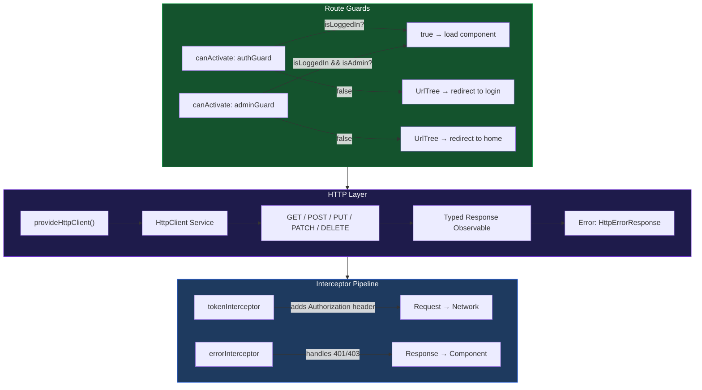

# الفصل الخامس — Services وHTTP والـ Interceptors والـ Guards

> **المتطلبات:** [[04-RxJS]] — لازم تعرف الـ Observable والـ subscribe والـ pipe والـ operators قبل ما تبدأ. الفصل ده هو المكان اللي كل ده بيتطبق فيه.

---

## البداية — لحظة اتصال الـ Frontend بالـ Backend

لحد دلوقتي كل الـ data اللي اشتغلنا عليها كانت **hardcoded** في الـ component نفسه:

```typescript
products = ['Laptop', 'Mouse', 'Keyboard']; // fake data
user = { name: 'Mohamed', role: 'admin' };  // fake data
```

في التطبيق الحقيقي — الـ data بتيجي من **Backend API**. في HTTP request بيتبعت، server بيرد بـ JSON، الـ frontend بيعرضه.

الرحلة دي فيها 4 layers مهمة في Angular:

```
Component → Service → HttpClient → Backend API
    ↑                                    ↓
    └─────── data flows back ────────────┘
```

**ليه 4 layers وليس مباشرة من الـ component؟**

- **Component** = مسؤول عن الـ UI بس. مش المفروض يعرف إزاي بيتبعت request.
- **Service** = مسؤول عن الـ logic والـ data. المكان الصح للـ HTTP calls.
- **HttpClient** = Angular's built-in HTTP tool.
- **Backend** = السيرفر اللي بيرد على الـ requests.

الـ Separation of Concerns ده بيخلي الكود قابل للـ testing والـ reuse.

> بس قبل ما نبدأ نكتب أي HTTP call — Angular محتاج يعرف إنك عايز تستخدم الـ HttpClient. إزاي نفعّله؟

---

## [[01-provideHttpClient]] — "تسجيل الـ HTTP Client"

الـ `HttpClient` مش متاح by default — لازم تـregisters في الـ `app.config.ts`:

```typescript
// app.config.ts
import { ApplicationConfig }                          from '@angular/core';
import { provideRouter }                              from '@angular/router';
import {
  provideHttpClient,
  withFetch,
  withInterceptors
} from '@angular/common/http';

import { routes }           from './app.routes';
import { tokenInterceptor } from './interceptors/token.interceptor';
import { errorInterceptor } from './interceptors/error.interceptor';

export const appConfig: ApplicationConfig = {
  providers: [
    provideRouter(routes),

    provideHttpClient(
      withFetch(),
      // Use the browser's native fetch() API internally
      // instead of the older XMLHttpRequest (XHR)
      // Benefits: better performance, works with Angular SSR

      withInterceptors([tokenInterceptor, errorInterceptor])
      // Register interceptors — we'll build these later in this chapter
    ),
  ],
};
```

بعد ما تضيف `provideHttpClient()` — أي Service في التطبيق تقدر تـ`inject(HttpClient)` وتبدأ تعمل HTTP requests.

---

## [[02-first-http-service]] — "أول Service بتكلم الـ Backend"

خليني نبني Service من الصفر خطوة خطوة. هنبدأ بأبسط حاجة ممكنة ونكبّرها.

### الخطوة الأولى — Service هيكلية فارغة

```typescript
// src/app/services/post.service.ts
import { Injectable, inject } from '@angular/core';
import { HttpClient }          from '@angular/common/http';
import { Observable }          from 'rxjs';

@Injectable({ providedIn: 'root' })
export class PostService {
  private http = inject(HttpClient);
  //             ^^^^^^^^^^^^^^^^^^
  // Angular gives us the HttpClient singleton
  // We can now make HTTP requests using this.http

  private baseUrl = 'https://jsonplaceholder.typicode.com';
  // The API base URL — stored here so we change it in ONE place
  // In real projects: use environment.apiUrl instead of hardcoding
}
```

### الخطوة الثانية — GET: جلب قائمة

```typescript
interface Post {
  id:     number;
  title:  string;
  body:   string;
  userId: number;
}

@Injectable({ providedIn: 'root' })
export class PostService {
  private http    = inject(HttpClient);
  private baseUrl = 'https://jsonplaceholder.typicode.com';

  // GET /posts — fetch all posts
  getPosts(): Observable<Post[]> {
    return this.http.get<Post[]>(`${this.baseUrl}/posts`);
    //                  ^^^^^^^^
    // The generic <Post[]> tells TypeScript:
    // "expect the response body to be an array of Post objects"
    // HttpClient WON'T validate this at runtime — TypeScript-only
    // But it gives you full type safety and autocomplete
  }
}
```

**لاحظ:** الـ `getPosts()` مش بتـsubscribe — بترجع الـ Observable نفسه. الـ component هو اللي هيـsubscribe.

---

### إزاي الـ Component يستخدم الـ Service

```typescript
import { Component, OnInit, inject } from '@angular/core';
import { PostService }               from './post.service';
import { AsyncPipe }                 from '@angular/common';

@Component({
  selector:   'app-posts',
  standalone: true,
  imports:    [AsyncPipe],
  template: `
    @if (isLoading) {
      <p>Loading posts...</p>
    } @else if (error) {
      <p class="error">{{ error }}</p>
    } @else {
      @for (post of posts; track post.id) {
        <article>
          <h3>{{ post.title }}</h3>
          <p>{{ post.body }}</p>
        </article>
      } @empty {
        <p>No posts found.</p>
      }
    }
  `,
})
export class PostsComponent implements OnInit {
  private postService = inject(PostService);

  posts:     Post[]        = [];
  isLoading: boolean       = true;
  error:     string | null = null;

  ngOnInit() {
    this.postService.getPosts().subscribe({
      next: (data) => {
        this.posts     = data;
        this.isLoading = false;
      },
      error: (err) => {
        this.error     = 'Failed to load posts. Please try again.';
        this.isLoading = false;
        console.error('HTTP error:', err);
      },
    });
  }
}
```

ده الـ pattern الأساسي: `isLoading → true` → request يتبعت → بييجي رد → `isLoading → false` + بيتعرض الـ data أو الـ error.

---

## [[03-all-http-methods]] — كل الـ HTTP Methods بالتفصيل

الـ `HttpClient` بيدعم كل الـ HTTP methods. خليني أشرح كل واحدة بمثال واضح يبيّن ليه بتستخدمها:

---

### GET — جلب data

```typescript
// GET all items
getAllPosts(): Observable<Post[]> {
  return this.http.get<Post[]>(`${this.baseUrl}/posts`);
}

// GET single item by ID
getPostById(id: number): Observable<Post> {
  return this.http.get<Post>(`${this.baseUrl}/posts/${id}`);
  // URL: /posts/42 → gets the post with id 42
}

// GET with query parameters — search/filter/pagination
searchPosts(query: string, page: number = 1): Observable<Post[]> {
  return this.http.get<Post[]>(`${this.baseUrl}/posts`, {
    params: {
      q:     query,
      page:  page.toString(),   // params must be strings
      limit: '10',
    }
    // Sends: GET /posts?q=angular&page=1&limit=10
  });
}

// GET with HttpParams (for dynamic params)
import { HttpParams } from '@angular/common/http';

getFiltered(filters: Record<string, string>): Observable<Post[]> {
  let params = new HttpParams();
  Object.entries(filters).forEach(([key, val]) => {
    params = params.set(key, val);
    // HttpParams is immutable — .set() returns a new instance
  });
  return this.http.get<Post[]>(`${this.baseUrl}/posts`, { params });
}
```

---

### POST — إنشاء resource جديد

```typescript
interface CreatePostDto {
  title:  string;
  body:   string;
  userId: number;
}

createPost(data: CreatePostDto): Observable<Post> {
  return this.http.post<Post>(`${this.baseUrl}/posts`, data);
  // Angular automatically:
  //   → serializes data to JSON string
  //   → sets Content-Type: application/json header
  //   → sends POST request with body
}
```

**الـ component بيستخدمه:**

```typescript
onSubmit() {
  const newPost: CreatePostDto = {
    title:  this.form.value.title,
    body:   this.form.value.body,
    userId: 1,
  };

  this.postService.createPost(newPost).subscribe({
    next: (created) => {
      console.log('Created with id:', created.id);
      this.router.navigate(['/posts', created.id]);
    },
    error: (err) => {
      this.errorMsg = err.error?.message || 'Failed to create post';
    },
  });
}
```

---

### PUT vs PATCH — الفرق المهم

```
PUT   = Replace the ENTIRE resource
PATCH = Update ONLY the specified fields
```

```typescript
// PUT — send the COMPLETE updated object
replacePost(id: number, fullPost: Post): Observable<Post> {
  return this.http.put<Post>(`${this.baseUrl}/posts/${id}`, fullPost);
  // Sends ALL fields — even unchanged ones
  // If you omit a field — the server might set it to null or delete it
}

// PATCH — send ONLY the changed fields
updatePostTitle(id: number, newTitle: string): Observable<Post> {
  return this.http.patch<Post>(`${this.baseUrl}/posts/${id}`, {
    title: newTitle
    // Only the title field is sent
    // Server updates title, keeps all other fields unchanged
  });
}

// Partial<T> — TypeScript type for "some fields of T"
updatePost(id: number, changes: Partial<Post>): Observable<Post> {
  return this.http.patch<Post>(`${this.baseUrl}/posts/${id}`, changes);
}
```

**متى تستخدم أيهم؟**

- `PUT` → لما بتعرض form فيها كل بيانات الـ resource وبترسلها كاملة بعد التعديل
- `PATCH` → لما بتغيّر field واحد أو اتنين بدون form كاملة

---

### DELETE — حذف resource

```typescript
deletePost(id: number): Observable<void> {
  return this.http.delete<void>(`${this.baseUrl}/posts/${id}`);
  // Most APIs return empty body on delete (204 No Content)
  // void type means: we don't care about the response body
}
```

**في الـ component مع تأكيد:**

```typescript
deletePost(id: number) {
  if (!confirm('Are you sure you want to delete this post?')) return;

  this.postService.deletePost(id).subscribe({
    next: () => {
      // Remove from local array without another HTTP call
      this.posts = this.posts.filter(p => p.id !== id);
      console.log('Post deleted successfully');
    },
    error: (err) => {
      this.errorMsg = 'Failed to delete. Please try again.';
    },
  });
}
```

---

## [[04-typed-responses]] — "الـ TypeScript Safety في HTTP"

الـ generic type في `http.get<T>()` بيعطيك **compile-time safety** — TypeScript بيعرف شكل الـ response:

```typescript
// Without type — response is 'any' — no safety
this.http.get('/api/posts').subscribe(data => {
  data.title;     // no error — but might crash at runtime if structure is different
  data.tittle;    // typo — no error! TypeScript can't help
  data.price.toFixed(2); // might crash — is price a number? TypeScript doesn't know
});

// With type — response is Post[] — full safety
this.http.get<Post[]>('/api/posts').subscribe(data => {
  data[0].title;     // ✅ TypeScript knows: data is Post[], post.title is string
  data[0].tittle;    // ❌ Error: 'tittle' does not exist on type 'Post'
  data[0].price;     // ❌ Error: 'price' does not exist on type 'Post'
  data[0].id * 2;    // ✅ TypeScript knows id is number
});
```

---

### الـ API Response Wrapper

في معظم الـ backends، الـ response مش مجرد data — بييجي wrapped:

```json
{
  "success": true,
  "message": "ok",
  "data": [ ... ]
}
```

عشان تتعامل معاه بشكل صح:

```typescript
interface ApiResponse<T> {
  success: boolean;
  message: string;
  data:    T;
}

// Typed correctly:
getPosts(): Observable<ApiResponse<Post[]>> {
  return this.http.get<ApiResponse<Post[]>>('/api/posts');
}

// In subscribe — access data through the wrapper:
this.postService.getPosts().subscribe({
  next: (response) => {
    this.posts = response.data;        // response.data is Post[]
    console.log(response.message);     // "ok"
    console.log(response.success);     // true
  },
});

// Or unwrap in the service with map():
import { map } from 'rxjs/operators';

getPostsDirect(): Observable<Post[]> {
  return this.http.get<ApiResponse<Post[]>>('/api/posts').pipe(
    map(response => response.data)
    // component gets Post[] directly — no wrapper
  );
}
```

---

## [[05-error-handling-http]] — "التعامل مع الأخطاء"

### الـ `HttpErrorResponse` — تشريح الـ Error Object

لما HTTP request تفشل — Angular بيبعتلك object من نوع `HttpErrorResponse` في الـ `error` callback:

```typescript
import { HttpErrorResponse } from '@angular/common/http';

this.postService.createPost(data).subscribe({
  next: (created) => { /* success */ },
  error: (err: HttpErrorResponse) => {
    // err contains EVERYTHING you need:
    console.log(err.status);         // HTTP status code: 400, 401, 403, 404, 500...
    console.log(err.statusText);     // "Bad Request", "Not Found", "Internal Server Error"...
    console.log(err.error);          // the response BODY — your backend's JSON error object
    console.log(err.error?.message); // your backend's custom message field
    console.log(err.url);            // the URL that failed
    console.log(err.message);        // Angular's own error message (less useful usually)
  },
});
```

**مثال: backend بيرجع:**
```json
{ "success": false, "message": "Email already exists" }
```

```typescript
error: (err: HttpErrorResponse) => {
  // err.status  = 400
  // err.error   = { success: false, message: "Email already exists" }
  this.errorMessage = err.error?.message || 'Something went wrong';
  // shows: "Email already exists"
}
```

---

### الـ Error Status Codes — معناها

```typescript
error: (err: HttpErrorResponse) => {
  switch (err.status) {
    case 0:
      // No internet / server is down / CORS error
      this.msg = 'Cannot connect to server. Check your internet.';
      break;
    case 400:
      // Bad Request — invalid data sent
      this.msg = err.error?.message || 'Invalid input data.';
      break;
    case 401:
      // Unauthorized — not logged in or token expired
      this.msg = 'Please log in to continue.';
      break;
    case 403:
      // Forbidden — logged in but not allowed
      this.msg = 'You don\'t have permission for this action.';
      break;
    case 404:
      // Not Found — resource doesn't exist
      this.msg = 'The requested item was not found.';
      break;
    case 422:
      // Unprocessable Entity — validation error
      this.msg = err.error?.message || 'Validation failed.';
      break;
    case 500:
      // Internal Server Error — backend bug
      this.msg = 'Server error. Please try again later.';
      break;
    default:
      this.msg = `Unexpected error (${err.status})`;
  }
}
```

---

### Error Handling في الـ Service مع `catchError`

```typescript
import { catchError, throwError } from 'rxjs';
import { HttpErrorResponse }       from '@angular/common/http';

createPost(data: CreatePostDto): Observable<Post> {
  return this.http.post<Post>('/api/posts', data).pipe(
    catchError((err: HttpErrorResponse) => {
      // Handle globally here — then re-throw for component
      if (err.status === 401) {
        this.router.navigate(['/login']); // global redirect
      }
      // Transform error message for better UX
      const msg = err.error?.message || 'Failed to create post';
      return throwError(() => new Error(msg));
      // Component's error handler now gets: Error("Failed to create post")
      // Not the raw HttpErrorResponse
    })
  );
}
```

> فهمنا HTTP. دلوقتي فيه مشكلة شائعة جداً: كل request محتاجة headers زي الـ Authorization token. لو كتبتها في كل request يدوياً — هيبقى كود متكرر. الحل؟ الـ Interceptors.

---

## [[06-what-is-interceptor]] — "الـ Middleware بتاع Angular"

الـ **Interceptor** هو function بتشتغل تلقائياً لكل HTTP request وresponse في التطبيق كله.

تخيّل إنك مقهى وفيه شخص في المدخل بيعمل 2 حاجة لكل زبون بيدخل:
- **عند الدخول:** بيتأكد إن معاه كارت العضوية (يضيف الـ token)
- **عند الخروج:** لو الزبون قال "النادل وقح" بيتدخل ويتعامل مع الموقف (بيـhandle الـ errors)

```
Without Interceptors:

PostService:  http.get('/api/posts', { headers: { Authorization: 'Bearer ...' } })
UserService:  http.get('/api/users', { headers: { Authorization: 'Bearer ...' } })
CartService:  http.post('/api/cart', data, { headers: { Authorization: 'Bearer ...' } })
OrderService: http.post('/api/orders', data, { headers: { Authorization: 'Bearer ...' } })
// Same header added manually in every single call — fragile and repetitive

With Interceptors:

Every http.* call → tokenInterceptor runs automatically → adds header
No code in services needed — interceptor handles it for ALL requests
```

---

### الـ Interceptor Pipeline — الصورة الكاملة

```
Component calls: postService.getPosts()
    ↓
HttpClient creates the request
    ↓
┌─── INTERCEPTOR PIPELINE (outgoing — request direction) ───────────┐
│  [1] tokenInterceptor                                              │
│      → reads token from localStorage                               │
│      → clones request with Authorization header added              │
│      → calls next(clonedRequest)                                   │
│                                                                    │
│  [2] errorInterceptor                                              │
│      → wraps next(req) with .pipe(catchError(...))                 │
│      → calls next(req) — passes to next handler                    │
└────────────────────────────────────────────────────────────────────┘
    ↓
HTTP request goes to the network
    ↓ (response comes back)
┌─── INTERCEPTOR PIPELINE (incoming — response direction) ──────────┐
│  [2] errorInterceptor (unwinding)                                  │
│      → if response is error: handle 401/403 → re-throw            │
│      → if response is success: pass through                        │
│                                                                    │
│  [1] tokenInterceptor (unwinding)                                  │
│      → pass through (nothing to do for responses)                  │
└────────────────────────────────────────────────────────────────────┘
    ↓
Component's subscribe({ next, error }) receives the result
```

---

### الـ Interceptor Function Signature

```typescript
import { HttpInterceptorFn, HttpRequest, HttpHandlerFn } from '@angular/common/http';

export const myInterceptor: HttpInterceptorFn = (req, next) => {
  // req:  the outgoing request — READ-ONLY (immutable)
  // next: a function — call it to pass the request to the next step
  //       returns Observable<HttpEvent<unknown>> — the response stream

  // Do something before the request:
  console.log('Request to:', req.url);

  // Pass the request along and return the response Observable:
  return next(req);
};
```

الـ Interceptor مش بيـblock الـ request — هو بيـpass it along بعد ما يعمل اللي محتاجه.

> إيه معنى إن الـ request immutable؟ وإزاي نغيّر فيه؟

---

## [[07-cloning-requests]] — "ليه الـ Request Immutable وإزاي نغيّره"

**الـ HttpRequest immutable** — مش تقدر تعدّل فيه مباشرةً:

```typescript
export const badInterceptor: HttpInterceptorFn = (req, next) => {
  req.headers.set('Authorization', 'Bearer token'); // ❌ does NOTHING
  // HttpHeaders is also immutable — .set() returns a NEW object, doesn't modify in place
  // The original req.headers is unchanged

  // This also doesn't work:
  // req.url = 'https://new-url.com'; // ❌ TypeScript Error: cannot assign to read-only property
};
```

**ليه Angular بيجعله immutable؟**

لأن نفس الـ request object ممكن يتمرر لعدة interceptors. لو واحد غيّره in-place — التاني هيشوف الـ request المعدّل من غير ما يعرف. الـ immutability بيضمن إن كل interceptor بيشتغل على نسخة واضحة.

**الحل: `req.clone()`**

```typescript
export const addHeaderInterceptor: HttpInterceptorFn = (req, next) => {
  // Create a NEW request object with modifications:
  const modifiedReq = req.clone({
    setHeaders: {
      'X-Custom-Header': 'my-value',
      'Accept-Language': 'ar',
    }
    // modifiedReq = copy of req + the new headers
    // req itself is UNCHANGED
  });

  return next(modifiedReq); // send the modified copy
};
```

```typescript
// All the things req.clone() can change:
req.clone({
  setHeaders: { 'Key': 'Value' },          // add/replace headers
  headers: req.headers.append('K', 'V'),   // append to existing headers
  url: 'https://new-url.com/api',          // change URL
  method: 'POST',                           // change method (rare)
  body: { ...req.body, extra: 'field' },   // change body (rare)
  setParams: { page: '1', limit: '10' },   // add query params
  params: req.params.append('sort', 'asc'),// append query params
  responseType: 'blob',                     // change expected response type
  withCredentials: true,                    // include cookies in cross-origin
})
```

---

## [[08-token-interceptor]] — "Token Interceptor: كل سطر بالتفصيل"

```typescript
// src/app/interceptors/token.interceptor.ts

import { HttpInterceptorFn } from '@angular/common/http';
import { inject }             from '@angular/core';
import { TokenService }       from '../services/token.service';

export const tokenInterceptor: HttpInterceptorFn = (req, next) => {
  // ─── Step 1: Get the token ─────────────────────────────────────────
  const token = inject(TokenService).getToken();
  // inject(TokenService): get the singleton service
  // .getToken(): reads from localStorage → returns string | null
  // inject() works here because interceptors run in Angular's injection context

  // ─── Step 2: Skip if no token ──────────────────────────────────────
  if (!token) {
    return next(req);
    // No token = user not logged in
    // Pass request as-is — public endpoints don't need Authorization
    // Examples: GET /api/posts, POST /api/auth/login, POST /api/auth/register
  }

  // ─── Step 3: Clone request with Authorization header ───────────────
  const authenticatedReq = req.clone({
    setHeaders: {
      Authorization: `Bearer ${token}`,
      // "Bearer " prefix is REQUIRED by the RFC 6750 standard
      // Your Express backend expects: Authorization: Bearer eyJhbGci...
      // Space between "Bearer" and the token is mandatory
    }
  });
  // authenticatedReq = copy of req + Authorization header
  // req is unchanged (immutable)

  // ─── Step 4: Pass the authenticated request ────────────────────────
  return next(authenticatedReq);
  // The network sends authenticatedReq — with the header
  // Any component making HTTP calls doesn't need to manually add this header
};
```

---

### مثال حي: إيه اللي بيحصل بالكامل

```
User is logged in. token = "eyJhbGci..."

1. PostsComponent calls: postService.getPosts()

2. HttpClient creates request:
   GET /api/posts
   Headers: { Accept: application/json }
   (no Authorization header yet)

3. tokenInterceptor runs:
   - inject(TokenService).getToken() → "eyJhbGci..."
   - token exists → create cloned request
   - cloned request:
     GET /api/posts
     Headers: { Accept: application/json, Authorization: "Bearer eyJhbGci..." }
   - next(clonedRequest)

4. Request goes to network:
   GET /api/posts HTTP/1.1
   Authorization: Bearer eyJhbGci...

5. Server validates token → sends back: { success: true, data: [...] }

6. PostsComponent subscribe.next() receives the data
```

---

## [[09-error-interceptor]] — "Error Interceptor: كل سطر بالتفصيل"

```typescript
// src/app/interceptors/error.interceptor.ts

import { HttpInterceptorFn, HttpErrorResponse } from '@angular/common/http';
import { inject }                               from '@angular/core';
import { catchError, throwError }               from 'rxjs';
import { Router }                               from '@angular/router';
import { AuthService }                          from '../services/auth.service';

export const errorInterceptor: HttpInterceptorFn = (req, next) => {
  const auth   = inject(AuthService);
  const router = inject(Router);
  // Get both services upfront — they're needed inside the error handler

  return next(req).pipe(
    // next(req): send the request forward
    // returns Observable<HttpEvent<T>> — the response stream
    // .pipe(): attach operators to the response stream

    catchError((err: HttpErrorResponse) => {
      // catchError intercepts ANY error in the response stream
      // err.status is the HTTP status code

      // ─── Handle 401 Unauthorized ─────────────────────────────────────
      if (err.status === 401) {
        // 401 = server doesn't recognize our token
        // Happens when: token expired, token tampered with, or missing
        // Action: force logout and send to login page

        auth.logout();
        // logout() does 3 things:
        //   1. Removes token from localStorage
        //   2. Notifies BehaviorSubject → Navbar hides user menu
        //   3. Navigates to /auth/login
      }

      // ─── Handle 403 Forbidden ────────────────────────────────────────
      if (err.status === 403) {
        // 403 = server KNOWS who you are, but you're not ALLOWED
        // Example: regular user hitting an admin-only endpoint
        // DO NOT logout — the user IS authenticated (token is valid)
        // Just redirect them away from the forbidden area

        router.navigate(['/']);
        // Send to home page — appropriate for both logged-in non-admins
        // and any edge cases where 403 occurs
      }

      // ─── Re-throw the error ──────────────────────────────────────────
      return throwError(() => err);
      // CRITICAL: re-throw the error so it continues propagating
      //
      // WITHOUT this line:
      //   catchError would "swallow" the error
      //   The Observable would complete (not error)
      //   Component's error handler would NEVER be called
      //   Component couldn't show "Invalid email or password" to the user
      //
      // WITH this line:
      //   Error continues downstream to the component's subscribe.error
      //   Both interceptor AND component can handle the error
      //   Interceptor = global handling (logout, redirect)
      //   Component   = local UI handling (show error message, re-enable button)
    })
  );
};
```

---

### الفرق بين الـ Interceptors الاثنين

```
tokenInterceptor:
  When: on every OUTGOING request
  What: adds Authorization header if token exists
  Modifies: the REQUEST
  Returns: next(modifiedRequest)

errorInterceptor:
  When: on every INCOMING response (if it's an error)
  What: handles 401 (logout) and 403 (redirect)
  Modifies: the RESPONSE stream (adds catchError)
  Returns: next(req).pipe(catchError(...))
```

---

### تسجيل الـ Interceptors — الترتيب مهم

```typescript
// app.config.ts
provideHttpClient(
  withInterceptors([tokenInterceptor, errorInterceptor])
  //                     [1]               [2]
)
```

**الترتيب في الـ outgoing direction (request):**
`tokenInterceptor` أولاً ← يضيف الـ token ← بعدين `errorInterceptor`

**الترتيب في الـ incoming direction (response):**
يتعكس — `errorInterceptor` أولاً ← يـhandle الـ errors ← بعدين `tokenInterceptor`

الـ interceptors بتشتغل زي stack — LIFO للـ responses.

> فهمنا كيف نبعت requests ونـhandle أخطاء على مستوى التطبيق كله. دلوقتي الجزء الأخير: إزاي نتحكم في من يقدر يوصل لأيه صفحة؟

---

## [[10-routing-basics]] — "الـ Routing: توصيل الـ URL للـ Component"

في Angular، الـ **Router** هو اللي بيقرر component أيه يتعرض لما الـ URL يتغيّر.

```typescript
// app.routes.ts
import { Routes } from '@angular/router';

export const routes: Routes = [
  {
    path: 'home',
    // matches: http://localhost:4200/home
    loadComponent: () => import('./home/home').then(c => c.HomeComponent),
  },
  {
    path: 'about',
    loadComponent: () => import('./about/about').then(c => c.AboutComponent),
  },
];
```

الـ `loadComponent` هو **Lazy Loading** — Angular مش بيحمّل كود الـ component غير لما المستخدم يفتح صفحته. بيقلّل حجم الـ initial bundle بشكل كبير.

---

### أنواع الـ Paths

```typescript
export const routes: Routes = [
  // Static path
  { path: 'home', loadComponent: () => import('./home') },

  // Dynamic parameter
  { path: 'posts/:id', loadComponent: () => import('./post-detail') },
  // Matches: /posts/1, /posts/42, /posts/abc
  // router.params['id'] gives you the value

  // Redirect
  { path: '', redirectTo: 'home', pathMatch: 'full' },
  // Empty URL → redirect to /home
  // pathMatch: 'full' is required to avoid matching EVERY url

  // Wildcard — must be LAST
  { path: '**', loadComponent: () => import('./not-found') },
  // Matches anything not matched above
];
```

---

### لماذا `pathMatch: 'full'` على الـ redirect؟

```typescript
// WITHOUT pathMatch: 'full'
{ path: '', redirectTo: 'home' }
// path: '' matches the START of EVERY URL
// /about starts with '' → redirect to /home ← WRONG!
// /posts starts with '' → redirect to /home ← WRONG!
// This creates infinite redirect loops

// WITH pathMatch: 'full'
{ path: '', redirectTo: 'home', pathMatch: 'full' }
// path: '' matches ONLY if the ENTIRE URL is '' (empty)
// /about → doesn't match → continues to next route ✅
// ''     → matches → redirects to /home ✅
```

---

### Nested Routes — المسارات المتداخلة

```typescript
export const routes: Routes = [
  {
    path: 'dashboard',
    // No component on parent — just groups children
    children: [
      { path: '',         loadComponent: () => import('./dashboard/overview') },
      { path: 'stats',    loadComponent: () => import('./dashboard/stats')    },
      { path: 'settings', loadComponent: () => import('./dashboard/settings') },
    ],
  },
  // URLs: /dashboard, /dashboard/stats, /dashboard/settings
];
```

---

## [[11-route-guards]] — "الـ Guards: حارس البوابة"

الـ **Route Guard** هو function بتشتغل قبل ما Angular يفتح route معينة. بيقرر: "هل المستخدم مسموحه يدخل هنا؟"

```
User navigates to /profile
    ↓
Angular finds: { path: 'profile', canActivate: [authGuard], ... }
    ↓
Angular calls: authGuard()
    ↓
  Returns true  → navigation continues → Profile loads ✅
  Returns UrlTree → navigation BLOCKED → redirected to UrlTree path ↩️
  Returns false → navigation BLOCKED silently ❌
```

---

### الـ Guard Type Signature

```typescript
import { CanActivateFn, ActivatedRouteSnapshot, RouterStateSnapshot } from '@angular/router';

// Full signature:
type CanActivateFn = (
  route: ActivatedRouteSnapshot, // info about the target route
  state: RouterStateSnapshot     // info about the current router state
) => boolean | UrlTree | Observable<boolean | UrlTree> | Promise<boolean | UrlTree>;

// In practice — if you don't need route/state:
export const myGuard: CanActivateFn = () => {
  return true; // or false, or UrlTree
};
```

الـ Guard ممكن يرجع:
- `true` → proceed
- `false` → block silently
- `UrlTree` → block + redirect to this URL (الأشهر)
- `Observable<boolean | UrlTree>` → async check (مثلاً check مع backend)
- `Promise<boolean | UrlTree>` → async check

---

## [[12-auth-guard]] — "authGuard: كل سطر بالتفصيل"

```typescript
// src/app/guards/auth.guard.ts

import { inject }                    from '@angular/core';
import { CanActivateFn, Router }     from '@angular/router';
import { AuthService }               from '../services/auth.service';

export const authGuard: CanActivateFn = () => {
  // No need for (route, state) parameters — we don't use them
  // TypeScript allows omitting unused parameters

  const auth = inject(AuthService);
  // Get the AuthService singleton
  // inject() works here — guards run in injection context

  if (auth.isLoggedIn()) {
    return true;
    // Token exists AND is not expired
    // Angular proceeds: loads the guarded component
  }

  return inject(Router).createUrlTree(['/auth/login']);
  // User is NOT authenticated
  // createUrlTree() creates a UrlTree — Angular's instruction to redirect
  // DO NOT use router.navigate() here — guards must return synchronously
  // router.navigate() is async (returns Promise) — Angular can't wait for it in a guard
  // createUrlTree() is synchronous — perfect for guards

  // ['/auth/login'] = the path to redirect to
  // Leading '/' means absolute path (not relative)
};
```

**في الـ routes:**

```typescript
export const routes: Routes = [
  { path: 'profile', canActivate: [authGuard], loadComponent: () => import('./profile') },
  { path: 'cart',    canActivate: [authGuard], loadComponent: () => import('./cart')    },
  { path: 'orders',  canActivate: [authGuard], loadComponent: () => import('./orders')  },
];
```

---

## [[13-admin-guard]] — "adminGuard: كل سطر بالتفصيل"

```typescript
// src/app/guards/admin.guard.ts

import { inject }                from '@angular/core';
import { CanActivateFn, Router } from '@angular/router';
import { AuthService }           from '../services/auth.service';

export const adminGuard: CanActivateFn = () => {
  const auth   = inject(AuthService);

  if (auth.isLoggedIn() && auth.isAdmin()) {
    // isLoggedIn(): token exists and not expired
    // isAdmin(): decoded token has role === 'admin'
    //
    // Why check BOTH? Isn't isAdmin() enough?
    // If not logged in → getCurrentUser() returns null
    // null?.role === 'admin' → undefined === 'admin' → false
    // So isAdmin() alone would work — but isLoggedIn() && isAdmin() is more explicit

    return true;
    // User is authenticated AND has admin role → allow access
  }

  return inject(Router).createUrlTree(['/']);
  // Redirect to home — NOT to /auth/login
  //
  // Why home and not login?
  // Case 1: logged in but not admin → sending them to login makes no sense
  //         They ARE logged in — just don't have admin role
  //         Home is the right place for them
  // Case 2: not logged in → home is fine too (usually shows public content)
  //         Or home itself might be protected by authGuard and redirect to login
};
```

---

### حماية كاملة لقسم كامل من الـ app

```typescript
export const routes: Routes = [
  // Protect ALL admin routes with one guard on the PARENT:
  {
    path: 'admin',
    canActivate: [adminGuard],
    // adminGuard protects ALL children automatically
    children: [
      { path: '',        loadComponent: () => import('./admin/dashboard') },
      { path: 'users',   loadComponent: () => import('./admin/users')     },
      { path: 'reports', loadComponent: () => import('./admin/reports')   },
      // All these are protected — adminGuard runs before any of them
    ],
  },
];
// Navigating to /admin, /admin/users, or /admin/reports
// → adminGuard runs → blocks if not admin
```

---

## [[14-complete-routes]] — `app.routes.ts` الكامل بكل سطر

```typescript
// src/app/app.routes.ts

import { Routes } from '@angular/router';
// Routes: TypeScript type for the array — ensures correct structure

import { authGuard }  from './guards/auth.guard';
import { adminGuard } from './guards/admin.guard';

export const routes: Routes = [

  // ─── Root redirect ────────────────────────────────────────────────────
  {
    path:      '',
    redirectTo: 'home',
    pathMatch:  'full',
    // Empty URL → /home
    // pathMatch: 'full' prevents matching every URL (see explanation above)
  },

  // ─── Public routes — no guard needed ─────────────────────────────────
  {
    path: 'home',
    loadComponent: () => import('./features/home/home').then(c => c.HomeComponent),
    // Lazy loaded — only downloaded when user visits /home
    // import() returns Promise<module>
    // .then(c => c.HomeComponent) extracts the named export
  },

  {
    path: 'posts',
    loadComponent: () => import('./features/posts/post-list').then(c => c.PostListComponent),
  },

  {
    path: 'posts/:id',
    // Dynamic segment — :id is a URL parameter
    // /posts/42 → route.params['id'] === '42'
    loadComponent: () => import('./features/posts/post-detail').then(c => c.PostDetailComponent),
  },

  // ─── Auth routes — group under /auth ─────────────────────────────────
  {
    path: 'auth',
    children: [
      {
        path: 'login',
        // /auth/login
        loadComponent: () => import('./features/auth/login').then(c => c.LoginComponent),
      },
      {
        path: 'register',
        // /auth/register
        loadComponent: () => import('./features/auth/register').then(c => c.RegisterComponent),
      },
    ],
  },

  // ─── Protected routes — require login ────────────────────────────────
  {
    path: 'profile',
    canActivate: [authGuard],
    loadComponent: () => import('./features/profile/profile').then(c => c.ProfileComponent),
  },

  {
    path: 'cart',
    canActivate: [authGuard],
    loadComponent: () => import('./features/cart/cart').then(c => c.CartComponent),
  },

  {
    path: 'orders',
    canActivate: [authGuard],
    // Guard on parent → all children are protected
    children: [
      {
        path: '',
        // /orders
        loadComponent: () => import('./features/orders/order-list').then(c => c.OrderListComponent),
      },
      {
        path: ':id',
        // /orders/abc123
        loadComponent: () => import('./features/orders/order-detail').then(c => c.OrderDetailComponent),
      },
    ],
  },

  // ─── Admin routes — require login + admin role ────────────────────────
  {
    path: 'admin',
    canActivate: [adminGuard],
    children: [
      {
        path: '',
        // /admin
        loadComponent: () => import('./features/admin/dashboard').then(c => c.AdminDashboardComponent),
      },
      {
        path: 'users',
        // /admin/users
        loadComponent: () => import('./features/admin/users').then(c => c.AdminUsersComponent),
      },
    ],
  },

  // ─── 404 — must be LAST ────────────────────────────────────────────────
  {
    path: '**',
    // Wildcard — matches ANYTHING not matched above
    // If placed first or in the middle → catches everything!
    loadComponent: () => import('./features/not-found/not-found').then(c => c.NotFoundComponent),
  },
];
```

---

## 🗺️ الخريطة الكاملة للفصل



---

## ✅ Checkpoint — أسئلة الإنترفيو

**س: إيه الفرق بين PUT وPATCH؟**
> `PUT` بيستبدل الـ resource كاملاً — لازم ترسل كل الـ fields حتى اللي ما اتغيرتش. `PATCH` بيعدّل بس الـ fields اللي ذكرتها — الباقي بيفضل زي ما هو. في الغالب `PATCH` أنسب للـ update operations لأنه أخف وأأمن.

**س: إيه الـ Interceptor وإيه فايدته؟**
> الـ Interceptor هو middleware بيشتغل أوتوماتيك لكل HTTP request/response. بيحل مشكلة تكرار الكود — بدل ما تضيف Authorization header في كل request يدوياً، الـ tokenInterceptor بيضيفه لكل request تلقائياً. الـ errorInterceptor بيـhandle الـ 401 و403 globally بدل ما كل service تعمل ده بنفسها.

**س: ليه الـ HttpRequest immutable وإيه الحل؟**
> Immutability بتضمن إن كل interceptor بيشوف نسخة نظيفة من الـ request ومش متأثرة بـ interceptors تانية. الحل: `req.clone({...})` اللي بتعمل نسخة جديدة من الـ request مع التعديلات المطلوبة — الأصلي بيفضل unchanged.

**س: إيه الفرق بين `router.navigate()` و `router.createUrlTree()` في الـ Guards؟**
> `router.navigate()` بترجع `Promise<boolean>` — async. الـ Guard لازم يرجع نتيجة synchronous أو Observable/Promise معروف. `createUrlTree()` بترجع `UrlTree` object بشكل synchronous — Angular فاهمه مباشرة كـ redirect instruction. الـ Guards بتستخدم `createUrlTree()` لأنه sync ومتوافق مع نظام الـ Guard.

**س: إيه معنى `pathMatch: 'full'` على الـ redirect routes؟**
> بدونه، الـ empty path `''` بتـmatch بداية كل URL — كل URL بيبدأ بـ `''`. النتيجة: كل صفحة بتعمل redirect! مع `pathMatch: 'full'` — بيـmatch بس لما الـ URL كاملاً هو `''` (empty). بيمنع الـ infinite redirect loops.

---

## 🛠️ Practical Exercise — HTTP وGuards من الصفر

### Task 1 — اقرأ وتنبّأ

```typescript
@Injectable({ providedIn: 'root' })
export class DataService {
  private http = inject(HttpClient);

  getData(): Observable<{ id: number; value: string }[]> {
    return this.http.get<{ id: number; value: string }[]>(
      'https://api.example.com/data'
    ).pipe(
      map(items => items.filter(i => i.id > 2)),
      tap(filtered => console.log('Count after filter:', filtered.length)),
      catchError(err => {
        if (err.status === 404) return of([]);
        return throwError(() => err);
      })
    );
  }
}
```

**بافتراض الـ API رجعت:**
```json
[
  { "id": 1, "value": "alpha" },
  { "id": 2, "value": "beta"  },
  { "id": 3, "value": "gamma" },
  { "id": 4, "value": "delta" }
]
```

**أجب:**
1. إيه اللي بيوصل للـ component في `subscribe.next`؟
2. ماذا يُطبع في الـ console؟
3. لو الـ API رجعت 404 — إيه اللي بيوصل للـ component؟
4. لو الـ API رجعت 500 — إيه اللي بيوصل للـ component؟

---

### Task 2 — اكمل الـ Interceptor

```typescript
// A logging interceptor that:
// 1. Logs the method and URL before every request
// 2. Logs "Success" + status code after successful response
// 3. Logs "Error" + status code after failed response
// 4. Logs the time each request took (in ms)

export const loggingInterceptor: HttpInterceptorFn = (req, next) => {
  const startTime = Date.now();
  console.log(`[HTTP] ${req.method} ${req.url}`);

  return next(req).pipe(
    tap(event => {
      // event can be HttpResponse (success) or other HttpEvents
      // Check: if (event instanceof HttpResponse) { ... }
      // HttpResponse has: event.status, event.body
      // ??? log success
    }),
    catchError(err => {
      // ??? log error
      // ??? re-throw
    }),
  );
};
```

---

### Task 3 — اكتب Service كامل

اكتب `UserService` بالـ CRUD operations كاملة:

```typescript
interface User {
  id:    number;
  name:  string;
  email: string;
  role:  'admin' | 'viewer';
}

@Injectable({ providedIn: 'root' })
export class UserService {
  private http    = inject(HttpClient);
  private baseUrl = 'https://api.example.com/users';

  // 1. getAll(): fetch all users
  // 2. getById(id: number): fetch one user
  // 3. create(data: Omit<User, 'id'>): create new user
  // 4. update(id: number, changes: Partial<User>): partial update
  // 5. delete(id: number): delete user

  // Each method should:
  // - Return a typed Observable
  // - Handle errors with catchError
  // - Use the correct HTTP method
}
```

---

### Task 4 — اكتب Guards

```typescript
// Guard 1: premiumGuard
// Allows access only if user is logged in AND user.role === 'premium'
// Redirects to /upgrade if logged in but not premium
// Redirects to /auth/login if not logged in

// Guard 2: publicOnlyGuard
// Blocks access if user IS logged in (opposite of authGuard!)
// Use case: /auth/login and /auth/register — logged-in users shouldn't see these
// Redirects to /home if already logged in
// Allows through if NOT logged in
```

---

## 🫒 زتونة الإنترفيو

> **"Angular's HTTP layer has four levels: `provideHttpClient()` sets it up globally, `HttpClient` makes typed requests returning Observables, Interceptors are middleware that run automatically for every request (tokenInterceptor adds Authorization headers, errorInterceptor handles 401/403 globally), and Route Guards are functions that run before navigation — returning `true` to allow or `UrlTree` (via `createUrlTree()`) to redirect. This architecture means no component ever needs to manually add auth headers, handle session expiry, or check login status before navigation — all of that happens in the shared infrastructure layer."**

---

*Next → [[06-Reactive-Forms]] — عارفين إزاي نبعت data للـ backend. بس إزاي نجمع الـ data من المستخدم أولاً؟ الـ Reactive Forms هو نظام Angular الكامل لبناء forms مع validation وerror messages وكل الـ states.*
