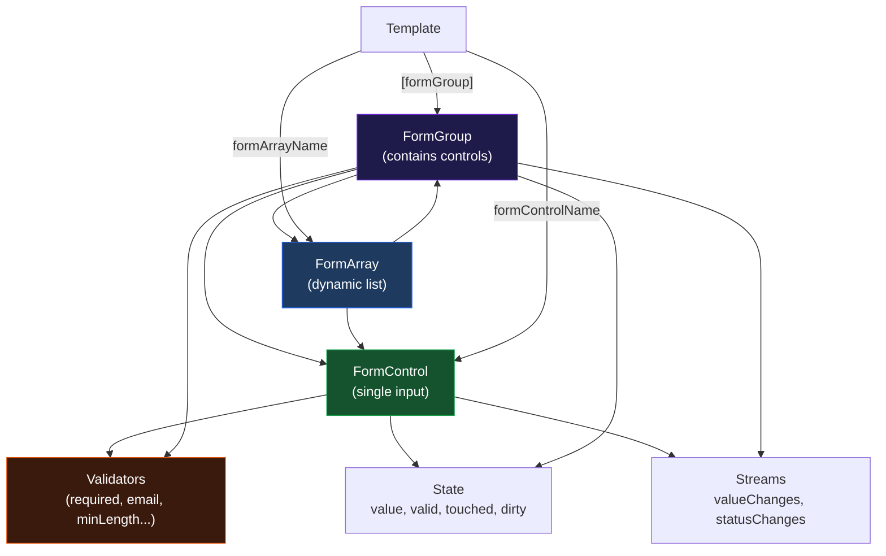

# الفصل السادس — Reactive Forms: بناء Forms بالطريقة الصح

> **المتطلبات:** [[02-Angular-Architecture]] و[[05-Services-HTTP-Interceptors-Guards]] — لازم تعرف الـ Component والـ Data Binding وإزاي بتبعت data للـ backend.

---

## البداية — المشكلة مع الـ Forms في HTML العادي

خليني أفرض عليك موقف:

عندك صفحة تسجيل. فيها: اسم أول، اسم أخير، ايميل، كلمة سر، تاريخ ميلاد. وعندك قواعد:
- الاسم: مطلوب، على الأقل 2 حروف
- الايميل: مطلوب، صيغة email صحيحة
- الكلمة السر: مطلوبة، على الأقل 8 حروف
- لو الإرسال فشل: اعرض رسالة خطأ من السيرفر
- لو الإرسال بيتبعت: عطّل الزرار وعرض "Loading..."
- لو فيه errors: اعرض رسالة تحت كل field غلط

في الـ HTML العادي:

```html
<form onsubmit="handleSubmit()">
  <input id="firstName" type="text" required minlength="2" />
  <span id="firstNameError" style="display:none">Name is required</span>

  <input id="email" type="email" required />
  <span id="emailError" style="display:none">Valid email required</span>

  <button id="submitBtn" type="submit">Register</button>
</form>

<script>
function handleSubmit() {
  const firstName = document.getElementById('firstName').value;
  const email = document.getElementById('email').value;
  let hasError = false;

  if (!firstName || firstName.length < 2) {
    document.getElementById('firstNameError').style.display = 'block';
    hasError = true;
  }

  if (!email || !email.includes('@')) {
    document.getElementById('emailError').style.display = 'block';
    hasError = true;
  }

  if (hasError) return;

  document.getElementById('submitBtn').disabled = true;
  document.getElementById('submitBtn').textContent = 'Loading...';

  // fetch('/api/register', { method: 'POST', body: ... }).then(...)
}
</script>
```

ده كود كتير جداً لحاجة بسيطة. وكل ما تضيف field — تضيف validation يدوي، وتضيف DOM manipulation يدوي، وتضيف error display يدوي.

Angular's Reactive Forms حلّت المشكلة دي بالكامل. بتعرّف الـ form وقواعدها في TypeScript — وAngular بيتكفل بكل حاجة تانية أوتوماتيك.

> بس قبل ما نبني form — Angular بيقدم طريقتين للـ forms. إيه الفرق وليه نختار واحدة على التانية؟

---

## [[01-two-approaches]] — طريقتان للـ Forms في Angular

Angular بيقدم **طريقتين**:

---

### الطريقة الأولى — Template-Driven Forms

```html
<!-- The form LIVES in HTML -->
<form #regForm="ngForm" (ngSubmit)="submit(regForm)">
  <input name="email"
         [(ngModel)]="email"
         required
         email />

  <input name="password"
         [(ngModel)]="password"
         required
         minlength="6" />

  <button type="submit">Register</button>
</form>
```

```typescript
email    = '';
password = '';

submit(form: NgForm) {
  if (form.valid) { /* do something */ }
}
```

**المشاكل:**
1. **الـ form structure في الـ HTML** — TypeScript "أعمى" — مش عارف إيه الـ fields إلا لو قرأ الـ HTML
2. **الـ validation مبعثرة** — بعضها في HTML (`required`, `email`) وبعضها في TypeScript
3. **Dynamic forms صعبة** — تضيف أو تحذف fields برمجياً؟ محتاج كود كتير
4. **مش قابلة للـ Testing** — مش تقدر تـtest الـ form logic بدون DOM

---

### الطريقة الثانية — Reactive Forms (المطلوبة)

```typescript
// The form LIVES in TypeScript — source of truth
registerForm = new FormGroup({
  email:    new FormControl('', [Validators.required, Validators.email]),
  password: new FormControl('', [Validators.required, Validators.minLength(6)]),
});
```

```html
<!-- HTML just CONNECTS to the TypeScript form -->
<form [formGroup]="registerForm" (ngSubmit)="submit()">
  <input formControlName="email" />
  <input formControlName="password" />
</form>
```

**المميزات:**
1. **الـ form structure في TypeScript** — clear, readable, testable
2. **كل الـ validation في TypeScript** — مكان واحد
3. **Dynamic forms سهلة** — add/remove controls بـ code
4. **Observable streams** — `valueChanges` و`statusChanges`
5. **TypeScript autocomplete** — يعرف شكل الـ form values
6. **Unit testable** — test الـ form من غير DOM

**القاعدة في المشاريع الجدية:** استخدم دايماً **Reactive Forms**. Template-Driven بس للـ demos البسيطة جداً.

> عشان تفهم Reactive Forms — محتاج تعرف الـ building blocks بتاعتها. أبسط حاجة: **FormControl**.

---

## [[02-formcontrol-deep]] — FormControl: "الذرة" بتاعة الـ Form

الـ **`FormControl`** هو أصغر وحدة في الـ Reactive Forms. بيمثّل **input واحد** بس.

```typescript
import { FormControl, Validators } from '@angular/forms';

// The simplest FormControl:
const nameControl = new FormControl('');
// First argument = initial value (empty string = input starts empty)

// With a single validator:
const requiredName = new FormControl('', Validators.required);

// With multiple validators:
const emailControl = new FormControl('', [
  Validators.required,
  Validators.email,
]);

// With an initial value:
const priceControl = new FormControl(100);
// Input starts pre-filled with 100

// Typed FormControl (Angular 14+):
const countControl = new FormControl<number>(0);
// TypeScript knows this is a number control — better autocomplete
```

---

### قراءة الـ State — كل property بتعنيه إيه

كل `FormControl` عنده collection من الـ state properties تقدر تقراها في أي وقت:

```typescript
const email = new FormControl('', [Validators.required, Validators.email]);

// VALUE
email.value          // the current string in the input — '' initially
email.getRawValue()  // same as value, but includes disabled controls

// VALIDITY
email.valid          // true if ALL validators pass — false if ANY fails
email.invalid        // exact opposite of valid (always: valid !== invalid)
email.status         // 'VALID' | 'INVALID' | 'PENDING' | 'DISABLED'
email.errors
// null if valid
// Object if invalid: { required: true } or { email: true }
// Angular names the error after the validator that failed

// USER INTERACTION TRACKING
email.touched        // true once user clicked INTO the input and then OUT (blur)
email.untouched      // opposite — user never interacted
email.dirty          // true once user CHANGED the value (typed something)
email.pristine       // opposite — value unchanged from initial

// SPECIAL STATES
email.pending        // true while async validator is running
email.disabled       // true if control is disabled
email.enabled        // opposite of disabled
```

---

### الـ touched/dirty distinction — لماذا الاثنين؟

ده بيحصل فيه confusion كبير. هم مختلفان:

```
touched = the user INTERACTED (clicked and left — blur event)
dirty   = the user CHANGED the value

Examples:

User focuses input → presses Tab without typing:
  touched: true  (they left the field)
  dirty:   false (value didn't change)

User focuses input → types "hello" → deletes it → presses Tab:
  touched: true  (they left the field)
  dirty:   true  (the value WAS changed, even if it's empty again)

User never touches the input:
  touched: false
  dirty:   false
```

**متى تستخدم كل منهما؟**

```html
<!-- Show error only when user has LEFT the field AND it's invalid -->
@if (email.touched && email.invalid) {
  <small class="error">Invalid email</small>
}

<!-- Enable save button only when something actually changed -->
<button [disabled]="form.pristine">Save Changes</button>
<!-- pristine = nothing changed — no point saving -->
```

---

### تعديل الـ FormControl — الـ Methods

```typescript
const control = new FormControl('initial');

// Change the value:
control.setValue('new value');
// setValue replaces value AND triggers validation AND emits on valueChanges

// Silently update (no event emitted):
control.setValue('new value', { emitEvent: false });
// Useful when you don't want to trigger subscriptions

// Reset:
control.reset();
// Goes back to initial value, marks as pristine and untouched

control.reset('specific value');
// Resets to a specific value instead of the original initial

// Manually set interaction state:
control.markAsTouched();
// Useful for showing all errors on form submit:
// when user clicks submit without touching any field

control.markAsDirty();
control.markAsPristine();
control.markAsUntouched();

// Enable/Disable:
control.disable();
// Value becomes excluded from form.value
// Input becomes non-interactive in the template

control.enable();
// Re-enables the control

// Check specific error:
control.hasError('required')   // true/false
control.hasError('minlength')  // true/false
control.getError('minlength')
// Returns: { requiredLength: 6, actualLength: 3 } — the error details object
```

---

### مثال عملي — FormControl وحده

```typescript
@Component({
  selector: 'app-search',
  standalone: true,
  imports: [ReactiveFormsModule],
  template: `
    <input [formControl]="searchControl" placeholder="Search..." />
    <!-- [formControl] — binds directly to a standalone FormControl -->
    <!-- (not formControlName — that's only inside FormGroup) -->

    @if (searchControl.value) {
      <button (click)="clear()">Clear</button>
    }

    <p>
      Value: "{{ searchControl.value }}"
      | Length: {{ searchControl.value?.length ?? 0 }}
    </p>
  `,
})
export class SearchComponent {
  searchControl = new FormControl('');

  clear() {
    this.searchControl.reset();
  }
}
```

لاحظ: الـ `[formControl]` (بدون `Name`) بيستخدم مع standalone `FormControl` من غير `FormGroup`.

> واحد `FormControl` وحده كافي للـ search أو الـ simple inputs. بس لما عندك form فيها fields كتيرة متربطة ببعض — محتاج `FormGroup`.

---

## [[03-formgroup-deep]] — FormGroup: "تجميع الـ Controls"

الـ **`FormGroup`** بيجمع مجموعة `FormControl` في object واحد ويـtrack الـ aggregate state.

```typescript
import { FormGroup, FormControl, Validators } from '@angular/forms';

const loginForm = new FormGroup({
  email:    new FormControl('', [Validators.required, Validators.email]),
  password: new FormControl('', [Validators.required, Validators.minLength(6)]),
});
```

---

### الـ Aggregate State — الـ Form ككل

```typescript
// FormGroup aggregates ALL its controls:

loginForm.valid
// true ONLY if ALL controls pass ALL their validators
// If email is invalid OR password is invalid → form.valid = false

loginForm.invalid   // true if ANY control is invalid

loginForm.touched
// true if ANY control has been touched
// Once user interacts with ONE field → form.touched = true

loginForm.dirty
// true if ANY control's value has changed from initial

loginForm.value
// Returns an object with ALL control values:
// { email: 'user@example.com', password: 'secret123' }
// Note: DISABLED controls are EXCLUDED from .value
// Use loginForm.getRawValue() to include disabled controls
```

---

### الوصول للـ Controls داخل الـ FormGroup

```typescript
// 3 ways to access a control — all equivalent:

loginForm.get('email')
// Returns FormControl | null — returns null if name doesn't exist
// The safe way — works for nested groups too

loginForm.controls['email']
// Direct property access — TypeScript knows the keys
// Returns FormControl directly (no null)

loginForm.controls.email
// Same as above — dot notation
```

```typescript
// Reading the email control's state:
loginForm.get('email')?.value    // current email string
loginForm.get('email')?.valid    // is email valid?
loginForm.get('email')?.errors   // null or { required: true } or { email: true }
loginForm.get('email')?.touched  // has user clicked the email field?
```

---

### Nested FormGroups — Groups داخل Groups

```typescript
const userForm = new FormGroup({
  // Nested FormGroup for address:
  address: new FormGroup({
    street: new FormControl('', Validators.required),
    city:   new FormControl('', Validators.required),
    zip:    new FormControl('', [
      Validators.required,
      Validators.pattern(/^\d{5}$/)  // exactly 5 digits
    ]),
  }),
  // Regular controls:
  email: new FormControl('', [Validators.required, Validators.email]),
  phone: new FormControl(''),
});

// Accessing nested values:
userForm.get('address')           // returns the nested FormGroup
userForm.get('address.city')      // directly access nested control using dot notation
userForm.get('address')?.get('city')  // same thing

// Form value:
userForm.value
// {
//   address: { street: '123 Main St', city: 'Cairo', zip: '12345' },
//   email: 'user@example.com',
//   phone: ''
// }
```

```html
<!-- Template for nested groups: -->
<form [formGroup]="userForm">
  <div formGroupName="address">
    <!-- formGroupName connects to the nested FormGroup -->
    <input formControlName="street" placeholder="Street" />
    <input formControlName="city"   placeholder="City" />
    <input formControlName="zip"    placeholder="ZIP" />
  </div>
  <input formControlName="email" placeholder="Email" />
  <input formControlName="phone" placeholder="Phone" />
</form>
```

> فهمنا `FormControl` و`FormGroup`. فيه نوع تالت اسمه `FormArray` — لما عندك عدد غير محدد من الـ fields. بس خليني أشرح الـ Validators أولاً لأنها مهمة جداً.

---

## [[04-validators-deep]] — Validators: "قواعد القبول"

### الـ Built-in Validators

```typescript
import { Validators } from '@angular/forms';

// Validators.required — value must not be empty, null, or ''
new FormControl('', Validators.required)
// Error object when fails: { required: true }

// Validators.email — basic email format check (has @ and .)
new FormControl('', Validators.email)
// Error: { email: true }
// Note: 'a@b' passes (basic check) — use pattern() for stricter

// Validators.minLength(n) — string must be at least n characters
new FormControl('', Validators.minLength(6))
// Error: { minlength: { requiredLength: 6, actualLength: 3 } }
// Note: EMPTY string passes minLength — combine with required!

// Validators.maxLength(n) — string must be at most n characters
new FormControl('', Validators.maxLength(100))
// Error: { maxlength: { requiredLength: 100, actualLength: 150 } }

// Validators.min(n) — numeric value must be >= n
new FormControl(0, Validators.min(1))
// Error: { min: { min: 1, actual: 0 } }

// Validators.max(n) — numeric value must be <= n
new FormControl(200, Validators.max(100))
// Error: { max: { max: 100, actual: 200 } }

// Validators.pattern(regex) — value must match regex
new FormControl('', Validators.pattern(/^[0-9]{11}$/))
// Exactly 11 digits — Egyptian phone number format
// Error: { pattern: { requiredPattern: '...', actualValue: '...' } }

// Validators.nullValidator — does nothing (useful as placeholder)
new FormControl('', Validators.nullValidator)
// Never fails
```

---

### كيف يعمل الـ Validator داخلياً

الـ Validator هو **function عادية** بتاخد control وترجع null أو error object:

```typescript
import { AbstractControl, ValidationErrors } from '@angular/forms';

// The "required" validator looks like this internally:
function required(control: AbstractControl): ValidationErrors | null {
  const value = control.value;

  // Empty string, null, undefined, or whitespace-only → invalid
  if (value === null || value === undefined || value === '') {
    return { required: true };
    // The KEY 'required' becomes the error name
    // Angular stores this in control.errors = { required: true }
  }

  return null; // valid — no error
}

// The "email" validator roughly looks like:
function email(control: AbstractControl): ValidationErrors | null {
  if (!control.value) return null;
  // Empty → don't validate format (required handles empty)

  const emailRegex = /^[^\s@]+@[^\s@]+\.[^\s@]+$/;
  return emailRegex.test(control.value)
    ? null
    : { email: true };
}
```

**النتيجة:** `control.errors` هو object بالـ errors الحالية — أو `null` لو مفيش errors.

---

### Custom Validators — اكتب قاعدتك الخاصة

```typescript
import { AbstractControl, ValidationErrors } from '@angular/forms';

// Validator 1: Egyptian phone number (11 digits starting with 01)
function egyptianPhone(control: AbstractControl): ValidationErrors | null {
  if (!control.value) return null; // let required handle empty

  const phoneRegex = /^01[0125][0-9]{8}$/;
  // Must start with 010, 011, 012, or 015 then 8 more digits

  return phoneRegex.test(control.value)
    ? null
    : { egyptianPhone: true };
    // error name: 'egyptianPhone'
    // template: control.hasError('egyptianPhone')
}

// Validator 2: No spaces allowed
function noSpaces(control: AbstractControl): ValidationErrors | null {
  if (!control.value) return null;

  return control.value.includes(' ')
    ? { noSpaces: true }
    : null;
}

// Validator 3: Must be 18 or older (date of birth validator)
function mustBe18OrOlder(control: AbstractControl): ValidationErrors | null {
  if (!control.value) return null;

  const birthDate = new Date(control.value);
  const today     = new Date();
  const age        = today.getFullYear() - birthDate.getFullYear();
  const monthDiff  = today.getMonth() - birthDate.getMonth();

  const actualAge = monthDiff < 0 || (monthDiff === 0 && today.getDate() < birthDate.getDate())
    ? age - 1
    : age;

  return actualAge >= 18
    ? null
    : { mustBe18: { actualAge } };
    // Pass the age in the error object for the template to display
}

// Usage:
const phoneControl = new FormControl('', [
  Validators.required,
  egyptianPhone,
]);

const dobControl = new FormControl('', [
  Validators.required,
  mustBe18OrOlder,
]);
```

---

### Cross-Field Validator — Validator على الـ FormGroup كله

الـ validators اللي فوق بتشتغل على **control واحد**. لو محتاج تقارن بين fieldين (زي passwords match) — بتعمل validator على الـ **FormGroup**:

```typescript
// Passwords match validator — applies to the entire FormGroup
function passwordsMatch(group: AbstractControl): ValidationErrors | null {
  const password = group.get('password')?.value;
  const confirm  = group.get('confirmPassword')?.value;

  if (!password || !confirm) return null;
  // Don't validate if either field is empty (required handles that)

  return password === confirm
    ? null
    : { passwordsMismatch: true };
    // Error on the GROUP (not on individual controls)
}

// Apply to the FormGroup:
const registerForm = new FormGroup({
  email:           new FormControl('', [Validators.required, Validators.email]),
  password:        new FormControl('', [Validators.required, Validators.minLength(8)]),
  confirmPassword: new FormControl('', [Validators.required]),
}, {
  validators: [passwordsMatch]
  // Group-level validators go here — separate from control-level validators
});

// Checking the group-level error in TypeScript:
registerForm.hasError('passwordsMismatch')    // true/false

// Checking in template:
// @if (registerForm.hasError('passwordsMismatch')) { ... }
```

---

### الـ `errors` Object — قراءة الـ Errors بالتفصيل

```typescript
const password = new FormControl('hi', [
  Validators.required,
  Validators.minLength(8),
  Validators.maxLength(50),
]);

password.errors
// When value = 'hi':
// { minlength: { requiredLength: 8, actualLength: 2 } }
// Only minlength fails — required and maxLength pass

password.hasError('required')    // false — 'hi' is not empty
password.hasError('minlength')   // true  — 'hi' is shorter than 8
password.hasError('maxlength')   // false — 'hi' is not too long

password.getError('minlength')
// { requiredLength: 8, actualLength: 2 }
// Access the details: getError('minlength').requiredLength → 8

// In template:
// {{ password.getError('minlength')?.requiredLength }}
// Renders: 8
```

> عارفين الـ FormControl والـ FormGroup والـ Validators. دلوقتي نشوف إزاي نعرضهم في الـ Template ونـhandle الـ errors بشكل صحيح.

---

## [[05-template-binding]] — ربط الـ Form بالـ Template

### الـ `[formGroup]` و`formControlName`

```typescript
@Component({
  selector:   'app-login',
  standalone: true,
  imports:    [ReactiveFormsModule],
  // ^^^^^^^^^^^^^^^^^^^^^^^^^^
  // REQUIRED — without this, [formGroup] and formControlName won't work
  // Error without it: "Can't bind to 'formGroup' since it isn't a known property"
  template: `...`,
})
export class LoginComponent {
  loginForm = new FormGroup({
    email:    new FormControl('', [Validators.required, Validators.email]),
    password: new FormControl('', [Validators.required]),
  });
}
```

```html
<form [formGroup]="loginForm" (ngSubmit)="onSubmit()">
  <!--   ^^^^^^^^^^^^^^^^^^^
       [formGroup]: property binding
       Connects this <form> to the loginForm FormGroup in TypeScript
       Angular tracks form state through the class now
       
       (ngSubmit): event binding
       Angular's version of form submit — prevents page reload automatically
       Fires when: submit button is clicked, OR Enter is pressed in an input -->

  <input formControlName="email" type="email" />
  <!--   ^^^^^^^^^^^^^^^^^^^^^^^
       formControlName: NOT a property binding (no []) — it's a directive
       Value is a STATIC STRING — the name of the control in the FormGroup
       Angular connects this input to loginForm.controls['email']
       Now Angular:
         - Reads value from this input to update the FormControl
         - Sets this input's value when FormControl changes (e.g., patchValue)
         - Applies validators from the FormControl
         - Tracks touched/dirty state from user interaction -->

  <input formControlName="password" type="password" />

  <button type="submit">Login</button>
</form>
```

---

### عرض الـ Errors — الـ Pattern الصحيح

ده من أهم الأشياء في Reactive Forms. فيه طريقة معيارية لعرض الـ errors:

```html
<form [formGroup]="loginForm" (ngSubmit)="onSubmit()">

  <!-- ─── Email field ─────────────────────────────────────────────── -->
  <div class="field-group">
    <label>Email</label>
    <input formControlName="email" type="email" />

    <!-- Show error container only when: touched AND invalid -->
    @if (loginForm.get('email')?.touched && loginForm.get('email')?.invalid) {
    <!--   ^^^^^^^^^^^^^^^^^^^^^^^^^^^^    ^^^^^^^^^^^^^^^^^^^^^^^^^^^^^
           touched: user has LEFT the field (blur event fired)
           invalid: at least one validator fails

           WHY BOTH?
           On page load: touched=false, invalid=true (empty fails required)
           → Don't show (user hasn't tried yet — don't scare them)

           User clicks field then clicks away without typing:
           → touched=true, invalid=true (empty fails required)
           → SHOW error (they left without filling it)

           User types a valid email:
           → touched=true, invalid=false
           → DON'T show (input is correct — no noise) -->

      <!-- Show SPECIFIC error messages: -->
      @if (loginForm.get('email')?.hasError('required')) {
        <small class="error">Email is required</small>
      }
      @if (loginForm.get('email')?.hasError('email')) {
        <small class="error">Please enter a valid email address</small>
      }
    }
  </div>

  <!-- ─── Password field ──────────────────────────────────────────── -->
  <div class="field-group">
    <label>Password</label>
    <input formControlName="password" type="password" />

    @if (loginForm.get('password')?.touched && loginForm.get('password')?.invalid) {
      @if (loginForm.get('password')?.hasError('required')) {
        <small class="error">Password is required</small>
      }
      @if (loginForm.get('password')?.hasError('minlength')) {
        <small class="error">
          Password must be at least
          {{ loginForm.get('password')?.getError('minlength')?.requiredLength }}
          characters
          <!-- getError('minlength') = { requiredLength: 8, actualLength: 5 }
               We show the required length dynamically — if you change the validator
               from minLength(8) to minLength(10), the message auto-updates -->
        </small>
      }
    }
  </div>

  <!-- ─── Server error (from API) ──────────────────────────────────── -->
  @if (serverError) {
    <div class="alert-error">{{ serverError }}</div>
  }

  <!-- ─── Submit button ───────────────────────────────────────────── -->
  <button
    type="submit"
    [disabled]="loginForm.invalid || isLoading"
  >
    <!--   ^^^^^^^^^^^^^^^^^^^^^^^^^^^^^^^^
           loginForm.invalid: true if ANY control fails ANY validator
           isLoading: true while API call is in progress
           
           If EITHER is true → button is disabled
           User must fix all errors AND wait for loading to finish -->

    @if (isLoading) {
      <span class="spinner"></span> Signing in...
    } @else {
      Sign In
    }
  </button>

</form>
```

---

### `markAllAsTouched()` — إظهار كل الـ Errors عند الضغط على Submit

بدون هذا، لو المستخدم ضغط Submit من غير ما يلمس أي field — مش هيشوف أي errors لأن كلهم `untouched`:

```typescript
onSubmit() {
  // Show ALL validation errors immediately on submit attempt:
  this.loginForm.markAllAsTouched();
  // Sets touched=true on ALL controls
  // Now all @if (control.touched && control.invalid) will show errors

  if (this.loginForm.invalid) {
    return; // stop here — don't submit if invalid
  }

  // ... rest of submit logic
}
```

---

### قصيرة الـ Control Access في الـ Template

كتابة `loginForm.get('email')?.touched` كتير جداً. بعض الناس بتعمل getter:

```typescript
// In the component class:
get emailControl() { return this.loginForm.get('email'); }
get passControl()  { return this.loginForm.get('password'); }
```

```html
<!-- In template — cleaner: -->
@if (emailControl?.touched && emailControl?.invalid) {
  @if (emailControl?.hasError('required')) { ... }
  @if (emailControl?.hasError('email'))    { ... }
}
```

---

## [[06-formbuilder]] — FormBuilder: "طريقة أقصر لبناء الـ Forms"

الـ `FormBuilder` هو service بيوفر `fb.group()` و`fb.control()` كـ shortcuts:

```typescript
import { FormBuilder, Validators } from '@angular/forms';

@Component({ ... })
export class RegisterComponent {
  private fb = inject(FormBuilder);

  // Without FormBuilder:
  registerForm_long = new FormGroup({
    email:    new FormControl('', [Validators.required, Validators.email]),
    password: new FormControl('', [Validators.required, Validators.minLength(8)]),
    name:     new FormControl('', Validators.required),
  });

  // With FormBuilder — shorter syntax:
  registerForm = this.fb.group({
    email:    ['', [Validators.required, Validators.email]],
    //         ^    ^^^^^^^^^^^^^^^^^^^^^^^^^^^^^^^^^^^^^^^
    //    initial value    validators array
    password: ['', [Validators.required, Validators.minLength(8)]],
    name:     ['', Validators.required],
    //              single validator — no array needed
  });
  // Exact same result — just shorter to write
}
```

**الفرق الوحيد:** syntax. الـ result (FormGroup) متطابق تماماً.

---

## [[07-patchvalue-setvalue]] — patchValue vs setValue

ده من أكثر الأشياء اللي بتتسأل عنها:

```typescript
const profileForm = new FormGroup({
  firstName: new FormControl(''),
  lastName:  new FormControl(''),
  email:     new FormControl(''),
  bio:       new FormControl(''),
});

// setValue — MUST provide values for ALL fields
profileForm.setValue({
  firstName: 'Mohamed',
  lastName:  'Ahmed',
  email:     'mo@example.com',
  bio:       'Developer',
  // ❌ If you omit 'bio' → Error: "Must supply a value for form control: 'bio'"
});

// patchValue — can provide values for SOME fields
profileForm.patchValue({
  firstName: 'Mohamed',
  lastName:  'Ahmed',
  // email and bio remain whatever they were before
  // ✅ No error — missing fields are simply ignored
});
```

**متى تستخدم أيهم؟**

```typescript
// Use setValue when: you have ALL values (like loading from API and replacing everything)
profileForm.setValue({
  firstName: apiUser.firstName,
  lastName:  apiUser.lastName,
  email:     apiUser.email,
  bio:       apiUser.bio,
});

// Use patchValue when: you have PARTIAL values
// Example: user edited ONLY the bio
profileForm.patchValue({ bio: 'New bio text' });
// firstName, lastName, email stay as they were
```

**الاستخدام الأشهر — pre-filling a form from API:**

```typescript
ngOnInit() {
  this.userService.getCurrentUser().subscribe(user => {
    this.profileForm.patchValue({
      firstName: user.firstName,
      lastName:  user.lastName,
      email:     user.email,
      bio:       user.bio ?? '', // ?? handles null/undefined
    });
    // patchValue is safer here — if API adds new fields later,
    // your code won't break (setValue would throw for extra fields)
  });
}
```

---

## [[08-valuechanges]] — valueChanges و statusChanges — "Reactive الـ Form"

كل `FormControl` وكل `FormGroup` عندهم Observable streams:

### `valueChanges` — تفاعل مع كل تغيير في القيمة

```typescript
ngOnInit() {
  // React to every change in the email field:
  this.loginForm.get('email')!.valueChanges.subscribe(value => {
    console.log('Email is now:', value);
    // Fires on EVERY keystroke
  });

  // React to any change anywhere in the form:
  this.loginForm.valueChanges.subscribe(formValue => {
    console.log('Form state:', formValue);
    // { email: '...', password: '...' }
  });
}
```

**Use cases:**

```typescript
// Auto-save draft while user types:
import { debounceTime, distinctUntilChanged } from 'rxjs/operators';

this.articleForm.valueChanges.pipe(
  debounceTime(1000),
  // Wait 1 second after the LAST change before saving
  // Without debounce: saves on EVERY keystroke — too many API calls
  distinctUntilChanged(
    (prev, curr) => JSON.stringify(prev) === JSON.stringify(curr)
  )
  // Only save if value actually changed (not just focus in/out)
).subscribe(formValue => {
  localStorage.setItem('article-draft', JSON.stringify(formValue));
  this.lastSaved = new Date();
});

// Live character counter:
this.bioControl.valueChanges.subscribe(value => {
  this.charCount = value?.length ?? 0;
  this.remaining = 250 - this.charCount;
});

// Search as you type (with debounce to avoid too many API calls):
this.searchControl.valueChanges.pipe(
  debounceTime(400),
  distinctUntilChanged()
).subscribe(query => {
  if (query && query.length >= 2) {
    this.performSearch(query);
  }
});
```

---

### `statusChanges` — تفاعل مع تغيير الـ Validity

```typescript
this.loginForm.statusChanges.subscribe(status => {
  // status is: 'VALID' | 'INVALID' | 'PENDING' | 'DISABLED'
  console.log('Form validity changed to:', status);

  // Practical use — update external state:
  this.canSubmit = status === 'VALID';
});

// Individual control:
this.passwordControl.statusChanges.subscribe(status => {
  if (status === 'VALID') {
    this.showPasswordStrength = true;
  }
});
```

---

## [[09-formarray]] — FormArray: "Lists الديناميكية"

الـ `FormArray` لما عندك **عدد غير محدد** من الـ inputs — زي إضافة أرقام تليفون متعددة أو email addresses متعددة:

```typescript
import { FormArray, FormControl, FormGroup, Validators } from '@angular/forms';

@Component({
  selector:   'app-multi-phone',
  standalone: true,
  imports:    [ReactiveFormsModule],
  template: `
    <form [formGroup]="form">
      <div formArrayName="phones">
        <!-- formArrayName connects to the FormArray -->

        @for (control of phonesArray.controls; track $index; let i = $index) {
          <div class="phone-row">
            <input [formControlName]="i"
                   placeholder="Phone {{ i + 1 }}" />
            <!--   ^^^^^^^^^^^^^^^^^^^^^^^
                 Note: [formControlName]="i" with [] — i is a number, not a string
                 The index IS the key in a FormArray -->

            @if (phonesArray.length > 1) {
              <button type="button" (click)="removePhone(i)">Remove</button>
            }
          </div>

          @if (phonesArray.at(i).touched && phonesArray.at(i).invalid) {
            <small class="error">Valid phone number required</small>
          }
        }
      </div>

      <button type="button" (click)="addPhone()">+ Add Phone</button>
    </form>
  `,
})
export class MultiPhoneComponent {
  form = new FormGroup({
    phones: new FormArray([
      new FormControl('', [Validators.required, Validators.pattern(/^01[0-9]{9}$/)])
      // Start with one empty phone control
    ]),
  });

  // Getter for cleaner template access:
  get phonesArray(): FormArray {
    return this.form.get('phones') as FormArray;
    // FormGroup.get() returns AbstractControl | null
    // 'as FormArray' tells TypeScript the specific type
  }

  addPhone() {
    this.phonesArray.push(
      new FormControl('', [Validators.required, Validators.pattern(/^01[0-9]{9}$/)])
    );
    // .push() adds a new control to the end of the array
    // The template @for loop automatically shows the new input
  }

  removePhone(index: number) {
    this.phonesArray.removeAt(index);
    // Removes control at this index
    // Template @for updates automatically
  }
}
```

---

### FormArray مع FormGroups داخله

لو كل "item" في الـ list عنده أكتر من field:

```typescript
@Component({
  selector:   'app-skills',
  standalone: true,
  imports:    [ReactiveFormsModule],
  template: `
    <form [formGroup]="form">
      <div formArrayName="skills">
        @for (skill of skillsArray.controls; track $index; let i = $index) {
          <div [formGroupName]="i" class="skill-row">
            <!-- [formGroupName]="i" — binds to the nested FormGroup at index i -->
            <input formControlName="name"    placeholder="Skill name" />
            <input formControlName="level"   placeholder="Level (1-5)" type="number" />
            <input formControlName="years"   placeholder="Years experience" type="number" />
            <button type="button" (click)="removeSkill(i)">×</button>
          </div>
        }
      </div>
      <button type="button" (click)="addSkill()">+ Add Skill</button>
    </form>
  `,
})
export class SkillsComponent {
  form = new FormGroup({
    skills: new FormArray([
      this.createSkillGroup() // start with one empty skill
    ]),
  });

  get skillsArray(): FormArray {
    return this.form.get('skills') as FormArray;
  }

  createSkillGroup(): FormGroup {
    return new FormGroup({
      name:  new FormControl('', Validators.required),
      level: new FormControl(1, [Validators.required, Validators.min(1), Validators.max(5)]),
      years: new FormControl(0, [Validators.required, Validators.min(0)]),
    });
  }

  addSkill() {
    this.skillsArray.push(this.createSkillGroup());
  }

  removeSkill(i: number) {
    this.skillsArray.removeAt(i);
  }

  onSubmit() {
    console.log(this.form.value);
    // {
    //   skills: [
    //     { name: 'Angular', level: 4, years: 2 },
    //     { name: 'TypeScript', level: 5, years: 3 }
    //   ]
    // }
  }
}
```

---

## [[10-form-reset-disable]] — Reset وDisable

```typescript
// ─── Reset ────────────────────────────────────────────────────────────
form.reset();
// Clears ALL values to initial (usually '')
// Marks all controls as: pristine, untouched
// Clears all errors display

form.reset({ email: '', password: '' });
// Reset to specific values

form.get('email')?.reset();
// Reset only the email control

// ─── Disable / Enable ─────────────────────────────────────────────────
form.disable();
// Disables all controls — inputs become non-interactive
// Disabled controls are EXCLUDED from form.value

form.get('email')?.disable();
// Disable only email

form.enable();
// Re-enable all
form.get('email')?.enable();

// Practical: disable form while submitting
onSubmit() {
  this.form.disable(); // prevent editing while request is in flight
  this.isLoading = true;

  this.apiService.submit(this.form.getRawValue()).subscribe({
    next: () => {
      // form.getRawValue() includes DISABLED controls (unlike form.value)
      this.form.enable();
      this.isLoading = false;
    },
    error: () => {
      this.form.enable(); // re-enable on error so user can fix and retry
      this.isLoading = false;
    },
  });
}
```

---

## 🗺️ خريطة Reactive Forms



---

## ✅ Checkpoint — أسئلة الإنترفيو

**س: إيه الفرق بين Template-Driven وReactive Forms؟**
> الـ Template-Driven form بتتعرّف في الـ HTML والـ TypeScript بيكون "أعمى" — مش عارف شكل الـ form إلا من الـ HTML. الـ Reactive form بتتعرّف في TypeScript كـ FormGroup — الـ HTML بس بيـconnect بيها. الـ Reactive أوضح، أسهل في الـ testing، وبيدعم dynamic forms وObservable streams.

**س: إيه الفرق بين `touched` و`dirty`؟**
> `touched` = المستخدم دخل الـ field وخرج (blur event). `dirty` = المستخدم غيّر القيمة. ممكن تكون `touched=true, dirty=false` (دخل وخرج من غير تغيير). ونعرض الـ errors بس لما `touched && invalid`.

**س: إيه الفرق بين `patchValue` و`setValue`؟**
> `setValue` لازم تعطي قيمة لكل field — لو نسيت field بيـthrow error. `patchValue` بتعطي قيم لـ fields محددة والباقي يفضل زي ما هو. في الغالب `patchValue` أأمن — خصوصاً لما بتـ pre-fill من API.

**س: إيه الـ Custom Validator وإزاي بتكتبه؟**
> Function بتاخد `AbstractControl` وبترجع `ValidationErrors | null`. لو الـ control valid → ترجع `null`. لو invalid → ترجع object فيه اسم الـ error: `{ myError: true }`. للـ cross-field validation (زي passwords match) → بتطبّقه على الـ FormGroup مش على الـ control.

**س: إيه الـ `FormArray` ومتى بتستخدمه؟**
> لما عندك عدد غير محدد من الـ inputs — زي "أضف phone numbers متعددة" أو "أضف addresses". بيحتوي على array من الـ FormControls أو FormGroups. بتضيف بـ `.push()` وتحذف بـ `.removeAt(index)`.

---

## 🛠️ Practical Exercise

### Task 1 — اقرأ وتنبّأ

```typescript
const form = new FormGroup({
  username: new FormControl('ali', [Validators.required, Validators.minLength(3)]),
  age:      new FormControl(15,   [Validators.required, Validators.min(18)]),
  email:    new FormControl('',   [Validators.required, Validators.email]),
});
```

**أجب:**
1. إيه قيمة `form.valid`؟ ليه؟
2. إيه `form.get('username')?.errors`؟
3. إيه `form.get('age')?.errors`؟
4. إيه `form.get('email')?.errors`؟
5. إيه `form.value`؟

---

### Task 2 — اكمل الـ Validators

```typescript
// Write validators for these requirements:

// 1. Username: 3-20 chars, only letters, numbers, underscores
const usernameControl = new FormControl('', [
  Validators.required,
  Validators.minLength(3),
  Validators.maxLength(20),
  /* add pattern validator for: only a-z, A-Z, 0-9, underscore */
]);

// 2. Egyptian national ID: exactly 14 digits
function egyptianNationalId(control: AbstractControl): ValidationErrors | null {
  /* implement this */
}

// 3. Password strength: at least 8 chars, at least one uppercase, one number
function strongPassword(control: AbstractControl): ValidationErrors | null {
  /* implement this */
  // Hint: /[A-Z]/.test(value) checks for uppercase
  // Hint: /[0-9]/.test(value) checks for digit
}
```

---

### Task 3 — اكتب Registration Form كامل

```typescript
@Component({
  selector:   'app-register',
  standalone: true,
  imports:    [ReactiveFormsModule],
  template: `
    <!-- Build the template for this form:
         - firstName (required, min 2 chars)
         - lastName  (required, min 2 chars)
         - email     (required, valid email)
         - password  (required, min 8 chars, strongPassword validator)
         - confirmPassword (required, must match password)
         - dob       (required, must be 18+)

         Each field should:
         - Show error messages only when touched AND invalid
         - Show specific message for each error type

         The form should:
         - Show server error below the form
         - Disable submit button when invalid OR isLoading
         - Show "Creating account..." when isLoading
         - Call markAllAsTouched() on submit attempt
    -->
  `,
})
export class RegisterComponent {
  private fb = inject(FormBuilder);

  isLoading   = false;
  serverError = '';

  form = this.fb.group({
    // define all controls here with validators
  }, {
    // add cross-field validator here
  });

  onSubmit() {
    // implement submit logic
  }
}
```

---

### Task 4 — Dynamic Skills Form

اكتب Component بيخلي المستخدم يضيف skills ديناميكياً:

```typescript
// Requirements:
// - Starts with 1 skill group (name + level 1-5)
// - Button to add more skills (max 10)
// - Button to remove each skill (if more than 1)
// - Submit shows the skills array as JSON
// - Validation: name required, level between 1 and 5

interface Skill {
  name:  string;
  level: number;
}
```

---

## 🫒 زتونة الإنترفيو

> **"Reactive Forms put the form structure in TypeScript as a FormGroup of FormControls — TypeScript is the source of truth, HTML just connects via `[formGroup]` and `formControlName`. Each FormControl tracks: its value, validity (valid/invalid), interaction state (touched/untouched, dirty/pristine), and errors as a structured object. Validators are functions returning null (valid) or an error object. `patchValue` updates partial fields; `setValue` requires all fields. `valueChanges` and `statusChanges` are Observables for reactive behavior. Show errors only when `touched && invalid` — always call `markAllAsTouched()` on submit to reveal all hidden errors."**

---

*Next → [[06.5-Reactive-Forms-Real-Forms]] — عارفين كل الـ building blocks. دلوقتي نبني forms حقيقية كاملة: Login، Register، Profile — كل سطر بشرحه — ونشوف الـ patterns اللي هتستخدمها كل يوم.*
