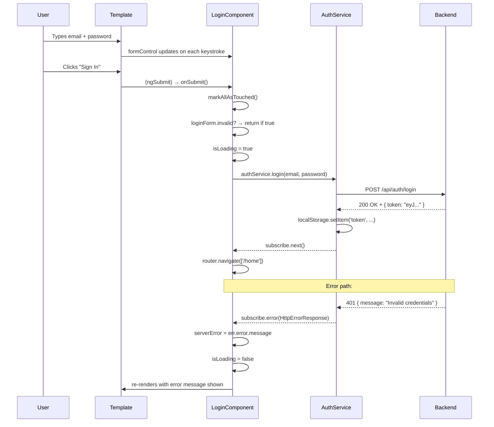

# الفصل 6.5 — Reactive Forms في الواقع: Forms حقيقية من الصفر

> **المتطلبات:** [[06-Reactive-Forms-Foundation]] — لازم تعرف FormControl وFormGroup والـ Validators قبل ما تبدأ. الفصل ده هو التطبيق الكامل.

---

## البداية — من النظرية للواقع

في الفصل السابق تعلمنا الـ building blocks: `FormControl`، `FormGroup`، `Validators`، `valueChanges`، إلخ.

دلوقتي هنبني **forms حقيقية كاملة** — نفس اللي هتكتبها في أي project:

1. **Login Form** — أبسط form ممكنة، بس كاملة
2. **Register Form** — مع custom validators وcross-field validation
3. **Profile Form** — مع pre-filling من الـ API وpartial update
4. **الـ Patterns** اللي هتستخدمها كل يوم

كل سطر في الـ code هيكون مشروح — ليه موجود ومش بس إيه هو.

> نبدأ بأبسطها: Login.

---

## [[01-login-form-complete]] — Login Form: كل سطر بشرحه

### الـ TypeScript Class

```typescript
// src/app/pages/auth/login/login.component.ts

import { Component }                                    from '@angular/core';
import { FormControl, FormGroup,
         ReactiveFormsModule, Validators }             from '@angular/forms';
import { Router, RouterLink }                           from '@angular/router';
import { AuthService }                                  from '../../../services/auth.service';

@Component({
  selector:    'app-login',
  standalone:  true,
  imports:     [ReactiveFormsModule, RouterLink],
  //            ^^^^^^^^^^^^^^^^^^^
  //            REQUIRED — without this, [formGroup] and formControlName throw:
  //            "Can't bind to 'formGroup' since it isn't a known property of 'form'"
  templateUrl: './login.component.html',
})
export class LoginComponent {

  // ─── State ────────────────────────────────────────────────────────
  isLoading   = false;
  // true while the HTTP request is in flight
  // → disables the submit button (prevents double-submit)
  // → shows loading spinner on the button

  serverError = '';
  // message from the backend (e.g., "Invalid email or password")
  // empty string = falsy → @if (serverError) is false → hidden
  // non-empty string = truthy → @if (serverError) is true → shown

  // ─── Form Definition ──────────────────────────────────────────────
  loginForm = new FormGroup({
    email: new FormControl('', [
      Validators.required,
      // value must not be empty — error: { required: true }
      Validators.email,
      // value must look like an email — error: { email: true }
    ]),

    password: new FormControl('', [
      Validators.required,
      // no format validator on password here
      // backend handles length/complexity rules
    ]),
  });
  // loginForm.value = { email: '...', password: '...' }
  // loginForm.valid = true only if BOTH controls pass ALL validators

  // ─── Dependencies ─────────────────────────────────────────────────
  private authService = inject(AuthService);
  private router      = inject(Router);

  // ─── Submit Handler ───────────────────────────────────────────────
  onSubmit() {

    // Step 1: Show all errors if user clicks Submit without filling fields
    this.loginForm.markAllAsTouched();
    // markAllAsTouched() sets touched=true on EVERY control
    // This triggers the @if (control.touched && control.invalid) blocks in template
    // Without this: user clicks Submit on empty form → no errors shown → confusing

    // Step 2: Stop if form has validation errors
    if (this.loginForm.invalid) return;
    // If any control is invalid → don't send the request
    // User must fix errors first

    // Step 3: Set loading state
    this.isLoading   = true;
    this.serverError = '';
    // Clear previous error — fresh attempt

    // Step 4: Extract values
    const { email, password } = this.loginForm.value;
    // loginForm.value = { email: 'user@x.com', password: 'secret' }
    // Destructuring extracts both values in one line
    // Types: string | null | undefined (FormControl can return null)
    // We use ! below to assert non-null (safe — form is valid, values exist)

    // Step 5: Call the API
    this.authService.login(email!, password!).subscribe({
      next: () => {
        // HTTP 200 — login succeeded
        // AuthService already saved the token in its tap() operator
        // We just navigate away
        this.router.navigate(['/home']);
        // No need to set isLoading=false — component will be destroyed on navigation
      },

      error: (err) => {
        // HTTP 4xx/5xx — login failed
        this.serverError = err.error?.message || 'Login failed. Please try again.';
        // err.error = backend's JSON response body
        // err.error?.message = backend's custom message field
        // Fallback: generic message if backend sends no message

        this.isLoading = false;
        // Re-enable the button — user can try again with fixed credentials
      },
    });
  }
}
```

---

### الـ HTML Template

```html
<!-- login.component.html -->

<div class="auth-page">
  <div class="auth-card">

    <h2>Welcome Back</h2>
    <p class="subtitle">Sign in to your account</p>

    <!-- ─── The Form ─────────────────────────────────────────────── -->
    <form [formGroup]="loginForm" (ngSubmit)="onSubmit()">
    <!--   ^^^^^^^^^^^^^^^^^^^^^^^^
           [formGroup]="loginForm": connects this <form> to the TypeScript FormGroup
           (ngSubmit)="onSubmit()": Angular's submit event (prevents page reload) -->

      <!-- ─── Email Field ─────────────────────────────────────────── -->
      <div class="field">
        <label for="email">Email</label>

        <input
          id="email"
          type="email"
          formControlName="email"
          placeholder="you@example.com"
          [class.is-invalid]="loginForm.get('email')?.touched && loginForm.get('email')?.invalid"
        />
        <!--   ^^^^^^^^^^^^^^^^^^^^^^^^^^^^^^^^^^^^^^^^^^^^^^^^^^^^^^^^^^^^^
               [class.is-invalid]: adds CSS class 'is-invalid' when condition is true
               → input border turns red (Bootstrap or custom CSS)
               Condition: touched (user left the field) AND invalid (fails validation) -->

        @if (loginForm.get('email')?.touched && loginForm.get('email')?.invalid) {
          <div class="field-errors">
            @if (loginForm.get('email')?.hasError('required')) {
              <small>Email is required</small>
            }
            @if (loginForm.get('email')?.hasError('email')) {
              <small>Please enter a valid email address</small>
            }
          </div>
        }
        <!--
          WHY specific messages per error?
          
          If just: @if (invalid) { <small>Invalid email</small> }
          User leaves empty field → "Invalid email" → confusing (it's EMPTY, not invalid!)
          
          Specific messages:
          Empty field → "Email is required"  → clear
          Bad format  → "Please enter a valid email address" → clear
        -->
      </div>

      <!-- ─── Password Field ──────────────────────────────────────── -->
      <div class="field">
        <label for="password">Password</label>

        <input
          id="password"
          type="password"
          formControlName="password"
          placeholder="Enter your password"
          [class.is-invalid]="loginForm.get('password')?.touched && loginForm.get('password')?.invalid"
        />

        @if (loginForm.get('password')?.touched && loginForm.get('password')?.invalid) {
          <div class="field-errors">
            @if (loginForm.get('password')?.hasError('required')) {
              <small>Password is required</small>
            }
          </div>
        }
      </div>

      <!-- ─── Server Error ─────────────────────────────────────────── -->
      @if (serverError) {
        <div class="server-error">
          {{ serverError }}
        </div>
        <!-- Shows backend error: "Invalid email or password", etc. -->
      }

      <!-- ─── Submit Button ───────────────────────────────────────── -->
      <button
        type="submit"
        [disabled]="loginForm.invalid || isLoading"
        class="btn-primary"
      >
        <!--   ^^^^^^^^^^^^^^^^^^^^^^^^^^^^^^^^^^^^^
               [disabled]: disabled when EITHER condition is true
               loginForm.invalid: any control has a validation error
               isLoading: request is in progress (prevent double-submit) -->

        @if (isLoading) {
          <span class="spinner"></span>
          Signing in...
        } @else {
          Sign In
        }
      </button>

    </form>

    <!-- ─── Footer Link ─────────────────────────────────────────────── -->
    <p class="auth-footer">
      Don't have an account?
      <a routerLink="/auth/register">Register</a>
      <!--  routerLink: Angular navigation — no page reload
            Must be in component's imports: imports: [..., RouterLink] -->
    </p>

  </div>
</div>
```

---

### رسم التدفق الكامل



---

## [[02-register-form-complete]] — Register Form: Custom Validators وCross-Field Validation

Register أعقد من Login — عندها cross-field validation وcustom validators.

---

### Custom Validators أولاً

```typescript
// src/app/validators/custom-validators.ts
import { AbstractControl, ValidationErrors } from '@angular/forms';

// Validator 1: Password strength
export function strongPassword(control: AbstractControl): ValidationErrors | null {
  const value: string = control.value ?? '';

  if (!value) return null;
  // Empty value → let 'required' handle it — don't double-report

  const hasUppercase = /[A-Z]/.test(value);
  const hasLowercase = /[a-z]/.test(value);
  const hasDigit     = /[0-9]/.test(value);
  const hasMinLength = value.length >= 8;

  if (hasUppercase && hasLowercase && hasDigit && hasMinLength) {
    return null; // all requirements met → valid
  }

  // Return detailed error object — template can read each property
  return {
    strongPassword: {
      hasUppercase,
      hasLowercase,
      hasDigit,
      hasMinLength,
    }
  };
}

// Validator 2: Passwords must match (group-level validator)
export function passwordsMatch(group: AbstractControl): ValidationErrors | null {
  const password        = group.get('password')?.value ?? '';
  const confirmPassword = group.get('confirmPassword')?.value ?? '';

  if (!password || !confirmPassword) return null;
  // If either is empty → let required handle it

  return password === confirmPassword
    ? null
    : { passwordsMismatch: true };
}

// Validator 3: Must be 18 or older
export function mustBe18(control: AbstractControl): ValidationErrors | null {
  if (!control.value) return null;

  const dob   = new Date(control.value);
  const today = new Date();

  let age = today.getFullYear() - dob.getFullYear();
  const monthDiff = today.getMonth() - dob.getMonth();

  if (monthDiff < 0 || (monthDiff === 0 && today.getDate() < dob.getDate())) {
    age--; // birthday hasn't happened yet this year
  }

  return age >= 18
    ? null
    : { mustBe18: { actualAge: age } };
}
```

---

### الـ Register Component

```typescript
// register.component.ts
import { Component, inject }                                from '@angular/core';
import { FormBuilder, ReactiveFormsModule, Validators }     from '@angular/forms';
import { Router, RouterLink }                               from '@angular/router';
import { AuthService }                                      from '../../../services/auth.service';
import { strongPassword, passwordsMatch, mustBe18 }        from '../../../validators/custom-validators';

@Component({
  selector:    'app-register',
  standalone:  true,
  imports:     [ReactiveFormsModule, RouterLink],
  templateUrl: './register.component.html',
})
export class RegisterComponent {

  private fb          = inject(FormBuilder);
  private authService = inject(AuthService);
  private router      = inject(Router);

  isLoading      = false;
  serverError    = '';
  successMessage = '';

  // ─── Form with FormBuilder (shorter syntax) ────────────────────────
  form = this.fb.group({
    firstName: ['', [Validators.required, Validators.minLength(2), Validators.maxLength(50)]],
    lastName:  ['', [Validators.required, Validators.minLength(2), Validators.maxLength(50)]],
    email:     ['', [Validators.required, Validators.email]],
    password:  ['', [Validators.required, strongPassword]],
    //                                    ^^^^^^^^^^^^^^^
    //                                    custom validator — checks uppercase, digit, length
    confirmPassword: ['', Validators.required],
    dob:             ['', [Validators.required, mustBe18]],
    //                                          ^^^^^^^^
    //                                          custom validator — must be 18+
  }, {
    validators: [passwordsMatch],
    //           ^^^^^^^^^^^^^^^
    //           Group-level validator — runs on the ENTIRE FormGroup
    //           Has access to ALL controls to compare them
  });

  // ─── Convenience Getters (shorter template access) ────────────────
  get f() { return this.form.controls; }
  // Usage in template: f.email.touched — instead of form.get('email')?.touched
  // f.email is FormControl (typed!) — no null check needed

  // ─── Submit ───────────────────────────────────────────────────────
  onSubmit() {
    this.form.markAllAsTouched(); // show all validation errors
    if (this.form.invalid) return;

    this.isLoading      = true;
    this.serverError    = '';
    this.successMessage = '';

    const { firstName, lastName, email, password, dob } = this.form.value;

    this.authService.register({
      firstName: firstName!,
      lastName:  lastName!,
      email:     email!,
      password:  password!,
      dob:       dob!,
    }).subscribe({
      next: () => {
        this.successMessage = '✅ Account created! Redirecting to sign in...';
        // Don't set isLoading=false here — keep button disabled to prevent re-submit
        setTimeout(() => {
          this.router.navigate(['/auth/login']);
        }, 1500);
        // Small delay so user can read the success message
      },
      error: (err) => {
        this.serverError = err.error?.message || 'Registration failed. Please try again.';
        this.isLoading   = false;
        // Re-enable form so user can fix the issue (e.g., email already exists)
      },
    });
  }
}
```

---

### الـ Register Template

```html
<!-- register.component.html -->

<form [formGroup]="form" (ngSubmit)="onSubmit()">

  <!-- ─── Name Fields (side by side) ─────────────────────────────── -->
  <div class="row">
    <div class="col">
      <label>First Name</label>
      <input formControlName="firstName" type="text" />

      @if (f.firstName.touched) {
        @if (f.firstName.hasError('required')) {
          <small class="error">First name is required</small>
        } @else if (f.firstName.hasError('minlength')) {
          <small class="error">
            At least {{ f.firstName.getError('minlength').requiredLength }} characters
          </small>
        }
      }
      <!--
        Note: we use f.firstName (the getter) instead of form.get('firstName')?.
        f.firstName is FormControl — typed, no optional chaining needed
        f.firstName.touched (not f.firstName?.touched)
        f.firstName.hasError('required') (not f.firstName?.hasError)
      -->
    </div>

    <div class="col">
      <label>Last Name</label>
      <input formControlName="lastName" type="text" />
      @if (f.lastName.touched) {
        @if (f.lastName.hasError('required')) {
          <small class="error">Last name is required</small>
        } @else if (f.lastName.hasError('minlength')) {
          <small class="error">At least 2 characters</small>
        }
      }
    </div>
  </div>

  <!-- ─── Email ───────────────────────────────────────────────────── -->
  <div class="field">
    <label>Email</label>
    <input formControlName="email" type="email" />
    @if (f.email.touched) {
      @if (f.email.hasError('required')) {
        <small class="error">Email is required</small>
      } @else if (f.email.hasError('email')) {
        <small class="error">Please enter a valid email</small>
      }
    }
  </div>

  <!-- ─── Password with strength indicator ───────────────────────── -->
  <div class="field">
    <label>Password</label>
    <input formControlName="password" type="password" />

    @if (f.password.touched && f.password.hasError('strongPassword')) {
      <!-- getError returns: { hasUppercase, hasLowercase, hasDigit, hasMinLength } -->
      <div class="password-strength">
        <span [class.met]="f.password.getError('strongPassword')?.hasMinLength">
          ✓ At least 8 characters
        </span>
        <span [class.met]="f.password.getError('strongPassword')?.hasUppercase">
          ✓ One uppercase letter
        </span>
        <span [class.met]="f.password.getError('strongPassword')?.hasDigit">
          ✓ One number
        </span>
      </div>
      <!--
        [class.met]: adds 'met' CSS class when the condition is true
        .met { color: green; }  — shows which requirements are satisfied
        This gives user REAL-TIME feedback as they type
      -->
    }
  </div>

  <!-- ─── Confirm Password ─────────────────────────────────────────── -->
  <div class="field">
    <label>Confirm Password</label>
    <input formControlName="confirmPassword" type="password" />

    @if (f.confirmPassword.touched && f.confirmPassword.hasError('required')) {
      <small class="error">Please confirm your password</small>
    }

    <!-- Group-level error — checked on the form, not on a control -->
    @if (f.confirmPassword.touched && form.hasError('passwordsMismatch')) {
      <small class="error">Passwords do not match</small>
    }
    <!--
      WHY form.hasError and not f.confirmPassword.hasError?
      passwordsMismatch is set on the GROUP — not on any individual control
      form.hasError('passwordsMismatch') checks the group-level errors
      f.confirmPassword.hasError('passwordsMismatch') would always return false
      (the error is on the group, not the control)
    -->
  </div>

  <!-- ─── Date of Birth ────────────────────────────────────────────── -->
  <div class="field">
    <label>Date of Birth</label>
    <input formControlName="dob" type="date" />

    @if (f.dob.touched) {
      @if (f.dob.hasError('required')) {
        <small class="error">Date of birth is required</small>
      } @else if (f.dob.hasError('mustBe18')) {
        <small class="error">
          You must be 18 or older to register.
          (Your age: {{ f.dob.getError('mustBe18').actualAge }})
          <!-- getError('mustBe18') = { actualAge: 16 } — shows the actual age -->
        </small>
      }
    }
  </div>

  <!-- ─── Messages ─────────────────────────────────────────────────── -->
  @if (serverError) {
    <div class="alert-error">{{ serverError }}</div>
  }
  @if (successMessage) {
    <div class="alert-success">{{ successMessage }}</div>
  }

  <!-- ─── Submit ───────────────────────────────────────────────────── -->
  <button type="submit" [disabled]="isLoading">
    @if (isLoading) {
      Creating account...
    } @else {
      Create Account
    }
  </button>

</form>

<p>Already have an account? <a routerLink="/auth/login">Sign in</a></p>
```

---

## [[03-profile-form-complete]] — Profile Form: Pre-filling وPartial Update

الـ Profile form مختلفة في حاجة واحدة مهمة: المستخدم بيفتح الصفحة والـ fields **بتبقى فيها data موجودة** من قبل.

---

### الـ Profile Component

```typescript
// profile.component.ts
import { Component, OnInit, inject } from '@angular/core';
import { FormBuilder, ReactiveFormsModule, Validators } from '@angular/forms';
import { UserService }  from '../../services/user.service';
import { AuthService }  from '../../services/auth.service';

@Component({
  selector:    'app-profile',
  standalone:  true,
  imports:     [ReactiveFormsModule],
  templateUrl: './profile.component.html',
})
export class ProfileComponent implements OnInit {

  private fb          = inject(FormBuilder);
  private userService = inject(UserService);
  private authService = inject(AuthService);

  isLoading      = false;
  isSaving       = false;
  // Two separate loading states:
  // isLoading = loading CURRENT data from API (on init)
  // isSaving  = saving CHANGES to API (on submit)
  // Different spinners and messages for each

  serverError    = '';
  successMessage = '';

  // The logged-in user's email — displayed but not editable
  userEmail = '';

  // ─── Form Definition ──────────────────────────────────────────────
  form = this.fb.group({
    firstName: ['', [Validators.required, Validators.minLength(2)]],
    lastName:  ['', [Validators.required, Validators.minLength(2)]],
    bio:       ['', Validators.maxLength(250)],
    // bio is optional — no 'required' validator
    // maxLength ensures it doesn't exceed the database column size
    dob:       ['', Validators.required],
  });
  // Form starts empty — ngOnInit will fill it

  get f() { return this.form.controls; }

  // ─── Lifecycle ────────────────────────────────────────────────────
  ngOnInit() {
    // Load current user data and pre-fill the form

    // Option A: get from JWT (no HTTP call)
    const currentUser = this.authService.getCurrentUser();
    if (currentUser) {
      this.userEmail = currentUser.email;
      this.form.patchValue({
        firstName: currentUser.firstName,
        lastName:  currentUser.lastName,
        bio:       currentUser.bio ?? '',
        dob:       currentUser.dob ?? '',
      });
      // patchValue: updates only the specified fields
      // Unknown fields in the object → silently ignored (safe)
      // After patchValue: form.dirty = false, form.touched = false
      // → The form looks "clean" (user hasn't changed anything yet)
    }

    // Option B: get fresh data from API (always up-to-date)
    // Use this if the JWT might be stale (user changed data in another tab)
    // this.isLoading = true;
    // this.userService.getMe().subscribe({
    //   next: (user) => {
    //     this.userEmail = user.email;
    //     this.form.patchValue({ ... });
    //     this.isLoading = false;
    //   },
    //   error: () => { this.isLoading = false; },
    // });
  }

  // ─── Submit ───────────────────────────────────────────────────────
  onSubmit() {
    this.form.markAllAsTouched();
    if (this.form.invalid) return;

    this.isSaving      = true;
    this.serverError   = '';
    this.successMessage = '';

    const changes = this.form.value;
    // { firstName: '...', lastName: '...', bio: '...', dob: '...' }

    this.userService.updateProfile(changes).subscribe({
      next: () => {
        this.successMessage = '✅ Profile updated successfully!';
        this.isSaving        = false;

        // Reset the form's "dirty" state — user's changes are now saved
        this.form.markAsPristine();
        // markAsPristine() = form.dirty → false
        // This matters if you have "unsaved changes" warning (canDeactivate guard)
      },
      error: (err) => {
        this.serverError = err.error?.message || 'Failed to update profile.';
        this.isSaving    = false;
      },
    });
  }
}
```

---

### الـ Profile Template

```html
<!-- profile.component.html -->

<div class="profile-page">

  <!-- ─── User info header (read-only) ─────────────────────────────── -->
  <div class="profile-header">
    <div class="avatar">{{ userEmail[0]?.toUpperCase() }}</div>
    <!-- First letter of email as avatar — simple but works -->

    <div>
      <h2>My Profile</h2>
      <p class="email">{{ userEmail }}</p>
      <!-- Email is displayed but NOT editable here -->
    </div>
  </div>

  <!-- ─── Form ─────────────────────────────────────────────────────── -->
  <form [formGroup]="form" (ngSubmit)="onSubmit()">

    <div class="row">
      <div class="field col">
        <label>First Name</label>
        <input formControlName="firstName" type="text" />
        @if (f.firstName.touched && f.firstName.invalid) {
          <small class="error">
            @if (f.firstName.hasError('required')) { Required }
            @else if (f.firstName.hasError('minlength')) { At least 2 characters }
          </small>
        }
      </div>

      <div class="field col">
        <label>Last Name</label>
        <input formControlName="lastName" type="text" />
        @if (f.lastName.touched && f.lastName.invalid) {
          <small class="error">
            @if (f.lastName.hasError('required')) { Required }
            @else if (f.lastName.hasError('minlength')) { At least 2 characters }
          </small>
        }
      </div>
    </div>

    <div class="field">
      <label>Bio <span class="optional">(optional)</span></label>
      <textarea formControlName="bio" rows="3" placeholder="Tell us about yourself..."></textarea>

      <!-- Character counter -->
      <div class="char-count">
        {{ f.bio.value?.length ?? 0 }} / 250
        <!--  ^^^^^^^^^^^^^^^^^^^^
              f.bio.value = current string (or null)
              ?. → null-safe
              ?? 0 → if null, show 0 -->
      </div>

      @if (f.bio.hasError('maxlength')) {
        <small class="error">Bio cannot exceed 250 characters</small>
        <!-- No touched check here — maxlength should always show when exceeded,
             even if user hasn't "left" the field yet -->
      }
    </div>

    <div class="field">
      <label>Date of Birth</label>
      <input formControlName="dob" type="date" />
      @if (f.dob.touched && f.dob.hasError('required')) {
        <small class="error">Date of birth is required</small>
      }
    </div>

    <!-- ─── Messages ───────────────────────────────────────────────── -->
    @if (serverError) {
      <div class="alert-error">{{ serverError }}</div>
    }
    @if (successMessage) {
      <div class="alert-success">{{ successMessage }}</div>
    }

    <!-- ─── Submit ─────────────────────────────────────────────────── -->
    <button
      type="submit"
      [disabled]="isSaving || form.invalid || form.pristine"
    >
      <!--   ^^^^^^^^^^^^^
             form.pristine: nothing has changed from the initial values
             No point submitting if nothing changed!
             This naturally prevents unnecessary API calls -->

      @if (isSaving) {
        Saving changes...
      } @else if (form.pristine) {
        No Changes to Save
      } @else {
        Save Changes
      }
    </button>

  </form>
</div>
```

---

## [[04-common-patterns]] — الـ Patterns اللي هتستخدمها كل يوم

### Pattern 1 — Getter للـ Controls

```typescript
// Without getter:
loginForm.get('email')?.touched   // verbose, nullable (get returns null)
loginForm.get('email')?.hasError  // same problem

// With getter:
get emailCtrl() { return this.loginForm.controls.email; }
// Or shorter:
get f() { return this.loginForm.controls; }

// Usage:
f.email.touched          // typed FormControl — no null check needed!
f.email.hasError('required')
f.email.value
```

---

### Pattern 2 — الـ `markAllAsTouched()` Pattern

```typescript
onSubmit() {
  // ALWAYS call this first on submit
  this.form.markAllAsTouched();
  // Shows ALL validation errors even if user skipped fields entirely

  if (this.form.invalid) return;
  // ... rest of logic
}
```

بدونها — لو المستخدم ضغط Submit من غير ما يلمس أي field → مفيش errors تظهر → مش بيعرف إيه المشكلة.

---

### Pattern 3 — Async Validator (check if email exists)

```typescript
import { AsyncValidatorFn, AbstractControl, ValidationErrors } from '@angular/forms';
import { Observable, of } from 'rxjs';
import { catchError, debounceTime, map, switchMap }            from 'rxjs/operators';

// Async validator — returns Observable<null | errors>
function emailExistsValidator(userService: UserService): AsyncValidatorFn {
  return (control: AbstractControl): Observable<ValidationErrors | null> => {
    if (!control.value) return of(null);
    // Empty → let required handle it

    return of(control.value).pipe(
      debounceTime(400),
      // Wait 400ms after user stops typing — avoid request on every keystroke
      switchMap(email =>
        userService.checkEmailAvailable(email).pipe(
          map(isAvailable =>
            isAvailable
              ? null                         // email is free → valid
              : { emailTaken: true }         // email is taken → invalid
          ),
          catchError(() => of(null))
          // If API fails → treat as valid (don't block registration for API errors)
        )
      )
    );
  };
}

// Apply to control:
email: new FormControl('',
  [Validators.required, Validators.email],  // sync validators (2nd arg)
  [emailExistsValidator(this.userService)]   // async validators (3rd arg)
),
// During async validation: control.pending = true
// In template: @if (f.email.pending) { <spinner /> }
```

---

### Pattern 4 — Conditional Validators (add/remove بناءً على حالة)

```typescript
// Example: phone required only if user selects SMS notifications

export class NotificationsComponent {
  form = this.fb.group({
    notifyByEmail: [true],
    notifyBySms:   [false],
    phone:         [''],  // no validators initially
  });

  ngOnInit() {
    // Watch for changes in the SMS toggle:
    this.form.get('notifyBySms')!.valueChanges.subscribe(smsEnabled => {
      const phoneControl = this.form.get('phone')!;

      if (smsEnabled) {
        phoneControl.setValidators([Validators.required, Validators.pattern(/^01[0-9]{9}$/)]);
        // Add validators dynamically
      } else {
        phoneControl.clearValidators();
        // Remove all validators — phone becomes optional
        phoneControl.reset();
        // Clear the value too
      }

      phoneControl.updateValueAndValidity();
      // REQUIRED: tells Angular to re-run validation with the new validator set
      // Without this line: form validity doesn't update
    });
  }
}
```

---

### Pattern 5 — Form Reset بعد Submit ناجح

```typescript
onSubmit() {
  this.form.markAllAsTouched();
  if (this.form.invalid) return;

  this.apiService.submit(this.form.value).subscribe({
    next: () => {
      this.successMessage = 'Submitted successfully!';

      // Option A: full reset (back to initial values)
      this.form.reset();
      // All values → '' (initial), all states → pristine, untouched

      // Option B: reset to specific values
      this.form.reset({ firstName: '', lastName: '' });

      // Option C: just clear the dirty/touched state (keep values)
      this.form.markAsPristine();
      this.form.markAsUntouched();
    },
  });
}
```

---

### Pattern 6 — Disable Form During Submit

```typescript
onSubmit() {
  if (this.form.invalid) return;

  this.form.disable();
  // Disables ALL inputs — user can't type while submitting
  // Also: disabled controls excluded from form.value!
  // Use form.getRawValue() to get ALL values including disabled

  const data = this.form.getRawValue();
  // getRawValue() includes disabled controls (unlike .value)

  this.api.submit(data).subscribe({
    next: () => {
      this.form.enable(); // re-enable on success
      this.router.navigate(['/success']);
    },
    error: () => {
      this.form.enable(); // re-enable on error so user can fix and retry
    },
  });
}
```

---

### Pattern 7 — Auto-Save Draft

```typescript
ngOnInit() {
  // Load saved draft on init:
  const savedDraft = localStorage.getItem('article-draft');
  if (savedDraft) {
    try {
      this.form.patchValue(JSON.parse(savedDraft));
    } catch {
      localStorage.removeItem('article-draft'); // corrupted — remove
    }
  }

  // Auto-save on every change (with debounce):
  this.form.valueChanges.pipe(
    debounceTime(1000),
    // Save 1 second after user STOPS typing
    // Without debounce: saves on every keystroke — too frequent
    takeUntilDestroyed(this.destroyRef)
    // Auto-unsubscribe when component is destroyed (Angular 16+)
    // Alternative: takeUntil(this.destroy$) with Subject
  ).subscribe(value => {
    if (this.form.valid) {
      localStorage.setItem('article-draft', JSON.stringify(value));
      this.lastSaved = new Date();
    }
  });
}

onSubmit() {
  // After successful submit, clear the draft:
  this.api.createArticle(this.form.value).subscribe({
    next: () => {
      localStorage.removeItem('article-draft');
      this.router.navigate(['/articles']);
    },
  });
}
```

---

## [[05-form-debugging]] — تشخيص مشاكل الـ Forms

### الأخطاء الشائعة وحلولها

```
Error: Can't bind to 'formGroup' since it isn't a known property of 'form'
Solution: Add ReactiveFormsModule to the component's imports array

Error: No value accessor for form control with name: 'myControl'
Solution: formControlName is on a div/span, not on an input/select/textarea

Error: Must supply a value for form control with name: 'field'
Solution: You're calling setValue() without providing ALL fields — use patchValue() instead

Error: Cannot find control with name: 'fieldName'
Solution: formControlName="fieldName" doesn't match any key in the FormGroup

Issue: form.value is null
Cause: The control is DISABLED — disabled controls are excluded from .value
Solution: Use form.getRawValue() to include disabled controls

Issue: Errors don't show on Submit
Cause: Forgot to call markAllAsTouched() before checking invalid
Solution: Always call it first in onSubmit()

Issue: Group-level error (passwordsMismatch) doesn't show
Cause: Checking it on the control, not the form
Solution: form.hasError('passwordsMismatch') not f.confirmPassword.hasError(...)

Issue: Validator not running
Cause: Called setValidators() but forgot updateValueAndValidity()
Solution: Always call control.updateValueAndValidity() after changing validators
```

---

### الـ Debug Helper في الـ Template

```html
<!-- Add this TEMPORARILY during development to see form state: -->
<pre style="font-size:11px; background:#f5f5f5; padding:8px;">
{{ form.value | json }}
Status: {{ form.status }}
Valid: {{ form.valid }}
Touched: {{ form.touched }}
Dirty: {{ form.dirty }}
Errors: {{ form.errors | json }}
Email errors: {{ f.email.errors | json }}
</pre>
<!-- Remove this before committing! -->
```

---

## ✅ Checkpoint — أسئلة الإنترفيو

**س: ليه بنستخدم `markAllAsTouched()` في الـ onSubmit؟**
> لأن الـ validation errors بتظهر بس لما الـ control يكون `touched`. لو المستخدم ضغط Submit من غير ما يلمس أي field — كل الـ controls بتفضل `untouched` → مفيش errors تظهر → المستخدم مش عارف إيه المشكلة. `markAllAsTouched()` بيحل ده بإنه يـset `touched=true` على كل الـ controls فوراً.

**س: إيه الفرق بين `form.value` و`form.getRawValue()`؟**
> `form.value` بيستثني الـ controls الـ disabled — بيرجع undefined ليهم. `form.getRawValue()` بيرجع قيم كل الـ controls بما فيها الـ disabled. استخدم `getRawValue()` لما بتعمل `form.disable()` قبل الـ submit.

**س: كيف تعمل group-level validator (زي passwordsMatch)؟**
> بتمررها في الـ second argument لـ FormGroup كـ `{ validators: [myValidator] }`. الـ validator function بتاخد الـ FormGroup نفسه كـ AbstractControl وبتستخدم `group.get('field')` للوصول للـ controls. الـ error بيتحط على الـ FormGroup (مش على control) — عشان كده بتتحقق منه بـ `form.hasError('myError')` مش `control.hasError('myError')`.

**س: إزاي بتـpre-fill form من API؟**
> في `ngOnInit()` بتـsubscribe في الـ API call، وبعدين بتستخدم `form.patchValue(apiData)`. `patchValue` أفضل من `setValue` لأنها بتقبل partial data — لو الـ API أضافت field جديد في المستقبل ما هيكسرش الكود. بعد `patchValue` الـ form بيبقى `pristine` (لو الـ user ما عدّلش) — مش بيـتـcount كـ user change.

---

## 🛠️ Practical Exercise

### Task 1 — Debug هذا الـ Form

```typescript
// What is wrong with this code? List all problems.

@Component({
  selector: 'app-contact',
  standalone: true,
  // imports: [ReactiveFormsModule]  ← MISSING!
  template: `
    <form [formGroup]="form" (ngSubmit)="send()">
      <input formControlName="name" />
      <input formControlName="email" />

      @if (form.get('email').touched) {
        <small>{{ form.get('email').errors | json }}</small>
      }

      <button type="submit" [disabled]="form.invalid">Send</button>
    </form>
  `
})
export class ContactComponent {
  form = new FormGroup({
    name:  new FormControl('', Validators.required),
    email: new FormControl('', Validators.email),
    // Missing required on email!
  });

  send() {
    if (this.form.invalid) return;
    const { name, email } = this.form.value;
    // name! and email! not used
    sendEmail(name, email); // name/email could be null/undefined
  }
}
```

**كام مشكلة تقدر تلاقي؟**

---

### Task 2 — اكتب Login Form كاملة

اكتب Login Component بالمتطلبات دي:
- Email: required + valid email format
- Password: required + minLength 8
- `markAllAsTouched()` on submit
- Show specific error per validator
- Server error display
- Loading state on button
- Disable button when invalid OR loading
- Navigate to `/dashboard` on success

---

### Task 3 — Contact Form مع Custom Validator

```typescript
// Build a contact form with:
// - name (required, 2-50 chars)
// - email (required, valid email)
// - subject (required, max 100 chars)
// - message (required, 20-1000 chars)
// - honeypot (hidden field — if filled, it's a bot!)

// Custom validator: noBot
// If the 'honeypot' control has any value → return { bot: true }
// This is a spam prevention technique

// Template should:
// - Show char count for message: "X / 1000 characters"
// - Show "Bot detected!" if honeypot is filled (for testing purposes)
// - Show success message on submit (no real API needed — just mock)
```

---

### Task 4 — Profile Form مع Auto-Save

اكتب Profile Form بيعمل:
- يـpre-fill من object `{ name: 'Mohamed', bio: 'Developer', website: '' }`
- يحفظ draft في localStorage كل 2 ثانية
- زرار "Revert to Saved" بيرجع للـ draft المحفوظ
- زرار "Clear Draft" بيمسح الـ localStorage
- Submit button disabled لو `form.pristine` أو `form.invalid`
- يـreset الـ dirty state بعد submit ناجح

---

## 🫒 زتونة الإنترفيو

> **"Reactive Forms give you the form structure in TypeScript as a tree of FormControl, FormGroup, and FormArray — the template just connects via `[formGroup]`, `formControlName`, and `formArrayName`. Each control tracks: its value, validity (valid/invalid with specific error objects), interaction state (touched/untouched for UX, dirty/pristine for unsaved changes detection). The key submit pattern: always `markAllAsTouched()` first to reveal hidden errors, then check `if (form.invalid) return`. Use `patchValue()` for pre-filling from APIs — safer than `setValue()` which throws for missing fields. Group-level validators (like passwordsMatch) live in the FormGroup's second argument and their errors are checked on `form.hasError()` not on individual controls."**

---

*Next → [[07-Component-Communication]] — عارفين إزاي نبني forms كاملة. دلوقتي: إزاي الـ components تتكلم مع بعض؟ الـ Parent ييدي data للـ Child والـ Child يرجع events للـ Parent — ده قلب أي Angular app معقد.*
