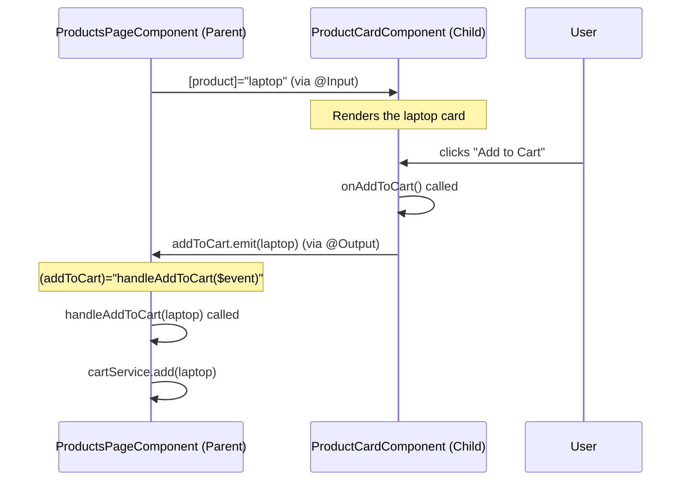
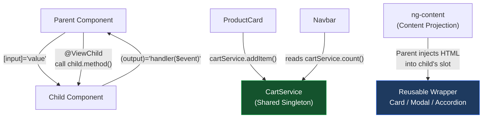

# الفصل السابع — Component Communication: إزاي الـ Components تتكلم مع بعض

> **المتطلبات:** [[02-Angular-Architecture]] و[[02.5-Control-Flow-DI-Signals]] — لازم تعرف الـ Component والـ Services والـ BehaviorSubject قبل ما تبدأ.

---

## البداية — المشكلة اللي مش واضحة في الأول

لحد دلوقتي، كل component اللي بنيناها كانت **مستقلة تماماً** — عندها data خاص بيها وبتعرضه لنفسها.

```typescript
export class ProductCardComponent {
  product = { name: 'Laptop', price: 25000, inStock: true };
  // Data lives here — nobody else knows about it
}
```

بس في التطبيق الحقيقي — الـ components محتاجة **تتعاون**:

```
Scenario 1: Parent has a list of products
            → needs to pass each product to a ProductCard child

Scenario 2: User clicks "Add to Cart" on a ProductCard
            → the Navbar's cart count needs to update
            → the Cart Sidebar needs to show the new item
            → ProductCard didn't cause these changes to Navbar — they're "siblings"

Scenario 3: Parent has a Search input
            → searches must filter the ProductList below it

Scenario 4: A Dialog/Modal component
            → parent needs to OPEN it programmatically
            → Dialog needs to tell parent when user CONFIRMS or CANCELS
```

كل سيناريو من دول محتاج طريقة تواصل مختلفة.

Angular بيقدم **4 patterns رئيسية**:

```
Pattern 1: @Input()          → Parent sends data DOWN to Child
Pattern 2: @Output()         → Child sends events UP to Parent
Pattern 3: Shared Service    → Any component talks to Any component (siblings)
Pattern 4: @ViewChild        → Parent gets DIRECT ACCESS to Child's instance
```

الـ direction مهم:

```
AppComponent
    ├── NavbarComponent  ←──── Sibling communication via Service ────┐
    └── ProductsPageComponent                                        │
            ├── SearchComponent                                      │
            └── ProductListComponent                                 │
                    └── ProductCardComponent ────── emits events ────┘
                           ↑
                     receives data via @Input
```

Data بتنزل بـ `@Input()`. Events بتطلع بـ `@Output()`. الـ Siblings بيتكلموا عن طريق Service. الـ Parent بيوصل للـ Child مباشرةً بـ `@ViewChild`.

> نبدأ بالأبسط والأشهر: إزاي الـ Parent بيبعت data للـ Child.

---

## [[01-input-deep]] — `@Input()`: "البريد من الأب للابن"

### المفهوم الأساسي

الـ `@Input()` بيقول لـ Angular: "الـ property دي مش خاصة بالـ component ده بس — الـ Parent تقدر تحطلها قيمة."

```typescript
// product-card.component.ts (CHILD)
import { Component, Input } from '@angular/core';

interface Product {
  id:      number;
  name:    string;
  price:   number;
  inStock: boolean;
}

@Component({
  selector:   'app-product-card',
  standalone: true,
  template: `
    <div class="card">
      <h3>{{ product.name }}</h3>
      <p>{{ product.price | currency:'EGP' }}</p>
      @if (!product.inStock) {
        <span class="badge">Out of Stock</span>
      }
    </div>
  `,
})
export class ProductCardComponent {
  @Input() product!: Product;
  //       ^^^^^^^
  // This property can now receive a value from the parent
  // The parent sets it via [product]="someProduct"
  //
  // The ! (definite assignment assertion):
  // Tells TypeScript: "I know this will be set before it's used"
  // Without it → compile error: "property has no initializer"
  // Use ! when the input is REQUIRED — parent must always provide it
}
```

```typescript
// products-page.component.ts (PARENT)
@Component({
  selector:   'app-products-page',
  standalone: true,
  imports:    [ProductCardComponent],
  //           ^^^^^^^^^^^^^^^^^^^^^
  //           REQUIRED — must import the child component to use it in template
  template: `
    @for (product of products; track product.id) {
      <app-product-card [product]="product"></app-product-card>
      <!--               ^^^^^^^^^^^^^^^^
                         Property binding: passes the current 'product' object
                         to the ProductCardComponent's @Input() product property
                         
                         [product]="product"  → expression (TypeScript object)
                          product="product"   → would pass the STRING "product" — wrong! -->
    }
  `,
})
export class ProductsPageComponent {
  products: Product[] = [
    { id: 1, name: 'Laptop',  price: 25000, inStock: true  },
    { id: 2, name: 'Mouse',   price: 350,   inStock: true  },
    { id: 3, name: 'Monitor', price: 8000,  inStock: false },
  ];
}
```

---

### الـ `!` vs `?` على الـ @Input

```typescript
// ! — Required input (parent MUST provide it)
@Input() product!: Product;
// If parent forgets [product]="..." → runtime error when template accesses product.name
// Use when: the component cannot function without this data

// ? — Optional input (might be undefined)
@Input() badge?: string;
// If parent doesn't provide [badge]="..." → badge is undefined
// Use with care in template: {{ badge ?? 'Default' }}
// Use when: the component has sensible behavior without this input

// = — Optional input with default value
@Input() showPrice: boolean = true;
// If parent doesn't provide [showPrice]="..." → stays true (the default)
// Use when: you want optional with a fallback
```

---

### Multiple @Input Properties

```typescript
@Component({
  selector:   'app-user-card',
  standalone: true,
  template: `
    <div [class.highlighted]="isHighlighted">
      
      <h3>{{ name }}</h3>
      @if (showEmail) {
        <p>{{ email }}</p>
      }
      <span class="badge">{{ role | titlecase }}</span>
    </div>
  `,
})
export class UserCardComponent {
  @Input({ required: true }) name!: string;
  // required: true (Angular 16+) — compile-time error if parent forgets it
  // Better than runtime crash!

  @Input({ required: true }) role!: 'admin' | 'editor' | 'viewer';
  // Typed input — TypeScript enforces parent passes the right union type

  @Input() email  = '';
  @Input() avatarUrl = '';
  @Input() showEmail  = true;
  @Input() isHighlighted = false;
}
```

```html
<!-- Parent — using the UserCard -->
<app-user-card
  [name]="user.name"
  [role]="user.role"
  [email]="user.email"
  [showEmail]="currentUser.isAdmin"
  [isHighlighted]="user.id === selectedUserId"
></app-user-card>
```

---

### `@Input` مع Alias — اسم خارجي مختلف عن الداخلي

```typescript
// Internal name: 'product' (used inside the component as this.product)
// External name: 'item' (parent uses [item]="...")
@Input('item') product!: Product;

// Usage in parent:
// <app-card [item]="someProduct">...</app-card>

// Why aliases?
// Public API clarity — "item" makes sense to users of the component
// Internal naming — "product" makes sense in the implementation
// Also: avoids conflicts with HTML attributes that share common names
```

---

### `@Input` مع Transform — تحويل القيمة تلقائياً

مشكلة شائعة: الـ HTML attributes دايماً strings. لو قلت `showPrice="true"` من غير brackets — بتبعت string مش boolean.

```html
<!-- Without brackets — passes STRING "true", not boolean true -->
<app-card showPrice="true">

<!-- With brackets — passes actual boolean true -->
<app-card [showPrice]="true">

<!-- But what if you're building a component library and want
     to support the attribute-style usage (no brackets)? -->
<app-card showPrice>  <!-- means: showPrice with empty string value -->
```

```typescript
import { booleanAttribute, numberAttribute } from '@angular/core';

@Component({ ... })
export class CardComponent {
  @Input({ transform: booleanAttribute }) showPrice = true;
  // booleanAttribute converts:
  //   ""      → true   (attribute present, no value)
  //   "true"  → true
  //   "false" → false
  //   null    → false  (attribute absent)
  // Now BOTH work:
  //   <app-card showPrice>        → showPrice = true
  //   <app-card showPrice="false"> → showPrice = false
  //   <app-card [showPrice]="condition"> → works normally

  @Input({ transform: numberAttribute }) maxItems = 10;
  // numberAttribute converts strings to numbers:
  //   "25" → 25
  //   "3.14" → 3.14
  //   Now works: <app-card maxItems="25"> (no brackets needed)
}
```

---

### `@Input` مع Setter — رد فعل عند تغيير القيمة

أحياناً لما الـ input يتغير — محتاج تعمل حاجة:

```typescript
@Component({
  selector:   'app-product-card',
  standalone: true,
  template: `
    <div [class]="cardClass">
      <h3>{{ displayTitle }}</h3>
      <p>{{ displayPrice }}</p>
    </div>
  `,
})
export class ProductCardComponent {
  displayTitle = '';
  displayPrice = '';
  cardClass    = '';

  private _product!: Product;

  @Input()
  set product(value: Product) {
    // This setter runs every time the parent changes [product]="..."
    this._product    = value;
    this.displayTitle = value.name.toUpperCase();
    this.displayPrice = `EGP ${value.price.toLocaleString()}`;
    this.cardClass    = value.inStock ? 'card' : 'card card-disabled';
    // Process the new value immediately when it arrives
  }

  get product(): Product {
    return this._product;
  }
}
```

**متى تستخدم setter بدل `ngOnChanges`؟**

```typescript
// Setter → cleaner for a SINGLE input that needs processing
// ngOnChanges → better for MULTIPLE inputs that need to react together
// OR when you need access to SimpleChanges (previousValue, firstChange)
```

> فهمنا `@Input` بالكامل — الـ data بتنزل من الـ Parent. دلوقتي إزاي الـ Child يبعت حاجة للـ Parent؟

---

## [[02-output-deep]] — `@Output()`: "المكالمة من الابن للأب"

### المفهوم الأساسي

الـ `@Output()` هو **custom event** — الـ Child بيـ"يرفع" event والـ Parent بيستمع ليه.

تخيله زي زرار الطوارئ في الأسانسير. الأسانسير (Child) مش يتكلم مباشرةً مع إدارة البناية (Parent) — بيضغط الزرار ويبعت signal، وإدارة البناية بتستمع للـ signal ده وبتتصرف.

```typescript
// product-card.component.ts (CHILD)
import { Component, Input, Output, EventEmitter } from '@angular/core';

@Component({
  selector:   'app-product-card',
  standalone: true,
  template: `
    <div class="card">
      <h3>{{ product.name }}</h3>
      <p>{{ product.price | currency:'EGP' }}</p>
      <button (click)="onAddToCart()">Add to Cart</button>
      <button (click)="onViewDetails()">Details</button>
    </div>
  `,
})
export class ProductCardComponent {
  @Input({ required: true }) product!: Product;

  @Output() addToCart    = new EventEmitter<Product>();
  // EventEmitter<Product>: this event carries a Product object when it fires
  // 'addToCart': the event name — parent listens with (addToCart)="..."

  @Output() viewDetails = new EventEmitter<number>();
  // EventEmitter<number>: this event carries just the product ID

  @Output() wishlistToggled = new EventEmitter<void>();
  // EventEmitter<void>: this event carries NO data (just a notification)

  onAddToCart() {
    this.addToCart.emit(this.product);
    // .emit(value): fires the event and passes the value to the parent
    // The parent receives this.product as $event
  }

  onViewDetails() {
    this.viewDetails.emit(this.product.id);
    // Emit just the ID — parent doesn't need the full product
  }

  onWishlistClick() {
    this.wishlistToggled.emit();
    // void event — just notify, no data
  }
}
```

```typescript
// products-page.component.ts (PARENT)
@Component({
  selector:   'app-products-page',
  standalone: true,
  imports:    [ProductCardComponent],
  template: `
    @for (product of products; track product.id) {
      <app-product-card
        [product]="product"
        (addToCart)="handleAddToCart($event)"
        (viewDetails)="goToProduct($event)"
        (wishlistToggled)="onWishlistToggle()"
      ></app-product-card>
    }
    <!--  (addToCart)="...": listens to the addToCart @Output event
          $event = the value emitted = the Product object
          (viewDetails)="...": $event = number (the product ID)
          (wishlistToggled)="...": no $event — void event carries nothing -->
  `,
})
export class ProductsPageComponent {
  products: Product[] = [ /* ... */ ];

  handleAddToCart(product: Product) {
    // product is $event — the full Product object
    console.log('Adding to cart:', product.name);
    this.cartService.add(product);
  }

  goToProduct(productId: number) {
    // productId is $event — just the number
    this.router.navigate(['/products', productId]);
  }

  onWishlistToggle() {
    // no $event — void event
    console.log('Wishlist toggled');
  }
}
```

---

### كيف يعمل EventEmitter داخلياً

```typescript
// EventEmitter<T> is essentially an Observable<T> with an emit() method
// It extends Subject<T> from RxJS

const emitter = new EventEmitter<string>();

// You CAN subscribe to it manually (though rarely needed):
emitter.subscribe(value => console.log('Got:', value));

// .emit() = .next() in RxJS terms
emitter.emit('hello'); // logs: "Got: hello"
```

الـ Angular's `(event)` binding هو في الأساس `subscribe()` على الـ EventEmitter. لما الـ component يتدمر — Angular بيـunsubscribe أوتوماتيك. مش محتاج تعمل cleanup.

---

### `@Output` مع Alias

```typescript
@Output('added') addToCart = new EventEmitter<Product>();
// External: (added)="handler($event)"
// Internal: this.addToCart.emit(product)
```

---

### لا ترسل @Output بدون داعٍ — "Controlled Events"

```typescript
// BAD — emitting on every change without throttling
@Output() searchChanged = new EventEmitter<string>();

onSearchInput(event: Event) {
  const value = (event.target as HTMLInputElement).value;
  this.searchChanged.emit(value); // fires on EVERY keystroke
}

// BETTER — emit after user stops typing
import { Subject } from 'rxjs';
import { debounceTime, takeUntilDestroyed } from 'rxjs/operators';

@Output() searchChanged = new EventEmitter<string>();

private inputSubject = new Subject<string>();

constructor() {
  this.inputSubject.pipe(
    debounceTime(400),
    takeUntilDestroyed()
  ).subscribe(value => {
    this.searchChanged.emit(value); // only fires 400ms after last keystroke
  });
}

onSearchInput(event: Event) {
  this.inputSubject.next((event.target as HTMLInputElement).value);
}
```

---

### الصورة الكاملة — @Input + @Output معاً

```
Parent → [product]="p" → Child
                           ↓ user clicks "Add"
Parent ← (addToCart)="handler($event)" ←── child.addToCart.emit(p)
```



> فهمنا التواصل الـ Parent↔Child. دلوقتي، إيه اللي بيحصل لما محتاج الـ Parent يصل للـ Child مباشرةً من غير events؟

---

## [[03-viewchild-deep]] — `@ViewChild`: "الأب بيمسك إيد الابن"

### المشكلة اللي يحلها

الـ `@Input` و`@Output` ممتازان للـ data flow. بس أحياناً الـ Parent محتاج يـ**يستدعي method** على الـ Child مباشرةً:

```
User clicks "Open Dialog" button in Parent
→ Parent needs to call dialog.open() on the DialogComponent
→ @Input() can't do this — inputs pass DATA, not call methods
→ @Output() can't do this — outputs go from Child to Parent, not the other way
→ @ViewChild is the answer
```

```typescript
// confirm-dialog.component.ts (CHILD)
@Component({
  selector:   'app-confirm-dialog',
  standalone: true,
  template: `
    @if (isOpen) {
      <div class="dialog-overlay" (click)="cancel()">
        <div class="dialog-box" (click)="$event.stopPropagation()">
          <h3>{{ title }}</h3>
          <p>{{ message }}</p>
          <button (click)="confirm()">Confirm</button>
          <button (click)="cancel()">Cancel</button>
        </div>
      </div>
    }
  `,
})
export class ConfirmDialogComponent {
  isOpen  = false;
  title   = '';
  message = '';

  // Public methods — parent can call these via @ViewChild
  open(title: string, message: string) {
    this.title   = title;
    this.message = message;
    this.isOpen  = true;
  }

  close() {
    this.isOpen = false;
  }

  // These are internal — called by buttons in the template
  protected confirm() {
    this.close();
    console.log('Confirmed!');
  }

  protected cancel() {
    this.close();
  }
}
```

```typescript
// products-page.component.ts (PARENT)
import { Component, ViewChild, AfterViewInit } from '@angular/core';
import { ConfirmDialogComponent }               from './confirm-dialog/confirm-dialog.component';

@Component({
  selector:   'app-products-page',
  standalone: true,
  imports:    [ConfirmDialogComponent],
  template: `
    <app-confirm-dialog #confirmDialog></app-confirm-dialog>
    <!--                ^^^^^^^^^^^^^
                        Template reference variable — named 'confirmDialog'
                        @ViewChild('confirmDialog') will find this element -->

    @for (product of products; track product.id) {
      <div class="product-card">
        <h3>{{ product.name }}</h3>
        <button (click)="askToDelete(product)">Delete</button>
      </div>
    }
  `,
})
export class ProductsPageComponent implements AfterViewInit {

  @ViewChild('confirmDialog') dialog!: ConfirmDialogComponent;
  //          ^^^^^^^^^^^^^^           ^^^^^^^^^^^^^^^^^^^^^^
  //          template ref var name    the child component type
  // !: will be assigned after view initializes (AfterViewInit)
  // If you try to use this.dialog in ngOnInit → undefined!

  products: Product[] = [ /* ... */ ];
  pendingDeleteProduct: Product | null = null;

  ngAfterViewInit() {
    // @ViewChild is available HERE — not in constructor or ngOnInit
    // The template hasn't rendered yet in ngOnInit
    console.log(this.dialog); // ✅ ConfirmDialogComponent instance
  }

  askToDelete(product: Product) {
    this.pendingDeleteProduct = product;
    this.dialog.open(
      'Delete Product',
      `Are you sure you want to delete "${product.name}"?`
    );
    // Calling the child's method directly!
    // No @Output needed — parent initiates the action
  }
}
```

---

### `@ViewChild` للـ DOM Elements

```typescript
import { AfterViewInit, ElementRef, ViewChild } from '@angular/core';

@Component({
  selector:   'app-login',
  standalone: true,
  template: `
    <input #emailInput type="email" placeholder="Email" />
    <input #passwordInput type="password" placeholder="Password" />
  `,
})
export class LoginComponent implements AfterViewInit {

  @ViewChild('emailInput') emailRef!: ElementRef<HTMLInputElement>;
  // ElementRef<T>: wrapper around a native DOM element
  // T = HTMLInputElement: tells TypeScript the exact DOM type
  // .nativeElement: the actual DOM element

  @ViewChild('passwordInput') passwordRef!: ElementRef<HTMLInputElement>;

  ngAfterViewInit() {
    // Auto-focus the email field when the login page loads
    this.emailRef.nativeElement.focus();
    // .nativeElement gives you the raw DOM element
    // .focus() is a native HTMLInputElement method
  }

  selectAllInPassword() {
    this.passwordRef.nativeElement.select();
    // Select all text in the password field programmatically
  }
}
```

---

### `static: true` vs `static: false`

```typescript
// static: false (DEFAULT) — resolved AFTER first change detection
@ViewChild('myComponent') comp!: MyComponent;
// Available in: ngAfterViewInit
// Use when: the element might be inside @if or @for
// (might not exist on initial render)

// static: true — resolved BEFORE change detection (in ngOnInit)
@ViewChild('myComponent', { static: true }) comp!: MyComponent;
// Available in: ngOnInit (earlier!)
// Use when: the element is ALWAYS present (not inside @if)
// Slightly faster (no need to wait for change detection)
```

```typescript
// When MUST you use static: false (default)?
@Component({
  template: `
    @if (showChart) {
      <app-chart #chart></app-chart>
    }
  `
})
export class DashboardComponent {
  showChart = false;

  @ViewChild('chart') chart?: ChartComponent;
  // static: false (default) — because chart is inside @if
  // It doesn't exist until showChart becomes true
  // Use optional ? instead of ! since it might be undefined

  toggleChart() {
    this.showChart = !this.showChart;
    // After this, Angular runs change detection
    // Then chart reference is updated (if showChart is now true)
  }
}
```

---

### `@ViewChildren` — مجموعة من الـ Children

```typescript
import { ViewChildren, QueryList } from '@angular/core';

@Component({
  selector:   'app-product-list',
  standalone: true,
  imports:    [ProductCardComponent],
  template: `
    @for (p of products; track p.id) {
      <app-product-card [product]="p"></app-product-card>
    }
  `,
})
export class ProductListComponent implements AfterViewInit {

  @ViewChildren(ProductCardComponent) cards!: QueryList<ProductCardComponent>;
  // QueryList<T>: Angular's iterable collection for multiple ViewChildren
  // Automatically updated when items are added/removed from @for

  ngAfterViewInit() {
    console.log('Number of cards:', this.cards.length);

    this.cards.forEach(card => {
      console.log('Card product:', card.product.name);
    });

    // React when the list changes (items added/removed):
    this.cards.changes.subscribe((updatedCards: QueryList<ProductCardComponent>) => {
      console.log('Cards changed! New count:', updatedCards.length);
    });
  }

  highlightAll() {
    this.cards.forEach(card => card.setHighlighted(true));
    // Call a method on ALL child instances at once
  }
}
```

> فهمنا التواصل الـ Parent↔Child. دلوقتي الـ Sibling problem — إزاي الـ Navbar يعرف لما ProductCard أضاف item للـ Cart؟

---

## [[04-sibling-service]] — التواصل بين الـ Siblings: "البُريد المشترك"

### المشكلة

```
App
 ├── Navbar (shows cart count badge)
 └── ProductsPage
       └── ProductCard (has "Add to Cart" button)
```

الـ `Navbar` والـ `ProductCard` مش في علاقة Parent-Child. هم "أقارب" — siblings عبر الـ App component.

لو `ProductCard` عمل `@Output()` → بيوصل لـ `ProductsPage` فقط. محتاج الـ message توصل للـ `Navbar` — وده في فرع تاني من الشجرة.

**الحل: Shared Service بـ BehaviorSubject**

```typescript
// cart.service.ts — SHARED STATE
@Injectable({ providedIn: 'root' })
export class CartService {
  private items   = signal<CartItem[]>([]);
  // signal() for reactive state (covered in chapter 02.5)

  // Derived computed values:
  count  = computed(() => this.items().reduce((sum, i) => sum + i.qty, 0));
  total  = computed(() => this.items().reduce((sum, i) => sum + i.price * i.qty, 0));
  isEmpty = computed(() => this.items().length === 0);

  addItem(product: Product) {
    const current = this.items();
    const existing = current.find(i => i.id === product.id);

    if (existing) {
      this.items.update(items =>
        items.map(i => i.id === product.id
          ? { ...i, qty: i.qty + 1 }
          : i
        )
      );
    } else {
      this.items.update(items => [
        ...items,
        { id: product.id, name: product.name, price: product.price, qty: 1 }
      ]);
    }
  }

  removeItem(productId: number) {
    this.items.update(items => items.filter(i => i.id !== productId));
  }

  clearCart() {
    this.items.set([]);
  }
}
```

```typescript
// product-card.component.ts (CHILD — no direct relation to Navbar)
@Component({
  selector:   'app-product-card',
  standalone: true,
  template: `
    <div class="card">
      <h3>{{ product.name }}</h3>
      <p>{{ product.price | currency:'EGP' }}</p>
      <button (click)="addToCart()">Add to Cart</button>
    </div>
  `,
})
export class ProductCardComponent {
  @Input({ required: true }) product!: Product;
  private cartService = inject(CartService);

  addToCart() {
    this.cartService.addItem(this.product);
    // Updates the SHARED service state
    // ANY component that reads cartService.count() will automatically update
    // Including the Navbar — even though they've never communicated directly!
  }
}
```

```typescript
// navbar.component.ts (SIBLING — doesn't know ProductCard exists)
@Component({
  selector:   'app-navbar',
  standalone: true,
  template: `
    <nav>
      <a routerLink="/products">Products</a>
      <a routerLink="/cart" class="cart-link">
        🛒
        @if (cart.count() > 0) {
          <span class="badge">{{ cart.count() }}</span>
        }
      </a>
    </nav>
  `,
})
export class NavbarComponent {
  cart = inject(CartService);
  // SAME service instance as ProductCard (singleton!)
  // cart.count() is a Signal — template auto-updates when cart changes
  // No subscribe() needed — Signals are reactive in templates automatically
}
```

---

### Service Communication مع BehaviorSubject (بدون Signals)

```typescript
// notifications.service.ts
@Injectable({ providedIn: 'root' })
export class NotificationService {

  // Private — only this service can push values
  private notifications$ = new BehaviorSubject<Notification[]>([]);

  // Public read-only — any component can subscribe
  notifications = this.notifications$.asObservable();

  add(message: string, type: 'success' | 'error' | 'info') {
    const current = this.notifications$.value;
    this.notifications$.next([
      ...current,
      { id: Date.now(), message, type }
    ]);
  }

  remove(id: number) {
    this.notifications$.next(
      this.notifications$.value.filter(n => n.id !== id)
    );
  }
}

// From ANY component — trigger a notification:
this.notificationService.add('Product added to cart!', 'success');

// The NotificationCenter component (shown somewhere in the layout):
ngOnInit() {
  this.notificationService.notifications.subscribe(notifs => {
    this.notifs = notifs;
  });
}
```

---

## [[05-ng-content]] — `ng-content`: "الحشو القابل للتخصيص"

### المشكلة

بتريد تعمل "Card" component قابلة لإعادة الاستخدام — بس كل مكان يستخدمها عايز يحط **محتوى مختلف** جواها.

```typescript
// BAD approach — @Input for EVERY possible content variation
@Component({
  selector: 'app-card',
  template: `
    <div class="card">
      <h3>{{ title }}</h3>
      <p>{{ description }}</p>
      <!-- But what if someone wants an image? A list? A form? -->
      <!-- You can't anticipate every use case with @Input! -->
    </div>
  `,
})
export class CardComponent {
  @Input() title!: string;
  @Input() description!: string;
  // Gets rigid quickly
}
```

```typescript
// GOOD approach — ng-content (like "slots" in web components)
@Component({
  selector:   'app-card',
  standalone: true,
  template: `
    <div class="card">
      <ng-content></ng-content>
      <!-- ng-content: a PLACEHOLDER for whatever the parent puts inside -->
    </div>
  `,
})
export class CardComponent {}
// No inputs needed — the parent decides the content
```

```html
<!-- Usage 1: product card -->
<app-card>
  
  <h3>Gaming Laptop</h3>
  <p>The best gaming experience</p>
  <button>Buy Now</button>
</app-card>

<!-- Usage 2: user profile card -->
<app-card>
  <div class="avatar">MO</div>
  <h3>Mohamed Ahmed</h3>
  <p>Angular Developer</p>
  <a href="/profile">View Profile</a>
</app-card>

<!-- Both use the SAME CardComponent — but with different content -->
```

---

### Named Slots — `ng-content` مع `select`

لما الـ component عندها **مناطق متعددة** لمحتوى مختلف:

```typescript
// modal.component.ts
@Component({
  selector:   'app-modal',
  standalone: true,
  template: `
    <div class="modal-overlay" (click)="close()">
      <div class="modal-box" (click)="$event.stopPropagation()">

        <div class="modal-header">
          <ng-content select="[slot='header']"></ng-content>
          <!--          ^^^^^^^^^^^^^^^^^^^^^^
                        CSS attribute selector:
                        Only projects elements that have slot="header" attribute -->
        </div>

        <div class="modal-body">
          <ng-content select="[slot='body']"></ng-content>
        </div>

        <div class="modal-footer">
          <ng-content select="[slot='footer']"></ng-content>
          <!-- Default content if nothing provided: -->
          <!-- Can't really do "default" content for named slots easily -->
          <!-- But you can have a fallback @if check -->
        </div>

      </div>
    </div>
  `,
})
export class ModalComponent {
  close() { /* ... */ }
}
```

```html
<!-- Usage -->
<app-modal>
  <h3 slot="header">Confirm Purchase</h3>

  <div slot="body">
    <p>Are you sure you want to buy <strong>{{ product.name }}</strong>?</p>
    <p>Total: {{ product.price | currency:'EGP' }}</p>
  </div>

  <div slot="footer">
    <button (click)="confirm()">Yes, Buy</button>
    <button (click)="closeModal()">Cancel</button>
  </div>
</app-modal>
```

---

### `ng-content` مع `@ContentChild`

الـ Parent يقدر يصل للمحتوى المُحسوب (projected content) بـ `@ContentChild`:

```typescript
import { ContentChild, AfterContentInit } from '@angular/core';

// tab-group.component.ts
@Component({
  selector:   'app-tab-group',
  standalone: true,
  template: `
    <div class="tabs">
      <ng-content></ng-content>
    </div>
  `,
})
export class TabGroupComponent implements AfterContentInit {

  @ContentChild(TabComponent) firstTab!: TabComponent;
  // Gets the first TabComponent projected into ng-content

  ngAfterContentInit() {
    // @ContentChild is available here — after projected content is initialized
    // Earlier hooks → undefined
    if (this.firstTab) {
      this.firstTab.activate(); // activate the first tab by default
    }
  }
}
```

---

## [[06-modern-signals-io]] — الـ Input/Output الجديد بـ Signals

من Angular 17.1 — ممكن تعمل `@Input` و`@Output` كـ Signals بدل الـ decorators:

---

### `input()` — الـ @Input الجديد

```typescript
import { Component, input, computed } from '@angular/core';

@Component({
  selector:   'app-product-card',
  standalone: true,
  template: `
    <div [class.highlighted]="isExpensive()">
      <h3>{{ product().name }}</h3>
      <!--          ^^
                    Signal input — read like a function call -->
      <p>{{ product().price | currency:'EGP' }}</p>
      <p>On sale: {{ onSalePrice() | currency:'EGP' }}</p>
    </div>
  `,
})
export class ProductCardComponent {

  // NEW SYNTAX — signal-based inputs
  product    = input.required<Product>();
  // input.required<T>(): must be provided by parent — compile error if not
  // Returns: InputSignal<Product>
  // Read: product() — like any signal

  discountPct = input(0);
  // input(defaultValue): optional input with default
  // Returns: InputSignal<number>
  // Read: discountPct() — returns 0 if parent doesn't provide it

  // POWERFUL: computed() that depends on signal inputs
  isExpensive = computed(() => this.product().price > 10000);
  // Auto-updates when product() changes!
  // With @Input() decorator, you'd need ngOnChanges or a setter

  onSalePrice = computed(() => {
    const price    = this.product().price;
    const discount = this.discountPct();
    return price * (1 - discount / 100);
  });
  // Both inputs affect this — recalculates whenever either changes
}
```

```html
<!-- Parent usage — SAME as before! -->
<app-product-card
  [product]="laptop"
  [discountPct]="20"
></app-product-card>
```

**ليه `input()` أفضل من `@Input()`؟**

```typescript
// With @Input() — you need ngOnChanges to react:
@Input() price!: number;
@Input() discountPct = 0;

ngOnChanges() {
  this.onSalePrice = this.price * (1 - this.discountPct / 100);
}
// Called on EVERY input change — even if unrelated input changed

// With input() — computed() is smarter:
price       = input.required<number>();
discountPct = input(0);
onSalePrice = computed(() => this.price() * (1 - this.discountPct() / 100));
// Only recalculates when price OR discountPct actually changed
// Lazy evaluation — doesn't recalculate unless something reads it
```

---

### `output()` — الـ @Output الجديد

```typescript
import { Component, input, output } from '@angular/core';

@Component({
  selector:   'app-product-card',
  standalone: true,
  template: `
    <button (click)="onAddClick()">Add to Cart</button>
  `,
})
export class ProductCardComponent {
  product = input.required<Product>();

  // NEW SYNTAX — signal-based output
  addToCart = output<Product>();
  // output<T>(): emits events of type T
  // Returns: OutputEmitterRef<T>
  // .emit() works the same as EventEmitter

  // vs OLD:
  // @Output() addToCart = new EventEmitter<Product>();

  onAddClick() {
    this.addToCart.emit(this.product());
    // Same .emit() API — parent usage is identical
  }
}
```

```html
<!-- Parent — SAME syntax as @Output() -->
<app-product-card
  [product]="p"
  (addToCart)="handleAdd($event)"
></app-product-card>
```

---

## [[07-communication-patterns]] — الـ Patterns الكاملة مقارنةً

### متى تستخدم إيه؟

```
@Input / input()
  ✅ Parent needs to pass data to a child component
  ✅ Static or dynamic configuration
  ✅ Data that flows DOWN the component tree
  ❌ Don't use for: sibling communication, complex computed state

@Output / output()
  ✅ Child needs to notify parent of an event (user action, completion)
  ✅ Child sends data UP to parent
  ✅ "Notify and forget" — child doesn't need parent's response
  ❌ Don't use for: sibling communication, triggering parent state

@ViewChild
  ✅ Parent needs to call a method on a child component
  ✅ Parent needs direct DOM access (focus, scroll, measure)
  ✅ Imperative actions (open dialog, play video, reset state)
  ❌ Don't overuse — it creates tight coupling
  ❌ Don't use for: passing data (use @Input instead)

Shared Service
  ✅ Components that don't share a direct parent-child relationship
  ✅ Global state (auth, cart, notifications, theme)
  ✅ Any "cross-cutting" concerns
  ❌ Don't use for: simple parent-child data passing (@Input is cleaner)

ng-content
  ✅ Reusable "wrapper" or "layout" components (Card, Modal, Accordion)
  ✅ When you need to pass complex HTML/components, not just data
  ❌ Don't use when @Input would be simpler
```

---

### الـ Anti-Patterns — ما تعملوش

```typescript
// ❌ ANTI-PATTERN 1: Emitting @Output just to tell parent to change @Input
// This creates circular data flow and is confusing

// Child:
@Input() count!: number;
@Output() countChange = new EventEmitter<number>();

increment() {
  this.countChange.emit(this.count + 1);
  // Asking parent to update count — which comes back as @Input
}

// Parent:
// <app-counter [count]="myCount" (countChange)="myCount = $event">
// This is "banana in a box" pattern (two-way binding) — OK if intentional

// ❌ ANTI-PATTERN 2: Deep @ViewChild chains
// parent → @ViewChild → grandchild → @ViewChild → great-grandchild
// Creates extremely tight coupling — one change breaks everything

// ❌ ANTI-PATTERN 3: Using Service for simple parent-child communication
// If A is the direct parent of B, use @Input/@Output
// Only use Service when A and B are far apart in the tree

// ❌ ANTI-PATTERN 4: Mutating @Input values
@Input() items!: string[];

addItem(newItem: string) {
  this.items.push(newItem); // ❌ Mutating parent's array!
  // This changes the PARENT's data from the child — silent and unexpected
  // Instead: emit an event and let parent handle the mutation
}

// ✅ CORRECT:
addItem(newItem: string) {
  this.itemAdded.emit(newItem); // emit, let parent decide
}
```

---

## [[08-real-example]] — مثال كامل: Product List مع Cart

هنبني نظام كامل يجمع كل الـ communication patterns:

```
App
 ├── Navbar (shows cart count) ← reads from CartService
 └── ProductsPage
       ├── SearchBar (emits search query via @Output)
       └── ProductList (receives filtered products via @Input)
             └── ProductCard × N (emits addToCart via @Output)
```

---

### CartService — الـ Shared State

```typescript
// cart.service.ts
interface CartItem { id: number; name: string; price: number; qty: number; }

@Injectable({ providedIn: 'root' })
export class CartService {
  private items = signal<CartItem[]>([]);

  count  = computed(() => this.items().reduce((s, i) => s + i.qty, 0));
  total  = computed(() => this.items().reduce((s, i) => s + i.price * i.qty, 0));

  addItem(product: { id: number; name: string; price: number }) {
    const exists = this.items().find(i => i.id === product.id);
    if (exists) {
      this.items.update(items =>
        items.map(i => i.id === product.id ? { ...i, qty: i.qty + 1 } : i)
      );
    } else {
      this.items.update(items => [...items, { ...product, qty: 1 }]);
    }
  }
}
```

---

### ProductCard — Child with @Input + @Output

```typescript
// product-card.component.ts
@Component({
  selector:   'app-product-card',
  standalone: true,
  template: `
    <div class="card" [class.featured]="isFeatured()">
      <h3>{{ product().name }}</h3>
      <p>{{ product().price | currency:'EGP' }}</p>
      <button
        (click)="onAdd()"
        [disabled]="!product().inStock"
      >
        {{ product().inStock ? 'Add to Cart' : 'Out of Stock' }}
      </button>
    </div>
  `,
})
export class ProductCardComponent {
  product    = input.required<Product>();
  isFeatured = input(false);

  addToCart = output<Product>();

  onAdd() {
    this.addToCart.emit(this.product());
  }
}
```

---

### SearchBar — Child with @Output

```typescript
// search-bar.component.ts
@Component({
  selector:   'app-search-bar',
  standalone: true,
  imports:    [ReactiveFormsModule],
  template: `
    <div class="search">
      <input
        [formControl]="searchControl"
        placeholder="Search products..."
        type="search"
      />
      @if (searchControl.value) {
        <button (click)="clear()">✕</button>
      }
    </div>
  `,
})
export class SearchBarComponent {
  searchChanged = output<string>();
  //              ^^^^^^^^^^^^^^^^
  // Parent listens: (searchChanged)="filter($event)"

  searchControl = new FormControl('');

  constructor() {
    this.searchControl.valueChanges.pipe(
      debounceTime(300),
      distinctUntilChanged(),
      takeUntilDestroyed()
    ).subscribe(value => {
      this.searchChanged.emit(value ?? '');
    });
  }

  clear() {
    this.searchControl.reset('');
    this.searchChanged.emit('');
  }
}
```

---

### ProductsPage — الـ Orchestrator

```typescript
// products-page.component.ts
@Component({
  selector:   'app-products-page',
  standalone: true,
  imports:    [SearchBarComponent, ProductCardComponent],
  template: `
    <div class="products-page">
      <h1>Our Products</h1>

      <!-- SearchBar: listens to its output -->
      <app-search-bar (searchChanged)="onSearch($event)"></app-search-bar>

      <p>{{ filteredProducts().length }} products found</p>

      <div class="grid">
        @for (product of filteredProducts(); track product.id) {
          <app-product-card
            [product]="product"
            [isFeatured]="product.isFeatured"
            (addToCart)="onAddToCart($event)"
          ></app-product-card>
        }

        @empty {
          <p>No products match your search.</p>
        }
      </div>
    </div>
  `,
})
export class ProductsPageComponent {
  private cartService = inject(CartService);

  // All products from API
  allProducts = signal<Product[]>([
    { id: 1, name: 'Laptop',  price: 25000, inStock: true,  isFeatured: true  },
    { id: 2, name: 'Mouse',   price: 350,   inStock: true,  isFeatured: false },
    { id: 3, name: 'Monitor', price: 8000,  inStock: false, isFeatured: false },
  ]);

  searchQuery = signal('');

  // Computed — auto-filters when allProducts or searchQuery changes
  filteredProducts = computed(() => {
    const query = this.searchQuery().toLowerCase();
    if (!query) return this.allProducts();
    return this.allProducts().filter(p =>
      p.name.toLowerCase().includes(query)
    );
  });

  onSearch(query: string) {
    this.searchQuery.set(query);
    // filteredProducts() recalculates automatically
  }

  onAddToCart(product: Product) {
    this.cartService.addItem(product);
    // CartService (singleton) updates — Navbar's count() auto-updates
  }
}
```

---

### Navbar — Sibling via Service

```typescript
// navbar.component.ts
@Component({
  selector:   'app-navbar',
  standalone: true,
  template: `
    <nav>
      <a routerLink="/">Home</a>
      <a routerLink="/products">Products</a>
      <a routerLink="/cart">
        🛒
        @if (cart.count() > 0) {
          <span class="badge">{{ cart.count() }}</span>
        }
      </a>
    </nav>
  `,
})
export class NavbarComponent {
  cart = inject(CartService);
  // SAME singleton as ProductsPage — reads cart.count() signal
  // Template auto-updates when any product is added from anywhere
}
```

---

## 🗺️ خريطة الـ Communication Patterns



---

## ✅ Checkpoint — أسئلة الإنترفيو

**س: إيه الفرق بين `@Input()` و `@ViewChild`؟**
> `@Input()` للـ **data flow** من Parent للـ Child — بيمرر قيمة ويتحدث عند كل render cycle. `@ViewChild` للـ **direct access** — بيديك reference للـ child component instance أو DOM element تقدر تستدعي عليه methods مباشرةً. استخدم `@Input()` للـ data، `@ViewChild` للـ imperative actions.

**س: ليه `@ViewChild` مش متاح في `ngOnInit`؟**
> لأن الـ template لسه ما اتعملش render في الوقت ده. Angular بيمشي بالترتيب: constructor → ngOnChanges → ngOnInit → [renders template] → ngAfterViewInit. الـ `@ViewChild` بيبقى undefined في كل الخطوات قبل `ngAfterViewInit`.

**س: إيه `ng-content` ومتى تستخدمه؟**
> `ng-content` بيسمح للـ Parent يـ"يحشو" HTML جوّا الـ Child component. بيستخدم في الـ "wrapper" components زي Card وModal وAccordion — components بتوفر هيكل وstyle بس المحتوى بيتحدد من بره. أنضف من `@Input()` لما المحتوى HTML معقد مش مجرد قيمة.

**س: إيه الفرق بين `@Output() emitter = new EventEmitter()` وبين `output()`؟**
> كلاهما بيطلعوا events للـ Parent بنفس الـ syntax في الـ template. `output()` هو الـ API الحديث (Angular 17.1+) — بيرجع `OutputEmitterRef` بدل `EventEmitter`. الفرق الرئيسي: `output()` بيتكامل بشكل أفضل مع نظام الـ Signals ومش محتاج `ngOnDestroy` للـ cleanup.

**س: إيه الفرق بين استخدام `@Input/@Output` وبين Service للتواصل؟**
> استخدم `@Input/@Output` لما الـ components في علاقة مباشرة Parent-Child — أوضح وأسهل للـ testing والـ reasoning. استخدم Service لما الـ components في فروع مختلفة من شجرة الـ components (siblings) أو لما الـ state محتاج يكون accessible من أي مكان في التطبيق (global state).

---

## 🛠️ Practical Exercise

### Task 1 — اقرأ وتنبّأ

```typescript
@Component({
  selector: 'app-parent',
  standalone: true,
  imports: [ChildComponent],
  template: `
    <app-child
      [title]="pageTitle"
      [count]="items.length"
      (itemAdded)="onAdd($event)"
    ></app-child>
    <p>Items: {{ items.join(', ') }}</p>
  `,
})
export class ParentComponent {
  pageTitle = 'My List';
  items     = ['Apple', 'Banana'];

  onAdd(item: string) {
    this.items = [...this.items, item];
  }
}

@Component({
  selector:   'app-child',
  standalone: true,
  template: `
    <h2>{{ title }} ({{ count }})</h2>
    <button (click)="add()">Add Orange</button>
  `,
})
export class ChildComponent {
  title = input.required<string>();
  count = input(0);
  itemAdded = output<string>();

  add() {
    this.itemAdded.emit('Orange');
  }
}
```

**أجب:**
1. ماذا يظهر في الـ `<h2>` عند تحميل الصفحة؟
2. عند الضغط على "Add Orange" — ما الذي يحدث خطوة بخطوة؟
3. ماذا يظهر في `<p>Items: ...>` بعد الضغط؟
4. لو الـ Parent غيّر `pageTitle = 'Updated'` — هل الـ `<h2>` يتحدث؟ ليه؟

---

### Task 2 — اكتب Rating Component

اكتب `RatingComponent` بـ:
- `@Input() maxStars = 5` — عدد النجوم (default: 5)
- `@Input() value = 0` — التقييم الحالي
- `@Output() ratingChanged` — يـemit الـ rating الجديد عند الضغط
- Template: يعرض N نجوم (★ مملوءة / ☆ فارغة) ويسمح للمستخدم بالضغط

```html
<!-- Expected usage: -->
<app-rating
  [maxStars]="5"
  [value]="currentRating"
  (ratingChanged)="currentRating = $event"
></app-rating>
```

---

### Task 3 — اكتب Modal Component بـ ng-content

```typescript
// Build a reusable Modal that:
// - Has slots: header, body, footer
// - Parent opens it via @ViewChild: modal.open()
// - Parent closes it via @ViewChild: modal.close()
// - Modal emits 'confirmed' and 'dismissed' events
// - Closes when user clicks the overlay

// Usage should be:
// <app-modal #deleteModal (confirmed)="onDelete()" (dismissed)="onCancel()">
//   <h3 slot="header">Delete Item</h3>
//   <p slot="body">Are you sure?</p>
//   <div slot="footer">
//     <button>Yes</button><button>No</button>
//   </div>
// </app-modal>
//
// <button (click)="deleteModal.open()">Delete</button>
```

---

### Task 4 — Sibling Communication

```typescript
// Build a simple shopping system with 3 sibling components:
// 1. ProductList — shows products with "Add" buttons
// 2. CartSidebar — shows cart items and total
// 3. CartBadge — shows item count (in the navbar)
//
// All three communicate via a CartService
// No direct @Input/@Output between them (they're siblings)
//
// CartService needs:
//   - items: signal<{name: string, price: number}[]>
//   - count: computed (total item count)
//   - total: computed (total price)
//   - add(item): adds to cart
//   - remove(index): removes from cart
```

---

## 🫒 زتونة الإنترفيو

> **"Angular components communicate through four patterns. `@Input()` (or the modern `input()` signal) passes data DOWN from parent to child — declared on the child, set by the parent via property binding. `@Output()` (or `output()`) sends events UP from child to parent — parent listens with event binding and receives `$event`. `@ViewChild` gives the parent direct access to a child's instance for imperative actions like calling methods or focusing DOM elements — only available after `ngAfterViewInit`. For siblings or distant components, a shared Service acts as a central store — any component can read or write, and Signals or BehaviorSubjects make it reactive. `ng-content` enables content projection — reusable wrapper components where the parent injects HTML into named slots."**

---

*Next → [[08-Routing-Deep]] — عارفين إزاي الـ components تتكلم مع بعض. دلوقتي نتعمق في الـ Router: route parameters، query params، resolvers، canDeactivate guard، وإزاي تبني navigation حقيقية.*
