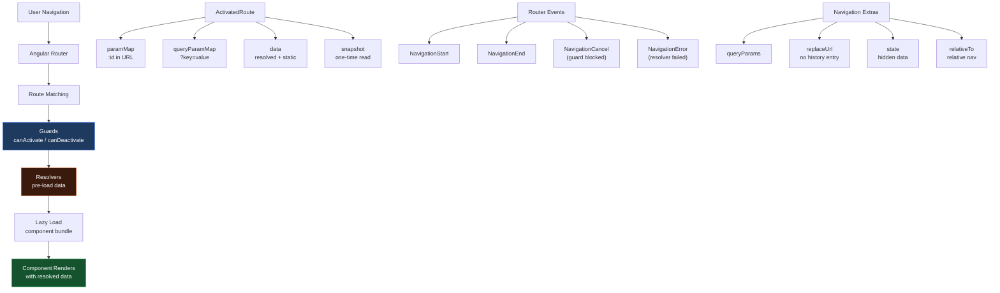

# الفصل الثامن — Routing: التنقل في الـ Angular App

> **المتطلبات:** [[05-Services-HTTP-Interceptors-Guards]] — لازم تعرف الـ Routes الأساسية والـ Guards قبل ما تبدأ. الفصل ده بيغوص أعمق.

---

## البداية — الـ Router مش مجرد URLs

في الفصل الخامس شرحنا الـ Routing الأساسي: إزاي تعمل routes، إزاي تحمي بيها بـ Guards، وإزاي تعمل lazy loading.

بس الـ Router في Angular أقوى بكتير من كده.

تخيل معايا التطبيقات الحقيقية:

```
Amazon:  /products?category=electronics&brand=apple&page=3&sort=price-asc
         ↑ كل التفاصيل دي في الـ URL — محتاج تقراها وتتصرف بناءً عليها

LinkedIn: /in/mohamedaliali123
          ↑ URL بيتغير لكل شخص — محتاج تقرأ الـ parameter وتجيب بياناته

Gmail:   /mail/inbox → /mail/starred → /mail/trash
         ↑ الـ sidebar بيفضل في مكانه — بس المحتوى بيتغير (child routes)

Medium:  لو بتكتب post وحاولت تعمل navigate بدون حفظ → تظهر رسالة "Sure?"
         ↑ canDeactivate guard

YouTube: لما بتفتح فيديو — المعلومات بتظهر فوراً من غير loading
         ↑ Resolver بيحمّل الـ data قبل ما الـ component يظهر
```

كل دي features في Angular Router. الفصل ده هيشرحهم كلهم.

---

## [[01-activated-route]] — الـ `ActivatedRoute`: "سجل الـ Route الحالية"

الـ `ActivatedRoute` هو Service بيحتوي على كل المعلومات عن الـ route اللي الـ component شتغل عليها حالياً.

```typescript
import { ActivatedRoute } from '@angular/router';

@Component({ ... })
export class ProductDetailComponent {
  private route = inject(ActivatedRoute);

  // ActivatedRoute contains:
  // route.snapshot       — frozen snapshot of the current route state
  // route.paramMap       — Observable of URL parameters (like :id)
  // route.queryParamMap  — Observable of query parameters (?key=value)
  // route.data           — Observable of resolved/static route data
  // route.url            — Observable of URL segments
  // route.parent         — parent route's ActivatedRoute
  // route.children       — child routes' ActivatedRoutes
}
```

**كل component بياخد instance خاص بيه** — الـ `ProductDetailComponent` بياخد الـ route بتاعته (`/products/:id`)، والـ `NavbarComponent` بياخد الـ root route.

> خليني أشرح كل نوع من الـ parameters بالتفصيل.

---

## [[02-route-params]] — الـ Route Parameters: "الـ :id في الـ URL"

### المفهوم

الـ Route Parameter هو **جزء متغير** في الـ URL بيتحدد في الـ route definition بـ `:`:

```typescript
// app.routes.ts
export const routes: Routes = [
  { path: 'products/:id',       loadComponent: () => ... },
  // :id → matches: /products/1, /products/abc, /products/laptop-pro
  // The actual value ('1', 'abc', 'laptop-pro') is available via ActivatedRoute

  { path: 'categories/:cat/products/:id', loadComponent: () => ... },
  // Multiple params: /categories/electronics/products/42
  // cat = 'electronics', id = '42'
];
```

---

### الطريقة الأولى — `snapshot` (قراءة مرة واحدة)

```typescript
@Component({ ... })
export class ProductDetailComponent implements OnInit {
  private route          = inject(ActivatedRoute);
  private productService = inject(ProductService);

  product: Product | null = null;
  isLoading = true;
  error: string | null = null;

  ngOnInit() {
    // snapshot = a frozen moment-in-time picture of the route
    // Good for: components that are DESTROYED and RE-CREATED when param changes
    // (which is the default Angular behavior for route changes)

    const id = this.route.snapshot.paramMap.get('id');
    //                              ^^^^^^^^^^^^^^^^
    //                              'id' matches the :id in the route path
    //                              returns: string | null
    //                              null if the parameter doesn't exist

    if (!id) {
      this.error = 'No product ID provided';
      this.isLoading = false;
      return;
    }

    this.productService.getById(id).subscribe({
      next: (data) => {
        this.product  = data;
        this.isLoading = false;
      },
      error: (err) => {
        this.error     = err.status === 404
          ? 'Product not found'
          : 'Failed to load product';
        this.isLoading = false;
      },
    });
  }
}
```

---

### الطريقة التانية — `paramMap` Observable (تفاعلي)

```typescript
ngOnInit() {
  // paramMap is an Observable that emits whenever the param changes
  // Good for: when the SAME component can be navigated to with different params
  // Example: /products/1 → /products/2 — if Angular reuses the component

  this.route.paramMap.subscribe(params => {
    const id = params.get('id') ?? '';
    this.loadProduct(id);
    // Called on EVERY param change — even if component is reused
  });
}

loadProduct(id: string) {
  this.isLoading = true;
  this.productService.getById(id).subscribe({
    next:  (data) => { this.product = data; this.isLoading = false; },
    error: (err)  => { this.error = 'Not found'; this.isLoading = false; },
  });
}
```

**متى تستخدم أيهما؟**

```
snapshot     → الغالبية العظمى من الحالات
               Angular بيدمّر ويعيد إنشاء الـ component لما تنتقل لـ route مختلفة
               فالـ snapshot بيكون صح دايماً

paramMap$    → لما ممكن تنتقل من /products/1 لـ /products/2
               والـ component ده نفسه
               بعض الـ routing strategies بتعيد استخدام الـ component instance
               مثال: صفحة details بيها "Next" و"Previous" buttons
```

---

### الطريقة التالتة — `toSignal()` (الأحدث والأنظف)

```typescript
import { toSignal } from '@angular/core/rxjs-interop';
import { map }      from 'rxjs/operators';

@Component({ ... })
export class ProductDetailComponent {
  private route          = inject(ActivatedRoute);
  private productService = inject(ProductService);

  // Convert paramMap Observable to a Signal — reactive and clean
  private productId = toSignal(
    this.route.paramMap.pipe(map(p => p.get('id') ?? '')),
    { initialValue: '' }
  );

  // Or read snapshot directly as signal-like value:
  private idFromSnapshot = this.route.snapshot.paramMap.get('id') ?? '';

  // Use the signal anywhere:
  ngOnInit() {
    const id = this.productId(); // read the signal
    if (id) this.load(id);
  }
}
```

---

### مثال كامل — Product Detail Component

```typescript
// product-detail.component.ts
@Component({
  selector:   'app-product-detail',
  standalone: true,
  imports:    [CurrencyPipe, DatePipe, RouterLink],
  template: `
    @if (isLoading) {
      <div class="loading-screen">
        <div class="spinner"></div>
        <p>Loading product details...</p>
      </div>
    } @else if (error) {
      <div class="error-screen">
        <h2>{{ error }}</h2>
        <a routerLink="/products">← Back to Products</a>
      </div>
    } @else if (product) {
      <div class="product-detail">
        <nav class="breadcrumb">
          <a routerLink="/products">Products</a>
          <span> / </span>
          <span>{{ product.name }}</span>
        </nav>

        <div class="product-hero">
          
          <div class="product-info">
            <h1>{{ product.name }}</h1>
            <p class="price">{{ product.price | currency:'EGP' }}</p>
            <p class="description">{{ product.description }}</p>

            @if (product.inStock) {
              <button (click)="addToCart()" class="btn-primary">
                Add to Cart
              </button>
            } @else {
              <button disabled class="btn-secondary">Out of Stock</button>
            }

            <p class="meta">
              Added: {{ product.createdAt | date:'longDate' }}
            </p>
          </div>
        </div>
      </div>
    }
  `,
})
export class ProductDetailComponent implements OnInit {
  private route          = inject(ActivatedRoute);
  private router         = inject(Router);
  private productService = inject(ProductService);
  private cartService    = inject(CartService);

  product:   Product | null = null;
  isLoading: boolean        = true;
  error:     string | null  = null;

  ngOnInit() {
    const id = this.route.snapshot.paramMap.get('id');

    if (!id) {
      // No ID in URL — redirect back (shouldn't happen with proper routing)
      this.router.navigate(['/products']);
      return;
    }

    this.productService.getById(id).subscribe({
      next: (data) => {
        this.product   = data;
        this.isLoading = false;
        // Update browser tab title:
        document.title = `${data.name} — My Store`;
      },
      error: (err) => {
        this.error     = err.status === 404
          ? `Product not found (ID: ${id})`
          : 'Failed to load product. Please try again.';
        this.isLoading = false;
      },
    });
  }

  addToCart() {
    if (!this.product) return;
    this.cartService.add(this.product);
    this.router.navigate(['/cart']);
  }
}
```

> فهمنا الـ Route Parameters. دلوقتي الـ Query Parameters — اللي بتيجي بعد الـ `?` في الـ URL.

---

## [[03-query-params]] — الـ Query Parameters: "البحث والفلترة والصفحات"

الـ Query Parameters هي الـ `key=value` pairs بعد الـ `?` في الـ URL:

```
/products?category=electronics&brand=apple&page=3&sort=price-asc
          ^^^^^^^^^^^^^^^^^^^^^^^^^^^^^^^^^^^^^^^^^^^^^^^^^^^^^^^^^
          Multiple query params, separated by &
```

الفرق المهم:
```
Route Param   (/products/:id)    → REQUIRED part of the URL — usually identifies a resource
Query Param   (/products?page=2) → OPTIONAL context — usually filtering/sorting/pagination
```

---

### قراءة الـ Query Params

```typescript
@Component({ ... })
export class ProductsListComponent implements OnInit {
  private route  = inject(ActivatedRoute);
  private router = inject(Router);

  products:    Product[] = [];
  currentPage: number    = 1;
  sortBy:      string    = 'name';
  category:    string    = '';

  ngOnInit() {
    // Method 1: snapshot (one-time read on component init)
    const page     = this.route.snapshot.queryParamMap.get('page')     ?? '1';
    const sort     = this.route.snapshot.queryParamMap.get('sort')     ?? 'name';
    const category = this.route.snapshot.queryParamMap.get('category') ?? '';

    this.currentPage = Number(page); // params are always strings — convert
    this.sortBy      = sort;
    this.category    = category;
    this.loadProducts();

    // Method 2: Observable (reacts to URL changes without component recreation)
    this.route.queryParamMap.subscribe(params => {
      this.currentPage = Number(params.get('page') ?? '1');
      this.sortBy      = params.get('sort')     ?? 'name';
      this.category    = params.get('category') ?? '';
      this.loadProducts(); // reload whenever URL params change
    });
  }

  loadProducts() {
    this.productService.getAll({
      page:     this.currentPage,
      sort:     this.sortBy,
      category: this.category,
    }).subscribe(data => this.products = data);
  }
}
```

---

### تغيير الـ Query Params برمجياً

```typescript
// Navigate to a new page (update only 'page' param, keep others)
goToPage(page: number) {
  this.router.navigate([], {
    // [] = empty array = stay on CURRENT route (don't change path)
    relativeTo: this.route,
    // relativeTo: makes [] relative to current route
    // Without this, [] might navigate to root

    queryParams: { page },
    // The params to add/change

    queryParamsHandling: 'merge',
    // 'merge':    keep existing params, ONLY update the ones specified
    //             Current: ?category=electronics&sort=price&page=2
    //             After:   ?category=electronics&sort=price&page=3
    //             ✅ Only 'page' changed

    // 'preserve': keep ALL existing params UNCHANGED (ignores queryParams)
    //             Use when you want to navigate without changing params

    // '' (default): REPLACE all params with only the ones in queryParams
    //             Current: ?category=electronics&sort=price&page=2
    //             After:   ?page=3
    //             ❌ Lost category and sort!
  });
}

// Sort by a new field (keep page reset to 1)
sortBy(field: string) {
  this.router.navigate([], {
    relativeTo: this.route,
    queryParams: { sort: field, page: 1 },
    queryParamsHandling: 'merge',
    // Keeps category, updates sort and resets page
  });
}

// Filter by category (reset pagination)
filterByCategory(category: string) {
  this.router.navigate([], {
    relativeTo: this.route,
    queryParams: category
      ? { category, page: 1 }
      : { page: 1 },
    // If clearing category, omit it from params (null removes it)
    queryParamsHandling: 'merge',
  });
}
```

---

### الـ Query Params في الـ Template

```html
<!-- Simple link with query params: -->
<a routerLink="/products" [queryParams]="{ sort: 'price', page: 1 }">
  Sort by Price
</a>
<!-- Result: /products?sort=price&page=1 -->

<!-- Merge with existing params: -->
<a
  routerLink="/products"
  [queryParams]="{ page: nextPage }"
  queryParamsHandling="merge"
>
  Next Page →
</a>
<!-- If current URL is /products?sort=price&page=2
     Result: /products?sort=price&page=3
     ✅ Sort is preserved, only page changes -->

<!-- Active state with exact query match: -->
<a
  routerLink="/products"
  [queryParams]="{ sort: 'name' }"
  routerLinkActive="active"
  [routerLinkActiveOptions]="{ exact: true }"
>
  Sort by Name
</a>

<!-- Pagination buttons: -->
@for (page of pages; track page) {
  <a
    routerLink="/products"
    [queryParams]="{ page: page }"
    queryParamsHandling="merge"
    [class.active]="currentPage === page"
  >
    {{ page }}
  </a>
}
```

---

### مثال كامل — Products Page مع Search/Filter/Pagination

```typescript
@Component({
  selector:   'app-products',
  standalone: true,
  imports:    [ReactiveFormsModule, RouterLink, AsyncPipe],
  template: `
    <div class="products-page">

      <!-- ─── Search & Filter Bar ────────────────────────────────── -->
      <div class="filters">
        <input
          [formControl]="searchControl"
          placeholder="Search products..."
          type="search"
        />

        <select [formControl]="categoryControl">
          <option value="">All Categories</option>
          @for (cat of categories; track cat) {
            <option [value]="cat">{{ cat }}</option>
          }
        </select>

        <select [formControl]="sortControl">
          <option value="name">Sort by Name</option>
          <option value="price-asc">Price: Low to High</option>
          <option value="price-desc">Price: High to Low</option>
        </select>
      </div>

      <!-- ─── Results Count ──────────────────────────────────────── -->
      <p>{{ total }} products found</p>

      <!-- ─── Product Grid ───────────────────────────────────────── -->
      <div class="grid">
        @for (product of products; track product.id) {
          <a [routerLink]="['/products', product.id]" class="product-card">
            <h3>{{ product.name }}</h3>
            <p>{{ product.price | currency:'EGP' }}</p>
          </a>
        } @empty {
          <p class="no-results">No products match your filters.</p>
        }
      </div>

      <!-- ─── Pagination ─────────────────────────────────────────── -->
      <div class="pagination">
        @if (currentPage > 1) {
          <a
            routerLink="/products"
            [queryParams]="{ page: currentPage - 1 }"
            queryParamsHandling="merge"
          >
            ← Previous
          </a>
        }

        @for (page of pageNumbers; track page) {
          <a
            routerLink="/products"
            [queryParams]="{ page }"
            queryParamsHandling="merge"
            [class.active]="page === currentPage"
          >
            {{ page }}
          </a>
        }

        @if (currentPage < totalPages) {
          <a
            routerLink="/products"
            [queryParams]="{ page: currentPage + 1 }"
            queryParamsHandling="merge"
          >
            Next →
          </a>
        }
      </div>

    </div>
  `,
})
export class ProductsComponent implements OnInit, OnDestroy {
  private route          = inject(ActivatedRoute);
  private router         = inject(Router);
  private productService = inject(ProductService);
  private destroy$       = new Subject<void>();

  searchControl   = new FormControl('');
  categoryControl = new FormControl('');
  sortControl     = new FormControl('name');

  products:    Product[] = [];
  total:       number    = 0;
  currentPage: number    = 1;
  totalPages:  number    = 1;
  pageNumbers: number[]  = [];
  categories   = ['Electronics', 'Books', 'Clothing', 'Food'];

  ngOnInit() {
    // Read initial params from URL (on first load or direct navigation):
    this.route.queryParamMap.pipe(
      takeUntil(this.destroy$)
    ).subscribe(params => {
      // Read all params:
      const search   = params.get('search')   ?? '';
      const category = params.get('category') ?? '';
      const sort     = params.get('sort')     ?? 'name';
      const page     = Number(params.get('page') ?? '1');

      // Sync form controls with URL params (for back/forward navigation):
      this.searchControl.setValue(search,   { emitEvent: false });
      this.categoryControl.setValue(category, { emitEvent: false });
      this.sortControl.setValue(sort,       { emitEvent: false });
      this.currentPage = page;
      // emitEvent: false → don't trigger valueChanges (avoid infinite loop)

      // Load products based on current params:
      this.loadProducts(search, category, sort, page);
    });

    // Update URL when form controls change:
    merge(
      this.searchControl.valueChanges.pipe(debounceTime(400)),
      this.categoryControl.valueChanges,
      this.sortControl.valueChanges,
    ).pipe(
      takeUntil(this.destroy$)
    ).subscribe(() => {
      // Reset to page 1 on filter/sort change:
      this.router.navigate([], {
        relativeTo: this.route,
        queryParams: {
          search:   this.searchControl.value   || null,
          category: this.categoryControl.value || null,
          sort:     this.sortControl.value     || null,
          page:     1,
        },
        queryParamsHandling: 'merge',
      });
      // null values REMOVE the param from the URL (clean URL)
    });
  }

  ngOnDestroy() {
    this.destroy$.next();
    this.destroy$.complete();
  }

  loadProducts(search: string, category: string, sort: string, page: number) {
    this.productService.getAll({ search, category, sort, page }).subscribe(res => {
      this.products   = res.items;
      this.total      = res.total;
      this.totalPages = Math.ceil(res.total / res.perPage);
      this.pageNumbers = Array.from({ length: this.totalPages }, (_, i) => i + 1);
    });
  }
}
```

> فهمنا Route Params وQuery Params. دلوقتي فيه طريقة ذكية للتعامل مع الـ data قبل ما الـ component يظهر: الـ Resolvers.

---

## [[04-resolvers]] — الـ Resolvers: "حمّل الـ Data أولاً"

### المشكلة

```typescript
// Without Resolver — component handles its own loading:
@Component({
  template: `
    @if (isLoading) {
      <div class="spinner">Loading...</div>
    } @else if (error) {
      <p>{{ error }}</p>
    } @else {
      <h1>{{ product.name }}</h1>
      <!-- real content -->
    }
  `
})
export class ProductDetailComponent implements OnInit {
  product: Product | null = null;
  isLoading = true;
  error = '';

  ngOnInit() {
    const id = this.route.snapshot.paramMap.get('id');
    this.productService.getById(id!).subscribe({
      next: (p) => { this.product = p; this.isLoading = false; },
      error: () => { this.error = 'Not found'; this.isLoading = false; }
    });
  }
}
```

المشكلة: المستخدم بيشوف "loading..." لثانية أو أكثر. الـ component بيظهر فاضي أولاً، وبعدين بيتملى.

**مع Resolver:**

```
Without Resolver:
  User navigates → Route activates → Component loads (empty)
                                    → ngOnInit runs → API call
                                    → Data arrives → template fills

With Resolver:
  User navigates → Resolver runs → API call → Data arrives
                → Route activates → Component loads (WITH DATA ALREADY)
                → template fills immediately (no empty state!)
```

---

### كيف تكتب Resolver

```typescript
// product.resolver.ts
import { ResolveFn, ActivatedRouteSnapshot, RouterStateSnapshot, Router } from '@angular/router';
import { inject }         from '@angular/core';
import { catchError, of } from 'rxjs';
import { ProductService } from '../services/product.service';

// ResolveFn<T> — where T is the type of data this resolver provides
export const productResolver: ResolveFn<Product | null> = (
  route: ActivatedRouteSnapshot,
  // route: info about the route being activated
  // Use: route.paramMap.get('id') to get :id

  state: RouterStateSnapshot
  // state: the full router state
  // Use: state.url to get the full URL being navigated to
) => {
  const productService = inject(ProductService);
  const router         = inject(Router);

  const id = route.paramMap.get('id');
  if (!id) {
    router.navigate(['/products']);
    return of(null);
  }

  return productService.getById(id).pipe(
    catchError(err => {
      if (err.status === 404) {
        router.navigate(['/not-found']);
      } else {
        router.navigate(['/error']);
      }
      return of(null);
      // Returning of(null) still activates the route
      // But the component will receive null as data
      // Alternatively, you can return EMPTY to NOT activate the route:
      // return EMPTY; // navigation stops, component never loads
    })
  );
};
```

---

### تسجيل الـ Resolver في الـ Routes

```typescript
// app.routes.ts
{
  path: 'products/:id',
  loadComponent: () => import('./product-detail.component').then(m => m.ProductDetailComponent),
  resolve: {
    product: productResolver,
    // 'product' is the KEY — accessed via route.snapshot.data['product']
    // productResolver is the resolver function
  },
}

// Multiple resolvers on one route:
{
  path: 'order/:id',
  loadComponent: () => import('./order-detail.component').then(m => m.OrderDetailComponent),
  resolve: {
    order:    orderResolver,
    products: orderProductsResolver,
    // Both run in PARALLEL — faster than sequential
  },
}
```

---

### استخدام الـ Resolved Data في الـ Component

```typescript
@Component({
  selector:   'app-product-detail',
  standalone: true,
  template: `
    <!-- No loading state needed — data is ALREADY HERE -->
    <h1>{{ product.name }}</h1>
    <p>{{ product.price | currency:'EGP' }}</p>
    <p>{{ product.description }}</p>
    <button (click)="addToCart()">Add to Cart</button>
  `,
})
export class ProductDetailComponent implements OnInit {
  private route = inject(ActivatedRoute);

  product!: Product;
  // ! because resolver guarantees data is here (or redirected away)

  ngOnInit() {
    this.product = this.route.snapshot.data['product'];
    // route.snapshot.data['product'] = the value returned by productResolver
    // Available IMMEDIATELY — no loading state needed

    // Update browser tab:
    document.title = `${this.product.name} — My Store`;
  }
}
```

---

### Resolver مع Observable vs Resolver مع Signal

```typescript
// Reactive approach — reacts when resolved data changes:
export class ProductDetailComponent {
  private route = inject(ActivatedRoute);

  // Using toSignal — cleanest approach:
  product = toSignal(
    this.route.data.pipe(
      map(data => data['product'] as Product)
    ),
    { initialValue: null }
  );

  // In template:
  // @if (product()) { <h1>{{ product()!.name }}</h1> }
}
```

---

### الـ Resolver مع Loading Indicator — UX التفاصيل

```typescript
// app.component.ts — global loading indicator during resolver
@Component({
  selector: 'app-root',
  standalone: true,
  imports: [RouterOutlet],
  template: `
    <!-- Global loading bar at top of page -->
    @if (isRouteLoading()) {
      <div class="route-loading-bar">
        <div class="loading-progress"></div>
      </div>
    }
    <router-outlet></router-outlet>
  `,
})
export class AppComponent {
  private router = inject(Router);
  isRouteLoading = signal(false);

  constructor() {
    this.router.events.subscribe(event => {
      if (event instanceof NavigationStart) {
        this.isRouteLoading.set(true);
        // Resolver started → show loading bar
      }
      if (event instanceof NavigationEnd || event instanceof NavigationCancel || event instanceof NavigationError) {
        this.isRouteLoading.set(false);
        // Resolver done (success or fail) → hide loading bar
      }
    });
  }
}
```

> ممتاز. عرفنا نـpre-load data. دلوقتي العكس: إزاي نمنع المستخدم من مغادرة صفحة فيها تغييرات غير محفوظة؟

---

## [[05-can-deactivate]] — `canDeactivate`: "هل متأكد إنك عايز تمشي؟"

### المشكلة

```
User opens product edit page
→ Changes the product name, price, description
→ Accidentally clicks browser back button (or any navigation)
→ All changes LOST without warning
→ Bad UX
```

**الحل:** `canDeactivate` Guard — بيشتغل **قبل** ما المستخدم يغادر الـ route.

---

### كتابة الـ `canDeactivate` Guard

```typescript
// unsaved-changes.guard.ts
import { CanDeactivateFn } from '@angular/router';

// The guard needs to know which component it's protecting
// Define an interface that the component must implement:
export interface CanDeactivateComponent {
  hasUnsavedChanges(): boolean;
}

// The guard function:
export const unsavedChangesGuard: CanDeactivateFn<CanDeactivateComponent> = (
  component: CanDeactivateComponent
  // Angular passes the component INSTANCE to the guard
  // We can call methods on it directly
) => {
  if (!component.hasUnsavedChanges()) {
    return true; // no unsaved changes → allow navigation
  }

  // Has unsaved changes → ask user:
  return confirm('You have unsaved changes. Leave without saving?');
  // confirm() = browser's built-in dialog — returns true or false
  // true  → user clicked OK → allow navigation
  // false → user clicked Cancel → block navigation (stay on page)

  // For a custom modal instead of confirm():
  // return component.showUnsavedModal();
  // where showUnsavedModal() returns Observable<boolean>
};
```

---

### Component يـ implement الـ Interface

```typescript
// edit-product.component.ts
@Component({
  selector:   'app-edit-product',
  standalone: true,
  imports:    [ReactiveFormsModule],
  template: `
    <form [formGroup]="form" (ngSubmit)="save()">
      <input formControlName="name" />
      <input formControlName="price" type="number" />
      <textarea formControlName="description"></textarea>

      @if (form.dirty) {
        <p class="unsaved-warning">⚠️ You have unsaved changes</p>
      }

      <button type="submit" [disabled]="form.pristine || isSaving">
        {{ isSaving ? 'Saving...' : 'Save Changes' }}
      </button>
      <button type="button" (click)="cancel()">Cancel</button>
    </form>
  `,
})
export class EditProductComponent implements OnInit, CanDeactivateComponent {
  private route          = inject(ActivatedRoute);
  private productService = inject(ProductService);
  private router         = inject(Router);

  form    = this.fb.group({
    name:        ['', Validators.required],
    price:       [0,  [Validators.required, Validators.min(0)]],
    description: [''],
  });
  isSaving = false;

  constructor(private fb: FormBuilder) {}

  ngOnInit() {
    const product = this.route.snapshot.data['product'] as Product;
    if (product) {
      this.form.patchValue(product); // pre-fill from resolver
    }
  }

  // CanDeactivateComponent interface requirement:
  hasUnsavedChanges(): boolean {
    return this.form.dirty && !this.isSaving;
    // dirty = user changed something
    // !isSaving = not currently saving (don't block while saving)
  }

  save() {
    if (this.form.invalid) return;
    this.isSaving = true;

    const id      = this.route.snapshot.paramMap.get('id')!;
    const changes = this.form.value;

    this.productService.update(id, changes).subscribe({
      next: () => {
        this.form.markAsPristine();
        // markAsPristine → dirty = false → hasUnsavedChanges() = false
        // Now the guard will allow navigation

        this.isSaving = false;
        this.router.navigate(['/products', id]);
      },
      error: () => {
        this.isSaving = false;
      },
    });
  }

  cancel() {
    // If user clicks Cancel — guard will ask if there are unsaved changes
    this.router.navigate(['/products']);
  }
}
```

---

### تسجيل الـ Guard في الـ Routes

```typescript
// app.routes.ts
{
  path:          'products/:id/edit',
  loadComponent: () => import('./edit-product.component').then(m => m.EditProductComponent),
  canDeactivate: [unsavedChangesGuard],
  resolve:       { product: productResolver },
}
```

---

### `canDeactivate` مع Custom Modal (بدل `confirm()`)

```typescript
// unsaved-changes.guard.ts — with custom modal
import { Observable } from 'rxjs';

export const unsavedChangesGuard: CanDeactivateFn<CanDeactivateComponent> = (
  component
) => {
  if (!component.hasUnsavedChanges()) {
    return true;
  }

  // Return Observable<boolean> — Angular awaits it
  return component.confirmLeave();
  // Component shows a custom dialog and returns true/false when user decides
};

// In the component:
export class EditProductComponent implements CanDeactivateComponent {
  private dialogService = inject(DialogService);

  hasUnsavedChanges() { return this.form.dirty; }

  confirmLeave(): Observable<boolean> {
    return this.dialogService.confirm({
      title:   'Unsaved Changes',
      message: 'You have unsaved changes. Leave without saving?',
      confirmText: 'Leave',
      cancelText:  'Stay',
    });
    // dialogService.confirm() shows a custom modal and returns Observable<boolean>
    // true when user clicks "Leave"
    // false when user clicks "Stay"
  }
}
```

> عرفنا كيف نحمي الـ user من نفسه. دلوقتي الـ Nested Routes — لما جزء من الصفحة بيفضل ثابت وجزء بيتغير.

---

## [[06-child-routes]] — الـ Child Routes: "الـ Layout الدائم"

### المشكلة

تخيل صفحة Profile فيها:
- Sidebar بالأيقونات (ثابت دايماً)
- المحتوى الرئيسي بيتغير حسب الـ sub-page

```
/profile          → shows "Personal Info" in the content area
/profile/orders   → shows "My Orders" in the content area
/profile/security → shows "Security Settings" in the content area
```

الـ Sidebar بيفضل في مكانه — بس المحتوى بيتغير.

---

### تعريف الـ Child Routes

```typescript
// app.routes.ts
{
  path: 'profile',
  canActivate: [authGuard],
  loadComponent: () => import('./profile-layout.component').then(m => m.ProfileLayoutComponent),
  // The LAYOUT component — stays alive across child navigation

  children: [
    {
      path: '',
      // /profile — exact match
      loadComponent: () => import('./profile-info.component').then(m => m.ProfileInfoComponent),
    },
    {
      path: 'orders',
      // /profile/orders
      loadComponent: () => import('./profile-orders.component').then(m => m.ProfileOrdersComponent),
    },
    {
      path: 'security',
      // /profile/security
      loadComponent: () => import('./profile-security.component').then(m => m.ProfileSecurityComponent),
    },
    {
      path: '**',
      // Catch-all inside profile → redirect to profile root
      redirectTo: '',
    },
  ],
}
```

---

### الـ Layout Component

```typescript
// profile-layout.component.ts
@Component({
  selector:   'app-profile-layout',
  standalone: true,
  imports:    [RouterOutlet, RouterLink, RouterLinkActive],
  template: `
    <div class="profile-page">

      <!-- ─── Sidebar (STAYS ALIVE across child navigation) ───────── -->
      <aside class="profile-sidebar">
        <div class="profile-avatar">
          {{ userInitials }}
        </div>
        <h3>{{ userName }}</h3>
        <p>{{ userEmail }}</p>

        <nav class="sidebar-nav">
          <a
            routerLink="/profile"
            routerLinkActive="active"
            [routerLinkActiveOptions]="{ exact: true }"
          >
            👤 Personal Info
          </a>
          <!-- exact: true — only active when URL is EXACTLY /profile
               without exact, /profile would also be active for /profile/orders -->

          <a routerLink="/profile/orders" routerLinkActive="active">
            📦 My Orders
          </a>

          <a routerLink="/profile/security" routerLinkActive="active">
            🔒 Security
          </a>
        </nav>
      </aside>

      <!-- ─── Content Area (CHANGES with each child route) ──────────── -->
      <main class="profile-content">
        <router-outlet></router-outlet>
        <!-- Child route components render HERE -->
        <!-- When user navigates /profile → /profile/orders:
             - ProfileLayoutComponent STAYS (sidebar stays)
             - Only this <router-outlet> content changes -->
      </main>

    </div>
  `,
})
export class ProfileLayoutComponent implements OnInit {
  private authService = inject(AuthService);

  userName     = '';
  userEmail    = '';
  userInitials = '';

  ngOnInit() {
    const user = this.authService.getCurrentUser();
    if (user) {
      this.userName     = `${user.firstName} ${user.lastName}`;
      this.userEmail    = user.email;
      this.userInitials = `${user.firstName[0]}${user.lastName[0]}`.toUpperCase();
    }
  }
}
```

---

### Child Route Component (الـ Content)

```typescript
// profile-info.component.ts
@Component({
  selector:   'app-profile-info',
  standalone: true,
  imports:    [ReactiveFormsModule],
  template: `
    <h2>Personal Information</h2>
    <form [formGroup]="form" (ngSubmit)="save()">
      <!-- form fields -->
      <button type="submit">Save Changes</button>
    </form>
  `,
})
export class ProfileInfoComponent implements OnInit {
  // This component mounts/unmounts based on child route activation
  // ProfileLayoutComponent (parent) stays alive
  form = this.fb.group({ /* ... */ });

  constructor(private fb: FormBuilder) {}
  ngOnInit() { /* load user data */ }
  save() { /* save profile */ }
}
```

---

### الـ `[routerLinkActiveOptions]="{ exact: true }"` — ليه مهم

```html
<!-- Without exact: true -->
<a routerLink="/profile" routerLinkActive="active">Info</a>
<!-- This link is "active" when URL STARTS WITH /profile
     /profile       → active ✅
     /profile/orders → ALSO active ❌ (because /profile is a prefix)

With exact: true:
<a routerLink="/profile" [routerLinkActiveOptions]="{ exact: true }" routerLinkActive="active">
  Info
</a>
     /profile       → active ✅
     /profile/orders → NOT active ✅ (doesn't match exactly)
-->
```

---

## [[07-router-events]] — الـ Router Events: "مراقبة التنقل"

الـ Angular Router بيـemit events أثناء كل navigation. تقدر تستمع ليهم وتعمل حاجات:

```typescript
import {
  Router,
  NavigationStart,
  NavigationEnd,
  NavigationCancel,
  NavigationError,
  RoutesRecognized,
} from '@angular/router';
import { filter } from 'rxjs/operators';

@Component({
  selector: 'app-root',
  standalone: true,
  imports: [RouterOutlet],
  template: `
    @if (isNavigating) {
      <div class="global-loading-bar">
        <div class="progress-line"></div>
      </div>
    }
    <router-outlet></router-outlet>
  `,
})
export class AppComponent {
  private router = inject(Router);
  isNavigating   = false;

  constructor() {
    this.router.events.subscribe(event => {
      if (event instanceof NavigationStart) {
        this.isNavigating = true;
        // Navigation began (before guard checks, resolver runs, etc.)
      }

      if (event instanceof NavigationEnd) {
        this.isNavigating = false;
        window.scrollTo({ top: 0, behavior: 'smooth' });
        // Scroll to top on every page change (good UX)
        // NavigationEnd fires AFTER the component is rendered
      }

      if (event instanceof NavigationCancel) {
        this.isNavigating = false;
        // Guard returned false or UrlTree — navigation cancelled
        console.log('Navigation cancelled:', event.reason);
      }

      if (event instanceof NavigationError) {
        this.isNavigating = false;
        // Error during navigation (resolver threw, lazy load failed, etc.)
        console.error('Navigation error:', event.error);
      }
    });

    // Or with filter — cleaner:
    this.router.events.pipe(
      filter(e => e instanceof NavigationEnd)
    ).subscribe(event => {
      // Analytics tracking:
      analytics.trackPageView((event as NavigationEnd).urlAfterRedirects);
    });
  }
}
```

---

### الـ Event Sequence — ترتيب الأحداث

```
User navigates to /products/42

1. NavigationStart       → navigation begun
2. RoutesRecognized      → route matched (found { path: 'products/:id' })
3. GuardsCheckStart      → running canActivate guards
4. ChildActivationStart  → activating child routes
5. ActivationStart       → activating the route
6. GuardsCheckEnd        → guards done (all passed)
7. ResolveStart          → running resolvers
8. ResolveEnd            → resolvers done (data available)
9. ChildActivationEnd    → child routes activated
10. ActivationEnd        → route activated
11. NavigationEnd        → navigation complete, component rendered

If any guard fails:
  GuardsCheckEnd → NavigationCancel

If resolver throws:
  ResolveEnd → NavigationError (or NavigationCancel if redirect)
```

---

## [[08-navigation-extras]] — Navigation Extras: "تفاصيل التنقل"

### `replaceUrl` — بدون History Entry

```typescript
// Normal navigation — adds entry to browser history
this.router.navigate(['/login']);
// User can click Back → goes to previous page

// replaceUrl — REPLACES current history entry (no Back)
this.router.navigate(['/login'], { replaceUrl: true });
// Use case: after logout — user shouldn't be able to go "back" to their profile
// Use case: after redirect — don't want redirect in history

// Example: auth check on app startup
ngOnInit() {
  if (!this.authService.isLoggedIn()) {
    this.router.navigate(['/auth/login'], { replaceUrl: true });
    // After login, pressing Back won't go to the "you're not logged in" page
  }
}
```

---

### `skipLocationChange` — بدون URL Change

```typescript
// Navigate without changing the URL in the browser bar
this.router.navigate(['/maintenance'], { skipLocationChange: true });
// URL stays as whatever it was
// Component changes — URL doesn't
// Use: internal redirects you don't want in history or visible to user
```

---

### `state` — تمرير Data بدون URL

```typescript
// Pass data that won't appear in the URL (disappears on refresh!):
this.router.navigate(['/order-confirmation'], {
  state: {
    orderId: 'ORD-2024-001',
    total:   1599.99,
    items:   ['Laptop', 'Mouse'],
  }
});

// Reading state in the destination component:
export class OrderConfirmationComponent implements OnInit {
  order: { orderId: string; total: number; items: string[] } | null = null;

  ngOnInit() {
    // Method 1: getCurrentNavigation (in constructor — before component fully init)
    const nav   = inject(Router).getCurrentNavigation();
    this.order   = nav?.extras.state as any;

    // Method 2: history.state (in ngOnInit and later)
    this.order = history.state;
    // If no state (user refreshed or navigated directly) → history.state is {}
    // Always check: if (!this.order?.orderId) { redirect away }
  }
}
```

**تحذير مهم:**

```typescript
// State is LOST on page refresh!
// If user refreshes /order-confirmation → history.state is empty → order is null
// Always handle the case where state is missing:

ngOnInit() {
  const state = history.state as OrderState;

  if (!state?.orderId) {
    // User navigated directly or refreshed — redirect them
    this.router.navigate(['/orders']);
    return;
  }

  this.order = state;
}
```

---

## [[09-routerlink-advanced]] — الـ RouterLink المتقدم

```html
<!-- Simple absolute path: -->
<a routerLink="/products">Products</a>

<!-- Dynamic params — array syntax: -->
<a [routerLink]="['/products', product.id]">View {{ product.name }}</a>
<!-- Result: /products/42 -->

<!-- Nested params: -->
<a [routerLink]="['/categories', catId, 'products', productId]">View</a>
<!-- Result: /categories/5/products/42 -->

<!-- With query params: -->
<a
  [routerLink]="['/products']"
  [queryParams]="{ sort: 'price', page: 1 }"
>
  Browse by Price
</a>
<!-- Result: /products?sort=price&page=1 -->

<!-- With fragment (#section): -->
<a [routerLink]="['/about']" fragment="team">Meet the Team</a>
<!-- Result: /about#team -->
<!-- This scrolls to the element with id="team" on that page -->

<!-- Relative navigation (inside child route component): -->
<a routerLink="./security">Security Settings</a>
<!-- ./ = relative to current route
     If current is /profile, this goes to /profile/security -->

<a routerLink="../">Go to Parent</a>
<!-- ../ = go up one level in route hierarchy -->

<!-- routerLinkActive — active CSS class: -->
<a
  routerLink="/products"
  routerLinkActive="nav-active"
>
  Products
</a>
<!-- 'nav-active' class added when URL contains '/products' -->
<!-- Multiple classes: routerLinkActive="class1 class2" -->

<!-- Exact matching for routerLinkActive: -->
<a
  routerLink="/"
  routerLinkActive="nav-active"
  [routerLinkActiveOptions]="{ exact: true }"
>
  Home
</a>
<!-- Without exact: always active (every URL starts with /) -->
<!-- With exact: only active when URL is exactly '/' -->

<!-- Check active state programmatically: -->
<a
  routerLink="/products"
  #productsLink="routerLinkActive"
  routerLinkActive="active"
>
  Products {{ productsLink.isActive ? '(current)' : '' }}
</a>
<!-- #productsLink = template ref to the RouterLinkActive directive -->
<!-- .isActive = boolean — access it in template -->
```

---

## [[10-programmatic-navigation]] — التنقل البرمجي

```typescript
@Component({ ... })
export class SomeComponent {
  private router = inject(Router);
  private route  = inject(ActivatedRoute);

  // Basic navigation:
  goHome() {
    this.router.navigate(['/']);
  }

  // With params:
  viewProduct(id: number) {
    this.router.navigate(['/products', id]);
  }

  // With query params:
  search(query: string) {
    this.router.navigate(['/products'], {
      queryParams: { search: query, page: 1 }
    });
  }

  // Relative navigation (relative to current route):
  goToOrders() {
    this.router.navigate(['orders'], { relativeTo: this.route });
    // If current route is /profile → goes to /profile/orders
  }

  // Back navigation:
  goBack() {
    history.back();
    // Browser back — same as clicking the back button
    // OR:
    this.location.back();
    // Angular's Location service — same effect but testable
  }

  // Navigate after successful operation:
  async saveProfile() {
    try {
      await firstValueFrom(this.profileService.update(this.form.value));
      this.router.navigate(['/profile'], {
        queryParams: { saved: 'true' }
        // Show success message on the profile page
      });
    } catch {
      this.error = 'Save failed';
    }
  }
}
```

---

## [[11-route-data]] — الـ Static Route Data

```typescript
// app.routes.ts — attach static data to routes
{
  path: 'admin',
  data: {
    title:        'Admin Dashboard',
    breadcrumb:   'Admin',
    permissions:  ['admin'],
    showSidebar:  true,
  },
  loadComponent: () => ...
}

// Reading in the component:
export class AdminComponent implements OnInit {
  private route = inject(ActivatedRoute);
  title = '';

  ngOnInit() {
    this.title = this.route.snapshot.data['title'];
    document.title = `${this.title} — My App`;
  }
}

// Or reactively — if route data can change:
export class SomeComponent {
  title = toSignal(
    inject(ActivatedRoute).data.pipe(map(d => d['title'] as string)),
    { initialValue: '' }
  );
}

// Useful for: dynamic page titles, breadcrumbs, sidebar visibility,
//             permission checking, analytics tags
```

---

## [[12-full-route-config]] — الـ Route Configuration الكاملة

```typescript
// app.routes.ts — complete real-world routing config

import { Routes } from '@angular/router';
import { authGuard }             from './guards/auth.guard';
import { adminGuard }            from './guards/admin.guard';
import { unsavedChangesGuard }   from './guards/unsaved-changes.guard';
import { productResolver }       from './resolvers/product.resolver';
import { orderResolver }         from './resolvers/order.resolver';

export const routes: Routes = [

  // ─── Root redirect ─────────────────────────────────────────────────
  { path: '', redirectTo: 'home', pathMatch: 'full' },

  // ─── Public routes ─────────────────────────────────────────────────
  {
    path: 'home',
    loadComponent: () => import('./pages/home.component').then(m => m.HomeComponent),
    data: { title: 'Home' },
  },

  // Products with child routes:
  {
    path: 'products',
    children: [
      {
        path: '',
        loadComponent: () => import('./pages/products/list.component').then(m => m.ProductsListComponent),
        data: { title: 'Products' },
      },
      {
        path: ':id',
        loadComponent: () => import('./pages/products/detail.component').then(m => m.ProductDetailComponent),
        resolve: { product: productResolver },
        // data: { title: 'Product' } — title set dynamically after resolver
      },
      {
        path: ':id/edit',
        loadComponent: () => import('./pages/products/edit.component').then(m => m.EditProductComponent),
        canActivate:   [authGuard],
        canDeactivate: [unsavedChangesGuard],
        resolve:       { product: productResolver },
        data:          { title: 'Edit Product' },
      },
    ],
  },

  // ─── Auth routes ───────────────────────────────────────────────────
  {
    path: 'auth',
    children: [
      {
        path: 'login',
        loadComponent: () => import('./pages/auth/login.component').then(m => m.LoginComponent),
        data: { title: 'Sign In' },
      },
      {
        path: 'register',
        loadComponent: () => import('./pages/auth/register.component').then(m => m.RegisterComponent),
        data: { title: 'Create Account' },
      },
    ],
  },

  // ─── Protected routes with nested layout ───────────────────────────
  {
    path: 'profile',
    canActivate: [authGuard],
    loadComponent: () => import('./pages/profile/layout.component').then(m => m.ProfileLayoutComponent),
    data: { title: 'My Profile' },
    children: [
      { path: '',         loadComponent: () => import('./pages/profile/info.component').then(m => m.ProfileInfoComponent)         },
      { path: 'orders',   loadComponent: () => import('./pages/profile/orders.component').then(m => m.ProfileOrdersComponent)     },
      { path: 'security', loadComponent: () => import('./pages/profile/security.component').then(m => m.ProfileSecurityComponent) },
      { path: '**',       redirectTo: '' },  // /profile/unknown → /profile
    ],
  },

  // ─── Cart ──────────────────────────────────────────────────────────
  {
    path: 'cart',
    canActivate: [authGuard],
    loadComponent: () => import('./pages/cart.component').then(m => m.CartComponent),
    data: { title: 'Shopping Cart' },
  },

  // ─── Orders ────────────────────────────────────────────────────────
  {
    path: 'orders',
    canActivate: [authGuard],
    children: [
      {
        path: '',
        loadComponent: () => import('./pages/orders/list.component').then(m => m.OrdersListComponent),
      },
      {
        path: ':id',
        loadComponent: () => import('./pages/orders/detail.component').then(m => m.OrderDetailComponent),
        resolve:       { order: orderResolver },
      },
    ],
  },

  // ─── Admin section ─────────────────────────────────────────────────
  {
    path: 'admin',
    canActivate: [adminGuard],
    loadComponent: () => import('./pages/admin/layout.component').then(m => m.AdminLayoutComponent),
    data: { title: 'Admin' },
    children: [
      { path: '',        loadComponent: () => import('./pages/admin/dashboard.component').then(m => m.AdminDashboardComponent) },
      { path: 'users',   loadComponent: () => import('./pages/admin/users.component').then(m => m.AdminUsersComponent)       },
      { path: 'products', loadComponent: () => import('./pages/admin/products.component').then(m => m.AdminProductsComponent) },
    ],
  },

  // ─── 404 — must be last ────────────────────────────────────────────
  {
    path: '**',
    loadComponent: () => import('./pages/not-found.component').then(m => m.NotFoundComponent),
    data: { title: '404 Not Found' },
  },
];
```

---

## 🗺️ خريطة الـ Router Features



---

## ✅ Checkpoint — أسئلة الإنترفيو

**س: إيه الفرق بين `route.snapshot.paramMap` و `route.paramMap`؟**
> `snapshot.paramMap` قراءة واحدة في لحظة تهيئة الـ component — لا تتحدث بعد كده. `route.paramMap` هو Observable بيـemit قيمة جديدة كل ما الـ param يتغير. استخدم `snapshot` في الغالبية العظمى من الحالات (Angular بيدمر ويعيد إنشاء الـ component). استخدم `paramMap` Observable لما ممكن تنتقل بين routes مختلفة باستخدام نفس الـ component instance.

**س: إيه الـ Resolver وليه بنستخدمه؟**
> الـ Resolver هو function بتشتغل قبل تفعيل الـ route — بتجيب data من الـ API وتوديها للـ component عبر `route.snapshot.data`. الـ component بيلاقي الـ data جاهزة في `ngOnInit` بدون أي loading state. بيحسن UX لأن المستخدم ما بيشوفش "loading..." على صفحة فاضية — بيشوف loading indicator في الـ router نفسه بدل كده.

**س: إيه الـ `canDeactivate` Guard وأمتى بيشتغل؟**
> الـ `canDeactivate` بيشتغل لما المستخدم بيحاول يغادر route معينة (back، navigate، close tab). بيتقدم الـ component instance كـ argument فتقدر تستدعي methods عليه. بيرجع `boolean | Observable<boolean>` — لو false يمنع المغادرة. بيستخدم لتحذير المستخدم من فقدان التغييرات غير المحفوظة.

**س: إيه الفرق بين Route Parameter و Query Parameter؟**
> الـ Route Parameter (`:id`) هو جزء من بنية الـ URL نفسه — ضروري لتحديد resource محدد (`/products/42`). الـ Query Parameter (`?key=value`) هو context اختياري يأتي بعد `?` — بيستخدم للبحث والفلترة والـ pagination. Route params تحذفها تتكسر الـ URL. Query params تحذفها الصفحة لا تزال تعمل.

**س: إيه `replaceUrl: true` وأمتى تستخدمه؟**
> `replaceUrl: true` يستبدل الـ entry الحالية في تاريخ المتصفح بدلاً من إضافة entry جديدة — المستخدم لا يستطيع الضغط على Back للعودة. يُستخدم بعد الـ logout (لا تريد المستخدم يعود لصفحة الـ profile)، وبعد الـ redirects التلقائية (لا تريد الـ redirect في التاريخ).

---

## 🛠️ Practical Exercise

### Task 1 — اقرأ وتنبّأ

```typescript
// app.routes.ts
{
  path: 'shop',
  children: [
    { path: '', redirectTo: 'all', pathMatch: 'full' },
    { path: 'all',        loadComponent: () => ... },
    { path: ':category',  loadComponent: () => ... },
    { path: ':category/:id', loadComponent: () => ... },
  ]
}
```

**أجب:**
1. URL: `/shop` → أيه Route بتتفعّل؟
2. URL: `/shop/electronics` → ما الذي يصل في `paramMap`؟
3. URL: `/shop/electronics/42` → ما الذي يصل في `paramMap`؟
4. كيف تقرأ `category` و`id` معاً في نفس الـ component؟

---

### Task 2 — اكتب Products Page مع Query Params

```typescript
// Build a ProductsComponent that:
// - Reads: ?search=, ?category=, ?sort=, ?page= from URL on init
// - Has: search input, category select, sort select
// - Updates URL when any control changes (debounce search by 400ms)
// - Resets page to 1 when search/category/sort changes
// - Shows pagination using routerLink with queryParams
// - Uses queryParamsHandling: 'merge' everywhere

// Bonus: handle null params (remove from URL when empty)
```

---

### Task 3 — اكتب Resolver كامل

```typescript
// Write a UserResolver that:
// - Reads :userId from route params
// - Fetches user from UserService.getById(id)
// - If 404: redirects to /not-found
// - If other error: redirects to /error
// - If no id: redirects to /users
// - Returns: User object on success

export const userResolver: ResolveFn<User | null> = (route) => {
  // implement
};

// Then use it in a UserProfileComponent:
// - No isLoading state needed
// - No error state needed (resolver handled it)
// - Just reads this.route.snapshot.data['user'] and displays it
```

---

### Task 4 — اكتب canDeactivate للـ EditProfile

```typescript
// EditProfileComponent requirements:
// - Has a form with firstName, lastName, bio
// - Pre-filled from resolver (UserResolver)
// - Shows "⚠️ Unsaved changes" badge when form.dirty
// - canDeactivate guard blocks navigation if form.dirty
// - After successful save: markAsPristine() → guard allows navigation
// - Shows confirm() dialog if user tries to leave with unsaved changes

// Implement:
// 1. CanDeactivateComponent interface
// 2. The guard function  
// 3. The component class with hasUnsavedChanges()
// 4. The route config with canDeactivate + resolve
```

---

### Task 5 — Nested Layout

```typescript
// Build a DashboardLayoutComponent with sidebar + content area:
//
// Routes:
// /dashboard          → DashboardOverview
// /dashboard/reports  → DashboardReports
// /dashboard/settings → DashboardSettings
//
// Layout requirements:
// - Sidebar stays visible across all child routes
// - <router-outlet> in content area changes
// - routerLinkActive on sidebar items
// - exact: true for /dashboard link
// - breadcrumb at top: "Dashboard > Reports" (reads route data)
```

---

## 🫒 زتونة الإنترفيو

> **"Angular Router has four advanced features beyond basic routing. Route parameters (`:id`) identify specific resources — read via `route.snapshot.paramMap.get('id')` (one-time) or `route.paramMap` Observable (reactive). Query parameters (`?key=value`) provide filtering/sorting/pagination context — read similarly, update with `router.navigate([], { queryParams, queryParamsHandling: 'merge' })`. Resolvers pre-fetch data before component activation so templates render immediately with full data — returning `EMPTY` cancels navigation, returning `of(null)` lets it proceed with null. `canDeactivate` guards run when the user leaves a route — receive the component instance and can call its methods to check for unsaved state, returning `Observable<boolean>` for custom modals. Child routes with `<router-outlet>` create persistent layout components — the parent stays alive while only the inner outlet content changes."**

---

*Next → [[09-Custom-Directives-Pipes]] — عارفين الـ Routing بالكامل. دلوقتي: إزاي بنبني reusable behavior نضيفه لأي HTML element بـ Attribute Directives، وإزاي بنبني Custom Pipes بتحوّل الـ data في الـ template.*
