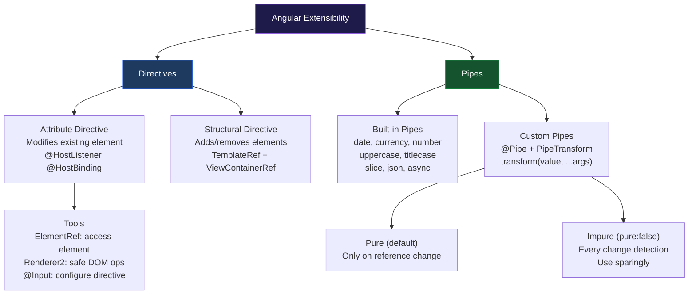

# الفصل التاسع — Custom Directives والـ Pipes: توسيع HTML وتحويل البيانات

> **المتطلبات:** [[02-Angular-Architecture]] و[[03-Template-Syntax-and-Lifecycle]] — لازم تعرف الـ Components والـ Template Syntax قبل ما تبدأ.

---

## البداية — القصة اللي بتبرر وجود الـ Directives والـ Pipes

### المشكلة الأولى — "نفس الـ Behavior في 50 مكان"

تخيّل إنك بتبني e-commerce app. كل ProductCard المستخدم لما يوقّف فوقها — بيحصل lift effect: بتتحرك للأعلى 4px وبيظهر shadow أثقل.

```typescript
// ProductCardComponent
@Component({ ... })
export class ProductCardComponent {
  isHovered = false;

  onMouseEnter() { this.isHovered = true; }
  onMouseLeave() { this.isHovered = false; }
}
```

```html
<div
  [style.transform]="isHovered ? 'translateY(-4px)' : 'translateY(0)'"
  [style.box-shadow]="isHovered ? '0 8px 24px rgba(0,0,0,0.15)' : 'none'"
  [style.transition]="'all 0.2s ease'"
  (mouseenter)="onMouseEnter()"
  (mouseleave)="onMouseLeave()"
>
  ...
</div>
```

بعدين الـ Design team قالت: "إحنا عايزين نفس الـ hover effect على CategoryCard وUserCard وBlogCard."

ساعتها بتعمل إيه؟ تكرر الـ code الـ 4 أسطر ده في كل component؟

**الحل:** بدل ما تكرر الـ behavior — تحطه في **Directive** وتستخدمه في أي element بـ attribute واحد:

```html
<div appHoverLift>...</div>
<!-- One attribute. Lift effect applied. No copy-paste. -->
```

---

### المشكلة التانية — "تحويل Data قبل العرض"

عندك `description` من الـ backend — 800 character. في الـ card بتعرض بس 150 منهم.

```typescript
// Option A — في الـ component:
export class ProductCardComponent {
  truncatedDescription = '';

  ngOnInit() {
    this.truncatedDescription = this.description.length > 150
      ? this.description.slice(0, 150) + '...'
      : this.description;
  }
}
```

بعدين لازم نفس الـ truncation في 5 components تانيين. وبعدين الـ limit بقى 100 في مكان، 200 في مكان تاني، 80 في مكان تالت...

**الحل:** بدل ما تحول الـ data في الـ component — تعمل **Pipe** بتعمل التحويل في الـ template نفسه:

```html
{{ description | truncate:150 }}
{{ description | truncate:80 }}
{{ blogPost.content | truncate:200 }}
```

---

## [[01-what-is-directive]] — الـ Directive: "سلوك بلا Template"

قبل ما تبني directive — لازم تفهم إيه هو بالظبط.

في Angular فيه **3 أنواع من الـ Directives**:

```
1. Component           = Directive + Template
   The most common type. <app-navbar>, <app-product-card>
   Has its own HTML template

2. Attribute Directive  = Directive that CHANGES BEHAVIOR of an existing element
   Applied as an HTML attribute: <div appHighlight>
   Doesn't add/remove elements — just modifies the element it's on

3. Structural Directive = Directive that CHANGES THE DOM STRUCTURE
   Applied with * prefix: *ngIf, *ngFor
   Adds or removes elements from the DOM
```

كل Component هو Directive. بس مش كل Directive هو Component.

الفرق الجوهري:

```
Component:         <app-card [product]="p"></app-card>
                   ↑ Creates a NEW element with its own template

Attribute Directive: <div appHoverLift>...</div>
                     ↑ Modifies an EXISTING element — no new template
```

---

## [[02-attribute-directive-basics]] — الـ Attribute Directive: "سلوك على الـ Element"

### أبسط Directive ممكن

```typescript
// highlight.directive.ts
import { Directive, ElementRef } from '@angular/core';

@Directive({
  selector: '[appHighlight]',
  //          ^^^^^^^^^^^^^^
  //          Attribute selector — matches any element that HAS this attribute
  //          [appHighlight] in CSS means: "element with appHighlight attribute"
  //          Usage: <p appHighlight>This gets highlighted</p>
  //                 <button appHighlight>Me too</button>
  //                 <div appHighlight>Any element</div>
  standalone: true,
})
export class HighlightDirective {
  constructor(private el: ElementRef) {
    // ElementRef gives you the actual DOM element
    // this.el.nativeElement = the element the directive is applied to
    this.el.nativeElement.style.backgroundColor = 'yellow';
    // Applied immediately when directive is created
  }
}
```

```html
<!-- Usage — add the directive as an attribute: -->
<p appHighlight>This paragraph has a yellow background</p>
<span appHighlight>So does this span</span>

<!-- In the parent component's imports: -->
<!-- imports: [HighlightDirective] -->
```

---

### الـ `ElementRef` — "المقبض على الـ DOM Element"

`ElementRef` هو **wrapper** حول الـ native DOM element. بيتوصلك عبر الـ Dependency Injection في الـ constructor:

```typescript
constructor(private el: ElementRef<HTMLElement>) {
  // el.nativeElement = the actual DOM HTMLElement
  console.log(this.el.nativeElement);           // <div appHighlight>...</div>
  console.log(this.el.nativeElement.tagName);   // 'DIV'
  console.log(this.el.nativeElement.textContent); // text inside
}
```

---

### الـ `Renderer2` — "الطريق الآمن للـ DOM"

```typescript
// DIRECT DOM manipulation — works but not recommended:
this.el.nativeElement.style.backgroundColor = 'yellow';
// Problem: doesn't work in SSR (Server-Side Rendering) where there's no DOM
// Problem: bypasses Angular's abstractions

// Renderer2 — Angular's safe abstraction:
constructor(private el: ElementRef, private renderer: Renderer2) {
  this.renderer.setStyle(this.el.nativeElement, 'background-color', 'yellow');
  // renderer.setStyle: works in SSR, works in web workers, more testable
}
```

**متى تستخدم `Renderer2`؟** دايماً في الـ Directives إذا كنت بتبعت الـ app على SSR أو بتكتب library.

**متى `el.nativeElement.style` كافي؟** لو التطبيق browser-only وبسيط.

---

## [[03-host-listener]] — `@HostListener`: "استمع لـ Events على الـ Element"

الـ `@HostListener` decorator بيخليك تستمع لـ DOM events على الـ element اللي الـ directive واقف عليه:

```typescript
import { Directive, ElementRef, HostListener, Renderer2 } from '@angular/core';

@Directive({
  selector: '[appHoverLift]',
  standalone: true,
})
export class HoverLiftDirective {
  constructor(private el: ElementRef, private renderer: Renderer2) {
    // Set up initial transition:
    this.renderer.setStyle(this.el.nativeElement, 'transition', 'transform 0.2s ease, box-shadow 0.2s ease');
  }

  @HostListener('mouseenter')
  onMouseEnter() {
    // Called when mouse enters the host element
    this.renderer.setStyle(this.el.nativeElement, 'transform', 'translateY(-4px)');
    this.renderer.setStyle(this.el.nativeElement, 'box-shadow', '0 8px 24px rgba(0,0,0,0.15)');
  }

  @HostListener('mouseleave')
  onMouseLeave() {
    // Called when mouse leaves the host element
    this.renderer.setStyle(this.el.nativeElement, 'transform', 'translateY(0)');
    this.renderer.setStyle(this.el.nativeElement, 'box-shadow', 'none');
  }

  @HostListener('click', ['$event'])
  onClick(event: MouseEvent) {
    // Called when host element is clicked
    // '$event' passes the DOM event object to the handler
    console.log('Clicked at:', event.clientX, event.clientY);
  }
}
```

```html
<!-- Any element becomes "hover-liftable": -->
<div class="product-card" appHoverLift>Product content...</div>
<div class="user-card"    appHoverLift>User content...</div>
<button                   appHoverLift>Hover me!</button>
```

---

### `@HostListener` مع Window/Document Events

```typescript
@Directive({ selector: '[appClickOutside]', standalone: true })
export class ClickOutsideDirective {
  @Output() clickOutside = new EventEmitter<void>();

  constructor(private el: ElementRef) {}

  @HostListener('document:click', ['$event'])
  onDocumentClick(event: MouseEvent) {
    // Listen on the DOCUMENT level (not just the host element)
    // 'document:click' = click event on the document object

    const clickedInside = this.el.nativeElement.contains(event.target as Node);
    // .contains() — true if event.target is inside this element OR is this element

    if (!clickedInside) {
      this.clickOutside.emit();
      // Clicked OUTSIDE this element — notify the parent
    }
  }
}
```

```html
<div appClickOutside (clickOutside)="closeDropdown()">
  <button (click)="toggleDropdown()">Menu ▾</button>
  @if (isOpen) {
    <div class="dropdown">
      <!-- dropdown items -->
    </div>
  }
</div>
```

---

## [[04-host-binding]] — `@HostBinding`: "ربط Properties للـ Host Element"

الـ `@HostBinding` بيربط TypeScript property بـ DOM property أو CSS class أو style على الـ host element — مباشرةً من غير `renderer.setStyle()`:

```typescript
import { Directive, HostBinding, HostListener, Input } from '@angular/core';

@Directive({
  selector: '[appActiveState]',
  standalone: true,
})
export class ActiveStateDirective {

  @HostBinding('class.is-active')
  isActive = false;
  // When isActive = true  → adds class 'is-active' to host element
  // When isActive = false → removes class 'is-active' from host element

  @HostBinding('attr.aria-selected')
  ariaSelected = 'false';
  // Binds to the aria-selected HTML attribute
  // For accessibility

  @HostBinding('style.borderColor')
  borderColor = 'transparent';

  @HostBinding('style.opacity')
  opacity = '1';

  @HostListener('click')
  toggle() {
    this.isActive    = !this.isActive;
    this.ariaSelected = this.isActive ? 'true' : 'false';
    this.borderColor  = this.isActive ? '#007bff' : 'transparent';
  }
}
```

```html
<button appActiveState>Option A</button>
<!-- When clicked:
     - class 'is-active' added/removed
     - aria-selected toggled
     - border color changes -->
```

---

### `@HostBinding` vs `Renderer2`

```typescript
// With Renderer2 — imperative:
@HostListener('click')
onClick() {
  this.renderer.addClass(this.el.nativeElement, 'active');
  this.renderer.setAttribute(this.el.nativeElement, 'aria-selected', 'true');
}

// With @HostBinding — declarative:
@HostBinding('class.active') isActive = false;
@HostBinding('attr.aria-selected') ariaSelected = 'false';

@HostListener('click')
onClick() {
  this.isActive = true;
  this.ariaSelected = 'true';
  // Angular handles the DOM update automatically
}
```

`@HostBinding` أنظف وأكثر declarative — بس `Renderer2` أقوى للعمليات المعقدة.

---

## [[05-input-on-directive]] — الـ `@Input` على الـ Directive: "توصيل الـ Configuration"

الـ Directives بتقبل `@Input` بنفس طريقة الـ Components:

```typescript
import { Directive, ElementRef, Input, OnInit, Renderer2 } from '@angular/core';

@Directive({
  selector: '[appBadge]',
  standalone: true,
})
export class BadgeDirective implements OnInit {

  @Input('appBadge') label = '';
  // Input name = directive selector name
  // <span appBadge="New">Product</span>
  // passes "New" as the label

  @Input() badgeColor = '#dc3545'; // default red
  @Input() badgePosition: 'top-right' | 'top-left' = 'top-right';

  constructor(private el: ElementRef, private renderer: Renderer2) {}

  ngOnInit() {
    if (!this.label) return; // no badge if no label

    // Make the host element position: relative
    this.renderer.setStyle(this.el.nativeElement, 'position', 'relative');
    this.renderer.setStyle(this.el.nativeElement, 'display',  'inline-block');

    // Create badge element
    const badge = this.renderer.createElement('span');
    this.renderer.appendChild(badge, this.renderer.createText(this.label));
    this.renderer.setStyle(badge, 'position',         'absolute');
    this.renderer.setStyle(badge, 'top',              '-8px');
    this.renderer.setStyle(badge, 'right',            this.badgePosition === 'top-right' ? '-8px' : 'auto');
    this.renderer.setStyle(badge, 'left',             this.badgePosition === 'top-left'  ? '-8px' : 'auto');
    this.renderer.setStyle(badge, 'background-color', this.badgeColor);
    this.renderer.setStyle(badge, 'color',            '#fff');
    this.renderer.setStyle(badge, 'border-radius',    '50%');
    this.renderer.setStyle(badge, 'width',            '20px');
    this.renderer.setStyle(badge, 'height',           '20px');
    this.renderer.setStyle(badge, 'font-size',        '10px');
    this.renderer.setStyle(badge, 'display',          'flex');
    this.renderer.setStyle(badge, 'align-items',      'center');
    this.renderer.setStyle(badge, 'justify-content',  'center');

    this.renderer.appendChild(this.el.nativeElement, badge);
  }
}
```

```html
<!-- Usage: -->
<button [appBadge]="cartCount" badgeColor="#e74c3c">
  🛒 Cart
</button>
<!-- Result: Cart button with a red badge showing the count -->


<!-- Result: image with a green "New" badge in top-left -->
```

---

## [[06-real-directives]] — Directives حقيقية تستخدمها كل يوم

### Directive 1 — `appClickOutside` (إغلاق الـ Dropdowns)

```typescript
// click-outside.directive.ts
@Directive({
  selector: '[appClickOutside]',
  standalone: true,
})
export class ClickOutsideDirective {
  @Output() clickOutside = new EventEmitter<void>();

  constructor(private el: ElementRef) {}

  @HostListener('document:click', ['$event.target'])
  onDocumentClick(target: HTMLElement) {
    if (!this.el.nativeElement.contains(target)) {
      this.clickOutside.emit();
    }
  }
}
```

---

### Directive 2 — `appAutoFocus` (Focus التلقائي)

```typescript
// auto-focus.directive.ts
import { AfterViewInit, Directive, ElementRef } from '@angular/core';

@Directive({
  selector: '[appAutoFocus]',
  standalone: true,
})
export class AutoFocusDirective implements AfterViewInit {
  constructor(private el: ElementRef<HTMLElement>) {}

  ngAfterViewInit() {
    // Focus the element after the view is rendered
    setTimeout(() => {
      this.el.nativeElement.focus();
      // setTimeout: ensures element is in the DOM (even inside @if)
    }, 0);
  }
}
```

```html
<!-- Auto-focus the search input when it appears: -->
@if (showSearch) {
  <input appAutoFocus type="search" placeholder="Search..." />
}
<!-- Input gets focus immediately when rendered -->
```

---

### Directive 3 — `appTooltip` (Tooltip على أي Element)

```typescript
// tooltip.directive.ts
@Directive({
  selector: '[appTooltip]',
  standalone: true,
})
export class TooltipDirective implements OnDestroy {
  @Input('appTooltip') text       = '';
  @Input() tooltipPosition: 'top' | 'bottom' | 'left' | 'right' = 'top';

  private tooltip: HTMLElement | null = null;

  constructor(private el: ElementRef, private renderer: Renderer2) {}

  @HostListener('mouseenter')
  show() {
    if (!this.text) return;

    this.tooltip = this.renderer.createElement('div');
    this.renderer.addClass(this.tooltip, 'app-tooltip');
    this.renderer.appendChild(this.tooltip, this.renderer.createText(this.text));
    this.renderer.appendChild(document.body, this.tooltip);

    // Position based on host element:
    const rect = this.el.nativeElement.getBoundingClientRect();
    const tip  = this.tooltip!;

    requestAnimationFrame(() => {
      // Get tooltip dimensions after rendering:
      const tipRect = tip.getBoundingClientRect();

      switch (this.tooltipPosition) {
        case 'top':
          this.renderer.setStyle(tip, 'top',  `${rect.top - tipRect.height - 8 + window.scrollY}px`);
          this.renderer.setStyle(tip, 'left', `${rect.left + (rect.width - tipRect.width) / 2 + window.scrollX}px`);
          break;
        case 'bottom':
          this.renderer.setStyle(tip, 'top',  `${rect.bottom + 8 + window.scrollY}px`);
          this.renderer.setStyle(tip, 'left', `${rect.left + (rect.width - tipRect.width) / 2 + window.scrollX}px`);
          break;
        // ... left, right
      }
    });
  }

  @HostListener('mouseleave')
  hide() {
    this.removeTooltip();
  }

  @HostListener('click')
  onClick() {
    this.removeTooltip(); // close on click too
  }

  ngOnDestroy() {
    this.removeTooltip(); // cleanup when directive is destroyed
  }

  private removeTooltip() {
    if (this.tooltip) {
      this.renderer.removeChild(document.body, this.tooltip);
      this.tooltip = null;
    }
  }
}
```

```html
<button [appTooltip]="'Save your changes'" tooltipPosition="top">
  💾 Save
</button>


```

---

### Directive 4 — `appPermission` (إخفاء حسب الصلاحية)

```typescript
// permission.directive.ts
@Directive({
  selector: '[appPermission]',
  standalone: true,
})
export class PermissionDirective implements OnInit {
  @Input('appPermission') requiredRole: 'admin' | 'editor' | 'viewer' = 'viewer';

  constructor(
    private el:        ElementRef,
    private renderer:  Renderer2,
    private authService: AuthService,
  ) {}

  ngOnInit() {
    const user = this.authService.getCurrentUser();

    const hasPermission = user && this.hasRole(user.role, this.requiredRole);

    if (!hasPermission) {
      // Remove element from DOM completely
      this.renderer.setStyle(this.el.nativeElement, 'display', 'none');
      // Or better — remove it entirely:
      // const parent = this.renderer.parentNode(this.el.nativeElement);
      // this.renderer.removeChild(parent, this.el.nativeElement);
    }
  }

  private hasRole(userRole: string, required: string): boolean {
    const hierarchy = { admin: 3, editor: 2, viewer: 1 };
    return (hierarchy[userRole as keyof typeof hierarchy] ?? 0) >=
           (hierarchy[required as keyof typeof hierarchy] ?? 0);
  }
}
```

```html
<button [appPermission]="'admin'">Delete All Users</button>
<!-- Only visible to admins -->

<a [appPermission]="'editor'" routerLink="/admin/posts/new">
  Write New Post
</a>
<!-- Visible to editors and admins -->
```

---

## [[07-structural-directives]] — الـ Structural Directives: "تغيير الـ DOM Structure"

الـ Structural Directive بيستخدم `TemplateRef` و`ViewContainerRef` لإضافة أو إزالة elements من الـ DOM.

### إزاي Angular بتحوّل `*directive`

```html
<!-- What you write: -->
<p *ngIf="condition">Show if true</p>

<!-- What Angular transforms it to internally: -->
<ng-template [ngIf]="condition">
  <p>Show if true</p>
</ng-template>
<!-- The * is syntactic sugar for ng-template -->
```

### كتابة Structural Directive من الصفر

```typescript
// repeat.directive.ts — like *ngFor but for a fixed count
import { Directive, Input, OnInit, TemplateRef, ViewContainerRef } from '@angular/core';

@Directive({
  selector: '[appRepeat]',
  standalone: true,
})
export class RepeatDirective implements OnInit {
  @Input('appRepeat') count = 0;
  // <div *appRepeat="5">Repeat me 5 times</div>

  constructor(
    private template:       TemplateRef<any>,
    // TemplateRef: the <ng-template> that wraps the element
    // Contains: <div>Repeat me 5 times</div>

    private viewContainer:  ViewContainerRef,
    // ViewContainerRef: the place in the DOM where to insert/remove views
    // "Views" = instances of the template
  ) {}

  ngOnInit() {
    for (let i = 0; i < this.count; i++) {
      this.viewContainer.createEmbeddedView(this.template, { $implicit: i });
      // createEmbeddedView: renders ONE instance of the template
      // { $implicit: i } passes context to the template
      // $implicit = the default variable (accessible as 'let item')
    }
  }
}
```

```html
<!-- Usage: -->
<div *appRepeat="3">
  <div class="skeleton-card">Loading...</div>
</div>
<!-- Renders 3 skeleton loading cards -->

<!-- With context (index): -->
<div *appRepeat="5; let index">
  Row {{ index + 1 }}
</div>
<!-- Renders: Row 1, Row 2, Row 3, Row 4, Row 5 -->
```

---

### الـ `unless` Directive — عكس `@if`

```typescript
// unless.directive.ts
@Directive({
  selector: '[appUnless]',
  standalone: true,
})
export class UnlessDirective {
  private shown = false;

  constructor(
    private template:      TemplateRef<any>,
    private viewContainer: ViewContainerRef,
  ) {}

  @Input('appUnless')
  set condition(value: boolean) {
    // Setter — called every time the input value changes
    if (!value && !this.shown) {
      // condition is FALSE (unless FALSE = show) AND not shown yet
      this.viewContainer.createEmbeddedView(this.template);
      this.shown = true;
    } else if (value && this.shown) {
      // condition is TRUE (unless TRUE = hide) AND currently shown
      this.viewContainer.clear();
      this.shown = false;
    }
    // else: no change needed
  }
}
```

```html
<div *appUnless="isLoggedIn">
  <p>Please log in to continue.</p>
  <a routerLink="/auth/login">Sign In</a>
</div>
<!-- Shown when isLoggedIn = false, hidden when isLoggedIn = true -->
<!-- Opposite of @if (isLoggedIn) -->
```

> خلصنا الـ Directives. دلوقتي الـ Pipes — بيحوّلوا الـ data في الـ template قبل العرض.

---

## [[08-pipes-concept]] — الـ Pipes: "مصفاة العرض"

### ليه الـ Pipe موجودة؟

```typescript
// Option A — transform in TypeScript:
export class ProductComponent {
  product = { name: 'laptop pro 15', price: 25000, createdAt: '2024-01-15' };

  get displayName()  { return this.product.name.toUpperCase(); }
  get displayPrice() { return `EGP ${this.product.price.toLocaleString()}`; }
  get displayDate()  {
    return new Date(this.product.createdAt).toLocaleDateString('en-EG', {
      year: 'numeric', month: 'long', day: 'numeric'
    });
  }
}
```

```html
<h1>{{ displayName }}</h1>
<p>{{ displayPrice }}</p>
<p>{{ displayDate }}</p>
```

3 getters في الـ TypeScript لمجرد تحويل format للعرض. ولو عندك 20 component محتاج نفس التحويلات — 60 getter.

**الـ Pipe بتحل ده:**

```html
<h1>{{ product.name | uppercase }}</h1>
<p>{{ product.price | currency:'EGP' }}</p>
<p>{{ product.createdAt | date:'longDate' }}</p>
```

**صفر getters.** التحويل بيحصل في الـ template نفسه — والـ pipe قابلة للإعادة في أي مكان.

---

### كيف تعمل الـ Pipe

```
{{ value | pipeName:arg1:arg2 }}
    ^          ^         ^
  input     pipe name  optional args

Angular calls: pipe.transform(value, arg1, arg2)
Returns the transformed value which replaces {{ value }}
```

```typescript
// The date pipe roughly looks like:
class DatePipe {
  transform(value: string | Date, format: string = 'mediumDate'): string {
    const date = new Date(value);
    // format and return based on 'format' argument
    return date.toLocaleDateString(/* ... */);
  }
}

// Your template:
{{ '2024-01-15' | date:'longDate' }}
// Angular calls: DatePipe.transform('2024-01-15', 'longDate')
// Returns: "January 15, 2024"
```

---

### الـ Built-in Pipes

```html
<!-- DATE -->
{{ createdAt | date }}                     <!-- Jan 15, 2024 (default: mediumDate) -->
{{ createdAt | date:'short' }}             <!-- 1/15/24, 10:30 AM -->
{{ createdAt | date:'long' }}              <!-- January 15, 2024 at 10:30:00 AM GMT+2 -->
{{ createdAt | date:'dd/MM/yyyy' }}        <!-- 15/01/2024 -->
{{ createdAt | date:'EEEE, MMMM d' }}     <!-- Monday, January 15 -->
{{ createdAt | date:'h:mm a' }}            <!-- 10:30 AM -->

<!-- CURRENCY -->
{{ price | currency }}                     <!-- $25,000.00 (default: USD) -->
{{ price | currency:'EGP' }}              <!-- EGP 25,000.00 -->
{{ price | currency:'EGP':'symbol' }}      <!-- EGP 25,000.00 -->
{{ price | currency:'EGP':'code':'1.0-0'}} <!-- EGP 25,000 (no decimals) -->

<!-- NUMBERS -->
{{ 1234567 | number }}                     <!-- 1,234,567 -->
{{ 3.14159 | number:'1.2-2' }}            <!-- 3.14 (1 integer, 2 decimal) -->
{{ 0.75 | percent }}                       <!-- 75% -->
{{ 0.75 | percent:'1.1-1' }}              <!-- 75.0% -->

<!-- TEXT -->
{{ name | uppercase }}                     <!-- MOHAMED AHMED -->
{{ name | lowercase }}                     <!-- mohamed ahmed -->
{{ name | titlecase }}                     <!-- Mohamed Ahmed -->
{{ 'hello world angular' | titlecase }}    <!-- Hello World Angular -->

<!-- SLICE -->
{{ text | slice:0:100 }}                   <!-- first 100 chars -->
{{ items | slice:2:5 }}                    <!-- items[2], items[3], items[4] -->
{{ items | slice:-3 }}                     <!-- last 3 items -->

<!-- JSON (debugging) -->
{{ myObject | json }}                      <!-- pretty-printed JSON -->
{{ formValue | json }}                     <!-- great for debugging forms -->

<!-- KEYVALUE -->
@for (entry of myObject | keyvalue; track entry.key) {
  <p>{{ entry.key }}: {{ entry.value }}</p>
}
<!-- Iterates over object properties -->

<!-- ASYNC -->
{{ observable$ | async }}
<!-- Subscribes to Observable, shows value, auto-unsubscribes on destroy -->
```

---

## [[09-custom-pipe]] — بناء Custom Pipe من الصفر

### الـ Pipe Interface

كل Pipe هي class بتـ implement الـ `PipeTransform` interface:

```typescript
import { Pipe, PipeTransform } from '@angular/core';

@Pipe({
  name: 'myPipe',     // name used in template: {{ value | myPipe }}
  standalone: true,   // self-contained (Angular 14+)
  pure: true,         // discussed below
})
export class MyPipe implements PipeTransform {
  transform(value: any, ...args: any[]): any {
    // value = the input (what comes before |)
    // args = any arguments (what comes after :)
    // return = the transformed value shown in template
    return transformedValue;
  }
}
```

---

### Pipe 1 — `truncate`: قطع النص

```typescript
// truncate.pipe.ts
import { Pipe, PipeTransform } from '@angular/core';

@Pipe({
  name: 'truncate',
  standalone: true,
})
export class TruncatePipe implements PipeTransform {
  transform(
    value: string | null | undefined,
    limit: number = 100,
    ellipsis: string = '...'
  ): string {
    // Handle null/undefined gracefully
    if (!value) return '';

    // If value fits within limit — return as-is
    if (value.length <= limit) return value;

    // Truncate and add ellipsis
    return value.slice(0, limit).trim() + ellipsis;
    // .trim() removes trailing whitespace before the ellipsis
  }
}
```

```html
<!-- Usage: -->
{{ description | truncate }}
<!-- Default: 100 chars + '...' -->

{{ description | truncate:50 }}
<!-- 50 chars + '...' -->

{{ description | truncate:200:'…' }}
<!-- 200 chars + '…' (unicode ellipsis) -->

{{ description | truncate:80:' (read more)' }}
<!-- 80 chars + ' (read more)' -->
```

---

### Pipe 2 — `timeAgo`: "منذ كذا"

```typescript
// time-ago.pipe.ts
@Pipe({
  name: 'timeAgo',
  standalone: true,
})
export class TimeAgoPipe implements PipeTransform {
  transform(value: string | Date | null): string {
    if (!value) return '';

    const date = new Date(value);
    const now  = new Date();
    const diffMs = now.getTime() - date.getTime();

    // Convert to seconds:
    const diffSec = Math.floor(diffMs / 1000);

    if (diffSec < 60) {
      return 'just now';
    }

    // Convert to minutes:
    const diffMin = Math.floor(diffSec / 60);
    if (diffMin < 60) {
      return diffMin === 1 ? '1 minute ago' : `${diffMin} minutes ago`;
    }

    // Convert to hours:
    const diffHours = Math.floor(diffMin / 60);
    if (diffHours < 24) {
      return diffHours === 1 ? '1 hour ago' : `${diffHours} hours ago`;
    }

    // Convert to days:
    const diffDays = Math.floor(diffHours / 24);
    if (diffDays < 7) {
      return diffDays === 1 ? 'yesterday' : `${diffDays} days ago`;
    }

    // Convert to weeks:
    const diffWeeks = Math.floor(diffDays / 7);
    if (diffWeeks < 4) {
      return diffWeeks === 1 ? '1 week ago' : `${diffWeeks} weeks ago`;
    }

    // Convert to months:
    const diffMonths = Math.floor(diffDays / 30);
    if (diffMonths < 12) {
      return diffMonths === 1 ? '1 month ago' : `${diffMonths} months ago`;
    }

    // Years:
    const diffYears = Math.floor(diffDays / 365);
    return diffYears === 1 ? '1 year ago' : `${diffYears} years ago`;
  }
}
```

```html
{{ comment.createdAt | timeAgo }}
<!-- "just now", "5 minutes ago", "2 hours ago", "yesterday", "3 months ago" -->

{{ post.publishedAt | timeAgo }}
```

---

### Pipe 3 — `initials`: أحرف أولى

```typescript
// initials.pipe.ts
@Pipe({
  name: 'initials',
  standalone: true,
})
export class InitialsPipe implements PipeTransform {
  transform(fullName: string | null | undefined, maxChars: number = 2): string {
    if (!fullName?.trim()) return '?';

    const words    = fullName.trim().split(/\s+/);
    // Split by any whitespace
    // 'Mohamed Ahmed Ali' → ['Mohamed', 'Ahmed', 'Ali']

    const initials = words
      .slice(0, maxChars)
      // Take first maxChars words (default: 2)
      .map(word => word[0].toUpperCase())
      // Take first letter of each word, uppercase
      .join('');
      // Join: 'M' + 'A' = 'MA'

    return initials;
  }
}
```

```html
{{ user.fullName | initials }}
<!-- 'Mohamed Ahmed' → 'MA' -->
<!-- 'Sara' → 'S' -->
<!-- 'Ali Hassan Mohamed' → 'AH' (max 2) -->

{{ user.fullName | initials:3 }}
<!-- 'Ali Hassan Mohamed' → 'AHM' -->

<div class="avatar">{{ user.fullName | initials }}</div>
```

---

### Pipe 4 — `highlight`: تلوين نص البحث

```typescript
// highlight.pipe.ts
import { Pipe, PipeTransform } from '@angular/core';
import { DomSanitizer, SafeHtml } from '@angular/platform-browser';

@Pipe({
  name: 'highlight',
  standalone: true,
})
export class HighlightPipe implements PipeTransform {
  constructor(private sanitizer: DomSanitizer) {}

  transform(text: string, search: string): SafeHtml {
    if (!text || !search?.trim()) return text;

    const escaped = search.replace(/[.*+?^${}()|[\]\\]/g, '\\$&');
    // Escape special regex characters in the search term

    const regex   = new RegExp(`(${escaped})`, 'gi');
    // Case-insensitive, global match

    const highlighted = text.replace(
      regex,
      '<mark>$1</mark>'
      // Wrap each match in <mark> tag
      // $1 = the captured group (the matched text)
    );

    return this.sanitizer.bypassSecurityTrustHtml(highlighted);
    // bypassSecurityTrustHtml: Angular sanitizes HTML by default (XSS protection)
    // We tell it to trust THIS specific HTML (we generated it — it's safe)
    // CAUTION: never use this with user-provided HTML!
  }
}
```

```html
<!-- In search results: -->
<p [innerHTML]="item.description | highlight:searchQuery"></p>
<!-- Uses [innerHTML] because the pipe returns SafeHtml with <mark> tags -->
<!-- Result: text with matching parts wrapped in <mark> (highlighted) -->
```

---

### Pipe 5 — `orderBy`: ترتيب Array

```typescript
// order-by.pipe.ts
@Pipe({
  name: 'orderBy',
  standalone: true,
  pure: false,
  // pure: false — recalculates on every change detection cycle
  // Required when: the array contents change but the reference doesn't
  // Caution: can impact performance — use only when needed
})
export class OrderByPipe implements PipeTransform {
  transform<T>(
    array:     T[],
    field:     keyof T,
    direction: 'asc' | 'desc' = 'asc'
  ): T[] {
    if (!array || !field) return array;

    return [...array].sort((a, b) => {
      // [...array] creates a copy — don't mutate the original
      const valA = a[field];
      const valB = b[field];

      // Handle strings:
      if (typeof valA === 'string' && typeof valB === 'string') {
        const comparison = valA.localeCompare(valB);
        return direction === 'asc' ? comparison : -comparison;
      }

      // Handle numbers and dates:
      if (valA < valB) return direction === 'asc' ? -1 :  1;
      if (valA > valB) return direction === 'asc' ?  1 : -1;
      return 0;
    });
  }
}
```

```html
<!-- Sort products by name alphabetically: -->
@for (product of products | orderBy:'name'; track product.id) {
  <div>{{ product.name }}</div>
}

<!-- Sort by price descending: -->
@for (product of products | orderBy:'price':'desc'; track product.id) {
  <div>{{ product.price }}</div>
}

<!-- Sort by date (newest first): -->
@for (post of posts | orderBy:'createdAt':'desc'; track post.id) {
  <div>{{ post.title }}</div>
}
```

---

## [[10-pure-vs-impure]] — Pure vs Impure Pipes

ده concept مهم للـ performance:

### Pure Pipes (الـ Default)

```typescript
@Pipe({ name: 'myPipe', pure: true }) // pure: true is default
```

Angular بيستدعي `transform()` **فقط** لما:
- الـ input value نفسه تغيّر (primitive: مختلف قيمة / reference: reference جديدة)

```typescript
// Pure pipe — Angular WON'T recalculate if:
const items = ['a', 'b', 'c'];
items.push('d');              // mutated the array — SAME reference!
// Template: {{ items | orderBy:'length' }} — WON'T update!

// Pure pipe — Angular WILL recalculate if:
this.items = [...this.items, 'd']; // new array reference!
// Template: {{ items | orderBy:'length' }} — WILL update ✅
```

---

### Impure Pipes

```typescript
@Pipe({ name: 'myPipe', pure: false }) // opt-in
```

Angular بيستدعي `transform()` في **كل change detection cycle** — حتى لو الـ input ما اتغيرش.

```typescript
// Impure pipe — use when you NEED to recalculate even without reference change:
// - Filtering arrays where you mutate them (bad practice but sometimes inherited)
// - Pipes that depend on external state (current time, locale)
// - async pipe is impure (checks Observable on every cycle)

@Pipe({ name: 'currentTime', pure: false })
export class CurrentTimePipe implements PipeTransform {
  transform(): string {
    return new Date().toLocaleTimeString();
    // Returns current time — changes every second
    // Must be impure to update without external trigger
  }
}
```

**تحذير:** الـ Impure pipes تأثر على الـ performance — بتشتغل في كل change detection. استخدمها بحذر.

---

## [[11-pipe-chaining]] — Pipe Chaining: "سلسلة التحويلات"

```html
<!-- Pipes can be chained — applied left to right: -->
{{ name | uppercase | truncate:20 }}
<!-- 1. uppercase: 'Mohamed Ahmed Ali' → 'MOHAMED AHMED ALI'
     2. truncate:20: 'MOHAMED AHMED ALI' → 'MOHAMED AHMED ALI...' (if > 20) -->

{{ description | lowercase | titlecase | truncate:100 }}
<!-- 1. lowercase → 'hello world...'
     2. titlecase → 'Hello World...'
     3. truncate:100 → first 100 chars -->

{{ createdAt | date:'mediumDate' | uppercase }}
<!-- 1. date → 'Jan 15, 2024'
     2. uppercase → 'JAN 15, 2024' -->

{{ price | currency:'EGP':'symbol':'1.0-0' }}
<!-- currency pipe with 3 arguments: currency code, display, digit format -->
```

---

## [[12-async-pipe-deep]] — الـ `async` Pipe: "إدارة الـ Observables بدون Subscribe"

```typescript
// Option A — manual subscribe (verbose, error-prone):
@Component({ ... })
export class ProductsComponent implements OnInit, OnDestroy {
  products: Product[] = [];
  private sub!: Subscription;

  ngOnInit() {
    this.sub = this.productService.getAll().subscribe(data => {
      this.products = data;
    });
  }

  ngOnDestroy() {
    this.sub.unsubscribe(); // MUST remember to unsubscribe!
  }
}
```

```typescript
// Option B — async pipe (clean, automatic, safe):
@Component({
  imports: [AsyncPipe],
  template: `
    @for (product of products$ | async ?? []; track product.id) {
      <app-product-card [product]="product" />
    }
    <!-- async pipe: subscribes, shows value, unsubscribes on destroy -->
    <!-- ?? [] : if null (before data arrives), use empty array -->
  `,
})
export class ProductsComponent {
  products$ = this.productService.getAll();
  // $ suffix = convention for Observable
  // No subscribe/unsubscribe needed — async pipe handles it
}
```

---

### `async` Pipe مع Loading/Error States

```typescript
@Component({
  imports: [AsyncPipe],
  template: `
    @if (loading$ | async) {
      <div class="spinner">Loading...</div>
    }
    @if (error$ | async; as errorMsg) {
      <div class="error">{{ errorMsg }}</div>
    }
    @for (product of products$ | async ?? []; track product.id) {
      <app-product-card [product]="product" />
    }
  `,
})
export class ProductsComponent {
  loading$ = new BehaviorSubject(true);
  error$   = new BehaviorSubject<string | null>(null);

  products$ = this.productService.getAll().pipe(
    tap(() => this.loading$.next(false)),
    catchError(err => {
      this.loading$.next(false);
      this.error$.next(err.message);
      return of([]);
    })
  );
}
```

---

### `as` في الـ `async` Pipe — Alias

```html
<!-- Without 'as' — pipe evaluated twice: -->
@if ((user$ | async)?.name) {
  <p>{{ (user$ | async)?.name }}</p>
}
<!-- Subscribes TWICE — two separate subscriptions! Inefficient. -->

<!-- With 'as' — pipe evaluated once: -->
@if (user$ | async; as user) {
  <!-- 'user' = the resolved value — used without pipe -->
  <p>{{ user.name }}</p>
  <p>{{ user.email }}</p>
  
}
<!-- Subscribes ONCE — value aliased as 'user' -->
```

---

## 🗺️ خريطة الـ Directives والـ Pipes



---

## ✅ Checkpoint — أسئلة الإنترفيو

**س: إيه الفرق بين Component وAttribute Directive؟**
> الـ Component هو directive له template خاص به — بيضيف element جديد للـ DOM. الـ Attribute Directive بيغيّر سلوك أو مظهر element موجود — مفيش template. تستخدم `[appMyDirective]` كـ attribute selector.

**س: إيه الـ `@HostListener` وإيه الـ `@HostBinding`؟**
> `@HostListener` بيستمع لـ DOM events على الـ host element (العنصر اللي الـ directive واقف عليه). `@HostBinding` بيربط TypeScript property بـ DOM property أو CSS class أو style على الـ host element — Angular بيحدّث الـ DOM تلقائياً لما الـ property تتغير.

**س: ليه بنستخدم `Renderer2` بدل `element.style` مباشرةً؟**
> `Renderer2` هو Angular's abstraction للـ DOM manipulation — بيشتغل في كل البيئات: browser، SSR، Web Workers. الـ `element.style` المباشر بيفشل في SSR لأنه ما فيش DOM. في التطبيقات الـ browser-only بيشتغلوا الاتنين، بس `Renderer2` الـ best practice.

**س: إيه الفرق بين Pure وImpure Pipe؟**
> الـ Pure pipe (الـ default) بيتستدعي `transform()` بس لما الـ input reference تتغير — أسرع في الـ performance. الـ Impure pipe بيتستدعي في كل change detection cycle — مطلوب لما الـ input يتغير من جوّاه (mutation) أو الـ pipe بتعتمد على external state زي الوقت. الـ `async` pipe impure بشكل inherent.

**س: إيه الـ `as` syntax في الـ `async` pipe وليه مهم؟**
> `@if (obs$ | async; as val)` بيـsubscribe مرة واحدة وبيـalias الـ value بـ `val` تقدر تستخدمه في الـ block بدون pipe. بدون `as` — لو استخدمت `(obs$ | async)?.prop` مرتين — بتعمل subscription مرتين. مع `as` — subscription واحدة، والـ value متاح بدون `()` إضافية.

---

## 🛠️ Practical Exercise

### Task 1 — اكتب `appHoverGlow` Directive

```typescript
// Requirements:
// - On mouseenter: adds a colored glow effect (box-shadow)
// - On mouseleave: removes the glow
// - @Input() glowColor = '#007bff'  (default blue)
// - @Input() glowIntensity: 'sm' | 'md' | 'lg' = 'md'
//   sm → box-shadow: 0 0 8px <color>
//   md → box-shadow: 0 0 16px <color>
//   lg → box-shadow: 0 0 24px <color>
// - Smooth transition (0.3s ease)
// - Use @HostBinding for styles

// Usage:
// <div appHoverGlow glowColor="#e74c3c" glowIntensity="lg">...</div>
```

---

### Task 2 — اكتب `appLazyLoad` Directive للـ Images

```typescript
// Requirements:
// - Applied to  elements
// - Only loads the image when it enters the viewport
// - Uses IntersectionObserver API
// - @Input('appLazyLoad') src: string — the real src
// - Shows a placeholder/skeleton while loading
// - Replaces placeholder with real image when visible

// Usage:
// 
```

---

### Task 3 — اكتب 3 Custom Pipes

```typescript
// Pipe 1: fileSize
// Converts bytes to human-readable string
// 0 → '0 B'
// 1024 → '1 KB'
// 1048576 → '1 MB'
// Usage: {{ file.size | fileSize }}

// Pipe 2: phoneNumber
// Formats Egyptian phone: '01012345678' → '010 1234 5678'
// Usage: {{ contact.phone | phoneNumber }}

// Pipe 3: arabicNumber
// Converts Western numerals to Arabic-Indic
// '1234' → '١٢٣٤'
// Usage: {{ count | arabicNumber }}
```

---

### Task 4 — Search with Highlight Pipe

اكتب Component بيعمل:
- Search input بيفلتر قائمة items
- الـ items المطابقة بيتعرضوا مع highlight للجزء المطابق
- استخدم الـ `HighlightPipe` اللي بنيناها

```typescript
// Products: [{ id: 1, name: 'Laptop Pro', description: '...' }, ...]
// Search: "pro"
// Result: shows "Laptop <mark>Pro</mark>" in the results

@Component({
  template: `
    <input [formControl]="search" placeholder="Search..." />
    @for (item of filtered; track item.id) {
      <div [innerHTML]="item.name | highlight:search.value"></div>
    }
  `
})
```

---

## 🫒 زتونة الإنترفيو

> **"Directives extend HTML behavior without adding new elements. Attribute Directives use `@HostListener` to react to DOM events on the host element and `@HostBinding` to bind host properties/classes/styles — both declarative alternatives to `Renderer2`'s imperative methods. Structural Directives use `TemplateRef` (the wrapped content) and `ViewContainerRef` (where to insert it) to dynamically add or remove elements. Pipes transform data in templates via `transform(value, ...args)`. Pure pipes (default) only recalculate when the input reference changes — impure pipes recalculate on every change detection cycle. Chain pipes left-to-right with `|`. The `async` pipe handles Observable subscriptions automatically, and `as` creates a local alias to avoid duplicate subscriptions."**

---

*Next → [[10-Performance-OnPush-Defer]] — عارفين إزاي نبني features كاملة. دلوقتي: إزاي نخلي الـ Angular app سريعة؟ الـ OnPush Change Detection Strategy، الـ `@defer` loading، والـ performance patterns اللي بتفرق في الـ production.*
