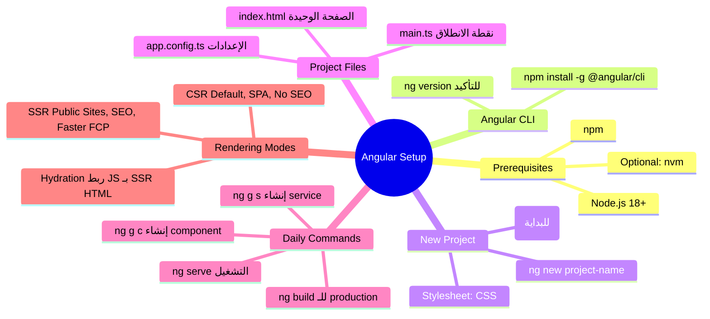

# الفصل 1.5 — مرحباً بك في Angular: الإعداد والانطلاق

> **المتطلبات:** [[01-TypeScript-For-Angular]] — لازم تعرف الـ TypeScript الأساسي. الفصل ده هو جسر الانطقال من TypeScript لأول Angular app حقيقي.

---

## البداية — قبل ما تكتب سطر Angular واحد

تخيّل معايا إنك عامل مطبخ من الصفر. قبل ما تطبخ، محتاج حاجات:
- **غاز** — Node.js (بيشغّل JavaScript خارج الـ browser)
- **أدوات الطبخ** — Angular CLI (بتعمل وبتشغّل المشاريع)
- **المطبخ نفسه** — المشروع اللي بتشتغل فيه

لو حاولت تطبخ من غير غاز — مش هينفع. نفس الكلام لو حاولت تشتغل Angular من غير Node.js.

---

## [[01-Node-and-NPM]] — الأساس اللي فوقيه كل حاجة

**Node.js** مش framework. هو **runtime** — بيخليك تشغّل JavaScript على جهازك بره الـ browser. Angular CLI نفسها بتشتغل بيه.

**NPM** (Node Package Manager) هو المتجر اللي منه بتجيب أي library أو tool. بييجي تلقائياً مع Node.

### تحقق إن Node عندك موجود:

```bash
node --version
# v20.11.0  ← أي version 18+ بتشتغل مع Angular 17+

npm --version
# 10.2.4
```

لو مش موجود — [حمّله من nodejs.org](https://nodejs.org) واختار الـ LTS version.

> **نصيحة الخبراء:** استخدم [nvm](https://github.com/nvm-sh/nvm) (Node Version Manager) — بيخليك تبدّل بين versions مختلفة من Node لو اشتغلت على projects مختلفة. مش إلزامي دلوقتي، بس هتحتاجه بكره.

---

## [[02-Angular-CLI]] — السكين السويسري بتاع Angular

الـ **Angular CLI** (Command Line Interface) هي الأداة الرسمية بتاعة Angular. بدلاً من إنك تعمل كل حاجة يدوياً — تنشئ الملفات، تحط الـ boilerplate، تضبط الـ config — الـ CLI بتعمل ده كله بأمر واحد.

### تنصيب الـ CLI:

```bash
npm install -g @angular/cli
# -g = global installation — متاحة من أي مجلد على جهازك
```

### تأكيد التنصيب:

```bash
ng version
# Angular CLI: 17.x.x
# Node: 20.x.x
# ...
```

> الـ `ng` هو اختصار Angular. كل أوامر الـ CLI بتبدأ بيه.

---

## [[03-Creating-Your-First-Project]] — اتفضل، ابني

```bash
ng new freelance-flow
```

الأمر ده هيسألك سؤالين:

```
? Which stylesheet format would you like to use?
  CSS          ← اختار دي في البداية — أبسط
  SCSS/SASS
  Less

? Do you want to enable Server-Side Rendering (SSR) and Static Site Generation (SSG/Prerendering)?
  No           ← اختار No دلوقتي — هنشرحه بعدين
  Yes
```

بعد إنك تختار، الـ CLI هتعمل:

```
CREATE freelance-flow/
├── src/
│   ├── app/
│   │   ├── app.component.ts       ← الـ Root Component
│   │   ├── app.component.html
│   │   ├── app.component.css
│   │   └── app.config.ts          ← إعدادات التطبيق (routing, HTTP, etc.)
│   ├── index.html                 ← الصفحة الوحيدة في التطبيق
│   └── main.ts                    ← نقطة البداية — أول سطر بيتنفذ
├── angular.json                   ← إعدادات الـ build
├── package.json                   ← الـ dependencies
└── tsconfig.json                  ← إعدادات TypeScript
```

---

## [[04-Project-Structure]] — كل ملف بيعمل إيه؟

### `main.ts` — نقطة الانطلاق

```typescript
import { bootstrapApplication } from '@angular/platform-browser';
import { appConfig } from './app/app.config';
import { AppComponent } from './app/app.component';

bootstrapApplication(AppComponent, appConfig)
  .catch((err) => console.error(err));
```

ده أول سطر بيتنفذ لما التطبيق يشتغل. بيقول لـ Angular: "خد الـ `AppComponent` ده، اشحنه بالـ config ده، وابدأ."

---

### `index.html` — الصفحة الوحيدة في التطبيق

```html
<!doctype html>
<html lang="en">
<head>
  <title>FreelanceFlow</title>
</head>
<body>
  <app-root></app-root>
  <!--    ↑
    ده مش HTML tag حقيقي!
    Angular بتشوف الـ selector بتاع AppComponent
    وبتحط محتواه هنا تلقائياً.
  -->
</body>
</html>
```

لاحظ: **ملف HTML واحد بس** في المشروع كله. كل الـ pages اللي بتشوفها في الـ browser هي فعلاً components بتتحط جوا الـ `<app-root>` ده. ده اللي بيخليها تُسمّى **Single Page Application (SPA)**.

---

### `app.config.ts` — العصب التحكمي

```typescript
import { ApplicationConfig } from '@angular/core';
import { provideRouter } from '@angular/router';
import { provideHttpClient } from '@angular/common/http';
import { routes } from './app.routes';

export const appConfig: ApplicationConfig = {
  providers: [
    provideRouter(routes),      // تفعيل الـ Routing
    provideHttpClient(),         // تفعيل الـ HTTP calls
  ]
};
```

ده مكان الـ "إعدادات التطبيق" — كل service أو feature مركزية بتضيفها هنا.

---

## [[05-Essential-CLI-Commands]] — الأوامر اللي هتستخدمها يومياً

### تشغيل التطبيق محلياً

```bash
ng serve
# بعد ثواني:
# ✔ Compiled successfully.
# Local: http://localhost:4200/
```

افتح المتصفح على `http://localhost:4200` وهتشوف تطبيقك. الجميل إن الـ page بتتحدّث **تلقائياً** كل ما تحفظ ملف — ده اللي بيتسمى **Hot Module Replacement**.

```bash
ng serve --open
# نفس الأمر بس بيفتح المتصفح تلقائياً
```

---

### إنشاء Component جديد

```bash
ng generate component pages/projects
# اختصار:
ng g c pages/projects
```

هينشئ:

```
src/app/pages/projects/
├── projects.component.ts
├── projects.component.html
└── projects.component.css
```

---

### إنشاء Service جديد

```bash
ng generate service services/projects
# اختصار:
ng g s services/projects
```

---

### إنشاء حاجات تانية دفعة واحدة

```bash
# Guard
ng g guard guards/auth

# Pipe
ng g pipe pipes/currency-format

# Directive
ng g directive directives/highlight

# Interface
ng g interface models/project
```

---

### بناء التطبيق للـ Production

```bash
ng build
# النتيجة في: dist/freelance-flow/
# ملفات مضغوطة جاهزة للـ deployment على أي server
```

---

## [[06-CSR-vs-SSR]] — الفرق بين CSR وSSR

ده من أهم الأسئلة في أي إنترفيو Angular. خليني أشرحهملك بمثال حقيقي.

---

### المشهد — إيه اللي بيحصل لما المستخدم يفتح موقعك؟

```
المستخدم يكتب: www.freelanceflow.com
        ↓
متصفحه بيبعت request للـ Server
        ↓
السيرفر بيرد بـ... إيه بالظبط؟
```

الإجابة بتعتمد على النهج اللي اخترته.

---

### CSR — Client-Side Rendering

```
Server → يرجع ملف HTML فاضي تقريباً + JavaScript bundle ضخم
Browser → يحمّل الـ JavaScript
Browser → ينفّذ الـ JavaScript
Browser → يبني الـ DOM ويعرض المحتوى
```

**الـ HTML اللي بيجي من السيرفر:**

```html
<!doctype html>
<html>
<body>
  <app-root></app-root>
  <!-- فاضي تماماً! المحتوى هييجي بعدين من JavaScript -->
  <script src="main.abc123.js"></script>
</body>
</html>
```

```
المستخدم بيشوف شاشة بيضا أو loading spinner
حتى الـ JavaScript تتحمّل وتشتغل
```

| | CSR |
|---|---|
| أول render | بطيء (browser لازم يحمّل JS كله أول) |
| بعد أول render | سريع جداً (كل navigate داخلي مش بيروح للسيرفر) |
| SEO | ضعيف (الـ search engines بتشوف HTML فاضي) |
| الـ Server Load | خفيف (بس بيرجع ملفات static) |
| مناسب لـ | Admin dashboards، Apps وراء login |

**Angular بـ CSR = الوضع الافتراضي.** لما تختار `No` لـ SSR عند `ng new`.

---

### SSR — Server-Side Rendering

```
Browser → يبعت request
Server  → ينفّذ Angular كود على السيرفر نفسه
Server  → يرجع HTML كامل ومكتمل فيه المحتوى
Browser → يعرض المحتوى فوراً (مش محتاج ينفّذ JS الأول)
Browser → بعدين بيحمّل الـ JS ويعمل "hydration" (يضيف التفاعلية)
```

**الـ HTML اللي بيجي من السيرفر:**

```html
<!doctype html>
<html>
<body>
  <app-root>
    <!-- محتوى حقيقي موجود! -->
    <nav>FreelanceFlow</nav>
    <main>
      <h1>Find the best freelancers</h1>
      <div class="projects-grid">
        <div class="project-card">...</div>
        <!-- ... المحتوى كله موجود -->
      </div>
    </main>
  </app-root>
</body>
</html>
```

| | SSR |
|---|---|
| أول render | سريع جداً (المحتوى جاهز من السيرفر) |
| SEO | ممتاز (الـ search engines بتشوف محتوى حقيقي) |
| الـ Server Load | أثقل (السيرفر بيعمل شغل أكتر) |
| التعقيد | أعلى (محتاج تراعي إن الكود بيشتغل في environments اتنين) |
| مناسب لـ | مواقع عامة، محلات أونلاين، مدونات، أي حاجة محتاجة SEO |

**تفعيل SSR في مشروع جديد:**

```bash
ng new freelance-flow
# اختار Yes لسؤال SSR
```

**أو إضافته لمشروع موجود:**

```bash
ng add @angular/ssr
```

---

### المقارنة الكاملة

```
                    CSR                        SSR
                ┌──────────┐              ┌──────────┐
Request    →    │  Server  │              │  Server  │
                │          │              │ Angular  │
                │ returns  │              │ runs &   │
                │ empty    │              │ returns  │
                │  HTML +  │              │ FULL HTML│
                │  big JS  │              │          │
                └────┬─────┘              └────┬─────┘
                     ↓                         ↓
Browser      loads JS (slow)          shows content (fast)
                     ↓                         ↓
User sees    blank screen first       content immediately
                     ↓                         ↓
Then         JS runs, content shows   JS loads, adds interactions
```

---

### الـ Hydration — الكلمة اللي بتيجي في كل إنترفيو SSR

بعد ما السيرفر بيبعت الـ HTML المكتمل، الـ browser بيحمّل الـ JavaScript. في اللحظة دي Angular بتعمل عملية اسمها **Hydration** — بتربط الـ JavaScript logic بالـ HTML الموجود بالفعل من غير ما تمسحه وتعيد رسمه. زي إنك بتنفخ الحياة في جسم موجود.

```typescript
// app.config.ts — تفعيل Hydration
import { provideClientHydration } from '@angular/platform-browser';

export const appConfig: ApplicationConfig = {
  providers: [
    provideRouter(routes),
    provideHttpClient(),
    provideClientHydration(), // ← ده اللي بيعمل الـ hydration
  ]
};
```

---

## [[07-What-Happens-When-You-Run-ng-serve]] — رحلة الكود من مجلدك للـ Browser

```
تكتب: ng serve
         ↓
Angular CLI تقرأ angular.json وtsconfig.json
         ↓
المترجم (esbuild) يحوّل TypeScript → JavaScript
         ↓
يجمع كل الملفات في bundles
         ↓
يشغّل dev server محلي على port 4200
         ↓
تفتح المتصفح → المتصفح يطلب الـ index.html
         ↓
index.html يطلب main.js
         ↓
main.ts يشغّل bootstrapApplication(AppComponent)
         ↓
Angular تبحث عن <app-root> في الـ HTML
         ↓
تحط محتوى AppComponent مكانه
         ↓
التطبيق شغّال ✅
```

---

## 🗺️ خريطة الإعداد كاملة



---

## ✅ Checkpoint — أسئلة إنترفيو الإعداد

**س: إيه الفرق بين `ng serve` و `ng build`؟**
> `ng serve` بيشغّل dev server محلي مع hot-reload للتطوير، والكود مش مضغوط. `ng build` بيبني الـ production bundle — مضغوط ومحسّن، جاهز لـ deployment على server حقيقي.

**س: إيه معنى SPA وعلاقتها بـ Angular؟**
> SPA = Single Page Application. ملف HTML واحد بيتحمّل مرة واحدة، وكل الـ navigation بعدها بيحصل من خلال JavaScript من غير ما الـ page تعمل reload كاملة. Angular هي SPA framework — بتعمل `<app-root>` في ملف HTML واحد وبتحط فيه كل الـ components.

**س: إيه أول حاجة بتحصل لما الـ Angular app تشتغل؟**
> `main.ts` بيتنفّذ أول حاجة — بيستدعي `bootstrapApplication(AppComponent, appConfig)`، Angular بتشوف الـ `selector` بتاع `AppComponent` (عادةً `app-root`)، بتلاقيه في `index.html`، وبتحط محتوى الـ component مكانه.

**س: إيه الفرق بين CSR وSSR وامتى تختار كل واحدة؟**
> في CSR، السيرفر بيبعت HTML فاضي والـ browser هو اللي بيبني المحتوى عن طريق JavaScript — مناسب لـ admin panels ومواقع وراء login لأن الـ SEO مش مهم. في SSR، السيرفر نفسه بيشغّل Angular ويبعت HTML مكتمل — مناسب للمواقع العامة والمتاجر الإلكترونية لأنها محتاجة SEO وأول ظهور سريع للمحتوى.

**س: إيه الـ Hydration؟**
> بعد ما SSR يبعت الـ HTML الكامل، الـ browser يحمّل الـ JavaScript. الـ Hydration هي العملية اللي Angular بيربط فيها الـ JavaScript events والـ logic بالـ HTML الموجود بالفعل — من غير ما يمسحه ويعيد رسمه من الأول.

---

## 🛠️ Practical Exercise — أول App ليك

### Task 1 — الإعداد من الصفر

```bash
# 1. تأكد من Node
node --version   # لازم 18+

# 2. نصّب الـ CLI
npm install -g @angular/cli

# 3. أنشئ مشروعك
ng new freelance-flow
# CSS ✓ | SSR: No ✓

# 4. شغّله
cd freelance-flow
ng serve --open
```

لو شفت صفحة Angular الافتراضية — مبروك، المطبخ جاهز. 🎉

---

### Task 2 — اعمل أول Component

```bash
ng generate component pages/home
ng generate component components/navbar
```

بعدين افتح `app.component.html`، احذف كل محتواه، وحط:

```html
<app-navbar></app-navbar>
<router-outlet></router-outlet>
```

شوف إيه اللي بيحصل في المتصفح. جرب تغيّر حاجة في `navbar.component.html` وشوف الـ hot-reload.

---

### Task 3 — اعرف البنية كويس

افتح كل ملف من دول وجاوب على السؤال جنبه:

| الملف | السؤال |
|---|---|
| `main.ts` | أيه أول function بتتنفذ؟ |
| `app.config.ts` | أيه الـ providers المفعّلة؟ |
| `index.html` | فين الـ `<app-root>`؟ |
| `app.component.ts` | أيه الـ selector؟ |
| `angular.json` | أيه الـ `outputPath` بتاع الـ build؟ |

---

## 🫒 زتونة الإنترفيو

> **"Angular is a platform, not just a library. You install it once via the CLI, and from that moment — `ng new`, `ng serve`, `ng generate` — the CLI handles all the scaffolding. The app bootstraps from `main.ts`, mounts into a single `index.html`, and runs either as CSR (browser builds the page from JavaScript) or SSR (server renders full HTML and the browser just hydrates it). Choose CSR for dashboards behind login, SSR for anything that needs SEO."**

---

*Next → [[02-Angular-Architecture]] — المشروع شغّال. دلوقتي إزاي Angular تفهم الكود بتاعك وتقسّمه لـ Components وـ Modules وـ Services؟*
