# 🕰️ The Time Machine Proxy — Sprint 1: الأساس
> بنبني من الصفر الحقيقي. مش بس كود — بنفهم **ليه** كل سطر موجود، و**إيه الكارثة** اللي هتحصل لو مش موجود.

---

# 📌 فهرس Sprint 1

1. [إيه ده الـ Proxy ده أصلاً؟](#1-إيه-ده-الـ-proxy-ده-أصلاً)
2. [الـ Forward Proxy vs الـ Reverse Proxy](#2-الـ-forward-proxy-vs-الـ-reverse-proxy)
3. [ليه بنبني الـ project ده؟ — القصة الكاملة](#3-ليه-بنبني-الـ-project-ده-القصة-الكاملة)
4. [بنيّة المشروع وإعداد البيئة](#4-بنيّة-المشروع-وإعداد-البيئة)
5. [Phase 1 — بنبني Reverse Proxy بسيطة في Node.js](#5-phase-1-بنبني-reverse-proxy-بسيطة-في-nodejs)
6. [Phase 2 — Traffic Shadowing: الفكرة المحورية](#6-phase-2-traffic-shadowing-الفكرة-المحورية)
7. [🔴 الكارثة — ليه ده هيموّت الـ Event Loop؟](#7-الكارثة-ليه-ده-هيموّت-الـ-event-loop)
8. [Deep Dive: الـ Event Loop من الجوف](#8-deep-dive-الـ-event-loop-من-الجوف)
9. [محاولة الإنقاذ — هل Worker Threads بتحل المشكلة؟](#9-محاولة-الإنقاذ-هل-worker-threads-بتحل-المشكلة)
10. [الحل الحقيقي — ليه C++ هي الجواب؟](#10-الحل-الحقيقي-ليه-c-هي-الجواب)
11. [✅ Sprint 1 Checkpoint الشامل](#11-sprint-1-checkpoint-الشامل)
12. [ملخص Sprint 1 وخريطة الطريق](#12-ملخص-sprint-1-وخريطة-الطريق)

---

# 1. إيه ده الـ Proxy ده أصلاً؟

## قبل ما نكتب سطر واحد كود — لازم نفهم الكلمة نفسها

كلمة **Proxy** في الإنجليزي معناها "الوكيل". زي في القانون — لو مش قادر تحضر اجتماع، بتبعت "وكيل" يمثّلك. الوكيل ده بيتكلم بإسمك، بيستقبل القرارات ويوصّلهالك.

في عالم الشبكات، الـ Proxy هو **برنامج وسيط** — بيقف بين حاجتين بيوصّل الكلام بينهم.


الـ Proxy ممكن يعمل أي حاجة وهو واقف في النص ده:
- يعدّل الـ request قبل ما يبعتها
- يرفض requests معينة (Firewall)
- يحفظ الـ responses عشان ميبعتش للـ server تاني (Cache)
- يوزّع الـ requests على servers كتير (Load Balancer)
- **ينسخ الـ requests ويبعتها لمكان تاني** — وده بالظبط اللي هنعمله!

---

# 2. الـ Forward Proxy vs الـ Reverse Proxy

في نوعين أساسيين، والفرق بينهم مهم جداً.

## الـ Forward Proxy — "الوكيل بتاع الـ Client"


> **الفكرة:** الـ client هو اللي عنده الـ Proxy. الـ servers في الإنترنت مش شايفين إنت — شايفين الـ Proxy بس.

**أمثلة عملية:**
- في الشركات: IT بيحط Forward Proxy عشان يمنع الموظفين من دخول مواقع معينة
- الـ VPN: ده في الأساس Forward Proxy — بيخلي الـ internet يشوف IP مختلف
- Tor Browser

## الـ Reverse Proxy — "الوكيل بتاع الـ Server"

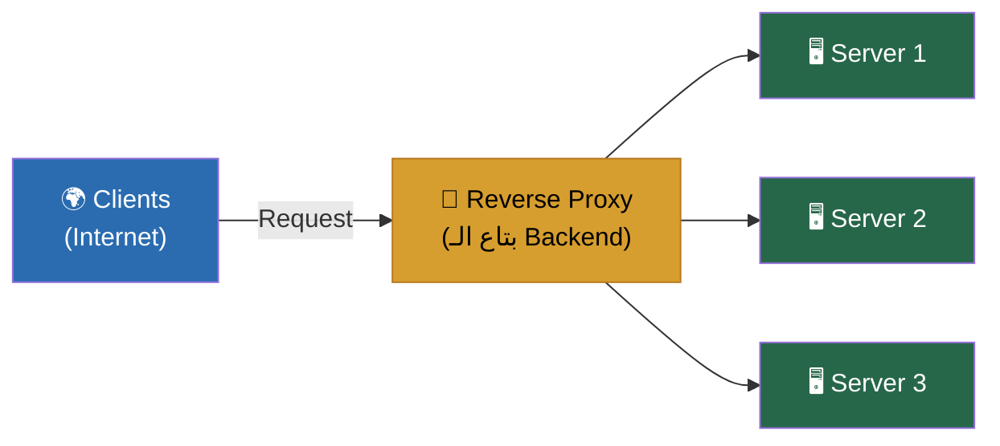

> **الفكرة:** الـ server هو اللي عنده الـ Proxy. الـ clients في الإنترنت مش شايفين الـ backend servers — شايفين الـ Proxy بس.

**أمثلة عملية:**
- **Nginx** و **Apache**: في معظم architectures، بيشتغلوا كـ Reverse Proxy قدام Node.js أو Python
- **AWS ALB (Application Load Balancer)**: Reverse Proxy managed service
- **Cloudflare**: بيشتغل كـ Reverse Proxy لملايين المواقع

> [!INFO]
> **النقطة الجوهرية:** في مشروعنا "The Time Machine Proxy"، إحنا بنبني **Reverse Proxy** — يعني بنقف قدام الـ backend server بتاعنا، بنستقبل الـ requests من الـ clients، وفي نفس الوقت بنعمل نسخة منها ونبعتها لمكان تاني (الـ Shadow Target).

---

# 3. ليه بنبني الـ project ده؟ — القصة الكاملة

## المشكلة الحقيقية اللي بيواجهها كل شركة تكنولوجيا

تخيل إنك Tech Lead في شركة وعندك API بيستقبل **50,000 request في الثانية** في الـ production. إدارة قررت إنك تعمل "Version 2" من الـ API — معمارية جديدة، أسرع، أحسن.

**السؤال الصعب:** إزاي تعرف إن الـ Version 2 صح قبل ما تحوّل الـ users الحقيقيين عليها؟

الـ options اللي بتيجي في دماغك:

| Option | المشكلة |
|--------|---------|
| اعمل unit tests | الـ tests مش بتحاكي الـ production traffic الحقيقي |
| اعمل load testing بأدوات زي k6 أو JMeter | الـ fake traffic مش بيعكس سلوك الـ users الحقيقيين |
| حوّل % صغير من الـ users على الـ v2 (A/B Testing) | لو v2 فيها bug، users حقيقيين هيتأثروا |
| استنّى وادعي ربنا | 😂 No comment |

**الحل الأذكى في الـ industry — Traffic Shadowing:**

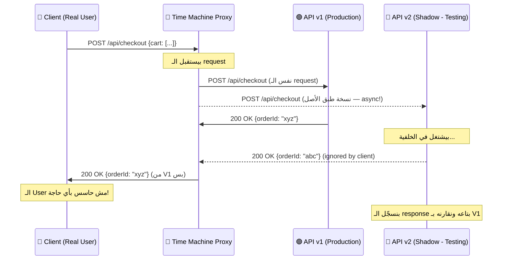

**الزتونة:** الـ client بيستقبل response من الـ v1 القديمة — مش بيتأثر بأي شيء. وإحنا في الخلفية بنشوف الـ v2 بتتصرف صح ولا لأ على traffic حقيقي.

ده بالظبط اللي شركات زي **GitHub** عملته لما حوّلوا من Ruby on Rails لـ architecture جديدة، وزي **Amazon** لما بيعملوا dark launches لـ features جديدة.

---

# 4. بنيّة المشروع وإعداد البيئة

## الصورة الكاملة اللي هنبنيها في الـ 4 Sprints

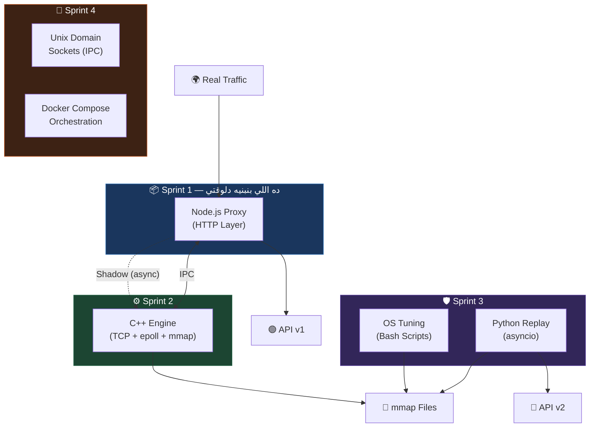

## هيكل المجلدات

```
time-machine-proxy/
│
├── 📁 node-proxy/          ← Sprint 1 (ده بتاعنا دلوقتي)
│   ├── src/
│   │   ├── proxy.js         ← الـ Main Proxy Logic
│   │   ├── shadow.js        ← الـ Traffic Shadowing
│   │   └── logger.js        ← الـ Request Logger
│   ├── test/
│   │   └── target-server.js ← سيرفر وهمي للـ Testing
│   ├── .env
│   └── package.json
│
├── 📁 cpp-engine/          ← Sprint 2
├── 📁 bash-scripts/        ← Sprint 3
├── 📁 python-replay/       ← Sprint 3
└── docker-compose.yml      ← Sprint 4
```

## إعداد البيئة

```bash
# إنشاء المجلدات
mkdir -p time-machine-proxy/node-proxy/src
mkdir -p time-machine-proxy/node-proxy/test
cd time-machine-proxy/node-proxy

# إنشاء الـ package.json
npm init -y

# تثبيت الـ dependencies
npm install express http-proxy-middleware axios
npm install --save-dev nodemon
```

### إيه كل package بيعمل؟

| Package | الدور |
|---------|-------|
| `express` | بيشغّل الـ HTTP server بتاعنا |
| `http-proxy-middleware` | library جاهزة للـ proxying — هنستخدمها أول، وبعدين هنفهم إيه اللي بتعمله من الجوف |
| `axios` | بنبعت بيه الـ shadow requests |

### الـ `.env` file

```bash
# node-proxy/.env
PORT=3000
TARGET_URL=http://localhost:4000
SHADOW_URL=http://localhost:4001
NODE_ENV=development
```

---

# 5. Phase 1 — بنبني Reverse Proxy بسيطة في Node.js

## الأول — نعمل سيرفر وهمي عشان نتست عليه

قبل ما نبني الـ Proxy، محتاجين "ضحية" نبعت ليها الـ requests.

### `test/target-server.js`

```javascript
// ده السيرفر الأصلي — نفترض إنه الـ Production API بتاعنا
const express = require('express');
const app = express();
app.use(express.json());

const PORT = process.env.PORT || 4000;
const SERVER_NAME = process.env.SERVER_NAME || 'Original v1';

// بنسجّل كل request بتيجي
app.use((req, res, next) => {
  const timestamp = new Date().toISOString();
  console.log(`[${SERVER_NAME}] ${timestamp} | ${req.method} ${req.path}`);
  next();
});

app.get('/api/health', (req, res) => {
  res.json({
    status: 'ok',
    server: SERVER_NAME,
    timestamp: new Date().toISOString(),
  });
});

app.post('/api/data', (req, res) => {
  // بنأخّر الرد عمداً — عشان نحاكي سيرفر حقيقي بيعمل DB query
  setTimeout(() => {
    res.json({
      server: SERVER_NAME,
      received: req.body,
      processed_at: new Date().toISOString(),
    });
  }, 50); // 50ms delay
});

app.listen(PORT, () => {
  console.log(`[${SERVER_NAME}] Running on port ${PORT}`);
});
```

شغّل سيرفرين في تيرمينالين مختلفين:

```bash
# التيرمينال الأول — الـ Original (v1)
PORT=4000 SERVER_NAME="Original v1" node test/target-server.js

# التيرمينال التاني — الـ Shadow (v2) — نفس الكود بس اسم مختلف
PORT=4001 SERVER_NAME="Shadow v2" node test/target-server.js
```

---

## الـ Naive Approach — أبسط Proxy ممكنة

### `src/proxy.js` — النسخة الأولى (البسيطة)

```javascript
require('dotenv').config();
const express = require('express');
const { createProxyMiddleware } = require('http-proxy-middleware');

const app = express();
const PORT = process.env.PORT || 3000;
const TARGET_URL = process.env.TARGET_URL || 'http://localhost:4000';

// ====================================================
// الـ Magic في سطر واحد — createProxyMiddleware
// ====================================================
// كل request بتيجي على الـ Proxy هتتبعت تلقائياً
// للـ TARGET_URL
app.use(
  '/',
  createProxyMiddleware({
    target: TARGET_URL,
    changeOrigin: true, // بيغيّر الـ Host header عشان الـ target ميترفضش الـ request
    on: {
      proxyReq: (proxyReq, req, res) => {
        // ده بيتشغّل قبل ما الـ request تتبعت للـ target
        console.log(`[PROXY] Forwarding: ${req.method} ${req.url} → ${TARGET_URL}`);
      },
      proxyRes: (proxyRes, req, res) => {
        // ده بيتشغّل لما الـ response ترجع من الـ target
        console.log(`[PROXY] Response: ${proxyRes.statusCode} for ${req.url}`);
      },
      error: (err, req, res) => {
        console.error(`[PROXY] Error: ${err.message}`);
        res.status(502).json({ error: 'Bad Gateway', message: err.message });
      },
    },
  })
);

app.listen(PORT, () => {
  console.log(`[PROXY] Running on port ${PORT}`);
  console.log(`[PROXY] Forwarding to: ${TARGET_URL}`);
});
```

### شغّل الـ Proxy

```bash
# في تيرمينال تالت
node src/proxy.js
```

### تست بسيط

```bash
# بدل ما تكلّم السيرفر مباشرة على port 4000
# كلّم الـ Proxy على port 3000
curl http://localhost:3000/api/health
```

هتلاقي إن الرد جاي من الـ Original v1 تماماً — بس ده مرّ بالـ Proxy أولاً!

---

> [!INFO]
> **إيه اللي بيحصل فعلاً جوّا `createProxyMiddleware`؟**
>
> الـ library دي عملت الآتي بدالك:
> 1. استقبلت الـ HTTP request الجاي من الـ client
> 2. فتحت **TCP connection جديد** للـ target server
> 3. **نسخت** الـ request headers والـ body عليه
> 4. استنّت الـ response من الـ target
> 5. **نسخت** الـ response headers والـ body لل client الأصلي
> 6. أقفلت الـ connection
>
> ده اللي بيسموه **HTTP Tunneling** — بيوصّل pipe بين connection وتاني.
> النقطة المهمة: كل ده HTTP — يعني فوق TCP. في Sprint 2 هنتعلم إزاي ننزل مستوى وندور في TCP نفسه.

---

## ✅ Checkpoint 1 — الـ Basic Proxy شغّالة

```bash
# تست 1: الـ GET request
curl http://localhost:3000/api/health
# المفروض يجيلك نفس response الـ target server بالظبط

# تست 2: الـ POST request
curl -X POST http://localhost:3000/api/data \
  -H "Content-Type: application/json" \
  -d '{"user": "ahmed", "action": "purchase", "item": "laptop"}'
# المفروض يجيلك response من "Original v1"

# تست 3: شوف الـ logs في التيرمينالات التلاتة
# - التيرمينال بتاع الـ Proxy: هيطبع "Forwarding" و"Response"
# - التيرمينال بتاع الـ Original: هيطبع إن request وصلتله
# - التيرمينال بتاع الـ Shadow: مش هيطبع حاجة (لسه مش متوصّل)
```

**لو كل ده شغّال — الـ Phase 1 خلصت. جاي الجزء الممتع! 🎯**

---

# 6. Phase 2 — Traffic Shadowing: الفكرة المحورية

## الفكرة قبل الكود

دلوقتي عندنا Proxy بتبعت كل request للـ Original server. اللي عايزينه دلوقتي:

1. **نبعت** الـ request للـ Original زي ما هي (عشان الـ user ياخد رده)
2. **في نفس الوقت** — نعمل نسخة من الـ request ونبعتها للـ Shadow server
3. **مهم جداً:** الـ response بتاعة الـ Shadow مش بتوصل للـ user — إحنا بنسجّلها بس للـ analysis

```mermaid
sequenceDiagram
    participant C as 👤 Client
    participant P as 🔀 Proxy (Node.js)
    participant O as 🟢 Original v1 (:4000)
    participant S as 🔵 Shadow v2 (:4001)

    C->>P: POST /api/data {payload}
    
    rect rgb(26, 54, 93)
        Note over P: بيقرأ الـ request body
        P->>O: POST /api/data {payload} (Sync — بنستنى الرد)
        P-->>S: POST /api/data {payload} (Async — fire & forget)
    end
    
    O->>P: 200 OK {result}
    Note over S: بيشتغل في الخلفية...
    P->>C: 200 OK {result} ← من الـ Original بس
    
    S-->>P: 200 OK {shadow_result} (بنسجّله بس — مش بيروح للـ client)
```

## المشكلة الأولى — إزاي نقرأ الـ Request Body مرتين؟

في HTTP، الـ request body زي الـ stream — بتقرأه مرة واحدة بس. لو `http-proxy-middleware` قرأته عشان يبعته للـ Original، مش هتقدر تقرأه تاني عشان تبعته للـ Shadow.

دي مشكلة حقيقية واللي بيسموها **"Body Consumption Problem"**.

### الحل — نقرأ الـ Body ونحفظه قبل الـ Proxy

```javascript
// src/shadow.js
const axios = require('axios');

/**
 * بيبعت نسخة من الـ request للـ shadow server بشكل async
 * مش بيستنى الرد — fire & forget
 * @param {string} shadowUrl - الـ URL بتاع الـ Shadow Server
 * @param {object} req - الـ Express request object
 * @param {Buffer} body - الـ Request body اللي اتحفظ قبل كده
 */
function shadowRequest(shadowUrl, req, body) {
  const targetUrl = `${shadowUrl}${req.url}`;
  
  // بنبني الـ headers من الـ original request
  // بس بنحذف حاجات زي content-length لأنها ممكن تتغير
  const headers = { ...req.headers };
  delete headers['host']; // مهم! عشان axios يحط الـ host الصح
  
  // ده الـ Fire & Forget — مش بنستنى النتيجة
  axios({
    method: req.method,
    url: targetUrl,
    headers: headers,
    data: body,
    // timeout قصير — مش عايزين الـ shadow يعطّلنا
    timeout: 5000,
    // بنقول لـ axios متـ throw error لو الـ status مش 2xx
    validateStatus: () => true,
  })
    .then((response) => {
      // هنا بنسجّل الـ shadow response للـ analysis
      // في production، هنبعت ده لـ database أو logging system
      console.log(
        `[SHADOW] ${req.method} ${req.url} → Status: ${response.status} | ` +
        `Body: ${JSON.stringify(response.data).substring(0, 100)}...`
      );
    })
    .catch((err) => {
      // لو الـ shadow server واقع — مش مشكلة، الـ original شغّال
      console.error(`[SHADOW] Failed: ${err.message}`);
    });
  
  // بنرجع فوراً — مش بنستنى الـ shadow request
  // ده اللي بيخلي الـ client ميتأخرش
}

module.exports = { shadowRequest };
```

### `src/proxy.js` — النسخة الثانية (مع Shadow)

```javascript
require('dotenv').config();
const express = require('express');
const { createProxyMiddleware, fixRequestBody } = require('http-proxy-middleware');
const { shadowRequest } = require('./shadow');

const app = express();
const PORT = process.env.PORT || 3000;
const TARGET_URL = process.env.TARGET_URL || 'http://localhost:4000';
const SHADOW_URL = process.env.SHADOW_URL || 'http://localhost:4001';

// =====================================================
// الحل لمشكلة "Body Consumption"
// =====================================================
// express.raw() بيقرأ الـ body ويحفظه كـ Buffer في req.body
// بدل ما تقرأه مرة وتخسره، هنقرأه مرة وندّيه لكل واحد
app.use(express.raw({ type: '*/*', limit: '10mb' }));

// Middleware بيسجّل كل request ويبعت shadow
app.use((req, res, next) => {
  const startTime = Date.now();
  
  // الـ body اتحفظ كـ Buffer في req.body من express.raw
  const body = req.body;
  
  // ====================================================
  // هنا بيبدأ الـ Magic — الـ Shadowing
  // ====================================================
  // بنبعت نسخة للـ Shadow بدون استنّاء (Async)
  // الـ client مش هيحس بأي تأخير بسبب الـ shadow
  shadowRequest(SHADOW_URL, req, body);
  
  // بنكمل الـ request للـ Original server
  next();
});

// الـ Proxy للـ Original Server
app.use(
  '/',
  createProxyMiddleware({
    target: TARGET_URL,
    changeOrigin: true,
    // ده مهم جداً! بعد ما express.raw قرأ الـ body
    // لازم نرجعه تاني للـ proxy عشان يبعته للـ target
    on: {
      proxyReq: (proxyReq, req, res) => {
        // لو في body، نكتبه في الـ proxy request
        if (req.body && req.body.length > 0) {
          proxyReq.write(req.body);
          proxyReq.end();
        }
        
        console.log(`[PROXY] ${req.method} ${req.url} → ${TARGET_URL}`);
      },
      proxyRes: (proxyRes, req, res) => {
        const duration = Date.now() - (req.startTime || Date.now());
        console.log(`[PROXY] ✅ ${proxyRes.statusCode} ${req.url} (${duration}ms)`);
      },
      error: (err, req, res) => {
        console.error(`[PROXY] ❌ Error: ${err.message}`);
        res.status(502).json({ error: 'Bad Gateway' });
      },
    },
  })
);

app.listen(PORT, () => {
  console.log('╔════════════════════════════════════════╗');
  console.log('║    🕰️  Time Machine Proxy — Active     ║');
  console.log('╠════════════════════════════════════════╣');
  console.log(`║  Proxy:    http://localhost:${PORT}       ║`);
  console.log(`║  Target:   ${TARGET_URL}    ║`);
  console.log(`║  Shadow:   ${SHADOW_URL}    ║`);
  console.log('╚════════════════════════════════════════╝');
});
```

## ✅ Checkpoint 2 — الـ Shadow شغّالة

```bash
# ابعت request للـ Proxy
curl -X POST http://localhost:3000/api/data \
  -H "Content-Type: application/json" \
  -d '{"user": "ahmed", "action": "purchase", "amount": 500}'
```

**المفروض تشوف في الـ terminals:**

```
# Terminal 1 (Proxy):
[PROXY] POST /api/data → http://localhost:4000
[SHADOW] POST /api/data → Status: 200 | Body: {"server":"Shadow v2"...
[PROXY] ✅ 200 /api/data (52ms)

# Terminal 2 (Original v1):
[Original v1] 2024-01-15T... | POST /api/data

# Terminal 3 (Shadow v2):
[Shadow v2] 2024-01-15T... | POST /api/data
```

**الـ client بيستقبل response من v1 بس — Shadow v2 بتشتغل في الخلفية بصمت. 🎉**

---

# 7. 🔴 الكارثة — ليه ده هيموّت الـ Event Loop؟

## الوضع الحالي — يبدو كويس، بس فيه قنبلة موقوتة

الكود اللي عملناه شغّال تمام في الـ testing. بس لو وضعناه في production على **50,000 request في الثانية** — هتحصل كارثة. خليني أريك ليه.

## السيناريو: عايزين نكتب كل request على disk (Logging)

ده requirement حقيقي — لازم نحتفظ بكل request وresponse عشان:
- نقارن responses الـ v1 بالـ v2 لاحقاً
- نعمل replay لو حبينا نختبر سيناريوهات معينة
- نحلّل الـ traffic patterns

الـ naive approach — اللي معظم الناس بتعملها:

```javascript
// src/logger.js — النسخة الساذجة (الخطيرة)
const fs = require('fs');
const path = require('path');

const LOG_FILE = path.join(__dirname, '../logs/traffic.log');

function logRequest(req, body, response) {
  const logEntry = JSON.stringify({
    timestamp: new Date().toISOString(),
    method: req.method,
    url: req.url,
    headers: req.headers,
    body: body.toString(),
    response: response,
  }) + '\n';
  
  // ====================================================
  // ⚠️ الكارثة هنا — writeFileSync
  // ====================================================
  // ده BLOCKING — يعني Node.js هيوقف كل حاجة
  // ويستنى الـ OS يكتب على الـ disk
  // وهيكتب كل الـ requests التانية تستنى!
  fs.writeFileSync(LOG_FILE, logEntry, { flag: 'a' });
}
```

## إيه اللي بيحصل فعلاً لما تعمل `writeFileSync`؟

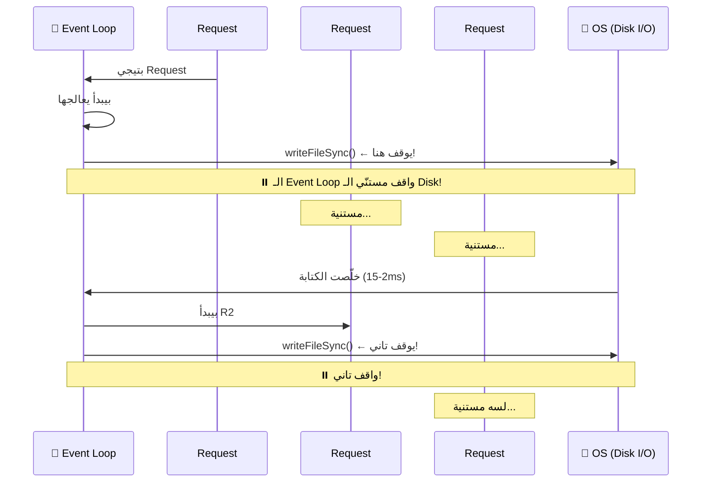

على 50,000 request/second:
- كل request بياخد 2-15ms disk write
- الـ Event Loop بيوقف 2-15ms لكل request
- في الـ second الواحدة: 50,000 × 10ms = **500,000ms وقت blocking** 🤯

يعني الـ server بيبقى متعطّل 500 ضعف الوقت الفعلي بتاعه!

---

> [!DEEP-DIVE]
> ## 🔬 إيه اللي بيحصل على مستوى الـ OS لما بتعمل Disk Write؟
>
> لما بتستدعي `fs.writeFileSync()` في Node.js، بيحصل الآتي:
>
> 1. **Node.js** بيعمل system call للـ Linux kernel اسمه `write()`
> 2. الـ **Linux Kernel** بيحول الـ data من الـ user space لـ kernel space (في buffer)
> 3. الـ Kernel بيحط الـ data في **Page Cache** (RAM بتاع الـ Kernel)
> 4. الـ Kernel بيجدول الكتابة على الـ **Physical Disk** عبر الـ I/O Scheduler
> 5. الـ Physical Disk بيكتب فعلاً (ده اللي بياخد وقت — 0.1ms SSD, 5-15ms HDD)
> 6. الـ Kernel بيرجع للـ Node.js ويقوله "خلّصت"
> 7. Node.js يكمل تنفيذ الكود
>
> في الـ `writeFileSync`، **Node.js واقف في الخطوات دي كلها**. مش بيعمل أي حاجة تانية.
>
> في المقابل، `writeFile` (بدون Sync) بيعمل الخطوات دي كلها **في background thread** من خلال الـ **libuv thread pool**، والـ Event Loop حرّ يشتغل على requests تانية.

---

## الحل — `fs.writeFile` بدل `writeFileSync`

```javascript
// src/logger.js — النسخة الأحسن (لكن لسه فيها مشكلة)
const fs = require('fs');
const path = require('path');

const LOG_FILE = path.join(__dirname, '../logs/traffic.log');

function logRequest(req, body, response) {
  const logEntry = JSON.stringify({
    timestamp: new Date().toISOString(),
    method: req.method,
    url: req.url,
    body: body.toString(),
    response: response,
  }) + '\n';
  
  // ✅ Async — الـ Event Loop مش بيوقف
  fs.writeFile(LOG_FILE, logEntry, { flag: 'a' }, (err) => {
    if (err) console.error('[LOGGER] Failed to write:', err.message);
  });
}
```

## بس لسه فيه مشكلة! — الـ libuv Thread Pool

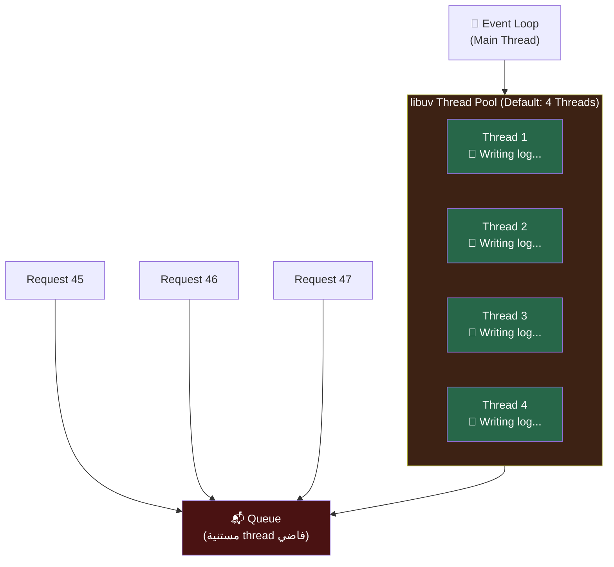

الـ `libuv` — اللي بيشتغل تحت Node.js — عنده thread pool بـ **4 threads افتراضياً** بس (ممكن تزيدها بـ `UV_THREADPOOL_SIZE`، الـ max 1024).

على 50,000 RPS:
- الـ 4 threads مشغولين طول الوقت بكتابة الـ logs
- الـ requests التانية بتتراكم في queue
- الـ queue بتكبر → **Memory يملا** → الـ process بتموت بـ OOM error

ده مش خيال — ده بيحصل في الـ production. وده بالظبط اللي هتفهمه على أعمق مستوى في Sprint 2 عندما نتعامل مع `mmap`.

---

# 8. Deep Dive: الـ Event Loop من الجوف

## الـ Event Loop مش "Magic" — هو خوارزمية محددة

كتير من الناس بتقول "Event Loop بتشغّل الكود async" — وبس. بس لازم تفهم إزاي بالظبط.

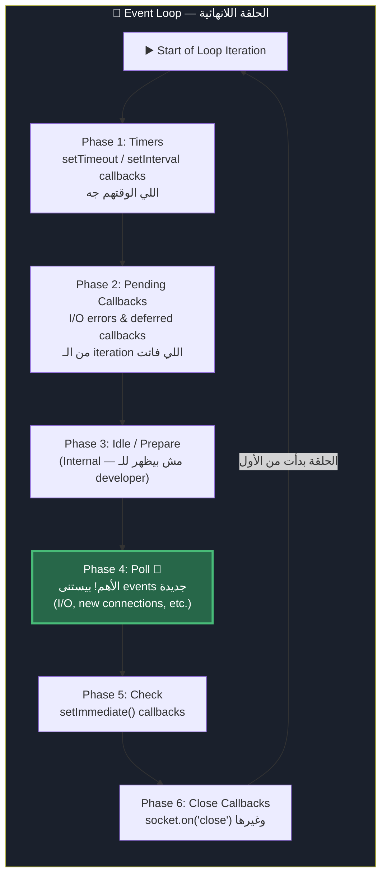

## الـ Poll Phase — قلب الـ Event Loop

الـ Poll Phase هي الأهم في التصميم بتاعنا. هي اللي:
1. بتراقب الـ OS events (connections جديدة، data وصلت على socket، إلخ)
2. بتشغّل الـ I/O callbacks اللي خلصوا
3. **بتستنى** لو مفيش حاجة تعمل

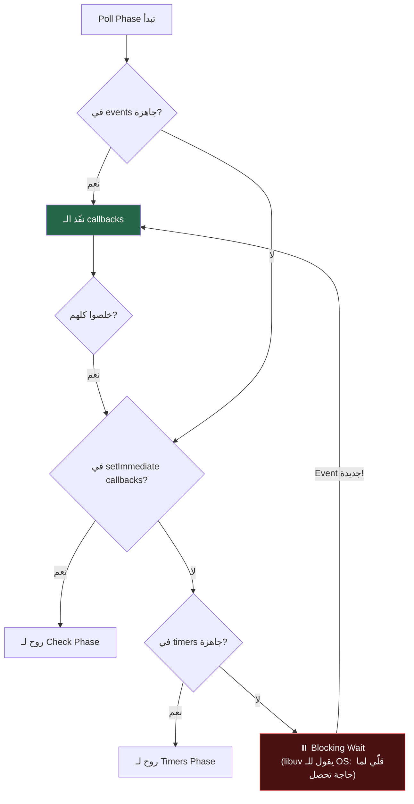

> [!DEEP-DIVE]
> ## 🔬 إيه اللي بيحصل في "Blocking Wait" على مستوى الـ OS؟
>
> لما الـ Event Loop مش عنده حاجة يعملها، بيعمل system call اسمه **`epoll_wait()`** على Linux.
>
> `epoll_wait()` بيقول للـ Linux Kernel: "بلّغني لما يحصل أي event على أي من الـ file descriptors دول."
>
> الـ Kernel بيوقف الـ thread تماماً (بـ `sched_yield()`) ومش بياكل CPU. لما event تحصل (connection جديدة، data وصلت، إلخ)، الـ Kernel بيصحّي وبيدّيه list بالـ events اللي حصلت.
>
> ده بيخلي Node.js فعّال جداً حتى وهو "مستنّي" — مش بيأكل CPU وقت الاستنّا.
>
> **ودي بالظبط هي نقطة قوة Node.js:** هو مش بيشغّل threads كتير زي Apache — هو بيستخدم `epoll` اللي هو mechanism الـ OS نفسه لإدارة events كتيرة بـ thread واحد.
>
> **وهنرجع لـ `epoll` في Sprint 2 ونبني C++ server يستخدمها مباشرة!**

---

## إيه اللي بيبلوك الـ Event Loop فعلاً؟

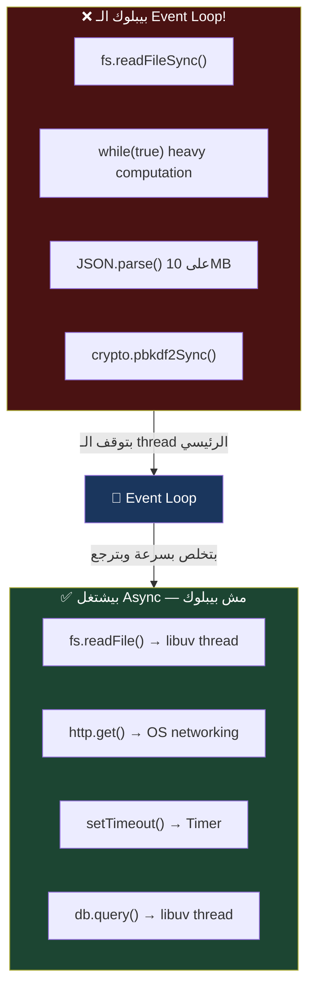

**القاعدة الذهبية:** أي حاجة بتقضي فيها وقت ملحوظ (أكتر من 1-2ms) — لازم تبعدها عن الـ Main Thread.

---

# 9. محاولة الإنقاذ — هل Worker Threads بتحل المشكلة؟

## الفكرة

Node.js 10.5+ جاب الـ `worker_threads` module. الفكرة إنك تنقل الشغل التقيل على worker thread منفصل.

```javascript
// worker.js
const { workerData, parentPort } = require('worker_threads');
const fs = require('fs');

// الـ worker بيشتغل على thread منفصل
fs.writeFileSync(workerData.file, workerData.content, { flag: 'a' });
parentPort.postMessage({ done: true });
```

```javascript
// main.js
const { Worker } = require('worker_threads');

function logRequestWithWorker(data) {
  const worker = new Worker('./worker.js', {
    workerData: {
      file: './logs/traffic.log',
      content: JSON.stringify(data) + '\n',
    },
  });
  
  worker.on('message', () => {
    // خلّص
  });
}
```

## المشكلة مع الـ Worker Threads في السيناريو ده

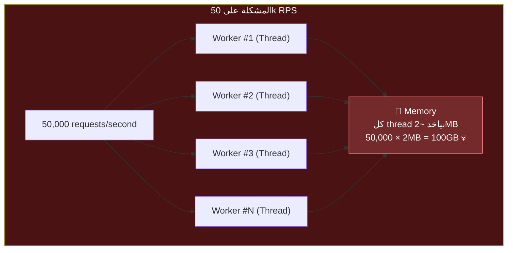

مش ممكن تعمل thread لكل request:
- كل thread بياخد ~2MB RAM → 50k threads = ~100GB RAM 💀
- الـ OS overhead لإنشاء thread كبير
- الـ context switching بين الـ threads بياكل CPU

**الـ Worker Threads كويسة لـ CPU-intensive tasks زي image processing أو encryption — مش لـ high-frequency I/O.**

---

# 10. الحل الحقيقي — ليه C++ هي الجواب؟

## المشكلة مع Node.js كـ "Edge Layer" للـ Heavy I/O

المشكلة مش في Node.js نفسه — Node.js ممتاز لـ HTTP handling وبيعمله بكفاءة. المشكلة في إن:

1. **GC (Garbage Collector):** Node.js بيشغّل V8 GC من وقت لوقت. وقت الـ GC، الـ Main Thread بيوقف "Stop-the-World" — لمئات المللي ثواني في بعض الحالات.

2. **Memory Overhead:** كل request في Node.js بيتحول لـ JavaScript objects في الـ V8 Heap. الـ objects دي بتشغل ضعف أو أكتر حجمها الحقيقي بسبب الـ JS runtime overhead.

3. **الـ libuv Thread Pool Bottleneck:** حتى لو استخدمت async I/O، أنت محدود بـ thread pool صغير.

## الحل — نقسم المسؤوليات

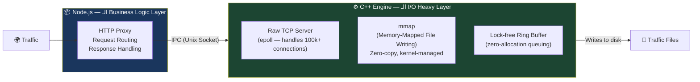

**ليه C++ تحديداً؟**

| الخاصية | Node.js | C++ |
|---------|---------|-----|
| **Memory Management** | Garbage Collected (GC pauses) | Manual (صفر pauses) |
| **OS API Access** | عبر libuv (indirect) | مباشر (direct syscalls) |
| **mmap** | مش موجود built-in | `mmap()` syscall مباشر |
| **epoll** | مخفي جوّا libuv | `epoll_create()` مباشر |
| **Lock-free Structures** | صعبة في JS | أساس الـ design |
| **Startup Cost** | ~50ms | ~1ms |

> [!INFO]
> ## هنبني ده في Sprint 2
>
> C++ مش بديل Node.js — هو **مكمّل** له. الفلسفة:
>
> - **Node.js** بيتعامل مع الـ HTTP complexity والـ business logic — لأنه سهل وسريع التطوير فيه
> - **C++ Engine** بيعمل الـ heavy lifting — كتابة الـ traffic على disk بـ `mmap`، إدارة الـ connections بـ `epoll`
>
> الاتنين بيتكلموا مع بعض عبر **Unix Domain Socket** — أسرع من HTTP وأبسط من Shared Memory.

## خريطة Sprint 2 — تشويق 🔥

في Sprint 2 هتتعلم:


---

# 11. ✅ Sprint 1 Checkpoint الشامل

## إعداد الـ Testing Environment

تأكد إن عندك التيرمينالات دي شغّالة:

```bash
# Terminal 1 — Original Server (v1)
cd time-machine-proxy/node-proxy
PORT=4000 SERVER_NAME="Original v1" node test/target-server.js

# Terminal 2 — Shadow Server (v2)
PORT=4001 SERVER_NAME="Shadow v2" node test/target-server.js

# Terminal 3 — The Proxy
cd time-machine-proxy/node-proxy
node src/proxy.js
```

## الـ Tests الكاملة

### Test 1 — Basic Proxy Forwarding

```bash
curl -v http://localhost:3000/api/health
```

**المتوقع:**
```json
{
  "status": "ok",
  "server": "Original v1",
  "timestamp": "2024-01-15T..."
}
```

✅ الـ response جاي من v1، مش مباشرة من port 4000

---

### Test 2 — Shadow Request

```bash
curl -X POST http://localhost:3000/api/data \
  -H "Content-Type: application/json" \
  -d '{"test": "shadow_works", "value": 42}'
```

**المتوقع في Terminal 3 (Proxy):**
```
[PROXY] POST /api/data → http://localhost:4000
[SHADOW] POST /api/data → Status: 200 | Body: {"server":"Shadow v2"...
[PROXY] ✅ 200 /api/data (53ms)
```

**في Terminal 2 (Shadow v2):**
```
[Shadow v2] 2024-01-15T... | POST /api/data
```

✅ الـ shadow request وصلت لـ v2 — والـ client ما شافش أي حاجة منها

---

### Test 3 — تأكيد إن الـ Client بياخد Response من v1 بس

```bash
# بعت نفس الـ request 5 مرات
for i in {1..5}; do
  curl -s -X POST http://localhost:3000/api/data \
    -H "Content-Type: application/json" \
    -d "{\"request\": $i}" | python3 -m json.tool
  echo "---"
done
```

**كل response المفروض تيجي من `"server": "Original v1"`** — مش من Shadow v2

---

### Test 4 — إثبات إن الـ Shadow Failure مش بتأثر على الـ Client

```bash
# وقّف الـ Shadow server
# اضغط Ctrl+C في Terminal 2

# بعت request
curl -X POST http://localhost:3000/api/data \
  -H "Content-Type: application/json" \
  -d '{"test": "shadow_down"}'
```

**المتوقع:**
- الـ client بيستقبل response عادية من v1 ✅
- في الـ Proxy logs: `[SHADOW] Failed: connect ECONNREFUSED` ⚠️
- مفيش 500 error لل client ✅

**ده بيثبت إن الـ shadow failure مش بتأثر على الـ production traffic.**

---

### Test 5 — Load Test بسيط

```bash
# تثبيت Apache Benchmark (لو مش موجود)
# Ubuntu/Debian: sudo apt install apache2-utils
# Mac: مثبّت بشكل افتراضي

# ابعت 1000 request، 10 في وقت واحد
ab -n 1000 -c 10 \
  -p /dev/null \
  -T "application/json" \
  http://localhost:3000/api/health

# النتيجة المتوقعة:
# Requests per second: حوالي 200-500 RPS (على جهاز عادي)
# Time per request: 2-5ms
```

**شوف الـ "Requests per second"** — ده سيبيكمارك الـ baseline بتاعنا. في Sprint 2 و3، الـ C++ engine هيخلّي الـ shadowing نفسه يتحمّل 10x+ من ده.

---

## 🔍 Debugging Tips لو حاجة مش شغّالة

```bash
# تأكد إن الـ ports مش مشغولين
lsof -i :3000
lsof -i :4000
lsof -i :4001

# قتّل process على port معين
kill -9 $(lsof -t -i:3000)

# تأكد إن الـ packages اتثبّتت صح
cd node-proxy && ls node_modules | grep -E "express|axios|http-proxy"
```

---

# 12. ملخص Sprint 1 وخريطة الطريق

## اللي اتعلمته في Sprint 1

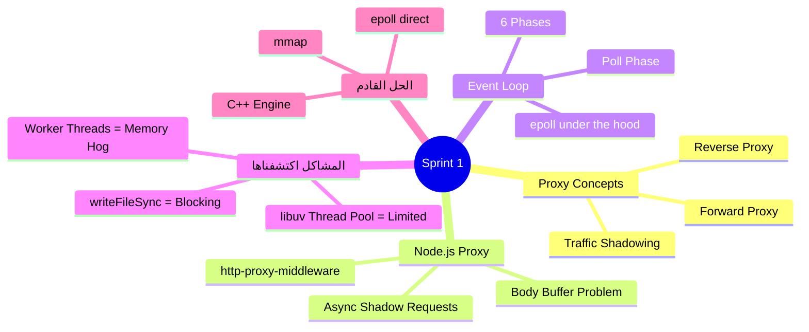

## الـ CV Bullet Point بتاع Sprint 1

```
✅ Designed and implemented a Node.js HTTP reverse proxy with real-time
   traffic shadowing capabilities, routing production traffic to primary
   servers while asynchronously mirroring requests to shadow environments
   for zero-impact API validation testing.
```

## خريطة الطريق القادمة

```mermaid
gantt
    title Time Machine Proxy — Learning Journey
    dateFormat  X
    axisFormat Sprint %s

    section ✅ Sprint 1 (خلص)
    Node.js Proxy & Traffic Shadowing    :done,    s1, 0, 1
    Event Loop Deep Dive                 :done,    s1b, 0, 1

    section 🔥 Sprint 2 (الجاي)
    C++ Basics for Backend Devs          :active,  s2a, 1, 2
    TCP Sockets from scratch             :active,  s2b, 1, 2
    epoll — Kernel Event Multiplexing    :active,  s2c, 1, 2
    mmap — Memory Mapped I/O            :active,  s2d, 1, 2

    section Sprint 3
    OS Tuning (ulimit, tcp params)       :         s3a, 2, 3
    Bash Log Rotation Scripts            :         s3b, 2, 3
    Python Async Replay Engine           :         s3c, 2, 3

    section Sprint 4
    Unix Domain Sockets (IPC)           :         s4a, 3, 4
    Docker Compose Orchestration         :         s4b, 3, 4
    Mock Interview — Hardcore            :         s4c, 3, 4
```

## السؤال اللي المفروض تعرف تجاوب عليه دلوقتي

لو المحاور سألك: **"ليه Node.js وحده مش كافي للـ Traffic Shadowing في الـ production؟"**

الإجابة الصح:

> "Node.js شغّال على Single Thread باستخدام Event Loop. في حين إن الـ async I/O كويس للـ network operations، الـ disk I/O عبر الـ libuv thread pool محدود بـ thread pool صغير. على high throughput زي 50k RPS، الـ thread pool بيبقى مشغول طول الوقت، والـ requests بتتراكم في الـ queue وبتاكل memory. بالإضافة لـ V8 Garbage Collector اللي بيعمل Stop-the-World pauses بتأثر على الـ latency. الحل هو C++ edge layer بيستخدم `epoll` للـ event multiplexing و`mmap` للـ disk I/O — اللي بيديك zero-copy writes وzero blocking."

---

## 🎯 جاهز للـ Sprint 2؟

في Sprint 2 هتعمل الآتي بنفسك:

1. **تكتب أول سطر C++** في حياتك للـ backend
2. **تبني TCP server** من الصفر — مش HTTP — بس TCP raw
3. **تتعلم `epoll`** وتفهم ليه Node.js نفسه بيستخدمه تحت الغطا
4. **تكتب `mmap`** وتشوف بعينيك إزاي الـ kernel بيعمل I/O من غير أي blocking

لما تخلص Sprint 2، هتبص على `fs.writeFile` وتبتسم — لأنك هتعرف بالظبط إيه اللي بيحصل تحتها.

---

*Sprint 1 ✅ — ابعتلي لما تخلّص الـ Checkpoints وجاهز لـ Sprint 2! 🚀*
