# 🐚 Shell Scripting — Day 2 Complete Guide
> **Obsidian Tips:** All `mermaid` blocks render natively. For Excalidraw sections marked with 🎨, save the JSON as `.excalidraw` files and embed with `![[filename.excalidraw]]`

---

## 📋 Table of Contents
1. [[#🤔 When to Use a Shell Script]]
2. [[#🐚 Standard Shells]]
3. [[#🔧 Built-in Commands]]
4. [[#✍️ Creating Your First Script]]
5. [[#📦 Variables]]
6. [[#🔢 Arithmetic]]
7. [[#👂 Reading User Input]]
8. [[#🔀 Flow Control]]
9. [[#🧪 Testing Operators Cheatsheet]]
10. [[#📝 Lab 2 Solutions]]

---

## 🤔 When to Use a Shell Script

> 🧒 **Think of it like a recipe card.** Instead of cooking the same dish from memory every time, you write the steps down once — and anyone (including a robot 🤖) can follow it perfectly every time!

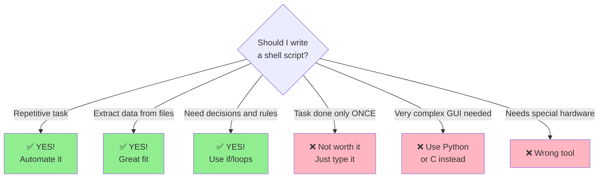

**Shell scripts are great because:**
- No compiler needed — just write and run!
- Portable — works on almost any Linux/UNIX system
- Simple and fast for automating repetitive tasks

---

## 🐚 Standard Shells

> 🧒 **Think of shells like different brands of calculators.** They all do math, but some have extra buttons. We use **bash** — the most popular one today.

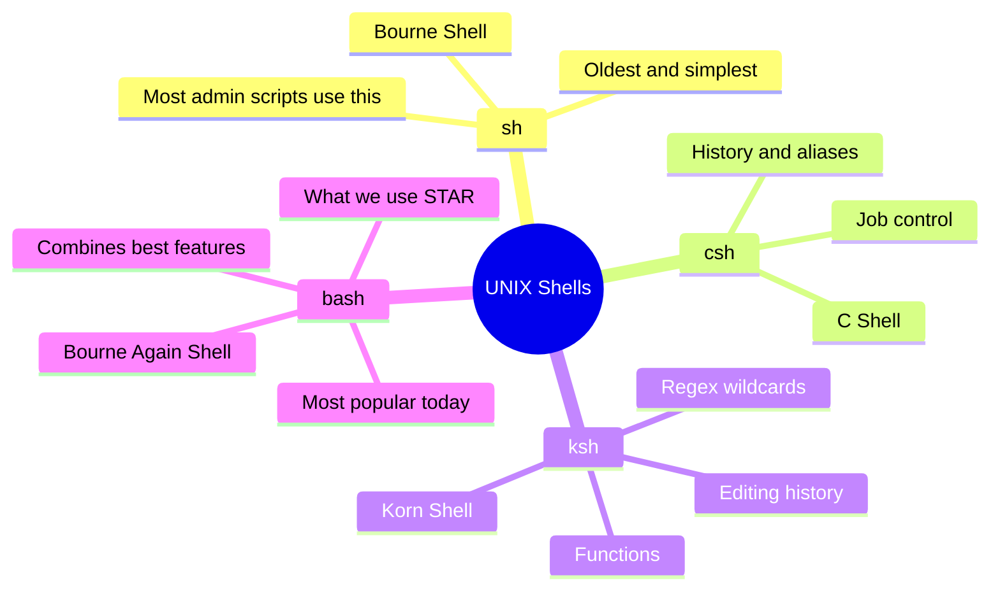

To check which shell you're using:
```bash
echo $SHELL
# Output: /bin/bash
```

---

## 🔧 Built-in Commands

> 🧒 **Built-in commands are like apps pre-installed on your phone.** They're already inside the shell — no downloading needed, and they run instantly!

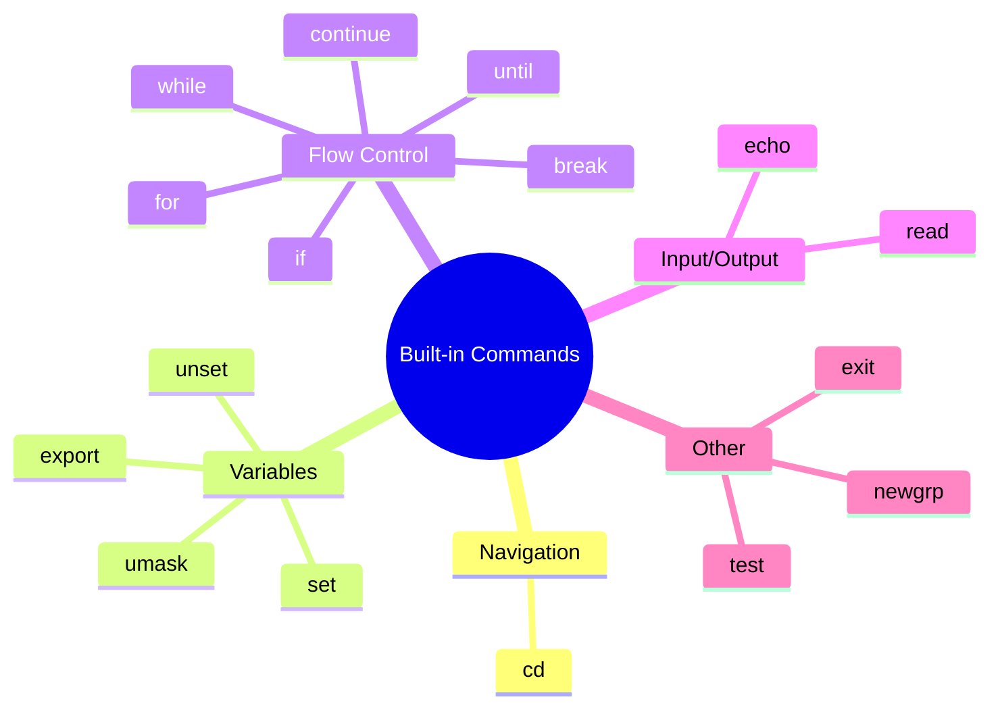

**How to check if a command is built-in:**
```bash
type cd       # cd is a shell builtin
type ls       # ls is /bin/ls  ← NOT built-in
```

---

## ✍️ Creating Your First Script

> 🧒 **A script is like writing a letter to the computer.** The first line tells it what language the letter is written in!

### The Anatomy of a Script

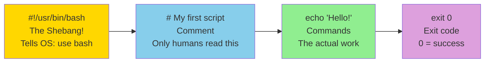

### Step-by-Step: Your First Script

```bash
# Step 1: Create the file
vi greeting.sh

# --- Inside the file: ---
#!/usr/bin/bash
# This is my first bash script
echo "Hello, World!"
# ------------------------

# Step 2: Make it executable
chmod +x greeting.sh

# Step 3: Run it!
./greeting.sh
# Output: Hello, World!
```

### Two Ways to Run a Script

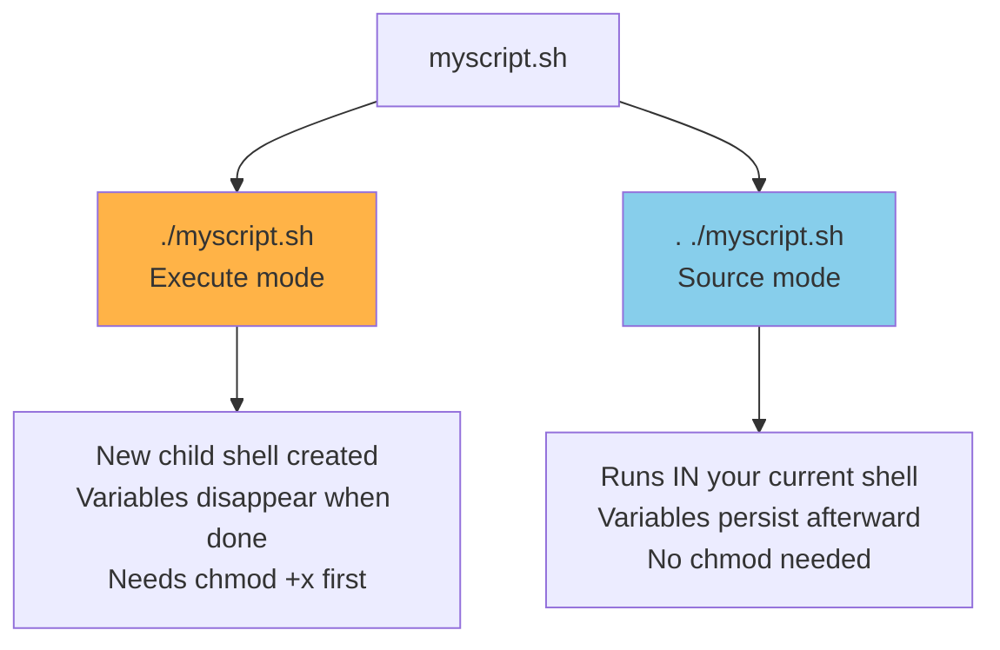

> **Key Difference:** With sourcing (`. ./script.sh`), variables set inside the script stay in your shell after it finishes. With `./script.sh`, they vanish when the script ends.

---

## 📦 Variables

> 🧒 **Variables are like labeled boxes.** You put a value in, give it a name, and peek inside anytime using `$boxname`.

### Three Types of Variables

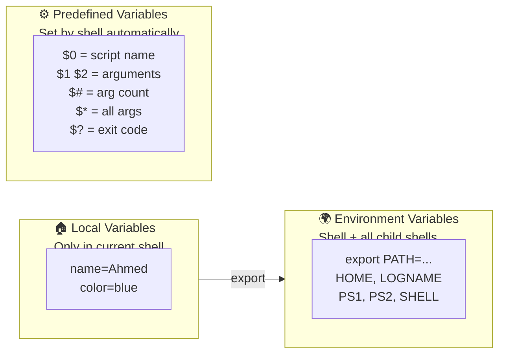

### Local Variables — Examples

```bash
# Set a variable (NO spaces around =)
state=Cairo
echo $state           # Output: Cairo

name="Ahmed Mohamed"  # Use quotes for spaces
echo $name            # Output: Ahmed Mohamed

x=                    # Empty variable
echo $x               # Output: (nothing)

# Curly braces prevent ambiguity
echo ${state}City     # Output: CairoCity
echo $stateCity       # Output: (nothing — wrong variable name!)
```

> ⚠️ **Golden Rule:** No spaces around `=` when setting variables!
> - ✅ `name=Ahmed`
> - ❌ `name = Ahmed` (bash thinks `name` is a command — ERROR!)

### How `export` Works

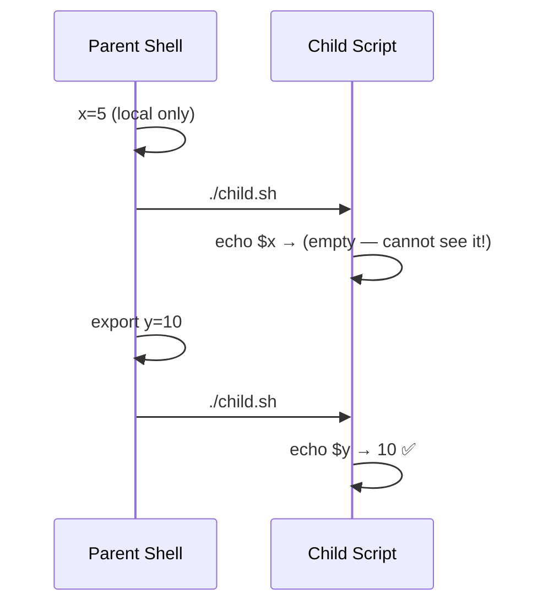

```bash
# Without export — child cannot see it
x=5
./child.sh           # child sees $x as empty

# With export — child inherits it
export y=10
./child.sh           # child sees $y = 10

# Unset a variable
unset y
echo $y              # Output: (nothing)

# See all variables
env                  # environment variables
set                  # all variables including local
```

### Predefined (Special) Variables

```bash
# Running: ./myscript.sh arg1 arg2 arg3
echo $0    # myscript.sh     (script name)
echo $1    # arg1            (1st argument)
echo $2    # arg2            (2nd argument)
echo $#    # 3               (number of arguments)
echo $*    # arg1 arg2 arg3  (ALL arguments as string)
echo $?    # 0               (exit code of last command)
```

### Quoting — The Three Types

```mermaid
flowchart TD
    Q["Quoting Types"]

    Q --> SQ["Single Quotes
Ignore ALL special characters
What you type = what you get"]
    Q --> DQ["Double Quotes
Ignore MOST special chars
BUT: dollar backtick backslash still work"]
    Q --> BS["Backslash
Escape ONE character only
Next char loses special meaning"]

    SQ --> SE["echo '$HOME'
Output: $HOME (literal text)"]
    DQ --> DE["echo \"$HOME\"
Output: /home/ahmed (expanded!)"]
    BS --> BE["echo \"\\$HOME\"
Output: $HOME (literal text)"]
```

```bash
echo '$SHELL'            # Output: $SHELL  (literal)
echo "$SHELL"            # Output: /bin/bash  (expanded)
echo "\$SHELL"           # Output: $SHELL  (literal)

# Backticks and $() run a command inside a string
echo "Today is `date`"          # Today is Sun Feb 22 2026
echo "You are in $(pwd)"        # You are in /home/ahmed
```

---

## 🔢 Arithmetic

> 🧒 **Bash doesn't do math by default — variables are just text!** You need to tell bash "this is a NUMBER" using special syntax.

### Three Ways to Do Math

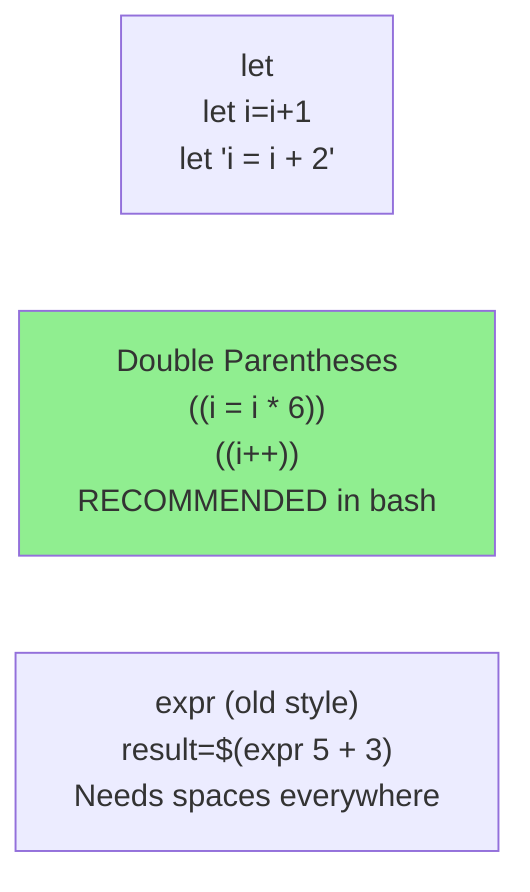

```bash
# Method 1: let
i=5
let i=i+1
echo $i           # 6

let "i = i + 2"
echo $i           # 8

let "i+=1"
echo $i           # 9

# Method 2: (( )) — preferred!
i=9
((i = i * 6))
echo $i           # 54

((result = 10 / 3))
echo $result      # 3  (integer only — no decimals!)

# Method 3: $((  )) — inline in echo/assignments
echo $((5 + 3))   # 8
echo $((10 % 3))  # 1  (modulo/remainder)
result=$((7 - 2))
echo $result      # 5
```

> ⚠️ **Bash only does INTEGER math.** For decimals, pipe to `bc`:
> ```bash
> echo "scale=2; 10/3" | bc    # Output: 3.33
> ```

---

## 👂 Reading User Input

> 🧒 **The `read` command pauses the script and waits for you to type — like a question on a form!**

```bash
#!/usr/bin/bash

# Basic read
echo "What is your name?"
read username
echo "Hello, $username!"

# Read with inline prompt (-p flag)
read -p "Enter your age: " age
echo "You are $age years old."

# Read multiple values at once
read -p "Enter first and last name: " first last
echo "First: $first,  Last: $last"

# Read into $REPLY (when no variable name given)
echo "Where do you work?"
read
echo "I guess $REPLY keeps you busy!"
```

---

## 🔀 Flow Control

> 🧒 **`if` is like a fork in the road.** The shell checks a condition — if true, go one way; if false, go another!

### The `if` Structure

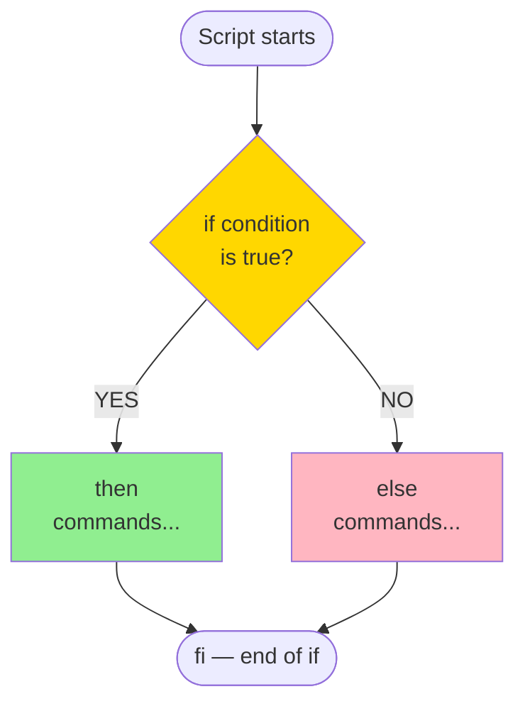

### Syntax Forms

```bash
# Form 1: Basic if
if [ condition ]
then
    commands
fi

# Form 2: if / else
if [ condition ]
then
    commands_if_true
else
    commands_if_false
fi

# Form 3: if / elif / else
if [ condition1 ]
then
    commands1
elif [ condition2 ]
then
    commands2
else
    default_commands
fi

# Form 4: Nested if
if [ condition1 ]
then
    if [ condition2 ]
    then
        commands
    fi
fi
```

> **Note:** `[ condition ]` is identical to `test condition` — they work the same way!

### Progressive Examples — Building Up

**Level 1 — Simple file check:**
```bash
#!/usr/bin/bash
if [ -f /etc/passwd ]
then
    echo "The passwd file exists!"
fi
```

**Level 2 — With else:**
```bash
#!/usr/bin/bash
read -p "Enter a number: " num

if [ $num -gt 0 ]
then
    echo "$num is POSITIVE"
else
    echo "$num is zero or negative"
fi
```

**Level 3 — With elif (grade checker):**
```bash
#!/usr/bin/bash
read -p "Enter your score: " score

if [ $score -ge 90 ]
then
    echo "Grade: A"
elif [ $score -ge 80 ]
then
    echo "Grade: B"
elif [ $score -ge 70 ]
then
    echo "Grade: C"
else
    echo "Grade: F — Study harder!"
fi
```

**Level 4 — Nested if (file type and permissions):**
```bash
#!/usr/bin/bash
read -p "Enter filename: " fname

if [ -f "$fname" ]
then
    echo "$fname exists."
    if [ -r "$fname" ]
    then
        echo "And you can READ it."
    fi
    if [ -w "$fname" ]
    then
        echo "And you can WRITE to it."
    fi
else
    echo "$fname does NOT exist."
fi
```

---

## 🧪 Testing Operators Cheatsheet

### String Tests

| Operator | Meaning | Example |
|----------|---------|---------|
| `str1 = str2` | Equal | `[ "$a" = "$b" ]` |
| `str1 != str2` | Not equal | `[ "$a" != "$b" ]` |
| `-z str` | Zero length (empty) | `[ -z "$name" ]` |
| `-n str` | Non-zero length | `[ -n "$name" ]` |
| `str` | String is not null | `[ "$name" ]` |

### Number Tests

| Operator | Meaning | Example |
|----------|---------|---------|
| `-eq` | Equal to | `[ $a -eq $b ]` |
| `-ne` | Not equal to | `[ $a -ne $b ]` |
| `-gt` | Greater than | `[ $a -gt $b ]` |
| `-ge` | Greater than or equal | `[ $a -ge $b ]` |
| `-lt` | Less than | `[ $a -lt $b ]` |
| `-le` | Less than or equal | `[ $a -le $b ]` |

### File Tests

| Operator | Meaning |
|----------|---------|
| `-f file` | Is a regular file |
| `-d file` | Is a directory |
| `-e file` | Exists (any type) |
| `-r file` | Readable |
| `-w file` | Writable |
| `-x file` | Executable |
| `-h file` | Symbolic link |
| `-s file` | Not empty (size > 0) |

### Logical Operators

| Operator | Meaning | Example |
|----------|---------|---------|
| `!` | NOT | `[ ! -f "file" ]` |
| `-a` | AND (inside brackets) | `[ -f "f" -a -r "f" ]` |
| `-o` | OR (inside brackets) | `[ $a = "Y" -o $a = "y" ]` |
| `&&` | AND (outside brackets) | `[ -f "f" ] && echo "yes"` |

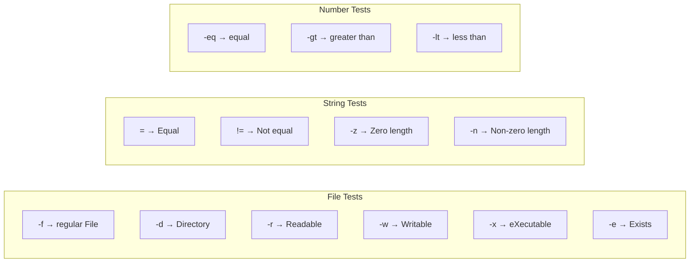

---

## 📝 Lab 2 Solutions

### Exercise 1: Greeting Script

```bash
#!/usr/bin/bash
# greeting.sh

read -p "Please enter your name: " username
echo "Hello, $username! Welcome!"
```

---

### Exercise 2: Passing Variables Between Scripts

**s1 (parent script):**
```bash
#!/usr/bin/bash
# s1 — sets x=5 and calls s2 two ways

x=5
echo "In s1: x = $x"

# Way 1: Pass x as argument
echo "--- Way 1: Passing as argument ---"
./s2.sh $x

# Way 2: Export x as environment variable
export x
echo "--- Way 2: Using export ---"
./s2.sh
```

**s2 (child script):**
```bash
#!/usr/bin/bash
# s2 — reads x two ways

# Way 1: Received as positional argument $1
if [ -n "$1" ]; then
    echo "s2 got x via argument: $1"
fi

# Way 2: Received via exported environment variable
if [ -n "$x" ]; then
    echo "s2 got x via export: $x"
fi
```

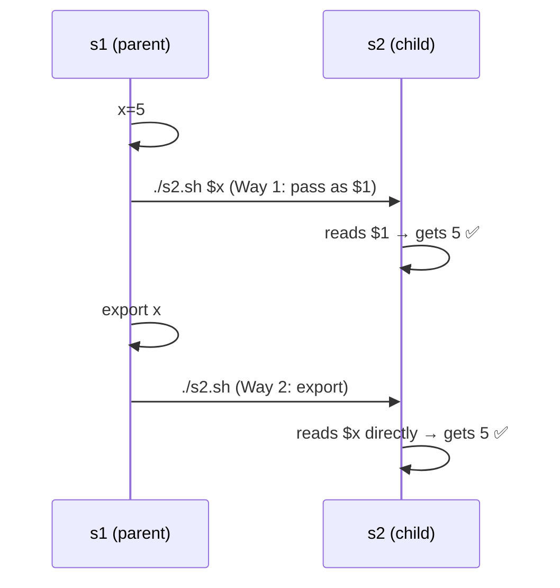

---

### Exercise 3: mycp — copy files

```bash
#!/usr/bin/bash
# mycp — copies file(s) to destination

if [ $# -eq 0 ]; then
    echo "Usage: mycp source dest"
    echo "       mycp file1 file2 ... directory"
    exit 1
fi

# Two args: file-to-file or file-to-dir copy
if [ $# -eq 2 ]; then
    cp "$1" "$2"
    echo "Copied: $1 → $2"

# Three or more args: last arg must be a directory
elif [ $# -gt 2 ]; then
    dest="${@: -1}"

    if [ ! -d "$dest" ]; then
        echo "Error: '$dest' must be a directory when copying multiple files"
        exit 1
    fi

    for file in "${@:1:$#-1}"; do
        cp "$file" "$dest/"
        echo "Copied: $file → $dest/"
    done
fi
```

---

### Exercise 4: mycd — change directory

> ⚠️ **Important:** `cd` only changes directory inside the **current shell**. To make `mycd` actually change your directory, it must be **sourced**: `. ./mycd` — or better yet, defined as a **shell function**.

```bash
# Add this function to your ~/.bashrc
mycd() {
    if [ $# -eq 0 ]; then
        cd "$HOME"
    elif [ -d "$1" ]; then
        cd "$1"
    else
        echo "Error: '$1' is not a directory"
        return 1
    fi
    echo "Now in: $(pwd)"
}
```

---

### Exercise 5: myls — list directory

```bash
#!/usr/bin/bash
# myls — basic version

if [ $# -eq 0 ]; then
    ls .
else
    ls "$1"
fi
```

---

### Exercise 6: myls — with options + bonus combined flags

```bash
#!/usr/bin/bash
# myls — supports -l -a -d -i -R and combinations like -la, -al

opts=""
target="."

# getopts handles: -l, -a, -d, -i, -R and combinations like -la
while getopts "ladiR" flag; do
    case $flag in
        l) opts="${opts}l" ;;
        a) opts="${opts}a" ;;
        d) opts="${opts}d" ;;
        i) opts="${opts}i" ;;
        R) opts="${opts}R" ;;
        ?) echo "Usage: myls [-ladiR] [directory]"; exit 1 ;;
    esac
done

# Move past the parsed options
shift $((OPTIND - 1))

# Any remaining argument is the target directory
if [ $# -gt 0 ]; then
    target="$1"
fi

# Execute ls with collected options
if [ -n "$opts" ]; then
    ls -${opts} "$target"
else
    ls "$target"
fi
```

**How getopts processes combined flags:**

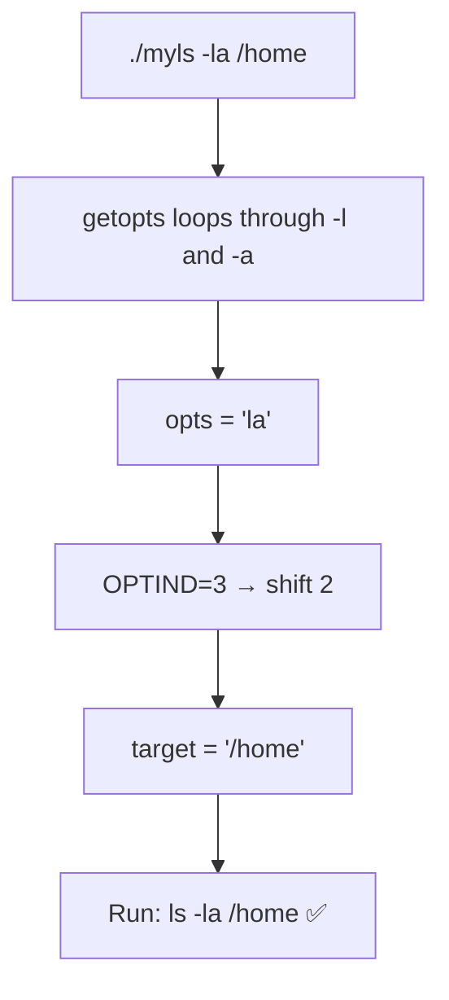

**Test all the bonus formats:**
```bash
./myls -l              # long format, current dir
./myls -a /tmp         # hidden files in /tmp
./myls -l -a           # separate flags
./myls -la             # combined flags (bonus!)
./myls -al             # reversed order (bonus!)
./myls -laR /home      # triple combined (bonus!)
```

---

### Exercise 7: mytest — check type and permissions

```bash
#!/usr/bin/bash
# mytest — checks type and permissions of a file/directory

if [ $# -eq 0 ]; then
    echo "Usage: mytest <filename>"
    exit 1
fi

target="$1"

# Check existence first
if [ ! -e "$target" ]; then
    echo "Error: '$target' does not exist."
    exit 1
fi

# --- Type Check ---
echo "=== Type ==="
if [ -f "$target" ]; then
    echo "'$target' is a REGULAR FILE"
elif [ -d "$target" ]; then
    echo "'$target' is a DIRECTORY"
elif [ -h "$target" ]; then
    echo "'$target' is a SYMBOLIC LINK"
else
    echo "'$target' is another type (device/pipe/etc)"
fi

# --- Permission Check ---
echo ""
echo "=== Permissions ==="
if [ -r "$target" ]; then
    echo "Readable:   YES"
else
    echo "Readable:   NO"
fi

if [ -w "$target" ]; then
    echo "Writable:   YES"
else
    echo "Writable:   NO"
fi

if [ -x "$target" ]; then
    echo "Executable: YES"
else
    echo "Executable: NO"
fi
```

**Sample output:**
```
$ ./mytest /etc/passwd
=== Type ===
'/etc/passwd' is a REGULAR FILE

=== Permissions ===
Readable:   YES
Writable:   NO
Executable: NO
```

---

### Exercise 8: myinfo — full user information

```bash
#!/usr/bin/bash
# myinfo — gathers full info about a user

read -p "Enter your logname (username): " logname

# Validate user exists
if ! id "$logname" &>/dev/null; then
    echo "Error: User '$logname' not found."
    exit 1
fi

homedir="/home/$logname"

echo ""
echo "======================================="
echo "  User Report: $logname"
echo "======================================="

# (a) User identity info
echo ""
echo "--- User Identity ---"
id "$logname"

# (b) Full info about home directory contents
echo ""
echo "--- Files in $homedir ---"
if [ -d "$homedir" ]; then
    ls -lah "$homedir"
else
    echo "Home directory not found: $homedir"
fi

# (c) Copy files to /tmp (as much as possible)
echo ""
echo "--- Copying to /tmp ---"
tmpdir="/tmp/${logname}_backup_$(date +%Y%m%d_%H%M%S)"
mkdir -p "$tmpdir"

if [ -d "$homedir" ]; then
    cp -r "$homedir"/. "$tmpdir"/ 2>/dev/null
    echo "Backup created: $tmpdir"
    echo "Contents:"
    ls "$tmpdir"
else
    echo "Nothing to copy."
fi

# (d) Current processes for this user
echo ""
echo "--- Current Processes for $logname ---"
ps -u "$logname" -f 2>/dev/null

echo ""
echo "======================================="
echo "Done!"
```

---

## 🗺️ Everything on One Map

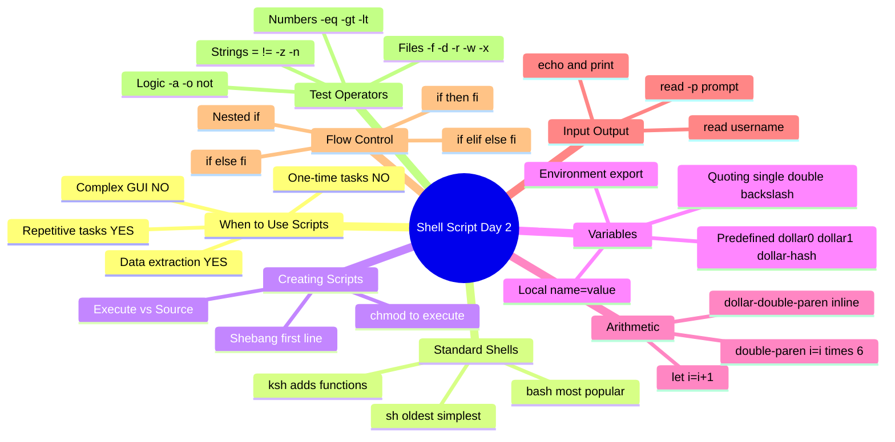

---

## 💡 Quick Reference Card

```bash
# === VARIABLES ===
x=5                    # Set local variable (NO spaces!)
export x=5             # Set environment variable
echo $x                # Use variable
echo ${x}suffix        # Braces to isolate variable name
unset x                # Delete variable

# === SPECIAL VARIABLES ===
$0    # script name
$1    # first argument
$#    # number of arguments
$*    # all arguments
$?    # exit code of last command (0 = success)

# === ARITHMETIC ===
((result = a + b))     # Calculate
echo $((5 * 3))        # Inline calculate: 15
let "x += 1"           # Increment x

# === INPUT ===
read -p "Name? " name  # Read with prompt

# === COMMON if PATTERNS ===
if [ -f "file" ]; then echo "file exists"; fi
if [ -d "dir" ]; then echo "is directory"; fi
if [ $x -gt 5 ]; then echo "big"; else echo "small"; fi
if [ "$a" = "$b" ]; then echo "strings equal"; fi
if [ -z "$var" ]; then echo "variable is empty"; fi
if [ $# -eq 0 ]; then echo "no arguments given"; fi
```

---

*Shell Scripting Day 2 — ITI Open Source Track*
*All Mermaid diagrams render natively in Obsidian*
