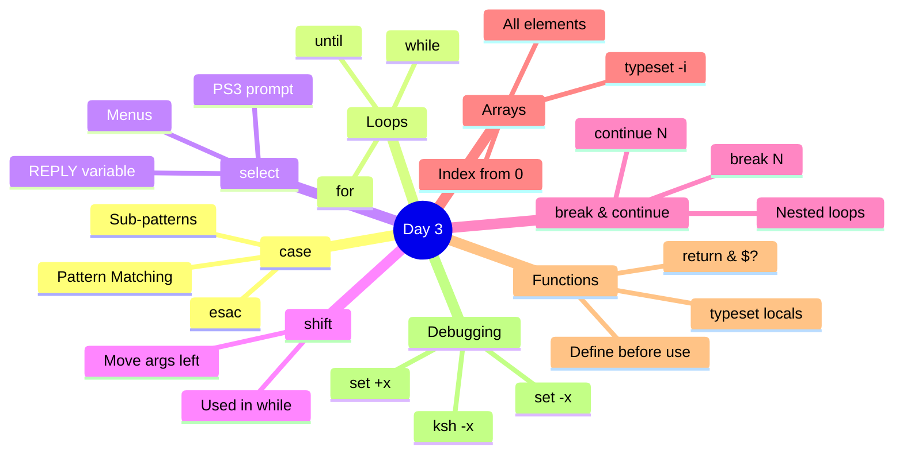
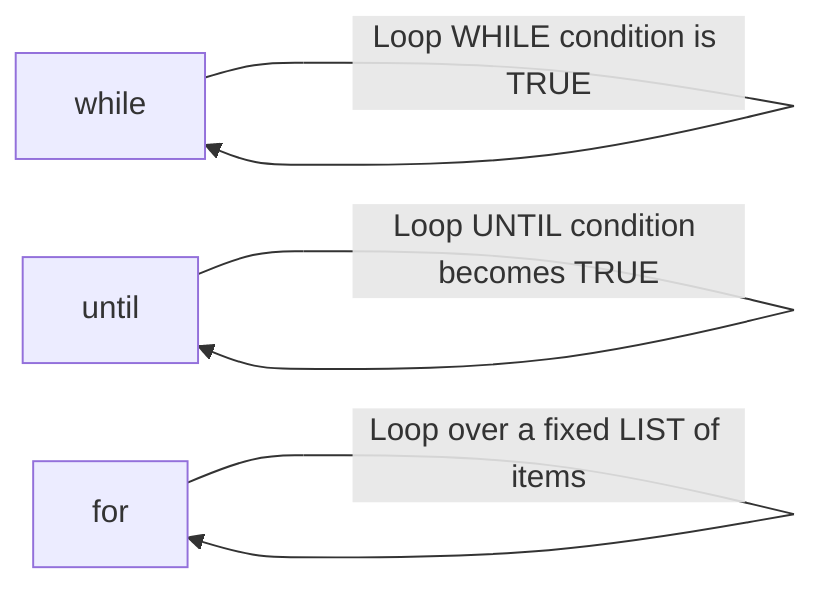
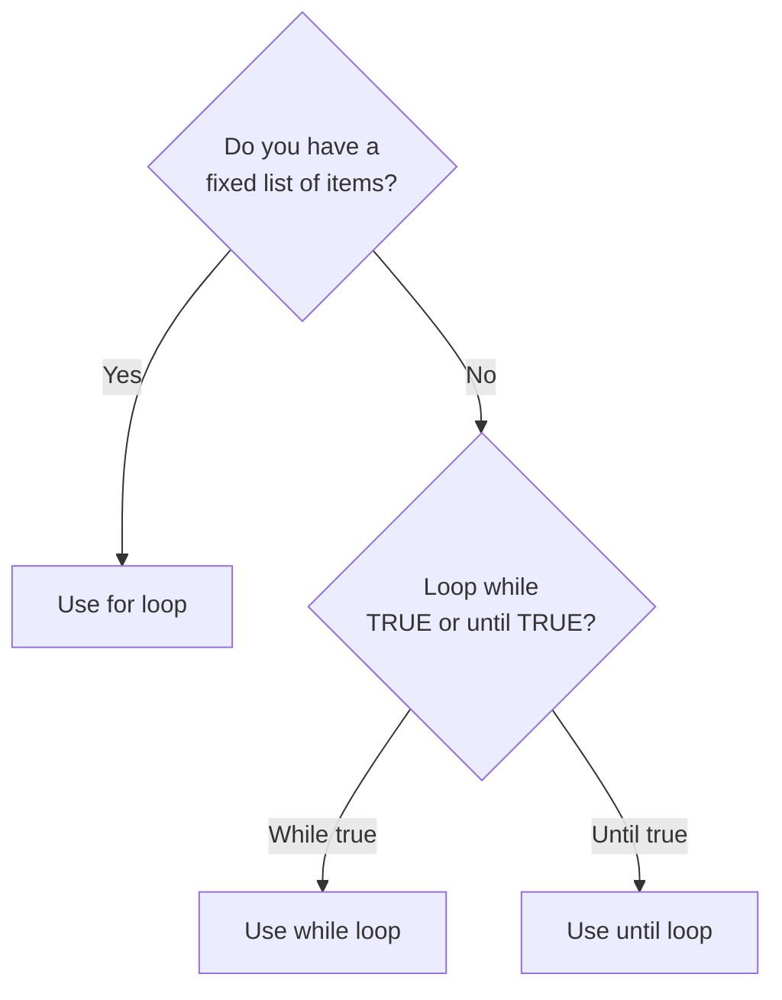
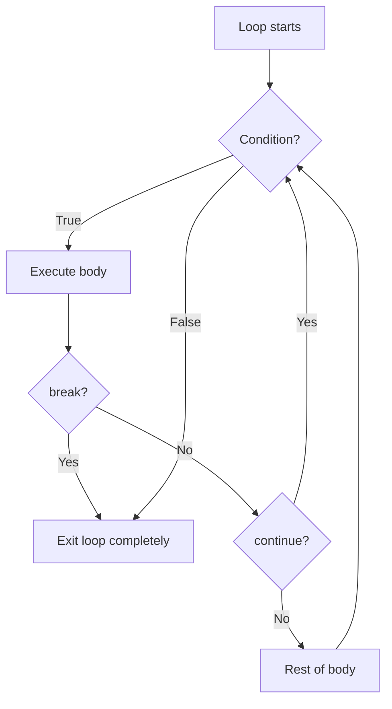
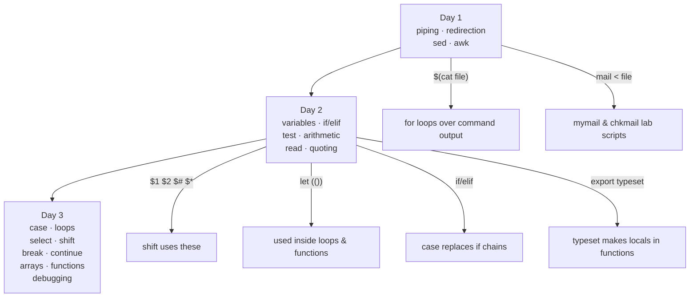

# 🐚 Shell Scripting — Day 3 Study Guide
**ITI Open Source Track**
*Builds on Day 1 (sed, awk, piping) and Day 2 (variables, if/elif, test operators, quoting, arithmetic)*

---

## 📋 Day 3 Topics Overview



---

## 1. 🗂️ The `case` Command

### What is it?

Think of `case` like a **receptionist at a hotel** — a guest (your variable) walks in, the receptionist checks their name against a list, and routes them to the right room. If nobody matches, there's a default "room" (`*`).

In Day 2 we used `if/elif/else` for decisions. `case` is cleaner when you're comparing **one variable against many fixed values**.

### Syntax

```bash
case variable in
  value1)
    command(s)
    ;;
  value2)
    command(s)
    ;;
  *)
    command(s)   # default — like else
    ;;
esac             # "case" spelled backwards — closes the block
```

> ⚠️ **Critical rules:**
> - Each pattern ends with `)` 
> - Each block ends with `;;` (double semicolon = "I'm done, don't fall through")
> - `*)` is the catch-all (like `else`)
> - `esac` closes the whole `case` block

### Simple Example — Day of week

```bash
#!/bin/bash
echo "Enter a day number (1-7):"
read day

case $day in
  1) echo "Monday — Back to work!" ;;
  2) echo "Tuesday" ;;
  3) echo "Wednesday — Midweek!" ;;
  4) echo "Thursday" ;;
  5) echo "Friday — Almost weekend!" ;;
  6) echo "Saturday — Weekend!" ;;
  7) echo "Sunday — Weekend!" ;;
  *) echo "Invalid day number" ;;
esac
```

### OR Patterns with `|`

You can match multiple values in one branch using `|` (means "or"):

```bash
case $day in
  6|7) echo "Weekend!" ;;
  1|2|3|4|5) echo "Weekday" ;;
  *) echo "Invalid" ;;
esac
```

---

## 2. 🔡 Sub-Patterns (Pattern Matching in case)

This is the **superpower** of `case` over `if` — it supports glob-style pattern matching.

### The 5 Sub-Pattern Operators

| Operator | Meaning | Example | Matches |
|---|---|---|---|
| `?(pat)` | Zero or one occurrence | `?(a)` | `""` or `"a"` |
| `*(pat)` | Zero or more occurrences | `*(a)` | `""`, `"a"`, `"aa"`, `"aaa"` |
| `@(pat)` | Exactly one occurrence | `@(a)` | only `"a"` |
| `+(pat)` | One or more occurrences | `+(a)` | `"a"`, `"aa"`, but NOT `""` |
| `!(pat)` | Everything EXCEPT | `!([0-9])` | anything that's NOT a digit |

### Character Classes in Patterns

| Pattern | Matches |
|---|---|
| `[a-z]` | Any single lowercase letter |
| `[A-Z]` | Any single uppercase letter |
| `[0-9]` | Any single digit |
| `[a-zA-Z]` | Any single letter |
| `[a-zA-Z0-9]` | Any single alphanumeric |

### The Lecture Example — Single Character Classifier

```bash
#!/bin/bash
echo "Enter a single character:"
read var

case $var in
  @([a-z])) echo "Lower case letter" ;;
  @([A-Z])) echo "Upper case letter" ;;
  @([0-9])) echo "Number (digit)" ;;
  "")       echo "Nothing was entered" ;;
  *)        echo "Special character" ;;
esac
```

**How `@([a-z])` works:**
- `@(...)` = exactly one occurrence of whatever is inside
- `[a-z]` = any lowercase letter
- Together: exactly one lowercase letter

### Why use `@()` vs plain `[a-z]`?

```bash
# Both work for single characters, but @() is more explicit:
[a-z])        # matches a single lowercase char (traditional glob)
@([a-z]))     # matches exactly ONE lowercase char (extended glob)

# @() becomes important for multi-char patterns:
@(yes|no))    # matches exactly "yes" OR "no" — nothing else
+([ 0-9]))    # matches one or more digits (a whole number)
```

---

## 3. 🔄 Looping Commands

Three types of loops — each has a different "when to stop" strategy:



---

## 4. 🔁 The `while` Loop

### Analogy
Like a **security guard checking badges** — keep looping as long as the condition is true. The moment it becomes false, stop.

### Syntax

```bash
while condition
do
  commands
done
```

### Example 1 — Count from 0 to 9

```bash
#!/bin/bash
num=0
while [ $num -lt 10 ]
do
  echo $num
  let num=$num+1   # we learned this in Day 2!
done
```

Output: `0 1 2 3 4 5 6 7 8 9`

### Example 2 — Password loop (from lecture)

```bash
#!/bin/bash
echo "What is my name?"
read ans

while [ $ans != "sherine" ]
do
  echo "Wrong Answer! Try Again:"
  read ans
done

echo "You Got It!"
```

**What happens:**
1. Ask once BEFORE the loop
2. Loop keeps running as long as answer is wrong
3. The moment they get it right, the condition becomes false → loop exits

### Example 3 — Infinite loop with `while true`

```bash
#!/bin/bash
while true    # true always succeeds → loops forever
do
  echo "Press Ctrl+C to stop"
  sleep 1
done
```

> 💡 `while true` is used when you want to loop forever and rely on `break` to exit (we'll see this soon).

---

## 5. 🔃 The `until` Loop

### Analogy
The **opposite of while** — like waiting until your food is ready. You keep waiting UNTIL the condition becomes true.

| | `while` | `until` |
|---|---|---|
| Runs when | condition is **TRUE** | condition is **FALSE** |
| Stops when | condition becomes **FALSE** | condition becomes **TRUE** |

### Syntax

```bash
until condition
do
  commands
done
```

### Example — The Hour/Greetings Script (from lecture)

```bash
#!/bin/bash
hour=1

until [ $hour -gt 24 ]    # stop when hour exceeds 24
do
  case $hour in
    [0-9]|1[0-1]) echo "Good morning" ;;    # hours 0-11
    12)           echo "Lunch time" ;;
    1[3-7])       echo "Work time" ;;        # hours 13-17
    *)            echo "Good Night" ;;       # 18-24
  esac
  let hour=$hour+1
done
```

> 🧠 Notice how `case` and `until` are combined here — this is the power of building on what we know!

### until vs while — When to choose?

```bash
# These two are equivalent — pick whichever reads more naturally:

# while version:
while [ $count -lt 10 ]
do echo $count; let count=$count+1; done

# until version:
until [ $count -ge 10 ]
do echo $count; let count=$count+1; done
```

---

## 6. 📋 The `for` Loop

### Analogy
Like a **teacher calling roll** — you have a fixed list of names, go through each one, do something.

### Syntax

```bash
for variable in item1 item2 item3 ...
do
  commands using $variable
done
```

### Example 1 — Simple list

```bash
#!/bin/bash
for pal in mona ahmed maha
do
  echo "Hi $pal!"
done
```

Output:
```
Hi mona!
Hi ahmed!
Hi maha!
```

### Example 2 — Loop over files (glob expansion)

```bash
#!/bin/bash
# Loop over ALL files in home directory
for file in ~/*
do
  echo "Found: $file"
done
```

### Example 3 — Loop using command substitution (from lecture)

```bash
#!/bin/bash
# Read a list from a file and mail each person
for person in $(cat mylist)    # same as `cat mylist`
do
  mail -s "Hello" $person < letter
  echo "Mail to $person was sent"
done
```

> 💡 `$(cat mylist)` runs `cat mylist` and uses its output as the word list — same command substitution we learned in Day 2!

### Example 4 — for with a range (C-style, bash)

```bash
#!/bin/bash
# Count 1 to 5
for i in 1 2 3 4 5
do
  echo "Number: $i"
done

# Or using seq:
for i in $(seq 1 5)
do
  echo "Number: $i"
done
```

### Comparison: for vs while vs until



---

## 7. 📜 The `select` Command — Interactive Menus

### Analogy
Imagine a **restaurant menu** printed automatically — the customer picks a number, and the kitchen receives the order. `select` builds that menu for you automatically.

### Key Points
- `select` automatically numbers and displays the choices
- `PS3` is the prompt shown to the user (default is `#?`)
- The user types a **number**, and the chosen **word** goes into your variable
- `REPLY` holds the raw number the user typed
- Usually combined with `case` to act on the choice
- Loops automatically (keeps showing menu) until `break`

### Syntax

```bash
PS3="Your prompt here: "
select variable in choice1 choice2 choice3
do
  case $variable in
    choice1) commands ;;
    choice2) commands ;;
    *)       echo "$REPLY is not valid" ;;
  esac
done
```

### Example 1 — Basic menu (from lecture, loops forever)

```bash
#!/bin/bash
PS3="Pick a person: "
select choice in Ahmed Adel Tamer
do
  case $choice in
    Ahmed) echo "Ahmed is a good boy" ;;
    Adel)  echo "Adel is the best" ;;
    Tamer) echo "Tamer is a bad boy" ;;
    *)     echo "$REPLY is not one of the choices" ;;
  esac
done
```

Output:
```
1) Ahmed
2) Adel
3) Tamer
Pick a person: 1
Ahmed is a good boy
1) Ahmed
2) Adel
3) Tamer
Pick a person: 5
5 is not one of the choices
```
(Menu keeps repeating forever)

### Example 2 — Menu that exits after valid choice (from lecture)

```bash
#!/bin/bash
PS3="Choose: "
select choice in Ahmed Adel Tamer
do
  case $choice in
    Ahmed) echo "Ahmed is a good boy"; break ;;
    Adel)  echo "Adel is the best"; break ;;
    Tamer) echo "Tamer is a bad boy"; break ;;
    *)     echo "$REPLY is not valid. Try again." ;;
  esac
done
```

> The `break` inside each valid case exits the `select` loop after a valid choice.

### Example 3 — ls menu (Lab 3, Ex 8 style)

```bash
#!/bin/bash
PS3="Choose an option: "
select choice in "ls" "ls -a" "exit"
do
  case $choice in
    "ls")    ls ;;
    "ls -a") ls -a ;;
    "exit")  echo "Goodbye!"; break ;;
    *)       echo "Invalid choice: $REPLY" ;;
  esac
done
```

---

## 8. ⬅️ The `shift` Command

### Analogy
Imagine a **conveyor belt** of arguments — `shift` pushes everything one step forward, and the first item falls off and disappears forever.

```
Before shift:  $1=a  $2=b  $3=c  $4=d   ($#=4)
After shift:   $1=b  $2=c  $3=d          ($#=3)
After shift:   $1=c  $2=d                ($#=2)
```

### Key Points
- `shift` (no argument) = shift left by 1
- `shift 3` = shift left by 3
- Once shifted, the dropped argument is **gone permanently**
- `$0` (script name) is **never** shifted away
- Most useful in `while` loops to process all positional args

### Syntax

```bash
shift        # shift by 1
shift N      # shift by N
```

### Example — From the lecture

```bash
#!/bin/bash
while (( $# > 0 ))   # while there are still arguments left
do
  echo $*            # print all remaining args
  shift              # drop the first one
done
```

Run: `./doit a b c d e`

Output:
```
a b c d e
b c d e
c d e
d e
e
```

### Practical use — Process flags and arguments

```bash
#!/bin/bash
# Process all arguments one by one
while [ $# -gt 0 ]
do
  echo "Processing: $1"
  shift
done
```

> 💡 **Connection to Day 2:** Remember `$#`, `$*`, `$1`, `$2` from Day 2? `shift` is how you walk through them one by one in a loop!

---

## 9. 🛑 The `break` Command

### Analogy
Like an **emergency exit door** — you're inside a loop and you want to get out immediately, without finishing the current iteration or any future ones.

### Key Points
- `break` exits **only the current loop** — the script continues after `done`
- `break N` exits N levels of nested loops
- Without `break`, `while true` would run forever

### Syntax

```bash
break      # exit innermost loop
break 2    # exit 2 levels of nested loops
break 3    # exit 3 levels of nested loops
```

### Example — From the lecture

```bash
#!/bin/bash
while true
do
  echo "Are you ready to move on?"
  read answer
  if [ "$answer" = "y" ] || [ "$answer" = "Y" ]
  then
    break      # exit the while loop
  else
    echo "OK, keep trying..."
  fi
done
echo "Great! Here we go!"    # this runs AFTER the loop
```

### `break N` — Exiting multiple nested loops

```bash
#!/bin/bash
# break 3 exits all 3 loops at once
while true
do
  for user in Ahmed Tamer Samy
  do
    while true
    do
      if [ "$user" = "Samy" ]
      then
        echo "Found Samy — breaking ALL loops"
        break 3     # exits all 3 levels
      fi
      break         # exit innermost while
    done
  done
done
echo "Out of all loops"
```

---

## 10. ⏭️ The `continue` Command

### Analogy
Like **skipping a turn** in a board game — you don't exit the game (loop), you just skip the rest of THIS turn and go back to the top.

### Key Points
- `continue` skips the **rest of the current iteration** and goes back to the loop condition check
- `continue N` skips N levels up
- The loop itself keeps running

### Syntax

```bash
continue      # restart innermost loop's next iteration
continue 2    # restart 2nd-level loop's next iteration
```

### Example — Skip one person (from lecture)

```bash
#!/bin/bash
# Send mail to everyone EXCEPT sherine
for name in $(cat names)
do
  if [ "$name" = "sherine" ]
  then
    continue    # skip sherine, go to next name
  fi
  mail -s "Hello" $name < memo
  echo "Mail sent to $name"
done
```

### break vs continue — Visual comparison



### Nested Loops — The Full Lecture Example Explained

```bash
#!/bin/bash
while true                          # Loop 1 (outermost)
do
  for user in Ahmed Tamer Samy      # Loop 2 (middle)
  do
    if [ "$user" = "Tamer" ]        # T matches [Tt]*
    then
      echo "Hi from Tamer"
      continue                      # skip rest of Loop 2's body, next iteration of Loop 2
    fi
    while true                      # Loop 3 (innermost)
    do
      if [ "$user" = "Samy" ]
      then
        echo "Hi from Samy"
        break 3                     # EXIT ALL 3 loops
      fi
      echo "Hi from Ahmed"
      continue 2                    # skip to next iteration of Loop 2 (the for loop)
    done
  done
done
echo "Out of the Loop"
```

**Trace through:**
1. Loop1 starts → Loop2 starts with Ahmed
2. Ahmed is not Tamer → enters Loop3 → Ahmed is not Samy → prints "Hi from Ahmed" → `continue 2` jumps to next `for` iteration
3. Loop2: Tamer → prints "Hi from Tamer" → `continue` → next `for` iteration
4. Loop2: Samy → enters Loop3 → prints "Hi from Samy" → `break 3` exits ALL loops
5. Prints "Out of the Loop"

---

## 11. 📦 Arrays

### Analogy
An array is like a **numbered parking lot** — each spot has a number (index), and you park a value in each spot. You can ask "what's in spot 0?" or "how many spots are used?"

### Key Points
- Index starts at **0** (not 1!)
- Access with `${array[index]}`
- Print all elements: `${array[*]}` or `${array[@]}`
- Count elements: `${#array[@]}`
- Elements can be set in any order (sparse arrays work)
- `typeset -i arr[N]` declares an integer array of N elements

### Setting Array Values

```bash
#!/bin/bash
# Method 1: Set individually (lecture style)
array[0]="ahmed"
array[1]="ali"
array[2]="mohamed"

# Method 2: Set all at once (bash)
names=("ahmed" "ali" "mohamed")
```

### Reading Array Values

```bash
echo ${array[0]}      # ahmed
echo ${array[1]}      # ali
echo ${array[2]}      # mohamed

echo ${array[*]}      # all elements: ahmed ali mohamed
echo ${array[@]}      # same as above
echo ${#array[@]}     # number of elements: 3
```

### Integer Arrays with `typeset -i`

```bash
typeset -i ele[2]    # declare integer array, 2 elements
ele[0]=50
ele[1]=6
# ele[1]="happy"  ← would give "bad number" error!

echo ${ele[*]}       # 50 6
echo ${#ele[@]}      # 2
```

### Looping Through an Array

```bash
#!/bin/bash
fruits=("apple" "banana" "cherry" "date")

# Method 1: Loop by index
i=0
while [ $i -lt ${#fruits[@]} ]
do
  echo "Fruit $i: ${fruits[$i]}"
  let i=$i+1
done

# Method 2: Loop over all values (for loop)
for fruit in ${fruits[@]}
do
  echo "Fruit: $fruit"
done
```

### Complete Array Cheat Sheet

```bash
arr[0]="val"          # set element 0
arr[3]="val"          # set element 3 (2 is empty — sparse OK)
echo ${arr[0]}        # get element 0
echo ${arr[@]}        # get ALL elements
echo ${#arr[@]}       # COUNT of elements
unset arr[1]          # delete element 1
unset arr             # delete entire array
```

---

## 12. 🔧 Functions

### Analogy
A function is like a **kitchen appliance** — a blender that you build once and use anywhere. You plug it in (call it), it does its job, and gives you back a result.

### Why Functions?
- **Avoid repetition** — write once, use many times
- **Organize code** — break big scripts into small named chunks
- **Easier to debug** — test each piece separately

### Key Rules
1. **Define BEFORE you use** (bash reads top-to-bottom)
2. Functions run in the **same shell** as the script — they share variables
3. Use `typeset` inside a function to create **local** variables (won't leak out)
4. Return values go into `$?` (exit status, 0-255)
5. Functions can call themselves (recursion)

### Syntax

```bash
# Style 1: function keyword (ksh/bash)
function function_name {
  commands
}

# Style 2: POSIX style (works everywhere)
function_name() {
  commands
}
```

### Example 1 — Simple function

```bash
#!/bin/bash
function greet {
  echo "Hello, $1!"    # $1 is the first argument TO the function
}

greet "Ahmed"           # call the function
greet "Mona"
```

Output:
```
Hello, Ahmed!
Hello, Mona!
```

> 💡 Inside a function, `$1`, `$2`, etc. refer to the function's arguments, not the script's arguments!

### Example 2 — Function with local variable and return (from lecture)

```bash
#!/bin/bash
function increment {
  typeset sum           # local variable — won't affect outside
  (( sum = $1 + 1 ))   # arithmetic from Day 2
  return $sum           # return value goes into $?
}

echo "The sum is:"
increment 5
echo $?                 # prints 6 (the return value)
echo $sum               # prints nothing — sum was LOCAL to the function!
```

> ⚠️ **Important:** `return` can only return a number 0-255. For returning strings, use `echo` inside the function and capture with `$()`.

### Example 3 — Function returning a string

```bash
#!/bin/bash
function get_greeting {
  echo "Hello, $1!"    # "return" a string via echo
}

message=$(get_greeting "World")   # capture with $()
echo $message                      # Hello, World!
```

### Example 4 — Shared variables (no typeset)

```bash
#!/bin/bash
myvar="global"

function change_it {
  myvar="changed!"    # modifies the GLOBAL variable
}

echo $myvar           # global
change_it
echo $myvar           # changed!  ← functions share parent's variables
```

### Example 5 — Local variables with typeset

```bash
#!/bin/bash
myvar="global"

function safe_change {
  typeset myvar       # now myvar is LOCAL to this function
  myvar="local only"
  echo "Inside: $myvar"
}

echo "Before: $myvar"   # global
safe_change              # Inside: local only
echo "After: $myvar"    # global  ← unchanged!
```

### Function Execution Order (ksh priority)
When you type a command, ksh/bash looks in this order:
1. Aliases
2. Built-in commands (`cd`, `echo`, `read`...)
3. **Functions** ← here
4. External executables (`/bin/ls`, etc.)

---

## 13. 🐛 Debugging with `set -x`

### Analogy
Like having a **play-by-play sports commentator** for your script — every command is announced before it runs, and variable values are shown.

### Two Ways to Debug

**Method 1: Debug a section of a script**

```bash
#!/bin/bash
echo "Normal part"

set -x          # ← turn on debug mode here
myvar="hello"
echo $myvar
set +x          # ← turn off debug mode here

echo "Back to normal"
```

**Method 2: Debug the whole script from command line**

```bash
bash -x ./myscript.sh
# or
ksh -x ./myscript.sh
```

### What debug output looks like

```bash
#!/bin/bash
set -x
name="Ahmed"
echo "Hello $name"
```

Output:
```
+ name=Ahmed
+ echo 'Hello Ahmed'
Hello Ahmed
```
- Lines starting with `+` are the commands being traced
- Variable values are already expanded

---

## 14. 🔤 Command Substitution (Revision + Expansion)

From Day 2 we know `$()` and backticks. The lecture shows more examples:

```bash
# These are equivalent:
var=$(date)
var=`date`

echo $(date)           # Thu Jan 9 13:38:21 EET 2003

# Capture file contents:
var=$(cat myfile)
var=`cat myfile`

# Use in for loop:
for user in $(cat /etc/passwd | cut -d: -f1)
do
  echo "User: $user"
done
```

> 💡 Prefer `$()` over backticks — easier to read and can be nested.

---

## 15. 🔗 How Everything Connects



---

## 16. 📝 Lab 3 — Complete Solutions

### Exercise 1 — `mycase` (single character classifier)

```bash
#!/bin/bash
# mycase - checks the type of a SINGLE character

echo "Enter a single character:"
read char

case "$char" in
  "")
    echo "Nothing was entered"
    ;;
  [A-Z])
    echo "Upper Case letter"
    ;;
  [a-z])
    echo "Lower Case letter"
    ;;
  [0-9])
    echo "Number"
    ;;
  *)
    echo "Special character"
    ;;
esac
```

**Why this order?** Empty string check first — if user just hits Enter, `$char` is empty and `[A-Z]` etc. would skip it anyway, but explicit is cleaner.

---

### Exercise 2 — `mycase` Enhanced (string type classifier)

```bash
#!/bin/bash
# Enhanced mycase - checks type of an entire STRING
# Uses: grep to test the string pattern

echo "Enter a string:"
read str

# Check for empty
if [ -z "$str" ]
then
  echo "Nothing was entered"

# Check if ALL uppercase letters
elif echo "$str" | grep -q '^[A-Z]*$'
then
  echo "All Upper Cases"

# Check if ALL lowercase letters
elif echo "$str" | grep -q '^[a-z]*$'
then
  echo "All Lower Cases"

# Check if ALL numbers
elif echo "$str" | grep -q '^[0-9]*$'
then
  echo "All Numbers"

# Otherwise it's a mix
else
  echo "Mix"
fi
```

**How it works:**
- `grep -q` = quiet mode (no output, just exit status)
- `^[A-Z]*$` = from start (`^`) to end (`$`), only uppercase letters
- `$?` from grep tells if/elif whether the pattern matched
- We use `if/elif` as instructed — this is purely from what's been taught!

**Alternative using case with grep exit status:**

```bash
#!/bin/bash
echo "Enter a string:"
read str

if [ -z "$str" ]
then
  echo "Nothing"
else
  # Count characters of each type
  upper=$(echo "$str" | grep -o '[A-Z]' | wc -l)
  lower=$(echo "$str" | grep -o '[a-z]' | wc -l)
  digits=$(echo "$str" | grep -o '[0-9]' | wc -l)
  total=${#str}

  if [ $upper -eq $total ]
  then
    echo "All Upper Cases"
  elif [ $lower -eq $total ]
  then
    echo "All Lower Cases"
  elif [ $digits -eq $total ]
  then
    echo "All Numbers"
  else
    echo "Mix"
  fi
fi
```

---

### Exercise 3 — `mychmod` (give execute permission to all files/dirs)

```bash
#!/bin/bash
# mychmod - give execute permission to everything in home directory

echo "Giving execute permission to all files and directories in $HOME..."

for item in ~/*
do
  chmod +x "$item"
  echo "chmod +x applied to: $item"
done

echo "Done!"
```

**Breakdown:**
- `~/*` expands to all files and directories in your home directory
- `chmod +x` adds execute permission (remember Day 1's `chmod +x` for scripts?)
- We quote `"$item"` in case filenames have spaces

---

### Exercise 4 — `mybackup` (backup only FILES in home directory)

```bash
#!/bin/bash
# mybackup - backup only regular files in home directory

BACKUP_DIR="$HOME/backup"

# Create backup directory if it doesn't exist
if [ ! -d "$BACKUP_DIR" ]
then
  mkdir "$BACKUP_DIR"
  echo "Created backup directory: $BACKUP_DIR"
fi

echo "Starting backup of files in $HOME..."

for item in ~/*
do
  if [ -f "$item" ]    # -f = regular file (not directory) — from Day 2!
  then
    cp "$item" "$BACKUP_DIR/"
    echo "Backed up: $item"
  fi
done

echo "Backup complete! Files saved to $BACKUP_DIR"
```

**Key test operator:** `-f` (is a regular file) — we learned this in Day 2's file tests!

---

### Exercise 5 — `mymail` (send mail to all users)

```bash
#!/bin/bash
# mymail - send mail to all users in the system
# mail body is in file: mtemplate

TEMPLATE="mtemplate"

# Check if template file exists
if [ ! -f "$TEMPLATE" ]
then
  echo "Error: mail template file '$TEMPLATE' not found!"
  exit 1
fi

echo "Sending mail to all users..."

# Get all users from /etc/passwd (field 1, colon-separated)
for user in $(cat /etc/passwd | cut -d: -f1)
do
  mail -s "Message from admin" "$user" < "$TEMPLATE"
  echo "Mail sent to: $user"
done

echo "All done!"
```

**How to create the template:**
```bash
cat > mtemplate << 'EOF'
Hello,

This is an automated message from the system administrator.
Please check the system for updates.

Regards,
Admin
EOF
```

**Breakdown:**
- `/etc/passwd` has one user per line: `username:password:uid:gid:info:home:shell`
- `cut -d: -f1` cuts by `:` delimiter and takes field 1 (username) — Day 1 technique!
- `mail -s "subject" user < file` sends file as email body

---

### Exercise 6 — `chkmail` (check for new mail every 10 seconds)

```bash
#!/bin/bash
# chkmail - check for new mail every 10 seconds
# Mails are stored in /var/mail/username

USER=$(whoami)
MAILFILE="/var/mail/$USER"
LAST_SIZE=0

echo "Monitoring mail for $USER... (Press Ctrl+C to stop)"

while true
do
  if [ -f "$MAILFILE" ]
  then
    CURRENT_SIZE=$(wc -c < "$MAILFILE")    # get file size in bytes

    if [ $CURRENT_SIZE -gt $LAST_SIZE ]
    then
      echo "*** You have NEW mail! ***"
      LAST_SIZE=$CURRENT_SIZE
    else
      echo "No new mail. (checking again in 10 seconds)"
    fi
  else
    echo "Mail file not found. No mail yet."
  fi

  sleep 10    # wait 10 seconds
done
```

**How it works:**
- `whoami` gets the current username
- `/var/mail/username` is where incoming mail is stored
- We compare file size — if it grew, new mail arrived
- `sleep 10` pauses for 10 seconds between checks
- `while true` + `sleep` = check every 10 seconds forever

---

### Exercise 7 — Trace the output of the given script

The script:
```bash
typeset -i n1       # declare n1 as integer
typeset -i n2       # declare n2 as integer
n1=1
n2=1
while test $n1 -eq $n2   # while n1 == n2
do
  n2=$n2+1         # with typeset -i, this is ARITHMETIC: n2 = 1+1 = 2
  print $n1        # prints n1 = 1
  if [ $n1 -gt $n2 ]   # is 1 > 2? NO
  then
    break
  else
    continue        # jump back to while condition
  fi
  n1=$n1+1         # ← NEVER REACHED (continue skips this)
  print $n2        # ← NEVER REACHED
done
```

**Step-by-step trace:**
1. n1=1, n2=1 → condition: 1 -eq 1 → TRUE → enter loop
2. n2 = 1+1 = **2** (typeset -i makes this arithmetic)
3. print n1 → **prints: 1**
4. Check: 1 -gt 2? → FALSE → go to `else`
5. `continue` → jump back to while condition
6. Check: n1 -eq n2? → 1 -eq 2? → FALSE → EXIT loop

**Output: `1`** (just the number 1, printed once)

> 🔑 **Key insight:** `typeset -i` makes string concatenation into arithmetic. Without it, `n2=$n2+1` would give `"1+1"` (a string). With it, `n2=2`.

---

### Exercise 8 — Menu with `select` then `while`

**Version 1: Using `select`**

```bash
#!/bin/bash
# Menu using select

PS3="Enter your choice: "
select option in "ls" "ls -a" "exit"
do
  case $option in
    "ls")
      ls
      ;;
    "ls -a")
      ls -a
      ;;
    "exit")
      echo "Goodbye!"
      break
      ;;
    *)
      echo "Invalid choice: $REPLY. Try again."
      ;;
  esac
done
```

**Version 2: Using `while` (manual menu)**

```bash
#!/bin/bash
# Same menu using while loop

while true
do
  echo ""
  echo "=== MENU ==="
  echo "1) ls"
  echo "2) ls -a"
  echo "3) exit"
  echo "============"
  echo -n "Enter your choice: "
  read choice

  if [ "$choice" = "1" ]
  then
    ls
  elif [ "$choice" = "2" ]
  then
    ls -a
  elif [ "$choice" = "3" ]
  then
    echo "Goodbye!"
    break
  else
    echo "Invalid choice. Please enter 1, 2, or 3."
  fi
done
```

---

### Exercise 9 — `myarr` (fill and print an array)

```bash
#!/bin/bash
# myarr - ask user for array size, fill it, print it

echo "How many elements do you want to enter?"
read count

# Fill the array
i=0
while [ $i -lt $count ]
do
  echo "Enter element $i:"
  read arr[$i]
  let i=$i+1
done

# Print the array
echo ""
echo "Your array has ${#arr[@]} elements:"
i=0
while [ $i -lt ${#arr[@]} ]
do
  echo "  arr[$i] = ${arr[$i]}"
  let i=$i+1
done

echo ""
echo "All elements at once: ${arr[@]}"
```

---

### Exercise 10 — `myavg` (average of numbers using arrays)

```bash
#!/bin/bash
# myavg - calculate average of user-entered numbers using arrays

echo "How many numbers do you want to enter?"
read count

# Fill the array with numbers
i=0
while [ $i -lt $count ]
do
  echo "Enter number $i:"
  read nums[$i]
  let i=$i+1
done

# Calculate the sum
sum=0
i=0
while [ $i -lt ${#nums[@]} ]
do
  let sum=$sum+${nums[$i]}
  let i=$i+1
done

# Calculate average (integer division)
avg=$(( sum / count ))

echo ""
echo "Numbers entered: ${nums[@]}"
echo "Sum: $sum"
echo "Count: $count"
echo "Average: $avg"
```

---

### Exercise 11 — `mysq` function (square of argument)

```bash
#!/bin/bash
# mysq - function that calculates square of its argument

function mysq {
  typeset result        # local variable
  (( result = $1 * $1 ))
  echo $result          # return via echo (not return, so we can get any number)
}

# Test the function
echo "Enter a number to square:"
read num

square=$(mysq $num)    # capture the echoed result
echo "$num squared = $square"

# Or use it directly:
echo "5 squared = $(mysq 5)"
echo "10 squared = $(mysq 10)"
```

**Why `echo` instead of `return`?**

`return` can only pass 0-255. If you square 20, you get 400 — `return 400` would overflow! Using `echo` and capturing with `$()` handles any size number.

---

### Bonus — Talk session when user logs in

```bash
#!/bin/bash
# bonus - open talk session when target user logs in
# Usage: ./bonus.sh username

TARGET_USER=$1

if [ -z "$TARGET_USER" ]
then
  echo "Usage: $0 username"
  exit 1
fi

echo "Waiting for $TARGET_USER to log in..."

while true
do
  # Check if user is currently logged in
  if who | grep -q "^$TARGET_USER "
  then
    echo "$TARGET_USER has logged in!"
    write $TARGET_USER << 'EOF'
Hello! The admin would like to talk to you.
EOF
    break    # stop watching once we've notified
  fi
  sleep 5   # check every 5 seconds
done
```

**Commands used:**
- `who` — shows who is currently logged in
- `grep -q "^$TARGET_USER "` — check if that user appears in the list
- `write username` — sends a message to a logged-in user's terminal

---

## 17. 📊 Quick Reference — Day 3 Cheat Sheet

### case

```bash
case $var in
  pattern1) commands ;; 
  pattern2) commands ;;
  *)        default  ;;
esac
```

### Loops

```bash
while [ condition ]; do commands; done
until [ condition ]; do commands; done
for var in list; do commands; done
```

### select

```bash
PS3="prompt: "
select var in item1 item2; do
  case $var in ...) ;; esac
done
```

### shift

```bash
shift        # drop $1, shift all left
shift N      # drop N args
```

### break / continue

```bash
break        # exit current loop
break N      # exit N loops
continue     # skip to next iteration
continue N   # skip N levels up
```

### Arrays

```bash
arr[0]="val"         # set
echo ${arr[0]}       # get one
echo ${arr[@]}       # get all
echo ${#arr[@]}      # count
```

### Functions

```bash
function name {
  typeset local_var   # local!
  commands
  return N            # 0-255 only
}
name arg1 arg2        # call it
```

### Debugging

```bash
set -x   # start tracing
set +x   # stop tracing
bash -x ./script.sh   # trace whole script
```

---

## 18. 🔗 Key Connections Across All 3 Days

| Day 1 Concept | Used in Day 3 |
|---|---|
| `cut -d: -f1` | Extract usernames from `/etc/passwd` in `mymail` |
| `grep -q pattern` | Pattern checking in string classifier |
| `wc -c < file` | File size check in `chkmail` |
| `mail user < file` | Sending mail in `mymail` |

| Day 2 Concept | Used in Day 3 |
|---|---|
| `$1 $2 $# $*` | `shift` processes these |
| `-f -d -r` file tests | Used inside `for` loops (backup, chmod) |
| `let (( ))` | Arithmetic inside loops and functions |
| `typeset` | Local variables inside functions |
| `if/elif/else` | Used inside `for`, `while` loops |
| `read` | User input inside loops |
| `$()` substitution | Capture function output, build for lists |
| `export` | Functions can be exported to subshells |

---

*Day 3 Complete ✅ — Next: Advanced scripting, regular expressions, more awk/sed integration*
