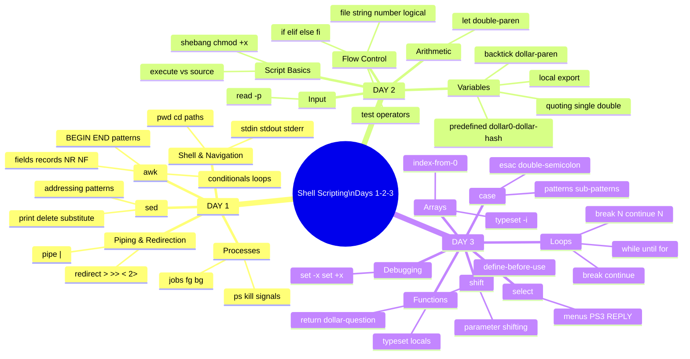

# 🐚 Shell Scripting — Master Revision Guide
**ITI Open Source Track · Days 1 → 2 → 3 · Complete Reference**

> **How to use this file:**
> - Each topic has a **📋 Summary Card** (quick lookup) followed by a **🔬 Deep Dive** (full explanation + progressive examples)
> - **🔗 Cross-Day Links** show exactly where a Day-1 concept resurfaces in Day-2 or Day-3
> - **⚠️ Gotcha boxes** highlight the traps that catch people in exams and real scripts
> - Labs are solved at the end with full walkthrough explanations

---

## 🗺️ Master Topic Map



---

# 📘 PART 1 — DAY 1

---

## 1.1 · The Shell & Linux Directory Structure

### 📋 Summary Card

| Concept | What it is | Key command |
|---|---|---|
| Shell | Interpreter between you and the OS | `bash`, `ksh`, `sh` |
| Root | Top of the filesystem tree | `/` |
| `pwd` | Print current path | `pwd` → `/home/ali` |
| `cd` | Change directory | `cd /etc` |
| `~` | Your home directory shortcut | `cd ~` = go home |
| `..` | Parent directory | `cd ..` = go up one |

### 🔬 Deep Dive

The shell is the **middleman** — you type, it translates, Linux acts. Every command you type goes through it.

**The filesystem tree** (everything hangs from `/`):
```
/
├── bin/     → Essential programs: ls, cp, mv, cat, grep
├── etc/     → Config files: /etc/passwd, /etc/group
├── home/    → User directories: /home/ali, /home/mona
├── root/    → Admin's home
├── tmp/     → Temporary files (cleared on reboot)
├── var/     → Variable data: logs, mail (/var/mail/)
├── usr/bin/ → More programs
└── proc/    → Virtual filesystem — running processes info
```

**Progressive Navigation Examples:**
```bash
# Level 1: Where am I?
pwd                      # /home/ali

# Level 2: Move around
cd /etc                  # absolute path (starts with /)
cd Documents             # relative path (from current location)
cd ..                    # up one level
cd ../..                 # up two levels
cd ~                     # home
cd -                     # previous directory (toggle back!)

# Level 3: Jump sideways
cd ../mona               # go up then into sibling folder

# Level 4: Complex navigation
cd /var/log/../mail      # /var/log/../mail = /var/mail
```

> ⚠️ **Gotcha:** `cd foldername` is relative — it only works if `foldername` exists in your CURRENT directory. Use absolute paths (`/full/path`) to be safe.

---

## 1.2 · stdin, stdout, stderr

### 📋 Summary Card

| Stream | fd | Default | Symbol |
|---|---|---|---|
| stdin | 0 | Keyboard | `<` or `0<` |
| stdout | 1 | Screen | `>` or `1>` |
| stderr | 2 | Screen | `2>` |

### 🔬 Deep Dive

Every process has three open "channels" at birth:

```
Keyboard ──[0:stdin]──→ PROCESS ──[1:stdout]──→ Screen
                             └──[2:stderr]──→ Screen
```

**Redirection — bending those channels:**

```bash
# ──── OUTPUT REDIRECTION ────
ls -l > list.txt          # stdout → file (OVERWRITES)
ls -l >> list.txt         # stdout → file (APPENDS)
ls 1> list.txt            # same as above (explicit fd)

# ──── ERROR REDIRECTION ────
ls /fake 2> errors.txt    # stderr → file
ls /fake 2>/dev/null      # stderr → trash (silence errors)

# ──── INPUT REDIRECTION ────
wc -l < myfile.txt        # stdin ← file (instead of keyboard)
mail user@host < letter   # stdin ← letter file  ← used in Lab 3!

# ──── COMBINE BOTH ────
ls /etc /fake > out.txt 2>&1      # stdout+stderr → same file
ls /etc /fake &> out.txt          # bash shorthand for same thing
```

**Progressive examples:**
```bash
# Simple: count lines in a file
wc -l < /etc/passwd           # how many users?

# Redirect a command's output and errors separately
find / -name "*.conf" > found.txt 2> errors.txt

# The heredoc — provide multi-line stdin inline
mail -s "Hello" ali <<'EOF'
Hi Ali,
This is an automated message.
Regards, Admin
EOF
# ↑ Used in Lab 3 chkmail bonus!
```

> ⚠️ **Gotcha:** `>` OVERWRITES the file — all previous content is lost! Use `>>` to append. To be safe: always check if the file already exists before redirecting to it.

> ⚠️ **Gotcha:** `2>&1` must come AFTER the filename: `cmd > file 2>&1` ✅ NOT `cmd 2>&1 > file` ❌ (that would redirect stderr to the old stdout before the redirect)

---

## 1.3 · Piping (`|`)

### 📋 Summary Card

```
command1 | command2 | command3
stdout of cmd1 → stdin of cmd2 → stdin of cmd3
```

**Key difference from redirection:** Pipe connects **commands to commands**. Redirection connects **commands to files**.

### 🔬 Deep Dive

The pipe is a real-time data tunnel between processes.

```bash
# Level 1: Two commands
who | wc -l              # how many users are logged in?
cat /etc/passwd | grep root    # lines containing "root"

# Level 2: Three commands
ps -ef | grep bash | wc -l    # how many bash processes?
# ps lists all → grep keeps bash lines → wc counts them

# Level 3: Chains used in later scripts
cat /etc/passwd | cut -d: -f1            # get all usernames → used in mymail (Lab 3)!
cat /etc/passwd | cut -d: -f1 | sort     # sorted usernames
cat /etc/passwd | cut -d: -f7 | sort | uniq  # unique shells used

# Level 4: Pipe to/from file tools
find ~/ -name "*.sh" | xargs chmod +x   # make all scripts executable
ls -la | awk '{print $9, $5}'            # filename + size using Day-1 awk
```

**The `cut` command** (critical for Lab 3 `mymail`):
```bash
cut -d: -f1 /etc/passwd    # delimiter=: field=1 (username)
cut -d: -f3 /etc/passwd    # field 3 (uid)
cut -d: -f1,6 /etc/passwd  # fields 1 and 6
```

> ⚠️ **Gotcha:** Pipes create subshells! Variables set inside a pipe are lost afterward:
> ```bash
> echo "hello" | read myvar   # myvar is set in subshell, GONE after
> echo $myvar                  # empty!
> # Fix: use process substitution or redirection instead
> ```

---

## 1.4 · Processes & Job Management

### 📋 Summary Card

| Command | What it does |
|---|---|
| `ps` | Show YOUR processes |
| `ps -ef` | Show ALL processes (full detail) |
| `pgrep name` | Find PID by name |
| `kill PID` | Send SIGTERM (polite stop) |
| `kill -9 PID` | Send SIGKILL (force kill) |
| `jobs` | List background jobs |
| `fg %N` | Bring job N to foreground |
| `bg %N` | Send job N to background |
| `command &` | Run command in background |

### 🔬 Deep Dive

**What ps -ef shows:**
```
UID    PID   PPID  C  STIME  TTY   TIME     CMD
root    1      0   0  09:00  ?     0:01   /sbin/init
ali   4521   4520  0  10:15  pts/0 0:00   bash
ali   4598   4521  0  10:20  pts/0 0:00   ps -ef
 │     │      │
 │     │      └── PPID: Parent PID (4521=bash created ps)
 │     └── PID: unique process ID
 └── who owns this process
```

**Signals — the messages you send to processes:**

```bash
kill -15 PID   # SIGTERM: "Please stop gracefully" (DEFAULT)
kill -9  PID   # SIGKILL: "Die NOW" — cannot be caught/ignored
kill -STOP PID # Pause/freeze the process
kill -CONT PID # Resume a stopped process

# By name (no need to find PID first):
pkill firefox
pkill -9 firefox
```

**Background & foreground:**
```bash
sleep 1000 &         # run in background → [1] 5432
jobs                 # see: [1]+ Running   sleep 1000 &
fg %1                # bring to foreground
# Ctrl+Z             # pause the foreground job
bg %1                # resume it in background
kill %1              # kill the background job
```

> 🔗 **Appears in Day 3:** `while true; do ... sleep 10; done` — the `sleep` command and background processes power `chkmail` (Lab 3 Ex 6)

> ⚠️ **Gotcha:** `kill %1` kills job #1. `kill 1` kills PID 1 (init/systemd) — don't mix them up!

---

## 1.5 · `sed` — The Stream Editor

### 📋 Summary Card

```bash
sed 'command' file         # apply command to file
sed -n 'command' file      # suppress default output (print only what you ask)
sed -e 'cmd1' -e 'cmd2'    # multiple commands
```

| Operation | Syntax | Example |
|---|---|---|
| Print matching | `-n '/pattern/p'` | `sed -n '/root/p' /etc/passwd` |
| Delete matching | `'/pattern/d'` | `sed '/root/d' /etc/passwd` |
| Delete line N | `'Nd'` | `sed '3d' /etc/passwd` |
| Delete last | `'$d'` | `sed '$d' /etc/passwd` |
| Delete range | `'N,Md'` | `sed '3,7d' /etc/passwd` |
| Substitute | `'s/old/new/g'` | `sed 's/lp/mylp/g' /etc/passwd` |

### 🔬 Deep Dive

`sed` reads a file line-by-line and applies commands. Think of it as a find-replace engine on steroids.

**Addressing — which lines to act on:**
```bash
# No address = every line
sed 's/a/A/g' file           # replace in ALL lines

# Line number address
sed '5s/a/A/g' file          # only line 5
sed '2,8s/a/A/g' file        # lines 2 through 8
sed '2,/stop/s/a/A/g' file   # line 2 until line matching /stop/

# Pattern address
sed '/root/s/bash/sh/g' file # only lines containing "root"

# Last line
sed '$d' file                # delete last line
sed '$s/end/END/' file       # substitute only in last line

# Negation with !
sed '3!d' file               # delete everything EXCEPT line 3
```

**Progressive sed examples:**
```bash
# 1. Simple print
sed -n '/lp/p' /etc/passwd           # Lab 1: print lines with "lp"

# 2. Simple delete
sed '3d' /etc/passwd                 # Lab 1: skip line 3
sed '$d' /etc/passwd                 # Lab 1: skip last line
sed '/lp/d' /etc/passwd              # Lab 1: skip lines with "lp"

# 3. Substitute
sed 's/lp/mylp/g' /etc/passwd        # Lab 1: replace lp with mylp
sed 's/lp/mylp/' /etc/passwd         # replace FIRST occurrence only (no g)
sed -n 's/lp/mylp/gp' /etc/passwd    # replace + print only changed lines

# 4. Multiple operations
sed -e 's/lp/mylp/g' -e 's/root/ROOT/g' /etc/passwd

# 5. In-place edit (write back to file)
sed -i 's/old/new/g' myfile.txt      # modifies the actual file!
```

**Regex essentials for sed:**
```
.       any single character
*       zero or more of preceding
^       start of line
$       end of line
[abc]   character class: a or b or c
[^abc]  NOT a, b, or c
\(  \)  group (for back-references)
\1      back-reference to group 1
```

> ⚠️ **Gotcha:** `sed 's/a/b/'` only replaces the **first** `a` on each line. Add `g` flag for all: `sed 's/a/b/g'`

> ⚠️ **Gotcha:** `sed` doesn't modify the file by default — it just prints. To save: redirect `> newfile` or use `-i` flag.

---

## 1.6 · `awk` — The Data Processor

### 📋 Summary Card

```bash
awk 'pattern { action }' file
awk -F: '{ print $1 }' /etc/passwd    # -F sets field separator
```

| Variable | Meaning |
|---|---|
| `$0` | Whole line |
| `$1,$2...` | Field 1, 2, ... |
| `NF` | Number of fields in current line |
| `NR` | Current line (record) number |
| `FS` | Field separator (default: whitespace) |

| Block | When it runs |
|---|---|
| `BEGIN { }` | Once before any input |
| `{ }` | For every line |
| `END { }` | Once after all input |

### 🔬 Deep Dive

awk reads a file **record by record** (line by line), splits each record into **fields**, and lets you act on them.

```
/etc/passwd line:  ali:x:1001:1001:Ali Hassan:/home/ali:/bin/bash
                    $1 $2  $3   $4      $5         $6        $7
```

**Progressive awk examples:**
```bash
# ── LEVEL 1: Print fields ──
awk -F: '{print $1}' /etc/passwd           # all usernames
awk -F: '{print $1, $6}' /etc/passwd       # username + home dir
awk -F: '{print NR". "$1}' /etc/passwd     # numbered list

# ── LEVEL 2: With conditions ──
awk -F: '{if ($3 > 500) print $1}' /etc/passwd    # users with uid > 500
awk -F: '$3 == 0 {print $1}' /etc/passwd          # root users (uid=0)
awk 'NR>=5 && NR<=15' /etc/passwd                 # lines 5-15

# ── LEVEL 3: BEGIN and END ──
awk -F: 'BEGIN{print "=== Users ==="} {print $1} END{print "Total:", NR}' /etc/passwd

# Sum all UIDs:
awk -F: 'BEGIN{sum=0} {sum+=$3} END{print "Sum:", sum}' /etc/passwd

# ── LEVEL 4: Complex logic ──
# Find user with highest UID:
awk -F: 'BEGIN{max=0} {if($3+0>max){max=$3; line=$0}} END{print line}' /etc/passwd

# Count users per shell:
awk -F: '{shells[$7]++} END{for(s in shells) print shells[s], s}' /etc/passwd

# Replace and print:
awk '{gsub(/lp/, "mylp"); print}' /etc/passwd      # Lab 1 awk bonus

# ── LEVEL 5: Combined with pipes ──
ps -ef | awk '{print $1}' | sort | uniq            # unique users with processes
cat /var/mail/ali | awk '/^From/{print $2}'        # email senders
```

> 🔗 **Appears in Day 3:** `cat /etc/passwd | cut -d: -f1` is the pipe-based equivalent of `awk -F: '{print $1}' /etc/passwd` — both used in `mymail` (Lab 3 Ex 5)

> ⚠️ **Gotcha:** `$3 > 500` does **string comparison** unless awk sees a number. Use `$3+0 > 500` to force numeric comparison.

> ⚠️ **Gotcha:** `print $1, $2` inserts a space between. `print $1 $2` concatenates with NO space. Use `print $1"\t"$2` for a tab.

---

# 📗 PART 2 — DAY 2

---

## 2.1 · Script Basics — Shebang, chmod, Execute vs Source

### 📋 Summary Card

| Concept | Syntax | Notes |
|---|---|---|
| Shebang | `#!/bin/bash` | First line — tells OS which interpreter |
| Make executable | `chmod +x script.sh` | Required before `./script.sh` |
| Execute (child shell) | `./script.sh` | New shell, variables die |
| Source (current shell) | `. ./script.sh` | No new shell, variables survive |

### 🔬 Deep Dive

**The execute vs source distinction is one of the most important concepts in shell scripting.**

```bash
# A script that sets a variable:
cat > test.sh << 'EOF'
#!/bin/bash
city=Cairo
echo "Inside: city=$city"
EOF
chmod +x test.sh
```

**Running with execute (`./`):**
```
Your Shell                Child Shell (new process)
    │                           │
    │   → fork! ────────────────┤
    │                       reads test.sh
    │                       city=Cairo  (lives HERE)
    │                       echo "Inside: city=Cairo"
    │                       ← exits, city GONE
    │
    echo $city       ← EMPTY — city never existed here
```

**Running with source (`. ./`):**
```
Your Shell (no fork!)
    │
    reads test.sh commands one by one
    city=Cairo    ← set RIGHT HERE in your shell
    echo "Inside: city=Cairo"
    │
    echo $city    ← "Cairo" ✅ still here!
```

**When MUST you source?**
- Scripts that use `cd` (like `mycd`) — `cd` only affects the current shell
- Scripts that set environment variables you want to keep
- `.bashrc`, `.profile` — always sourced

> ⚠️ **Gotcha:** `chmod +x` is needed for `./script`, NOT for `. ./script`. Sourcing doesn't require execute permission, just read permission.

---

## 2.2 · Variables — Three Types

### 📋 Summary Card

```bash
name="Ahmed"           # local variable (current shell only)
export name="Ahmed"    # environment variable (current + all children)
echo $name             # use with $
echo ${name}suffix     # {} to isolate variable name
unset name             # delete variable
```

**Special/Predefined Variables:**

| Variable | Meaning | Example |
|---|---|---|
| `$0` | Script name | `./myscript.sh` |
| `$1, $2...` | Positional arguments | `./script arg1 arg2` |
| `$#` | Number of arguments | `3` |
| `$*` | All arguments as one string | `"arg1 arg2 arg3"` |
| `$@` | All arguments as separate strings | `"arg1" "arg2" "arg3"` |
| `$?` | Exit status of last command | `0`=success, nonzero=error |
| `$$` | Current script's PID | `4521` |

### 🔬 Deep Dive

**Local variables:**
```bash
name="Ahmed"         # NO spaces around =
echo $name           # Ahmed
echo "Hello $name"   # Hello Ahmed  (double quotes expand variables)
echo 'Hello $name'   # Hello $name  (single quotes are LITERAL)
```

**The export one-way street:**
```bash
# Parent shell
x=5
export x            # x is now in the environment

# When a child script runs, it SEES x=5
# But if the child CHANGES x, the parent NEVER sees that change
# Variables only flow DOWN (parent → child), never UP (child → parent)
```

**Quoting rules:**
```bash
# Single quotes — absolutely literal
echo '$HOME'         # $HOME (no expansion)
echo 'It'\''s fine'  # It's fine (escaped single quote trick)

# Double quotes — expands variables and $() but nothing else
echo "$HOME"         # /home/ali
echo "Today: $(date)"   # Today: Thu Jan 9 ...

# Backticks — same as $() but older style
echo "Today: `date`"    # same result

# No quotes — word splitting happens!
file="my file.txt"
cat $file            # WRONG: cat sees "my" and "file.txt" as two args
cat "$file"          # CORRECT: cat sees one argument
```

**Variable substitution tricks:**
```bash
name="Ahmed"
echo ${#name}            # 5 (length of string)
echo ${name:0:3}         # Ahm (substring: start=0, length=3)
echo ${name:-default}    # "Ahmed" (if set), "default" (if unset/empty)
echo ${name:=default}    # set name to "default" if unset, return it

# Used in Day 3 myls deep dive:
echo ${@: -1}            # last argument
echo ${@:1:$#-1}         # all args except last
```

> ⚠️ **Gotcha:** `name = "Ahmed"` (with spaces) is NOT a variable assignment — bash tries to run a command called `name`! Always: `name="Ahmed"` (no spaces).

> 🔗 **Day 3 connection:** `$1 $2 $# $*` are all used with `shift` (Day 3) to walk through arguments one by one.

---

## 2.3 · Arithmetic

### 📋 Summary Card

```bash
let "x = 5 + 3"          # let: spaces OK inside quotes
((x = 5 + 3))            # (( )): C-style arithmetic
echo $((5 + 3))          # inline arithmetic in string
let x=$x+1               # increment
```

### 🔬 Deep Dive

```bash
# Method 1: let
let "result = 10 + 5"
let "result = $a * $b"
let x=$x+1                # increment (no spaces needed here)
let "x += 1"              # C-style shorthand

# Method 2: (( )) — most readable
((result = 10 + 5))
((x++))                   # increment
((x--))                   # decrement
((x += 5))                # add 5

# Method 3: $(( )) — inline result
echo $((10 + 5))          # 15
result=$((a * b))         # store result

# All arithmetic operators:
# +  -  *  /  %  **
((x = 10 % 3))            # 1 (modulo)
((x = 2 ** 8))            # 256 (power)
```

**In loops (Day 3 connection):**
```bash
# Counter loop — classic pattern
i=0
while [ $i -lt 10 ]
do
  echo $i
  let i=$i+1     # or: ((i++))
done
```

> ⚠️ **Gotcha:** `echo $((10/3))` gives `3` (integer division — decimal truncated). There's no floating point in bash arithmetic. Use `bc` for decimals: `echo "scale=2; 10/3" | bc`

> ⚠️ **Gotcha:** `x=5+3` sets x to the STRING "5+3", not 8! You must use `let` or `(( ))`.

---

## 2.4 · Reading User Input

### 📋 Summary Card

```bash
read varname                    # read from keyboard into varname
read -p "Enter name: " name     # prompt + read
read var1 var2 var3             # read multiple words
```

### 🔬 Deep Dive

```bash
# Basic read
echo "What is your name?"
read name
echo "Hello, $name!"

# With prompt (no separate echo needed)
read -p "Enter your age: " age
echo "You are $age years old"

# Read multiple variables — words split by spaces
read first last
# User types: Ahmed Hassan
echo "First: $first"   # Ahmed
echo "Last: $last"     # Hassan

# Read with timeout
read -t 5 answer       # wait 5 seconds, then continue
if [ $? -ne 0 ]; then
  echo "Timeout!"
fi

# Read silently (for passwords)
read -s password       # user types but nothing shows on screen
```

**Used throughout Day 3 labs:**
```bash
read count    # Ex 9: how many array elements
read num      # Ex 10: numbers for average
read char     # Ex 1: single character for mycase
```

---

## 2.5 · Flow Control — if / elif / else

### 📋 Summary Card

```bash
if [ condition ]
then
  commands
elif [ condition ]
then
  commands
else
  commands
fi
```

### 🔬 Deep Dive

**Level 1 — Simple if:**
```bash
if [ -f "/etc/passwd" ]
then
  echo "File exists"
fi
```

**Level 2 — if/else:**
```bash
if [ $age -ge 18 ]
then
  echo "Adult"
else
  echo "Minor"
fi
```

**Level 3 — if/elif chain:**
```bash
if [ $score -ge 90 ]
then echo "A"
elif [ $score -ge 80 ]
then echo "B"
elif [ $score -ge 70 ]
then echo "C"
else echo "F"
fi
```

**Level 4 — Nested if:**
```bash
if [ -f "$file" ]
then
  if [ -r "$file" ]
  then
    echo "File exists and is readable"
  else
    echo "File exists but NOT readable"
  fi
fi
```

> 🔗 **Day 3 connection:** `if/elif` is used INSIDE `for`, `while`, and function bodies throughout Day 3.

---

## 2.6 · Test Operators — The Complete Reference

### 📋 Summary Card

**File tests:**
| Operator | True when... |
|---|---|
| `-f file` | file is a regular file |
| `-d file` | file is a directory |
| `-e file` | file exists (any type) |
| `-r file` | file is readable |
| `-w file` | file is writable |
| `-x file` | file is executable |
| `-s file` | file is non-empty (size > 0) |
| `-h file` | file is a symbolic link |

**String tests:**
| Operator | True when... |
|---|---|
| `"$a" = "$b"` | strings are equal |
| `"$a" != "$b"` | strings are NOT equal |
| `-z "$a"` | string is empty (zero length) |
| `-n "$a"` | string is non-empty |

**Number tests:**
| Operator | Meaning |
|---|---|
| `-eq` | equal to |
| `-ne` | not equal |
| `-gt` | greater than |
| `-lt` | less than |
| `-ge` | greater or equal |
| `-le` | less or equal |

**Logical operators:**
```bash
[ cond1 -a cond2 ]   # AND
[ cond1 -o cond2 ]   # OR
[ ! cond ]           # NOT
```

### 🔬 Deep Dive

```bash
# ── FILE TESTS ──
if [ -f "$1" ]; then echo "Regular file"; fi
if [ -d "$1" ]; then echo "Directory"; fi
if [ ! -e "$file" ]; then echo "Doesn't exist"; exit 1; fi
if [ -s "$file" ]; then echo "File has content"; fi

# ── STRING TESTS ──
if [ -z "$name" ]; then echo "Name is empty"; fi
if [ -n "$name" ]; then echo "Name is set"; fi
if [ "$name" = "root" ]; then echo "You're root!"; fi

# ── NUMBER TESTS ──
if [ $count -eq 0 ]; then echo "Nothing to process"; fi
if [ $age -gt 18 ]; then echo "Adult"; fi
if [ $# -ne 2 ]; then echo "Need exactly 2 args"; exit 1; fi

# ── COMPOUND CONDITIONS ──
if [ -f "$file" -a -r "$file" ]
then echo "File exists and is readable"
fi

if [ $x -lt 0 -o $x -gt 100 ]
then echo "Out of range!"
fi

# ── COMMON PATTERNS ──
# Check argument count:
if [ $# -eq 0 ]
then echo "Usage: $0 <filename>"; exit 1
fi

# Check directory exists, create if not:
if [ ! -d "$BACKUP_DIR" ]
then mkdir "$BACKUP_DIR"
fi
```

> ⚠️ **Gotcha:** ALWAYS quote string variables in tests: `[ "$var" = "value" ]`. Without quotes, if `$var` is empty, bash sees `[ = "value" ]` which is a syntax error.

> ⚠️ **Gotcha:** Use `-eq` for numbers, `=` for strings. `[ "10" -eq "010" ]` is TRUE (numeric). `[ "10" = "010" ]` is FALSE (string).

---

# 📙 PART 3 — DAY 3

---

## 3.1 · The `case` Command

### 📋 Summary Card

```bash
case $var in
  pattern1) commands ;; 
  pattern2) commands ;;
  p1|p2)    commands ;;   # OR patterns
  *)        default  ;;   # catch-all
esac
```

**Why use `case` over `if/elif`?**
- Cleaner when comparing one variable against many fixed values
- Supports powerful glob patterns (`*`, `?`, `[abc]`, `@()`, etc.)
- Easier to read when there are 3+ branches

### 🔬 Deep Dive

**Level 1 — Basic case:**
```bash
echo "Enter day number:"
read day
case $day in
  1) echo "Monday" ;;
  2) echo "Tuesday" ;;
  3) echo "Wednesday" ;;
  *) echo "Other" ;;
esac
```

**Level 2 — OR patterns with `|`:**
```bash
case $day in
  1|2|3|4|5) echo "Weekday" ;;
  6|7)       echo "Weekend!" ;;
  *)         echo "Invalid" ;;
esac
```

**Level 3 — Character class patterns:**
```bash
case $char in
  [a-z])  echo "lowercase" ;;
  [A-Z])  echo "uppercase" ;;
  [0-9])  echo "digit" ;;
  *)      echo "special or empty" ;;
esac
```

**Level 4 — Extended glob sub-patterns:**
```bash
# @(pattern) = exactly ONE match
case $var in
  @([a-z]))   echo "Single lowercase" ;;  # only a,b,c...z
  @([A-Z]))   echo "Single uppercase" ;;
  @([0-9]))   echo "Single digit" ;;
  "")         echo "Empty" ;;
esac

# *(pattern) = zero or more
case $var in
  *([0-9]))   echo "All digits (any length)" ;;   # "", "5", "123"
esac

# +(pattern) = one or more
case $var in
  +([0-9]))   echo "Non-empty all-digits string" ;; # "5", "123" not ""
esac
```

**The 5 sub-pattern operators:**
| Operator | Meaning | Matches | Does NOT match |
|---|---|---|---|
| `?(p)` | 0 or 1 of p | `""`, `"a"` | `"aa"` |
| `*(p)` | 0 or more of p | `""`, `"a"`, `"aaa"` | - |
| `@(p)` | Exactly 1 of p | `"a"` | `""`, `"aa"` |
| `+(p)` | 1 or more of p | `"a"`, `"aaa"` | `""` |
| `!(p)` | Anything except p | everything else | p itself |

> ⚠️ **Gotcha:** `;;` is REQUIRED after each block. Without it, execution falls through to the next case (unlike switch in other languages where you need `break`).

> ⚠️ **Gotcha:** `esac` (case backwards) closes the statement. `fi` closes `if`. Never mix them up.

> 🔗 **Appears in:** `case` directly powers Lab 3 Ex 1 (mycase), Ex 2, Ex 7 (output analysis), and the `select` menu exercises.

---

## 3.2 · `while` Loop

### 📋 Summary Card

```bash
while [ condition ]   # or: while command
do
  commands
done
```
Loops as long as condition is **TRUE**.

### 🔬 Deep Dive

```bash
# ── LEVEL 1: Count ──
num=0
while [ $num -lt 10 ]
do
  echo $num
  let num=$num+1
done
# Output: 0 1 2 3 4 5 6 7 8 9

# ── LEVEL 2: User input loop ──
echo "Guess my name:"
read ans
while [ "$ans" != "sherine" ]
do
  echo "Wrong! Try again:"
  read ans
done
echo "Correct!"

# ── LEVEL 3: Process all arguments with shift ──
while [ $# -gt 0 ]    # while there are arguments left
do
  echo "Processing: $1"
  shift               # drop $1, move everything left
done

# ── LEVEL 4: Monitor loop (used in chkmail Lab 3) ──
LAST_SIZE=0
while true
do
  CURRENT=$(wc -c < /var/mail/$USER)
  if [ $CURRENT -gt $LAST_SIZE ]
  then
    echo "New mail!"
    LAST_SIZE=$CURRENT
  fi
  sleep 10
done

# ── LEVEL 5: Array filling (Lab 3 Ex 9) ──
i=0
while [ $i -lt $count ]
do
  read arr[$i]
  let i=$i+1
done
```

> ⚠️ **Gotcha:** `while true` runs forever. Always have an exit plan: `break` on a condition, or let the user press Ctrl+C.

> 🔗 **Cross-day:** `while [ $# -gt 0 ]` uses `$#` from Day 2 predefined variables, combined with `shift` (new in Day 3).

---

## 3.3 · `until` Loop

### 📋 Summary Card

```bash
until [ condition ]   # opposite of while
do
  commands
done
```
Loops until condition becomes **TRUE** (runs while condition is FALSE).

### 🔬 Deep Dive

`while` and `until` are exact opposites:
```bash
# These DO THE SAME THING:
while [ $i -lt 10 ]; do echo $i; let i++; done
until [ $i -ge 10 ]; do echo $i; let i++; done

# ── Real use case: wait for something to exist ──
until [ -f "/tmp/ready.flag" ]
do
  echo "Waiting for flag file..."
  sleep 2
done
echo "Flag found, proceeding!"

# ── Lecture example: greetings by hour ──
hour=1
until [ $hour -gt 24 ]
do
  case $hour in
    [0-9]|1[0-1]) echo "Good morning" ;;
    12)           echo "Lunch time" ;;
    1[3-7])       echo "Work time" ;;
    *)            echo "Good Night" ;;
  esac
  let hour=$hour+1
done
```

> 💡 **Rule of thumb:** Use `until` when your exit condition is the "success" state. Use `while` when your exit condition is "something went wrong / limit reached".

---

## 3.4 · `for` Loop

### 📋 Summary Card

```bash
for variable in item1 item2 item3
do
  commands
done
```
Iterates over a **fixed list** of items.

### 🔬 Deep Dive

```bash
# ── LEVEL 1: Static list ──
for name in Ahmed Mona Ali
do
  echo "Hello $name"
done

# ── LEVEL 2: Files with glob ──
for file in ~/*           # all items in home dir
do
  if [ -f "$file" ]; then
    echo "File: $file"
  fi
done

# ── LEVEL 3: Command output as list ──
for user in $(cat /etc/passwd | cut -d: -f1)    # Lab 3 Ex 5!
do
  mail -s "Message" "$user" < mtemplate
done

# ── LEVEL 4: Number range ──
for i in $(seq 1 10)
do
  echo "Number $i"
done

# ── LEVEL 5: All args except last ──
# (from myls deep dive, Day 2)
for flag in "${@:1:$#-1}"
do
  echo "Flag: $flag"
done
```

**for vs while vs until — decision guide:**
```
Have a fixed LIST of things to iterate? → for
Loop while condition is TRUE?           → while
Loop until condition becomes TRUE?      → until
Don't know how many iterations?         → while/until
```

---

## 3.5 · `select` — Interactive Menus

### 📋 Summary Card

```bash
PS3="Your prompt: "          # set the prompt (default is #?)
select var in option1 option2 option3
do
  case $var in
    option1) commands ;;
    *)       echo "Invalid: $REPLY" ;;
  esac
done
```

- `select` **auto-numbers** and displays the options
- User types a **number**, `$var` gets the matching word
- `$REPLY` holds the raw number typed
- Loops until `break`

### 🔬 Deep Dive

```bash
# ── LEVEL 1: Basic forever menu ──
PS3="Pick: "
select choice in Apple Banana Cherry
do
  echo "You picked: $choice (number $REPLY)"
done
# Keeps looping, never exits

# ── LEVEL 2: Menu with valid exit ──
PS3="Choose: "
select choice in "ls" "ls -a" "exit"
do
  case $choice in
    "ls")    ls ;;
    "ls -a") ls -a ;;
    "exit")  break ;;
    *)       echo "Invalid: $REPLY" ;;
  esac
done

# ── LEVEL 3: Menu with error handling ──
PS3="Enter option number: "
select choice in Ahmed Adel Tamer
do
  case $choice in
    Ahmed) echo "Ahmed is good"; break ;;
    Adel)  echo "Adel is best"; break ;;
    Tamer) echo "Tamer..."; break ;;
    *)     echo "$REPLY is not valid. Try again." ;;
           # No break here — menu shows again
  esac
done

# What select output looks like:
# 1) Ahmed
# 2) Adel
# 3) Tamer
# Enter option number: 1
# Ahmed is good
```

> ⚠️ **Gotcha:** If the user enters an invalid number, `$choice` is EMPTY and `$REPLY` has what they typed. Always handle the `*)` case.

> ⚠️ **Gotcha:** Without `break`, `select` loops forever showing the menu. This is intentional for persistent menus, but you must `break` to exit.

---

## 3.6 · `shift` — Parameter Shifting

### 📋 Summary Card

```bash
shift          # drop $1, everything moves left, $# decreases by 1
shift N        # drop N arguments from the left
```
`$0` (script name) is never affected by shift.

### 🔬 Deep Dive

**Visual:** Think of arguments as a queue. `shift` removes the front:
```
Before:  $1=a  $2=b  $3=c  $4=d   ($#=4)
shift    →
After:   $1=b  $2=c  $3=d         ($#=3)
shift 2  →
After:   $1=d                      ($#=1)
```

**Classic pattern — walk through all args:**
```bash
#!/bin/bash
while [ $# -gt 0 ]
do
  echo "Arg: $1"       # always process $1
  shift                 # drop $1, next arg becomes $1
done

# ./script a b c d
# Arg: a
# Arg: b
# Arg: c
# Arg: d
```

**Real-world use — option parsing:**
```bash
#!/bin/bash
verbose=0
output="default.txt"

while [ $# -gt 0 ]
do
  case $1 in
    -v)        verbose=1 ;;
    -o)        output=$2; shift ;;   # consume the next arg too!
    *)         echo "Unknown option: $1" ;;
  esac
  shift    # always advance
done

echo "Verbose: $verbose"
echo "Output: $output"
```

**The shift print example (from lecture):**
```bash
while (( $# > 0 ))
do
  echo $*     # print all remaining
  shift       # peel off the first
done
# ./doit a b c d e
# a b c d e
# b c d e
# c d e
# d e
# e
```

> ⚠️ **Gotcha:** `shift` with no arguments is `shift 1`. But `shift 0` shifts nothing. And `shift N` when N > $# causes an error.

> 🔗 **Cross-day:** `shift` processes `$1 $2 $# $*` from Day 2. It's the dynamic version of the static `${@:1:$#-1}` from the myls deep dive.

---

## 3.7 · `break` and `continue`

### 📋 Summary Card

```bash
break          # exit the current loop immediately
break N        # exit N levels of nested loops
continue       # skip rest of this iteration, go to next
continue N     # skip up to Nth-level loop's next iteration
```

### 🔬 Deep Dive

**`break` — the emergency exit:**
```bash
# ── LEVEL 1: Exit when condition met ──
while true
do
  read answer
  if [ "$answer" = "quit" ]
  then break
  fi
  echo "You said: $answer"
done
echo "Loop exited"   # this runs after break

# ── LEVEL 2: break N for nested loops ──
for i in 1 2 3
do
  for j in a b c
  do
    if [ "$i" = "2" -a "$j" = "b" ]
    then
      echo "Breaking out of BOTH loops!"
      break 2          # exits BOTH for loops
    fi
    echo "$i$j"
  done
done
echo "After both loops"
# Output: 1a 1b 1c 2a  (then breaks)
```

**`continue` — skip this iteration:**
```bash
# ── LEVEL 1: Skip one item ──
for name in Ali root Mona root Ahmed
do
  if [ "$name" = "root" ]
  then
    continue          # skip, go to next name
  fi
  echo "Hello $name"
done
# Hello Ali
# Hello Mona
# Hello Ahmed

# ── LEVEL 2: continue N ──
for i in 1 2 3
do
  for j in a b c
  do
    if [ "$j" = "b" ]
    then
      continue 2      # skip to next iteration of OUTER for loop
    fi
    echo "$i$j"
  done
done
# Output: 1a  2a  3a  (b always skipped, c never reached)
```

**The full nested loops example from the lecture (annotated):**
```bash
#!/bin/bash
while true                          # Loop L1
do
  for user in Ahmed Tamer Samy      # Loop L2
  do
    if [ "$user" = "Tamer" ]
    then
      echo "Hi from Tamer"
      continue                      # → next L2 iteration (next user)
    fi

    while true                      # Loop L3
    do
      if [ "$user" = "Samy" ]
      then
        echo "Hi from Samy"
        break 3                     # → EXIT L3, L2, AND L1
      fi
      echo "Hi from Ahmed"
      continue 2                    # → next L2 iteration
    done
  done
done
echo "Out of all loops"

# Execution trace:
# user=Ahmed → L3 → "Hi from Ahmed" → continue 2 → next L2 iteration
# user=Tamer → "Hi from Tamer" → continue → next L2 iteration
# user=Samy  → L3 → "Hi from Samy" → break 3 → ALL DONE
# "Out of all loops"
```

> ⚠️ **Gotcha:** `break` exits the LOOP, not the script. Code after `done` still runs. To exit the script, use `exit N`.

---

## 3.8 · Arrays

### 📋 Summary Card

```bash
arr[0]="value"           # set element
arr[0]="val0"; arr[5]="val5"   # sparse OK — gaps allowed
echo ${arr[0]}           # get element 0
echo ${arr[@]}           # ALL elements
echo ${arr[*]}           # ALL elements (same)
echo ${#arr[@]}          # COUNT of elements
unset arr[2]             # delete element 2
typeset -i arr[10]       # integer array of 10 elements
```

### 🔬 Deep Dive

**Arrays are like numbered parking lots.** Spot 0 is the first spot. You can leave spots empty (sparse arrays).

```bash
# ── Setting values ──
arr[0]="ahmed"
arr[1]="ali"
arr[2]="mohamed"
# or all at once (bash):
arr=("ahmed" "ali" "mohamed")

# ── Reading values ──
echo ${arr[0]}           # ahmed
echo ${arr[1]}           # ali
echo ${arr[@]}           # ahmed ali mohamed  (all)
echo ${#arr[@]}          # 3  (count)

# ── Looping through array ──
i=0
while [ $i -lt ${#arr[@]} ]
do
  echo "arr[$i] = ${arr[$i]}"
  let i=$i+1
done

# ── Integer arrays ──
typeset -i nums[3]
nums[0]=10
nums[1]=20
nums[2]=30
# nums[0]="hello"   ← ERROR: bad number
echo ${nums[@]}      # 10 20 30
echo ${#nums[@]}     # 3

# ── Used in Lab 3 Ex 9 (myarr) ──
echo "How many elements?"
read count
i=0
while [ $i -lt $count ]
do
  echo "Enter element $i:"
  read arr[$i]
  let i=$i+1
done
echo "Your array: ${arr[@]}"

# ── Used in Lab 3 Ex 10 (myavg) ──
sum=0
i=0
while [ $i -lt ${#nums[@]} ]
do
  let sum=$sum+${nums[$i]}
  let i=$i+1
done
avg=$((sum / ${#nums[@]}))
echo "Average: $avg"
```

> ⚠️ **Gotcha:** Index starts at **0**, not 1! `${arr[0]}` is the first element.

> ⚠️ **Gotcha:** `${arr}` (without index) is the same as `${arr[0]}`. Always specify the index or use `[@]`/`[*]` for all.

> ⚠️ **Gotcha:** `${arr[*]}` expands to one string when double-quoted. `${arr[@]}` expands to separate strings. Use `[@]` in loops.

---

## 3.9 · Functions

### 📋 Summary Card

```bash
# Define
function myname {
  commands
}
# OR:
myname() { commands; }

# Call
myname arg1 arg2

# Inside function:
$1, $2   ← function's own arguments (NOT the script's)
typeset localvar   ← local variable
return N           ← exit status 0-255
```

### 🔬 Deep Dive

**Functions are reusable code blocks.** Define once, call many times.

```bash
# ── LEVEL 1: Simple function ──
function greet {
  echo "Hello, $1!"
}
greet "Ahmed"    # Hello, Ahmed!
greet "Mona"     # Hello, Mona!

# ── LEVEL 2: Function with local variable ──
function add {
  typeset result        # LOCAL — won't leak outside
  (( result = $1 + $2 ))
  echo $result          # "return" via echo
}

sum=$(add 5 3)          # capture output
echo "5 + 3 = $sum"     # 5 + 3 = 8

# ── LEVEL 3: Function using return (0-255 only) ──
function check_age {
  if [ $1 -ge 18 ]
  then return 0          # 0 = success/true in shell
  else return 1          # non-zero = failure/false
  fi
}

check_age 20
if [ $? -eq 0 ]          # $? holds the return value
then echo "Adult"
fi

# ── LEVEL 4: typeset -i for integer return ──
function increment {
  typeset sum
  (( sum = $1 + 1 ))
  return $sum            # works if result ≤ 255
}
increment 5
echo $?                  # 6

# ── LEVEL 5: mysq (Lab 3 Ex 11) ──
function mysq {
  typeset result
  (( result = $1 * $1 ))
  echo $result           # echo because squaring can exceed 255
}

echo "Square of 15 = $(mysq 15)"   # 225
echo "Square of 20 = $(mysq 20)"   # 400 — would fail with return!
```

**Variable scoping rules:**
```bash
x="global"

function test_scope {
  echo "Sees global x: $x"    # functions share parent's variables!
  x="modified"                # CHANGES the global x
}

test_scope
echo "x is now: $x"          # "modified" — function changed it!

# Fix: use typeset to isolate
function safe_scope {
  typeset x                   # local x — shadows global
  x="local only"
  echo "Inside: $x"
}
safe_scope
echo "Still: $x"              # still "modified" — global untouched
```

**ksh command lookup order (important for exam!):**
```
1. Aliases
2. Built-in commands  (cd, echo, read, export...)
3. Functions          ← your functions are here
4. External programs  (/bin/ls, /usr/bin/grep...)
```

> ⚠️ **Gotcha:** Functions MUST be defined BEFORE they are called. Bash reads top-to-bottom.

> ⚠️ **Gotcha:** `return` can only return 0-255. For larger numbers or strings, use `echo` inside the function and capture with `$( )`.

> ⚠️ **Gotcha:** Inside a function, `$1` is the function's first argument, NOT the script's first argument.

---

## 3.10 · Debugging with `set -x`

### 📋 Summary Card

```bash
set -x              # turn ON trace mode
# ... suspect code ...
set +x              # turn OFF trace mode

bash -x script.sh   # trace entire script from command line
ksh -x script.sh    # same for ksh
```

### 🔬 Deep Dive

When tracing is on, every command is printed with `+` before it runs, with variables already expanded.

```bash
#!/bin/bash
name="Ahmed"
set -x
echo "Hello $name"
x=$((5 + 3))
set +x
echo "Done"
```

Output:
```
+ echo 'Hello Ahmed'      ← variable already expanded
Hello Ahmed
+ x=8                     ← arithmetic done
+ set +x                  ← the set +x itself is traced!
Done                      ← this is NOT traced (set +x already ran)
```

**Common debugging workflow:**
```bash
# Option 1: Wrap the buggy section
set -x
# ... the section you're debugging ...
set +x

# Option 2: Run the whole script in trace mode
bash -x ./myscript.sh

# Option 3: Trace + print PID (for parallel script debugging)
bash -x -v ./myscript.sh
```

---

# 🔗 PART 4 — CROSS-DAY CONNECTIONS

This is the most important section for understanding how everything builds together.

```mermaid
flowchart LR
    subgraph D1["📘 Day 1"]
        P[piping |]
        R[redirection < >]
        S[sed]
        A[awk fields NR NF]
        PR[ps kill signals]
    end
    subgraph D2["📗 Day 2"]
        V["$1 $2 $# $* $?"]
        IF[if/elif/else]
        TS[test operators\n-f -d -r -w -x]
        AR[arithmetic let (())]
        RD[read]
        EX[export typeset]
    end
    subgraph D3["📙 Day 3"]
        CS[case patterns]
        LP[for while until]
        SH[shift]
        BR[break continue]
        ARR[arrays]
        FN[functions]
    end

    P -->|"for user in $(cat ...)"| LP
    P -->|"mail user < file"| LP
    R -->|"stdin to mail\ncat < mtemplate"| LP
    A -->|"cut -d: -f1 gives usernames"| LP
    PR -->|"sleep in while loops"| LP
    V -->|"$# used in while cond"| LP
    V -->|"$1 $2 consumed by shift"| SH
    IF -->|"used inside loops"| LP
    IF -->|"replaced by case"| CS
    TS -->|"-f -d inside for loops"| LP
    AR -->|"let i++ inside loops"| LP
    RD -->|"read inside while loops"| LP
    EX -->|"typeset makes locals"| FN
    CS -->|"used inside select"| LP
```

### Complete Cross-Reference Table

| Day 1 Concept | Reused in Day 2 | Reused in Day 3 |
|---|---|---|
| `stdin` (`<`) | `mail user < file` concept | `mail user < mtemplate` in mymail |
| `stdout` (`>`) | `2>/dev/null` in scripts | Backup/redirect in mybackup |
| Piping (`\|`) | `ps -e \| grep name` | `for user in $(cat /etc/passwd \| cut -d: -f1)` |
| `cut -d: -f1` | Used in awk exercises | Used to get usernames in mymail |
| `grep -q` | Mentioned in process checks | Used in string pattern matching |
| `wc -l` / `wc -c` | Counting output | `chkmail` checks file size |
| `sed 's/a/b/g'` | Concept of substitution | `case` does pattern matching on same data |
| `awk '{print $1}'` | Same as `cut -f1` alternative | Usernames for mail loop |
| `ps -ef` | `ps -f` with variables | `who \| grep user` in bonus |
| `sleep N` | Pausing in background | `sleep 10` in chkmail while loop |

| Day 2 Concept | How it's used in Day 3 |
|---|---|
| `$1 $2 $3` | Consumed by `shift` in while loop |
| `$#` | Condition in `while [ $# -gt 0 ]` |
| `$*` | Printed in shift demo `echo $*` |
| `$?` | Captures function `return` value |
| `if/elif/else` | Used inside `for`, `while`, function bodies |
| `-f` file test | `if [ -f "$item" ]` inside for loop (mybackup) |
| `-d` dir test | `if [ ! -d "$BACKUP_DIR" ]` in mybackup |
| `-z` string test | `if [ -z "$str" ]` in mycase enhanced |
| `let` arithmetic | `let i=$i+1` in every loop counter |
| `(( ))` arithmetic | `(( sum = $1 + $2 ))` in functions |
| `read` | `read arr[$i]` inside while loops |
| `typeset` | `typeset localvar` inside functions |
| `export` | Functions can be exported: `export -f funcname` |

---

# 🧪 PART 5 — ALL LAB SOLUTIONS

---

## Lab 1 — sed & awk on /etc/passwd

> `/etc/passwd` format: `login:password:uid:gid:comment:home:shell`

### sed exercises

```bash
# 1. Display lines containing "lp"
sed -n '/lp/p' /etc/passwd

# 2. Display everything EXCEPT line 3
sed '3d' /etc/passwd

# 3. Display everything EXCEPT the last line
sed '$d' /etc/passwd

# 4. Display everything EXCEPT lines containing "lp"
sed '/lp/d' /etc/passwd

# 5. Substitute "lp" with "mylp" everywhere
sed 's/lp/mylp/g' /etc/passwd
```

### awk exercises

```bash
# 1. Print full name (comment field = $5) of all users
awk -F: '{print $5}' /etc/passwd

# 2. Print login, full name, home — with line numbers
awk -F: '{print NR". " $1, $5, $6}' /etc/passwd

# 3. Print login, uid, full name where uid > 500
awk -F: '{if ($3 > 500) print $1, $3, $5}' /etc/passwd

# 4. Print login, uid, full name where uid == 500
awk -F: '{if ($3 == 500) print $1, $3, $5}' /etc/passwd

# 5. Print lines 5 to 15
awk 'NR>=5 && NR<=15' /etc/passwd

# 6. Change "lp" to "mylp" globally
awk '{gsub(/lp/, "mylp"); print}' /etc/passwd

# 7. Print info about user with GREATEST uid
awk -F: 'BEGIN{max=0} {if ($3+0 > max) {max=$3; line=$0}} END{print line}' /etc/passwd

# 8. Sum of all UIDs
awk -F: 'BEGIN{sum=0} {sum+=$3} END{print "Sum:", sum}' /etc/passwd
```

### Bonus

```bash
# Sum of UIDs grouped by GID:
awk -F: '{s[$4]+=$3; c[$4]++} END{for(g in s) print "GID="g" Sum="s[g]" Users="c[g]}' /etc/passwd
```

---

## Lab 2 — Script Writing with Variables & if/elif

### Exercise 1: mygreet

```bash
#!/bin/bash
# mygreet — greet user with name and time of day
read -p "Enter your name: " name
hour=$(date +%H)   # 00-23

if [ $hour -lt 12 ]
then echo "Good morning, $name!"
elif [ $hour -lt 17 ]
then echo "Good afternoon, $name!"
elif [ $hour -lt 21 ]
then echo "Good evening, $name!"
else echo "Good night, $name!"
fi
```

### Exercise 2: pass variables between scripts

```bash
# s1.sh — sets and passes x
x=5
export x          # Way 2: environment
./s2.sh $x        # Way 1: argument

# s2.sh — receives x
# Via argument:   echo "Got via arg: $1"
# Via export:     echo "Got via env: $x"
```

### Exercise 3: mycp

```bash
#!/bin/bash
if [ $# -eq 0 ]; then echo "Usage: mycp src dst"; exit 1; fi
if [ $# -eq 2 ]; then
  cp "$1" "$2" && echo "Copied $1 → $2"
elif [ $# -gt 2 ]; then
  dest="${@: -1}"
  if [ ! -d "$dest" ]; then echo "Last arg must be directory"; exit 1; fi
  for file in "${@:1:$#-1}"; do
    cp "$file" "$dest/" && echo "Copied $file → $dest/"
  done
fi
```

### Exercise 4: mycd

```bash
# Must be SOURCED: . ./mycd
mycd() {
  if [ $# -eq 0 ]; then cd "$HOME"
  elif [ -d "$1" ]; then cd "$1"
  else echo "Not a directory: $1"; return 1
  fi
  echo "Now in: $(pwd)"
}
```

### Exercise 5-6: myls (basic + with options)

```bash
#!/bin/bash
# Basic version
if [ $# -eq 0 ]; then ls .; else ls "$1"; fi

# With getopts:
opts=""
target="."
while getopts "ladiR" flag; do
  case $flag in
    l|a|d|i|R) opts="${opts}$flag" ;;
    ?) echo "Usage: myls [-ladiR] [dir]"; exit 1 ;;
  esac
done
shift $((OPTIND-1))
[ $# -gt 0 ] && target="$1"
[ -n "$opts" ] && ls -${opts} "$target" || ls "$target"
```

### Exercise 7: mytest

```bash
#!/bin/bash
if [ $# -eq 0 ]; then echo "Usage: mytest <file>"; exit 1; fi
target="$1"
if [ ! -e "$target" ]; then echo "Does not exist"; exit 1; fi

if   [ -f "$target" ]; then echo "Regular file"
elif [ -d "$target" ]; then echo "Directory"
elif [ -h "$target" ]; then echo "Symbolic link"
else echo "Other type"; fi

[ -r "$target" ] && echo "Readable: YES"   || echo "Readable: NO"
[ -w "$target" ] && echo "Writable: YES"   || echo "Writable: NO"
[ -x "$target" ] && echo "Executable: YES" || echo "Executable: NO"
```

### Exercise 8: myinfo

```bash
#!/bin/bash
read -p "Enter username: " logname
if ! id "$logname" &>/dev/null; then echo "User not found"; exit 1; fi
echo "=== Identity ===" ; id "$logname"
echo "=== Home Dir ===" ; ls -lah "/home/$logname"
echo "=== Processes ===" ; ps -u "$logname" -f
echo "=== Copying to /tmp ===" 
tmpdir="/tmp/${logname}_$(date +%Y%m%d_%H%M%S)"
mkdir -p "$tmpdir"
cp -r "/home/$logname"/. "$tmpdir"/ 2>/dev/null
echo "Backup at: $tmpdir"
```

---

## Lab 3 — Loops, case, select, Arrays, Functions

### Exercise 1: mycase — single character

```bash
#!/bin/bash
echo "Enter a single character:"
read char
case "$char" in
  "")     echo "Nothing entered" ;;
  [A-Z])  echo "Upper Case" ;;
  [a-z])  echo "Lower Case" ;;
  [0-9])  echo "Number" ;;
  *)      echo "Special character" ;;
esac
```

### Exercise 2: mycase enhanced — string type

```bash
#!/bin/bash
echo "Enter a string:"
read str
if [ -z "$str" ]
then echo "Nothing entered"
elif echo "$str" | grep -q '^[A-Z]*$'
then echo "All Upper Cases"
elif echo "$str" | grep -q '^[a-z]*$'
then echo "All Lower Cases"
elif echo "$str" | grep -q '^[0-9]*$'
then echo "All Numbers"
else echo "Mix"
fi
```

### Exercise 3: mychmod

```bash
#!/bin/bash
for item in ~/*
do
  chmod +x "$item"
  echo "chmod +x: $item"
done
```

### Exercise 4: mybackup

```bash
#!/bin/bash
BACKUP="$HOME/backup"
[ ! -d "$BACKUP" ] && mkdir "$BACKUP"
for item in ~/*
do
  if [ -f "$item" ]
  then
    cp "$item" "$BACKUP/"
    echo "Backed up: $item"
  fi
done
echo "Done! Files in $BACKUP"
```

### Exercise 5: mymail

```bash
#!/bin/bash
TEMPLATE="mtemplate"
[ ! -f "$TEMPLATE" ] && echo "No template file!" && exit 1
for user in $(cat /etc/passwd | cut -d: -f1)
do
  mail -s "System Message" "$user" < "$TEMPLATE"
  echo "Mail sent to: $user"
done
```

### Exercise 6: chkmail

```bash
#!/bin/bash
MAILFILE="/var/mail/$(whoami)"
LAST=0
echo "Watching for mail... (Ctrl+C to stop)"
while true
do
  if [ -f "$MAILFILE" ]
  then
    NOW=$(wc -c < "$MAILFILE")
    if [ $NOW -gt $LAST ]
    then echo "*** NEW MAIL ***"; LAST=$NOW
    else echo "No new mail."
    fi
  fi
  sleep 10
done
```

### Exercise 7: Trace the output

```bash
# The script:
typeset -i n1; typeset -i n2
n1=1; n2=1
while test $n1 -eq $n2   # 1 -eq 1 → TRUE
do
  n2=$n2+1               # typeset -i → ARITHMETIC: n2=2
  print $n1              # prints: 1
  if [ $n1 -gt $n2 ]     # 1 -gt 2 → FALSE
  then break
  else continue          # → jumps back to while condition
  fi
  # UNREACHABLE:
  n1=$n1+1               # never executes
  print $n2              # never executes
done
# Back to while: 1 -eq 2 → FALSE → EXIT loop
```

**Output: `1`**

Key insight: `typeset -i` makes string concatenation into arithmetic. `continue` skips the `n1=$n1+1` line forever.

### Exercise 8: Menu with select and while

```bash
# VERSION 1: select
PS3="Choose (1-3): "
select opt in "ls" "ls -a" "exit"
do
  case $opt in
    "ls")    ls ;;
    "ls -a") ls -a ;;
    "exit")  break ;;
    *)       echo "Invalid: $REPLY" ;;
  esac
done

# VERSION 2: while (manual menu)
while true
do
  echo "1) ls   2) ls -a   3) exit"
  read -p "Choice: " c
  if   [ "$c" = "1" ]; then ls
  elif [ "$c" = "2" ]; then ls -a
  elif [ "$c" = "3" ]; then break
  else echo "Invalid choice"
  fi
done
```

### Exercise 9: myarr

```bash
#!/bin/bash
read -p "How many elements? " count
i=0
while [ $i -lt $count ]
do
  read -p "Element $i: " arr[$i]
  let i=$i+1
done
echo "Array has ${#arr[@]} elements: ${arr[@]}"
i=0
while [ $i -lt ${#arr[@]} ]
do
  echo "  arr[$i] = ${arr[$i]}"
  let i=$i+1
done
```

### Exercise 10: myavg

```bash
#!/bin/bash
read -p "How many numbers? " count
i=0
while [ $i -lt $count ]
do
  read -p "Enter number: " nums[$i]
  let i=$i+1
done
sum=0; i=0
while [ $i -lt ${#nums[@]} ]
do
  let sum=$sum+${nums[$i]}
  let i=$i+1
done
echo "Numbers: ${nums[@]}"
echo "Sum: $sum  Average: $((sum/count))"
```

### Exercise 11: mysq function

```bash
#!/bin/bash
function mysq {
  typeset result
  (( result = $1 * $1 ))
  echo $result         # use echo not return — squares > 255 overflow return!
}
read -p "Enter number: " n
echo "$n² = $(mysq $n)"

# Examples:
echo "5² = $(mysq 5)"    # 25
echo "20² = $(mysq 20)"  # 400  ← would fail with return $result
```

### Bonus: Talk session on login

```bash
#!/bin/bash
TARGET=$1
[ -z "$TARGET" ] && echo "Usage: $0 <username>" && exit 1
echo "Watching for $TARGET to log in..."
while true
do
  if who | grep -q "^$TARGET "
  then
    echo "$TARGET is logged in!"
    write $TARGET <<'EOF'
Hi! Admin wants to talk. Reply with: write $USER
EOF
    break
  fi
  sleep 5
done
```

---

# 📝 PART 6 — MASTER CHEAT SHEET

## Navigation

```bash
pwd              # where am I
cd /path         # go to absolute path
cd relpath       # go to relative path
cd ..            # go up one level
cd ~             # go home
cd -             # go to previous directory
```

## Redirection & Piping

```bash
cmd > file       # stdout to file (overwrite)
cmd >> file      # stdout to file (append)
cmd < file       # stdin from file
cmd 2> file      # stderr to file
cmd 2>/dev/null  # discard stderr
cmd > f 2>&1     # both to file
cmd1 | cmd2      # pipe stdout of cmd1 to stdin of cmd2
```

## sed Quick Reference

```bash
sed -n '/pat/p' f    # print matching lines
sed '/pat/d' f       # delete matching lines
sed 'Nd' f           # delete line N
sed '$d' f           # delete last line
sed 's/a/b/g' f      # substitute all
sed -i 's/a/b/g' f   # in-place substitute
```

## awk Quick Reference

```bash
awk -F: '{print $1}' f         # field 1, delimiter :
awk '{print NR, $0}' f         # with line numbers
awk 'NR>=5 && NR<=10' f        # lines 5-10
awk '{if ($3>500) print}' f    # conditional
awk 'BEGIN{} {} END{}' f       # three phases
awk '{gsub(/a/,"b"); print}'   # global sub
```

## Variables

```bash
x=5              # local
export x=5       # environment
echo $x          # use
echo ${x}suffix  # isolate
unset x          # delete
$0 $1 $2 $# $* $? $$   # special vars
```

## Arithmetic

```bash
let "x=5+3"       # let
((x=5+3))         # (( ))
echo $((5+3))     # inline
((x++))           # increment
```

## Test Operators

```bash
[ -f f ]   [ -d f ]   [ -r f ]   [ -w f ]   [ -x f ]
[ -z "$s" ]  [ -n "$s" ]  [ "$a" = "$b" ]  [ "$a" != "$b" ]
[ $a -eq $b ] [ -gt ] [ -lt ] [ -ge ] [ -le ] [ -ne ]
[ cond1 -a cond2 ]   [ cond1 -o cond2 ]   [ ! cond ]
```

## case

```bash
case $var in
  a|b)   cmd ;; 
  [A-Z]) cmd ;;
  @([0-9])) cmd ;;
  *)     default ;;
esac
```

## Loops

```bash
while [ cond ]; do cmds; done
until [ cond ]; do cmds; done
for v in list; do cmds; done

break      # exit loop
break N    # exit N loops
continue   # next iteration
continue N # skip to Nth loop's next iter
```

## select

```bash
PS3="prompt: "
select v in opt1 opt2
do case $v in opt1) cmd; break ;; esac
done
```

## shift

```bash
shift        # $2→$1, $3→$2 etc, $# decreases
shift N      # shift N times
while [ $# -gt 0 ]; do echo $1; shift; done
```

## Arrays

```bash
a[0]="v"            # set
echo ${a[0]}        # get
echo ${a[@]}        # all
echo ${#a[@]}       # count
typeset -i a[N]     # integer array
```

## Functions

```bash
function name { typeset local; commands; return N; }
name arg1            # call
$(name arg1)         # capture output
$?                   # get return value
```

## Debugging

```bash
set -x       # trace on
set +x       # trace off
bash -x ./s  # trace whole script
```

---

*Shell Scripting Master Revision — ITI Open Source Track · Days 1-2-3*
