# 📚 MEAN Bookstore — Project Map
> ITI Graduation Project | 10-Day Sprint | 4 Members | MongoDB + Express + Angular + Node.js

---

## 🗺 Full Project Mindmap

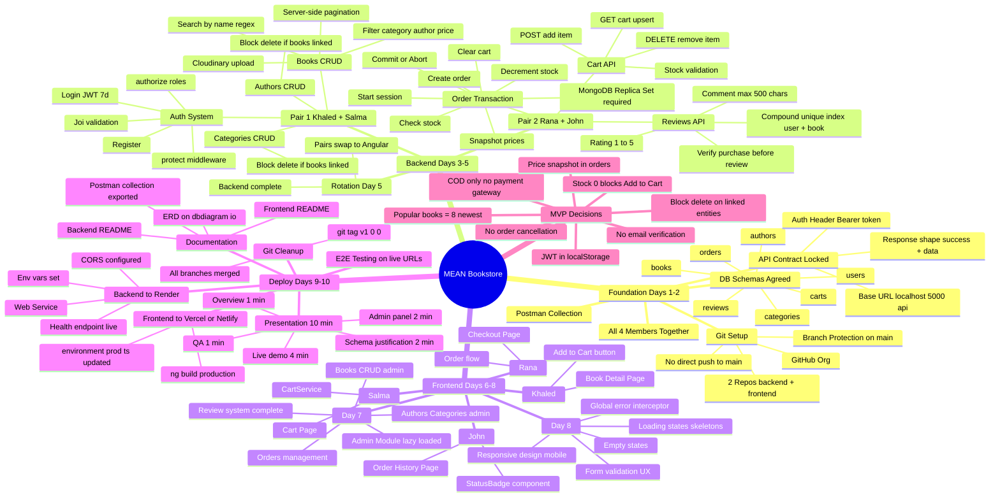

---

## 📅 10-Day Gantt Timeline

```mermaid
gantt
    title MEAN Bookstore — 10-Day Sprint
    dateFormat D
    axisFormat Day %d

    section Foundation
    Day 1 - Setup Git Repos Schemas         :a1, 1, 1d
    Day 2 - Auth System JWT Middleware       :a2, 2, 1d

    section Backend APIs
    Day 3 - Books Categories Authors Cloudinary  :b1, 3, 1d
    Day 4 - Cart Orders Transaction Reviews      :b2, 4, 1d
    Day 5 - Hardening Tests Rotation to Angular  :b3, 5, 1d

    section Frontend Angular
    Day 6 - Shopping Flow Cart Checkout History  :c1, 6, 1d
    Day 7 - Reviews Admin Panel                  :c2, 7, 1d
    Day 8 - Polish Responsive Error Handling     :c3, 8, 1d

    section Deploy and Ship
    Day 9 - Deployment Integration Bug Hunt  :d1, 9, 1d
    Day 10 - Docs Cleanup Presentation Prep  :d2, 10, 1d
```

---

## 👥 Role Assignments

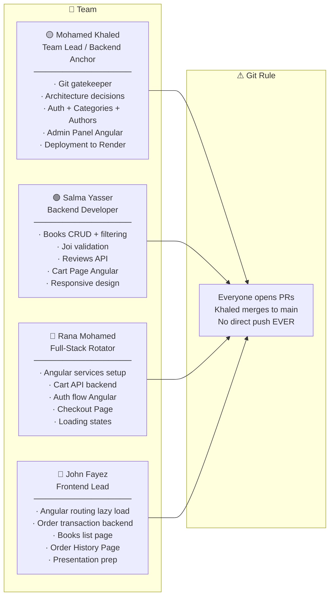

---

## 🏗 System Architecture

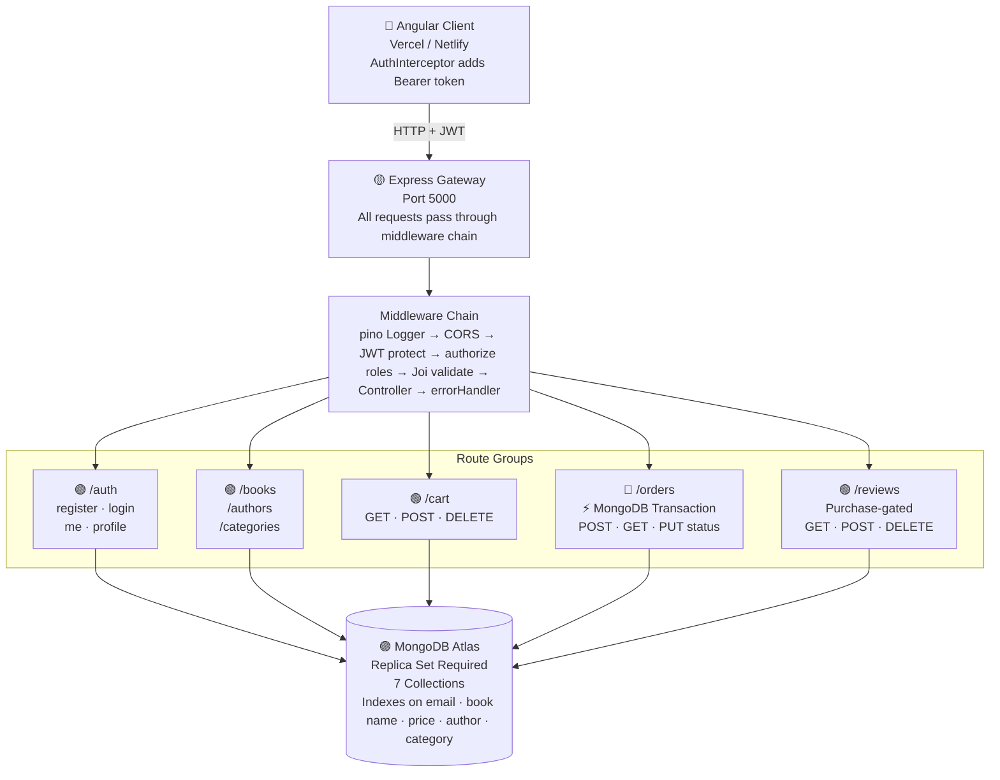

---

## 🔴 Order Transaction — Step by Step

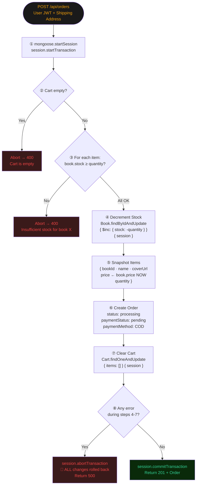

---

## 🗄 Database Schema — ER Diagram

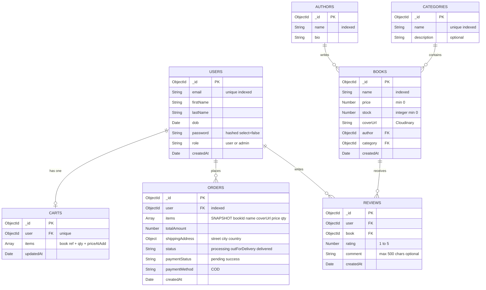

> ⚠ **Critical Design Notes:**
> - `ORDERS.items` is an **embedded snapshot array** — NOT a reference to BOOKS. Price is frozen at purchase time.
> - `REVIEWS` has a **compound unique index** on `(user, book)` — one review per purchase.
> - Before deleting an AUTHOR or CATEGORY, check `Book.exists({ author/category: id })` → return 400 if true.
> - `BOOKS.stock` is only ever decremented **inside a MongoDB transaction** — never directly.

---

## 🌿 Git Workflow

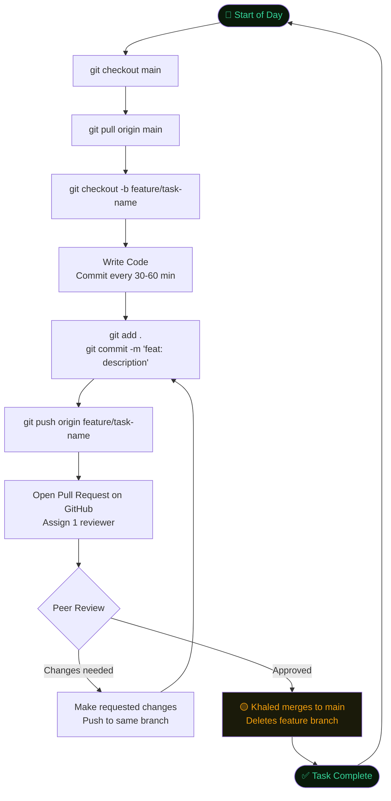

### Commit Message Convention

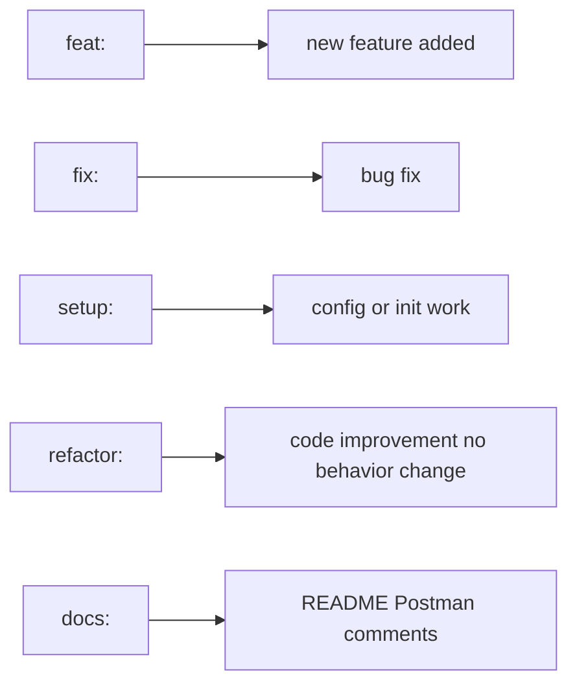

### Branch Naming

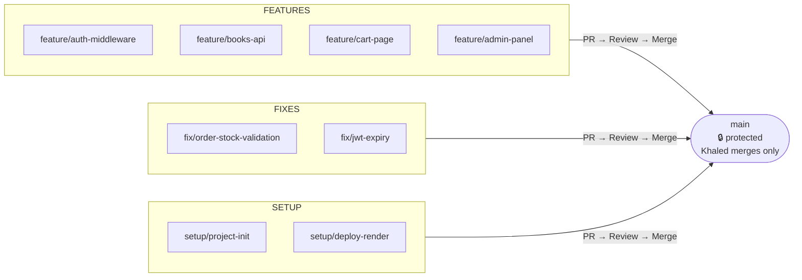

---

## 🔐 Authentication Flow

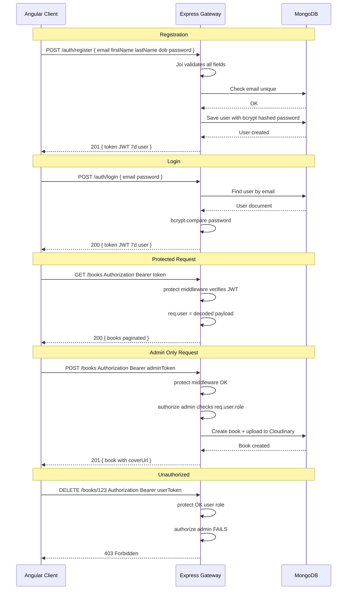

---

## ⚡ API Contract Summary

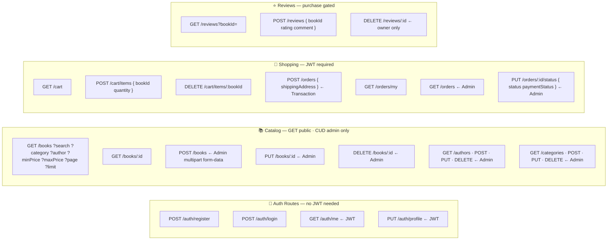

---

## 🚨 Risk Register

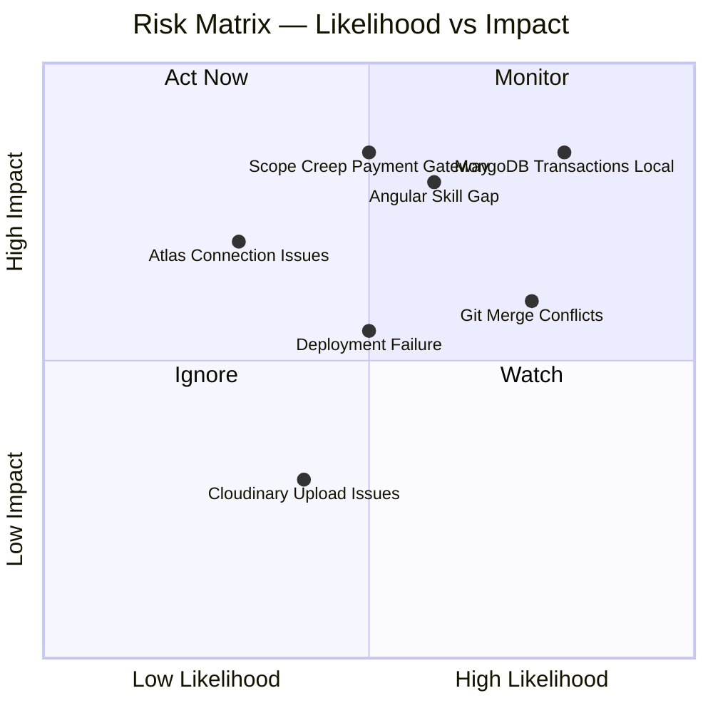

### Mitigations

| Risk | Mitigation |
|---|---|
| MongoDB Transactions fail locally | Switch ALL devs to Atlas immediately. Max 1hr debugging. Khaled resolves Day 4. |
| Git merge conflicts | Strict workflow. Small PRs. Team Lead resolves conflicts via screen share. |
| Angular skill gap | Stronger Angular member unblocks others. Pair programming on Days 6–7. |
| Deployment failure Day 9 | Deploy backend by EOD Day 8 as safety net. Keep CORS permissive initially. |
| Scope creep | Payment gateway and email verification are OUT OF SCOPE. Not negotiable. |

---

## 📋 Day-by-Day Full Task Reference

### Day 1 — Foundation (All 4 Together)
**Goal:** Every member has running environment, agreed schemas, first commit pushed.

| Member | Tasks |
|---|---|
| Khaled | Create GitHub org + 2 repos · Set branch protection · Init backend with all packages · Create folder structure · Share .env.example · Push setup PR |
| Salma | Init Angular project · Install Angular Material · Create folder structure /core /shared /features /admin · Set up environments · Push setup PR |
| Rana | Review all 6 DB schemas with team · Document decisions in repo wiki · Create Mongoose model files (empty shells) |
| John | Set up Postman workspace · Create collection with all endpoint folders · Add env variables for base URL and token · Ensure everyone can access collection |

**DoD:** Backend `/health` returns `{ status: "ok" }` · Angular runs on :4200 · All 4 members made ≥1 commit · Models exist · Postman shared

---

### Day 2 — Auth System
**Goal:** Registration, login, JWT middleware, role-based protection working.

| Member | Tasks |
|---|---|
| Khaled | User model + bcrypt pre-save hook · /auth/register + /auth/login · protect middleware · authorize middleware · centralized error handler · pino logger |
| Salma | Joi validation schemas · Wire Joi to auth routes · GET /auth/me + PUT /auth/profile · Seed script (1 admin + 2 users) |
| Rana | Angular AuthService (login register logout getToken isLoggedIn isAdmin) · AuthInterceptor — services only no UI |
| John | Angular Login + Register pages (Angular Material) · AuthGuard · Lazy loading routing module |

**DoD:** Register → login → JWT → me → all work in Postman · 401 without token · 403 wrong role · Angular login page renders

---

### Day 3 — Books, Categories, Authors
**Goal:** Full catalog CRUD with Cloudinary upload.

| Member | Tasks |
|---|---|
| Khaled | Category model + CRUD (block delete if books) · Author model + CRUD (block delete if books) · Cloudinary SDK config · Upload middleware (multer + cloudinary stream) |
| Salma | Book model · GET /books with search/filter/pagination · GET /books/:id · POST/PUT/DELETE /books (admin + upload) · Add DB indexes |
| Rana | Angular BookService · CategoryService · AuthorService — HttpClient wrappers only |
| John | Angular Books List page: grid + search (debounced RxJS) + filter sidebar + loading spinner + empty state |

**DoD:** Full CRUD verified in Postman · Cloudinary URL in response · Search returns correct results · Delete category with books → 400 · Books page displays from API

---

### Day 4 — Cart, Orders, Reviews
**Goal:** Cart and Order with MongoDB transactions. Most complex day.

| Member | Tasks |
|---|---|
| Khaled | ⚠ CRITICAL: Verify Atlas Replica Set works for transactions · Test in isolation · Document solution in README |
| Salma | Review model + compound unique index · POST /reviews (purchase verification) · GET /reviews?bookId= paginated · DELETE /reviews/:id owner only |
| Rana | Cart model · GET/POST/DELETE cart endpoints · Stock validation on add · findOneAndUpdate upsert |
| John | Order model (snapshot items NOT refs) · POST /orders full transaction (8 steps) · GET /orders/my · GET /orders admin · PUT /orders/:id/status admin |

**DoD:** Cart → order flow works in Postman · Stock decremented · Order has snapshotted prices · Stock > order quantity → 400 · Review without purchase → 403

---

### Day 5 — Backend Hardening + Rotation
**Goal:** Backend locked. Angular auth flow done. Pairs rotate.

| Member | Tasks |
|---|---|
| Khaled | Full backend review · Verify all Joi/auth wired · Write 10-15 Postman tests with assertions · Fix bugs — buffer day |
| Salma | ROTATION → Angular · Home page: hero + 8 newest books + authors section · Angular Material cards · Responsive |
| Rana | Complete Angular auth flow: login → JWT → redirect → logout · Navbar shows user name · isAdmin nav items |
| John | Complete Books List: all filters wired + debounced + pagination + real API · Loading + error states |

**DoD:** All backend routes tested with assertions · Zero unhandled rejections · User can register/login/logout in browser · Home page shows live data · 15-min retrospective held

---

### Day 6 — Shopping Flow
**Goal:** Core shopping flow works end-to-end in browser.

| Member | Tasks |
|---|---|
| Khaled | Book Detail page: info + Add to Cart (disabled stock=0, hidden not logged in) + reviews display + write-review form |
| Salma | Cart page: items list + total + remove button + proceed to checkout (auth guard) + CartService |
| Rana | Checkout page: order summary + shipping address form + Place Order → POST /orders → navigate to history + error handling |
| John | Order History page: orders list + status badges + thumbnails + total + OrderService + StatusBadge component |

**DoD:** Full E2E happy path in browser: Register → Browse → Add to Cart → Checkout → Order in History · Out-of-stock shows disabled button

---

### Day 7 — Reviews + Admin Panel
**Goal:** Review system done. Admin panel core complete.

| Member | Tasks |
|---|---|
| Khaled | Angular Admin module (lazy, AdminGuard) · Admin Books: table + create/edit forms + file upload FormData |
| Salma | Admin Authors page CRUD · Admin Categories page CRUD · Reusable form components |
| Rana | Admin Orders page: all orders table + status dropdown + payment toggle + real-time DOM update |
| John | ReviewService on Book Detail · Star rating input component · Average rating display · Show/hide form based on purchase check |

**DoD:** Admin creates book with cover → appears on books page · Admin updates order status · Purchaser sees review form · Non-purchaser does not

---

### Day 8 — Polish + Responsive + Error Handling
**Goal:** Production-quality UX.

| Member | Tasks |
|---|---|
| Khaled | Global HTTP error interceptor (401 logout, 403 forbidden, 500 generic) · NotificationService (Angular Material Snackbar) · Wire throughout app |
| Salma | Responsive: books grid 4→2→1 cols · Mobile navbar hamburger · Cart mobile layout · Test 375px/768px/1280px |
| Rana | Loading spinners all pages · Skeleton loaders books grid · Empty states (No books found, Cart empty with CTA) |
| John | 404 page · Form validation inline errors (reactive forms) · Admin sidebar nav · Backend README complete |

**DoD:** Mobile display correct · All forms show validation errors · All API errors show Snackbar · Backend README written and accurate

---

### Day 9 — Deploy + Integration
**Goal:** Both apps live with public URLs.

| Member | Tasks |
|---|---|
| Khaled | Deploy backend → Render.com · Set all env vars · Verify /health live · Configure CORS · Document URL |
| Salma | Update environment.prod.ts · Deploy frontend → Vercel/Netlify · Verify live app connects to live backend |
| Rana + John | Full E2E bug hunt on deployed URLs · Document bugs in GitHub Issues · Fix P0 (breaking) bugs first |

**DoD:** Both apps live · Full happy path works on deployed URLs · P0 bugs fixed · P1 (visual) bugs documented

---

### Day 10 — Final Polish + Presentation
**Goal:** Clean, documented, presentable.

| Member | Tasks |
|---|---|
| Khaled | Final code review · All branches merged · Stale branches deleted · git tag v1.0.0 · Export Postman/Swagger |
| Salma | Frontend README · ERD on dbdiagram.io · ERD image in backend README |
| Rana | Fix remaining visual bugs · Remove console.logs · Run ng lint + eslint · Commit clean |
| John | Prep 10-min presentation: Overview 1min · Live demo 4min · Admin 2min · Schema justification 2min · Q&A 1min · Assign speakers |

**DoD:** Clean commit histories from all 4 · READMEs complete · ERD linked · Live URLs in READMEs · Postman accessible · Team can explain every decision

---

## 🏛 MVP Scope Decisions (Do Not Change)

| Decision | What | Why |
|---|---|---|
| Price snapshot | Orders store price at purchase time, not a book reference | Immutable financial records |
| Stock=0 behavior | Block add-to-cart in Angular + validate on backend at order | Dual validation |
| Author/Category delete | Block if books exist → 400 | Prevents orphaned data |
| Popular books | 8 most recently created | Zero query complexity |
| JWT storage | localStorage (academic project) | HttpOnly cookies add deployment complexity |
| Payment | COD only — no gateway | Gateway = 2-3 extra days |
| Email verification | Skipped (PDF marks as bonus) | Requires mail server setup |
| Order cancellation | Not implemented (not in PDF) | Adds stock-restore logic = scope creep |
| Cloudinary | Backend SDK upload (not pre-signed URL) | Pre-signed URL = frontend-backend coordination complexity |

---

*Generated from the 10-Day Master Plan — ITI MEAN Bookstore Project*
