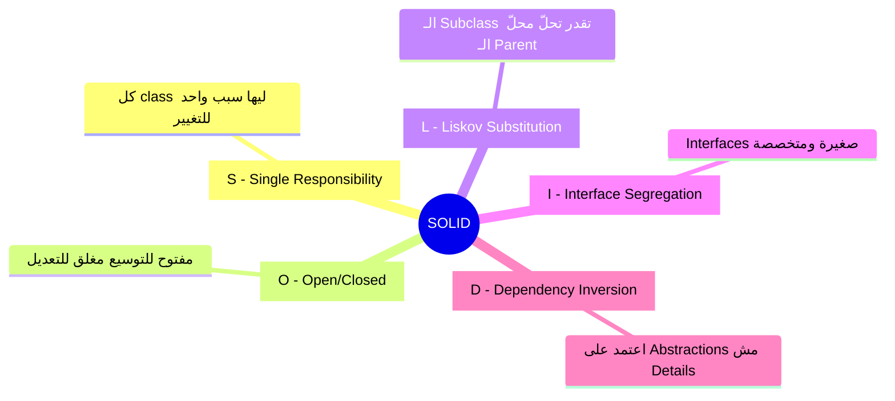
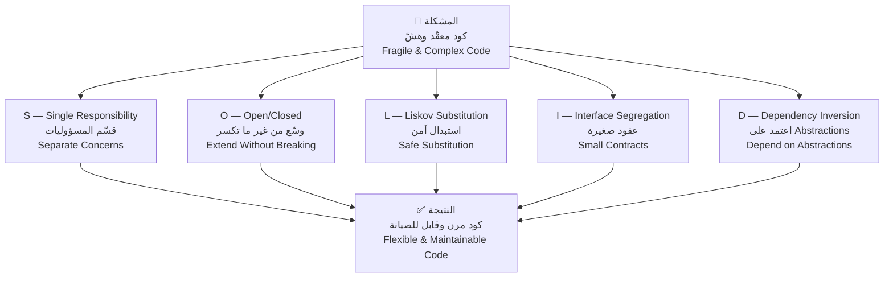
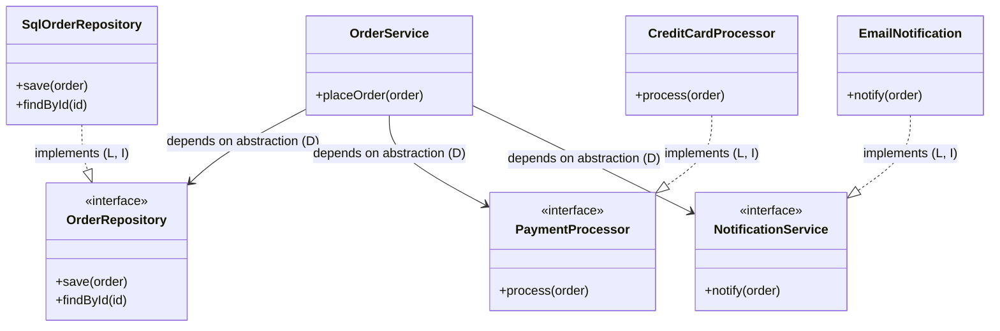
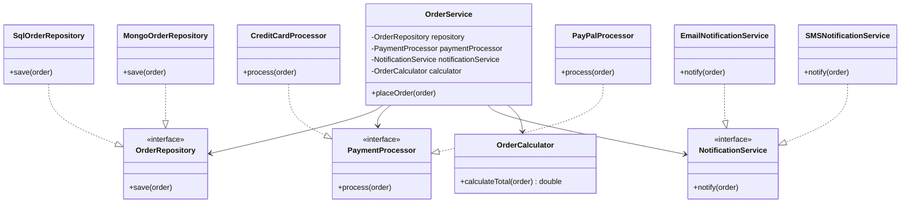

# 🏛️ Why SOLID — لماذا نتعلّم SOLID أصلاً؟

> **المستوى:** مبتدئ ← متقدم
> **اللغة:** العربية + المصطلحات الإنجليزية
> **الكود:** Java (أساسي)

---

## 1. 🚪 The Story — القصة الكاملة

> [!abstract] **📖 حكاية المدينة اللي ما اتخططتش**
>
> تخيّل معايا مدينة قديمة — زي القاهرة في العصور الوسطى.
> المدينة دي اتبنت **بلا تخطيط**. كل ما حد احتاج بيت، بنى جنب اللي قبله.
> كل ما احتاجوا سوق، فتحوه في أي مكان فاضي.
>
> النتيجة؟
> - الشوارع ضيّقة ومتشابكة — **Tightly Coupled**
> - لو عايز تهدم بيت قديم، هتهدّ معاه 3 بيوت تانية — **Fragile**
> - لو المدينة كبرت، محدش يعرف يضيف حاجة جديدة بدون ما يخرب القديم — **Not Scalable**
> - محدش يعرف يفهم الخريطة كاملة — **Unreadable**
>
> **ده بالظبط اللي بيحصل في الكود اللي بيُكتب بدون مبادئ.**

---

### السياق التاريخي — Historical Context

في التسعينيات، كان عالم البرمجة بيعاني من **أزمة حقيقية**.

المشاريع كانت:
- تبدأ بشكل بسيط ✅
- تكبر بسرعة 📈
- تتحوّل لـ **"Big Ball of Mud"** — كرة طين ضخمة ما فيش فيها شكل ولا نظام 💀

```
الكود في الشركات كان شايل:
├── كل الـ Logic في مكان واحد
├── الـ Classes بتعرف كل حاجة عن بعضها
├── تغيير في مكان واحد بيكسر 10 أماكن تانية
└── الـ Developer الجديد بياخد أسابيع يفهم أي حاجة
```

في **1995**، مجموعة من أذكى المهندسين في العالم اجتمعوا وكتبوا كتاب **"Design Patterns"**
(المعروفين بـ **Gang of Four — GoF**).

بعدها، في **2000**، المهندس الأسطوري **Robert C. Martin — Uncle Bob**
جمّع خمس مبادئ كانت موجودة بأشكال مختلفة وسمّاها:

> # 🅂 🄾 🄻 🄸 🄳
> **Single Responsibility · Open/Closed · Liskov Substitution · Interface Segregation · Dependency Inversion**

---

### ليه أنا بتعلّم ده؟ — Why This Matters for YOU

بتخيّل نفسك بعد سنة في شركة كبيرة، الـ Tech Lead بيقولك:
> *"عايزك تضيف feature جديدة على الـ Payment System."*

**لو الكود بدون SOLID:**
- هتفتح ملف واحد فيه 2000 سطر 😰
- هتلاقي الـ Database logic جوّا الـ UI logic جوّا الـ Email logic
- هتغيّر سطر واحد وتكسر 3 حاجات تانية
- هتقضي 3 أيام بدل 3 ساعات

**لو الكود بيطبّق SOLID:**
- هتعرف بالظبط أي class هتعدّل 🎯
- هتضيف الـ feature من غير ما تلمس الكود القديم
- الـ Tests هتفضل شغّالة
- الـ Tech Lead هيبصّلك بفخر 😎

---

## 2. ❌ The Naive Approach — الكود قبل SOLID

> [!failure] **❌ Bad Design — "الكود الساعة 3 الصبح"**
>
> خلينا نشوف مثال حقيقي — نظام بسيط للطلبات في متجر إلكتروني.
> المطوّر الأول كتبه بسرعة وما فكّرش في التصميم.

```java
// ❌ BAD: The "God Class" — knows and does EVERYTHING
public class OrderManager {

    // Handles database operations
    public void saveOrder(Order order) {
        // Direct SQL inside business logic!
        String sql = "INSERT INTO orders VALUES (...)";
        // execute SQL...
        System.out.println("Order saved to DB");
    }

    // Handles business logic
    public double calculateTotal(Order order) {
        double total = 0;
        for (Item item : order.getItems()) {
            total += item.getPrice();
        }
        // Discount logic mixed with calculation
        if (order.getCustomer().isPremium()) {
            total *= 0.9;
        }
        return total;
    }

    // Handles email notifications
    public void sendConfirmationEmail(Order order) {
        // Email logic inside the order manager!
        String emailBody = "Dear " + order.getCustomer().getName() + "...";
        // send email...
        System.out.println("Email sent to: " + order.getCustomer().getEmail());
    }

    // Handles payment
    public boolean processPayment(Order order, String paymentMethod) {
        if (paymentMethod.equals("CREDIT_CARD")) {
            // Credit card logic
        } else if (paymentMethod.equals("PAYPAL")) {
            // PayPal logic
        } else if (paymentMethod.equals("CRYPTO")) {
            // Crypto logic — added later, mixed in the same place
        }
        return true;
    }

    // Handles PDF generation
    public void generateInvoice(Order order) {
        // PDF generation logic inside order manager!
        System.out.println("Generating PDF invoice...");
    }
}
```

### المشاكل اللي في الكود ده:

| المشكلة — Problem | التأثير — Impact |
|---|---|
| Class واحدة بتعمل كل حاجة | **God Class** — صعبة الفهم |
| الـ DB logic جوّا الـ Business logic | صعب تغيّر الـ Database |
| إضافة Payment جديدة = تعديل الكلاس | **Fragile** — خطر كسر الموجود |
| الـ Email logic مش معزولة | صعب تعمل Unit Testing |
| كل الكود في مكان واحد | **Zero Reusability** |

---

## 3. 🧠 The Deep Dive — فهم SOLID من الجذور

### إيه هي SOLID أصلاً؟

SOLID مش قواعد مقدّسة — هي **مبادئ تصميم — Design Principles** اتطوّرت من تجارب مئات المشاريع الفاشلة.

كل حرف بيحلّ **مشكلة محددة**:



### العلاقة بين المبادئ الخمسة:



---

### كيف تتفاعل المبادئ مع بعض في نظام حقيقي؟



> **لاحظ:** الـ `OrderService` مش بتعرف أي حاجة عن الـ SQL أو الـ Email أو الـ CreditCard.
> بتتعامل بس مع **Abstractions — عقود مجردة**.
> ده هو قلب SOLID.

---

## 4. 🎭 The Mentor Analogy — التشبيه اللي هتفضل فاكره

> [!abstract] **🏥 تشبيه المستشفى**
>
> فكّر في **مستشفى منظّم**:
>
> - الـ **Doctor** بيشخّص بس — **Single Responsibility**
> - لو جه دكتور جديد، المستشفى **بيتوسّع** من غير ما يغيّر الهيكل القديم — **Open/Closed**
> - أي **دكتور باطنة** يقدر يحلّ محلّ دكتور باطنة تاني — **Liskov**
> - الـ **Nurse** ليها دورها، والـ **Pharmacist** ليه دوره — مش كل واحد بيعمل كل حاجة — **Interface Segregation**
> - الـ **Hospital Director** مش بيعرف تفاصيل كل أوبريشن — بيعتمد على الـ **protocols** — **Dependency Inversion**
>
> المستشفى بيشتغل بكفاءة **مش لأن الناس ذكية — لأن النظام مصمّم صح.**

---

## 5. 💻 Code Section — الكود العملي

### قبل وبعد SOLID بشكل مبسّط:

> [!failure] **❌ Before SOLID — كل حاجة في مكان واحد**

```java
// ❌ One class does EVERYTHING — violation of ALL SOLID principles
public class OrderManager {
    public void processOrder(Order order) {
        // S: Doing too many things
        // O: Adding new payment = modifying this class
        // D: Directly depends on concrete implementations

        // 1. Calculate total (business logic)
        double total = 0;
        for (Item item : order.getItems()) {
            total += item.getPrice();
        }

        // 2. Save to database (data access)
        System.out.println("Saving order to database...");

        // 3. Process payment (payment logic)
        System.out.println("Processing credit card payment...");

        // 4. Send email (notification logic)
        System.out.println("Sending email to " + order.getCustomer().getEmail());
    }
}
```

---

> [!success] **✅ After SOLID — كل class ليها مسؤولية واحدة واضحة**

```java
// ✅ S: Each class has ONE reason to change

// Responsible ONLY for calculating order total
public class OrderCalculator {
    public double calculateTotal(Order order) {
        return order.getItems().stream()
            .mapToDouble(Item::getPrice)
            .sum();
    }
}

// ✅ D: Depend on abstraction, not concrete class
public interface OrderRepository {
    void save(Order order);
}

// ✅ O: Adding new DB = new class, no modification
public class SqlOrderRepository implements OrderRepository {
    @Override
    public void save(Order order) {
        System.out.println("Saving to SQL database...");
    }
}

// ✅ D: Depend on abstraction
public interface PaymentProcessor {
    void process(Order order);
}

// ✅ O: Adding PayPal = new class, no modification needed
public class CreditCardProcessor implements PaymentProcessor {
    @Override
    public void process(Order order) {
        System.out.println("Processing credit card...");
    }
}

// ✅ I: Notification has its own focused interface
public interface NotificationService {
    void notify(Order order);
}

public class EmailNotificationService implements NotificationService {
    @Override
    public void notify(Order order) {
        System.out.println("Sending email to: " + order.getCustomer().getEmail());
    }
}

// ✅ The orchestrator — depends ONLY on abstractions
public class OrderService {

    private final OrderRepository repository;
    private final PaymentProcessor paymentProcessor;
    private final NotificationService notificationService;
    private final OrderCalculator calculator;

    // ✅ D: Dependencies are injected, not created inside
    public OrderService(OrderRepository repository,
                        PaymentProcessor paymentProcessor,
                        NotificationService notificationService,
                        OrderCalculator calculator) {
        this.repository = repository;
        this.paymentProcessor = paymentProcessor;
        this.notificationService = notificationService;
        this.calculator = calculator;
    }

    public void placeOrder(Order order) {
        double total = calculator.calculateTotal(order);
        System.out.println("Total: " + total);

        repository.save(order);
        paymentProcessor.process(order);
        notificationService.notify(order);
    }
}
```



> **لاحظ القوة:** عايز تضيف **PayPal**؟ بس كمّل `PayPalProcessor`.
> عايز تغيّر الـ Database لـ MongoDB؟ بس كمّل `MongoOrderRepository`.
> **الكود القديم ما اتلمسش خالص! ✅**

---

## 6. ⚠️ Common Mistakes & Traps

> [!failure] **⚠️ أكتر الأخطاء شيوعاً عند تعلّم SOLID**

| الخطأ — Mistake | التوضيح | الصح |
|---|---|---|
| **Over-engineering من أول يوم** | تقسيم كل حاجة لـ 50 class من غير سبب | طبّق SOLID لما تحسّ بالألم الفعلي |
| **SOLID = إجباري في كل كود** | مشروع صغير لا يحتاج كل ده | المبادئ للمشاريع اللي بتكبر |
| **حفظ التعريفات بدون فهم** | في الإنترفيو بتقول الكلام وبتطبّق العكس | افهم المشكلة اللي بيحلّها كل مبدأ |
| **الخلط بين المبادئ** | تقول "ده S بس في الحقيقة ده D" | كل مبدأ بيحلّ مشكلة مختلفة |

### Interview Trap 🪤

**السؤال:** "هل SOLID مجموعة قواعد أم مبادئ؟"

> **الإجابة الغلط ❌:** "قواعد لازم تتبعها دايمًا."
> **الإجابة الصح ✅:** "مبادئ — Principles — هي guides تساعدك تاخد decisions أفضل. مش كل كود محتاجها، بس لما الكود بيكبر، بتبقى ضرورية."

---

## 7. 🧾 Summary — الملخص السريع

| المبدأ | السؤال اللي بيجاوبه | الكلمة المفتاحية |
|---|---|---|
| **S** — Single Responsibility | ليه الـ Class دي بتتغيّر؟ | **مسؤولية واحدة** |
| **O** — Open/Closed | إزاي أضيف feature من غير ما أكسر؟ | **توسّع بدون تعديل** |
| **L** — Liskov Substitution | الـ Subclass آمنة للاستخدام زي الـ Parent؟ | **استبدال آمن** |
| **I** — Interface Segregation | الـ Interface مليانة حاجات مش محتاجاها؟ | **عقود صغيرة** |
| **D** — Dependency Inversion | بتعتمد على التفاصيل ولا الـ Abstractions؟ | **اعتمد على العقد** |

### الـ SOLID بيحقق:

```
✅ Maintainability   — سهولة الصيانة
✅ Extensibility     — سهولة التوسيع
✅ Testability       — سهولة الاختبار
✅ Readability       — سهولة القراءة
✅ Reusability       — إعادة الاستخدام
```

---

## 8. 🧪 Checkpoint — اختبار الفهم

> [!abstract] **🧠 سؤال تطبيقي — فكّر قبل ما تجاوب**

**Scenario:**

أنت بتبني نظام لإدارة موظفين. عندك الكلاس دي:

```java
public class Employee {
    private String name;
    private double salary;

    public void calculateBonus() {
        // Business logic for bonus calculation
    }

    public void saveToDatabase() {
        // Direct database operations
    }

    public void generatePayslipPDF() {
        // PDF generation logic
    }

    public void sendEmailNotification() {
        // Email sending logic
    }
}
```

**الأسئلة:**
1. كام مبدأ من SOLID بيتم انتهاكه هنا؟ سمّيهم.
2. إيه هو أوضح انتهاك؟ وليه؟
3. لو عايز تضيف طريقة حساب بونص جديدة للمديرين — إيه المشكلة اللي هتواجهها في الكود ده؟

> **⏸️ لا تكمل قبل ما تفكّر في الإجابة.**
> لو عايز الإجابة، قولّي وهشرحلك خطوة خطوة.

---

## 🧰 Interview Survival Kit

### أهم الأسئلة في الإنترفيوهات:

**Q1: What is SOLID and why do we use it?**
> *SOLID is a set of 5 design principles that make software more maintainable, extensible, and testable. We use it to avoid code rot — the gradual degradation of code quality as the system grows.*

**Q2: Can you violate SOLID principles?**
> *Yes. SOLID is a guide, not a law. For small scripts or prototypes, strict SOLID might be over-engineering. The goal is writing code that survives growth — use judgment.*

**Q3: What's the relationship between SOLID and Design Patterns?**
> *Design Patterns are concrete solutions that emerge from applying SOLID principles. SOLID gives you the "why", Design Patterns give you the "how".*

### 💡 Tips عملية للإنترفيو:
- اربط كل مبدأ بمثال حقيقي من تجربتك
- قول "هذا المبدأ بيحلّ مشكلة X" — مش بس التعريف
- اذكر أن SOLID ليست قواعد مطلقة

---

## 🔗 Cross Topic Question

> [!abstract] **🔗 ربط بالمستقبل**
>
> هنتعلّم مبدأ الـ **S — Single Responsibility** الجلسة الجاية بعمق.
>
> **فكّر في السؤال ده:**
> لو عندك `UserService` بيعمل: إنشاء يوزر، إرسال إيميل ترحيب، حفظ في DB، وتسجيل في الـ Log —
> كام "سبب للتغيير" ممكن تشوفهم في المستقبل؟
>
> ده هيخلّيك فاهم ليه بنقسّم الكود — مش بس إزاي.

---

*📌 الجلسة الجاية: **S — Single Responsibility Principle** بكل تفاصيله*
