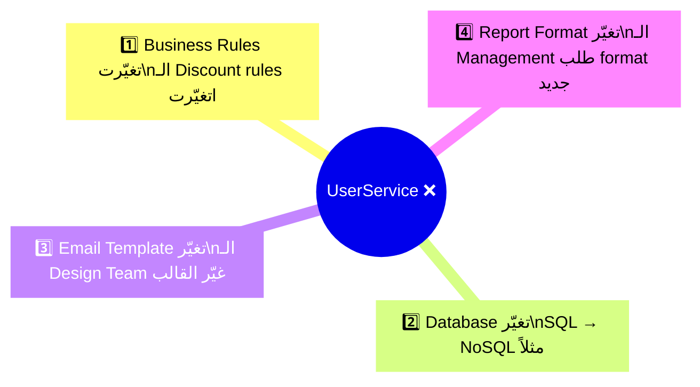
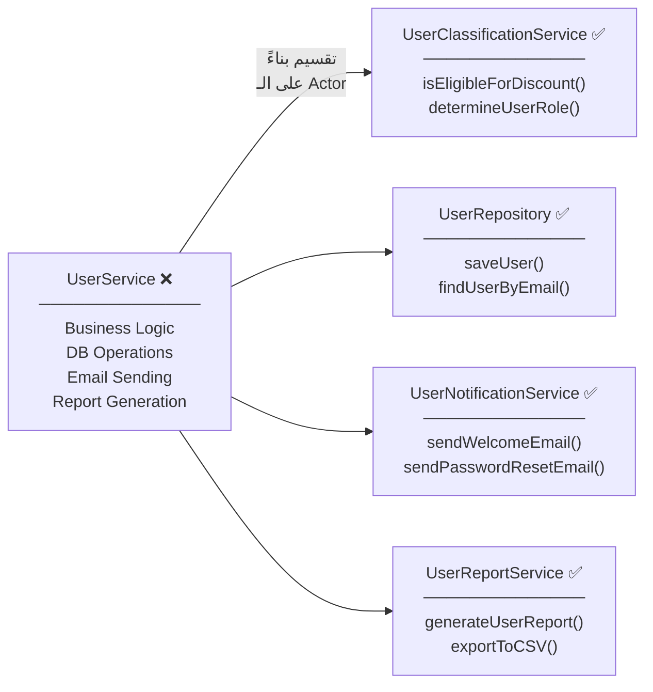
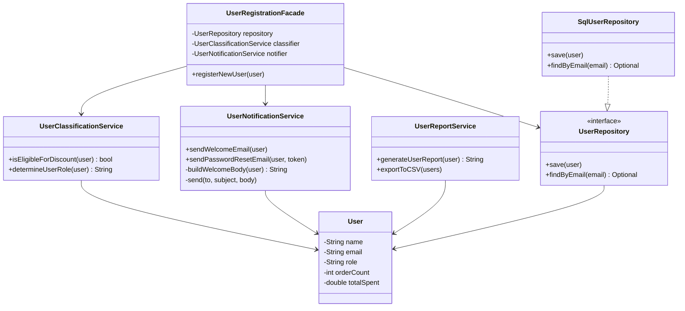

# 🅂 Single Responsibility Principle — مبدأ المسؤولية الواحدة

> **الحرف الأول في SOLID**
> **المستوى:** مبتدئ ← متقدم | **الكود:** Java

---

## 1. 🚪 The Story — القصة الكاملة

> [!abstract] **📖 حكاية النجّار اللي بيعمل كل حاجة**
>
> تخيّل نجّار شاطر جداً — بيعمل أثاث، بيصلّح سباكة، بيبني جدران، وبيعمل كهرباء.
>
> في البداية، كل الناس في القرية بتحبّه — "راجل بيعمل كل حاجة!"
>
> بس مع الوقت:
> - لما بيحصل مشكلة في الكهرباء، **لازم تفصل النجّار كله** — مش بس الكهرباء
> - لما بيتعلّم technique جديدة في النجارة، **بيأثّر على شغله في السباكة**
> - لما بييجي نجّار جديد يساعده، **مش عارف يتعلّم من أنهي جزء يبدأ**
> - لو مريض يوم واحد، **كل خدمات القرية بتوقف**
>
> **ده بالظبط اللي بيحصل مع الـ God Class في الكود.**

---

### السياق التاريخي — Historical Context

**Uncle Bob — Robert C. Martin** عرّف المبدأ ده بجملة واحدة بقت أشهر جملة في عالم الـ Software:

> *"A class should have only one reason to change."*
> **الكلاس لازم يكون عندها سبب واحد بس للتغيير.**

الجملة دي تبدو بسيطة، لكنّها عميقة جداً — لأنها بتخلّيك **تفكّر في المستقبل**، مش بس في الحاضر.

لاحظ إنه قال **"reason to change"** مش **"one method"** أو **"one function"**.
الفرق ده مهم جداً وهنشرحه.

---

### ليه ده مهم ليّا؟ — Why This Matters for YOU

لما بتشتغل في Team:
- الـ Backend Developer بيغيّر الـ DB logic
- الـ Business Analyst بيغيّر الـ Calculation rules
- الـ DevOps بيغيّر الـ Logging format

لو الثلاثة دول شايلين code في **نفس الكلاس** — هيحصل **Merge Conflicts كل يوم**
وكل واحد فيهم ممكن **يكسر شغل التاني بدون قصد!**

---

## 2. ❌ The Naive Approach — الكود قبل SRP

> [!failure] **❌ The God Class — كلاس بتعرف كل حاجة وبتعمل كل حاجة**

```java
// ❌ BAD: UserService does EVERYTHING related to a user
// Imagine this file growing to 1000+ lines over time
public class UserService {

    // ───────────────────────────────────────────────
    // GROUP 1: Business Logic (changes when business rules change)
    // ───────────────────────────────────────────────

    public boolean isEligibleForDiscount(User user) {
        return user.getOrderCount() > 10 && user.getTotalSpent() > 500.0;
    }

    public String determineUserRole(User user) {
        if (user.getTotalSpent() > 1000) return "GOLD";
        if (user.getTotalSpent() > 500) return "SILVER";
        return "BRONZE";
    }

    // ───────────────────────────────────────────────
    // GROUP 2: Persistence (changes when DB structure changes)
    // ───────────────────────────────────────────────

    public void saveUser(User user) {
        // Raw SQL mixed with business logic!
        String sql = "INSERT INTO users (name, email) VALUES (?, ?)";
        System.out.println("Executing: " + sql);
    }

    public User findUserByEmail(String email) {
        String sql = "SELECT * FROM users WHERE email = ?";
        System.out.println("Executing: " + sql);
        return new User(); // simulated
    }

    // ───────────────────────────────────────────────
    // GROUP 3: Notification (changes when email format changes)
    // ───────────────────────────────────────────────

    public void sendWelcomeEmail(User user) {
        String subject = "Welcome to our platform!";
        String body = "Dear " + user.getName() + ", welcome...";
        System.out.println("Sending email: " + subject);
    }

    public void sendPasswordResetEmail(User user, String token) {
        String link = "https://app.com/reset?token=" + token;
        System.out.println("Sending reset link to: " + user.getEmail());
    }

    // ───────────────────────────────────────────────
    // GROUP 4: Reporting (changes when report format changes)
    // ───────────────────────────────────────────────

    public String generateUserReport(User user) {
        return "User Report: " + user.getName() +
               " | Orders: " + user.getOrderCount() +
               " | Spent: $" + user.getTotalSpent();
    }

    public void exportToCSV(List<User> users) {
        System.out.println("name,email,orders");
        for (User u : users) {
            System.out.println(u.getName() + "," + u.getEmail() + "," + u.getOrderCount());
        }
    }
}
```

### كم "سبب للتغيير" عند الكلاس دي؟



**4 أسباب للتغيير = 4 انتهاكات لـ SRP** 🔴

---

### ليه ده مشكلة؟ — Impact Analysis

لو الـ **Design Team** غيّرت template الإيميل:
- هتعدّل `UserService.java`
- الـ Code Reviewer هيشوف تغيير في ملف الـ Business Logic!
- الـ Tests الخاصة بالـ Discount Logic ممكن تبوظ بسبب تغيير في الإيميل
- في الـ Git: سطور من 3 مجالات مختلفة في نفس الـ Commit 🤦

---

## 3. 🧠 The Deep Dive — الفهم العميق

### "سبب واحد للتغيير" — إيه يعني بالظبط؟

> [!abstract] **💡 الفكرة المحورية**
>
> Uncle Bob يقول: الـ "Reason to Change" مرتبط بـ **Actor — طرف معنيّ**.
>
> السؤال الصح مش "الكلاس بتعمل إيه؟"
> السؤال الصح: **"مين اللي ممكن يطلب تغيير في الكلاس دي؟"**

```
👤 Business Analyst   →  يغيّر rules الـ Discount والـ Role
👤 DBA / Backend      →  يغيّر الـ Database queries
👤 Design Team        →  يغيّر Email templates
👤 Management         →  يغيّر شكل الـ Reports
```

**أربع أطراف مختلفة = أربع أسباب = لازم أربع كلاسات**

---

### SRP مش معناها "method واحدة"!

> [!failure] **❌ فهم غلط شائع جداً**

```java
// ❌ WRONG interpretation of SRP
// Someone thought SRP = one method per class!
public class UserDiscountChecker {
    public boolean isEligible(User user) { ... }
}
public class UserRoleChecker {
    public String getRole(User user) { ... }
}
// This is OVER-ENGINEERING, not SRP!
```

> [!success] **✅ الفهم الصح**
>
> `isEligibleForDiscount()` و `determineUserRole()` كلاهما **Business Logic**.
> نفس الـ Actor (Business Analyst) بيغيّرهم.
> **مقامهم في نفس الكلاس صح تماماً.**

```java
// ✅ CORRECT: They belong together — same actor, same reason to change
public class UserClassificationService {
    public boolean isEligibleForDiscount(User user) {
        return user.getOrderCount() > 10 && user.getTotalSpent() > 500.0;
    }

    public String determineUserRole(User user) {
        if (user.getTotalSpent() > 1000) return "GOLD";
        if (user.getTotalSpent() > 500)  return "SILVER";
        return "BRONZE";
    }
}
```

---

## 4. 🎭 The Mentor Analogy — التشبيه اللي مش هتنساه

> [!abstract] **🗞️ تشبيه الجريدة**
>
> فكّر في جريدة منظّمة:
>
> - **السياسة** — قسم مستقل
> - **الرياضة** — قسم مستقل
> - **الاقتصاد** — قسم مستقل
> - **الفنون** — قسم مستقل
>
> لو فيه خبر رياضي جديد — **بس قسم الرياضة بيتأثر**.
> محرر السياسة **مش محتاج يعمل حاجة**.
>
> لو الجريدة دمجت كل الأخبار في ملف واحد —
> أي تعديل بسيط هيخلّي كل المحررين يتعاركوا على نفس الملف.
>
> **الكلاس زي القسم في الجريدة — مسؤولية واحدة، جمهور واحد، سبب تغيير واحد.**

---

## 5. 💻 Code Section — الـ Refactoring الكامل

### الخطوة 1: تحديد المجموعات — Identify Responsibilities



---

### الخطوة 2: الكود الكامل بعد الـ Refactoring

> [!success] **✅ After SRP — كل كلاس بتعمل حاجة واحدة بشكل ممتاز**

```java
// ✅ RESPONSIBILITY 1: Business Logic
// Actor: Business Analyst
// Reason to change: Business rules change
public class UserClassificationService {

    public boolean isEligibleForDiscount(User user) {
        return user.getOrderCount() > 10 && user.getTotalSpent() > 500.0;
    }

    public String determineUserRole(User user) {
        if (user.getTotalSpent() > 1000) return "GOLD";
        if (user.getTotalSpent() > 500)  return "SILVER";
        return "BRONZE";
    }
}
```

```java
// ✅ RESPONSIBILITY 2: Data Persistence
// Actor: Database / Backend Developer
// Reason to change: Database technology or schema changes
public interface UserRepository {
    void save(User user);
    Optional<User> findByEmail(String email);
}

public class SqlUserRepository implements UserRepository {

    @Override
    public void save(User user) {
        String sql = "INSERT INTO users (name, email) VALUES (?, ?)";
        System.out.println("SQL Executing: " + sql);
    }

    @Override
    public Optional<User> findByEmail(String email) {
        String sql = "SELECT * FROM users WHERE email = ?";
        System.out.println("SQL Executing: " + sql);
        return Optional.of(new User()); // simulated
    }
}
```

```java
// ✅ RESPONSIBILITY 3: Notifications
// Actor: Design Team / Marketing
// Reason to change: Email template or channel changes
public class UserNotificationService {

    public void sendWelcomeEmail(User user) {
        String subject = "Welcome, " + user.getName() + "!";
        String body = buildWelcomeBody(user);
        send(user.getEmail(), subject, body);
    }

    public void sendPasswordResetEmail(User user, String token) {
        String link = "https://app.com/reset?token=" + token;
        String body = "Click to reset: " + link;
        send(user.getEmail(), "Reset your password", body);
    }

    private String buildWelcomeBody(User user) {
        return "Dear " + user.getName() + ", welcome to our platform!";
    }

    private void send(String to, String subject, String body) {
        System.out.println("Sending to: " + to + " | Subject: " + subject);
    }
}
```

```java
// ✅ RESPONSIBILITY 4: Reporting
// Actor: Management / Data Team
// Reason to change: Report format or export requirements change
public class UserReportService {

    public String generateUserReport(User user) {
        return String.format("User: %s | Role: %s | Orders: %d | Spent: $%.2f",
            user.getName(),
            user.getRole(),
            user.getOrderCount(),
            user.getTotalSpent()
        );
    }

    public void exportToCSV(List<User> users) {
        System.out.println("name,email,orders,spent");
        for (User user : users) {
            System.out.printf("%s,%s,%d,%.2f%n",
                user.getName(),
                user.getEmail(),
                user.getOrderCount(),
                user.getTotalSpent()
            );
        }
    }
}
```

```java
// ✅ The Orchestrator — brings everything together
// This is the entry point, it DELEGATES, it doesn't DO
public class UserRegistrationFacade {

    private final UserRepository repository;
    private final UserClassificationService classificationService;
    private final UserNotificationService notificationService;

    public UserRegistrationFacade(UserRepository repository,
                                   UserClassificationService classificationService,
                                   UserNotificationService notificationService) {
        this.repository = repository;
        this.classificationService = classificationService;
        this.notificationService = notificationService;
    }

    public void registerNewUser(User user) {
        // Each step is handled by the RIGHT class
        String role = classificationService.determineUserRole(user);
        user.setRole(role);

        repository.save(user);

        notificationService.sendWelcomeEmail(user);

        System.out.println("User registered successfully: " + user.getName());
    }
}
```

---

### Class Diagram — الصورة الكاملة للنظام بعد SRP



---

### المقارنة النهائية

| المعيار | قبل SRP ❌ | بعد SRP ✅ |
|---|---|---|
| **عدد الكلاسات** | 1 ضخمة | 5 متخصصة |
| **سبب التغيير** | 4+ أسباب | 1 لكل كلاس |
| **Unit Testing** | صعب جداً | سهل — كل كلاس تتست لوحدها |
| **Team Collaboration** | Merge conflicts | كل developer في ملفه |
| **إضافة SMS بدل Email** | تعدّل كلاس ضخمة | بس في `UserNotificationService` |
| **تغيير DB لـ MongoDB** | تعدّل كلاس ضخمة | بس `SqlUserRepository` |

---

## 6. ⚠️ Common Mistakes & Traps

> [!failure] **⚠️ أخطاء شائعة في تطبيق SRP**

### الخطأ الأول: Over-Splitting

```java
// ❌ TOO FAR — splitting things with the SAME reason to change
public class UserDiscountEligibilityChecker {
    public boolean check(User user) { ... }
}
public class UserRoleDeterminer {
    public String determine(User user) { ... }
}
// Both change for the same reason (business rules)
// Keep them together!
```

### الخطأ الثاني: Utility Classes الـ "Helper"

```java
// ❌ This is a hidden God Class disguised as a helper!
public class UserUtils {
    public static boolean isEligible(User user) { ... }
    public static void saveUser(User user) { ... }
    public static void sendEmail(User user) { ... }
    public static String generateReport(User user) { ... }
}
// "Utils" and "Manager" and "Helper" are red flags 🚩
```

### الخطأ الثالث: SRP في الـ Methods بس

```java
// ❌ WRONG: Applied SRP only at method level, not class level
public class UserService {
    private void handleBusinessLogic() { ... }  // extracted to method
    private void handleDatabase() { ... }        // extracted to method
    private void handleEmail() { ... }           // extracted to method
    // Still ONE class with MULTIPLE reasons to change!
}
```

### Interview Traps 🪤

**السؤال:** "SRP معناها الكلاس يبقى فيها method واحدة؟"
> **الإجابة الصح ✅:** لا. SRP تعني سبب تغيير واحد — وهو مرتبط بـ Actor واحد. الكلاس ممكن يكون فيها methods كتير طالما كلهم بيخدموا نفس المسؤولية.

**السؤال:** "كيف تعرف لو الكلاس بيخالف SRP؟"
> **الإجابة الصح ✅:** اسأل نفسك "مين اللي ممكن يطلب تغيير في الكلاس دي؟" لو الإجابة أكتر من طرف واحد — في مشكلة.

---

## 7. 🧾 Summary — الملخص السريع

```
SRP = "A class should have only one reason to change"
```

| النقطة | التفاصيل |
|---|---|
| **التعريف الحقيقي** | سبب واحد للتغيير، مش method واحدة |
| **السؤال الصح** | مين اللي ممكن يطلب التغيير ده؟ |
| **العلامة الحمرا** | كلمات زي: Manager, Helper, Utils في اسم الكلاس |
| **الفايدة الكبرى** | Unit Testing سهل + Team Collaboration ممتاز |
| **الخطر** | Over-engineering بتقسيم زيادة عن اللزوم |

### الـ Signs اللي تقولك إنك بتخالف SRP:

```
🚩 الكلاس بتعمل import من packages كتير مختلفة جداً
🚩 اسم الكلاس فيه "And": UserAndEmailManager
🚩 الـ Class أكبر من 200-300 سطر
🚩 لما تشرح الكلاس بتقول "وكمان..." أكتر من مرة
🚩 الـ Unit Test بتاعتها محتاج Mock كتير جداً
```

---

## 8. 🧪 Checkpoint — اختبار الفهم

> [!abstract] **🧠 Scenario حقيقي — فكّر بعمق**

أنت بتبني نظام لإدارة **مطعم**.
الكلاس دي موجودة في الكود:

```java
public class RestaurantManager {

    public void addMenuItem(String name, double price) {
        System.out.println("Adding item to DB: " + name);
    }

    public double calculateBill(List<String> orderedItems) {
        // Fetch prices and calculate total
        return 0.0;
    }

    public void sendOrderToKitchen(Order order) {
        System.out.println("Notifying kitchen: " + order.getId());
    }

    public void generateDailySalesReport() {
        System.out.println("Generating PDF report...");
    }

    public void processPayment(Order order, String method) {
        System.out.println("Processing " + method + " payment...");
    }
}
```

**الأسئلة:**

1. حدّد كل مسؤولية في الكلاس دي — وقول مين الـ **Actor** بتاعها.
2. لو الـ Chef طلب إن الـ Kitchen Notification تبقى بـ SMS بدل الـ Print — أنهي كلاسات هتتأثر في الكود ده؟ وليه ده مشكلة؟
3. ارسم تقسيم مقترح للكلاسات بعد تطبيق SRP.

> **⏸️ خُد وقتك وفكّر — الإجابة موجودة في اللي اتشرح.**
> لو عايز مراجعة أو مش متأكد من إجابتك — قولّي وهناقش سوا.

---

## 🧰 Interview Survival Kit

### أقوى الأسئلة في الإنترفيوهات:

**Q1: What is the Single Responsibility Principle?**
> *A class should have only one reason to change — meaning it should be responsible to only one actor or stakeholder. This keeps classes focused, easier to test, and easier to maintain.*

**Q2: How is SRP different from "do one thing"?**
> *"Do one thing" is vague. SRP is precise — it's about the actor who drives change. A class can have many methods as long as they all serve the same actor and the same purpose.*

**Q3: What are the signs of an SRP violation?**
> *God classes, "Manager/Helper/Utils" names, classes with imports from very different packages, classes over 300 lines, and methods that seem to belong to completely different domains.*

**Q4: Can SRP be over-applied?**
> *Yes. Splitting classes too aggressively creates "nano-classes" that are hard to follow and add unnecessary complexity. The key is grouping by actor and reason to change, not by method count.*

---

## 🔗 Cross Topic Questions

> [!abstract] **🔗 ربط SRP بما جاي**

**السؤال اللي هيربط SRP بـ OCP (الجلسة الجاية):**

لو `UserClassificationService` محتاج يضيف rule جديدة للـ Discount —
مثلاً: موظفين الشركة دايماً يبقوا eligible —
هتعدّل الكلاس القديمة ولا هتعمل حاجة تانية؟

> ده هو قلب مبدأ الـ **O — Open/Closed** اللي جاي.
> **SRP بتقسّملك الكود صح، وOCP بيحميه من التعديل الخطر.**

---

*📌 الجلسة الجاية: **O — Open/Closed Principle**
"كيف تضيف features جديدة من غير ما تلمس الكود القديم؟"*
