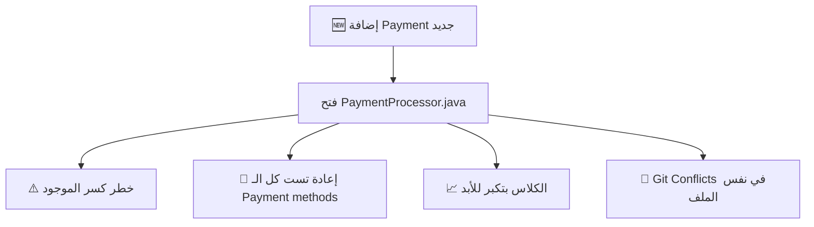
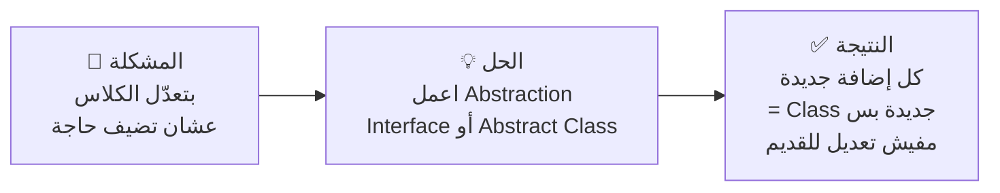
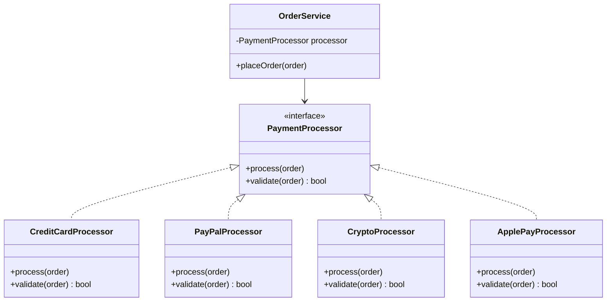
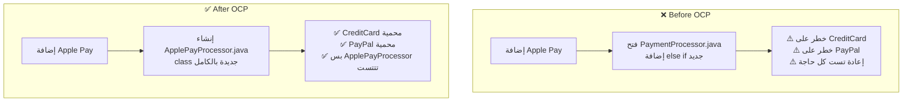

# 🄾 Open/Closed Principle — مبدأ الفتح والإغلاق

> **الحرف الثاني في SOLID**
> **المستوى:** مبتدئ ← متقدم | **الكود:** Java

---

## 1. 🚪 The Story — القصة الكاملة

> [!abstract] **📖 حكاية الكهربائي اللي بيفتح الجدران**
>
> تخيّل إنك بنيت بيت جميل — كل حاجة تمام.
>
> بعد سنة، قررت تضيف **توكة جديدة** في الأوضة.
>
> الكهربائي جه وقالك:
> **"لازم أكسر الجدار كله، أوصّل السلك، وأعمر الجدار من أول وجديد."**
>
> وبعد ما خلّص — اكتشفت إن التوكة القديمة اتعطّلت بسبب التعديل! 😤
>
> ---
>
> دلوقتي تخيّل كهربائي تاني جه وقالك:
> **"الجدار مصمّم بـ conduit جوّاه — بس أجرّ سلك وأضيف توكة من غير ما ألمس اللي موجود."**
>
> **ده هو Open/Closed Principle.**
> البيت **مفتوح للتوسيع** — وفي نفس الوقت **الجدران القديمة محمية من الكسر.**

---

### السياق التاريخي — Historical Context

المبدأ ده أصله من **Bertrand Meyer** في كتابه الشهير سنة **1988**:

> *"Software entities should be open for extension, but closed for modification."*

بس Uncle Bob أعاد صياغته بشكل أعمق في التسعينيات:
> *"You should be able to extend a class's behavior without modifying it."*

في البداية كان الناس بيفهموه بشكل ضيّق — "متعدّلش الكلاس خالص!"
بعدين اتضح إن المقصود: **استخدم Abstraction عشان التوسيع يكون آمن.**

---

### ليه ده مهم ليّا؟ — Why This Matters

**Scenario حقيقي:**
أنت بتشتغل في شركة Payment — الـ System بيدعم CreditCard.
الـ Product Manager جه وقال: **"عايزين نضيف PayPal."**
بعد شهر: **"عايزين نضيف Crypto."**
بعد شهر: **"عايزين نضيف Apple Pay."**

لو كل مرة لازم **تفتح الكود القديم وتعدّله:**
- ممكن تكسر الـ CreditCard اللي شغّالة ✅ → 💀
- الـ QA لازم تعيد تست كل حاجة من الأول
- الـ Bugs بتيجي من أماكن ما توقعتهاش
- الـ Codebase بتكبر وبتبقى هشّة أكتر

**لو الكود مصمّم صح — بتضيف PayPal من غير ما تلمس سطر واحد في الـ CreditCard.**

---

## 2. ❌ The Naive Approach — الكود قبل OCP

> [!failure] **❌ الـ Switch Hell — جحيم الـ Conditions**

```java
// ❌ BAD: Every new payment method = open this file and add another "else if"
// This class is NEVER closed for modification
public class PaymentProcessor {

    public void processPayment(Order order, String paymentType) {

        if (paymentType.equals("CREDIT_CARD")) {
            // Credit card specific logic
            System.out.println("Validating card number...");
            System.out.println("Charging card: $" + order.getTotal());

        } else if (paymentType.equals("PAYPAL")) {
            // PayPal specific logic
            System.out.println("Redirecting to PayPal...");
            System.out.println("PayPal charge: $" + order.getTotal());

        } else if (paymentType.equals("CRYPTO")) {
            // Crypto specific logic — added later, polluting the original class
            System.out.println("Generating wallet address...");
            System.out.println("Awaiting crypto transfer: $" + order.getTotal());

        } else if (paymentType.equals("APPLE_PAY")) {
            // Apple Pay — yet another modification to "closed" logic
            System.out.println("Requesting Face ID confirmation...");
            System.out.println("Apple Pay charge: $" + order.getTotal());

        } else {
            throw new IllegalArgumentException("Unknown payment type: " + paymentType);
        }
    }
}
```

### المشاكل:



| المشكلة | التأثير |
|---|---|
| كل feature جديدة = تعديل الكلاس | **Open for modification ❌** |
| الـ Logic القديمة معرّضة للكسر | **Fragile Design** |
| الـ if/else بتكبر للأبد | **Unreadable & Unmaintainable** |
| صعب تعمل Unit Test لكل payment لوحده | **Low Testability** |

---

## 3. 🧠 The Deep Dive — الفهم العميق

### الـ OCP بيتحقق إزاي؟

الإجابة في كلمة واحدة: **Abstraction — التجريد**



### Interface vs Abstract Class — إمتى تستخدم إيه؟

| | **Interface** | **Abstract Class** |
|---|---|---|
| **استخدم لما** | عندك عقد — Contract | عندك سلوك مشترك — Shared Behavior |
| **Java** | `interface` | `abstract class` |
| **OCP** | الأكثر شيوعاً | لما فيه كود مشترك |
| **مثال** | `PaymentProcessor` | `BaseNotification` |

---

### الـ OCP Pattern المشهور: Strategy Pattern

OCP في الغالب بيتطبّق باستخدام **Strategy Pattern**:



**لاحظ:** `OrderService` مش عارفة أي حاجة عن الـ CreditCard أو PayPal.
بتتعامل بس مع الـ `PaymentProcessor` interface.
لما تضيف `ApplePayProcessor` — **مش هتلمس `OrderService` خالص.**

---

## 4. 🎭 The Mentor Analogy — التشبيه العميق

> [!abstract] **🔌 تشبيه الـ USB Port**
>
> الـ USB Port في اللابتوب بتاعك — مصمّم بـ **عقد ثابت — Standard Interface**.
>
> - Flash Drive؟ ✅ — اتوصّل بدون ما تغيّر اللابتوب
> - Mouse؟ ✅ — اتوصّل بدون ما تغيّر اللابتوب
> - Keyboard؟ ✅ — اتوصّل بدون ما تغيّر اللابتوب
> - جهاز جديد مش موجود لحد دلوقتي؟ ✅ — لو بيدعم USB هيشتغل
>
> الـ **USB Port = Interface**
> الـ **أجهزة = Implementations**
> الـ **اللابتوب = الكود اللي بيستخدم الـ Interface**
>
> **اللابتوب ما اتغيّرش — بس قدر يشتغل مع ملايين الأجهزة.**
> **ده هو Open/Closed.**

---

## 5. 💻 Code Section — الـ Refactoring الكامل

### الخطوة 1: تعريف الـ Contract

> [!success] **✅ Step 1 — Define the Abstraction**

```java
// ✅ The CONTRACT — every payment method must implement this
// This interface is CLOSED for modification (its contract is stable)
public interface PaymentProcessor {

    // Core behavior every processor must have
    void process(Order order);

    // Optional validation before processing
    boolean validate(Order order);

    // Human-readable name for logging and UI
    String getPaymentMethodName();
}
```

---

### الخطوة 2: كل Payment Method = Class مستقلة

> [!success] **✅ Step 2 — Each processor is a separate, focused class**

```java
// ✅ OPEN for extension: adding CreditCard doesn't touch anything else
public class CreditCardProcessor implements PaymentProcessor {

    @Override
    public boolean validate(Order order) {
        // Credit card specific validation
        System.out.println("Validating card number and CVV...");
        return order.getTotal() > 0;
    }

    @Override
    public void process(Order order) {
        System.out.println("Charging credit card: $" + order.getTotal());
        System.out.println("Sending receipt to bank...");
    }

    @Override
    public String getPaymentMethodName() {
        return "Credit Card";
    }
}
```

```java
// ✅ Adding PayPal = NEW class, zero changes to CreditCardProcessor
public class PayPalProcessor implements PaymentProcessor {

    @Override
    public boolean validate(Order order) {
        System.out.println("Checking PayPal account balance...");
        return order.getTotal() > 0;
    }

    @Override
    public void process(Order order) {
        System.out.println("Redirecting to PayPal gateway...");
        System.out.println("PayPal charge confirmed: $" + order.getTotal());
    }

    @Override
    public String getPaymentMethodName() {
        return "PayPal";
    }
}
```

```java
// ✅ Adding Crypto = NEW class, zero changes to anything existing
public class CryptoProcessor implements PaymentProcessor {

    @Override
    public boolean validate(Order order) {
        System.out.println("Verifying wallet address...");
        return order.getTotal() > 0;
    }

    @Override
    public void process(Order order) {
        System.out.println("Generating blockchain transaction...");
        System.out.println("Awaiting network confirmation: $" + order.getTotal());
    }

    @Override
    public String getPaymentMethodName() {
        return "Cryptocurrency";
    }
}
```

---

### الخطوة 3: الـ OrderService — محمية تماماً من التغيير

> [!success] **✅ Step 3 — The consumer never changes**

```java
// ✅ CLOSED for modification: this class will NEVER change
// regardless of how many payment methods we add
public class OrderService {

    private final PaymentProcessor paymentProcessor;

    // Processor is injected — OrderService has no idea which one it is
    public OrderService(PaymentProcessor paymentProcessor) {
        this.paymentProcessor = paymentProcessor;
    }

    public boolean placeOrder(Order order) {
        System.out.println("Processing order #" + order.getId());
        System.out.println("Payment via: " + paymentProcessor.getPaymentMethodName());

        if (!paymentProcessor.validate(order)) {
            System.out.println("❌ Payment validation failed");
            return false;
        }

        paymentProcessor.process(order);
        System.out.println("✅ Order placed successfully!");
        return true;
    }
}
```

---

### الخطوة 4: إزاي بنختار الـ Processor — Factory Pattern

```java
// ✅ The only place that knows about all processors
// If you add a new processor, you only update THIS class
public class PaymentProcessorFactory {

    public static PaymentProcessor create(String paymentType) {
        return switch (paymentType) {
            case "CREDIT_CARD" -> new CreditCardProcessor();
            case "PAYPAL"      -> new PayPalProcessor();
            case "CRYPTO"      -> new CryptoProcessor();
            default -> throw new IllegalArgumentException(
                "Unsupported payment type: " + paymentType
            );
        };
    }
}
```

```java
// ✅ How it all works together — clean and extensible
public class Main {
    public static void main(String[] args) {
        Order order = new Order("ORD-001", 150.0);

        // Want to pay with PayPal? Just swap the processor
        PaymentProcessor processor = PaymentProcessorFactory.create("PAYPAL");
        OrderService service = new OrderService(processor);
        service.placeOrder(order);

        // Adding Apple Pay tomorrow?
        // 1. Create ApplePayProcessor implements PaymentProcessor
        // 2. Add "APPLE_PAY" case in Factory
        // 3. Done. Zero other changes.
    }
}
```

---

### مقارنة قبل وبعد — قوة OCP



---

### مثال متقدم — OCP مع Abstract Class

```java
// ✅ When processors share common behavior — use Abstract Class
public abstract class BasePaymentProcessor implements PaymentProcessor {

    // Shared behavior — available to all processors
    protected void logTransaction(Order order, String status) {
        System.out.printf("[LOG] Payment %s | Order: %s | Amount: $%.2f%n",
            status, order.getId(), order.getTotal());
    }

    // Shared validation that applies to all
    @Override
    public boolean validate(Order order) {
        if (order.getTotal() <= 0) {
            System.out.println("❌ Invalid order amount");
            return false;
        }
        return validateSpecific(order); // delegate to subclass
    }

    // Each subclass provides its own specific validation
    protected abstract boolean validateSpecific(Order order);
}
```

```java
// ✅ Subclass only handles what's unique to it
public class CreditCardProcessor extends BasePaymentProcessor {

    @Override
    protected boolean validateSpecific(Order order) {
        System.out.println("Validating card expiry and CVV...");
        return true; // simplified
    }

    @Override
    public void process(Order order) {
        logTransaction(order, "INITIATED"); // reusing shared behavior
        System.out.println("Charging card: $" + order.getTotal());
        logTransaction(order, "COMPLETED");
    }

    @Override
    public String getPaymentMethodName() {
        return "Credit Card";
    }
}
```

---

## 6. ⚠️ Common Mistakes & Traps

> [!failure] **⚠️ أخطاء شائعة في تطبيق OCP**

### الخطأ الأول: الـ "Closed" مش معناها ما تعدّلش أبداً

```java
// ❌ WRONG understanding
// "OCP means I can NEVER modify existing classes"

// ✅ CORRECT understanding
// OCP means: don't modify to ADD new features
// Bug fixes and refactoring are fine
// "Closed for feature extension, not for bug fixes"
```

### الخطأ الثاني: Abstraction زيادة عن اللزوم

```java
// ❌ Over-engineering — creating abstraction before you need it
public interface NamePrinter {
    void print(String name);
}
// If you only ever print names one way — this is useless complexity
// OCP applies when you ANTICIPATE change, not everywhere
```

### الخطأ الثالث: نسيان الـ Factory

```java
// ❌ The if/else moved but not eliminated — still fragile
public class OrderService {
    public void placeOrder(Order order, String type) {
        PaymentProcessor processor;

        // ❌ This if/else still violates OCP!
        if (type.equals("CREDIT_CARD")) processor = new CreditCardProcessor();
        else if (type.equals("PAYPAL"))  processor = new PayPalProcessor();
        else throw new IllegalArgumentException("Unknown type");

        processor.process(order);
    }
}
// Move the switch/if to a Factory — that's the one place it belongs
```

### Interview Traps 🪤

**السؤال:** "OCP معناها مش المفروض تعدّل الكود أبداً؟"
> **الإجابة الصح ✅:** لأ. OCP يعني المفروض تضيف features جديدة **عن طريق التوسيع — Extension**، مش عن طريق تعديل الكود الموجود. Bug fixes وRefactoring عاديين.

**السؤال:** "إمتى تستخدم Interface وإمتى Abstract Class في OCP؟"
> **الإجابة الصح ✅:** Interface لما محتاج عقد بس بدون سلوك مشترك. Abstract Class لما في سلوك مشترك بين الـ Subclasses تقدر تعمله في مكان واحد وتورّثه.

---

## 7. 🧾 Summary — الملخص السريع

```
OCP = "Open for Extension, Closed for Modification"
```

| النقطة | التفاصيل |
|---|---|
| **المعنى العميق** | وسّع السلوك بإضافة كود جديد — مش تعديل القديم |
| **الأداة** | Interface أو Abstract Class |
| **الـ Pattern المرتبط** | Strategy Pattern + Factory Pattern |
| **العلامة الحمرا** | if/else أو switch على نوع الكائن |
| **الفايدة الكبرى** | إضافة features بدون خوف على الموجود |
| **الخطر** | Over-abstraction في أماكن مش محتاجها |

### متى تطبّق OCP؟

```
✅ لما تشوف if/else بيكبر مع كل feature جديدة
✅ لما التغيير في مكان بيكسر أماكن تانية
✅ لما الـ Requirements بتتغيّر بانتظام في نفس المكان
❌ مش لازم في كل كلاس من أول يوم
```

---

## 8. 🧪 Checkpoint — اختبار الفهم

> [!abstract] **🧠 Scenario واقعي — فكّر بعمق**

أنت بتبني نظام لإرسال **إشعارات — Notifications** في تطبيق.
الكود ده موجود:

```java
public class NotificationService {

    public void sendNotification(User user, String message, String channel) {

        if (channel.equals("EMAIL")) {
            System.out.println("Sending email to: " + user.getEmail());
            System.out.println("Message: " + message);

        } else if (channel.equals("SMS")) {
            System.out.println("Sending SMS to: " + user.getPhone());
            System.out.println("Message: " + message);

        } else if (channel.equals("PUSH")) {
            System.out.println("Sending push notification to device: " + user.getDeviceToken());
            System.out.println("Message: " + message);
        }
    }
}
```

**الأسئلة:**

1. الكلاس دي بتخالف OCP إزاي بالظبط؟
2. لو الـ Product Manager طلب إضافة **WhatsApp Notification** — إيه الخطوات اللي هتعملها في الكود ده الآن؟ وإيه الخطر؟
3. اكتب تصميم مقترح بـ Interface + مثال على Implementation واحدة.

> **⏸️ فكّر وجاوبني — هوجّهك لو في حاجة محتاج مراجعة.**

---

## 🧰 Interview Survival Kit

**Q1: What is the Open/Closed Principle?**
> *Software entities should be open for extension but closed for modification. We add new functionality by creating new code, not by changing existing code that already works.*

**Q2: How do you implement OCP in Java?**
> *Through abstraction — defining interfaces or abstract classes that represent a stable contract, then creating new implementations for each new behavior. The client code depends on the abstraction, not the concrete implementations.*

**Q3: What's the relationship between OCP and the Strategy Pattern?**
> *Strategy Pattern is one of the most common ways to implement OCP. You define a strategy interface, implement each behavior as a separate class, and inject the right one at runtime.*

**Q4: Is OCP always worth applying?**
> *No. You apply it where change is anticipated. YAGNI (You Aren't Gonna Need It) applies here — don't create abstractions for things that will never vary. The cost of wrong abstraction is higher than the cost of no abstraction.*

---

## 🔗 Cross Topic Questions

> [!abstract] **🔗 ربط OCP بما جاي — LSP**

لاحظ في الكود بتاعنا:

```java
PaymentProcessor processor = new CreditCardProcessor();
PaymentProcessor processor = new PayPalProcessor();
PaymentProcessor processor = new CryptoProcessor();
```

الـ `OrderService` بتتعامل مع أي منهم **بنفس الطريقة**.
بس السؤال: **هل كل Implementation بتتصرّف بشكل متوقع ومتسق؟**

لو `CryptoProcessor` رجّع `null` من `process()` بدل ما يعمل حاجة — هيكسر الـ `OrderService` اللي ما عرفتش.

**ده هو قلب مبدأ الـ L — Liskov Substitution اللي جاي:**
*هل الـ Subclass يقدر يحلّ محلّ الـ Parent من غير ما يكسر السلوك المتوقع؟*

---

*📌 الجلسة الجاية: **L — Liskov Substitution Principle**
"إمتى الـ Inheritance بيكون خطر ومتى بيكون آمن؟"*
