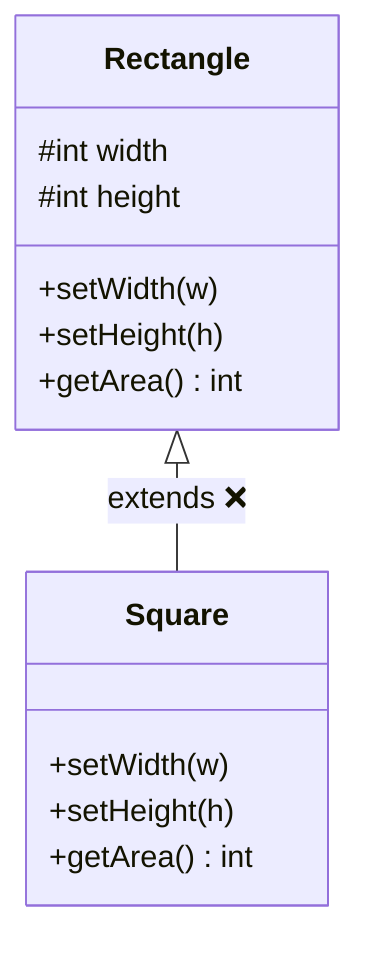
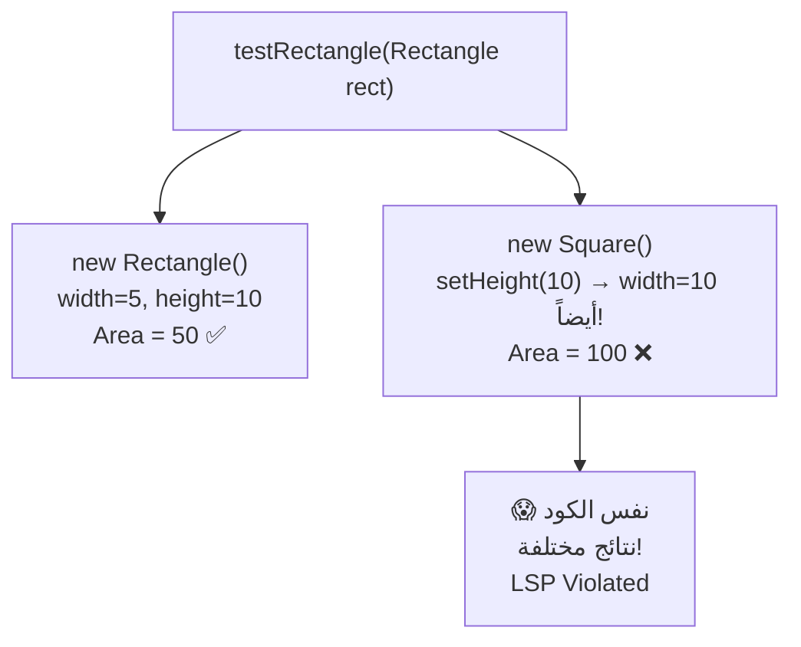
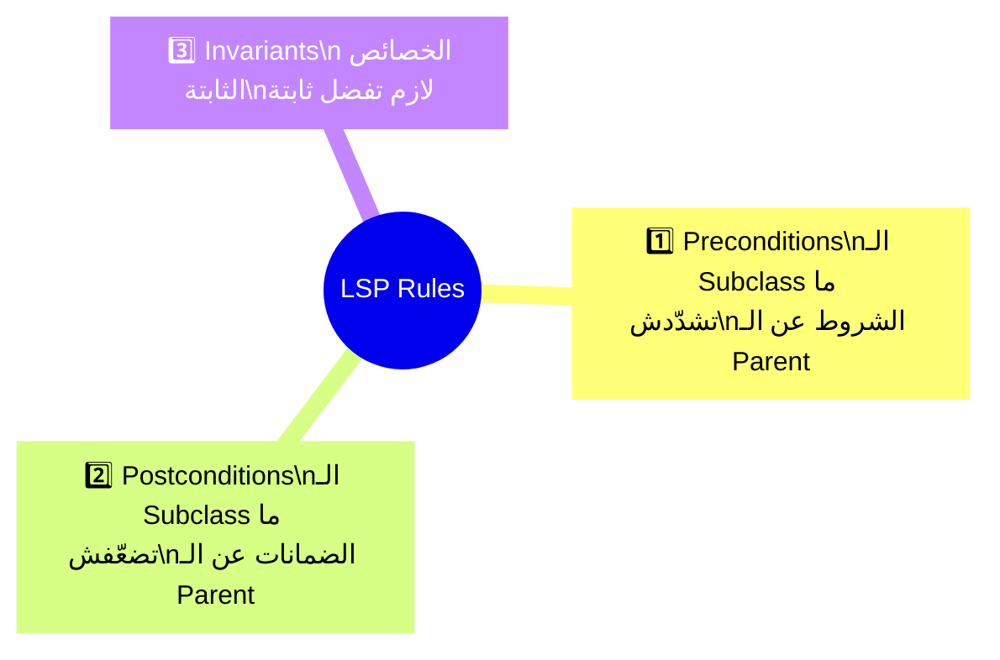
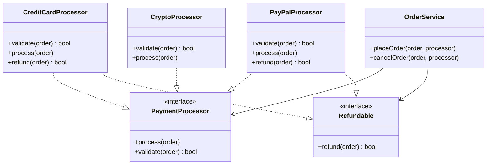

# 🄻 Liskov Substitution Principle — مبدأ استبدال ليسكوف

> **الحرف الثالث في SOLID**
> **المستوى:** مبتدئ ← متقدم | **الكود:** Java

---

## 1. 🚪 The Story — القصة الكاملة

> [!abstract] **📖 حكاية الموظف الجديد اللي "بيعمل عكس التوقعات"**
>
> تخيّل إنك مدير في شركة.
> عندك **موظف قديم — Ahmed** — شاطر جداً، بيكمّل كل مهمة وبيرجّع تقرير منظّم.
>
> يوم من الأيام Ahmed أخد إجازة، وجاء **موظف جديد — Khaled** يحلّ محلّه.
>
> قولتله: "اعمل نفس اللي Ahmed بيعمله."
>
> بس Khaled:
> - بدل ما يكمّل المهمة، بيرمي استثناء — **Exception** 🔥
> - بدل ما يرجّع تقرير، بيرجّع `null` 😐
> - بيقبل مهام Ahmed، بس بيعملها بطريقة غلط تماماً 💀
>
> **النتيجة؟** الشركة كلها اتعطّلت — مع إن المنظومة متصممة صح.
>
> **ده بالظبط اللي بيحصل لما بتخالف Liskov Substitution Principle.**

---

### السياق التاريخي — Historical Context

المبدأ ده اخترعته عالمة الكمبيوتر الأسطورية **Barbara Liskov** سنة **1987** في ورقة بحثية.

جملتها الأصلية كانت تقنية جداً:
> *"If S is a subtype of T, then objects of type T may be replaced with objects of type S without altering any of the desirable properties of the program."*

Uncle Bob ترجمها بشكل عملي:
> *"Subtypes must be substitutable for their base types."*
>
> **الـ Subclass لازم تقدر تحلّ محلّ الـ Parent Class من غير ما تكسر السلوك المتوقع.**

---

### ليه ده مهم ليّا؟ — Why This Matters

في OCP قلنا: "اعتمد على الـ Abstraction."
LSP بيقولك: **"الـ Abstraction دي لازم تكون موثوقة."**

لو كتبت:
```java
PaymentProcessor processor = new CryptoProcessor();
processor.process(order);
```

لازم تكون **واثق 100%** إن `CryptoProcessor` هتتصرّف بنفس الطريقة المتوقعة من أي `PaymentProcessor` تاني.

لو مش واثق — الـ OCP بتاعك بقى وهم. 🧨

---

## 2. ❌ The Naive Approach — المثال الكلاسيكي للكسر

> [!abstract] **📐 قصة المستطيل والمربع — The Classic Violation**
>
> ده المثال الأشهر في تاريخ LSP — وبيظهر في كل إنترفيو.



> [!failure] **❌ يبدو منطقياً — بس هو انتهاك صريح لـ LSP**

```java
// ❌ BAD: Square IS-A Rectangle mathematically, but NOT behaviorally
public class Rectangle {
    protected int width;
    protected int height;

    public void setWidth(int width)   { this.width = width; }
    public void setHeight(int height) { this.height = height; }

    public int getArea() { return width * height; }
}

public class Square extends Rectangle {

    // ❌ Square MUST have equal sides — so it overrides BOTH setters
    @Override
    public void setWidth(int width) {
        // Changing width also changes height — UNEXPECTED behavior!
        this.width = width;
        this.height = width;
    }

    @Override
    public void setHeight(int height) {
        // Changing height also changes width — UNEXPECTED behavior!
        this.width = height;
        this.height = height;
    }
}
```

```java
// ❌ This function works perfectly with Rectangle...
public void testRectangle(Rectangle rect) {
    rect.setWidth(5);
    rect.setHeight(10);

    // Expected: 5 * 10 = 50
    int area = rect.getArea();
    System.out.println("Area: " + area);

    // ✅ With Rectangle: Area = 50  → CORRECT
    // ❌ With Square:    Area = 100 → BROKEN! (setHeight changed width too)
}

// When we substitute Square for Rectangle — it BREAKS silently
testRectangle(new Rectangle()); // ✅ Area: 50
testRectangle(new Square());    // ❌ Area: 100 — LSP VIOLATED
```

### ليه ده مشكلة؟



**المشكلة الجوهرية:**
> في الرياضيات — **المربع هو مستطيل خاص ✅**
> في الكود — **المربع مش Substitutable للمستطيل ❌**
>
> **LSP بيتكلّم عن السلوك — Behavior — مش عن التصنيف الرياضي.**

---

## 3. 🧠 The Deep Dive — القواعد الحقيقية لـ LSP

### LSP بيحدد 3 قواعد أساسية:



#### القاعدة 1 — Preconditions (شروط الدخول)

```java
// Parent accepts any positive number
public class PaymentProcessor {
    public void process(double amount) {
        if (amount <= 0) throw new IllegalArgumentException("Amount must be positive");
        // process...
    }
}

// ❌ BAD: Subclass adds STRICTER condition — violates LSP
public class CryptoProcessor extends PaymentProcessor {
    @Override
    public void process(double amount) {
        // Now requires amount > 100 — MORE restrictive than parent!
        if (amount <= 100) throw new IllegalArgumentException("Crypto minimum is $100");
        // process...
    }
}
// Code that worked with PaymentProcessor breaks with CryptoProcessor!
```

#### القاعدة 2 — Postconditions (ضمانات الخروج)

```java
// Parent GUARANTEES it returns a non-null result
public class ReportGenerator {
    public Report generate(Order order) {
        return new Report(order); // always returns something
    }
}

// ❌ BAD: Subclass WEAKENS the guarantee — violates LSP
public class PdfReportGenerator extends ReportGenerator {
    @Override
    public Report generate(Order order) {
        if (order.getTotal() == 0) return null; // surprise null!
        return new PdfReport(order);
    }
}
// Caller never expected null — NullPointerException incoming 💣
```

#### القاعدة 3 — Invariants (الخصائص الثابتة)

```java
// Parent invariant: a Bank Account balance never goes below zero
public class BankAccount {
    protected double balance;

    public void withdraw(double amount) {
        if (amount > balance) throw new IllegalStateException("Insufficient funds");
        balance -= amount;
        // Invariant maintained: balance >= 0 always
    }
}

// ❌ BAD: Subclass breaks the invariant
public class OverdraftAccount extends BankAccount {
    @Override
    public void withdraw(double amount) {
        balance -= amount; // balance can go negative — invariant broken!
    }
}
```

---

## 4. 🎭 The Mentor Analogy — التشبيه اللي مش هتنساه

> [!abstract] **🚗 تشبيه الـ Test Drive**
>
> عندك **رخصة قيادة** تاخدك تقود أي عربية.
>
> لو ركبت **Toyota** — بتشتغل زي المتوقع ✅
> لو ركبت **BMW** — بتشتغل زي المتوقع ✅
> لو ركبت **Ferrari** — بتشتغل زي المتوقع ✅
>
> ليه؟ لأن كل العربيات بتحترم **عقد القيادة:**
> - عجلة لليمين = اتجاه يمين
> - فرامل = وقوف
> - بنزين = حركة
>
> لو ركبت عربية الفرامل فيها بتزوّد السرعة — **مش عربية تانية، ده كسر للعقد.** 💀
>
> **الـ Subclass زي العربية — لازم تحترم عقد القيادة بتاع الـ Parent.**

---

## 5. 💻 Code Section — الـ Refactoring الكامل

### مثال 1: إصلاح مشكلة المستطيل والمربع

> [!success] **✅ الحل: لا تورّث لما السلوك مختلف — استخدم Abstraction مشتركة**

```java
// ✅ Define a shared abstraction — not a hierarchy
public interface Shape {
    int getArea();
}

// ✅ Rectangle stands on its own
public class Rectangle implements Shape {
    private final int width;
    private final int height;

    public Rectangle(int width, int height) {
        this.width = width;
        this.height = height;
    }

    @Override
    public int getArea() { return width * height; }
}

// ✅ Square stands on its own — no forced relationship with Rectangle
public class Square implements Shape {
    private final int side;

    public Square(int side) {
        this.side = side;
    }

    @Override
    public int getArea() { return side * side; }
}

// ✅ Works perfectly with ANY Shape — LSP respected
public void printArea(Shape shape) {
    System.out.println("Area: " + shape.getArea());
}

// Both work correctly and predictably
printArea(new Rectangle(5, 10)); // Area: 50 ✅
printArea(new Square(5));        // Area: 25 ✅
```

---

### مثال 2: Payment System — LSP مطبّق بشكل صح

> [!failure] **❌ LSP Violation في Payment System**

```java
public abstract class PaymentProcessor {
    public abstract void process(Order order);
    public abstract boolean refund(Order order); // all processors must support refund
}

// ❌ BAD: Crypto doesn't support instant refunds — but forced to implement it
public class CryptoProcessor extends PaymentProcessor {
    @Override
    public void process(Order order) {
        System.out.println("Processing crypto payment...");
    }

    @Override
    public boolean refund(Order order) {
        // Crypto transactions are irreversible!
        throw new UnsupportedOperationException("Crypto refunds not supported"); // 💣
        // Caller expected refund() to work — LSP violated
    }
}
```

> [!success] **✅ الحل: Interface Segregation + LSP معاً**

```java
// ✅ Separate the capabilities — not all processors have all abilities
public interface PaymentProcessor {
    void process(Order order);
    boolean validate(Order order);
}

// ✅ Refund is a SEPARATE capability — only some processors have it
public interface Refundable {
    boolean refund(Order order);
}

// ✅ CreditCard supports both
public class CreditCardProcessor implements PaymentProcessor, Refundable {

    @Override
    public boolean validate(Order order) {
        System.out.println("Validating credit card...");
        return order.getTotal() > 0;
    }

    @Override
    public void process(Order order) {
        System.out.println("Charging credit card: $" + order.getTotal());
    }

    @Override
    public boolean refund(Order order) {
        System.out.println("Refunding to credit card: $" + order.getTotal());
        return true; // guaranteed to work — LSP respected ✅
    }
}

// ✅ Crypto only implements what it CAN do — honest contract
public class CryptoProcessor implements PaymentProcessor {

    @Override
    public boolean validate(Order order) {
        System.out.println("Verifying wallet address...");
        return order.getTotal() > 0;
    }

    @Override
    public void process(Order order) {
        System.out.println("Processing blockchain transaction: $" + order.getTotal());
    }
    // No refund() — because Crypto honestly can't do it
}
```

```java
// ✅ The service knows what it can rely on
public class OrderService {

    public void placeOrder(Order order, PaymentProcessor processor) {
        if (processor.validate(order)) {
            processor.process(order); // safe — ALL processors do this correctly
        }
    }

    public void cancelOrder(Order order, PaymentProcessor processor) {
        // Only attempt refund if the processor supports it
        if (processor instanceof Refundable refundable) {
            boolean success = refundable.refund(order);
            System.out.println("Refund status: " + (success ? "✅ Success" : "❌ Failed"));
        } else {
            System.out.println("⚠️ This payment method does not support refunds.");
        }
    }
}
```

---

### Class Diagram — الصورة الكاملة



> **لاحظ:** `CryptoProcessor` بتعمل كل اللي وعدت بيه وبس.
> مفيش `UnsupportedOperationException` مخبّي جوّا. **الكود صادق مع نفسه.**

---

### مثال 3: مثال من الحياة — Employee Types

```java
// ✅ LSP applied in a real HR system

public abstract class Employee {
    protected String name;
    protected double baseSalary;

    public abstract double calculatePay();

    // Guaranteed behavior: every employee gets a payslip
    public String generatePayslip() {
        return String.format("Payslip for %s: $%.2f", name, calculatePay());
    }
}

// ✅ Full-time employee — straightforward
public class FullTimeEmployee extends Employee {
    @Override
    public double calculatePay() {
        return baseSalary; // monthly salary
    }
}

// ✅ Part-time employee — different calculation, same contract
public class PartTimeEmployee extends Employee {
    private int hoursWorked;
    private double hourlyRate;

    @Override
    public double calculatePay() {
        return hoursWorked * hourlyRate; // still returns a valid double ✅
    }
}

// ✅ Contract employee — different again, same contract
public class ContractEmployee extends Employee {
    private double projectFee;

    @Override
    public double calculatePay() {
        return projectFee; // still returns a valid double ✅
    }
}

// ✅ Works with ANY Employee type — fully substitutable
public void processPayroll(List<Employee> employees) {
    for (Employee emp : employees) {
        System.out.println(emp.generatePayslip()); // always works correctly ✅
    }
}
```

---

## 6. ⚠️ Common Mistakes & Traps

> [!failure] **⚠️ أخطاء شائعة في LSP**

### الخطأ الأول: إعادة استخدام كود بـ Inheritance بدون علاقة حقيقية

```java
// ❌ Stack extends Vector in Java's standard library — famous LSP violation!
// Stack inherits add(index, element) from Vector
// But stacks should only allow push/pop — NOT indexed insertion!
Stack<Integer> stack = new Stack<>();
stack.add(0, 99); // Bypasses stack semantics — LSP violated by Java itself!

// ✅ Better: use Deque instead of Stack in modern Java
Deque<Integer> stack = new ArrayDeque<>();
stack.push(1);
stack.pop();
```

### الخطأ الثاني: `instanceof` كتير = LSP مكسور

```java
// ❌ If you're writing lots of instanceof checks — LSP is probably violated
public void processShape(Shape shape) {
    if (shape instanceof Circle circle) {
        // special circle behavior
    } else if (shape instanceof Rectangle rect) {
        // special rectangle behavior
    } else if (shape instanceof Triangle tri) {
        // special triangle behavior
    }
    // This shouldn't be needed if LSP is respected
}

// ✅ With proper LSP — the interface handles it
public void processShape(Shape shape) {
    shape.draw();   // each shape knows how to draw itself
    shape.resize(); // each shape knows how to resize itself
    // No instanceof needed ✅
}
```

### الخطأ الثالث: `UnsupportedOperationException` في Java Collections

```java
// ❌ Famous LSP violation in Java's own library!
List<String> fixed = List.of("a", "b", "c");
fixed.add("d"); // throws UnsupportedOperationException!
// List.of() returns a List, but violates the List contract for mutation
// Always document immutability clearly to avoid surprises
```

### Interview Traps 🪤

**السؤال:** "المربع مش مستطيل في الكود؟ بس في الرياضيات هو مستطيل!"
> **الإجابة الصح ✅:** LSP بيتكلّم عن السلوك — Behavioral Subtyping — مش التصنيف الرياضي. لو الـ Square بيغيّر توقعات الـ Rectangle — مش Substitutable. الـ Inheritance في الكود يعكس العلاقة السلوكية، مش الرياضية.

**السؤال:** "إمتى أعرف إن عندي LSP violation؟"
> **الإجابة الصح ✅:** لما تشوف `UnsupportedOperationException`، أو `instanceof` كتير، أو نتائج غير متوقعة لما تستبدل كلاس بـ Subclass بتاعها، أو لما الـ Subclass بتعمل `throw` لعمليات المفروض تشتغل.

---

## 7. 🧾 Summary — الملخص السريع

```
LSP = "Subtypes must be substitutable for their base types"
      الـ Subclass لازم تتصرف زي الـ Parent بدون مفاجآت
```

| النقطة | التفاصيل |
|---|---|
| **المعنى العميق** | الـ Subclass لازم تحترم العقد — تعمل ما وعدت بيه |
| **الـ 3 قواعد** | Preconditions ما تشدّدش — Postconditions ما تضعّفش — Invariants ما تكسرش |
| **العلامة الحمرا** | `UnsupportedOperationException` + `instanceof` كتير + نتائج غير متوقعة |
| **الفايدة** | الـ Polymorphism موثوق — أي Subclass تقدر تستخدمها بأمان |
| **الخطر** | Inheritance بدون علاقة سلوكية حقيقية |

### اختبار سريع — هل انت بتطبق LSP؟

```
✅ أي Subclass أقدر أحطها مكان الـ Parent من غير ما أخاف؟
✅ مفيش instanceof كتير في الكود؟
✅ مفيش UnsupportedOperationException في الـ Subclasses؟
✅ الـ Subclass مش بتشدّد شروط الـ Parent؟
✅ الـ Subclass بتضمن نفس النتائج؟
```

---

## 8. 🧪 Checkpoint — اختبار الفهم

> [!abstract] **🧠 Scenario — فكّر بعمق**

أنت بتبني نظام لـ **تشغيل الوسائط — Media Player**.
الكود ده موجود:

```java
public abstract class MediaPlayer {
    public abstract void play(String file);
    public abstract void pause();
    public abstract void stop();
    public abstract void record(String outputFile); // record audio/video
}

public class VideoPlayer extends MediaPlayer {
    @Override public void play(String file)   { System.out.println("Playing video: " + file); }
    @Override public void pause()             { System.out.println("Video paused"); }
    @Override public void stop()              { System.out.println("Video stopped"); }
    @Override public void record(String file) { System.out.println("Recording video to: " + file); }
}

public class RadioPlayer extends MediaPlayer {
    @Override public void play(String file)   { System.out.println("Tuning to station: " + file); }
    @Override public void pause()             { System.out.println("Radio paused"); }
    @Override public void stop()              { System.out.println("Radio stopped"); }
    @Override public void record(String file) {
        throw new UnsupportedOperationException("Radio cannot record!"); // 💣
    }
}
```

**الأسئلة:**

1. أين بالظبط انتهاك LSP في الكود ده؟ وليه هو مشكلة؟
2. لو الكود ده شغّال في Production وجه **PodcastPlayer** جديد — إيه الخطر؟
3. صمّم الحل الصح باستخدام **Interface Segregation** + **LSP** معاً.

> **⏸️ فكّر وجاوبني — أو قولّي نكمل على ISP مباشرة!**

---

## 🧰 Interview Survival Kit

**Q1: What is the Liskov Substitution Principle?**
> *If S is a subtype of T, objects of type T may be replaced with objects of type S without breaking the program. Simply: a subclass must honor the contract of its parent class — same behavior, no surprises.*

**Q2: What's the most famous LSP violation?**
> *The Square/Rectangle problem. Mathematically a square is a rectangle, but behaviorally in code, substituting a Square for a Rectangle breaks the expected behavior of setWidth/setHeight.*

**Q3: How do you detect LSP violations?**
> *Look for: UnsupportedOperationException in subclasses, heavy instanceof checks, unexpected results when substituting subclasses, and subclasses that throw where parents return.*

**Q4: What's the relationship between LSP and ISP?**
> *They're deeply connected. Often, LSP violations happen because an interface is too broad — it forces subclasses to implement methods they can't honor. ISP fixes this by splitting the interface into focused contracts, making LSP easier to respect.*

---

## 🔗 Cross Topic Questions

> [!abstract] **🔗 ربط LSP بما جاي — ISP**

في مثال الـ `RadioPlayer` — المشكلة الجذرية مش في الـ `RadioPlayer` نفسه.
المشكلة إن `MediaPlayer` **بتجبره يوقّع على عقد** يشمل `record()` — وهو مش قادر يوفّيه.

**لو الـ Interface اتقسم من الأول:**
```java
interface Playable   { void play(String file); void pause(); void stop(); }
interface Recordable { void record(String file); }
```

**الـ `RadioPlayer` كان هيـimplements بس `Playable`** — ومش هيتضطر يكسر اللي مش عنده.

**ده هو قلب مبدأ الـ I — Interface Segregation اللي جاي:**
*"الـ Client ما يتضطرش يعتمد على interfaces مش محتاجها."*

---

*📌 الجلسة الجاية: **I — Interface Segregation Principle**
"إزاي تصمّم عقوداً صغيرة ودقيقة بدل عقد ضخم مش كل الناس تقدر توفّيه؟"*
