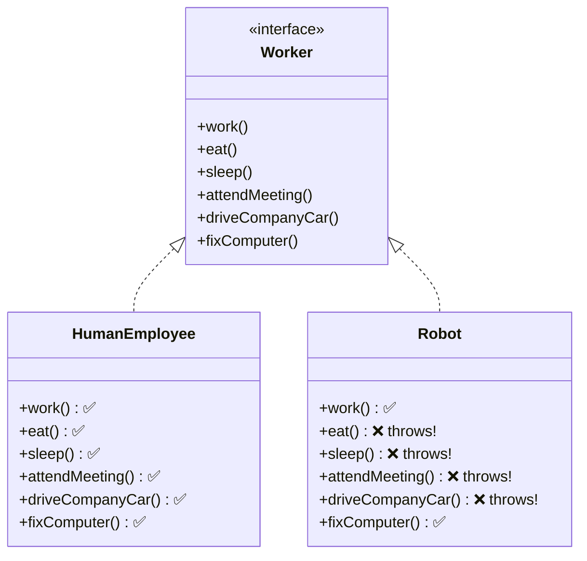
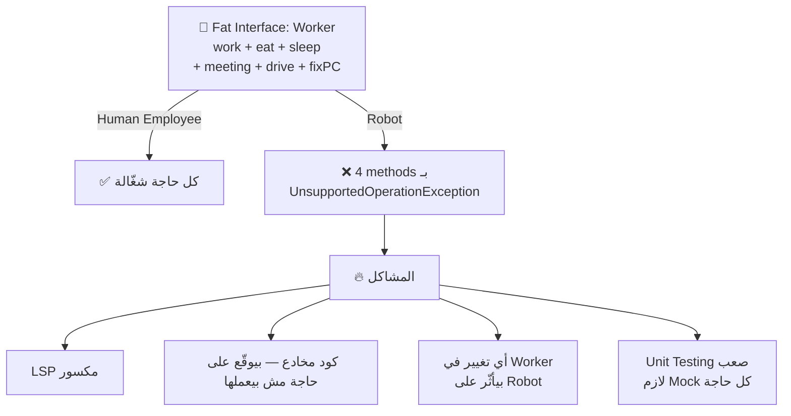
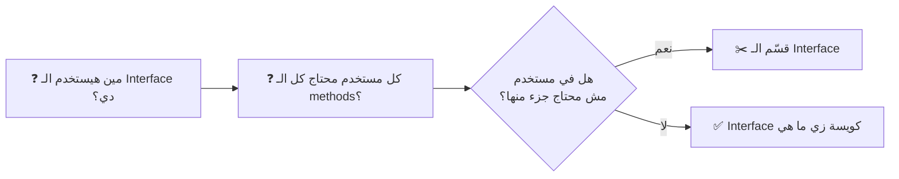
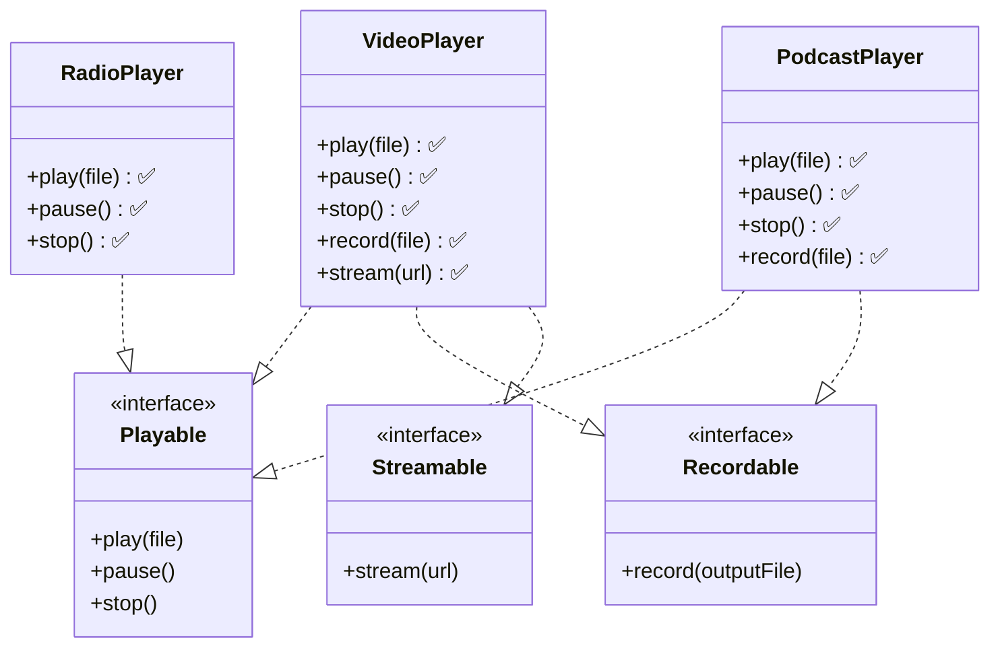

# 🄸 Interface Segregation Principle — مبدأ فصل الواجهات

> **الحرف الرابع في SOLID**
> **المستوى:** مبتدئ ← متقدم | **الكود:** Java

---

## 1. 🚪 The Story — القصة الكاملة

> [!abstract] **📖 حكاية عقد العمل اللي فيه كل حاجة**
>
> تخيّل إنك بتوظّف **موظفين** في شركتك.
>
> عملت عقد عمل واحد فيه:
> - ✅ تيجي الشغل كل يوم
> - ✅ تكمّل المهام المطلوبة
> - 🚗 تقود سيارة الشركة في التوصيلات
> - 🍳 تطبخ الغداء لفريق العمل
> - 🔧 تصلّح الكمبيوتر لو عطل
> - 🎤 تقدّم البريزنتيشن في الاجتماعات الخارجية
>
> الموظف المحاسب وقّع — بس هو مش بيعرف يقود، ومش طبّاخ، ومش تقني.
>
> **النتيجة؟**
> - كل ما فيه اجتماع خارجي: "مش قادر أقدّم!" 😰
> - كل ما الكمبيوتر عطل: "مش شغلتي!" 😤
> - كل ما محتاجين توصيل: "مش عارف أقود!" 😤
>
> **الموظف مكبّل بعقد مش خصّوصه — وكل ما بيوقّع عليه بيحصل مشكلة.**
>
> **ده بالظبط اللي بيحصل لما Interface بتاعتك أكبر من اللازم.**

---

### السياق التاريخي — Historical Context

**Uncle Bob** صاغ المبدأ ده في التسعينيات لما كان بيستشير شركة **Xerox** في مشكلة حقيقية:

> الشركة عندها نظام للطباعة — فيه Interface واحدة ضخمة اسمها `Job`.
> كل Device — طابعة، فاكس، سكانر — بتـ implement الـ `Job` كامل.
> بس الـ Fax مش بتعمل Staple.
> والـ Scanner مش بتعمل Print.
> والكل بيكتب `throw new UnsupportedOperationException()` في نص مهام مش بتاعتهم.
>
> **Uncle Bob لاحظ إن المشكلة مش في الأجهزة — في الـ Interface.**

جملته الشهيرة:

> *"Clients should not be forced to depend on interfaces they do not use."*
> **الـ Client ما يتضطرش يعتمد على interfaces مش محتاجها.**

---

### ليه ده مهم ليّا؟ — Why This Matters

كل ما Interface بتاعتك تبقى **أكبر من اللازم**:
- كل Implementer بيضطر يكتب كود مش بتاعه أو يـ`throw`
- أي تغيير في الـ Interface بيأثّر على **كل الكلاسات** اللي بتـ implement حتى اللي ما تستخدمش الجزء ده
- الـ Unit Tests بتتعقّد — لازم تـ Mock methods مش محتاجها
- الـ LSP بتتكسر من غير ما تحسّ

---

## 2. ❌ The Naive Approach — الكود قبل ISP

> [!failure] **❌ الـ Fat Interface — الواجهة السمينة**



```java
// ❌ BAD: One massive interface that forces everyone to implement everything
public interface Worker {
    void work();
    void eat();
    void sleep();
    void attendMeeting();
    void driveCompanyCar();
    void fixComputer();
}

// ✅ Human Employee can do all of these — no problem
public class HumanEmployee implements Worker {
    @Override public void work()           { System.out.println("Working..."); }
    @Override public void eat()            { System.out.println("Eating lunch..."); }
    @Override public void sleep()          { System.out.println("Sleeping..."); }
    @Override public void attendMeeting()  { System.out.println("In meeting..."); }
    @Override public void driveCompanyCar(){ System.out.println("Driving..."); }
    @Override public void fixComputer()    { System.out.println("Fixing PC..."); }
}

// ❌ Robot CANNOT eat, sleep, attend meetings, or drive — but FORCED to implement them!
public class Robot implements Worker {
    @Override public void work()           { System.out.println("Robot working..."); }
    @Override public void fixComputer()    { System.out.println("Robot fixing PC..."); }

    // ❌ Forced to "implement" things it cannot do — LSP violated too!
    @Override public void eat()            { throw new UnsupportedOperationException("Robots don't eat!"); }
    @Override public void sleep()          { throw new UnsupportedOperationException("Robots don't sleep!"); }
    @Override public void attendMeeting()  { throw new UnsupportedOperationException("Robots don't attend meetings!"); }
    @Override public void driveCompanyCar(){ throw new UnsupportedOperationException("Robot can't drive!"); }
}
```

### المشاكل:



---

## 3. 🧠 The Deep Dive — الفهم العميق

### ISP بيقول إيه بالظبط؟

> [!abstract] **💡 الفكرة المحورية**
>
> مش "اعمل Interface لكل method" — ده Over-engineering.
>
> الفكرة هي: **اجمع الـ methods اللي بتتغيّر مع بعض في نفس الـ Interface.**
>
> السؤال الصح: **"مين الـ Client اللي هيستخدم الـ Interface دي؟ وإيه اللي يحتاجه فعلاً؟"**

---

### كيف تحدد حجم الـ Interface الصح؟



---

### الفرق بين ISP و SRP

| | **SRP** | **ISP** |
|---|---|---|
| **بيتكلّم عن** | الـ Class | الـ Interface |
| **السؤال** | مين اللي ممكن يغيّر الكلاس دي؟ | مين اللي هيستخدم الـ Interface دي؟ |
| **الهدف** | كل Class ليها مسؤولية واحدة | كل Interface ليها عميل واحد واضح |
| **العلامة الحمرا** | Class بتعمل حاجات كتير مختلفة | Interface فيها methods مش كل Implementers محتاجينها |

---

## 4. 🎭 The Mentor Analogy — التشبيه العميق

> [!abstract] **🍽️ تشبيه قائمة الطعام — Menu**
>
> تخيّل مطعم عنده **قايمة واحدة** فيها:
> - وجبات رئيسية
> - حلويات
> - مشروبات
> - طلبات الـ Delivery
> - طلبات الـ Catering للأفراح
> - قايمة الـ Vegan
>
> الزبون العادي بيجيله 12 صفحة — بيتوه في القايمة. 😵
>
> المطعم الذكي بيقدّم:
> - **قايمة الغداء** — للزبون العادي
> - **قايمة الـ Delivery** — لطلبات الأونلاين
> - **قايمة الـ Catering** — لحجوزات المناسبات
> - **قايمة الـ Vegan** — للزبون النباتي
>
> كل زبون بياخد **بس اللي يخصّه**.
>
> **الـ Interface زي القايمة — كل Client لازم ياخد بس الـ methods اللي يحتاجها.**

---

## 5. 💻 Code Section — الـ Refactoring الكامل

### مثال 1: Worker System — إصلاح كامل

> [!success] **✅ Step 1 — تحديد الـ Capabilities المختلفة**

```java
// ✅ Each interface represents ONE capability
// Group methods that change together and serve the same client

public interface Workable {
    void work();
}

public interface Eatable {
    void eat();
}

public interface Sleepable {
    void sleep();
}

public interface Meetable {
    void attendMeeting();
}

public interface Drivable {
    void driveCompanyCar();
}

public interface TechSupportable {
    void fixComputer();
}
```

> [!success] **✅ Step 2 — كل كلاس بتـ implement بس اللي تقدر تعمله**

```java
// ✅ Human Employee implements everything it can actually do
public class HumanEmployee implements Workable, Eatable, Sleepable,
                                      Meetable, Drivable, TechSupportable {
    @Override public void work()            { System.out.println("Working on tasks..."); }
    @Override public void eat()             { System.out.println("Having lunch..."); }
    @Override public void sleep()           { System.out.println("Resting..."); }
    @Override public void attendMeeting()   { System.out.println("In the meeting..."); }
    @Override public void driveCompanyCar() { System.out.println("Driving to client..."); }
    @Override public void fixComputer()     { System.out.println("Fixing the server..."); }
}

// ✅ Robot only implements what it can HONESTLY do — no UnsupportedOperationException
public class Robot implements Workable, TechSupportable {
    @Override public void work()        { System.out.println("Robot executing task..."); }
    @Override public void fixComputer() { System.out.println("Robot diagnosing system..."); }
    // Honest — no fake implementations, no surprises
}
```

> [!success] **✅ Step 3 — الـ Clients بيطلبوا بس اللي يحتاجوه**

```java
// ✅ Each service depends ONLY on what it needs
public class WorkManagementService {
    // Only cares about work — doesn't need to know if entity eats or drives
    public void assignTask(Workable worker) {
        worker.work();
    }
}

public class MeetingScheduler {
    // Only cares about meeting attendance
    public void scheduleStandup(List<Meetable> attendees) {
        for (Meetable attendee : attendees) {
            attendee.attendMeeting();
        }
    }
}

public class ITSupport {
    // Only cares about technical support ability
    public void requestSupport(TechSupportable technician) {
        technician.fixComputer();
    }
}

// ✅ Usage — clean and flexible
WorkManagementService wm = new WorkManagementService();
wm.assignTask(new HumanEmployee()); // ✅
wm.assignTask(new Robot());         // ✅ — Robot is Workable

ITSupport it = new ITSupport();
it.requestSupport(new HumanEmployee()); // ✅
it.requestSupport(new Robot());         // ✅ — Robot is TechSupportable

MeetingScheduler ms = new MeetingScheduler();
ms.scheduleStandup(List.of(new HumanEmployee())); // ✅
// ms.scheduleStandup(List.of(new Robot())); // ❌ Compile error — Robot is NOT Meetable
// This is GOOD — the error is caught at compile time, not runtime!
```

---

### مثال 2: Media Player — ربط مع LSP

بعد ما شفنا المشكلة في LSP — دلوقتي نحلّها بـ ISP:



```java
// ✅ Focused interfaces — each represents one media capability
public interface Playable {
    void play(String file);
    void pause();
    void stop();
}

public interface Recordable {
    void record(String outputFile);
}

public interface Streamable {
    void stream(String url);
}

// ✅ VideoPlayer can do everything
public class VideoPlayer implements Playable, Recordable, Streamable {
    @Override public void play(String file)     { System.out.println("Playing video: " + file); }
    @Override public void pause()               { System.out.println("Video paused"); }
    @Override public void stop()                { System.out.println("Video stopped"); }
    @Override public void record(String file)   { System.out.println("Recording to: " + file); }
    @Override public void stream(String url)    { System.out.println("Streaming from: " + url); }
}

// ✅ RadioPlayer only plays — honest and clean
public class RadioPlayer implements Playable {
    @Override public void play(String station) { System.out.println("Tuning to: " + station); }
    @Override public void pause()              { System.out.println("Radio paused"); }
    @Override public void stop()               { System.out.println("Radio stopped"); }
    // No record, no stream — and that's perfectly fine
}

// ✅ PodcastPlayer plays and records — but doesn't stream
public class PodcastPlayer implements Playable, Recordable {
    @Override public void play(String file)   { System.out.println("Playing podcast: " + file); }
    @Override public void pause()             { System.out.println("Podcast paused"); }
    @Override public void stop()              { System.out.println("Podcast stopped"); }
    @Override public void record(String file) { System.out.println("Recording podcast to: " + file); }
}
```

```java
// ✅ Services depend only on what they need
public class MediaController {
    public void playMedia(Playable player, String source) {
        player.play(source); // works with ANY player safely
    }
}

public class RecordingService {
    public void startRecording(Recordable recorder, String output) {
        recorder.record(output); // only called on things that CAN record
    }
}

public class LiveStreamService {
    public void startStream(Streamable streamer, String url) {
        streamer.stream(url); // only VideoPlayer reaches here — by design
    }
}
```

---

### مثال 3: E-Commerce — مثال متكامل من الواقع

```java
// ✅ Real-world example: Product capabilities in an e-commerce system
public interface Purchasable {
    void addToCart();
    double getPrice();
}

public interface Downloadable {
    String getDownloadUrl();
    long getFileSizeBytes();
}

public interface Shippable {
    double getWeightKg();
    String getShippingAddress();
}

public interface Reviewable {
    void submitReview(String text, int rating);
    double getAverageRating();
}

// ✅ Physical product — can be purchased, shipped, and reviewed
public class PhysicalProduct implements Purchasable, Shippable, Reviewable {
    @Override public void addToCart()             { System.out.println("Added to cart"); }
    @Override public double getPrice()            { return 49.99; }
    @Override public double getWeightKg()         { return 1.5; }
    @Override public String getShippingAddress()  { return "123 Main St"; }
    @Override public void submitReview(String t, int r) { System.out.println("Review saved"); }
    @Override public double getAverageRating()    { return 4.5; }
}

// ✅ Digital product — purchased and downloaded, NOT shipped
public class DigitalProduct implements Purchasable, Downloadable, Reviewable {
    @Override public void addToCart()             { System.out.println("Added to cart"); }
    @Override public double getPrice()            { return 9.99; }
    @Override public String getDownloadUrl()      { return "https://cdn.app.com/file.zip"; }
    @Override public long getFileSizeBytes()      { return 52_428_800L; } // 50MB
    @Override public void submitReview(String t, int r) { System.out.println("Review saved"); }
    @Override public double getAverageRating()    { return 4.8; }
}

// ✅ Gift card — only purchasable, nothing else
public class GiftCard implements Purchasable {
    @Override public void addToCart() { System.out.println("Gift card added"); }
    @Override public double getPrice() { return 50.0; }
    // No shipping, no download, no review — and that's perfectly honest
}
```

---

## 6. ⚠️ Common Mistakes & Traps

> [!failure] **⚠️ أخطاء شائعة في ISP**

### الخطأ الأول: Interface لكل Method — Nano-Interfaces

```java
// ❌ TOO granular — an interface for every single method
public interface Nameable    { String getName(); }
public interface Emailable   { String getEmail(); }
public interface Phoneable   { String getPhone(); }
public interface Addressable { String getAddress(); }

// This is not ISP — this is just noise.
// Group methods by WHO uses them together, not by method count.

// ✅ Better: group by client need
public interface ContactInfo {
    String getName();
    String getEmail();
    String getPhone(); // always used together by ContactService
}
```

### الخطأ الثاني: الخلط بين ISP وSRP

```java
// ❌ Confusion: "ISP = SRP for interfaces"
// They're related but different:

// SRP on a CLASS: UserService should not handle both business logic AND email
// ISP on an INTERFACE: UserOperations should not force implementers
//                      to implement methods they don't need

// The test:
// SRP → "Does this class have one reason to change?"
// ISP → "Does every implementer of this interface USE all its methods?"
```

### الخطأ الثالث: Marker Interfaces الفاضية

```java
// ⚠️ Be careful with empty marker interfaces
public interface Serializable { } // Used in Java — valid marker
public interface Auditable    { } // Fine if used consistently

// ❌ But creating them for no reason adds confusion
public interface IsImportant  { } // What does this even do?
```

### Interview Traps 🪤

**السؤال:** "ISP معناها interface لكل method؟"
> **الإجابة الصح ✅:** لأ. ISP معناها اجمع الـ methods اللي بتتغيّر مع بعض وبتخدم نفس الـ Client. الـ Rule مش حجم الـ Interface — هو توافق الـ Interface مع احتياجات الـ Clients اللي هتستخدمها.

**السؤال:** "إيه الفرق بين ISP وSRP؟"
> **الإجابة الصح ✅:** SRP بيتكلّم عن الـ Class وسبب تغييرها. ISP بيتكلّم عن الـ Interface وإنها ما تجبرش الـ Implementers يكتبوا كود مش بتاعهم. بس الاتنين بيتشاركوا نفس الفكرة الجوهرية: كل entity ليها مسؤولية واضحة ومحدّدة.

---

## 7. 🧾 Summary — الملخص السريع

```
ISP = "Clients should not be forced to depend on interfaces they do not use."
      الـ Interface ما تجبرش الـ Implementer يكتب كود مش محتاجه
```

| النقطة | التفاصيل |
|---|---|
| **المعنى العميق** | كل Interface لازم تعكس احتياج Client واحد واضح |
| **السؤال الصح** | هل كل Implementer بيستخدم كل الـ methods؟ |
| **العلامة الحمرا** | `UnsupportedOperationException` + methods فاضية + `throw` في implementations |
| **الأداة** | قسّم الـ Interface لـ interfaces أصغر حسب الـ Client |
| **العلاقة مع LSP** | ISP بيمنع LSP violations قبل ما تحصل |
| **الخطر** | Nano-interfaces — تقسيم زيادة عن اللزوم |

### الـ Signs اللي تقولك إنك محتاج ISP:

```
🚩 Implementer بيكتب throw new UnsupportedOperationException()
🚩 Method في الـ Interface جسمها فاضي { } في كلاسات معيّنة
🚩 لما تغيّر حاجة في الـ Interface — كلاسات كتير بتتأثر بدون سبب
🚩 الـ Interface اسمها "everything": IFullWorker, ICompleteUser
🚩 Unit Tests محتاجة تـ Mock methods مش ليها علاقة بالـ Test
```

---

## 8. 🧪 Checkpoint — اختبار الفهم

> [!abstract] **🧠 Scenario واقعي — Smart Home System**

أنت بتبني نظام **Smart Home**.
الكود ده موجود:

```java
public interface SmartDevice {
    void turnOn();
    void turnOff();
    void setTemperature(int degrees); // for AC and heaters
    void lock();                      // for smart locks and doors
    void unlock();                    // for smart locks and doors
    void setBrightness(int level);    // for smart lights
    void playMusic(String song);      // for smart speakers
    void takePicture();               // for security cameras
}

public class SmartLight implements SmartDevice {
    @Override public void turnOn()  { System.out.println("Light ON"); }
    @Override public void turnOff() { System.out.println("Light OFF"); }
    @Override public void setBrightness(int level) { System.out.println("Brightness: " + level); }

    // ❌ All of these are forced implementations
    @Override public void setTemperature(int d) { throw new UnsupportedOperationException(); }
    @Override public void lock()                { throw new UnsupportedOperationException(); }
    @Override public void unlock()              { throw new UnsupportedOperationException(); }
    @Override public void playMusic(String s)   { throw new UnsupportedOperationException(); }
    @Override public void takePicture()         { throw new UnsupportedOperationException(); }
}
```

**الأسئلة:**

1. كم انتهاك ISP موجود هنا؟ وما هو أثر كل انتهاك؟
2. لو ضفنا `SmartFridge` — كام method هتبقى `UnsupportedOperationException`؟ وليه ده خطر؟
3. صمّم الـ Interfaces الصحيحة — وبيّن إيه الـ Interfaces اللي `SmartLight` هتـ implement منها بس.

> **⏸️ فكّر وجاوبني — أو قولّي نكمل على DIP مباشرة!**

---

## 🧰 Interview Survival Kit

**Q1: What is the Interface Segregation Principle?**
> *Clients should not be forced to depend on interfaces they don't use. Large interfaces should be split into smaller, focused ones so that implementers only need to know about the methods relevant to them.*

**Q2: How does ISP relate to LSP?**
> *They're deeply connected. Fat interfaces force implementers to provide fake implementations — throwing UnsupportedOperationException — which directly violates LSP. ISP prevents LSP violations by ensuring every implementer can genuinely fulfill the contract.*

**Q3: How do you decide how to split an interface?**
> *Ask: "Who are the clients of this interface, and do they all need all the methods?" If different clients use different subsets, split the interface along those client boundaries.*

**Q4: Can ISP be over-applied?**
> *Yes. Creating one interface per method (nano-interfaces) is over-engineering. The goal is cohesion — group methods that are used together by the same client, not just split everything apart.*

---

## 🔗 Cross Topic Questions

> [!abstract] **🔗 ربط ISP بما جاي — DIP**

في كل الأمثلة اللي شفناهم — `WorkManagementService`, `RecordingService`, `MediaController` — كلهم بيعتمدوا على **Interfaces**، مش على Implementations مباشرة.

```java
// WorkManagementService depends on Workable — NOT on HumanEmployee or Robot
public void assignTask(Workable worker) { worker.work(); }
```

السؤال: **ليه ده أحسن من كده؟**

```java
// Why is this worse?
public void assignTask(HumanEmployee employee) { employee.work(); }
```

الإجابة هي **قلب مبدأ الـ D — Dependency Inversion:**
*"اعتمد على Abstractions — مش على Implementations."*

وهنشوف إزاي الـ DIP بيربط كل الـ SOLID مع بعض في نظام واحد متماسك.

---

*📌 الجلسة الجاية: **D — Dependency Inversion Principle**
"الحرف الأخير في SOLID — وده اللي بيربط كل حاجة مع بعض."*
