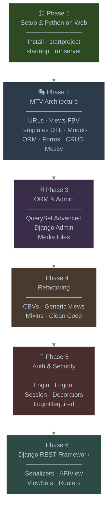
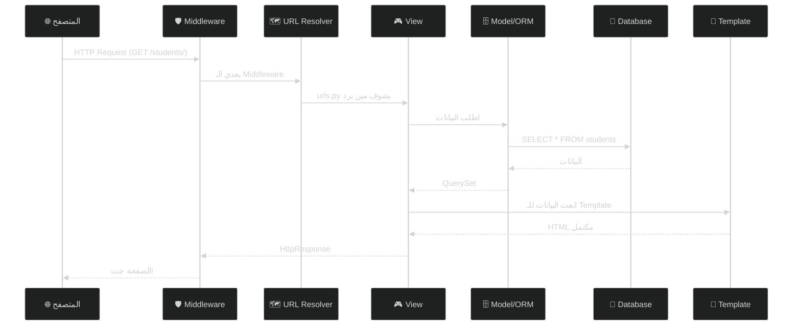
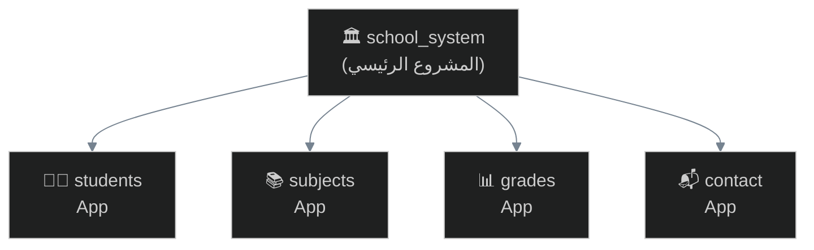
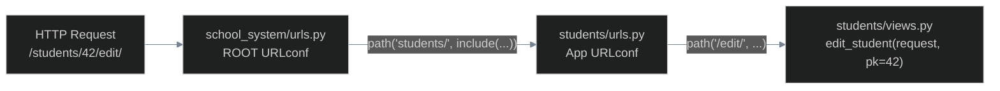
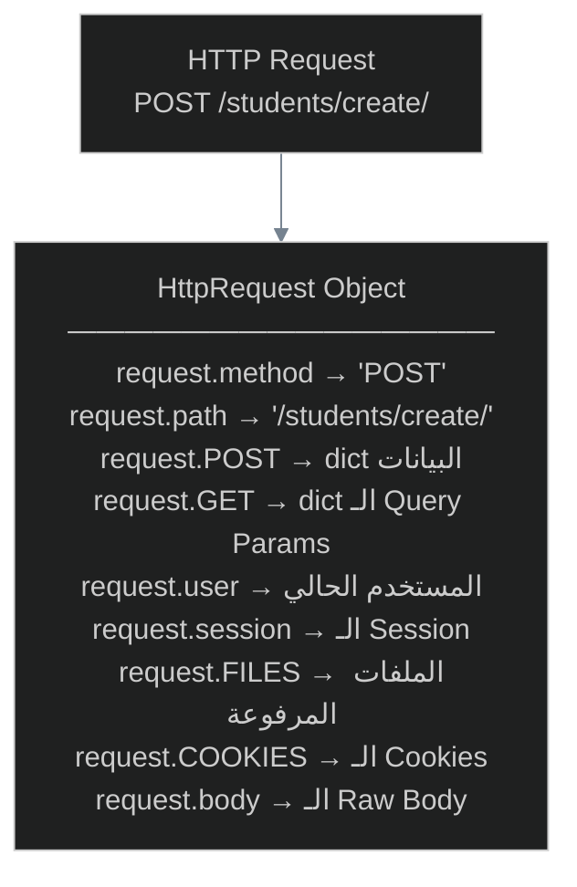
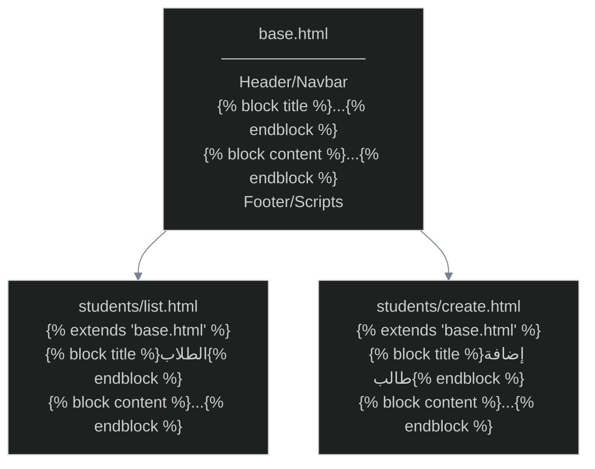
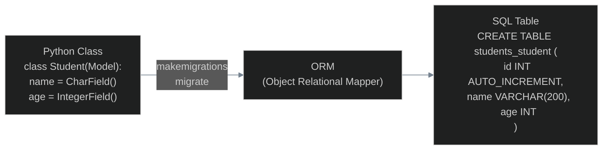
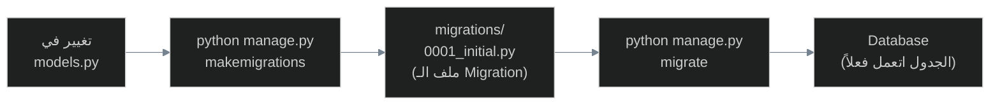
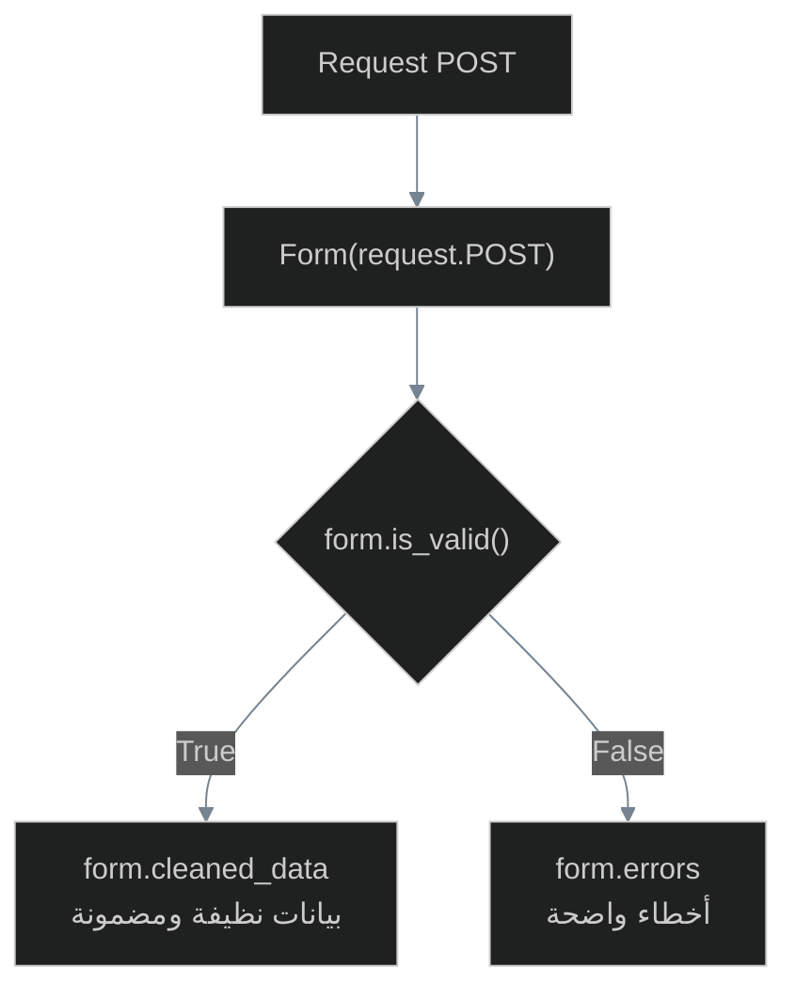
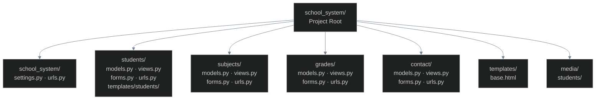

# 🐍 رحلة Django — من Python للويب
## ITI School Management System — خطوة خطوة

> **الأستاذ:** Ahmed Moawad (ITI Lectures)
> **المشروع التطبيقي:** ITI School Management System
> **السلاح:** Python + Django + Pure Templates → وفي الآخر DRF

---

## خريطة الرحلة (The Roadmap)



---

# 🏗️ Phase 1 — Setup & Python على الويب

---

## 1.1 — ليه Django أصلاً؟ (The "Why")

يلا نتخيل إنك بتبني بيت. عندك خيارين:
- **Option A:** تبني كل حاجة من الصفر — تعجن الطوب، تصنع العتب، تعمل الكهرباء بإيدك.
- **Option B:** تيجي لقطعة أرض فيها **Foundation + Scaffolding** جاهزة — أنت بس تتحكم في التصميم والتوزيع.

Django هو **Option B**. هو **"Batteries Included" Web Framework** — يعني جاي معاه:

| الأداة | وظيفتها |
|--------|---------|
| URL Resolver | يوجّه الـ Request لـ View صح |
| ORM | يتكلم مع الـ DB بـ Python بدل SQL |
| Template Engine | يجيب HTML ديناميكي |
| Admin Panel | CRUD جاهز من أول يوم |
| Auth System | Login/Logout/Permissions جاهزة |
| Forms | Validation جاهز |

> [!quote] 📜 التعريف الرسمي
> *Django is a high-level Python Web framework that encourages rapid development. It takes care of much of the hassle of Web development, so you can focus on writing your app without needing to reinvent the wheel.*

---

## 1.2 — معمارية MVT تحت الكبوت

قبل ما نكتب أي كود، لازم تفهم ازاي Django بيشتغل تحت الكبوت. ده أهم حاجة في الـ Phase ده.



> [!info] 🧠 MTV vs MVC — سؤال الإنترفيو
> Django بيتكلم عن **MTV** مش **MVC**:
> - **M**odel = نفسه (البيانات)
> - **T**emplate = الـ **View** في MVC (الـ UI)
> - **V**iew = الـ **Controller** في MVC (المنطق)
>
> Django بيقلب الأسماء عمداً — الـ View في Django هو اللي بيتحكم، مش اللي بيعرض.

---

## 1.3 — التثبيت والإعداد

### الخطوة 1: إنشاء بيئة افتراضية

أول حاجة دايماً — عمر ما تثبّت حاجة globally في Python projects.

```bash
# إنشاء الـ Virtual Environment
python -m venv venv

# تشغيله على Linux/Mac
source venv/bin/activate

# تشغيله على Windows
venv\Scripts\activate

# هتشوف كده في الـ terminal
(venv) $
```

> [!tip] 💡 ليه venv؟
> تخيل عندك مشروعين — واحد محتاج Django 3.2 والتاني محتاج Django 5.0. لو ثبّتت globally هيتعاركوا. الـ venv بيعزل كل مشروع في "غرفته" الخاصة.

### الخطوة 2: تثبيت Django

```bash
pip install django

# تأكد التثبيت
python -m django --version
# Output: 5.x.x
```

### الخطوة 3: إنشاء المشروع

```bash
django-admin startproject school_system
```

شوف اللي اتعمل:

```
school_system/           ← الـ Root Directory (مجلد المشروع الكبير)
├── manage.py            ← ريموت كنترول المشروع
└── school_system/       ← الـ Project Package (إعدادات المشروع)
    ├── __init__.py      ← بيقول لـ Python "ده package"
    ├── settings.py      ← ملف الإعدادات الرئيسي
    ├── urls.py          ← الـ URL Router الأساسي
    ├── asgi.py          ← للـ Async deployment
    └── wsgi.py          ← للـ WSGI deployment (الأشيع)
```

> [!info] 🧠 manage.py تحت الكبوت
> `manage.py` هو wrapper حوالين `django-admin`. الفرق الوحيد إنه بيضبط الـ `DJANGO_SETTINGS_MODULE` environment variable تلقائياً عشان يعرف ملف الـ settings بتاعك.

### الخطوة 4: تشغيل السيرفر

```bash
cd school_system
python manage.py runserver
```

افتح `http://127.0.0.1:8000/` — هتشوف صاروخ Django 🚀

---

## 1.4 — ملف settings.py تحت الكبوت

`settings.py` هو "مخ" المشروع. كل حاجة Django بيعملها بتبدأ من هنا. خليني أعدّيك على أهم الإعدادات اللي هتشتغل معاها:

```python
# school_system/settings.py

# المسار الأساسي للمشروع — بيتبني تلقائياً
BASE_DIR = Path(__file__).resolve().parent.parent
```

> [!info] 🔍 BASE_DIR تحت الكبوت
> `Path(__file__)` = مسار ملف settings.py نفسه
> `.parent` مرة = مجلد `school_system/` الداخلي
> `.parent` مرتين = مجلد `school_system/` الخارجي (الـ Root)
>
> باختصار: BASE_DIR = المسار لـ root المشروع.

```python
# مفتاح سري للـ Cryptographic Signing — لازم يبقى سري في Production!
SECRET_KEY = 'django-insecure-...'

# في Development: True عشان ترى الـ Error Pages
# في Production: False عشان متكشفش أسرار الـ Server
DEBUG = True

# مين مسموحله يوصل للسيرفر
ALLOWED_HOSTS = []  # في Development كده كويس
```

```python
# التطبيقات المثبّتة في المشروع
INSTALLED_APPS = [
    'django.contrib.admin',        # لوحة الإدارة
    'django.contrib.auth',         # نظام المستخدمين
    'django.contrib.contenttypes', # نظام الـ Content Types
    'django.contrib.sessions',     # نظام الـ Sessions
    'django.contrib.messages',     # نظام الـ Messages
    'django.contrib.staticfiles',  # الـ Static Files
]
```

```python
# قاعدة البيانات — الافتراضي SQLite وده تمام للـ Development
DATABASES = {
    'default': {
        'ENGINE': 'django.db.backends.sqlite3',
        'NAME': BASE_DIR / 'db.sqlite3',
    }
}
```

---

## 1.5 — إنشاء أول App

المشروع = **مجموعة Apps**. كل App بتعمل حاجة محددة. في مشروعنا:



بداية بالـ app الرئيسية:

```bash
python manage.py startapp students
```

شوف البنية:

```
students/
├── __init__.py
├── admin.py       ← تسجيل الـ Models في الـ Admin Panel
├── apps.py        ← إعدادات الـ App نفسها
├── models.py      ← تعريف جداول قاعدة البيانات
├── tests.py       ← الاختبارات
└── views.py       ← منطق الـ Request/Response
```

> [!warning] ⚠️ خطوة مهمة تتنساش!
> بعد ما تعمل app جديدة، لازم تضيفها في `INSTALLED_APPS` في `settings.py` — وإلا Django مش هيعرف إنها موجودة!

```python
# school_system/settings.py
INSTALLED_APPS = [
    # ... الـ Built-in Apps
    'students.apps.StudentsConfig',  # أو ببساطة 'students'
]
```

---

## 1.6 — أول View في حياتك

> [!example] 💡 مثال عام (General Example)
> أبسط view ممكنة في Django — مجرد بترد بـ text:

```python
# myapp/views.py
from django.http import HttpResponse

def hello(request):
    return HttpResponse("مرحباً بالعالم!")
```

ووصّله بـ URL:

```python
# myapp/urls.py
from django.urls import path
from . import views

urlpatterns = [
    path('hello/', views.hello, name='hello'),
]
```

---

> [!example] 🏗️ تطبيق المشروع (Project Example - PE)
> أول view في مشروع ITI School System — صفحة Home:

```python
# students/views.py
from django.http import HttpResponse

def home(request):
    return HttpResponse("<h1>Welcome to ITI School Management System</h1>")
```

```python
# school_system/urls.py
from django.contrib import admin
from django.urls import path
from students import views

urlpatterns = [
    path('admin/', admin.site.urls),
    path('', views.home, name='home'),
]
```

> [!bug] 🕵️ كود مؤقت (هيتعمله Refactoring قدام)
> - الصفحة دي HTML مكتوب جوا Python — ده كارثة للمشاريع الحقيقية!
> - مفيش Template، مفيش Authentication Check.
> - **في Phase 2** هنستبدلها بـ Template حقيقي.
> - **في Phase 5** هنضيف الـ `login_required` Decorator.

---

> [!tip] 🫒 زتونة الإنترفيو — Phase 1

| السؤال | الإجابة الـ Pro |
|--------|----------------|
| ما الفرق بين MVC و MTV؟ | في Django الـ View = Controller، الـ Template = View. Django قلب الأسماء. |
| ليه نعمل Virtual Environment؟ | لعزل الـ dependencies لكل مشروع ومنع التعارض بين الإصدارات. |
| إيه اللي بيعمله `manage.py`؟ | Wrapper لـ `django-admin` بيضبط `DJANGO_SETTINGS_MODULE` تلقائياً. |
| ما الفرق بين `startproject` و `startapp`؟ | `startproject` ينشئ المشروع كله (settings, urls, wsgi). `startapp` ينشئ وحدة وظيفية صغيرة جوا المشروع. |
| ليه DEBUG=False في Production؟ | عشان الـ Error Pages بتكشف مسارات الملفات والكود والـ settings — خطر أمني. |

---

---

# 🎭 Phase 2 — معمارية MTV (الـ Monolith MVP)

> [!note] 📌 قانون الـ Phase ده
> في الـ Phase ده هنكتب كود "شغّال بس مش نظيف". الهدف هو **نفهم كل ليبر وحده** قبل ما نبدأ نحسّن. في Phase 4 هنرجع ونعمل Refactoring لكل حاجة.

---

## 2.1 — URL Resolver بالتفصيل

### الـ URLs تحت الكبوت



الـ URL Resolver بيشتغل زي gatekeeper — بياخد الـ URL، يقطّعه، ويدور على أول pattern بيتطابق.

### قاعدة الـ `include()` — عمود العمارة النظيفة

> [!example] 💡 مثال عام (General Example)
> بدل ما تحط كل URLs في ملف واحد:

```python
# ❌ الطريقة القبيحة - كل URLs في مكان واحد
# school_system/urls.py
urlpatterns = [
    path('', views.home),
    path('students/', views.student_list),
    path('students/create/', views.student_create),
    path('subjects/', views.subject_list),
    # ... بيكبر ويبقى جحيم
]
```

```python
# ✅ الطريقة الصح - كل App ليها ملف URLs خاص
# school_system/urls.py  ← الـ Root
from django.urls import path, include

urlpatterns = [
    path('admin/', admin.site.urls),
    path('students/', include('students.urls')),
    path('subjects/', include('subjects.urls')),
]
```

```python
# students/urls.py  ← الـ App URLs
from django.urls import path
from . import views

app_name = 'students'  # ← مهم جداً — الـ Namespace

urlpatterns = [
    path('', views.student_list, name='list'),
    path('create/', views.student_create, name='create'),
    path('<int:pk>/', views.student_detail, name='detail'),
    path('<int:pk>/edit/', views.student_edit, name='edit'),
    path('<int:pk>/delete/', views.student_delete, name='delete'),
]
```

---

> [!example] 🏗️ تطبيق المشروع (Project Example - PE)
> إنشاء بنية الـ URLs الكاملة لمشروع ITI School System:

```python
# school_system/urls.py
from django.contrib import admin
from django.urls import path, include

urlpatterns = [
    path('admin/', admin.site.urls),
    path('', include('students.urls')),      # home + students
    path('subjects/', include('subjects.urls')),
    path('grades/', include('grades.urls')),
    path('contact/', include('contact.urls')),
]
```

```python
# students/urls.py
from django.urls import path
from . import views

app_name = 'students'

urlpatterns = [
    path('', views.home, name='home'),
    path('students/', views.student_list, name='list'),
    path('students/create/', views.student_create, name='create'),
    path('students/<int:pk>/', views.student_detail, name='detail'),
    path('students/<int:pk>/edit/', views.student_edit, name='edit'),
    path('students/<int:pk>/delete/', views.student_delete, name='delete'),
]
```

---

### URL Patterns — أنواع الـ Converters

```python
# <int:pk>     ← رقم صحيح موجب
# <str:name>   ← أي string مفيهوش /
# <slug:slug>  ← letters, numbers, hyphens, underscores
# <uuid:id>    ← UUID format
# <path:url>   ← زي str بس بيشمل /
```

> [!info] 🧠 ليه `<int:pk>` مش `<str:pk>`؟
> لو استخدمت `<str:pk>` وجالك `/students/abc/` — هيعدي الـ URL Resolver وهيوصل للـ View! وبعدين لما تعمل `Student.objects.get(pk='abc')` هيجيب Exception.
> لو استخدمت `<int:pk>` — الـ URL Resolver نفسه هيرفض `abc` ويرجع 404 فوراً.

---

### الـ `name` و `app_name` — إيه فايدتهم؟

```python
# في الـ Template بدل ما تكتب الـ URL hardcoded:
# ❌ <a href="/students/42/edit/">Edit</a>
# ✅ <a href="">Edit</a>

# في الـ View بدل الـ redirect hardcoded:
# ❌ return redirect('/students/')
# ✅ return redirect('students:list')
```

> [!tip] 💡 فايدة الـ Namespacing
> لو غيّرت الـ URL من `/students/` لـ `/pupil/` — بتغير في مكان واحد بس (الـ `urls.py`) والباقي كله اللي بيستخدم `` أو `reverse()` بيشتغل تلقائياً. ده اللي معناه **Loosely Coupled**.

---

## 2.2 — Views — قلب Django

الـ View هو اللي بيستقبل الـ Request، بيفكر، وبيرد بـ Response.

### HttpRequest Object تحت الكبوت



> [!example] 💡 مثال عام (General Example)
> View بتستقبل GET و POST وبتتصرف بناءً على الـ method:

```python
# views.py
from django.http import HttpResponse

def my_form_view(request):
    if request.method == 'GET':
        # المستخدم جاي يشوف الفورم
        return HttpResponse("<form method='POST'><input name='name'><button>Send</button></form>")
    
    elif request.method == 'POST':
        # المستخدم بعت بيانات
        name = request.POST.get('name', 'غريب')
        return HttpResponse(f"أهلاً يا {name}!")
```

---

> [!example] 🏗️ تطبيق المشروع (Project Example - PE)
> View لإضافة طالب جديد — **بدون Models بعد** (بنستخدم dict مؤقت):

```python
# students/views.py
from django.http import HttpResponse

# ← مؤقت جداً — هيتغير لما ناخد Models
fake_students = []

def student_create(request):
    if request.method == 'GET':
        html = """
        <form method="POST">
            <input type="hidden" name="csrfmiddlewaretoken" value="fake">
            <input name="name" placeholder="اسم الطالب">
            <input name="age" placeholder="العمر">
            <button type="submit">أضف طالب</button>
        </form>
        """
        return HttpResponse(html)
    
    elif request.method == 'POST':
        name = request.POST.get('name')
        age = request.POST.get('age')
        fake_students.append({'name': name, 'age': age})
        return HttpResponse(f"تمت إضافة {name} بنجاح!")
```

> [!bug] 🕵️ كود مؤقت (هيتعمله Refactoring في Phase 2.5 و Phase 3)
> - مفيش قاعدة بيانات — البيانات بتتضيع لو السيرفر اتوقف!
> - HTML مكتوب في Python — جحيم للصيانة.
> - الـ CSRF Token مش صح.
> - **في 2.5:** هنستبدل الـ HTML بـ Template.
> - **في Phase 3:** هنضيف الـ Model وهنحفظ في الـ DB حقيقي.

---

### HttpResponse — أنواع الردود

```python
from django.http import (
    HttpResponse,          # رد عادي
    HttpResponseRedirect,  # Redirect (302)
    Http404,               # صفحة 404
    JsonResponse,          # رد بـ JSON
)
from django.shortcuts import (
    render,          # بيعمل HttpResponse من Template
    redirect,        # بيعمل HttpResponseRedirect
    get_object_or_404,  # بيجيب Object أو بيرمي 404
)
```

> [!tip] 💡 `render()` = الأكثر استخداماً
> ```python
> # render(request, template_name, context={})
> return render(request, 'students/list.html', {'students': students})
> # بيعمل: Template Loader → Template + Context → HTML String → HttpResponse
> ```

---

## 2.3 — Templates & DTL (Django Template Language)

### إعداد الـ Templates

قبل كل حاجة، Django لازم يعرف فين يلاقي الـ Templates. عندنا طريقتين:

**الطريقة المفضّلة — مجلد `templates` موزّع داخل كل App:**

```
students/
├── templates/
│   └── students/          ← ← ← مهم جداً — subfolder باسم الـ app
│       ├── list.html
│       ├── create.html
│       ├── detail.html
│       └── edit.html
├── models.py
└── views.py
```

> [!warning] ⚠️ ليه `students/templates/students/` مش بس `students/templates/`؟
> Django بيدوّر في كل `templates/` folder في كل app. لو عندك `list.html` في `students/templates/` وعندك `list.html` تاني في `subjects/templates/` — هيحصل تعارض!
> الحل: subfolder باسم الـ App. فبيتحول لـ `students/list.html` و `subjects/list.html` — مش بيتعاركوا.

ضيف ده في `settings.py`:

```python
# settings.py
TEMPLATES = [
    {
        'BACKEND': 'django.template.backends.django.DjangoTemplates',
        'DIRS': [],  # ممكن تضيف مجلد templates عام هنا
        'APP_DIRS': True,  # ← ده هو اللي بيقوله يدور في كل app
        'OPTIONS': {
            'context_processors': [
                'django.template.context_processors.debug',
                'django.template.context_processors.request',
                'django.contrib.auth.context_processors.auth',
                'django.contrib.messages.context_processors.messages',
            ],
        },
    },
]
```

---

### DTL — اللغة السرية للـ Templates

DTL ليها 4 عناصر أساسية:

```
{{ variable }}        ← طباعة قيمة متغير
             ← منطق: if, for, block, extends, ...
{{ var | filter }}    ← تعديل على القيمة قبل العرض
{# comment #}         ← تعليق مش بيظهر في الـ HTML
```

---

### المتغيرات

> [!example] 💡 مثال عام (General Example)

```python
# views.py
def index(request):
    context = {
        'name': 'محمد',
        'age': 22,
        'courses': ['Python', 'Django', 'React'],
        'student': {'name': 'أحمد', 'grade': 95},
    }
    return render(request, 'myapp/index.html', context)
```

```html
<!-- templates/myapp/index.html -->
<h1>أهلاً، {{ name }}!</h1>
<p>العمر: {{ age }}</p>
<p>الكورس الأول: {{ courses.0 }}</p>
<p>اسم الطالب: {{ student.name }}</p>
```

> [!info] 🧠 الـ Dot Notation في DTL
> `{{ student.name }}` — Django بيحاول بالترتيب ده:
> 1. Dictionary lookup: `student['name']`
> 2. Attribute lookup: `student.name`
> 3. Method call: `student.name()`
> 4. List index: `student[name]`
>
> أول واحد ينجح — يرجعه. ده اللي بيخلي نفس السينتاكس يشتغل مع dicts و objects و lists.

---

### الـ `for` Loop

> [!example] 💡 مثال عام (General Example)

```html

    <li>{{ forloop.counter }}. {{ course }}</li>

    <li>مفيش كورسات متاحة</li>

```

> [!info] 🧠 `forloop` Variables
> | المتغير | القيمة |
> |---------|--------|
> | `forloop.counter` | عداد يبدأ من 1 |
> | `forloop.counter0` | عداد يبدأ من 0 |
> | `forloop.first` | True لو أول iteration |
> | `forloop.last` | True لو آخر iteration |
> | `forloop.revcounter` | عكس `counter` |

---

### الـ `if` Statement

```html

    <span class="badge-gold">ممتاز</span>

    <span class="badge-green">جيد جداً</span>

    <span class="badge-blue">جيد</span>

    <span class="badge-red">راسب — اعمل لك حساب</span>

```

---

### Template Inheritance — أقوى سلاح في DTL

ده أهم concept في الـ Templates. الفكرة: **Base Template واحد، Pages ترث منه**.



> [!example] 💡 مثال عام (General Example)

```html
<!-- templates/base.html -->
<!DOCTYPE html>
<html lang="ar" dir="rtl">
<head>
    <meta charset="UTF-8">
    <title>موقعي</title>
</head>
<body>
    <nav>
        <a href="/">الرئيسية</a>
    </nav>
    
    <main>
        
        <!-- الـ Child Pages بتحط محتواها هنا -->
        
    </main>
    
    <footer>جميع الحقوق محفوظة</footer>
</body>
</html>
```

```html
<!-- templates/myapp/about.html -->


من نحن


    <h1>من نحن</h1>
    <p>نحن فريق رائع...</p>

```

---

> [!example] 🏗️ تطبيق المشروع (Project Example - PE)
> إنشاء الـ Base Template لمشروع ITI School System:

```html
<!-- templates/base.html -->
<!DOCTYPE html>
<html lang="ar" dir="rtl">
<head>
    <meta charset="UTF-8">
    <meta name="viewport" content="width=device-width, initial-scale=1.0">
    <title>ITI School System</title>
    <style>
        body { font-family: Arial, sans-serif; margin: 0; background: #f5f5f5; }
        nav { background: #1a5276; padding: 15px; }
        nav a { color: white; text-decoration: none; margin: 0 15px; }
        .container { max-width: 1200px; margin: 30px auto; padding: 0 20px; }
        .messages { list-style: none; padding: 0; }
        .messages li { padding: 10px; margin: 5px 0; border-radius: 4px; }
        .messages .success { background: #d4edda; color: #155724; }
        .messages .error { background: #f8d7da; color: #721c24; }
    </style>
</head>
<body>
    <nav>
        <a href="">🏠 الرئيسية</a>
        <a href="">👨‍🎓 الطلاب</a>
        <a href="">📚 المواد</a>
        <a href="">📊 الدرجات</a>
    </nav>

    <div class="container">
        
        <ul class="messages">
            
            <li class="{{ message.tags }}">{{ message }}</li>
            
        </ul>
        

        
    </div>
</body>
</html>
```

```html
<!-- students/templates/students/home.html -->


الرئيسية — ITI School


    <div style="text-align: center; padding: 50px;">
        <h1>🎓 مرحباً بك في نظام ITI للإدارة المدرسية</h1>
        <p>إدارة الطلاب، المواد، والدرجات من مكان واحد.</p>
    </div>

```

---

### الـ Filters المهمة

```html
<!-- إخفاء الـ Email جزئياً -->
{{ email | truncatechars:5 }}

<!-- تحويل النص لـ Title Case -->
{{ name | title }}

<!-- عدد العناصر -->
{{ students | length }}

<!-- قيمة افتراضية لو None -->
{{ phone | default:"لا يوجد" }}

<!-- تقطيع النص بعد عدد معين من الكلمات -->
{{ bio | truncatewords:20 }}

<!-- تحويل \n لـ <br> -->
{{ notes | linebreaks }}

<!-- تاريخ بصيغة معينة -->
{{ created_at | date:"Y/m/d" }}

<!-- سعر بالفواصل -->
{{ price | floatformat:2 }}
```

---

## 2.4 — Models & ORM

> [!quote] 📜 من الـ Lecture
> *A model is the single, definitive source of information about your data.*

الـ Model هو **تعريف الجدول في قاعدة البيانات بلغة Python**. بدل ما تكتب SQL، بتكتب Python Class.



### أهم Field Types

```python
# أنواع النصوص
CharField(max_length=200)      # VARCHAR - للنصوص القصيرة - max_length إجباري
TextField()                     # TEXT - للنصوص الطويلة (Bio, Description)
EmailField()                    # CharField + Email Validation
URLField()                      # CharField + URL Validation
SlugField()                     # للـ URL-friendly strings

# الأرقام
IntegerField()                  # -2,147,483,648 to 2,147,483,647
PositiveIntegerField()          # 0 to 2,147,483,647
DecimalField(max_digits=5, decimal_places=2)  # للـ Prices
AutoField(primary_key=True)     # Auto-increment ID (الافتراضي)

# التواريخ
DateField()                     # YYYY-MM-DD
DateTimeField()                 # YYYY-MM-DD HH:MM:SS
DateField(auto_now_add=True)    # بيتضبط تلقائي وقت الإنشاء فقط
DateField(auto_now=True)        # بيتحدث كل ما الـ Record اتحدث

# الـ Boolean
BooleanField()                  # True/False

# الملفات
ImageField(upload_to='students/')  # بيتعامل مع الصور (محتاج Pillow)
FileField(upload_to='docs/')       # لأي نوع ملف
```

### أهم Field Options

```python
class Student(models.Model):
    name = models.CharField(
        max_length=200,
        null=False,       # لا يقبل NULL في DB (الافتراضي)
        blank=False,      # مش يقبل فراغ في الـ Forms (الافتراضي)
        db_column='student_name',  # اسم مخصص للـ Column في الـ DB
    )
    phone = models.CharField(
        max_length=11,
        null=True,        # يقبل NULL في DB
        blank=True,       # يقبل فراغ في الـ Forms
    )
    age = models.PositiveIntegerField(
        default=18,       # قيمة افتراضية
    )
```

> [!warning] ⚠️ null vs blank — فرق مهم جداً!
> - `null=True` → يخزّن `NULL` في قاعدة البيانات (Database level)
> - `blank=True` → يقبل الحقل فارغ في الـ Forms (Validation level)
>
> عادةً لو حقل اختياري: تحط الاتنين `null=True, blank=True`.
> للـ CharField/TextField: فضّل `blank=True` بدون `null=True` — Django بيخزّن string فارغ `""` بدل `NULL`.

---

> [!example] 💡 مثال عام (General Example)
> Model بسيط لكتاب:

```python
# library/models.py
from django.db import models

class Book(models.Model):
    title = models.CharField(max_length=200)
    author = models.CharField(max_length=200)
    price = models.DecimalField(max_digits=8, decimal_places=2)
    is_available = models.BooleanField(default=True)
    created_at = models.DateTimeField(auto_now_add=True)

    def __str__(self):
        return self.title

    class Meta:
        ordering = ['-created_at']  # ترتيب افتراضي
        db_table = 'library_books'  # اسم الجدول في DB
```

---

> [!example] 🏗️ تطبيق المشروع (Project Example - PE)
> Models لمشروع ITI School System:

```python
# students/models.py
from django.db import models

class Student(models.Model):
    name = models.CharField(max_length=200)
    age = models.PositiveIntegerField()
    email = models.EmailField(unique=True)
    image = models.ImageField(
        upload_to='students/',  # الصور هتتخزن في media/students/
        null=True,
        blank=True,
    )
    created_at = models.DateTimeField(auto_now_add=True)

    def __str__(self):
        return self.name

    class Meta:
        ordering = ['name']
```

```python
# subjects/models.py
from django.db import models

class Subject(models.Model):
    name = models.CharField(max_length=200)
    description = models.TextField(blank=True)

    def __str__(self):
        return self.name

    class Meta:
        ordering = ['name']
```

```python
# grades/models.py
from django.db import models
from students.models import Student
from subjects.models import Subject

class Grade(models.Model):
    student = models.ForeignKey(
        Student,
        on_delete=models.CASCADE,   # لو الطالب اتحذف، درجاته تتحذف
        related_name='grades',
    )
    subject = models.ForeignKey(
        Subject,
        on_delete=models.CASCADE,
        related_name='grades',
    )
    grade = models.DecimalField(max_digits=5, decimal_places=2)
    created_at = models.DateTimeField(auto_now_add=True)

    def __str__(self):
        return f"{self.student.name} - {self.subject.name}: {self.grade}"

    class Meta:
        # كل طالب له درجة واحدة في كل مادة
        unique_together = ('student', 'subject')
        ordering = ['-grade']
```

---

### الـ Migrations — الـ Version Control لقاعدة البيانات



```bash
# الخطوة 1: تثبيت Pillow عشان ImageField
pip install Pillow

# الخطوة 2: اعمل migration files
python manage.py makemigrations

# شوف الـ SQL اللي هيتنفذ (اختياري بس مفيد)
python manage.py sqlmigrate students 0001

# الخطوة 3: نفّذ الـ Migrations على الـ DB
python manage.py migrate
```

> [!info] 🧠 الـ Migration Files تحت الكبوت
> `makemigrations` بيقارن الـ Models الحالية بآخر state معروف (اللي في `migrations/` folder) ويولّد Python file بيوصف التغييرات.
>
> `migrate` بيأخد الـ Migration files ويترجمها لـ SQL ويشغّلها على الـ DB. بيشيل check في جدول `django_migrations` عشان يعرف إيه اللي اتنفذ وإيه اللي لسه.

---

## 2.5 — ORM Operations (القوة الحقيقية)

### CRUD Operations بالـ ORM

#### CREATE

```python
# الطريقة 1: إنشاء Object وسيف
student = Student(name='أحمد علي', age=20, email='ahmed@iti.edu.eg')
student.save()

# الطريقة 2: create() مرة واحدة (الأشيع)
student = Student.objects.create(
    name='محمد سامي',
    age=22,
    email='mohamed@iti.edu.eg'
)
```

#### READ

```python
# كل السجلات — بترجع QuerySet
Student.objects.all()

# فلترة — بترجع QuerySet
Student.objects.filter(age=20)
Student.objects.filter(name__contains='أحمد')  # LIKE '%أحمد%'
Student.objects.filter(age__gte=18)             # age >= 18
Student.objects.filter(age__in=[18, 19, 20])    # age IN (18, 19, 20)

# سجل واحد — بترجع Object مش QuerySet
Student.objects.get(pk=1)       # بيرمي DoesNotExist لو مش موجود
Student.objects.get(email='ahmed@iti.edu.eg')

# عداد
Student.objects.count()
Student.objects.filter(age__gte=20).count()

# ترتيب
Student.objects.all().order_by('name')        # تصاعدي
Student.objects.all().order_by('-created_at')  # تنازلي

# تحديد حقول معينة
Student.objects.values('name', 'email')        # Dict
Student.objects.values_list('name', flat=True) # List of strings
```

> [!info] 🧠 QuerySet — Lazy Evaluation
> الـ QuerySet **مش بيتنفذ فوراً** لما تكتبه. بيتنفذ بس لما:
> - تعمله Iterate (في `for` loop)
> - تحوّله لـ list: `list(qs)`
> - تعمله slicing: `qs[0]` أو `qs[:5]`
> - تعمله `len()` أو `count()`
>
> ده بيخليك تعمل Chaining من غير ما تعمل Queries زيادة:
> ```python
> students = Student.objects.all()          # مش بيتنفذ
> students = students.filter(age__gte=18)   # لسه مش بيتنفذ
> students = students.order_by('name')      # لسه مش بيتنفذ
> for s in students:                        # هنا بس SQL بيتعمل
>     print(s.name)
> ```

#### UPDATE

```python
# تحديث سجل واحد
student = Student.objects.get(pk=1)
student.name = 'أحمد محمد'
student.save()

# تحديث مجموعة مرة واحدة (أسرع — UPDATE SQL واحدة)
Student.objects.filter(age__lt=18).update(age=18)
```

#### DELETE

```python
# حذف سجل واحد
student = Student.objects.get(pk=1)
student.delete()

# حذف مجموعة
Student.objects.filter(age__lt=15).delete()
```

---

### Field Lookups — القاموس السري

```python
# Exact Match (الافتراضي)
filter(name='أحمد')           # = filter(name__exact='أحمد')

# Text Lookups
filter(name__contains='أح')   # LIKE '%أح%'
filter(name__startswith='أح')  # LIKE 'أح%'
filter(name__endswith='علي')   # LIKE '%علي'
filter(name__icontains='ahmed') # LIKE '%ahmed%' (Case Insensitive)

# Numeric Lookups
filter(age__gt=18)    # >
filter(age__gte=18)   # >=
filter(age__lt=25)    # <
filter(age__lte=25)   # <=
filter(age__range=(18, 25))  # BETWEEN 18 AND 25

# NULL Lookups
filter(image__isnull=True)   # IS NULL
filter(image__isnull=False)  # IS NOT NULL

# IN Lookup
filter(age__in=[18, 19, 20])  # IN (18, 19, 20)
```

---

> [!example] 🏗️ تطبيق المشروع (Project Example - PE)
> Views كاملة لـ Students CRUD **بدون Forms Class** (هنستخدم `request.POST` مباشرة):

```python
# students/views.py
from django.shortcuts import render, redirect, get_object_or_404
from .models import Student

def home(request):
    return render(request, 'students/home.html')

def student_list(request):
    students = Student.objects.all()
    return render(request, 'students/list.html', {'students': students})

def student_detail(request, pk):
    student = get_object_or_404(Student, pk=pk)
    return render(request, 'students/detail.html', {'student': student})

def student_create(request):
    if request.method == 'POST':
        name = request.POST.get('name')
        age = request.POST.get('age')
        email = request.POST.get('email')
        image = request.FILES.get('image')  # الصور جوا FILES مش POST!

        Student.objects.create(
            name=name, age=age, email=email, image=image
        )
        return redirect('students:list')

    return render(request, 'students/create.html')

def student_edit(request, pk):
    student = get_object_or_404(Student, pk=pk)

    if request.method == 'POST':
        student.name = request.POST.get('name')
        student.age = request.POST.get('age')
        student.email = request.POST.get('email')
        if request.FILES.get('image'):
            student.image = request.FILES.get('image')
        student.save()
        return redirect('students:detail', pk=pk)

    return render(request, 'students/edit.html', {'student': student})

def student_delete(request, pk):
    student = get_object_or_404(Student, pk=pk)
    if request.method == 'POST':
        student.delete()
        return redirect('students:list')
    return render(request, 'students/confirm_delete.html', {'student': student})
```

> [!bug] 🕵️ كود مؤقت (هيتعمله Refactoring في Phase 2.6 و Phase 4)
> - مفيش Validation — لو حد بعت email مكسور أو age = "abc" → Exception!
> - كود متكرر كتير (نفس الـ pattern في كل view).
> - **في Phase 2.6:** هنضيف Django Forms للـ Validation.
> - **في Phase 4:** هنحوّل كل ده لـ CBVs.

---

### إعداد الـ Media Files (للصور)

```python
# settings.py
import os

MEDIA_URL = '/media/'                      # الـ URL prefix
MEDIA_ROOT = os.path.join(BASE_DIR, 'media')  # المجلد الفعلي
```

```python
# school_system/urls.py
from django.conf import settings
from django.conf.urls.static import static

urlpatterns = [
    # ... your urls
]

# في Development بس — Production بيستخدم Nginx/Apache
if settings.DEBUG:
    urlpatterns += static(settings.MEDIA_URL, document_root=settings.MEDIA_ROOT)
```

```html
<!-- في الـ Template لعرض صورة الطالب -->

    

    

```

> [!warning] ⚠️ `enctype` في الـ Form
> أي Form بيرفع ملفات **لازم** يكون فيها `enctype="multipart/form-data"`:
> ```html
> <form method="POST" enctype="multipart/form-data">
>     
>     <!-- inputs -->
> </form>
> ```
> بدونها، `request.FILES` بتبقى فارغة وبيحصل لك ساعات من الـ Debugging.

---

## 2.6 — Django Forms

### ليه Forms بدل `request.POST` مباشرة؟

تخيل المشهد ده:
- User بعت `age = "مائة وعشرين"` بدل `120`.
- User بعت `email = "ده مش email خالص"`.
- User بعت form فاضي خالص.

بـ `request.POST` مباشرة → **Exception في الـ View** أو بيانات غلط في الـ DB.

بـ Django Forms → **Validation تلقائي + Error Messages جاهزة**.



### إنشاء Form Class

> [!example] 💡 مثال عام (General Example)
> Form بسيط لإضافة كتاب:

```python
# library/forms.py
from django import forms

class AddBookForm(forms.Form):
    title = forms.CharField(
        label='عنوان الكتاب',
        max_length=200,
        widget=forms.TextInput(attrs={'class': 'form-control', 'placeholder': 'أدخل العنوان'})
    )
    author = forms.CharField(label='المؤلف', max_length=200)
    price = forms.DecimalField(label='السعر', min_value=0)
    is_available = forms.BooleanField(label='متاح؟', required=False)
```

```python
# library/views.py
from .forms import AddBookForm

def add_book(request):
    if request.method == 'POST':
        form = AddBookForm(request.POST)
        if form.is_valid():
            # form.cleaned_data = dict من البيانات المنظّفة والـ validated
            title = form.cleaned_data['title']
            author = form.cleaned_data['author']
            price = form.cleaned_data['price']
            # Book.objects.create(...)
            return redirect('library:list')
    else:
        form = AddBookForm()  # Form فارغ

    return render(request, 'library/add_book.html', {'form': form})
```

```html
<!-- templates/library/add_book.html -->


<form method="POST">
    
    {{ form.as_p }}   <!-- كل حقل في <p> -->
    <button type="submit">أضف</button>
</form>

```

---

> [!example] 🏗️ تطبيق المشروع (Project Example - PE)
> Forms لمشروع ITI School System:

```python
# students/forms.py
from django import forms
from .models import Student

class StudentForm(forms.Form):
    name = forms.CharField(
        label='الاسم',
        max_length=200,
        widget=forms.TextInput(attrs={'class': 'form-input'})
    )
    age = forms.IntegerField(
        label='العمر',
        min_value=5,
        max_value=100,
    )
    email = forms.EmailField(
        label='البريد الإلكتروني',
    )
    image = forms.ImageField(
        label='الصورة الشخصية',
        required=False,
    )
```

```python
# subjects/forms.py
from django import forms

class SubjectForm(forms.Form):
    name = forms.CharField(label='اسم المادة', max_length=200)
    description = forms.CharField(
        label='الوصف',
        required=False,
        widget=forms.Textarea(attrs={'rows': 4})
    )
```

```python
# grades/forms.py
from django import forms
from students.models import Student
from subjects.models import Subject

class GradeForm(forms.Form):
    student = forms.ModelChoiceField(
        queryset=Student.objects.all(),
        label='الطالب',
        empty_label='اختر طالباً',
    )
    subject = forms.ModelChoiceField(
        queryset=Subject.objects.all(),
        label='المادة',
        empty_label='اختر مادة',
    )
    grade = forms.DecimalField(
        label='الدرجة',
        min_value=0,
        max_value=100,
        decimal_places=2,
    )
```

---

الآن نحدّث الـ Views بعد ما عندنا Forms:

```python
# students/views.py - النسخة المحدّثة بـ Forms
from django.shortcuts import render, redirect, get_object_or_404
from .models import Student
from .forms import StudentForm

def student_create(request):
    if request.method == 'POST':
        form = StudentForm(request.POST, request.FILES)  # FILES للصور!
        if form.is_valid():
            Student.objects.create(
                name=form.cleaned_data['name'],
                age=form.cleaned_data['age'],
                email=form.cleaned_data['email'],
                image=form.cleaned_data.get('image'),
            )
            return redirect('students:list')
    else:
        form = StudentForm()

    return render(request, 'students/create.html', {'form': form})

def student_edit(request, pk):
    student = get_object_or_404(Student, pk=pk)

    if request.method == 'POST':
        form = StudentForm(request.POST, request.FILES)
        if form.is_valid():
            student.name = form.cleaned_data['name']
            student.age = form.cleaned_data['age']
            student.email = form.cleaned_data['email']
            if form.cleaned_data.get('image'):
                student.image = form.cleaned_data['image']
            student.save()
            return redirect('students:detail', pk=pk)
    else:
        # Pre-fill الـ Form بالبيانات الحالية
        form = StudentForm(initial={
            'name': student.name,
            'age': student.age,
            'email': student.email,
        })

    return render(request, 'students/edit.html', {'form': form, 'student': student})
```

> [!bug] 🕵️ كود مؤقت (هيتعمله Refactoring في Phase 4)
> - استخدام `forms.Form` مع Model → كود متكرر كتير.
> - لازم تكتب كل field مرتين (مرة في الـ Model، مرة في الـ Form).
> - **في Phase 4** هنتعرف على `ModelForm` اللي بياخد الـ Fields من الـ Model تلقائياً!

---

### عرض الـ Form Errors في الـ Template

```html
<!-- students/templates/students/create.html -->

إضافة طالب


<div class="card">
    <h2>➕ إضافة طالب جديد</h2>

    <form method="POST" enctype="multipart/form-data">
        

        
        <div class="form-group">
            <label>{{ field.label }}</label>
            {{ field }}
            
            <ul class="errorlist">
                
                <li>⚠️ {{ error }}</li>
                
            </ul>
            
        </div>
        

        <button type="submit">💾 حفظ</button>
        <a href="">❌ إلغاء</a>
    </form>
</div>

```

---

## 2.7 — Contact Us (بدون Authentication)

الـ Contact Us صفحة عامة — مش محتاج Login. ده بيخليها مختلفة:

```python
# contact/models.py
from django.db import models

class ContactMessage(models.Model):
    email = models.EmailField()
    message = models.TextField()
    date_added = models.DateTimeField(auto_now_add=True)

    def __str__(self):
        return f"رسالة من {self.email}"

    class Meta:
        ordering = ['-date_added']
```

```python
# contact/forms.py
from django import forms

class ContactForm(forms.Form):
    email = forms.EmailField(label='بريدك الإلكتروني')
    message = forms.CharField(
        label='رسالتك',
        widget=forms.Textarea(attrs={'rows': 5})
    )
```

```python
# contact/views.py
from django.shortcuts import render, redirect
from .forms import ContactForm
from .models import ContactMessage

def contact(request):
    if request.method == 'POST':
        form = ContactForm(request.POST)
        if form.is_valid():
            ContactMessage.objects.create(
                email=form.cleaned_data['email'],
                message=form.cleaned_data['message'],
            )
            return redirect('contact:success')
    else:
        form = ContactForm()

    return render(request, 'contact/contact.html', {'form': form})

def contact_success(request):
    return render(request, 'contact/success.html')
```

---

## 2.8 — الـ CSRF Protection

> [!info] 🛡️ CSRF — Cross-Site Request Forgery
> تخيل مشهد ده:
> 1. أنت logged-in في موقع البنك.
> 2. دخلت موقع خبيث، فيه زر "اضغط هنا للربح!"
> 3. لما ضغطت، الموقع الخبيث بعت Request لموقع البنك **بـ Session بتاعتك** يحوّل فلوس!
>
> الـ CSRF Token بيحمي من ده. كل Form عندك في Django لازم فيها:
> ```html
> <form method="POST">
>     
>     ...
> </form>
> ```
> بيضيف Hidden Input فيه Token سري. السيرفر بيتحقق منه — لو مش موجود → 403 Forbidden.

---

> [!tip] 🫒 زتونة الإنترفيو — Phase 2

| السؤال | الإجابة الـ Pro |
|--------|----------------|
| إيه هو الـ QuerySet وبيتنفذ إمتى؟ | كائن كسول (Lazy) بيمثل SQL Query. بيتنفذ بس عند الـ Iteration أو `.count()` أو Slicing. |
| الفرق بين `get()` و `filter()`؟ | `get()` بيرجع Object واحد، بيرمي Exception لو مش موجود أو أكتر من واحد. `filter()` بترجع QuerySet حتى لو فاضي. |
| ليه نستخدم `get_object_or_404` بدل `get()`؟ | عشان لو الـ Object مش موجود يرجع 404 بدل 500 — أفضل للـ UX والـ Security. |
| إيه الفرق بين `null=True` و `blank=True`؟ | `null` على مستوى الـ DB، `blank` على مستوى الـ Form Validation. |
| ليه نحتاج `` في الـ Forms؟ | لحماية من هجمات الـ CSRF اللي بتخلي مواقع تانية تبعت Requests بـ Session المستخدم. |
| إيه الفرق بين `request.POST` و `request.FILES`؟ | `POST` للبيانات النصية. `FILES` للملفات المرفوعة. لازم `enctype="multipart/form-data"` في الـ Form عشان `FILES` تشتغل. |
| إيه اللي بيعمله `makemigrations` و `migrate`؟ | `makemigrations` بيولّد Python files بتوصف التغييرات. `migrate` بينفّذهم على الـ DB. |
| ليه نستخدم Template Inheritance؟ | لتفادي تكرار الـ HTML (DRY principle). Base Template واحد، Pages بترث منه وبتعبّي الـ Blocks. |

---

## ملخص ما بنيناه لحد دلوقتي



> [!success] ✅ إيه اللي عملناه في Phase 1 و Phase 2؟
> - ✅ إعداد المشروع والـ Virtual Environment
> - ✅ فهم معمارية MVT
> - ✅ URL Routing مع `include()` و Namespaces
> - ✅ FBVs للـ CRUD كامل
> - ✅ Django Template Language (Inheritance, Filters, Tags)
> - ✅ Models لـ Students, Subjects, Grades, Contact
> - ✅ Migrations
> - ✅ ORM Operations (CRUD + Lookups)
> - ✅ Django Forms + Validation
> - ✅ Media Files للصور
> - ✅ CSRF Protection

> [!todo] ⏳ اللي جاي في Phase 3, 4, 5, 6
> - **Phase 3:** Django Admin + ORM متقدم (Aggregation, Annotations) + Leaderboard
> - **Phase 4:** Refactor كل الـ FBVs لـ CBVs + ModelForm + Generic Views
> - **Phase 5:** Django Auth (Login, Logout, LoginRequired) + Sessions
> - **Phase 6:** Django REST Framework كامل

---

*الجزء ده دسم، انسخ اللي فات وقولي كمل عشان نخش في Phase 3 (Admin + Advanced ORM + Leaderboard).*
