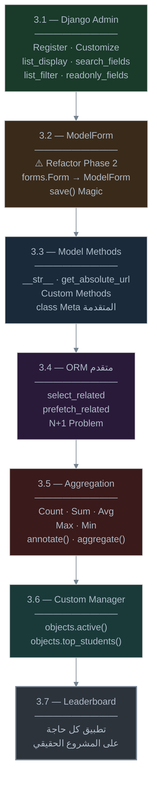
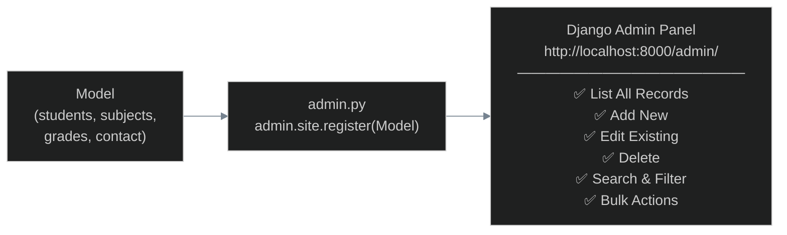
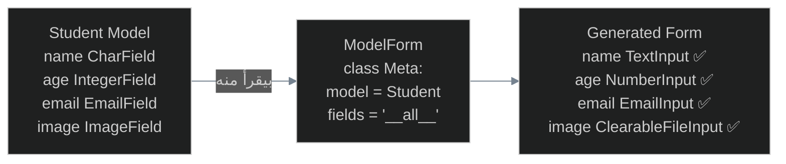
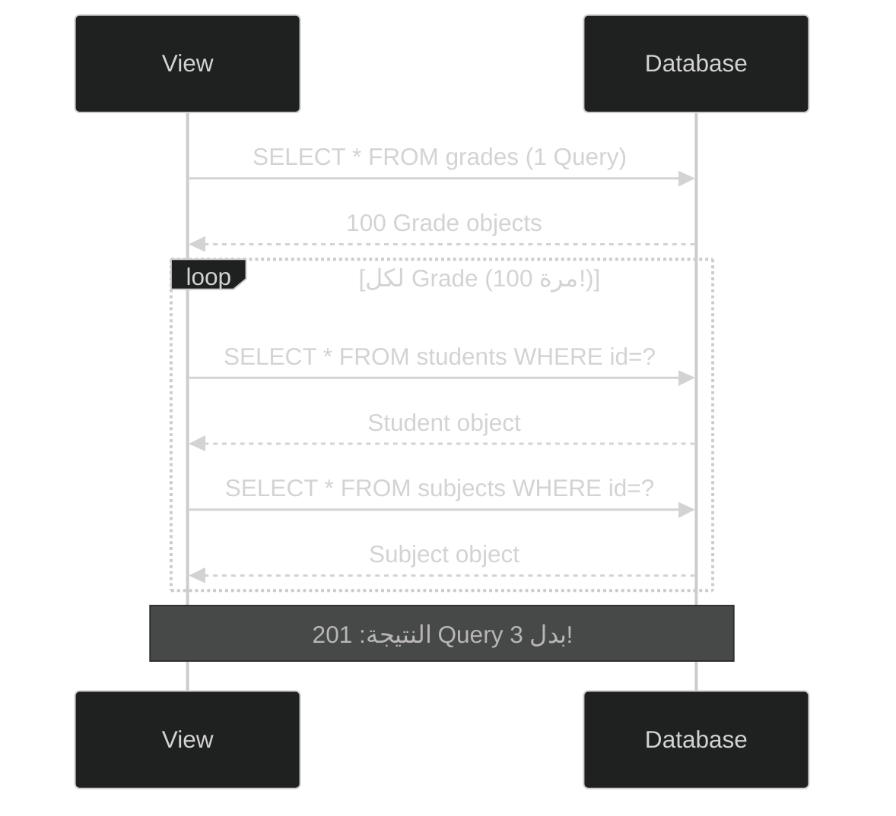
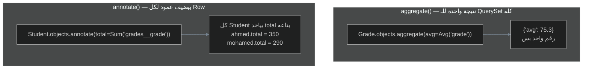
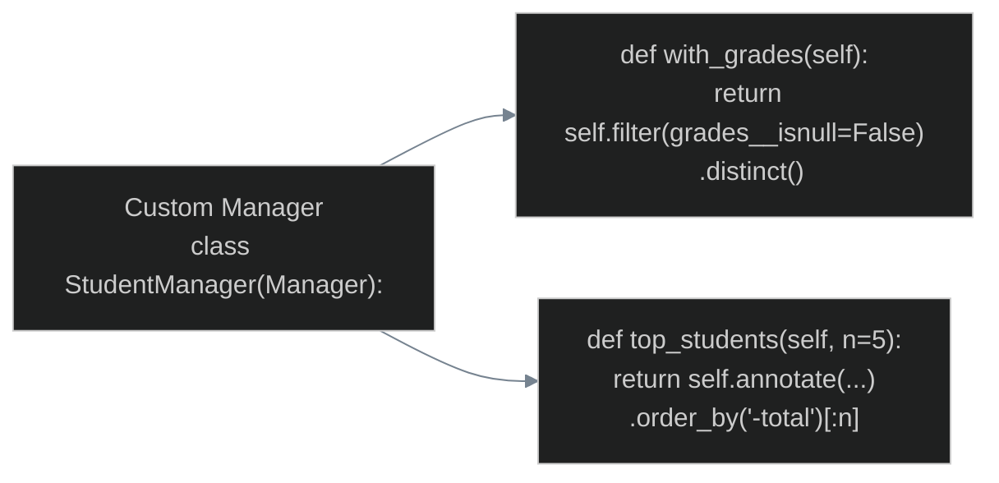
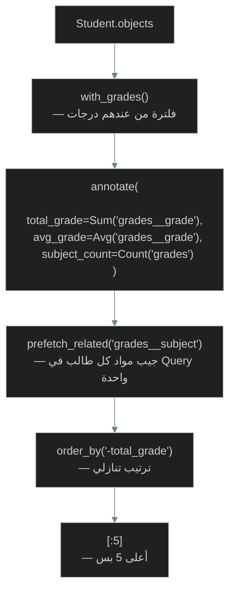
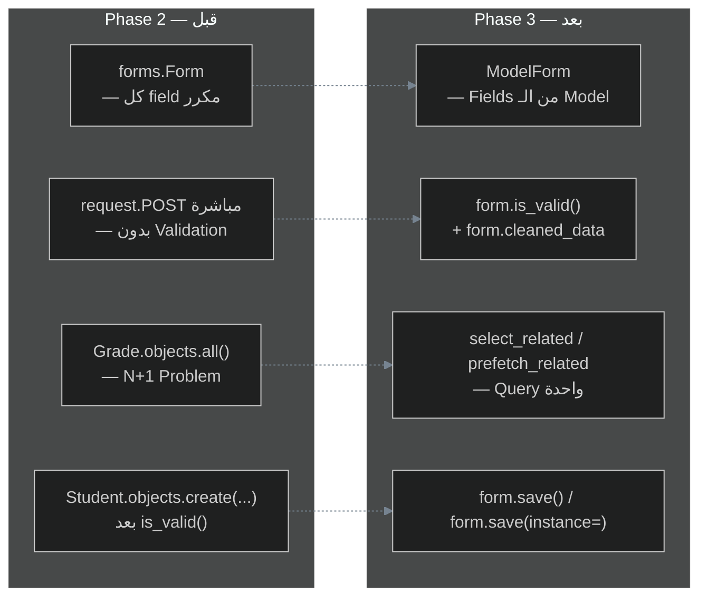

# 🗄️ Phase 3 — Database Mastery & ORM
## رحلة Django — ITI School Management System

> **الـ Phase ده بيجاوب على:** إزاي تتعامل مع الـ Database زي الـ Pro؟ وإزاي ترجع تصلّح الكود المؤقت بتاع Phase 2؟

---

## خريطة Phase 3



---

# 3.1 — Django Admin — اللوحة السحرية

## الفكرة الكبيرة

Django Admin هو **CRUD Interface جاهز 100%** بدون ما تكتب سطر واحد من Template أو View. هو من أقوى الأسلحة اللي بتيجي مع Django "out of the box".

اللي كان محتاجلك أسابيع عشان تبنيه يدوياً — Django بيديهولك في 3 سطور.



## إنشاء الـ Superuser

```bash
python manage.py createsuperuser
# Username: admin
# Email: admin@iti.edu.eg
# Password: ********
```

## التسجيل الأساسي

> [!example] 💡 مثال عام (General Example)
> أبسط طريقة لتسجيل Model في Admin:

```python
# library/admin.py
from django.contrib import admin
from .models import Book

# الطريقة 1 — أبسط سطر ممكن
admin.site.register(Book)
```

ده كفيل إنك تلاقي جدول Books في الـ Admin وتقدر تعمل عليه CRUD كامل. بس الـ Interface بيبقى بدائي — هنحسّنه.

---

> [!example] 🏗️ تطبيق المشروع (Project Example - PE)
> تسجيل وتخصيص كل Models مشروع ITI:

```python
# students/admin.py
from django.contrib import admin
from .models import Student

@admin.register(Student)  # ← decorator أنيق بدل register()
class StudentAdmin(admin.ModelAdmin):

    # الأعمدة اللي بتظهر في قائمة الـ Records
    list_display = ('name', 'age', 'email', 'created_at')

    # حقول البحث
    search_fields = ('name', 'email')

    # فلاتر جانبية
    list_filter = ('created_at',)

    # ترتيب الـ Records في القائمة
    ordering = ('name',)

    # حقول للقراءة فقط (مش للتعديل)
    readonly_fields = ('created_at',)

    # عدد الـ Records في كل صفحة
    list_per_page = 20
```

```python
# subjects/admin.py
from django.contrib import admin
from .models import Subject

@admin.register(Subject)
class SubjectAdmin(admin.ModelAdmin):
    list_display = ('name', 'description')
    search_fields = ('name',)
    ordering = ('name',)
```

```python
# grades/admin.py
from django.contrib import admin
from .models import Grade

@admin.register(Grade)
class GradeAdmin(admin.ModelAdmin):
    list_display = ('student', 'subject', 'grade', 'created_at')
    search_fields = ('student__name', 'subject__name')
    list_filter = ('subject', 'created_at')
    ordering = ('-grade',)
    # عرض الـ Related Object بـ Dropdown بدل ID فارغ
    autocomplete_fields = ('student', 'subject')
```

```python
# contact/admin.py
from django.contrib import admin
from .models import ContactMessage

@admin.register(ContactMessage)
class ContactAdmin(admin.ModelAdmin):
    list_display = ('email', 'short_message', 'date_added')
    search_fields = ('email',)
    readonly_fields = ('email', 'message', 'date_added')

    # Custom method لعرض جزء من الرسالة في القائمة
    def short_message(self, obj):
        return obj.message[:50] + '...' if len(obj.message) > 50 else obj.message

    short_message.short_description = 'الرسالة'  # اسم العمود في الـ Header
```

> [!info] 🧠 `admin.register()` كـ Decorator تحت الكبوت
> الـ Decorator `@admin.register(Student)` بيعمل نفس حاجة:
> ```python
> class StudentAdmin(admin.ModelAdmin): ...
> admin.site.register(Student, StudentAdmin)
> ```
> بس أنظف وأكتر Pythonic. الـ `admin.site` هو instance من `AdminSite` — singleton بيحتفظ بـ registry لكل الـ Models المسجّلة.

---

## تخصيص الـ Admin المتقدم

### `list_display` مع Custom Methods

```python
@admin.register(Student)
class StudentAdmin(admin.ModelAdmin):
    list_display = ('name', 'age', 'email', 'student_image_tag')

    def student_image_tag(self, obj):
        from django.utils.html import format_html
        if obj.image:
            return format_html(
                '',
                obj.image.url
            )
        return '—'

    student_image_tag.short_description = 'الصورة'
```

> [!warning] ⚠️ `format_html` مش `f-string`
> لو استخدمت f-string عادي بدل `format_html` — ممكن حاجة فيها `<script>` في اسم الطالب تتنفذ في الـ Admin Page (XSS).
> `format_html` بيعمل HTML Escaping تلقائي للـ arguments.

### Fieldsets — تنظيم صفحة الإضافة/التعديل

```python
@admin.register(Student)
class StudentAdmin(admin.ModelAdmin):
    fieldsets = (
        ('البيانات الأساسية', {
            'fields': ('name', 'age', 'email')
        }),
        ('الصورة الشخصية', {
            'fields': ('image',),
            'classes': ('collapse',),  # بتخلي القسم ده Collapsible
        }),
        ('معلومات النظام', {
            'fields': ('created_at',),
            'classes': ('collapse',),
        }),
    )
    readonly_fields = ('created_at',)
```

---

# 3.2 — ModelForm — الـ Refactoring الأول ✂️

## مشكلة الكود القديم

في Phase 2 كتبنا `StudentForm(forms.Form)` وكررنا كل حقل مرتين — مرة في الـ Model ومرة في الـ Form:

```python
# ❌ Phase 2 — تكرار مؤلم
class Student(models.Model):
    name = models.CharField(max_length=200)     # مرة هنا
    age = models.PositiveIntegerField()
    email = models.EmailField(unique=True)

class StudentForm(forms.Form):                  # ومرة هنا تاني!
    name = forms.CharField(max_length=200)
    age = forms.IntegerField(min_value=5)
    email = forms.EmailField()
    # لو غيّرت max_length في الـ Model لازم تغيّرها هنا كمان؟ لأ كده!
```

## الحل — `ModelForm`

`ModelForm` بياخد الـ Field definitions من الـ Model مباشرة ويولّد الـ Form تلقائياً.



> [!example] 💡 مثال عام (General Example)
> تحويل `forms.Form` لـ `ModelForm`:

```python
# ❌ forms.Form — بنكتب كل حاجة يدوي
class BookForm(forms.Form):
    title = forms.CharField(max_length=200)
    author = forms.CharField(max_length=200)
    price = forms.DecimalField(max_digits=8, decimal_places=2)
```

```python
# ✅ ModelForm — بناخد من الـ Model تلقائي
from django import forms
from .models import Book

class BookForm(forms.ModelForm):
    class Meta:
        model = Book           # من أي Model؟
        fields = '__all__'     # كل الـ Fields
        # أو تحدد بالاسم:
        # fields = ('title', 'author', 'price')
        # أو تستثني:
        # exclude = ('created_at', 'updated_at')
```

أهم حاجة في الـ `ModelForm` — الـ `.save()` method:

```python
# في الـ View:
form = BookForm(request.POST)
if form.is_valid():
    # ❌ بدل ما تعمل ده يدوي:
    # Book.objects.create(
    #     title=form.cleaned_data['title'],
    #     author=form.cleaned_data['author'],
    #     price=form.cleaned_data['price'],
    # )

    # ✅ اعمل ده بدله — سطر واحد!
    form.save()  # بيعمل Book.objects.create() تلقائياً
```

---

> [!example] 🏗️ تطبيق المشروع (Project Example - PE)
> **⚠️ Refactoring Phase 2 — تحويل كل Forms لـ ModelForms:**

```python
# students/forms.py — النسخة المحدّثة ✅
from django import forms
from .models import Student

class StudentForm(forms.ModelForm):
    class Meta:
        model = Student
        fields = ('name', 'age', 'email', 'image')
        # نستثني created_at عشان auto_now_add
        widgets = {
            'name': forms.TextInput(attrs={
                'class': 'form-input',
                'placeholder': 'الاسم الكامل',
            }),
            'age': forms.NumberInput(attrs={
                'class': 'form-input',
                'min': '5',
                'max': '100',
            }),
            'email': forms.EmailInput(attrs={
                'class': 'form-input',
                'placeholder': 'example@iti.edu.eg',
            }),
        }
        labels = {
            'name': 'الاسم',
            'age': 'العمر',
            'email': 'البريد الإلكتروني',
            'image': 'الصورة الشخصية',
        }
        error_messages = {
            'email': {
                'unique': 'البريد الإلكتروني ده مسجّل بالفعل.',
                'invalid': 'أدخل بريداً إلكترونياً صحيحاً.',
            },
        }
```

```python
# subjects/forms.py — النسخة المحدّثة ✅
from django import forms
from .models import Subject

class SubjectForm(forms.ModelForm):
    class Meta:
        model = Subject
        fields = ('name', 'description')
        widgets = {
            'description': forms.Textarea(attrs={'rows': 4, 'class': 'form-textarea'}),
        }
        labels = {
            'name': 'اسم المادة',
            'description': 'الوصف (اختياري)',
        }
```

```python
# grades/forms.py — النسخة المحدّثة ✅
from django import forms
from .models import Grade

class GradeForm(forms.ModelForm):
    class Meta:
        model = Grade
        fields = ('student', 'subject', 'grade')
        labels = {
            'student': 'الطالب',
            'subject': 'المادة',
            'grade': 'الدرجة (من 100)',
        }
```

الآن الـ Views بتبقى أبسط بكتير:

```python
# students/views.py — بعد الـ Refactoring ✅
from django.shortcuts import render, redirect, get_object_or_404
from .models import Student
from .forms import StudentForm

def student_create(request):
    if request.method == 'POST':
        form = StudentForm(request.POST, request.FILES)
        if form.is_valid():
            form.save()  # ← بدل 4 سطور!
            return redirect('students:list')
    else:
        form = StudentForm()
    return render(request, 'students/create.html', {'form': form})

def student_edit(request, pk):
    student = get_object_or_404(Student, pk=pk)
    if request.method == 'POST':
        # instance= بيقوله: حدّث الـ Object ده، متعملش جديد
        form = StudentForm(request.POST, request.FILES, instance=student)
        if form.is_valid():
            form.save()  # بيعمل UPDATE مش INSERT تلقائياً
            return redirect('students:detail', pk=pk)
    else:
        # بيملا الـ Form ببيانات الـ Object الحالي تلقائياً
        form = StudentForm(instance=student)
    return render(request, 'students/edit.html', {'form': form, 'student': student})
```

> [!info] 🧠 `instance=` تحت الكبوت
> لما بتعمل `StudentForm(instance=student)` في الـ GET:
> - الـ ModelForm بياخد القيم من `student` ويحطها كـ `initial` values.
>
> لما بتعمل `StudentForm(request.POST, instance=student)` في الـ POST:
> - `.save()` بتعمل `UPDATE` على الـ Record الموجود مش `INSERT` جديد.
> - الـ ModelForm بيعرف الفرق عن طريق وجود `instance.pk`.

---

### الـ `save(commit=False)` — السلاح الخفي

أحياناً محتاج تعدّل على الـ Object قبل ما تحفظه في الـ DB:

> [!example] 💡 مثال عام (General Example)

```python
def create_post(request):
    if request.method == 'POST':
        form = PostForm(request.POST)
        if form.is_valid():
            post = form.save(commit=False)   # ← بيعمل Object بس مش بيحفظه
            post.author = request.user       # ← بنضيف المستخدم الحالي
            post.ip_address = request.META.get('REMOTE_ADDR')  # ← IP Address
            post.save()                      # ← دلوقتي بنحفظ
            return redirect('posts:list')
```

---

# 3.3 — Model Methods — الـ Smart Models

الـ Model مش بس وصف للجدول — ممكن يكون فيه منطق كمان. الهدف: **Fat Models, Thin Views**.

## `__str__` — هويّة الـ Object

```python
class Student(models.Model):
    name = models.CharField(max_length=200)

    def __str__(self):
        return self.name
```

بدون `__str__`:
- في الـ Admin: بيشوف `Student object (1)` — مش كاشف
- في الـ Shell: `<Student: Student object (1)>`

مع `__str__`:
- في الـ Admin: بيشوف `أحمد علي`
- في الـ Template: `{{ student }}` بيطبع `أحمد علي`

## `get_absolute_url` — عنوان الـ Object

```python
# students/models.py
from django.urls import reverse

class Student(models.Model):
    name = models.CharField(max_length=200)

    def __str__(self):
        return self.name

    def get_absolute_url(self):
        return reverse('students:detail', kwargs={'pk': self.pk})
```

بكده في الـ Template تقدر تكتب:

```html
<!-- بدل  -->
<a href="{{ student.get_absolute_url }}">{{ student.name }}</a>
```

وفي الـ Admin بيظهر زر "View on Site" تلقائياً.

## Custom Model Methods

> [!example] 🏗️ تطبيق المشروع (Project Example - PE)
> إضافة methods مفيدة للـ Models:

```python
# students/models.py
from django.db import models
from django.urls import reverse

class Student(models.Model):
    name = models.CharField(max_length=200)
    age = models.PositiveIntegerField()
    email = models.EmailField(unique=True)
    image = models.ImageField(upload_to='students/', null=True, blank=True)
    created_at = models.DateTimeField(auto_now_add=True)

    def __str__(self):
        return self.name

    def get_absolute_url(self):
        return reverse('students:detail', kwargs={'pk': self.pk})

    def get_total_grade(self):
        """مجموع درجات الطالب في كل المواد"""
        from django.db.models import Sum
        result = self.grades.aggregate(total=Sum('grade'))
        return result['total'] or 0

    def get_average_grade(self):
        """متوسط درجات الطالب"""
        from django.db.models import Avg
        result = self.grades.aggregate(avg=Avg('grade'))
        return round(result['avg'], 2) if result['avg'] else 0

    def get_grade_status(self):
        """تصنيف الطالب بناءً على متوسطه"""
        avg = self.get_average_grade()
        if avg >= 90:
            return ('ممتاز', '🥇')
        elif avg >= 75:
            return ('جيد جداً', '🥈')
        elif avg >= 60:
            return ('جيد', '🥉')
        elif avg > 0:
            return ('مقبول', '📚')
        else:
            return ('لا توجد درجات', '—')

    class Meta:
        ordering = ['name']
        verbose_name = 'طالب'
        verbose_name_plural = 'الطلاب'
```

```python
# grades/models.py
from django.db import models
from students.models import Student
from subjects.models import Subject

class Grade(models.Model):
    student = models.ForeignKey(Student, on_delete=models.CASCADE, related_name='grades')
    subject = models.ForeignKey(Subject, on_delete=models.CASCADE, related_name='grades')
    grade = models.DecimalField(max_digits=5, decimal_places=2)
    created_at = models.DateTimeField(auto_now_add=True)

    def __str__(self):
        return f"{self.student.name} — {self.subject.name}: {self.grade}"

    def get_letter_grade(self):
        """تحويل الدرجة الرقمية لحرفية"""
        g = float(self.grade)
        if g >= 90: return 'A'
        elif g >= 80: return 'B'
        elif g >= 70: return 'C'
        elif g >= 60: return 'D'
        else: return 'F'

    class Meta:
        unique_together = ('student', 'subject')
        ordering = ['-grade']
        verbose_name = 'درجة'
        verbose_name_plural = 'الدرجات'
```

### `class Meta` — خيارات إضافية مهمة

```python
class Meta:
    ordering = ['name']           # ترتيب افتراضي في كل Query
    ordering = ['-created_at']    # تنازلي

    verbose_name = 'طالب'         # اسم الـ Model في الـ Admin (مفرد)
    verbose_name_plural = 'الطلاب' # اسم الـ Model في الـ Admin (جمع)

    db_table = 'iti_students'     # اسم الجدول في DB (الافتراضي: appname_modelname)

    unique_together = ('student', 'subject')  # تحديد تركيبة Unique

    indexes = [
        models.Index(fields=['name']),           # Index على name بس
        models.Index(fields=['name', 'email']),  # Index مركّب
    ]

    constraints = [
        models.CheckConstraint(
            check=models.Q(grade__gte=0) & models.Q(grade__lte=100),
            name='grade_range_check'
        )
    ]
```

> [!info] 🧠 الـ `related_name` تحت الكبوت
> لما بتكتب:
> ```python
> student = models.ForeignKey(Student, on_delete=models.CASCADE, related_name='grades')
> ```
>
> Django بيضيف للـ `Student` Model تلقائياً attribute اسمه `grades`:
> ```python
> ahmed = Student.objects.get(name='أحمد')
> ahmed.grades.all()      # كل درجاته
> ahmed.grades.count()    # عدد موادّه
> ahmed.grades.filter(grade__gte=80)  # موادّه اللي اخد فيها ≥ 80
> ```
>
> لو مش بتحدد `related_name`، Django بيعمل واحد تلقائي اسمه `grade_set` (اسم الـ Model بـ lowercase + `_set`). الـ `related_name` بيخليك تختار اسم أوضح.

---

# 3.4 — N+1 Problem — العدو الصامت للـ Performance

## الجريمة اللي بتعملها من غير ما تحس

خليني أريك كارثة صامتة بتحصل في كتير من الـ Django Apps.

تخيل عندك صفحة بتعرض قائمة الدرجات مع اسم الطالب والمادة:

```python
# grades/views.py — ❌ الكود الخطير
def grade_list(request):
    grades = Grade.objects.all()  # Query 1: جاب كل الدرجات
    return render(request, 'grades/list.html', {'grades': grades})
```

```html
<!-- grades/list.html -->

    <tr>
        <!-- ❌ هنا كل iteration بتعمل Query جديدة! -->
        <td>{{ grade.student.name }}</td>   <!-- Query 2, 3, 4, ... -->
        <td>{{ grade.subject.name }}</td>   <!-- Query N+1, N+2, ... -->
        <td>{{ grade.grade }}</td>
    </tr>

```



ده بيتسمى **N+1 Problem**: Query واحدة للقائمة + Query لكل Related Object.

## الحل — `select_related` و `prefetch_related`

### `select_related` — للـ ForeignKey و OneToOne

```python
# ✅ الحل للـ ForeignKey
grades = Grade.objects.select_related('student', 'subject').all()
# بيعمل SQL JOIN واحدة كبيرة بدل N Queries
```

```sql
-- الـ SQL اللي بيتعمل
SELECT
    grades.*,
    students.*,
    subjects.*
FROM grades
JOIN students ON grades.student_id = students.id
JOIN subjects ON grades.subject_id = subjects.id;
-- نتيجة: 1 Query بدل 201!
```

> [!example] 💡 مثال عام (General Example)
> متى تستخدم `select_related`؟

```python
# كل الأمثلة دي بـ ForeignKey → استخدم select_related

# كتاب له مؤلف واحد
books = Book.objects.select_related('author')

# تعليق له user واحد وpost واحد
comments = Comment.objects.select_related('user', 'post')

# عمق أكتر (author → country)
books = Book.objects.select_related('author__country')
```

---

### `prefetch_related` — للـ ManyToMany والعكس

```python
# ✅ الحل للـ ManyToMany أو Reverse ForeignKey
students = Student.objects.prefetch_related('grades')
# يعمل 2 Queries فقط:
# 1. SELECT * FROM students
# 2. SELECT * FROM grades WHERE student_id IN (1, 2, 3, ...)
# وبيعمل الـ join في Python مش في DB
```

> [!example] 💡 مثال عام (General Example)
> متى تستخدم `prefetch_related`؟

```python
# عكس الـ ForeignKey (student → grades)
students = Student.objects.prefetch_related('grades')

# ManyToMany
authors = Author.objects.prefetch_related('books')

# مركّب
students = Student.objects.prefetch_related(
    'grades',           # كل درجات كل طالب
    'grades__subject',  # مع المادة لكل درجة
)
```

---

> [!example] 🏗️ تطبيق المشروع (Project Example - PE)
> **⚠️ Refactoring Phase 2 — إصلاح الـ N+1 في Views:**

```python
# grades/views.py — بعد الإصلاح ✅
from django.shortcuts import render, redirect, get_object_or_404
from django.db.models import Q
from .models import Grade
from .forms import GradeForm

def grade_list(request):
    # ✅ select_related بيجيب student و subject في Query واحدة
    grades = Grade.objects.select_related('student', 'subject')

    # البحث بـ Student ID أو Subject Name
    query = request.GET.get('q', '')
    if query:
        grades = grades.filter(
            Q(student__name__icontains=query) |
            Q(subject__name__icontains=query)
        )

    return render(request, 'grades/list.html', {
        'grades': grades,
        'query': query,
    })
```

```python
# students/views.py — student_list بعد الإصلاح ✅
def student_list(request):
    # prefetch grades وsubject بتاع كل grade
    students = Student.objects.prefetch_related(
        'grades',
        'grades__subject',
    )
    return render(request, 'students/list.html', {'students': students})
```

---

## الـ Q Objects — الـ OR في الـ Filter

قبل ما نكمل، في حاجة مهمة استخدمناها فوق — الـ `Q` object.

```python
from django.db.models import Q

# AND عادي (بدون Q)
Student.objects.filter(name__contains='أحمد', age=20)
# SELECT ... WHERE name LIKE '%أحمد%' AND age = 20

# OR محتاج Q
Student.objects.filter(
    Q(name__contains='أحمد') | Q(name__contains='محمد')
)
# SELECT ... WHERE name LIKE '%أحمد%' OR name LIKE '%محمد%'

# NOT
Student.objects.filter(~Q(age=20))
# SELECT ... WHERE NOT age = 20

# مركّب
Student.objects.filter(
    Q(name__contains='أحمد') | Q(name__contains='محمد'),
    age__gte=18  # ← AND عادي مع الـ Q
)
# SELECT ... WHERE (name LIKE '%أحمد%' OR name LIKE '%محمد%') AND age >= 18
```

---

# 3.5 — Aggregation & Annotation — قوة الـ SQL في Python

## الفرق بين `aggregate` و `annotate`



## دوال الـ Aggregation

```python
from django.db.models import (
    Count,   # COUNT(*)
    Sum,     # SUM(field)
    Avg,     # AVG(field)
    Max,     # MAX(field)
    Min,     # MIN(field)
)
```

### `aggregate()` — إحصائيات على الـ QuerySet كله

> [!example] 💡 مثال عام (General Example)

```python
from django.db.models import Count, Sum, Avg, Max, Min

# متوسط أعمار الطلاب
result = Student.objects.aggregate(avg_age=Avg('age'))
# → {'avg_age': 21.5}

# عدة إحصائيات دفعة واحدة
stats = Grade.objects.aggregate(
    total_grades=Count('id'),
    average=Avg('grade'),
    highest=Max('grade'),
    lowest=Min('grade'),
)
# → {'total_grades': 150, 'average': 74.3, 'highest': 100.0, 'lowest': 25.0}
```

---

### `annotate()` — إضافة حقل محسوب لكل Object

> [!example] 💡 مثال عام (General Example)

```python
# عدد الكتب لكل مؤلف
from django.db.models import Count

authors = Author.objects.annotate(book_count=Count('books'))
for author in authors:
    print(f"{author.name}: {author.book_count} كتاب")
# أحمد: 5 كتاب
# محمد: 3 كتاب
```

---

> [!example] 🏗️ تطبيق المشروع (Project Example - PE)
> استخدام Aggregation في Subjects — Search + Stats:

```python
# subjects/views.py ✅
from django.shortcuts import render, redirect, get_object_or_404
from django.db.models import Avg, Count, Max, Min
from .models import Subject
from .forms import SubjectForm

def subject_list(request):
    subjects = Subject.objects.all()

    # البحث
    query = request.GET.get('q', '')
    if query:
        subjects = subjects.filter(name__icontains=query)

    # إضافة إحصائيات لكل مادة باستخدام annotate
    subjects = subjects.annotate(
        student_count=Count('grades__student', distinct=True),
        avg_grade=Avg('grades__grade'),
        max_grade=Max('grades__grade'),
        min_grade=Min('grades__grade'),
    )

    return render(request, 'subjects/list.html', {
        'subjects': subjects,
        'query': query,
    })
```

```html
<!-- subjects/templates/subjects/list.html -->


<h2>📚 المواد الدراسية</h2>

<form method="GET">
    <input type="text" name="q" value="{{ query }}" placeholder="ابحث عن مادة...">
    <button type="submit">🔍 بحث</button>
</form>

<table>
    <thead>
        <tr>
            <th>المادة</th>
            <th>عدد الطلاب</th>
            <th>متوسط الدرجات</th>
            <th>أعلى درجة</th>
            <th>أدنى درجة</th>
        </tr>
    </thead>
    <tbody>
        
        <tr>
            <td>{{ subject.name }}</td>
            <td>{{ subject.student_count|default:"—" }}</td>
            <td>{{ subject.avg_grade|floatformat:1|default:"—" }}</td>
            <td>{{ subject.max_grade|default:"—" }}</td>
            <td>{{ subject.min_grade|default:"—" }}</td>
        </tr>
        
        <tr><td colspan="5">لا توجد مواد</td></tr>
        
    </tbody>
</table>

```

---

# 3.6 — Custom Manager — تنظيم الـ Queries

## المشكلة

لو عندك نفس الـ Filter بتكرّره في أكتر من View:

```python
# ❌ تكرار في كل view
def student_list(request):
    students = Student.objects.filter(grades__isnull=False).distinct()

def leaderboard(request):
    students = Student.objects.filter(grades__isnull=False).distinct()

def export(request):
    students = Student.objects.filter(grades__isnull=False).distinct()
```

## الحل — Custom Manager



> [!example] 💡 مثال عام (General Example)
> Custom Manager للكتب:

```python
# library/models.py
from django.db import models

class AvailableBookManager(models.Manager):
    """Manager للكتب المتاحة فقط"""
    def get_queryset(self):
        return super().get_queryset().filter(is_available=True)

    def cheap(self):
        """الكتب الرخيصة (أقل من 50 جنيه)"""
        return self.get_queryset().filter(price__lt=50)

class Book(models.Model):
    title = models.CharField(max_length=200)
    price = models.DecimalField(max_digits=8, decimal_places=2)
    is_available = models.BooleanField(default=True)

    objects = models.Manager()           # المدير الافتراضي (كل الكتب)
    available = AvailableBookManager()   # المدير المخصص

# الاستخدام:
Book.objects.all()           # كل الكتب (متاحة + غير متاحة)
Book.available.all()         # الكتب المتاحة فقط
Book.available.cheap()       # الكتب المتاحة والرخيصة
```

---

> [!example] 🏗️ تطبيق المشروع (Project Example - PE)
> Custom Manager للـ Students:

```python
# students/models.py — إضافة Custom Manager
from django.db import models
from django.db.models import Sum, Avg
from django.urls import reverse

class StudentManager(models.Manager):

    def with_grades(self):
        """الطلاب اللي عندهم درجات فعلاً"""
        return self.filter(grades__isnull=False).distinct()

    def top_students(self, n=5):
        """أعلى n طالب بناءً على مجموع الدرجات"""
        return (
            self.with_grades()
            .annotate(total_grade=Sum('grades__grade'))
            .order_by('-total_grade')[:n]
        )

    def with_stats(self):
        """كل الطلاب مع إحصائياتهم (total + avg + count)"""
        return self.annotate(
            total_grade=Sum('grades__grade'),
            avg_grade=Avg('grades__grade'),
            subject_count=models.Count('grades', distinct=True),
        )


class Student(models.Model):
    name = models.CharField(max_length=200)
    age = models.PositiveIntegerField()
    email = models.EmailField(unique=True)
    image = models.ImageField(upload_to='students/', null=True, blank=True)
    created_at = models.DateTimeField(auto_now_add=True)

    objects = StudentManager()  # ← بنبدّل الـ Default Manager بالمخصص

    def __str__(self):
        return self.name

    def get_absolute_url(self):
        return reverse('students:detail', kwargs={'pk': self.pk})

    def get_total_grade(self):
        result = self.grades.aggregate(total=Sum('grade'))
        return result['total'] or 0

    def get_average_grade(self):
        result = self.grades.aggregate(avg=Avg('grade'))
        return round(result['avg'], 2) if result['avg'] else 0

    def get_grade_status(self):
        avg = self.get_average_grade()
        if avg >= 90:   return ('ممتاز', '🥇', 'gold')
        elif avg >= 75: return ('جيد جداً', '🥈', 'silver')
        elif avg >= 60: return ('جيد', '🥉', 'bronze')
        elif avg > 0:   return ('مقبول', '📚', 'blue')
        else:           return ('لا توجد درجات', '—', 'gray')

    class Meta:
        ordering = ['name']
        verbose_name = 'طالب'
        verbose_name_plural = 'الطلاب'
```

---

# 3.7 — Leaderboard — تجميع كل حاجة

الـ Leaderboard هو الصفحة اللي بتجمع كل حاجة تعلمناها في الـ Phase ده: Annotation + Aggregation + Ordering + Manager + Template.

## الـ Query المطلوبة

المطلوب: أعلى 5 طلاب بناءً على **مجموع الدرجات** مع عرض المواد واسم كل طالب.



## الـ View

```python
# students/views.py — إضافة leaderboard ✅
from django.db.models import Sum, Avg, Count

def leaderboard(request):
    top_students = (
        Student.objects
        .with_grades()
        .annotate(
            total_grade=Sum('grades__grade'),
            avg_grade=Avg('grades__grade'),
            subject_count=Count('grades', distinct=True),
        )
        .prefetch_related('grades__subject')  # ← عشان نعرض أسماء المواد
        .order_by('-total_grade')[:5]
    )

    return render(request, 'students/leaderboard.html', {
        'top_students': top_students,
    })
```

## الـ URL

```python
# students/urls.py — إضافة leaderboard
urlpatterns = [
    path('', views.home, name='home'),
    path('students/', views.student_list, name='list'),
    path('students/create/', views.student_create, name='create'),
    path('students/leaderboard/', views.leaderboard, name='leaderboard'),  # ← قبل <int:pk>
    path('students/<int:pk>/', views.student_detail, name='detail'),
    path('students/<int:pk>/edit/', views.student_edit, name='edit'),
    path('students/<int:pk>/delete/', views.student_delete, name='delete'),
]
```

> [!warning] ⚠️ ترتيب الـ URLs مهم!
> `leaderboard/` لازم يكون **قبل** `<int:pk>/`. ليه؟
> لأن Django بيجرّب الـ Patterns من فوق لتحت. لو `<int:pk>/` فوق، Django هيحاول يحوّل "leaderboard" لـ integer → فشل! حطّ الـ Specific Patterns قبل الـ Generic.

## الـ Template

```html
<!-- students/templates/students/leaderboard.html -->


🏆 لوحة الشرف


<div style="max-width: 800px; margin: 0 auto;">

    <div style="text-align: center; padding: 30px 0;">
        <h1>🏆 لوحة الشرف</h1>
        <p>أعلى 5 طلاب بناءً على مجموع الدرجات</p>
    </div>

    
    <div style="text-align: center; padding: 40px; color: #888;">
        <p>لم يتم تسجيل درجات بعد.</p>
    </div>
    

    
    <div style="
        background: white;
        border-radius: 12px;
        padding: 20px;
        margin: 15px 0;
        display: flex;
        align-items: center;
        gap: 20px;
        box-shadow: 0 2px 8px rgba(0,0,0,0.1);
        border-right: 5px solid
            #FFD700
            #C0C0C0
            #CD7F32
            #4A90D9;
    ">

        <!-- رقم الترتيب -->
        <div style="font-size: 2em; min-width: 50px; text-align: center;">
            🥇
            🥈
            🥉
            {{ forloop.counter }}
        </div>

        <!-- صورة الطالب -->
        <div>
            
            
            
            <div style="width:60px; height:60px; border-radius:50%;
                        background:#e0e0e0; display:flex; align-items:center;
                        justify-content:center; font-size:1.5em;">
                👤
            </div>
            
        </div>

        <!-- بيانات الطالب -->
        <div style="flex: 1;">
            <h3 style="margin: 0 0 5px;">
                <a href="{{ student.get_absolute_url }}"
                   style="text-decoration: none; color: inherit;">
                    {{ student.name }}
                </a>
            </h3>

            <!-- المواد -->
            <div style="font-size: 0.85em; color: #666; margin-bottom: 8px;">
                
                <span style="
                    background: #f0f4ff;
                    border-radius: 20px;
                    padding: 2px 10px;
                    margin: 2px;
                    display: inline-block;
                ">
                    {{ grade.subject.name }}: {{ grade.grade }}
                </span>
                
            </div>
        </div>

        <!-- الإحصائيات -->
        <div style="text-align: center; min-width: 120px;">
            <div style="font-size: 1.8em; font-weight: bold; color: #2c3e50;">
                {{ student.total_grade|floatformat:0 }}
            </div>
            <div style="font-size: 0.8em; color: #888;">مجموع الدرجات</div>
            <div style="font-size: 0.9em; color: #555; margin-top: 4px;">
                متوسط: {{ student.avg_grade|floatformat:1 }}
            </div>
        </div>

    </div>
    

</div>

```

---

## إكمال CRUD الباقي — Grades و Subjects

عشان المشروع يبقى كامل، هنضيف الـ Views الناقصة بنفس الـ Pattern اللي عملناه في Students:

```python
# grades/views.py ✅
from django.shortcuts import render, redirect, get_object_or_404
from django.db.models import Q
from .models import Grade
from .forms import GradeForm

def grade_list(request):
    grades = Grade.objects.select_related('student', 'subject')
    query = request.GET.get('q', '')
    if query:
        grades = grades.filter(
            Q(student__name__icontains=query) |
            Q(subject__name__icontains=query)
        )
    return render(request, 'grades/list.html', {'grades': grades, 'query': query})

def grade_create(request):
    if request.method == 'POST':
        form = GradeForm(request.POST)
        if form.is_valid():
            form.save()
            return redirect('grades:list')
    else:
        form = GradeForm()
    return render(request, 'grades/create.html', {'form': form})

def grade_edit(request, pk):
    grade = get_object_or_404(Grade, pk=pk)
    if request.method == 'POST':
        form = GradeForm(request.POST, instance=grade)
        if form.is_valid():
            form.save()
            return redirect('grades:list')
    else:
        form = GradeForm(instance=grade)
    return render(request, 'grades/edit.html', {'form': form, 'grade': grade})

def grade_delete(request, pk):
    grade = get_object_or_404(Grade, pk=pk)
    if request.method == 'POST':
        grade.delete()
        return redirect('grades:list')
    return render(request, 'grades/confirm_delete.html', {'grade': grade})
```

```python
# grades/urls.py ✅
from django.urls import path
from . import views

app_name = 'grades'

urlpatterns = [
    path('', views.grade_list, name='list'),
    path('create/', views.grade_create, name='create'),
    path('<int:pk>/edit/', views.grade_edit, name='edit'),
    path('<int:pk>/delete/', views.grade_delete, name='delete'),
]
```

```python
# subjects/views.py ✅
from django.shortcuts import render, redirect, get_object_or_404
from django.db.models import Avg, Count, Max, Min
from .models import Subject
from .forms import SubjectForm

def subject_list(request):
    subjects = Subject.objects.all()
    query = request.GET.get('q', '')
    if query:
        subjects = subjects.filter(name__icontains=query)
    subjects = subjects.annotate(
        student_count=Count('grades__student', distinct=True),
        avg_grade=Avg('grades__grade'),
    )
    return render(request, 'subjects/list.html', {'subjects': subjects, 'query': query})

def subject_create(request):
    if request.method == 'POST':
        form = SubjectForm(request.POST)
        if form.is_valid():
            form.save()
            return redirect('subjects:list')
    else:
        form = SubjectForm()
    return render(request, 'subjects/create.html', {'form': form})

def subject_edit(request, pk):
    subject = get_object_or_404(Subject, pk=pk)
    if request.method == 'POST':
        form = SubjectForm(request.POST, instance=subject)
        if form.is_valid():
            form.save()
            return redirect('subjects:list')
    else:
        form = SubjectForm(instance=subject)
    return render(request, 'subjects/edit.html', {'form': form, 'subject': subject})

def subject_delete(request, pk):
    subject = get_object_or_404(Subject, pk=pk)
    if request.method == 'POST':
        subject.delete()
        return redirect('subjects:list')
    return render(request, 'subjects/confirm_delete.html', {'subject': subject})
```

```python
# subjects/urls.py ✅
from django.urls import path
from . import views

app_name = 'subjects'

urlpatterns = [
    path('', views.subject_list, name='list'),
    path('create/', views.subject_create, name='create'),
    path('<int:pk>/edit/', views.subject_edit, name='edit'),
    path('<int:pk>/delete/', views.subject_delete, name='delete'),
]
```

---

## Student Detail — صفحة الطالب الكاملة

```python
# students/views.py — student_detail المحدّث ✅
def student_detail(request, pk):
    student = get_object_or_404(
        Student.objects.prefetch_related('grades__subject'),
        pk=pk
    )
    status_text, status_icon, status_color = student.get_grade_status()

    return render(request, 'students/detail.html', {
        'student': student,
        'grades': student.grades.select_related('subject').order_by('-grade'),
        'total': student.get_total_grade(),
        'average': student.get_average_grade(),
        'status_text': status_text,
        'status_icon': status_icon,
    })
```

```html
<!-- students/templates/students/detail.html -->

{{ student.name }}


<div style="max-width: 700px; margin: 0 auto;">

    <!-- بطاقة الطالب -->
    <div style="background: white; border-radius: 12px; padding: 30px;
                margin-bottom: 20px; box-shadow: 0 2px 8px rgba(0,0,0,0.1);">

        <div style="display: flex; gap: 20px; align-items: center;">
            
            
            
            <div style="width:100px; height:100px; border-radius:50%;
                        background:#e8eaf6; display:flex; align-items:center;
                        justify-content:center; font-size:3em;">👤</div>
            

            <div>
                <h2 style="margin: 0 0 5px;">{{ student.name }}</h2>
                <p style="color: #666; margin: 3px 0;">📧 {{ student.email }}</p>
                <p style="color: #666; margin: 3px 0;">🎂 {{ student.age }} سنة</p>
                <p style="margin: 10px 0 0;">
                    <span style="font-size: 1.2em;">{{ status_icon }}</span>
                    <strong>{{ status_text }}</strong>
                </p>
            </div>
        </div>

        <!-- ملخص الدرجات -->
        <div style="display: flex; gap: 15px; margin-top: 20px; text-align: center;">
            <div style="flex:1; background: #f8f9ff; border-radius: 8px; padding: 15px;">
                <div style="font-size: 1.8em; font-weight: bold;">{{ total|floatformat:0 }}</div>
                <div style="color: #888; font-size: 0.9em;">مجموع الدرجات</div>
            </div>
            <div style="flex:1; background: #f8f9ff; border-radius: 8px; padding: 15px;">
                <div style="font-size: 1.8em; font-weight: bold;">{{ average }}</div>
                <div style="color: #888; font-size: 0.9em;">متوسط الدرجات</div>
            </div>
            <div style="flex:1; background: #f8f9ff; border-radius: 8px; padding: 15px;">
                <div style="font-size: 1.8em; font-weight: bold;">{{ grades.count }}</div>
                <div style="color: #888; font-size: 0.9em;">عدد المواد</div>
            </div>
        </div>
    </div>

    <!-- جدول الدرجات -->
    <div style="background: white; border-radius: 12px; padding: 20px;
                box-shadow: 0 2px 8px rgba(0,0,0,0.1);">
        <h3>📊 الدرجات التفصيلية</h3>
        
        <table style="width: 100%; border-collapse: collapse;">
            <thead>
                <tr style="background: #f5f5f5;">
                    <th style="padding: 10px; text-align: right;">المادة</th>
                    <th style="padding: 10px; text-align: center;">الدرجة</th>
                    <th style="padding: 10px; text-align: center;">التقدير</th>
                </tr>
            </thead>
            <tbody>
                
                <tr style="border-bottom: 1px solid #f0f0f0;">
                    <td style="padding: 10px;">{{ grade.subject.name }}</td>
                    <td style="padding: 10px; text-align: center; font-weight: bold;">
                        {{ grade.grade }}
                    </td>
                    <td style="padding: 10px; text-align: center;">
                        {{ grade.get_letter_grade }}
                    </td>
                </tr>
                
            </tbody>
        </table>
        
        <p style="color: #888; text-align: center;">لم تُسجَّل درجات بعد.</p>
        
    </div>

    <!-- أزرار الإجراءات -->
    <div style="margin-top: 20px; display: flex; gap: 10px;">
        <a href=""
           style="background: #2196F3; color: white; padding: 10px 20px;
                  border-radius: 6px; text-decoration: none;">✏️ تعديل</a>
        <a href=""
           style="background: #f44336; color: white; padding: 10px 20px;
                  border-radius: 6px; text-decoration: none;">🗑️ حذف</a>
        <a href=""
           style="background: #888; color: white; padding: 10px 20px;
                  border-radius: 6px; text-decoration: none;">← رجوع</a>
    </div>

</div>

```

---

## Student List — مع صورة وبحث

```html
<!-- students/templates/students/list.html -->

الطلاب


<div style="display: flex; justify-content: space-between; align-items: center; margin-bottom: 20px;">
    <h2>👨‍🎓 قائمة الطلاب</h2>
    <a href=""
       style="background: #4CAF50; color: white; padding: 10px 20px;
              border-radius: 6px; text-decoration: none;">➕ طالب جديد</a>
</div>


<div style="text-align: center; padding: 60px; color: #888;">
    <div style="font-size: 4em;">🎓</div>
    <p>لا يوجد طلاب مسجلون بعد.</p>
    <a href="">أضف أول طالب</a>
</div>


<div style="display: grid; grid-template-columns: repeat(auto-fill, minmax(250px, 1fr)); gap: 20px;">
    
    <div style="background: white; border-radius: 12px; padding: 20px;
                box-shadow: 0 2px 8px rgba(0,0,0,0.08); text-align: center;">

        
        
        
        <div style="width: 80px; height: 80px; border-radius: 50%; background: #e8eaf6;
                    display: flex; align-items: center; justify-content: center;
                    font-size: 2em; margin: 0 auto 12px;">👤</div>
        

        <h3 style="margin: 0 0 5px;">
            <a href="{{ student.get_absolute_url }}"
               style="text-decoration: none; color: #2c3e50;">{{ student.name }}</a>
        </h3>
        <p style="color: #888; font-size: 0.9em; margin: 3px 0;">{{ student.email }}</p>
        <p style="color: #aaa; font-size: 0.85em;">العمر: {{ student.age }}</p>

        <div style="display: flex; gap: 8px; justify-content: center; margin-top: 15px;">
            <a href=""
               style="background: #e3f2fd; color: #1976d2; padding: 6px 14px;
                      border-radius: 20px; text-decoration: none; font-size: 0.85em;">✏️ تعديل</a>
            <a href=""
               style="background: #ffebee; color: #c62828; padding: 6px 14px;
                      border-radius: 20px; text-decoration: none; font-size: 0.85em;">🗑️ حذف</a>
        </div>
    </div>
    
</div>

```

---

## Confirm Delete Template — Pattern مهم

```html
<!-- students/templates/students/confirm_delete.html -->

تأكيد الحذف


<div style="max-width: 500px; margin: 60px auto; text-align: center;
            background: white; border-radius: 12px; padding: 40px;
            box-shadow: 0 2px 8px rgba(0,0,0,0.1);">

    <div style="font-size: 3em; margin-bottom: 15px;">⚠️</div>
    <h2>تأكيد الحذف</h2>
    <p style="color: #555; margin: 15px 0;">
        هل أنت متأكد من حذف الطالب
        <strong>{{ student.name }}</strong>؟
        <br>
        <span style="color: #e53935; font-size: 0.9em;">
            سيتم حذف جميع درجاته أيضاً (CASCADE).
        </span>
    </p>

    <!-- الحذف لازم يكون POST مش GET عشان يتجنب CSRF + Accidental Clicks -->
    <form method="POST" style="display: flex; gap: 15px; justify-content: center; margin-top: 25px;">
        
        <button type="submit"
                style="background: #e53935; color: white; border: none; padding: 12px 30px;
                       border-radius: 6px; cursor: pointer; font-size: 1em;">
            🗑️ نعم، احذف
        </button>
        <a href=""
           style="background: #888; color: white; padding: 12px 30px;
                  border-radius: 6px; text-decoration: none;">
            ← إلغاء
        </a>
    </form>
</div>

```

> [!info] 🧠 ليه الـ Delete لازم POST؟
> لو الحذف على GET → ممكن:
> - محرك البحث يزور الـ Link ويحذف!
> - الـ Browser بيـ prefetch الـ Links ويحذف!
> - حد يبعتلك Link فيه صورة وعنوانها `/students/1/delete/` → حذف Accidental
>
> الـ POST + CSRF مع بعض = الحماية الصح.

---

## ملخص الـ Refactoring اللي عملناه في Phase 3



---

> [!tip] 🫒 زتونة الإنترفيو — Phase 3

| السؤال | الإجابة الـ Pro |
|--------|----------------|
| إيه هو الـ N+1 Problem؟ | لما بتجيب QuerySet وبعدين في loop بتعمل Query لكل Related Object. الحل: `select_related` للـ FK و `prefetch_related` للـ ManyToMany والعكس. |
| الفرق بين `aggregate` و `annotate`؟ | `aggregate` بترجع قيمة واحدة للـ QuerySet كله (مثل المتوسط الإجمالي). `annotate` بتضيف حقل محسوب لكل Row في الـ QuerySet. |
| ليه `ModelForm` أفضل من `Form` عادي؟ | لأنه بياخد الـ Field Definitions من الـ Model تلقائياً، بيتجنب التكرار. وعنده `.save()` و `instance=` اللي بيعملوا INSERT أو UPDATE تلقائياً. |
| إيه اللي بيعمله `save(commit=False)`؟ | بيولّد الـ Object في الذاكرة بدون ما يحفظه في الـ DB، عشان تضيف عليه حاجات إضافية زي الـ User الحالي قبل الحفظ. |
| الفرق بين `select_related` و `prefetch_related`؟ | `select_related` بيعمل SQL JOIN (للـ ForeignKey). `prefetch_related` بيعمل Query تانية منفصلة ويعمل الـ join في Python (للـ ManyToMany والـ Reverse Relations). |
| إيه هو الـ Custom Manager؟ | Class بترث من `models.Manager` بتضيف فيها methods مخصصة بترجع QuerySets محددة. بتنظم الـ Queries المتكررة في مكان واحد. |
| ليه الحذف بـ POST مش GET؟ | لأن الـ GET Requests ممكن تتنفّذ من الـ Browser Prefetching أو محركات البحث، فبيعمل حذف غير مقصود. الـ POST مع CSRF آمن. |
| إيه فايدة `unique_together` في الـ Meta؟ | بيمنع التكرار في تركيبة أكتر من حقل. مثلاً `unique_together = ('student', 'subject')` يمنع إدخال نفس الطالب مع نفس المادة مرتين. |
| إيه فايدة `related_name`؟ | بيخلّيك تعمل Reverse Lookup بالاتجاه العكسي. بدله: `student.grade_set.all()`. معاه: `student.grades.all()` — أوضح وأنظف. |
| إيه الفرق بين الـ `Q` object والـ filter عادي؟ | الـ Filter العادي بيعمل AND فقط. الـ `Q` object بيخليك تعمل OR (`|`) وNOT (`~`) وتحط conditions مركّبة. |

---

> [!success] ✅ ملخص Phase 3 — إيه اللي عملناه؟
> - ✅ Django Admin — تسجيل وتخصيص كل Models
> - ✅ ModelForm — Refactoring لكل Forms من Phase 2
> - ✅ `save()` و `save(commit=False)` و `instance=`
> - ✅ Model Methods (`__str__`, `get_absolute_url`, Custom Methods)
> - ✅ `class Meta` متقدمة (`verbose_name`, `indexes`, `constraints`)
> - ✅ N+1 Problem وحلّه بـ `select_related` و `prefetch_related`
> - ✅ Q Objects للـ Complex Queries
> - ✅ Aggregation (`aggregate` + `annotate`)
> - ✅ Custom Manager
> - ✅ Leaderboard كامل
> - ✅ CRUD كامل لـ Grades و Subjects
> - ✅ Student Detail Page
> - ✅ Confirm Delete Pattern

> [!todo] ⏳ Phase 4 — Refactoring
> - CBVs (Class-Based Views) — `View`, `ListView`, `DetailView`
> - Generic Views — `CreateView`, `UpdateView`, `DeleteView`
> - Mixins — `LoginRequiredMixin`, `SuccessMessageMixin`
> - هنحوّل كل الـ FBVs للـ Views الأهم لـ CBVs ونشوف الفرق
> - Messages Framework
> - Pagination

---

*الجزء ده دسم، انسخ اللي فات وقولي كمل عشان نخش في Phase 4 (Refactoring — CBVs, Mixins, Messages).*
