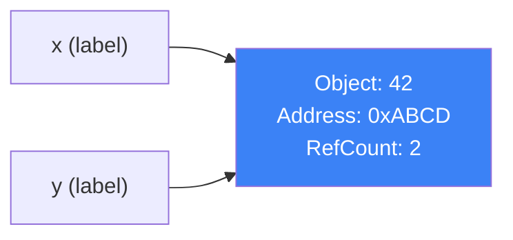
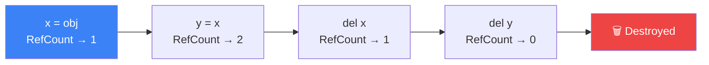
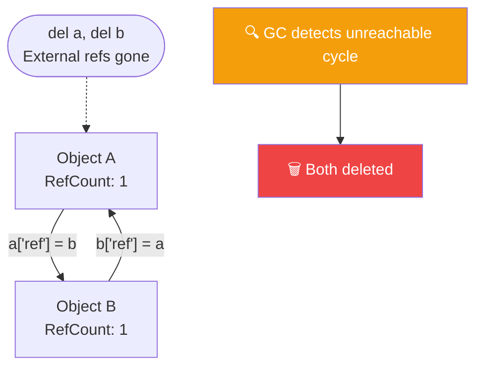
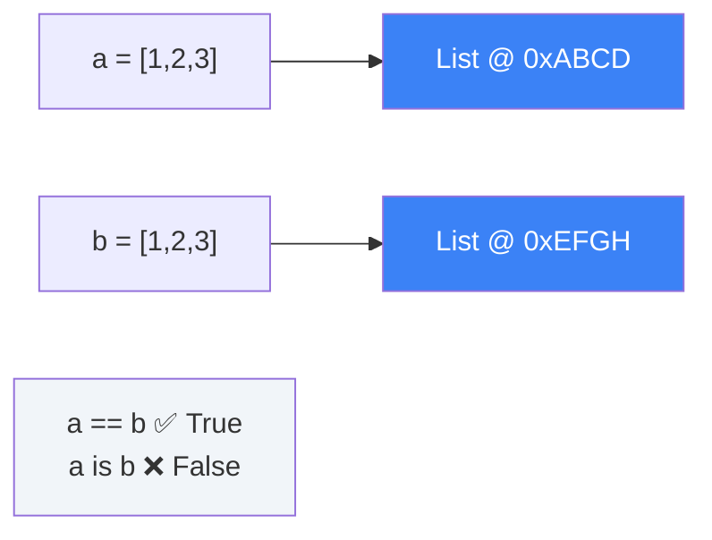
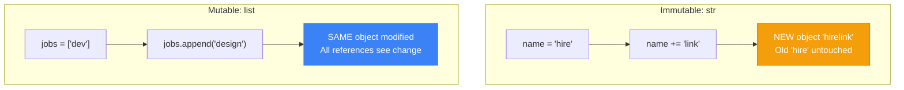
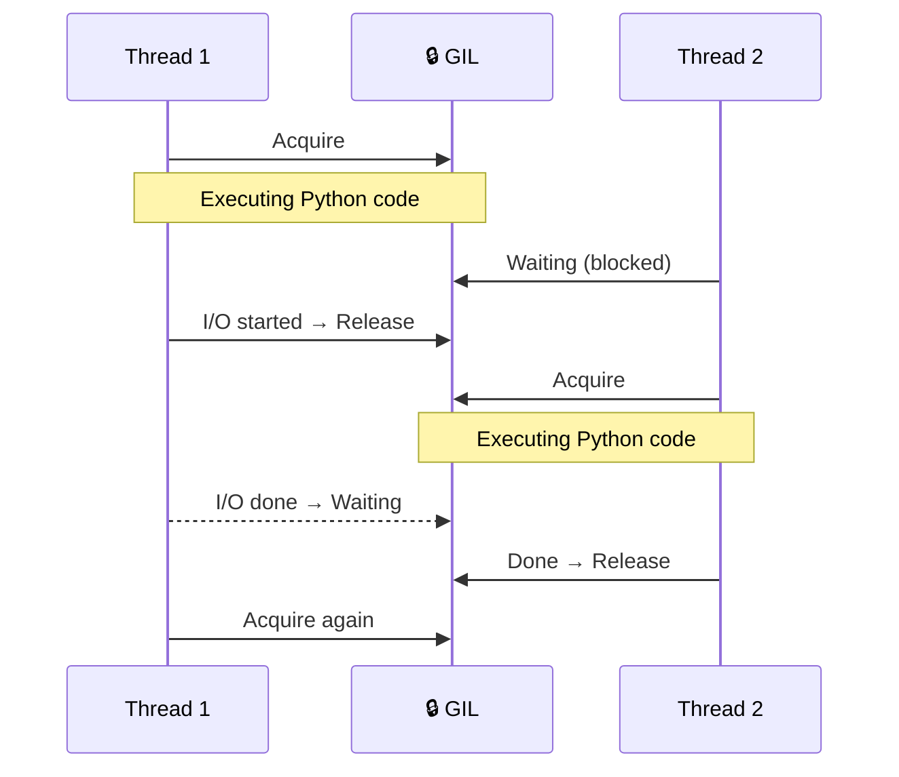
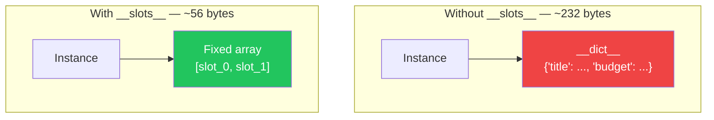

# الفصل الأول — Python تحت المجهر: الـ Memory Model والـ GIL

> **المتطلبات:** مش محتاج حاجة قبل الفصل ده — ده هو البداية الحقيقية. بس لو سبق وشفت bug غريب في Python، زي list بتتراكم لوحدها أو thread مش بتسرّع أي حاجة، الفصل ده هيفسرلك كل حاجة من الجذور.

---

## البداية — السؤال اللي محدش بيسأله

تخيّل معايا إنك كتبت function بسيطة بتضيف items لـ list:

```python
def add_item(item, existing_list=[]):
    existing_list.append(item)
    return existing_list

print(add_item("apple"))   # Expected: ['apple']
print(add_item("banana"))  # Expected: ['banana']
print(add_item("cherry"))  # Expected: ['cherry']
```

الـ output الفعلي:

```
['apple']
['apple', 'banana']
['apple', 'banana', 'cherry']
```

😳 الـ list المفروض تبدأ فاضية في كل call — بس هي بتتراكم! ده مش bug عشوائي. ده Python بتشتغل بالظبط زي ما اتصممت. المشكلة الوحيدة إنك لسه مش عارف **إزاي Python بتتعامل مع الـ objects في الـ memory** — وده اللي هنصلحه دلوقتي.

---

## [[01-Objects-And-References]] — في Python، كل حاجة Object

### 🧠 الشرح النظري

الجملة الأهم في الفصل ده كلّه: **في Python، المتغير مش بيحتوي على القيمة — هو بيشاور عليها.**

تخيّل معايا إن الـ memory بتاعة Python زي مستودع ضخم. كل قيمة — رقم، string، list، function، حتى `True` و`False` — موجودة جوّاه كـ "صندوق." المتغير بتاعك مش الصندوق نفسه — هو **ورقة مكتوب عليها عنوان** الصندوق ده جوّا المستودع.

لما بتكتب `y = x`، Python مش بتعمل نسخة جديدة من القيمة. هي بس بتعمل ورقة تانية بنفس العنوان. الاتنين دلوقتي بيشاوروا على نفس الصندوق. ده بيعني إن أي تعديل على الـ object الأصلي هيتشاف من الـ references كلها.

### 📊 Visualization



### 💻 Micro-Example

```python
x = 42
y = x                      # y is NOT a copy — points to the same object

print(id(x) == id(y))     # True: both labels share one memory address
print(x is y)             # True: identical object, not just equal value
```

---

## [[02-Reference-Counting]] — مين بيقرر إمتى يُحذف الـ Object؟

### 🧠 الشرح النظري

بما إن كل حاجة object في الـ memory، لازم يبقى فيه نظام يحدد: إمتى الـ object ده "انتهى عمره" ومش محتاجين نفضله في الـ RAM؟

Python بتستخدم نظام اسمه **Reference Counting** — كل object عنده "عداد" داخلي بيحسب كام reference بيشاور عليه. كل ما حد جديد بيشاور على الـ object، العداد بيزيد واحد. كل ما reference بتتحذف أو بتخرج من الـ scope، العداد بيقل واحد. لما يوصل **صفر**، Python بتحذف الـ object فوراً وترجع الـ memory للنظام — من غير أي تأخير.

تخيّله زي عداد نسخ كتاب في مكتبة: الكتاب بيفضل موجود طول ما فيه حد مستعيره. لما آخر واحد يردّه والعداد يوصل صفر — الكتاب بيتحذف من الرف فوراً.

### 📊 Visualization



### 💻 Micro-Example

```python
import sys

name = "HireLink"
print(sys.getrefcount(name))  # 2: 'name' + getrefcount's own temp reference

alias = name
print(sys.getrefcount(name))  # 3: one more reference added

del alias
print(sys.getrefcount(name))  # 2: back to previous count
```

---

## [[03-Garbage-Collector]] — لما الـ Reference Counting يعجز

### 🧠 الشرح النظري

الـ Reference Counting بيفشل في حالة واحدة فقط — **Cyclic References.**

تخيّل شخصين، كل واحد بيمسك كارت بيزنس التاني. لو حد من بّرّة مش عارف أياً منهم — هل عداد "مين بيمسكني" هيوصل صفر؟ لأ. كل واحد فيهم محسوب إن "التاني بيمسكه" فالعداد بيفضل 1 حتى لو مفيش حد في العالم يقدر يوصللهم. ده memory leak حقيقي.

عشان كده Python فيها **Garbage Collector (GC)** منفصل بيشتغل بشكل دوري. مهمته إنه يدور على مجموعات من الـ objects بتشاور على بعض ومحدش من بّرّها بيشاور عليهم — ويحذفهم. عشان يكون ذكي، الـ GC بيقسّم الـ objects لـ **3 generations**: الجديدة بتتفحص أكتر (لأن معظم الـ objects بتعيش وقت قصير)، والقديمة بتتفحص نادر.

### 📊 Visualization



### 💻 Micro-Example

```python
import gc

a, b = {}, {}
a['ref'] = b   # a → b
b['ref'] = a   # b → a  (cycle: refcount of each stays at 1 after del)

del a, b       # external refs gone, but cycle keeps refcount > 0
collected = gc.collect()             # GC finds and breaks the cycle
print(f"Collected: {collected}")     # prints 1
```

---

## [[04-is-vs-equality]] — هوية الـ Object أم قيمته؟

### 🧠 الشرح النظري

في Python فيه فرق جوهري بين سؤالين مختلفين تماماً:
- **"الاتنين بيساوي نفس القيمة؟"** — ده بتسأل بـ `==`
- **"الاتنين نفس الـ object في الـ memory؟"** — ده بتسأل بـ `is`

تخيّل عندك نسختين طباعة من نفس الكتاب — الاتنين يساووا `==`، بس مش `is` نفس الكتاب الفيزيائي. أما لو شيلت الكتاب وادّيته لحد تاني — دلوقتي الاتنين `is` نفس الكتاب بالظبط.

الخطورة إن Python بتعمل "**interning**" — بتشارك نفس الـ object للأرقام الصغيرة (من -5 للـ 256) وبعض الـ strings الشائعة عشان performance. ده ممكن يخلي `is` يرجع `True` وأنت مش متوقع، وسلوك غير مضمون من implementation لـ تانية. القاعدة الذهبية البسيطة: **`is` بس مع `None`** — لأن `None` واحد في كل الـ Python runtime.

### 📊 Visualization



### 💻 Micro-Example

```python
a = [1, 2, 3]
b = [1, 2, 3]

print(a == b)        # True  — same values
print(a is b)        # False — two separate list objects in memory

user = None
if user is None:     # ✅ Correct: 'is' is safe only with singletons like None
    print("no user")
```

---

## [[05-Mutable-vs-Immutable]] — جذر الـ Bug اللي في البداية

### 🧠 الشرح النظري

الـ objects في Python بتنقسم لنوعين بيختلفوا في حاجة جوهرية واحدة — هل ممكن تتغير بعد ما اتخلقت؟

**Immutable objects** — زي الأرقام والـ strings والـ tuples — مش ممكن يتغيروا خالص. لما "بتغيّر" string مثلاً، Python في الحقيقة بتخلق object جديد تماماً في عنوان جديد وبترجعهولك. الـ object القديم بيفضل كما هو في مكانه.

**Mutable objects** — زي الـ lists والـ dicts والـ sets — بتتعدّل في نفس المكان في الـ memory. أي reference بيشاور على الـ object ده هيشوف التغيير فوراً — وده بالظبط اللي حصل في البداية.

الـ `[]` في الـ default argument اتخلقت **مرة واحدة** وقت تعريف الـ function — مش في كل call. وبما إنها mutable وكل الـ calls بيشاوروا على نفس الـ list، التعديلات بتتراكم. الحل: استخدم `None` كـ default — `None` immutable وآمن — واعمل الـ list الجديدة جوّا الـ function.

### 📊 Visualization



### 💻 Micro-Example

```python
# ❌ The trap: [] is created ONCE at function definition, shared across all calls
def add_skill_bad(skill, skills=[]):
    skills.append(skill)
    return skills

# ✅ Fix: None is immutable — a fresh list is created on every single call
def add_skill(skill, skills=None):
    if skills is None:
        skills = []
    skills.append(skill)
    return skills
```

---

## [[06-The-GIL]] — ليه الـ Threads في Python مش دايماً بتسرّع؟

### 🧠 الشرح النظري

تخيّل عندك مطبخ فيه 5 طباخين ماهرين — بس فيه **موقد نار واحد بس**. مهما كان الطباخين كتير وشاطرين، في أي لحظة واحد بس بيطبخ. التانيين بيستنوا نوبتهم بالترتيب.

ده بالظبط هو الـ **GIL — Global Interpreter Lock.** هو "قفل" واحد على مستوى الـ interpreter بيضمن إن thread واحدة بس بتنفّذ Python bytecode في أي لحظة. مهما عملت threads — مش هيشتغلوا فعلاً بالتوازي.

اتعمل لأن الـ Reference Counting system مش thread-safe من الأساس. لو threads كتير قدرت تعدّل الـ refcount في نفس اللحظة، هيبقى race conditions وcorrupted memory وcrashes. الـ GIL كان الحل الأبسط والأسرع في CPython.

**بس مش الدنيا سودة:** الـ GIL بيتحرر تلقائياً أثناء أي I/O operation — network call، DB query، file read. ده بيعني إن في Django، لما thread بتستنى رد من الـ database، الـ GIL بيتحرر وthread تانية بتشتغل بدلها. عشان كده Django بيقدر يخدم requests متعددة بكفاءة رغم الـ GIL. القاعدة العملية: **I/O-bound؟ Threading يكفي. CPU-bound؟ استخدم `multiprocessing`** لأن كل process بيكون ليه GIL مستقل.

### 📊 Visualization



### 💻 Micro-Example

```python
import threading, urllib.request

def fetch(url):
    urllib.request.urlopen(url)   # GIL is RELEASED during network I/O

# 3 threads fetching simultaneously — each releases the GIL while waiting
# Total time ≈ 1 request (not 3) because I/O overlaps
threads = [threading.Thread(target=fetch, args=("https://httpbin.org/delay/1",))
           for _ in range(3)]
for t in threads: t.start()
for t in threads: t.join()
```

---

## [[07-Memory-Optimization]] — `__slots__`: وفّر الـ RAM في الـ Scale

### 🧠 الشرح النظري

بشكل افتراضي، كل instance من أي Python class بيشيل dictionary جوّاه اسمها `__dict__` فيها كل الـ attributes. الـ dictionary دي flexible جداً — تقدر تضيف attributes جديدة في أي وقت — بس مكلفة في الـ memory.

تخيّل إن بدل ما كل موظف عنده درج ضخم فيه ملفات عشوائية، تديه **خريطة جلوس ثابتة**: "الاسم في الكرسي الأول، الراتب في التاني، الـ ID في التالت." الوصول أسرع والمساحة أقل بكتير — بس مش تقدر تضيف كرسي جديد برّا الخريطة.

ده بالظبط اللي بيعمله `__slots__` — بيقول لـ Python "الـ attributes بتاعة الـ class دي ثابتة ومعروفة من الأول." Python بتحذف الـ `__dict__` وتحط بدله fixed array صغيرة. النتيجة: كل instance بياخد أقل بكتير من الـ memory. في الـ scale — مليون Job object — الفرق بين ~232 بايت و~56 بايت per instance بيبقى فرق في الـ GBs.

الـ trade-off الوحيد: مش هتقدر تضيف attributes جديدة على الـ instance من بّرّا الـ class. لو محتاج flexibility — متستخدمش `__slots__`. لو بتعمل millions من instances صغيرة وثابتة الشكل — استخدمه.

### 📊 Visualization



### 💻 Micro-Example

```python
class Job:
    __slots__ = ('title', 'budget', 'client_id')   # no __dict__ allocated

    def __init__(self, title, budget, client_id):
        self.title = title
        self.budget = budget
        self.client_id = client_id

job = Job("Backend Dev", 5000, "user_123")
print(job.title)          # Works exactly as before
# job.extra = "x"         # ❌ AttributeError — slots are fixed
```

---

## ✅ Self-check

| السؤال | إجابتك |
|---|---|
| إيه الفرق بين المتغير في Python والمتغير في C؟ | |
| إيه اللي بيحصل للـ object لما الـ refcount يوصل صفر؟ | |
| امتى الـ Garbage Collector بيتدخل وليه الـ Reference Counting وحده مش كافي؟ | |
| ليه `is` ممكن يرجع `True` لـ integers مختلفة؟ | |
| إيه الفرق العملي بين Mutable وImmutable في الـ function defaults؟ | |
| الـ GIL بيتحرر امتى وإيه أثر ده على Django؟ | |
| إيه الـ trade-off بتاع `__slots__` وامتى تستخدمه؟ | |

---

## 🎯 أسئلة الإنترفيو

**س: إيه هو الـ GIL وليه Python عنده؟**
> الـ GIL هو mutex بيضمن إن thread واحدة بس بتنفّذ Python bytecode في أي وقت. اتعمل لأن الـ reference counting system مش thread-safe — لو threads كتير عدّلت الـ refcount في نفس الوقت هيبقى race conditions وcrashes. الأثر العملي: الـ CPU-bound tasks مش بتستفيد من threading في CPython فبنستخدم `multiprocessing`. الـ I/O-bound tasks زي Django DB queries بتستفيد عادي لأن الـ GIL بيتحرر أثناء الـ I/O.

---

**س: إيه الفرق بين `==` و `is`؟**
> `==` بتقارن **القيمة**، `is` بتقارن **الهوية** — هل الاتنين نفس الـ object في الـ memory. `is` بتستخدمه بس مع `None` لأنه singleton مضمون. المشكلة إن Python بتعمل interning لـ small integers وبعض الـ strings فـ `is` ممكن يرجع `True` وأنت مش متوقع — وده سلوك implementation غير مضمون في كل البيئات.

---

**س: إيه هو الـ Cyclic Reference وكيف Python بتتعامل معاه؟**
> بيحصل لما objects بتشاور على بعض في حلقة مغلقة فالـ refcount مش بيوصل صفر حتى بعد `del`. Python بتحل ده عن طريق **Cyclic Garbage Collector** بيشتغل دورياً بيدور على مجموعات objects مترابطة ومحدش من بّرّها بيشاور عليهم ويحذفهم. الـ GC بيستخدم 3 generations عشان يكون efficient ومش يفحص كل حاجة في كل مرة.

---

**س: إيه هو الـ Mutable Default Argument gotcha وإيه الحل؟**
> لما بتحط list أو dict كـ default argument، Python بتعملها **مرة واحدة فقط** وقت تعريف الـ function — مش في كل call. كل الـ calls بتشارك نفس الـ object وأي تعديل بيتراكم. الحل: استخدم `None` كـ default وأنشئ الـ object الجديد جوّا الـ function — `None` immutable وآمن كـ sentinel value.

---

**س: امتى تستخدم `multiprocessing` بدل `threading` في Python؟**
> لو الـ task **CPU-bound** — حسابات، image processing، data parsing — استخدم `multiprocessing` لأن كل process بيكون ليه GIL مستقل وبيشتغلوا فعلاً بالتوازي على CPU cores مختلفة. لو الـ task **I/O-bound** — API calls، DB queries، file reads — `threading` أو `asyncio` كافيين لأن الـ GIL بيتحرر أثناء الـ I/O. في Django: معظم الشغل I/O-bound فالـ threading يكفي وCelery موجود للـ CPU-bound background tasks.

---

## 📝 خلاصة الدرس

في Python، المتغير مش بيحتوي على قيمة — هو label بيشاور على object في الـ heap، وده بيعني إن الـ assignment مش copy. Python بتتبع كل object بـ **Reference Counter** — يوصل صفر يتحذف فوراً — والـ **Garbage Collector** موجود بجانبه عشان يتعامل مع الـ cyclic references اللي الـ reference counting وحده مش بيحلّها. الـ **GIL** هو قفل بيضمن إن thread واحدة بس بتنفّذ Python bytecode في أي لحظة — ده بيأثر على الـ CPU-bound tasks بشكل مباشر، أما الـ I/O-bound tasks زي Django DB queries فالـ GIL بيتحرر أثناءها فالـ performance مش بيتأثر. فهم الـ **mutability** بيحميك من أشهر bugs في Python زي الـ mutable default argument، واستخدام **`__slots__`** في الـ high-volume objects بيوفّر RAM حقيقي في الـ production.

---

*Next → [[02-Python-OOP-Deep-Dive]] — عرفنا إزاي Python بتحفظ الـ objects. دلوقتي هنتعمق في إزاي بنصمّمهم — الـ `__init__` vs `__new__`، الـ MRO، الـ Dunder Methods، والـ Abstract Classes — بالأسلوب اللي بيميّز الـ senior developer.*
