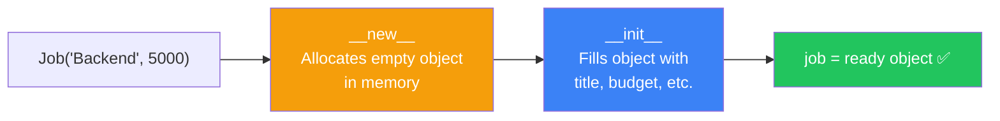
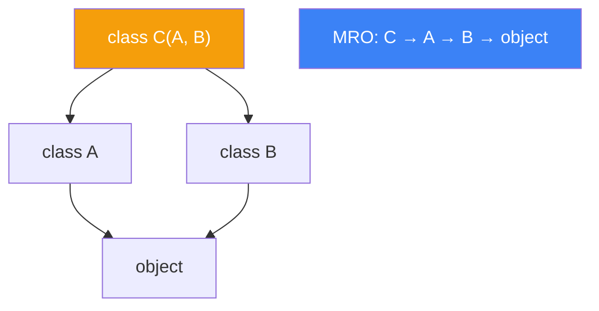
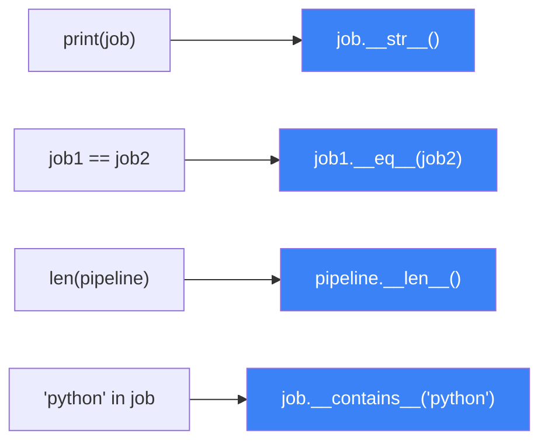
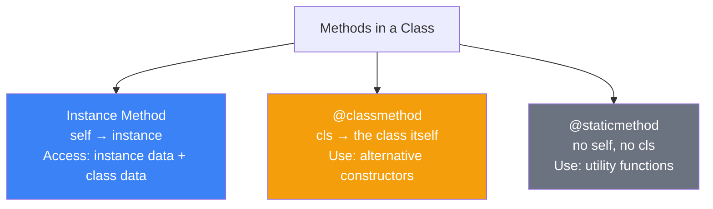
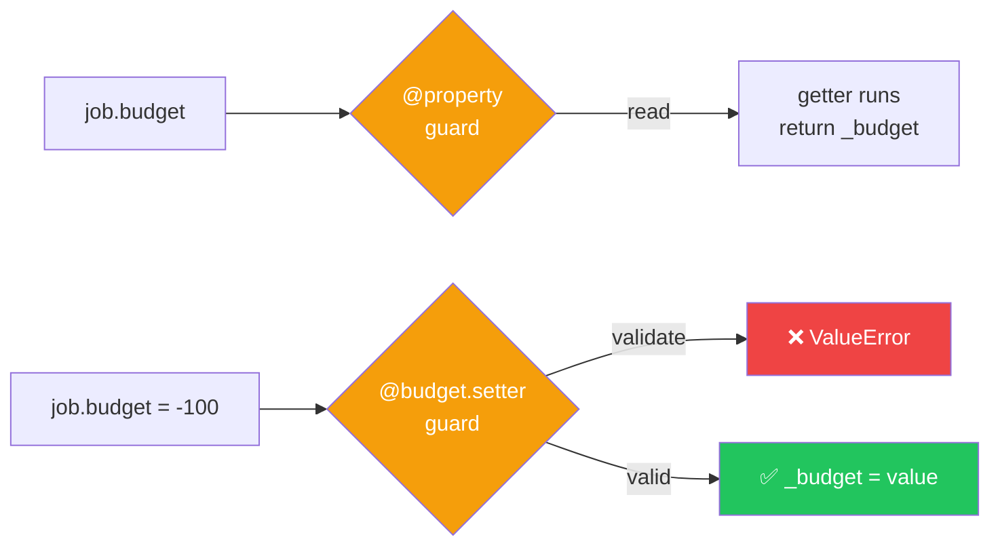
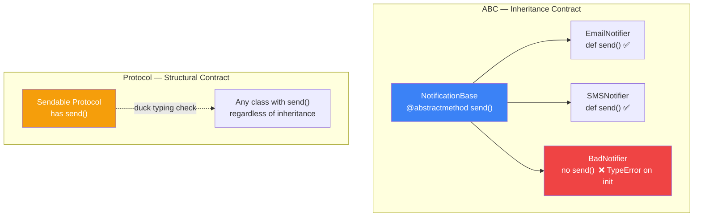

# الفصل الثاني — OOP في Python: ما وراء الـ `class`

> **المتطلبات:** [[01-Python-Memory-And-GIL]] — لازم تكون فاهم إن المتغير في Python label بيشاور على object، وإن كل حاجة في Python object. الفصل ده هيبني فوق الفكرة دي مباشرةً ويشرحلك إزاي الـ objects بتتخلق وبتتصرف.

---

## البداية — الـ `class` اللي متعرفهاش

كل developer بيتعلم Python بيحفظ إن `__init__` هي "الـ constructor." بيحفظ إن `self` بيشاور على الـ object. بيحفظ إن `class` هي طريقة لتجميع data وfunctions.

بس اسأل نفسك: **مين اللي خلق الـ object قبل ما `__init__` تشتغل؟** وليه لما بتكتب `str(my_obj)` بترجع حاجة مفيدة وأنت ما كتبتش أي method اسمها `str`؟ وليه Django's ORM بيقدر يعمل `Job.objects.filter(...)` وده مش موجود في الـ standard Python؟

الإجابات كلها جوّا الـ OOP system بتاع Python — اللي معظم الناس بتتعلم سطحه بس. دلوقتي هنتعمق في الجوهر.

---

## [[01-init-vs-new]] — مين بيخلق الـ Object ومين بيجهّزه؟

### 🧠 الشرح النظري

لما بتكتب `job = Job("Backend Dev", 5000)`، بيحصل خطوتين منفصلتين قبل ما الـ object يوصلك — وأغلب الناس مش عارفين الأولى.

**الخطوة الأولى — `__new__`:** ده اللي بيخلق الـ object فعلياً في الـ memory. هو الـ method اللي بتطلب من Python "خلّي لي مكان في الـ heap لـ object من النوع ده." بيرجع الـ object الجديد الفاضي قبل ما أي data تتحط فيه. في 99% من الحالات، مش بتحتاج تلمسه.

**الخطوة التانية — `__init__`:** بياخد الـ object اللي `__new__` خلقه وبيملّيه بالـ data. هو مش بيخلق الـ object — هو بيجهّزه. ده اللي إنت عارفه وبتكتبه كل يوم.

تخيّل الموضوع زي شقة جديدة: `__new__` هو المقاول اللي بنى الشقة وسلّمها هيكل. `__init__` هو الـ decorator اللي دخل وفرشها وحط فيها الأثاث. إنت في الغالب بتتعامل بس مع الـ decorator — بس الشقة ما اتبنتش بإيده.

الحالة الوحيدة اللي بتحتاج تعمل فيها `__new__` بنفسك هي لما تبني **Singleton** — object مش بيتخلق منه غير نسخة واحدة في كل حياة الـ application.

### 📊 Visualization



### 💻 Micro-Example

```python
class Singleton:
    _instance = None

    def __new__(cls):                        # intercept object creation
        if cls._instance is None:
            cls._instance = super().__new__(cls)   # create only once
        return cls._instance                 # always return the same object

a = Singleton()
b = Singleton()
print(a is b)   # True — same object every time
```

---

## [[02-MRO-and-super]] — الـ MRO: إزاي Python بتقرر مين "الأب الحقيقي"؟

### 🧠 الشرح النظري

في Python، class ممكن يرث من أكتر من class في نفس الوقت — ده اسمه **Multiple Inheritance.** بس لما class A وclass B الاتنين عندهم method بنفس الاسم، وclass C بيرث منهم الاتنين — Python هتنفّذ method مين؟

ده اللي بيحدده الـ **MRO — Method Resolution Order.** هو ترتيب ثابت ومحسوب بيحدد Python بتدور على الـ method في Class الإبن الأول، بعدين الـ parents من الشمال للـ يمين، بعدين الـ grandparents، وهكذا — من غير ما تزور أي class أكتر من مرة.

الـ algorithm اللي Python بتستخدمه اسمه **C3 Linearization** — مش لازم تحفظ الاسم، بس المهم إن Python دايماً بتحل الـ conflict بطريقة منطقية ومتوقعة.

الـ `super()` مش بيرجع "الـ parent class" بالضبط — ده الغلط الشائع. هو بيرجع **التالي في الـ MRO**. ده بيعني إن `super()` ذكي بيعرف إنت فين في السلسلة ويروح للي بعدك بالترتيب الصح.

تخيّل الـ MRO زي طابور وراثة رسمي في البيت: لو الأب والجد الاتنين عندهم "قاعدة" معيّنة، الطابور بيحدد مين قاعدته تتطبق أول — من غير لخبطة أو تعارض.

### 📊 Visualization



### 💻 Micro-Example

```python
class A:
    def greet(self): return "Hello from A"

class B(A):
    def greet(self):
        return super().greet() + " + B"   # super() follows MRO — calls A next

class C(A):
    def greet(self):
        return super().greet() + " + C"

class D(B, C):                            # MRO: D → B → C → A → object
    pass

print(D().greet())   # "Hello from A + C + B" — C3 linearization in action
print(D.__mro__)     # shows the exact resolution order
```

---

## [[03-Dunder-Methods]] — الـ Dunder Methods: إزاي Python بتتكلم مع Objects بتاعتك؟

### 🧠 الشرح النظري

لما بتكتب `len(my_list)` أو `print(my_obj)` أو `job1 + job2`، Python مش بتتصل بـ magic خفي — هي بتنادي على **dunder methods** موجودين في الـ object بتاعك. الاسم "dunder" جاي من "double underscore" — كل method زي كده بتبدأ وتخلص بـ `__`.

ده نظام بيسمحلك تعرّف "إزاي الـ object بتاعك يتصرف" مع operators وbuilt-in functions المختلفة. بمعنى تاني: Python عندها "لغة سرية" مع objects — لو عرّفت الـ dunder methods الصح، الـ object بتاعك هيفهم `+` و`==` و`len()` و`print()` و`for` وغيرهم كلهم.

أهم الـ dunder methods اللي بتحتاجها في الـ backend development:

**`__str__`** — اللي بيتنادى لما بتعمل `print(obj)` أو `str(obj)`. المفروض يرجع string human-readable للمستخدم أو للـ logs.

**`__repr__`** — اللي بيتنادى في الـ debugging والـ REPL. المفروض يرجع string بيمثّل الـ object بشكل ممكن تنسخه وتشغّله كـ Python code.

**`__eq__`** — اللي بيتنادى لما بتعمل `==`. من غيره، Python بتقارن بالـ identity (نفس الـ object) مش بالـ value.

**`__len__`** — اللي بيتنادى لما بتعمل `len(obj)`.

**`__contains__`** — اللي بيتنادى لما بتعمل `item in obj`.

تخيّل الـ dunder methods زي "مترجم فوري" بين Python's built-in syntax والـ objects بتاعتك. Python بتقول "أنا عايزة len() من الـ object ده" — وده بيعمل ترجمة "اسأله عن `__len__`".

### 📊 Visualization



### 💻 Micro-Example

```python
class Job:
    def __init__(self, title, budget):
        self.title = title
        self.budget = budget

    def __str__(self):
        return f"Job: {self.title} (${self.budget})"   # for print() and logs

    def __repr__(self):
        return f"Job(title={self.title!r}, budget={self.budget})"  # for debugging

    def __eq__(self, other):
        return isinstance(other, Job) and self.title == other.title  # value comparison

job = Job("Backend Dev", 5000)
print(job)          # "Job: Backend Dev ($5000)"      — calls __str__
print(repr(job))    # "Job(title='Backend Dev', budget=5000)" — calls __repr__
```

---

## [[04-classmethod-staticmethod]] — ثلاث أنواع من الـ Methods: أيهم تختار؟

### 🧠 الشرح النظري

داخل أي Python class، عندك في الحقيقة ثلاث أنواع مختلفة من الـ methods — مش نوع واحد. الفرق بينهم في سؤال واحد بسيط: **مين اللي بيتمرر تلقائياً كـ أول argument؟**

**Instance method** — النوع العادي اللي عارفه. بياخد `self` كـ أول argument — وده بيشاور على الـ instance بالذات. بيقدر يوصل لكل data الـ instance والـ class.

**`@classmethod`** — بياخد `cls` كـ أول argument — وده بيشاور على الـ class نفسها مش instance معيّنة. بتستخدمه عشان تعمل "طريقة تانية للإنشاء" — زي `Job.from_dict(data)` أو `Job.from_api_response(response)`. الـ Django ORM مبني على الفكرة دي.

**`@staticmethod`** — ما بياخدش لا `self` ولا `cls`. هو بس function عادية مش لها علاقة بالـ instance ولا بالـ class — بس منطقياً مكانها جوّا الـ class. بتستخدمه لـ utility functions مرتبطة بموضوع الـ class بس مش محتاجة state منها.

تخيّل مصنع سيارات: الـ instance method هي "إصلح هذه السيارة المحددة." الـ classmethod هي "اصنع سيارة جديدة من مواصفات معيّنة." الـ staticmethod هي "احسب ضريبة تسجيل السيارة" — مفيهاش سيارة بعينها، بس منطقياً في مكان المصنع.

### 📊 Visualization



### 💻 Micro-Example

```python
class Job:
    platform = "HireLink"                        # class-level attribute

    def __init__(self, title, budget):
        self.title = title
        self.budget = budget

    def describe(self):                          # instance method: needs self
        return f"{self.title} on {self.platform}"

    @classmethod
    def from_dict(cls, data: dict):              # classmethod: alternative constructor
        return cls(data["title"], data["budget"])

    @staticmethod
    def is_valid_budget(amount: int) -> bool:    # staticmethod: pure utility, no state
        return amount > 0

job = Job.from_dict({"title": "Backend Dev", "budget": 5000})
print(Job.is_valid_budget(-100))   # False
```

---

## [[05-property-decorator]] — الـ `@property`: Getters وSetters بالأسلوب الـ Pythonic

### 🧠 الشرح النظري

في Java و C#، العرف إنك لما تعمل private attribute، بتعمل معاه `getTitle()` و`setTitle()` كـ public methods. ده بيحمي الـ data ويضيف validation — بس الـ syntax بقى verbose وغريب.

Python بتفكر بطريقة مختلفة: ابدأ بـ public attribute عادي. لو احتجت تضيف validation أو computed logic لاحقاً — استخدم `@property` وحوّله لـ property بدون ما حد خارج الـ class يحس بأي فرق في الـ syntax.

الـ `@property` بيخليك تعرّف ثلاث حاجات لـ نفس الاسم: قراءة (getter) عن طريق `@property`، كتابة (setter) عن طريق `@name.setter`، وحذف (deleter) عن طريق `@name.deleter`. الكود اللي بيستخدم الـ attribute مش بيحس بأي فرق — بيكتب `job.budget` مش `job.get_budget()`.

تخيّل الـ `@property` زي "حارس سري" على الباب — إنت من بّرّه بس بتشوف باب عادي وبتدخل عادي. بس الحارس جوّاه بيتأكد من الهوية وبيسجّل الدخول قبل ما يوديك جوّا.

### 📊 Visualization



### 💻 Micro-Example

```python
class Job:
    def __init__(self, title, budget):
        self.title = title
        self.budget = budget          # triggers the setter immediately

    @property
    def budget(self):
        return self._budget           # getter: plain read

    @budget.setter
    def budget(self, value):
        if value <= 0:
            raise ValueError("Budget must be positive")
        self._budget = value          # setter: validates before storing

job = Job("Backend Dev", 5000)
print(job.budget)    # 5000          — looks like a plain attribute access
job.budget = -100    # ❌ ValueError — validation runs transparently
```

---

## [[06-ABC-and-Protocols]] — Abstract Classes والـ Protocols: العقد الإلزامي

### 🧠 الشرح النظري

تخيّل معايا إنك بتبني HireLink وعندك أنواع مختلفة من الـ notifications: Email، SMS، وPush. الثلاثة لازم يبعتوا notification بطريقتهم — بس انت عايز تضمن إن **أي** notification class اللي حد هيضيفها في المستقبل هيكون فيها method اسمها `send()`. مش توقع — ضمان.

الـ **Abstract Base Class (ABC)** هو class مش بتخليش حد يعمل منها instance مباشرةً — هي بس "عقد" بيقول "أي class بيورث مني لازم يكتب الـ methods دي أو هيتولع error فوري وقت الإنشاء." ده بيمنع نسيان implement method مهمة في الـ subclasses.

الـ **Protocol** (Python 3.8+) هو فكرة تانية — "structural subtyping" أو اللي بيتسمى "duck typing رسمي." بدل ما تقول "الـ class ده لازم يرث من abstract class معيّنة"، بتقول "أي object عنده الـ methods دي — أنا بقبله." مش لازم يرث من حاجة — بس لازم يتصرف بالشكل الصح.

الفرق العملي: الـ ABC بتفرض علاقة وراثة صريحة. الـ Protocol بيفرض behavior بس — مهما كان أصل الـ class. الـ Protocol أقرب لفلسفة Python الأصيلة: "لو بيمشي زي البطة وبيعوم زي البطة — أنا هعامله كبطة."

### 📊 Visualization



### 💻 Micro-Example

```python
from abc import ABC, abstractmethod

class NotificationBase(ABC):
    @abstractmethod
    def send(self, message: str) -> None:   # contract: every subclass MUST implement this
        ...

class EmailNotifier(NotificationBase):
    def send(self, message: str) -> None:
        print(f"Email: {message}")          # fulfills the contract ✅

class BrokenNotifier(NotificationBase):
    pass                                    # forgot to implement send()

EmailNotifier().send("Welcome!")   # works fine
BrokenNotifier()                   # ❌ TypeError: Can't instantiate abstract class
```

---

## ✅ Self-check

| السؤال | إجابتك |
|---|---|
| إيه الفرق بين `__new__` و `__init__` وامتى محتاج تعمل `__new__` بنفسك؟ | |
| الـ `super()` بيرجع "الـ parent" — صح ولا غلط؟ وإيه الصح؟ | |
| إيه الفرق بين `__str__` و `__repr__`؟ امتى بيتنادى كل واحد؟ | |
| امتى بتستخدم `@classmethod` بدل instance method عادي؟ | |
| إيه الـ `@property` وليه بيتحكم فيه أحسن من attribute عادي؟ | |
| إيه الفرق بين الـ ABC والـ Protocol في Python؟ | |

---

## 🎯 أسئلة الإنترفيو

**س: إيه الفرق بين `__str__` و `__repr__`؟**
> `__str__` بيتنادى لما بتعمل `print(obj)` أو `str(obj)` وبيرجع string human-readable للمستخدم أو للـ logs. `__repr__` بيتنادى في الـ debugging والـ Python REPL وبيرجع string تقني بيمثّل الـ object — المفروض لو نسخته وشغّلته كـ Python code يرجعلك نفس الـ object. القاعدة: `__str__` للناس، `__repr__` للـ developers. لو عملت واحدة بس — اعمل `__repr__`، لأن `__str__` بيرجع لـ `__repr__` تلقائياً لو مش موجودة.

---

**س: إيه الفرق بين `@classmethod` و `@staticmethod` وامتى تستخدم كل واحد؟**
> `@classmethod` بياخد `cls` كـ أول argument — بيشاور على الـ class نفسها — وبتستخدمه لعمل **alternative constructors** زي `User.from_google_token(token)` أو `Job.from_dict(data)`. `@staticmethod` ما بياخدش لا `self` ولا `cls` — هو function عادية مرتبطة منطقياً بالـ class بس مش محتاجة state منها، زي `Job.is_valid_budget(amount)`. الـ classmethod أكتر استخداماً في الـ production code، والـ staticmethod بتستخدمه للـ pure utility logic.

---

**س: إيه الـ MRO وليه مهم في Python؟**
> الـ MRO هو الترتيب اللي Python بتتبعه لما بتدور على method في hierarchy من الـ classes. Python بتستخدم خوارزمية **C3 Linearization** اللي بتضمن إن كل class بتتفحص مرة واحدة بس وبترتيب منطقي ومتوقع. مهم لأن Python بتسمح بـ Multiple Inheritance — ومن غير MRO ثابت ومحسوب، الـ method resolution هتبقى غامضة ومش متوقعة. تقدر تشوف الـ MRO بأي class عن طريق `ClassName.__mro__`.

---

**س: إيه فايدة الـ ABC على إنك بس تكتب comments بتقول "اعمل implement"؟**
> الـ comment مش بيجبر حد على حاجة — لو حد نسي يكتب الـ method، الـ error هيظهر وقت runtime في أسوأ وقت. الـ ABC بيجبر الـ Python interpreter نفسه إنه يـ raise `TypeError` فوراً لو حاولت تعمل instance من class ورثت من الـ ABC وما كملتش الـ abstract methods. ده بيحول الـ error من runtime لـ "وقت الإنشاء" — أسرع بكتير في الاكتشاف.

---

**س: إيه الـ Protocol وبيختلف عن الـ ABC إزاي؟**
> الـ Protocol هو "structural subtyping" — بيقول "أي object عنده الـ methods دي أنا بقبله" بغض النظر عن شجرة وراثته. مش محتاج يرث من حاجة معيّنة. مثال: function بتاخد `Saveable Protocol` — أي object عنده method `save()` بيتقبل، سواء ورث من ABC أو لأ. الـ ABC بتفرض **nominal subtyping** (الوراثة الصريحة). الـ Protocol بيفرض **structural subtyping** (الـ behavior بس). الـ Protocol أقرب لفلسفة Python الأصيلة في الـ duck typing.

---

## 📝 خلاصة الدرس

الـ OOP في Python أعمق بكتير من `class` و`__init__`. الـ `__new__` هو اللي بيخلق الـ object فعلياً قبل ما `__init__` تشتغل — والـ Singleton pattern بيعتمد عليه. الـ MRO هو الخريطة الثابتة اللي Python بتتبعها لحل تعارضات الـ Multiple Inheritance، والـ `super()` مش بيرجع الـ parent المباشر — بيرجع التالي في الـ MRO. الـ **Dunder Methods** هي اللغة السرية اللي بتخلي الـ objects بتاعتك تتكلم مع Python's built-in syntax من `==` لـ `len()` لـ `print()`. الـ `@classmethod` هو الطريقة الـ Pythonic لعمل alternative constructors، والـ `@staticmethod` للـ utility functions اللي منطقياً في الـ class بس مش محتاجة state. الـ `@property` بيديك validation وcomputed logic بدون ما تغيّر الـ API بتاع الـ class. والـ **ABC** بتفرض عقود implementation على الـ subclasses — اللي بيحمي codebase الكبير من الـ bugs الصامتة.

---

*Next → [[03-Python-Functional-Paradigm]] — عرفنا إزاي نصمم الـ objects. دلوقتي هنتعلم أسلوب تفكير تاني خالص — البرمجة الوظيفية: `map`, `filter`, `reduce`, الـ closures، والـ `functools` — وإزاي ده بيأثر على كتابة الـ Django views بشكل أنظف.*
