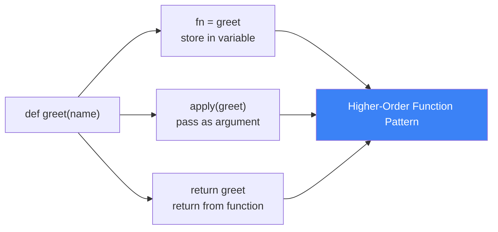
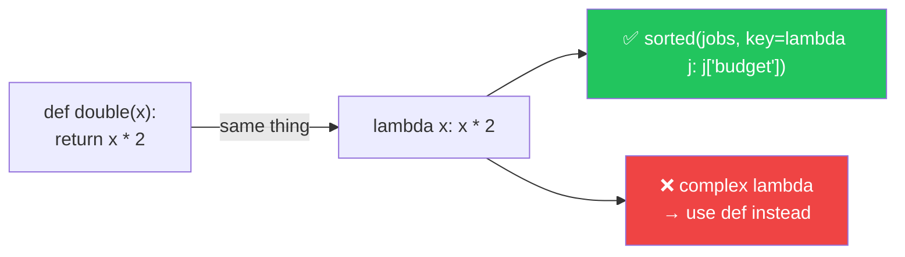
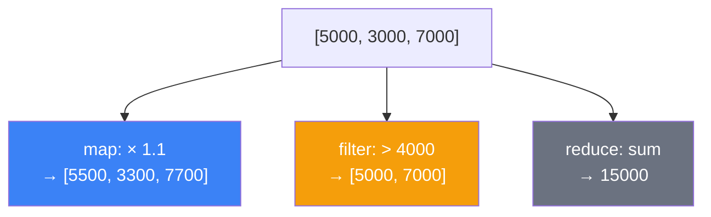
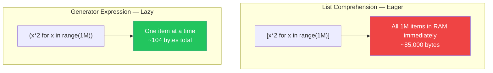
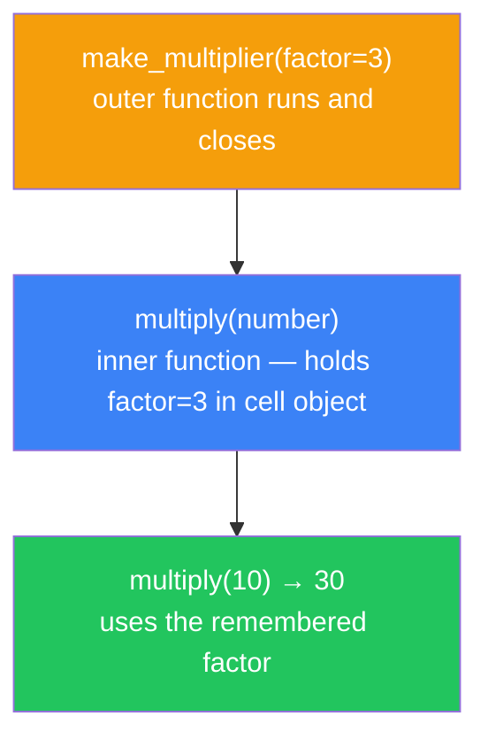
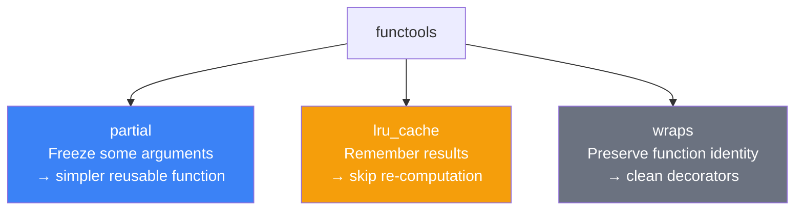

# الفصل الثالث — البرمجة الوظيفية: الأسلوب اللي بيخلي كودك يتكتب نفسه

> **المتطلبات:** [[02-Python-OOP-Deep-Dive]] — لازم تكون فاهم إن الـ functions في Python objects عادية، وإن الـ Higher-Order Functions ممكنة. الفصل ده هيوسّع تفكيرك من "بكتب steps" لـ "بوصف نتايج".

---

## البداية — أسلوبين للتفكير في نفس المشكلة

تخيّل معايا إنك عندك list من الـ jobs في HireLink وعايز تجيب الـ budgets بتاعتهم كلها مضروبة في 1.1 (زيادة 10%).

الطريقة الأولى — **Imperative** (بتقول "كيف"):

```python
jobs = [{"title": "Backend Dev", "budget": 5000},
        {"title": "Designer",    "budget": 3000}]

result = []
for job in jobs:
    new_budget = job["budget"] * 1.1
    result.append(new_budget)
```

الطريقة التانية — **Functional** (بتقول "إيه"):

```python
result = list(map(lambda job: job["budget"] * 1.1, jobs))
```

الاتنين بيوصلوا لنفس النتيجة. بس الثانية بتوصف **النتيجة المطلوبة** مش الخطوات. أقصر، أوضح، وأسهل تتأكد منها.

ده مش مجرد أسلوب كتابة — ده **paradigm** مختلف في التفكير. وعشان تفهمه صح، لازم تبدأ من الأساس.

---

## [[01-First-Class-Functions]] — الـ Function كـ قيمة عادية

### 🧠 الشرح النظري

في Python، الـ function مش "حاجة خاصة" ليها معاملة مختلفة — هي object عادي زي الرقم والـ string. ده معناه إنك تقدر تعمل بيها كل حاجة بتعملها مع أي value تانية.

تقدر تحطها في متغير. تقدر تمررها كـ argument لـ function تانية. تقدر ترجعها من function. تقدر تحطها في list أو dict. الـ functions اللي بتاخد أو بترجع functions تانية بتتسمى **Higher-Order Functions** — وده اللي بيبني عليه كل الـ functional programming.

تخيّل إن عندك صندوق أدوات. في Python، الـ function نفسها أداة تقدر تحطها في الصندوق، تديها لحد تاني، أو تعمل أداة جديدة منها. في لغات تانية، الأداة دايماً مربوطة في مكانها ومش تتنقل.

ده بالظبط هو الأساس اللي بتبنى عليه الـ `map`, `filter`, الـ decorators، والـ callbacks كلها.

### 📊 Visualization



### 💻 Micro-Example

```python
def apply_discount(price, discount_fn):   # accepts a function as argument
    return discount_fn(price)

def ten_percent(p): return p * 0.9
def flat_fifty(p):  return p - 50

print(apply_discount(5000, ten_percent))  # 4500.0
print(apply_discount(5000, flat_fifty))   # 4950
```

---

## [[02-Lambda]] — الـ Function المجهولة: متى تستخدمها ومتى لا

### 🧠 الشرح النظري

الـ `lambda` هي طريقة لكتابة function بسيطة من سطر واحد من غير ما تديها اسم. بتشتغل بنفس طريقة أي function عادية — بس syntax أقصر ومناسبة للاستخدام المؤقت اللي هتمرر فيها الـ function مباشرةً لـ function تانية.

القيد الجوهري: الـ lambda بتاخد expression واحد بس وبترجع قيمته تلقائياً. مش ممكن فيها `if` blocks أو `for` loops أو أكتر من سطر منطق.

المشكلة اللي كتير بيقع فيها: بيستخدموا lambda في أماكن المفروض فيها function عادية معاها اسم. لو الـ lambda أصبحت معقدة أو محتاجة اسم عشان تتفهم — ده علامة إنك المفروض تكتب `def` عادي. الـ lambda المعقدة أصعب في الـ debugging والـ testing بكتير.

القاعدة البسيطة: lambda للعمليات البسيطة اللي بتمررها لـ `map`, `filter`, `sorted` — مش للـ business logic.

### 📊 Visualization



### 💻 Micro-Example

```python
jobs = [{"title": "Backend", "budget": 5000},
        {"title": "Design",  "budget": 3000},
        {"title": "DevOps",  "budget": 7000}]

# ✅ lambda as a quick key function — clean and appropriate
by_budget  = sorted(jobs, key=lambda j: j["budget"])
top_budget = max(jobs,    key=lambda j: j["budget"])

# ❌ lambda getting too complex — should be a named function
# process = lambda j: j["budget"] * 1.1 if j["budget"] > 4000 else j["budget"]
```

---

## [[03-Map-Filter-Reduce]] — الثالوث المقدس

### 🧠 الشرح النظري

الثلاث functions دول هم العمود الفقري للـ functional programming في Python. كل واحد فيهم بياخد function وiterable ويعمل حاجة مختلفة.

**`map(fn, iterable)`** — بيطبّق الـ function على كل element وبيرجع iterator بالنتايج. "حوّل كل حاجة في اللستة بالطريقة دي."

**`filter(fn, iterable)`** — بيطبّق الـ function على كل element وبيرجع بس العناصر اللي الـ function رجعت فيها `True`. "جيبلي بس اللي يعدّي الشرط ده."

**`reduce(fn, iterable)`** — بيطبّق الـ function على العناصر بشكل تراكمي ويجمّعها في قيمة واحدة. "اطوي كل اللستة في قيمة واحدة." ده في `functools` مش built-in مباشرةً.

الثلاثة بيرجعوا **iterators** — مش lists. ده مهم جداً لأنهم **lazy**: مش بيشتغلوا حتى لما تطلب منهم النتيجة. لو عندك مليون element، `map` مش بتبني list في الـ memory — بتولّد element element وقت الحاجة.

### 📊 Visualization



### 💻 Micro-Example

```python
from functools import reduce

budgets = [5000, 3000, 7000, 1500, 4200]

raised  = list(map(lambda b: b * 1.1, budgets))       # apply 10% raise to all
premium = list(filter(lambda b: b > 4000, budgets))   # keep only premium budgets
total   = reduce(lambda acc, b: acc + b, budgets)      # sum them all

print(raised)   # [5500.0, 3300.0, 7700.0, 1650.0, 4620.0]
print(premium)  # [5000, 7000, 4200]
print(total)    # 20700
```

---

## [[04-Comprehensions-vs-Generators]] — الـ Memory: لما الكسل فضيلة

### 🧠 الشرح النظري

في Python، عندك طريقتين للتعامل مع collections من البيانات: إما تبنيها كلها في الـ memory فوراً، أو تولّدها element بـ element وقت الحاجة.

**List Comprehension** — بتبني الـ list كاملة في الـ memory فوراً. السكر النحوي الجميل اللي بتحبه في Python. سريع وواضح — بس لو اللستة كبيرة جداً، ممكن تاكل RAM كتير.

**Generator Expression** — نفس الـ syntax بالظبط بس بـ `()` بدل `[]`. مش بيبني حاجة في الـ memory — بيولّد القيم واحدة واحدة وقت ما تطلبها. لو عندك مليون row من الـ DB وعايز تعالجها — الـ generator بيخليك تعمل ده من غير ما الـ RAM ينفجر.

الفرق الجوهري: الـ list comprehension "متحمس" — بيعمل كل حاجة فوراً. الـ generator "كسول" — بيشتغل بس لما تطلب منه. في Django context، الـ QuerySets بتشتغل بنفس فلسفة الـ generators — lazy evaluation حتى لما تستهلك النتيجة.

### 📊 Visualization



### 💻 Micro-Example

```python
import sys

# list comprehension: builds everything in memory right now
list_comp = [x ** 2 for x in range(10_000)]
print(sys.getsizeof(list_comp))   # ~85,176 bytes

# generator expression: builds nothing yet
gen_exp = (x ** 2 for x in range(10_000))
print(sys.getsizeof(gen_exp))     # ~104 bytes — just the generator object

# use generator when piping into sum, max, any, all
total = sum(x ** 2 for x in range(10_000))   # no intermediate list created
```

---

## [[05-Closures]] — الـ Function اللي بتتذكر

### 🧠 الشرح النظري

تخيّل معايا إنك فتحت محل وبعدين سكّرته — بس المحاسب بقى يتذكر رصيد الكاشير حتى بعد ما المحل اتسكّر. ده بالظبط هو الـ **Closure**.

الـ Closure بيحصل لما function جوّاها function تانية — والـ inner function بتحتفظ بالـ variables بتاعة الـ outer function حتى بعد ما الـ outer function خلصت وأغلقت. الـ inner function "اتذكرت" البيئة اللي اتخلقت فيها.

ده مش magic — ده بيحصل لأن Python بتشيل الـ variables دي في object خاص اسمه **cell object** مرتبط بالـ inner function. طول ما الـ inner function موجودة، الـ variables دي موجودة.

الـ Closures هم الأساس اللي الـ decorators بتتبني عليه — وهنشوف ده في الفصل الجاي بالتفصيل. فاهم الـ closures = فاهم الـ decorators.

### 📊 Visualization



### 💻 Micro-Example

```python
def make_multiplier(factor):          # outer function — defines the environment
    def multiply(number):             # inner function — captures 'factor'
        return number * factor        # 'factor' lives in a cell object
    return multiply                   # return the inner function itself

triple = make_multiplier(3)
double = make_multiplier(2)

print(triple(10))   # 30 — factor remembered as 3
print(double(10))   # 20 — separate closure, factor remembered as 2
```

---

## [[06-Functools]] — أدوات الـ Functional Programming المتقدمة

### 🧠 الشرح النظري

`functools` هو الـ module اللي Python بتجيب فيه أدوات متخصصة للـ functional programming. ثلاث functions فيه بتستخدمهم كتير في الـ real-world code.

**`partial`** — بيخليك "تثبّت" بعض الـ arguments في function وتعمل function جديدة أبسط. تخيّل إن عندك function بتاخد 4 arguments وأنت دايماً بتبعت نفس الـ 2 arguments الأولانيين — `partial` بيعمل نسخة جديدة من الـ function بالـ arguments دي محفوظة جوّاها.

**`lru_cache`** — اختصار لـ "Least Recently Used Cache." بيحفظ نتيجة الـ function لكل مجموعة من الـ arguments. لو نادّيت الـ function بنفس الـ arguments تاني مرة، بيرجع الـ cached result فوراً من غير ما يشتغل تاني. مثالي للـ expensive computations اللي بتتكرر بنفس الـ inputs.

**`wraps`** — حاجة صغيرة بس مهمة جداً في الـ decorators. لما بتعمل decorator، الـ wrapper function بتاخد هوية نفسها مش الـ original function — فلو حد عمل `help(my_func)` هيشوف اسم الـ wrapper مش الـ original. `wraps` بيحل المشكلة دي بينقل الـ metadata من الـ original للـ wrapper.

### 📊 Visualization



### 💻 Micro-Example

```python
from functools import partial, lru_cache

# partial: fix 'platform' — get a simpler factory function
def create_job(platform, title, budget):
    return {"platform": platform, "title": title, "budget": budget}

hirelink_job = partial(create_job, "HireLink")   # 'platform' is now baked in
job = hirelink_job("Backend Dev", 5000)          # only title & budget needed

# lru_cache: cache results of expensive lookups
@lru_cache(maxsize=128)
def get_skill_category(skill_name: str) -> str:
    print(f"DB hit for: {skill_name}")           # only runs on first call
    return "engineering"

get_skill_category("python")   # DB hit — prints message
get_skill_category("python")   # cache hit — no print, instant return
```

---

## 🎯 أسئلة الإنترفيو

**س: إيه الفرق بين List Comprehension وGenerator Expression؟ وامتى تستخدم كل واحد؟**

> **List Comprehension** — بتبني الـ list كاملة في الـ memory فوراً. مناسبة لما تحتاج النتايج كلها متاحة في نفس الوقت، أو هتعمل عليها loop أكتر من مرة.<br/><br/>
> **Generator Expression** — بتولّد القيم واحدة واحدة وقت الحاجة. مش بتبني حاجة في الـ memory — مجرد object صغير بيعرف "الخطوة الجاية."<br/><br/>
> **القاعدة العملية:** لو بتمرر النتيجة لـ `sum()`, `max()`, `any()`, `all()` — استخدم generator مش محتاج list. في Django، الـ QuerySets بتشتغل بنفس فلسفة الـ generators — lazy evaluation حتى لما تستهلك النتيجة فعلاً.

---

**س: إيه هو الـ Closure وإيه علاقته بالـ Decorators؟**

> الـ Closure بيحصل لما **inner function** بتحتفظ بالـ variables بتاعة الـ outer function حتى بعد ما الـ outer function خلصت وأغلقت.<br/><br/>
> الـ variables دي مش بتتحذف لأن Python بتشيلها في **cell objects** مرتبطة بالـ inner function — طول ما الـ inner function موجودة، الـ cell موجود.<br/><br/>
> **الـ Decorator هو تطبيق مباشر للـ closure:** بياخد function، بيعمل wrapper حواليها، والـ wrapper بيتذكر الـ original function — وده closure بالتعريف.

---

**س: إيه فايدة `lru_cache` وإيه الـ trade-off بتاعه؟**

> `lru_cache` بيحفظ نتيجة الـ function لكل مجموعة arguments — لو نادّيتها بنفس الـ input، بيرجع الـ cached result فوراً من غير ما يشتغل تاني.<br/><br/>
> **مثالي للـ pure functions** — اللي نفس الـ input دايماً بيدي نفس الـ output، زي calculations أو lookups ثابتة.<br/><br/>
> **الـ trade-off:** بياكل memory مع الوقت — لازم تحدد `maxsize` عشان ما يفضلش يحفظ للأبد.<br/><br/>
> **تحذير مهم:** ما تستخدمهوش مع functions بتعمل DB queries مباشرةً — البيانات ممكن تتغير والـ cache هيديك نتيجة قديمة. في الـ production، استخدم Redis أو Django's cache framework.

---

**س: إيه الفرق بين الـ Imperative والـ Functional approach وامتى كل واحد أحسن؟**

> **Imperative** — بتقول "كيف": خطوة خطوة، loop، تراكم في variable. أوضح لـ complex logic وfull control flow.<br/><br/>
> **Functional** — بتقول "إيه": بتوصف النتيجة بـ `map`, `filter`, `reduce`. أقصر وأسهل في الـ testing لأن الـ pure functions مفيهاش side effects.<br/><br/>
> **في الـ real-world:** الأسلوبين مش متعارضين — Python بتمزجهم. استخدم الـ functional approach للـ data transformations البسيطة، والـ imperative للـ complex control flow والـ business logic.

---

## 📝 خلاصة الدرس

- **First-Class Functions:** الـ function في Python object عادي — تتمرر، تتخزن، وترجع زي أي قيمة. ده الأساس اللي كل الـ patterns التالية بتبني عليه.
- **Lambda:** function مؤقتة من expression واحد — استخدمها مع `sorted`, `map`, `filter` فقط. لو المنطق معقد — اكتب `def` عادي بـ اسم واضح.
- **`map` / `filter` / `reduce`:** الثلاثة بيرجعوا iterators lazy — مش lists. بيشتغلوا element بـ element وقت الطلب، مش قبله.
- **Comprehensions vs Generators:** الـ list comprehension eager وبتملا الـ memory فوراً. الـ generator expression lazy وبيوفر الـ RAM — استخدمه لما بتمرر لـ `sum()` أو بتتعامل مع بيانات ضخمة.
- **Closures:** الـ inner function بتتذكر بيئة الـ outer function حتى بعد إغلاقها عن طريق **cell objects** — وده الأساس اللي الـ decorators بتتبني عليه مباشرةً.
- **`functools`:** `partial` لتثبيت arguments وتبسيط الـ interface. `lru_cache` لـ caching نتايج الـ pure functions. `wraps` للحفاظ على هوية الـ function جوّا الـ decorators.

---

*Next → [[04-Python-Decorators]] — عرفنا الـ closures من الجذور. دلوقتي هنشوف الـ decorators من الداخل — مش بس إزاي تستخدمهم، إزاي تبنيهم من الصفر وتفهم ليه `@login_required` و`@cache_page` في Django هم بس decorators عاديين بنفس المنطق.*
