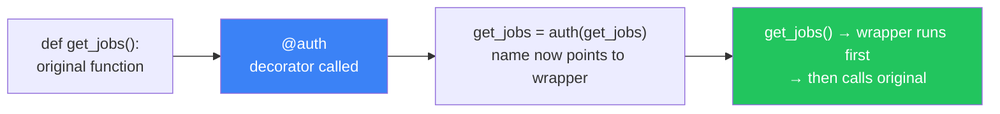
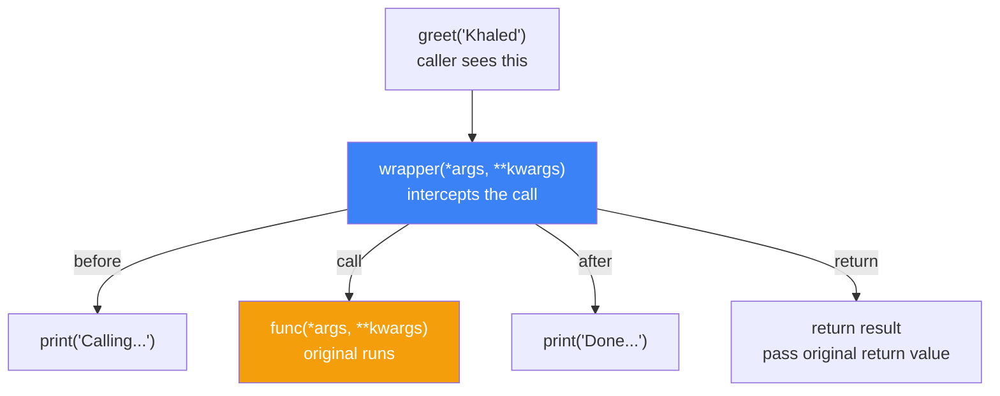
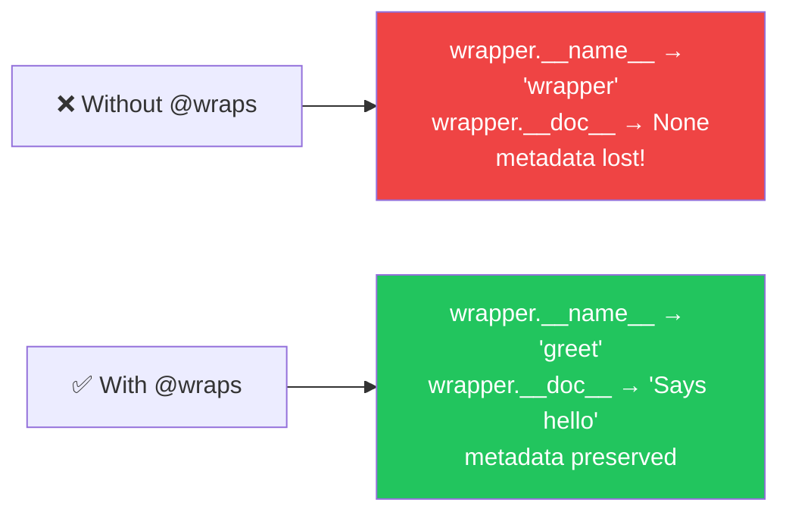
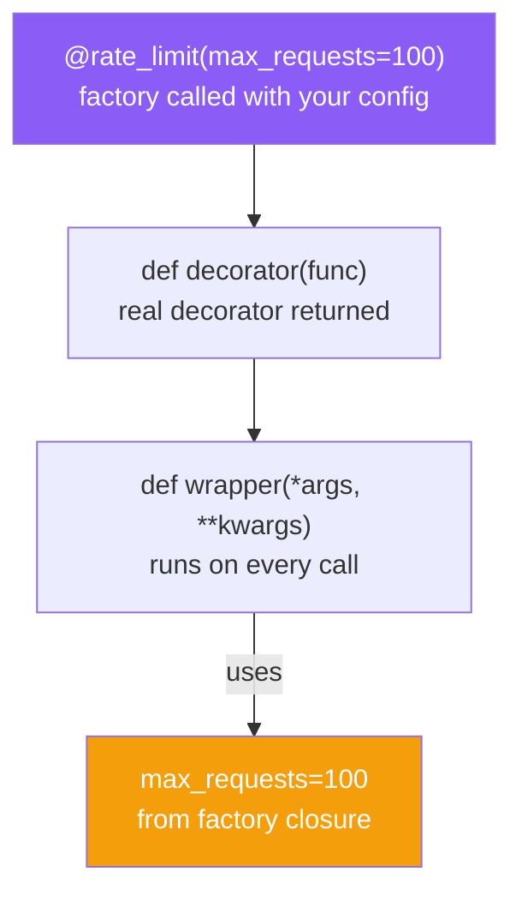
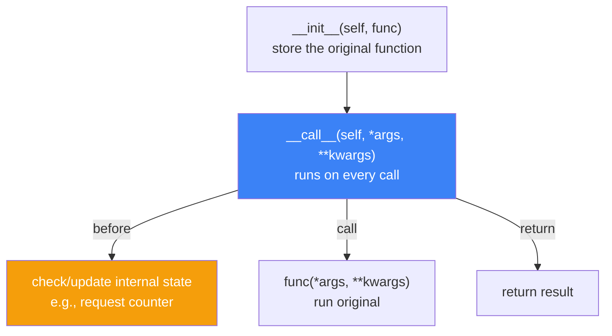
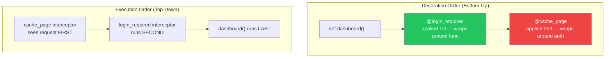
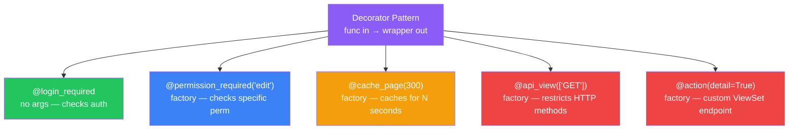

# الفصل الرابع — الـ Decorators: "الطبقة السرية" فوق كودك

> **المتطلبات:** [[03-Python-Functional-Paradigm]] — لازم تكون فاهم الـ First-Class Functions والـ Closures كويس. الـ decorator هو الـ closure في أحسن حالاته — function بتلف حوالين function تانية وتضيف سلوك من غير ما تعدّل الكود الأصلي. الفصل ده هيوصلك من "إزاي بتشتغل" لـ "إزاي تبنيها وتستخدمها في Django."

---

## البداية — المشكلة اللي الـ Decorator بيحلها

تخيّل معايا إنك بناء الـ HireLink API وعندك 10 routes محتاجين authentication. من غير decorator، كل route هتحتاج تكتب نفس كود الـ token validation في أولها:

```python
def get_jobs(request):
    token = request.headers.get("Authorization")
    if not token:
        return {"error": "Unauthorized"}, 401
    user = verify_token(token)
    if not user:
        return {"error": "Invalid token"}, 401
    # FINALLY the actual business logic
    return Job.objects.all()
```

نفس الكود بيتكرر 10 مرات. لو عايز تعدّل الـ validation logic — لازم تعدّل في 10 أماكن. ده كابسة الـ DRY principle.

الـ decorator بيحل المشكلة دي: بياخد الـ logic المتكررة، يحطها في مكان واحد، ويلفّها حوالين أي function محتاجها. من الداخل، الـ decorator مش بيعمل حاجة في الـ function الأصلية — هو بيزود سلوك "من برّا."

---

## [[01-Decorator-As-Higher-Order-Function]] — الـ Decorator مش Magic — هو بس Function

### 🧠 الشرح النظري

أي decorator في Python هو بس **Higher-Order Function** — function بتاخد function كـ argument وترجع function جديدة. بس كده. مفيش syntax خاص، مفيش keyword جديد، مفيش حاجة سحرية.

لما بتكتب `@my_decorator` فوق function، Python بتعمل حاجة بسيطة جداً: بتنادي الـ decorator بالـ function الأصلية كـ argument، وبترجع الـ result وتحطه في نفس اسم الـ function. يعني `@auth` فوق `get_jobs` هو بالظبط `get_jobs = auth(get_jobs)`. النتيجة: الاسم `get_jobs` دلوقتي بيشاور على الـ function الجديدة اللي الـ decorator رجعها — مش الأصلية.

ده معناه إن الـ decorator مش بيعدّل الكود الأصلي — هو بيشيله جوّا wrapper ويضيف سلوك حواليه. والـ wrapper ده هو اللي بيشتغل أول ما حد ينادي الـ function. هو اللي يقرر: أنادي الأصلية؟ أناديها بإيه؟ أعمل حاجة قبلها؟ أعمل حاجة بعدها؟

### 📊 Visualization



### 💻 Micro-Example

```python
def log_call(func):                     # decorator: takes a function
    def wrapper(*args, **kwargs):        # wrapper: replaces the original
        print(f"Calling {func.__name__}")  # behavior added BEFORE
        result = func(*args, **kwargs)   # call the original function
        print(f"Done {func.__name__}")     # behavior added AFTER
        return result
    return wrapper                       # return the new function

@log_call                                # greet = log_call(greet)
def greet(name):
    return f"Hello, {name}"

greet("Khaled")  # Calling greet → Hello, Khaled → Done greet
```

---

## [[02-The-Wrapper-Pattern]] — بناء Decorator من الصفر خطوة بخطوة

### 🧠 الشرح النظري

أي decorator محترم بيتكون من 3 طبقات. الطبقة الأولى هي الـ decorator نفسه — اللي بياخد الـ original function. الطبقة التانية هي الـ wrapper — اللي بيستبدل الـ original function وبيضيف السلوك الجديد. الطبقة التالتة هي الـ original function نفسها — اللي الـ wrapper بيناديها في الوقت المناسب.

الـ wrapper لازم يقبض أي arguments ممكن توصل له — عشان هو بيقف مكان الـ original function ومش عارف مسبقاً إيه الـ arguments اللي هتوصل. عشان كده بنستخدم `*args` و `**kwargs` — الـ catch-all pattern اللي بيمسك أي حاجة.

الـ wrapper كمان لازم يرجع نفس اللي الـ original function بترجع — عشان السلوك من برّا ما يتغيرش. لو الأصلية بترجع dict، الـ wrapper لازم يرجع dict. لو بترجع Response، الـ wrapper يرجع Response. الـ wrapper مش يغير نوع الـ return — يضيف سلوك بس.

### 📊 Visualization



### 💻 Micro-Example

```python
def timer(func):
    import time
    def wrapper(*args, **kwargs):        # accept ANY arguments
        start = time.perf_counter()      # before: start clock
        result = func(*args, **kwargs)   # call original with same args
        elapsed = time.perf_counter() - start  # after: stop clock
        print(f"{func.__name__} took {elapsed:.4f}s")
        return result                    # return original's result unchanged
    return wrapper

@timer
def fetch_jobs():
    return [{"title": "Backend", "budget": 5000}]

fetch_jobs()  # fetch_jobs took 0.0001s
```

---

## [[03-functools-wraps]] — ليه لازم تحط `@wraps` دايماً

### 🧠 الشرح النظري

لما بتعمل decorator، الـ wrapper function بتاخد هوية نفسها مش الـ original function. ده معناه إن الـ `__name__` بتاعة الـ wrapper بتبقى `"wrapper"` مش اسم الـ function الأصلية. وكمان الـ `__doc__` والـ `__module__` وكل الـ metadata بتاعة الأصلية بتضيع.

ده مش مجرد مشكلة جمالية — ده مشكلة عملية. لو شغّلت `help(greet)` بعد ما عاملها decorator، هتشوف documentation الـ wrapper مش الأصلية. لو شغّلت debugger أو stack trace، اسم الـ wrapper هو اللي هيبان — ومحدش هيفهم إيه اللي بيحصل.

`functools.wraps` بيحل المشكلة دي ببساطة: بينقل كل الـ metadata من الـ original function للـ wrapper — الاسم، الـ docstring، الـ module، كل حاجة. بعد كده، الـ wrapper بيبدو كإنه الأصلية من برّا. ده مش اختياري — ده **قاعدة**. أي decorator تكتبه لازم فيه `@wraps`. لو نسيته، هتندم بعدين وأنت بتـ debug.

### 📊 Visualization



### 💻 Micro-Example

```python
from functools import wraps

def timer(func):
    @wraps(func)                       # ← ALWAYS do this inside every decorator
    def wrapper(*args, **kwargs):
        import time
        start = time.perf_counter()
        result = func(*args, **kwargs)
        print(f"{func.__name__} took {time.perf_counter() - start:.4f}s")
        return result
    return wrapper

@timer
def fetch_jobs():
    """Fetch all available jobs from the database."""
    return []

print(fetch_jobs.__name__)  # "fetch_jobs" — preserved, not "wrapper"
print(fetch_jobs.__doc__)   # "Fetch all available jobs..." — preserved
```

---

## [[04-Decorators-With-Arguments]] — الـ Factory Pattern: Decorator بـ إعدادات

### 🧠 الشرح النظري

لحد دلوقتي، الـ decorator بتاعنا بياخد argument واحد بس: الـ function الأصلية. بس كتير من الـ decorators المحتاجينهم في الـ real-world بيقبضوا إعدادات خاصة بهم. مثلاً: `@rate_limit(max_requests=100, window=60)` أو `@cache_page(timeout=300)`.

عشان تعمل decorator بـ arguments، محتاج **طبقة تالتة** — function خارجية بياخد الـ arguments بتاعتك وبترجع الـ decorator الفعلي. ده بيتسمى **Decorator Factory** — because you're building a factory that produces decorators.

الـ flow بيكون كده: أول ما تكتب `@rate_limit(max_requests=100)`، Python بتنادي `rate_limit` كـ function عادية بالـ arguments بتاعتك. الـ `rate_limit` بترجع decorator حقيقي. والـ decorator الحقيقي ده هو اللي بيتعمله call بالـ function الأصلية. يعني 3 طبقات: factory → decorator → wrapper.

الـ trick بسيط بس محتاج تركيز: الطبقة الخارجية (الـ factory) بياخد إعداداتك. الطبقة الوسطانية (الـ decorator) بياخد الـ function. الطبقة الداخلية (الـ wrapper) بياخد الـ call arguments.

### 📊 Visualization



### 💻 Micro-Example

```python
from functools import wraps

def retry(max_attempts=3, delay=1):
    def decorator(func):                    # the actual decorator
        @wraps(func)
        def wrapper(*args, **kwargs):       # replaces the original
            import time
            for attempt in range(max_attempts):
                try:
                    return func(*args, **kwargs)
                except Exception as e:
                    if attempt == max_attempts - 1:
                        raise                # last attempt failed — give up
                    time.sleep(delay)        # wait before retrying
        return wrapper
    return decorator                         # factory returns decorator

@retry(max_attempts=3, delay=2)             # @retry(3,2) → returns decorator
def fetch_api(url):
    return requests.get(url).json()
```

---

## [[05-Class-Based-Decorators]] — الـ Decorator كـ Class مش Function

### 🧠 الشرح النظري

الـ decorators مش لازم تكون functions — ممكن تكون classes كمان. الـ class-based decorator بيشتغل بـ **`__call__`** method — لما بتعمل object من class وعنده `__call__`، الـ object ده يبقى callable زي الـ function بالظبط.

الـ class-based decorator ليه فايدة لما السلوك اللي بتضيفه محتاج **state** — يعني البيانات لازم تفضل محفوظة بين الـ calls. مثلاً: decorator بيمعد الـ requests لازم يحتفظ بالعداد. decorator بيعمل caching لازم يحتفظ بالـ cache. في الـ function-based decorator، كنت هتحط دول في closure variables — بس الـ class بيكون أوضح وأسهل في الـ maintenance.

الـ `__init__` بياخد الـ function الأصلية (أو الـ arguments لو factory). الـ `__call__` بيشتغل مكان الـ wrapper — كل ما حد ينادي الـ function المزخرفة، `__call__` هو اللي بيشتغل.

### 📊 Visualization



### 💻 Micro-Example

```python
from functools import wraps

class RateLimiter:
    def __init__(self, max_calls=5, period=60):
        self.max_calls = max_calls
        self.period = period
        self.calls = []                     # internal state: timestamps

    def __call__(self, func):               # called with @RateLimiter(...)
        @wraps(func)
        def wrapper(*args, **kwargs):
            import time
            now = time.time()
            self.calls = [t for t in self.calls if now - t < self.period]
            if len(self.calls) >= self.max_calls:
                raise Exception("Rate limit exceeded")
            self.calls.append(now)
            return func(*args, **kwargs)
        return wrapper

@RateLimiter(max_calls=3, period=60)
def apply_to_job(job_id):
    return f"Applied to job {job_id}"
```

---

## [[06-Decorator-Stacking]] — الـ Order بيأثر: من فوق لتحت، من تحت لفوق

### 🧠 الشرح النظري

ممكن تحط أكتر من decorator فوق نفس الـ function. Python بيطبّقهم من **الأسفل للأعلى** في الـ definition — يعني أقرب decorator للـ function هو اللي بيشتغل الأول. بس في الـ execution، الـ call بيمر من **الأعلى للأسفل** — يعني أبعد decorator عن الـ function هو اللي بيشاف الـ call الأول.

ده بيتسمى **Bottom-Up Decoration, Top-Down Execution**. تخيّل إن الـ function هو قلب المبنى، وكل decorator هو طبقة بتلتف حواليه. أقرب طبقة للقلب (الـ decorator الأسفل) هي أول طبقة بتلف حوالين القلب نفسه. أبعد طبقة (الـ decorator الأعلى) هي اللي بتشاف الزائر أول ما يدخل المبنى.

الـ ترتيب بيأثر بكتير. مثلاً: لو حطيت `@cache_page` فوق `@login_required`، الـ caching هيشتغل قبل الـ auth — وده ممكن يخلي صفحة محمية تتكاش للأشخاص غير المسموح لهم. الـ rule: الـ auth لازم يكون الأسفل (أقرب للـ function) عشان يشتغل الأول في الـ decoration ويتحقق قبل أي حاجة تانية.

### 📊 Visualization



### 💻 Micro-Example

```python
from functools import wraps

def auth(func):
    @wraps(func)
    def wrapper(*args, **kwargs):
        print("Checking auth...")   # runs SECOND in decoration, FIRST in execution
        return func(*args, **kwargs)
    return wrapper

def cache(func):
    @wraps(func)
    def wrapper(*args, **kwargs):
        print("Checking cache...")  # runs FIRST in decoration, FIRST in call
        return func(*args, **kwargs)
    return wrapper

@cache        # applied SECOND — outermost layer
@auth         # applied FIRST — innermost layer
def dashboard():
    print("Rendering dashboard")

dashboard()  # Output: Checking cache... → Checking auth... → Rendering dashboard
```

---

## [[07-Django-Decorators]] — الـ Decorators في Django: نفس المنطق، سياق مختلف

### 🧠 الشرح النظري

الدليل العملي إن الـ decorators مش مجرد concept أكاديمي: **Django نفسه مبني عليها.** كل الـ decorators الشهيرة في Django — `@login_required`, `@permission_required`, `@cache_page`, `@api_view` في DRF — هم بنفس المنطق بالظبط اللي اتعلمناه.

`@login_required` هو decorator بيتحقق إن الـ user مسجل دخول. لو مش مسجل، بيعمل redirect لـ صفحة الـ login. من الداخل، هو بياخد الـ view function وبيرجع wrapper بيفحص `request.user.is_authenticated`. نفس الـ wrapper pattern اللي بنيناه من الصفر.

`@permission_required('can_edit')` هو decorator بـ argument — نفس الـ Factory Pattern اللي عملناه. الـ factory بياخد اسم الـ permission وبترجع decorator حقيقي بيتحقق إن الـ user عنده الصلاحية دي.

`@api_view(['GET', 'POST'])` في DRF هو كمان factory — بياخد list من الـ allowed methods وبترجع decorator بيقيّد الـ view للـ methods دي بس. حتى الـ `@action` decorator في DRF ViewSets هو decorator factory بياخد `detail`, `methods`, `url_path` كـ arguments.

عشان كده لما تفهم الـ decorators من الجذور، إنت مش بتعلم syntax — إنت بتفهم الـ architecture اللي Django مبني عليها.

### 📊 Visualization



### 💻 Micro-Example

```python
from functools import wraps

# Building @login_required from scratch — same pattern as Django's source
def login_required(view_func):
    @wraps(view_func)
    def wrapper(request, *args, **kwargs):
        if not request.user.is_authenticated:   # check auth
            return redirect("/login/")          # block access
        return view_func(request, *args, **kwargs)  # allow through
    return wrapper

# Building @permission_required — factory pattern with arguments
def permission_required(perm):
    def decorator(view_func):
        @wraps(view_func)
        def wrapper(request, *args, **kwargs):
            if not request.user.has_perm(perm):  # check specific permission
                return HttpResponseForbidden("Access denied")
            return view_func(request, *args, **kwargs)
        return wrapper
    return decorator

@login_required                                    # no arguments
@permission_required("jobs.can_post")              # with argument
def post_job(request):
    return HttpResponse("Job posted!")
```

---

## 🎯 أسئلة الإنترفيو

**س: إيه هو الـ decorator في Python وإزاي بيشتغل من الداخل؟**

> الـ decorator هو **Higher-Order Function** بتاخد function كـ argument وترجع function جديدة بتحل محلها.<br/><br/>
> لما بتكتب `@my_dec` فوق `def func()`، Python بتعمل `func = my_dec(func)`. الاسم `func` دلوقتي بيشاور على الـ wrapper اللي الـ decorator رجعه.<br/><br/>
> الـ wrapper بيشتغل كل ما حد ينادي `func()` — وهو اللي بيقرر إما ينادي الأصلية أو يضيف سلوك قبلها/بعدها أو يمنعها بالكامل. الـ original function مش بتتعدل — بتيجي في الـ wrapper كـ **closure variable**.

---

**س: ليه `functools.wraps` مهم في كل decorator؟ وإيه اللي يحصل لو نسيته؟**

> `@wraps(func)` بينقل كل الـ metadata من الـ original function للـ wrapper: الاسم (`__name__`)، الـ docstring (`__doc__`)، الـ module (`__module__`)، وغيرهم.<br/><br/>
> لو نسيته: الـ wrapper بيخد هويته هو — `wrapper.__name__` بتبقى `"wrapper"` مش اسم الأصلية. ده بيكسر الـ debugging (stack traces غلط)، الـ documentation (`help()` مش بتشتغل)، وأي أداة بتعتمد على اسم الـ function زي Sentry أو logging frameworks.<br/><br/>
> **القاعدة:** حط `@wraps(func)` فوق كل wrapper في كل decorator تكتبه — بدون استثناء.

---

**س: إزاي تعمل decorator بـ arguments؟ وإيه الـ pattern اسمه؟**

> ده بيتسمى **Decorator Factory Pattern** — بتحتاج **3 طبقات** مش 2:<br/><br/>
> **الطبقة الخارجية (factory):** بياخد الـ arguments بتاعتك — `def retry(max_attempts=3)`<br/>
> **الطبقة الوسطانية (decorator):** بياخد الـ original function — `def decorator(func)`<br/>
> **الطبقة الداخلية (wrapper):** بياخد الـ call arguments — `def wrapper(*args, **kwargs)`<br/><br/>
> الـ factory بترجع decorator. الـ decorator بيرجع wrapper. الـ wrapper بيرجع نتيجة الأصلية. الـ arguments بتاعتك محفوظة في الـ closure بتاعة الـ factory — يعني الـ wrapper يقدر يوصلها في أي وقت.

---

**س: إيه الفرق بين function-based decorator و class-based decorator؟ وامتى تستخدم كل واحد؟**

> **Function-based:** أبسط وأشهر — طبقتين بس (decorator + wrapper). مناسبة للـ stateless behavior: logging, timing, auth checks, retry logic.<br/><br/>
> **Class-based:** بيستخدم `__init__` لتخزين الـ function أو الـ config، و `__call__` كـ wrapper. مناسبة لما محتاج **state بين الـ calls**: عداد requests، cache داخلي، connection pool.<br/><br/>
> **القاعدة العملية:** لو مش محتاج state — function-based أوضح وأقصر. لو محتاج الـ decorator يحتفظ ببيانات بين الـ calls — class-based أنضف.

---

**س: إيه ترتيب تنفيذ الـ decorators لما بتحط أكتر من واحد؟ وإيه الـ pitfall الشهير؟**

> **Decoration** بيحصل **من الأسفل للأعلى** — أقرب decorator للـ function بيتطبق الأول.<br/>
> **Execution** بيحصل **من الأعلى للأسفل** — أبعد decorator عن الـ function بيشاف الـ call الأول.<br/><br/>
> الـ pitfall: لو حطيت `@cache_page` فوق `@login_required`، الـ caching هيشتغل قبل الـ auth — وده بيعني إن صفحة محمية ممكن تتكاش لـ users مش مسجلين. الـ rule: الـ auth لازم يكون الأسفل عشان يتتنفذ الأول في الـ call chain.<br/><br/>
> **قاعدة الترتيب:** `@auth` قريب من الـ function → `@cache` بعيد عنها. Auth دايماً الأساس (الطبقة الداخلية)، والتحسينات (caching, throttling) في الطبقات الخارجية.

---

## 📝 خلاصة الدرس

- **Decorator = Higher-Order Function:** بياخد function ويرجع function جديدة. الـ `@syntax` هو مجرد `func = decorator(func)` — مفيش حاجة سحرية.
- **الـ Wrapper Pattern:** الـ wrapper بيقف مكان الأصلية، بيشوف كل call، ويقرر يعمل إيه قبل وبعد ما ينادي الـ original. لازم يستخدم `*args, **kwargs` عشان يقبض أي arguments.
- **`@wraps` إجباري:** بينقل metadata الأصلية للـ wrapper. بدونه: debugging مكسور، documentation ضايعة، وأي أداةبتعتمد على `__name__` هتشتغل غلط.
- **Decorator Factory Pattern:** 3 طبقات لما محتاج arguments. الـ factory بياخد الإعدادات، بيرجع decorator حقيقي، والـ decorator بيرجع wrapper. الـ arguments محفوظة في الـ closure.
- **Class-Based Decorators:** بنفس المنطق بس بيستخدم `__init__` و `__call__`. مناسب لما محتاج state بين الـ calls — زي عداد أو cache.
- **Stacking Order:** decoration من أسفل لأعلى، execution من أعلى لأسفل. الـ auth دايماً الأسفل (الأقرب للـ function) عشان يتنفذ أول حاجة في الـ call.
- **Django مبنية عليهم:** `@login_required` هو wrapper بيتحقق من auth. `@permission_required` هو factory بياخد اسم الصلاحية. `@api_view` و `@action` في DRF نفس المنطق. لما تفهم الـ pattern من جذره، كل decorators في Django بقت واضحة.

---

*Next → [[05-Python-Advanced-Patterns]] — عرفنا الـ decorators من الداخل. دلوقتي هنشوف الـ Context Managers (`with` statement)، الـ Generators (`yield`)، والـ Type Hints الحديثة — أدوات متقدمة بتكمل صورتك كـ Python developer محترف.*