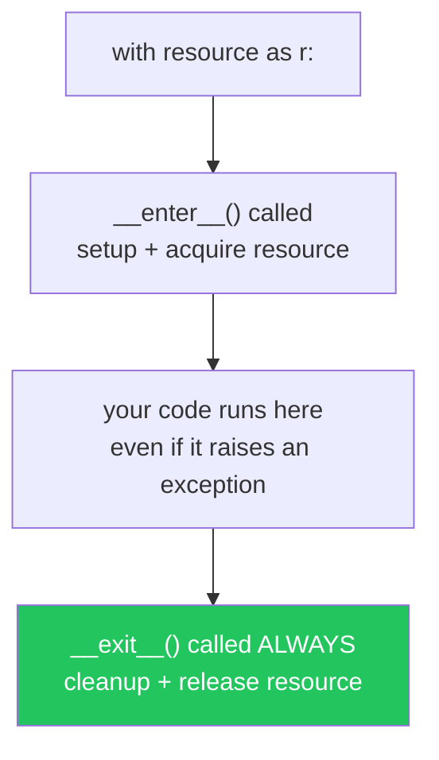
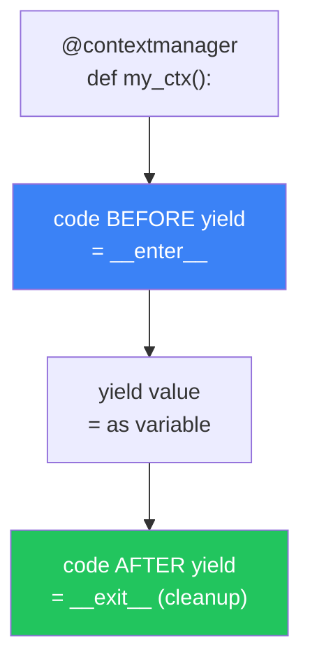
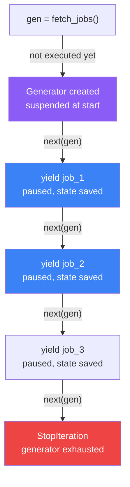
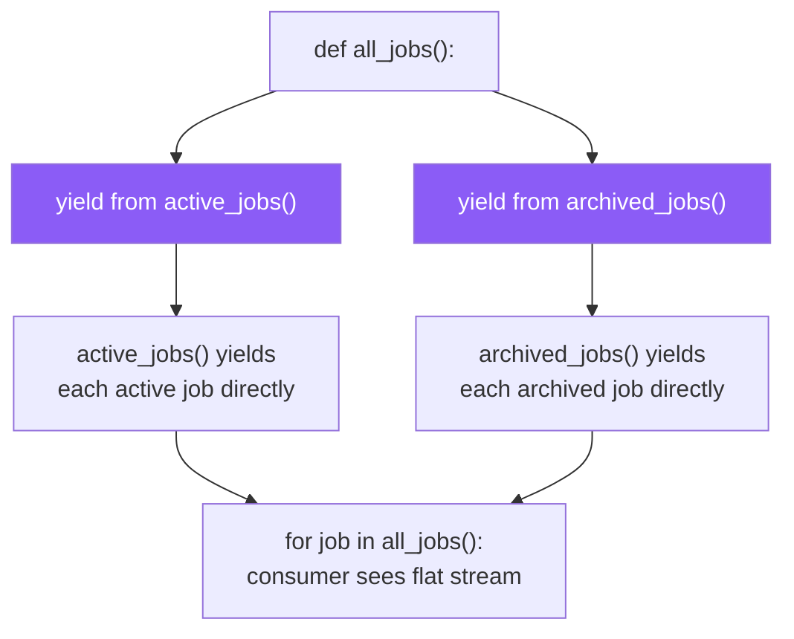
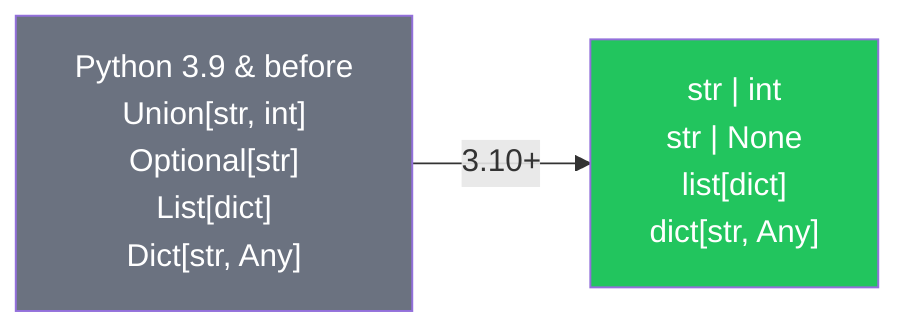
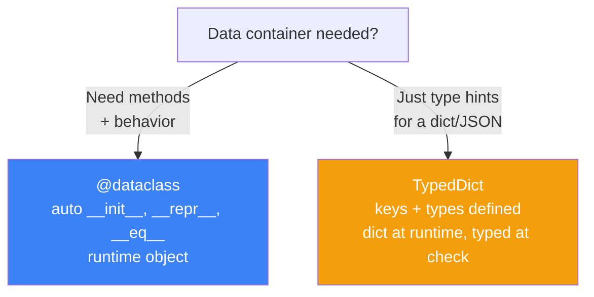

# الفصل الخامس — Context Managers، Generators، والـ Type Hints الحديثة

> **المتطلبات:** [[04-Python-Decorators]] — لازم تكون فاهم الـ closures والـ decorators كويس. الـ Context Manager والـ Generator هما امتداد طبيعي لنفس فكرة "كود بيتنفذ حوالين كود تاني" — بس كل واحد بطريقة مختلفة ولمشكلة مختلفة. الفصل ده بيختم Phase 1 ويجهّزك لـ Django.

---

## البداية — مشكلتين بتقابلهم كل يوم

المشكلة الأولى: كل ما بتفتح ملف أو database connection، لازم تتذكر تقفله. لو نسيت — الـ resource بتفضل مفتوحة وبتسرّب memory أو connections. وحشة أكتر: لو حصل exception في النص، الـ close() مش بيتننفذ والـ resource بيضيع.

المشكلة التانية: لو عندك مليون row في الـ database وعايز تعالجهم، مش ممكن تحملهم كلهم في الـ RAM في نفس الوقت. محتاج طريقة تعالج element بـ element من غير ما الـ memory ينفجر.

الـ Context Manager بيسأل المشكلة الأولى: "إزاي أضمن إن الـ cleanup بيحصل دايماً حتى لو حصل error؟" والـ Generator بيسأل التانية: "إزاي أتعامل مع بيانات ضخمة من غير ما أشيلها كلها في الذاكرة؟"

---

## [[01-With-Statement-Internals]] — الـ `with` مش سحر — هو عقد بينك وبين Python

### 🧠 الشرح النظري

كل ما بتكتب `with open("file.txt") as f:`، Python بتعمل حاجة دقيقة جداً: بتنادي `__enter__` على الكائن، وبعد ما الكود جوّا الـ `with` يخلص — سواج بنجاح أو exception — بتنادي `__exit__`. العقد واضح: أنا بفتح، أنا بقمّع، ومش مهم إيه اللي يحصل في النص.

ده معناه إنك مش محتاج `try/finally` بعد كده. الـ `__exit__` بيتنفذ **دايماً** — حتى لو الكود عمل `return`، حتى لو حصل `Exception`، حتى لو عملت `sys.exit()`. ده ضمان أقوى من أي `finally` تكتبه بإيدك، لأن الـ guarantee مبني في الـ language نفسها مش في كودك.

في Django، الـ `atomic()` transaction بيشغل نفس المنطق: `with atomic():` بيبدأ transaction في الـ `__enter__`، ولو كل حاجة تمام بيعمل commit في الـ `__exit__`، ولو حصل error بيعمل rollback تلقائياً. فاهم الـ context manager = فاهم إزاي Django بتحمّل بياناتك.

### 📊 Visualization



### 💻 Micro-Example

```python
class DatabaseConnection:
    def __enter__(self):                # called at 'with' entry
        self.conn = connect("db://hirelink")
        return self.conn                # 'as' variable gets this

    def __exit__(self, exc_type, exc_val, exc_tb):  # called on exit ALWAYS
        self.conn.close()               # guaranteed cleanup
        return False                    # False = don't suppress exceptions

with DatabaseConnection() as db:
    db.execute("SELECT * FROM jobs")    # if this crashes, close() still runs
```

---

## [[02-Contextlib]] — الـ Shortcut: Context Manager من غير Class

### 🧠 الشرح النظري

بناء class كامل بـ `__enter__` و `__exit__` ممكن يكون verbose لو كل اللي محتاجه عملية بسيطة: افتح حاجة، نفذ كود، اقفل. Python عارفة كده وعملت `contextlib.contextmanager` — decorator بيوفر عليك الـ class بالكامل.

الـ trick بسيطة: بتعمل generator بـ `yield` — كل حاجة قبل الـ `yield` هي الـ `__enter__`، وكل حاجة بعد الـ `yield` هي الـ `__exit__`. الـ `yield` نفسها بتبقى القيمة اللي بتروح للـ `as` variable. الـ decorator بيحوّل الـ generator ده لـ context manager حقيقي لوحده.

لو حصل exception في الكود جوّا الـ `with`، الـ decorator بيشتغل إن الـ exception بيترمى تاني جوّا الـ generator عند الـ `yield` — عشان الكود بعد الـ `yield` يقدر يتعامل معاه أو يعمل cleanup وبعدين يسمح للـ exception بتكمل طريقها. ده أقصر طريقة لكتابة context manager — ومش محتاج تفكر في `__exit__` arguments.

### 📊 Visualization



### 💻 Micro-Example

```python
from contextlib import contextmanager

@contextmanager                          # turns generator into context manager
def timed_operation(label):
    import time
    start = time.perf_counter()         # __enter__: setup
    yield label                          # 'as' variable gets 'label'
    elapsed = time.perf_counter() - start  # __exit__: cleanup
    print(f"{label} took {elapsed:.4f}s")

with timed_operation("DB query") as op:
    print(f"Running {op}...")            # Running DB query...
                                         # DB query took 0.0012s
```

---

## [[03-Generators-And-Yield]] — الـ Lazy Evaluation: كود بيشتغل لما تطلب منه بس

### 🧠 الشرح النظري

الـ function العادية بتعمل حاجة واحدة: تشتغل وترجع قيمة. الـ generator function مختلفة — بتشتي شوية، وبعدين تقف. وتشتي شوية تانية. وتقف تاني. كل مرة بتعمل `yield`، بترجع قيمة بس **مش بتخلص** — بتتحفظ حالتها زي ما هي وتستنى لما حد يطلب القيمة الجاية.

ده معناه إن الـ generator مش بيحمل كل النتايج في الـ memory — بيولّد قيمة واحدة في كل مرة. لو عندك مليون job في الـ database وعملت generator يعالجهم، الـ RAM مش هيشيل مليون — هيشيل element واحد بس في كل لحظة.

الـ mechanism: لما بتعمل `yield`، Python بتحفظ الـ stack frame كامل — المتغيرات المحلية، الـ position في الكود، كل حاجة — في object اسمه **generator frame**. لما حد يطلب `next()`، Python بتستعيد الـ frame من غير ما تبدأ من أول وجديد وتكمل من المكان اللي وقفت عنده. ده بيختلف عن الـ `return` اللي بيمسح كل حاجة وبيبدأ من الصفر كل مرة.

في Django context، الـ QuerySet بيشبه الـ generator جداً — lazy evaluation حتى تستهلكه فعلاً. وفي DRF، لو بتبني streaming response لبيانات ضخمة، الـ generator هو الحل الوحيد اللي مش هيكسّر السيرفر.

### 📊 Visualization



### 💻 Micro-Example

```python
def fetch_jobs_paginated(batch_size=100):
    offset = 0
    while True:                              # infinite pagination loop
        batch = Job.objects.all()[offset:offset + batch_size]  # one page
        if not batch:
            break                            # no more results — stop
        yield from batch                     # yield each item one by one
        offset += batch_size

for job in fetch_jobs_paginated():           # one job in memory at a time
    process(job)                             # process without RAM explosion
```

---

## [[04-Yield-From]] — الـ Generator Delegation: generator بينادي generator

### 🧠 الشرح النظري

لما بتكون في generator وعايز تنادي generator تاني جوّاه، ممكن تعمل `for item in other_gen: yield item`. بس Python عملت syntax مخصصة أوضح وأسرع: `yield from`. الكلمة دي بتقول "مش أنا اللي ب yields الـ values — أنا بفوّض الـ generator التاني ي yields مباشرةً."

الـ `yield from` مش بس syntax sugar — هو بيحل مشكلتين. الأولى: الـ exception handling — لو الـ consumer رمى exception في الـ sub-generator، الـ `yield from` بيوصّله صح. التانية: الـ return value — الـ sub-generator ممكن يعمل `return value` وده بيرجع للـ outer generator كـ نتيجة الـ `yield from` expression بالكامل.

في الـ real-world، الـ `yield from` بيستخدم كتير في الـ data pipelines: generator بيقرأ من ملف، generator تاني يفلتر، تالت يحوّل — وكل واحد بيتسلسل بـ `yield from`. وفي Django، لما تبني management command بتعالج بيانات ضخمة على مراحل، الـ `yield from` بيخلي الكود readable ومقسّم لطبقات.

### 📊 Visualization



### 💻 Micro-Example

```python
def active_jobs():
    yield {"title": "Backend Dev", "status": "active"}
    yield {"title": "Frontend Dev", "status": "active"}

def archived_jobs():
    yield {"title": "Old Project", "status": "archived"}
    yield {"title": "Legacy App", "status": "archived"}

def all_jobs():
    yield from active_jobs()              # delegate to active_jobs
    yield from archived_jobs()            # delegate to archived_jobs

for job in all_jobs():                    # flat iteration, no nesting
    print(job["title"])                   # Backend Dev, Frontend Dev, Old Project, Legacy App
```

---

## [[05-Modern-Type-Hints]] — الـ Type Hints في Python 3.10+: شكل جديد أوضح

### 🧠 الشرح النظري

الـ Type Hints مش بتغير طريقة تشغيل الكود — Python مش بتتحقق منها وقت الـ runtime. بس بتغير طريقة قراءة الكود وفهمه — وده أهم بكتير في الـ production.

قبل Python 3.10، كنت تكتب `Union[str, int]` و `Optional[str]` و `List[dict]`. في 3.10+، الـ syntax اتغيرت لشكل أوضح وأقصر: `str | int` بدل `Union`، `str | None` بدل `Optional`، `list[dict]` بدل `List[dict]` من غير ما تستورد حاجة من `typing`. ده مش بس أجمل — ده أسرع في الكتابة وأسهل في القراءة.

الـ function annotations بتعمل اتنين: بتخلي أي IDE يقدر يكتشف bugs قبل ما الكود يشتغل، وبترسم "عقد" واضح بين الـ caller والـ function — "أنا بستقبل int وأنا بارجع list[str]، لو بعتلي حاجة تانية ده غلط." في الـ codebase كبير زيه في Django project، ده بيفرق بكتير — محدش بيقعد يقرأ كل function عشان يعرف إيه الـ return type.

### 📊 Visualization



### 💻 Micro-Example

```python
# Python 3.10+ modern syntax — no imports from 'typing' needed
def search_jobs(query: str, budget_min: int | None = None) -> list[dict]:
    jobs = Job.objects.filter(title__icontains=query)
    if budget_min is not None:
        jobs = jobs.filter(budget__gte=budget_min)
    return list(jobs.values())

# callable type hint — function as parameter
from collections.abc import Callable

def apply_filter(jobs: list[dict], predicate: Callable[[dict], bool]) -> list[dict]:
    return [j for j in jobs if predicate(j)]
```

---

## [[06-TypedDict-And-Dataclasses]] — بدائل الـ Class البسيطة: بيانات من غير boilerplate

### 🧠 الشرح النظري

كتير من الـ classes في Python مش فيها logic — بس بتخزن بيانات. الكلاسيك class بيتطلب `__init__` و`__repr__` و`__eq__` — يعني كتير boilerplate عشان حاجة بسيطة. Python عملت اتنين حلول: `dataclasses` للـ runtime و `TypedDict` للـ type checking.

**`@dataclass`** — decorator بيكتبلك `__init__` و`__repr__` و`__eq__` تلقائياً بناءً على الـ type annotations. محتاج تعرف fields وأنواعها بس — والباقي على Python. كمان بيدعم `frozen=True` عشان تعمل immutable objects، و`__post_init__` عشان validation بعد الـ initialization. في Django context، الـ dataclasses ممتازة لـ DTOs (Data Transfer Objects) — يعني objects بتنتقل بين طبقات التطبيق من غير ما تكون Django models.

**`TypedDict`** — مش بتعمل class حقيقي. هو بس type hint لـ dict بيحدد إيه الـ keys المتوقعة وأنواعها. مفيد جداً لما بتتعامل مع JSON APIs — لأن الـ JSON أصلاً dict مش class. الـ TypedDict بيخلي الـ IDE يعرف إيه الـ keys الموجودة وينبهك لو كتبت key غلط.

القاعدة: `dataclass` لما محتاج behavior (methods) مع البيانات. `TypedDict` لما بتعمل type hints لـ JSON structures أو API responses مش هتبني ليها class.

### 📊 Visualization



### 💻 Micro-Example

```python
from dataclasses import dataclass

@dataclass                              # auto-generates __init__, __repr__, __eq__
class JobDTO:
    title: str
    budget: float
    is_remote: bool = False            # default value

job = JobDTO("Backend Dev", 5000.0)   # __init__ auto-generated
print(job)                              # JobDTO(title='Backend Dev', budget=5000.0, is_remote=False)

from typing import TypedDict

class JobResponse(TypedDict):          # just a type hint for a dict — no class at runtime
    title: str
    budget: float

response: JobResponse = {"title": "Design", "budget": 3000.0}  # IDE knows the keys
```

---

## 🎯 أسئلة الإنترفيو

**س: إيه هو الـ Context Manager وإزاي بيضمن إن الـ cleanup بيحصل دايماً؟**

> الـ Context Manager هو object بيطبّق بروتوكول `__enter__` و `__exit__` — الـ `with` statement بيستخدمه عشان يضمن إن الـ resource بتتقفل دايماً.<br/><br/>
> **`__enter__`** بيشتغل أول ما تدخل الـ `with` block — بيعمل setup ويرجع الـ resource.<br/>
> **`__exit__`** بيشتغل **دايماً** في الآخر — حتى لو حصل exception أو `return` أو `break`. الـ guarantee مبني في الـ language نفسها.<br/><br/>
> **في Django:** `with atomic():` هو context manager — بيبدأ transaction في `__enter__` وبيعمل commit أو rollback في `__exit__`. نفس المنطق بالظبط.

---

**س: إيه الفرق بين `yield` و `return` في function؟ وليه الـ generator مفيد في الـ APIs؟**

> **`return`** — بيتنفذ مرة واحدة، بيرجع قيمة، وبيقفل الـ function بالكامل. الـ stack frame بيتمسح وكل حاجة بتضيع.<br/><br/>
> **`yield`** — بيرجع قيمة بس **بيقف الـ function مؤقتاً** ويحفظ حالتها الكاملة (variables, position, stack frame). لما حد يطلب `next()`، الكود بيكمل من المكان اللي وقف عنده مش من أول وجديد.<br/><br/>
> **فائدة في APIs:** لو عندك endpoint بيعمل response لبيانات ضخمة (مثلاً export مليون record)، الـ generator بيولّد row بـ row من غير ما يشيلهم كلهم في الـ RAM. في DRF، الـ `StreamingHttpResponse` بياخد generator مباشرةً.

---

**س: إزاي تبنى context manager من غير class؟ وإيه دور `contextlib.contextmanager`؟**

> الـ `@contextmanager` decorator بيحوّل generator لـ context manager — محتاج `yield` واحدة بس.<br/><br/>
> **كل حاجة قبل الـ `yield`** = `__enter__` (setup + acquire resource).<br/>
> **القيمة اللي الـ `yield` بيرجعها** = القيمة اللي بتروح لـ `as` variable.<br/>
> **كل حاجة بعد الـ `yield`** = `__exit__` (cleanup + release).<br/><br/>
> **ميزته:** أقصر وأوضح من class بـ `__enter__` و `__exit__`. **عيب:** مش مناسب لو السلوك معقد أو محتاج state بين الـ calls — وقتها class أوضح.

---

**س: إيه هو `yield from` وإيه المشكلة اللي بيحلها؟**

> الـ `yield from` بيخلي generator يفوّض sub-generator ي yields القيم مباشرةً للـ consumer — من غير ما الـ outer generator يعمل loop و yield كل element لوحده.<br/><br/>
> **بدون `yield from`:** `for item in sub_gen: yield item` — loop يدوي وبطيء.<br/>
> **بـ `yield from`:** `yield from sub_gen` — delegation مباشر وأسرع.<br/><br/>
> **مشكلتين بيحلهم:** الـ exception handling (لو consumer رمى exception، بيوصل للـ sub-generator صح) والـ return value (الـ sub-generator ممكن يعمل `return` والقيمة بترجع كـ نتيجة الـ `yield from` expression).

---

**س: إيه الفرق بين `@dataclass` و `TypedDict` وامتى تستخدم كل واحد؟**

> **`@dataclass`** — بيعمل class حقيقي في الـ runtime مع `__init__`, `__repr__`, `__eq__` تلقائيين. مناسبة لما محتاج **behavior** (methods) مع البيانات، أو objects هتتعامل معاها كـ instances حقيقية.<br/><br/>
> **`TypedDict`** — مجرد type hint لـ dict عادي. مش بيعمل class في الـ runtime — الـ object فضل dict. مناسبة لما بتعمل type checking لـ **JSON structures أو API responses** ومش محتاج تبني class كامل ليها.<br/><br/>
> **القاعدة:** لو هتضيف methods أو logic → `@dataclass`. لو بس بتحدد شكل dict/JSON → `TypedDict`. في Django، `dataclass` ممتازة لـ DTOs، و `TypedDict` ممتازة لـ serializer output typing.

---

## 📝 خلاصة الدرس

- **Context Manager (`with`):** عقد بينك وبين Python — `__enter__` للـ setup، `__exit__` للـ cleanup **دايماً**. حتى لو حصل exception، الـ cleanup بيحصل. في Django، `atomic()` transaction بنفس المنطق.
- **`contextlib.contextmanager`:** shortcut لبناء context manager بـ generator — قبل `yield` = setup، بعد `yield` = cleanup. أقصر من class بس مش مناسب للـ complex state.
- **Generators (`yield`):** function بتقف مؤقتاً وتحفظ حالتها. بتعالج element واحد في الـ RAM في كل لحظة. مثالي للـ large datasets والـ streaming responses في DRF.
- **`yield from`:** delegation — generator يفوّض generator تاني ي yields مباشرةً. أوضح وأسرع من الـ manual loop. بيحل الـ exception handling والـ return value للـ sub-generators.
- **Type Hints الحديثة (3.10+):** `str | int` بدل `Union`، `str | None` بدل `Optional`، `list[dict]` بدل `List[dict]`. مش بتغيّر الـ runtime — بتغيّر قراءة الكود واكتشاف الأخطاء قبل التشغيل.
- **`@dataclass`:** class ببيانات و methods تلقائية — مناسبة لـ DTOs والـ objects اللي محتاجة behavior.
- **`TypedDict`:** type hint لـ dict مش أكتر — مناسبة لـ JSON/API response shapes من غير class overhead.

---

*Next → [[06-Django-MVT-Architecture]] — كده خلّصنا Phase 1. الأساس البايثوني بقى متين. دلوقتي ندخل في Django نفسه — إزاي الـ framework بيستقبل request، بيعالجها، وبيرجع response. MVT, ORM, Middleware, Signals — كل حاجة من الداخل.*