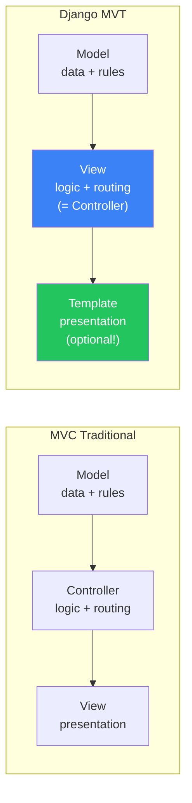
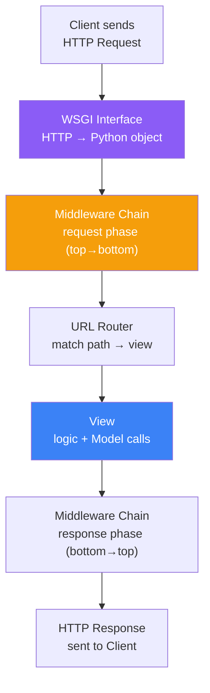
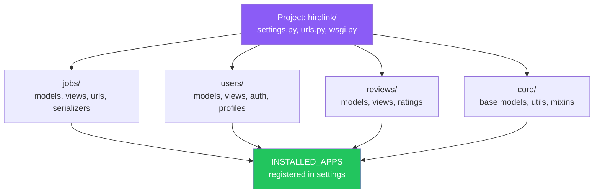
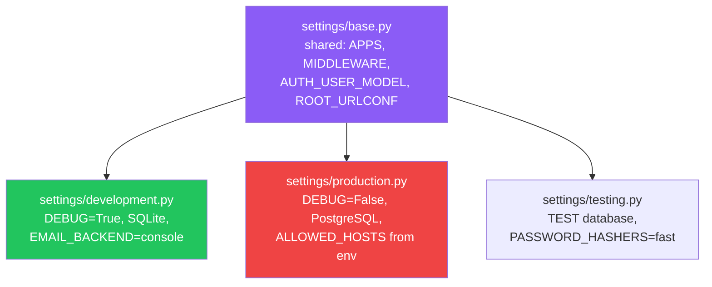
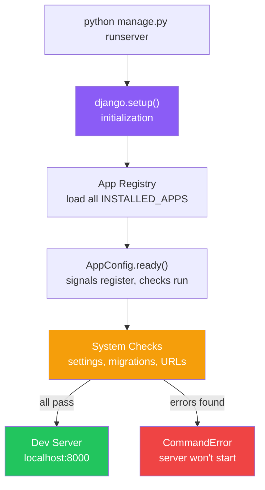
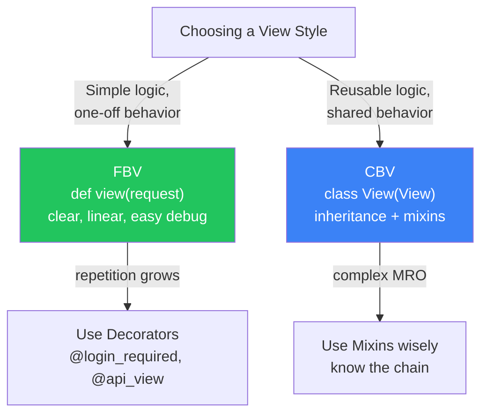

# الفصل السادس — MVT: الخريطة الكاملة لـ Django من أول request لآخر response

> **المتطلبات:** [[05-Python-Advanced-Patterns]] — لازم تكون فاهم الـ decorators والـ context managers. Django مبني عليهم: الـ middleware سلسلة decorators، والـ `atomic()` context manager بيحمّل transactions. كمان الـ type hints هتساعدك تفهم الـ Django stubs.

---

## البداية — Django مش مجرد framework، ده نظام متكامل

تخيّل معايا إنك بتبني HireLink API من الصفر من غير أي framework. هتحتاج: HTTP parser، URL router، request/response handler، database connector، migration system، authentication، admin panel، security headers... ممكن تقضي شهرين قبل ما تكتب أول endpoint حقيقي.

Django بتعملك كل ده — بس مش بس ديلّك الكود الجاهز. بتعملك **architecture كاملة** بتحدد إزاي الكود بيتنظم وإزاي البيانات بتتحرك من الـ HTTP request للـ response. الفصل ده هيفسرلك الـ architecture دي من الداخل — مش إزاي تستخدمها بس، إزاي **تفهمها** عشان لما تحصل مشكلة تعرف تدور فين.

---

## [[01-MVT-vs-MVC]] — الـ MVT مش MVC مع تغيير أسماء — فيه فرق جوهري

### 🧠 الشرح النظري

الناس بتقول "Django هو MVC بس الـ Controller اسمه View." ده تقريباً صح بس مش بالظبط. الـ MVC التقليدي (Model-View-Controller) بيقسم المسؤوليات كده: الـ Model بيشيل البيانات، الـ View بيشيل الـ presentation، والـ Controller بيشيل الـ logic والـ routing.

في Django، الـ **Model** هو نفسه — بيشيل البيانات والـ business rules. بس الـ **View** في Django هو الـ Controller بالمعنى التقليدي — هو اللي بيستقبل الـ request، بيقرر إيه اللي يحصل، وبيرجع response. والـ **Template** هو الـ View التقليدي — بيشيل الـ presentation logic.

الفرق الجوهري: في MVC التقليدي، الـ Controller بيتحكم في الـ View مباشرةً. في Django، الـ View بيرجع response — وممكن يكون الـ response ده فيه template وممكن يكون JSON API من غير template أصلاً. الـ Template مش إجباري — ده خييار. وده اللي بيخلي Django يقدر يبني APIs وصفحات HTML بنفس الـ architecture.

### 📊 Visualization



### 💻 Micro-Example

```python
# Django View = Controller in MVC — it handles logic and routing
def job_list(request):                   # receives HTTP request
    jobs = Job.objects.filter(is_active=True)  # asks Model for data
    return render(request, "jobs/list.html", {"jobs": jobs})  # returns Response

# But View can also return JSON — Template is optional
def job_api(request):
    jobs = Job.objects.filter(is_active=True)
    return JsonResponse(list(jobs.values()), safe=False)  # no template at all
```

---

## [[02-Request-Lifecycle]] — رحلة الـ HTTP Request الكاملة: من WSGI للـ Response

### 🧠 الشرح النظري

أي request بتوصل لـ Django بتعمل رحلة طويلة ومحددة — وكل محطة في الرحلة ليها دور وبتأثر على اللي بعدها.

الرحلة تبدأ لما الـ web server (gunicorn أو uWSGI) يستقبل الـ HTTP request ويحوّله لـ Python object ويبعتله لـ Django عبر الـ **WSGI interface**. الـ WSGI هو العقد بين الـ web server والـ Django application — بيقول "أنا ببعتلك request كـ dict، وأنت بترجعلي response كـ callable."

بعدين الـ request بيمر على كل الـ **Middleware** بالترتيب — كل واحد بيقدر يعدّل الـ request أو يوقفها بالكامل. بعدها الـ **URL Router** بيمسك الـ request ويطابق الـ path مع الـ patterns في `urls.py` — وأول match بيوصل لـ **View** محددة.

الـ View بيشتغل: يسال الـ **Model** لو محتاج بيانات، يعمل logic، ويرجع **Response**. الـ Response بيمر على الـ Middleware بالعكس (من آخر واحد لأول واحد) وبعدين يترسل للـ client.

ده مهم عشان تفهم: لو حصل error في أي محطة، الـ request بيقف ومش بيكمّل. ولو middleware وقّف الـ request، الـ view مش بيتننفذ أصلاً. وده بيخلي الـ middleware layer حرج جداً — اللي هنتعلمه في فصل متخصص.

### 📊 Visualization



### 💻 Micro-Example

```python
# urls.py — the URL Router matches path to view
urlpatterns = [
    path("api/jobs/", job_list, name="job-list"),         # exact match
    path("api/jobs/<int:pk>/", job_detail, name="job-detail"),  # path parameter
]

# views.py — the View processes the request
def job_list(request):
    jobs = Job.objects.filter(is_active=True)     # Model layer
    return JsonResponse({"jobs": list(jobs.values())})  # Response

def job_detail(request, pk):
    job = get_object_or_404(Job, pk=pk)           # Model + 404 handling
    return JsonResponse({"title": job.title, "budget": job.budget})
```

---

## [[03-Project-vs-App]] — إيه الفرق وليه Django مقسومة كده؟

### 🧠 الشرح النظري

لما بتشغل `django-admin startproject hirelink` وبعدين `python manage.py startapp jobs` — بتلاحظ إن Django بتعمل اتنين: project و app. مش دول نفس الحاجة؟ لأ — وفيه فرق مهم.

الـ **Project** هو الحاوية الكبيرة — فيه الـ settings، الـ root URL configuration، والـ WSGI entry point. هو الـ container اللي بيشمل كل حاجة. بس هو مش فيه أي logic — هو بس بيعرف Django إزاي تشتغل وبنقطة الدخول فين.

الـ **App** هو وحدة功能 مستقلة — بتعمل حاجة واحدة بس وبتعملها كويس. الـ jobs app بيشيل كل حاجة متعلقة بالـ jobs: models, views, urls, serializers. الـ users app بيشيل الـ authentication. الـ reviews app بيشيل الـ reviews. كل app ممكن يتفصل ويتستخدم في project تاني.

القاعدة الذهبية: **app واحد = مسؤولية واحدة.** لو app بيشيل أكتر من حاجة جوّاه — قسمه. وده مش تنظيم بس — ده بيأثر على الـ migrations، الـ testing، والـ team collaboration. كل team تشتغل على app منعزل عن التاني.

### 📊 Visualization



### 💻 Micro-Example

```python
# hirelink/settings.py — apps register themselves here
INSTALLED_APPS = [
    "django.contrib.admin",
    "django.contrib.auth",
    # ... built-in apps
    "jobs.apps.JobsConfig",       # our custom app
    "users.apps.UsersConfig",     # our custom app
    "reviews.apps.ReviewsConfig", # our custom app
    "core.apps.CoreConfig",       # shared utilities
]

# Each app has its own models.py — completely independent
# jobs/models.py
class Job(models.Model):
    title = models.CharField(max_length=200)
    budget = models.DecimalField(max_digits=10, decimal_places=2)

# users/models.py
class UserProfile(models.Model):
    user = models.OneToOneField(User, on_delete=models.CASCADE)
    bio = models.TextField(blank=True)
```

---

## [[04-Settings-Best-Practices]] — الـ settings.py الحديثة: مش ملف واحد شائل كل حاجة

### 🧠 الشرح النظري

الـ `settings.py` اللي Django بتولّده تلقائي هو ملف واحد كبير — بس ده مش اللي بتستخدمه في الـ production. في الـ real-world، عندك بيئات مختلفة: development على جهازك، testing في CI، production على السيرفر. كل بيئة محتاجة settings مختلفة: database مختلفة، debug different، secret keys مختلفة.

الـ best practice الحديثة: قسّم الـ settings لـ 3 ملفات. `base.py` فيه كل الحاجة المشتركة (INSTALLED_APPS, MIDDLEWARE, AUTH_USER_MODEL). `development.py` بيورّث من base وبيفضل الـ DEBUG ويشغل SQLite. `production.py` بيورّث من base وبيسكّت الـ DEBUG ويشغل PostgreSQL والأمان الكامل.

كمان لازم **مفيش secrets في الكود أصلاً.** الـ SECRET_KEY والـ DB password وكل حاجة حساسة لازم تيجي من environment variables — مش متكوبة hard-coded في الـ settings. استخدم `python-decouple` أو `environ` عشان تقرأ من `.env` file في development ومن الـ environment في production.

### 📊 Visualization



### 💻 Micro-Example

```python
# settings/base.py — shared configuration
from decouple import config                       # reads from .env or environment
AUTH_USER_MODEL = "users.UserProfile"             # custom user from day one

# settings/development.py — extends base
from .base import *                               # inherit everything
DEBUG = True
DATABASES = {"default": {"ENGINE": "django.db.backends.sqlite3", "NAME": "db.sqlite3"}}

# settings/production.py — extends base
from .base import *
DEBUG = False
SECRET_KEY = config("SECRET_KEY")                 # from environment, never hardcoded
DATABASES = {"default": config("DATABASE_URL", cast=db_url)}  # PostgreSQL from env
```

---

## [[05-Manage-py-Internals]] — إيه اللي بيحصل لما بتكتب `python manage.py runserver`

### 🧠 الشرح النظري

لما بتكتب `python manage.py runserver`، حاجات كتير بتحصل قبل ما السيرفر يشتغل — ومعظم الناس مش عارفة إيه.

أول حاجة: `manage.py` بيستدعي `django.setup()` — وده هو الـ initialization الكاملة لـ Django. الخطوة دي بتعمل اتنين مهمين: بتحمّل الـ `INSTALLED_APPS` بالترتيب، وبتعمل `AppConfig.ready()` لكل app. ده معناه إن أي code في الـ `ready()` methods بيتنفذ في اللحظة دي — Signals بتتسجل، checks بتشتغل، وinitialization بيحصل.

تانى حاجة: بتبني الـ **app registry** — يعني بتعمل map كاملة لكل models المسجلة وعلاقاتهم. وده مهم جداً عشان الـ migrations والـ ORM يعرفوا يشتغلوا. لو model مش مسجل في الـ registry، Django مش هتعرف تعمل migration ليه.

تالت حاجة: بتشغل الـ **system checks** — Django بتتأكد إن الـ settings صح، الـ migrations متطابقة، والـ URLs مفيهاش أخطاء. لو فيه مشكلة، بتطلع warning أو error قبل ما السيرفر يشتغل.

رابع حاجة: أخيراً، بيشغل الـ development server — اللي هو بـ CPython مكتوب وخفيف ومصمم للـ development بس. في production، بتحط gunicorn أو uWSGI قدام الـ WSGI application.

### 📊 Visualization



### 💻 Micro-Example

```python
# manage.py — the entry point (auto-generated, rarely edited)
def main():
    os.environ.setdefault("DJANGO_SETTINGS_MODULE", "hirelink.settings.development")
    try:
        from django.core.management import execute_from_command_line
    except ImportError as exc:
        raise ImportError("Couldn't import Django.") from exc
    execute_from_command_line(sys.argv)

# apps.py — AppConfig.ready() runs during django.setup()
class JobsConfig(AppConfig):
    default_auto_field = "django.db.models.BigAutoField"
    name = "jobs"

    def ready(self):
        import jobs.signals          # register signals when app is ready
```

---

## [[06-FBV-vs-CBV]] — Function-Based Views vs Class-Based Views: المقارنة الكاملة

### 🧠 الشرح النظري

في Django، عندك طريقتين تكتب الـ views: function أو class. الاتنين بيوصلوا لنفس النتيجة — بس أسلوبهم مختلف وكل واحد أحسن في حالات معينة.

**Function-Based Views (FBVs):** function عادية بتاخد `request` وترجع `Response`. بسيطة، أوضح، أسهل في الـ debugging — بتشوف الكود يتنفذ من أول سطر لآخر سطر. عيبها: لو عندك logic متكرر بين views (زي auth check أو pagination)، لازم تكتبه في كل function أو تعمله decorator/mixin.

**Class-Based Views (CBVs):** class بترث من Django's generic views. بتعمل override لـ methods معينة (زي `get`, `post`, `get_queryset`). ميزتها: الـ inheritance بيسمحلك تعيد استخدام logic بسهولة — mixins بتمسك سلوك معين وتخلّيه يتستخدم في أكتر من view. عيبها: الـ MRO (Method Resolution Order) بيعمل chain طويل وصعب تتبعه — لو حصل bug، مش بتعرف بسرعة إيه الـ method اللي اتنفذت.

**القاعدة العملية:** لو الـ view بسيطة (عرض بيانات أو form بسيط) — FBV أوضح وأسرع. لو الـ view معقدة ومحتاج reuse logic بين views كتير — CBV أنضف. في DRF، الـ ViewSets هتبقى CBV بالتبعية — فلازم تفهم الـ CBV كويس عشان تبني ViewSets بعدين.

### 📊 Visualization



### 💻 Micro-Example

```python
# FBV — simple, linear, obvious
def job_detail(request, pk):
    job = get_object_or_404(Job, pk=pk)
    if request.method == "POST":
        form = JobForm(request.POST, instance=job)
        if form.is_valid():
            form.save()
            return redirect("job-detail", pk=job.pk)
    else:
        form = JobForm(instance=job)
    return render(request, "jobs/detail.html", {"job": job, "form": form})

# CBV — same logic but with inheritance and method separation
class JobDetailView(DetailView):
    model = Job
    template_name = "jobs/detail.html"

    def get_context_data(self, **kwargs):        # add extra context
        ctx = super().get_context_data(**kwargs)
        ctx["form"] = JobForm(instance=self.object)
        return ctx

    def post(self, request, *args, **kwargs):    # handle POST separately
        self.object = self.get_object()
        form = JobForm(request.POST, instance=self.object)
        if form.is_valid():
            form.save()
            return redirect("job-detail", pk=self.object.pk)
        return self.render_to_response(self.get_context_data(form=form))
```

---

## 🎯 أسئلة الإنترفيو

**س: إيه الفرق بين MVT في Django و MVC التقليدي؟**

> **MVC التقليدي:** Model (بيانات) → Controller (logic + routing) → View (presentation). الـ Controller بيتحكم في الـ View مباشرةً.<br/><br/>
> **Django MVT:** Model (بيانات) → View (logic + routing = الـ Controller بتاع MVC) → Template (presentation = الـ View بتاع MVC).<br/><br/>
> **الفرق الجوهري:** الـ Template في Django مش إجباري — الـ View ممكن يرجع JSON API من غير template أصلاً. ده اللي بيخلي Django يقدر يبني APIs وصفحات HTML بنفس الـ architecture. كمان Django نفسه هو الـ "Controller" الكبير — الـ URL dispatcher والـ middleware بيتحكموا في الـ flow.

---

**س: إيه رحلة الـ HTTP request في Django من أول ما توصل لحد ما ترجع response؟**

> **1.** الـ web server (gunicorn) بيستقبل الـ HTTP request وبيرسلها لـ Django عبر الـ **WSGI interface**.<br/>
> **2.** الـ request بيمر على كل الـ **Middleware** بالترتيب — كل واحد يقدر يعدّل أو يوقف.<br/>
> **3.** الـ **URL Router** بيطابق الـ path مع `urls.py` وبيوصل لـ **View** محددة.<br/>
> **4.** الـ **View** بيشتغل: يسأل الـ Model، يعمل logic، ويرجع **Response**.<br/>
> **5.** الـ Response بيمر على الـ Middleware **بالعكس** (LIFO) وبعدين يترسل للـ client.<br/><br/>
> **نقطة مهمة:** لو middleware وقّف الـ request، الـ view مش بيتنفذ أصلاً.

---

**س: إيه الفرق بين Django project و Django app؟ وليه Django مقسومة كده؟**

> **Project** = الحاوية الكبيرة: settings، root URLs، WSGI entry point. مش فيه logic — فيه بس إزاي Django تشتغل.<br/><br/>
> **App** = وحدة وظيفية مستقلة: models, views, urls, serializers لحاجة واحدة بس. ممكن يتفصل ويتستخدم في project تاني.<br/><br/>
> **القاعدة:** app واحد = مسؤولية واحدة. لو app بيشيل أكتر من حاجة — قسمه. ده بيأثر على الـ migrations، الـ testing، والـ team collaboration. كل app مستقل وممكن يتيست لوحده.

---

**س: إيه الـ best practices للـ settings.py في الـ production؟**

> **1.** قسّم الـ settings لـ ملفات: `base.py` (مشترك)، `development.py`، `production.py`، `testing.py` — كل واحد بيورّث من base.<br/>
> **2.** مفيش **secrets في الكود** — الـ SECRET_KEY وDB password ييجوا من environment variables عبر `python-decouple` أو `environ`.<br/>
> **3.** `DEBUG = False` في production دايماً — ده بيمنع leak بتاع الـ sensitive information في الـ error pages.<br/>
> **4.** `ALLOWED_HOSTS` محدد بالـ domains الحقيقية — مش `*`.<br/>
> **5.** الـ DJANGO_SETTINGS_MODULE environment variable بيحدد إيه ملف الـ settings اللي يشتغل.

---

**س: إيه اللي بيحصل لما بتشغل `python manage.py runserver`؟**

> **1.** `django.setup()` بيتننفذ — وده الـ initialization الكاملة.<br/>
> **2.** الـ **INSTALLED_APPS** بتتحمّل بالترتيب وكل `AppConfig.ready()` بيتنفذ — Signals بتتسجل، checks بتشتغل.<br/>
> **3.** الـ **app registry** بيتبنى — map كاملة لكل models المسجلة وعلاقاتهم.<br/>
> **4.** الـ **system checks** بتشتغل — بتتأكد إن الـ settings صح، migrations متطابقة، URLs سليمة.<br/>
> **5.** أخيراً الـ development server بيشتغل على `localhost:8000` — وده للـ development فقط، مش production.

---

## 📝 خلاصة الدرس

- **MVT vs MVC:** الـ View في Django = الـ Controller في MVC. الـ Template = الـ View في MVC. الفرق الجوهري: الـ Template مش إجباري — View ممكن يرجع JSON مباشرةً.
- **Request Lifecycle:** WSGI → Middleware (request phase) → URL Router → View → Middleware (response phase LIFO) → Response. لو middleware وقّف الـ request، الـ view مش بيتنفذ.
- **Project vs App:** Project = حاوية settings و URLs. App = وحدة وظيفية مستقلة. App واحد = مسؤولية واحدة — قابل للفصل والاستخدام في projects تانية.
- **Settings الحديثة:** قسّم لـ base/development/production. Secrets من `.env` عبر `python-decouple`. DEBUG=False في production. ALLOWED_HOSTS محدد مش `*`.
- **`django.setup()`:** بتحمّل الـ apps، بتشغل `ready()` methods، بتبني الـ registry، وبتشغل system checks — كل ده قبل أي command يشتغل.
- **FBV vs CBV:** FBV بسيطة وخطية — مناسبة للـ simple logic. CBV بالـ inheritance — مناسبة لما محتاج reuse behavior عبر mixins. في DRF، هتستخدم CBV/ViewSets كأساس.

---

*Next → [[07-Django-ORM-Under-The-Hood]] — دلوقتي هندخل في الـ ORM من الداخل: إزاي Django بتحوّل Python لـ SQL، إزاي الـ QuerySet بيشتغل lazy، وإزاي تحل مشكلة الـ N+1 اللي بتقتل أي API.*