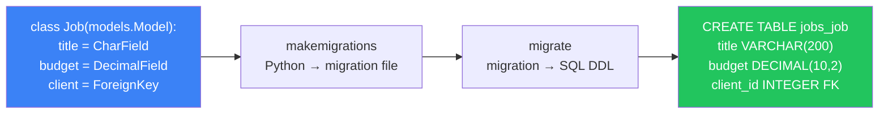
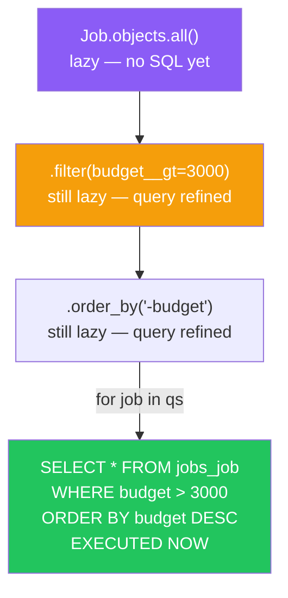
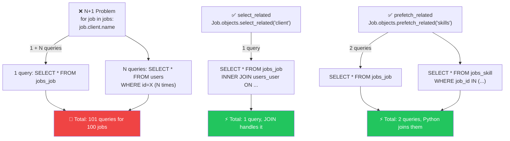
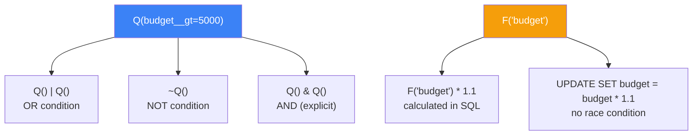
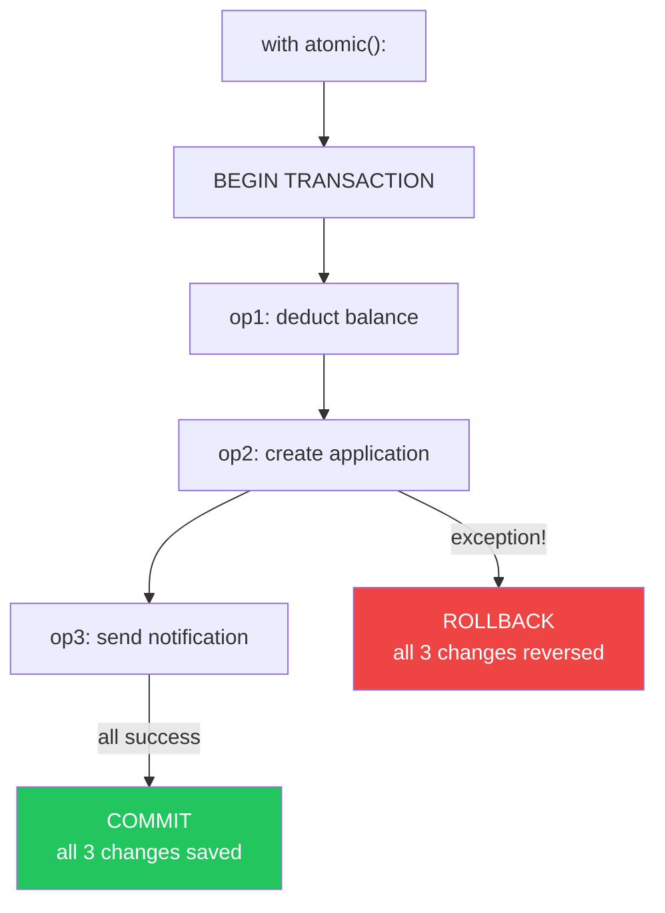
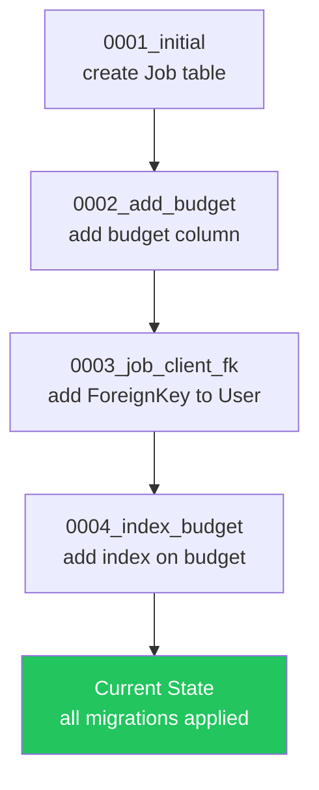
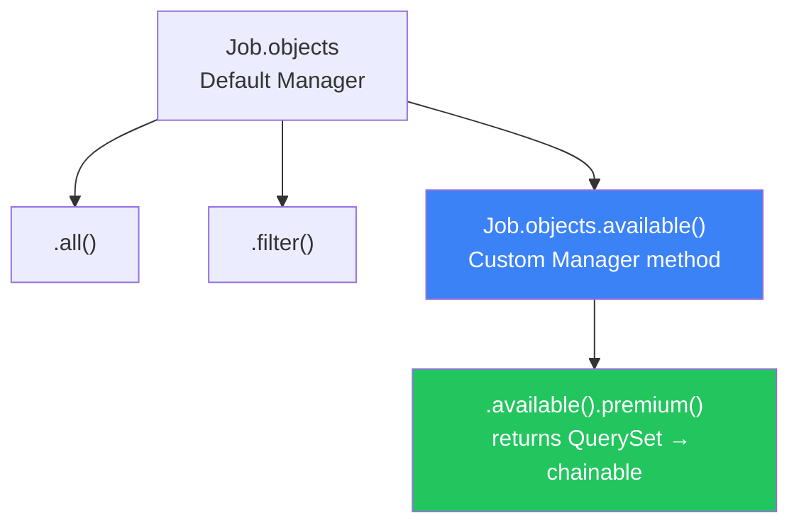

# الفصل السابع — الـ ORM: بيترجم Python لـ SQL من غير ما تعرف

> **المتطلبات:** [[06-Django-MVT-Architecture]] — لازم تكون فاهم الـ MVT flow وإزاي الـ View بيتعامل مع الـ Model. الفصل ده بيشرح إزاي الـ Model نفسه بيشتغل من الداخل — إزاي Python class بيتحوّل لـ database table وإزاي الـ queries بتتنفذ فعلياً.

---

## البداية — المشكلة اللي الـ ORM بيحلها (واللي بيعملها كمان)

تخيّل إنك بتكتب SQL يدوي لكل query في HireLink: `INSERT INTO jobs_job (title, budget) VALUES (...)` و `SELECT * FROM jobs_job WHERE budget > 5000` — في 50 مكان مختلف. لو عدّلت اسم column واحد؟ لازم تعدّل 50 SQL statement. ده كابسة الـ DRY.

الـ ORM (Object-Relational Mapper) بيحل المشكلة: بيمثّل كل table كـ Python class، وكل row كـ instance، وكل query كـ method call. بس الـ ORM مش سحر — هو مترجم. وفهم إزاي بيتفرجم ده الفرق بين حد بيستخدم Django وحد بيستشغلها.

---

## [[01-Model-To-Table]] — إزاي Python class بيتحوّل لـ database table

### 🧠 الشرح النظري

لما بتكتب `class Job(models.Model)` وتحط جوّاه fields، Django بتعمل حاجتين: بتبني Python class عادي ممكن تعمل منه instances وبعدين تعمل بيها حاجات — وكمان بتبني **schema definition** بتستخدمه تخلّق database table من خلال الـ migrations.

كل field في الـ Model بيتحوّل لـ column في الـ table بناءً على نوعه. `CharField` بيبقى `VARCHAR`، `DecimalField` بيبقى `DECIMAL`، `ForeignKey` بيبقى column بيشير لـ table تانية. Django بتعرف كمان تعمل الـ constraints: `null=True` معناها الـ column ممكن يبقى NULL، `unique=True` معناها UNIQUE constraint على الـ column.

الـ Model subclass بيرث من `models.Model` — وده بيديه مجموعة methods مجانية: `.save()` لعمل insert أو update، `.delete()` للحذف، `.objects` للـ queries، و`.pk` shortcut للـ primary key. كل ده من غير ما تكتب سطر SQL واحد. بس لازم تفهم إن الـ instance في Python والـ row في الـ database مش نفس الحاجة — الـ instance ممكن يكون جديد ومش موجود في الـ DB أصلاً لحد ما تعمل `.save()`.

### 📊 Visualization



### 💻 Micro-Example

```python
class Job(models.Model):
    title = models.CharField(max_length=200)        # VARCHAR(200) NOT NULL
    budget = models.DecimalField(max_digits=10, decimal_places=2)  # DECIMAL(10,2)
    is_remote = models.BooleanField(default=False)   # BOOLEAN DEFAULT FALSE
    client = models.ForeignKey(User, on_delete=models.CASCADE)  # INTEGER FK

# Instance in Python ≠ row in DB until .save()
job = Job(title="Backend Dev", budget=5000, client=user)
print(job.pk)        # None — not saved yet, no database row
job.save()           # INSERT INTO jobs_job (...) VALUES (...)
print(job.pk)        # 1 — now has a primary key
```

---

## [[02-QuerySet-Laziness]] — `User.objects.all()` مش بيعمل DB hit فوراً

### 🧠 الشرح النظري

أكتر حاجة بتستغربها لما تبدأ مع Django: إن `Job.objects.all()` مش بيضرب الـ database في اللحظة دي. ده بيسمّى **Lazy Evaluation** — الـ QuerySet بيتبني كـ "وصف" للـ query مش كـ نتيجة. Django مش بتترجمه لـ SQL وتننفذه غير لما تحتاج النتيجة فعلاً.

إيه اللي بيخلي الـ QuerySet يتنفذ؟ حاجات محددة: iteration (`for job in queryset`)، slicing (`queryset[:5]` — بس في Python مش DB)، `list(queryset)`، `len(queryset)` — وكل واحدة بتشغل SQL مختلف. الـ iteration بيعمل `SELECT *`، الـ `len()` بيعمل `SELECT COUNT(*)`، الـ `bool()` بيعمل `SELECT 1 LIMIT 1`.

ده مهم عشان لو بنيت QuerySet كبير وعدّلته كذا مرة (أضفت filter، بعد exclude، رجعت order_by) — كل التعديلات دي بتتراكم في الـ "وصف" بدون أي DB hit. الـ SQL بيتنفذ مرة واحدة بس — في النهاية لما تطلب النتيجة. وفي الـ meantime، Django بتعمل query optimization تلقائي لو أضفت أكتر من filter.

### 📊 Visualization



### 💻 Micro-Example

```python
# No database hit yet — just building the query description
active = Job.objects.filter(is_active=True)        # lazy
premium = active.filter(budget__gt=5000)            # still lazy
ordered = premium.order_by("-created_at")           # still lazy

# NOW the SQL executes — because we iterate
for job in ordered:                                  # SELECT fires HERE
    print(job.title)

# Different evaluation triggers produce different SQL
print(list(active))       # SELECT * — fetches all rows
print(active.count())     # SELECT COUNT(*) — no row data fetched
print(bool(active))       # SELECT 1 LIMIT 1 — just checks existence
```

---

## [[03-Select-Related-Vs-Prefetch-Related]] — حل مشكلة الـ N+1 اللي بتقتل أي API

### 🧠 الشرح النظري

مشكلة الـ N+1 هي أكتر مشكلة performance بتقتل الـ APIs المبنية بـ ORM. بتحصل لما بتستخدم ForeignKey أو ManyToMany وبتعمل loop على الـ queryset — وكل iteration بيعمل query لوحده.

مثلاً: لو عندك 100 job وعامل `for job in jobs: print(job.client.name)` — الـ ORM بيعمل 1 query للـ jobs + 100 query لكل client = 101 query. ده N+1. لو الـ clients 500؟ 501 query. السيرفر بيقع.

**`select_related`** — بيحل المشكلة للـ ForeignKey والـ OneToOne. بيعمل JOIN في الـ SQL ويجيب الـ related data في نفس الـ query الواحد. الـ trade-off: الـ JOIN ممكن يبقى ثقيل لو الـ tables كبيرة — بس 1 query أحسن بكتير من N+1.

**`prefetch_related`** — بيحل المشكلة للـ ManyToMany والـ reverse ForeignKey. بيعمل 2 queries منفصلين: واحد للـ main table والتاني للـ related table — وبعدين بيعمل الـ joining في Python مش في SQL. ده أوضح لما الـ relation many-side كبيرة.

### 📊 Visualization



### 💻 Micro-Example

```python
# ❌ N+1: each job.client triggers a separate query
jobs = Job.objects.all()
for job in jobs:
    print(job.client.name)          # 1 + N queries

# ✅ select_related: ForeignKey/OneToOne — JOIN in one query
jobs = Job.objects.select_related("client")
for job in jobs:
    print(job.client.name)          # 1 query total — client already loaded

# ✅ prefetch_related: ManyToMany/reverse FK — 2 queries, Python join
jobs = Job.objects.prefetch_related("skills")
for job in jobs:
    print([s.name for s in job.skills.all()])  # 2 queries total
```

---

## [[04-Q-And-F-Objects]] — Complex queries من غير raw SQL

### 🧠 الشرح النظري

لما بتكتب `filter(budget__gt=3000, is_active=True)`، Django بتعمل AND بين الشروط — كل condition لازم يتحقق. بس إيه لو عايز OR؟ إيه لو عايز condition يعتمد على قيمة column تاني في نفس الـ row؟ هنا بتجي الـ Q objects والـ F objects.

**`Q` objects** — بتسمحلك تبني OR queries وnested conditions. `Q(budget__gt=5000) | Q(is_remote=True)` معناها "الفلة أكبر من 5000 أو عن بعد." كمان بتدعم `~Q(...)` للـ NOT و`&` للـ AND — يعني تقدر تبني أي logical combination. الـ Q objects كمان ممتازة لما بتبني search filters ديناميكية — بتستقبل parameters من الـ query string وبتبني Q objects بناءً عليها.

**`F` objects** — بتشير لـ column value في الـ database مش لـ Python value. `F("budget") + 500` معناها "زوّد الـ budget في الـ DB بـ 500" — وده بيتنفذ كله في الـ SQL من غير ما Python تشيل القيم. ده important عشان: (1) مش محتاج تعمل query الأول وبعدين تعدّل — الـ update بيحصل في DB واحد، (2) مش فيه race condition — لأن الـ SQL atomic، لو اتنين users عدّلوا نفس الـ row في نفس الوقت، الـ F بيتعامل معاهم صح.

### 📊 Visualization



### 💻 Micro-Example

```python
from django.db.models import Q, F

# Q objects: OR condition — premium OR remote jobs
premium_or_remote = Job.objects.filter(
    Q(budget__gt=5000) | Q(is_remote=True)          # WHERE budget > 5000 OR is_remote = TRUE
)

# Q with NOT: active but NOT client's own jobs
available = Job.objects.filter(
    is_active=True, ~Q(client=request.user)         # WHERE is_active = TRUE AND client_id != X
)

# F objects: raise all budgets by 10% — entirely in SQL
Job.objects.update(budget=F("budget") * 1.1)        # UPDATE jobs_job SET budget = budget * 1.1

# F for filtering: jobs where budget exceeds average
from django.db.models import Avg
avg = Job.objects.aggregate(avg_budget=Avg("budget"))["avg_budget"]
expensive = Job.objects.filter(budget__gt=avg)     # compare to computed value
```

---

## [[05-Database-Transactions]] — `atomic()`: إمتى وكيف تحمّل بياناتك من الكوارث

### 🧠 الشرح النظري

الـ transaction هو عقد: كل العمليات جوّاه إما تنجح كلها أو تفشل كلها. مفيش "نص نجاح." لو عندك 3 operations — خصم من حساب العميل، إضافة للتطبيق، إرسال notification — لازم الاتنين الأولانيين ينجحوا مع بعض وإلا مفيش إضافة ولا خصم.

Django بتوفر `atomic()` كـ context manager أو decorator — وده بيستخدم الـ database's transaction mechanism. لما بتدخل `with atomic():`، Django بتعمل BEGIN. لو كل حاجة تمام، بتعمل COMMIT في الآخر. لو أي exception حصل، بتعمل ROLLBACK تلقائياً — وكل التغييرات بتلغي كأنهم ما حصلوش.

الـ nested transactions: ممكن تعمل `atomic()` جوّا `atomic()` — وده بيعمل savepoint. لو الـ inner atomic فشل، بيرجع للـ savepoint بس — الـ outer transaction بيفضل شغال. ده مفيد جداً لما عندك عملية كبيرة فيها خطوات ممكن تفشل لوحدها بدون ما تلغي العملية كلها.

### 📊 Visualization



### 💻 Micro-Example

```python
from django.db import transaction

# atomic as context manager — most common pattern
with transaction.atomic():
    application = Application.objects.create(job=job, freelancer=user)
    job.applications_count = F("applications_count") + 1
    job.save(update_fields=["applications_count"])   # if this fails, application rolls back too

# atomic as decorator — for whole view
@transaction.atomic
def apply_to_job(request, job_id):
    job = Job.objects.select_for_update().get(pk=job_id)  # row-level lock
    if job.is_closed:
        raise ValidationError("Job is closed")
    Application.objects.create(job=job, freelancer=request.user)
    job.applications_count = F("applications_count") + 1
    job.save()
```

---

## [[06-Migrations-Internals]] — إزاي الـ Migrations بتشتغل من الداخل

### 🧠 الشرح النظري

الـ migrations مش بس أوامر بتشغلها — دي **dependency graph** كاملة بيتتبع الترتيب بتاعها. لما بتكتب `makemigrations`، Django بتشوف الفرق بين الـ models الحالية وآخر migration وبتبني ملف Python بيسجل التغييرات. الملف ده مش SQL — هو Python code بيشوّف Django إزاي تتحول من state لـ state.

لما بتكتب `migrate`، Django بتعمل اتنين: بتبني الـ dependency graph من كل الـ migrations files وبتنفذهم بالترتيب — وبعدين بتشغّل الـ SQL المناسب على الـ database. الـ dependency graph بيضمن إن migration واحد لازم يتنفذ قبل التاني لو بيعتمد عليه (زي إنك تعمل column قبل ما تعمل index عليه).

مهم تعرف: الـ migration file هو **التاريخ الرسمي** لـ schema بتاعك. لو حذفته — Django مش هتعرف تعمل migrate صح. لو عدّلته يدوي — ممكن يكسر الـ graph. والـ `--fake` flag بيعلم Django إن الـ migration اتنفذت من غير ما يشغّل الـ SQL فعلاً — وده للـ emergency فقط، مش للـ daily use.

### 📊 Visualization



### 💻 Micro-Example

```python
# Generated migration file — not SQL, it's Python describing the change
from django.db import migrations, models

class Migration(migrations.Migration):
    dependencies = [("jobs", "0001_initial")]        # must run after 0001

    operations = [
        migrations.AddField(                         # operation: add a field
            model_name="job",
            name="budget",
            field=models.DecimalField(max_digits=10, decimal_places=2, default=0),
        ),
    ]

# Common commands
# python manage.py makemigrations     → detect changes, create migration file
# python manage.py migrate             → apply all pending migrations
# python manage.py showmigrations      → see which are applied (✓) or pending
# python manage.py migrate jobs 0002  → roll BACK to specific migration
```

---

## [[07-Custom-Managers]] — الـ Manager: لوحة التحكم بتاعتك للـ queries

### 🧠 الشرح النظري

كل model في Django عنده `objects` — وده هو الـ **Manager**. الـ Manager هو البوابة اللي كل queries بتمر منها: `Job.objects.all()`، `Job.objects.filter(...)` — كلهم بيمروا على الـ Manager الاول.

الـ Manager الـ built-in اسمه `models.Manager` وبيوفرلك كل الـ query methods. بس المشكلة: لو عندك logic متكرر — زي "الـ jobs المتاحة" أو "الـ premium jobs" — هتلاحظ إنك بتكتب نفس الـ filter في 10 أماكن. هنا بتبني **Custom Manager**.

الـ Custom Manager بيسمحلك تعمل methods على مستوى الـ table مش الـ instance. مثلاً `Job.objects.available()` بدل ما تكتب `Job.objects.filter(is_active=True, deadline__gt=now())` في كل مكان. كمان ممكن تعمل Custom QuerySet — وده أقوى لأنه بيرجع QuerySet مش list، يعني تقدر تكمل تبني عليه `.filter().available().order_by()`.

### 📊 Visualization



### 💻 Micro-Example

```python
from django.db import models
from django.utils import timezone

class JobQuerySet(models.QuerySet):              # custom QuerySet = chainable
    def available(self):
        return self.filter(is_active=True, deadline__gt=timezone.now())

    def premium(self):
        return self.filter(budget__gte=5000)

class Job(models.Model):
    title = models.CharField(max_length=200)
    budget = models.DecimalField(max_digits=10, decimal_places=2)
    is_active = models.BooleanField(default=True)
    deadline = models.DateTimeField()

    objects = JobQuerySet.as_manager()           # replaces default manager

# Usage — chainable like any QuerySet
active_premium = Job.objects.available().premium()          # 2 filters chained
remote_available = Job.objects.available().filter(is_remote=True)  # + another filter
```

---

## 🎯 أسئلة الإنترفيو

**س: إيه هي مشكلة الـ N+1 وإزاي تحلها في Django ORM؟**

> **المشكلة:** لما بتعمل loop على queryset وبتوصل لـ related object (زي `job.client.name`)، كل iteration بيعمل query لوحده. 100 jobs = 1 + 100 = 101 queries.<br/><br/>
> **`select_related`:** للـ ForeignKey و OneToOne — بيعمل **JOIN** في الـ SQL ويجيب كل حاجة في query واحد. مناسبة لما الـ relation واحد-لواحد أو واحد-لكتير (من ناحية الـ FK).<br/><br/>
> **`prefetch_related`:** للـ ManyToMany و reverse FK — بيعمل **2 queries** منفصلين وبعدين بيعمل الـ joining في Python. مناسبة لما الـ relation many-side كبيرة.<br/><br/>
> **القاعدة:** استخدم `select_related` لـ single-object relations، `prefetch_related` لـ multi-object relations.

---

**س: إيه الفرق بين Q objects و F objects؟**

> **Q objects** — لبناء **complex lookups** (conditions في WHERE clause). بتسمحلك تعمل OR (`|`)، NOT (`~`)، وAND (`&`) بين شروط الفلترة.<br/><br/>
> **F objects** — للإشارة لـ **column values** في الـ database مش Python values. بتسمحلك تعمل calculations وupdates في الـ SQL مباشرةً من غير ما تحمل القيم في Python.<br/><br/>
> **الفرق الجوهري:** Q بتأثر على إيه rows بترجع (filtering)، F بتأثر على إيه قيم بتتعدّل أو تتقارن (updating/comparing). `Q(budget__gt=5000)` بترجع jobs معينة. `F("budget") * 1.1` بتعدّل الـ budget value في الـ DB.

---

**س: إيه هو `atomic()` وليه لازم في أي write operation؟**

> `atomic()` بيشتغل كـ **all-or-nothing** container: كل العمليات جوّاه إما تنجح كلها (COMMIT) أو تفشل كلها (ROLLBACK).<br/><br/>
> **ليه لازم:** لو عندك عملية فيها أكتر من write (خصم + إضافة + إرسال)، وأي واحدة فشلت من غير atomic — اللي اتنفذ قبل الفشل هيبقى موجود واللي بعده مش هيبقى. ده بيسبب data inconsistency.<br/><br/>
> **Nested atomic:** بيعمل **savepoint** — لو الـ inner فشل بيرجع للـ savepoint بس، والـ outer بيفضل شغال. مفيد لما عندك خطوات ممكن تفشل لوحدها بدون ما تلغي العملية الكبيرة.

---

**س: إزاي الـ QuerySet بيشتغل lazy وليه ده مهم؟**

> الـ QuerySet مش بيضرب الـ database فوراً — هو بيبني "وصف" للـ query وبيستنى لحد ما تطلب النتيجة فعلاً (iteration, list, len, bool, slicing).<br/><br/>
> **ليه مهم:** (1) Performance — لو بنيت queryset وبعدين عدّلته (filter + exclude + order)، الـ SQL بيتنفذ مرة واحدة بس في النهاية. (2) Optimization — Django بتعمل query optimization تلقائي على الـ chained filters. (3) Reusability — تقدر تبني queryset وتعديه لـ functions تانية من غير أي DB hit.

---

**س: إيه الـ Custom Manager وإيه الفرق بينه وبين الـ Custom QuerySet؟**

> **Custom Manager** — بيضيف methods على مستوى الـ table (زي `Job.objects.available()`). بس مش بيرجع QuerySet — يعني مش chainable بعد كده.<br/><br/>
> **Custom QuerySet** — بيضيف methods **بتيرجع QuerySet** — يعني chainable. `Job.objects.available().premium().filter(...)` — كل واحد بيرجع queryset تقدر تبني عليه.<br/><br/>
> **الـ Best Practice:** استخدم `QuerySet.as_manager()` عشان تحوّل الـ Custom QuerySet لـ manager — وده بيديك chainable methods + default manager methods في نفس الوقت. ده الـ pattern الأشهر في الـ Django community.

---

## 📝 خلاصة الدرس

- **Model → Table:** كل field بيتحوّل لـ column بناءً على نوعه. الـ instance في Python مش row في الـ DB لحد ما تعمل `.save()`.
- **QuerySet Laziness:** `objects.all()` مش بيضرب DB — بيبني وصف للـ query. الـ SQL بيتنفذ لما تستهلك النتيجة (iteration, list, len, bool).
- **N+1 Problem:** loop على queryset ووصول لـ related object = 1+N queries. `select_related` (JOIN) للـ FK/OneToOne. `prefetch_related` (2 queries + Python join) للـ ManyToMany/reverse FK.
- **Q Objects:** complex filtering بـ OR (`|`)، NOT (`~`)، AND (`&`). لبناء dynamic search filters.
- **F Objects:** reference لـ column values في الـ DB. عمليات حسابية وupdates atomic في الـ SQL بدون race conditions.
- **`atomic()`:** all-or-nothing transactions. Nested = savepoints. لازم في أي أكتر من write operation واحدة.
- **Migrations:** dependency graph مش أوامر فردية. الملفات هي التاريخ الرسمي — متمسش بيهم.
- **Custom Manager/QuerySet:** Manager methods على مستوى table. QuerySet methods chainable. `QuerySet.as_manager()` هو الـ best practice.

---

*Next → [[08-Django-Middleware]] — دلوقتي هنشوف الـ Middleware من الداخل: الـ onion model، إزاي كل request بيمر على كل layer، وإزاي تبني custom middleware تحمي الـ API بتاعك.*