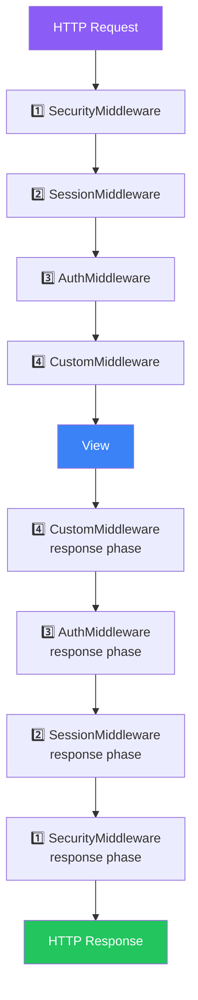
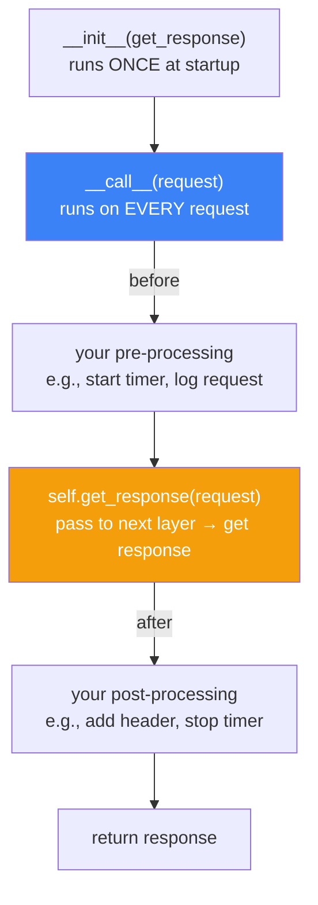
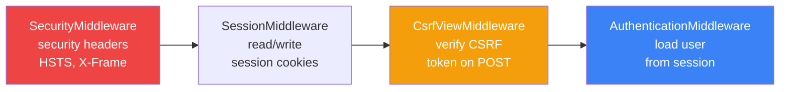
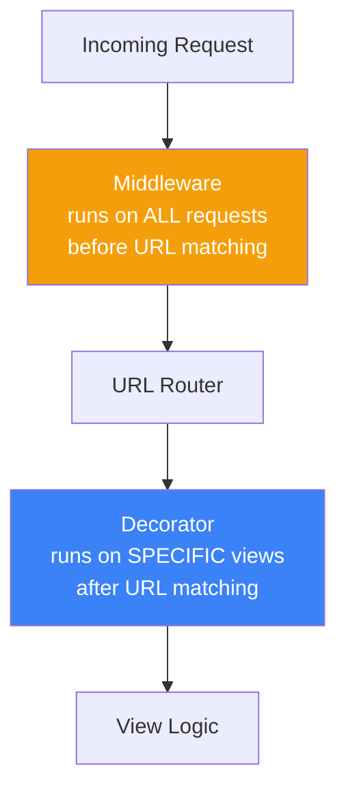
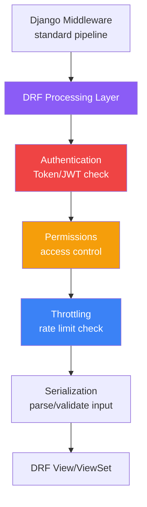

# الفصل الثامن — الـ Middleware: "حاجز الأمن" اللي كل request بيعدّي منه

> **المتطلبات:** [[07-Django-ORM-Under-The-Hood]] — لازم تكون فاهم الـ request lifecycle وإزاه الـ ORM بيشتغل. الـ middleware بيقف في نص الرحلة دي — بين الـ WSGI والـ View — وبيقدر يعدّل أو يوقف أي request. الفصل ده بيفسرك إزاي الطبقات دي بتشتغل وإزاي تبني واحدة بنفسك.

---

## البداية — ليه محتاجين حاجة قبل الـ View؟

تخيّل معايا إن كل view في HireLink محتاج يسجل إن الـ request وصل، يتحقق إن الـ user مسجل دخول، يضيف security headers، ويتأكد إن الـ rate limit مش متعدّى. من غير middleware، كل view هيبدأ بنفس 20 سطر boilerplate. بس الـ middleware بيحل المشكلة بشكل أنضف: بيشيل السلوك المشترك برّا الـ views وبيحطه في طبقة مستقلة.

---

## [[01-Middleware-Chain]] — الـ Onion Model: كل request بيمر من برّا لجوّا والعكس

### 🧠 الشرح النظري

الـ Middleware في Django بيتصرف زي طبقات البصل — كل request بيمر من الطبقة الخارجية للداخلية، وكل response بيمر بالعكس. الـ request بيمر على كل middleware بالترتيب اللي في `MIDDLEWARE` list — من الأول للأخير. الـ response بيمر بالعكس — من الأخير للأول. وده بيتسمى **LIFO** (Last In, First Out).

الترتيب مهم جداً لأن كل middleware بياخد الـ request، بيعمل حاجة، وبيبعتها للـ middleware اللي بعده. لو middleware وقّف الـ request (مثلاً rate limit)، الـ middleware اللي جوّاه والـ view مش بيتنفذوا أصلاً. وكمان الـ response بيمر على كل middleware بالعكس — يعني آخر middleware في الـ list هو أول واحد بيشوف الـ request وآخر واحد بيشوف الـ response.

القاعدة الذهبية: الـ security middlewares لازم تكون أول الـ list عشان تتعامل مع الـ request قبل أي حاجة تانية. الـ session و authentication لازم يكونوا بعد security بس قبل أي custom middleware. والـ logging ممكن يكون آخر حاجة عشان يشوف كل حاجة اتعملت.

### 📊 Visualization



### 💻 Micro-Example

```python
# settings.py — order matters!
MIDDLEWARE = [
    "django.middleware.security.SecurityMiddleware",   # FIRST — security headers
    "django.contrib.sessions.middleware.SessionMiddleware",
    "django.middleware.common.CommonMiddleware",
    "django.middleware.csrf.CsrfViewMiddleware",
    "django.contrib.auth.middleware.AuthenticationMiddleware",
    "core.middleware.RequestTimingMiddleware",          # custom — after auth
]
```

---

## [[02-Custom-Middleware]] — بناء Middleware من الصفر بالـ Modern Style

### 🧠 الشرح النظري

الـ middleware الحديث في Django بيشتغل بـ class واحدة فيها `__init__` و `__call__`. الـ `__init__` بيتننفذ مرة واحدة لما Django بتشغل — بياخد `get_response` parameter اللي هو الـ callable اللي بيبعت الـ request للطبقة الجاية. الـ `__call__` بيتننفذ على كل request — وده المكان اللي بتحط فيه logic بتاعك.

الـ flow بسيط: (1) تعمل أي حاجة قبل ما تبعت الـ request للطبقة الجاية، (2) تنادي `self.get_response(request)` عشان الـ request يكمّل رحلته، (3) تعمل أي حاجة بعد ما الـ response يرجع. الخطوة التانية هي الـ "نقطة المفصلية" — ده المكان اللي الـ request بيتحوّل لـ response.

مهم: الـ middleware instance بيتعمل مرة واحدة وقت الـ startup — مش على كل request. ده معناه إن أي متغيرات على `self` بتفضل محفوظة بين الـ requests. لو محتاج per-request state — خليه في local variables جوّا `__call__` مش على `self`.

### 📊 Visualization



### 💻 Micro-Example

```python
class RequestTimingMiddleware:
    def __init__(self, get_response):             # called once at startup
        self.get_response = get_response          # the next layer in the chain

    def __call__(self, request):                  # called on every request
        import time
        start = time.perf_counter()               # BEFORE: start measuring

        response = self.get_response(request)     # pass request to next layer

        elapsed = time.perf_counter() - start     # AFTER: stop measuring
        response["X-Response-Time"] = f"{elapsed:.3f}s"  # add custom header
        return response
```

---

## [[03-Built-In-Middlewares]] — الـ Middlewares اللي Django بتحطهم وبيشتغلوا من غير ما تعرف

### 🧠 الشرح النظري

Django بتجيبه معاها مجموعة middlewares أساسية — وكل واحد ليهم دور محدد في حماية وتشغيل التطبيق. لازم تعرف إيه اللي بيعملوه عشان (1) تفهم إيه اللي بيحصل لو حاجة اتكسرت، و (2) تعرف إيه اللي متغطى وإيه محتاج middleware إضافي.

**SecurityMiddleware** — بيضيف security headers أساسية: Strict-Transport-Security (HSTS) لـ HTTPS، X-Content-Type-Options، X-Frame-Options (يمنع clickjacking). ده أول line of defense — لازم يكون أول middleware في الـ list.

**SessionMiddleware** — بيشيل الـ session data في cookies أو DB. بيقرأ session cookie من الـ request وبيرجع الـ session object على `request.session`. لو الـ user مسجل دخول، الـ session هو اللي بيقول مين ده.

**CsrfViewMiddleware** — بيحمي من الـ Cross-Site Request Forgery. كل POST request لازم يجي معاه CSRF token — وده middleware بيتحقق منه. لو token غايب أو غلط → 403 Forbidden.

**AuthenticationMiddleware** — بيقرأ الـ session وبيربط الـ user object بـ `request.user`. من غيره، `request.user` مش بيكون موجود أصلاً. ده مش بيعمل login — ده بس بيحمل الـ user من الـ session.

### 📊 Visualization



### 💻 Micro-Example

```python
# SecurityMiddleware adds these headers to every response:
# Strict-Transport-Security: max-age=31536000; includeSubDomains
# X-Content-Type-Options: nosniff
# X-Frame-Options: DENY

# CsrfViewMiddleware checks POST requests:
# <form> must include: 
# Or API must send: X-CSRFToken header matching the cookie

# AuthenticationMiddleware makes request.user available:
def dashboard(request):
    user = request.user          # loaded from session by AuthMiddleware
    if user.is_authenticated:
        return HttpResponse(f"Hello, {user.username}")
```

---

## [[04-Middleware-Vs-Decorator]] — امتى تستخدم Middleware وامتى Decorator؟

### 🧠 الشرح النظري

الـ middleware والـ decorator الاتنين بيضيفوا سلوك "حوالي" كود تاني — بس بيتطبقوا على مستويات مختلفة ومش بيستبدلوا بعض.

**الـ Middleware** بيشتغل على **كل request** في الـ application — مش محتاج تحطه على كل view لوحده. بيشتغل في الـ pipeline قبل ما الـ URL حتى يتطابق. مناسب لـ: security headers (كل response محتاجها)، logging (كل request)، CORS، session management، compression.

**الـ Decorator** بيشتغل على **view محددة** — لازم تحطه يدوياً فوق الـ function أو الـ class. بيشتغل بعد ما الـ URL يتطابق والـ view ياتحدد. مناسب لـ: auth على views معينة (`@login_required`)، rate limiting على endpoints معينة، caching صفحات محددة، permission checks.

القاعدة: لو السلوك **عام** وبيتطبق على الكل → middleware. لو السلوك **محدد** وبيتطبق على views معينة → decorator. مثال: تسجيل كل request = middleware. حماية endpoint واحد بـ rate limit = decorator. الـ middleware أقوى لأنه بيشوف الـ request الأول — بس الـ decorator أوضح لأنك بتشوفه مكتوب فوق الـ view.

### 📊 Visualization



### 💻 Micro-Example

```python
# ✅ Middleware: applies to EVERY request — no per-view setup needed
class CORSMiddleware:
    def __init__(self, get_response):
        self.get_response = get_response
    def __call__(self, request):
        response = self.get_response(request)
        response["Access-Control-Allow-Origin"] = "*"     # every response gets CORS
        return response

# ✅ Decorator: applies to SPECIFIC views — explicit and visible
from django.views.decorators.http import require_POST

@require_POST                                  # only this view is restricted
@api_view(["POST"])
def apply_to_job(request, job_id):
    ...

# ❌ Don't do this: middleware that only applies to one URL
# Use a decorator instead — it's clearer and more maintainable
```

---

## [[05-DRF-Middleware-Layer]] — إزاي DRF بيضيف طبقة middleware خاصة بيه

### 🧠 الشرح النظري

Django REST Framework مش بيشتغل "فوق" Django بس — هو بيضيف **layer كاملة** من الـ processing بين الـ Django middleware والـ view الفعلي. الـ layer دي بتتعامل مع حاجات الـ API اللي Django العادي مش بتعرفها: content negotiation، authentication tokens، throttle checking، exception handling.

لما request توصل لـ DRF view، الـ flow بيختلف عن Django العادي. الـ DRF بيمرر الـ request على **exception handling** (لو حصل خطأ بيرجع JSON مش HTML error)، **authentication** (بيشيك tokens مش بس sessions)، **permissions** (بيتحقق من الصلاحيات على مستوى object)، و**throttling** (بيحدد عدد الـ requests).

كل طبقة من دول ليها class خاص فيها وممكن تعمل override. الـ DRF authentication classes ممكن تعملها custom (مثلاً JWT authentication)، الـ permission classes ممكن تبني logic خاص، والـ throttling classes ممكن تتحكم في الـ rate limits بناءً على الـ user plan. وكلهم بينضافوا في الـ `DEFAULT_AUTHENTICATION_CLASSES`، `DEFAULT_PERMISSION_CLASSES` و `DEFAULT_THROTTLE_CLASSES` في الـ settings.

### 📊 Visualization



### 💻 Micro-Example

```python
# settings.py — DRF adds its own processing layer
REST_FRAMEWORK = {
    "DEFAULT_AUTHENTICATION_CLASSES": [
        "rest_framework.authentication.SessionAuthentication",
        "rest_framework_simplejwt.authentication.JWTAuthentication",  # JWT layer
    ],
    "DEFAULT_PERMISSION_CLASSES": [
        "rest_framework.permissions.IsAuthenticated",    # permission layer
    ],
    "DEFAULT_THROTTLE_CLASSES": [
        "rest_framework.throttling.AnonRateThrottle",    # throttle layer
    ],
    "DEFAULT_THROTTLE_RATES": {
        "anon": "100/hour",            # anonymous users: 100 requests per hour
    },
}
```

---

## 🎯 أسئلة الإنترفيو

**س: إزاي الـ Middleware بيشتغل في Django وليه الترتيب مهم؟**

> الـ Middleware بيتصرف زي **onion layers** — الـ request بيمر من برّا لجوّا (أول middleware في الـ list → آخر واحد)، والـ response بيمر بالعكس (LIFO — آخر واحد → أول واحد).<br/><br/>
> **الترتيب مهم** لأن: (1) الـ middleware الأول بيشوف الـ request الأول — لو وقّفها، الباقي مش بيتنفذ. (2) الـ middleware الأخير بيشوف الـ response الأول. (3) Security لازم يكون أول حاجة عشان يتعامل مع الـ threats قبل أي logic تاني.

---

**س: إزاي تبني custom middleware في Django؟ وإيه الـ modern style؟**

> الـ modern style بيستخدم class بـ `__init__` و `__call__`:<br/><br/>
> **`__init__(self, get_response)`** — بيتنفذ مرة واحدة وقت الـ startup. `get_response` هو callable بيبعت الـ request للطبقة الجاية.<br/>
> **`__call__(self, request)`** — بيتنفذ على كل request. تعمل pre-processing، تنادي `self.get_response(request)`، وتعمل post-processing على الـ response.<br/><br/>
> **تحذير:** الـ instance بيتعمل مرة واحدة — متحطش per-request state على `self`. خليه في local variables جوّا `__call__`.

---

**س: إيه الفرق بين Middleware و Decorator؟ وامتى تستخدم كل واحد؟**

> **Middleware:** بيشتغل على **كل request** في الـ app — في الـ pipeline قبل URL matching. مناسبة للـ global behavior: security headers، CORS، logging، session.<br/><br/>
> **Decorator:** بيشتغل على **view محددة** — بعد URL matching. مناسبة للـ per-view behavior: `@login_required`، `@require_POST`، rate limit على endpoint معين.<br/><br/>
> **القاعدة:** لو السلوك عام (كل request) → middleware. لو السلوك محدد (بعض views) → decorator. مش عيب تستخدم الاتنين — كل واحد في مكانه الصح.

---

**س: إيه الـ DRF processing layer وإزاي بيتختلف عن الـ Django middleware؟**

> الـ DRF بيضيف **layer خاصة** بعد الـ Django middleware وقبل الـ view الفعلي. بيتعامل مع حاجات الـ API اللي Django العادي مش بيعرفها.<br/><br/>
> **الـ layers دي:** Authentication (tokens/JWT مش بس sessions) → Permissions (object-level access) → Throttling (rate limits) → Serialization (parse/validate input).<br/><br/>
> كل layer ليها classes ممكن تعملها custom وتحددها في الـ settings عبر `DEFAULT_AUTHENTICATION_CLASSES`, `DEFAULT_PERMISSION_CLASSES`, `DEFAULT_THROTTLE_CLASSES`. ده بيخلي الـ DRF pipeline مرن وextensible.

---

## 📝 خلاصة الدرس

- **Onion Model:** Request يمر من أول middleware لآخر (top→bottom). Response بالعكس (bottom→top — LIFO). Security الأول، logging الأخير.
- **Custom Middleware:** `__init__(get_response)` مرة واحدة، `__call__(request)` على كل request. Pre-processing → `get_response()` → Post-processing. Per-request state في local variables مش على `self`.
- **Built-in Middlewares:** SecurityMiddleware (headers)، SessionMiddleware (sessions)، CsrfViewMiddleware (POST protection)، AuthenticationMiddleware (`request.user`).
- **Middleware vs Decorator:** Middleware = كل request (global)، Decorator = views محددة (specific). Middleware أقوى (يشوف request أول)، Decorator أوضح (مكتوب فوق الـ view).
- **DRF Layer:** DRF بيضيف authentication → permissions → throttling → serialization بين الـ Django middleware والـ view. كل layer custom ومحددة في الـ settings.

---

*Next → [[09-Django-Signals]] — دلوقتي هنشوف الـ Signals: الـ "WhatsApp Group" بتاع Django — إزاي components مختلفة بيتكلموا من غير ما يعرفوا عن بعض، وإزاي تبني reactive behavior في HireLink.*