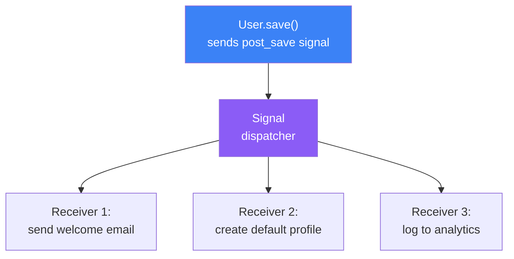
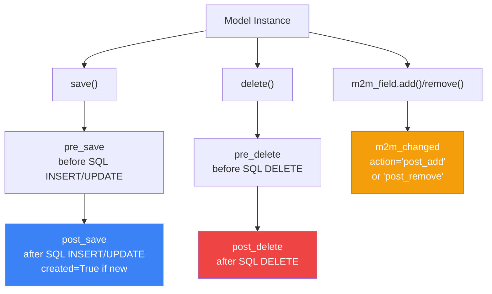
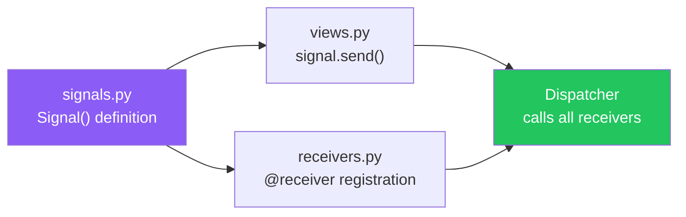
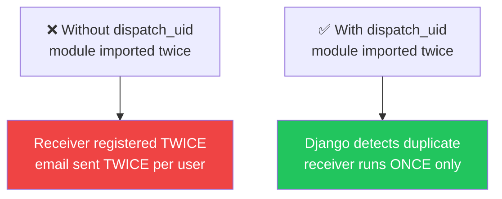
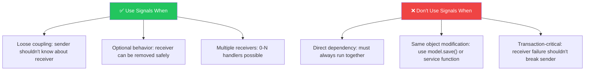

# الفصل التاسع — الـ Signals: "الـ WhatsApp Group" بتاع Django

> **المتطلبات:** [[08-Django-Middleware]] — لازم تكون فاهم الـ request lifecycle. الـ Signals بيتعملوا في الـ model layer — لما بتحصل أحداث زي save أو delete — ومش ليهم علاقة بالـ HTTP request مباشرة. بس فهم الـ middleware بيساعدك تقارن الاتنين: middleware = request events، signals = model events.

---

## البداية — ليه محتاجين حاجة تتكلم من غير ما تعرف مين سامع؟

تخيّل معايا إنك في HireLink وعايز إن كل user جديد يتسجل → يتبعتله welcome email، يتعملله default profile، ويتسجل في analytics. ممكن تحط الكود ده كله جوّا الـ `save()` method — بس كده الـ User model بيعرف عن الـ email system والـ analytics والـ profiles. ده كسر لمبدأ **Separation of Concerns**.

الـ Signals بيحل المشكلة: الـ User model بيقول "أنا اتنشأت!" — ومين عايز يسمع يسمع ويعمل اللي عايزه. الـ email service يبعت email، الـ profile service يعمل profile، والـ analytics يسجّل — وكل واحد لوحده مش عارف عن التاني.

---

## [[01-Observer-Pattern-In-Django]] — الـ Signal = Observer Pattern بتاع Django

### 🧠 الشرح النظري

الـ Signals في Django هو تطبيق لـ **Observer Pattern** — pattern شهير في الـ software design. الفكرة بسيطة: فيه **sender** (اللي بيعلّن إن حاجة حصلت) و **receivers** (اللي بيسمعوا ويتفاعلوا). الـ sender مش بيعرف مين بيسمع ولا مين هيتفاعل — هو بس بيبعت signal. والـ receivers مش بيعرفوا عن بعض — كل واحد بيسمع ويتفاعل لوحده.

ده بيسمحلك تضيف سلوك جديد لـ model من غير ما تعدّل الكود الأصلي. الـ User model بيفضل نظيف — بيعمل save() وبيرجع. بس في الـ background، أي number من الـ receivers ممكن يشتغلوا. ده الـ loose coupling اللي بيبني software قابل للصيانة والتوسع.

في Python terms: الـ signal بياخد قائمة من الـ callback functions (receivers)، ولما الـ event بيحصل، بيعمل iterate عليهم ويناديهم واحد واحد. الـ decorator `@receiver` هو الـ syntax اللي بيسهل تسجيل الـ callbacks دي. وكل receiver بياخد arguments من الـ signal: `sender`، `instance`، وkwargs حسب الـ signal type.

### 📊 Visualization



### 💻 Micro-Example

```python
from django.db.models.signals import post_save
from django.dispatch import receiver

# sender: User model doesn't know about this — it just saves
@receiver(post_save, sender=User)
def send_welcome_email(sender, instance, created, **kwargs):
    if created:                                   # only on new users, not updates
        send_mail(
            "Welcome to HireLink!",
            f"Hi {instance.username}, glad to have you!",
            "noreply@hirelink.com",
            [instance.email],
        )
```

---

## [[02-Built-In-Signals]] — الـ Signals اللي Django بتبعتها مجاناً

### 🧠 الشرح النظري

Django عندها مجموعة signals مبنية جوّاها بتتبعت في لحظات محددة من الـ lifecycle بتاع الـ models. مش محتاج تبنيها — بس محتاج تعرف إزاي تستمع ليها.

**`pre_save` / `post_save`** — قبل وبعد أي `save()` على model. الـ `post_save` أشهرهم — بيتنبع لما object اتنشأ أو اتنعدّل. الـ `created` boolean بيقولك ده object جديد ولا تعديل على موجود. الـ `pre_save` مفيد لو عايز تعمل حاجة قبل ما الـ SQL يتنفذ — زي auto-generate slug.

**`pre_delete` / `post_delete`** — قبل وبعد أي `delete()`. الـ `pre_delete` مفيد لو عايز تحفظ بيانات قبل الحذف أو تعمل cleanup. الـ `post_delete` مفيد لو عايز تينهي dependent objects بعد الحذف.

**`m2m_changed`** — لما ManyToMany relation بيتغيّر (إضافة أو شيل عنصر من الـ relation). مفيد لما عايز تreact لما user يضيف skill جديد لـ profile.

**`request_started` / `request_finished`** — من Django نفسها مش من models — بيتنبعتوا لما HTTP request يبدأ أو يخلص. مفيد لـ request-scoped logging أو connection management.

### 📊 Visualization



### 💻 Micro-Example

```python
from django.db.models.signals import post_save, pre_delete, m2m_changed

@receiver(post_save, sender=Job)
def notify_new_job(sender, instance, created, **kwargs):
    if created:                          # only when a new job is posted
        notify_freelancers(instance)     # push notification to matching freelancers

@receiver(pre_delete, sender=Job)
def archive_before_delete(sender, instance, **kwargs):
    ArchivedJob.objects.create(          # save a copy before deletion
        original_id=instance.pk, title=instance.title, budget=instance.budget
    )

@receiver(m2m_changed, sender=Job.skills.through)
def sync_skill_tags(sender, instance, action, **kwargs):
    if action == "post_add":            # after skills are added to a job
        update_search_index(instance)    # re-index for search
```

---

## [[03-Custom-Signals]] — بناء Signal خاص بيك

### 🧠 الشرح النظري

مش كل حدث في تطبيقك بيتغطى بـ built-in signals. ممكن تحتاج signal مخصص — مثلاً لما application تتقبل، أو لما payment يكتمل، أو لما job يتقفل. Django بتسمحلك تبني custom signals بسهولة.

الـ custom signal بيتعمل كـ instance من `django.dispatch.Signal`. لو عايز الـ signal يبقى قوي ويوفر type hints — ممكن تستخدم `Signal(providing_args=[...])` (قديم) أو تعمل Signal subclass. لما بتعمل `send()` على الـ signal، كل الـ receivers المسجلين بيتنفذوا.

القاعدة المهمة: الـ custom signal لازم يكون في module مستقل (زي `signals.py` في الـ app) — مش في `models.py`. ليه؟ عشان الـ circular imports. لو الـ signal في `models.py` والـ receiver كمان يشير لـ models — Python هتكسر. الـ signals module لازم يتستورد من غير ما يعتمد على أي model.

### 📊 Visualization



### 💻 Micro-Example

```python
# jobs/signals.py — define custom signal in separate module
from django.dispatch import Signal

application_accepted = Signal()               # custom signal: no built-in equivalent

# jobs/views.py — send the signal when business logic happens
from .signals import application_accepted

def accept_application(request, pk):
    app = Application.objects.get(pk=pk)
    app.status = "accepted"
    app.save()
    application_accepted.send(               # emit the signal
        sender=Application,
        instance=app,
        freelancer=app.freelancer,
    )

# jobs/receivers.py — listen and react
from django.dispatch import receiver
from .signals import application_accepted

@receiver(application_accepted)
def notify_freelancer(sender, instance, freelancer, **kwargs):
    send_mail("Application Accepted!", f"Your application for {instance.job} was accepted!",
              "noreply@hirelink.com", [freelancer.email])
```

---

## [[04-Dispatch-UID]] — تجنب التكرار: ليه الـ receiver ممكن يتسجل مرتين

### 🧠 الشرح النظري

مشكلة محتملة مع الـ signals: لو الـ module فيه الـ receiver اتنستورد أكتر من مرة (وده بيحصل كتير في Django عشان الـ app loading)، الـ receiver ممكن يتسجل أكتر من مرة — وبالتالي الـ function بتتنفذ أكتر من مرة على نفس الحدث.

المثال: لو `send_welcome_email` اتسجل مرتين، كل user جديد هيستقبل 2 emails. مش كارثة بس مزعج — ولو الـ receiver بيعمل حاجة أكتر أهم (زي deduct balance)، التكرار ده كارثة.

الحل: `dispatch_uid` — identifier فريد بيتحط في الـ `@receiver` عشان Django تعرف إن ده نفس الـ receiver ومتشيلش نسخة تانية. أي string فريد يكفي — بس الـ convention إنه يكون `"app_name.receiver_name"`.

### 📊 Visualization



### 💻 Micro-Example

```python
from django.db.models.signals import post_save
from django.dispatch import receiver

# ✅ Always use dispatch_uid to prevent duplicate registration
@receiver(post_save, sender=User, dispatch_uid="users.send_welcome_email")
def send_welcome_email(sender, instance, created, **kwargs):
    if created:
        send_mail("Welcome!", "Glad to have you!", "noreply@hirelink.com", [instance.email])

# ✅ Alternative: connect manually with dispatch_uid
def create_profile(sender, instance, created, **kwargs):
    if created:
        UserProfile.objects.create(user=instance)

post_save.connect(
    create_profile,
    sender=User,
    dispatch_uid="users.create_profile",    # unique identifier prevents duplicates
)
```

---

## [[05-Signals-Anti-Patterns]] — إمتى ما تستخدمش Signals

### 🧠 الشرح النظري

الـ Signals حل رائع — بس مش لكل حاجة. كتير من الناس بيستخدموها في أماكن المفروض يستخدموا كود عادي. ده بيخلق code صعب التتبع والـ debugging.

**Anti-pattern 1: signals عشان logic مرتبطة مباشرة.** لو الـ receiver بيعدّل نفس الـ object اللي بعت الـ signal — ده مش signal ده method. مثلاً: `post_save` على Job وبعدين تعمل update على نفس الـ Job — كده كنت تكتب الكود ده في `save()` مباشرةً أو في service function.

**Anti-pattern 2: signals عشان dependency بين apps.** لو app A بيعمل حاجة لما حاجة في app B تحصل — ده ممكن يكون signal بس لو الـ dependency دي critical (مش optional)، فالأولى تعملها function call عادي. الـ signal معناها "ممكن مفيش حد يسمع" — لو الـ behavior إجباري، مش محتاج signal.

**Anti-pattern 3: signals عشان transaction safety.** الـ receivers بيتنفذوا في نفس الـ transaction بتاعة الـ sender. لو receiver فشل، الـ sender كمان بيفشل. وده ممكن يكون مش اللي إنت عايزه — لو الـ email يفشل مش معناه إن الـ user ميتسجلش.

القاعدة: استخدم signals لما (1) المرسل مش لازم يعرف عن المستقبل، (2) المستقبل اختياري وممكن يتشال، (3) ممكن أكتر من مستقبل واحد. غير كده — كود عادي أبسط وأوضح.

### 📊 Visualization



### 💻 Micro-Example

```python
# ❌ Anti-pattern: signal for direct, required dependency
@receiver(post_save, sender=Job)
def update_job_slug(sender, instance, **kwargs):
    instance.slug = slugify(instance.title)    # modifying the same object
    instance.save()                            # triggers ANOTHER post_save — infinite loop risk!

# ✅ Better: override save() directly
class Job(models.Model):
    title = models.CharField(max_length=200)
    slug = models.SlugField(unique=True)

    def save(self, *args, **kwargs):
        self.slug = slugify(self.title)         # direct, no signal needed
        super().save(*args, **kwargs)           # one save, no recursion

# ✅ Good signal use: decoupled, optional behavior
@receiver(post_save, sender=User, dispatch_uid="users.welcome_email")
def send_welcome_email(sender, instance, created, **kwargs):
    if created:
        send_mail(...)   # email failure shouldn't break user creation
```

---

## 🎯 أسئلة الإنترفيو

**س: إيه هو الـ Signal في Django وإزاي بيشتغل؟**

> الـ Signal هو تطبيق لـ **Observer Pattern** — فيه **sender** بيعلّن إن حدث حصل، و **receivers** بيسمعوا ويتفاعلوا. الـ sender مش بيعرف مين بيسمع.<br/><br/>
> الـ `@receiver` decorator بيسجل function كـ listener على signal معين. لما الـ event بيحصل، Django بتعمل iterate على كل receivers المسجلين وبتناديهم واحد واحد. كل receiver بياخد `sender`, `instance`, وkwargs حسب الـ signal type.

---

**س: إيه الفرق بين `pre_save` و `post_save` وإمتى تستخدم كل واحد؟**

> **`pre_save`:** بيتنفذ **قبل** الـ SQL INSERT/UPDATE. مفيد لو عايز تعدّل بيانات الـ object قبل ما تتكتب في الـ DB — زي auto-generate slug أو set default values.<br/><br/>
> **`post_save`:** بيتنفذ **بعد** الـ SQL. الـ `created` boolean بيقولك ده object جديد ولا update. مفيد لو عايز تreact بعد ما البيانات اتنكتبت — زي إرسال email أو إشعار أو تحديث analytics.<br/><br/>
> **القاعدة:** لو بتعديل نفس الـ object → `pre_save`. لو بتعمل side effect (email, notification, log) → `post_save`.

---

**س: ليه `dispatch_uid` مهم وإيه اللي بيحصل من غيره؟**

> من غير `dispatch_uid`، لو الـ module فيه الـ receiver اتنستورد أكتر من مرة (شائع في Django)، الـ receiver **يتسجل مرتين** — وبالتالي الـ function بتتنفذ مرتين على نفس الحدث.<br/><br/>
> الـ `dispatch_uid` بيدي الـ receiver identifier فريد — لو Django تلاقي receiver بنفس الـ uid مسجل، بتتجاهله ومتشيلش نسخة تانية.<br/><br/>
> **القاعدة:** حط `dispatch_uid` على كل receiver — بدون استثناء. الـ convention: `"app_name.receiver_name"`.

---

**س: إمتى ما تستخدمش Signals في Django؟ (Anti-patterns)**

> **1. تعديل نفس الـ object:** لو الـ receiver بيعمل update على نفس الـ sender — كده كنت تكتب الكود في `save()` أو service function مباشرةً.<br/><br/>
> **2. Dependency إجباري:** لو السلوك لازم يحصل دايماً مع الـ sender — مش optional — الأولى function call عادي. الـ signal معناه "ممكن مفيش حد يسمع."<br/><br/>
> **3. Transaction safety:** الـ receivers بيتنفذوا في نفس transaction بتاعة الـ sender. لو receiver فشل، sender كمان بيفشل. لو الـ side effect مش لازم يكسر الـ main operation — شغّله في `transaction.on_commit()` بدل signal.

---

## 📝 خلاصة الدرس

- **Signals = Observer Pattern:** sender بيعلّن، receivers يسمعوا ويتفاعلوا. Loose coupling — sender مش بيعرف عن receivers.
- **Built-in Signals:** `post_save` (أشهرهم)، `pre_save`، `pre_delete`/`post_delete`، `m2m_changed`. كلهم بيتنبعتوا من Django تلقائياً.
- **Custom Signals:** `Signal()` instance في `signals.py` منفصل — `send()` في الـ business logic، `@receiver` في الـ receivers module. متحطوش في `models.py` عشان الـ circular imports.
- **`dispatch_uid`:** identifier فريد بيمنع تسجيل الـ receiver أكتر من مرة. حطه دايماً — convention: `"app_name.receiver_name"`.
- **Anti-patterns:** (1) تعديل نفس الـ object → استخدم `save()`. (2) Dependency إجباري → استخدم function call. (3) Transaction safety → الـ receivers في نفس transaction بتاعة الـ sender.
- **القاعدة الذهبية:** signals للـ optional, decoupled, multi-receiver behavior — مش للـ required, same-object, critical logic.

---

*Next → [[10-Django-Authentication-System]] — دلوقتي ندخل في نظام الـ Authentication في Django: User model، AbstractUser vs AbstractBaseUser، Custom User Model من أول يوم، والـ Session vs Token — ده الجسر المباشر لـ DRF JWT في Phase 3.*