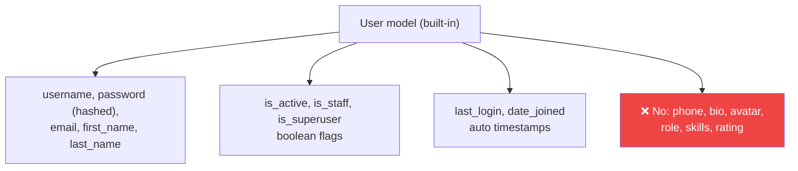
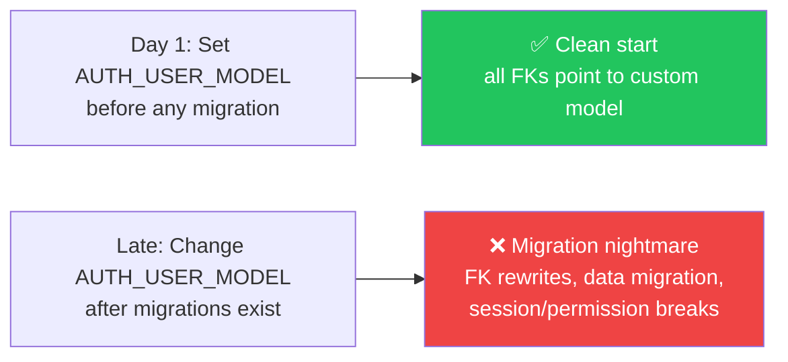
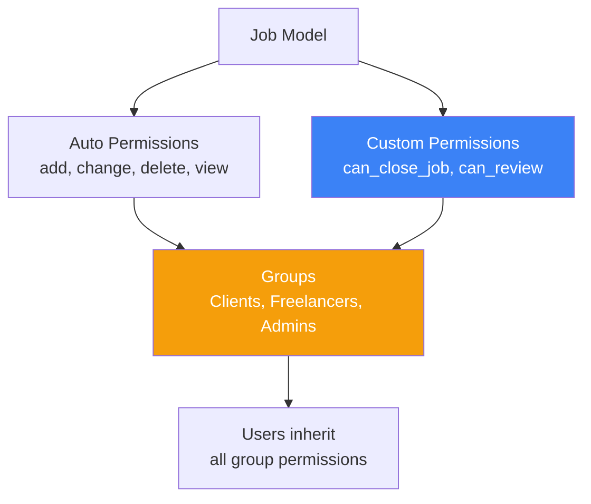
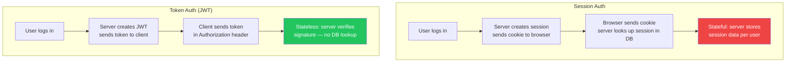

# الفصل العاشر — نظام الـ Authentication في Django: من الداخل

> **المتطلبات:** [[09-Django-Signals]] — لازم تكون فاهم الـ signals لأن الـ auth system بيعتمد عليها (مثلاً `user_logged_in` signal). كمان فهم الـ middleware مهم عشان تعرف إزاي `AuthenticationMiddleware` بيحمّل الـ user. الفصل ده هو الجسر بين Django Core و DRF — لأن كل API محتاج auth.

---

## البداية — ليه الـ Authentication مش مجرد "login page"

أي API محتاج يجاوب سؤالين: "مين أنت؟" (Authentication) و "تعمل إيه؟" (Authorization). Django عندها system كامل بيجاوب على الاتنين — بس كتير من الناس بتبني API من غير ما تفهم إزاي النظام ده بيشتغل من الداخل. والنتيجة: security holes، migrations مستحيلة، وauth مش بتشتغل صح مع DRF. الفصل ده بيفسرك الجذور عشان لما تبني الـ JWT auth في DRF تفهم كل طبقة.

---

## [[01-Built-In-User-Model]] — إيه اللي جوّا الـ User model الـ built-in

### 🧠 الشرح النظري

Django بتجيب User model جاهزة فيها كل اللي محتاجه في معظم الحالات: `username`, `password`, `email`, `first_name`, `last_name`, `is_active`, `is_staff`, `is_superuser`, و `last_login` / `date_joined`. بس المشكلة مش في إيه موجود — المشكلة في إيه **مش** موجود.

الـ built-in User مش فيه phone number، مش فيه bio، مش فيه profile picture، مش فيه role مخصص. وفي HireLink محتاجين كله: freelance rating، portfolio URL، skills list. لو استخدمت الـ built-in as-is، هتحتاج تعمل model تانية (UserProfile) مرتبطة بيه — وده حل بس مش الأنضف.

كمان الـ password في Django مش مخزنة كـ plain text — بيشتغل بـ **PBKDF2** (أو Argon2 لو انتاخب). لما user يعمل register، الـ password بيتحول لـ hash وبيتخزن. لما يعمل login، الـ password اللي بيكتبه بيتعمله hash وبيتقارن بالـ stored hash. ده بيمنع إن لو الـ DB اتسرقت — الـ passwords مش هتكون مفهومة.

### 📊 Visualization



### 💻 Micro-Example

```python
from django.contrib.auth.models import User

# Creating a user — password is hashed automatically
user = User.objects.create_user(username="khaled", email="k@hirelink.com", password="secret123")
print(user.password)   # pbkdf2_sha256$390000$... — hashed, never plain text

# Authentication — checks password hash, returns user or None
from django.contrib.auth import authenticate
user = authenticate(username="khaled", password="secret123")  # returns User or None

# The built-in flags
print(user.is_active)       # True — can log in
print(user.is_staff)        # False — can't access admin
print(user.is_superuser)    # False — no all-access pass
```

---

## [[02-AbstractUser-Vs-AbstractBaseUser]] — امتى تعمل Custom User Model وليه لازم من أول يوم

### 🧠 الشرح النظري

Django بتوفر اتنين base classes للـ custom user: **AbstractUser** و **AbstractBaseUser**. الفرق بينهم كبير ومهم.

**`AbstractUser`** — ده الـ User model الكامل بس abstract — يعني مش يتعمل له table لوحده. تقدر تورّث منه وتزود fields جديدة بس. كل الـ fields الأصلية (username, email, first_name, is_staff, الخ) موجودة. ده الخيار الصح لو بس عايز تزود fields على الـ User العادي — زي إضافة phone number أو bio. التغيير بسيط والـ migration سلسة.

**`AbstractBaseUser`** — ده الـ base class الأبسط: فيه بس `password` و `last_login`. مفيش username، مفيش email، مفيش is_staff — ولا حاجة. أنت اللي بتعرف كل حاجة: إيه الـ identifier (email بدل username؟)، إيه الـ required fields، وإزاي الـ authentication بيشتغل. ده الخيار لو عايز تبني user model جذري مختلف — مثلاً login بـ email بدل username.

**القاعدة الذهبية:** لازم تعمل Custom User Model من **أول يوم** في المشروع. ليه؟ لأن `AUTH_USER_MODEL` — اللي بتحدد إيه model يمثل الـ user — لو اتغير بعد ما تعمل migrations، الـ migration بيكون معقد جداً وممكن يكون مستحيل. Django نفسها بتقول in the docs: اعمله من الأول لأن التعديل بعدين "highly disruptive."

### 📊 Visualization

```mermaid
graph TD
    CHOICE["Custom User Model?"] -->|"Just add fields<br/>to existing User"| AU["AbstractUser<br/>username, email, is_staff...<br/>+ your custom fields"]
    CHOICE |> "Radical change:<br/>email as login,<br/>different structure" => ABU["AbstractBaseUser<br/>only password + last_login<br/>you define EVERYTHING"]
    AU --> EASY["✅ Easy migration<br/>most common choice"]
    ABU --> COMPLEX["⚠️ More work<br/>need custom UserManager"]
    style AU fill:#22c55e,color:#fff
    style ABU fill:#f59e0b,color:#fff
```

### 💻 Micro-Example

```python
# Option 1: AbstractUser — add fields, keep existing structure
from django.contrib.auth.models import AbstractUser

class CustomUser(AbstractUser):              # inherits username, email, is_staff...
    phone = models.CharField(max_length=20, blank=True)
    bio = models.TextField(blank=True)
    avatar = models.ImageField(upload_to="avatars/", blank=True)

# Option 2: AbstractBaseUser — build from scratch, email as login
from django.contrib.auth.models import AbstractBaseUser, BaseUserManager, PermissionsMixin

class UserManager(BaseUserManager):
    def create_user(self, email, password=None, **extra_fields):
        if not email:
            raise ValueError("Email is required")
        user = self.model(email=self.normalize_email(email), **extra_fields)
        user.set_password(password)          # hash the password
        user.save(using=self._db)
        return user

class CustomUser(AbstractBaseUser, PermissionsMixin):
    email = models.EmailField(unique=True)   # email is the login field now
    is_active = models.BooleanField(default=True)
    is_staff = models.BooleanField(default=False)

    objects = UserManager()                   # custom manager required
    USERNAME_FIELD = "email"                  # login by email, not username
    REQUIRED_FIELDS = []                       # email already required
```

---

## [[03-Auth-User-Model-Setting]] — الـ `AUTH_USER_MODEL`: ليه التعديل بعدين كابسة

### 🧠 الشرح النظري

الـ `AUTH_USER_MODEL = "users.CustomUser"` هو setting اللي بيقول لـ Django: "الـ User model مش الـ built-in — استخدم الـ custom بتاعي." كل reference لـ User في Django (ForeignKeys، sessions، permissions) بيشتغل بناءً على الـ setting ده.

المشكلة: لو بدأت مشروع بـ built-in User وبعدين حبيت تغير لـ custom — الـ migration بيكون كابسة لأن: (1) كل ForeignKey بيشير لـ `auth_user` لازم يتحول لـ `users_customuser`، (2) الـ sessions والـ permissions مرتبطين بـ الـ table القديم، (3) الـ admin والـ commands بتاعت الـ auth بتعتمد على الـ model الصحيح.

Django بتقدم طريقة `SWAP` للـ migration بس هي محفوفة بالمخاطر ومش بتشتغل في كل الحالات. عشان كده الـ best practice واضح: حط `AUTH_USER_MODEL` من أول `startproject` — حتى لو مش متأكد إيه الـ custom fields — لأنك تقدر تزود fields بعدين بسهولة بس مش تقدر تغير الـ model نفسه.

### 📊 Visualization



### 💻 Micro-Example

```python
# settings.py — ALWAYS set this from day one
AUTH_USER_MODEL = "users.CustomUser"

# ❌ Never do this inForeignKey — references built-in User, breaks if model changes
from django.contrib.auth.models import User
class Job(models.Model):
    client = models.ForeignKey(User, on_delete=models.CASCADE)  # ❌

# ✅ Always use settings.AUTH_USER_MODEL — works with any user model
from django.conf import settings
class Job(models.Model):
    client = models.ForeignKey(settings.AUTH_USER_MODEL, on_delete=models.CASCADE)  # ✅

# ✅ Or use get_user_model() in code (not in migrations)
from django.contrib.auth import get_user_model
User = get_user_model()  # resolves to CustomUser at runtime
```

---

## [[04-Permissions-And-Groups]] — الـ Authorization: مين يقدر يعمل إيه

### 🧠 الشرح النظري

الـ Authentication بتقول "مين أنت" — الـ Authorization بتقول "تقدر تعمل إيه." Django عندها نظام permissions كامل بيشتغل تلقائياً مع كل model.

لما بتكتب `class Job(models.Model)`، Django بتعمل 4 permissions تلقائياً: `add_job` (إنشاء)، `change_job` (تعديل)، `delete_job` (حذف)، `view_job` (عرض). كل permission بيتسجل في الـ database وبترجع من `user.has_perm("jobs.add_job")`.

الـ **Groups** هم طريقة لتنظيم permissions — بدل ما تدي نفس الـ permissions لكل user لوحده، بتعمل group (زي "Editors" أو "Clients") وبتديه permissions، وبعدين تضيف users لـ group. الـ user بيرث كل permissions بتاعة كل groups اللي هو فيها. ده بيسهل إدارة الـ roles كتير.

كمان تقدر تعمل **Custom Permissions** في الـ model Meta class — زي `can_close_job` أو `can_review` اللي مش بتتعمل تلقائياً. وده مفيد جداً في HireLink: صاحب الـ job بس يقدر يغلقه، والـ freelancer بس يقدر يعمل apply.

### 📊 Visualization



### 💻 Micro-Example

```python
class Job(models.Model):
    title = models.CharField(max_length=200)

    class Meta:
        permissions = [                              # custom permissions
            ("can_close_job", "Can close a posted job"),
            ("can_feature", "Can feature a job on homepage"),
        ]

# Using permissions in views
from django.contrib.auth.decorators import permission_required

@permission_required("jobs.can_close_job", raise_exception=True)
def close_job(request, pk):
    job = get_object_or_404(Job, pk=pk)
    job.is_active = False
    job.save()

# Checking permissions in code
if request.user.has_perm("jobs.can_close_job"):
    job.is_active = False
    job.save()
```

---

## [[05-Session-Vs-Token-Auth]] — المقارنة الكاملة: إيه أحسن للـ API؟

### 🧠 الشرح النظري

الـ Django auth الـ built-in بيشتغل بـ **Sessions**: user بيعمل login، السيرفر بيعمل session object ويخزنه في DB ويبعت cookie للمتصفح. في أي request بعده، الـ cookie بيتقرأ والـ session بتتحمل. ده ممتاز للـ web pages بس مش للـ APIs.

**Session Auth مش مناسب للـ APIs لـ 3 أسباب:** (1) الـ API مش بيشتغل في browser — مش فيه cookies. (2) الـ session مرتبط بـ domain واحد — مش هيشتغل لو الـ frontend على domain تاني (CORS مشكلة). (3) الـ session stateful — السيرفر لازم يتذكر كل session وده مش scalable.

**Token Auth** — الـ client بيبعت token في كل request (عادةً في `Authorization` header). الـ token ده self-contained — فيه كل البيانات اللي السيرفر محتاجها من غير ما يبحث في DB. ده stateless: السيرفر مش لازم يتذكر حاجة — يتحقق من الـ token وبس.

**JWT (JSON Web Token)** — هو الـ token type الأشهر في الـ modern APIs. بيتكون من 3 أجزاء: Header (الخوارزمية)، Payload (الـ data — user ID, roles, expiry)، Signature (التوقيع اللي بيضمن إن الـ token مش اتعدّل). ده اللي هنبنيه في DRF في Phase 3.

### 📊 Visualization



### 💻 Micro-Example

```python
# Session Auth — Django's built-in (good for web, bad for API)
from django.contrib.auth import login, authenticate

def login_view(request):
    user = authenticate(request, username="khaled", password="secret")
    if user:
        login(request, user)              # creates session, sends cookie
        # request.session holds user data, cookie sent to browser

# Token Auth — DRF style (good for API, stateless)
from rest_framework.authtoken.models import Token

def api_login(request):
    user = authenticate(request, username="khaled", password="secret")
    if user:
        token, created = Token.objects.get_or_create(user=user)
        return JsonResponse({"token": token.key})  # client stores this
        # no session, no cookie — client sends token in header every time

# JWT Auth — modern DRF (best for API, self-contained)
# Will cover in detail in Chapter 14 — DRF Authentication & JWT
# token = {"alg": "HS256", "typ": "JWT"}.{"user_id": 1, "exp": 1234567890}.signature
```

---

## 🎯 أسئلة الإنترفيو

**س: إيه الفرق بين `AbstractUser` و `AbstractBaseUser` وإمتى تستخدم كل واحد؟**

> **`AbstractUser`:** فيه كل الـ built-in fields (username, email, is_staff...). بتورّث منه وتزود fields بس. مناسب لو عايز تضيف phone أو bio على الـ User العادي. التغيير بسيط والـ migration سلسة.<br/><br/>
> **`AbstractBaseUser`:** فيه بس `password` و `last_login`. أنت بتعرف كل حاجة: الـ login field (email؟)، الـ required fields، والـ UserManager. مناسب لو عايز login بـ email بدل username أو تبني user model جذري مختلف.<br/><br/>
> **القاعدة:** لو بس تزود fields → `AbstractUser`. لو تبدّل الـ authentication logic بالكامل → `AbstractBaseUser`.

---

**س: ليه لازم تعمل Custom User Model من أول يوم في المشروع؟**

> لأن `AUTH_USER_MODEL` لو اتغير بعد ما الـ migrations اتعملت، الـ migration بيكون **highly disruptive**: كل ForeignKey بيشير لـ `auth_user` لازم يتحول، الـ sessions والـ permissions مرتبطين بـ الـ table القديم، والـ data migration معقدة.<br/><br/>
> لو عملته من الأول — كل حاجة بتتبني على الـ custom model من البداية ومفيش migration problems. حتى لو مش متأكد إيه الـ custom fields — خليه `AbstractUser` فاضي وعدّله بعدين. إضافة fields سهلة، تبديل model كله مش سهل.

---

**س: إيه الفرق بين Session Auth و Token Auth وإيه أحسن للـ API؟**

> **Session Auth:** stateful — السيرفر بيخزن session في DB وبعت cookie. مناسب للـ web pages (browser). مش مناسب للـ APIs لأن: (1) مفيش cookies في API calls، (2) مش بيشتغل cross-domain (CORS)، (3) مش scalable عشان stateful.<br/><br/>
> **Token Auth:** stateless — client بيبعت token في header، السيرور بيتحقق منه من غير DB lookup. مناسب للـ APIs: بيشتغل من أي client، cross-domain مش مشكلة، وstateless يعني scalable.<br/><br/>
> **JWT:** هو الـ token standard الأشهر — self-contained فيه البيانات وموقع رقمياً. ده الـ standard للـ modern APIs.

---

**س: إزاي تتعامل مع الـ User ForeignKeys في models عشان متكسرش لو الـ User Model اتغير؟**

> **❌ لا تستورد:** `from django.contrib.auth.models import User` و `ForeignKey(User)` — ده بيhard-code الـ built-in model وبيكسر لو الـ AUTH_USER_MODEL اتغير.<br/><br/>
> **✅ في models.py:** استخدم `settings.AUTH_USER_MODEL` كـ string — `ForeignKey(settings.AUTH_USER_MODEL, ...)`. ده بيتحمله وقت الـ migration وبيشتغل مع أي user model.<br/><br/>
> **✅ في Python code:** استخدم `get_user_model()` — بترجع الـ active user model class في الـ runtime.

---

## 📝 خلاصة الدرس

- **Built-in User:** فيه username, email, is_staff, hashed password — بس مفيش custom fields (phone, bio, role, skills).
- **AbstractUser vs AbstractBaseUser:** AbstractUser = add fields only (سهل). AbstractBaseUser = rebuild from scratch (قوي بس محتاج Custom UserManager).
- **AUTH_USER_MODEL:** لازم يتحدد من أول يوم. التعديل بعد migrations = كابسة. استخدم `settings.AUTH_USER_MODEL` في ForeignKey مش `User` مباشرةً.
- **Permissions:** Django بتعمل 4 auto permissions لكل model + تقدر تضيف custom permissions في Meta. Groups بتنظم permissions لـ users كتير.
- **Session vs Token Auth:** Sessions = stateful, cookies, للـ web. Tokens = stateless, headers, للـ APIs. JWT = الـ modern standard اللي هنبنيه في DRF Phase 3.

---

*Next → [[11-DRF-Fundamentals]] — Phase 2 خلصت! 🎉 دلوقتي ندخل في Phase 3 — DRF Mastery. إزاي DRF بيختلف عن Django العادية، إزاي الـ API request بيتعالج، وإيه الـ layer اللي DRF بيضيفه فوق Django — ده بداية بناء الـ API الحديثة.*