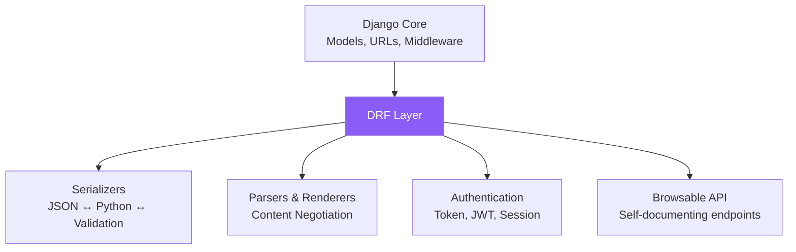
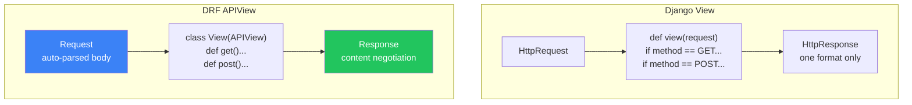
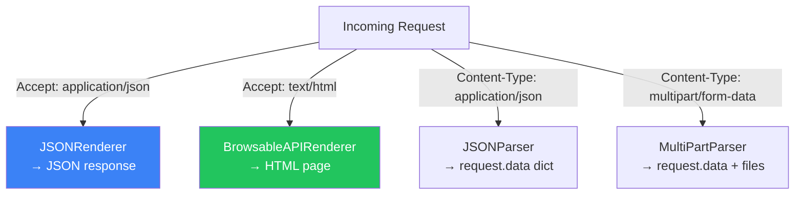
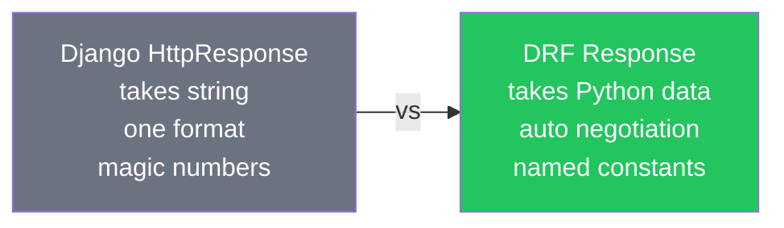
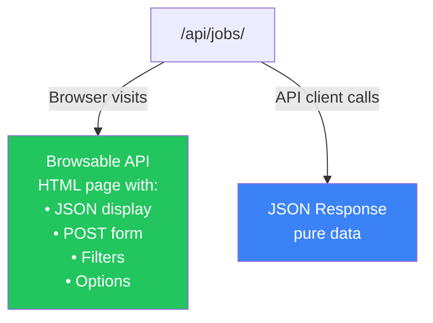

# الفصل الحادي عشر — DRF: إيه وليه وإزاي يختلف عن Django العادية

> **المتطلبات:** [[10-Django-Authentication-System]] — لازم تكون فاهم الـ Session vs Token auth لأن DRF مبني على الـ token-based authentication. كمان فهم الـ MVT والـ middleware بيساعدك تفهم إزاي DRF بيضيف layer فوق Django.

---

## البداية — Django بتعمل web pages، بس إزاي تعمل API؟

Django أصلاً مصممة لـ HTML responses — الـ View بيرجع rendered template. بس الـ modern applications مش بتتعامل مع HTML — بتتعامل مع JSON. Frontend frameworks (Angular, React, Vue) بتتكلم مع الـ backend عبر APIs. الـ mobile apps بتتكلم مع الـ backend عبر APIs. حتى الـ IoT devices بتتكلم عبر APIs.

تكتب API بـ Django العادي ممكن — بس محتاج تعمل كل حاجة بإيدك: parse JSON input، validate data، return JSON responses، handle authentication tokens، format error messages. كل ده boilerplate يتكرر في كل endpoint. DRF بيختصر الكلام: بياخد Django وبيحوله لـ API machine — وكل اللي كنت تعمله بإيدك بيبقى built-in.

---

## [[01-What-DRF-Adds]] — التشريح الكامل: إيه اللي DRF بيضيفه فوق Django

### 🧠 الشرح النظري

Django REST Framework مش framework منفصل — هو **layer** فوق Django. بيستخدم نفس الـ models، نفس الـ URL routing، نفس الـ middleware — بس بيضيف حاجات مخصصة لـ API development.

**الـ Serializers** — بدل ما تكتب JSON parsing و validation بإيدك، الـ serializer بيعمل ده كله: بياخد JSON ويحوله لـ Python object (deserialization)، وبياخد Python object ويحوله لـ JSON (serialization). وبيعمل validation في النص — لو الـ data غلط بيرجع errors منسقة.

**الـ Parsers و Renderers** — بدل ما تكتب `json.loads(request.body)`، DRF بيتعامل مع أي format: JSON, Form Data, MultiPart. وبدل ما تكتب `JsonResponse(data)`, DRF بيتعامل مع content negotiation — بيعمل render للـ response بناءً على الـ `Accept` header.

**الـ Authentication classes** — بدل ما تكتب token verification بإيدك، DRF بيديك system كامل: Session Auth, Token Auth, JWT Auth — وكلهم plug-and-play.

**الـ Browsable API** — ده حاجة DRF فريدة: كل endpoint بيبقى ليه صفحة HTML تقدر تزورها في الـ browser وتشوف الـ data وتبعت requests وتشوف الـ responses. مش مجرد أداة debugging — ده بيخلي الـ API self-documenting بشكل تلقائي.

### 📊 Visualization



### 💻 Micro-Example

```python
# Without DRF — manual JSON API in Django
def job_list(request):
    if request.method == "GET":
        jobs = Job.objects.all()
        data = [{"title": j.title, "budget": str(j.budget)} for j in jobs]
        return JsonResponse(data, safe=False)
    elif request.method == "POST":
        import json
        data = json.loads(request.body)
        # manual validation... manual error handling... manual serialization...
        job = Job.objects.create(**data)
        return JsonResponse({"id": job.id, "title": job.title}, status=201)

# With DRF — same functionality, clean and declarative
class JobListView(APIView):
    def get(self, request):
        jobs = Job.objects.all()
        serializer = JobSerializer(jobs, many=True)    # auto serialization
        return Response(serializer.data)                # auto content negotiation

    def post(self, request):
        serializer = JobSerializer(data=request.data)   # auto parsing + validation
        if serializer.is_valid():
            serializer.save()                           # auto create
            return Response(serializer.data, status=201)
        return Response(serializer.errors, status=400)  # auto error formatting
```

---

## [[02-APIView-Vs-Django-View]] — الـ الفرق الحقيقي مش بس الاسم

### 🧠 الشرح النظري

الـ `APIView` هو الـ building block الأساسي في DRF. هو بيورّث من Django's `View` بس بيضيف DRF-specific behavior. الفرق الجوهري مش في الـ class name — ده في اللي بيحصل قبل وبعد الـ view يشتغل.

الـ Django `View` بياخد `HttpRequest` ويرجع `HttpResponse`. مفيش parsing، مفيش content negotiation، مفيش authentication — لازم تعمل كله بإيدك.

الـ DRF `APIView` بياخد DRF's `Request` (مش Django's HttpRequest) ويرجع DRF's `Response` (مش Django's HttpResponse). الـ DRF Request بيعمل parsing تلقائي للـ body — `request.data` بيشتغل مع JSON و Form Data و MultiPart من غير ما تكتب حاجة. الـ DRF Response بيعمل content negotiation تلقائي — لو الـ client طلب JSON بيرجع JSON، لو طلب HTML بيرجع الـ Browsable API.

كمان الـ `APIView` بيشتغل بالـ class methods (`get`, `post`, `put`, `delete`) بدل ما تحط `if request.method == "GET"` جوّا function واحدة. ده أوضح وأسهل في الـ maintenance — كل HTTP method ليه method خاصة بيه.

### 📊 Visualization



### 💻 Micro-Example

```python
from rest_framework.views import APIView
from rest_framework.response import Response
from rest_framework import status

class JobDetailView(APIView):
    def get(self, request, pk):                         # handles GET
        job = get_object_or_404(Job, pk=pk)
        serializer = JobSerializer(job)
        return Response(serializer.data)                # auto content negotiation

    def put(self, request, pk):                         # handles PUT
        job = get_object_or_404(Job, pk=pk)
        serializer = JobSerializer(job, data=request.data)  # request.data = auto-parsed
        if serializer.is_valid():
            serializer.save()
            return Response(serializer.data)
        return Response(serializer.errors, status=status.HTTP_400_BAD_REQUEST)

    def delete(self, request, pk):                      # handles DELETE
        job = get_object_or_404(Job, pk=pk)
        job.delete()
        return Response(status=status.HTTP_204_NO_CONTENT)
```

---

## [[03-Content-Negotiation]] — إزاي الـ API بيقرر يرد بـ JSON أو HTML

### 🧠 الشرح النظري

الـ Content Negotiation هو mechanism اللي بيخلي نفس الـ endpoint يرد بـ formats مختلفة بناءً على ما الـ client طلب. الـ client بيقول "أنا عايز JSON" عن طريق الـ `Accept: application/json` header، أو "أنا عايز HTML" عن طريق `Accept: text/html`.

لما DRF `Response` يتعمل، DRF بتشوف الـ `Accept` header وبتختار الـ renderer المناسب. لو الـ Accept = JSON → بتستخدم `JSONRenderer` وترجع JSON. لو الـ Accept = HTML → بتستخدم `BrowsableAPIRenderer` وترجع صفحة HTML جميلة فيها الـ data وforms للـ testing.

ده مش مجرد حلو — ده عملي. الـ Browsable API بيخليك تقدر تزور أي endpoint في الـ browser وتشوف الـ response وتبعت POST requests من form جاهز. وده بيختصر وقت الـ development بكتير — مش محتاج Postman لكل endpoint. بس في الـ production، ممكن تشيل الـ Browsable API عشان تقلل الـ attack surface.

كمان على الـ input side، الـ DRF بيشتغل بـ **Parsers**. لو الـ `Content-Type: application/json` → `JSONParser`. لو `multipart/form-data` → `MultiPartParser`. الـ `request.data` بتتعامل مع كل دول تلقائياً — مش محتاج تكتب `json.loads()` أبداً.

### 📊 Visualization



### 💻 Micro-Example

```python
# settings.py — configure renderers and parsers globally
REST_FRAMEWORK = {
    "DEFAULT_RENDERER_CLASSES": [
        "rest_framework.renderers.JSONRenderer",             # always available
        "rest_framework.renderers.BrowsableAPIRenderer",      # HTML in browser
    ],
    "DEFAULT_PARSER_CLASSES": [
        "rest_framework.parsers.JSONParser",                   # parse JSON bodies
        "rest_framework.parsers.FormParser",                    # parse form data
        "rest_framework.parsers.MultiPartParser",              # parse file uploads
    ],
}

# In a view — you can also override per-view
class JobListView(APIView):
    renderer_classes = [JSONRenderer]        # this endpoint only returns JSON
    parser_classes = [JSONParser]             # this endpoint only accepts JSON
```

---

## [[04-Response-Object]] — الـ DRF Response vs Django HttpResponse

### 🧠 الشرح النظري

الـ Django `HttpResponse` بياخد string وبيبعتها. لو عايز تبعت JSON — لازم تعمل `JsonResponse` أو تعمل `json.dumps()` بإيدك. ولو عايز تبعت status code — لازم تحطها كـ number.

الـ DRF `Response` مختلف. بياخد **Python data** (dict, list, serializer.data) مش string. وبيعمل عليها content negotiation تلقائي — لو الـ client طلب JSON بيرجع JSON، لو طلب HTML بيرجع HTML. كمان بيتعامل مع الـ status codes كـ **named constants** من الـ `status` module — مش magic numbers.

الـ `status` module في DRF بيديك constants واضحة: `HTTP_200_OK`, `HTTP_201_CREATED`, `HTTP_400_BAD_REQUEST`, `HTTP_401_UNAUTHORIZED`, `HTTP_403_FORBIDDEN`, `HTTP_404_NOT_FOUND`. ده أوضح بكتير من كتابة `status=201` — لأن 201 ممكن يكون أي حاجة، بس `HTTP_201_CREATED` بيقول بالظبط إيه اللي حصل.

### 📊 Visualization



### 💻 Micro-Example

```python
from rest_framework.response import Response
from rest_framework import status

# ❌ Django way — manual JSON, magic numbers
from django.http import JsonResponse
def create_job(request):
    job = Job.objects.create(title="Dev", budget=5000)
    return JsonResponse({"id": job.id}, status=201)       # what does 201 mean?

# ✅ DRF way — data objects, named constants
def create_job(request):
    serializer = JobSerializer(data=request.data)
    serializer.is_valid(raise_exception=True)              # auto 400 on bad data
    serializer.save()
    return Response(serializer.data, status=status.HTTP_201_CREATED)  # crystal clear

# Common DRF status codes you'll use daily:
# status.HTTP_200_OK                  → successful GET/PUT
# status.HTTP_201_CREATED            → successful POST
# status.HTTP_204_NO_CONTENT         → successful DELETE
# status.HTTP_400_BAD_REQUEST        → validation error
# status.HTTP_401_UNAUTHORIZED       → not logged in
# status.HTTP_403_FORBIDDEN          → no permission
# status.HTTP_404_NOT_FOUND          → object doesn't exist
```

---

## [[05-Browsable-API]] — الـ Browsable API: أفضل debugging tool مفيش

### 🧠 الشرح النظري

أي endpoint بتكتبه في DRF بيبقى ليه صفحة HTML تلقائية تقدر تزورها في الـ browser. الـ صفحة دي بتعرض الـ JSON data، بتديك form تبعت بيها POST requests، وبتوريك الـ allowed methods والـ serializer fields. ده الـ **Browsable API** — وده feature فريدة لـ DRF مش موجودة في أي Python API framework تاني.

الـ Browsable API مفيد في الـ development لأنك: (1) تقدر تزور endpoint في Chrome وتشوف الـ response من غير Postman، (2) تقدر تبعت POST/PUT requests من form جاهز، (3) تشوف validation errors بالون الأحمر، (4) تتنقل بين endpoints بالـ hyperlinks.

في الـ production، بعض الناس بيختاروا يشيلوه عشان: (1) بيقلل الـ attack surface — محدش لازم يشوف الـ API structure، (2) بيقلل الـ response size شوية (HTML overhead). بس ده مش خطر أمني حقيقي — الـ API endpoint شغال سواء HTML أو JSON. الـ decision يعتمد على الـ team preference.

### 📊 Visualization



### 💻 Micro-Example

```python
# Development: keep Browsable API for easy testing
REST_FRAMEWORK = {
    "DEFAULT_RENDERER_CLASSES": [
        "rest_framework.renderers.JSONRenderer",
        "rest_framework.renderers.BrowsableAPIRenderer",   # keep in dev
    ],
}

# Production: remove Browsable API (optional, not required)
# REST_FRAMEWORK = {
#     "DEFAULT_RENDERER_CLASSES": [
#         "rest_framework.renderers.JSONRenderer",          # JSON only
#     ],
# }

# You can also control per-view
class JobListView(APIView):
    renderer_classes = [JSONRenderer, BrowsableAPIRenderer]  # both available
```

---

## 🎯 أسئلة الإنترفيو

**س: إيه اللي DRF بيضيفه فوق Django وليه مش تكتب API بـ Django العادي؟**

> DRF بيضيف 5 حاجات أساسية:<br/><br/>
> **1. Serializers** — parsing و validation و conversion بين JSON و Python objects تلقائياً.<br/>
> **2. Parsers & Renderers** — content negotiation: JSON, Form Data, MultiPart على الـ input و JSON, HTML على الـ output.<br/>
> **3. Authentication classes** — Token Auth, JWT, Session — plug-and-play مش manual.<br/>
> **4. ViewSets & Routers** — CRUD كامل في سطور قليلة بدل ما تكتب كل method بإيدك.<br/>
> **5. Browsable API** — صفحات HTML تلقائية للـ debugging من غير Postman.<br/><br/>
> ممكن تكتب API بـ Django بس — بس هتعمل كل ده manual boilerplate في كل endpoint.

---

**س: إيه الفرق بين `APIView` و Django `View`؟**

> **Django `View`:** بياخد `HttpRequest`، بيرجع `HttpResponse`. مفيش auto-parsing — لازم `json.loads()`. مفيش content negotiation — format واحد. الـ method handling بـ `if request.method == "GET"`.<br/><br/>
> **DRF `APIView`:** بياخد DRF `Request` (auto-parsed `request.data`)، بيرجع DRF `Response` (auto content negotiation). الـ method handling بـ class methods: `def get()`, `def post()`. كمان بيشتغل بالـ authentication, permission, throttle classes تلقائياً.

---

**س: إيه هو الـ Content Negotiation في DRF؟**

> الـ Content Negotiation هو mechanism اللي بيخلي نفس الـ endpoint يرد بـ formats مختلفة بناءً على طلب الـ client.<br/><br/>
> **Output side:** الـ `Accept` header بيحدد الـ renderer. `application/json` → JSONRenderer. `text/html` → BrowsableAPIRenderer.<br/>
> **Input side:** الـ `Content-Type` header بيحدد الـ parser. `application/json` → JSONParser. `multipart/form-data` → MultiPartParser.<br/><br/>
> الـ DRF `Response` و `request.data` بيتعاملوا مع ده تلقائياً — مش محتاج تكتب أي parsing أو rendering code.

---

**س: ليه `status.HTTP_201_CREATED` أفضل من `status=201`؟**

> الـ named constant أوضح بكتير من الـ magic number. `201` ممكن يكون أي حاجة لحد ما تفتكر — بس `HTTP_201_CREATED` بيقول بالظبط إيه اللي حصل: "resource اتنشأ بنجاح."<br/><br/>
> ده مش بس readability — ده كمان type safety و IDE support. لما بتكتب `status.HTTP_` وبعدين tab — الـ IDE بيوريك كل الـ options. ولو غلطت في number مفيش حد هيقولك. بس named constant لو غلطته الـ IDE هيشيله خط أحمر.

---

## 📝 خلاصة الدرس

- **DRF = Layer فوق Django:** مش framework منفصل. بيستخدم نفس الـ models و URLs و middleware — بس بيضيف API-specific tools.
- **Serializers:** المترجم بين JSON و Python — parsing + validation + conversion تلقائي.
- **APIView vs View:** DRF Request = auto-parsed data. DRF Response = auto content negotiation. Method handling = class methods مش if chains.
- **Content Negotiation:** Accept header → renderer selection. Content-Type → parser selection. DRF بيتعامل مع ده تلقائياً.
- **DRF Response:** بياخد Python data مش string. Named status constants (`HTTP_201_CREATED`) أوضح من magic numbers.
- **Browsable API:** صفحة HTML تلقائية لكل endpoint — مفيدة في dev، ممكن تشيلها في prod.

---

*Next → [[12-DRF-Serializers-Deep-Dive]] — دلوقتي ندخل في أهم جزء في DRF: الـ Serializers. من الداخل، إزاي بيتحققوا من البيانات، إيه الفرق بين Serializer و ModelSerializer، وإزاي تبني validation logic قوي.*