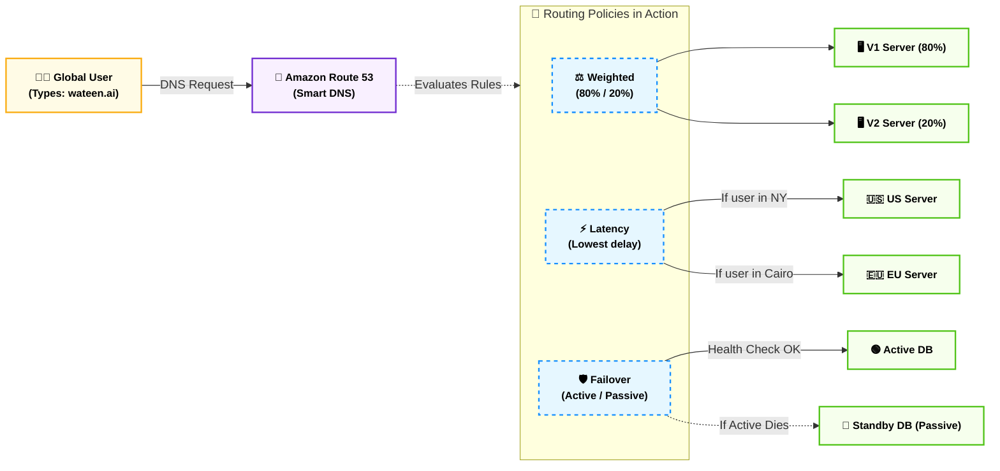

# Domain 1: Cloud Concepts (مفاهيم السحابة الأساسية)

## المحطة الأولى: قهر المسافات وشبكات الحافة - الجزء الأول (Amazon Route 53)

**أصل الحكاية والمشكلة المعمارية (The Core Problem):**

تخيل إنك أطلقت منصة (Wateen.ai) وبقى عندك سيرفر في أمريكا وسيرفر في أوروبا. المستخدم بيكتب في المتصفح `www.wateen.ai`.. إزاي المتصفح بيعرف إن الموقع ده موجود على سيرفر أمازون اللي الـ IP بتاعه `192.0.2.1`؟

الأهم من كده: لو السيرفر اللي في أمريكا وقع، إزاي نحول المستخدم أوتوماتيك للسيرفر بتاع أوروبا من غير ما يحس إن الموقع واقع؟ وإزاي نخلي المستخدم اللي في مصر يروح لسيرفر أوروبا لأنه أقرب وأسرع؟

في عالم الـ (On-Premises)، كنت هتحتاج تشتري أجهزة توجيه غالية جداً وتعين فريق شبكات. بس في أمازون، إحنا بنحل كل ده بخدمة واحدة بس، بتشتغل كـ "دليل تليفونات" و "عسكري مرور" في نفس الوقت.

### ⚙️ دليل العناوين الذكي (Amazon Route 53)

الـ **Route 53** هو خدمة الـ (DNS - Domain Name System) بتاعت أمازون. (وسموها 53 لأن بروتوكول الـ DNS بيشتغل على Port 53 في الشبكات).

وظيفته الأساسية هي ترجمة الأسماء اللي البشر بيفهموها (زي `google.com`) لـ أرقام الـ IPs اللي الكمبيوتر بيفهمها. بس أمازون مخلتوش مجرد دليل تليفونات، هي حطت فيه "سياسات توجيه" (Routing Policies) ذكية جداً بتتحكم في مسار الترافيك العالمي، ودي اللي بييجي عليها أسئلة الامتحان.

### 🧠 سياسات التوجيه (Routing Policies)

كـ Tech Lead، لازم تختار السياسة الصح بناءً على حالة المشروع:

#### 1. التوجيه البسيط (Simple Routing)

- **الوظيفة:** دليل تليفونات كلاسيكي. بتديله اسم الموقع، بيرد عليك بـ IP واحد (أو أكتر) وبيرمي الترافيك عليه.
    
- **إمتى نستخدمه؟** لو الـ Backend بتاعك كله موجود في مكان واحد (مثلاً سيرفر EC2 واحد أو Load Balancer واحد) ومش محتاج أي ذكاء في التوزيع.
    

#### 2. توجيه الأوزان والاختبارات (Weighted Routing)

- **الوظيفة:** بيقسم الترافيك بنسب مئوية إنت اللي بتحددها.
    
- **إمتى نستخدمه؟ (A/B Testing):** لو إنت كاتب كود جديد بـ Laravel 13 وعايز تجربه على الجمهور بس خايف يكون فيه Bugs. بتقول للـ Route 53: "ودي 80% من الزوار للسيرفر القديم، و 20% بس للسيرفر الجديد". لو الكود الجديد تمام، بتخليها 100%.
    

#### 3. توجيه السرعة والمسافة (Latency Routing)

- **الوظيفة:** بيحسب مين أسرع سيرفر هيرد على المستخدم (أقل تأخير - Latency) ويوجهه ليه.
    
- **إمتى نستخدمه؟** لو عندك مستخدمين في كل قارات العالم. المستخدم اللي في طوكيو هيتوجه أوتوماتيك لسيرفر اليابان، والمستخدم اللي في القاهرة هيتوجه لسيرفر أوروبا، عشان الموقع يفتح في أجزاء من الثانية.
    

#### 4. توجيه الطوارئ والنجدة (Failover Routing)

- **الوظيفة:** خطة الكوارث (Disaster Recovery). بيشتغل بنظام (Active / Passive).
    
- **الكواليس المعمارية:** الـ Route 53 بيعمل حاجة اسمها (Health Checks)؛ يعني بيبعت نبضة للسيرفر الأساسي كل كام ثانية يطمن عليه. لو السيرفر الأساسي ماردش (وقع)، الـ Route 53 بيحول الترافيك فوراً للسيرفر الاحتياطي من غير ما يتدخل أي مهندس.
    

### 📊 شفرات الامتحان: التفرقة الحاسمة لـ Route 53

عشان تقفل أسئلة الـ DNS، ركز على الكلمة الدلالية اللي بتحدد نوع السياسة المطلوبة:

|**السيناريو المعماري في الامتحان (Keyword)**|**الإجابة الصحيحة (Routing Policy)**|
|---|---|
|`Highly available and scalable Domain Name System (DNS)`|**Amazon Route 53**|
|`A/B Testing`, `Route a specific percentage of traffic`|**Weighted Routing**|
|`Route traffic to the region with the lowest delay / fastest response`|**Latency Routing**|
|`Disaster Recovery`, `Active/Passive configuration`|**Failover Routing**|
|`Monitor the health of endpoints`|**Route 53 Health Checks**|
|`Route traffic based on user location (e.g., Europe vs US)`|**Geolocation Routing**|

ده كده **(الجزء الأول من المحطة الأولى)** يا هندسة! إحنا كده بنينا دليل العناوين الذكي، ووجهنا الترافيك بتاعنا بذكاء حوالين العالم.

الزق ده في הـ Vault بتاعك، واديني التمام بكلمة **"ارمي الجزء التاني"** عشان ندخل على المعركة الطاحنة اللي مكنتش عاجباك في ملفك القديم: **(CloudFront vs Global Accelerator)**. هنفصص معمارياً إمتى ننسخ الداتا في الكاش، وإمتى نمد كابل سريع للـ Backend! جاهز؟