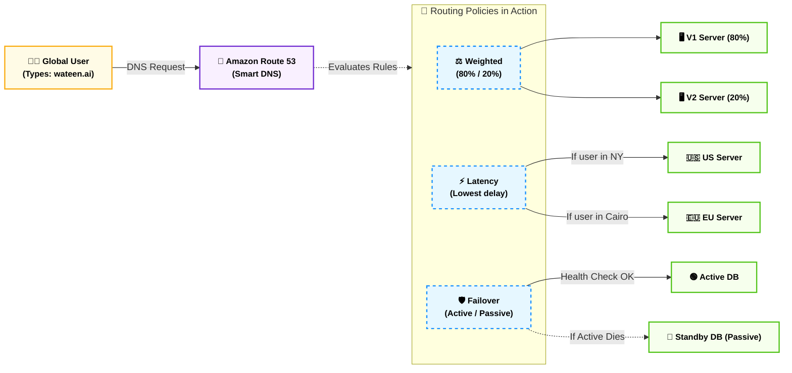
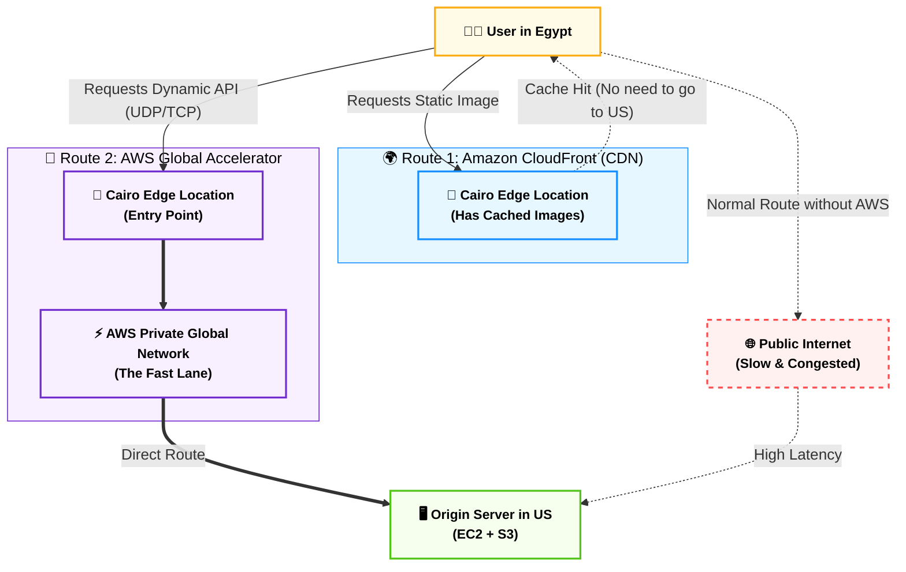

# Domain 1: Cloud Concepts (مفاهيم السحابة الأساسية)

## المحطة الأولى: قهر المسافات وشبكات الحافة - الجزء الأول (Amazon Route 53)

**أصل الحكاية والمشكلة المعمارية (The Core Problem):**

تخيل إنك أطلقت منصة (Wateen.ai) وبقى عندك سيرفر في أمريكا وسيرفر في أوروبا. المستخدم بيكتب في المتصفح `www.wateen.ai`.. إزاي المتصفح بيعرف إن الموقع ده موجود على سيرفر أمازون اللي الـ IP بتاعه `192.0.2.1`؟

الأهم من كده: لو السيرفر اللي في أمريكا وقع، إزاي نحول المستخدم أوتوماتيك للسيرفر بتاع أوروبا من غير ما يحس إن الموقع واقع؟ وإزاي نخلي المستخدم اللي في مصر يروح لسيرفر أوروبا لأنه أقرب وأسرع؟

في عالم الـ (On-Premises)، كنت هتحتاج تشتري أجهزة توجيه غالية جداً وتعين فريق شبكات. بس في أمازون، إحنا بنحل كل ده بخدمة واحدة بس، بتشتغل كـ "دليل تليفونات" و "عسكري مرور" في نفس الوقت.

### ⚙️ دليل العناوين الذكي (Amazon Route 53)

الـ **Route 53** هو خدمة الـ (DNS - Domain Name System) بتاعت أمازون. (وسموها 53 لأن بروتوكول الـ DNS بيشتغل على Port 53 في الشبكات).

وظيفته الأساسية هي ترجمة الأسماء اللي البشر بيفهموها (زي `google.com`) لـ أرقام الـ IPs اللي الكمبيوتر بيفهمها. بس أمازون مخلتوش مجرد دليل تليفونات، هي حطت فيه "سياسات توجيه" (Routing Policies) ذكية جداً بتتحكم في مسار الترافيك العالمي، ودي اللي بييجي عليها أسئلة الامتحان.

### 🧠 سياسات التوجيه (Routing Policies)

كـ Tech Lead، لازم تختار السياسة الصح بناءً على حالة المشروع:

#### 1. التوجيه البسيط (Simple Routing)

- **الوظيفة:** دليل تليفونات كلاسيكي. بتديله اسم الموقع، بيرد عليك بـ IP واحد (أو أكتر) وبيرمي الترافيك عليه.
    
- **إمتى نستخدمه؟** لو الـ Backend بتاعك كله موجود في مكان واحد (مثلاً سيرفر EC2 واحد أو Load Balancer واحد) ومش محتاج أي ذكاء في التوزيع.
    

#### 2. توجيه الأوزان والاختبارات (Weighted Routing)

- **الوظيفة:** بيقسم الترافيك بنسب مئوية إنت اللي بتحددها.
    
- **إمتى نستخدمه؟ (A/B Testing):** لو إنت كاتب كود جديد بـ Laravel 13 وعايز تجربه على الجمهور بس خايف يكون فيه Bugs. بتقول للـ Route 53: "ودي 80% من الزوار للسيرفر القديم، و 20% بس للسيرفر الجديد". لو الكود الجديد تمام، بتخليها 100%.
    

#### 3. توجيه السرعة والمسافة (Latency Routing)

- **الوظيفة:** بيحسب مين أسرع سيرفر هيرد على المستخدم (أقل تأخير - Latency) ويوجهه ليه.
    
- **إمتى نستخدمه؟** لو عندك مستخدمين في كل قارات العالم. المستخدم اللي في طوكيو هيتوجه أوتوماتيك لسيرفر اليابان، والمستخدم اللي في القاهرة هيتوجه لسيرفر أوروبا، عشان الموقع يفتح في أجزاء من الثانية.
    

#### 4. توجيه الطوارئ والنجدة (Failover Routing)

- **الوظيفة:** خطة الكوارث (Disaster Recovery). بيشتغل بنظام (Active / Passive).
    
- **الكواليس المعمارية:** الـ Route 53 بيعمل حاجة اسمها (Health Checks)؛ يعني بيبعت نبضة للسيرفر الأساسي كل كام ثانية يطمن عليه. لو السيرفر الأساسي ماردش (وقع)، الـ Route 53 بيحول الترافيك فوراً للسيرفر الاحتياطي من غير ما يتدخل أي مهندس.
    

### 📊 شفرات الامتحان: التفرقة الحاسمة لـ Route 53

عشان تقفل أسئلة الـ DNS، ركز على الكلمة الدلالية اللي بتحدد نوع السياسة المطلوبة:

|**السيناريو المعماري في الامتحان (Keyword)**|**الإجابة الصحيحة (Routing Policy)**|
|---|---|
|`Highly available and scalable Domain Name System (DNS)`|**Amazon Route 53**|
|`A/B Testing`, `Route a specific percentage of traffic`|**Weighted Routing**|
|`Route traffic to the region with the lowest delay / fastest response`|**Latency Routing**|
|`Disaster Recovery`, `Active/Passive configuration`|**Failover Routing**|
|`Monitor the health of endpoints`|**Route 53 Health Checks**|
|`Route traffic based on user location (e.g., Europe vs US)`|**Geolocation Routing**|

---
##  الجزء الثاني (CloudFront vs Global Accelerator)

**رؤية الـ Tech Lead (أصل الحكاية والمشكلة المعمارية):**

مشروع (Wateen.ai) اللي بنيناه بـ Laravel 13 ورفعناه على سيرفر (EC2) في أمريكا، بدأ ينجح جداً في مصر. بس واجهتنا مشكلة قاتلة: المستخدم في القاهرة بيكتب اسم الموقع، الريكويست بيمشي في كابلات الإنترنت العامة (الشارع العمومي)، بيعدي على 20 راوتر في دول مختلفة لحد ما يوصل لأمريكا ويرجع. ده بيعمل بطء شديد (High Latency)!

عشان نحل الأزمة دي، إحنا محتاجين "نقرب" من المستخدم. بس هنقرب إزاي؟ هل ننسخ الداتا بتاعتنا ونحطها في سيرفرات صغيرة قريبة منه؟ ولا نمد له "كابل سريع ومخصوص" لحد السيرفر الأساسي بتاعنا في أمريكا؟

الامتحان بيعشق المقارنة دي لأنها بتفرق بين المهندس الفاهم والمهندس الحافظ.

### ⚙️ الحل الأول: التخزين المؤقت على الحافة (Amazon CloudFront)

الـ **CloudFront** هو شبكة توصيل المحتوى (CDN - Content Delivery Network) بتاعة أمازون. ده بيعتمد على مبدأ "النسخ المؤقت" (Caching).

- **الكواليس المعمارية:** أمازون عندها مئات السيرفرات الصغيرة متوزعة في كل دول العالم اسمها **(Edge Locations)**.
    
- **طريقة العمل:** أول مستخدم في مصر بيفتح الموقع، بياخد وقت طويل. الـ CloudFront بياخد نسخة من الصور، الفيديوهات، وملفات الـ CSS/JS، ويخزنها في الـ Edge Location اللي في القاهرة. المستخدم التاني في مصر لما يفتح الموقع، مش هيروح أمريكا! هيحمل الصور من سيرفر القاهرة في أجزاء من الثانية.
    
- **إمتى نستخدمه؟** مع المحتوى الثابت (Static Content) زي الصور والفيديوهات، والمحتوى اللي مش بيتغير كل ثانية.
    
- 🚨 **الكلمات الدلالية في الامتحان:** `Deliver content with low latency`, `Cache content at Edge Locations`, `CDN`.
    

### ⚙️ الحل الثاني: المسار السريع الخاص (AWS Global Accelerator)

الـ **Global Accelerator** بيلعب لعبة تانية خالص. ده ملوش دعوة بالكاش (No Caching). ده بيعتمد على مبدأ "الخط المخصوص".

- **المشكلة اللي بيحلها:** ماذا لو الريكويست مش صورة عشان تتخزن في الكاش؟ ماذا لو ده ريكويست (API Call) لداتابيز بتتغير كل ثانية، أو أبلكيشن شات (Real-time)؟
    
- **الكواليس المعمارية:** الإنترنت العمومي زحمة ومليان أعطال. الـ Global Accelerator بياخد الريكويست من المستخدم في مصر لأقرب Edge Location، ومن هناك بيدخله في **شبكة أمازون الخاصة (AWS Global Network)**. ده "طريق سريع ومخصوص" (Fast Lane) تحت الأرض، مفيش عليه زحمة، بيوصل للسيرفر في أمريكا بـ أقصى سرعة واستقرار.
    
- **ميزة Anycast IPs:** الخدمة دي بتديك **رقمين IP ثابتين** (2 Static Anycast IPs) على مستوى العالم كله. لو سيرفر أمريكا وقع وحولنا الترافيك لسيرفر أوروبا، المستخدمين مش هيحسوا بأي تغيير لأن الـ IPs الثابتة دي هي اللي بتوجههم في الكواليس.
    
- 🚨 **الكلمات الدلالية في الامتحان:** `Improve availability and performance of applications`, `Use AWS private global network`, `Provide 2 Static Anycast IPs`, `Non-HTTP use cases (UDP/TCP)`.
    

### ⚙️ الحل التكميلي: صاروخ الرفع (S3 Transfer Acceleration)

- **المشكلة:** مستخدم في أستراليا عايز يرفع فيديو مساحته 5 جيجا لـ S3 Bucket موجود في أمريكا. لو رفعه عن طريق الإنترنت العادي، هياخد ساعات وممكن يفصل في النص.
    
- **الحل:** المستخدم بيرفع الفيديو لأقرب Edge Location في أستراليا، ومن هناك الفيديو بيطير جوه شبكة أمازون الخاصة السريعة جداً لحد ما يوصل للـ Bucket في أمريكا.
    
- 🚨 **الكلمات الدلالية في الامتحان:** `Fast, easy, and secure transfers of files over long distances`, `Upload to S3 faster`.
    

### 📊 شفرات الامتحان: التفرقة القاضية بين خدمات التسريع

|**السيناريو المعماري في الامتحان (Keyword)**|**الإجابة الصحيحة (AWS Service)**|
|---|---|
|`Cache static content`, `Edge Locations`, `CDN`, `Deliver videos/images globally`|**Amazon CloudFront**|
|`Improve performance for dynamic applications`, `Route traffic over AWS private network`|**AWS Global Accelerator**|
|`Get 2 static Anycast IP addresses`, `UDP/TCP applications (Gaming/IoT)`|**AWS Global Accelerator**|
|`Speed up uploads to an S3 bucket over long distances`|**S3 Transfer Acceleration**|
|`Route traffic to the region with the lowest latency`|**Route 53 (Latency Routing)** _(تريكة: Route 53 هو DNS مش كابل سريع)_|

---
