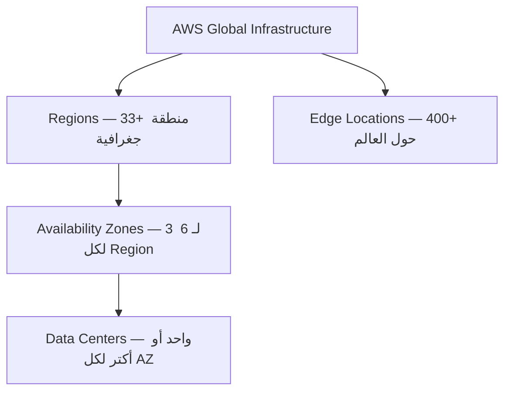
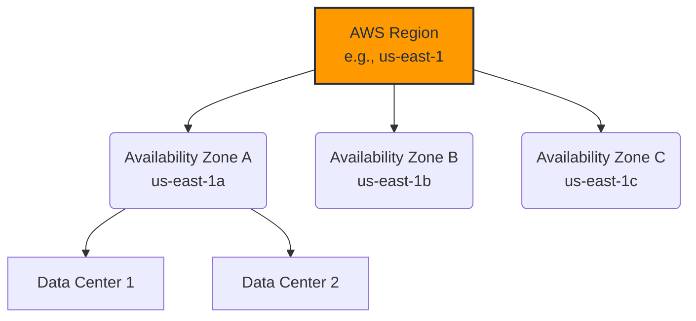
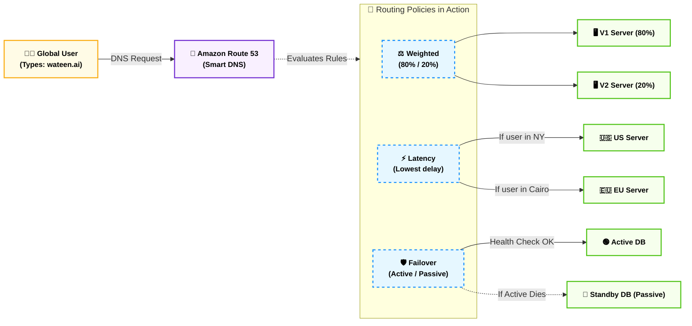
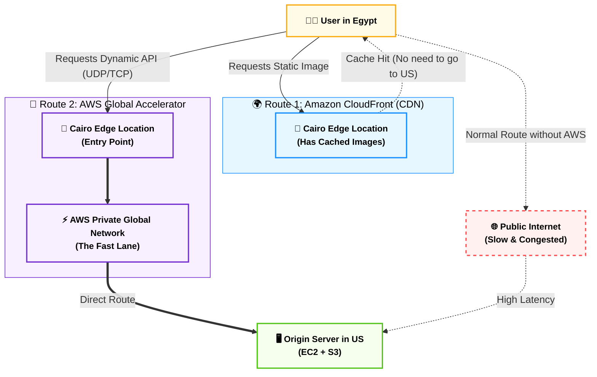
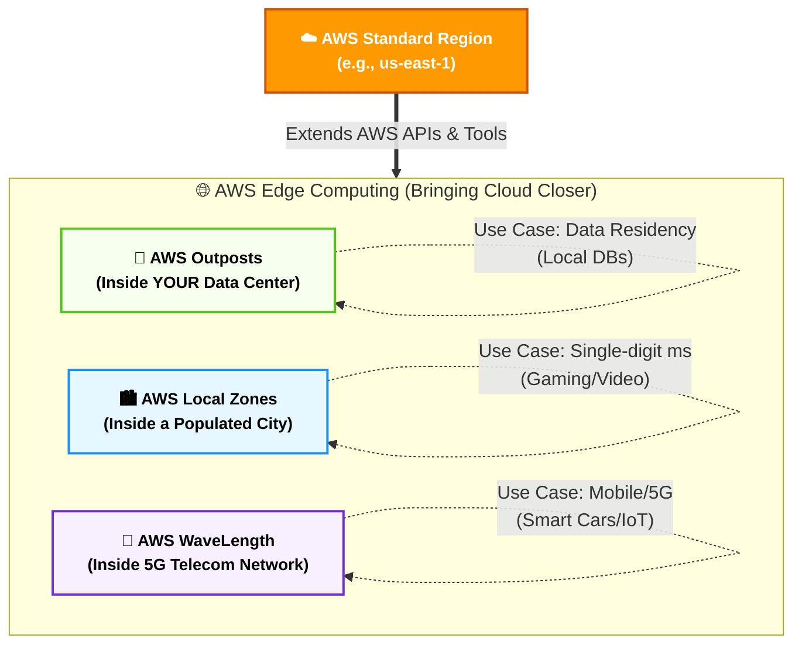
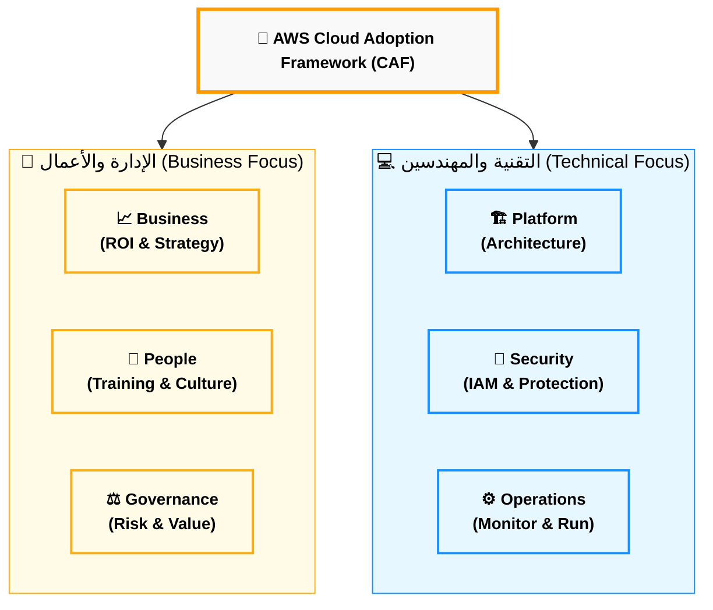
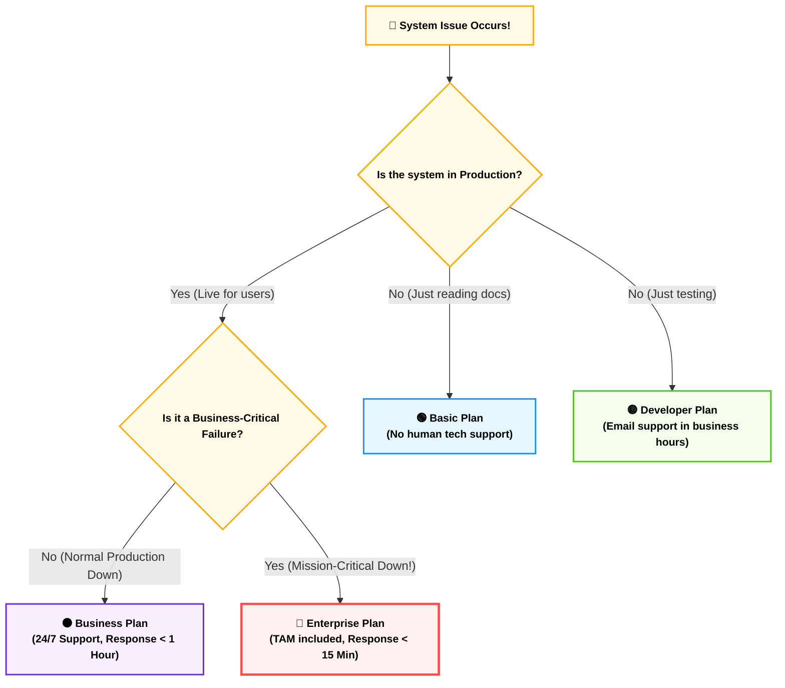

# ☁️ ما هو الـ Cloud Computing؟

### AWS Certified Cloud Practitioner — CLF-C02

---

## 🏚️ الحكاية بتبدأ من هنا — قبل الـ Cloud بزمان

تخيل معايا إنك في أوائل الـ 2000s وعندك فكرة لموقع إلكتروني. الفكرة جميلة، الـ Business Plan جاهز، بس عشان تشغّل الموقع ده، لازم تمر بكابوس اسمه **Traditional IT Infrastructure**.

وهتعدي على حبة خطوات زحمة زي انك : 
اول حاجه اصلا انك تشتري **Server** — جهاز فيزيائي ضخم بتكلفة عشرات الآلاف من الجنيهات أو الدولارات. 
بعدين لازم تلاقيله مكان — إما في بيتك في الأول، أو في أوضة في المكتب، أو لو الشركة كبرت تبني **Data Center** كامل. المبنى ده محتاج تبريد مستمر لأن الـ Servers بتولّد حرارة هايلة، ومحتاج كهرباء احتياطية لو انقطع التيار، ومحتاج حراسة وكاميرات وأنظمة حريق. كل ده قبل ما تكتب سطر كود واحد.

والأدهى من كده؟ إنك لازم **تخمن المستقبل** .. زي انك مثلا محتاج كام سيرفر؟!!
لو خمنت أقل من اللازم،.. يا عيني عليك لبست في الحيط و  يوم ما الموقع ينتشر وييجي عليه ضغط — هيقع. 
ولو خمنت أكتر من اللازم ، تبقى دفعت ملايين في أجهزة قاعدة مش بتشتغل. مع ذلك، لازم تدفع الإيجار والكهرباء والصيانة طول الوقت — حتى وإنت نايم وما فيش حد بيستخدم الموقع.
وفوق كل ده، لو اتحرق الـ Data Center أو انقطعت الكهرباء أو حصل زلزال — كل بياناتك وكل مواقعك وقعت. **Single Point of Failure** — نقطة ضعف واحدة بتودي كل حاجة في داهية ومعاها فلوسك وموقعك .
الناس كانت شايفة المشكلة دي وبتتساءل: **"ممكن نعمل إيه؟"**

---

## ☁️ الـ Cloud — لما شخص ذكي سأل "ليه لأ؟"

في 2002، داخل شركة **Amazon** نفسها، كانت في مشكلة مشابهة. فرق الـ Engineering المختلفة كل واحدة بتبني الـ Infrastructure بتاعتها من الصفر. Jeff Bezos وفريقه لاحظوا إن الـ Infrastructure دي هي في حد ذاتها "Core Competency" — يعني حاجة يمكن يبنوها كويس ويبيعوها للناس التانية.

في **2006**، أطلقوا للعالم ثلاث خدمات غيّرت وجه موضع السيرفرات ده وهما :
**S3** للتخزين،
**EC2** للسيرفرات،
و**SQS** للـ Messaging. 
وكان ده الـ Launch الحقيقي لـ **Amazon Web Services (AWS)**.

التعريف الرسمي اللي لازم تحفظه بجد عن ظهر قلب عشان الامتحان :

> **Cloud Computing هو الـ On-Demand Delivery لـ Compute Power، Database Storage، Applications، وغيرها من الـ IT Resources — عبر Platform بنموذج Pay-as-you-go.**

![[Pasted image 20260514021047.png]]
كل كلمة في التعريف ده بتيجي في الـ Exam. 
**On-Demand** يعني متاح فوراً عند الطلب من غير ما تكلم حد أو تستنى. **Pay-as-you-go** يعني بتدفع بس على اللي استخدمته — زي فاتورة الكهرباء بالظبط. 
و**AWS owns and maintains the hardware** يعني هي اللي بتدير الأجهزة الفيزيائية، إنت مش شايفها ومش متعب نفسك بيها.

الـ Cloud زي الكهرباء. لما بتشغّل التلاجة في بيتك، مش بتفكر في المحطة اللي بتولّد الكهرباء ولا في الكابلات اللي تحت الأرض. بتضغط الزرار، بياخد الكهرباء، وبتدفع في آخر الشهر على قد ما استهلكت. **AWS هي المحطة — إنت بس بتوصل وبتستخدم.**

دلوقتي AWS بقت شركة بـ Revenue سنوي تجاوز الـ **90 Billion دولار في 2023**، بـ Market Share بيتجاوز **31%** — أكبر Cloud Provider في العالم بفارق كبير قدام Microsoft Azure اللي عندها 25%.
![[Pasted image 20260514041414.png]]

---

## 🏗️ مش كل Cloud زي بعض — نماذج النشر الثلاث

لما بتقرر تنقل لـ Cloud، عندك ثلاث طرق للتعامل مع الموضوع، وكل طريقة بتناسب حالة مختلفة.

**الأولى هي الـ Public Cloud** —
وده هو AWS وAzure وGoogle Cloud. الـ Infrastructure مش بتاعتك، بتاعة الـ Provider. 
إنت بتستأجر منه Resources وبتدفع على ما بتستخدم. متاح لأي حد على الإنترنت، وبتستفيد من كل مزايا الـ Cloud الكاملة.

**التانية هي الـ Private Cloud** — تخيل إنك بتبني نظام Cloud لكن بتاعك إنت لوحدك. مش بتشارك الـ Infrastructure مع حد تاني. بتاخد بعض مرونة الـ Cloud لكن بتتحمل كل التكاليف لوحدك. بتلاقيه في البنوك الكبيرة أو الحكومات اللي عندها بيانات حساسة جداً مش تقدر تحطها على الـ Public Cloud بسبب قوانين محلية ... بيسموه برده  On-Premises .

**التالتة — والأكتر انتشاراً في الشركات الكبيرة — هي الـ Hybrid Cloud.** شركة زي بنك مصري ممكن تحتفظ بـ Core Banking System عندها On-Premises لأسباب تنظيمية وأمنية، وفي نفس الوقت تستخدم AWS للـ Website والـ Mobile App وأي حاجة مش حساسة. بتاخد أحسن ما في الاتنين — التحكم الكامل في البيانات الحساسة، والمرونة والتوفير في الباقي.
![[Pasted image 20260514041435.png]]
---

## ⭐ الخصائص الـ 5 للـ Cloud — اللي بيفرقه عن أي حاجة تانية

الـ NIST حددت خمس خصائص أساسية لأي Cloud حقيقي. دول مش تعريف أكاديمي — هم اللي بيشرحوا ليه الـ Cloud مختلف جوهرياً.

أول خاصية هي **On-Demand Self-Service** — إنت تقدر تشغّل Server أو تحجز Storage أو تعمل Database من غير ما تتكلم مع أي حد في AWS. كل حاجة Self-Service عبر الـ Console أو الـ CLI. مقارنةً بالتقليدي اللي كان محتاج أسابيع انتظار.

التانية هي **Broad Network Access** — الـ Resources متاحة من أي جهاز وأي مكان. موبايلك، لابتوبك، تابلتك — طالما عندك إنترنت.

التالتة — وهي اللي بتخلي AWS تقدر تكون رخيصة — هي **Multi-Tenancy والـ Resource Pooling**. إنت وألف شركة تانية ممكن تكونوا كلكم على نفس الـ Physical Server في Data Center بتاعة AWS — لكن كل واحد **معزول تماماً** عن التاني عبر الـ Virtualization. ده بيخلي AWS تقدر توزع تكلفة الـ Hardware الضخم على ملايين العملاء، وتوصللك بسعر ما تقدرش تحققه لو اشتريت Infrastructure لوحدك.

> [!abstract]+ ما هو الـ Virtualization وليه بيخلي الـ Cloud رخيصاً؟
>
> زمان، كان السيرفر "صندوق حديد" واحد بينزل عليه نظام تشغيل واحد، وخلاص. لو السيرفر ده قوي جداً وإنت شغال عليه موقع صغير — بترمي 90% من قوته في الأرض.
>
> الـ **Virtualization** جت وحطت طبقة Software ذكية اسمها الـ **Hypervisor** فوق الـ Hardware مباشرة. الـ Hypervisor ده وظيفته إنه ياخد الـ 64 جيجا رام الفيزيائية ويقسمهم: 4 جيجا لخالد، 8 جيجا لشركة X، 2 جيجا لتطبيق Y. كل واحد بياخد "سيرفر وهمي" اسمه **Virtual Machine**، وفي لغة AWS اسمه **EC2 Instance**. الـ Instance مش عارفة إنها عايشة مع جيران — فاكرة إن الـ Hardware كله بتاعها.
>
> تخيل عمارة كبيرة. لو أجّرتها كلها لوحدك — بتدفع تمن العمارة كلها. لو حوّلناها لشقق — كل واحد بيدفع على شقته بس، والتكاليف المشتركة زي الأمن والكهرباء الرئيسية بتتقسم على الكل. ده بالظبط هو الـ **Economies of Scale** — كل ما عدد العملاء زاد، التكلفة على الفرد بتقل جداً.
>
> **الـ Isolation** يعني لو VM لعميل حصل فيها Crash، الباقي ملهاش دعوة. 
> **الـ Agility** يعني بدل ما تستنى أسابيع لسيرفر حديد يوصل، الـ Hypervisor بيعمل Instance في أقل من دقيقة.

الرابعة هي **Rapid Elasticity** — الـ Resources بتكبر وبتصغر تلقائياً حسب الـ Demand. موقعك في Black Friday بياخد 10 أضعاف الـ Traffic المعتاد؟ الـ Cloud بيضيف Servers تلقائياً في ثواني وبيشيلهم لما الـ Traffic يرجع. بتدفع بس على وقت الضغط.

الخامسة هي **Measured Service** — كل حاجة بتتقاس بالتفصيل. كام ثانية شغّلت السيرفر، كام GB خزنت، كام Data اتنقل. وبتدفع على قد ما بالظبط.
![[Pasted image 20260514041459.png]]

---

## 🚀 المزايا الـ 6 — ليه الشركات بتهاجر للـ Cloud؟

> الأولى هي **التحول من CAPEX لـ OPEX**. 
الـ **CAPEX (Capital Expenditure)** يعني بتدفع فلوس ضخمة مقدمة على Hardware قبل ما تعرف هل الـ Business هينجح ولا لأ.
الـ **OPEX (Operational Expenditure)** يعني بتدفع على الاستخدام الفعلي بس...... Startup مصرية دلوقتي تقدر تبدأ بمئات الجنيهات في الشهر بدل ملايين مقدمة.

> التانية هي **الـ Economies of Scale**
 AWS بتشتري Hardware بأسعار منخفضة جداً لأنها بتشتري بالملايين، وبتوصلك بسعر ما تقدرش تحققه لو اشتريت لوحدك.

> التالتة هي **وقف التخمين في الـ Capacity**
 بدل ما تشتري سيرفر يتحمل أعلى حمل متوقع وهو شغال بـ 20% من طاقته طول السنة، دلوقتي بتبدأ بصغير وبتـ Scale عند الحاجة بالظبط.

> الرابعة هي **الـ Agility والسرعة** 
> Startup مصرية تقدر دلوقتي تبدأ في ساعات وتوصل للـ Production في يوم، بدل ما تستنى أشهر لـ Hardware يوصل ويتركّب.

> الخامسة هي **إنك بتوقف تصرف على Data Centers** 
> مش بتدفع فلوس في إيجار وكهرباء وتبريد وصيانة. كل الموارد دي بتوجهها لتطوير المنتج بتاعك.

> السادسة هي الأقوى على الإطلاق من ناحية Business وهي **Go Global in Minutes**. 
> قبل الـ Cloud، لو شركة مصرية عايزة تخدم عملاء في أمريكا وأوروبا وآسيا — كانت محتاجة Data Centers في كل حتة بملايين الدولارات. 
> دلوقتي بضغطة في AWS Console، بتشغّل Resources في أي Region في العالم في دقايق.

![[Pasted image 20260514041516.png]]

---

## 🧩 IaaS وPaaS وSaaS — مش كل خدمة زي بعض

تخيل الـ IT Stack كعمارة من تسع طوابق: من تحت للفوق — Networking، Storage، Servers، Virtualization، OS، Middleware، Runtime، Data، Applications. في الـ On-Premises التقليدي — إنت مسؤول عن الـ 9 طوابق كلهم.

في **IaaS (Infrastructure as a Service)** — المثال الأبرز هو **Amazon EC2** — AWS بتدير الطوابق التحتانية الأربعة، وإنت مسؤول عن الـ 5 الفوقانية. يعني إنت بتختار الـ OS وبتركّب الـ Software وبتدير الـ Security. أعلى مستوى من الـ Flexibility ومعاه أعلى مستوى من المسؤولية.

في **PaaS (Platform as a Service)** — المثال هو **AWS Elastic Beanstalk** — AWS بتدير 7 طوابق من الـ 9، وإنت مسؤول بس عن الـ Data والـ Application اللي بتكتبها. بتحط الـ Code وElastic Beanstalk بيدير كل حاجة تانية تلقائياً.

في **SaaS (Software as a Service)** — المثال هو **Gmail** أو **AWS Rekognition** — الـ Provider مسؤول عن كل الـ 9 طوابق. إنت بس بتستخدم الـ Software جاهز من غير ما تفكر في أي حاجة تقنية.

الـ Trade-off واضح: كل ما روحت من IaaS لـ SaaS، قلّت مسؤوليتك وقلّت كمان مرونتك في التخصيص.
![[Pasted image 20260514030119.png]]

---

## 💰 التسعير — ثلاث فواتير بس

الـ Pricing Model على AWS قائم على ثلاث أسس فقط.

**الأول هو الـ Compute** — بتدفع على وقت تشغيل الـ Server. السيرفر شغّال؟ بتدفع. وقّفته؟ الدفع بيوقف.
**التاني هو الـ Storage** — بتدفع على حجم الـ Data اللي بتخزنه.
**التالت — وده الـ Trap الكلاسيكي في الـ Exam — هو Data Transfer.** 
البيانات اللي بتيجي لـ AWS (Transfer IN) = **مجاناً تماماً.** 
البيانات اللي بتخرج من AWS (Transfer OUT) = بتدفع عليها. 
AWS بتشجعك تحط بياناتك عندها بإنها مجانية عند الدخول — بس لما تيجي تنقلها بره، هناك بتدفع.

---

## 🌍 البنية العالمية — إزاي AWS موجودة في كل حتة

عشان تقدم خدمة عالمية موثوقة، AWS بنت infrastructure ضخمة متوزعة على العالم كله، مكوّنة من ثلاث طبقات متداخلة.

## 1. الطبقة الأولى: AWS Regions (المناطق الجغرافية)
هي مناطق جغرافية كبيرة في العالم، كل منطقة بتحتوي على مجموعة من مراكز البيانات.

* **أمثلة بالأكواد:** * `us-east-1` (N. Virginia - دي المنطقة الأم وأهم واحدة).
    * `me-south-1` (Bahrain - الأقرب للشرق الأوسط ومصر).
* **خصائص هندسية:**
    * معظم خدمات AWS بتشتغل في حدود الـ Region اللي بتختارها (Region-scoped).
    * كل Region **منفصلة تماماً (Isolated)** عن التانية عشان تمنع انتشار الأعطال.
* **🚨 إضافة هامة للامتحان:** البيانات بتاعتك **مستحيل** تخرج من الـ Region اللي إنت اخترتها إلا لو إنت اللي أديت تصريح بكده (Data Governance).

## 2. الطبقة التانية: Availability Zones (AZs - مناطق التوافر)
جوة كل Region، بنقسم الدنيا لمناطق توافر (AZs) عشان نحمي نفسنا من الكوارث.

* **العدد:** كل Region فيها على الأقل **3 AZs** (والماكسيموم 6).
* **التكوين (Under the hood):** كل AZ عبارة عن Data Center واحد أو أكتر.
* **الـ Isolation (العزل):** مفصولة جسمانياً عن التانية بكيلومترات (عشان لو حصل حريق، فيضان، أو زلزال في واحدة، التانية ماتتأثرش)، وكل واحدة ليها **كهرباء مستقلة وشبكة مستقلة (Redundant power & networking)**.
* **الـ Networking:** الـ AZs دي مربوطة ببعض بشبكة ألياف ضوئية سريعة جداً (Ultra-low latency).
* **الهدف المعماري:** لو صممت السيستم بتاعك على أكتر من AZ (Multi-AZ Deployment)، وواحدة وقعت، التانية بتكمل الشغل من غير ما العميل يحس بحاجة ➔ وده تعريف الـ **High Availability (HA)**.

## 3. الطبقة التالتة: Edge Locations (نقاط التواجد الطرفية)

دي نقط أصغر بس متوزعة بشكل أوسع بكتير من الـ Regions عشان تقرب من الـ End-user.

- **الانتشار:** أكتر من **400+ Edge Location** في 90+ مدينة حول العالم.
    
- **الوظيفة:** مش للـ Compute الضخم، دي بتشتغل كـ **Cache** للمحتوى عشان تقلل الـ Latency.
    
- **الخدمات اللي بتستخدمها (Exam Trap):** * **Amazon CloudFront** (الـ CDN بتاع AWS - بيخزن الصور والفيديوهات).
    
    - **Amazon Route 53** (Global DNS).
        
    - **AWS Global Accelerator** (لتسريع الـ Traffic).
        
- **مثال عملي:** لو موقعك (Origin) في `us-east-1` وعندك مستخدمين في مصر، بدل ما الـ Request يسافر أمريكا ويرجع، CloudFront بيخزن نسخة (Cache) في أقرب Edge Location لمصر، فالمستخدم بيستلم الصفحة في أجزاء من الثانية.
    

---

## 🧭 إزاي تختار الـ Region المناسب للـ Project بتاعك؟

لو قعدت مع عميل، بتفلتر اختيار الـ Region بناءً على 4 عوامل **بهذا الترتيب**:

1. **Compliance (التوافق القانوني) 🥇:** [الأهم دايماً] لو البيانات (زي بيانات طبية أو بنكية) لازم تفضل في بلد معين بسبب قوانين محلية (Data governance / Legal requirements)، مفيش أي اعتبارات تانية هتنفع، لازم تختار البلد دي.
    
2. **Proximity (القرب من العملاء) 🥈:** كل ما الـ Region كانت أقرب لعملائك، كل ما الـ **Latency** (زمن الاستجابة) قل والـ User Experience بقت أحسن.
    
3. **Available Services (الخدمات المتاحة) 🥉:** مش كل الخدمات الجديدة بتنزل في كل الـ Regions مرة واحدة. عادة الـ New features بتنزل في `us-east-1` الأول.
    
4. **Pricing (التسعير) 🏅:** أسعار الخدمات بتختلف من Region للتانية ومكتوبة بشفافية في صفحة الـ Pricing.
    
![[Pasted image 20260514041618.png]]
---

> [!warning] فخاخ الامتحان (Global vs. Regional Services) 🚨
> 
> AWS بتحب جداً تسألك: "مين في الخدمات دي Global ومين Regional؟"

|**🌍 Global Services (مش محتاج تختار Region)**|**📍 Regional Services (مربوطة بـ Region معينة)**|
|---|---|
|**IAM** (Identity and Access Management)|**Amazon EC2** (الخوادم الوهمية)|
|**Amazon Route 53** (DNS)|**Amazon RDS** (قواعد البيانات)|
|**Amazon CloudFront** (CDN)|**AWS Lambda** (Serverless Compute)|
|**AWS WAF** (Web Application Firewall)|**Amazon S3** (التخزين)|

## 🤝 الـ Shared Responsibility Model — مين مسؤول عن إيه؟

ده واحد من أهم الـ Concepts في الـ Exam كله. الجملتان اللي لازم تحفظهم:

> **AWS مسؤولة عن Security OF the Cloud.** **إنت (Customer) مسؤول عن Security IN the Cloud.**

AWS مسؤولة عن كل الـ Physical Infrastructure — المباني، الأجهزة، الشبكات الفيزيائية، الـ Hypervisor، والـ Managed Services اللي هي بتديرها. 
إنت مسؤول عن البيانات بتاعتك وتشفيرها، الـ OS على الـ EC2 وتحديثاته، الـ Network Configuration زي الـ Security Groups، الـ IAM وصلاحيات المستخدمين، والـ Application Code بتاعك.

التشبيه البسيط: صاحب العمارة (AWS) مسؤول عن الأساسات والمصعد والحراسة. إنت الساكن (Customer) مسؤول عن قفل بابك، نضافة شقتك، ومين بتدخله.

القاعدة العامة: كل ما اتحركت من IaaS لـل SaaS،   ال AWS بتتحمل مسؤولية أكتر. على EC2 (IaaS) إنت مسؤول عن الـ OS. على RDS (PaaS) AWS بتدير الـ DB Engine وإنت مسؤول عن الـ Data فقط. على Rekognition (SaaS) AWS مسؤولة عن كل حاجة تقريباً وإنت مسؤول بس عن الـ Data اللي بتبعته.![[Pasted image 20260514041658.png]]

---
# Domain 1: Cloud Concepts (مفاهيم السحابة الأساسية)

## المحطة الأولى: قهر المسافات وشبكات الحافة - الجزء الأول (Amazon Route 53)

**أصل الحكاية والمشكلة المعمارية (The Core Problem):**

تخيل إنك أطلقت منصة (Wateen.ai) وبقى عندك سيرفر في أمريكا وسيرفر في أوروبا. المستخدم بيكتب في المتصفح `www.wateen.ai`.. إزاي المتصفح بيعرف إن الموقع ده موجود على سيرفر أمازون اللي الـ IP بتاعه `192.0.2.1`؟

الأهم من كده: لو السيرفر اللي في أمريكا وقع، إزاي نحول المستخدم أوتوماتيك للسيرفر بتاع أوروبا من غير ما يحس إن الموقع واقع؟ وإزاي نخلي المستخدم اللي في مصر يروح لسيرفر أوروبا لأنه أقرب وأسرع؟

في عالم الـ (On-Premises)، كنت هتحتاج تشتري أجهزة توجيه غالية جداً وتعين فريق شبكات. بس في أمازون، إحنا بنحل كل ده بخدمة واحدة بس، بتشتغل كـ "دليل تليفونات" و "عسكري مرور" في نفس الوقت.

### ⚙️ دليل العناوين الذكي (Amazon Route 53)

الـ **Route 53** هو خدمة الـ (DNS - Domain Name System) بتاعت أمازون. (وسموها 53 لأن بروتوكول الـ DNS بيشتغل على Port 53 في الشبكات).

وظيفته الأساسية هي ترجمة الأسماء اللي البشر بيفهموها (زي `google.com`) لـ أرقام الـ IPs اللي الكمبيوتر بيفهمها. بس أمازون مخلتوش مجرد دليل تليفونات، هي حطت فيه "سياسات توجيه" (Routing Policies) ذكية جداً بتتحكم في مسار الترافيك العالمي، ودي اللي بييجي عليها أسئلة الامتحان.

### 🧠 سياسات التوجيه (Routing Policies)

كـ Tech Lead، لازم تختار السياسة الصح بناءً على حالة المشروع:

#### 1. التوجيه البسيط (Simple Routing)

- **الوظيفة:** دليل تليفونات كلاسيكي. بتديله اسم الموقع، بيرد عليك بـ IP واحد (أو أكتر) وبيرمي الترافيك عليه.
    
- **إمتى نستخدمه؟** لو الـ Backend بتاعك كله موجود في مكان واحد (مثلاً سيرفر EC2 واحد أو Load Balancer واحد) ومش محتاج أي ذكاء في التوزيع.
    

#### 2. توجيه الأوزان والاختبارات (Weighted Routing)

- **الوظيفة:** بيقسم الترافيك بنسب مئوية إنت اللي بتحددها.
    
- **إمتى نستخدمه؟ (A/B Testing):** لو إنت كاتب كود جديد بـ Laravel 13 وعايز تجربه على الجمهور بس خايف يكون فيه Bugs. بتقول للـ Route 53: "ودي 80% من الزوار للسيرفر القديم، و 20% بس للسيرفر الجديد". لو الكود الجديد تمام، بتخليها 100%.
    

#### 3. توجيه السرعة والمسافة (Latency Routing)

- **الوظيفة:** بيحسب مين أسرع سيرفر هيرد على المستخدم (أقل تأخير - Latency) ويوجهه ليه.
    
- **إمتى نستخدمه؟** لو عندك مستخدمين في كل قارات العالم. المستخدم اللي في طوكيو هيتوجه أوتوماتيك لسيرفر اليابان، والمستخدم اللي في القاهرة هيتوجه لسيرفر أوروبا، عشان الموقع يفتح في أجزاء من الثانية.
    

#### 4. توجيه الطوارئ والنجدة (Failover Routing)

- **الوظيفة:** خطة الكوارث (Disaster Recovery). بيشتغل بنظام (Active / Passive).
    
- **الكواليس المعمارية:** الـ Route 53 بيعمل حاجة اسمها (Health Checks)؛ يعني بيبعت نبضة للسيرفر الأساسي كل كام ثانية يطمن عليه. لو السيرفر الأساسي ماردش (وقع)، الـ Route 53 بيحول الترافيك فوراً للسيرفر الاحتياطي من غير ما يتدخل أي مهندس.
    

### 📊 شفرات الامتحان: التفرقة الحاسمة لـ Route 53

عشان تقفل أسئلة الـ DNS، ركز على الكلمة الدلالية اللي بتحدد نوع السياسة المطلوبة:

|**السيناريو المعماري في الامتحان (Keyword)**|**الإجابة الصحيحة (Routing Policy)**|
|---|---|
|`Highly available and scalable Domain Name System (DNS)`|**Amazon Route 53**|
|`A/B Testing`, `Route a specific percentage of traffic`|**Weighted Routing**|
|`Route traffic to the region with the lowest delay / fastest response`|**Latency Routing**|
|`Disaster Recovery`, `Active/Passive configuration`|**Failover Routing**|
|`Monitor the health of endpoints`|**Route 53 Health Checks**|
|`Route traffic based on user location (e.g., Europe vs US)`|**Geolocation Routing**|

---
##  الجزء الثاني (CloudFront vs Global Accelerator)

**رؤية الـ Tech Lead (أصل الحكاية والمشكلة المعمارية):**

مشروع (Wateen.ai) اللي بنيناه بـ Laravel 13 ورفعناه على سيرفر (EC2) في أمريكا، بدأ ينجح جداً في مصر. بس واجهتنا مشكلة قاتلة: المستخدم في القاهرة بيكتب اسم الموقع، الريكويست بيمشي في كابلات الإنترنت العامة (الشارع العمومي)، بيعدي على 20 راوتر في دول مختلفة لحد ما يوصل لأمريكا ويرجع. ده بيعمل بطء شديد (High Latency)!

عشان نحل الأزمة دي، إحنا محتاجين "نقرب" من المستخدم. بس هنقرب إزاي؟ هل ننسخ الداتا بتاعتنا ونحطها في سيرفرات صغيرة قريبة منه؟ ولا نمد له "كابل سريع ومخصوص" لحد السيرفر الأساسي بتاعنا في أمريكا؟

الامتحان بيعشق المقارنة دي لأنها بتفرق بين المهندس الفاهم والمهندس الحافظ.

### ⚙️ الحل الأول: التخزين المؤقت على الحافة (Amazon CloudFront)

الـ **CloudFront** هو شبكة توصيل المحتوى (CDN - Content Delivery Network) بتاعة أمازون. ده بيعتمد على مبدأ "النسخ المؤقت" (Caching).

- **الكواليس المعمارية:** أمازون عندها مئات السيرفرات الصغيرة متوزعة في كل دول العالم اسمها **(Edge Locations)**.
    
- **طريقة العمل:** أول مستخدم في مصر بيفتح الموقع، بياخد وقت طويل. الـ CloudFront بياخد نسخة من الصور، الفيديوهات، وملفات الـ CSS/JS، ويخزنها في الـ Edge Location اللي في القاهرة. المستخدم التاني في مصر لما يفتح الموقع، مش هيروح أمريكا! هيحمل الصور من سيرفر القاهرة في أجزاء من الثانية.
    
- **إمتى نستخدمه؟** مع المحتوى الثابت (Static Content) زي الصور والفيديوهات، والمحتوى اللي مش بيتغير كل ثانية.
    
- 🚨 **الكلمات الدلالية في الامتحان:** `Deliver content with low latency`, `Cache content at Edge Locations`, `CDN`.
    

### ⚙️ الحل الثاني: المسار السريع الخاص (AWS Global Accelerator)

الـ **Global Accelerator** بيلعب لعبة تانية خالص. ده ملوش دعوة بالكاش (No Caching). ده بيعتمد على مبدأ "الخط المخصوص".

- **المشكلة اللي بيحلها:** ماذا لو الريكويست مش صورة عشان تتخزن في الكاش؟ ماذا لو ده ريكويست (API Call) لداتابيز بتتغير كل ثانية، أو أبلكيشن شات (Real-time)؟
    
- **الكواليس المعمارية:** الإنترنت العمومي زحمة ومليان أعطال. الـ Global Accelerator بياخد الريكويست من المستخدم في مصر لأقرب Edge Location، ومن هناك بيدخله في **شبكة أمازون الخاصة (AWS Global Network)**. ده "طريق سريع ومخصوص" (Fast Lane) تحت الأرض، مفيش عليه زحمة، بيوصل للسيرفر في أمريكا بـ أقصى سرعة واستقرار.
    
- **ميزة Anycast IPs:** الخدمة دي بتديك **رقمين IP ثابتين** (2 Static Anycast IPs) على مستوى العالم كله. لو سيرفر أمريكا وقع وحولنا الترافيك لسيرفر أوروبا، المستخدمين مش هيحسوا بأي تغيير لأن الـ IPs الثابتة دي هي اللي بتوجههم في الكواليس.
    
- 🚨 **الكلمات الدلالية في الامتحان:** `Improve availability and performance of applications`, `Use AWS private global network`, `Provide 2 Static Anycast IPs`, `Non-HTTP use cases (UDP/TCP)`.
    

### ⚙️ الحل التكميلي: صاروخ الرفع (S3 Transfer Acceleration)

- **المشكلة:** مستخدم في أستراليا عايز يرفع فيديو مساحته 5 جيجا لـ S3 Bucket موجود في أمريكا. لو رفعه عن طريق الإنترنت العادي، هياخد ساعات وممكن يفصل في النص.
    
- **الحل:** المستخدم بيرفع الفيديو لأقرب Edge Location في أستراليا، ومن هناك الفيديو بيطير جوه شبكة أمازون الخاصة السريعة جداً لحد ما يوصل للـ Bucket في أمريكا.
    
- 🚨 **الكلمات الدلالية في الامتحان:** `Fast, easy, and secure transfers of files over long distances`, `Upload to S3 faster`.
    

### 📊 شفرات الامتحان: التفرقة القاضية بين خدمات التسريع

|**السيناريو المعماري في الامتحان (Keyword)**|**الإجابة الصحيحة (AWS Service)**|
|---|---|
|`Cache static content`, `Edge Locations`, `CDN`, `Deliver videos/images globally`|**Amazon CloudFront**|
|`Improve performance for dynamic applications`, `Route traffic over AWS private network`|**AWS Global Accelerator**|
|`Get 2 static Anycast IP addresses`, `UDP/TCP applications (Gaming/IoT)`|**AWS Global Accelerator**|
|`Speed up uploads to an S3 bucket over long distances`|**S3 Transfer Acceleration**|
|`Route traffic to the region with the lowest latency`|**Route 53 (Latency Routing)** _(تريكة: Route 53 هو DNS مش كابل سريع)_|

---
## المحطة الأولى: قهر المسافات وشبكات الحافة - الجزء الثالث (السحابة على باب بيتك)

**رؤية الـ Tech Lead (أصل الحكاية والمشكلة المعمارية):**

في أوقات كتير، هتروح تقعد مع عميل (مثلاً بنك حكومي أو مستشفى) عشان تقنعه ينقل شغله على أمازون. العميل هيقولك: "أنا مقتنع جداً بالكلاود، بس **القانون بيمنعني** أطلع بيانات العملاء بره المبنى بتاعي!" (Data Residency).

أو ممكن تكون بتبني مشروع زي **(بَدالي - Badaly)** للرد الآلي، ومحتاج السيستم يتفاعل مع شبكات المحمول في أجزاء من المللي ثانية، ولو الريكويست راح لأمريكا ورجع، المكالمة هتقطع.

الحل المعماري هنا عبقري من أمازون: _"لو إنت مش قادر تيجي للكلاود، الكلاود هيجيلك لحد باب بيتك!"_. ده اللي بنسميه الـ (Edge Computing)، وأمازون بتقدم 3 خدمات عشان تمد ذراعاتها بره الداتا سنتر بتاعتها.

### ⚙️ أولاً: السحابة في غرفة سيرفراتك (AWS Outposts)

- **المشكلة:** العميل عايز يستخدم خدمات أمازون (زي EC2 و S3)، بس عايز الداتا تفضل فيزيائياً جوه مبنى الشركة بتاعته عشان قوانين الدولة.
    
- **الحل المعماري:** أمازون بتشحنلك "راك سيرفرات" (Hardware Rack) حقيقي بالطيارة لحد باب شركتك. مهندسين أمازون بيركبوهولك جوه الداتا سنتر بتاعك ويوصلوه بالكهربا والإنترنت.
    
- **الكواليس:** السيرفر ده جوه مبناك، بس إنت بتتحكم فيه من (AWS Console) العادي جداً! كأن أمازون مدت كابل من أمريكا لحد أوضتك. أمازون هي اللي بتعمله صيانة وتحديث (Fully Managed)، بس الداتا مابتطلعش بره المبنى.
    
- 🚨 **الكلمات الدلالية في الامتحان:** `Fully managed infrastructure to virtually any on-premises`, `AWS rack in your data center`, `Data residency requirements`, `Hybrid cloud`.
    

### ⚙️ ثانياً: امتداد السحابة للمدن الكبرى (AWS Local Zones)

- **المشكلة:** إنت بتعمل لعبة (Multiplayer) أو منصة مونتاج فيديو، والعملاء بتوعك متركزين في مدينة "لوس أنجلوس". أقرب (Region) لأمازون موجودة في "أوريجون" (على بعد 1500 كيلو). المسافة دي بتعمل بطء صغير، بس في الألعاب البطء ده قاتل!
    
- **الحل المعماري:** أمازون راحت مأجرة داتا سنتر صغير جداً جوه مدينة "لوس أنجلوس" نفسها وسمته (Local Zone). ده مش Region كاملة، ده مجرد "امتداد" (Extension) للـ Region الأساسية.
    
- **النتيجة:** المستخدمين في المدينة دي بقوا بيكلموا سيرفرات قريبة جداً منهم، فالتأخير (Latency) نزل لأقل من 10 مللي ثانية (Single-digit millisecond latency).
    
- 🚨 **الكلمات الدلالية في الامتحان:** `Single-digit millisecond latency`, `Place compute and storage closer to large population and industry centers`, `Extension of an AWS Region`.
    

### ⚙️ ثالثاً: السحابة جوه أبراج المحمول (AWS WaveLength)

- **المشكلة:** مشاريع الذكاء الاصطناعي الثقيلة زي **(بَدالي)** أو السيارات ذاتية القيادة بتحتاج سرعة استجابة خرافية. لو العربية بتبعت داتا لبرج الـ 5G، وبعدين البرج يبعتها للإنترنت، وبعدين الإنترنت يبعتها لأمازون.. العربية هتكون عملت حادثة!
    
- **الحل المعماري:** أمازون راحت لشركات المحمول (Telecom Providers زي Vodafone و Verizon)، وحطت سيرفرات (EC2) بتاعتها **جوه أبراج الـ 5G نفسها**.
    
- **النتيجة:** الموبايل أو العربية بتبعت الريكويست لبرج المحمول، بيلاقي السيرفر بتاع أمازون مستنيه هناك! الريكويست مبيخرجش للإنترنت العمومي أصلاً (Ultra-low latency).
    
- 🚨 **الكلمات الدلالية في الامتحان:** `Ultra-low latency for mobile devices`, `Embed AWS compute services within 5G telecommunications networks`, `Telecom carriers`.

### 📊 شفرات الامتحان: التفرقة النهائية لخدمات الحافة (Edge)

السؤال هنا بييجي مباشر، ركز على "مكان تواجد السيرفر" عشان تختار الإجابة في ثانية:

|**السيناريو المعماري في الامتحان (Keyword)**|**الإجابة الصحيحة (AWS Service)**|
|---|---|
|`Run AWS infrastructure in your on-premises data center`|**AWS Outposts**|
|`Meet strict data residency and local processing requirements`|**AWS Outposts**|
|`Extension of an AWS Region`, `Closer to large population centers`|**AWS Local Zones**|
|`Single-digit millisecond latency for end-users in a specific city`|**AWS Local Zones**|
|`Ultra-low latency for 5G mobile devices and applications`|**AWS WaveLength**|
|`Embed AWS services at the edge of telecommunications networks`|**AWS WaveLength**|

---
## المحطة الثانية: استراتيجية الهجرة، الإدارة، وخطط النجدة - الجزء الأول (AWS CAF & Ecosystem)

**رؤية الـ Tech Lead (أصل الحكاية والمشكلة المعمارية):**

الهجرة للكلاود مش مجرد "يلا ننقل شوية سيرفرات ونكتب كود". تخيل إننا قررنا ننقل كل البنية التحتية لمنصة (Wateen.ai) من سيرفرات وزارة الصحة (On-Premises) إلى أمازون.

لو ركزنا على المهندسين بس، هنفشل! ليه؟ لأن مدير الحسابات مش فاهم الفواتير الجديدة، والـ HR مش عارف يعين ناس بتفهم كلاود، ومسؤول الرقابة خايف من قوانين أمان البيانات.

النجاح في الكلاود بيحتاج "خطة شركة كاملة". عشان كده أمازون عملت إطار عمل استراتيجي اسمه **(AWS CAF - Cloud Adoption Framework)** عشان يوجه الشركات في رحلة الهجرة من غير ما يغرقوا.

### ⚙️ أولاً: بوصلة الهجرة (AWS CAF - الـ 6 وجهات نظر)

الـ CAF بيقسم الشركة لـ 6 زوايا أو وجهات نظر (Perspectives). التلاتة الأوائل يخصوا الإدارة (Business)، والتلاتة التانيين يخصوا المهندسين (Technical). _الامتحان بيسألك: "الموقف الفلاني يتبع أي منظور؟"_

#### 🌍 الجانب الإداري (Business Capabilities):

1. **منظور الأعمال (Business Perspective):** * **الهدف:** هل الانتقال للكلاود هيزود أرباحنا؟ هل بيحقق رؤية الشركة؟
    
    - **الكلمات الدلالية:** `ROI (Return on Investment)`, `Business strategy`, `IT aligns with business needs`.
        
2. **منظور الأفراد (People Perspective):**
    
    - **الهدف:** هل الموظفين جاهزين؟ مين محتاج تدريب؟ إزاي نغير ثقافة الشركة (Culture)؟
        
    - **الكلمات الدلالية:** `Training`, `Certifications`, `HR`, `Organizational structure`, `Culture`.
        
3. **منظور الحوكمة (Governance Perspective):**
    
    - 🚨 **فخ الامتحان:** ناس كتير بتفتكر إن Governance معناها (إدارة السيرفرات).. غلط! دي معناها (إدارة المخاطر والفلوس). إزاي نراقب التكاليف؟ إيه المخاطر القانونية؟
        
    - **الكلمات الدلالية:** `Maximize business value`, `Minimize risks`, `IT governance`, `Cloud investments`.
        

#### 💻 الجانب التقني (Technical Capabilities):

4. **منظور المنصة (Platform Perspective):**
    
    - **الهدف:** إيه شكل المعمارية الجديدة؟ هنستخدم EC2 ولا Lambda؟ إزاي هننقل الداتا؟
        
    - **الكلمات الدلالية:** `Compute, Network, Storage`, `Architectural patterns`, `IT infrastructure`.
        
5. **منظور الأمان (Security Perspective):**
    
    - **الهدف:** إزاي نحمي الداتا؟ مين ليه صلاحيات (IAM)؟ إزاي نستجيب للاختراقات (Incident Response)؟
        
    - **الكلمات الدلالية:** `IAM`, `Data protection`, `Incident response`, `Protect assets`.
        
6. **منظور العمليات (Operations Perspective):**
    
    - **الهدف:** بعد ما السيستم يشتغل، إزاي هنراقبه يومياً؟ (CloudWatch)، وإزاي هنحل الأعطال؟
        
    - **الكلمات الدلالية:** `Run and monitor`, `Day-to-day operations`, `IT service management`.
        

### ⚙️ ثانياً: النظام البيئي لأمازون (AWS Ecosystem)

وإحنا بنبني السيستم، مش لازم نخترع العجلة من الصفر. أمازون بتوفرلك "سوق" و"فريق إدارة" جاهزين:

#### 1. متجر البرمجيات (AWS Marketplace)

- **المشكلة:** إنت محتاج تسطب فايروول (Palo Alto) أو داتابيز (Oracle) على أمازون. هتروح تشتري الرخص من الشركات دي إزاي؟
    
- **الحل:** بتدخل الـ Marketplace بضغطة زرار، تشتري البرنامج الجاهز وهو بينزل متسطب على الـ EC2 بتاعك. **الميزة القاتلة:** فاتورة البرنامج ده بتنزل جوه فاتورة أمازون بتاعتك (Consolidated Billing)، فمش هتدفع لجهتين.
    
- 🚨 **الكلمات الدلالية:** `Find, buy, and instantly deploy software`, `Third-party software`, `Billed on your AWS invoice`.
    

#### 2. خدمات الإدارة من أمازون (AWS Managed Services - AMS)

- **المشكلة:** شركتك نقلت للكلاود، بس معندكش فريق مهندسين (IT Staff) يدير السيرفرات، يعمل باک أب، وينزل تحديثات الويندوز!
    
- **الحل:** بتدفع لأمازون خدمة (AMS). موظفين أمازون نفسهم هما اللي بيديروا البنية التحتية بتاعتك نيابة عنك بناءً على معايير الأمان العالمية.
    
- 🚨 **الكلمات الدلالية:** `AWS operates your infrastructure`, `Infrastructure operations`, `Augment your internal IT staff`.
    

### 📊 شفرات الامتحان: التفرقة الحاسمة لـ CAF & Ecosystem

أكتر تريكة بتوقع في الامتحان هي التفرقة بين الـ Governance والـ Operations. احفظ الجدول ده صم:

|**السيناريو المعماري في الامتحان (Keyword)**|**الإجابة الصحيحة**|
|---|---|
|`ROI`, `IT aligns with business needs`, `Strategy`|**CAF - Business Perspective**|
|`Training`, `Organizational structure`, `Culture`, `HR`|**CAF - People Perspective**|
|`Maximize value and minimize risks`, `Cloud investments`|**CAF - Governance Perspective**|
|`Design and deploy architecture`, `Compute, storage`|**CAF - Platform Perspective**|
|`IAM`, `Protect data`, `Incident response`|**CAF - Security Perspective**|
|`Day-to-day operations`, `Run and monitor workloads`|**CAF - Operations Perspective**|
|`Find, buy, deploy third-party software`|**AWS Marketplace**|
|`AWS handles day-to-day infrastructure management for you`|**AWS Managed Services (AMS)**|

---
## المحطة الثانية: استراتيجية الهجرة، الإدارة، وخطط النجدة - الجزء الثاني والأخير (AWS Support Plans)

**رؤية الـ Tech Lead (أصل الحكاية والمشكلة المعمارية):** تخيل إنك أطلقت نظام (Wateen.ai) وبقى بيخدم مستشفيات كتير، وفي يوم الجمعة الساعة 3 الفجر، الداتابيز وقعت والسيستم كله انهار! في اللحظة دي إنت مش محتاج تقرأ ملفات مساعدة (Documentation)، إنت محتاج "بني آدم" خبير من أمازون يدخل معاك على الخط فوراً عشان يحل المصيبة دي. الوقت بفلوس، وكل ثانية السيستم فيها واقع بتكلف الشركة سمعة وخساير. عشان كده، أمازون قسمت "خطط النجدة والدعم الفني" (Support Plans) لـ 4 مستويات، كل مستوى ليه تسعيرة، وليه سرعة استجابة (Response Time) محددة بالدقيقة.

### ⚙️ أولاً: خطط الدعم الفني (AWS Support Plans)

الامتحان بيجيبلك سيناريو "عطل معين" وبيطلب منك تختار الخطة المناسبة أو تحدد سرعة الاستجابة. احفظ الأرقام دي زي اسمك:

#### 1. الخطة الأساسية (Basic Plan) - _المجانية_

- **المميزات:** مجانية 100% ومفعلة لأي حساب جديد. بتديك صلاحية تقرأ الـ (Documentation) وتدخل على المنتديات.
    
- **القيود (فخ الامتحان):** مفيش أي دعم فني بشري (No human technical support). لو السيستم وقع، محدش من أمازون هيرد عليك.
    
- **الـ Trusted Advisor:** بتشوف منه فحوصات أساسية فقط (Core checks).
    

#### 2. خطة المطورين (Developer Plan) - _للتجارب_

- **الاستخدام:** لو بتعمل (Test) أو بتبني مشروع ولسه مخرجش للجمهور.
    
- **الدعم البشري:** بتفتح تيكت وبيجيلك الرد عن طريق (Email Support) في أوقات العمل الرسمية فقط (Business Hours).
    
- **سرعة الاستجابة:** أقل من 24 ساعة للأسئلة العامة، وأقل من 12 ساعة لو في عطل جزئي (System Impaired).
    

#### 3. خطة الشركات (Business Plan) - _لبيئة الإنتاج الحقيقية_

- **الاستخدام:** أول ما السيستم يطلع لايف للجمهور (Production)، لازم تشتري الخطة دي.
    
- **الدعم البشري:** دعم 24/7 على مدار الساعة عبر (التليفون، الإيميل، والـ Chat).
    
- 🚨 **سرعة الاستجابة القاتلة:** لو السيستم وقع تماماً (Production System Down)، مهندس أمازون بيرد عليك في **أقل من ساعة واحدة (1 Hour)**.
    

#### 4. الخطة الكبرى للمؤسسات (Enterprise Plan) - _لأنظمة الحياة أو الموت_

- **الاستخدام:** للشركات الضخمة والأنظمة الحرجة (Mission-Critical Workloads).
    
- 🚨 **الميزة الذهبية (TAM):** بتديك مستشار تقني مخصص من أمازون اسمه (Technical Account Manager - TAM) بيتابع معاك شغلك خطوة بخطوة. وكمان بتديك فريق (Concierge) مخصوص لفواتيرك.
    
- 🚨 **سرعة الاستجابة القاتلة:** لو النظام الرئيسي انهار (Business-Critical System Down)، الاستجابة بتتم في **أقل من 15 دقيقة (15 Minutes)**.
    

### ⚙️ ثانياً: مجتمع الخبراء والعمل الحر

لو مش عايز تدفع اشتراك شهري للدعم، وعايز حلول خارجية، أمازون وفرتلك منصتين:

1. **العمل الحر (AWS IQ):** منصة زي Upwork بس لخبراء أمازون المعتمدين. لو شركتك محتاجة مهندس يعمل تاسك سريعة، بتدخل تطلب خبير من هناك، وتكلفته بتنزل على فاتورة أمازون بتاعتك.
    
2. **مجتمع الأسئلة (AWS re:Post):** منتدى مجاني بتسأل فيه والناس بتجاوبك.
    
    - 🛑 **فخ الامتحان:** المنصة دي **غير مناسبة** للأعطال الطارئة (Time-Sensitive) أو لمشاركة كود سري خاص بشركتك (Proprietary info).
        

### ⚙️ ثالثاً: إشارة معمارية (AWS Well-Architected Framework)

عشان السيستم ميقعش أصلاً ونحتاج الدعم الفني، أمازون عملت كتالوج من 6 أعمدة (6 Pillars) يضمنلك إنك بتبني صح: _(التميز التشغيلي، الأمان، الموثوقية، كفاءة الأداء، تحسين التكلفة، والاستدامة)_.

- 🚨 **تريكة الامتحان:** الأعمدة الستة دي مش بتتعارض مع بعض (Not Trade-offs)، دي بتكمل بعض (Synergy) ولازم تطبقها كلها سوا. _(احنا شرحنا تفاصيلهم المعمارية جوه Domain 3 بالتفصيل)_.
    

### 📊 شفرات الامتحان: الخلاصة النهائية لخطط النجدة

|**السيناريو المعماري في الامتحان (Keyword)**|**الإجابة الصحيحة**|
|---|---|
|`Technical Account Manager (TAM)`, `Concierge support team`|**Enterprise Support Plan**|
|`Business-Critical System Down`, `Response time < 15 minutes`|**Enterprise Support Plan**|
|`Production System Down`, `Response time < 1 hour`|**Business Support Plan**|
|`Business hours email access to Cloud Support Associates`|**Developer Support Plan**|
|`Hire third-party AWS certified experts for on-demand project work`|**AWS IQ**|
|`Community Q&A`, `Not suitable for time-sensitive issues`|**AWS re:Post**|
|`Relationship between the 6 pillars of Well-Architected Framework`|**They are synergistic (Not trade-offs)**|

