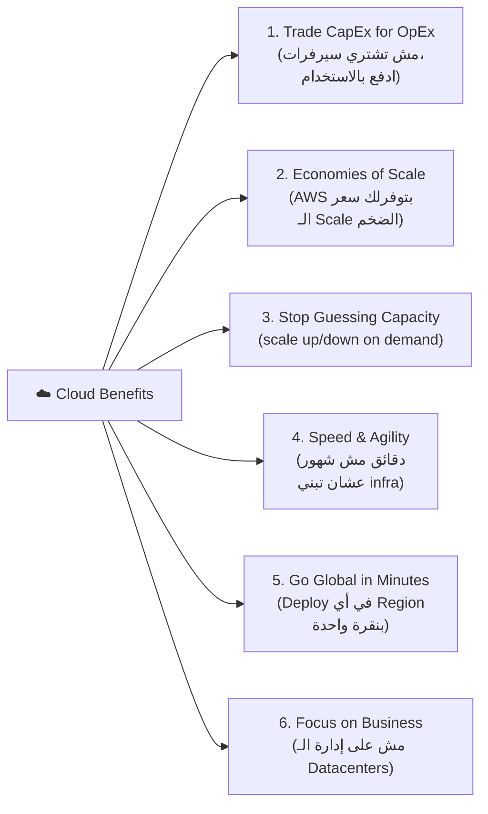
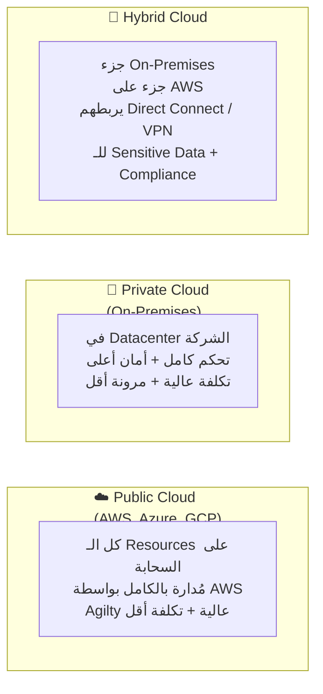
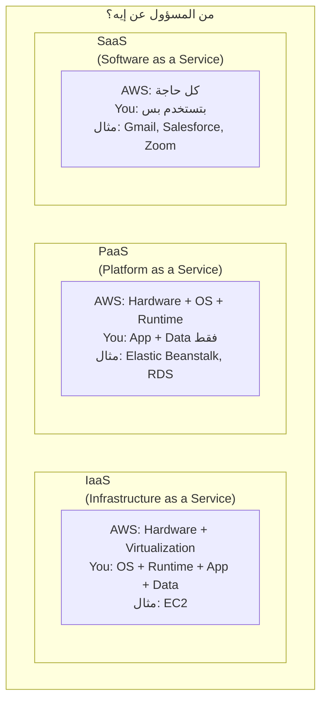
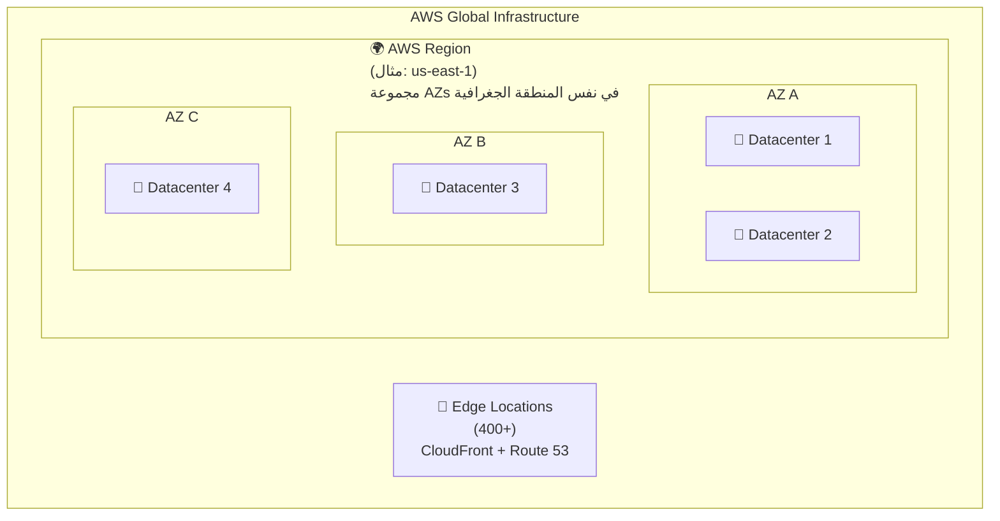
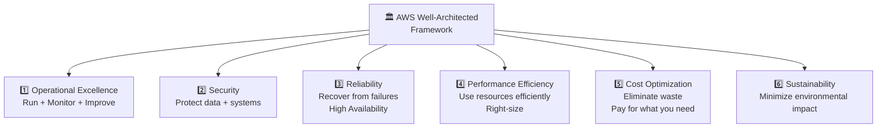
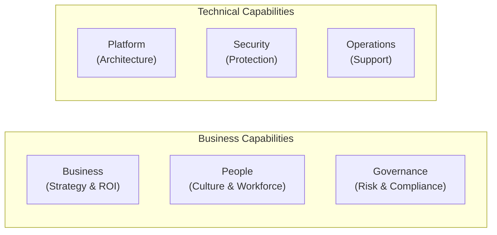

# ☁️ Domain 1 — Cloud Concepts
### الـ Cheat Sheet الشامل — مافيش كلمة فاتت

---

## 📋 فهرس سريع
- [[#🌩️ ما هي الـ Cloud Computing؟]]
- [[#📦 Deployment Models]]
- [[#🏗️ Service Models — IaaS vs PaaS vs SaaS]]
- [[#🌍 Global Infrastructure]]
- [[#🏛️ Well-Architected Framework]]
- [[#🗺️ CAF — Cloud Adoption Framework]]
- [[#📝 Master Keyword Table]]

---

## 🌩️ ما هي الـ Cloud Computing؟

> [!info] التعريف الرسمي
> Cloud Computing = توفير خدمات IT (Compute، Storage، Databases، Networking) عبر الإنترنت بنموذج **Pay-as-you-go**.

### الـ 5 Characteristics الجوهرية

```
1. On-Demand Self-Service   → تحجز Resources وقت ما تحتاج بدون تدخل بشري
2. Broad Network Access     → تقدر توصل من أي جهاز وأي مكان
3. Resource Pooling         → AWS بتشارك Resources بين آلاف العملاء (Multi-tenant)
4. Rapid Elasticity         → تكبر أو تصغر تلقائياً حسب الحاجة
5. Measured Service         → بتدفع بس على اللي استخدمته (Pay-per-use)
```

### الـ 6 فوايد الكبرى للـ Cloud



| الـ Keyword | الفايدة |
|---|---|
| `no upfront investment`, `operational expense` | CapEx → OpEx |
| `benefit from massive economies of scale` | Economies of Scale |
| `stop guessing capacity`, `right size` | Elasticity |
| `increase speed and agility` | Speed & Agility |
| `go global in minutes` | Global Reach |
| `focus on core business` | Stop spending on datacenters |

---

## 📦 Deployment Models



| النموذج | الـ Keyword |
|---|---|
| **Public Cloud** | `fully on cloud`, `no datacenters`, `all cloud services` |
| **Private Cloud** | `on-premises`, `full control`, `sensitive data can't leave`, `government compliance` |
| **Hybrid** | `some on-premises`, `extend to cloud`, `keep sensitive data on-prem` |

---

## 🏗️ Service Models — IaaS vs PaaS vs SaaS



| النموذج | مسؤوليتك | أمثلة AWS |
|---|---|---|
| **IaaS** | OS + App + Data | EC2، VPC، EBS |
| **PaaS** | App + Data فقط | Elastic Beanstalk، RDS، Lambda |
| **SaaS** | بتستخدم بس | Rekognition، Chime، WorkMail |

---

## 🌍 Global Infrastructure

> [!info] الـ 4 مستويات
> Region → Availability Zone → Edge Location → Local Zone/Wavelength/Outpost



### Regions

| الخاصية | التفاصيل |
|---|---|
| التعريف | مجموعة AZs في منطقة جغرافية (مثال: `us-east-1` = N. Virginia) |
| اختيار الـ Region | **Compliance** → Data Sovereignty لازم تراعي القانون |
| اختيار الـ Region | **Latency** → أقرب للمستخدمين |
| اختيار الـ Region | **Availability** → مش كل الـ Services في كل Region |
| اختيار الـ Region | **Pricing** → السعر بيختلف من Region لأخرى |

### Availability Zones (AZs)

| الخاصية | التفاصيل |
|---|---|
| التعريف | Datacenter واحد أو أكتر معزولين فيزيائياً |
| الحد الأدنى | **3 AZs** في كل Region (بعضها 6) |
| الفصل | كل AZ عندها طاقة + شبكة + تبريد مستقلة |
| الربط | بيتربطوا بـ High-speed private network |
| الهدف | **High Availability** + **Fault Tolerance** |

### Edge Locations

| الخاصية | التفاصيل |
|---|---|
| العدد | **400+** حول العالم (أكتر من الـ Regions) |
| الوظيفة | Cache content لـ CloudFront + Route 53 DNS |
| الهدف | **Low Latency** للمستخدمين العالميين |

### الـ Edge Services الإضافية

| الخدمة | الوظيفة | الـ Keyword |
|---|---|---|
| **AWS Outposts** | Rack من AWS في Datacenter بتاعتك | `on-premises AWS services`, `hybrid`, `run AWS locally` |
| **AWS Wavelength** | AWS Services في شبكة الـ 5G Telecom | `5G`, `ultra-low latency`, `mobile edge` |
| **AWS Local Zones** | Extensions من الـ Regions في مدن كبيرة | `very low latency near specific city`, `gaming`, `real-time` |

### الـ Global Services (مش مربوطة بـ Region)

`IAM` → `Route 53` → `CloudFront` → `WAF` → `Shield` → `Organizations` → `Billing`

---

## 🏛️ Well-Architected Framework

### الـ 6 Pillars



| Pillar | السؤال الجوهري | مثال |
|---|---|---|
| **Operational Excellence** | إزاي نشغل ونحسن؟ | IaC, CI/CD, monitoring |
| **Security** | إزاي نحمي؟ | IAM, encryption, WAF |
| **Reliability** | إزاي نتعافى؟ | Multi-AZ, backups, Auto Scaling |
| **Performance Efficiency** | إزاي نستخدم الموارد صح؟ | Right-sizing, serverless |
| **Cost Optimization** | إزاي نقلل التكلفة؟ | Reserved, Spot, delete unused |
| **Sustainability** | إزاي نقلل الأثر البيئي؟ | Minimize footprint, use managed services |

> [!tip] Well-Architected Tool
> AWS بتوفر **AWS Well-Architected Tool** في الـ Console — بيقيّمك على الـ 6 Pillars ويديك توصيات.
> **الـ Keyword:** `review workloads against best practices`, `identify high-risk issues`

---

## 🗺️ CAF — Cloud Adoption Framework

> [!info] الهدف
> دليل شامل بيساعد الشركات تتبنى الـ Cloud بشكل منظم. مش Technical بس — بيشمل Business والـ People والـ Governance كمان.

### الـ 6 Perspectives



| Perspective | التركيز | الـ Keyword |
|---|---|---|
| **Business** | ROI، Business case، Strategy | `business value`, `cloud investment justification` |
| **People** | Culture، Training، Leadership | `workforce transformation`, `culture change` |
| **Governance** | Risk، Compliance، Portfolio | `minimize risk`, `benefits realization` |
| **Platform** | Architecture، Engineering | `cloud platform design`, `data architecture` |
| **Security** | CIA Triad، Controls | `security controls`, `data protection` |
| **Operations** | Service delivery، Performance | `operational model`, `support processes` |

### الـ 4 Phases للـ CAF

```
1. Envision  → حدد الفرص وكيف الـ Cloud هيساعدك
2. Align     → حدد الـ Gaps في كل الـ 6 Perspectives
3. Launch    → طبّق أهم الـ Use Cases (Quick Wins)
4. Scale     → وسّع وتوسّع على كل الـ Organization
```

---

## 📝 Master Keyword Table

### Cloud Concepts Keywords

| الكلمة | الإجابة |
|---|---|
| `trade capital expense for operational expense` | CapEx → OpEx (Cloud benefit) |
| `benefit from massive economies of scale` | Economy of Scale |
| `stop guessing capacity` | Elasticity/On-demand |
| `increase speed and agility` | Cloud Agility |
| `go global in minutes` | Global Infrastructure |
| `focus on business differentiation` | Stop managing datacenters |
| `pay only for what you use` | Pay-as-you-go |

### Infrastructure Keywords

| الكلمة | الإجابة |
|---|---|
| `where AWS stores data physically` | Availability Zone (AZ) |
| `group of AZs` | AWS Region |
| `at least X AZs per Region` | **3 AZs minimum** |
| `content delivery, low latency globally` | Edge Locations (CloudFront) |
| `DNS resolution globally` | Route 53 (uses Edge Locations) |
| `run AWS services on-premises` | AWS Outposts |
| `5G ultra-low latency` | AWS Wavelength |
| `low latency in specific city` | AWS Local Zones |
| `global service, not regional` | IAM, Route 53, CloudFront, WAF, Shield |

### Well-Architected Keywords

| الكلمة | الإجابة |
|---|---|
| `run and monitor systems` | Operational Excellence |
| `protect data and systems` | Security |
| `recover from failure, high availability` | Reliability |
| `use resources efficiently, right-size` | Performance Efficiency |
| `eliminate waste, reduce costs` | Cost Optimization |
| `reduce environmental impact` | Sustainability |
| `review workloads against best practices` | Well-Architected Tool |

### CAF Keywords

| الكلمة | الإجابة |
|---|---|
| `business case for cloud` | Business Perspective (CAF) |
| `workforce training and culture` | People Perspective (CAF) |
| `risk management and compliance` | Governance Perspective (CAF) |
| `cloud architecture design` | Platform Perspective (CAF) |
| `identify cloud adoption gaps` | CAF |
| `cloud adoption phases` | Envision → Align → Launch → Scale |

### Service Model Keywords

| الكلمة | الإجابة |
|---|---|
| `you manage OS and application` | IaaS (EC2) |
| `you manage application only` | PaaS (Beanstalk, RDS) |
| `fully managed, just use it` | SaaS (Gmail, Salesforce) |
| `sensitive data can't leave premises` | Private Cloud / Hybrid |
| `extend on-premises to cloud` | Hybrid Cloud |

---

> [!success] 🎯 الخلاصة
> Domain 1 = **24% من الامتحان**.
> الأسئلة هنا Conceptual — مش Technical. بتسألك عن: ليه الـ Cloud؟ إيه الـ Deployment Models؟ الـ Global Infrastructure إيه مكوناتها؟
> **أهم حاجة:** اعرف الـ 6 Pillars بالترتيب + الـ 6 CAF Perspectives + فرق الـ AZ عن الـ Region عن الـ Edge Location.

---
*تم بناء هذا الملف من Domain 1 Notes + Practice Exams*
