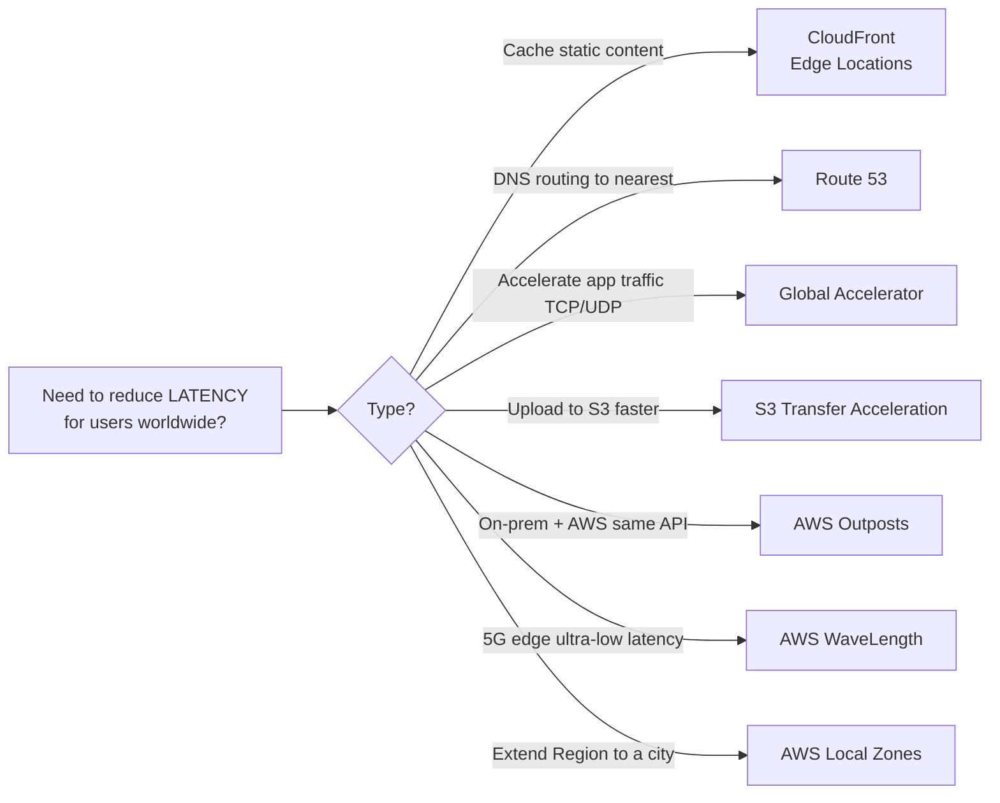
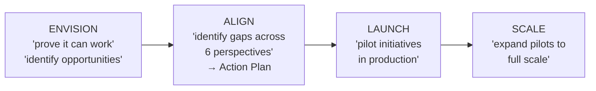

# 🔥 DOMAIN 1 — Cloud Concepts | CLF-C02 Mega Revision
> **يا Mohamed, ده ملف الـ Revision بتاعك للـ Domain 1 كله — بالـ Exam Patterns اللي شفتها في الـ Dumps بتاعتك.**
> الـ Domain ده 24% من الامتحان. Focus على الـ Keywords — دي هي اللي بتتهزق فيها.

---

## 📦 TABLE OF CONTENTS

1. [The 5 Characteristics of Cloud Computing](#1-the-5-characteristics)
2. [The 6 Advantages of Cloud Computing](#2-the-6-advantages)
3. [Cloud Models: IaaS / PaaS / SaaS](#3-cloud-service-models)
4. [Deployment Models: Public / Private / Hybrid](#4-deployment-models)
5. [Global Infrastructure: Region / AZ / Edge](#5-global-infrastructure)
6. [Global Services Cheat Sheet](#6-global-services)
7. [Well-Architected Framework: 6 Pillars](#7-well-architected-framework)
8. [AWS CAF: 6 Perspectives](#8-aws-caf)
9. [Migration Strategies: 7 Rs](#9-migration-strategies)
10. [Connectivity: VPN vs Direct Connect vs Transit GW](#10-connectivity)
11. [Snow Family: Snowball vs Snowmobile](#11-snow-family)
12. [DataSync vs Storage Gateway vs Transfer Family](#12-data-transfer-services)
13. [Keyword Trap Table](#13-keyword-trap-table)
14. [Exam Pattern Radar](#14-exam-pattern-radar)
15. [زتونة الإنترفيو — The Final Boss](#15-interview-zitona)

---

## 1. The 5 Characteristics

> الـ **NRMMO** — ازبطها زي اسم

| # | Characteristic | What It Means |
|---|---|---|
| 1 | **On-demand self-service** | تروح تعمل resource بدون تكلم أي حد من AWS |
| 2 | **Broad network access** | تاخد الـ resources من أي device عبر الـ network |
| 3 | **Resource pooling (Multi-tenancy)** | ناس كتير بتشارك نفس الـ physical hardware |
| 4 | **Rapid elasticity** | Scale up/down أوتوماتيك حسب الطلب |
| 5 | **Measured service** | Pay بالضبط اللي اتستخدم |

> ⚠️ **Exam Trap:** الامتحان بيحط options زي "Scalability" أو "High Availability" — دول **مش** من الـ 5 Characteristics الرسمية.

---

## 2. The 6 Advantages

> **TSSGAG** — Trade, Stop (×2), Scale, Benefit, Go

```
1. Trade CAPEX for OPEX          → بدل تاخد قرض تشتري servers، ادفع شهري
2. Benefit from economies of scale → AWS بيشتري بمليارات فالسعر اوفر عليك
3. Stop guessing capacity          → مش محتاج تتنبأ بـ traffic
4. Increase speed & agility        → تجرب project في ساعات مش شهور
5. Stop spending on data centers   → مفيش فاتورة كهرباء ولا أمن وفريق صيانة
6. Go global in minutes            → Deploy في أي Region بـ click
```

> 🎯 **Exam Pattern:** السؤال بيجي زي: "A company migrated to AWS and now pays on an as-needed basis" → الجواب: **Trade fixed expense for variable expense (OPEX)**

| Keyword في السؤال | الـ Advantage |
|---|---|
| "pay as needed / pay as you go" | Trade CAPEX → OPEX |
| "reduced prices / lower cost over time" | Economies of scale |
| "unpredictable traffic / don't know capacity" | Stop guessing capacity |
| "new features quickly / experiment / innovate" | Speed & Agility |
| "global users / worldwide / different regions" | Go global in minutes |
| "no data center staff / no hardware" | Stop spending on data centers |

---

## 3. Cloud Service Models

| | **On-Premises** | **IaaS** | **PaaS** | **SaaS** |
|---|---|---|---|---|
| **Who Manages** | You own everything | You own OS → App | You own App + Data only | Nothing — just use it |
| **AWS Manages** | Nothing | Physical infra only | Everything except App & Data | Everything |

| Model | AWS Example | 3rd Party Example | You Manage |
|---|---|---|---|
| **IaaS** | Amazon EC2 | DigitalOcean, Linode | OS, Runtime, App, Data |
| **PaaS** | Elastic Beanstalk | Heroku, Google App Engine | App code + Data only |
| **SaaS** | Rekognition, WorkMail | Gmail, Zoom, Dropbox | Nothing (just use it) |

> 🎯 **Keyword to Model Map:**

| Keyword | Model |
|---|---|
| "building blocks / networking / storage / compute" | **IaaS** |
| "focus on deployment / don't manage infrastructure" | **PaaS** |
| "completed product / run and managed by provider" | **SaaS** |
| "highest flexibility / closest to on-premises" | **IaaS** |

---

## 4. Deployment Models

| Model | Who Controls | When To Use | AWS Keyword |
|---|---|---|---|
| **Public Cloud** | AWS | Default — most workloads | "delivered over the Internet" |
| **Private Cloud** | You (on-prem) | Sensitive/regulated data | "single organization / complete control" |
| **Hybrid Cloud** | Both | Compliance + flexibility | "extend to the cloud / on-premises alongside cloud" |

> 🎯 **Exam Pattern:** لو السؤال فيه "AWS Outposts" → الجواب دايمًا **Hybrid**

---

## 5. Global Infrastructure

### The Hierarchy (من الأكبر للأصغر)

```
AWS GLOBAL NETWORK
│
├─── REGIONS  (e.g., us-east-1)
│    │  ▸ Cluster of data centers
│    │  ▸ Most services are region-scoped
│    │  ▸ Min 3 AZs, Max 6 AZs
│    │
│    └─── AVAILABILITY ZONES (AZs)  (e.g., us-east-1a)
│         │  ▸ One or more discrete data centers
│         │  ▸ Redundant power, networking
│         │  ▸ Connected with high bandwidth, ultra-low latency
│         │  ▸ Isolated from disasters
│
└─── EDGE LOCATIONS (400+)
     │  ▸ Content caching (CloudFront)
     │  ▸ More than Regions and AZs combined
     │
     └─── REGIONAL CACHES (10+)
```

> **المعادلة اللي هتيجي في الامتحان:**
> - AZs > Regions
> - Edge Locations > AZs > Regions
> - Edge Locations ≠ AZs (Trap!)

### How to Choose a Region? → **CAPS**

| Letter | Criteria |
|---|---|
| **C** | **Compliance** — Data residency / legal requirements |
| **A** | **Availability** of services (not all services in all regions) |
| **P** | **Proximity** — Closest to customers = lower latency |
| **S** | **Savings** — Pricing varies by region |

---

### Global Infrastructure Services Breakdown



---

## 6. Global Services

> **دي services مش مربوطة بـ Region** — اعرفها غيبًا

| Service | Type | Global? |
|---|---|---|
| IAM | Identity | ✅ Global |
| Route 53 | DNS | ✅ Global |
| CloudFront | CDN | ✅ Global |
| WAF | Security | ✅ Global |
| EC2 | Compute | ❌ Regional |
| S3 | Storage | ❌ Regional (bucket level) |
| Lambda | FaaS | ❌ Regional |
| Elastic Beanstalk | PaaS | ❌ Regional |

---

### CloudFront vs Global Accelerator vs S3 Transfer Acceleration

| | **CloudFront** | **Global Accelerator** | **S3 Transfer Acceleration** |
|---|---|---|---|
| **Type** | CDN / Cache | Network Proxy | S3 Upload accelerator |
| **Caches?** | ✅ Yes | ❌ No | ❌ No |
| **Use case** | Static files, videos, images | TCP/UDP apps, gaming, VoIP | Large S3 uploads |
| **IPs** | Dynamic | Static (Anycast) | — |
| **Edge Locations?** | ✅ Yes | ✅ Yes | ✅ Yes |
| **Keyword** | "cache / content / TTL / images" | "static IP / deterministic failover / TCP/UDP" | "upload to S3 globally" |

---

### Route 53 Routing Policies — Quick Reference

| Policy | When | Health Checks? |
|---|---|---|
| **Simple** | Single resource, no routing logic | ❌ No |
| **Weighted** | A/B testing, gradual migration | Optional |
| **Latency** | Route to lowest-latency region | Optional |
| **Failover** | Primary + Disaster Recovery | ✅ Yes (required) |

---

## 7. Well-Architected Framework

### The 6 Pillars — SORPCS

> اتفكر فيهم بالترتيب ده: **Operations → Security → Reliability → Performance → Cost → Sustainability**

| Pillar | One-Liner | Keyword Trap |
|---|---|---|
| **Operational Excellence** | Run & monitor systems, continuously improve | "operations as code" / "small reversible changes" |
| **Security** | Protect data, systems, assets. Risk mitigation | "risk assessment" / "traceability" |
| **Reliability** | Recover from failure, meet demand dynamically | "recover from failure" / "stop guessing capacity" |
| **Performance Efficiency** | Use compute efficiently as demand changes | "serverless" / "go global in minutes" |
| **Cost Optimization** | Deliver value at lowest price point | "pay only for what you use" / "consumption" |
| **Sustainability** | Minimize environmental impact of workloads | "maximize utilization" / "reduce waste" |

> ⚠️ **Exam Traps — NOT pillars:**
> - Availability ❌
> - Scalability ❌
> - High Availability ❌
> - Continuous Development ❌
> - Going global in minutes ❌ (ده Design Principle جوا الـ Performance pillar، مش Pillar لوحده)

---

### Pillar → Design Principle Mapping (الأكثر سؤالًا)

| If question says... | Answer Pillar |
|---|---|
| "monitor systems / run systems / improve processes / continually improve" | Operational Excellence |
| "risk assessment / protect information / systems and assets" | Security |
| "recover from failure / dynamically acquire resources / disruptions" | Reliability |
| "efficient use of compute / structured allocation / computing resources" | Performance Efficiency |
| "lowest price / deliver business value at lowest cost" | Cost Optimization |
| "environmental impact / minimize carbon / energy efficiency" | Sustainability |

---

### Design Principles per Pillar (الأكثر سؤالًا في الـ Dumps)

**Operational Excellence:**
- Perform operations **as code** (IaC)
- Make **frequent, small, reversible changes**
- Anticipate failure
- Learn from all operational failures

**Security:**
- **Enable traceability** (CloudTrail = Traceability)
- Apply security at **all layers**
- **Least privilege** (IAM)
- Protect data **in transit and at rest**

**Reliability:**
- **Automatically recover** from failure
- **Stop guessing capacity** → Auto Scaling
- Scale horizontally → no single point of failure
- Test recovery procedures

**Performance Efficiency:**
- Use **serverless architectures**
- Go **global in minutes**
- Experiment more often
- Democratize advanced technologies

**Cost Optimization:**
- Adopt a **consumption mode** (pay only what you use)
- Stop spending on **data center operations**
- Use **tags** to attribute expenditure

---

## 8. AWS CAF

> **CAF = Cloud Adoption Framework** — مش service، ده **Framework للتحول المؤسسي**

### The 6 Perspectives: BPG + PSO

**Business Capabilities (Non-Technical):**

| Perspective | Capabilities | Keywords |
|---|---|---|
| **Business** | Strategy, financial mgmt, data monetization, business insight | "ROI / business outcomes / strategy / data monetization" |
| **People** | Culture, org design, workforce, cloud fluency, leadership | "bridge between tech & business" / "diverse workforce / cloud fluency" |
| **Governance** | Portfolio mgmt, cloud financial mgmt, risk mgmt, program mgmt, data catalog | "orchestrate / minimize risk" / "data inventory / data catalog" |

**Technical Capabilities:**

| Perspective | Capabilities | Keywords |
|---|---|---|
| **Platform** | Data architecture, data engineering, CI/CD, scalable hybrid platform | "data architecture / CI-CD" / "build enterprise-grade platform" |
| **Security** | Identity & access, infrastructure protection, incident response, confidentiality, integrity | "identities & permissions at scale" / "incident response / protection" |
| **Operations** | Config mgmt, patch mgmt, monitoring, performance, service level management | "meets needs of business / delivery" / "configuration / patch management" |

> 🎯 **The Trickiest CAF Questions from Dumps:**

| Question Pattern | Answer |
|---|---|
| "bridge between technology and business" | **People** |
| "cloud fluency" | **People** |
| "organizational alignment / organization design" | **People** |
| "data architecture" | **Platform** |
| "data engineering" | **Platform** |
| "CI/CD capability" | **Platform** |
| "incident response" | **Security** |
| "infrastructure protection" | **Security** |
| "identity and access management at scale" | **Security** |
| "configuration management / patch management" | **Operations** |
| "monitoring workload performance / service level" | **Operations** |
| "portfolio management" | **Governance** |
| "cloud financial management" | **Governance** |
| "risk management" | **Governance** |
| "data catalog / inventory of data products" | **Governance** |
| "strategy management / business insight" | **Business** |
| "data monetization" | **Business** |
| "program and project management" | **Governance** ← Trap! (NOT Business) |

---

### CAF Transformation Phases: EALS



| Phase | Keyword |
|---|---|
| **Envision** | "identify transformation opportunities" / "digital transformation ambitions" |
| **Align** | "identify capability gaps" / "action plan" |
| **Launch** | "build and deliver pilot" / "incremental business value" |
| **Scale** | "expand pilot" / "desired scale" |

> ⚠️ **Trap:** "Assess" و"Mobilize" و"Migrate" مش phases في CAF! دي phases في AWS Migration Hub.

---

### CAF Transformation Domains (TPOP)

| Domain | Focus |
|---|---|
| **Technology** | Migrate & modernize legacy infrastructure |
| **Process** | Automate & optimize business operations, ML for CX |
| **Organization** | Reimagine operating model, agile teams |
| **Product** | New value propositions, new business models |

---

## 9. Migration Strategies

> **The 7 Rs** — but exam mostly asks about 4: **Rehost, Replatform, Refactor, Repurchase**

| Strategy | Nickname | What You Do | Effort |
|---|---|---|---|
| **Rehost** | Lift & Shift | Move AS-IS, no change | Low |
| **Replatform** | Lift & Reshape | Minor optimizations (e.g., move to managed service) | Medium |
| **Refactor** | Re-architect | Split monolith → microservices | High |
| **Repurchase** | Drop & Shop | Move to SaaS product | Medium |
| **Retain** | Keep it | Too risky to migrate | None |
| **Retire** | Kill it | Decommission | None |
| **Relocate** | Hypervisor move | VMware → AWS | Low |

> 🎯 **Keyword to Strategy Map:**

| Question says... | Strategy |
|---|---|
| "no changes / as-is / does not want to modify" | **Rehost** |
| "managed service / move to RDS / less overhead" | **Replatform** |
| "microservices / modernize / split monolith" | **Refactor** |
| "SaaS / commercial off-the-shelf / new product" | **Repurchase** |
| "monolithic → microservices" | **Refactor** ← دايمًا |
| "MySQL self-managed → Amazon RDS" | **Replatform** |
| "migrate EC2 to another Region" | **AWS Application Migration Service** |

---

## 10. Connectivity

### VPN vs Direct Connect vs Transit Gateway

| Option | Type | Setup Time | Cost | Latency | Use Case |
|---|---|---|---|---|---|
| **Site-to-Site VPN** | Encrypted tunnel over public internet | Hours | Low | Variable | Quick setup, backup connectivity |
| **AWS Direct Connect** | Dedicated private fiber | Weeks/months | High | Consistent | Real-time, no public internet, compliance |
| **AWS Transit Gateway** | Hub-and-spoke for VPCs | — | — | — | 100s of VPCs, simplify at scale |

> 🎯 **Keyword Decision Tree:**

| Keyword in Question | Answer |
|---|---|
| "dedicated / private / no public internet / consistent latency" | **Direct Connect** |
| "quick / within 1 week / fast setup / encrypted over internet" | **Site-to-Site VPN** |
| "hundreds of VPCs / simplify at scale / hub-and-spoke" | **Transit Gateway** |
| "real-time / minimal latency / consistent connection" | **Direct Connect** |
| "backup / secondary connectivity" | **VPN** |

---

## 11. Snow Family

| Device | Capacity | Use Case |
|---|---|---|
| **Snowball Edge (Storage Optimized)** | 80 TB | Migrate TBs of data, edge compute |
| **Snowball Edge (Compute Optimized)** | 40 TB NVMe | ML at the edge, high compute needs |
| **Snowmobile** | 100 PB | Migrate PETABYTES — "Exabyte-scale" |

> 🎯 **Rules:**
> - "petabytes / 50 petabytes+" → **Snowmobile** (it's a literal TRUCK)
> - "no internet / offline migration" → Snow Family (any)
> - Data IN to S3 from Snowball = **FREE**
> - Data OUT of S3 to Snowball = has cost
> - First 10 days of Snowball = FREE, after 10 days = charged per day

---

## 12. Data Transfer Services

| Service | Purpose | Keyword |
|---|---|---|
| **DataSync** | Migrate files online (NFS/SMB → S3/EFS/FSx) | "one-time migration / millions of files / online" |
| **Storage Gateway** | Hybrid storage (on-prem access to cloud) | "on-prem users access unlimited cloud storage" |
| **Transfer Family** | SFTP/FTP/FTPS to S3 or EFS | "file access protocols / SFTP" |
| **Application Discovery Service** | Discover on-prem before migration | "understand existing / collect config data / before migration" |
| **Application Migration Service** | Actual migration / lift & shift | "convert server / move EC2 / rehost" |

---

## 13. Keyword Trap Table

> ده القسم الأهم — الـ exam بيلعب على الـ keywords دي

### Confused Concepts

| Word in Question | Common Wrong Answer | Correct Answer |
|---|---|---|
| "withstand failures with minimal downtime" | Reliability | **High Availability** |
| "automatically acquire + release resources" | Scalability | **Elasticity** |
| "scale out and scale in" | High Availability | **Elasticity** |
| "scale based on demand, no overprovisioning" | Elasticity | **Scalability** OR **Elasticity** (context!) |
| "eliminate underutilized CPU" | Scalability | **Elasticity** |
| "deploy globally / global reach" | Agility | **Global Reach** |
| "experiment quickly / new projects fast" | Global Reach | **Agility** |
| "provision resources quickly with minimal effort" | Pay-as-you-go | **Agility** |
| "cache content at edge" | Global Accelerator | **CloudFront** |
| "static IP / TCP/UDP apps / deterministic failover" | CloudFront | **Global Accelerator** |
| "monolith → microservices" | Replatform | **Refactor** |
| "managed service / less overhead (e.g., RDS)" | Refactor | **Replatform** |
| "no internet / petabytes" | DataSync | **Snowmobile** |
| "online migration / millions of files" | Snow Family | **DataSync** |
| "data catalog / inventory" | Platform | **Governance** |
| "CI/CD" | Operations | **Platform** |
| "patch management / configuration management" | Governance | **Operations** |
| "program & project management" | Business | **Governance** |
| "organization design" | Governance | **People** |
| "cloud fluency" | Operations | **People** |

---

### Cloud Economics Traps

| Phrase | Meaning | Advantage # |
|---|---|---|
| "trade CAPEX for OPEX" | No upfront, pay as you go | #1 |
| "economies of scale" | AWS buys cheap, passes savings | #2 |
| "stop guessing capacity" | No overprovisioning needed | #3 |
| "speed and agility" | Experiment in minutes not months | #4 |
| "focus on business / no data center" | No servers to maintain | #5 |
| "global in minutes" | Deploy worldwide fast | #6 |
| "variable expense" = OPEX | ✅ Cloud benefit | |
| "fixed expense" = CAPEX | ❌ On-premises problem | |

---

### AZ / Region / Edge — Physical vs Logical

| Term | Physical? | Scope | Contains |
|---|---|---|---|
| **Data Center** | ✅ Yes | Smallest | Servers, racks |
| **Availability Zone** | ✅ Yes (1+ data centers) | AZ | Data Centers |
| **Region** | Logical | Regional | Min 3 AZs |
| **Edge Location** | ✅ Yes | Global | CloudFront cache |
| **Local Zone** | ✅ Yes | Extension of Region | Compute near city |
| **WaveLength Zone** | ✅ Yes | 5G carrier edge | Telecom infra |

> Numbers rule: **Edge Locations (400+) > AZs > Regions**

---

## 14. Exam Pattern Radar

> من الـ 137 سؤال اللي اتحللوا من الـ Dumps بتاعتك:

| Topic | # Questions | Priority |
|---|---|---|
| Well-Architected Pillars | ~30 | 🔥🔥🔥 |
| AWS CAF Perspectives | ~28 | 🔥🔥🔥 |
| Global Infrastructure | ~20 | 🔥🔥 |
| Cloud Benefits / Concepts | ~18 | 🔥🔥 |
| Migration Strategies | ~10 | 🔥🔥 |
| Connectivity (VPN/DC) | ~8 | 🔥 |
| CloudFront / Route 53 | ~8 | 🔥 |
| Snow Family | ~6 | 🔥 |
| Data Transfer Services | ~5 | 🔥 |

### Most Repeated Answer Patterns

| # | Pattern | Answer |
|---|---|---|
| 1 | "loosely coupled" | Design principle — جواب لـ 5+ أسئلة مختلفة |
| 2 | "microservices / modernize" | **Refactor** |
| 3 | "recover / failure / disruptions" | **Reliability** |
| 4 | "improve processes / small reversible changes" | **Operational Excellence** |
| 5 | "acquire and release resources" | **Elasticity** |
| 6 | "dedicated / no public internet / consistent" | **Direct Connect** |
| 7 | "cache at edge / content delivery" | **CloudFront** |
| 8 | "static IP / TCP/UDP / deterministic failover" | **Global Accelerator** |
| 9 | "patch / config / performance monitoring" | **Operations (CAF)** |
| 10 | "data architecture / CI-CD" | **Platform (CAF)** |

---

### The 3 Annoying "Which TWO" Traps

**WAF Pillars (Choose 2):**
- ✅ Reliability, Operational Excellence, Security, Performance Efficiency, Cost Optimization, Sustainability
- ❌ Scalability, High Availability, Availability, Resource Scalability, System Elasticity

**CAF Phases (Choose 2):**
- ✅ Envision, Align, Launch, Scale
- ❌ Assess, Mobilize, Migrate (دول AWS MAP، مش CAF)

**Global Infrastructure (Choose 2):**
- ✅ Regions + AZs بيكونوا الجواب
- ❌ VPC, ElastiCache, S3 (services مش infrastructure)

---

## 15. زتونة الإنترفيو 🫒

> اللي لو حفظت غيره كله ونسيته، دي هي الـ lifeline بتاعتك في الـ exam

### ⚡ THE FINAL CHEAT SHEET ⚡

**CHARACTERISTICS (5):**
On-demand | Broad access | Multi-tenancy | Rapid Elasticity | Measured service

**ADVANTAGES (6):**
CAPEX→OPEX | Economies of Scale | Stop guessing capacity | Speed & Agility | Stop spending on DCs | Go global in minutes

**WAF PILLARS (6) — SORPCS:**
Security | Operational Excellence | Reliability | Performance Efficiency | Cost Optimization | Sustainability

**CAF PERSPECTIVES (6) — BPG-PSO:**
Business | People | Governance | Platform | Security | Operations

**CAF PHASES — EALS:**
Envision → Align → Launch → Scale

**7 Rs (Know These 4):**
Rehost (as-is) | Replatform (managed svc) | Refactor (microservices) | Repurchase (SaaS)

---

**KEYWORD COMPASS:**

| Keyword | Answer |
|---|---|
| "recover from failure" | Reliability |
| "improve processes / small reversible" | Operational Excellence |
| "serverless / go global" | Performance Efficiency |
| "lowest cost / pay only for use" | Cost Optimization |
| "risk / protect assets" | Security |
| "minimize carbon / energy" | Sustainability |
| "cache at edge" | CloudFront |
| "static IP / TCP/UDP" | Global Accelerator |
| "dedicated / no internet" | Direct Connect |
| "quick / 1 week" | VPN |
| "100s of VPCs" | Transit Gateway |
| "petabytes / no internet" | Snowmobile |
| "online file migration" | DataSync |
| "hybrid storage on-prem" | Storage Gateway |
| "monolith → microservices" | Refactor |
| "managed service (RDS)" | Replatform |
| "as-is / no changes" | Rehost |

---

> - **AMS** = AWS Managed Services → للـ operational support
> - **CAF** = Framework مش service → للـ transformation planning
> - **WAF Tool** = Well-Architected Tool → review your architecture

---

> **بالتوفيق يا Mohamed! 🎯 ربنا يوفقك في الامتحان بكرة.**
> الـ Domain 1 بيتكرر فيه نفس الـ 10 questions styles — لو فهمت الـ Keywords mapping ده، مفيش سؤال هيصعب عليك.
