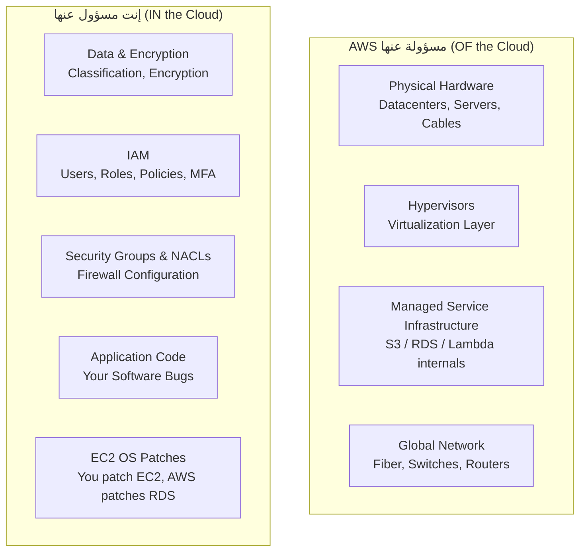
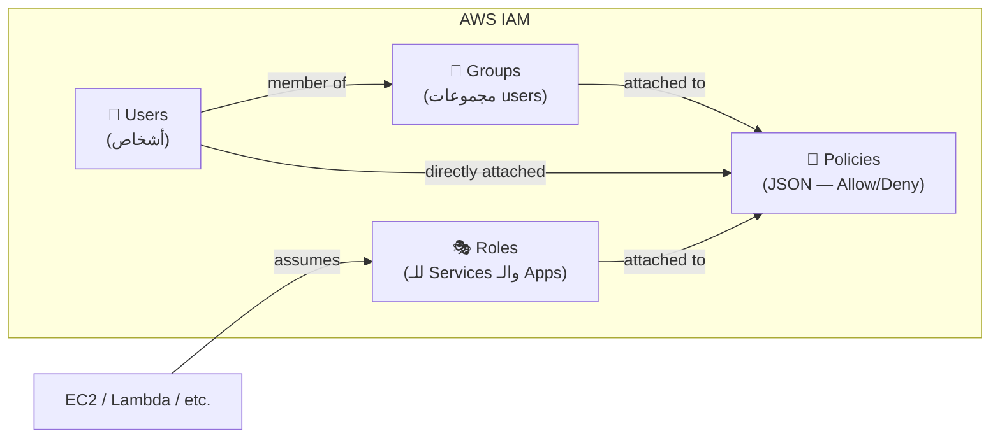
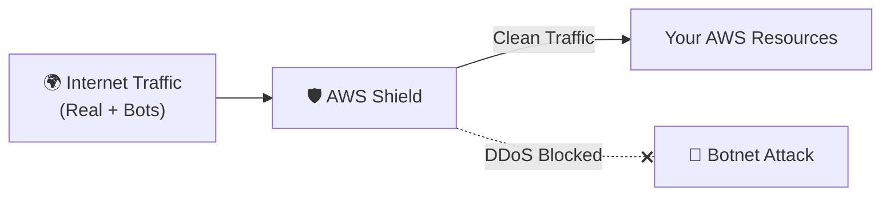
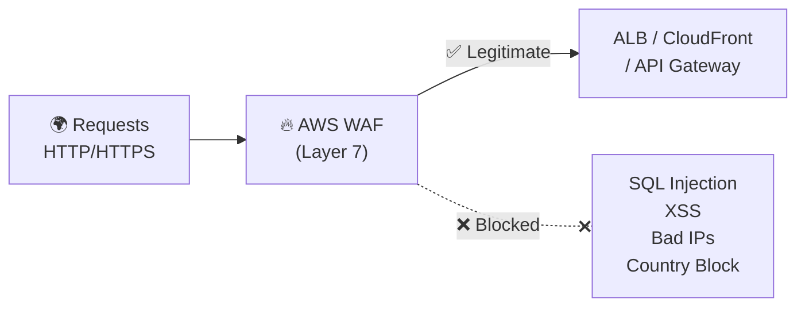
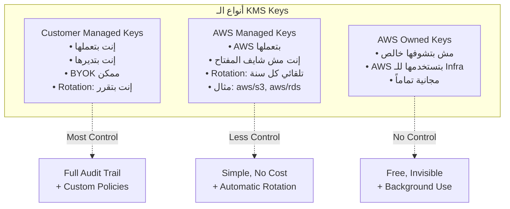
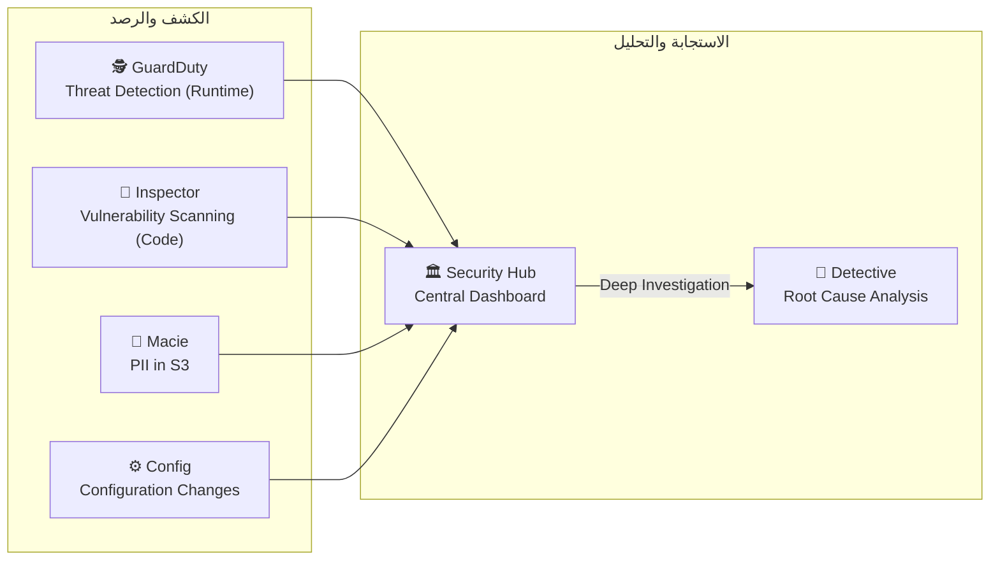

# 🔒 Domain 2 — Security & Compliance
### الـ Cheat Sheet الشامل — مافيش كلمة فاتت

---

## 📋 فهرس سريع
- [[#🤝 Shared Responsibility Model]]
- [[#👤 IAM — Identity & Access Management]]
- [[#💥 DDoS Protection — Shield]]
- [[#🔥 WAF & Network Security]]
- [[#🔑 Encryption — KMS & CloudHSM]]
- [[#📜 Certificates & Secrets]]
- [[#🕵️ Threat Detection]]
- [[#🏛️ Identity Services]]
- [[#👑 Root User & Special Actions]]
- [[#📝 Master Keyword Table]]

---

## 🤝 Shared Responsibility Model

> [!info] الجملتان اللي لازم تحفظهم غيباً
> **AWS مسؤولة عن: Security OF the Cloud** (الـ Infrastructure نفسها)
> **إنت مسؤول عن: Security IN the Cloud** (إيه بتعمله جوا)



### التقسيم حسب الـ Service

| الخدمة | AWS مسؤولة عن | إنت مسؤول عن |
|---|---|---|
| **EC2** | Physical hardware, Hypervisor | OS patches, Security Groups, App code |
| **RDS** | OS patches, DB software patches, Hardware | Security Groups, Encryption, DB users/permissions, Network access |
| **S3** | Infrastructure, Data separation | Bucket policies, Encryption, Access control, Public/Private settings |
| **Lambda** | Runtime environment, Infrastructure | Function code, IAM execution role, Resource policies |

> [!warning] فخ الامتحان المتكرر
> - `Who patches OS on EC2?` → **Customer**
> - `Who patches OS on RDS?` → **AWS** (Managed service)
> - `Who configures Security Groups?` → **Customer** (even for RDS)
> - `Who is responsible for physical security of DC?` → **AWS**

---

## 👤 IAM — Identity & Access Management

> [!info] أصل الحكاية
> IAM = حارس البوابة. بيتحكم مين يقدر يوصل لأي Resource في AWS Account بتاعك.

### المكونات الأساسية



| المكون | الوصف | الاستخدام |
|---|---|---|
| **Users** | شخص محدد (موظف) | Login بـ Username/Password أو Access Keys |
| **Groups** | مجموعة Users | تطبيق Policy على فريق كامل |
| **Roles** | هوية مؤقتة بلا Password | للـ Services (EC2, Lambda) + Cross-account |
| **Policies** | JSON بيحدد الصلاحيات | Attached to Users/Groups/Roles |

### أنواع الـ Policies

| النوع | التفاصيل | الـ Keyword |
|---|---|---|
| **AWS Managed** | AWS بتديرها وبتحدثها | مناسبة للـ common use cases |
| **Customer Managed** | إنت بتعملها وبتديرها | Custom permissions |
| **Inline Policy** | مدمجة في User/Role مباشرة، تُحذف معه | تجنبها — استخدم Managed |

### Principle of Least Privilege

> [!important] القاعدة الذهبية في IAM
> ادي كل User/Role **بس** الصلاحيات اللي محتاجها بالظبط. لا أكتر. `مثال: مطور محتاج يقرأ من S3 بس → ادي بس s3:GetObject مش s3:*`

### MFA (Multi-Factor Authentication)

| السيناريو | الحل |
|---|---|
| حماية Root User | ✅ إلزامي — فعّله فوراً |
| حماية IAM Users | ✅ موصى به بشدة |
| Types | Virtual (Google Authenticator), Hardware Key, U2F |

### Access Keys

- للوصول من الـ CLI أو SDK (مش Console)
- تتكون من **Access Key ID** + **Secret Access Key**
- السر بيظهر **مرة واحدة فقط** عند الإنشاء
- **مش تشاركها أبداً** — لو اتسربت، احذفها فوراً وعمل جديدة
- EC2/Lambda محتاجة تعمل Request لـ AWS؟ → استخدم **IAM Role** مش Access Keys

### IAM Best Practices

```
✅ فعّل MFA على Root User فوراً
✅ لا تستخدم Root User للأعمال اليومية
✅ عمل IAM Users منفصلة للأشخاص
✅ إدي Permissions للـ Groups مش للـ Users مباشرة
✅ استخدم Roles للـ Services (مش Access Keys)
✅ اتبع Least Privilege
✅ راجع IAM Credentials Report بانتظام
❌ لا تشارك Access Keys
❌ لا تعمل Access Keys للـ Root User
```

### IAM Access Analyzer

- يكشف الـ Resources اللي متاحة من بره الـ Account أو Organization
- `External Access` → Resource shared مع حسابات تانية
- **الـ Keyword:** `detect unintended access`, `external sharing detection`, `identify resources exposed to external`

---

## 💥 DDoS Protection — Shield



| | Shield Standard | Shield Advanced |
|---|---|---|
| التكلفة | **مجاني — تلقائي** | **$3,000/شهر/Organization** |
| التفعيل | أوتوماتيك على كل حساب | يدوي |
| الحماية | Layer 3/4 فقط | **Layer 3/4/7** |
| فريق متخصص | ❌ | ✅ **SRT (Shield Response Team) 24/7** |
| حماية الفواتير | ❌ | ✅ **DDoS Cost Protection** |
| Visibility Dashboard | ❌ | ✅ |
| الخدمات المحمية | All | ALB, CloudFront, Route 53, Global Accelerator |

> [!warning] الفخاخ الأهم في الامتحان
> - `24/7 access to DDoS Response Team (SRT)` → **Shield Advanced**
> - `Cost protection from DDoS-related scaling` → **Shield Advanced**
> - `Free automatic DDoS protection` → **Shield Standard**
> - `$3,000/month` → **Shield Advanced**

---

## 🔥 WAF & Network Security

### AWS WAF (Web Application Firewall)



| الخاصية | التفاصيل |
|---|---|
| يعمل على | **Layer 7 (HTTP/HTTPS)** |
| بينشر على | **ALB، API Gateway، CloudFront** |
| بيحمي من | SQL Injection، XSS، Bad Bots، Geo-blocking |
| Web ACLs | مجموعة Rules بتطبقها على الـ Traffic |
| **Rate-based Rules** | تمنع IP لو عمل أكتر من X requests/minute |
| **الـ Keyword** | `SQL injection`, `XSS`, `Layer 7`, `block specific countries`, `rate limiting on HTTP` |

### AWS Network Firewall

- Protection على مستوى الـ VPC كامل (Layer 3-7)
- أقوى من Security Groups + NACLs
- **الـ Keyword:** `VPC-level firewall`, `intrusion detection`, `stateful packet inspection`

### AWS Firewall Manager

- إدارة Security Policies على مستوى **AWS Organization** كلها
- بتطبق WAF Rules + Shield + Security Groups على كل الـ Accounts تلقائياً
- **الـ Keyword:** `central management`, `organization-wide security`, `apply WAF to all accounts`

### Penetration Testing Rules

> [!important] مسموح بدون إذن على 8 Services
> EC2, RDS, CloudFront, Aurora, API Gateway, Lambda, Lightsail, Elastic Beanstalk

> [!danger] ممنوع دايماً بدون استثناء
> - DDoS Simulation
> - Port/Protocol/Request Flooding
> - DNS Zone Walking
>
> حتى لو على Infrastructure بتاعتك — لأن ممكن تأثر على عملاء تانيين!

---

## 🔑 Encryption — KMS & CloudHSM

### KMS (Key Management Service)



| نوع الـ Key | من يديرها؟ | Rotation | BYOK | الاستخدام |
|---|---|---|---|---|
| **Customer Managed (CMK)** | إنت | اختياري (يدوي أو تلقائي) | ✅ | Compliance، Audit، Custom |
| **AWS Managed** | AWS | تلقائي كل سنة | ❌ | عادي — لما تفعّل encryption على S3/RDS |
| **AWS Owned** | AWS | AWS | ❌ | Background — ما بتشوفهاش |

| الـ Keyword | الإجابة |
|---|---|
| `manage your own keys`, `BYOK`, `full control over keys` | Customer Managed CMK |
| `audit key usage`, `CloudTrail key logs` | Customer Managed CMK |
| `AWS manages keys automatically` | AWS Managed Keys |
| `no additional cost for encryption keys` | AWS Owned Keys |

### CloudHSM (Hardware Security Module)

| الخاصية | التفاصيل |
|---|---|
| النوع | **Dedicated Physical Hardware** مخصص ليك |
| المعيار | **FIPS 140-2 Level 3** (أعلى مستوى compliance) |
| من يدير المفاتيح؟ | **إنت فقط — AWS مش عندها Access** |
| فرق عن KMS | KMS = AWS بتدير الـ HSM. CloudHSM = إنت بتدير الـ HSM |
| **الـ Keyword** | `FIPS 140-2 Level 3`, `dedicated hardware`, `you manage keys entirely`, `AWS has no access to keys` |

> [!important] KMS vs CloudHSM
> | | KMS | CloudHSM |
> |---|---|---|
> | الـ Hardware | Shared (Multi-tenant) | **Dedicated** |
> | AWS Access | AWS يقدر يدير | **AWS مش عندها access** |
> | FIPS Level | Level 2 | **Level 3** |
> | التكلفة | رخيص | غالي |
> | الاستخدام | معظم الحالات | **Strict compliance, no AWS access** |

---

## 📜 Certificates & Secrets

### ACM (AWS Certificate Manager)

| الخاصية | التفاصيل |
|---|---|
| الوظيفة | إصدار وإدارة SSL/TLS Certificates للـ HTTPS |
| التجديد | ✅ **تلقائي** — ما تنساش تجدد |
| التكامل | ALB، CloudFront، API Gateway |
| المجاني؟ | ✅ مجاني للـ Public Certificates |
| **الـ Keyword** | `SSL/TLS`, `HTTPS`, `certificate`, `auto-renew`, `encrypt in-transit` |

### AWS Secrets Manager

| الخاصية | التفاصيل |
|---|---|
| الوظيفة | تخزين وإدارة Secrets (DB passwords, API keys) |
| **Auto Rotation** | ✅ **تلقائي** — يغير الباسوورد بانتظام تلقائياً |
| التكامل مع RDS | بيغير الباسوورد على RDS وبيحدّث الـ Secret في نفس الوقت |
| التشفير | KMS-based |
| **الـ Keyword** | `auto rotation`, `database credentials`, `rotate secrets`, `store and rotate` |

### AWS Artifact

| الخاصية | التفاصيل |
|---|---|
| الوظيفة | بوابة تحميل تقارير الـ Compliance الرسمية لـ AWS |
| التقارير | SOC 1/2/3، ISO 27001، PCI-DSS، HIPAA |
| **الـ Keyword** | `compliance reports`, `SOC`, `PCI`, `ISO`, `download audit reports`, `share with auditors` |

> [!tip] SSM Parameter Store vs Secrets Manager
> | | Parameter Store | Secrets Manager |
> |---|---|---|
> | Auto Rotation | ❌ | ✅ |
> | RDS Integration | ❌ | ✅ |
> | التكلفة | أرخص | أغلى |
> | الاستخدام | Config values, non-sensitive | **DB passwords + rotation** |

---

## 🕵️ Threat Detection

### الخريطة الكاملة لخدمات الأمان



### GuardDuty — المحقق الذكي

| الخاصية | التفاصيل |
|---|---|
| وظيفته | **Intelligent Threat Detection** بـ ML |
| مصادر البيانات | CloudTrail Logs + VPC Flow Logs + DNS Logs |
| Agent مطلوب؟ | ❌ **Agentless** |
| Trial | 30 يوم مجاناً |
| الناتج | **Findings** → EventBridge → Lambda/SNS |
| يكشف | Crypto mining، Compromised EC2، Unusual API calls، Exfiltration |
| **الـ Keyword** | `threat detection`, `unusual API calls`, `compromised instance`, `ML-based security`, `no agent needed` |

### Inspector — فاحص الثغرات

| الخاصية | التفاصيل |
|---|---|
| وظيفته | **Automated Vulnerability Assessment** |
| بيفحص على | EC2 + **ECR Container Images** + Lambda Functions |
| المرجع | CVE Database (Common Vulnerabilities and Exposures) |
| الناتج | Risk Score لكل ثغرة |
| **الـ Keyword** | `vulnerability scanning`, `CVE`, `security assessment`, `container image scanning`, `patch urgency` |

> [!important] GuardDuty vs Inspector
> - **GuardDuty** = "حاجة بتحصل دلوقتي" (Runtime behavior)
> - **Inspector** = "حاجة ممكن تحصل" (Static vulnerabilities in code/packages)

### Macie — صيد البيانات الحساسة

| الخاصية | التفاصيل |
|---|---|
| وظيفته | يكشف **PII وبيانات حساسة في S3** |
| يستخدم | ML + Pattern Matching |
| الناتج | Alerts عبر EventBridge |
| **الـ Keyword** | `PII`, `sensitive data in S3`, `personally identifiable information`, `data privacy` |

### AWS Config — سجل التاريخ

| الخاصية | التفاصيل |
|---|---|
| وظيفته | تتبع تغييرات الـ Configuration على مر الوقت |
| السؤال اللي بيجاوب عليه | **"إيه اللي اتغير ومتى؟"** |
| Config Rules | تحدد ما هو Compliant وما هو لأ |
| Auto Remediation | يصلح المخالفات تلقائياً (عبر SSM) |
| النطاق | Regional (ممكن Aggregate) |
| **الـ Keyword** | `compliance`, `configuration history`, `drift detection`, `is port 22 open?`, `what changed?` |

### Security Hub — غرفة العمليات

| الخاصية | التفاصيل |
|---|---|
| وظيفته | **Central Security Dashboard** يجمع كل الـ Findings |
| يجمع من | GuardDuty + Inspector + Macie + Config + IAM Access Analyzer + Firewall Manager |
| شرط | **AWS Config لازم Enabled** |
| Multi-Account | ✅ يدعم Organization-level |
| **الـ Keyword** | `single pane of glass`, `aggregate security findings`, `central dashboard`, `multi-account security` |

### Detective — التحقيق العميق

| الخاصية | التفاصيل |
|---|---|
| وظيفته | **Root Cause Analysis** للـ Security Incidents |
| يحلل | VPC Flow Logs + CloudTrail + GuardDuty Findings |
| الناتج | Visualizations + Graphs + Timeline |
| **الـ Keyword** | `root cause analysis`, `deep investigation`, `who, what, when, where`, `visualize incident` |

> [!tip] Security Hub vs Detective
> - **Security Hub** = يجمع ويعرض (Aggregator)
> - **Detective** = يحقق في السبب (Investigator)

### AWS Abuse

- بتبلّغ على AWS Resources بتتستخدم في Spam/DDoS/Malware/Illegal Content
- البريد: `abuse@amazonaws.com`
- **الـ Keyword:** `report abuse`, `spam from AWS IP`, `AWS-hosted attack`

---

## 🏛️ Identity Services

### IAM Identity Center (SSO)

| الخاصية | التفاصيل |
|---|---|
| الاسم القديم | AWS Single Sign-On (SSO) |
| وظيفته | Login مرة واحدة → توصل لكل الـ AWS Accounts والـ Apps |
| يدعم | SAML 2.0، Active Directory، Social Providers |
| **الـ Keyword** | `single sign-on`, `SSO`, `one login for all accounts`, `centralized access` |

### Amazon Cognito — للـ End Users

| الخاصية | التفاصيل |
|---|---|
| وظيفته | Identity Management للـ External Users (Mobile/Web Apps) |
| User Pools | تسجيل + Login للمستخدمين |
| Identity Pools | بيدي AWS Credentials مؤقتة للمستخدمين |
| Social Login | Google, Facebook, Apple, SAML |
| **الـ Keyword** | `millions of users`, `mobile app users`, `external customers`, `social login`, `not IAM users` |

> [!important] IAM vs Cognito
> - **IAM** = للموظفين والـ Services الداخلية
> - **Cognito** = لملايين الـ Customers على الـ App

### AWS Directory Services

| الخدمة | الوظيفة | الـ Keyword |
|---|---|---|
| **AD Connector** | Proxy للـ On-Premises AD بدون نقل users | `proxy to on-premises AD`, `no migration` |
| **AWS Managed Microsoft AD** | AD جديد كامل في AWS + Trust مع On-Prem | `full AD in AWS`, `trust relationship` |
| **Simple AD** | AD بسيط مستقل في AWS (بدون On-Prem) | `standalone`, `basic AD features`, `no on-premises` |

> [!tip] AD في الامتحان
> `authenticate against existing on-premises AD without migrating` → **AD Connector**
> `full Active Directory in AWS cloud` → **AWS Managed Microsoft AD**

### AWS STS (Security Token Service)

- يُصدر **Temporary Security Credentials** (بتنتهي بعد فترة)
- `AssumeRole` = طريقة تاخد صلاحيات Role مؤقتاً
- **الـ Keyword:** `temporary credentials`, `cross-account access`, `AssumeRole`, `short-term tokens`

---

## 👑 Root User & Special Actions

> [!danger] الـ Root User — حماية صارمة
> - فعّل **MFA فوراً** على الـ Root
> - **لا تعمل Access Keys** للـ Root
> - **لا تستخدمه يومياً** — عمل IAM Admin User بدلاً منه

### Actions تتطلب Root User فقط

```
✅ إغلاق الـ AWS Account نهائياً
✅ تغيير أو إلغاء الـ Support Plan
✅ تغيير إعدادات الـ Account (Account Name, Root Email)
✅ تفعيل IAM Access للـ Billing
✅ View Certain Tax Invoices
✅ Restore IAM User Permissions
✅ Submit GovCloud Account
❌ كل حاجة تانية ممكن تعملها بـ IAM Admin User
```

---

## 📝 Master Keyword Table

### Shared Responsibility

| الكلمة | الإجابة |
|---|---|
| `Physical hardware` | AWS |
| `OS patches on EC2` | **Customer** |
| `OS patches on RDS` | **AWS** |
| `Configure Security Groups` | Customer (even for RDS) |
| `Encrypt S3 data` (enable) | Customer |
| `Underlying S3 infrastructure` | AWS |

### IAM Keywords

| الكلمة | الإجابة |
|---|---|
| `Least privilege`, `minimum permissions` | IAM Best Practice |
| `Temporary access to AWS resources` | IAM Roles / STS |
| `Service needs to call S3` | IAM Role (not access keys) |
| `Detect resources shared externally` | IAM Access Analyzer |
| `SSO for all AWS accounts` | IAM Identity Center |

### Security Keywords

| الكلمة | الإجابة |
|---|---|
| `DDoS Layer 3/4, free, automatic` | Shield Standard |
| `DDoS Layer 7, SRT team, $3000/month` | Shield Advanced |
| `DDoS cost protection` | Shield Advanced |
| `SQL Injection, XSS, Layer 7 filtering` | WAF |
| `Geo-blocking at HTTP level` | WAF |
| `Organization-wide WAF management` | Firewall Manager |
| `VPC-level deep packet inspection` | Network Firewall |
| `FIPS 140-2 Level 3, dedicated HSM` | CloudHSM |
| `Manage your own encryption keys` | CloudHSM or Customer Managed KMS |
| `AWS-managed encryption keys` | AWS KMS |
| `SSL/TLS certificate, HTTPS, auto-renew` | ACM |
| `Store DB credentials + auto rotation` | Secrets Manager |
| `Store config, no rotation needed` | SSM Parameter Store |
| `SOC/PCI/ISO compliance reports` | AWS Artifact |
| `Pen test allowed without permission` | Yes — 8 services |
| `DDoS simulation allowed?` | **No — Always prohibited** |

### Threat Detection Keywords

| الكلمة | الإجابة |
|---|---|
| `ML threat detection, agentless` | GuardDuty |
| `Unusual API calls at 3 AM` | GuardDuty |
| `Compromised EC2 mining crypto` | GuardDuty |
| `CVE vulnerabilities in EC2/Lambda/ECR` | Inspector |
| `Container image vulnerability scan` | Inspector |
| `PII in S3, sensitive data discovery` | Macie |
| `What changed in configuration?` | AWS Config |
| `Is S3 bucket public? (compliance)` | AWS Config |
| `Central security findings dashboard` | Security Hub |
| `Root cause analysis of incident` | Detective |
| `Who did what, visualize attack` | Detective |

### Identity Keywords

| الكلمة | الإجابة |
|---|---|
| `Millions of mobile app users` | Amazon Cognito |
| `Social login (Google/Facebook)` | Amazon Cognito |
| `Proxy to on-premises AD` | AD Connector |
| `Full AD in AWS cloud` | AWS Managed Microsoft AD |
| `SSO for AWS accounts + apps` | IAM Identity Center |
| `Temporary credentials` | AWS STS |
| `Close AWS account` | Root User only |
| `Change Support Plan` | Root User only |

---

> [!success] 🎯 الخلاصة
> Domain 2 = **30% من الامتحان**.
> الأسئلة دايماً بتيجي بالـ Scenario: "شركة عايزة... أي خدمة؟"
> **الفروق الدقيقة هي اللي بتفرق**: GuardDuty vs Inspector، Security Hub vs Detective، Secrets Manager vs Parameter Store، Shield vs WAF.

---
*تم بناء هذا الملف من Domain 2 Notes + 499 سؤال من Practice Exams*
