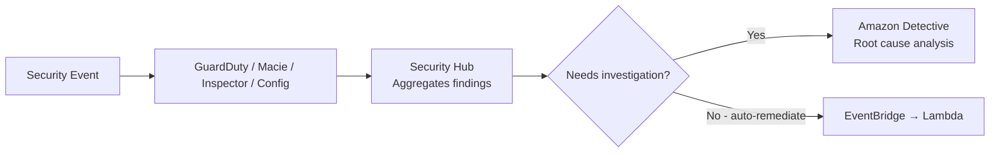
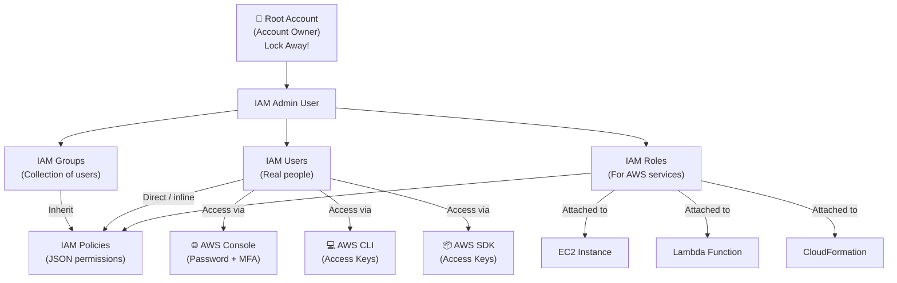
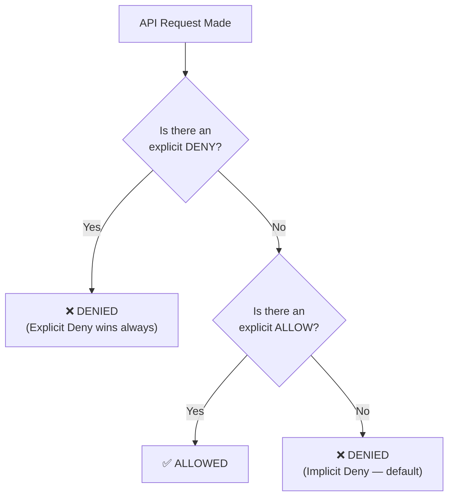
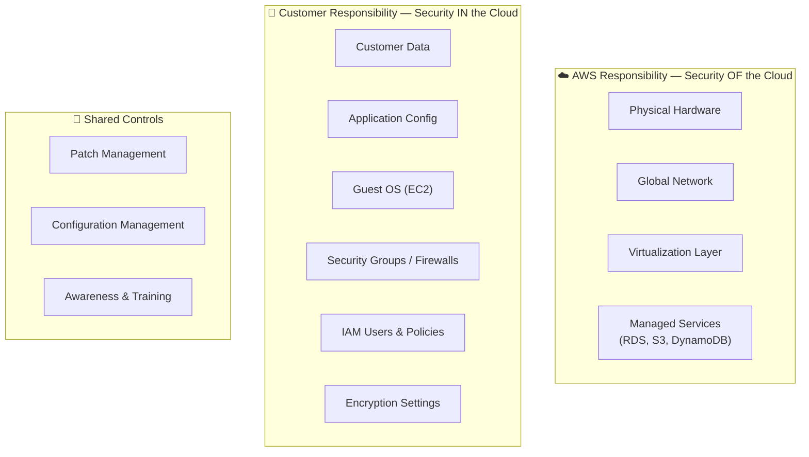
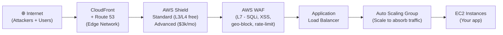
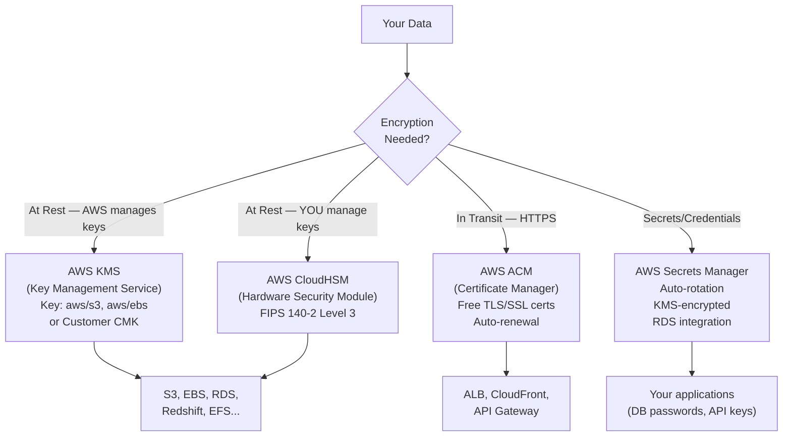
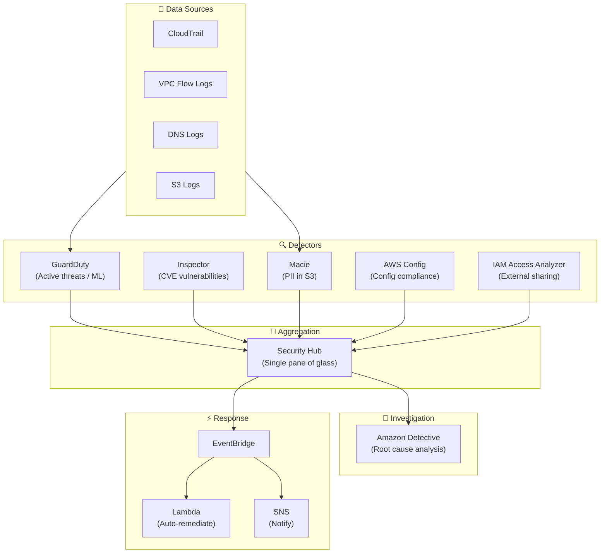
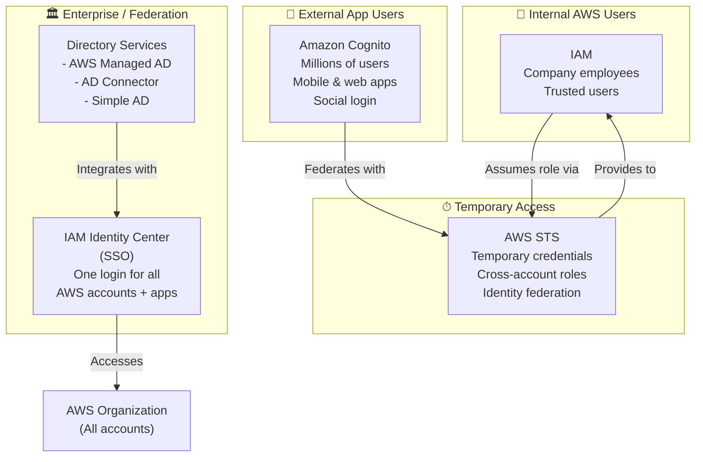
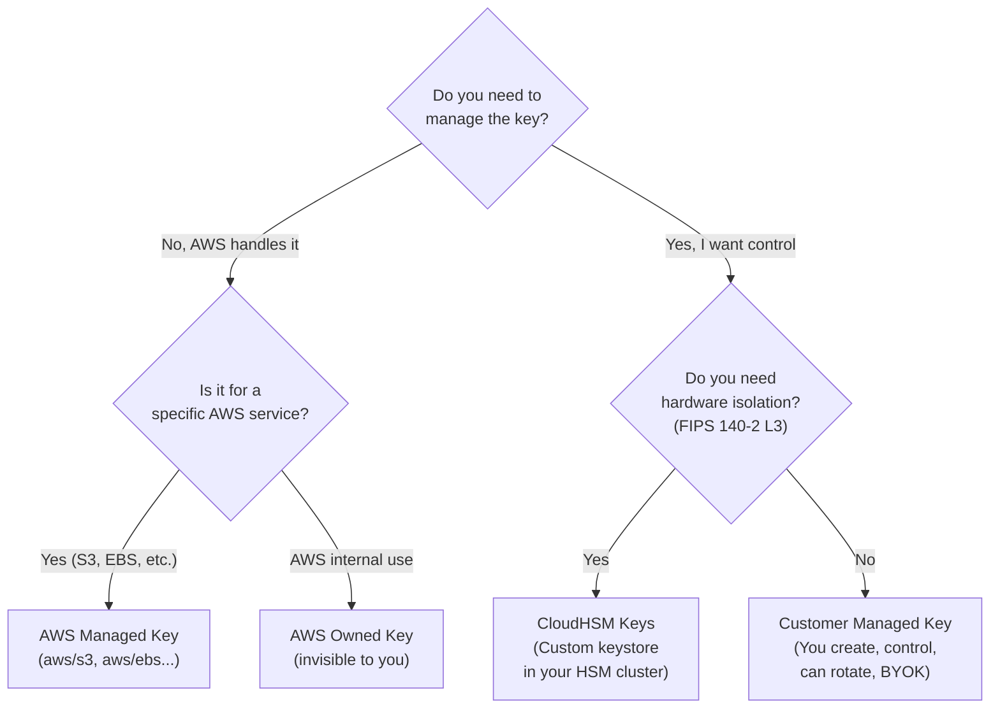

# 🔐 AWS CLF-C02 — Domain 2: Security & Compliance
### Your Complete Revision Guide | Sunday Exam Edition
> **Domain Weight: ~30% of the exam** — This is the biggest domain. Master it and you've won half the battle.

---

## 📌 Table of Contents

1. [The Big Picture — Security Services Map](#1-the-big-picture)
2. [IAM — Identity & Access Management](#2-iam)
3. [Shared Responsibility Model](#3-shared-responsibility-model)
4. [DDoS Protection & AWS Shield](#4-ddos--shield)
5. [AWS WAF — Web Application Firewall](#5-aws-waf)
6. [Network Firewall & Firewall Manager](#6-network-firewall--firewall-manager)
7. [Penetration Testing on AWS](#7-penetration-testing)
8. [Encryption — At Rest & In Transit](#8-encryption)
9. [AWS KMS — Key Management Service](#9-aws-kms)
10. [AWS CloudHSM](#10-aws-cloudhsm)
11. [Types of KMS Keys](#11-types-of-kms-keys)
12. [AWS Certificate Manager (ACM)](#12-aws-certificate-manager)
13. [AWS Secrets Manager](#13-aws-secrets-manager)
14. [AWS Artifact](#14-aws-artifact)
15. [Amazon GuardDuty](#15-amazon-guardduty)
16. [Amazon Inspector](#16-amazon-inspector)
17. [AWS Config](#17-aws-config)
18. [Amazon Macie](#18-amazon-macie)
19. [AWS Security Hub](#19-aws-security-hub)
20. [Amazon Detective](#20-amazon-detective)
21. [AWS Abuse](#21-aws-abuse)
22. [Root User Privileges](#22-root-user-privileges)
23. [IAM Access Analyzer](#23-iam-access-analyzer)
24. [Advanced Identity Services](#24-advanced-identity)
25. [🔥 Master Comparison Tables](#25-master-comparison-tables)
26. [🧠 Exam Tricks & Catchwords](#26-exam-tricks--catchwords)
27. [🗺 Mermaid Diagrams](#27-mermaid-diagrams)

---

## 1. The Big Picture

Before diving deep, get this mental map locked in. Security in AWS is NOT one service — it is a layered system where each tool plays a specific role.

```
WHO YOU ARE          →  IAM, Cognito, STS, IAM Identity Center
WHAT YOU CAN DO      →  IAM Policies, IAM Roles
PROTECTING TRAFFIC   →  Shield, WAF, Network Firewall, Firewall Manager
PROTECTING DATA      →  KMS, CloudHSM, ACM, Secrets Manager
DETECTING THREATS    →  GuardDuty, Inspector, Macie, Security Hub, Detective
AUDITING & LOGGING   →  CloudTrail, AWS Config
COMPLIANCE DOCS      →  AWS Artifact
REPORTING ABUSE      →  AWS Abuse Team
```

Think of it in layers:
- **Perimeter / Traffic layer** → Shield, WAF, Network Firewall
- **Identity layer** → IAM, Cognito, STS, SSO/Identity Center
- **Data layer** → KMS, CloudHSM, Secrets Manager, ACM
- **Detection layer** → GuardDuty, Inspector, Macie
- **Aggregation / Investigation** → Security Hub, Detective
- **Compliance / Audit** → Config, CloudTrail, Artifact

---

## 2. IAM

### 2.1 Core Concepts

IAM stands for **Identity and Access Management** and is a **Global service** (not region-specific). It controls who can do what in your AWS account.

Think of it this way: IAM is the **gatekeeper** of your entire AWS account. Every API call you make, every action you take — IAM decides whether it's allowed.

**The four pillars of IAM:**

| Pillar | What it is | Think of it as |
|--------|-----------|----------------|
| **Users** | A person in your org, mapped to a real human, gets a password | An employee badge |
| **Groups** | A collection of users (NOT groups within groups!) | A department |
| **Policies** | JSON document defining permissions | A rulebook |
| **Roles** | Permissions for AWS services (not people) | A temp contractor badge |

**Key rules to remember:**
- Groups contain **users only** — never other groups
- A user can belong to **multiple groups**
- A user can exist **without a group** (though that's bad practice)
- The **root account** is created by default — **never use it, never share it**

### 2.2 IAM Policy Structure

Policies are JSON documents. Understanding the structure is critical for the exam.

```json
{
  "Version": "2012-10-17",
  "Id": "optional-policy-id",
  "Statement": [
    {
      "Sid": "optional-statement-id",
      "Effect": "Allow",
      "Principal": "arn:aws:iam::123456789:user/Alice",
      "Action": "ec2:Describe*",
      "Resource": "*",
      "Condition": {}
    }
  ]
}
```

**Breaking down each field:**

| Field | Required? | Values | Purpose |
|-------|-----------|--------|---------|
| `Version` | Yes | Always `"2012-10-17"` | Policy language version |
| `Id` | No | Any string | Identifier for the whole policy |
| `Statement` | Yes | Array of statements | The actual rules |
| `Sid` | No | Any string | Label for one statement |
| `Effect` | Yes | `Allow` or `Deny` | Allow or block the action |
| `Principal` | Depends | Account/User/Role ARN | WHO this applies to (resource-based policies) |
| `Action` | Yes | e.g., `s3:GetObject` | WHAT action is allowed/denied |
| `Resource` | Yes | ARN or `*` | WHICH resource |
| `Condition` | No | Key-value conditions | WHEN this rule applies |

> **🔑 Exam Trick:** The `Version` field is always `"2012-10-17"`. If an exam question shows `"2023-01-01"` as an option — that's wrong. Always `2012-10-17`.

### 2.3 Policy Inheritance

When a user belongs to multiple groups, they **inherit** all the policies attached to all their groups, PLUS any inline policies directly attached to them.

```
Alice is in:
  - Developers group → gets Developers policy
  - Audit Team group → gets Audit policy
  - Has inline policy → gets inline policy too

Alice's effective permissions = Developers + Audit + Inline
```

**Deny always wins.** If ANY policy says Deny on an action, that action is denied even if 10 other policies say Allow. Remember: **explicit Deny > explicit Allow > implicit Deny (default)**

### 2.4 Password Policy

AWS lets account admins set a password policy for all IAM users. You can configure:

- Minimum password length
- Require uppercase, lowercase, numbers, special (non-alphanumeric) characters
- Allow users to change their own passwords
- Require password change after N days (expiration)
- Prevent password reuse (remember last N passwords)

> **🔑 Why it matters:** Strong passwords = reduced risk of unauthorized Console access. The exam may ask "how do you enforce password complexity?" → Answer: **IAM Password Policy**

### 2.5 MFA — Multi-Factor Authentication

MFA = **something you know (password) + something you own (device)**. Even if the password is stolen, the attacker can't log in without the physical device.

| MFA Device Type | Examples | Notes |
|----------------|----------|-------|
| **Virtual MFA** | Google Authenticator, Authy | Software on your phone; supports multiple tokens on one device |
| **U2F Security Key** | YubiKey (by Yubico, 3rd party) | Physical USB key; supports multiple root + IAM users on one key |
| **Hardware Key Fob** | Gemalto device (3rd party) | Physical fob that generates OTPs |
| **Hardware Key Fob (GovCloud)** | SurePassID device (3rd party) | Specifically for AWS GovCloud |

> **🔑 Exam Trick:** Virtual MFA supports **multiple tokens on a single device**. U2F supports **multiple users on a single key**. These are distinct — don't mix them up.

### 2.6 How Users Access AWS — 3 Methods

| Method | Interface | Protected By |
|--------|-----------|-------------|
| **AWS Management Console** | Browser / web UI | Password + MFA |
| **AWS CLI** | Terminal / command line | Access Keys |
| **AWS SDK** | Code / applications | Access Keys |

**Access Keys anatomy:**
- `Access Key ID` ≈ username (starts with `AKIA...`)
- `Secret Access Key` ≈ password (shown **once** at creation — don't lose it!)
- Generated through the AWS Console by users themselves
- **Never share access keys** — treat them like passwords
- **Never hardcode them** in source code

> **🔑 Exam Trick:** CLI is built on the AWS SDK for Python. If asked "how does the CLI authenticate?" → Access Keys. Never MFA directly (though MFA can be required for STS assume-role).

### 2.7 IAM Roles for Services

When an **AWS service** needs to perform actions on your behalf, you don't give it a username and password. You attach an **IAM Role** to it. A role is a set of temporary permissions.

Think of roles as a **visitor badge** you hand to a service when it walks through the door. It can only do what the badge allows, and it gives the badge back when it's done.

**Common use cases:**

| Service | Why it needs a role |
|---------|-------------------|
| **EC2 Instance** | To call other AWS APIs (S3, DynamoDB, etc.) without hardcoding keys |
| **Lambda Function** | To read from S3, write to DynamoDB, etc. |
| **CloudFormation** | To create/modify/delete AWS resources during stack operations |

> **🔑 Exam Trick:** The exam LOVES this: "An EC2 instance needs to access S3. What's the best way?" → **Attach an IAM Role to the EC2 instance.** Never put access keys on the instance!

### 2.8 IAM Security Tools

AWS gives you two powerful auditing tools:

| Tool | Level | What it Does |
|------|-------|-------------|
| **IAM Credentials Report** | Account-level | Lists ALL users and status of their credentials (passwords, access keys, MFA, last used dates) |
| **IAM Access Advisor** | User-level | Shows which services a user has permissions for, and **when they last used them** — helps you apply least privilege |

> **🔑 Exam Trick:** If the question is about auditing the **whole account** → Credentials Report. If it's about reviewing **one specific user's** permissions → Access Advisor.

### 2.9 IAM Best Practices (Exam Checklist)

This list is basically an exam answer bank:

1. **Never use root** for everyday tasks (only for account setup)
2. **One physical person = One AWS user** (no sharing)
3. Assign users to groups, assign permissions to groups
4. Enforce a strong **password policy**
5. Enforce **MFA** for all accounts (especially root)
6. Use **Roles** for AWS services — never embed access keys in EC2
7. Use **Access Keys** only for programmatic access (CLI/SDK)
8. Audit with **Credentials Report** + **Access Advisor**
9. **Never share** IAM users or access keys
10. Apply **Least Privilege Principle** — minimum permissions needed

### 2.10 Shared Responsibility — IAM

| AWS Responsibility | Customer Responsibility |
|--------------------|------------------------|
| Infrastructure & global network security | Users, Groups, Roles, Policies management |
| Configuration & vulnerability analysis | Enable MFA on all accounts |
| Compliance validation | Rotate all keys often |
| — | Use IAM tools to apply correct permissions |
| — | Analyze access patterns & review permissions |

---

## 3. Shared Responsibility Model

This is one of the most-tested concepts across the ENTIRE CLF-C02 exam.

**The core idea:** AWS and the customer SHARE responsibility for security, but different layers belong to different parties.

```
AWS is responsible for:    Security OF the Cloud
Customer is responsible:   Security IN the Cloud
```

### 3.1 General Model

| AWS Manages | Customer Manages |
|-------------|-----------------|
| Physical data centers | Customer data |
| Hardware (servers, networking, storage) | Platform, applications, identity |
| Virtualization layer | Operating system (for EC2) |
| Managed service infrastructure | Firewall / network config (Security Groups) |
| Global network | Client-side data encryption |
| — | Server-side encryption configuration |
| — | Network traffic protection |

### 3.2 Shared Controls (BOTH parties)

These are areas where both AWS and the customer share responsibility:

- **Patch Management** — AWS patches the infrastructure; customer patches their OS and apps
- **Configuration Management** — AWS configures its infra; customer configures their apps
- **Awareness & Training** — Both train their own employees

### 3.3 Service-Specific Examples

**RDS (Managed Database):**

| AWS | Customer |
|-----|---------|
| Manage underlying EC2 | Check Security Group inbound rules |
| Disable SSH access | Create database users and permissions |
| Automated DB patching | Enable/disable public access |
| Automated OS patching | Configure SSL-only connections |
| Guarantee underlying disks work | Set database encryption |

**S3:**

| AWS | Customer |
|-----|---------|
| Guarantee unlimited storage | Bucket configuration |
| Guarantee encryption available | Bucket policy and public access settings |
| Separation between customers | IAM users and roles |
| Prevent AWS employees from accessing your data | Enable encryption |

> **🔑 Key Mental Model:** The more "managed" the service (RDS, S3), the more AWS handles. The less managed (EC2), the more the customer handles. For EC2, the customer is responsible for the entire OS layer and above.

---

## 4. DDoS & Shield

### 4.1 What is a DDoS Attack?

A **Distributed Denial of Service** attack floods your application with so many requests that legitimate users can't get through. The attacker uses many compromised machines ("bots") to overwhelm your servers.

```
Normal users → your server (works fine)
DDoS attack  → thousands of bots → your server (overwhelmed, crashes)
```

### 4.2 AWS Shield — DDoS Protection

| Feature | Shield Standard | Shield Advanced |
|---------|----------------|-----------------|
| **Cost** | FREE for all customers | $3,000/month/org |
| **Activation** | Automatic — always on | Optional, must enable |
| **Protection** | SYN/UDP Floods, Reflection attacks, Layer 3/4 | All Standard + sophisticated attacks |
| **Protected services** | All AWS services | EC2, ELB, CloudFront, Global Accelerator, Route 53 |
| **DDoS Response Team** | ❌ No | ✅ 24/7 access to DRP (DDoS Response Team) |
| **Cost protection** | ❌ No | ✅ Protects against usage-spike fees from DDoS |

> **🔑 Exam Trick:** "24/7 support" or "DDoS response team" → Shield **Advanced**. "Free, automatic protection" → Shield **Standard**. The $3,000/month number sometimes appears in distractors.

### 4.3 DDoS Protection Architecture

The best practice DDoS architecture combines multiple services:

- **CloudFront + Route 53** — Edge-based availability protection (absorbs attacks at the global edge network)
- **AWS Shield** — Automatic DDoS mitigation (Standard free, Advanced paid)
- **AWS WAF** — Filter malicious requests based on rules
- **Auto Scaling** — Scale out to absorb traffic spikes
- **Combined:** Shield + CloudFront + Route 53 = attack mitigation at the edge

---

## 5. AWS WAF

### What is WAF?

**WAF = Web Application Firewall**. It filters incoming web requests at **Layer 7 (HTTP/HTTPS)** — the application layer. It understands web traffic unlike network-level firewalls.

Think of WAF as a **bouncer at the door** that reads every request and decides if it looks legitimate.

### Where WAF is Deployed

WAF attaches to:
- **Application Load Balancer (ALB)**
- **API Gateway**
- **CloudFront**

### What WAF Does

WAF uses a **Web ACL (Web Access Control List)** — a set of rules that define what traffic to allow or block:

| Rule Type | What it blocks |
|-----------|---------------|
| IP addresses | Block specific IPs or IP ranges |
| HTTP headers/body | Block requests with suspicious headers |
| URI strings | Block specific URL patterns |
| SQL injection | Classic database attack |
| Cross-Site Scripting (XSS) | Injecting malicious scripts |
| Size constraints | Requests that are too large |
| Geo-match | Block entire countries |
| Rate-based rules | Block IPs that send too many requests (anti-DDoS) |

> **🔑 Exam Trick:** WAF is **Layer 7** (HTTP). Shield is **Layer 3/4** (Network/Transport). If the question mentions "SQL injection", "XSS", or "block specific countries" → **WAF**. If it mentions "SYN flood" or "UDP flood" → **Shield**.

---

## 6. Network Firewall & Firewall Manager

### 6.1 AWS Network Firewall

Network Firewall protects your **entire VPC** — not just web traffic.

- Covers **Layer 3 to Layer 7** (all layers)
- Can inspect traffic in **any direction**: inbound, outbound, VPC-to-VPC, to/from Direct Connect, Site-to-Site VPN
- Sits at the VPC level (not per service like WAF)

Think of it as putting a **security checkpoint around your entire network**, not just at one door.

### 6.2 AWS Firewall Manager

Firewall Manager is for **organizations** — it lets you manage security rules across **all accounts in an AWS Organization** from one place.

- Manages: VPC Security Groups, WAF rules, Shield Advanced, Network Firewall
- Rules apply **automatically to new resources** as they're created
- Ensures compliance across all current AND future accounts

> **🔑 Exam Trick:** Firewall Manager keyword = **"across all accounts in an Organization"** or **"centrally manage security rules"**. It's the multi-account, org-level firewall policy manager.

### 6.3 Comparison: WAF vs Network Firewall vs Shield vs Firewall Manager

| Service | Layer | Scope | Purpose |
|---------|-------|-------|---------|
| **Shield** | L3/L4 | Global edge | DDoS protection |
| **WAF** | L7 (HTTP) | ALB, API GW, CloudFront | Block web exploits (SQLi, XSS, geo) |
| **Network Firewall** | L3–L7 | Entire VPC | Full traffic inspection |
| **Firewall Manager** | N/A (management) | Org-wide | Centrally manage all firewall rules |

---

## 7. Penetration Testing

### Allowed Without Prior AWS Approval

AWS allows security testing ("pen testing") on **8 services** without needing to contact AWS:

1. Amazon EC2 instances, NAT Gateways, and Elastic Load Balancers
2. Amazon RDS
3. Amazon CloudFront
4. Amazon Aurora
5. Amazon API Gateways
6. AWS Lambda and Lambda Edge functions
7. Amazon Lightsail resources
8. Amazon Elastic Beanstalk environments

### Prohibited Activities (Always)

You can NEVER do these (they look like real attacks):

- DNS zone walking via Route 53 Hosted Zones
- DoS / DDoS attacks (even simulated)
- Port flooding
- Protocol flooding
- Request flooding (login or API)

> **🔑 Exam Trick:** The exam may ask "which activity requires prior approval from AWS?" → Anything NOT on the 8-service list, or any prohibited activity. For simulated events outside the list → email `aws-security-simulated-event@amazon.com`.

---

## 8. Encryption

### 8.1 The Two States of Data

| State | Description | Examples |
|-------|-------------|---------|
| **At Rest** | Data stored on a device, not moving | Hard disk, RDS instance, S3 Glacier, EFS, EBS |
| **In Transit** | Data moving between locations | On-premises → AWS, EC2 → DynamoDB, uploads |

**We want to encrypt BOTH states.** Encrypting at rest protects stolen hardware. Encrypting in transit protects network eavesdropping.

### 8.2 Encryption In Transit

Always use **HTTPS/TLS** for in-transit encryption. AWS Certificate Manager (ACM) manages TLS certificates. The data is encrypted with a key, sent over the network, and decrypted at the destination.

### 8.3 Who Encrypts What (KMS Opt-in vs Automatic)

| Encryption Opt-in (you must enable) | Encryption Automatic (always on) |
|------------------------------------|----------------------------------|
| EBS volumes | CloudTrail Logs |
| S3 buckets (SSE-S3 default, SSE-KMS opt-in) | S3 Glacier |
| Redshift database | Storage Gateway |
| RDS database | — |
| EFS drives | — |

> **🔑 Exam Trick:** "CloudTrail logs are automatically encrypted" is a true statement — they use SSE-S3 by default. S3 Glacier is also always encrypted.

---

## 9. AWS KMS

### What is KMS?

**KMS = Key Management Service**. Any time you hear "encryption" in AWS, think KMS first.

The fundamental idea: **AWS manages the encryption keys for you**. You don't need to generate, store, or rotate keys yourself (unless you want to with Customer Managed Keys).

KMS integrates with almost every AWS service — S3, EBS, RDS, Redshift, EFS, DynamoDB, etc.

> **🔑 Catchphrase:** *"Anytime you hear 'encryption' for an AWS service, it's most likely KMS."*

### KMS Analogy

Think of KMS as a **bank vault where your keys are stored**. AWS has a secure facility (the vault), and when your service needs to encrypt/decrypt data, it borrows the key from the vault momentarily, does the work, and returns the key. You never handle the key yourself.

---

## 10. AWS CloudHSM

### What is CloudHSM?

**CloudHSM = Cloud Hardware Security Module**. AWS provisions dedicated physical hardware, but **you manage your own encryption keys entirely**.

The key difference from KMS:

| | KMS | CloudHSM |
|--|-----|---------|
| **What AWS manages** | Software + keys | Hardware only |
| **What YOU manage** | Nothing (or some config) | Keys entirely |
| **Key custody** | AWS | You |
| **Compliance** | Standard | FIPS 140-2 Level 3 |
| **Hardware** | Shared (multi-tenant) | Dedicated to you |
| **Use case** | Most workloads | Strict regulatory / compliance requirements |

> **🔑 Exam Trick:** "You manage your own encryption keys" → **CloudHSM**. "AWS manages the keys" → **KMS**. FIPS 140-2 Level 3 → **CloudHSM**. "Hardware Security Module" → **CloudHSM**.

---

## 11. Types of KMS Keys

There are four types — the exam loves testing this:

| Key Type | Who Creates It | Who Manages It | Visibility |
|----------|---------------|----------------|-----------|
| **Customer Managed Key (CMK)** | Customer | Customer | Fully visible |
| **AWS Managed Key** | AWS (on your behalf) | AWS | Visible, can't modify |
| **AWS Owned Key** | AWS | AWS | ❌ Not visible to you |
| **CloudHSM Keys** | You (via CloudHSM hardware) | You | Stored in your HSM cluster |

**Customer Managed Keys extras:**
- You can enable or disable them
- Rotation policy (new key auto-generated every year, old key preserved for decryption)
- Possibility to bring-your-own-key (BYOK)

**AWS Managed Keys:**
- Named like `aws/s3`, `aws/ebs`, `aws/redshift`
- Used automatically by AWS services
- Rotated automatically every year

---

## 12. AWS Certificate Manager (ACM)

### What is ACM?

ACM provisions, manages, and deploys **SSL/TLS certificates** for in-flight (in-transit) encryption. If your website uses HTTPS, it needs a TLS certificate — ACM handles all of that for you.

### Key Features

- Supports both **public** and **private** TLS certificates
- **Free of charge** for public TLS certificates
- **Automatic TLS certificate renewal** (no manual renewal headaches)
- Integrates with: **Elastic Load Balancers, CloudFront, API Gateway**

### ACM Flow

```
User → HTTPS request → Load Balancer (has TLS cert from ACM) → decrypts → EC2
```

> **🔑 Exam Trick:** ACM = TLS/SSL certificates for HTTPS. The keyword is "in-flight encryption" or "HTTPS website". ACM is FREE for public certs and handles automatic renewal.

---

## 13. AWS Secrets Manager

### What is Secrets Manager?

A service specifically designed to **store and rotate secrets** — like database passwords, API keys, credentials.

### Key Features

- Force rotation of secrets every X days
- Automate secret generation on rotation (uses **Lambda** to do the rotation)
- Deep integration with **Amazon RDS** (MySQL, PostgreSQL, Aurora) — the primary use case
- All secrets encrypted using **KMS**

### Secrets Manager vs Parameter Store (SSM)

| | Secrets Manager | SSM Parameter Store |
|--|----------------|---------------------|
| **Primary use** | RDS / database credentials | General config + secrets |
| **Rotation** | Built-in automatic rotation | Manual or custom Lambda |
| **Cost** | Paid per secret | Mostly free (standard tier) |
| **Encryption** | KMS (always) | KMS (optional) |
| **Best for** | RDS passwords, API keys needing rotation | App configs, non-sensitive params |

> **🔑 Exam Trick:** If the question mentions "rotate credentials automatically" or "RDS integration" → **Secrets Manager**. "Store application configuration" → SSM Parameter Store.

---

## 14. AWS Artifact

### What is Artifact?

Artifact is a **portal** (not really a service, more of a document repository) that gives customers on-demand access to AWS **compliance documentation** and **agreements**.

Two components:

| Component | What it is |
|-----------|-----------|
| **Artifact Reports** | Download AWS security & compliance docs from 3rd-party auditors (ISO certifications, PCI DSS, SOC reports) |
| **Artifact Agreements** | Review, accept, and track AWS agreements like BAA (Business Associate Addendum) for HIPAA |

> **🔑 Exam Trick:** Whenever the exam asks about "compliance reports", "audit documentation", "PCI compliance proof", "HIPAA agreement" → **AWS Artifact**. Think of Artifact as the "compliance filing cabinet".

---

## 15. Amazon GuardDuty

### What is GuardDuty?

GuardDuty is AWS's **intelligent threat detection** service. It uses **Machine Learning, anomaly detection, and 3rd-party threat data** to find malicious behavior in your AWS account.

One-click to enable, 30-day free trial, no software to install.

### What GuardDuty Analyzes

| Input Source | What it Detects |
|-------------|-----------------|
| **CloudTrail Event Logs** | Unusual API calls, unauthorized deployments |
| **CloudTrail Management Events** | Creating VPC subnets, creating trails |
| **CloudTrail S3 Data Events** | GetObject, ListObjects, DeleteObject anomalies |
| **VPC Flow Logs** | Unusual internal traffic, unusual IP addresses |
| **DNS Logs** | Compromised EC2 instances sending encoded data via DNS queries |
| **EKS Audit Logs** | (Optional) Kubernetes attack detection |
| **RDS & Aurora Login Activity** | (Optional) Suspicious login patterns |
| **EBS, Lambda, S3 Data Events** | (Optional) Additional scanning |

### GuardDuty Response

When GuardDuty finds something suspicious (a "finding"), it can:
- Trigger **EventBridge rules**
- EventBridge → invoke **Lambda** (for automated response)
- EventBridge → send to **SNS** (for notification)
- Also has a dedicated "finding" for **CryptoCurrency mining attacks**

> **🔑 Exam Trick:** GuardDuty = **threat detection** using ML on logs. Keywords: "malicious behavior", "anomaly detection", "VPC Flow Logs analysis", "unusual API calls". It **does NOT prevent** attacks — it **detects** them.

---

## 16. Amazon Inspector

### What is Inspector?

Inspector performs **automated security assessments** — it scans for vulnerabilities and unintended network exposure. It's a **scanner**, not a detector of live threats.

### What Inspector Scans

| Target | What It Scans For |
|--------|------------------|
| **EC2 Instances** | Uses SSM Agent; network accessibility issues; OS vulnerabilities |
| **Container Images (ECR)** | Vulnerabilities in images at push time |
| **Lambda Functions** | Software vulnerabilities in code and package dependencies |

- Reports findings to **AWS Security Hub**
- Sends findings to **EventBridge**
- Uses **CVE database** (Common Vulnerabilities and Exposures)
- Assigns a **risk score** to each finding for prioritization
- Scanning is **continuous** — runs automatically when needed

> **🔑 Exam Trick:** Inspector = **software vulnerabilities** and **network accessibility**. Works only on EC2, ECR, Lambda. CVE = vulnerability database. Inspector finds "what could be exploited", while GuardDuty finds "what IS being exploited right now".

### GuardDuty vs Inspector — The Most Confused Pair

| | GuardDuty | Inspector |
|--|-----------|-----------|
| **What it does** | Detects **active threats** / malicious behavior | Finds **vulnerabilities** in workloads |
| **How it works** | Analyzes logs with ML | Scans running software & config |
| **When it triggers** | When bad activity happens | Continuously / on deployment |
| **Data sources** | CloudTrail, VPC Flow Logs, DNS | SSM agent, CVE database, ECR scan |
| **Targets** | Your whole AWS account | EC2, ECR container images, Lambda |
| **Keyword** | "Malicious", "threat", "unusual activity" | "Vulnerability", "CVE", "software flaw" |

---

## 17. AWS Config

### What is Config?

AWS Config is your **configuration recorder and compliance auditor**. It tracks how your AWS resources are configured over time and checks whether they comply with your rules.

Key questions Config can answer:
- Is there unrestricted SSH access to any security group?
- Do my S3 buckets have public access?
- How has my Application Load Balancer configuration changed over time?

### Config Features

- Records configuration changes over time → stored in S3 (can be analyzed with Athena)
- Send **SNS notifications** for any configuration change
- **Per-region service** (but can be aggregated across regions and accounts)
- Shows compliance of a resource over time
- Integrates with **CloudTrail** to show who made which API call

> **🔑 Exam Trick:** Config = "**compliance over time**" and "**configuration history**". If the question asks "how do I know if someone opened SSH to the internet?" or "how has resource X changed?" → **AWS Config**.

---

## 18. Amazon Macie

### What is Macie?

Macie is a fully managed **data security and privacy service** that uses **ML and pattern matching** to discover sensitive data in your S3 buckets.

Its primary job: find **PII (Personally Identifiable Information)** and other sensitive data sitting in S3 that maybe shouldn't be there.

### How it Works

```
Macie → analyzes S3 Buckets → finds sensitive data (PII, credit cards, etc.)
                              → notifies via Amazon EventBridge
```

> **🔑 Exam Trick:** Macie = **S3** + **PII** + **sensitive data discovery**. The keyword is "personal data", "PII", "sensitive data in S3". It's ML-based and works ONLY with S3.

---

## 19. AWS Security Hub

### What is Security Hub?

Security Hub is the **central security dashboard** that aggregates findings from multiple AWS security services across **multiple accounts** into one place.

It consolidates alerts from:
- AWS Config
- GuardDuty
- Inspector
- Macie
- IAM Access Analyzer
- AWS Systems Manager
- AWS Firewall Manager
- AWS Health
- AWS Partner Network solutions

**Prerequisite:** You must **first enable AWS Config** before Security Hub can work.

### Security Hub Flow

```
GuardDuty findings    ─┐
Inspector findings     ├─→  Security Hub  →  Dashboards
Macie findings        ─┤    (aggregates)  →  EventBridge rules
Config findings       ─┤                  →  Automated remediation
IAM Access Analyzer ──┘
```

> **🔑 Exam Trick:** Security Hub = "**single pane of glass**" for security. If the question asks about "managing security across multiple accounts" or "aggregating security findings" → **Security Hub**. Requires Config to be enabled.

---

## 20. Amazon Detective

### What is Detective?

Detective goes a step beyond GuardDuty. While GuardDuty **finds** suspicious activity, Detective helps you **investigate** it and find the **root cause**.

Think of the flow:
```
GuardDuty/Macie/Security Hub → identifies a suspicious finding
Amazon Detective            → investigates it, traces the root cause
```

### How Detective Works

- Automatically collects and processes events from: **VPC Flow Logs, CloudTrail, GuardDuty**
- Uses **Machine Learning and graphs** to analyze the data
- Produces **visualizations** with details and context
- Makes it easier to answer: "What exactly happened? Who did it? When? From where?"

> **🔑 Exam Trick:** Detective = **investigation / root cause analysis**. Keywords: "investigate", "root cause", "deeper analysis", "who did what". It doesn't detect or prevent — it investigates.

### The Security Investigation Flow



---

## 21. AWS Abuse

### What is AWS Abuse?

If you observe AWS-owned resources being used for **illegal or abusive activities** (spam, DDoS, malware distribution), you contact the **AWS Abuse Team**.

Abusive/prohibited behaviors include:
- **Spam** — emails from AWS-owned IPs, AWS-resource forums spamming
- **Port scanning** — probing for unsecured ports
- **DoS/DDoS** — overwhelming servers with AWS-owned IPs
- **Intrusion attempts** — unauthorized login attempts
- **Hosting illegal/copyrighted content** — distributing without consent
- **Distributing malware** — software that harms computers

**How to report:** AWS Abuse Form or `abuse@amazonaws.com`

> **🔑 Exam Trick:** AWS Abuse = "**report someone ELSE using AWS resources badly**", not your own security issues. If your own account is compromised → GuardDuty. If someone is using AWS to attack YOU → AWS Abuse.

---

## 22. Root User Privileges

### The Golden Rule

> **Never use the root account for everyday tasks. Lock it away. Enable MFA on it.**

The root user is the account **owner** — it was created when the account was created. It has **complete access** to everything with no restrictions.

### Actions ONLY Root Can Do

These are exam favorites — memorize them:

| Root-Only Action | Why it matters |
|-----------------|----------------|
| Change account settings (name, email, root password, root access keys) | Core account identity |
| View certain tax invoices | Billing/legal |
| **Close your AWS account** | Irreversible action |
| Restore IAM user permissions | Emergency access recovery |
| **Change or cancel AWS Support plan** | Commercial |
| Register as seller in Reserved Instance Marketplace | Commercial |
| Configure S3 bucket to enable MFA Delete | High-security feature |
| Edit/delete S3 bucket policy with invalid VPC/VPC endpoint ID | Edge case |
| **Sign up for GovCloud** | Government accounts |

> **🔑 Exam Trick:** The most commonly tested ones are: **close account**, **change support plan**, **sign up for GovCloud**, and **enable MFA Delete on S3**. These all require root. No IAM user, no matter how powerful, can do these.

---

## 23. IAM Access Analyzer

### What is IAM Access Analyzer?

Access Analyzer helps you **find resources that are shared externally** (outside your AWS account or Organization) — essentially identifying unintended public exposure.

### What Resources It Analyzes

IAM Access Analyzer checks for external sharing of:
- S3 Buckets
- IAM Roles
- KMS Keys
- Lambda Functions and Layers
- SQS Queues
- Secrets Manager Secrets

### Zone of Trust

You define a **Zone of Trust** = your AWS Account or your AWS Organization. Any resource accessible from **outside** the zone of trust gets flagged as a **finding**.

**Example:** If your S3 bucket is accessible to an external AWS account that's NOT in your organization → Access Analyzer flags it.

> **🔑 Exam Trick:** Access Analyzer = "**find resources shared externally/publicly**". Keywords: "external access", "unintended sharing", "zone of trust", "public resources". Different from GuardDuty (which detects threats) — Access Analyzer checks **permissions**, not behavior.

---

## 24. Advanced Identity

### 24.1 AWS STS — Security Token Service

STS creates **temporary, limited-privilege credentials** for accessing AWS resources.

**Key characteristics:**
- Short-term credentials (you set an expiration period)
- Used for: identity federation, cross-account access, EC2 instance temporary credentials

**Use cases:**

| Use Case | How STS Helps |
|----------|--------------|
| **Identity federation** | External users (SAML, OIDC) get STS tokens to access AWS |
| **Cross-account access** | User in Account A assumes a role in Account B via STS |
| **EC2 temporary credentials** | EC2 instance assumes a role, gets temporary keys |

> **🔑 Exam Trick:** STS = "**temporary credentials**". Whenever you see "short-term access", "assume role", "cross-account role" → STS is working behind the scenes.

### 24.2 Amazon Cognito

Cognito manages **identity for your web and mobile applications** (millions of users).

The key insight: instead of creating IAM users for your app's end users, you create a **Cognito user pool**. Your users sign in through Cognito, which can also federate with social identity providers (Facebook, Google, Twitter).

```
Mobile/Web App users → login → Cognito User Pool
                                  ↓ (federates with)
                          Facebook / Google / Twitter
```

> **🔑 Exam Trick:** Cognito = "**external/app users**" (millions of them). IAM = "**internal/company users**" (trusted employees). If the question says "mobile app users" or "web application login" → **Cognito**.

### 24.3 AWS Directory Services

These connect Microsoft Active Directory to AWS:

| Service | Description | On-Premise AD? |
|---------|-------------|----------------|
| **AWS Managed Microsoft AD** | Creates a real AD in AWS; manages users locally; supports MFA; "trust" relationship with on-prem AD | Connects via trust |
| **AD Connector** | A proxy/gateway — redirects auth requests to your existing on-premise AD; users managed on-prem | Stays on-prem (gateway only) |
| **Simple AD** | AD-compatible managed directory in AWS; standalone | ❌ Cannot connect to on-prem AD |

> **🔑 Exam Trick:** 
> - "Trust relationship with on-prem AD" → **AWS Managed Microsoft AD**
> - "Proxy to on-prem AD, nothing stored in AWS" → **AD Connector**
> - "Simple, no on-prem AD" → **Simple AD**

### 24.4 AWS IAM Identity Center (formerly AWS Single Sign-On)

IAM Identity Center gives you **one login (SSO) for everything**:

**What you can SSO into:**
- All AWS accounts in an AWS Organization
- Business cloud apps (Salesforce, Box, Microsoft 365)
- SAML 2.0-enabled applications
- EC2 Windows Instances

**Identity providers it supports:**
- Built-in identity store in IAM Identity Center
- 3rd party: Active Directory, OneLogin, Okta

> **🔑 Exam Trick:** IAM Identity Center = "**single sign-on**" across multiple AWS accounts. If the question says "one login for all AWS accounts" or "manage access across the organization" → **IAM Identity Center**.

---

## 25. Master Comparison Tables

### 25.1 The "What Detects What" Table

| Service | Detects / Finds | Data Sources | Scope |
|---------|----------------|--------------|-------|
| **GuardDuty** | Active threats & malicious behavior | CloudTrail, VPC Flow Logs, DNS Logs | Account-wide |
| **Inspector** | Software vulnerabilities (CVEs) | SSM agent, CVE DB, ECR | EC2, ECR, Lambda |
| **Macie** | Sensitive/PII data in S3 | S3 buckets | S3 only |
| **Config** | Config changes & compliance violations | Resource metadata | Per region/account |
| **Security Hub** | Aggregates findings from above | All of the above | Multi-account |
| **Detective** | Root cause of security issues | VPC Flows, CloudTrail, GuardDuty | Investigation |
| **IAM Access Analyzer** | Externally shared resources | IAM policies | Account/Org |
| **CloudTrail** | Who made what API call, when | API calls | Account-wide |

### 25.2 The Encryption Services Table

| Service | Manages | Keys Controlled By | Use Case |
|---------|---------|--------------------|----------|
| **KMS** | Software encryption | AWS (or you, for CMK) | Encrypt any AWS service data |
| **CloudHSM** | Hardware encryption | YOU entirely | FIPS 140-2 Level 3 compliance |
| **ACM** | TLS/SSL certificates | AWS | HTTPS for websites/APIs |
| **Secrets Manager** | Secret values + rotation | You (encrypted with KMS) | DB passwords, API keys |

### 25.3 The "Who Manages Users" Table

| Service | User Type | Scale | Authentication |
|---------|-----------|-------|----------------|
| **IAM** | Internal AWS users (employees) | Small (< hundreds) | Username + password + MFA |
| **Cognito** | External app users (customers) | Millions | Social login, email/password |
| **IAM Identity Center** | Federated/SSO users | Enterprise | SSO, SAML, AD |
| **STS** | Any user needing temp access | Variable | Role assumption |
| **Directory Services** | Windows/AD users | Enterprise | Kerberos / AD |

### 25.4 The DDoS Defense Layers

| Layer | Service | What it Stops |
|-------|---------|--------------|
| **Network (L3/L4)** | Shield Standard (FREE) | SYN/UDP floods, reflection attacks |
| **Network (L3/L4) Advanced** | Shield Advanced ($3k/mo) | Sophisticated volumetric attacks |
| **Application (L7)** | WAF | SQLi, XSS, bad bots, geo-blocking |
| **Edge** | CloudFront + Route 53 | Absorbs attacks at edge, before reaching origin |
| **Scale** | Auto Scaling | Handle traffic spikes that do get through |
| **VPC-level** | Network Firewall | All traffic in/out of VPC |

### 25.5 The Shared Responsibility Quick Reference

| Service Type | OS Patching | DB Patching | Firewall/SG | Encryption Config |
|-------------|-------------|-------------|-------------|------------------|
| **EC2** | ❌ Customer | ❌ Customer | ❌ Customer | ❌ Customer |
| **RDS** | ✅ AWS | ✅ AWS | ❌ Customer | ❌ Customer |
| **S3** | ✅ AWS | N/A | ✅ AWS | ❌ Customer (must enable) |
| **Lambda** | ✅ AWS | N/A | ✅ AWS (mostly) | ❌ Customer (optional) |

### 25.6 The Firewall Services Comparison

| Service | What it Protects | Deployed At | Multi-Account? |
|---------|-----------------|-------------|---------------|
| **Security Groups** | EC2/RDS/etc. instances | Resource level | No |
| **NACLs** | Subnets | Subnet level | No |
| **WAF** | Web apps (HTTP) | ALB, API GW, CloudFront | With Firewall Manager |
| **Shield** | AWS endpoints | Edge / infra | Yes (Shield Advanced) |
| **Network Firewall** | Entire VPC | VPC level | With Firewall Manager |
| **Firewall Manager** | Policy management | Org-wide | Yes — that's the whole point |

### 25.7 IAM Tools Summary

| Tool | Level | Purpose |
|------|-------|---------|
| **IAM Credential Report** | Account | List all users + credential status |
| **IAM Access Advisor** | User | Show last-used services → tighten policies |
| **IAM Access Analyzer** | Account/Org | Find externally shared resources |
| **IAM Policy Simulator** | Policy | Test policies before applying |

---

## 26. Exam Tricks & Catchwords

### 🚨 The Classic Traps

**Trap 1: GuardDuty vs Inspector**
- Q: "Find vulnerabilities in your EC2 instances" → **Inspector**
- Q: "Detect unusual API calls in your account" → **GuardDuty**
- They both "find" things but for completely different purposes

**Trap 2: KMS vs CloudHSM**
- Q: "AWS manages the encryption keys" → **KMS**
- Q: "You manage your own encryption keys on hardware" → **CloudHSM**
- Q: "FIPS 140-2 Level 3" → **CloudHSM** (always)

**Trap 3: Shield Standard vs Advanced**
- "Free, automatic, all customers" → **Standard**
- "24/7 DDoS response team" or "sophisticated attacks" or "$3,000" → **Advanced**

**Trap 4: Roles vs Users**
- "AWS service needs to call another AWS service" → **IAM Role** (always)
- "A person logging into the console" → **IAM User**

**Trap 5: Macie vs GuardDuty**
- "PII data in S3" → **Macie**
- "Malicious behavior / threat detection" → **GuardDuty**

**Trap 6: Security Hub vs Detective**
- "Aggregate findings from multiple services" → **Security Hub**
- "Investigate root cause of a finding" → **Detective**

**Trap 7: Artifact vs Config**
- "Compliance documents / PCI reports" → **Artifact**
- "Resource compliance over time" → **Config**

**Trap 8: Secrets Manager vs SSM Parameter Store**
- "Automatic rotation for RDS credentials" → **Secrets Manager**
- "Store config values cheaply" → **SSM Parameter Store**

**Trap 9: IAM Access Analyzer vs GuardDuty**
- "Resource shared with external account" (permission-based) → **Access Analyzer**
- "Someone is actively doing something suspicious" (behavior-based) → **GuardDuty**

**Trap 10: Cognito vs IAM**
- "Mobile app users, millions of them" → **Cognito**
- "Company employees accessing AWS console" → **IAM**

---

### 🔑 Catchword Dictionary

| Catchword / Phrase | Service to Think Of |
|-------------------|---------------------|
| "PII", "sensitive data", "S3 data privacy" | **Macie** |
| "Malicious behavior", "threat detection", "unusual API calls" | **GuardDuty** |
| "CVE", "software vulnerability", "EC2 scan" | **Inspector** |
| "Root cause", "investigate finding", "ML graphs" | **Detective** |
| "Single pane of glass", "aggregate findings", "multi-account security" | **Security Hub** |
| "Config history", "compliance rules", "unrestricted SSH" | **AWS Config** |
| "Compliance reports", "PCI", "ISO", "SOC", "HIPAA agreement" | **AWS Artifact** |
| "TLS certificate", "HTTPS", "SSL/TLS" | **ACM** |
| "Rotate credentials", "RDS password rotation" | **Secrets Manager** |
| "Encrypt data", "at rest encryption" | **KMS** |
| "Manage your own keys", "hardware module", "FIPS 140-2" | **CloudHSM** |
| "Single sign-on", "one login, multiple accounts" | **IAM Identity Center** |
| "Temporary credentials", "assume role", "cross-account" | **STS** |
| "Mobile/web app users", "social login", "millions of users" | **Cognito** |
| "Proxy to on-prem AD" | **AD Connector** |
| "Trust with on-prem AD, users in AWS" | **AWS Managed Microsoft AD** |
| "External sharing", "zone of trust", "shared publicly" | **IAM Access Analyzer** |
| "DDoS", "Layer 3/4", "SYN flood" | **Shield** |
| "SQL injection", "XSS", "Layer 7", "geo-block" | **WAF** |
| "VPC traffic inspection", "L3 to L7", "all directions" | **Network Firewall** |
| "Org-wide security rules", "apply to new resources" | **Firewall Manager** |
| "Report abuse", "spam from AWS IP" | **AWS Abuse** |
| "Close account", "change support plan", "sign up GovCloud" | **Root user** |
| "Access Key ID", "Secret Access Key", "programmatic" | **CLI / SDK / Access Keys** |
| "Last time a service was used", "tighten permissions" | **IAM Access Advisor** |
| "All users credential status", "account-wide audit" | **IAM Credential Report** |

---

### ✅ The "Always True" Statements

These are facts the exam expects you to know cold:

- IAM is a **global service** (not region-specific)
- Root account has **complete access** and should never be used daily
- Groups contain **only users**, never other groups
- **Deny always wins** over Allow in IAM policies
- Policy version is always `"2012-10-17"`
- Access Keys = CLI/SDK only; Console = password
- **CloudTrail is always encrypted** (automatic)
- **S3 Glacier is always encrypted** (automatic)
- KMS is used when you "hear encryption" for any AWS service
- GuardDuty has a **30-day free trial**, one click to enable
- Inspector scans **only**: EC2, ECR container images, Lambda
- Macie works **only** with S3
- Security Hub **requires Config** to be enabled first
- Shield Standard is **free**, always on
- ACM public certificates are **free**
- STS issues **temporary** credentials (not permanent)
- Penetration testing on 8 services requires **no prior AWS approval**
- DoS/DDoS simulation is **always prohibited** on AWS

---

## 27. Mermaid Diagrams

### 27.1 IAM Complete Flow



### 27.2 IAM Policy Decision Logic



### 27.3 Shared Responsibility Model



### 27.4 DDoS Protection Layers



### 27.5 Encryption Services Flow



### 27.6 Threat Detection & Investigation Chain



### 27.7 Advanced Identity Services Map



### 27.8 KMS Key Types Decision Tree



---

## 🎯 Last-Minute Cheat Sheet

### The "One Line Per Service" Summary

| Service | One Line Description |
|---------|---------------------|
| **IAM** | Who can do what in your AWS account (users, groups, roles, policies) |
| **Shield Standard** | Free, automatic DDoS protection for all customers |
| **Shield Advanced** | Paid ($3k/mo), 24/7 DDoS team, sophisticated attack protection |
| **WAF** | Layer 7 firewall — blocks SQLi, XSS, bad IPs, geo-blocks |
| **Network Firewall** | Full VPC traffic protection, Layer 3–7, all directions |
| **Firewall Manager** | Manage WAF/Shield/NF rules across entire AWS Organization |
| **KMS** | AWS manages encryption keys for your data |
| **CloudHSM** | YOU manage encryption keys on dedicated hardware (FIPS 140-2 L3) |
| **ACM** | Free SSL/TLS certificates for HTTPS (auto-renewal) |
| **Secrets Manager** | Store and auto-rotate secrets, especially RDS passwords |
| **Artifact** | Download compliance reports (PCI, ISO, SOC) and sign agreements |
| **GuardDuty** | ML-based threat detection from logs (CloudTrail, VPC, DNS) |
| **Inspector** | Vulnerability scanner for EC2, ECR images, Lambda (CVE database) |
| **Macie** | Find PII and sensitive data in S3 using ML |
| **Config** | Track resource config changes and check compliance rules |
| **Security Hub** | Aggregate all security findings from all services, one dashboard |
| **Detective** | Investigate and find root cause of security incidents |
| **AWS Abuse** | Report AWS resources used for spam, DDoS, malware, etc. |
| **IAM Access Analyzer** | Find resources shared externally (outside zone of trust) |
| **STS** | Issue temporary, limited-privilege credentials (assume roles) |
| **Cognito** | Identity for millions of mobile/web app users |
| **Directory Services** | Connect Microsoft Active Directory to AWS |
| **IAM Identity Center** | Single Sign-On for all AWS accounts + business apps |

---

> **Good luck on Sunday! 🚀** You've got this — Domain 2 is 30% of the exam and you now have every concept mapped, compared, and memorized. Remember: when in doubt, read the keyword. The service names themselves are the biggest clue.
