# ⚡ Domain 3 — Cloud Technology & Services

## 📋 فهرس سريع
- [[#🖥️ EC2 — الـ Compute Engine]]
- [[#🔒 Security Groups]]
- [[#💵 EC2 Pricing Models]]
- [[#🧩 EC2 Add-ons]]
- [[#💾 EBS — Block Storage]]
- [[#📁 EFS & FSx — Shared Storage]]
- [[#🪣 S3 — Object Storage]]
- [[#🧊 Snow Family & Storage Gateway]]
- [[#🗄️ Databases]]
- [[#📦 Containers & Serverless]]
- [[#🔗 Integration Services]]
- [[#🌐 Networking & VPC]]
- [[#🌍 Global Distribution]]
- [[#⚖️ Load Balancing & Auto Scaling]]
- [[#📊 Monitoring & Management]]
- [[#🚀 Deployment & IaC]]
- [[#🤖 AI & ML Services]]
- [[#🚛 Migration]]
- [[#📝 Master Keyword Table]]

---

## 🖥️ EC2 — الـ Compute Engine

> [!info] أصل الحكاية
> EC2 = سيرفرات افتراضية (VMs) على السحابة. الـ Hypervisor بتاعة AWS بتقطع الـ Physical Servers لـ Instances معزولة. إنت بتختار 4 حاجات: AMI + Instance Type + User Data + Key Pair.

### الـ AMI (Amazon Machine Image) — "أسطمبة الروح"

| نوع الـ AMI | التعريف | متى تستخدمه |
|---|---|---|
| **AWS Managed** | صور أمازون الرسمية (Amazon Linux, Ubuntu) | الغالبية |
| **AWS Marketplace** | صور شركات خارجية (F5, Cisco, Fortinet) | لو محتاج Software جاهز |
| **Custom (Golden AMI)** | صورة أنت عملتها من سيرفر عندك فيه كل الـ Config | Auto Scaling سريع + Consistency |

> [!tip] Golden AMI في الامتحان
> الكلمات: `pre-installed software`, `faster launch`, `consistent configuration` → **Custom AMI**

### Instance Types — "الـ DNA بتاع السيرفر"

```
اسم السيرفر: m5.large
            │ │  └── الحجم (nano/micro/small/medium/large/xlarge/2xlarge)
            │ └──── الجيل (رقم أكبر = أحدث)
            └────── العائلة (الحرف)
```

| العائلة | الحرف | الـ Use Case | Exam Keyword |
|---|---|---|---|
| **General Purpose** | T, M | ويب عادي، داتابيز صغيرة، Dev/Test | balanced CPU/RAM |
| **Compute Optimized** | C | معالجة رياضية، AI inference, HPC | high CPU, batch processing |
| **Memory Optimized** | R, X | In-Memory DB (Redis), Real-time processing | high RAM, in-memory workloads |
| **Storage Optimized** | I, D | Big Data, NoSQL, Data Warehousing | high IOPS, NVMe storage |
| **Accelerated Computing** | P, G | ML Training, Graphics Rendering | GPU instances |

> [!warning] فخ T-Series CPU Credits
> T instances (t2, t3) = **Burstable Performance**. بتجمع Credits في الـ Idle وبتحرقها في الضغط. لو Credits خلصت السيرفر بيهنج. الحل: **T3 Unlimited** أو تنتقل لـ M series.

### User Data — "سكريبت الولادة"

- Bash script بيشتغل **مرة واحدة فقط** عند الـ Launch الأول
- بيشتغل بصلاحيات **Root** تلقائياً
- لو عمل Restart للسيرفر **مش بيشتغل تاني**
- الاستخدام: تثبيت packages + تنزيل code + configure services

### Key Pairs — "مفاتيح الـ SSH"

- **Public Key** → AWS بتزرعه في `~/.ssh/authorized_keys` على السيرفر
- **Private Key (.pem)** → بينزل على جهازك **مرة واحدة فقط**
- AWS **لا تحتفظ** بنسخة من الـ Private Key → لو ضاع استحالة تدخل SSH

---

## 🔒 Security Groups

> [!info] أصل الحكاية
> Virtual Firewall حوالين السيرفر. مش Hardware، ده Software layer. مجاني ومرن.

### القواعد الـ 4 الصارمة

```
┌─────────────────────────────────────────────────────┐
│ القاعدة 1: Default Deny                             │
│ Inbound  = DENY ALL بالديفولت (إنت بتفتح)          │
│ Outbound = ALLOW ALL بالديفولت                      │
├─────────────────────────────────────────────────────┤
│ القاعدة 2: STATEFUL ← أهم تريكة                    │
│ الـ SG عندها "ذاكرة". لو سمحت لريكويست يدخل،      │
│ الرد بيخرج أوتوماتيك حتى لو Outbound مقفول!        │
├─────────────────────────────────────────────────────┤
│ القاعدة 3: Allow Rules ONLY                         │
│ مفيش Deny Rules في الـ SG                           │
│ عايز تمنع حد؟ مش بتضيفه في القواعد → محجوب تلقائي  │
├─────────────────────────────────────────────────────┤
│ القاعدة 4: Reference by SG                          │
│ ممكن تفتح الباب لـ SG تانية مش لـ IP بس            │
│ مثال: DB Server يقبل بس من SG بتاع الـ Web Server  │
└─────────────────────────────────────────────────────┘
```

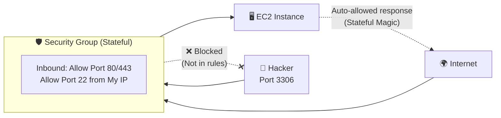

> [!important] SG vs NACL — الفرق الجوهري في الامتحان
> | | Security Group | NACL |
> |---|---|---|
> | مستوى الحماية | Instance level | Subnet level |
> | الـ State | **Stateful** (يتذكر) | **Stateless** (ما بيتذكرش) |
> | قواعد الـ Deny | ❌ مش موجودة | ✅ موجودة |
> | التطبيق | على السيرفر نفسه | على الـ Subnet كله |

---

## 💵 EC2 Pricing Models

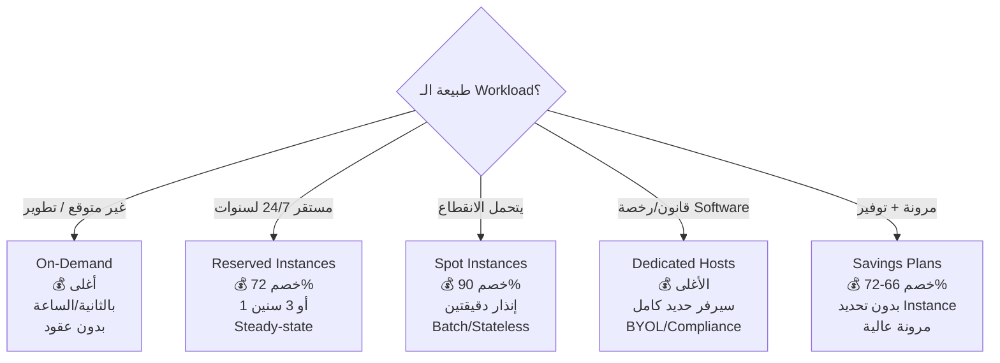

| نموذج الدفع | الخصم | الكلمات الدلالية |
|---|---|---|
| **On-Demand** | 0% | `unpredictable`, `spiky`, `testing`, `short-term` |
| **Reserved (Standard)** | حتى **72%** | `steady-state`, `1 or 3 years`, `predictable`, `always running` |
| **Reserved (Convertible)** | حتى **54%** | `may need to change instance type` |
| **Spot** | حتى **90%** | `fault-tolerant`, `batch`, `can be interrupted`, `stateless`, `flexible start/end` |
| **Dedicated Hosts** | — (الأغلى) | `BYOL`, `compliance`, `software licensing`, `per-socket/per-core` |
| **Savings Plans (Compute)** | حتى **66%** | `EC2 + Lambda + Fargate`, `flexibility`, `any region/family` |
| **Savings Plans (EC2)** | حتى **72%** | `locked to instance family`, `highest discount` |

> [!warning] فخاخ الامتحان في الـ Pricing
> - `Interruptible` أو `Batch` → **Spot** فوراً
> - `Compliance` أو `BYOL` → **Dedicated Hosts** (مش Dedicated Instances!)
> - `Flexibility` + `70% discount` → **Savings Plans**
> - `Spot` + `critical production` → **خطأ! Spot مش للـ Production**

---

## 🧩 EC2 Add-ons

### Elastic IP (EIP)

| الموضوع | التفاصيل |
|---|---|
| المشكلة | الـ Public IP بيتغير كل مرة تعمل Stop/Start |
| الحل | EIP = Static IPv4 ثابت بتحجزه لنفسك |
| **فخ التسعير** | **مجاني** لو مربوط بسيرفر شغال. **بيكلّف فلوس** لو محجوز وغير مربوط! |

### Dedicated Instances vs Dedicated Hosts

| | Dedicated Instances | **Dedicated Hosts** |
|---|---|---|
| العزل | مش بتشارك Hardware مع عملاء تانيين | نفس الشيء |
| الـ Visibility | ❌ مش شايف CPU/Sockets | ✅ شايف Cores/Sockets كاملة |
| **الاستخدام** | Compliance عادي | **BYOL** (Oracle, Windows) |

> [!danger] قاعدة BYOL
> أي سؤال فيه `Bring Your Own License` أو `per-socket` أو `per-core licensing` → **Dedicated Hosts** مش Instances

### Placement Groups

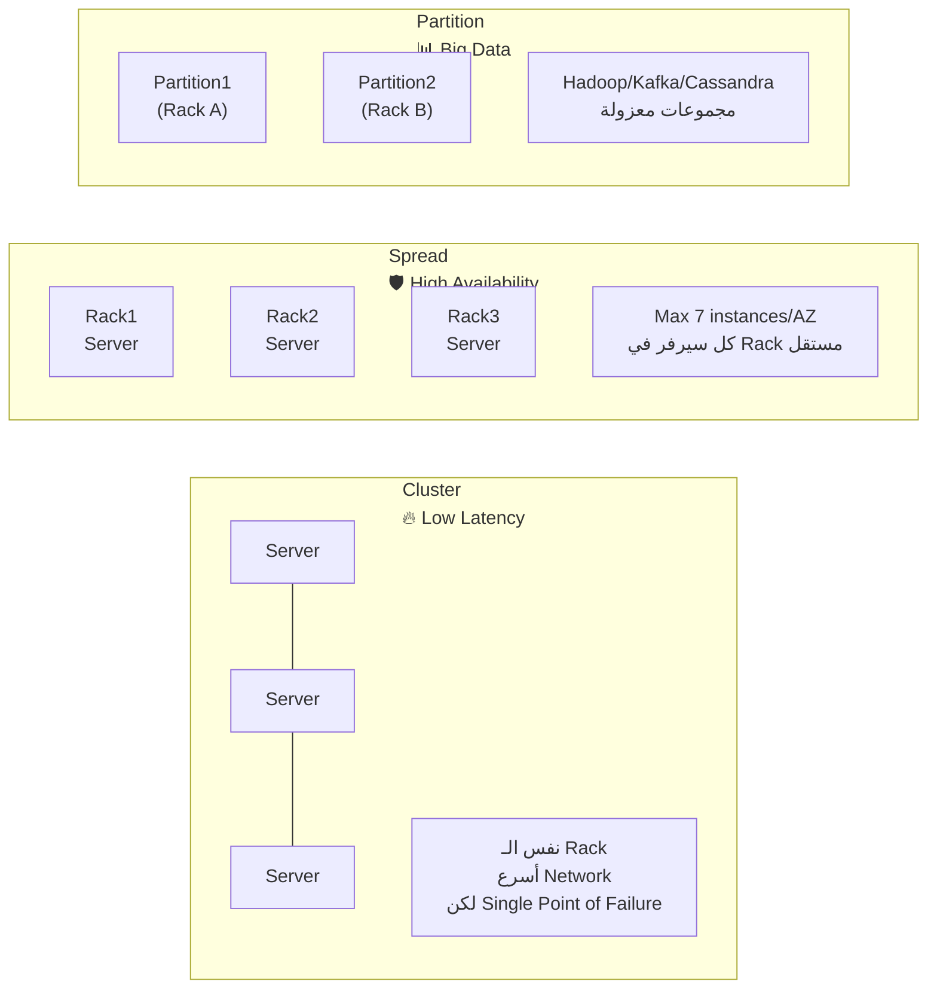

| نوع | الاستخدام | الـ Keyword |
|---|---|---|
| **Cluster** | HPC, Low Latency, High Throughput | `low network latency`, `high network throughput`, `HPC` |
| **Spread** | Critical apps, High Availability | `critical`, `failure isolation`, `max 7/AZ` |
| **Partition** | Big Data Distributed Systems | `Hadoop`, `Cassandra`, `Kafka`, `HDFS` |

---

## 💾 EBS — Block Storage

> [!info] أصل الحكاية
> EBS = هارد ديسك افتراضي بيتوصل بـ EC2 عبر الشبكة. مربوط بـ AZ واحدة. بيتوصل بـ سيرفر واحد فقط (إلا الـ Multi-Attach في io1/io2).

### IOPS vs Throughput

| المقياس | المعنى | الاستخدام |
|---|---|---|
| **IOPS** | عدد عمليات القراءة/الكتابة في الثانية | Databases (عمليات صغيرة كتيرة) |
| **Throughput (MiB/s)** | حجم البيانات المنقولة في الثانية | Big Data (ملفات كبيرة متسلسلة) |

### أنواع الـ EBS

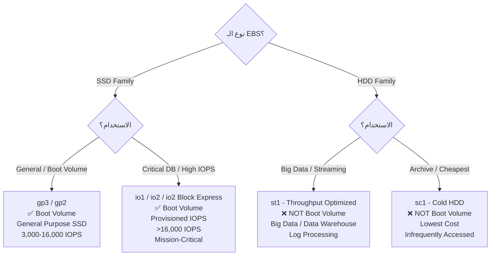

| النوع | السرعة | Boot Volume? | الـ Keyword |
|---|---|---|---|
| **gp3** | 3,000-16,000 IOPS | ✅ | General, Development, Boot |
| **gp2** | 3 IOPS/GB | ✅ | Legacy General Purpose |
| **io1/io2** | >16,000 IOPS | ✅ | `Critical`, `High IOPS`, `Sub-millisecond` |
| **io2 Block Express** | 256,000 IOPS | ✅ | `Highest performance`, SAP HANA |
| **st1** | 500 MiB/s | ❌ | `Big Data`, `Data Warehouse`, `Streaming` |
| **sc1** | 250 MiB/s | ❌ | `Lowest cost`, `Cold`, `Infrequent` |

> [!warning] قاعدة الـ Boot Volume
> الـ HDD (st1/sc1) **مستحيل** تنزل عليها OS. البوت لازم يكون SSD (gp أو io).

### EBS Snapshots

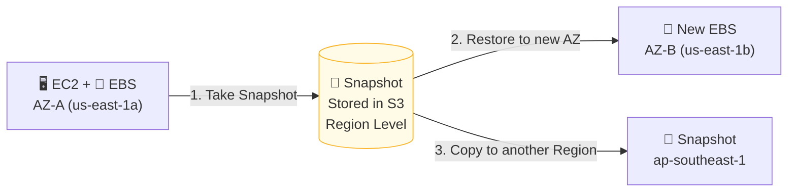

- الـ Snapshots بتتخزن في **S3** (بس مش بتشوفها في S3 Console)
- Incremental: بس التغييرات الجديدة بتتخزن (موفر للتكلفة)
- ممكن تعمل EBS Volume من Snapshot في **أي AZ** في نفس الـ Region
- ممكن تعمل **Copy** الـ Snapshot لـ Region تانية (Disaster Recovery)

---

## 📁 EFS & FSx — Shared Storage

### EFS (Elastic File System)

> [!info] أصل الحكاية
> هارد مشترك بين آلاف السيرفرات. بيكبر أوتوماتيك. بتدفع بس على ما استخدمته.

| الخاصية | التفاصيل |
|---|---|
| نظام التشغيل | **Linux فقط** (NFS protocol) |
| Multi-AZ | ✅ مدمج (بيتنسخ تلقائي في عدة AZs) |
| الحجم | Elastic — بيكبر وبيصغر أوتوماتيك |
| التسعير | ادفع على ما تستخدم (أغلى من EBS — ~3x) |
| Use Cases | Content management, Web serving, Data sharing |

| Storage Class | الاستخدام | التوفير |
|---|---|---|
| **EFS Standard** | ملفات بتتفتح كتير | — |
| **EFS Standard-IA** | ملفات نادرة (+ رسوم access) | حتى 92% أرخص |
| **EFS One Zone** | Test/Dev (AZ واحدة) | حتى 47% أرخص |

> [!warning] EFS One Zone
> لو الـ AZ الوحيدة وقعت — الداتا بتاعك راحت. للـ Dev/Test بس!

### FSx — نظيفة للـ Windows وHPC

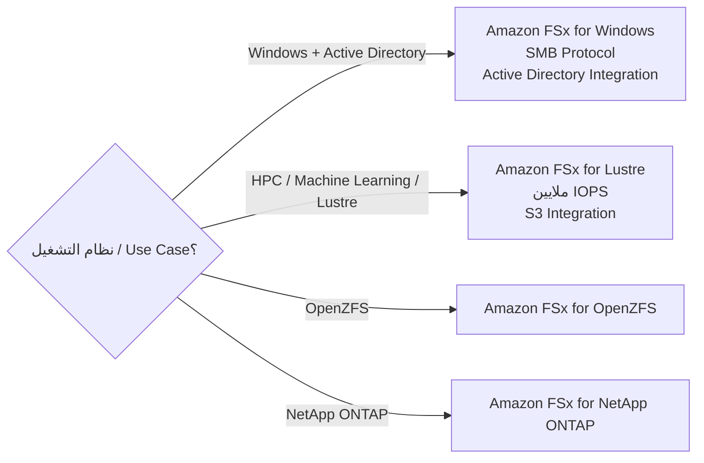

| الخدمة | الـ Keyword الحاسم |
|---|---|
| **FSx for Windows** | `Windows`, `SMB`, `Active Directory`, `NTFS`, `DFS` |
| **FSx for Lustre** | `HPC`, `Machine Learning`, `sub-millisecond`, `S3 integration` |

### المقارنة النهائية: EBS vs EFS vs FSx

| | EBS | EFS | FSx for Windows |
|---|---|---|---|
| نوع التخزين | Block | File (NFS) | File (SMB) |
| عدد السيرفرات | **1 فقط** | آلاف | آلاف |
| نظام التشغيل | Win + Linux | **Linux فقط** | **Windows فقط** |
| النطاق | **AZ واحدة** | Multi-AZ | Single/Multi-AZ |
| التسعير | حجم محجوز | ما تستخدمه | حجم محجوز |

---

## 🪣 S3 — Object Storage

> [!info] أصل الحكاية
> S3 = مخزن لانهائي للملفات. مش هارد ديسك. Object Storage مش Block Storage. لا يحتاج سيرفر EC2 للوصول إليه.

### Object Storage vs Block Storage

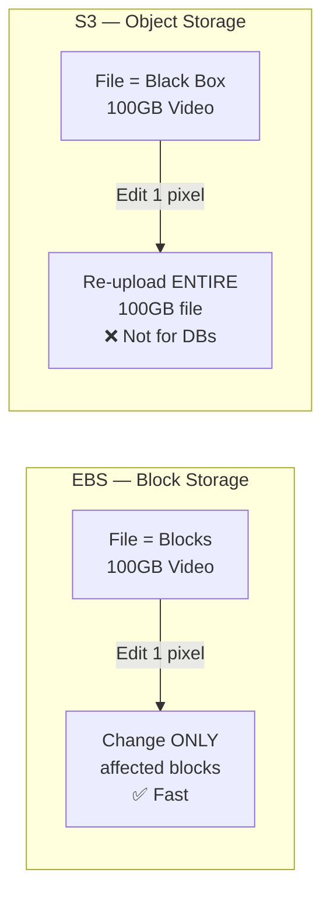

> [!danger] قاعدة الـ S3 الصارمة
> - **يُستخدم لـ:** صور، فيديوهات، PDFs، Backups، Static websites، Logs
> - **لا يُستخدم لـ:** Active Databases، OS Volumes، Shared file systems

### قواعد الـ Bucket

- **اسم Globally Unique** — فريد على مستوى الكوكب كله
- **منطقة محددة (Regional)** — الداتا ما بتنقلش من Region لأخرى تلقائياً
- مساحة **لانهائية** (Unlimited)
- حد الـ Object: **5 TB per file**

### S3 Storage Classes

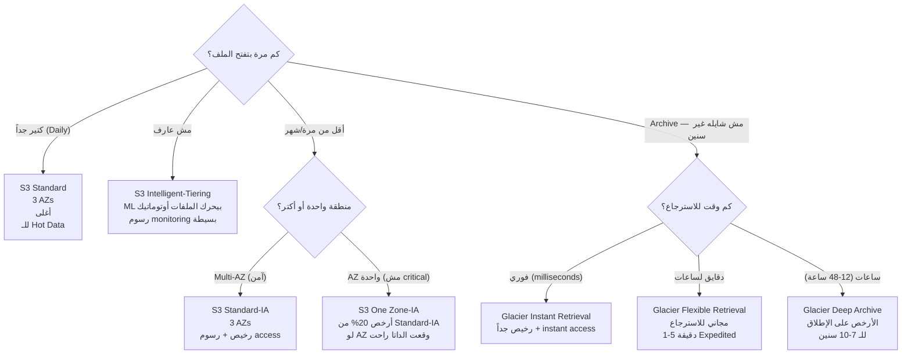

| Storage Class | Availability | الاسترجاع | الاستخدام |
|---|---|---|---|
| **Standard** | 99.99% | فوري | Hot data, frequent access |
| **Intelligent-Tiering** | 99.9% | فوري | Unknown access patterns |
| **Standard-IA** | 99.9% | فوري (رسوم) | Backups, DR (أقل access) |
| **One Zone-IA** | 99.5% | فوري (رسوم) | Non-critical, reproducible |
| **Glacier Instant** | 99.9% | Milliseconds | Archives accessed quarterly |
| **Glacier Flexible** | 99.99% | Minutes/Hours | Long-term archives |
| **Glacier Deep Archive** | 99.99% | 12-48 hours | **الأرخص** — compliance records |

### S3 Security — طبقات الحماية

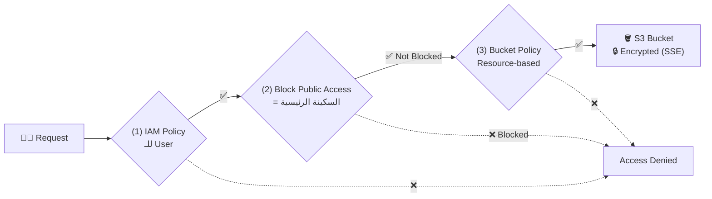

| طبقة الحماية | التفاصيل | متى تستخدمها |
|---|---|---|
| **IAM Policy** | على الـ User/Role | التحكم في المستخدمين الداخليين |
| **Bucket Policy** | JSON على الـ Bucket نفسه | Public access، Cross-account، IP restrictions |
| **Block Public Access** | ✅ مفعّل بالديفولت | لو مش عايز أي Public access أبداً |

| نوع التشفير | من يدير المفتاح؟ | الـ Keyword |
|---|---|---|
| **SSE-S3** | AWS (تلقائي الآن) | Default encryption |
| **SSE-KMS** | إنت (باستخدام KMS) | `audit trail`, `control key`, `KMS` |
| **SSE-C** | إنت بالكامل (خارج AWS) | `customer-provided key` |
| **Client-Side** | إنت بتشفر قبل الرفع | `encrypt before upload` |

### S3 Versioning & Protection

| الأداة | الوظيفة | فخ الامتحان |
|---|---|---|
| **Versioning** | يحتفظ بكل إصدارات الملف | لو فعلّتها **مش تقدر Disable** (بس Suspend) |
| **MFA Delete** | يطلب MFA عشان تمسح بشكل دائم | يحمي من الحذف غير المتعمد |
| **Object Lock (WORM)** | Write Once Read Many — ما ينفعش مسح أو تعديل | `compliance`, `WORM`, `regulatory`, `prevent deletion` |
| **Replication (CRR)** | نسخ تلقائي لـ Region تانية | لازم Versioning مفعّل |
| **Replication (SRR)** | نسخ تلقائي جوه نفس الـ Region | Log aggregation، Compliance |

### S3 Static Website

- يستضيف **Static Websites فقط** (HTML/CSS/JS)
- **لا يدعم** PHP/Node.js/Python/Databases
- لازم تعمل: **1) Disable Block Public Access** + **2) Bucket Policy تسمح بـ s3:GetObject لـ *\***
- الـ URL: `http://bucket-name.s3-website-region.amazonaws.com`

---

## 🧊 Snow Family & Storage Gateway

### Snow Family — نقل بيانات Offline

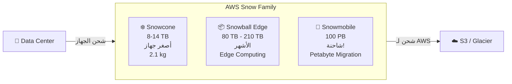

| الجهاز | الحجم | الـ Keyword |
|---|---|---|
| **Snowcone** | 8-14 TB | `Edge`, `remote locations`, `smallest`, `IoT` |
| **Snowball Edge** | 80-210 TB | `terabytes to petabytes`, `Edge Computing` |
| **Snowmobile** | 100 PB | `exabytes`, `truck`, `massive migration` |

> [!tip] متى تستخدم Snow Family؟
> لو نقل الداتا عبر النت هياخد **أكتر من أسبوع** → **Snow Family**
> قاعدة: `>10 Gbps network` + `>100 TB` → ابدأ تفكر في Snow

### AWS Storage Gateway — الجسر بين On-Premises وAWS

| النوع | يعمل إيه؟ | الـ Keyword |
|---|---|---|
| **S3 File Gateway** | يخلي On-Prem يكتب ملفات بـ NFS/SMB وبتتخزن في S3 | `NFS to S3`, `file shares` |
| **FSx File Gateway** | نفسه بس للـ FSx for Windows | `Windows shares → AWS` |
| **Volume Gateway** | Blocks بتتخزن في S3 كـ EBS Snapshots | `backup volumes to cloud` |
| **Tape Gateway** | يحاكي Tape Library وبيبعت لـ Glacier | `replace tape backup`, `VTL` |

---

## 🗄️ Databases

> [!info] القاعدة الذهبية في الامتحان
> `OLTP` (Online Transaction Processing) → RDS/Aurora
> `OLAP` (Online Analytical Processing) → Redshift
> `NoSQL` → DynamoDB
> `In-Memory Cache` → ElastiCache
> `Query S3 with SQL` → Athena

### RDS (Relational Database Service)

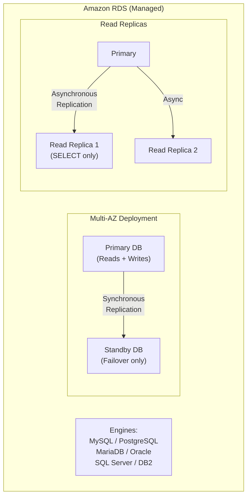

| الميزة | Multi-AZ | Read Replicas |
|---|---|---|
| الهدف | **High Availability** | **Scalability** (Read Performance) |
| الـ Replication | **Synchronous** | **Asynchronous** |
| الاستخدام | Failover تلقائي | Distribute read traffic |
| Cross-Region | ❌ نفس الـ Region | ✅ ممكن Cross-Region |
| **الـ Keyword** | `disaster recovery`, `automatic failover` | `read-heavy`, `reporting`, `analytics` |

> [!warning] الـ Standby في Multi-AZ
> الـ Standby **مش بيخدم أي reads**. هو بس للـ Failover. لو عايز تخدم reads استخدم Read Replicas.

**AWS مسؤولة عن RDS:**
- OS Patching تلقائي
- لا تقدر SSH على الـ underlying instance
- Backup تلقائي (7-35 يوم)

**إنت مسؤول:**
- Security Groups configuration
- Encryption settings
- Database users/permissions
- Network Access (Public or Private)

### Aurora (AWS's Own Database)

| الميزة | التفاصيل |
|---|---|
| السرعة | 5x أسرع من MySQL / 3x أسرع من PostgreSQL |
| التخزين | يبدأ من 10GB ويكبر أوتوماتيك حتى 128 TB |
| Replicas | حتى 15 Read Replicas |
| Availability | 6 copies في 3 AZs (مدمج في التصميم) |
| Multi-AZ | ✅ مدمج — مش خيار |
| **Aurora Serverless** | يقفل لو مفيش traffic ويتفتح تلقائياً |
| **Aurora Global** | Primary Region + حتى 5 Regions للقراءة |

> [!tip] Aurora vs RDS في الامتحان
> `5x faster` أو `enterprise-grade` أو `scale automatically` أو `writer + 15 readers` → **Aurora**
> `familiar managed MySQL/PostgreSQL` بسعر أقل → **RDS**

### DynamoDB (NoSQL)

| الخاصية | التفاصيل |
|---|---|
| النوع | Key-Value + Document NoSQL |
| الـ Availability | Distributed — 3 AZs بالديفولت |
| Scale | ملايين requests/second |
| Serverless | ✅ لا إدارة للـ servers |
| **DAX** (DynamoDB Accelerator) | In-memory cache فوق DynamoDB — microseconds latency |
| **Global Tables** | Multi-Region, Multi-Active replication |

| الـ Keyword | الخدمة |
|---|---|
| `NoSQL`, `key-value`, `millions req/sec` | DynamoDB |
| `microseconds latency`, `cache DynamoDB` | DAX |
| `multi-region active-active` | DynamoDB Global Tables |
| `serverless NoSQL` | DynamoDB |

### ElastiCache — In-Memory Cache

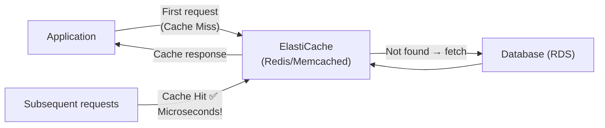

| | **Redis** | **Memcached** |
|---|---|---|
| Data Structures | Rich (Strings, Hashes, Lists, Sets) | Simple key-value |
| Persistence | ✅ يحفظ البيانات | ❌ volatile (بتضيع) |
| Replication | ✅ Multi-AZ, Read Replicas | ❌ |
| Clustering | ✅ Cluster Mode | ✅ Multi-threaded |
| **الاستخدام** | Session storage, Leaderboards, Real-time | Simple caching, Large-scale |
| **الـ Keyword** | `persistence`, `replication`, `backup`, `multi-AZ cache` | `simple caching`, `horizontal scaling`, `multi-threaded` |

### Analytics Databases

| الخدمة | الوظيفة | الـ Keyword |
|---|---|---|
| **Redshift** | Data Warehouse — OLAP | `data warehouse`, `business intelligence`, `petabyte`, `columnar`, `SQL analytics` |
| **Athena** | Query S3 بـ SQL بدون Server | `serverless SQL`, `query S3`, `pay per query`, `ad-hoc analysis` |
| **EMR** | Big Data Processing (Hadoop/Spark) | `Hadoop`, `Spark`, `Hive`, `big data processing`, `ETL` |

### DMS — Database Migration Service

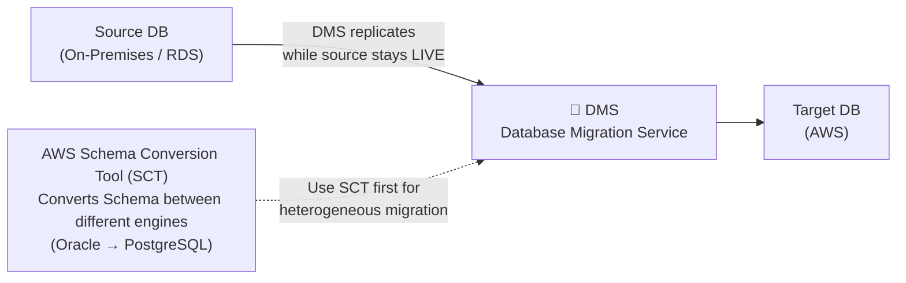

| نوع الـ Migration | المعنى | الأداة |
|---|---|---|
| **Homogeneous** | نفس الـ engine (MySQL → MySQL) | DMS فقط |
| **Heterogeneous** | engines مختلفة (Oracle → PostgreSQL) | **SCT أولاً** ثم DMS |

> [!important] DMS Keeps Source Running
> DMS بيعمل Migration وهو شغال والـ Source لسه تخدم users. مفيش downtime!

---

## 📦 Containers & Serverless

### Docker & Container Services

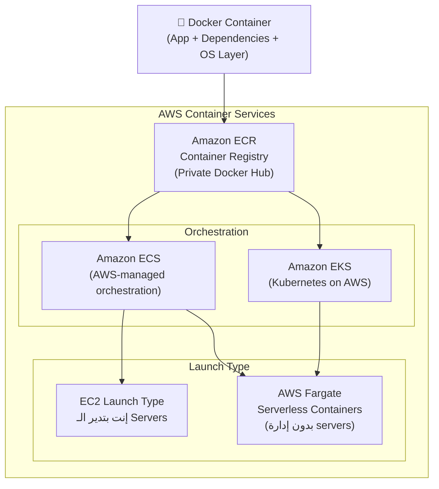

| الخدمة | الوصف | الـ Keyword |
|---|---|---|
| **ECR** | Private Container Registry | `store docker images`, `push/pull images` |
| **ECS** | AWS Container Orchestration | `run containers on AWS`, `task definition` |
| **EKS** | Kubernetes Managed by AWS | `Kubernetes`, `K8s`, `open-source orchestration` |
| **Fargate** | Serverless Compute for Containers | `no EC2 management`, `serverless containers`, `pay per task` |

> [!tip] ECS vs EKS
> `already using Kubernetes` أو `Kubernetes expertise` → **EKS**
> `simple container deployment on AWS` → **ECS**
> `no server management for containers` → **Fargate** (مع ECS أو EKS)

### Lambda — Serverless Compute

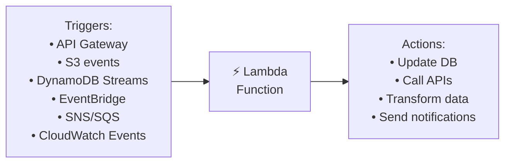

| الخاصية | التفاصيل |
|---|---|
| Execution Time | Max **15 minutes** per invocation |
| Memory | 128 MB - 10,240 MB |
| Pricing | بالـ **invocations** + **duration** (GB-seconds) |
| Free Tier | **1 million invocations/month FOREVER** + 400,000 GB-seconds |
| Languages | Python, Node.js, Java, Go, Ruby, C#, PowerShell, Custom Runtime |
| Scaling | **Automatic** — concurrent executions |
| Cold Start | تأخير أول مرة بعد idle (يمكن حله بـ Provisioned Concurrency) |

| الـ Keyword | الإجابة |
|---|---|
| `serverless`, `event-driven`, `no server management` | Lambda |
| `runs for max 15 minutes` | Lambda |
| `pay per invocation` | Lambda |
| `Cold start problem` | Provisioned Concurrency |

### Batch — Scheduled Workloads

| الخاصية | Lambda | AWS Batch |
|---|---|---|
| الحد الأقصى للتشغيل | **15 دقيقة** | **بلا حد** (ساعات/أيام) |
| الـ Runtime | Custom runtimes | أي Docker image |
| الـ Scheduling | Event-driven | Queue-based |
| **الاستخدام** | Short functions | Long batch jobs |
| **الـ Keyword** | `event-driven`, `short tasks` | `long-running jobs`, `batch processing`, `large compute` |

### Elastic Beanstalk — PaaS

> [!info] أصل الفكرة
> إنت ترفع الكود (ZIP/WAR/JAR) وBeanstalk بيدير كل الـ Infrastructure تلقائياً (EC2, Load Balancer, Auto Scaling, RDS). إنت مسؤول عن الكود فقط.

| الخاصية | التفاصيل |
|---|---|
| النوع | **PaaS** (Platform as a Service) |
| Supported Platforms | Java, .NET, PHP, Node.js, Python, Ruby, Go, Docker |
| مجاني؟ | ✅ الخدمة مجانية — تدفع على الـ Resources |
| مناسب لـ | Developers who don't want to manage infrastructure |

| الـ Keyword | الإجابة |
|---|---|
| `upload code`, `PaaS`, `developer-friendly`, `no infrastructure management` | Elastic Beanstalk |
| `automatically handles deployment, scaling, load balancing` | Elastic Beanstalk |

### API Gateway

> [!info] الوظيفة
> الباب الأمامي للـ APIs. يستقبل HTTP/REST/WebSocket requests ويوجهها للـ Lambda أو Backend.

| الـ Keyword | الإجابة |
|---|---|
| `create REST API`, `expose Lambda as HTTP endpoint` | API Gateway |
| `serverless API backend` | API Gateway + Lambda |
| `rate limiting`, `authentication for APIs`, `API versioning` | API Gateway |

### CloudFormation — IaC

> [!info] الوظيفة
> Infrastructure as Code. تكتب JSON/YAML template تصف الـ infrastructure وCloudFormation يعملها تلقائياً.

| الـ Keyword | الإجابة |
|---|---|
| `infrastructure as code`, `IaC`, `template`, `repeatable`, `version control for infra` | CloudFormation |
| `create same environment multiple times` | CloudFormation |
| `rollback changes automatically` | CloudFormation |

---

## 🔗 Integration Services

> [!info] ليه Integration؟
> بدل ما تطبيقين يتكلموا مع بعض مباشرة (Tight Coupling = لو واحد وقع، الثاني وقع)، بتحط وسيط (Loose Coupling = كل خدمة مستقلة).

### SQS — Simple Queue Service

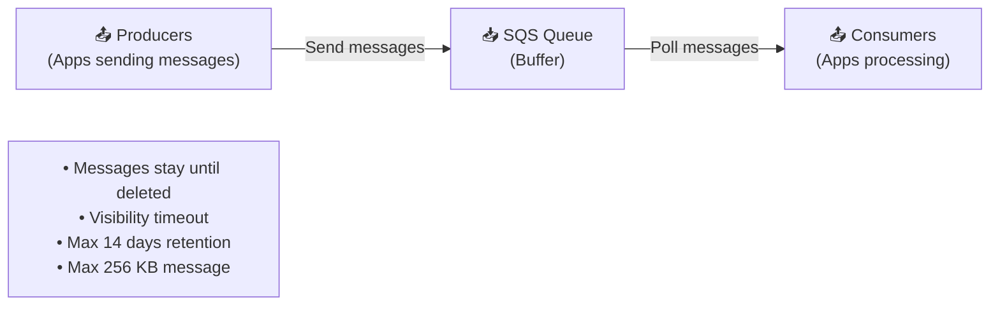

| الموضوع | Standard Queue | FIFO Queue |
|---|---|---|
| الترتيب | ❌ Best effort | ✅ **Exactly-first-in-first-out** |
| Duplicates | ممكن يحصل | ❌ بدون duplicates |
| Throughput | Unlimited | 300 msg/sec (3000 with batching) |
| **الاستخدام** | High throughput | Order processing, financial |
| **الـ Keyword** | `decouple`, `buffer`, `async`, `high volume` | `ordering matters`, `exactly-once`, `financial transactions` |

**Visibility Timeout:** لما consumer ياخد message، بتختفي عن الباقيين لمدة X ثانية. لو ما اتمسحتش في المدة دي، بترجع للـ Queue تاني.

### SNS — Simple Notification Service

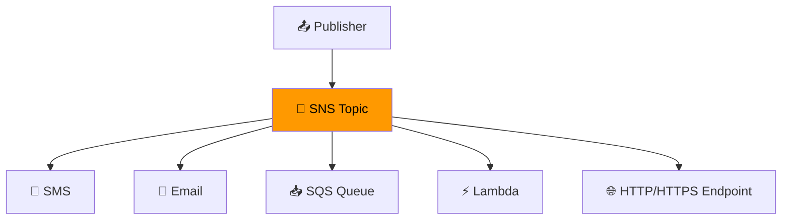

| الموضوع | التفاصيل |
|---|---|
| النموذج | **Pub/Sub** (Publisher → Topic → Subscribers) |
| الـ Delivery | **Push** (الـ topic بيبعت للـ subscribers) |
| الـ Persistence | ❌ مش بيحتفظ بالـ messages |
| **Fan-out Pattern** | SNS → Multiple SQS Queues → Parallel processing |
| **الـ Keyword** | `notification`, `alert`, `fan-out`, `publish-subscribe`, `email/SMS/Lambda trigger` |

### Kinesis — Real-time Streaming

| الخدمة | الوظيفة | الـ Keyword |
|---|---|---|
| **Kinesis Data Streams** | Real-time data ingestion | `real-time`, `streaming`, `clickstream`, `IoT sensor data` |
| **Kinesis Data Firehose** | Load streaming data to S3/Redshift/Elasticsearch | `deliver to S3`, `near real-time delivery`, `no code` |
| **Kinesis Data Analytics** | SQL queries on streaming data | `analyze streaming data with SQL` |

> [!important] SQS vs SNS vs Kinesis
> | | SQS | SNS | Kinesis |
> |---|---|---|---|
> | النموذج | Queue (Pull) | Pub/Sub (Push) | Streaming |
> | الترتيب | ❌ (FIFO ✅) | ❌ | ✅ per Shard |
> | Consumers | 1 consumer/message | Multiple | Multiple |
> | الاستخدام | Decoupling | Notifications | Real-time analytics |

### EventBridge — Event-Driven Architecture

- يربط AWS Services مع بعضها عبر Events
- `Schedule` (cron jobs) أو `Event Pattern` (react to AWS events)
- **الـ Keyword:** `schedule Lambda`, `react to AWS events`, `event bus`, `cron job on AWS`

---

## 🌐 Networking & VPC

> [!info] أصل الحكاية
> VPC = شبكتك الخاصة المعزولة داخل AWS. زي إنك بتعمل LAN خاص لشركتك بس في السحابة.

### CIDR & IP Basics

| المفهوم | المعنى |
|---|---|
| CIDR | Classless Inter-Domain Routing — طريقة كتابة نطاق IP |
| `/16` | 65,536 عنوان IP |
| `/24` | 256 عنوان IP |
| `/32` | عنوان IP واحد بالظبط |
| Private ranges | 10.0.0.0/8 — 172.16.0.0/12 — 192.168.0.0/16 |

### معمارية الـ VPC الكاملة

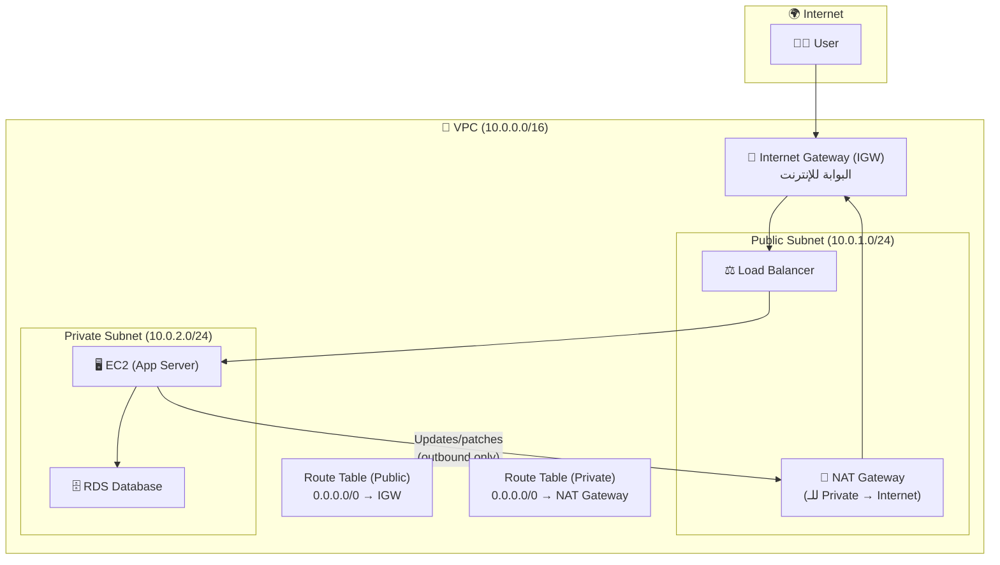

### Components الأساسية

| Component | الوظيفة | فخ الامتحان |
|---|---|---|
| **IGW** | يوصل الـ VPC بالإنترنت | **واحد فقط** لكل VPC |
| **Route Table** | يحدد الـ traffic روح فين | الـ Public Subnet لازم Route لـ IGW |
| **Public Subnet** | Resources عندها Public IP ووصول مباشر للإنترنت | فيها IGW route |
| **Private Subnet** | مش عندها وصول مباشر للإنترنت | مفيش IGW route |
| **NAT Gateway** | Private → Internet (Outbound only) | في الـ Public Subnet، مدفوع |
| **NACL** | Stateless Firewall على الـ Subnet | Inbound + Outbound rules لازم الاتنين |

### Security Group vs NACL المقارنة الكاملة

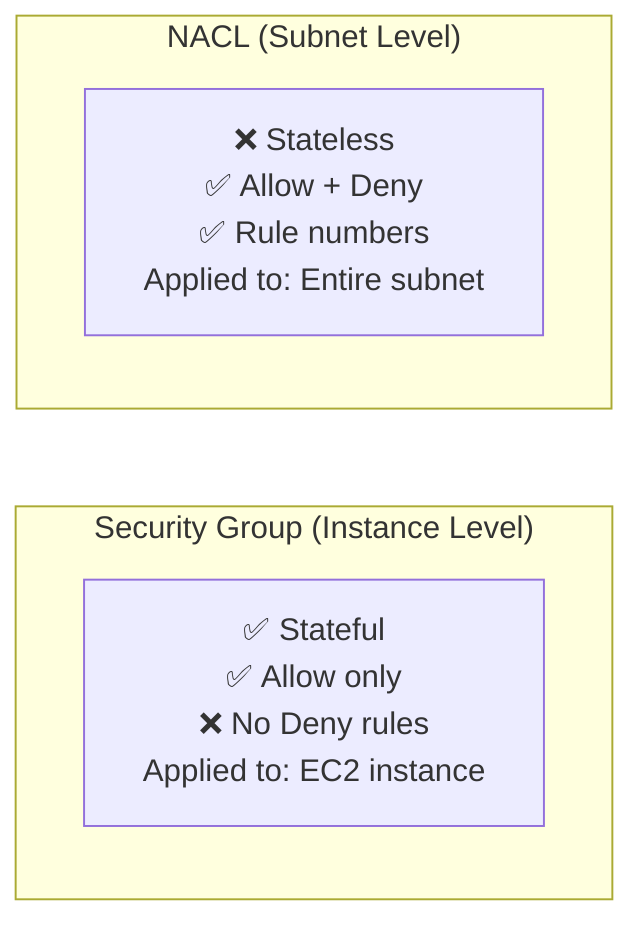

| | Security Group | NACL |
|---|---|---|
| المستوى | Instance | Subnet |
| State | **Stateful** | **Stateless** |
| Rules | Allow فقط | Allow + **Deny** |
| التطبيق | يتركب على الـ instance | يطبق على كل الـ subnet |
| الترتيب | كل القواعد بتتطبق | **Rule numbers** (تسلسلي) |
| الـ Keyword | `instance firewall`, `stateful` | `subnet firewall`, `block specific IP`, `stateless`, `deny specific` |

### VPC Peering — ربط VPCs

- يربط VPCين ببعض (نفس الـ account أو accounts مختلفة)
- **Not Transitive:** A↔B وB↔C لا يعني A↔C (لازم Peering مباشر)
- لا يمكن Overlapping CIDRs
- **الـ Keyword:** `connect two VPCs`, `private communication between VPCs`

### VPC Endpoints — وصول لـ AWS Services بدون إنترنت

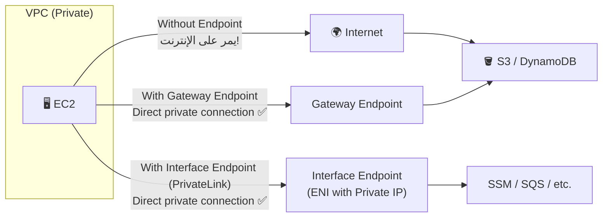

| نوع الـ Endpoint | يدعم | الـ Keyword |
|---|---|---|
| **Gateway Endpoint** | **S3 وDynamoDB فقط** | `free`, `route table entry` |
| **Interface Endpoint (PrivateLink)** | معظم AWS Services | `private connectivity`, `ENI`, `most services` |

> [!danger] Gateway Endpoint = S3 + DynamoDB فقط
> لو السؤال فيه S3 أو DynamoDB → Gateway Endpoint (مجاني!)
> لو خدمة تانية → Interface Endpoint

### Direct Connect & VPN

| | Site-to-Site VPN | AWS Direct Connect |
|---|---|---|
| الاتصال | عبر **الإنترنت العادي** (مشفر) | **خط مادي مخصص** (Dedicated fiber) |
| السرعة | Variable (تعتمد على الإنترنت) | 1-100 Gbps (Consistent) |
| التكلفة | رخيص | غالي |
| الإعداد | **ساعات** | **أسابيع لأشهر** |
| **الاستخدام** | سريع، مؤقت، رخيص | **Consistent performance**, **Compliance**, **High bandwidth** |
| **الـ Keyword** | `quick setup`, `encrypted tunnel` | `private connection`, `dedicated`, `consistent latency` |

### Transit Gateway — Hub & Spoke

- يربط **آلاف** الـ VPCs مع On-Premises بدل Peering واحد واحد
- **الـ Keyword:** `connect thousands of VPCs`, `hub-and-spoke`, `transitive routing`

---

## 🌍 Global Distribution

### CloudFront — CDN

```mermaid
flowchart LR
    User["👨‍💻 User
(Australia)"] -->|"Request"| Edge["📡 Edge Location
(Sydney)"]
    Edge -->|"Cache Hit ✅
Microseconds"| User
    Edge -->|"Cache Miss
1st request"| Origin["☁️ Origin
(S3 / ALB / EC2)"]
    Origin --> Edge
    
    note["400+ Edge Locations
Content cached by TTL
DDoS protection via Shield
OAC for S3 security"]
```

| الخاصية | التفاصيل |
|---|---|
| وظيفته | CDN — Cache content at Edge Locations |
| Origins | S3, ALB, EC2, Custom HTTP |
| DDoS Protection | ✅ مدمج مع Shield Standard |
| **OAC** | Origin Access Control — يمنع direct access لـ S3 |
| الـ Keyword | `CDN`, `cache at edge`, `low latency global`, `static content delivery` |

**CloudFront vs S3 CRR:**
| | CloudFront | S3 Cross-Region Replication |
|---|---|---|
| النوع | Cache (مؤقت) | Real copy (حقيقي) |
| التحديث | بعد TTL | Real-time |
| النطاق | كل الـ Edge Locations | Region محددة |
| الاستخدام | Static content للجميع | محتوى معين في Region محددة |

### Route 53 — DNS ذكي

| Routing Policy | المعنى | الـ Keyword |
|---|---|---|
| **Simple** | واحد IP ثابت | Basic routing |
| **Weighted** | وزّع الـ traffic بنسب | `A/B testing`, `gradual deployment`, `90/10 split` |
| **Latency** | روح للـ Region الأقرب | `lowest latency`, `global users` |
| **Failover** | لو Primary وقع، روح للـ Secondary | `disaster recovery`, `active-passive` |
| **Geolocation** | بناءً على بلد المستخدم | `content localization`, `restrict content by location` |
| **Geoproximity** | بناءً على المسافة الجغرافية | `bias traffic` |

> [!important] Route 53 = Global Service
> مش مربوط بـ Region. DNS records متاحة عالمياً تلقائياً.

### Global Accelerator

| الخاصية | التفاصيل |
|---|---|
| وظيفته | يوجه الـ traffic عبر الـ AWS Private Global Network |
| IP Addresses | **2 Static Anycast IPs** ثابتة للأبد |
| Cache | ❌ مفيش Cache |
| الاستخدام | Gaming، IoT، Voice over IP، Applications requiring static IPs |
| **الـ Keyword** | `static IP`, `AWS backbone network`, `no cache`, `TCP/UDP performance` |

**CloudFront vs Global Accelerator:**
| | CloudFront | Global Accelerator |
|---|---|---|
| Cache | ✅ | ❌ |
| Protocols | HTTP/HTTPS | TCP/UDP |
| Static IPs | ❌ | ✅ **2 Anycast IPs** |
| الاستخدام | Static/Dynamic content delivery | Non-HTTP, Gaming, Static IPs needed |

---

## ⚖️ Load Balancing & Auto Scaling

### Load Balancers

```mermaid
flowchart TB
    subgraph LBs["AWS Load Balancers"]
        ALB["Application Load Balancer
(Layer 7 — HTTP/HTTPS)
• Path-based routing (/api, /web)
• Host-based routing
• WebSocket, HTTP/2
• Target: EC2, Lambda, IPs, Containers"]
        
        NLB["Network Load Balancer
(Layer 4 — TCP/UDP)
• Static IP per AZ
• Ultra-high performance
• Millions req/sec
• Preserve client IP"]
        
        GLB["Gateway Load Balancer
(Layer 3)
• 3rd-party appliances
• Firewalls, IDS/IPS"]
    end
```

| | ALB (Layer 7) | NLB (Layer 4) |
|---|---|---|
| Protocol | HTTP/HTTPS/WebSocket | TCP/UDP/TLS |
| Routing | Path, Host, Headers, Query | Port only |
| Static IP | ❌ (DNS name فقط) | ✅ (Static IP per AZ) |
| Performance | High | **Extreme (millions req/sec)** |
| **الـ Keyword** | `URL routing`, `microservices`, `path-based`, `HTTP` | `static IP`, `gaming`, `TCP`, `high performance`, `low latency` |

### Auto Scaling Group (ASG)

```mermaid
flowchart LR
    CW["📊 CloudWatch
Metrics (CPU > 70%)"] -->|"Scale Out trigger"| ASG["⚙️ Auto Scaling Group"]
    ASG -->|"Launch"| EC2_1["🖥️ EC2"]
    ASG -->|"Launch"| EC2_2["🖥️ EC2"]
    ASG -->|"Launch"| EC2_3["🖥️ EC2"]
    
    ASG --> Settings["Settings:
• Min: 1
• Desired: 2
• Max: 5"]
```

| الـ Scaling Policy | المعنى | الـ Keyword |
|---|---|---|
| **Dynamic Scaling** | يرد على CloudWatch Alarms | `CPU > 70%`, `reactive scaling` |
| **Predictive Scaling** | ML يتوقع الـ traffic ويـ scale مسبقاً | `forecast`, `ML-based`, `proactive` |
| **Scheduled Scaling** | Scale في أوقات محددة | `every Friday 5 PM`, `Black Friday` |
| **Target Tracking** | يحاول يفضل عند هدف معين | `keep CPU at 50%`, `simple and automatic` |

### Lifecycle Hooks

```mermaid
flowchart LR
    Launch["ASG launches
new EC2"] -->|"Pending: Wait"| Hook["⏳ Lifecycle Hook
(your script runs)
Install software
Run tests
Warm up app"]
    Hook -->|"Complete or Timeout"| InService["✅ InService
(serving traffic)"]
    
    Terminate["Scheduled
Termination"] -->|"Terminating: Wait"| Hook2["⏳ Lifecycle Hook
Drain connections
Save state
Clean up"]
    Hook2 --> Terminated["❌ Terminated"]
```

---

## 📊 Monitoring & Management

### CloudWatch

```mermaid
flowchart TB
    subgraph CW["Amazon CloudWatch"]
        Metrics["📈 Metrics
(CPU, Memory, Network)
Every 1 min (detailed: 1 sec)"]
        Alarms["🔔 Alarms
(Trigger actions on threshold)
→ SNS → ASG → EC2 Action"]
        Logs["📄 Logs
(Application logs, Lambda logs)
Log Groups + Log Streams"]
        Events["⚡ Events (EventBridge)
(React to AWS service events)"]
        Dashboard["📊 Dashboard
(Custom views)"]
    end
```

| الخاصية | التفاصيل |
|---|---|
| Default Metrics | EC2: CPU, Network, Disk I/O (كل 5 دقايق) |
| Detailed Monitoring | كل **1 دقيقة** (بتكلف) |
| **Custom Metrics** | Memory, Disk Space (لازم CloudWatch Agent) |
| Logs Retention | يتحدد منك (1 يوم - ∞) |

> [!warning] CloudWatch لا يقيس Memory بالديفولت
> Memory Utilization مش في الـ Default Metrics. لازم تثبت **CloudWatch Agent** على الـ EC2.

### CloudTrail

| الموضوع | التفاصيل |
|---|---|
| الوظيفة | يسجل كل الـ **API Calls** في الـ Account |
| السؤال اللي بيجاوب عليه | **"مين عمل إيه إمتى ومنين؟"** |
| الاحتفاظ | 90 يوم بالديفولت، ممكن تبعت لـ S3 للأبد |
| الـ Scope | كل الـ Regions |
| **CloudTrail Insights** | يكشف unusual API activity تلقائياً |
| **الـ Keyword** | `audit`, `compliance`, `who deleted`, `API call history`, `governance` |

### AWS Config

| الموضوع | التفاصيل |
|---|---|
| الوظيفة | يسجل ويتتبع **تغييرات الـ Configuration** على مر الوقت |
| السؤال اللي بيجاوب عليه | **"إيه اللي اتغير ومتى؟"** |
| الـ Config Rules | تحدد إيه اللي Compliant وإيه اللي لأ |
| **Auto Remediation** | يصلح الـ non-compliant resources تلقائياً |
| الـ Scope | Regional (ممكن Aggregate) |
| **الـ Keyword** | `compliance`, `configuration history`, `drift detection`, `who changed resource` |

**CloudTrail vs CloudWatch vs Config:**

| | CloudWatch | CloudTrail | Config |
|---|---|---|---|
| السؤال | Performance metrics | API calls audit | Configuration changes |
| الهدف | Monitoring | Security audit | Compliance |
| الكلمة | `metrics`, `alarms` | `who did what` | `what changed`, `compliant?` |

### Trusted Advisor

```mermaid
flowchart LR
    TA["🔦 Trusted Advisor"] --> C1["💰 Cost Optimization
(Under-utilized resources)"]
    TA --> C2["⚡ Performance
(High-utilization resources)"]
    TA --> C3["🔒 Security
(Open ports, no MFA)"]
    TA --> C4["🛡️ Fault Tolerance
(No Multi-AZ, no backups)"]
    TA --> C5["📊 Service Limits
(Near quota)"]
    TA --> C6["✅ Operational Excellence"]
```

| الـ Support Plan | عدد Checks |
|---|---|
| Basic + Developer | **7 Core Checks فقط** (أهمها Security) |
| Business + Enterprise | **Full Checks** (كل الـ 6 categories) |

### Systems Manager (SSM)

| الخدمة | الوظيفة | الـ Keyword |
|---|---|---|
| **SSM Session Manager** | SSH بدون SSH! بدون Key Pairs | `no open ports`, `no SSH keys`, `audit session logs` |
| **Run Command** | تشغيل script على مئات الـ Servers | `run scripts at scale`, `patch at scale` |
| **Patch Manager** | تحديث OS تلقائياً | `automated patching`, `compliance patching` |
| **Parameter Store** | تخزين Config والـ Secrets (مش بيدور تلقائياً) | `store config`, `secrets without rotation` |

---

## 🚀 Deployment & IaC

### CI/CD Tools

```mermaid
flowchart LR
    CC["📝 CodeCommit
(Git Repository
Source Control)"] -->|"Trigger"| CB["🔨 CodeBuild
(Build + Test
CI Tool)"]
    CB -->|"Artifacts"| CD["🚀 CodeDeploy
(Deploy to EC2/Lambda
CD Tool)"]
    CC & CB & CD -->|"Orchestrates"| CP["🔄 CodePipeline
(Full CI/CD Pipeline)"]
```

| الخدمة | الوظيفة | الـ Keyword |
|---|---|---|
| **CodeCommit** | Private Git repository (like GitHub) | `source control`, `version control`, `Git` |
| **CodeBuild** | Build + Test automation (like Jenkins) | `build artifacts`, `run tests`, `CI` |
| **CodeDeploy** | Deploy to EC2, Lambda, ECS | `automated deployment`, `rolling deployment`, `CD` |
| **CodePipeline** | Orchestrates the full pipeline | `full CI/CD`, `automate end-to-end` |

> [!tip] كيف تتذكرهم
> Commit → Build → Deploy → Pipeline يجمعهم كلهم

---

## 🤖 AI & ML Services

> [!info] استراتيجية الامتحان
> كل خدمة بتعمل حاجة واحدة محددة. ركز على الـ keyword الوحيدة لكل خدمة.

```mermaid
flowchart TD
    subgraph Vision["👁️ Vision"]
        REK["Amazon Rekognition
• Face recognition
• Object detection
• Content moderation
• Celebrity detection"]
        TEX["Amazon Textract
• Extract text from images
• OCR on steroids
• Forms, tables, PDFs"]
    end
    
    subgraph Speech["🗣️ Speech"]
        POL["Amazon Polly
• Text → Speech
• Multiple voices/languages"]
        TRN["Amazon Transcribe
• Speech → Text
• Auto-generates captions"]
    end
    
    subgraph Language["📝 Language"]
        TRL["Amazon Translate
• Language Translation
• Localization"]
        LEX["Amazon Lex
• Build Chatbots
• Powers Alexa!"]
        COM["Amazon Comprehend
• NLP
• Sentiment Analysis
• Key phrases, entities"]
        KEN["Amazon Kendra
• Intelligent Search
• Enterprise search with ML"]
    end
    
    subgraph ML["🧠 ML Platform"]
        SGM["Amazon SageMaker
• Build, train, deploy ML models
• End-to-end ML platform"]
    end
```

| الخدمة | الـ Keyword الحاسم |
|---|---|
| **Rekognition** | `face recognition`, `image/video analysis`, `object detection`, `content moderation` |
| **Textract** | `extract text from documents`, `OCR`, `forms and tables`, `PDFs` |
| **Polly** | `text to speech`, `voice`, `audio from text` |
| **Transcribe** | `speech to text`, `audio to text`, `transcription`, `captions`, `subtitles` |
| **Translate** | `language translation`, `localization` |
| **Lex** | `chatbot`, `conversational interface`, `voice bot`, `Alexa technology` |
| **Comprehend** | `NLP`, `sentiment analysis`, `key phrases`, `entity recognition`, `language detection` |
| **Kendra** | `intelligent enterprise search`, `ML-powered search`, `find answers in documents` |
| **SageMaker** | `build ML model`, `train model`, `deploy model`, `end-to-end ML`, `data scientists` |

---

## 🚛 Migration

### The 7 Rs — استراتيجيات الهجرة

```mermaid
flowchart LR
    subgraph Low_Effort["منخفض الجهد"]
        R1["🗑️ Retire
أوقف النظام تماماً
(مش محتاجه)"]
        R2["⏸️ Retain
ابقيه On-Premises
(مش جاهز)"]
        R3["🔄 Rehost (Lift & Shift)
انقله زي ما هو لـ EC2
(أسرع طريقة)"]
    end
    
    subgraph Medium_Effort["متوسط الجهد"]
        R4["🔧 Replatform (Lift & Tinker)
تعديلات بسيطة
(RDS بدل MySQL)"]
        R5["🛍️ Repurchase
اشتري SaaS بديل
(Salesforce بدل CRM قديم)"]
    end
    
    subgraph High_Effort["عالي الجهد"]
        R6["✨ Refactor/Re-architect
بناء من جديد
(Microservices/Serverless)"]
        R7["📦 Relocate
VMware Cloud on AWS
(نقل VMware workloads)"]
    end
```

| الـ R | الكلمة الدلالية |
|---|---|
| **Retire** | `decommission`, `not needed anymore`, `eliminate` |
| **Retain** | `not ready`, `keep on-premises`, `compliance prevents migration` |
| **Rehost** | `lift and shift`, `fastest migration`, `no code changes` |
| **Replatform** | `lift and tinker`, `minor optimization`, `RDS instead of self-managed` |
| **Repurchase** | `move to SaaS`, `drop and shop`, `buy new product` |
| **Refactor** | `re-architect`, `microservices`, `serverless`, `maximize cloud features` |
| **Relocate** | `VMware`, `vSphere workloads to AWS` |

### CAF — Cloud Adoption Framework

```mermaid
flowchart TB
    subgraph CAF["AWS Cloud Adoption Framework (CAF)"]
        subgraph Business["Business Capabilities"]
            B["Business
(Strategy & ROI)"]
            P["People
(Culture & Workforce)"]
            G["Governance
(Risk & Compliance)"]
        end
        
        subgraph Tech["Technical Capabilities"]
            PL["Platform
(Architecture & Engineering)"]
            S["Security
(Confidentiality & Integrity)"]
            O["Operations
(Support & Performance)"]
        end
        
        Phases["Phases:
1️⃣ Envision → 2️⃣ Align → 3️⃣ Launch → 4️⃣ Scale"]
    end
```

| Perspective | التركيز | الـ Keyword |
|---|---|---|
| **Business** | ROI, Business case, Strategy | `business value`, `cloud investment` |
| **People** | Culture, Training, Workforce | `culture change`, `workforce development`, `leadership` |
| **Governance** | Risk management, Compliance | `governance`, `minimize risk`, `benefits realization` |
| **Platform** | Architecture, Engineering | `architecture`, `cloud platform`, `data architecture` |
| **Security** | CIA triad, Security controls | `security controls`, `data protection` |
| **Operations** | Delivery, Support | `operational model`, `performance insights` |

---

## 📝 Master Keyword Table

> [!tip] استخدم الجدول ده في آخر 30 دقيقة قبل الامتحان

### Compute Keywords

| لو شفت في السؤال | الإجابة |
|---|---|
| `Unpredictable workload`, `testing`, `short-term` | EC2 **On-Demand** |
| `Steady-state`, `always running`, `1 or 3 years` | EC2 **Reserved** |
| `Batch`, `interruptible`, `fault-tolerant`, `cheapest` | EC2 **Spot** |
| `BYOL`, `per-socket/core license`, `Compliance hardware` | **Dedicated Hosts** |
| `Serverless compute`, `event-driven`, `max 15 min` | **Lambda** |
| `No server management for containers`, `serverless containers` | **Fargate** |
| `Long-running batch jobs`, `hours`, `Docker` | **AWS Batch** |
| `Upload code`, `PaaS`, `developer-friendly` | **Elastic Beanstalk** |
| `Kubernetes on AWS` | **EKS** |
| `Container registry`, `store Docker images` | **ECR** |
| `Expose Lambda as HTTP`, `REST API` | **API Gateway** |

### Storage Keywords

| لو شفت في السؤال | الإجابة |
|---|---|
| `Boot volume`, `OS`, `single EC2` | **EBS (gp3)** |
| `Critical DB`, `>16,000 IOPS`, `sub-millisecond` | **EBS (io1/io2)** |
| `Big Data`, `streaming`, `sequential` | **EBS (st1)** |
| `Cheapest`, `cold`, `infrequent access` (block) | **EBS (sc1)** |
| `Shared among Linux instances`, `NFS` | **EFS** |
| `Windows shared storage`, `SMB`, `Active Directory` | **FSx for Windows** |
| `HPC`, `Machine Learning`, `Lustre` | **FSx for Lustre** |
| `Unlimited storage`, `object storage`, `static files` | **S3** |
| `WORM`, `compliance`, `cannot delete` | **S3 Object Lock** |
| `Multiple versions`, `versioning`, `accidental delete` | **S3 Versioning** |
| `Offline migration`, `petabytes`, `slow internet` | **Snow Family** |
| `100+ petabytes`, `truck` | **Snowmobile** |
| `Hybrid storage`, `NFS to S3` | **Storage Gateway** |
| `Replace tape backup` | **Storage Gateway Tape** |

### Database Keywords

| لو شفت في السؤال | الإجابة |
|---|---|
| `Managed relational`, `MySQL`, `PostgreSQL` | **RDS** |
| `Automatic failover`, `Multi-AZ`, `HA database` | **RDS Multi-AZ** |
| `Read-heavy`, `read replicas`, `reporting` | **RDS Read Replicas** |
| `5x faster than MySQL`, `enterprise DB`, `auto-scale storage` | **Aurora** |
| `Serverless database` | **Aurora Serverless** |
| `NoSQL`, `key-value`, `serverless`, `millisecond` | **DynamoDB** |
| `Cache DynamoDB`, `microseconds` | **DAX** |
| `In-memory cache`, `Redis`, `session storage` | **ElastiCache (Redis)** |
| `Simple caching`, `multi-threaded` | **ElastiCache (Memcached)** |
| `Data warehouse`, `OLAP`, `BI`, `columnar` | **Redshift** |
| `Query S3 with SQL`, `serverless SQL` | **Athena** |
| `Hadoop`, `Spark`, `big data processing` | **EMR** |
| `Migrate database with minimal downtime` | **DMS** |
| `Convert schema`, `Oracle to PostgreSQL` | **SCT** |

### Networking Keywords

| لو شفت في السؤال | الإجابة |
|---|---|
| `Connect VPC to internet` | **Internet Gateway (IGW)** |
| `Private instances need internet` (outbound only) | **NAT Gateway** |
| `Block specific IP at subnet level` | **NACL** |
| `Stateful firewall on instance` | **Security Group** |
| `Connect two VPCs privately` | **VPC Peering** |
| `S3 without going through internet` | **VPC Gateway Endpoint** |
| `Private connection to most AWS services` | **VPC Interface Endpoint** |
| `Dedicated private connection On-Prem to AWS` | **Direct Connect** |
| `Encrypted tunnel over internet to AWS` | **Site-to-Site VPN** |
| `Connect thousands of VPCs`, `hub-and-spoke` | **Transit Gateway** |
| `CDN`, `cache at edge locations` | **CloudFront** |
| `Static IPs for global app`, `AWS backbone` | **Global Accelerator** |
| `Disaster Recovery routing` | **Route 53 Failover** |
| `Weighted routing`, `A/B testing` | **Route 53 Weighted** |

### Security Keywords (Domain 2 — بس لازم تعرفهم هنا)

| لو شفت في السؤال | الإجابة |
|---|---|
| `DDoS protection` | **Shield** |
| `SQL injection`, `XSS`, `Layer 7` | **WAF** |
| `Encrypt data`, `manage keys` | **KMS** |
| `SSL/TLS certificate`, `HTTPS` | **ACM** |
| `Database credentials + auto rotation` | **Secrets Manager** |
| `Compliance reports`, `SOC`, `PCI` | **AWS Artifact** |
| `Threat detection`, `GuardDuty` | GuardDuty |
| `Vulnerability scanning`, `CVE` | Inspector |
| `PII in S3` | Macie |
| `Configuration changes`, `compliance tracking` | Config |
| `Central security dashboard` | Security Hub |
| `Root cause analysis of incident` | Detective |

### Management Keywords

| لو شفت في السؤال | الإجابة |
|---|---|
| `Monitor metrics`, `CPU alarm`, `dashboard` | **CloudWatch** |
| `Who deleted?`, `API call audit`, `governance` | **CloudTrail** |
| `Configuration compliance`, `drift detection` | **AWS Config** |
| `Best practice checks`, `cost optimization check` | **Trusted Advisor** |
| `SSH without SSH keys`, `no open ports` | **SSM Session Manager** |
| `Run scripts on 100 servers` | **SSM Run Command** |
| `Automated patching` | **SSM Patch Manager** |
| `Store config/secrets without rotation` | **SSM Parameter Store** |
| `Infrastructure as Code`, `JSON/YAML template` | **CloudFormation** |

### AI/ML Keywords

| لو شفت في السؤال | الإجابة |
|---|---|
| `Face recognition`, `image analysis`, `moderation` | **Rekognition** |
| `Extract text from PDF/image`, `OCR` | **Textract** |
| `Text to speech`, `voice output` | **Polly** |
| `Speech to text`, `transcription`, `captions` | **Transcribe** |
| `Language translation` | **Translate** |
| `Build chatbot`, `conversational AI` | **Lex** |
| `Sentiment analysis`, `NLP`, `key phrases` | **Comprehend** |
| `Intelligent enterprise search` | **Kendra** |
| `Build/train/deploy ML model`, `data scientists` | **SageMaker** |

---

## 🎯 المقارنات الحاسمة — اللي بتفرق بين Pass وFail

### Comparisons Table

| المقارنة | الأول | الثاني |
|---|---|---|
| **Static content global** | CloudFront (Cache) | Global Accelerator (No cache, TCP/UDP) |
| **Database HA** | Multi-AZ (Failover) | Read Replicas (Performance) |
| **Shared storage Linux** | EFS | FSx for Lustre (HPC) |
| **Shared storage Windows** | FSx for Windows | — |
| **Managed container** | ECS (AWS-native) | EKS (Kubernetes) |
| **Serverless** | Lambda (15 min max) | Fargate (containers, no limit) |
| **Decoupling** | SQS (Queue, pull) | SNS (Pub/Sub, push) |
| **Real-time streaming** | Kinesis | SQS (batch/async فقط) |
| **DNS routing** | Route 53 | Global Accelerator (IPs, backbone) |
| **Block specific IP** | NACL (subnet) | Security Group (instance, لكن لا Deny) |
| **CloudWatch vs CloudTrail** | Metrics/Performance | API Audit/Governance |
| **Config vs CloudTrail** | What changed? | Who changed? |
| **Secrets Manager vs Parameter Store** | Auto rotation ✅ | No auto rotation (cheaper) |
| **KMS vs CloudHSM** | AWS manages keys | You manage keys (FIPS 140-2 Level 3) |

---

> [!success] 🎯 آخر كلمة
> Domain 3 = **34% من الامتحان**. الـ Keyword Table والـ Comparisons هم مصدر الـ 70% من الإجابات الصح.
> **مش لازم تحفظ — لازم تربط الـ Keyword بالخدمة بشكل فوري.**

---
*تم بناء هذا الملف من notes المذاكرة + 499 سؤال من Practice Exams*
*آخر تحديث: يوم الجمعة قبل الامتحان*
