# 🚀 AWS CLF-C02 — Domain 3: Cloud Technology & Services (34%)
### Full Revision · Friday Night → Sunday Exam · Based on Stéphane Maarek Slides

> **Domain 3 = 34% of the exam = ~22 out of 65 questions (50 scored)**  
> This is the BIGGEST domain. Master this = pass the exam.  
> Exam: 90 min · 65 questions · Passing score: 700/1000 (scaled)

---

## 🗺️ MASTER MAP — What You Need to Know

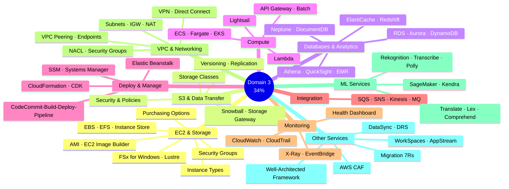

---

# PART 1 — EC2 & COMPUTE

## 🖥️ EC2 Instance Types — The MUST-KNOW Table

| Type | Letter | 🔑 Keyword | Use Cases |
|------|--------|-----------|-----------|
| **General Purpose** | `t`, `m` | **BALANCE** | Web servers, code repos, dev environments |
| **Compute Optimized** | `c` | **CPU-INTENSIVE** | Batch processing, HPC, ML, gaming servers, media transcoding |
| **Memory Optimized** | `r`, `x`, `z` | **RAM / IN-MEMORY** | High-perf DBs, Redis cache, BI, real-time big data |
| **Storage Optimized** | `i`, `d`, `h` | **HIGH I/O / SEQUENTIAL** | OLTP, NoSQL DBs, data warehousing, distributed file systems |
| **Accelerated Computing** | `p`, `g` | **GPU / HARDWARE ACCEL** | ML inference, video processing |

### 🎯 Naming Convention Trick
```
m  5  .  2xlarge
│  │     └── size (nano < micro < small < medium < large < xlarge < 2xlarge...)
│  └──── generation (higher = newer = better)
└─────── instance class (m=general, c=compute, r=ram/memory, i/d=storage)
```

> **Exam Trap:** `t2.micro` = **General Purpose** (not compute, not memory). It's the free tier instance.

---

## 💰 EC2 Purchasing Options — The Hotel Analogy

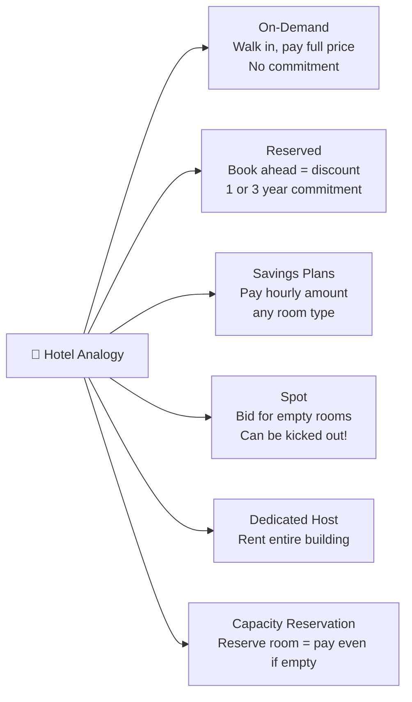

### 🔑 Purchasing Options — Master Comparison Table

| Option | Discount vs On-Demand | Commitment | Reliability | 🎯 Exam Keyword |
|--------|-----------------------|------------|-------------|----------------|
| **On-Demand** | 0% (baseline) | None | ✅ Reliable | "short-term", "unpredictable" |
| **Reserved (Standard)** | Up to **72%** | 1 or 3 years | ✅ Reliable | "steady-state", "database", "long workload" |
| **Reserved (Convertible)** | Up to **66%** | 1 or 3 years | ✅ Reliable | "flexible instance type" |
| **Savings Plans** | Up to **72%** | 1 or 3 years | ✅ Reliable | "commit to usage amount ($/hr)" |
| **Spot** | Up to **90%** | None | ❌ Can lose it | "batch jobs", "fault-tolerant", "cheapest" |
| **Dedicated Host** | Up to 70% (reserved) | On-demand or Reserved | ✅ | "BYOL", "compliance", "most expensive" |
| **Dedicated Instance** | — | — | ✅ | "dedicated hardware, same account" |
| **Capacity Reservation** | 0% | None | ✅ Reserved | "always available in specific AZ" |

### 💡 Key Tricks for the Exam

> ⚡ **SPOT** = up to 90% off = CHEAPEST but **can be LOST** at any time  
> ⚡ **Dedicated HOST** vs **Dedicated INSTANCE**: HOST = physical server, INSTANCE = just the hardware is dedicated  
> ⚡ **Savings Plans** = locked to **instance family + region**, flexible on size/OS/tenancy  
> ⚡ **Reserved** = locked to specific instance type/region/OS  
> ⚡ **Capacity Reservation** = NO discount, charged even if you don't use it  
> ⚡ **On-Demand** Linux/Windows = billed per **second** (after first minute)

---

## 🔒 Security Groups — Deep Dive

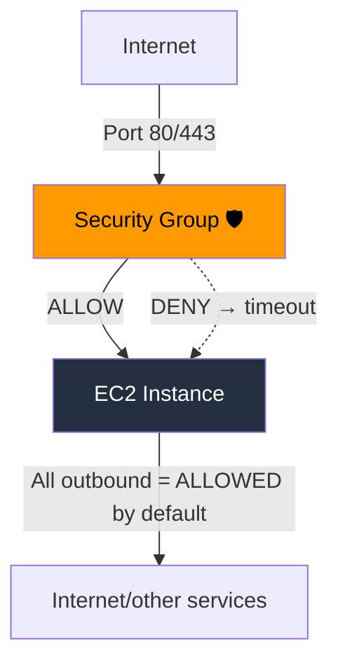

### Security Group Key Facts

| Property | Value |
|----------|-------|
| Acts as | **Firewall** OUTSIDE the EC2 instance |
| Default INBOUND | ❌ All **BLOCKED** |
| Default OUTBOUND | ✅ All **ALLOWED** |
| Rules contain | **IP addresses** or **Security Group references** |
| Attachment | Can attach to **multiple instances** |
| Scope | Locked to **region/VPC** combination |
| Timeout error | **Security Group** issue |
| "Connection refused" | **Application** error (not SG) |
| SSH / SFTP | Port **22** |
| HTTP | Port **80** |
| HTTPS | Port **443** |
| RDP (Windows) | Port **3389** |
| FTP | Port **21** |

> 🚨 **TRICK:** SG lives **OUTSIDE** the EC2. If traffic is blocked, the EC2 never even sees it!

---

## 🔄 EC2 Scalability Concepts — Know These Definitions!

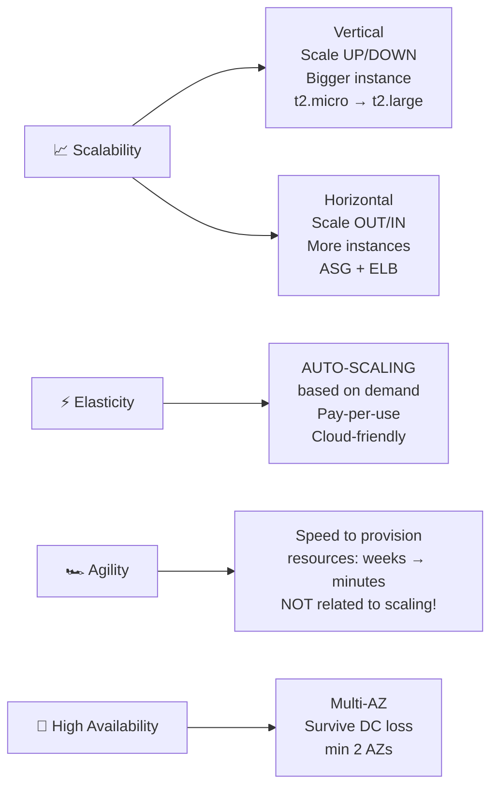

> 🎯 **AGILITY is a DISTRACTOR** — it's about speed of provisioning, NOT about scaling!

---

## ⚖️ Load Balancers — The 4 Types

| Type | Protocol | Layer | Key Feature | Use Case |
|------|----------|-------|-------------|----------|
| **ALB** (Application) | HTTP/HTTPS/gRPC | **7** | HTTP routing, URL-based routing | Web apps, microservices |
| **NLB** (Network) | TCP/UDP | **4** | Ultra-high performance, **Static IP via Elastic IP** | Millions req/sec, gaming |
| **GLB** (Gateway) | GENEVE/IP | **3** | Route to 3rd-party security appliances | Firewalls, intrusion detection |
| **CLB** (Classic) | L4 & L7 | 4+7 | **RETIRED in 2023** | Legacy only |

> 🎯 **Exam tip:** ALB = Layer **7** (Application). NLB = Layer **4** (Transport/Network). GLB = Layer **3**.

---

## 🔁 Auto Scaling Groups (ASG)

### Scaling Strategies

| Strategy | How it works | Trigger |
|----------|-------------|---------|
| **Manual** | You set desired count manually | — |
| **Simple/Step** | CloudWatch alarm → add/remove | CPU > 70% → add 2 |
| **Target Tracking** | Keep a metric at a target | Keep avg CPU at 40% |
| **Scheduled** | Based on known patterns | 5PM Fridays → scale up |
| **Predictive** | ML-based, forecasts traffic | Pattern-based workloads |

> ⚡ ASG = **Scale OUT** (add) / **Scale IN** (remove) · ELB = distributes traffic

---

# PART 2 — EC2 STORAGE

## 🗄️ Storage Types — Master Comparison

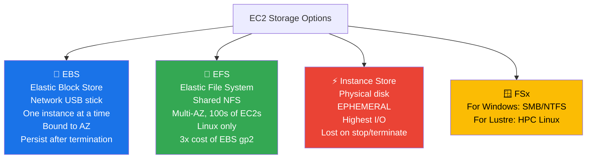

### The BIG Storage Comparison Table

| Feature | EBS | EFS | EC2 Instance Store |
|---------|-----|-----|--------------------|
| Type | Block (network) | File (NFS) | Block (physical) |
| Performance | Good | Good | **Highest** |
| Persistence | ✅ Persists | ✅ Persists | ❌ **EPHEMERAL** |
| Multi-instance | ❌ One at a time | ✅ 100s of EC2s | ❌ One instance |
| Multi-AZ | ❌ Bound to 1 AZ | ✅ Multi-AZ | ❌ Physical to host |
| OS | Any | **Linux only** | Any |
| Use case | Boot volumes, DBs | Shared file storage | Buffer/cache/temp |
| Cost | Pay provisioned | Pay per use | Included in EC2 |

### EBS Key Facts

- **Delete on Termination**: Root EBS = deleted by default · Other EBS = NOT deleted
- **Snapshot**: Point-in-time backup · Can copy across AZ or Region
- **Snapshot Archive**: 75% cheaper · Takes 24-72 hrs to restore
- **Recycle Bin**: 1 day to 1 year retention for deleted snapshots

### EFS-IA (Infrequent Access)
- Up to **92% cheaper** than EFS Standard
- Files auto-moved based on **Lifecycle Policy** (e.g., 60 days not accessed)
- **Transparent** to applications

### FSx Quick Reference

| FSx For | Use Case | Protocol |
|---------|----------|----------|
| **Windows File Server** | Windows workloads, Active Directory | SMB/NTFS |
| **Lustre** | **HPC** (High-Performance Computing), ML, video | POSIX |
| **NetApp ONTAP** | Enterprise multi-protocol | Multiple |

> 🎯 "Linux cluster HPC" → **FSx for Lustre** · "Windows + Active Directory" → **FSx for Windows**

---

# PART 3 — AMAZON S3

## 🪣 S3 Fundamentals

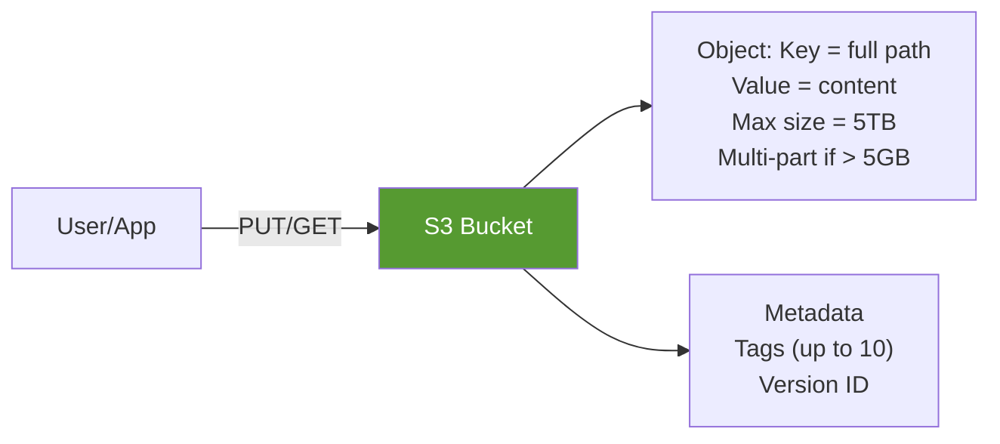

### S3 Bucket Rules (Exam Traps!)

| Rule | Value |
|------|-------|
| Globally unique name | ✅ Across ALL accounts/regions |
| Bucket created in | Specific **region** (not global!) |
| S3 looks global but | Buckets are **regional** |
| Bucket naming | No uppercase, no underscore, 3-63 chars, not IP, starts with lowercase/number |
| Object max size | **5 TB** |
| Upload > 5GB | Must use **multi-part upload** |

---

## 🔐 S3 Security

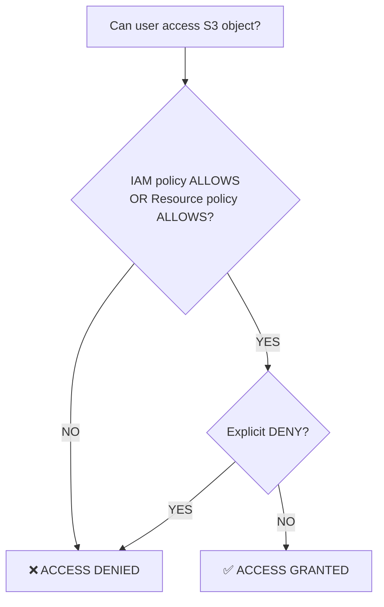

### Security Methods

| Method | Type | Scope | Notes |
|--------|------|-------|-------|
| **IAM Policies** | User-based | Per IAM user/role | API call permissions |
| **Bucket Policy** | Resource-based | Entire bucket | JSON · Cross-account · Public access |
| **Object ACL** | Resource-based | Per object | Fine-grained, can disable |
| **Bucket ACL** | Resource-based | Entire bucket | Less common, can disable |

> 🎯 **Bucket Policy** = used for **public access** or **cross-account access**  
> 🎯 **IAM Role on EC2** = correct way to give EC2 instances access to S3  
> 🎯 **Block Public Access** = account-level setting to prevent accidental public exposure

---

## 📦 S3 Storage Classes — The Ultimate Comparison

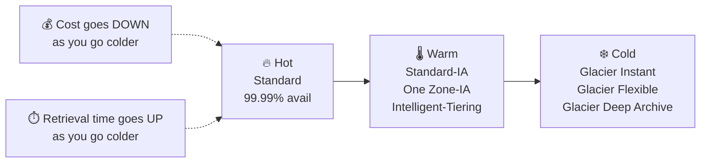

### S3 Storage Classes Full Table

| Class | Availability | AZs | Min Storage | Min Object | Retrieval Time | Retrieval Cost | Use Case |
|-------|-------------|-----|-------------|------------|----------------|----------------|----------|
| **Standard** | 99.99% | ≥3 | None | None | Instant | Free | Frequent access |
| **Intelligent-Tiering** | 99.9% | ≥3 | None | None | Instant | Free | Unknown/changing patterns |
| **Standard-IA** | 99.9% | ≥3 | 30 days | 128 KB | Instant | Per GB | DR, backups |
| **One Zone-IA** | 99.5% | **1** | 30 days | 128 KB | Instant | Per GB | Recreatable secondary backups |
| **Glacier Instant** | 99.9% | ≥3 | **90 days** | 128 KB | **Milliseconds** | Per GB | Quarterly access |
| **Glacier Flexible** | 99.99% | ≥3 | **90 days** | 40 KB | 1-5min / 3-5hr / 5-12hr | Per GB | Archival |
| **Glacier Deep Archive** | 99.99% | ≥3 | **180 days** | 40 KB | **12hr / 48hr** | Per GB | Long-term archive |

### 🔑 Exam Traps for Glacier

> - **Glacier Instant** = millisecond retrieval (accessed ~once a quarter)
> - **Glacier Flexible** = Expedited (1-5 min), Standard (3-5 hrs), Bulk (5-12 hrs) — **Bulk is FREE**
> - **Glacier Deep Archive** = **Standard 12h, Bulk 48h** — cheapest storage
> - **180-day minimum** = only Deep Archive!
> - **One Zone-IA** = data LOST if AZ is destroyed (only 1 AZ)

---

## 🔄 S3 Replication

| Feature | CRR | SRR |
|---------|-----|-----|
| Full Name | Cross-Region Replication | Same-Region Replication |
| Use case | Compliance, low latency global access | Log aggregation, prod-to-test |
| Versioning required | ✅ Both source & destination | ✅ Both |
| Copy is | Asynchronous | Asynchronous |
| Cost | Replication cost | No extra cost |

---

## 🚚 S3 Data Transfer — Snowball & Storage Gateway

### AWS Snowball

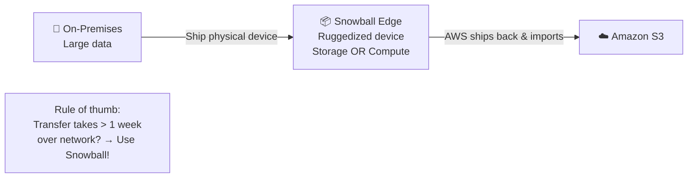

| Device | Compute | RAM | Storage |
|--------|---------|-----|---------|
| Storage Optimized | 104 vCPUs | 416 GB | **210 TB** |
| Compute Optimized | 104 vCPUs | 416 GB | 28 TB |

> 🎯 **Edge Computing** = Snowball at remote locations (trucks, ships, mines) → runs EC2 or Lambda locally

### AWS Storage Gateway

| Bridge between | On-premises ↔️ AWS Cloud (S3) |
|----------------|-------------------------------|
| Types | File Gateway, Volume Gateway, Tape Gateway |
| Use cases | DR, backup, tiered storage, hybrid cloud |
| Keyword | **"Hybrid Cloud Storage"** |

> 🎯 Question says "on-premises needs access to S3"? → **Storage Gateway**

---

# PART 4 — DATABASES & ANALYTICS

## 🗃️ Database Services — Complete Comparison

```mermaid
flowchart TB
    RELATIONAL["🔗 Relational SQL"] --> RDS["Amazon RDS<br/>MySQL, Postgres, MariaDB<br/>Oracle, SQL Server, IBM DB2<br/>Managed, backups, Multi-AZ"]
    RELATIONAL --> AURORA["Amazon Aurora<br/>AWS Proprietary<br/>5x MySQL, 3x Postgres<br/>Grows to 256TB<br/>20% more than RDS"]
    
    NOSQL["🌐 NoSQL"] --> DYNAMODB["DynamoDB<br/>Key-Value<br/>Serverless<br/>Single-digit ms latency<br/>Millions req/sec"]
    NOSQL --> DOCDB["DocumentDB<br/>MongoDB compatible<br/>JSON data<br/>Auto-grows 10GB"]
    NOSQL --> NEPTUNE["Neptune<br/>Graph database<br/>Social networks<br/>Fraud detection"]
    
    CACHE["⚡ Cache"] --> ELASTICACHE["ElastiCache<br/>Redis or Memcached<br/>In-memory, low latency<br/>Reduces DB load"]
    CACHE --> DAX["DAX<br/>DynamoDB Accelerator<br/>Microsecond latency<br/>DynamoDB ONLY"]
    
    WAREHOUSE["🏭 Analytics"] --> REDSHIFT["Redshift<br/>OLAP SQL<br/>Data warehouse<br/>Columnar storage"]
    WAREHOUSE --> ATHENA["Athena<br/>Serverless SQL on S3<br/>$5/TB scanned<br/>No DB needed"]
    WAREHOUSE --> EMR["EMR<br/>Hadoop/Spark<br/>Big Data clusters<br/>EC2 based"]
    WAREHOUSE --> QUICKSIGHT["QuickSight<br/>BI Dashboards<br/>Serverless<br/>ML-powered"]
```

### 🎯 The Mega Database Decision Table

| Need | Service | Keyword |
|------|---------|---------|
| SQL/Relational DB | **RDS** | "managed SQL", "PostgreSQL", "MySQL", "Oracle" |
| High-performance AWS SQL | **Aurora** | "5x MySQL", "AWS proprietary", "grows to 256TB" |
| Serverless relational | **Aurora Serverless** | "infrequent/unpredictable workload" |
| NoSQL key-value | **DynamoDB** | "serverless", "millions req/sec", "gaming", "IoT" |
| Cache for any DB | **ElastiCache** | "Redis", "Memcached", "reduce DB load", "in-memory" |
| Cache for DynamoDB specifically | **DAX** | "DynamoDB Accelerator", "microseconds" |
| Data warehouse / analytics | **Redshift** | "OLAP", "BI", "columnar", "petabytes" |
| Query data in S3 without loading | **Athena** | "serverless SQL on S3", "S3 analysis" |
| Big data / Hadoop / Spark | **EMR** | "Hadoop", "Apache Spark", "MapReduce" |
| Business dashboards/BI | **QuickSight** | "visualizations", "dashboards", "business analytics" |
| MongoDB compatible | **DocumentDB** | "JSON", "MongoDB" |
| Graph database | **Neptune** | "social network", "fraud detection", "knowledge graph" |
| Time-series data | **Timestream** | "IoT sensor data", "trillions events/day" |
| Blockchain | **Managed Blockchain** | "Hyperledger Fabric", "Ethereum", "decentralized" |
| ETL / Data prep | **AWS Glue** | "extract transform load", "data catalog" |
| Database migration | **DMS** | "migrate DB", "homogeneous/heterogeneous migration" |

### RDS Deployments — Critical Distinction

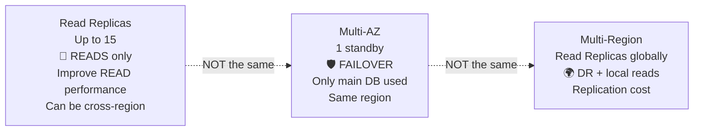

> 🎯 **Read Replica** = **performance** (more reads) · **Multi-AZ** = **availability/DR** (failover)  
> 🎯 Only **1** standby in Multi-AZ (not 15!)

### ElastiCache vs DAX

| | ElastiCache | DAX |
|-|------------|-----|
| Works with | Any DB (RDS, etc.) | **DynamoDB ONLY** |
| Engines | Redis, Memcached | Proprietary |
| Latency | Milliseconds | **Microseconds** |
| Setup | You configure it | Fully managed |

---

# PART 5 — OTHER COMPUTE SERVICES

## 🐳 Containers

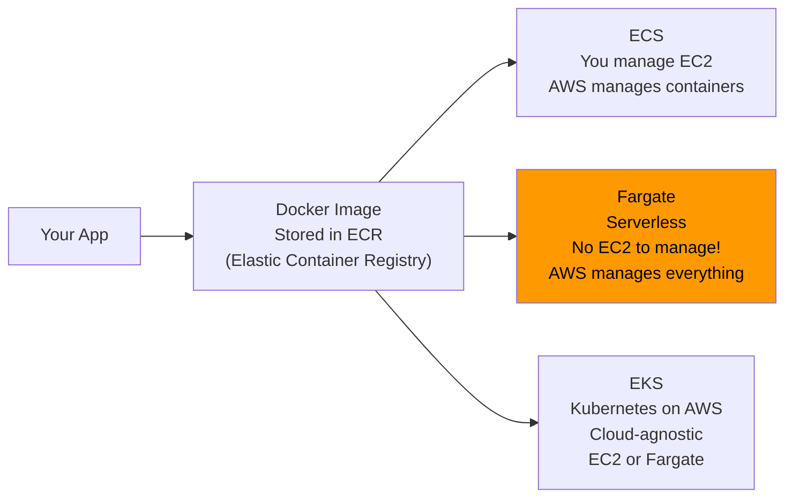

### Container Services Quick Reference

| Service | You Manage | AWS Manages | Key Word |
|---------|-----------|------------|---------|
| **ECS** | EC2 instances | Container start/stop | "Docker on EC2" |
| **Fargate** | Nothing | Everything (serverless) | "serverless containers" |
| **EKS** | Cluster config | Kubernetes control plane | "Kubernetes on AWS" |
| **ECR** | — | Registry | "private Docker registry" |

> 🎯 ECS = you provision EC2s. Fargate = **NO EC2 to provision** = serverless!

---

## ⚡ AWS Lambda — Serverless

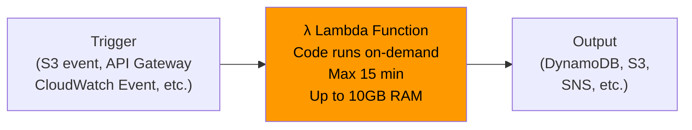

### Lambda Key Numbers

| Metric | Value |
|--------|-------|
| Free tier | **1,000,000** requests + **400,000 GB-seconds** |
| Max execution time | **15 minutes** |
| Max RAM | **10 GB** |
| Pricing | Per request + per duration (1ms increments) |
| Languages | Node.js, Python, Java, C#, Ruby, Go (custom runtime) |

### Lambda vs EC2 vs Batch

| Feature | EC2 | Lambda | Batch |
|---------|-----|--------|-------|
| Server management | You (or ASG) | None (serverless) | None |
| Time limit | No limit | **15 minutes** | No limit |
| Language | Any | Supported languages | Any (Docker) |
| Scaling | Manual/ASG | **Automatic** | Automatic |
| Cost | Per hour | Per ms + invocation | EC2/Spot cost |
| Runtime | Continuous | On-demand | Jobs with start+end |

> 🎯 **Lambda** = short, event-driven, auto-scale · **Batch** = long jobs, Docker, no time limit  
> 🎯 API Gateway = exposes Lambda as **REST/HTTP API**

---

## 🪶 Amazon Lightsail

- **Simplified** alternative to EC2 + RDS + ELB + EBS
- **Predictable low pricing**
- For people with **little cloud experience**
- Templates: WordPress, LAMP, Node.js, Magento…
- Has high availability but **no auto-scaling**
- **Limited AWS integrations**

> 🎯 "Simple web app", "little cloud experience", "low predictable price" → **Lightsail**

---

# PART 6 — DEPLOYING & MANAGING INFRASTRUCTURE

## 🏗️ CloudFormation vs CDK vs Beanstalk

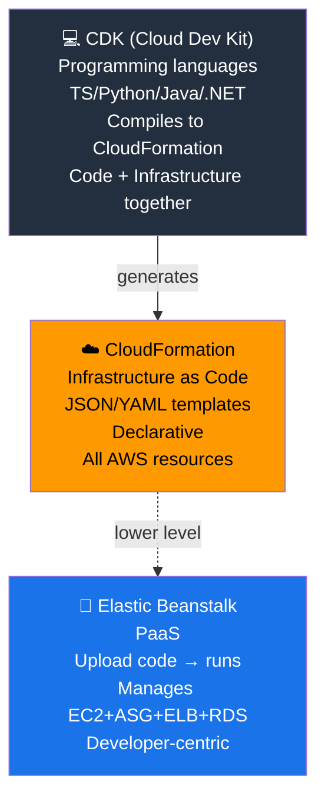

### Deployment Tools Comparison

| Tool | Abstraction Level | Who uses it | Key Word |
|------|-----------------|-------------|---------|
| **CloudFormation** | Low (explicit) | Infra engineers | "IaC", "declarative", "template" |
| **CDK** | Medium (programmatic) | Developers | "programming language for infra" |
| **Elastic Beanstalk** | High (managed) | Developers | "PaaS", "just upload code" |
| **CodeDeploy** | Deployment only | DevOps | "deploy to EC2 or on-premises", "hybrid" |
| **SSM** | Operational | SysAdmins | "patch at scale", "hybrid", "run commands" |

### Elastic Beanstalk
- **Free service** (you pay for underlying EC2, RDS, etc.)
- **3 architectures**: Single instance (dev) · LB+ASG (prod web) · ASG only (workers)
- Developer only writes **application code**
- Supported: Go, Java, .NET, Node.js, PHP, Python, Ruby, Docker

---

## 🛠️ AWS Developer Tools (CI/CD)

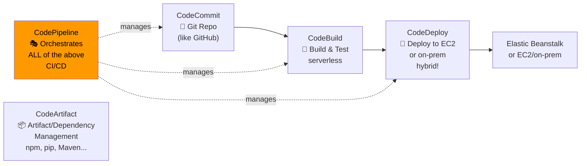

| Tool | Analogy | Key Word |
|------|---------|---------|
| **CodeCommit** | GitHub/GitLab | "private git repository", **DEPRECATED** - use GitHub |
| **CodeBuild** | Jenkins | "build, test, compile", "serverless" |
| **CodeDeploy** | Deploy tool | "deploy to EC2 AND on-premises" (hybrid!) |
| **CodePipeline** | CI/CD pipeline | "orchestration", "code to production" |
| **CodeArtifact** | Nexus/JFrog | "artifact management", "npm/pip/Maven packages" |

---

## 🔧 AWS Systems Manager (SSM)

| Feature | What it does |
|---------|-------------|
| **Run Command** | Execute scripts on fleet of EC2/on-prem |
| **Patch Manager** | Automate OS patching |
| **SSM Session Manager** | Shell access with **NO port 22, NO SSH keys** |
| **Parameter Store** | Secure config/secrets storage, versioned, IAM-controlled |

> 🎯 SSM Session Manager = **secure shell WITHOUT port 22** = no bastion host needed  
> 🎯 SSM works with **EC2 AND on-premises** = **hybrid service**

---

# PART 7 — CLOUD INTEGRATION (Messaging)

## 📨 SQS vs SNS vs Kinesis vs MQ

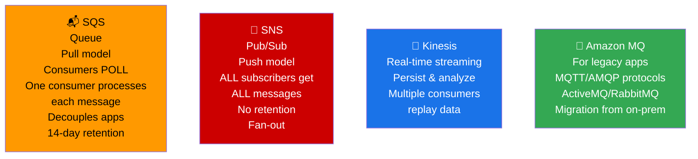

### Messaging Services Comparison Table

| Feature | SQS | SNS | Kinesis | Amazon MQ |
|---------|-----|-----|---------|-----------|
| Type | Queue | Pub/Sub | Streaming | Broker |
| Model | Pull (poll) | Push | Pull | Both |
| Message retention | Up to **14 days** | **No retention** | Days | Days |
| Consumers | **One** per message | **All** subscribers | Multiple (replay) | Multiple |
| Ordering | Standard (no) / FIFO (yes) | No | Yes (per shard) | Yes |
| Scale | Unlimited | 12.5M subs/topic | Managed | Limited |
| Protocol | AWS proprietary | AWS proprietary | AWS proprietary | **MQTT, AMQP, STOMP** |
| Use case | Decouple, async | Fan-out, notifications | Real-time analytics | Migrate legacy |

> 🎯 **SQS** = one consumer, message deleted after read, **decouple applications**  
> 🎯 **SNS** = all subscribers get the message, no retention, **fan-out/broadcast**  
> 🎯 **Kinesis** = real-time streaming, analytics, replay  
> 🎯 **MQ** = use when migrating from on-prem using **open protocols** (MQTT, AMQP)

### SQS Key Facts
- Oldest AWS service (10+ years)
- **Default retention: 4 days, max: 14 days**
- No limit on messages in queue
- Low latency < 10ms
- **FIFO Queue** = First In First Out (ordered processing)
- Scale: 1 msg/sec to **10,000s/sec**

---

# PART 8 — CLOUD MONITORING

## 📊 Monitoring Services Quick Reference

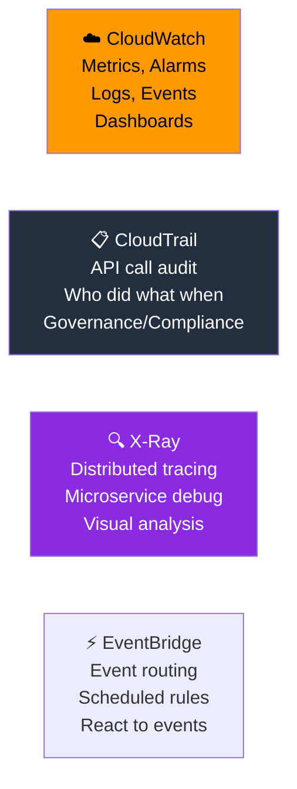

### CloudWatch vs CloudTrail — The CRITICAL Distinction

| | CloudWatch | CloudTrail |
|-|-----------|-----------|
| **Monitors** | **Performance metrics** (CPU, Memory, etc.) | **API calls** (who did what) |
| **Focus** | Infrastructure health | Audit trail |
| **Default** | Basic (5 min) | ✅ Always on! |
| **Question keyword** | "monitor", "alarm", "dashboard" | "audit", "who deleted", "compliance" |
| "Resource deleted?" | Use CloudWatch logs | **Use CloudTrail!** |

> 🚨 **GOLDEN RULE:** "A resource was deleted in AWS, how do I find out who?" → **CloudTrail FIRST!**

### CloudWatch Key Features

| Feature | Purpose | Exam Keyword |
|---------|---------|-------------|
| **Metrics** | Monitor service variables | "CPUUtilization", "NetworkIn" |
| **Alarms** | Trigger actions on metrics | "notify when CPU > 70%" |
| **Logs** | Collect & store log files | "application logs", "Lambda logs" |
| **EventBridge** | React to events / scheduled tasks | "cron job", "trigger on event" |
| **Dashboards** | Visualize metrics | "operational dashboard" |

> EC2 metrics: CPU, Network, Status Checks (**NOT RAM by default!**)  
> Detailed Monitoring = every **1 minute** ($$$) · Basic = every **5 minutes** (free)

### EventBridge (formerly CloudWatch Events)

| Pattern | Example |
|---------|---------|
| **Schedule/Cron** | "Run Lambda every hour" |
| **Event Pattern** | "Trigger on IAM root login" |
| **Event Buses** | Default (AWS) · Partner (SaaS) · Custom (your apps) |

### CloudTrail

| Feature | Value |
|---------|-------|
| Enabled by default | ✅ YES |
| History | Events/API calls from Console, SDK, CLI, Services |
| Storage | CloudWatch Logs or S3 |
| Scope | All regions (default) or single region |
| Insights | CloudTrail Insights = detect unusual API activity |

### AWS X-Ray
- **Distributed tracing** for microservices
- Visual service map
- Find bottlenecks, errors, latency
- Pinpoint issues across services

### AWS Health Dashboard

| Dashboard | What it shows |
|-----------|--------------|
| **Service Health Dashboard** | ALL regions, ALL services, historical status (RSS feed) |
| **Account Health Dashboard** | Events affecting **YOUR specific resources** · personalized view |

> 🎯 "AWS outages affecting my resources" → **Account Health Dashboard**  
> 🎯 "AWS general status" → **Service Health Dashboard**

### Amazon CodeGuru
- **CodeGuru Reviewer** = AI code reviews (development) · Java & Python
- **CodeGuru Profiler** = runtime performance analysis (production)

---

# PART 9 — VPC & NETWORKING

## 🌐 VPC Architecture Overview

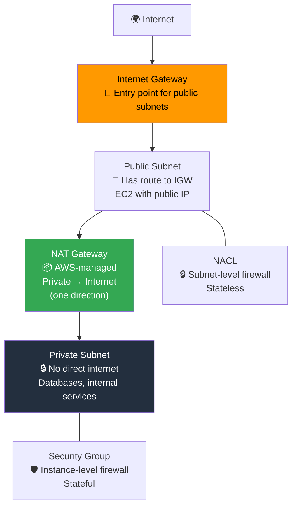

### NACL vs Security Groups — CRITICAL Exam Topic

| Feature | NACL (Network ACL) | Security Group |
|---------|-------------------|----------------|
| Level | **Subnet** | **Instance/ENI** |
| State | **Stateless** | **Stateful** |
| Rules | ALLOW and **DENY** | ALLOW only |
| Rule evaluation | Numbered, in order | All rules at once |
| Default inbound | Block all | Block all |
| Default outbound | Allow all | Allow all |
| Applies to | All instances in subnet | Only attached instances |

> 🎯 **NACL = Subnet level + Stateless + can DENY**  
> 🎯 **Security Group = Instance level + Stateful + only ALLOW**  
> 🎯 **Stateful** = return traffic automatically allowed · **Stateless** = must explicitly allow return traffic

---

## 🔗 VPC Connectivity Options

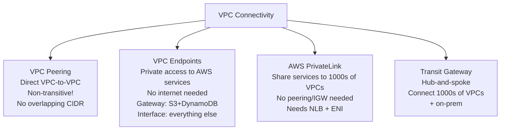

### On-Premises to AWS Connectivity

| Option | How | Speed | Security | Setup Time |
|--------|-----|-------|----------|------------|
| **Site-to-Site VPN** | Internet + IPSec encryption | Moderate | Encrypted over public | Minutes |
| **AWS Client VPN** | Your computer + OpenVPN | — | Over public internet | Minutes |
| **Direct Connect (DX)** | Physical private line | Fast (1-100 Gbps) | Private network | **1+ month** |

> 🎯 **Direct Connect** = dedicated private physical connection, goes over **private** network (not internet)  
> 🎯 **Site-to-Site VPN** = encrypted but goes over **public internet**  
> 🎯 VPN setup time = **minutes** · Direct Connect = **weeks/months**

### VPC Flow Logs
- Capture IP traffic information
- At VPC, Subnet, or ENI level
- Store in S3, CloudWatch Logs, or Kinesis Firehose
- Troubleshoot connectivity issues

### VPC Peering Key Points
- Connect 2 VPCs privately
- Must **NOT have overlapping CIDR**
- **NOT transitive** (A↔B, B↔C does NOT mean A↔C)

---

# PART 10 — MACHINE LEARNING SERVICES

## 🤖 ML Services Cheat Sheet

| Service | What it does | Input → Output | Key Word |
|---------|-------------|----------------|---------|
| **Rekognition** | Image/video analysis | Image/Video → Labels, faces, text | "face detection", "celebrity recognition", "content moderation" |
| **Transcribe** | Speech → Text | Audio → Text | "subtitles", "closed captioning", "call transcription" |
| **Polly** | Text → Speech | Text → Audio | "text to speech", "speaking application" |
| **Translate** | Language translation | Text → Text (other language) | "localization", "multi-language" |
| **Lex** | Build chatbots | Speech/Text → Intent | "chatbot", "Alexa technology", "call center bot" |
| **Connect** | Cloud contact center | Phone → CRM | "virtual contact center", "80% cheaper" |
| **Comprehend** | NLP / Text analysis | Text → Insights | "sentiment analysis", "key phrases", "NLP" |
| **SageMaker** | Full ML platform | Data → ML Model | "train/build/deploy ML models", "data scientists" |
| **Kendra** | Enterprise search | Query → Answer | "ML-powered search", "document Q&A" |
| **Personalize** | Recommendations | User data → Recommendations | "product recommendations", "Amazon.com tech" |
| **Textract** | Extract from documents | PDF/Image → Structured data | "extract text from scanned docs", "forms/tables" |

### Quick Memory Tricks for ML

```
🎵 "POLLY speaks, TRANSCRIBE listens"
📸 REKOGNITION = camera eyes
🌍 TRANSLATE = language barrier
🤖 LEX = Alexa chatbot power
🏢 CONNECT = call center
📖 COMPREHEND = understands text
🔬 SAGEMAKER = ML lab
🔍 KENDRA = document search
🎁 PERSONALIZE = Netflix-style recommendations
📄 TEXTRACT = reads and extracts documents
```

---

# PART 11 — OTHER AWS SERVICES (Exam Surprises!)

## 🖥️ Desktop & App Streaming

| Service | What it is | Key Difference |
|---------|-----------|----------------|
| **Amazon WorkSpaces** | Full managed VDI (Virtual Desktop) | Users get a full desktop, always-on or on-demand |
| **Amazon AppStream 2.0** | Stream a single application | No full desktop, runs in browser, per-app basis |

> 🎯 WorkSpaces = **full virtual desktop** · AppStream = **stream one app in browser**

---

## 🔄 Data Transfer & Migration

### AWS DataSync
- Move large amounts of data **from on-premises to AWS**
- Supports: S3 (all classes), EFS, FSx for Windows
- Scheduled: hourly, daily, weekly
- Uses **TLS encryption** in transit
- **Incremental** after first full sync

### Disaster Recovery Strategies (Cost vs Recovery)

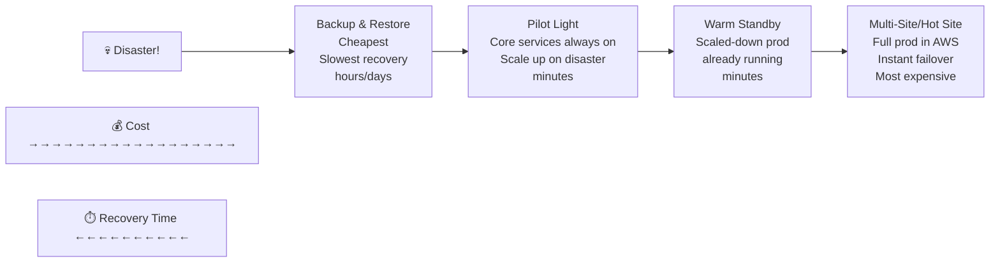

### Migration Services

| Service | Purpose |
|---------|---------|
| **AWS Application Migration Service (MGN)** | "Lift and shift" (rehost) to AWS |
| **AWS Elastic Disaster Recovery (DRS)** | Continuous replication for DR |
| **AWS Application Discovery Service** | Discover on-prem servers before migration |
| **AWS Migration Hub** | Central tracking for all migrations |
| **AWS Migration Evaluator** | Build business case for migration |

### The 7 Rs of Cloud Migration

| Strategy | Action | Description |
|----------|--------|-------------|
| **Retire** | Remove | Turn off unneeded apps |
| **Retain** | Keep | Don't migrate yet |
| **Relocate** | Move (no change) | VMware → VMware Cloud on AWS |
| **Rehost** | Lift & Shift | Migrate as-is (use MGN) |
| **Replatform** | Lift & Reshape | Migrate + minor optimization (e.g., move to RDS) |
| **Repurchase** | Drop & Shop | Move to SaaS (Salesforce, Workday) |
| **Refactor/Re-architect** | Reimagine | Microservices, serverless (most expensive, most benefit) |

> 🎯 Cost savings: Retire = 10-20% · Rehost = ~30%  
> 🎯 "Reimagine using cloud-native" = **Refactor**  
> 🎯 "CRM to Salesforce" = **Repurchase**

---

## 🧰 Miscellaneous Services (Quick Reference)

| Service | What it is | Exam Keyword |
|---------|-----------|-------------|
| **AWS IoT Core** | Connect IoT devices to cloud | "billions of devices", "sensors" |
| **AWS AppSync** | Real-time sync (GraphQL) | "mobile apps", "real-time sync", "offline" |
| **AWS Amplify** | Full-stack web/mobile framework | "frontend + backend", "quick deploy" |
| **AWS Device Farm** | Test on real devices | "mobile app testing", "real devices" |
| **AWS Backup** | Centralized backup management | "cross-account backup", "PITR", "all services" |
| **AWS FIS** (Fault Injection) | Chaos engineering | "simulate failures", "resilience testing" |
| **AWS Step Functions** | Orchestrate Lambda workflows | "state machine", "visual workflows" |
| **AWS Ground Station** | Satellite communications | "satellite data", "ground stations" |
| **Amazon Pinpoint** | 2-way marketing comms | "campaigns", "SMS/email bulk", "segments" |
| **AWS Infrastructure Composer** | Visual serverless design | "visual IaC", "no-code AWS" |

---

# PART 12 — WELL-ARCHITECTED FRAMEWORK (6 Pillars)

## 🏛️ The 6 Pillars

```mermaid
flowchart TB
    WAF["AWS Well-Architected<br/>Framework"] --> OP["1️⃣ Operational Excellence<br/>Run & monitor systems<br/>Respond to events<br/>🔑 Automate, iterate"]
    WAF --> SEC["2️⃣ Security<br/>Protect data & systems<br/>🔑 Least privilege, encrypt"]
    WAF --> REL["3️⃣ Reliability<br/>Recover from failures<br/>🔑 Auto-scaling, Multi-AZ"]
    WAF --> PERF["4️⃣ Performance Efficiency<br/>Use resources efficiently<br/>🔑 Serverless, global"]
    WAF --> COST["5️⃣ Cost Optimization<br/>Lowest price point<br/>🔑 Pay-per-use, spot"]
    WAF --> SUST["6️⃣ Sustainability<br/>Environmental impact<br/>🔑 Reduce carbon footprint"]
    
    style WAF fill:#FF9900,color:#000
```

### Pillars Quick Reference

| Pillar | Core Principle | Key AWS Services | Design Principles |
|--------|---------------|------------------|-------------------|
| **Operational Excellence** | Run & improve operations | CloudFormation, CloudWatch, CloudTrail, Config | Automate, fail small, learn from failure |
| **Security** | Protect data & systems | IAM, KMS, CloudTrail, GuardDuty, Shield | Least privilege, encrypt all, audit all |
| **Reliability** | Recover from disruptions | ASG, Route 53, CloudWatch, Multi-AZ | Test recovery, auto-recover, scale horizontally |
| **Performance Efficiency** | Use resources efficiently | Auto Scaling, Lambda, CloudFront, ElastiCache | Go serverless, go global, experiment |
| **Cost Optimization** | Lowest cost | Cost Explorer, Budgets, Spot, Reserved | Pay-per-use, right-size, measure |
| **Sustainability** | Minimize environmental impact | EC2 Auto Scaling, Graviton, S3 lifecycle | Right-size, use managed services, reduce waste |

> 🎯 Mnemonic: **"O S R P C S"** = **O**perations **S**ecurity **R**eliability **P**erformance **C**ost **S**ustainability  
> Or try: **"Old Sailors Rarely Prefer Cold Seas"**

---

# PART 13 — AWS CAF (Cloud Adoption Framework)

## 📋 CAF 6 Perspectives

```mermaid
flowchart LR
    CAF["AWS CAF<br/>Digital Transformation<br/>Framework"] --> BIZ["BUSINESS<br/>💼 C-Suite perspective<br/>Business outcomes"]
    CAF --> PEOPLE["PEOPLE<br/>👥 Change management<br/>Culture, training"]
    CAF --> GOV["GOVERNANCE<br/>⚖️ Risk management<br/>Compliance, controls"]
    CAF --> PLAT["PLATFORM<br/>🏗️ Cloud architecture<br/>Tech modernization"]
    CAF --> SEC2["SECURITY<br/>🔒 CIA triad<br/>Vulnerability management"]
    CAF --> OPS["OPERATIONS<br/>⚙️ Service delivery<br/>Cloud operations"]
    
    BIZ --> BUSCAP["Business Capabilities"]
    PEOPLE --> BUSCAP
    GOV --> BUSCAP
    PLAT --> TECHCAP["Technical Capabilities"]
    SEC2 --> TECHCAP
    OPS --> TECHCAP
```

### CAF Transformation Phases

| Phase | Action |
|-------|--------|
| **Envision** | Show how cloud accelerates business outcomes |
| **Align** | Identify capability gaps across 6 perspectives |
| **Launch** | Build pilot initiatives in production |
| **Scale** | Expand pilots to desired scale |

### CAF Transformation Domains
1. **Technology** — migrate & modernize infrastructure
2. **Process** — digitize, automate, optimize operations
3. **Organization** — reimagine operating model
4. **Product** — new revenue models, new products

---

# PART 14 — CRITICAL COMPARISON TABLES (Exam Traps)

## 🚨 The Most Commonly Confused Services

### Storage Decision Tree

```mermaid
flowchart TD
    Q1{"Single EC2 instance<br/>needs storage?"}
    Q1 -->|Yes| Q2{"High I/O?<br/>Temporary?"}
    Q2 -->|"Yes - temp/cache"| IS["⚡ Instance Store"]
    Q2 -->|"No - persistent"| EBS2["📀 EBS"]
    Q1 -->|No| Q3{"Multiple EC2s<br/>sharing files?"}
    Q3 -->|Yes| EFS2["📁 EFS"]
    Q3 -->|No| Q4{"Object storage?"}
    Q4 -->|Yes| S3["🪣 S3"]
    Q4 -->|No| Q5{"HPC Linux?"}
    Q5 -->|Yes| LUSTRE["FSx Lustre"]
    Q5 -->|No| WIN["FSx Windows"]
```

---

### Database Decision Flowchart

```mermaid
flowchart TD
    DB1{"SQL or NoSQL?"}
    DB1 -->|SQL| DB2{"OLTP or OLAP?"}
    DB2 -->|OLTP| RDS2["RDS or Aurora"]
    DB2 -->|OLAP Analytics| RED["Redshift"]
    DB1 -->|NoSQL| DB3{"Type?"}
    DB3 -->|"Key-Value / Massive scale"| DYN["DynamoDB"]
    DB3 -->|"JSON/Document"| DOC["DocumentDB"]
    DB3 -->|"Graph"| NEP["Neptune"]
    DB3 -->|"Time-series"| TIME["Timestream"]
    DB1 -->|"Cache"| DB4{"For which DB?"}
    DB4 -->|DynamoDB| DAX2["DAX"]
    DB4 -->|"Any other"| ELAST["ElastiCache"]
    
    Q_S3["Query data sitting in S3?"] --> ATH["Athena"]
    Q_BIG["Big Data/Hadoop?"] --> EMR2["EMR"]
    Q_DASH["Business dashboards?"] --> QS["QuickSight"]
```

---

## 🔑 Keyword → Service Cheat Sheet

| Keyword in Question | Answer |
|--------------------|--------|
| "Batch jobs", "resilient to failure", "cheapest" | **Spot Instances** |
| "BYOL", "compliance", "physical server" | **Dedicated Host** |
| "steady-state", "database workload" | **Reserved Instance** |
| "short-term, unpredictable" | **On-Demand** |
| "hybrid", "on-premises + AWS" | SSM, CodeDeploy, Storage Gateway, DataSync |
| "timeout error" accessing EC2 | **Security Group** issue |
| "connection refused" error on EC2 | **Application** issue |
| "no SSH needed", "secure shell" | **SSM Session Manager** |
| "lift and shift" | **Rehost** / AWS MGN |
| "serverless containers" | **Fargate** |
| "containers, you manage EC2" | **ECS** |
| "Kubernetes on AWS" | **EKS** |
| "private Docker registry" | **ECR** |
| "function, max 15 min, auto-scale" | **Lambda** |
| "no time limit, Docker, jobs" | **Batch** |
| "simple app, little cloud experience" | **Lightsail** |
| "IaC, declarative, JSON/YAML" | **CloudFormation** |
| "PaaS, upload code" | **Elastic Beanstalk** |
| "programming language for infra" | **CDK** |
| "audit, who deleted, API calls" | **CloudTrail** |
| "performance monitoring, metrics" | **CloudWatch** |
| "distributed tracing, microservices" | **X-Ray** |
| "react to events, scheduled rule" | **EventBridge** |
| "fan-out, broadcast to all" | **SNS** |
| "decouple, queue, one consumer" | **SQS** |
| "real-time streaming analytics" | **Kinesis** |
| "legacy protocols, MQTT, AMQP" | **Amazon MQ** |
| "query S3 data with SQL, serverless" | **Athena** |
| "data warehouse, OLAP" | **Redshift** |
| "Hadoop, Spark, big data clusters" | **EMR** |
| "ML-powered dashboards" | **QuickSight** |
| "MongoDB" | **DocumentDB** |
| "graph, social network, fraud" | **Neptune** |
| "time-series, IoT events" | **Timestream** |
| "blockchain, decentralized" | **Managed Blockchain** |
| "ETL, data catalog" | **Glue** |
| "migrate database to AWS" | **DMS** |
| "face detection, image labels" | **Rekognition** |
| "speech to text" | **Transcribe** |
| "text to speech" | **Polly** |
| "chatbot, Alexa tech" | **Lex** |
| "cloud contact center" | **Connect** |
| "NLP, sentiment analysis" | **Comprehend** |
| "ML model training platform" | **SageMaker** |
| "enterprise document search" | **Kendra** |
| "product recommendations" | **Personalize** |
| "extract text from scanned docs" | **Textract** |
| "translate language" | **Translate** |
| "full virtual desktop" | **WorkSpaces** |
| "stream app in browser" | **AppStream 2.0** |
| "IoT devices, billions of devices" | **IoT Core** |
| "physical data transfer, petabytes" | **Snowball** |
| "hybrid cloud storage, bridge to S3" | **Storage Gateway** |
| "sync on-prem to AWS, DataSync" | **DataSync** |
| "DR strategy, continuous replication" | **Elastic Disaster Recovery** |
| "chaos engineering, fault injection" | **AWS FIS** |
| "orchestrate Lambda, state machine" | **Step Functions** |
| "satellite data" | **Ground Station** |
| "marketing campaigns, SMS/email" | **Pinpoint** |
| "private access to AWS services in VPC" | **VPC Endpoint** |
| "private connection to 3rd party VPC" | **PrivateLink** |
| "VPC-to-VPC, not transitive" | **VPC Peering** |
| "connect 1000s VPCs, hub-and-spoke" | **Transit Gateway** |
| "private physical dedicated line" | **Direct Connect** |
| "encrypted VPN over internet" | **Site-to-Site VPN** |
| "OpenVPN from computer to VPC" | **Client VPN** |
| "private subnets internet access" | **NAT Gateway** |
| "public subnets internet access" | **Internet Gateway** |
| "subnet-level firewall, stateless" | **NACL** |
| "instance-level firewall, stateful" | **Security Group** |

---

## ⚡ Numbers to Remember

| Fact | Number |
|------|--------|
| S3 max object size | **5 TB** |
| S3 max object single upload | **5 GB** (need multipart > 5GB) |
| S3 Glacier Deep Archive min duration | **180 days** |
| S3 Glacier Instant/Flexible min duration | **90 days** |
| S3 Standard-IA / One Zone-IA min duration | **30 days** |
| S3 Intelligent-Tiering: move to IA after | **30 days** no access |
| SQS default retention | **4 days** |
| SQS max retention | **14 days** |
| SQS max messages/sec | **10,000s** |
| Lambda max execution time | **15 minutes** |
| Lambda max RAM | **10 GB** |
| Lambda free tier | **1M requests + 400K GB-seconds** |
| EBS Snapshot Archive restore time | **24-72 hours** |
| EC2 On-Demand billing | **per second** (Linux/Windows after 1st minute) |
| Reserved Instance discount | Up to **72%** |
| Spot Instance discount | Up to **90%** |
| EC2 RAM metric in CloudWatch | **NOT default** (custom metric needed) |
| CloudWatch detailed monitoring | every **1 minute** |
| CloudWatch basic monitoring | every **5 minutes** |
| Aurora auto-grow increment | **10 GB** |
| Aurora max storage | **256 TB** |
| Aurora performance vs MySQL | **5x** |
| Aurora performance vs Postgres | **3x** |
| RDS Read Replicas max | **15** |
| SNS subscriptions per topic | **12.5 million** |
| SNS max topics | **100,000** |
| EFS cost vs EFS Standard | EFS-IA = **92% cheaper** |
| Glacier Bulk retrieval (Flexible) | **5-12 hours** |
| Glacier Deep Archive Standard retrieval | **12 hours** |
| Glacier Deep Archive Bulk retrieval | **48 hours** |
| VPC CIDR max size | /16 (65,536 addresses) |
| Direct Connect setup time | **1+ month** |
| Dedicated Host most expensive? | ✅ Yes |
| EC2 free tier | **t2.micro** |

---

## 🧠 Memory Tricks & Mnemonics

### EC2 Instance Types — "Go Cut Memory In Storage"
- **G**eneral Purpose = Balance
- **C**ompute Optimized = CPU-heavy
- **M**emory Optimized = RAM-heavy
- **I**nstance Store / Storage Optimized = High I/O

### S3 Storage Classes from Hot to Cold
**"Silly Iguanas Overly Guard Frozen Glaciers Deeply"**
- **S**tandard
- **I**ntelligent-Tiering
- **S**tandard-IA
- **O**ne Zone-IA
- **G**lacier Instant
- **G**lacier Flexible
- **D**eep Archive

### Load Balancer Layers
- **ALB = 7** (Lucky 7 for Application)
- **NLB = 4** (4 = Network Transport)
- **GLB = 3** (3-way for Gateway/routing)

### SQS vs SNS
- **SQS** = **S**elect one → **Q**ueue → one **Consumer**
- **SNS** = **S**end to **N**umerous **S**ubscribers

### NACL vs Security Group
- **NACL** = Neighborhood (subnet level), **N**o memory (stateless), can say **No** (deny)
- **Security Group** = **S**pecific instances, **S**tateful (remembers), only **S**ay yes (allow only)

### CAF Perspectives — "Big People Govern Platforms Securely & Operationally"
- **B**usiness · **P**eople · **G**overnance · **P**latform · **S**ecurity · **O**perations

### Well-Architected Pillars — "Old Soldiers Really Perform Cool Stunts"
- **O**perational Excellence · **S**ecurity · **R**eliability · **P**erformance · **C**ost · **S**ustainability

---

## 🎯 Common Exam Traps to Avoid

| Trap | Correct Answer |
|------|----------------|
| "S3 is a global service" | ❌ S3 looks global but **buckets are regional** |
| "EBS can attach to multiple EC2s" | ❌ EBS = **one EC2** at a time (at CCP level) |
| "EFS works with Windows EC2" | ❌ EFS = **Linux only** |
| "Instance Store persists data" | ❌ Instance Store is **EPHEMERAL** - data lost on stop |
| "Agility is about scaling" | ❌ Agility = **speed to provision**, not scaling |
| "Reserved Instances can't change" | Convertible RIs **CAN** change type/family/OS |
| "High Availability needs 3 AZs" | ❌ Minimum **2 AZs** |
| "ELB only works in one AZ" | ❌ ELB is **Multi-AZ** |
| "CloudTrail monitors performance" | ❌ CloudTrail = **API audit** · CloudWatch = performance |
| "RAM is default EC2 metric" | ❌ RAM needs **custom CloudWatch metric** |
| "Security Group can DENY traffic" | ❌ SG = ALLOW only · **NACL** can DENY |
| "VPC Peering is transitive" | ❌ VPC Peering is **NOT transitive** |
| "Dedicated Instance = physical server" | ❌ That's **Dedicated HOST** · Dedicated Instance = dedicated hardware in account |
| "Spot Instances are reliable" | ❌ Can be **terminated** when price exceeds bid |
| "Lambda can run forever" | ❌ Lambda max = **15 minutes** |
| "ECS is serverless" | ❌ ECS needs EC2 · **Fargate** is serverless |

---

## 🔧 Shared Responsibility Model Quick Summary

| Layer | AWS Responsibility | Customer Responsibility |
|-------|-------------------|------------------------|
| **EC2** | Hardware, network, hypervisor, physical security | OS patches, firewall rules, IAM, data security |
| **S3** | Infrastructure, durability, availability | Versioning, bucket policies, encryption, access control |
| **RDS** | OS patching, hardware, replication infrastructure | Backup/snapshot setup, encryption, IAM, data |
| **EC2 Storage** | Hardware, replace failed disks, replication infra | Backup setup, encryption, understanding Instance Store risk |

---

## 📋 Section Summaries at a Glance

### EC2 Summary
`AMI (OS) + Instance Size + Security Groups + User Data + Purchasing Option`

### Storage Summary
`EBS` (network, 1 instance, AZ-bound) · `EFS` (NFS, Linux, multi-AZ, multi-instance) · `Instance Store` (ephemeral, highest perf) · `FSx` (Windows SMB or Linux HPC)

### S3 Summary
`Buckets are regional` · `Objects up to 5TB` · `7 storage classes` · `Versioning + Replication need enabling` · `Glacier = archival`

### Database Summary
`RDS/Aurora = SQL` · `DynamoDB = NoSQL/key-value` · `ElastiCache = cache` · `DAX = DynamoDB cache` · `Redshift = OLAP` · `Athena = SQL on S3`

### Compute Summary
`EC2 = VMs` · `Lambda = serverless functions (15min)` · `ECS = Docker on EC2` · `Fargate = serverless Docker` · `EKS = Kubernetes`

### Integration Summary
`SQS = Queue/decouple` · `SNS = Fan-out/broadcast` · `Kinesis = streaming` · `MQ = legacy protocols`

### Monitoring Summary
`CloudWatch = metrics/logs/alarms` · `CloudTrail = API audit` · `X-Ray = distributed tracing` · `EventBridge = event routing`

### VPC Summary
`IGW = public internet` · `NAT = private → internet` · `NACL = subnet, stateless, deny` · `SG = instance, stateful, allow` · `Peering = VPC-to-VPC, not transitive` · `Direct Connect = private, fast, 1 month setup`

---

> 🏆 **GOOD LUCK SUNDAY!** You've got this. Focus on the keyword-to-service table, the comparison tables, and the traps. If you're unsure, think: "What problem does this service solve?" and match to the scenario.
>
> **Time management:** ~1.4 minutes per question · Flag unsure ones · Come back at end.
>
> — Based on Stéphane Maarek CLF-C02 Slides · Compiled Friday night for Sunday exam 🌙

---

---

# 🎯 THE MEGA "SEE THAT → CHOOSE THAT" SCENARIO TABLE
### Built from real CLF-C02 exam question patterns — This is what the exam actually asks

> The CLF-C02 exam is **scenario-based**. It gives you a paragraph describing a situation and asks "which service?" or "which is MOST cost-effective?" or "which is the BEST solution?".  
> This table maps every real pattern to the correct answer with the **exact trap options** to reject.

---

## 🖥️ COMPUTE SCENARIOS

| # | 🔍 You See This Scenario | ✅ Choose This | ❌ Reject These & Why |
|---|--------------------------|---------------|----------------------|
| 1 | Company needs virtual servers in the cloud, full OS control | **Amazon EC2** | Lambda (no OS control), Lightsail (limited), Fargate (containers) |
| 2 | Company has unpredictable, short-term workload, can't predict behavior | **EC2 On-Demand** | Reserved (requires commitment), Spot (can be interrupted) |
| 3 | Company has a **steady-state** 24/7 workload like a production **database** | **EC2 Reserved Instance** | On-Demand (too expensive), Spot (unreliable for DB) |
| 4 | Company needs to **minimize cost** and workload is **fault-tolerant, batch, flexible start/end** | **EC2 Spot Instance** | Reserved (no, need commitment), On-Demand (expensive) |
| 5 | Company needs to run jobs **exactly when peak traffic hits Friday evenings** | **Scheduled Reserved Instance or ASG Scheduled Scaling** | Spot (unreliable timing), On-Demand (expensive) |
| 6 | Company has **compliance** requirement, must use **dedicated physical server**, BYOL license | **EC2 Dedicated Host** | Dedicated Instance (no per-socket licensing), Reserved (wrong category) |
| 7 | Company wants hardware dedicated to them but doesn't need full server control | **EC2 Dedicated Instance** | Dedicated Host (more than needed) |
| 8 | Company wants to **always have capacity** in a specific AZ, even if unused | **EC2 Capacity Reservation** | Reserved (no AZ guarantee), On-Demand (no guarantee) |
| 9 | Company wants to **automatically add/remove EC2 instances** based on traffic | **Auto Scaling Group (ASG)** | ELB (distributes, doesn't scale), Lambda (no EC2) |
| 10 | Company needs **one DNS endpoint** to route traffic to multiple EC2 behind it | **Elastic Load Balancer (ELB)** | Route 53 (DNS, not load balancer), ASG (scales, doesn't route) |
| 11 | Company needs HTTP routing, URL-path based routing to different backend services | **Application Load Balancer (ALB)** | NLB (TCP, no HTTP routing), GLB (security appliances) |
| 12 | Company needs extreme performance, **millions of requests/sec**, static IP | **Network Load Balancer (NLB)** | ALB (slower, no static IP), GLB (wrong purpose) |
| 13 | Company wants to route traffic through **3rd-party firewalls / security appliances** | **Gateway Load Balancer (GLB)** | ALB/NLB (wrong layer) |
| 14 | Company needs **simple web app**, WordPress, LAMP stack, **minimal cloud knowledge** | **Amazon Lightsail** | EC2 (too complex), Beanstalk (too complex), Fargate |
| 15 | Company needs to run **short functions triggered by events**, auto-scales, pay per use | **AWS Lambda** | EC2 (always on), ECS (containers, not functions) |
| 16 | Company needs Lambda but job takes **more than 15 minutes** | **AWS Batch** | Lambda (15 min limit!), ECS (possible but Batch is best) |
| 17 | Company wants **serverless containers** without managing EC2 | **AWS Fargate** | ECS (need EC2), Lambda (not containers) |
| 18 | Company needs **Docker containers**, manages their own EC2 fleet | **Amazon ECS** | Fargate (serverless, no EC2), EKS (Kubernetes) |
| 19 | Company already uses **Kubernetes** on-premises, migrating to AWS | **Amazon EKS** | ECS (not Kubernetes), Fargate (no Kubernetes by itself) |
| 20 | Company needs to **store private Docker images** in AWS | **Amazon ECR** | Docker Hub (public), S3 (not Docker native), ECS (orchestration not storage) |
| 21 | Company wants to **expose Lambda as a REST API** endpoint | **Amazon API Gateway** | ALB (not for Lambda functions natively), CloudFront (CDN, not API) |
| 22 | Company has **high CPU usage during business hours** and needs to scale automatically | **Auto Scaling Group + Target Tracking** | Manual scaling, Reserved Instances (won't auto-scale) |
| 23 | Company application had **CPU at 100%** - wants scalable solution | **Auto Scaling Group (ASG)** | Bigger EC2 instance = vertical, not elastic. ASG = correct |

---

## 🗄️ STORAGE SCENARIOS

| # | 🔍 You See This Scenario | ✅ Choose This | ❌ Reject These & Why |
|---|--------------------------|---------------|----------------------|
| 24 | Single EC2 instance needs **persistent block storage**, keeps data after stop | **Amazon EBS** | Instance Store (ephemeral!), EFS (shared/NFS), S3 (object not block) |
| 25 | EC2 needs **maximum I/O performance**, data loss acceptable (cache/temp) | **EC2 Instance Store** | EBS (network latency), EFS (wrong type) |
| 26 | **Hundreds of EC2 Linux instances** all need access to same shared files | **Amazon EFS** | EBS (one instance only!), S3 (object storage, not POSIX) |
| 27 | Company needs shared file system for **Windows servers, Active Directory** | **FSx for Windows File Server** | EFS (Linux only!), EBS (not shared), NFS (wrong protocol) |
| 28 | Company needs **HPC (High Performance Computing)**, Linux cluster, ML training | **FSx for Lustre** | EFS (slower), EBS (not HPC), FSx Windows (wrong OS) |
| 29 | Company wants **infinitely scalable object storage**, static files, backups | **Amazon S3** | EBS (block, not object), EFS (file, not object), DynamoDB (database) |
| 30 | Company needs most **cost-effective storage** for data accessed **every day** | **S3 Standard** | Glacier (retrieval cost), Standard-IA (retrieval charge) |
| 31 | Company needs storage for data accessed **once a month**, disaster recovery backup | **S3 Standard-IA** | Standard (too expensive), Glacier (too slow if needed fast) |
| 32 | Company needs storage for data that can be **recreated if lost**, accessed rarely | **S3 One Zone-IA** | Standard-IA (more expensive, 3 AZs), Glacier (slower) |
| 33 | Company needs to **archive logs**, not accessed frequently, retrieval within **12 hours** | **S3 Glacier Flexible Retrieval** | Deep Archive (48hr standard), Standard (too expensive), Standard-IA |
| 34 | Company needs **cheapest possible** long-term archival, ok with **up to 48hr retrieval** | **S3 Glacier Deep Archive** | Glacier Flexible (more expensive), Standard-IA |
| 35 | Company needs archive data accessible in **milliseconds** (quarterly access) | **S3 Glacier Instant Retrieval** | Glacier Flexible (minutes/hours), Deep Archive (12h+) |
| 36 | Company has **unknown or unpredictable access patterns** for their S3 data | **S3 Intelligent-Tiering** | Standard (may over-pay), Standard-IA (may under-serve) |
| 37 | Company wants to **save costs by archiving S3 data automatically** after 60 days | **S3 Lifecycle Policy** | S3 Versioning (not for cost), S3 Replication (not for archiving) |
| 38 | Company needs to **protect against accidental deletion** of S3 objects | **S3 Versioning** | S3 Replication (copies, doesn't prevent deletion), Bucket Policy |
| 39 | Company in US needs S3 data **replicated to EU** for compliance | **S3 CRR (Cross-Region Replication)** | SRR (same region), CloudFront (CDN not replication) |
| 40 | Company wants to **aggregate S3 logs** from multiple accounts into one bucket | **S3 SRR (Same-Region Replication)** | CRR (cross-region, unnecessary cost), EFS |
| 41 | Company has **petabytes of data** to move to AWS, limited bandwidth, would take years | **AWS Snowball Edge** | DataSync (needs bandwidth), Direct Connect (too slow for PBs) |
| 42 | Company needs to process data **at remote location** (ship, truck) with no internet | **Snowball Edge (Edge Computing)** | EC2 (needs internet/cloud), Lambda (cloud-only) |
| 43 | Company wants **on-premises file servers to seamlessly use S3** in hybrid setup | **AWS Storage Gateway** | DataSync (batch sync, not seamless), Direct Connect (just networking) |
| 44 | Company wants to **incrementally sync** on-premises data to AWS on schedule | **AWS DataSync** | Snowball (physical, one-time large), Storage Gateway (real-time/hybrid) |
| 45 | Company wants to prevent S3 bucket from ever being made public | **Block Public Access setting** | Bucket Policy (can be overridden), IAM (user-level not bucket) |
| 46 | Company wants **cross-account** access to S3 bucket | **S3 Bucket Policy** | IAM Policy (can't cross accounts alone), ACL (less common) |
| 47 | Company wants cheapest way to **host a static website** | **S3 Static Website Hosting** | EC2 (expensive), Lightsail, CloudFront alone |
| 48 | Company stores objects in S3. Wants **another account's IAM user** to also access it | **S3 Bucket Policy (cross-account)** | IAM policy in original account (can't grant to another account alone) |

---

## 🗃️ DATABASE SCENARIOS

| # | 🔍 You See This Scenario | ✅ Choose This | ❌ Reject These & Why |
|---|--------------------------|---------------|----------------------|
| 49 | Company needs managed **relational SQL database** (MySQL, PostgreSQL, Oracle) | **Amazon RDS** | DynamoDB (NoSQL), Redshift (OLAP), Aurora (proprietary) |
| 50 | Company needs best performance **relational DB on AWS**, MySQL/PostgreSQL compatible | **Amazon Aurora** | RDS MySQL (5x slower), DynamoDB (NoSQL) |
| 51 | Company has **infrequent, unpredictable database workload**, wants to save costs | **Aurora Serverless** | RDS (always provisioned), DynamoDB (NoSQL) |
| 52 | Company needs to **scale read traffic** on RDS, many read requests | **RDS Read Replicas** (up to 15) | Multi-AZ (for failover, not reads!), ElastiCache (possible but RR is primary) |
| 53 | Company needs **high availability + automatic failover** for RDS | **RDS Multi-AZ** | Read Replicas (performance not failover!), Snapshots |
| 54 | Company needs RDS available across **multiple regions** for disaster recovery | **RDS Multi-Region Read Replicas** | Multi-AZ (same region only), Route 53 alone |
| 55 | Company needs a **NoSQL database**, massive scale, **serverless, single-digit ms** | **Amazon DynamoDB** | RDS (SQL only), MongoDB on EC2, DocumentDB |
| 56 | Company needs **microsecond latency** for DynamoDB reads | **DynamoDB DAX (Accelerator)** | ElastiCache (not DynamoDB-specific), Read Replicas |
| 57 | Company needs to cache database query results to **reduce load on RDS** | **Amazon ElastiCache** | DAX (DynamoDB only!), CloudFront (CDN not DB cache) |
| 58 | Company needs DynamoDB accessible with **low latency in multiple regions** | **DynamoDB Global Tables** | Read Replicas (RDS concept), Multi-AZ (DynamoDB has its own) |
| 59 | Company needs **data warehouse** for analytics, runs complex SQL queries on TBs | **Amazon Redshift** | RDS (OLTP not OLAP), DynamoDB (NoSQL), Athena (serverless, no warehouse) |
| 60 | Company wants to **run SQL queries on data already in S3** without loading it | **Amazon Athena** | Redshift (must load data), RDS (wrong), EMR (complex setup needed) |
| 61 | Company wants to **visualize and build dashboards** from AWS data sources | **Amazon QuickSight** | Athena (queries, no visualization), CloudWatch (metrics, not BI) |
| 62 | Company needs to process **Big Data with Hadoop or Apache Spark** | **Amazon EMR** | Glue (ETL not Hadoop), Athena (serverless SQL), Redshift |
| 63 | Company stores **JSON documents**, needs MongoDB-compatible DB | **Amazon DocumentDB** | DynamoDB (different API), RDS (SQL not JSON) |
| 64 | Company building a **social network** with complex user relationships, recommendations | **Amazon Neptune** | DynamoDB (no graph queries), RDS (can't graph efficiently) |
| 65 | Company has **IoT sensor data**, trillions of time-stamped events per day | **Amazon Timestream** | DynamoDB (no time-series optimization), RDS |
| 66 | Company needs to participate in **blockchain** network using Ethereum | **Amazon Managed Blockchain** | DynamoDB (not blockchain), Timestream |
| 67 | Company needs to **prepare/transform data** before loading into Redshift | **AWS Glue (ETL)** | DMS (migration not transform), Lambda (possible but Glue is managed ETL) |
| 68 | Company wants to **migrate Oracle DB to Aurora** (heterogeneous migration) | **AWS DMS (Database Migration Service)** | Snowball (physical data), Glue (ETL not migration) |
| 69 | Company wants to **migrate MySQL to MySQL on RDS** (homogeneous migration) | **AWS DMS** | Glue (ETL), Snowball, MGN (for servers not DBs) |
| 70 | Company stores server logs in S3, wants **cheapest way to analyze** them | **Amazon Athena** | Redshift (need to load data), EMR (complex), RDS |

---

## 🚀 DEPLOYMENT & MANAGEMENT SCENARIOS

| # | 🔍 You See This Scenario | ✅ Choose This | ❌ Reject These & Why |
|---|--------------------------|---------------|----------------------|
| 71 | Company wants to define all AWS infrastructure **as code** in JSON/YAML templates | **AWS CloudFormation** | CDK (programmatic, not YAML), Beanstalk (PaaS not IaC) |
| 72 | Developer wants to write infrastructure using **Python or TypeScript** code | **AWS CDK (Cloud Dev Kit)** | CloudFormation (YAML/JSON only), Terraform (3rd party) |
| 73 | Developer wants to **just upload application code** and AWS handles EC2, ELB, ASG | **AWS Elastic Beanstalk** | CloudFormation (low-level), ECS (containers), Lambda (functions) |
| 74 | Company needs to **deploy application to EC2 AND on-premises servers** (hybrid) | **AWS CodeDeploy** | Beanstalk (AWS-only), CloudFormation (infra not app deploy) |
| 75 | Company needs to **store source code** privately in AWS (like GitHub) | **AWS CodeCommit** | S3 (not Git), GitHub (external), CodeBuild (builds not stores) |
| 76 | Company needs to **build and test** code automatically in the cloud, serverless | **AWS CodeBuild** | CodeDeploy (deployment not build), Jenkins (self-managed) |
| 77 | Company needs a **full CI/CD pipeline** from commit to production | **AWS CodePipeline** | CodeDeploy alone (only deploy step), CodeBuild alone |
| 78 | Company needs to manage **npm/pip/Maven packages** centrally in AWS | **AWS CodeArtifact** | S3 (not package-aware), CodeCommit (source code not packages) |
| 79 | Company needs to **manage and patch fleet of EC2 + on-premises servers** at scale | **AWS Systems Manager (SSM)** | CodeDeploy (app not OS), CloudFormation (infra not ops) |
| 80 | Company needs shell access to EC2 **without SSH, without port 22** | **SSM Session Manager** | SSH/Bastion host (requires port 22), EC2 Instance Connect |
| 81 | Company needs to store **application configs and passwords** securely, versioned | **SSM Parameter Store** | Secrets Manager (costs more), S3 (not secret storage), DynamoDB |
| 82 | Company wants to **automatically create and test EC2 AMIs** on a schedule | **EC2 Image Builder** | CodeBuild (not AMI-specific), Lambda, CloudFormation |
| 83 | Company needs to **build a visual diagram of CloudFormation stack** | **AWS Infrastructure Composer** | CloudFormation alone, CDK |

---

## 📨 INTEGRATION & MESSAGING SCENARIOS

| # | 🔍 You See This Scenario | ✅ Choose This | ❌ Reject These & Why |
|---|--------------------------|---------------|----------------------|
| 84 | Company wants to **decouple** two services so video encoding doesn't block uploading | **Amazon SQS** | SNS (fan-out, not queue), Kinesis (streaming), direct API call |
| 85 | Company needs messages to be processed **in order** (FIFO) | **SQS FIFO Queue** | SQS Standard (no order guarantee!), SNS (no FIFO) |
| 86 | Company wants to **send one notification to 5 different services simultaneously** | **Amazon SNS** | SQS (one consumer per message), EventBridge (events not pub/sub) |
| 87 | Company wants to **send email + SMS + trigger Lambda** from one event | **Amazon SNS (fan-out)** | SQS (one consumer), EventBridge (different pattern) |
| 88 | Company needs to **process real-time streaming data** from IoT sensors | **Amazon Kinesis Data Streams** | SQS (not real-time streaming), SNS (no persistence), S3 (batch) |
| 89 | Company needs to **load streaming data into S3 or Redshift** automatically | **Amazon Kinesis Data Firehose** | Kinesis Data Streams (doesn't load to S3), SQS |
| 90 | Company migrating from on-premises using **RabbitMQ or ActiveMQ** open protocols | **Amazon MQ** | SQS (AWS proprietary), SNS (AWS proprietary), Kinesis |
| 91 | Company application has **sudden traffic spikes** (video encoding 1000x normal) | **SQS to decouple tiers** | Synchronous direct call (breaks under load!), Direct DB write |
| 92 | Company wants to **trigger Lambda every hour** like a cron job | **Amazon EventBridge (scheduled rule)** | CloudWatch Alarm (threshold-based not schedule), SQS |
| 93 | Company wants to **react when root user signs in to AWS console** | **EventBridge + SNS notification** | CloudWatch (metrics not events), CloudTrail alone |
| 94 | Company wants to send **personalized SMS marketing campaigns** to millions | **Amazon Pinpoint** | SNS (no campaign management), SES (email only) |

---

## 📊 MONITORING & AUDIT SCENARIOS

| # | 🔍 You See This Scenario | ✅ Choose This | ❌ Reject These & Why |
|---|--------------------------|---------------|----------------------|
| 95 | Company wants to **monitor EC2 CPU utilization** and **alert when > 80%** | **CloudWatch Alarm** | CloudTrail (API audit not metrics), Config (compliance not metrics) |
| 96 | Company wants to **collect application logs** from EC2 instances | **CloudWatch Logs + CloudWatch Agent** | CloudTrail (API calls not app logs), S3 (storage not collection) |
| 97 | Company wants to know **who deleted an S3 bucket** (audit trail) | **AWS CloudTrail** | CloudWatch (performance not audit), Config (compliance, slower) |
| 98 | Company wants to **audit all API calls** made across their AWS account | **AWS CloudTrail** | CloudWatch (metrics), VPC Flow Logs (network only) |
| 99 | Company wants to **debug slow requests** across multiple microservices | **AWS X-Ray** | CloudWatch (metrics, no tracing), CloudTrail (API audit) |
| 100 | Company wants to **track network traffic** through their VPC | **VPC Flow Logs** | CloudTrail (API calls), CloudWatch (metrics) |
| 101 | Company wants to **check overall AWS service status** globally (is S3 down?) | **AWS Health Dashboard - Service History** | Account Health Dashboard (your resources), CloudWatch |
| 102 | Company wants to know if **their EC2 instances are affected** by an AWS outage | **AWS Account Health Dashboard** | Service Health Dashboard (general, not personalized) |
| 103 | Company wants **automated code review** for Python/Java bugs and security | **Amazon CodeGuru Reviewer** | CodeBuild (builds, no review), SonarQube (3rd party) |
| 104 | Company wants to find **performance bottlenecks in production code** (CPU profiling) | **Amazon CodeGuru Profiler** | X-Ray (service map, not code-level profiling), CloudWatch |
| 105 | Company wants to monitor EC2 **RAM utilization** in CloudWatch | **Custom CloudWatch Metric** (install agent) | Default CloudWatch (RAM NOT in default metrics!), X-Ray |
| 106 | Company wants **1-minute detailed metrics** for EC2 (default is 5 minutes) | **Enable Detailed Monitoring** ($$$) | CloudTrail, Custom metrics (this is a setting, not a service) |

---

## 🌐 NETWORKING & VPC SCENARIOS

| # | 🔍 You See This Scenario | ✅ Choose This | ❌ Reject These & Why |
|---|--------------------------|---------------|----------------------|
| 107 | Company wants to **block specific IP addresses** from accessing their VPC subnet | **Network ACL (NACL)** | Security Group (can't DENY, only allow), WAF (web layer) |
| 108 | Company wants to **allow only port 443** to an EC2 instance | **Security Group** | NACL (subnet level, not instance), Route Table |
| 109 | Company's **private subnet EC2 instances** need internet access to download updates | **NAT Gateway** | Internet Gateway (public subnet only), Direct Connect |
| 110 | Company needs **public subnet** EC2 instances to communicate with internet | **Internet Gateway (IGW)** | NAT Gateway (private only), Direct Connect |
| 111 | Company wants to **connect two VPCs** in same account to share resources | **VPC Peering** | Transit Gateway (overkill for 2 VPCs), PrivateLink |
| 112 | Company has **10+ VPCs and on-premises** and needs to interconnect all | **Transit Gateway** | VPC Peering (not transitive, complex mesh), Direct Connect alone |
| 113 | Company wants EC2 in private subnet to **access S3 without going through internet** | **VPC Endpoint (Gateway type for S3)** | NAT Gateway (goes through internet), PrivateLink |
| 114 | Company wants to **privately expose their service** to hundreds of other VPCs | **AWS PrivateLink** | VPC Peering (need individual peerings), Transit Gateway |
| 115 | Company needs **encrypted connection** from office to AWS VPC over internet | **Site-to-Site VPN** | Direct Connect (not encrypted by default, physical), Client VPN |
| 116 | Company needs **private, dedicated, fast physical line** from data center to AWS | **AWS Direct Connect** | VPN (over internet, slower), PrivateLink (not for on-prem) |
| 117 | Company's developer needs to **connect from their laptop** to resources in private VPC | **AWS Client VPN (OpenVPN)** | Site-to-Site VPN (for offices not individuals), SSH directly |
| 118 | Company needs **consistent, reliable network connection** to AWS, not over internet | **AWS Direct Connect** | VPN (over public internet!), Transit Gateway alone |
| 119 | A company wants to give an EC2 instance a **fixed public IP** that survives stop/start | **Elastic IP** | Public IPv4 (changes on stop!), Private IP (not public) |
| 120 | Company wants to **capture network traffic logs** from ELB, RDS, ElastiCache | **VPC Flow Logs** | CloudTrail (API calls), CloudWatch (metrics) |

---

## 🤖 MACHINE LEARNING SCENARIOS

| # | 🔍 You See This Scenario | ✅ Choose This | ❌ Reject These & Why |
|---|--------------------------|---------------|----------------------|
| 121 | Company wants to **detect objects, faces, text in images/videos** | **Amazon Rekognition** | Textract (documents only), Comprehend (text NLP) |
| 122 | Company wants to **moderate content** in user-uploaded images (nudity, violence) | **Amazon Rekognition** | Comprehend (text not images), GuardDuty (security not content) |
| 123 | Company wants to **transcribe call center recordings** to text | **Amazon Transcribe** | Polly (text to speech, opposite!), Lex (chatbot) |
| 124 | Company wants to **add subtitles** to video content | **Amazon Transcribe** | Polly (speaks, doesn't caption), Textract (documents) |
| 125 | Company wants to build a **text-to-speech application** that reads articles aloud | **Amazon Polly** | Transcribe (speech to text, opposite!), Lex |
| 126 | Company building a **multi-language website** needs automatic translation | **Amazon Translate** | Comprehend (NLP, not translate), Transcribe (speech) |
| 127 | Company wants to build a **chatbot for customer service** (Alexa-like) | **Amazon Lex** | Connect (contact center), Comprehend (NLP analysis not chatbot) |
| 128 | Company wants a **cloud contact center** that's 80% cheaper than on-premises | **Amazon Connect** | Lex (chatbot only, no phone), Pinpoint (marketing) |
| 129 | Company wants to analyze **customer reviews** for positive/negative sentiment | **Amazon Comprehend** | Rekognition (images), Transcribe (audio to text) |
| 130 | Company wants to **build, train, and deploy ML models** without managing infra | **Amazon SageMaker** | Comprehend (pre-built NLP), Rekognition (pre-built vision) |
| 131 | Company wants **intelligent search** across their internal knowledge base/documents | **Amazon Kendra** | Athena (SQL, not ML search), Elasticsearch (self-managed) |
| 132 | Company's e-commerce site needs **"you may also like"** product suggestions | **Amazon Personalize** | Kendra (search, not recommend), SageMaker (custom ML) |
| 133 | Company wants to **extract data from scanned PDF forms** (healthcare, finance) | **Amazon Textract** | Rekognition (images not forms), Comprehend (text NLP) |

---

## 🔄 MIGRATION & OTHER SERVICES SCENARIOS

| # | 🔍 You See This Scenario | ✅ Choose This | ❌ Reject These & Why |
|---|--------------------------|---------------|----------------------|
| 134 | Company wants to **migrate physical servers to AWS** with minimal changes (lift & shift) | **AWS Application Migration Service (MGN)** | DMS (databases not servers), Snowball (data not servers) |
| 135 | Company wants **continuous replication of servers to AWS** for disaster recovery | **AWS Elastic Disaster Recovery (DRS)** | MGN (migration not ongoing DR), DataSync (data only) |
| 136 | Company needs to **discover all on-premises servers** before migrating | **AWS Application Discovery Service** | Migration Hub (tracking not discovery), DMS |
| 137 | Company wants **centralized tracking** of all migration projects across tools | **AWS Migration Hub** | Application Discovery (discovery not tracking), DMS |
| 138 | Company wants to **build a business case for migrating to AWS** with cost analysis | **AWS Migration Evaluator** | Cost Explorer (current AWS costs, not migration analysis) |
| 139 | Company wants to **test how their app behaves during an AZ failure** | **AWS Fault Injection Simulator (FIS)** | CloudWatch (monitoring not testing), Config (compliance) |
| 140 | Company wants to **orchestrate a multi-step order fulfillment workflow** with Lambda | **AWS Step Functions** | SQS (queue not workflow), SNS (notification not workflow) |
| 141 | Company has employees who need **full Windows virtual desktop** from any location | **Amazon WorkSpaces** | AppStream (apps not full desktop), EC2 (not VDI) |
| 142 | Company wants to let users **run one specific application in a browser** without VDI | **Amazon AppStream 2.0** | WorkSpaces (full desktop), EC2 |
| 143 | Company has **billions of IoT devices** needing to send data to AWS | **AWS IoT Core** | Kinesis (ingestion yes, but IoT Core first), SQS |
| 144 | Company building **mobile app** needs real-time data sync across devices | **AWS AppSync** | DynamoDB alone, Amplify (framework using AppSync) |
| 145 | Company wants to **centrally manage backups** for EC2, RDS, EFS, DynamoDB | **AWS Backup** | Manual snapshots (not centralized), S3 (not backup management) |
| 146 | Company needs to backup data **across multiple AWS accounts** | **AWS Backup (cross-account)** | S3 Replication (data not backup management), DLM |

---

## ☁️ WELL-ARCHITECTED & CAF SCENARIOS

| # | 🔍 You See This Scenario | ✅ Choose This | ❌ Reject These & Why |
|---|--------------------------|---------------|----------------------|
| 147 | Company wants to **recover quickly from failures**, use Auto Scaling, Multi-AZ | **Reliability** pillar | Performance (efficiency focus), Operational Excellence |
| 148 | Company wants to **eliminate waste**, right-size instances, use spot | **Cost Optimization** pillar | Sustainability (environmental), Performance |
| 149 | Company wants to **reduce carbon footprint** and environmental impact | **Sustainability** pillar | Cost Optimization (money not environment) |
| 150 | Company wants to **deploy globally in minutes**, use serverless, go cloud-native | **Performance Efficiency** pillar | Operational Excellence, Reliability |
| 151 | Company wants to **encrypt everything**, least privilege IAM, enable CloudTrail | **Security** pillar | Reliability, Operational Excellence |
| 152 | Company wants to **automate operations**, respond to events, improve continuously | **Operational Excellence** pillar | Reliability (recovery focus), Performance |
| 153 | Company needs HR leadership to **manage change during cloud adoption** | **CAF — People Perspective** | Platform (technical), Operations |
| 154 | Company needs to align **cloud strategy with business outcomes** | **CAF — Business Perspective** | Governance (risk, not strategy), People |
| 155 | Company needs to build **cloud infrastructure and manage DevOps pipelines** | **CAF — Platform Perspective** | Operations (manage services), Security |
| 156 | Company wants to manage **risk and compliance during cloud transformation** | **CAF — Governance Perspective** | Security (CIA, not compliance management), Business |
| 157 | Company wants to **re-architect app as microservices** using serverless — 7Rs | **Refactor / Re-architect** | Rehost (lift-shift), Replatform (minor change) |
| 158 | Company wants to **move database to RDS** with minimal code changes — 7Rs | **Replatform ("Lift and Reshape")** | Refactor (too much change), Rehost (no optimization) |
| 159 | Company wants to **switch CRM from custom app to Salesforce** — 7Rs | **Repurchase ("Drop and Shop")** | Replatform (not SaaS), Refactor |
| 160 | Company wants to **migrate servers as-is to EC2** with no changes — 7Rs | **Rehost ("Lift and Shift")** | Replatform (optimizes), Refactor (redesigns) |

---

## ⚖️ CLASSIC COMPARISON TRICK QUESTIONS

| # | 🔍 They Ask You To Compare | ✅ Correct Answer | 📝 Key Reasoning |
|---|--------------------------|-------------------|-----------------|
| 161 | EBS vs EFS: **multiple EC2 sharing files** | **EFS** | EBS = 1 instance · EFS = 100s |
| 162 | EBS vs Instance Store: **ephemeral temp data** | **Instance Store** | Fastest I/O, but data lost on stop |
| 163 | EFS vs FSx Windows: **Windows + Active Directory** | **FSx Windows** | EFS = Linux only |
| 164 | SQS vs SNS: **one message to 5 email subscribers** | **SNS** | SNS = fan-out · SQS = one consumer |
| 165 | CloudWatch vs CloudTrail: **who made API call** | **CloudTrail** | CloudWatch = metrics · CloudTrail = audit |
| 166 | NACL vs Security Group: **block specific IP at subnet** | **NACL** | SG can't DENY · NACL can |
| 167 | Multi-AZ vs Read Replicas: **survive AZ failure** | **Multi-AZ** | Read Replicas = reads · Multi-AZ = failover |
| 168 | Spot vs On-Demand: **critical production database** | **On-Demand or Reserved** | Spot can be interrupted! |
| 169 | Lambda vs EC2 Batch: **job runs 2 hours** | **AWS Batch** | Lambda max = 15 min! |
| 170 | ECS vs Fargate: **no EC2 servers to manage** | **Fargate** | ECS needs EC2 · Fargate is serverless |
| 171 | Direct Connect vs VPN: **fastest, most reliable** | **Direct Connect** | VPN = internet · DX = private fiber |
| 172 | VPN vs Direct Connect: **quick to set up** | **Site-to-Site VPN** | DX = 1+ month · VPN = minutes |
| 173 | DAX vs ElastiCache: **speed up DynamoDB queries** | **DAX** | ElastiCache ≠ DynamoDB-specific |
| 174 | Athena vs Redshift: **no data loading, query S3 directly** | **Athena** | Redshift needs data loaded |
| 175 | Rekognition vs Textract: **scan invoices, extract tables** | **Textract** | Rekognition = images/faces · Textract = documents |
| 176 | SSM Session Manager vs SSH: **no port 22 needed** | **SSM Session Manager** | SSH requires port 22 open |
| 177 | Parameter Store vs Secrets Manager: **cheapest secrets** | **Parameter Store** | Secrets Manager = $1/secret · Parameter Store = free tier |
| 178 | Snowball vs DataSync: **100TB, limited bandwidth** | **Snowball** | DataSync = incremental sync over network |
| 179 | WorkSpaces vs AppStream: **stream one application** | **AppStream 2.0** | WorkSpaces = full desktop · AppStream = single app |
| 180 | SNS vs SQS: **message must not be lost if consumer is down** | **SQS** | SNS = no retention · SQS = up to 14 days |
| 181 | MQ vs SQS: **migrating from on-prem with AMQP protocol** | **Amazon MQ** | SQS = AWS proprietary protocol |
| 182 | VPC Endpoint vs NAT Gateway: **private S3 access, save cost** | **VPC Endpoint** | NAT Gateway charges per GB · Endpoint is free |
| 183 | Kendra vs Athena: **search documents using natural language** | **Kendra** | Athena = SQL on structured data · Kendra = ML document search |
| 184 | CodeDeploy vs Beanstalk: **deploy to on-premises too** | **CodeDeploy** | Beanstalk = AWS-only |
| 185 | Global Tables vs Read Replicas: **write to DynamoDB from any region** | **DynamoDB Global Tables** | Read Replicas = read-only in other regions |
| 186 | Transcribe vs Comprehend: **understand the meaning of text** | **Comprehend** | Transcribe = audio→text · Comprehend = NLP/meaning |
| 187 | Polly vs Lex: **build voice chatbot** | **Lex** (uses Polly internally) | Polly just speaks · Lex understands + responds |
| 188 | VPC Peering vs Transit Gateway: **10 VPCs interconnected** | **Transit Gateway** | Peering = not transitive, 45 connections needed |
| 189 | S3 Standard vs S3 One Zone-IA: **durability if AZ fails** | **S3 Standard** | One Zone-IA = data lost if that AZ fails |
| 190 | Spot Fleet vs On-Demand: **batch rendering, lowest cost, can retry** | **Spot Instances** | On-Demand = expensive · Spot = 90% cheaper for batch |

---

## 🧩 BONUS: MULTI-SELECT SCENARIO QUESTIONS (Choose TWO)

| # | 🔍 The Question | ✅ Correct TWO | ❌ Wrong Options |
|---|----------------|---------------|----------------|
| 191 | Services that **replicate across 3+ AZs by default** | **Aurora, Neptune, DocumentDB** (pick 2) | RDS Single-AZ (doesn't), ElastiCache (depends on config) |
| 192 | Ways to **connect on-premises to AWS VPC** | **Site-to-Site VPN + Direct Connect** | PrivateLink (VPC to VPC), VPC Peering (VPC to VPC) |
| 193 | Services that are **serverless** | **Lambda + DynamoDB** (or Fargate + Athena) | EC2 (not serverless), ECS (need EC2) |
| 194 | Tools to **identify rightsizing opportunities** for EC2 | **Cost Explorer + Trusted Advisor** | CloudTrail (audit), CloudWatch alone |
| 195 | **Customer responsibilities** in shared model for EC2 | **OS patching + Security Group config** | Hardware maintenance (AWS), Physical security (AWS) |
| 196 | **AWS responsibilities** in shared model for RDS | **OS patching + Hardware** | DB backups (customer), IAM config (customer) |
| 197 | Services for **hybrid connectivity** (on-prem + AWS) | **CodeDeploy + SSM** | CloudFormation (AWS-only), Beanstalk (AWS-only) |
| 198 | Services with **no upfront cost, pay-per-use** | **Lambda + DynamoDB** (on-demand) | Reserved EC2 (upfront option), Dedicated Host (has upfront) |
| 199 | CAF **Technical Perspectives** | **Platform + Security + Operations** (pick 2) | Business, People, Governance (those are business perspectives) |
| 200 | Well-Architected Tools to **review architecture** | **AWS Well-Architected Tool + Trusted Advisor** | Cost Explorer (billing), CloudTrail (audit) |

---

> ## 🏁 FINAL EXAM TIPS — Read Before Sunday Morning
>
> 1. **Read every word of the scenario.** "most cost-effective" ≠ "fastest" ≠ "most secure"
> 2. **Eliminate obviously wrong answers first.** Usually 2 options are clearly off.
> 3. **Watch for the word "hybrid"** → almost always SSM, CodeDeploy, Storage Gateway, or DataSync
> 4. **Watch for "serverless"** → Lambda, Fargate, DynamoDB, Athena, S3, Aurora Serverless
> 5. **Watch for "managed"** → AWS takes care of patching/scaling, pick the highest managed option
> 6. **"On-premises extends to AWS"** → Storage Gateway or DataSync
> 7. **"Physical data transfer"** → Snowball/Snow Family
> 8. **"Encrypt at rest"** → KMS · **"Encrypt in transit"** → SSL/TLS
> 9. **"Compliance/regulatory"** → Dedicated Host OR Artifact (for compliance docs)
> 10. **"Free tier eligible"** → t2.micro (EC2), S3 Standard (5GB), Lambda (1M requests), DynamoDB (25GB)
>
> **You know this material. Go pass that exam! 🎯**

