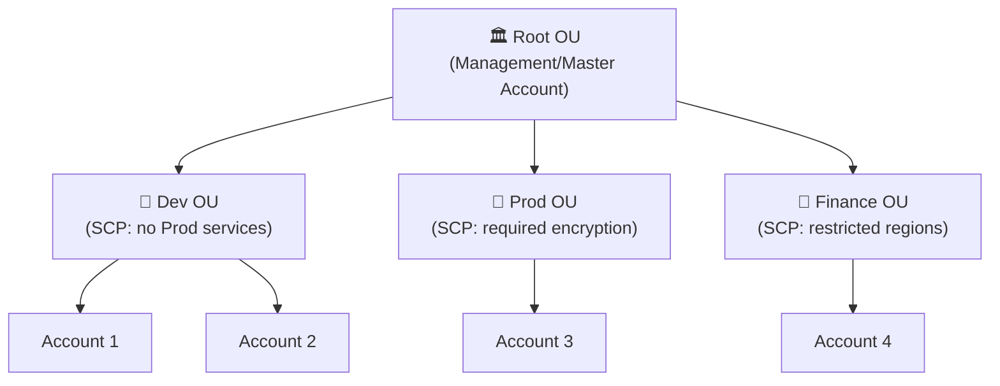
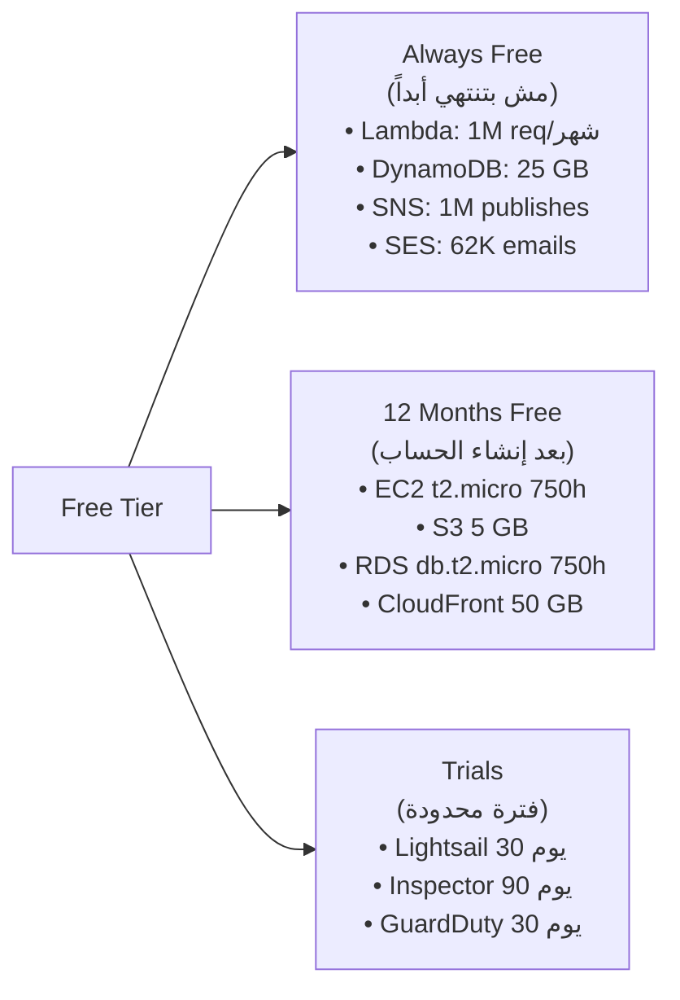
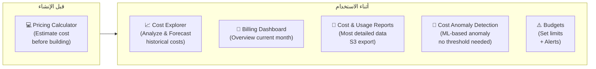
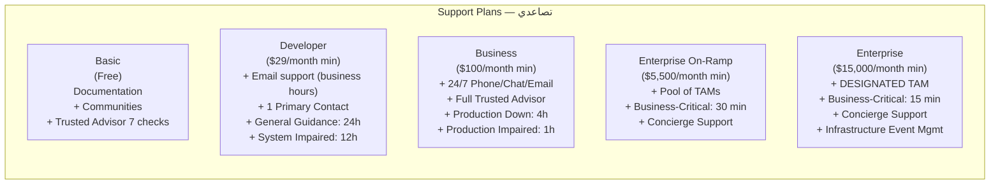

# 💰 Domain 4 — Billing, Pricing & Support
### الـ Cheat Sheet الشامل — مافيش كلمة فاتت

---

## 📋 فهرس سريع
- [[#🏢 AWS Organizations]]
- [[#🏛️ Control Tower & RAM]]
- [[#💵 Pricing Models & Free Tier]]
- [[#📊 Service Pricing]]
- [[#🛠️ Cost Management Tools]]
- [[#🎯 Support Plans]]
- [[#📝 Master Keyword Table]]

---

## 🏢 AWS Organizations

> [!info] أصل الحكاية
> شركة عندها 20 Team كل واحد عنده AWS Account منفصلة. في نهاية الشهر فاتورة واحدة مرعبة ومحدش عارف مين صرف إيه. الحل = AWS Organizations.



### فوايد Organizations

| الميزة | التفاصيل |
|---|---|
| **Consolidated Billing** | فاتورة واحدة لكل الـ Accounts |
| **Volume Discounts** | الاستخدام بيتجمع → تصل لـ Tiers أرخص |
| **RI Sharing** | Reserved Instance فاضلة في Account → تستفيد منها Accounts تانية |
| **API Automation** | تعمل Accounts تلقائياً بالكود |
| **SCPs** | تتحكم في صلاحيات الـ Accounts |

### SCPs (Service Control Policies)

> [!important] قواعد SCPs في الامتحان
> السؤال عن SCPs بييجي في كل صورة ممكنة — ده من أكثر topics الـ Traps.

```
قاعدة 1: SCP لا تطبق على Master/Management Account أبداً
قاعدة 2: SCP تطبق على ROOT USER داخل Member Accounts
قاعدة 3: SCP لا تؤثر على Service-Linked Roles
قاعدة 4: SCP هي Guardrail — مش بتدي Permissions، بس بتقيّد
قاعدة 5: الـ Effective Permission = تقاطع SCP + IAM Policy
         → لو SCP منعت S3 والـ IAM أدت S3 = ممنوع
```

| السيناريو | الإجابة |
|---|---|
| SCP تطبق على Master Account? | **لا** — دايماً ماله |
| SCP تطبق على Root User في Member Account? | **نعم** |
| IAM Admin User بيحاول يعمل حاجة الـ SCP منعتها | **Denied** |
| Service-Linked Role بتتأثر بالـ SCP? | **لا** |

### Consolidated Billing

| الميزة | التفاصيل |
|---|---|
| فاتورة واحدة | من الـ Management Account |
| Volume Discounts | استخدام كل الـ Accounts بيتجمع → الـ Tier الأرخص |
| RI Sharing | تلقائي — Account عنده Reserved Instance فاضلة → Accounts تانية تستفيد |
| إلغاء الـ RI Sharing | Management Account تقدر تلغيه لأي Account |

---

## 🏛️ Control Tower & RAM

### AWS Control Tower

| الخاصية | التفاصيل |
|---|---|
| وظيفته | Governance Layer فوق Organizations |
| بيعمل إيه | Setup Multi-Account Best Practices بنقرات |
| Guardrails | Preventive (SCPs) + Detective (Config Rules) |
| Landing Zone | الـ Multi-Account Environment المُهيأ |
| **الـ Keyword** | `automated governance`, `multi-account setup`, `guardrails`, `landing zone`, `compliance dashboard` |

> [!tip] Organizations vs Control Tower
> - **Organizations** = الأداة الأساسية (Accounts + SCPs + Billing)
> - **Control Tower** = Automation + Governance فوقيها (بيستخدم Organizations من الخلفية)

### AWS RAM (Resource Access Manager)

| الخاصية | التفاصيل |
|---|---|
| وظيفته | مشاركة AWS Resources بين Accounts |
| Resources ممكن تتشارك | VPC Subnets، Transit Gateway، Aurora DB، Route 53 Rules، EC2 Dedicated Hosts |
| **الـ Keyword** | `share resources between accounts`, `avoid duplication`, `cross-account VPC` |

### AWS Service Catalog

| الخاصية | التفاصيل |
|---|---|
| وظيفته | Self-service portal للـ Users لاستخدام Pre-approved Products |
| بيشتغل إزاي | Admin بيعمل CloudFormation Templates → يحطها في Catalog → Users يـLaunch بنقرة |
| **الـ Keyword** | `self-service`, `pre-approved templates`, `governance over what users can launch` |

---

## 💵 Pricing Models & Free Tier

### الـ 4 Pricing Models

| النموذج | المعنى |
|---|---|
| **Pay-as-you-go** | ادفع بس على اللي استخدمته — مرن لكن أغلى |
| **Save when you reserve** | التزم بمدة (1 أو 3 سنين) → خصم |
| **Pay less by using more** | Volume Discounts — كل ما استخدمت أكتر كل ما السعر أقل |
| **Pay less as AWS grows** | AWS بتنقل وفورات الـ Scale للعملاء مع الوقت |

### Free Tier — 3 أنواع



---

## 📊 Service Pricing

### EC2 Pricing

بتتحاسب على: عدد الـ Instances + Type + Region + OS + وقت التشغيل

| نموذج | الخصم | الاستخدام |
|---|---|---|
| On-Demand | — | Unpredictable, testing |
| Reserved | حتى 72% | Steady-state 1/3 سنين |
| Spot | حتى 90% | Batch, interruptible |
| Dedicated Host | — (الأغلى) | BYOL, compliance |
| **Compute Savings Plan** | حتى **66%** | EC2 + Fargate + Lambda (مرن) |
| **EC2 Savings Plan** | حتى **72%** | EC2 Instance Family محددة (أقل مرونة) |

> [!important] Savings Plans vs Reserved
> - **Reserved**: محدد Instance Type + Region + OS بالكامل
> - **Compute Savings Plan**: أي Instance Family، أي Region، يشمل Lambda وFargate كمان
> - **EC2 Savings Plan**: Instance Family محددة بس، أكبر خصم

### Lambda Pricing

بتتحاسب على: عدد الـ Invocations × وقت التنفيذ بالـ (GB-seconds)

| | التفاصيل |
|---|---|
| Free Tier (Always Free) | 1 مليون request/شهر + 400,000 GB-seconds |
| بعد الـ Free Tier | بالـ request + بالـ GB-second |

### S3 Pricing

بتتحاسب على 5 حاجات:

| الحساب | التفاصيل |
|---|---|
| حجم التخزين | بالـ GB — Standard أغلى، Glacier أرخص |
| عدد الـ Requests | PUT/COPY/POST أغلى من GET |
| Data Transfer **OUT** | الـ Inbound (Upload) **مجاني** دايماً |
| Lifecycle Transitions | رسوم على كل انتقال بين Storage Classes |
| Transfer Acceleration | تكلفة إضافية |

### EBS Pricing

بتتحاسب على: Type + حجم (GB/شهر) + IOPS المحجوزة (لـ io1/io2)

### RDS Pricing

بتتحاسب على: Instance size + DB engine + Storage + Multi-AZ (ضعف التكلفة تقريباً)

### CloudFront Pricing

بتتحاسب على: البيانات الخارجة (Data Transfer OUT) + عدد الـ HTTP Requests

> [!tip] Data Transfer Pricing — الأرقام المهمة
> | الحالة | التكلفة |
> |---|---|
> | Data IN (Upload to AWS) | **مجاني دايماً** |
> | بين EC2 في **نفس الـ AZ** (Private IP) | **مجاني** |
> | بين **AZs مختلفة** | $0.01/GB |
> | بين **Regions مختلفة** | $0.02/GB |
> | From AWS to Internet | بيتحاسب حسب الخدمة |

### AWS Compute Optimizer

| الخاصية | التفاصيل |
|---|---|
| وظيفته | ML-based Rightsizing Recommendations |
| بيحلل | CloudWatch Metrics لـ 14 يوم |
| بيدي توصيات لـ | EC2 Instances، Auto Scaling Groups، EBS Volumes، Lambda Functions |
| **الـ Keyword** | `rightsizing`, `over-provisioned`, `ML-based recommendations`, `reduce costs by right sizing` |

---

## 🛠️ Cost Management Tools



| الأداة | السؤال اللي بيجاوب عليه | الـ Keyword |
|---|---|---|
| **Pricing Calculator** | كام هتكلف الـ Architecture قبل ما تبنيها؟ | `estimate`, `before building`, `what will it cost` |
| **Cost Explorer** | كام صرفنا؟ إيه الـ Trend؟ هنصرف كام الشهر الجاي؟ | `analyze spending`, `forecast`, `historical costs` |
| **Billing Dashboard** | نظرة سريعة على الشهر الحالي | `current month overview` |
| **Cost & Usage Reports** | أكتر تفاصيل ممكنة عن كل مليم | `most detailed`, `S3 export`, `granular data` |
| **Cost Anomaly Detection** | فيه Spike غريب في الفاتورة؟ | `automatic detection`, `no threshold`, `ML anomaly` |
| **Budgets** | لما الصرف يوصل X، بعتلي Alert | `set budget`, `threshold alert`, `budget exceeded` |

### AWS Budgets — 4 أنواع

| النوع | يراقب إيه |
|---|---|
| **Cost Budget** | إجمالي التكلفة |
| **Usage Budget** | كمية الاستخدام (ساعات EC2، GB في S3) |
| **Reservation Budget** | استخدام الـ Reserved Instances |
| **Savings Plans Budget** | استخدام الـ Savings Plans |

---

## 🎯 Support Plans



| المقارنة | Business | Enterprise On-Ramp | Enterprise |
|---|---|---|---|
| TAM | ❌ | Pool of TAMs | ✅ **Designated TAM** |
| Business-Critical SLA | 1 ساعة | **30 دقيقة** | **15 دقيقة** |
| Trusted Advisor | Full | Full | Full |
| Infrastructure Event Management | ❌ | ❌ | ✅ |

> [!warning] Exam Traps في Support Plans
> - `Designated TAM` → **Enterprise Plan فقط**
> - `15 minutes response for business-critical` → **Enterprise**
> - `30 minutes response for business-critical` → **Enterprise On-Ramp**
> - `Full Trusted Advisor checks` → **Business Plan فصاعداً**
> - `Concierge Support` → **Enterprise On-Ramp أو Enterprise**

### Trusted Advisor

| الـ Category | مثال |
|---|---|
| **Cost Optimization** | Under-utilized EC2, unattached EBS, idle LBs |
| **Performance** | High-utilization EC2, CloudFront optimizations |
| **Security** | Open S3 buckets, no MFA on root, unrestricted SGs |
| **Fault Tolerance** | No Multi-AZ, no backups, single AZ deployments |
| **Service Limits** | Resources approaching AWS quotas |
| **Operational Excellence** | CloudFormation, Service Catalog usage |

| الـ Plan | عدد الـ Checks |
|---|---|
| Basic + Developer | **7 Core Checks** فقط (أهمها Security) |
| Business + Enterprise | **Full Checks** — كل الـ 6 categories |

---

## 📝 Master Keyword Table

### Organizations Keywords

| الكلمة | الإجابة |
|---|---|
| `multiple accounts, single bill` | AWS Organizations + Consolidated Billing |
| `SCP applies to root user?` | Yes — in Member Accounts (not Master Account) |
| `SCP applies to Master Account?` | **No** |
| `share Reserved Instances across accounts` | Consolidated Billing (automatic) |
| `automated multi-account governance` | Control Tower |
| `share VPC subnets between accounts` | AWS RAM |
| `self-service launch for users` | Service Catalog |

### Pricing Keywords

| الكلمة | الإجابة |
|---|---|
| `estimate cost before building` | **Pricing Calculator** |
| `analyze past spending` | Cost Explorer |
| `most detailed billing data` | Cost & Usage Reports |
| `set budget alert` | AWS Budgets |
| `ML-based anomaly, no threshold needed` | Cost Anomaly Detection |
| `rightsizing EC2/Lambda` | Compute Optimizer |
| `EC2 + Fargate + Lambda discount` | Compute Savings Plan (66%) |
| `highest EC2 discount, one family` | EC2 Savings Plan (72%) |
| `inbound data transfer free?` | Yes — always |
| `same AZ transfer (private IP) free?` | Yes |
| `between AZs cost` | $0.01/GB |
| `between Regions cost` | $0.02/GB |

### Support Keywords

| الكلمة | الإجابة |
|---|---|
| `Designated TAM` | **Enterprise Plan only** |
| `business-critical < 15 min` | Enterprise |
| `business-critical < 30 min` | Enterprise On-Ramp |
| `24/7 phone support` | Business Plan+ |
| `full Trusted Advisor` | Business Plan+ |
| `concierge support team` | Enterprise On-Ramp or Enterprise |
| `change or cancel support plan` | **Root User only** |
| `free Trusted Advisor checks` | 7 Core (Basic + Developer) |

---

> [!success] 🎯 الخلاصة
> Domain 4 = **12% من الامتحان** — أسهل domain.
> **3 محاور رئيسية**: Organizations + Cost Tools + Support Plans.
> الـ Traps الأكثر: Designated TAM (Enterprise فقط)، SCP لا تطبق على Master Account، Pricing Calculator للـ Estimation مش Cost Explorer.

---
*تم بناء هذا الملف من Domain 4 Notes + Practice Exams*
