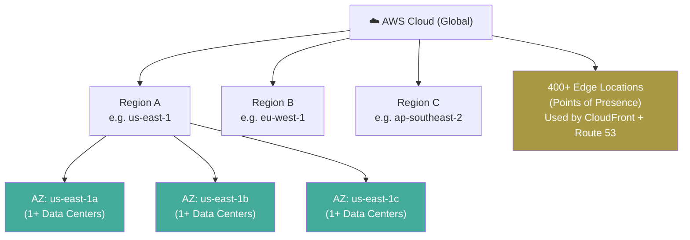
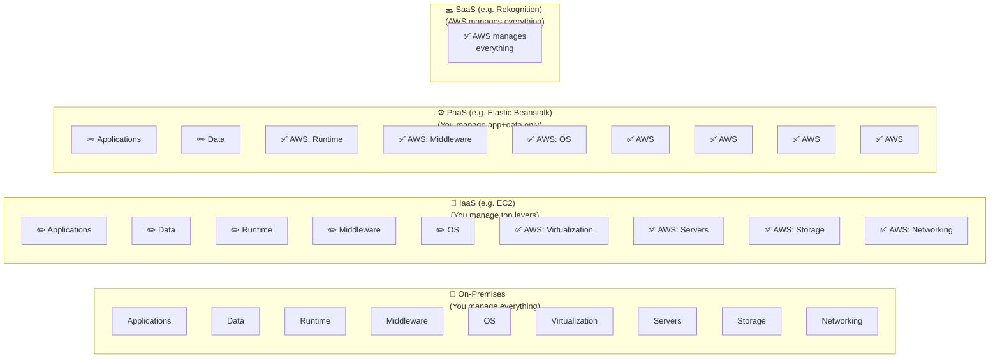
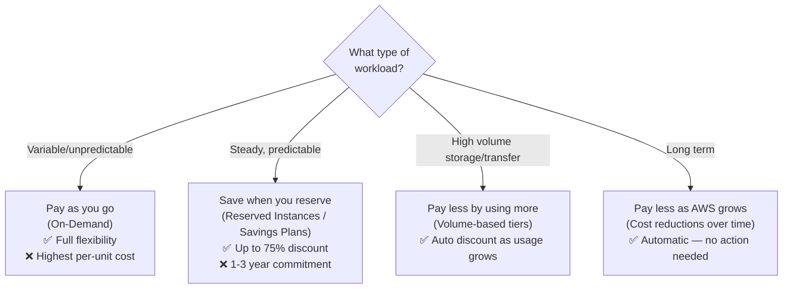
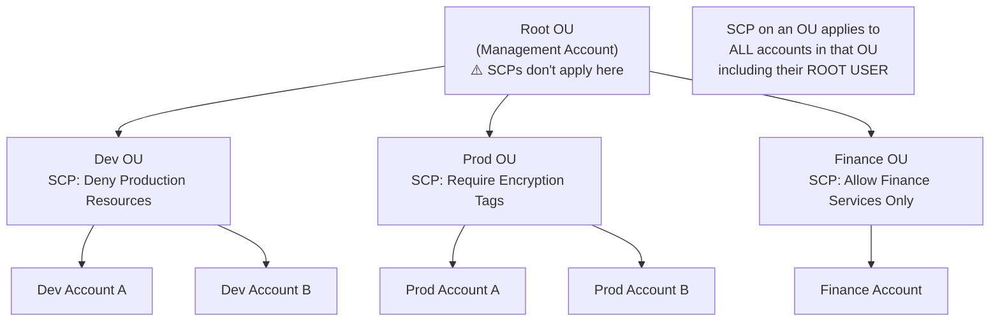
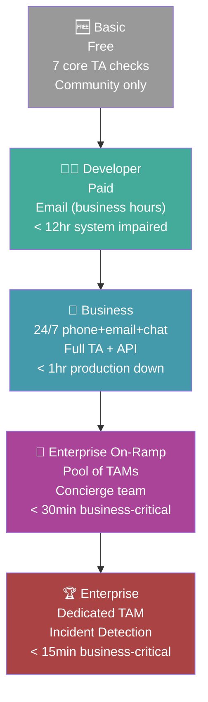
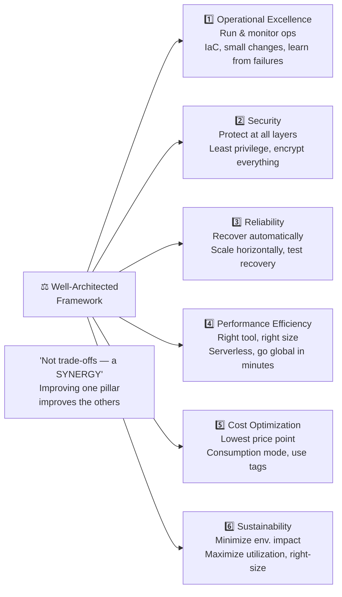
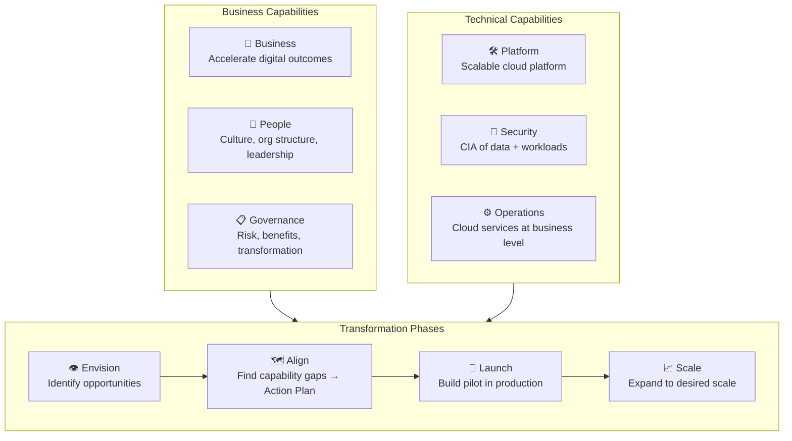
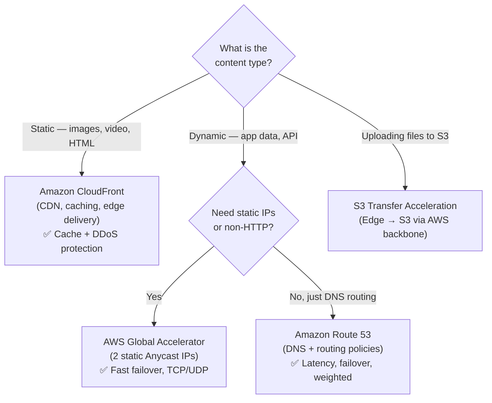

# ☁️ AWS CLF-C02 — Domains 1 & 4 Combined Revision Guide
### Domain 1: Cloud Concepts (24%) + Domain 4: Billing, Pricing & Support (12%) = 36% of Your Exam
> Together these two domains are more than a third of the paper. Domain 1 builds the mental model; Domain 4 tests whether you know how AWS charges for things and how to manage costs. Read both as one story — they connect constantly.

---

## 📌 Table of Contents

**DOMAIN 1 — Cloud Concepts**
1. [What is Cloud Computing?](#1-what-is-cloud-computing)
2. [Cloud Deployment Models — Public, Private, Hybrid](#2-cloud-deployment-models)
3. [The Five Characteristics of Cloud Computing](#3-five-characteristics)
4. [Six Advantages of Cloud Computing](#4-six-advantages)
5. [Problems Cloud Solves (Benefits)](#5-problems-cloud-solves)
6. [Service Models — IaaS, PaaS, SaaS](#6-service-models)
7. [AWS Pricing Fundamentals (3 Pillars)](#7-aws-pricing-fundamentals)
8. [AWS Global Infrastructure](#8-aws-global-infrastructure)
9. [Global Application Services](#9-global-application-services)
10. [AWS Outposts, WaveLength & Local Zones](#10-outposts-wavelength-local-zones)
11. [Global Application Architectures](#11-global-app-architectures)
12. [Well-Architected Framework — 6 Pillars](#12-well-architected-framework)
13. [AWS Cloud Adoption Framework (CAF)](#13-aws-caf)
14. [Right Sizing](#14-right-sizing)
15. [AWS Ecosystem](#15-aws-ecosystem)

**DOMAIN 4 — Billing, Pricing & Support**
16. [The 4 AWS Pricing Models](#16-four-pricing-models)
17. [AWS Free Tier](#17-aws-free-tier)
18. [Pricing per Service — EC2, Lambda, ECS, S3, EBS, RDS, CloudFront, Networking](#18-per-service-pricing)
19. [Savings Plans](#19-savings-plans)
20. [AWS Compute Optimizer](#20-compute-optimizer)
21. [Cost Management Tools — The Full Suite](#21-cost-management-tools)
22. [AWS Organizations & Consolidated Billing](#22-aws-organizations)
23. [AWS Control Tower & Service Catalog & RAM](#23-control-tower-service-catalog-ram)
24. [AWS Trusted Advisor](#24-trusted-advisor)
25. [AWS Support Plans](#25-support-plans)
26. [Account Best Practices — Summary](#26-account-best-practices)
27. [🔥 Master Comparison Tables](#27-master-comparison-tables)
28. [🧠 Exam Tricks & Catchwords](#28-exam-tricks--catchwords)
29. [🗺 Mermaid Diagrams](#29-mermaid-diagrams)

---

# DOMAIN 1 — Cloud Concepts (24%)

---

## 1. What is Cloud Computing?

Cloud computing is the **on-demand delivery of compute power, database storage, applications, and other IT resources** through a cloud services platform with **pay-as-you-go pricing**. The key mental shift here is that instead of buying and owning hardware, you *rent* it from AWS. You provision exactly what you need, almost instantly, and stop paying when you don't need it anymore.

Before the cloud, companies had to guess their capacity needs months in advance, buy physical servers, pay for data center rent, power, cooling, and 24/7 staff — all before a single customer used the product. The cloud turns that upfront investment (CAPEX) into a usage-based operating expense (OPEX).

**The before vs after in plain terms:**

| Problem (Traditional IT) | Cloud Solution |
|--------------------------|----------------|
| Pay rent for data center | AWS pays for the facilities |
| Pay for power + cooling | AWS handles infrastructure |
| Hardware replacement takes time | Provision in seconds |
| Limited scaling | Scale to millions in minutes |
| 24/7 team to monitor infra | AWS manages underlying hardware |
| Disaster? (fire, earthquake) | Multi-region redundancy built in |

---

## 2. Cloud Deployment Models

Three models — know them cold, including which is which and when you'd use each.

| Model | Description | Control Level | Use Case |
|-------|-------------|---------------|----------|
| **Public Cloud** | Resources owned and operated by a 3rd-party provider (AWS, Azure, GCP), delivered over the internet | Low — provider manages everything | Most companies, startups, web apps |
| **Private Cloud** | Cloud used by a single organization, not exposed to the public | High — you control everything | Government, banks with strict compliance |
| **Hybrid Cloud** | Mix — some on-premises servers, some cloud | Medium — you control on-prem, share cloud | Gradual migrations, regulated industries |

The hybrid model is the most common in large enterprises. A company might keep its sensitive databases on-premises but run its web servers on AWS — that's hybrid. **AWS Outposts** is specifically AWS's answer to hybrid cloud (covered in Section 10).

> **🔑 Exam Trick:** The exam will describe a scenario (e.g., "company keeps sensitive data on-premises but uses AWS for compute") and ask what model it is. That's **Hybrid**. "A third-party provider delivers resources over the internet" = **Public Cloud**.

---

## 3. Five Characteristics of Cloud Computing

These are the official NIST characteristics. The exam expects you to recognize them by name and understand what each means.

| Characteristic | What it Means |
|---------------|---------------|
| **On-demand self-service** | You provision resources (launch EC2, create S3 bucket) without human interaction from AWS — no tickets, no waiting |
| **Broad network access** | Resources are available over the network and accessible from laptops, phones, tablets — any device, anywhere |
| **Multi-tenancy and resource pooling** | Multiple customers share the same physical hardware with security/privacy isolation — you don't know who's on the same server, and that's fine |
| **Rapid elasticity and scalability** | Automatically acquire or release resources based on demand — scale up in a flash sale, scale down at night |
| **Measured service** | Usage is metered and billed precisely — you pay for exactly what you use, like a utility bill |

> **🔑 Exam Trick:** "Pay for what you use" maps to **Measured Service**. "No human interaction needed to provision" maps to **On-demand self-service**. "Multiple customers on same hardware" maps to **Multi-tenancy**.

---

## 4. Six Advantages of Cloud Computing

AWS specifically defines six advantages, and they are directly testable. Think of them as the sales pitch for why cloud > on-premises.

| Advantage | Core Idea | Remember It As |
|-----------|-----------|----------------|
| **Trade CAPEX for OPEX** | Pay as you go — no upfront hardware investment, no owning assets | "Rent, don't buy" |
| **Massive economies of scale** | AWS buys hardware at huge volume → passes savings to customers | "AWS is cheaper because it's huge" |
| **Stop guessing capacity** | Scale based on actual usage — no over-provisioning or under-provisioning | "Right size, right time" |
| **Increase speed and agility** | Spin up servers in minutes vs weeks for physical hardware | "From weeks to minutes" |
| **Stop spending on data centers** | Focus your money on your product, not on running infrastructure | "Focus on business, not buildings" |
| **Go global in minutes** | Deploy to any AWS Region worldwide in a few clicks | "One click, any continent" |

> **🔑 Exam Trick:** "Reduced Total Cost of Ownership (TCO)" ties to trading CAPEX for OPEX. "Economies of scale" means AWS passes its bulk purchasing power to you. These six advantages are the "why use cloud" answer for almost any conceptual question.

---

## 5. Problems Cloud Solves (Benefits Language)

The exam also frames cloud benefits in a slightly different vocabulary for "problems solved":

| Benefit | Plain English |
|---------|--------------|
| **Flexibility** | Change resource types whenever your needs change |
| **Cost-Effectiveness** | Pay as you go, only for what you use |
| **Scalability** | Handle more load by making hardware stronger (vertical) or adding more servers (horizontal) |
| **Elasticity** | Automatically scale out when demand spikes, scale in when it drops |
| **High Availability & Fault Tolerance** | Build across multiple data centers so one failure doesn't bring everything down |
| **Agility** | Rapidly develop, test, and launch applications — experiment without risk |

Notice the distinction between **Scalability** (the capacity to handle more) and **Elasticity** (the automatic doing of it). Elasticity is scalability that happens on its own in response to demand.

---

## 6. Service Models — IaaS, PaaS, SaaS

The three service models define how much of the stack AWS manages vs how much you manage. The more "as a Service" it is, the less you manage.

```
                  YOU MANAGE ←————————————————→ PROVIDER MANAGES
On-Premises    IaaS           PaaS             SaaS
────────────  ─────────────  ──────────────   ──────────────
Applications  Applications   Applications     ✅ Applications
Data          Data           Data             ✅ Data
Runtime       Runtime        ✅ Runtime        ✅ Runtime
Middleware    Middleware      ✅ Middleware     ✅ Middleware
OS            OS             ✅ OS             ✅ OS
Virt.         ✅ Virt.        ✅ Virt.          ✅ Virt.
Servers       ✅ Servers      ✅ Servers        ✅ Servers
Storage       ✅ Storage      ✅ Storage        ✅ Storage
Networking    ✅ Networking   ✅ Networking     ✅ Networking
```

| Model | You Manage | AWS Manages | AWS Example | Real-World Example |
|-------|-----------|-------------|------------|-------------------|
| **IaaS** | OS, apps, data | Hardware, virtualization, networking | EC2 | Rackspace, DigitalOcean |
| **PaaS** | Applications, data | Everything below your code | Elastic Beanstalk | Heroku, Google App Engine |
| **SaaS** | Nothing (just use it) | Everything | Rekognition, WorkMail | Gmail, Dropbox, Zoom |

> **🔑 Exam Trick:** EC2 = IaaS. Elastic Beanstalk = PaaS. Rekognition / WorkMail = SaaS. IaaS gives highest flexibility; SaaS gives least management overhead.

---

## 7. AWS Pricing Fundamentals

AWS has **3 core pricing dimensions** — everything else is built on these three:

| Dimension | What you pay for |
|-----------|-----------------|
| **Compute** | Time your resources run (EC2 hours, Lambda invocations, etc.) |
| **Storage** | Data stored in the cloud (S3 GB/month, EBS GB/month, etc.) |
| **Data Transfer OUT** | Data leaving AWS to the internet — **Data Transfer IN is always FREE** |

The key insight: **inbound data is free**. Uploading to S3, sending data to EC2 — free. Downloading data out to your users — that's what you pay for. This encourages you to keep workloads inside AWS where data movement is cheap or free.

---

## 8. AWS Global Infrastructure

Understanding AWS's physical layout is fundamental to understanding almost every architectural decision.

### 8.1 Regions

A **Region** is a physical geographic area containing a cluster of data centers. AWS currently has 30+ regions worldwide, named like `us-east-1`, `eu-west-3`, `ap-southeast-2`.

**Most AWS services are region-scoped** — meaning an EC2 instance in `us-east-1` is a completely separate thing from an EC2 instance in `eu-west-1`. When you create resources, you create them in a specific region.

**How to choose a region?** Four factors, in order of priority:

| Factor | Why it matters |
|--------|---------------|
| **Compliance & Legal** | Data sovereignty — some countries require data to never leave their borders. This overrides everything else. |
| **Proximity to customers** | Closer region = lower latency = better user experience |
| **Available services** | Not all services exist in every region — newer services launch in certain regions first |
| **Pricing** | Prices vary by region — same EC2 instance type costs different amounts in different regions |

> **🔑 Exam Trick:** If a question says "data must stay in Germany" → compliance overrides everything, pick the Frankfurt region. Compliance is always the first priority.

### 8.2 Availability Zones (AZs)

Each region contains multiple **Availability Zones** — usually 3, minimum 3, maximum 6. Each AZ is one or more discrete data centers with redundant power, networking, and connectivity.

The naming convention: `ap-southeast-2a`, `ap-southeast-2b`, `ap-southeast-2c` — where the letter suffix (a/b/c) identifies the AZ within the region.

AZs are physically separated from each other so a fire or flood in one doesn't affect the others, but they're connected by **high-bandwidth, ultra-low latency networking** so they appear seamless to applications.

The purpose: **high availability**. Deploying across 2+ AZs means if one data center goes down, your application keeps running.

### 8.3 Edge Locations / Points of Presence

AWS has **400+ Points of Presence** (Edge Locations + Regional Caches) across 90+ cities in 40+ countries. These are NOT full regions — they're smaller facilities used by services like **CloudFront** and **Route 53** to cache content and answer DNS queries as close to end users as possible.

Think of Edge Locations as local delivery depots: instead of your video streaming from a server in Virginia to a user in Cairo, CloudFront caches it at a nearby edge location and delivers it from there.

### 8.4 Global vs Regional Services

Some AWS services are global (not tied to any region):

| Global Services (always the same, no region) | Examples |
|----------------------------------------------|---------|
| IAM | Users, groups, roles, policies |
| Route 53 | DNS |
| CloudFront | CDN |
| WAF | Web Application Firewall |

Everything else (EC2, RDS, S3, Lambda, etc.) is region-scoped.

> **🔑 Exam Trick:** If the exam asks "which service is global?" → IAM, Route 53, CloudFront, WAF. If it says "you need to deploy in multiple regions for redundancy" → that means region-scoped services, managed per region.

---

## 9. Global Application Services

When you want low latency for users worldwide, these are the tools. The exam loves testing the differences between them.

### 9.1 Amazon Route 53

Route 53 is AWS's **managed DNS** (Domain Name System) service. DNS translates human-readable domain names (`www.myapp.com`) into IP addresses that computers understand.

**DNS Record Types to know:**

| Record | What it does | Example |
|--------|-------------|---------|
| **A record** | Maps hostname to IPv4 | `app.com → 12.34.56.78` |
| **AAAA record** | Maps hostname to IPv6 | `app.com → 2001:0db8:...` |
| **CNAME** | Maps hostname to another hostname | `search.app.com → www.app.com` |
| **Alias** | Maps hostname to an AWS resource | `app.com → my-elb.us-east-1.elb.amazonaws.com` |

**Route 53 Routing Policies** (high-level, exam expects recognition not deep config):

| Policy | How it works | Use case |
|--------|-------------|---------|
| **Simple** | Returns a single IP, no health checks | Basic routing |
| **Weighted** | Distributes traffic % across multiple endpoints (70/20/10) | Blue/green deployments, A/B testing |
| **Latency** | Routes to the region with lowest latency for the user | Global low-latency apps |
| **Failover** | Routes to primary; if health check fails → switches to standby | Disaster recovery |

### 9.2 Amazon CloudFront

CloudFront is AWS's **Content Delivery Network (CDN)**. It caches your content at Edge Locations globally so users get it from the nearest location.

**What CloudFront improves:** Read performance (cached content is served locally), user experience, and DDoS protection (because traffic is absorbed at hundreds of edge locations before it reaches your origin).

**CloudFront Origins** (where the real content lives):

| Origin Type | What it is |
|-------------|-----------|
| **S3 Bucket** | Serve/cache files from S3; also used to upload to S3 through CloudFront |
| **VPC Origin** | Apps in private subnets (private ALB, NLB, EC2) |
| **Custom HTTP Origin** | Any public HTTP server, ALB, or S3 static website |

**CloudFront vs S3 Cross-Region Replication** — a favorite exam comparison:

| | CloudFront | S3 Cross-Region Replication |
|--|-----------|----------------------------|
| **Mechanism** | Caches content at edge globally | Replicates actual files to specific regions |
| **Update speed** | TTL-based (content cached for a TTL, e.g., 1 day) | Near real-time |
| **Coverage** | All 400+ edge locations worldwide | Only the regions you set up |
| **Access type** | Read-heavy cached content | Read-only replicated content |
| **Best for** | Static content (images, videos) for everyone worldwide | Dynamic content needing low latency in a few specific regions |

### 9.3 S3 Transfer Acceleration

Speeds up uploads and downloads to/from S3 by routing traffic through an AWS Edge Location first, then using AWS's private backbone network to reach the S3 bucket. This is faster than going over the public internet directly.

Example: You're in Cairo uploading to an S3 bucket in Australia. Without acceleration, your data travels the whole way over the public internet. With S3 Transfer Acceleration, it goes to the nearest AWS edge location (say, Dubai), then onto AWS's private high-speed backbone to Australia.

### 9.4 AWS Global Accelerator

Global Accelerator improves performance for **non-cacheable content** — essentially any TCP/UDP application. It assigns your application **2 static Anycast IP addresses** and routes traffic through Edge Locations to the AWS backbone, rather than the public internet.

**The critical difference between CloudFront and Global Accelerator:**

| | CloudFront | Global Accelerator |
|--|-----------|-------------------|
| **Caching?** | ✅ Yes — caches content at the edge | ❌ No — proxies packets to your app |
| **Protocol** | HTTP/HTTPS | Any TCP/UDP |
| **Content type** | Static/cacheable (images, videos) | Dynamic, any application |
| **IPs** | Dynamic IPs | 2 static Anycast IPs |
| **Use case** | Serve static content globally | Low-latency for dynamic apps, gaming, IoT, VoIP |
| **Failover** | Not designed for regional failover | ✅ Fast deterministic regional failover |

Both use AWS global network + Shield for DDoS protection.

> **🔑 Exam Trick:** "Static IP addresses required" or "non-HTTP application" or "fast regional failover" → **Global Accelerator**. "Cache images and videos at edge" → **CloudFront**. This is one of the most tested service-pair comparisons in Domain 1.

---

## 10. Outposts, WaveLength & Local Zones

These three services all solve the same problem differently: *what if your users or data need to be VERY close to the compute?*

### 10.1 AWS Outposts

Outposts are **physical server racks** that AWS ships to YOUR data center. This lets you run AWS services (EC2, EBS, S3, EKS, RDS, ECS, EMR) on your own premises, managed by AWS, with the same APIs and tools as the cloud.

This is the **hybrid cloud** solution. Your on-premises applications get the AWS experience. You're responsible for the physical security of the rack (AWS manages the software/services). Use cases: data residency requirements, low-latency access to on-premises systems, gradual cloud migration.

### 10.2 AWS WaveLength

WaveLength embeds AWS compute and storage **inside 5G telecom carrier data centers**, at the very edge of the 5G network. Your application runs at the carrier edge, so users on 5G devices get ultra-low latency without their traffic ever leaving the carrier's network.

Use cases: smart cities, connected vehicles, AR/VR, real-time gaming, ML-assisted diagnostics — anything requiring single-digit millisecond latency over 5G.

### 10.3 AWS Local Zones

Local Zones extend an AWS Region to be **closer to a city** where AWS doesn't have a full region. Think of them as mini-regions attached to a parent region. You extend your VPC into a Local Zone and run latency-sensitive parts of your app there.

Example: AWS Region is `us-east-1` (N. Virginia). Local Zones exist in Boston, Chicago, Dallas, Houston, Miami — so users in those cities get single-digit millisecond latency to their nearest Local Zone.

**The three compared:**

| Service | Extends | Latency Target | Where compute lives |
|---------|---------|----------------|-------------------|
| **Outposts** | AWS cloud into YOUR data center | Ultra-low (on-premises) | Your building |
| **WaveLength** | AWS cloud into 5G carrier edge | Ultra-low over 5G | Telecom carrier facility |
| **Local Zones** | AWS Region to a nearby city | Very low (city-level) | AWS mini-facility near a city |

> **🔑 Exam Trick:** "On your own premises" = Outposts. "5G edge" = WaveLength. "Closer to specific city users" = Local Zones.

---

## 11. Global App Architectures

The exam shows different architecture patterns for global applications. Know the trade-offs:

| Architecture | High Availability | Latency | Difficulty |
|-------------|------------------|---------|------------|
| Single Region, Single AZ | ❌ None | Global latency poor | Easiest |
| Single Region, Multi-AZ | ✅ Within region | Still global latency | Moderate |
| Multi-Region, Active-Passive | ✅ Regional DR | Reads low-latency globally; writes still go to active region | Hard |
| Multi-Region, Active-Active | ✅ Full global HA | Reads AND writes low-latency everywhere | Hardest |

Active-Passive = one region handles all reads/writes; the other is a standby (failover only). Active-Active = all regions accept reads and writes simultaneously.

---

## 12. Well-Architected Framework — 6 Pillars

The AWS Well-Architected Framework defines best practices for building cloud applications. There are **6 pillars** — the exam expects you to name them, know their design principles, and recognize which AWS services support each.

The critical phrase: *"They are not trade-offs — they are a synergy."* Improving one pillar should ideally improve others.

### Pillar 1: Operational Excellence

Running and monitoring systems to deliver business value, and continuously improving.

Design Principles: perform operations as code (IaC), make frequent small reversible changes, anticipate failure, learn from failures, implement observability.

AWS Services: CloudFormation (IaC), Config (compliance), CloudTrail (audit), CloudWatch (monitoring), CodeBuild/CodeDeploy/CodePipeline (CI/CD automation), X-Ray (tracing).

### Pillar 2: Security

Protecting information, systems, and assets through risk assessment and mitigation.

Design Principles: strong identity foundation (least privilege via IAM), enable traceability (logs + metrics), apply security at ALL layers (edge → VPC → subnet → instance → OS → app), automate security best practices, protect data in transit and at rest, keep people away from data, prepare for security events.

AWS Services: IAM, STS, MFA, Organizations (identity); Config, CloudTrail, CloudWatch (detective controls); CloudFront, VPC, Shield, WAF, Inspector (infrastructure protection); KMS, EBS, RDS, S3 (data protection).

### Pillar 3: Reliability

The ability to recover from disruptions, scale dynamically, and mitigate misconfigurations.

Design Principles: test recovery procedures using automation, automatically recover from failure, scale horizontally to avoid single points of failure, stop guessing capacity (use Auto Scaling), manage changes in automation.

AWS Services: IAM, VPC, Service Quotas, Trusted Advisor (foundations); Auto Scaling, CloudWatch, CloudTrail, Config (change management); CloudFormation, S3/Glacier, Route 53 (failure management).

### Pillar 4: Performance Efficiency

Using computing resources efficiently and maintaining efficiency as demand changes.

Design Principles: democratize advanced technologies (use ML, serverless instead of building from scratch), go global in minutes, use serverless architectures, experiment more often, mechanical sympathy (understand your tools).

AWS Services: Auto Scaling, Lambda, EBS, S3, CloudFormation (selection); CloudWatch (monitoring); CloudFront, ElastiCache, RDS (tradeoffs for caching/read performance).

### Pillar 5: Cost Optimization

Delivering business value at the lowest price point.

Design Principles: adopt consumption mode (pay for what you use), measure overall efficiency (CloudWatch), stop spending on data centers, analyze and attribute expenditure (use tags!), use managed services to reduce cost of ownership.

AWS Services: Budgets, Cost & Usage Report, Cost Explorer (expenditure awareness); Spot/Reserved instances, S3 Glacier (cost-effective resources); Auto Scaling, Lambda (match supply to demand); Trusted Advisor, Cost & Usage Report (optimize over time).

### Pillar 6: Sustainability

Minimizing the environmental impact of running cloud workloads.

Design Principles: understand your impact, establish sustainability goals, maximize utilization (right-size to reduce idle resources), adopt newer efficient hardware, use managed services (shared infrastructure is more efficient), reduce downstream impact on end users.

AWS Services: EC2 Auto Scaling, Lambda, Fargate (maximize utilization); EC2 Graviton, Spot instances, Cost Explorer (efficient hardware selection); EFS-IA, S3 Glacier, EBS Cold HDD (cold storage for infrequent data); S3 Intelligent Tiering, Data Lifecycle Manager (lifecycle management); CloudFront, RDS Read Replicas, Aurora Global DB (read local, write global).

### The 6 Pillars Quick-Reference Table

| # | Pillar | One-Sentence Core | Key Design Principle Keyword |
|---|--------|-------------------|------------------------------|
| 1 | **Operational Excellence** | Run, monitor, and improve operations | "Operations as code", "Small reversible changes" |
| 2 | **Security** | Protect everything, at every layer | "Least privilege", "Defense in depth" |
| 3 | **Reliability** | Recover automatically, scale without single point of failure | "Test recovery", "Scale horizontally" |
| 4 | **Performance Efficiency** | Right tool, right size, always | "Go global in minutes", "Serverless" |
| 5 | **Cost Optimization** | Deliver value at lowest cost | "Consumption mode", "Use tags" |
| 6 | **Sustainability** | Minimize environmental impact | "Maximize utilization", "Right-size" |

**The AWS Well-Architected Tool** is a free tool in the AWS Console where you answer questions about your workload and get a report against all 6 pillars with recommendations.

---

## 13. AWS Cloud Adoption Framework (CAF)

CAF is a framework — not a product — that helps organizations plan their cloud transformation. It identifies **specific organizational capabilities** needed for successful cloud adoption, grouped into **6 perspectives**.

### The 6 CAF Perspectives

Divided into two groups: **Business Capabilities** and **Technical Capabilities**.

**Business Capabilities (people and process):**

| Perspective | Focus |
|-------------|-------|
| **Business** | Ensure cloud investments accelerate digital transformation and business outcomes |
| **People** | Bridge technology and business; culture, organizational structure, leadership, workforce evolution |
| **Governance** | Orchestrate cloud initiatives, maximize benefits, minimize transformation risks |

**Technical Capabilities (building and running):**

| Perspective | Focus |
|-------------|-------|
| **Platform** | Build enterprise-grade scalable hybrid cloud; modernize workloads; implement cloud-native solutions |
| **Security** | Achieve confidentiality, integrity, and availability of data and cloud workloads |
| **Operations** | Ensure cloud services are delivered at a level that meets business needs |

> **🔑 Exam Trick:** The 6 perspectives: Business, People, Governance (business side) + Platform, Security, Operations (technical side). A common question asks which perspective deals with "organizational structure and culture" → **People**. "Cloud security posture" → **Security**. "Managing the risk of the transformation" → **Governance**.

### CAF Transformation Domains

The four areas where cloud transformation happens:

| Domain | What changes |
|--------|-------------|
| **Technology** | Migrate and modernize legacy infrastructure, apps, data, analytics |
| **Process** | Digitize and automate business operations; use ML to improve customer service |
| **Organization** | Reimagine the operating model; organize teams around products; use agile methods |
| **Product** | Create new value propositions, revenue models, and business offerings |

### CAF Transformation Phases

Four sequential phases for executing a cloud transformation:

| Phase | What you do |
|-------|------------|
| **Envision** | Demonstrate how cloud accelerates outcomes; identify transformation opportunities; build the business case |
| **Align** | Identify capability gaps across all 6 CAF perspectives → produces an Action Plan |
| **Launch** | Build and deliver pilot initiatives in production; demonstrate incremental business value |
| **Scale** | Expand pilots to full scale; realize business benefits |

> **🔑 Exam Trick:** CAF phases in order: **E-A-L-S** (Envision → Align → Launch → Scale). A question about "identifying capability gaps across perspectives" = **Align phase**. "Expanding pilots" = **Scale phase**.

---

## 14. Right Sizing

Right Sizing is the practice of matching EC2 instance types and sizes to your **actual workload requirements at the lowest cost**. The cloud is elastic, so you never need to start with the largest instance — start small, scale up as needed.

Right Sizing happens at two times: **before a cloud migration** (don't over-provision from the start) and **continuously after** (requirements change — you may be running instances that are too large for actual usage).

Tools that help with Right Sizing: **CloudWatch** (actual usage metrics), **Cost Explorer** (cost analysis), **Trusted Advisor** (optimization recommendations), **AWS Compute Optimizer** (ML-powered sizing recommendations), and 3rd-party tools.

> **🔑 Exam Trick:** Right Sizing is about NOT picking the most powerful instance — it's about picking the *right* size. "The cloud is elastic" is the key phrase justifying this approach.

---

## 15. AWS Ecosystem

### AWS Marketplace

A digital catalog with thousands of software listings from **Independent Software Vendors (ISVs)**. You can buy custom AMIs, CloudFormation templates, SaaS products, and containers. Purchases appear on your AWS bill. You can also **sell your own solutions** on the Marketplace.

### AWS Support (in the Ecosystem)

High-level support options (details in Section 25): Developer, Business, Enterprise On-Ramp, Enterprise. Key theme: more critical workloads need faster response times and access to specialized support staff.

### AWS Partner Network (APN)

AWS's global partner ecosystem, split into: **Technology Partners** (hardware/software/connectivity), **Consulting Partners** (professional services firms that help you build on AWS), and **Training Partners** (certification/training providers). The **AWS Competency Program** recognizes partners with proven technical expertise in specialized areas.

### AWS IQ

A marketplace for finding and hiring **AWS-certified 3rd-party experts** for on-demand project work. You submit a request, experts send proposals, you select and pay per milestone — charges go through your AWS bill.

### AWS re:Post

A Q&A community service that replaced the original AWS Forums. Community members answer questions and earn reputation points. Unanswered premium support questions escalate to AWS engineers. Not intended for time-sensitive or proprietary questions.

### AWS Managed Services (AMS)

AMS provides **infrastructure and application management** — a team of AWS experts who manage and operate your infrastructure for security, reliability, and availability. They handle change requests, monitoring, patch management, security, and backups. 24/365 operations. Good for organizations that want to focus on business and offload routine AWS management.

### AWS Customer Carbon Footprint Tool

Tracks, measures, reviews, and forecasts carbon emissions from your AWS usage. Helps you meet sustainability goals and plan a path to 100% renewable energy.

---

# DOMAIN 4 — Billing, Pricing & Support (12%)

---

## 16. Four Pricing Models

AWS has four fundamental ways it charges for services. Every pricing scenario in Domain 4 is a variation of one of these:

| Model | How it Works | Best For |
|-------|-------------|---------|
| **Pay as you go** | Pay for exactly what you use, no commitments | Unpredictable workloads, agility |
| **Save when you reserve** | Commit to 1 or 3 years → up to 75% discount | Steady, predictable workloads |
| **Pay less by using more** | Volume-based discounts — the more you use, the cheaper per unit | High-volume data storage/transfer |
| **Pay less as AWS grows** | AWS passes infrastructure efficiency gains to customers over time | Long-term cost reduction (automatic) |

Services that support reservations: EC2 Reserved Instances, DynamoDB Reserved Capacity, ElastiCache Reserved Nodes, RDS Reserved Instance, Redshift Reserved Nodes.

---

## 17. AWS Free Tier

The Free Tier lets new AWS customers explore services at no cost. There are two plan types:

| | Free Plan | Paid Plan |
|--|-----------|-----------|
| **Duration** | 6 months OR until credits consumed | After you consume credits |
| **Credits** | Up to $200 | N/A |
| **Charges after** | No charges in Free Plan | Charged after credits used |
| **Always Free services** | ✅ Available | ✅ Available |

**Always Free examples** (these never expire, any account):

| Service | Free Allowance |
|---------|---------------|
| **Lambda** | 1,000,000 requests/month + 400,000 GB-seconds compute/month |
| **DynamoDB** | 25 GB storage + 200 million requests/month |

> **🔑 Exam Trick:** Always Free services don't require a new account — they're permanent for everyone. The 12-month free tier (e.g., 750 hours EC2 t2.micro/month) is for new accounts only.

---

## 18. Per-Service Pricing

### EC2 Pricing

EC2 charges you based on what you run, how you provision it, and how you commit. The five pricing options:

| Option | Discount vs On-Demand | Commitment | Use Case |
|--------|----------------------|------------|---------|
| **On-Demand** | 0% (baseline) | None | Dev/test, unpredictable workloads |
| **Reserved Instances** | Up to **75%** | 1 or 3 years | Steady production workloads |
| **Savings Plans** | Up to 72% | 1 or 3 years ($ commitment) | Flexible — covers EC2, Lambda, Fargate |
| **Spot Instances** | Up to **90%** | None (can be interrupted) | Batch processing, fault-tolerant apps |
| **Dedicated Hosts** | Varies | On-demand or 1/3-year reservation | License compliance (BYOL), regulatory |

Reserved Instances: payment options are **All Upfront** (max discount), **Partial Upfront**, or **No Upfront** (lowest upfront, higher hourly).

EC2 billing granularity: minimum **60 seconds**; billed per second for Linux/Windows, per hour for others.

Additional EC2 cost factors: instance type, instance size, region, OS/software, ELB running time + data processed, detailed monitoring.

### Lambda & ECS Pricing

| Service | Billed For |
|---------|-----------|
| **Lambda** | Per call (invocations) + per duration (GB-seconds) |
| **ECS (EC2 Launch Type)** | No ECS fee; you pay for underlying EC2 resources |
| **Fargate (ECS/EKS)** | vCPU + memory allocated to your containers |

> **🔑 Exam Trick:** Lambda = pay per call + per duration. Fargate = pay for the compute resources (vCPU/memory) your containers use. ECS on EC2 = pay for the EC2 instances, not ECS itself.

### S3 Pricing

S3 charges are based on multiple dimensions:

| Dimension | Notes |
|-----------|-------|
| **Storage class** | Standard, Infrequent Access, One-Zone IA, Intelligent Tiering, Glacier, Glacier Deep Archive — each has different price |
| **Volume of data** | Price per GB per month; tiered (cheaper per GB at higher volumes) |
| **Number and type of requests** | GET, PUT, LIST requests each have a cost |
| **Data transfer OUT** | Charged by volume; **inbound is free** |
| **S3 Transfer Acceleration** | Additional fee for faster uploads |
| **Lifecycle transitions** | Moving objects between classes has a transition cost |

EFS pricing is similar — pay per use, with infrequent access pricing and lifecycle rules.

### EBS Pricing

| Dimension | Notes |
|-----------|-------|
| **Volume type** | gp2/gp3 (General Purpose SSD), io1/io2 (Provisioned IOPS SSD), st1 (Throughput HDD), sc1 (Cold HDD) |
| **Storage (GB/month)** | Provisioned volume, not used amount |
| **IOPS** | General Purpose: included; Provisioned IOPS: you pay per IOPS provisioned; Magnetic: per request |
| **Snapshots** | Added per GB per month for the data in snapshots |
| **Data transfer OUT** | Tiered volume discounts; **inbound is free** |

### RDS Pricing

| Dimension | Notes |
|-----------|-------|
| **Per-hour billing** | Based on DB engine, instance size, memory class |
| **Purchase type** | On-demand or Reserved (1 or 3 years, with optional upfront) |
| **Backup storage** | Free up to 100% of your total database storage per region |
| **Multi-AZ** | Costs roughly 2x Single-AZ (you're running two instances) |
| **Data transfer OUT** | Tiered volume discounts; inbound free |

### CloudFront Pricing

| Dimension | Notes |
|-----------|-------|
| **Aggregated by edge location** | Different price classes for different geographic regions |
| **Data Transfer Out** | Volume discount; varies by region |
| **HTTP/HTTPS requests** | Per-request charge; HTTPS slightly more than HTTP |

### Networking Costs in AWS

This is testable — knowing where you pay vs where it's free:

| Traffic Path | Cost |
|-------------|------|
| **Traffic IN to AWS** | ✅ Free |
| **Traffic within same AZ (private IP)** | ✅ Free |
| **Traffic across AZs (private IP)** | $0.01/GB |
| **Traffic across AZs (public/Elastic IP)** | $0.02/GB |
| **Traffic across Regions** | $0.02/GB |

> **🔑 Exam Trick:** To save money on networking: use **Private IPs** instead of Public IPs when communicating between services. Use **same AZ** for maximum savings (at the cost of high availability). Traffic IN is always free.

---

## 19. Savings Plans

Savings Plans are a flexible alternative to Reserved Instances. Instead of committing to a specific instance type, you commit to a **$ amount per hour for 1 or 3 years**.

| Type | Discount | What's Flexible |
|------|----------|----------------|
| **EC2 Savings Plan** | Up to **72%** | Flexible AZ, size (m5.xl → m5.4xl), OS, tenancy — but locked to a specific instance family in a specific region |
| **Compute Savings Plan** | Up to **66%** | Flexible across ALL families, regions, sizes, OSes, tenancies, AND compute options (EC2, Fargate, Lambda) |
| **Machine Learning Savings Plan** | Varies | SageMaker workloads |

Compute Savings Plans are more flexible but offer slightly lower discounts. EC2 Savings Plans are more restrictive but give higher discounts for that family.

Savings Plans are set up from the **AWS Cost Explorer** console and you can estimate pricing at the Savings Plans pricing page.

> **🔑 Exam Trick:** Savings Plans vs Reserved Instances — both save money with commitment, but Savings Plans are flexible (dollar commitment, works across instance types) while RIs are specific (instance type/family lock-in, higher potential discount for Spot-equivalent).

---

## 20. AWS Compute Optimizer

Compute Optimizer uses **Machine Learning** to analyze your resource configurations and CloudWatch utilization metrics, then recommends optimal configurations to **reduce costs and improve performance**.

It identifies **over-provisioned** (too big, wasting money) and **under-provisioned** (too small, hurting performance) resources.

Supported resources: EC2 instances, EC2 Auto Scaling Groups, EBS volumes, Lambda functions. It can lower costs by up to 25%. Recommendations can be exported to S3.

> **🔑 Exam Trick:** Compute Optimizer ≠ Trusted Advisor. Both give recommendations, but Compute Optimizer is specifically ML-powered rightsizing for compute resources. Trusted Advisor has broader categories (security, fault tolerance, etc.).

---

## 21. Cost Management Tools — The Full Suite

This is a heavily tested area. Know what each tool does, who it's for, and when to use it.

### The Three Categories

```
ESTIMATE costs     →  Pricing Calculator
TRACK costs        →  Billing Dashboard, Cost Allocation Tags, Cost & Usage Reports, Cost Explorer
MONITOR/ALERT      →  Billing Alarms, Budgets, Cost Anomaly Detection, Service Quotas
```

### 21.1 AWS Pricing Calculator

Available at `calculator.aws`. Use it to **estimate the cost of a proposed architecture** before you build it. It's a pre-deployment what-if tool, not a live cost tracker.

### 21.2 AWS Billing Dashboard

A high-level overview of your current month's costs. Shows total costs, free tier usage, and cost breakdown by service. It's the starting page for understanding your bill at a glance.

### 21.3 Cost Allocation Tags

Tags are key-value metadata attached to AWS resources (e.g., `Environment: Production`, `Team: Backend`). Cost Allocation Tags let you track costs broken down by those tags on your bill.

Two types:

| Type | Prefix | Who creates it |
|------|--------|---------------|
| **AWS-generated tags** | `aws:` (e.g., `aws:createdBy`) | AWS creates automatically |
| **User-defined tags** | `user:` | You define and apply them |

Tags can create **Resource Groups** — logical collections of resources sharing a tag. Managed via the Tag Editor in the console.

> **🔑 Exam Trick:** "How do you attribute costs to different departments/projects?" → **Cost Allocation Tags**. "Track all resources belonging to a specific project" → **Resource Groups via Tags**.

### 21.4 AWS Cost & Usage Report (CUR)

The **most comprehensive** billing dataset available. Contains line-item detail for every AWS service, every hour or day, including all tags. Integrates with **Athena** (query), **Redshift** (warehouse), or **QuickSight** (visualize).

### 21.5 AWS Cost Explorer

A visualization and analysis tool for your AWS costs over time. Lets you:
- View costs at high level (all accounts) or drilled down (by service, by resource, by region, by tag)
- Choose granularity: monthly, hourly, or resource-level
- Identify an optimal Savings Plan
- **Forecast usage up to 12 months** based on historical data

### 21.6 Billing Alarms in CloudWatch

CloudWatch can alert you when your billing exceeds a threshold. Key constraints:
- Billing data is stored in **us-east-1** regardless of your region
- Billing alarms track actual costs (not forecasted costs)
- Less powerful than AWS Budgets — they're simpler threshold alerts only

### 21.7 AWS Budgets

More powerful than Billing Alarms. Budgets let you set spending limits and get alerted when you approach or exceed them.

Four budget types: **Usage, Cost, Reservation, Savings Plans**.

- Supports **RI utilization tracking** for EC2, ElastiCache, RDS, Redshift
- Up to **5 SNS notifications per budget**
- Filter by: Service, Linked Account, Tag, Purchase Option, Instance Type, Region, AZ, API Operation

> **🔑 Exam Trick:** "Set a spending limit and alert when approaching it" → **Budgets**. "Simple alarm when total bill exceeds X" → **Billing Alarm (CloudWatch)**. Budgets are more powerful and flexible.

### 21.8 AWS Cost Anomaly Detection

Uses **Machine Learning** to continuously monitor your costs and detect unusual spending patterns automatically — no thresholds to set manually.

How it works: It learns your historical spend patterns, then alerts you when it detects one-time cost spikes or continuous cost increases that deviate from the norm. You get an **anomaly detection report with root-cause analysis** via SNS (individual alerts or daily/weekly summaries).

### 21.9 AWS Service Quotas

AWS limits how much of each service you can use (e.g., max Lambda concurrent executions). Service Quotas monitors these limits and alerts you when you're getting close. You can create **CloudWatch Alarms** from the Service Quotas console, and request a quota increase before you hit the limit.

### The Complete Cost Tools Summary Table

| Tool | Purpose | When to Use |
|------|---------|-------------|
| **Pricing Calculator** | Estimate future costs | Before building |
| **Billing Dashboard** | High-level current month overview | Daily check |
| **Cost Allocation Tags** | Attribute costs to projects/teams | Always — enable tagging from day 1 |
| **Cost & Usage Report** | Comprehensive raw billing data | Deep analysis, BI tools |
| **Cost Explorer** | Visualize + analyze + forecast | Ongoing cost management |
| **Billing Alarms** | Simple CloudWatch alert on total spend | Simple threshold alerting |
| **Budgets** | Advanced spend limits + RI tracking + multi-filter | Full budget governance |
| **Cost Anomaly Detection** | ML-based unusual spend detection | No-threshold anomaly catching |
| **Service Quotas** | Monitor and alert on service limits | Capacity planning |
| **Compute Optimizer** | ML-based right-sizing recommendations | Optimizing existing resources |
| **Savings Plans** | Commit to usage for discounts | Stable, predictable workloads |

---

## 22. AWS Organizations

### What is Organizations?

AWS Organizations is a **global service** that lets you manage multiple AWS accounts from a single master account. The master account (now called the "management account") is the root, and all other accounts sit under it.

**Key benefits of Organizations:**

| Benefit | Details |
|---------|---------|
| **Consolidated Billing** | Single payment method for all accounts; combined usage for volume discounts; pool Reserved Instances |
| **Volume Discounts** | Aggregate usage across all member accounts to unlock better pricing tiers for EC2, S3, etc. |
| **Reserved Instance Sharing** | If one account has unused Reserved Instances, others in the org can use them |
| **Account Automation** | API to programmatically create new accounts |
| **SCP Enforcement** | Apply Service Control Policies across accounts to restrict what they can do |

### Organizational Units (OUs)

You organize accounts into **Organizational Units** — logical groupings that mirror your org structure:

```
Root OU
├── Master Account (Management)
├── Dev OU
│   └── Dev Account(s)
├── Prod OU
│   └── Prod Account(s)
├── Finance OU
│   └── Finance Account(s)
└── HR OU
    └── HR Account(s)
```

Accounts can be organized by: Business Unit, Environmental Lifecycle (dev/test/prod), Project-based structure, or regulatory requirements.

### Service Control Policies (SCPs)

SCPs are the most powerful governance tool in Organizations. They **whitelist or blacklist IAM actions** at the OU or account level.

**Critical SCP rules — memorize these:**

| Rule | What it means |
|------|--------------|
| Does NOT apply to master/management account | The management account is always exempt from SCPs |
| Applies to ALL users AND roles in the account | Including the account's root user |
| Does NOT affect service-linked roles | Service-linked roles (for AWS service integrations) bypass SCPs |
| Must have explicit Allow | SCPs do not allow anything by default — you must explicitly allow actions |
| Whitelist or Blacklist strategy | Can either allow specific things (whitelist) or block specific things (blacklist) |

Use cases: restrict access to certain services (no EMR in dev accounts), enforce PCI compliance by disabling specific services, force all accounts to use a specific region only.

> **🔑 Exam Trick:** SCPs apply to the **root user** of a member account — even root can't do something if the SCP blocks it (except management account, which is always exempt). SCPs alone don't grant permissions — they only constrain what's possible within an account. IAM policies still need to explicitly allow the action.

### Multi-Account Strategy

Why use multiple accounts instead of one account with multiple VPCs?

Multiple accounts provide: separate billing per team/project, separate service limits per account, stronger blast radius containment (a misconfigured account doesn't affect others), clearer ownership, isolated logging accounts, and better compliance enforcement via SCPs.

Best practices: use tagging for billing, enable CloudTrail on all accounts and send logs to a central S3 account, send CloudWatch Logs to a central logging account.

---

## 23. Control Tower, Service Catalog & RAM

### AWS Control Tower

Control Tower makes it **easy to set up and govern a secure, compliant multi-account AWS environment** based on best practices. It runs on top of Organizations and automatically sets up SCPs, creates a landing zone, and provides guardrails.

Benefits: automate account setup in a few clicks, automate ongoing policy management via guardrails, detect policy violations and remediate, monitor compliance through an interactive dashboard.

> **🔑 Exam Trick:** "Automated multi-account governance with best practices" → **Control Tower**. It's Organizations on autopilot.

### AWS Service Catalog

Service Catalog solves a governance problem: new users have too many options and may create non-compliant resources. Admins pre-define a set of approved, pre-configured products (using CloudFormation templates), and users can only launch resources from that approved catalog — properly configured, properly tagged, within compliance.

Flow: Admin creates Products (CloudFormation templates) → organizes them into Portfolios → grants IAM permissions to Portfolios → Users see the Product List → launch approved, compliant resources.

### AWS Resource Access Manager (RAM)

RAM lets you **share AWS resources you own with other AWS accounts** — within your Organization or with any specific account. This avoids resource duplication.

Shareable resources include: Aurora, VPC Subnets, Transit Gateway, Route 53 Resolver rules, EC2 Dedicated Hosts, License Manager Configurations, and more.

Example use case: create a VPC in one account and share specific subnets with other accounts so all accounts can deploy resources into the same network without each needing their own VPC.

---

## 24. AWS Trusted Advisor

Trusted Advisor is a real-time **best practices advisor** that analyzes your AWS account across **6 categories** and makes recommendations:

| Category | What it checks |
|----------|---------------|
| **Cost Optimization** | Idle resources, unused reserved instances, over-provisioned resources |
| **Performance** | Slow/underperforming resources, service limit risks affecting performance |
| **Security** | MFA not enabled on root, overly permissive S3 buckets, open security groups |
| **Fault Tolerance** | Single-AZ deployments, no backups, no multi-region failover |
| **Service Limits** | Accounts approaching service quota limits |
| **Operational Excellence** | Best practices for running operations |

### Trusted Advisor Tier Access

| Support Plan | Checks Available |
|-------------|-----------------|
| **Basic / Developer** | **7 core checks only** (limited — key security and limits) |
| **Business / Enterprise** | **Full set of checks** + **Programmatic access via Support API** |

> **🔑 Exam Trick:** "Full Trusted Advisor checks" requires Business or Enterprise support plan. Basic gives only 7 checks. The 7 core checks are mostly security and service limit basics.

---

## 25. AWS Support Plans

This is one of the most-tested topics in Domain 4. Know the five plans, their key features, and — most importantly — their **response times**.

### Plan Comparison Table

| Feature | Basic | Developer | Business | Enterprise On-Ramp | Enterprise |
|---------|-------|-----------|----------|-------------------|------------|
| **Cost** | Free | Paid | Higher | Even higher | Highest |
| **Trusted Advisor** | 7 core checks | 7 core checks | ✅ Full + API | ✅ Full + API | ✅ Full + API |
| **Personal Health Dashboard** | ✅ | ✅ | ✅ | ✅ | ✅ |
| **Support channels** | Community, docs | Business hours email | 24x7 phone, email, chat | 24x7 phone, email, chat | 24x7 phone, email, chat |
| **Who you talk to** | — | Cloud Support Associates | Cloud Support Engineers | Cloud Support Engineers | Cloud Support Engineers |
| **TAM access** | ❌ | ❌ | ❌ | Pool of TAMs | ✅ Dedicated TAM |
| **Concierge Team** | ❌ | ❌ | ❌ | ✅ | ✅ |
| **Infra Event Mgmt** | ❌ | ❌ | Additional fee | ✅ Included | ✅ Included |
| **Well-Architected Reviews** | ❌ | ❌ | ❌ | ✅ | ✅ |
| **AWS Incident Detection** | ❌ | ❌ | ❌ | ❌ | Additional fee |

### Response Times — The Exam's Favorite Table

| Case Severity | Developer | Business | Enterprise On-Ramp | Enterprise |
|--------------|-----------|----------|-------------------|------------|
| **General guidance** | < 24 business hours | < 24 business hours | < 24 business hours | < 24 business hours |
| **System impaired** | < 12 business hours | < 12 business hours | < 12 business hours | < 12 business hours |
| **Production system impaired** | ❌ | < **4 hours** | < **4 hours** | < **4 hours** |
| **Production system down** | ❌ | < **1 hour** | < **1 hour** | < **1 hour** |
| **Business-critical system down** | ❌ | ❌ | < **30 minutes** | < **15 minutes** |

> **🔑 Exam Trick:** The key differentiators:
> - "Production system down < 1 hour" starts at **Business** plan
> - "Business-critical system down" is only **Enterprise On-Ramp (30 min)** and **Enterprise (15 min)**
> - "Dedicated TAM" is only **Enterprise** (On-Ramp gets a *pool* of TAMs)
> - "Full Trusted Advisor + API access" starts at **Business**

### Plan Intent (One Line Each)

| Plan | Who it's for |
|------|-------------|
| **Basic** | Everyone — free, community support only |
| **Developer** | Learning AWS, development and testing |
| **Business** | Production workloads that need real support |
| **Enterprise On-Ramp** | Production or business-critical workloads |
| **Enterprise** | Mission-critical workloads where any downtime costs millions |

---

## 26. Account Best Practices — Summary

This is Stephane's "account checklist" — the exam sometimes tests these as governance scenarios:

- Use **Organizations** to manage multiple accounts with SCP governance
- Use **Control Tower** to set up multi-account environments with guardrails
- Use **Tags + Cost Allocation Tags** for billing attribution and resource management
- Follow **IAM guidelines**: MFA on all accounts, least privilege, strong password policy, key rotation
- Use **Config** to record all resource configurations and compliance over time
- Use **CloudFormation** to deploy stacks consistently across accounts and regions
- Use **Trusted Advisor** for optimization insights; choose the right support plan
- Send all service and access logs to **S3** or **CloudWatch Logs**
- Use **CloudTrail** to record every API call made in your account
- If account is compromised: **change root password → delete/rotate all keys → contact AWS Support**
- Use **Service Catalog** so users can only launch pre-approved, compliant resources

---

## 27. Master Comparison Tables

### 27.1 Global Performance Services — The Ultimate Comparison

| Service | What it does | Caching? | Protocol | Static IP? | Best for |
|---------|-------------|---------|---------|------------|---------|
| **Route 53** | DNS routing | ❌ | DNS | Depends on record | Direct users to closest/healthy endpoint |
| **CloudFront** | CDN — content caching at edge | ✅ | HTTP/HTTPS | No (dynamic IPs) | Static content, images, videos, global delivery |
| **S3 Transfer Accel.** | Faster S3 uploads/downloads | ❌ | HTTP | No | Uploading large files to S3 from far away |
| **Global Accelerator** | Route TCP/UDP to app via AWS backbone | ❌ | TCP/UDP | ✅ 2 static IPs | Dynamic apps, gaming, fast failover |
| **Outposts** | AWS in YOUR data center | N/A | All | N/A | On-premises + cloud hybrid |
| **WaveLength** | AWS at 5G carrier edge | N/A | All | N/A | Ultra-low latency over 5G |
| **Local Zones** | AWS closer to specific city | N/A | All | N/A | Latency-sensitive apps near a city |

### 27.2 Cost Savings Options Compared

| Option | Discount | Commitment | Flexibility | Risk |
|--------|---------|------------|-------------|------|
| **On-Demand** | 0% (baseline) | None | Maximum | None |
| **Reserved Instances (1yr)** | ~40% | 1 year, specific instance | Low | Locked to type/region |
| **Reserved Instances (3yr)** | ~60-75% | 3 years, specific instance | Very Low | Long commitment |
| **EC2 Savings Plan** | Up to 72% | 1 or 3 years ($ amount) | Medium (family/region fixed) | Moderate |
| **Compute Savings Plan** | Up to 66% | 1 or 3 years ($ amount) | High (all types/regions) | Low |
| **Spot Instances** | Up to 90% | None | Maximum (but interruptible) | High (can be taken back) |
| **Dedicated Hosts** | Varies | On-demand or 1/3yr | Low | Higher cost base |

### 27.3 Support Plans Response Times (Condensed)

| Scenario | Minimum Plan Needed |
|----------|-------------------|
| "Need support at all" | **Basic (free)** |
| "Email support during business hours" | **Developer** |
| "24/7 phone and chat support" | **Business** |
| "Production system down < 1 hour SLA" | **Business** |
| "Business-critical down < 30 minutes" | **Enterprise On-Ramp** |
| "Business-critical down < 15 minutes" | **Enterprise** |
| "Dedicated TAM assigned to me" | **Enterprise** |
| "Concierge billing support" | **Enterprise On-Ramp or Enterprise** |
| "Full Trusted Advisor checks + API" | **Business or above** |
| "Infrastructure Event Management included" | **Enterprise On-Ramp or Enterprise** |

### 27.4 AWS Organizations: SCP vs IAM Policy

| | SCP | IAM Policy |
|--|-----|------------|
| **Applied to** | AWS account / OU | User / Group / Role |
| **Affects root user?** | ✅ Yes (except management account) | ❌ Root ignores IAM |
| **Default behavior** | Denies everything — needs explicit Allow | Denies everything — needs explicit Allow |
| **Can grant permissions?** | ❌ No — only restricts what IAM can allow | ✅ Yes — grants actual permissions |
| **Scope** | All principals in the account | Specific principal |
| **Exempt?** | Management account + service-linked roles | N/A |

### 27.5 The Well-Architected 6 Pillars vs CAF 6 Perspectives

| # | Well-Architected Pillar | CAF Perspective | Focus Area |
|---|------------------------|-----------------|-----------|
| 1 | Operational Excellence | Operations | Running systems well |
| 2 | Security | Security | Protecting assets |
| 3 | Reliability | — | Recovering from failure |
| 4 | Performance Efficiency | Platform | Building efficiently |
| 5 | Cost Optimization | Governance | Maximizing value |
| 6 | Sustainability | — | Environmental impact |
| — | — | Business | Business outcomes |
| — | — | People | Culture & organization |

The frameworks overlap but aren't the same. Well-Architected is about **how to build** well on AWS. CAF is about **how to transform** your organization to adopt cloud.

### 27.6 Billing Tool Decision Tree

| Question you have | Tool to use |
|------------------|-------------|
| "What would this new architecture cost?" | Pricing Calculator |
| "What am I spending this month?" | Billing Dashboard |
| "Which team/project is costing the most?" | Cost Allocation Tags + Cost Explorer |
| "Show me every AWS charge line-by-line" | Cost & Usage Report |
| "Show me costs over time, predict next 12 months" | Cost Explorer |
| "Alert me if I spend more than $500/month" | Budgets or Billing Alarm |
| "Tell me if my spending pattern changed unexpectedly" | Cost Anomaly Detection |
| "Am I about to hit a service limit?" | Service Quotas |
| "Am I using the right EC2 size?" | Compute Optimizer |
| "Can I save money with long-term commitments?" | Savings Plans (from Cost Explorer) |

---

## 28. Exam Tricks & Catchwords

### 🚨 Classic Traps

**Trap 1: CloudFront vs Global Accelerator**
The exam will make you choose between these. Remember: CloudFront = caching + HTTP content serving. Global Accelerator = no caching + any protocol + static IPs + fast failover. "Static IP" in the answer → Global Accelerator.

**Trap 2: Billing Alarm vs Budgets**
Both send alerts about costs, but Budgets are more powerful (multiple budget types, RI tracking, multi-dimensional filtering). "Simple alarm" = Billing Alarm. "Track RI utilization", "filter by tag/account/service" = Budgets.

**Trap 3: Cost Explorer vs Cost & Usage Report**
Cost Explorer = visualization + forecasting tool (interactive). CUR = raw data file, most comprehensive, integrates with Athena/Redshift/QuickSight. "Most comprehensive billing data" = CUR. "Visualize and forecast" = Cost Explorer.

**Trap 4: Trusted Advisor vs Compute Optimizer**
Both give recommendations, but they're different. Trusted Advisor covers 6 categories broadly (cost, security, performance, fault tolerance, limits, ops). Compute Optimizer is specifically ML-powered rightsizing for compute (EC2, ASG, EBS, Lambda).

**Trap 5: SCP vs IAM Policies**
SCPs restrict what's *possible* in an account. IAM Policies grant what's *allowed* to a principal. You need BOTH to allow an action: SCP must allow it, AND the IAM policy must allow it. SCP alone never grants — it only restricts.

**Trap 6: Reserved Instances vs Savings Plans**
RIs lock you to specific instance types/families. Savings Plans are a dollar-commitment that applies flexibly. "Flexible across EC2, Lambda, Fargate" = Compute Savings Plan. "Maximum discount for predictable EC2 workload" = RI or EC2 Savings Plan.

**Trap 7: Spot vs Reserved vs On-Demand**
"Cheapest, can be interrupted" = Spot. "Predictable steady workload, big discount" = Reserved. "No commitment, pay for what you use" = On-Demand. "Physical dedicated hardware for compliance" = Dedicated Host.

**Trap 8: IaaS vs PaaS vs SaaS**
"You manage the OS" = IaaS (EC2). "AWS manages the OS, you just deploy code" = PaaS (Elastic Beanstalk). "You just use the finished product" = SaaS (Rekognition, WorkMail, Gmail).

**Trap 9: CloudFront vs S3 Cross-Region Replication**
"Cache globally, all edge locations, TTL-based" = CloudFront. "Actual file replication, near real-time, specific regions" = S3 Cross-Region Replication.

**Trap 10: Outposts vs WaveLength vs Local Zones**
"Your data center" = Outposts. "5G carrier edge" = WaveLength. "Specific city, extend a Region" = Local Zones.

---

### 🔑 Catchword Dictionary

| Catchword / Phrase | Think of |
|-------------------|---------|
| "Pay only for what you use" | On-Demand pricing / Pay as you go model |
| "Commit for discount" | Reserved Instances or Savings Plans |
| "Up to 90% discount, can be interrupted" | **Spot Instances** |
| "Up to 75% discount, steady workload" | **Reserved Instances** |
| "Flexible commitment across EC2/Lambda/Fargate" | **Compute Savings Plan** |
| "Dollar per hour commitment" | **Savings Plans** (vs RI which is instance commitment) |
| "License compliance, physical server" | **Dedicated Host** |
| "Most comprehensive billing data, Athena/Redshift" | **Cost & Usage Report** |
| "Visualize + forecast costs up to 12 months" | **Cost Explorer** |
| "Unusual spend, ML-based, no threshold needed" | **Cost Anomaly Detection** |
| "Alert when approaching service limit" | **Service Quotas** |
| "ML-based right-sizing, over/under provisioned" | **Compute Optimizer** |
| "Budget types: Usage/Cost/RI/Savings Plans" | **AWS Budgets** |
| "Single payment for all accounts" | **Consolidated Billing / Organizations** |
| "Restrict what accounts can do" | **SCP (Service Control Policies)** |
| "SCP exempt" | Management account + service-linked roles |
| "Automated multi-account setup, guardrails" | **Control Tower** |
| "Pre-approved product catalog for users" | **Service Catalog** |
| "Share resources across accounts" | **AWS RAM** |
| "Dedicated TAM" | **Enterprise Support** |
| "Pool of TAMs" | **Enterprise On-Ramp** |
| "Business-critical < 15 min" | **Enterprise Support** |
| "Business-critical < 30 min" | **Enterprise On-Ramp** |
| "Production down < 1 hour" | **Business Support** (and above) |
| "Full Trusted Advisor + API" | **Business Support** (and above) |
| "7 core Trusted Advisor checks" | **Basic or Developer** |
| "IaaS, highest flexibility, manage OS" | **EC2** |
| "PaaS, don't manage OS, just deploy code" | **Elastic Beanstalk** |
| "SaaS, just use the service" | **Rekognition, WorkMail** |
| "On-demand self-service" | **5 Characteristics of Cloud** |
| "Rapid elasticity" | **5 Characteristics of Cloud** |
| "Measured service" | **5 Characteristics of Cloud** |
| "Stop guessing capacity" | **6 Advantages of Cloud** |
| "Trade CAPEX for OPEX" | **6 Advantages of Cloud** |
| "Go global in minutes" | **6 Advantages of Cloud + Pillar 4 (Performance)** |
| "Data never leaves a region" | **Compliance — choosing a region** |
| "Static content globally cached" | **CloudFront** |
| "Dynamic app, static IPs, fast failover" | **Global Accelerator** |
| "Faster uploads to S3 from far away" | **S3 Transfer Acceleration** |
| "AWS in your own data center" | **Outposts** |
| "5G ultra-low latency" | **WaveLength** |
| "Extend AWS region to a nearby city" | **Local Zones** |
| "Route users based on health / latency / weight" | **Route 53 routing policies** |
| "Data in = free; Data out = charged" | **AWS data transfer pricing** |
| "Business, People, Governance, Platform, Security, Operations" | **CAF 6 Perspectives** |
| "Operational Excellence, Security, Reliability, Performance, Cost, Sustainability" | **Well-Architected 6 Pillars** |
| "Envision → Align → Launch → Scale" | **CAF Transformation Phases** |

---

### ✅ The "Always True" Statements for Domains 1 & 4

- IAM is a **global** service — not region-scoped
- Route 53, CloudFront, WAF are **global** services
- Data transfer **IN** to AWS is always **free**
- Traffic within the **same AZ** using private IPs is **free**
- The cheapest EC2 option that can be interrupted is **Spot**
- The cheapest EC2 option for steady workloads is **Reserved**
- **Control Tower** runs on top of Organizations
- SCPs do NOT apply to the **management account**
- SCPs do NOT grant permissions — they only restrict
- SCPs apply to the **root user** of member accounts
- **Full Trusted Advisor** requires Business or Enterprise support plan
- A **dedicated TAM** requires Enterprise (On-Ramp gets a pool)
- Business-critical system down SLA: **30 min** (On-Ramp), **15 min** (Enterprise)
- AWS Marketplace purchases go on your **AWS bill**
- Billing alarm data lives in **us-east-1** regardless of your region
- **Cost & Usage Report** is the most comprehensive billing dataset
- Well-Architected pillars are a **synergy, not trade-offs**
- CAF phases: Envision → Align → Launch → Scale
- **Compute Optimizer** uses ML and CloudWatch metrics for rightsizing
- **Cost Anomaly Detection** uses ML and needs **no threshold to be defined**

---

## 29. Mermaid Diagrams

### 29.1 AWS Global Infrastructure Hierarchy



### 29.2 Service Models — Who Manages What



### 29.3 AWS Pricing — 4 Models Flow



### 29.4 AWS Organizations & SCP Hierarchy



### 29.5 Support Plans — Escalation Ladder



### 29.6 Well-Architected Framework — 6 Pillars Web



### 29.7 CAF — 6 Perspectives + 4 Phases



### 29.8 Global Content Delivery Decision Tree



---

## 🎯 Last-Minute Cheat Sheet — Domains 1 & 4

### Domain 1 — One Line Per Concept

| Concept | One Line |
|---------|---------|
| Cloud computing | On-demand IT resources with pay-as-you-go pricing |
| Public cloud | AWS/Azure/GCP delivers resources over the internet |
| Private cloud | Single org, full control, not public |
| Hybrid cloud | Mix of on-premises and cloud (Outposts!) |
| IaaS | You manage OS up; AWS manages hardware (EC2) |
| PaaS | You manage app + data; AWS manages everything else (Beanstalk) |
| SaaS | Just use it — AWS manages everything (Rekognition, Gmail) |
| 5 characteristics | On-demand, broad access, multi-tenancy, elasticity, measured service |
| 6 advantages | CAPEX→OPEX, economies of scale, no guessing, speed, no data centers, global |
| Region | Geographic cluster of data centers; most services are region-scoped |
| AZ | Physical data center(s) in a region; min 3 per region; for HA |
| Edge Locations | 400+ globally for CloudFront/Route 53 caching |
| Route 53 | Managed DNS; routing: Simple, Weighted, Latency, Failover |
| CloudFront | CDN; caches content at edge; TTL-based; static content |
| Global Accelerator | No caching; 2 static IPs; any protocol; fast failover |
| S3 Transfer Acceleration | Faster S3 uploads via edge → AWS backbone |
| Outposts | AWS rack in YOUR building — hybrid cloud |
| WaveLength | AWS at 5G carrier edge — ultra-low latency |
| Local Zones | Extends AWS Region to a nearby city |
| Well-Architected | 6 pillars: Ops Excellence, Security, Reliability, Performance, Cost, Sustainability |
| CAF | 6 perspectives: Business, People, Governance, Platform, Security, Operations |
| CAF Phases | Envision → Align → Launch → Scale |
| Right Sizing | Match instance type to actual workload at lowest cost |
| AWS Marketplace | Buy/sell 3rd-party software; charges go to AWS bill |
| AMS | AWS manages your infrastructure for you (24/365) |

### Domain 4 — One Line Per Concept

| Concept | One Line |
|---------|---------|
| Pay-as-you-go | Pay for actual usage, no commitments |
| Reserved Instances | Up to 75% off, 1 or 3 year commitment, specific instance |
| Savings Plans | Dollar/hour commitment, flexible across types/regions |
| Spot Instances | Up to 90% off, can be interrupted by AWS |
| Dedicated Hosts | Physical server for your use only — license compliance |
| Free Tier | $200 credits + always-free services (Lambda 1M req, DynamoDB 25GB) |
| Data transfer IN | Always FREE |
| Data transfer OUT | Charged (tiered discounts for volume) |
| Same AZ (private IP) | FREE |
| Cross-AZ (private IP) | $0.01/GB |
| Cross-region | $0.02/GB |
| Pricing Calculator | Estimate cost of a future architecture |
| Billing Dashboard | High-level view of current month's costs |
| Cost Allocation Tags | Attribute costs to teams/projects via tags |
| Cost & Usage Report | Most comprehensive billing data; integrates with Athena |
| Cost Explorer | Visualize + analyze + forecast up to 12 months |
| Billing Alarm | Simple CloudWatch alarm on total bill (us-east-1 data) |
| AWS Budgets | Advanced: 4 types, SNS alerts, RI tracking, multi-filter |
| Cost Anomaly Detection | ML-based, no threshold needed, finds unusual spend |
| Service Quotas | Alert when approaching service limits |
| Compute Optimizer | ML rightsizing for EC2/ASG/EBS/Lambda |
| Organizations | Manage multiple accounts; consolidated billing; SCPs |
| SCP | Restrict what accounts can do; applies to root user; exempt: management account |
| Control Tower | Automated multi-account governance with guardrails |
| RAM | Share resources (VPC subnets, Aurora, etc.) across accounts |
| Service Catalog | Pre-approved product catalog for end users |
| Trusted Advisor | 6-category advisor; full access needs Business+ |
| Basic Support | Free; 7 Trusted Advisor checks; community only |
| Developer Support | Email (business hours); < 12hr system impaired |
| Business Support | 24/7 phone+chat; full TA; production down < 1hr |
| Enterprise On-Ramp | Pool of TAMs; business-critical < 30min |
| Enterprise Support | Dedicated TAM; business-critical < 15min |

---

> **You've got this on Sunday! 🚀** Domains 1 and 4 together are 36% of the exam. Domain 1 is conceptual — focus on understanding the *why* behind each service. Domain 4 is about knowing numbers (discounts, response times, costs) and tool purposes. The best exam strategy: read the scenario carefully and ask yourself "what problem is this person trying to solve?" — the answer will almost always point you directly to the right service or concept.
