# تراك 1 — OOP: بنك أسئلة إنترفيو (المرحلة 1)

> **إزاي تذاكر:** كل قسم مرتّب **سهل → صعب → سيناريو**. السؤال السهل هو نقطة البداية اللي المُنترفيور بيغور منها. كل سؤال: **الإجابة بالمصري** → **كود لو محتاج (Java، كومنتات إنجليزي)** → **↳ الفخ/الـ follow-up**.

> **العام vs الخاص بـ Java:** المتن كله **مفاهيم OOP عامة** بتتسأل في أي إنترفيو مهما كانت اللغة، والأمثلة مكتوبة بـ **Java** كأداة شرح بس. أي سؤال أو تفصيلة **خاصة بـ Java نفسها** (مش مفهوم عام) هتلاقيها متعلّمة بـ **📌 Java-specific** — دي تقدر تتجاهلها لو الإنترفيو بتاعك عام أو مش Java-heavy.

> **حالة الملف:** المرحلة 1 (الأقسام 1–6). المرحلة 2 (Records/Enums/Generics/SOLID/Design Patterns/العملي) جاية بعد المراجعة.

## 🗺️ خريطة المرحلة 1

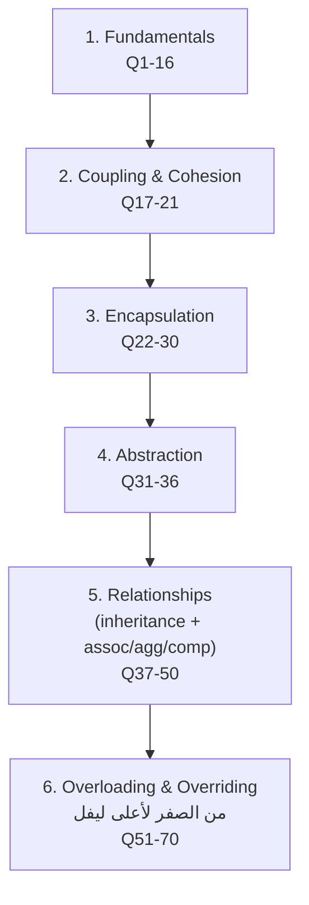

---

# القسم 1 — Fundamentals (Q1–16)

### 1. إيه هي الـ OOP؟
أسلوب برمجة بننمذج بيه حاجات العالم الحقيقي في صورة **objects**، كل object بيجمّع الـ **state** (البيانات) والـ **behavior** (السلوك اللي بيشتغل عليها) في وحدة واحدة بتحمي نفسها.
↳ الفخ: "كلاسات وكائنات" إجابة junior. الكلمة المفتاح: *نجمّع الـ state والـ behavior في وحدة تحمي بياناتها*.

### 2. إيه الفرق بين الـ class والـ object؟
الـ class = الـ blueprint/القالب. الـ object = نسخة فعلية في الميموري وليها قيم حقيقية.
```java
class Car { String color; }        // blueprint
Car c = new Car();                 // object: real instance in memory
```
↳ follow-up: "class من غير object؟" → أيوة (utility class بـ static members)، والعكس لأ.

### 3. OOP ظهرت ليه؟
عشان مشاكل الـ procedural code لما المشاريع كبرت: data مكشوفة لأي كود، آثار جانبية غير متوقعة، spaghetti، صعوبة إعادة استخدام وصيانة.
↳ اربطها بتجربتك: "لما احتجت أضيف نوع جديد، الـ polymorphism خلّاني أضيفه من غير ما ألمس القديم."

### 4. إيه الفرق بين OOP والـ Procedural؟
Procedural = data + functions منفصلين، تدفّق top-down. OOP = data + behavior متجمّعين في objects بتتفاعل برسايل.
↳ الفخ: OOP مش دايماً الأحسن — للـ data pipelines البسيطة الـ functional أنضف.

### 5. الـ OOP دايماً الأحسن؟
لأ. بتلمع لما عندك كيانات ليها هوية وحالة وسلوك بيتغيّر. للتحويلات الـ stateless البسيطة، الـ functional أوضح وأقل boilerplate.
↳ الإجابة دي بتبيّن نضج — مش كل حاجة مطرقة OOP.

### 6. يعني إيه إن object عنده "هوية" (identity)؟
حتى لو objectين ليهم نفس القيم، هما مختلفين في الـ identity (الـ reference/المكان في الميموري).
```java
Point a = new Point(1, 1);
Point b = new Point(1, 1);
System.out.println(a == b);        // false: different identity
System.out.println(a.equals(b));   // true if equals overridden: same value
```
↳ مدخل لسؤال `equals` vs `==`.

### 7. إيه الفرق بين `==` و `equals()`؟
`==` بيقارن الـ references (نفس الـ object؟). `equals()` بيقارن القيمة (لو معمولها override).
```java
String x = new String("hi");
String y = new String("hi");
System.out.println(x == y);        // false: different objects
System.out.println(x.equals(y));   // true: same value
```
↳ المفهوم العام: `==` للهوية و`equals` للقيمة — ده في أي لغة OOP.
> 📌 **Java-specific:** الـ String pool بيخلّي الـ literals `"hi" == "hi"` تطلع true — ده تفصيلة Java مش قاعدة عامة.

### 8. instance variable vs static variable؟
instance = نسخة لكل object. static = نسخة واحدة مشتركة بتنتمي للكلاس نفسه.
```java
class InvoiceCounter {
    static int issuedCount = 0;     // shared across all instances
    final int serialNumber;
    InvoiceCounter() { serialNumber = ++issuedCount; } // uses the shared counter
}
```
↳ follow-up: "static method يوصل لـ instance variable؟" → لأ، مفيش `this`.

### 9. يعني إيه constructor؟ وإيه اللي بيحصل لو مكتبتهوش؟
method بتهيّئ الـ state وقت الإنشاء. لو مكتبتش أي constructor بتاخد default فاضي. أول ما تكتب واحد بـ params، الـ default بيختفي.
```java
class User {
    final String name;
    User(String name) { this.name = name; }  // no-arg default is now gone
}
new User();                        // compile error
```
↳ الفخ: كتير بينسوا إن الـ default بيختفي.

### 10. إيه الـ `this` keyword؟ وامتى محتاجه فعلاً؟
بيشاور على الـ object الحالي. محتاجه بالذات لما اسم الـ parameter بيتعارض مع اسم الـ field.
```java
class Account {
    private double balance;
    void deposit(double balance) {
        this.balance += balance;   // this.balance = field, balance = parameter
    }
}
```
↳ follow-up: "فيه استخدام تاني للـ this؟" → أيوة، `this(...)` لاستدعاء constructor تاني.

### 11. إيه الـ `this()` constructor chaining؟
استدعاء constructor من constructor تاني في نفس الكلاس لتجنّب تكرار الكود. لازم يكون أول سطر.
```java
class Rectangle {
    Rectangle() { this(1, 1); }            // delegates to the other constructor
    Rectangle(int w, int h) { /* real init */ }
}
```
↳ الفخ: `this()` (نفس الكلاس) غير `super()` (الأب). ومينفعش تجمع الاتنين في نفس الـ constructor.

### 12. إيه الـ methods اللي كل object بيرثها من `Object`؟
كل كلاس في Java بيرث من `Object` ضمنياً، فبياخد: `toString()`, `equals()`, `hashCode()`, `getClass()`, `clone()`, `wait/notify`.
```java
class Product {
    @Override public String toString() { return "Product{...}"; } // override the default
}
```
↳ follow-up: "الـ default بتاع `toString`؟" → بيرجّع `ClassName@hashcodeHex`، اللي نادراً بيكون مفيد.

### 13. إيه الـ static block والـ instance initializer؟ وإيه ترتيب التنفيذ؟
> 📌 **Java-specific** — المفهوم العام (تهيئة الـ class مرة والـ object كل مرة) موجود في لغات تانية، بس الـ syntax والترتيب ده بتاع Java.

static block بيتنفّذ مرة واحدة أول ما الكلاس يتحمّل. instance initializer بيتنفّذ مع كل object قبل الـ constructor.
```java
class Config {
    static { System.out.println("1: static block (once)"); }
    { System.out.println("2: instance init (each object)"); }
    Config() { System.out.println("3: constructor"); }
}
```
↳ الترتيب: **static block** (مرة) → **instance init** → **constructor**. ومع الوراثة: static الأب → static الابن → instance+constructor الأب → instance+constructor الابن.

### 14. إيه أنواع الـ nested classes في Java؟
> 📌 **Java-specific** — فكرة الكلاسات المتداخلة موجودة عامةً، بس التقسيم الرباعي ده وتفاصيله بتاعة Java.

أربعة: **static nested** (مش محتاجة outer instance)، **inner** (محتاجة outer instance)، **local** (جوه method)، **anonymous** (بلا اسم، لتنفيذ interface على السريع).
```java
class Outer {
    static class StaticNested {}   // independent of Outer instance
    class Inner {}                 // tied to an Outer instance
}
```
↳ follow-up: "امتى static nested vs inner؟" → static لو مش محتاج توصل لـ instance members بتاعة الـ outer.

### 15. الـ inner class بتوصل لأعضاء الـ outer الخاصة؟
> 📌 **Java-specific** — سلوك الـ inner class والـ implicit reference ده تفصيلة Java.

أيوة — الـ inner class عندها reference ضمني للـ outer instance، فبتوصل حتى للـ private members بتاعته.
```java
class OrderForm {
    private double total;
    class SubmitButton {
        void click() { System.out.println(total); } // accesses outer's private field
    }
}
```
↳ الفخ: ده بيخلّي الـ inner class تمسك الـ outer في الميموري (سبب memory leaks شائع).

### 16. ليه الـ static method مبتوصلش لـ instance variables؟
لأنها بتنتمي للكلاس مش لأي object، فمفيش `this` تشاور بيه على object معيّن.
```java
class Calculator {
    int value;
    static int square(int x) {
        // return value * value; // compile error: no instance context
        return x * x;
    }
}
```
↳ القاعدة: static = مستوى الكلاس، instance = مستوى الـ object.

---

# القسم 2 — Coupling & Cohesion (Q17–21)

### 17. إيه الـ Coupling؟
درجة اعتماد module على module تاني. **Loose coupling** (اعتماد قليل) = مرونة وسهولة تغيير. **Tight coupling** = تغيير في واحد بيكسر التاني.
↳ الهدف دايماً: **loose coupling**.

### 18. إيه الـ Cohesion؟
درجة ترابط مسؤوليات الـ module الواحد مع بعضها. **High cohesion** = الكلاس بيعمل حاجة واحدة مترابطة. **Low cohesion** = بيعمل حاجات مالهاش علاقة ببعض.
↳ الهدف دايماً: **high cohesion**.

### 19. القاعدة الذهبية للتصميم الجيد؟
**High cohesion + Low coupling**. كل module متماسك جواه ومستقل عن غيره قدر الإمكان. ده اللي بيخلّي الكود قابل للتغيير والاختبار.
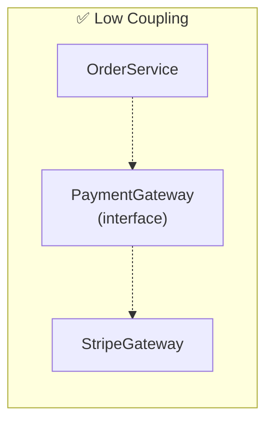
↳ الجملة: "high cohesion جوه الكلاس، low coupling بين الكلاسات."

### 20. إيه أنواع الـ Coupling (من الأسوأ للأحسن)؟
من الأسوأ: **content** (module بيعدّل جوه التاني) → **common** (global state مشترك) → **control** (بيتحكم في تدفّق التاني) → **data** (بيمرّر data بس) → الأحسن: **loose عبر interfaces**.
↳ في الإنترفيو يكفي تقول: "بحاول أوصل لـ data coupling أو أقل، عبر abstractions."

### 21. إزاي بتقلّل الـ Coupling عملياً؟
بالاعتماد على **interfaces مش implementations** (Dependency Inversion)، والـ **Dependency Injection**، وتجنّب الـ global state.
```java
class OrderService {
    private final PaymentGateway gateway;                 // depends on abstraction
    OrderService(PaymentGateway gateway) { this.gateway = gateway; } // injected, not created
}
```
↳ ده بيربط الـ coupling بـ SOLID (D) وبالـ DI في NestJS/Spring.

---

# القسم 3 — Encapsulation (Q22–30)

### 22. إيه الـ Encapsulation؟
تغليف الـ state بـ `private` والتحكم في الوصول عبر methods. الـ object بيحمي بياناته بنفسه.
```java
class BankAccount {
    private double balance;                 // hidden
    public double getBalance() { return balance; }
}
```
↳ الكلمة المفتاح: *data hiding + controlled access*.

### 23. الـ Encapsulation بيفيد في إيه؟
بيحمي الـ **invariants** (شروط الصحة)، وبيسهّل تغيير التنفيذ الداخلي من غير ما تكسر المستخدمين، وبيمنع الـ state تدخل حالة غلط.
↳ مثال: الرصيد ميبقاش سالب لأن كل تعديل بيمرّ بشرط.

### 24. الـ getters/setters مش بيكسروا الـ Encapsulation؟
لو الـ setter بيحط القيمة على طول من غير منطق، فعلاً بقى field public بخطوة زيادة. الـ encapsulation الحقيقي إن الـ method تحمي الـ invariant.
```java
public void withdraw(double amount) {
    if (amount > balance) throw new IllegalStateException("insufficient funds"); // early return / guard
    balance -= amount;
}
```
↳ follow-up: "الأحسن إيه؟" → methods ذات معنى (`withdraw()` بدل `setBalance()`) + immutability.

### 25. يعني إيه Immutable object؟
object مبيتغيّرش بعد إنشائه: كل الـ fields `final` ومفيش setters. أي "تعديل" بيرجّع object جديد.
```java
final class Money {
    private final double amount;
    Money(double amount) { this.amount = amount; }
    Money plus(double x) { return new Money(this.amount + x); } // returns a new object
}
```
↳ فايدته: thread-safe بطبيعته، آمن للمشاركة، سهل التفكير فيه.

### 26. ليه الـ `String` immutable في Java؟
للأمان (بتتستخدم في الـ file paths والـ network والـ class loading)، وعشان الـ String pool يشتغل (مشاركة الـ literals)، وعشان الـ hashCode يتـ cache بأمان، وللـ thread-safety.
↳ الفخ: عشان كده أي "تعديل" على String بيعمل object جديد — سبب مشاكل الأداء في الـ concatenation داخل loops (استخدم `StringBuilder`).

### 27. إيه الـ Defensive Copying؟ وليه محتاجه؟
لما الـ object بيرجّع أو بياخد mutable object، بينسخه بدل ما يشارك الـ reference — عشان محدش من بره يعدّل حالته الداخلية.
```java
final class Schedule {
    private final List<String> slots;
    Schedule(List<String> slots) {
        this.slots = new ArrayList<>(slots);        // copy on the way in
    }
    List<String> getSlots() {
        return new ArrayList<>(slots);              // copy on the way out
    }
}
```
↳ من غير النسخ، حد بره يقدر يعدّل الـ `slots` ويكسر الـ immutability.

### 28. الفرق بين `final` field و `private` field؟
`private` = **مين يوصل** (visibility). `final` = **هل القيمة تتغيّر** (mutability). مختلفين وممكن يجتمعوا.
↳ الفخ: `private` مبيمنعش التعديل من جوه الكلاس، `final` بيمنعه من أي مكان.

### 29. إيه الـ access modifiers من الأوسع للأضيق؟
`public` (أي حد) → `protected` (نفس الـ package + الأبناء) → package-private (نفس الـ package، وده اللي بتاخده لو مكتبتش modifier) → `private` (نفس الكلاس بس).
↳ الفخ: مفيش كلمة اسمها `default` تكتبها — الغياب نفسه هو package-private.

### 30. الفرق بين `protected` و package-private؟
`protected` بيوصله أبناء الكلاس **حتى في package تاني**. package-private بيوصله بس اللي في نفس الـ package (مش الأبناء بره).
↳ فخ دقيق: `protected` = package + subclasses، package-private = package بس.

---

# القسم 4 — Abstraction (Q31–36)

### 31. إيه الـ Abstraction؟
إخفاء التعقيد وكشف واجهة بسيطة. بتركّز على "إيه" مش "إزاي". أدواته: `abstract class` و `interface`.
```java
interface PaymentGateway { void charge(double amount); } // "what", not "how"
```
↳ التشبيه: عجلة القيادة — بتلفّها، مش محتاج تعرف اللي تحت.

### 32. إيه الفرق بين Abstraction و Encapsulation؟ *(بيتسأل كتير جداً)*
Encapsulation بيخبّي **البيانات** (data hiding — إزاي محفوظة). Abstraction بيخبّي **التعقيد** (design level — إزاي الشغل بيتم).
| | Encapsulation | Abstraction |
|---|---|---|
| بيخبّي | data / implementation | complexity / details |
| السؤال | إزاي أحمي الـ state؟ | إزاي أبسّط الاستخدام؟ |
| الأداة | private, getters/setters | abstract class, interface |
| المستوى | implementation | design |
↳ الجملة: *"Encapsulation بيخبّي إزاي البيانات محفوظة، Abstraction بيخبّي إزاي الشغل بيتم."*

### 33. يعني إيه abstract method؟ وممكن تعمل instance من abstract class؟
abstract method = تعريف بلا body، لازم الأبناء يعملوله override. الكلاس اللي فيه abstract method لازم يكون `abstract`، ومينفعش تعمله `new`.
```java
abstract class Shape {
    abstract double area();        // subclasses must implement
}
// new Shape();                    // compile error: abstract can't be instantiated
```
↳ follow-up: "abstract class فيه constructor؟" → أيوة، بيتنادى من الأبناء عبر `super()`.

### 34. يعني إيه Leaky Abstraction؟
لما التجريد بيفشل في إخفاء التفاصيل وبتضطر تعرف اللي تحت. مثال: ORM بيخبّي الـ SQL لكن لازم تفهم الـ N+1 problem عشان تكتب كود كفء.
↳ المقولة: "All non-trivial abstractions, to some degree, are leaky."

### 35. الـ Abstraction بيفيد في إيه عملياً؟
بيخلّي الكود يعتمد على الفكرة مش التنفيذ، فتبدّل التنفيذ من غير ما تلمس المستخدمين. أساس الـ testability (تحقن mock).
```java
void checkout(PaymentGateway gateway, double total) { gateway.charge(total); } // depends on abstraction
// pass StripeGateway in prod, MockGateway in tests
```
↳ ده مدخل مباشر لـ Dependency Inversion.

### 36. abstract class ولا interface من زاوية الـ abstraction؟
abstract class = تجريد جزئي (كود مشترك + state). interface = تجريد كامل (عقد بس).
↳ التفصيل الكامل جاي في المرحلة 2؛ دي النقطة من زاوية التجريد بس.

---

# القسم 5 — Relationships: Inheritance + Association / Aggregation / Composition (Q37–50)

### 37. إيه الـ Inheritance؟
الابن بيرث state وbehavior من الأب، ويضيف أو يعدّل. بتمثّل علاقة **is-a**.
```java
class Animal { void eat() {} }
class Dog extends Animal { void bark() {} } // Dog is-a Animal + adds bark
```
↳ الفخ: استخدمها لو "is-a" حقيقي، مش لمجرد إعادة استخدام كود.

### 38. إيه الـ `super`؟
بيوصل للأب: ينادي الـ constructor بتاعه (`super(...)`) أو method عملتلها override (`super.method()`).
```java
class SavingsAccount extends Account {
    SavingsAccount(double initial) { super(initial); } // calls parent constructor first
}
```
↳ الفخ: لو الأب مفهوش no-arg constructor، لازم تنادي `super(...)` صراحةً.

### 39. الـ constructor بيتورّث؟
لأ. الـ constructors مبتتورّثش، بس الابن لازم ينادي واحد من بتوع الأب عبر `super()`.
↳ فخ شائع: الناس بتفتكر الـ constructor بيتورّث زي الـ methods.

### 40. الـ Inheritance فايدته وخطره؟
فايدته: إعادة استخدام + polymorphism. خطره: **tight coupling** بين الأب والابن، والـ **deep chains** هشّة وصعبة الصيانة.
↳ القاعدة: **Favor composition over inheritance**.

### 41. إيه الـ Composition؟ وإيه الفرق بينه وبين Inheritance؟
Composition = الـ object بيحتوي objects تانية (**has-a**) بدل ما يرث. أمرن لأنه بيتحدد runtime وبيفكّ الترابط.
```java
class Car {
    private final Engine engine;   // has-a, not is-a
    Car(Engine engine) { this.engine = engine; }
    void start() { engine.start(); }
}
```
↳ الجملة: "is-a → وراثة، has-a → composition، ولو شكّيت اختار composition."

### 42. ليه "Favor composition over inheritance"؟
لأن الوراثة بتربطك بالأب للأبد وبتكشف تفاصيله للابن (fragile base class). الـ composition بتديك مرونة تبدّل الأجزاء وتختبرها لوحدها.
↳ follow-up: "امتى وراثة تبقى الصح؟" → is-a حقيقي + سلوك مشترك متماسك.

### 43. إيه الـ diamond problem؟ وليه Java منعت multiple inheritance للكلاسات؟
لو `D` بترث من `B` و`C` واللي عملوا override مختلف لـ method من `A` — مين النسخة اللي تتنفّذ؟ ده الـ diamond. Java منعت وراثة أكتر من class لتجنّبه، بس سمحت بـ multiple interfaces.
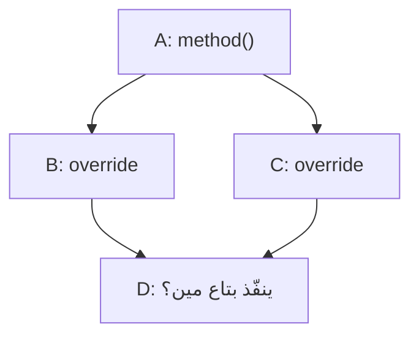
↳ follow-up: "الـ default methods رجّعت المشكلة؟" → أيوة جزئياً.

### 44. إزاي Java بتحل تعارض الـ default methods؟
لو interfaceين فيهم default method بنفس الاسم، الكلاس **لازم** يعمل override ويحسم، ويقدر ينادي نسخة معيّنة بـ `Interface.super.method()`.
```java
class Duck implements Swimmer, Diver {
    public void move() { Swimmer.super.move(); } // explicitly resolve the conflict
}
```
↳ ده بيبيّن إنك فاهم إن الـ default methods رجّعت شبح الـ diamond.

### 45. إيه الـ Fragile Base Class problem؟
تعديل بسيط في الأب ممكن يكسر الأبناء من غير قصد، لأنهم معتمدين على تفاصيل تنفيذه الداخلية.
↳ ده أقوى حجة لصالح الـ composition.

### 46. إيه الـ Association؟
أضعف علاقة: مجرد إن object بيعرف/بيستخدم object تاني، من غير ملكية. الاتنين بيعيشوا مستقلين.
```java
class Teacher { void teach(Student s) {} } // Teacher uses Student, but owns neither
class Student {}
```
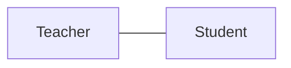
↳ التشبيه: المدرّس والطالب — علاقة، بس محدش "بيملك" التاني.

### 47. إيه الـ Aggregation؟
has-a بملكية **ضعيفة**: الكل بيحتوي الأجزاء، بس الأجزاء ممكن تعيش لوحدها لو الكل اتفكّ.
```java
class Team {
    private final List<Player> players;         // Team has Players
    Team(List<Player> players) { this.players = players; } // players exist independently
}
```
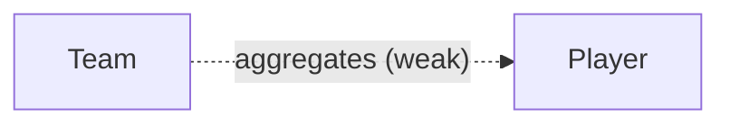
↳ التشبيه: الفريق واللاعيبة — لو الفريق اتحل، اللاعيبة موجودين ويلعبوا في فرق تانية.

### 48. إيه الـ Composition (كعلاقة)؟
has-a بملكية **قوية**: الأجزاء بتتخلق وتموت مع الكل. لو الكل راح، الأجزاء تراح.
```java
class House {
    private final List<Room> rooms = new ArrayList<>();
    House() { rooms.add(new Room()); }          // rooms are created and owned by the house
}
```
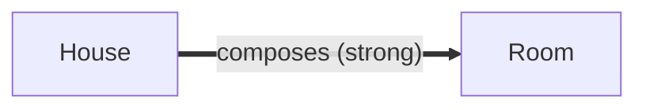
↳ التشبيه: البيت والأوض — لو البيت اتهدّ، الأوض راحت. مالهاش وجود مستقل.

### 49. الفرق بين Association و Aggregation و Composition في جدول؟
| | Association | Aggregation | Composition |
|---|---|---|---|
| الملكية | مفيش | ضعيفة (has-a) | قوية (owns) |
| دورة الحياة | مستقلة | الجزء يعيش لوحده | الجزء يموت مع الكل |
| المثال | مدرّس↔طالب | فريق◇لاعيبة | بيت◆أوض |
| الرمز (UML) | خط عادي | معيّن فاضي ◇ | معيّن مصمّت ◆ |
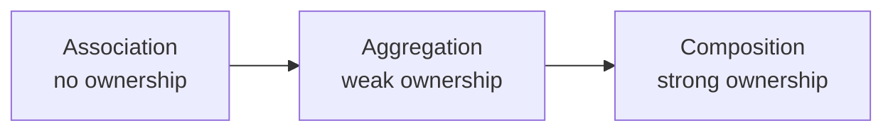
↳ الفخ: كلمة "composition" ليها معنيين — المبدأ (has-a عام) والعلاقة القوية دي. السياق بيحدد.

### 50. مثال حقيقي على "composition over inheritance": ليه `Stack extends Vector` غلطة؟
في Java، `Stack` ورث من `Vector`، فورث معاه methods زي `add(index, element)` و `get(index)` اللي بتكسر مبدأ الـ Stack (LIFO). دلوقتي تقدر تدخل عنصر في النص — ده كسر للـ abstraction.
```java
Stack<Integer> stack = new Stack<>();
stack.push(1);
stack.add(0, 99);                  // inherited from Vector — violates LIFO! leaky design
```
↳ الحل الصح كان **composition**: الـ `Stack` يحتوي `Vector` جواه ويكشف بس `push/pop`. ده اللي عمله `ArrayDeque` بعد كده. مثال حي على خطر الوراثة الغلط.

---

# القسم 6 — Overloading & Overriding: من الصفر لأعلى ليفل (Q51–70)

## 🟢 المستوى السهل

### 51. إيه الـ Overloading؟
نفس اسم الـ method بـ **parameters مختلفة** (عدد أو نوع أو ترتيب)، وبيتحدد وقت الـ **compile**.
```java
class InvoicePrinter {
    void print(String text) {}
    void print(String text, int copies) {}   // different count
    void print(byte[] raw) {}                 // different type
}
```
↳ الفخ: التغيير في الـ params بس — مش الاسم ولا الـ return type.

### 52. إيه الـ Overriding؟
الابن بيعيد تعريف method من الأب **بنفس الـ signature بالظبط**، فيتغيّر السلوك، وبيتحدد وقت الـ **runtime**.
```java
class Notification { void send() { System.out.println("generic"); } }
class EmailNotification extends Notification {
    @Override void send() { System.out.println("email"); } // same signature, new behavior
}
```
↳ استخدم `@Override` دايماً.

### 53. الفرق بين Overloading و Overriding في جدول؟
| | Overriding | Overloading |
|---|---|---|
| العلاقة | parent ↔ child | نفس الكلاس عادةً |
| الـ signature | نفسه بالظبط | مختلف (params) |
| يتحدد امتى | runtime | compile-time |
| النوع | runtime polymorphism | compile-time polymorphism |
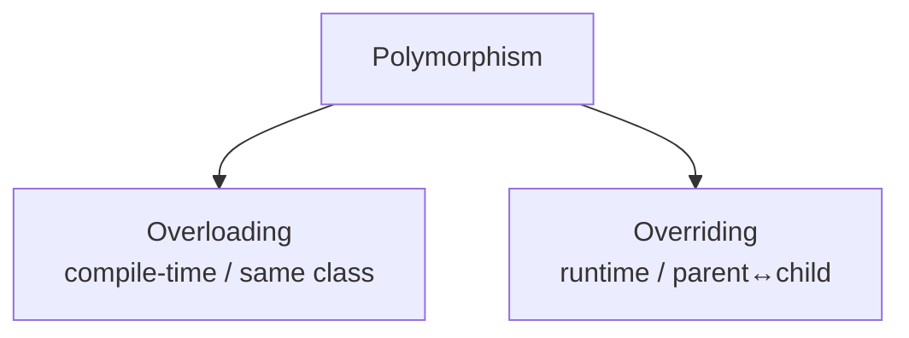
↳ احفظه نايم — من أشهر أسئلة OOP.

## 🟡 المستوى المتوسط — قواعد الـ Overriding

### 54. إيه قواعد الـ access modifier في الـ Overriding؟
الابن ينفع يوسّع الـ access بس **مايضيّقهوش**. method `protected` في الأب تنفع تبقى `public` في الابن، لكن مش `private`.
```java
class Base { protected void run() {} }
class Derived extends Base {
    @Override public void run() {}    // widening allowed
    // @Override private void run() {} // compile error: can't narrow access
}
```
↳ السبب: عشان Liskov — الابن لازم يقدر يحل محل الأب في أي مكان.

### 55. إيه قواعد الـ exceptions في الـ Overriding؟
الـ method اللي بتعمل override تقدر ترمي checked exceptions **أقل أو أضيق**، مش أوسع. الـ unchecked (RuntimeException) مالهاش قيود.
```java
class Reader { void read() throws IOException {} }
class FileReader2 extends Reader {
    @Override void read() throws FileNotFoundException {} // narrower checked exception: OK
    // throws Exception -> compile error (broader)
}
```
↳ برضه بسبب Liskov — الابن ميفاجئش المستخدم بـ exception أوسع.

### 56. إيه قواعد الـ return type في الـ Overriding؟
لازم نفس النوع **أو نوع أضيق** (subtype) — ده اسمه **covariant return type**.
```java
class AnimalShelter { Animal adopt() { return new Animal(); } }
class DogShelter extends AnimalShelter {
    @Override Dog adopt() { return new Dog(); } // Dog is a subtype of Animal — allowed
}
```
↳ ده استثناء ذكي: الـ return type مش جزء من الـ signature، لكنه مقيّد بالـ covariance في الوراثة.

### 57. هل الـ return type بيأثر على الـ signature (في الـ Overloading)؟
لأ. الـ signature = الاسم + عدد وأنواع الـ params بس. مينفعش overload بالـ return type لوحده.
```java
int getCount()    { return 1; }
String getCount() { return "x"; } // compile error: same signature
```
↳ اربطها بسؤال 56: في الـ overriding فيه covariant return، لكن في الـ overloading الـ return type مبيميّزش.

### 58. ليه `@Override` annotation مهمة؟
بتخلّي الكومبايلر يتأكد إنك فعلاً بتعمل override لـ method موجودة. لو غلطت في التوقيع (فعملت overload بالغلط)، بيدّيك error بدل ما يعدّي صامت.
```java
class Base { void process() {} }
class Child extends Base {
    @Override void proccess() {}   // typo -> compile error thanks to @Override
}
```
↳ من غيرها، الغلطة دي كانت هتبقى overload صامت وباج مخفي.

### 59. الـ static method بتتعمل override؟
لأ — بتتعمل **hiding**. الـ static بتنتمي للكلاس، فبتتحدد وقت الـ compile بالنوع المكتوب.
```java
class Base { static void info() { System.out.println("Base"); } }
class Child extends Base { static void info() { System.out.println("Child"); } }
Base ref = new Child();
ref.info();                        // "Base": type decides, not the object
```
↳ القاعدة: static → hiding (compile-time)، instance → overriding (runtime).

### 60. الـ private method بتتعمل override؟
لأ. الـ private مش مرئية للابن أصلاً، فلو عمل method بنفس الاسم دي method جديدة مستقلة مش override.
```java
class Base { private void secret() {} }
class Child extends Base { private void secret() {} } // new independent method, not override
```
↳ الفخ: تحط `@Override` هنا → compile error، دليل إنها مش override.

### 61. الـ final method بتتعمل override؟
لأ — الـ `final` بيمنع الـ overriding تماماً.
```java
class SecurityCheck {
    final void validate() { /* must not be overridden */ }
}
```
↳ بنستخدمه لحماية منطق حسّاس من إن حد يكسره.

## 🟠 المستوى الصعب

### 62. إيه الفرق بين Overriding و Hiding و Shadowing؟
- **Overriding**: instance methods — runtime، بالنوع الفعلي.
- **Hiding**: static methods / fields — compile-time، بالنوع المكتوب.
- **Shadowing**: متغيّر محلي بيخفي field بنفس الاسم في الـ scope.
```java
class Wallet {
    int balance = 100;
    void show() {
        int balance = 5;           // local shadows the field
        System.out.println(balance);       // 5 (local)
        System.out.println(this.balance);  // 100 (field)
    }
}
```
↳ التلاتة بيتلخبطوا مع بعض — الفرق في **إيه** بيتخفي و**امتى** بيتحدد.

### 63. الـ fields بتخضع للـ polymorphism؟
لأ — الـ fields بتتحدد بالنوع **المكتوب** (field hiding)، مش النوع الفعلي. الـ polymorphism للـ methods بس.
```java
class Base { String label = "base"; }
class Child extends Base { String label = "child"; }
Base ref = new Child();
System.out.println(ref.label);     // "base": fields are NOT polymorphic
System.out.println(ref.getLabel()); // would be "child" if getLabel() is overridden
```
↳ من أخبث فخاخ Java.

> 📌 **Java-specific — الأسئلة 64 لحد 67** (autoboxing / varargs / null / ترتيب الـ resolution) خاصة بقواعد Java للـ overload resolution. المفهوم العام (الكومبايلر بيختار الأنسب وقت الـ compile) بيتنقل، بس التفاصيل دي بتاعة Java. تجاهلها لو الإنترفيو مش Java.

### 64. الـ Overloading مع الـ Autoboxing — إيه اللي بيتنادى؟
الكومبايلر بيفضّل التطابق المباشر على الـ autoboxing. الـ boxing بيتعمل بس لو مفيش تطابق مباشر.
```java
void handle(int x)     { System.out.println("primitive"); }
void handle(Integer x) { System.out.println("boxed"); }
handle(5);                         // "primitive": exact match beats boxing
```
↳ الترتيب: widening → boxing → varargs.

### 65. الـ Overloading مع الـ Varargs — إيه أولويته؟
الـ varargs عنده **أقل أولوية**. لو فيه method تانية بتطابق من غير varargs، بتتنادى الأول.
```java
void log(String a, String b)      { System.out.println("two args"); }
void log(String... args)          { System.out.println("varargs"); }
log("x", "y");                     // "two args": fixed-arity beats varargs
```
↳ الفخ: الـ varargs "ملاذ أخير" للـ compiler.

### 66. الـ Overloading مع `null` — ليه بيبقى غامض أحياناً؟
لو `null` يطابق أكتر من overload، الكومبايلر بيختار **الأضيق نوعاً**. لو فيه نوعين متساويين في الضيق (مالهمش علاقة وراثة)، بيبقى ambiguous ويدّي error.
```java
void save(String s)       { System.out.println("String"); }
void save(StringBuilder b){ System.out.println("StringBuilder"); }
save(null);                        // compile error: ambiguous — both equally specific
```
↳ الحل: cast صريح `save((String) null)`.

### 67. إزاي الكومبايلر بيختار الـ overload المناسب؟ (ترتيب الـ resolution)
ثلاث مراحل بالترتيب: (1) **تطابق مباشر / widening** للـ primitives من غير boxing، (2) لو فشل، **boxing/unboxing**، (3) لو فشل، **varargs**. وبيختار الأضيق (most specific) في كل مرحلة.
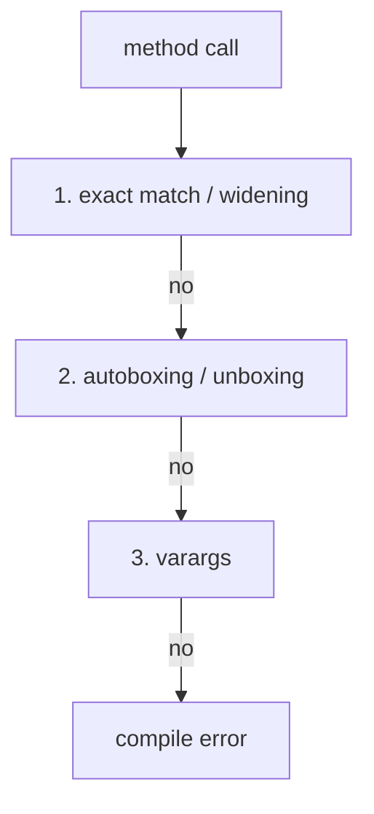
↳ ده بيفسّر أسئلة 64-66 كلها بقاعدة واحدة.

## 🔴 أعلى ليفل

### 68. الفخ الخطير: ليه مينفعش تنادي overridable method جوه الـ constructor؟
لأن وقت بناء الأب، الابن لسه **متبناش** (fields بتاعته لسه null/default). لو الأب نادى method معمولها override في الابن، هتشتغل نسخة الابن على object نص مبني.
```java
class Base {
    Base() { init(); }             // calls overridable method during construction
    void init() {}
}
class Child extends Base {
    private String name = "ready";
    @Override void init() { System.out.println(name); } // prints null! field not set yet
}
new Child();                       // output: null
```
↳ القاعدة: في الـ constructor نادِ بس methods `private` أو `final` أو `static`. ده من أخطر فخاخ الوراثة.

### 69. إيه الـ Upcasting؟
تحويل reference من نوع الابن لنوع الأب — **آمن دايماً** وضمني.
```java
Dog dog = new Dog();
Animal animal = dog;               // upcasting: always safe, implicit
animal.eat();                      // OK; but animal.bark() won't compile
```
↳ الـ upcasting هو اللي بيمكّن الـ polymorphism (تتعامل مع الأب، ينفّذ الابن).

### 70. إيه الـ Downcasting؟ وإمتى بيرمي `ClassCastException`؟
تحويل من الأب للابن — **مش آمن**، محتاج cast صريح، وبيرمي `ClassCastException` لو الـ object مش فعلاً من نوع الابن. اتأكد بـ `instanceof` الأول.
```java
Animal animal = new Cat();
if (animal instanceof Dog dog) {   // pattern matching (Java 16+): safe check + cast
    dog.bark();
}
Dog wrong = (Dog) animal;          // ClassCastException at runtime: it's a Cat!
```
↳ القاعدة: `instanceof` قبل أي downcast. الحاجة لـ downcast كتير = ريحة تصميم غلط (polymorphism ضايع).

---

## ✅ Checkpoint — المرحلة 1

1. High cohesion + low coupling — يعني إيه وإزاي أحققهم
2. `this` vs `this()` vs `super()`
3. ترتيب تنفيذ static block / instance init / constructor
4. Association vs Aggregation vs Composition (بالكود والملكية)
5. ليه `Stack extends Vector` غلطة
6. قواعد الـ overriding التلاتة (access / exceptions / covariant return)
7. return type مش signature (overload) لكن covariant (override)
8. Overriding vs Hiding vs Shadowing
9. fields مش polymorphic
10. ترتيب الـ overload resolution (widening → boxing → varargs) — 📌 Java-specific
11. الفخ: overridable method جوه constructor
12. Upcasting (آمن) vs Downcasting (+ instanceof)

> **ملحوظة:** البنود المعلّمة 📌 والأسئلة (7 جزئياً، 13، 14، 15، 64–67) خاصة بـ Java. لو إنترفيوك عام ركّز على الباقي؛ لو Java-heavy ذاكرها كلها.

---

# تراك 1 — OOP: المرحلة 2 (الأقسام 7–14)

## 🗺️ خريطة المرحلة 2

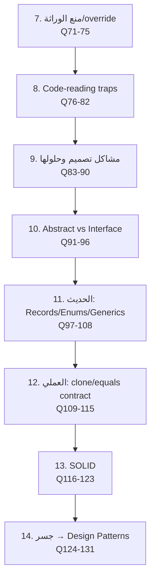

---

# القسم 7 — منع الوراثة والـ Override (Q71–75)

### 71. إزاي أمنع كلاس من الوراثة كلياً؟
اعمله `final class` — محدش يقدر يـ extend منه.
```java
final class TransactionId { }      // no subclassing allowed
```
↳ مثال حي: `String` و `Integer` كلهم `final` للأمان والـ immutability.

### 72. إيه الـ Sealed Classes؟
تحكّم **دقيق** في مين يقدر يرث: بتحدد بالظبط الأنواع المسموح لها بالوراثة، لا أكتر.
```java
sealed interface Shape permits Circle, Square { }  // only these two may implement
final class Circle implements Shape { }
final class Square implements Shape { }
```
> 📌 **Java-specific:** الـ `sealed`/`permits` syntax ده بتاع Java 17+. المفهوم (hierarchy مقفول) موجود في لغات تانية بأشكال مختلفة.

↳ الفايدة الكبيرة: بيمكّن الـ **exhaustive pattern matching** — الكومبايلر عارف كل الأنواع فبيتأكد إنك غطّيتهم.

### 73. إزاي أمنع الإنشاء المباشر وأتحكم فيه؟
**private constructor + static factory method** — بتخبّي `new` وتتحكم في الإنشاء.
```java
class DatabaseConnection {
    private DatabaseConnection() { }               // no direct instantiation
    static DatabaseConnection create() { return new DatabaseConnection(); } // controlled
}
```
↳ ده أساس الـ Singleton والـ Factory patterns.

### 74. القاعدة الشهيرة: "Design for inheritance or prohibit it" — معناها إيه؟
إما تصمّم الكلاس للوراثة بوعي (توثّق أي methods قابلة للـ override وإزاي بتتفاعل)، أو تمنع الوراثة (`final`). الوراثة **العرضية** غير المقصودة مصدر باجات.
↳ ده بيربط بالـ fragile base class — لو مش مصمّم للوراثة، اقفله.

### 75. الفرق بين `final class` و `abstract class`؟ (متضادين)
`final class` = ممنوع الوراثة تماماً. `abstract class` = **لازم** الوراثة (مينفعش تعمله instance لوحده). متضادين في الغرض.
↳ الفخ: مينفعش كلاس يكون `final abstract` — تناقض، compile error.

---

# القسم 8 — Code-reading Traps متقدمة (Q76–82)

### 76. الكود ده override ولا overload؟ (مختلط)
```java
class Repository {
    void save(Object o) {}
}
class UserRepository extends Repository {
    void save(String s) {}         // different param type
    @Override void save(Object o) {} // same signature
}
```
`save(String)` = **overload** (param مختلف). `save(Object)` = **override** (نفس التوقيع). الكلاس فيه الاتنين مع بعض.
↳ الفخ: وجود وراثة مبيخليش كل method override — التوقيع هو الفيصل.

### 77. إيه اللي هيطبع؟ (static hiding عبر instance reference)
```java
class Base { static String who() { return "Base"; } }
class Sub extends Base { static String who() { return "Sub"; } }
Base ref = new Sub();
System.out.println(ref.who());     // "Base"
```
"Base" — الـ static بيتحل بالنوع المكتوب (`Base`)، مش الـ object.
> 📌 **Java-specific:** استدعاء static عبر instance reference أصلاً ممارسة سيئة وبيحذّر منها الكومبايلر.

### 78. الفخ ده في `equals`: ليه دي مش override؟
```java
class Point {
    public boolean equals(Point other) { return true; } // wrong signature!
}
```
دي **overload** مش override — الـ `Object.equals` بتاخد `Object` مش `Point`. فالـ HashMap هيستخدم الـ default `equals` وهيتكسر.
↳ الصح: `public boolean equals(Object o)` + `@Override`. ده من أشهر باجات الـ equals.

### 79. ترتيب الـ initialization مع الوراثة — إيه اللي بيطبع؟
```java
class Base {
    Base() { System.out.println("Base ctor"); }
}
class Derived extends Base {
    Derived() { System.out.println("Derived ctor"); }
}
new Derived();
```
"Base ctor" الأول بعدين "Derived ctor" — الأب بيتبني قبل الابن دايماً (عبر `super()` الضمني).
↳ القاعدة: البناء بيمشي من فوق لتحت في الهرم.

### 80. الفخ: `Integer` caching — ليه `==` بتطلع نتايج غريبة؟
```java
Integer a = 127, b = 127;
Integer c = 128, d = 128;
System.out.println(a == b);        // true: cached (-128..127)
System.out.println(c == d);        // false: new objects
```
> 📌 **Java-specific:** Java بتـ cache الـ `Integer` من -128 لـ 127. ده تفصيلة JVM. المفهوم العام: قارن الـ objects بـ `equals` مش `==`.

### 81. الفخ: قيمة الـ field وقت البناء
```java
class Config {
    static final int LIMIT = compute();
    static int compute() { return 10; }
}
```
لو فيه اعتماد دائري بين static fields، ممكن تقرا قيمة `0`/`null` قبل التهيئة. الترتيب مهم.
↳ الدرس: تجنّب الاعتماديات الدائرية في الـ static initialization.

### 82. الفخ: الـ overriding مع الـ generics و type erasure
```java
class Box<T> { void set(T value) {} }
class StringBox extends Box<String> {
    void set(String value) {}      // looks like override, involves bridge methods
}
```
> 📌 **Java-specific:** بسبب **type erasure**، الكومبايلر بيولّد "bridge methods" عشان الـ override يشتغل مع الـ generics. تفصيلة Java عميقة.
↳ المفهوم العام: الـ generics بتضيف تعقيد على الـ method resolution.

---

# القسم 9 — مشاكل تصميم وحلولها (Q83–90)

### 83. constructor بياخد params كتير نصهم اختياري — المشكلة والحل؟
المشكلة: **constructor explosion / telescoping constructors** — نسخ كتير و`null`s غامضة. الحل: **Builder pattern**.
```java
Report report = new Report.Builder()
    .title("Q3").author("Mohamed").withCharts(true)  // readable, order-independent
    .build();
```
↳ follow-up: "Builder vs Factory؟" → Builder لبناء object معقّد خطوة خطوة، Factory لإخفاء أي نوع بيترجع.

### 84. ليه لازم `equals()` و `hashCode()` مع بعض؟
لو عملت override لـ `equals` بس، الـ HashMap/HashSet هيتكسروا: objectين "متساويين" ممكن يبقى ليهم hash مختلف فيتحطوا في buckets مختلفة.
```java
// contract: if a.equals(b) is true, then a.hashCode() == b.hashCode()
```
↳ القاعدة: equal ⇒ نفس الـ hashCode (العكس مش شرط).

### 85. ليه الـ Singleton بيتعتبر anti-pattern أحياناً؟
بيخلق global state مخفي، بيصعّب الاختبار (مينفعش تحقن mock)، وبيكسر SRP (بيدير دورة حياته + شغله). البديل: DI container بيدير النسخة الواحدة.
↳ ده بيبيّن نضج — تعرف عيوب اللي بتستخدمه.

### 86. كلاس بيعمل validation + save + email — المشكلة والحل؟
بيكسر **Single Responsibility** (تلات أسباب للتغيير). الحل: تقسيمه لكلاسات (`Validator`, `Repository`, `Mailer`) والتنسيق بينهم من بره.
```java
// smell: class OrderManager { validate(); save(); sendEmail(); }
// fix: separate OrderValidator, OrderRepository, OrderMailer
```
↳ العلامة: أكتر من "سبب للتغيير" = قسّم.

### 87. كود مليان `instanceof` + casting — ريحة إيه؟
polymorphism ضايع. بدل ما تسأل عن النوع وتتصرف، خلّي كل نوع ينفّذ method مشتركة.
```java
// smell: if (s instanceof Circle) ... else if (s instanceof Square) ...
// fix: s.area();  // let polymorphism decide
```
↳ الجملة: "كل `instanceof + cast` غالباً polymorphism ضايع."

### 88. object محتاج ينسخ نفسه بحالته — أنهي حل؟
**Prototype** (نسخ) بدل إعادة البناء من الصفر. بس انتبه للـ shallow vs deep copy.
↳ تفاصيل الـ clone في القسم 12.

### 89. الكلاس بيعمل `new` للـ dependencies بتاعته — المشكلة والحل؟
**tight coupling** + صعوبة اختبار. الحل: **Dependency Injection** — حقن الـ dependency من بره عبر الـ constructor.
```java
// smell: this.gateway = new StripeGateway();
// fix: constructor(PaymentGateway gateway) { this.gateway = gateway; }
```
↳ ده بيحقق Dependency Inversion وبيخلّي الاختبار بحقن mock ممكن.

### 90. كود بيمرّر `String`/`int` في كل حتة لتمثيل مفاهيم domain — ريحة إيه؟
**Primitive Obsession**. الحل: **Value Objects** — كلاسات صغيرة immutable بتمثّل المفهوم (`Email`, `Money`, `PhoneNumber`) وبتحمل التحقق جواها.
```java
final class Email {
    private final String value;
    Email(String value) {
        if (!value.contains("@")) throw new IllegalArgumentException("invalid email"); // validation lives here
        this.value = value;
    }
}
```
↳ الفايدة: التحقق في مكان واحد + النوع نفسه بقى بيعبّر عن المعنى.

---

# القسم 10 — Abstract Class vs Interface (Q91–96)

### 91. إيه الفرق الأساسي؟
abstract class = ممكن كود مشترك + state + single inheritance (is-a). interface = عقد/قدرة + multiple + مفيش state (can-do).
| | Abstract Class | Interface |
|---|---|---|
| كود مشترك | أيوة | default methods بس |
| state (fields) | أيوة | لأ (constants بس) |
| وراثة | single | multiple |
| السؤال | is-a | can-do |
↳ الجملة: "abstract للكلاسات القريبة اللي بتشارك كود، interface لقدرة أنواع مختلفة تنفّذها."

### 92. امتى تختار abstract class وامتى interface؟
abstract class لما فيه كود مشترك حقيقي وعلاقة is-a قوية. interface لما بتحدد قدرة (`Comparable`, `Serializable`) ممكن أنواع مالهاش علاقة تنفّذها.
↳ القاعدة العملية: ابدأ بـ interface (أمرن)، وانزل لـ abstract class لو تكرّر كود مشترك.

### 93. الـ default methods ألغت الفرق؟
قرّبت الشبه (الـ interface بقى يحمل تنفيذ)، بس الفرق الجوهري باقي: الـ interface **مبيحملش state (instance fields)**، والوراثة single vs multiple.
> 📌 **Java-specific:** الـ default methods دي feature من Java 8. لغات تانية عندها آليات مختلفة (traits/mixins).
↳ follow-up شبه مضمون بعد سؤال 91.

### 94. ليه اتضافت الـ default methods أصلاً؟
عشان تقدر تضيف methods لـ interfaces موجودة (زي `Collection`) من غير ما تكسر كل الكلاسات اللي بتنفّذها. حل مشكلة الـ backward compatibility.
> 📌 **Java-specific:** مثال: `stream()` اتضافت لـ `Collection` كـ default method.

### 95. interface يورّث interface؟ وكلاس ينفّذ أكتر من interface؟
أيوة للاتنين. interface يعمل extend لأكتر من interface، والكلاس ينفّذ عدد غير محدود.
```java
interface Swimmer {}
interface Flyer {}
class Duck implements Swimmer, Flyer {} // multiple capabilities
```
↳ ده اللي بيعوّض غياب multiple class inheritance.

### 96. إيه الـ Marker Interface؟
interface فاضية بلا methods، بتستخدم كـ "علامة" بتدّي معنى/قدرة للنوع.
> 📌 **Java-specific:** أمثلة: `Serializable`, `Cloneable`. الحديث بيفضّل الـ annotations عليها.
↳ المفهوم العام: وسم الأنواع بخاصية بيتحقق منها وقت التشغيل.

---

# القسم 11 — الحديث: Records / Enums / Generics (Q97–108)

### 97. إيه الـ Records؟
> 📌 **Java-specific** — الـ Records (Java 16+) بديل مختصر للـ immutable data classes. المفهوم العام (value/data classes) موجود في لغات كتير بأسماء مختلفة.

كلاس immutable مختصر بيولّد تلقائياً الـ constructor و`equals`/`hashCode`/`toString` والـ accessors.
```java
record Point(int x, int y) { }     // auto: constructor, equals, hashCode, toString, x(), y()
```
↳ بيوفّر عشرات السطور من الـ boilerplate.

### 98. Records vs عادي class — إيه القيود؟
> 📌 **Java-specific**

الـ record دايماً: **immutable** (fields كلها final)، **final** (مبيتورّثش)، ومبيمدّش class تاني. مناسب للـ DTOs والـ value objects.
↳ الفخ: مينفعش record يكون فيه mutable state أو يرث من class.

### 99. ممكن تضيف validation في الـ Record؟
> 📌 **Java-specific**

أيوة، عبر **compact constructor**.
```java
record Age(int value) {
    Age {                          // compact constructor
        if (value < 0) throw new IllegalArgumentException("negative age"); // validation
    }
}
```
↳ بيدّيك الاختصار + التحقق مع بعض.

### 100. الـ Enum ممكن يكون فيه methods و state؟
أيوة — في اللغات اللي بتدعم ذلك، الـ enum مش مجرد ثوابت، ده ممكن يكون object كامل بـ fields و methods.
```java
enum Planet {
    EARTH(5.976e24), MARS(6.421e23);   // each constant carries state
    private final double mass;
    Planet(double mass) { this.mass = mass; }
    double getMass() { return mass; }
}
```
↳ ده بيخلّي الـ enum يمثّل مفاهيم domain غنية، مش مجرد flags.

### 101. الـ Enum مع per-constant behavior (abstract methods)؟
كل ثابت في الـ enum يقدر يكون ليه تنفيذ مختلف لنفس الـ method — polymorphism جوه enum.
```java
enum Operation {
    PLUS  { public int apply(int a, int b) { return a + b; } },
    TIMES { public int apply(int a, int b) { return a * b; } };
    public abstract int apply(int a, int b);   // each constant implements differently
}
```
↳ بديل نظيف لـ switch على نوع العملية.

### 102. إيه الـ Generics؟ وبتفيد في إيه؟
كتابة كود يشتغل مع أنواع مختلفة مع الحفاظ على **type safety** وقت الـ compile، بدل الـ casting اليدوي.
```java
List<String> names = new ArrayList<>();
names.add("Mohamed");
String first = names.get(0);       // no cast needed, type-safe
```
↳ الفايدة: أخطاء الأنواع بتتمسك وقت الـ compile مش الـ runtime.

### 103. إيه الـ Bounded Type Parameters؟
تقييد الـ generic type لنوع معيّن أو أبناءه بـ `extends`.
```java
class NumberBox<T extends Number> {  // T must be Number or a subtype
    T value;
    double asDouble() { return value.doubleValue(); } // Number methods available
}
```
↳ بيديك تستخدم methods النوع المحدّد بأمان.

### 104. إيه الـ Wildcards `? extends` و `? super`؟
`? extends T` = النوع ده أو أي **subtype** (للقراءة). `? super T` = النوع ده أو أي **supertype** (للكتابة).
```java
List<? extends Number> readers;    // can read as Number, can't add
List<? super Integer> writers;     // can add Integer, read as Object
```
↳ رايح لقاعدة PECS.

### 105. إيه قاعدة PECS؟
**Producer Extends, Consumer Super**: لو الـ collection بتنتج قيم (بتقرا منها) استخدم `extends`، لو بتستهلك (بتضيف فيها) استخدم `super`.
```java
// copies FROM src (producer) TO dst (consumer)
<T> void copy(List<? extends T> src, List<? super T> dst) { }
```
↳ الجملة اللي تحفظها: "Producer Extends, Consumer Super."

### 106. إيه الـ Type Erasure؟
> 📌 **Java-specific**

الـ generics في Java موجودة وقت الـ compile بس؛ وقت الـ runtime النوع بيتشال (erased) لـ `Object`. عشان كده مينفعش `new T()` ولا `instanceof List<String>`.
```java
List<String> a = new ArrayList<>();
List<Integer> b = new ArrayList<>();
System.out.println(a.getClass() == b.getClass()); // true: both are just ArrayList at runtime
```
↳ ده بيفسّر كتير من قيود الـ generics في Java.

### 107. إيه الفرق بين `Comparable` و `Comparator`؟
`Comparable` = الترتيب الطبيعي للنوع نفسه (`compareTo`، بيتحط جوه الكلاس). `Comparator` = ترتيب خارجي بديل (`compare`، منفصل، تقدر تعمل كذا واحد).
```java
class Employee implements Comparable<Employee> {
    int salary;
    public int compareTo(Employee o) { return Integer.compare(this.salary, o.salary); } // natural order
}
Comparator<Employee> byName = Comparator.comparing(e -> e.name); // alternative order
```
↳ القاعدة: ترتيب واحد طبيعي → Comparable، ترتيبات متعددة/خارجية → Comparator.

### 108. الكومبو الحديث: sealed + records + pattern matching؟
> 📌 **Java-specific** (Java 21)

الثلاثة مع بعض بيدّوا "algebraic data types": hierarchy مقفول (sealed) + بيانات مختصرة (records) + تفكيك بالـ pattern matching، والكومبايلر بيتأكد إنك غطّيت كل الحالات.
```java
sealed interface Shape permits Circle, Square {}
record Circle(double r) implements Shape {}
record Square(double s) implements Shape {}
double area(Shape shape) {
    return switch (shape) {                    // exhaustive: compiler checks all cases
        case Circle c -> Math.PI * c.r() * c.r();
        case Square sq -> sq.s() * sq.s();
    };
}
```
↳ ده اتجاه Java الحديث نحو الـ functional-style modeling.

---

# القسم 12 — العملي: clone / equals contract (Q109–115)

### 109. إيه الـ equals contract (الشروط الخمسة)؟
`equals` لازم تكون: **reflexive** (`a.equals(a)`)، **symmetric** (`a.equals(b) ⟺ b.equals(a)`)، **transitive** (لو a=b و b=c يبقى a=c)، **consistent** (نفس النتيجة كل مرة)، و`a.equals(null)` دايماً false.
↳ كسر أي شرط بيكسر الـ collections اللي بتعتمد عليها.

### 110. إيه الـ hashCode contract؟
لو objectين equal لازم نفس الـ hashCode. لو مش equal، مش شرط hashCode مختلف (بس الأفضل للأداء). ونفس الـ object لازم يدّي نفس الـ hashCode طول ما مبيتغيّرش.
↳ اكتبهم مع بعض دايماً، ويفضّل من نفس الـ fields.

### 111. إيه الفرق بين Shallow و Deep copy؟
Shallow = بينسخ الـ references بس (الـ nested objects متشاركة). Deep = بينسخ كل حاجة recursively (مستقلة تماماً).
```java
// shallow: copy.list == original.list (shared!)
// deep:    copy.list is a brand new list with copied elements
```
↳ الفخ: الـ clone الافتراضي **shallow** — سبب باجات خفية.

### 112. ليه بيُنصح بتجنّب `clone()` و `Cloneable`؟
> 📌 **Java-specific**

الـ `Cloneable` interface معيبة: مفيهاش method `clone`، والـ `Object.clone` protected و shallow وبترمي checked exception. بتكسر الـ final fields.
↳ البديل المفضّل: **copy constructor** أو **static factory**.

### 113. إيه بديل الـ clone؟
**Copy constructor** أو **copy factory** — أوضح وأأمن وبيشتغل مع final fields.
```java
class Money {
    final double amount;
    Money(Money other) { this.amount = other.amount; } // copy constructor
}
```
↳ ده اللي بتفضّله الممارسات الحديثة.

### 114. إزاي تبني class immutable صح؟ (خطوات)
(1) الكلاس `final` (يمنع الوراثة). (2) كل الـ fields `private final`. (3) مفيش setters. (4) defensive copy للـ mutable fields في الـ constructor والـ getters. (5) التهيئة كاملة في الـ constructor.
```java
final class ImmutableSchedule {
    private final List<String> slots;
    ImmutableSchedule(List<String> slots) { this.slots = new ArrayList<>(slots); } // defensive copy in
    List<String> getSlots() { return new ArrayList<>(slots); }                     // defensive copy out
}
```
↳ الخمس نقط دول لازم تقولهم كلهم — نسيان أي واحدة بيكسر الـ immutability.

### 115. ليه الـ immutability مفيدة في الـ concurrency؟
الـ immutable object آمن للمشاركة بين threads بلا locks، لأن محدش يقدر يغيّر حالته. بيشيل صداع الـ synchronization.
↳ الجملة: "immutable = thread-safe مجاناً."

---

# القسم 13 — SOLID (Q116–123)

### 116. إيه هي مبادئ SOLID؟
**S**ingle Responsibility، **O**pen/Closed، **L**iskov Substitution، **I**nterface Segregation، **D**ependency Inversion.
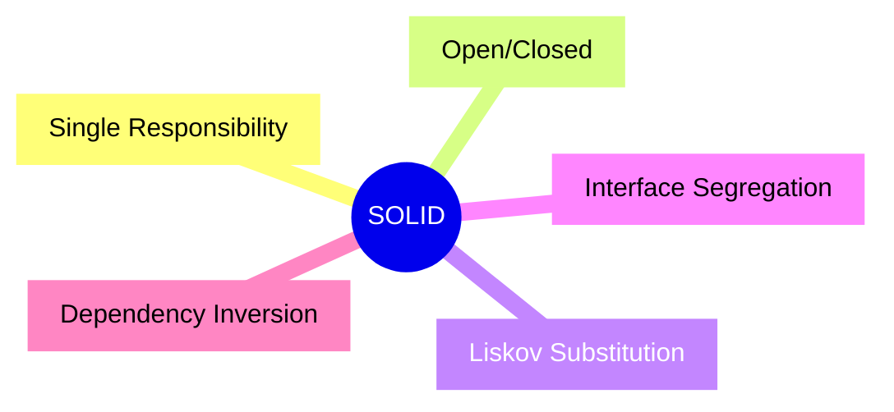
↳ كلهم بيخدموا: كود قابل للتغيير من غير ما يتكسر.

### 117. اشرح Single Responsibility بمثال بيتكسر فيه.
كل كلاس ليه سبب واحد بس للتغيير. بيتكسر لو `Report` بيعمل حساب + طباعة + حفظ.
```java
// violates SRP: three reasons to change
class Report { void calculate() {} void printPdf() {} void saveToDb() {} }
// fix: ReportCalculator, PdfExporter, ReportRepository
```
↳ العلامة: أكتر من سبب للتغيير = قسّم.

### 118. اشرح Open/Closed بمثال.
مفتوح للإضافة، مقفول للتعديل. سلوك جديد = class جديد، مش تعديل الموجود.
```java
interface Discount { double apply(double price); }  // add new discount without touching callers
```
↳ الـ polymorphism هو الأداة اللي بتحقق OCP.

### 119. اشرح Liskov بمثال بيتكسر فيه. *(أصعب واحد)*
أي subtype لازم يحل محل الأب من غير ما يكسر السلوك. بيتكسر في `Square extends Rectangle`.
```java
class Rectangle { void setW(int w){} void setH(int h){} }
class Square extends Rectangle {
    void setW(int w){ this.w = this.h = w; }  // changing width changes height — breaks caller
}
// caller expects setW(5); setH(4) -> area 20; Square gives 16
```
↳ الدرس: العلاقة الرياضية مش دايماً تترجم لوراثة سليمة.

### 120. اشرح Interface Segregation بمثال.
interfaces صغيرة متخصصة أحسن من واحدة عملاقة. متجبرش الكلاس ينفّذ methods مالهاش لازمة.
```java
// bad: interface Worker { work(); eat(); } forces a Robot to implement eat()
interface Workable { void work(); }
interface Eatable { void eat(); }
```
↳ العلامة: method بـ empty body أو throw = ريحة كسر ISP.

### 121. اشرح Dependency Inversion بمثال.
اعتمد على الـ abstractions مش الـ concretes. الـ high-level ميعرفش تفاصيل الـ low-level.
```java
class NotificationService {
    private final MessageSender sender;                 // depends on abstraction
    NotificationService(MessageSender sender) { this.sender = sender; }
}
```
↳ ده اللي بيخلّي DI في NestJS/Spring يشتغل.

### 122. الفرق بين Dependency Inversion و Dependency Injection؟
Inversion = **مبدأ** تصميم (اعتمد على abstractions). Injection = **تقنية** حقن الـ dependency من بره. الأولى الهدف، التانية الأداة.
↳ فخ شائع: الناس بتخلط الاتنين.

### 123. إزاي SOLID بيظهر في framework بتستخدمه؟
DI container = Inversion + Injection. modules/providers = SRP. guards/interceptors القابلة للإضافة = OCP. interfaces صغيرة = ISP.
↳ اربطها بستاكك: "NestJS بيحقن الـ services عبر الـ constructor، فبعتمد على abstraction وأحقن mock في الاختبار."

---

# القسم 14 — جسر OOP ← Design Patterns (Q124–131)

### 124. قولّي design pattern جوهره polymorphism.
**Strategy** — كل استراتيجية بتنفّذ نفس الـ interface مختلف، وتبدّلها runtime.
```java
interface SortStrategy { int[] sort(int[] data); }  // swap implementations at runtime
```
↳ patterns تانية جوهرها polymorphism: Template Method, State, Factory, Observer.

### 125. Strategy vs if/else للاختيار بين خوارزميات؟
Strategy بيحقق Open/Closed: خوارزمية جديدة = class جديد بس، وتختبر كل واحدة لوحدها وتبدّلها runtime.
↳ الجملة: "بحوّل الـ switch لـ polymorphism."

### 126. إيه الـ Template Method؟
الأب بيحدد **هيكل** الخوارزمية في method، والأبناء بيعملوا override للخطوات المتغيّرة.
```java
abstract class DataPipeline {
    final void run() { read(); transform(); write(); } // fixed skeleton
    abstract void transform();                          // subclasses vary this
}
```
↳ الفرق عن Strategy: Template Method وراثة (compile-time)، Strategy composition (runtime).

### 127. عندي "أنشئ objects من غير ما أحدد النوع الصريح" — أنهي pattern؟
**Factory Method** — بيخبّي منطق الإنشاء ورا interface، ويرجّع النوع المناسب.
↳ follow-up: "Factory vs Abstract Factory؟" → التانية بتنشئ **عائلات** من objects مترابطة.

### 128. عندي واجهتين مش متوافقتين — أنهي pattern؟
**Adapter** — بيترجم واجهة لواجهة تانية.
```java
class LegacyPaymentAdapter implements ModernGateway {
    private final LegacyGateway legacy;
    public void charge(double a) { legacy.doPayment(a); } // translate the call
}
```
↳ التشبيه: محوّل فيشة الكهربا.

### 129. عايز أضيف سلوك لـ object من غير وراثة ولا تعديل — أنهي pattern؟
**Decorator** — تلفّ الـ object في object تاني بنفس الـ interface يضيف سلوك.
```java
interface Coffee { double cost(); }
class MilkDecorator implements Coffee {
    private final Coffee inner;
    public double cost() { return inner.cost() + 5; } // adds behavior by wrapping
}
```
↳ بديل مرن للوراثة لإضافة قدرات.

### 130. عايز حاجة تتبلّغ لما حاجة تتغيّر — أنهي pattern؟
**Observer** — one-to-many: الـ subject بيبلّغ الـ observers عند التغيير.
```java
interface Observer { void update(String event); } // subject notifies all observers
```
↳ أساس الـ event systems و RxJS و Redux.

### 131. الإطار: قدامي مشكلة تصميم، إزاي أختار الـ pattern؟
(1) المشكلة إنشاء/هيكلة/سلوك؟ (2) إيه الجزء اللي بيتغيّر؟ (3) اختار الـ pattern اللي بيعزل المتغيّر (4) برّر بمبدأ (OCP/SRP...).
↳ المُنترفيور عايز يشوف **إزاي بتفكّر**، مش اسم محفوظ.

---

## ✅ Checkpoint نهائي — OOP كامل

**المرحلة 1:** cohesion/coupling · this/super · relationships (assoc/agg/comp) · Stack/Vector · overriding rules · hiding/shadowing · fields مش polymorphic · constructor trap · casting.
**المرحلة 2:** sealed · equals signature trap · Integer caching 📌 · Builder · Singleton anti-pattern · primitive obsession → value objects · abstract vs interface · Records 📌 · Enums بـ behavior · Generics/PECS · type erasure 📌 · Comparable vs Comparator · equals/hashCode contract · immutability الصح · SOLID كامل · جسر Design Patterns.

---

## 🫒 زتونة الإنترفيو

> **"الـ OOP في جوهرها طريقة تفكير بننمذج بيها المشاكل في صورة كيانات بتحمي بياناتها وبتعرف تتصرف بنفسها. الأربع أعمدة كلهم بيخدموا كود متماسك جواه (high cohesion) ومستقل عن غيره (low coupling)، وأقواهم الـ polymorphism لأنه بيحوّل الـ if/else لنظام الأنواع فبيحقق الـ Open/Closed. ولما أصمم بفضّل الـ composition على الوراثة للمرونة، وبعتمد على الـ abstractions مش الـ implementations (Dependency Inversion) — وده بالظبط اللي بيخلّي framework زي NestJS يشتغل بالـ DI بتاعه. والمبادئ دي كلها (SOLID) في الآخر بتخدم هدف واحد: كود أقدر أغيّره من غير ما يتكسر."**

---

*التراك الجاي → **02 — Design Patterns**: العائلات التلاتة (Creational / Structural / Behavioral)، كل pattern من مشكلة حقيقية، بنفس فورمات الـ laddering.*
