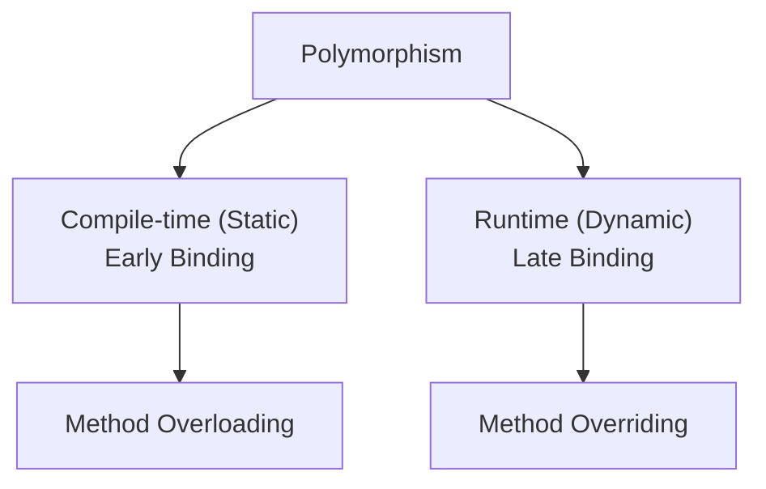
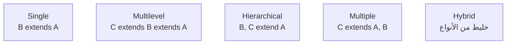
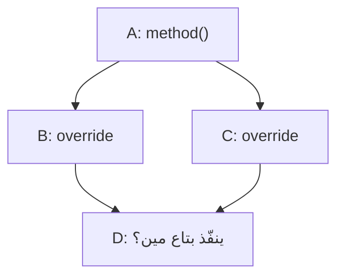

# تراك 1 — OOP: إنترفيو Drill-Down كامل (المرحلة 1)

> **الفورمات:** الملف ده مش أسئلة منفصلة — دي **سلسلة حوارية متصلة (drill-down chain)** بتحاكي إنترفيو حقيقي. الـ Interviewer بيمسك موضوع وبيغور فيه سؤال ورا سؤال، كل سؤال بيتولّد من إجابتك اللي فاتت، لحد ما يوصل لأعقد نقطة أو سيناريو تصميم.

> **اللغة:** الشرح كله **بالمصري**، المصطلحات التقنية **بالإنجليزي** زي ما هي (`encapsulation`, `abstraction`, `polymorphism`, function, variable...). أمثلة الكود **Java**، الكومنتات إنجليزي.

> **إزاي تذاكر:** اقرا السلسلة كاملة من الأول للآخر بدون ما تقفز. كل سؤال جوّه السلسلة مبني على اللي قبله، ولو قفزت هتلاقي نفسك ضايع في السياق.

---

## 🗺️ خريطة المرحلة 1

**السلسلة الكبرى الواحدة**: من ليه ظهرت الـ OOP أصلاً، لحد أعمق نقطة في الـ Encapsulation والـ Abstraction، وخالصة بسيناريو تصميم يجمع كل حاجة مع بعض.

---

# 🎯 السلسلة 1: من الـ Procedural لحد الـ Abstraction

### Interviewer: طيب، خلينا نبدأ من الأول. إيه هي الـ OOP في رأيك؟

خليني أحكيلك القصة كاملة عشان تفهم الإجابة مش تحفظها.

الـ **Object-Oriented Programming** أسلوب في البرمجة بتحوّل بيه المشاكل لـ **objects**. كل object في الدنيا دي — سواء object حقيقي زي سيارة، أو object منطقي زي "حساب بنكي" أو "طلب أوردر" — عنده حاجتين لازم يتجمعوا مع بعض: **الـ state** (البيانات اللي بتوصف حالته دلوقتي) و**الـ behavior** (السلوك اللي بيقدر يعمله على البيانات دي).

الفكرة الأساسية اللي المفروض تفهمها مش إن "فيه classes وobjects" — الفكرة إن **الـ state والـ behavior بيتجمعوا في وحدة واحدة بتحمي نفسها**. يعني الـ object نفسه هو اللي بيقرر مين يقدر يوصل لبياناته، وإزاي البيانات دي تتغيّر، ومتى التغيير ده يبقى مسموح.

خليني أوريك الفرق بمثال. تخيل معايا نظام بنكي بسيط:

```java
// procedural style — data and functions live completely separately
double balance = 5000;                    // just a floating variable, no protection
double withdraw(double balance, double amount) {
    return balance - amount;              // no validation at all — anyone can misuse this
}

balance = -99999;                         // nothing stops this — total chaos
```

شايف المشكلة؟ الـ `balance` دي مجرد variable عايمة في الميموري، ومحدش بيحميها. أي function في البرنامج تقدر تغيّرها لأي قيمة، حتى لو غلط منطقياً (رصيد سالب مثلاً).

دلوقتي بالـ OOP:

```java
class BankAccount {
    private double balance;               // hidden — nobody can touch this directly

    public void withdraw(double amount) {
        if (amount > balance) {
            throw new IllegalStateException("insufficient funds");   // the object protects itself
        }
        balance -= amount;
    }
}

BankAccount acc = new BankAccount();
// acc.balance = -99999;                  // compile error! balance is private
```

الفرق المهم هنا: في المثال التاني، **الـ object نفسه بقى مسؤول عن حماية بياناته**. محدش من برة يقدر يخرب الـ state، لأن الوصول بيحصل بس من خلال methods الـ object نفسه، وهي اللي بتقرر إيه المسموح وإيه الممنوع.

**⚡ الإجابة السريعة:** OOP أسلوب برمجة بتحوّل بيه المشاكل لـ objects، كل object بيجمّع الـ state والـ behavior في وحدة واحدة بتحمي نفسها بنفسها.

**↳ الفخ:** لو قلت "OOP يعني classes وobjects وخلاص" — دي إجابة سطحية. الكلمة اللي المفروض تطلع في كلامك: *الوحدة اللي بتحمي بياناتها بنفسها*.

---

### Interviewer: طيب، قبل ما نكمل، خليني أوقف عندك ثانية. إنت باستخدم كلمة "object" كتير — إيه هو الـ class بالظبط، وإيه الفرق بينه وبين الـ object؟

سؤال أساسي، وهيتسأل تقريباً في أول 5 دقايق من أي إنترفيو OOP.

الـ **class** هو **blueprint / template** — يعني تصميم أو قالب بيحدد شكل الـ objects: أنهي attributes (بيانات) هيكون عندهم، وأنهي methods (سلوك) هيقدروا يعملوها. الكلاس نفسه **مجرد تعريف** — لسه مفيش حاجة حقيقية اتعملت.

الـ **object** هو **instance فعلي** اتعمل من الكلاس ده، وبيحمل قيم حقيقية لكل attribute.

خليني أوضّح بمثال: لو الكلاس زي رسمة تصميم سيارة معينة، الـ object هو السيارة الحقيقية اللي ماشية في الشارع بلونها ورقمها الحقيقي.

```java
class Car {                    // blueprint: defines what a Car looks like
    String color;
    int speed;
}

Car myCar = new Car();         // object: a real instance, takes memory
myCar.color = "red";           // this object has its own actual state
```

**⚡ الإجابة السريعة:** الـ class هو الـ blueprint (تعريف بس). الـ object هو الـ instance الفعلي اللي بياخد ميموري وبيحمل قيم حقيقية.

**↳ الفخ:** "ممكن يكون عندي class من غير أي object؟" → أيوة (زي utility classes بـ static methods بس). لكن العكس مستحيل — مينفعش يكون عندك object من غير class يعرّفه.

---

### Interviewer: طيب، الكلاس نفسه بياخد مكان في الميموري؟

**لأ.** الكلاس مجرد **تعريف** — مش بياخد ميموري زي ما الـ object بياخد. الميموري بتتاخد بس لما تعمل `new` وتنشئ object فعلي.

```java
class User {
    String name;
}
// at this point, no memory has been allocated for any "User" state

User u = new User();    // NOW memory is allocated on the heap for this specific object
```

📌 **Java-specific:** فيه استثناء واحد — الـ **static fields**. دي بتنتمي للكلاس نفسه مش لأي object معين، وبتتاخدلها ميموري **مرة واحدة بس** لما الكلاس يتحمّل (class loading)، بغض النظر عن عدد الـ objects اللي هتتعمل.

```java
class Counter {
    static int total = 0;      // one shared copy, tied to the class itself
    int id;                    // separate copy per object
}
```

**⚡ الإجابة السريعة:** لأ، الكلاس مش بياخد ميموري — الميموري بتتاخد للـ objects لما تعمل `new`. الاستثناء: static fields بتاخد مكان واحد مشترك وقت تحميل الكلاس.

**↳ الفخ:** لو قلت "الكلاس بياخد ميموري" من غير تفرقة بينه وبين الـ static members، دي علامة إنك لسه مش فارق بين الاتنين كويس.

---

### Interviewer: طيب، كام object أقدر أعمل من الكلاس ده؟ وهل لازم أعمل object أصلاً كل مرة؟

**عدد الـ objects غير محدود** — طول ما فيه ميموري كافية في الـ heap. كل `new` بينشئ instance منفصل بحالته الخاصة.

```java
for (int i = 0; i < 1000; i++) {
    User u = new User();      // 1000 separate objects, each with its own state
}
```

لكن **مش لازم تعمل object في كل الحالات**. فيه استثناءات:

1. **Utility classes** بـ static methods بس (زي `Math`) — بتتنادى عن طريق اسم الكلاس مباشرة.
2. **Abstract classes** — مينفعش تعمل منها object مباشرة أصلاً.
3. **Interfaces** — تعريف بس، مينفعش instance.
4. **Classes بـ private constructor** — زي الـ Singleton، بيتحكم في الإنشاء بنفسه.

```java
class MathUtils {
    private MathUtils() { }                          // prevent instantiation entirely
    static int square(int x) { return x * x; }
}
MathUtils.square(5);                                  // no object needed at all
```

**⚡ الإجابة السريعة:** عدد غير محدود من الـ objects (طول ما فيه ميموري). مش لازم تعمل object في حالات زي utility classes، abstract classes، interfaces، وSingletons.

**↳ الفخ:** "طب ليه ما تخليش كل حاجة static وتوفّر عناء إنشاء objects؟" → لأنك بتخسر كل مزايا OOP: الـ polymorphism، الـ dependency injection، وسهولة الاختبار. الـ static state بيربطك بإحكام (tight coupling) وبيصعّب عليك تستبدل أي حاجة وقت الاختبار.

---

### Interviewer: تمام. طب خلينا نتكلم عن حاجة مهمة جداً — إيه هو الـ Constructor؟

الـ **Constructor** هو **method خاصة** بتتنفّذ **تلقائياً** لما تعمل object جديد، وهدفها إنها تهيّئ الـ state الابتدائي للـ object ده. اسمها لازم يكون **نفس اسم الكلاس بالظبط**، ومفيش عندها return type خالص — ولا حتى `void`.

```java
class User {
    private String name;
    private int age;

    User(String name, int age) {          // constructor: runs automatically
        this.name = name;
        this.age = age;
    }
}

User u = new User("Mohamed", 30);         // constructor executes here
```

الغرض الأساسي منه: تضمن إن الـ object يبدأ في **حالة صحيحة** من أول لحظة. لو عندك بيانات إلزامية (زي email مثلاً)، خليها تتحط في الـ constructor مباشرة، مش تسيبها لـ setter منفصل ممكن حد ينساه.

**⚡ الإجابة السريعة:** method خاصة، بنفس اسم الكلاس، بلا return type، بتتنفّذ تلقائياً عند إنشاء object عشان تهيّئ الـ state الابتدائي.

**↳ الفخ:** "ينفع الـ constructor يبقى private؟" → **أيوة**. بيمنع الإنشاء المباشر من برة، ومفيد جداً في حالات زي الـ Singleton أو الـ factory pattern.

---

### Interviewer: طيب، فيه أنواع مختلفة للـ constructors؟

أيوة، أشهرهم اتنين:

**Default (No-arg) Constructor**: بلا parameters خالص.

```java
class User {
    String name;
    // if you write NO constructor, the compiler adds this automatically:
    // User() { }
}
```

**Parameterized Constructor**: بياخد arguments عشان يهيّئ الـ state بيها.

```java
class User {
    String name;
    User(String name) { this.name = name; }
}
```

وفيه كمان حاجة اسمها **Constructor Overloading** — يعني كذا constructor في نفس الكلاس بنفس الاسم، لكن بـ parameters مختلفة:

```java
class Rectangle {
    int width, height;

    Rectangle() {                          // default: unit square
        this(1, 1);                        // delegates to the other constructor below
    }
    Rectangle(int side) {                  // square
        this(side, side);
    }
    Rectangle(int width, int height) {     // full spec
        this.width = width;
        this.height = height;
    }
}
```

لاحظ استخدام `this(...)` — ده بينادي constructor تاني في **نفس الكلاس**، وده اسمه **constructor chaining**. لازم يكون أول سطر في الـ constructor.

**⚡ الإجابة السريعة:** Default (بلا params) و Parameterized (بـ params)، وممكن تعمل Overloading لكذا constructor بنفس الاسم بـ parameters مختلفة. `this(...)` بينادي constructor تاني في نفس الكلاس.

**↳ الفخ:** `this()` (بتنادي constructor في نفس الكلاس) غير `super()` (بتنادي constructor الأب) — الاتنين مختلفين تماماً، ومينفعش تستخدمهم مع بعض في نفس الـ constructor.

---

### Interviewer: طيب سؤال مهم — لو مكتبتش أي constructor خالص في الكلاس بتاعي، إيه اللي بيحصل؟

الكومبايلر بيدّيك **default constructor فاضي تلقائياً** — بلا ما تطلبه.

```java
class User {
    String name;
    // compiler automatically adds: User() { }
}
User u = new User();     // this works fine — the compiler-generated constructor runs
```

**لكن — وده الفخ المهم** — أول ما تكتب **أي** constructor بنفسك (حتى لو بـ parameters)، الـ default الفاضي **بيختفي تماماً**. لو محتاجه بعد كده، لازم تكتبه إنت بنفسك بشكل صريح.

```java
class User {
    String name;
    User(String name) { this.name = name; }   // you wrote one constructor
}

new User();               // compile error! the no-arg constructor no longer exists
new User("Mohamed");      // this is the only way to create a User now
```

**⚡ الإجابة السريعة:** لو مكتبتش أي constructor، الكومبايلر بيديك default فاضي تلقائي. أول ما تكتب constructor بنفسك (بـ parameters أو حتى بلاها)، الـ default التلقائي بيختفي.

**↳ الفخ:** ده باج شائع جداً عند المبتدئين — بيضيفوا constructor بـ parameters، وبعدين يتفاجئوا إن `new ClassName()` بقت compile error في مكان تاني من الكود.

---

### Interviewer: طيب، ثلاث حاجات سريعة عن الـ constructor — ممكن يترمي منه exception؟ ممكن يبقى private؟ وهل بيتورث للابن؟

**1. ممكن يرمي exception؟** أيوة، عادي جداً — سواء checked أو unchecked.

```java
class FileLoader {
    FileLoader(String path) throws IOException {
        if (path == null) throw new IllegalArgumentException("path required");
        // ... load the file, may throw IOException
    }
}
```

**2. ممكن يبقى private؟** أيوة، وده مفيد جداً في حالتين: منع الإنشاء المباشر تماماً (utility classes)، أو التحكم في الإنشاء عن طريق static factory method (زي الـ Singleton).

```java
class Singleton {
    private static final Singleton INSTANCE = new Singleton();
    private Singleton() { }                          // no one can call 'new' directly
    static Singleton getInstance() { return INSTANCE; }
}
```

**3. بيتورث للابن؟** **لأ خالص.** الـ constructors مش بتتورّث زي الـ methods العادية. الابن **لازم** ينادي واحد من constructors الأب عن طريق `super(...)` — إما ضمنياً (لو الأب عنده no-arg constructor) أو صراحة.

```java
class Animal {
    Animal(String name) { }              // no no-arg constructor here
}
class Dog extends Animal {
    Dog(String name) {
        super(name);                     // MUST call this explicitly — no default to fall back on
    }
}
```

**⚡ الإجابة السريعة:** يقدر يرمي أي exception. يقدر يبقى private (Singleton، factory). مش بيتورث — الابن لازم ينادي `super(...)` صراحة أو ضمنياً.

**↳ الفخ:** لو الأب مفهوش no-arg constructor، الابن **لازم** يكتب `super(args)` صراحة في أول سطر، وإلا compile error.

---

### Interviewer: طيب آخر سؤال في الجزء ده — لو الكلاس نفسه اتعمله `final`، ده يعني إيه بالظبط؟

`final class` معناها: **الكلاس ده ممنوع تماماً إن أي حد يعمل منه `extends` (يرث منه)**. الكومبايلر بيرفض على طول لو حد حاول.

```java
final class Constants { }

class MyConstants extends Constants { }   // compile error: cannot inherit from final class
```

ليه بنستخدمها؟ عشان تحمي منطق حسّاس من إن حد يجي يورّث منه ويكسر الافتراضات اللي بنيت عليها الكلاس. أشهر مثال حي: `String` و `Integer` في Java نفسها `final` — عشان الأمان والـ immutability (اللي هنتكلم عنهم بالتفصيل قدام).

**حاجة مهمة تفرّق بينها**: كلمة `final` في Java عندها **3 معاني مختلفة تماماً** حسب مكانها:

- `final class` → مينفعش تتورّث منه.
- `final method` → مينفعش تتعمل لها override.
- `final variable` → مينفعش تتغيّر قيمتها بعد التعيين الأول.

**⚡ الإجابة السريعة:** `final class` = ممنوع تماماً الوراثة منه. لاحظ إن `final` معناها مختلف حسب السياق: على class (منع وراثة)، على method (منع override)، على variable (منع تغيير القيمة).

**↳ الفخ:** كتير بيلخبطوا الثلاث معاني دول مع بعض في الإنترفيو. لو سُئلت "إيه معنى final؟"، وضّح إنه **يعتمد على السياق** واذكر الثلاثة.

---

### Interviewer: طب سؤال مقارنة أخير — لو عايز أمنع حد ينشئ object من الكلاس بتاعي مباشرة، أعمل الـ constructor `private` ولا أخلي الكلاس `abstract`؟ أنهي أحسن؟

**سؤال ذكي، والإجابة بتعتمد على القصد بتاعك تحديداً — مش فيه واحد "أحسن" مطلقاً.**

**private constructor**: تستخدمه لما عايز **تتحكم بالكامل** في إنشاء الـ objects من الكلاس نفسه — يعني لسه عايز objects تتعمل، بس بشرطك إنت (زي Singleton، أو factory method بيتحقق من شروط قبل الإنشاء).

```java
class DatabaseConnection {
    private DatabaseConnection() { }
    static DatabaseConnection create() {
        // validation, pooling logic, etc. before returning an instance
        return new DatabaseConnection();
    }
}
```

**abstract class**: تستخدمه لما فيه **سلوك مشترك ناقص** لازم كل subclass يكمّله بطريقته الخاصة. إنت مش بتمنع الإنشاء بشكل مطلق — إنت بتقول "الكلاس ده لوحده ناقص، مينفعش تاخده كما هو، لازم تحدد نوع فرعي فعلي منه".

```java
abstract class Shape {
    abstract double area();     // subclasses MUST provide their own implementation
}
```

**الفرق الحقيقي في القصد**: private constructor بيقول "أنا اللي هقرر إمتى وإزاي يتعمل object"، لكن abstract class بيقول "الكلاس ده مفهوش معنى كامل لوحده، محتاج تخصيص أولاً".

**⚡ الإجابة السريعة:** private constructor لما عايز تتحكم بالكامل في الإنشاء (Singleton, factory). abstract class لما الكلاس ناقص التنفيذ وعايز تجبر الأبناء يكمّلوه. القصد مختلف تماماً.

**↳ الفخ:** لو جاوبت "الاتنين بيمنعوا new"، دي إجابة سطحية. abstract class بتسمح بـ objects من الأبناء عادي، private constructor بيتحكم في النقطة دي بالكامل حتى من جوّه الكلاس نفسه.

---

### Interviewer: طيب، فهمت الفكرة. بس ليه احنا احتجنا نروح للأسلوب ده أصلاً؟ إيه اللي كان ناقص في الـ procedural؟

سؤال كويس، وده بالظبط الـ "why" اللي المفروض تعرفه مش بس تحفظه.

في الستينات والسبعينات، البرامج كبرت جداً، وبقى صعب جداً إنك تتحكم في الـ **procedural code** وتطوّره من غير ما تكسر حاجة. المشكلة مش إن الـ procedural style "وحش" — لأ، هو أسلوب شغّال تماماً لبرامج صغيرة ومباشرة. المشكلة ظهرت لما المشاريع كبرت، وظهرت أربع مشاكل رئيسية:

**المشكلة الأولى — الـ data مكشوفة لأي كود.** زي ما شفنا فوق، أي function في أي مكان في البرنامج تقدر توصل للـ global state وتغيّره. مفيش حد "مسؤول" عن حماية البيانات دي.

**المشكلة التانية — صعوبة إعادة الاستخدام.** الكود مربوط بسياقه. لو عايز تاخد جزء منه وتستخدمه في مكان تاني، غالباً هيبقى معتمد على variables وfunctions تانية موجودة في نفس الملف أو نفس السياق.

**المشكلة التالتة — صعوبة الصيانة.** لو الباج جوّه function بتشتغل على `balance` مثلاً، ومفيش حد يعرف مين كل الـ functions اللي بتلمس المتغيّر ده، تصليح باج بسيط ممكن يكسر عشرة حاجات تانية في أماكن ما توقعتهاش.

**المشكلة الرابعة — الـ spaghetti code.** الكود بيبقى متشابك ومترابط بشكل غريب، وبيبقى صعب إنك تتابعه لأن مفيش حدود واضحة بين "مين بيعمل إيه".

الـ OOP جت كحل لكل ده، وكل واحدة من الأربع pillars بتاعتها بتحل مشكلة معينة:

- **Encapsulation** بتحل مشكلة "الـ data مكشوفة" — البيانات بقت محمية جوّه الـ object.
- **Inheritance** بتحل مشكلة "إعادة الاستخدام" — تقدر تبني على كود موجود بدل ما تكرره.
- **Abstraction** بتحل مشكلة "التعقيد" — بتخلي المستخدم يتعامل مع واجهة بسيطة بدل تفاصيل معقدة.
- **Polymorphism** بتحل مشكلة "المرونة" — بتخليك تضيف سلوك جديد بدون ما تكسر القديم.

**⚡ الإجابة السريعة:** ظهرت لحل مشاكل الـ procedural code لما المشاريع كبرت: data مكشوفة، صعوبة إعادة استخدام، صعوبة صيانة، spaghetti code. كل pillar في OOP بيحل واحدة من المشاكل دي تحديداً.

**↳ الفخ:** لو الـ Interviewer سأل "طب OOP دايماً الأحسن؟" — الإجابة الناضجة: **لأ**. للتحويلات البسيطة والـ stateless logic (زي data pipelines)، الـ functional style أنضف وأقل boilerplate. الـ OOP بتلمع لما عندك كيانات ليها **هوية وحالة وسلوك بيتغيّر مع الوقت**.

---

### Interviewer: تمام. خليك معايا بقى في الـ Encapsulation تحديداً، بما إنها الحل الأول اللي قولت عليه. إيه هي بالظبط؟

الـ **Encapsulation** هي المبدأ اللي بيقول: **غلّف الـ state والـ behavior في وحدة واحدة، وامنع الوصول المباشر للـ state من برة**. الوصول للبيانات بيحصل بس عن طريق methods بتحدد "الحرّاس" — يعني الشروط اللي لازم تتحقق قبل ما أي تغيير يحصل.

الحاجتين اللي لازم تفهمهم عن الـ encapsulation:

**1. Data Hiding**: استخدام `private` عشان تمنع أي كود من برة يوصل للـ field مباشرة.

**2. Controlled Access**: أي وصول للبيانات لازم يعدي من خلال methods بتفرض قواعد.

خليني أوريك المثال بتاع الـ `BankAccount` تاني بس أعمّق فيه شوية:

```java
class BankAccount {
    private double balance;               // data hiding: no one touches this directly

    public void deposit(double amount) {
        if (amount <= 0) {
            throw new IllegalArgumentException("must be positive");   // guarding the invariant
        }
        balance += amount;
    }

    public void withdraw(double amount) {
        if (amount > balance) {
            throw new IllegalStateException("insufficient funds");    // guarding the invariant
        }
        balance -= amount;
    }

    public double getBalance() { return balance; }   // controlled read access
}
```

هنا لاحظ حاجة مهمة: كلمة **invariant**. الـ invariant هو "الشرط اللي لازم يفضل صحيح طول الوقت". في مثالنا، الـ invariant هو "الرصيد مبيبقاش سالب أبداً". الـ encapsulation الحقيقية مش بس "خلّي الفيلد `private`" — دي بس نص الحكاية. النص التاني إن الـ methods اللي بتوصل للفيلد لازم **تفرض الـ invariant** ده.

**⚡ الإجابة السريعة:** تغليف الـ state والـ behavior في وحدة واحدة، مع إخفاء البيانات (`private`) والوصول عبر methods بتحمي الـ invariants (شروط صحة الـ state).

**↳ الفخ:** كتير بيلخبطوا بين الـ encapsulation والـ abstraction. هنوضّح الفرق ده بعد شوية، بس افتكر الجملة دي: **encapsulation بتخبّي "إزاي البيانات محفوظة"**.

---

### Interviewer: طب، سؤال بيتسأل كتير — الـ getters والـ setters مش بيكسروا الـ encapsulation؟ ده إحنا بنكشف الـ private field من الباب التاني!

**سؤال ذكي جداً، وده بالظبط اللي بيفرّق الـ senior عن الـ junior.**

الإجابة الحقيقية: **معتمدة على التنفيذ**.

لو الـ setter بتاعك شكله كده:

```java
public void setBalance(double balance) {
    this.balance = balance;               // NO validation at all
}
```

فأيوة، **ده فعلياً كسر للـ encapsulation**. إنت بس ضفت خطوة زيادة (استدعاء method) قبل ما تحط القيمة، بس مفيش أي حماية حقيقية. أي قيمة — حتى سالبة أو غير منطقية — بتعدي من غير أي رفض. عملياً، الـ field بقى **public** بس متنكّر في شكل method.

لكن لو الـ setter بيحمي الـ invariant:

```java
public void setBalance(double balance) {
    if (balance < 0) {
        throw new IllegalArgumentException("negative not allowed");   // this IS encapsulation
    }
    this.balance = balance;
}
```

هنا **دي encapsulation حقيقية** — لأن الـ method بتفرض قاعدة، مش بس بتنقل القيمة.

**والأفضل من ده كله في التصميم الحديث؟** إنك أصلاً تتجنّب الـ setters العامة وتستخدم بدالها **methods بمعنى domain**:

```java
// instead of a generic setBalance(), use domain-meaningful operations:
public void deposit(double amount) { /* validates and adds */ }
public void withdraw(double amount) { /* validates and subtracts */ }
```

`deposit()` و `withdraw()` أوضح بكتير من `setBalance()` لأن الاسم نفسه بيعبّر عن **العملية** اللي بتحصل في الـ domain بتاعك، مش مجرد "حط القيمة دي".

**⚡ الإجابة السريعة:** الـ getter/setter لوحدها **مش** بالضرورة encapsulation. لو الـ setter بيحط القيمة من غير أي تحقق، ده كسر فعلي للـ encapsulation (الـ field بقى public بخطوة زيادة). الـ encapsulation الحقيقية بتفرض invariants، والأفضل من الكل: methods بمعنى domain (`deposit`, `withdraw`) بدل setters عامة.

**↳ الفخ:** لو الـ Interviewer رمالك الكود ده وسأل "ده encapsulation؟":
```java
private int age;
public int getAge() { return age; }
public void setAge(int age) { this.age = age; }
```
الإجابة الصح: **"syntactically أيوة (الفيلد private)، لكن semantically لأ — الـ setter بلا أي validation عملياً زي ما يكون الفيلد public."**

---

### Interviewer: طيب، وإيه فايدة كل ده عملياً؟ يعني إيه المكسب الحقيقي من الـ encapsulation في مشروع حقيقي؟

فيه خمس فوايد أساسية، وكل واحدة فيهم بتفرق فعلاً في شغل الـ backend اللي بتعمله:

**1. حماية الـ invariants** — زي ما اتفقنا، تضمن إن الـ object دايماً في حالة منطقية صحيحة. رصيد مبيبقاش سالب، عمر مبيبقاش أقل من صفر، حالة الطلب مبتبقاش متناقضة.

**2. تغيير التنفيذ الداخلي بلا كسر الـ callers** — ده مهم جداً في مشاريع بتتوسّع. تخيل إن الـ `balance` كانت `double`، وبعدين قررت تغيّرها لـ `BigDecimal` عشان تتجنب مشاكل الـ floating point في العمليات المالية. لو الفيلد كانت `private` والوصول بيحصل من خلال `getBalance()`، تقدر تغيّر التنفيذ الداخلي من غير أي حد يحس. لو كانت public، كل حتة في الكود بتستخدمها مباشرة هتنكسر.

**3. Thread safety محلية** — لو كل الوصول للـ state بيعدي من methods محدودة، تقدر تحط `synchronized` أو أي طريقة حماية في مكان واحد وتحمي الـ object كله.

**4. Debugging أسهل** — أي تغيير في الـ state لازم يعدي من methods قليلة ومعروفة. تحط breakpoint فيها وتلحق أي تعديل غريب.

**5. Auditing و logging** — تقدر تضيف logging جوّه الـ setter (لو محتاج) بلا ما تلمس أي كود تاني في المشروع.

**⚡ الإجابة السريعة:** حماية invariants، تغيير التنفيذ الداخلي بلا كسر الـ callers، thread safety محلية، debugging أسهل، auditing/logging مركزي.

**↳ الفخ:** بلا encapsulation، الـ state ممكن يبوظ من أي مكان في الكود، والـ bug بتاعه بيبقى **مستحيل التتبّع** — لأنك مش عارف مين بالظبط غيّر القيمة.

---

### Interviewer: تمام، فهمت الـ encapsulation كويس. خليني أنقلك لموضوع تاني قريب منه، الـ Abstraction. إيه الفرق بينها وبين اللي احنا باتكلم فيه؟

**ده من أشهر الأسئلة اللي بتتكرر في أي إنترفيو OOP، فركّز معايا هنا.**

الـ **Abstraction** = إخفاء **التعقيد** وكشف واجهة بسيطة تركّز على **"إيه"** بدل **"إزاي"**.

خليني أديك التشبيه الكلاسيكي: عجلة القيادة في السيارة. إنت بتلفّها يمين، السيارة بتروح يمين. إنت **مش محتاج تعرف** الـ steering rack، الـ hydraulics، الـ power steering pump اللي شغّالين تحت. الواجهة اللي قدامك (العجلة) بسيطة، والتعقيد كله مخفي.

دلوقتي — الفرق الأساسي بينها وبين الـ Encapsulation:

| | Encapsulation | Abstraction |
|---|---|---|
| بتخبّي إيه؟ | **البيانات** (data) | **التعقيد** (complexity) |
| السؤال اللي بتجاوبه | إزاي أحمي الـ state؟ | إزاي أبسّط الاستخدام؟ |
| الأداة | `private`, invariants | `abstract class`, `interface` |
| المستوى | implementation | design |

**الجملة اللي المفروض تحفظها**: *"Encapsulation بتخبّي إزاي البيانات محفوظة، Abstraction بتخبّي إزاي الشغل بيتم."*

خليني أوريك المثال بالكود عشان الفرق يبقى ملموس:

```java
interface PaymentGateway {
    void pay(double amount);              // ABSTRACTION: "what" — pay somehow, I don't care how
}

class StripeGateway implements PaymentGateway {
    private String apiKey;                // ENCAPSULATION: hidden internal state

    public void pay(double amount) {
        // hundreds of lines of Stripe-specific API calls, retries, error handling...
        // all of this complexity is hidden behind pay()
    }
}

// the caller code doesn't know or care about Stripe internals:
void checkout(PaymentGateway gateway, double total) {
    gateway.pay(total);                   // depends on the ABSTRACTION, not the implementation
}
```

في المثال ده، الـ `PaymentGateway` interface بيوفّر **abstraction** — الكود المستدعي مش عارف ولا محتاج يعرف تفاصيل Stripe. وجوّه `StripeGateway`، الـ `apiKey` field محمية بـ **encapsulation** — محدش من برة يقدر يوصلها مباشرة.

**⚡ الإجابة السريعة:** Encapsulation بتخبّي **إزاي البيانات محفوظة** (data hiding). Abstraction بتخبّي **إزاي الشغل بيتم** (complexity hiding). الأول implementation-level، التاني design-level.

**↳ الفخ:** لو خلطت بينهم في إجابتك، ده أوضح دليل على وجود فجوة أساسية في الفهم عندك. اتمرّن على الجدول ده لحد ما تقوله من غير تفكير.

---

### Interviewer: طيب معاك. طب فيه أدوات معيّنة في Java بنحقق بيها الـ abstraction؟

أيوة، الأداتين الأساسيتين هما **abstract class** و **interface**.

خلينا نبدأ بـ **abstract class**. الفكرة إنه class عادي، لكن ممكن يحتوي على **abstract methods** — دي methods بلا body، بتفرض على الأبناء إنهم ينفّذوها.

```java
abstract class Shape {
    abstract double area();               // no body — subclasses MUST implement this
}

class Circle extends Shape {
    private double radius;
    Circle(double r) { this.radius = r; }

    @Override
    double area() { return Math.PI * radius * radius; }
}

// Shape s = new Shape();               // compile error! can't instantiate an abstract class
Shape s = new Circle(5);                 // OK — instantiate a concrete subclass
```

لاحظ حاجة مهمة: **مينفعش تعمل `new` لـ abstract class مباشرة**. الكومبايلر بيرفض، لأن الكلاس ده "ناقص" — فيه methods بلا تنفيذ.

دلوقتي **interface**: عقد بحت، بيحدد "إيه القدرات اللي المفروض تكون موجودة" بدون أي تنفيذ (تقليدياً — قبل Java 8):

```java
interface Swimmer {
    void swim();                          // just a contract, no implementation
}

class Dolphin implements Swimmer {
    public void swim() { /* actual implementation here */ }
}
```

**⚡ الإجابة السريعة:** الأدوات: `abstract class` (فيه methods بلا body، مينفعش `new` منه مباشرة) و`interface` (عقد بحت). الاتنين بيحققوا abstraction بطرق مختلفة.

**↳ الفخ:** "الـ abstract class ينفع يبقى فيه constructor؟" → **أيوة**. بيتنادى من الأبناء عبر `super()`، ومفيد لتهيئة state مشترك بين كل الأبناء.

---

### Interviewer: طب خلينا نغور أكتر — إيه الفرق الحقيقي بين abstract class و interface؟ ومتى أستخدم إيه؟

سؤال أساسي وهيتسأل بأشكال مختلفة، فخليني أدّيك الصورة الكاملة.

| | Abstract Class | Interface |
|---|---|---|
| بيحتوي تنفيذ (method body)؟ | أيوة | من Java 8: default methods بس |
| Fields (state)؟ | أيوة (instance fields) | لأ (بس `public static final` constants) |
| الوراثة | واحدة بس (single inheritance) | متعددة (`implements` كذا واحد) |
| Constructor؟ | أيوة | لأ |
| السؤال اللي بيجاوبه | **is-a** (إيه نوع الحاجة دي؟) | **can-do** (إيه القدرات المتاحة؟) |
| مناسب لـ | classes قريبة من بعض بتشارك كود | عقود لأنواع مختلفة تماماً |

خليني أوضّح الفرق بمثال متكامل:

```java
// abstract class: shared code + is-a relationship
abstract class Animal {
    protected String name;
    public Animal(String name) { this.name = name; }

    public void sleep() { System.out.println(name + " is sleeping"); }   // shared behavior
    public abstract void makeSound();     // must be implemented by each animal
}

// interface: capability contract, unrelated to "type hierarchy"
interface Swimmer {
    void swim();
}

class Dolphin extends Animal implements Swimmer {   // Dolphin IS-A Animal, CAN-DO Swim
    public Dolphin(String name) { super(name); }
    public void makeSound() { System.out.println(name + " clicks"); }
    public void swim() { System.out.println(name + " is swimming"); }
}
```

الـ `Dolphin` بترث من `Animal` لأن فيه علاقة **is-a** حقيقية (دولفين هو نوع من الحيوان)، وبتنفّذ `Swimmer` لأن السباحة **قدرة** ممكن حيوانات تانية مالهاش علاقة بالدولفين تشاركها (زي `Duck implements Swimmer`).

**القاعدة العملية اللي تمشي عليها**:
- ابدأ بـ **interface** — أمرن، وبيديك خيار تنفّذ كذا واحد.
- انزل لـ **abstract class** بس لو فيه **كود مشترك حقيقي** بيتكرر بين الأبناء، وعلاقة **is-a قوية**.

**⚡ الإجابة السريعة:** abstract class لما فيه كود مشترك + علاقة is-a قوية (وراثة single). interface لما بتحدد قدرة (can-do) ممكن أنواع مختلفة تنفّذها (وراثة multiple).

**↳ الفخ:** الـ Interviewer غالباً هيسألك السؤال الجاي مباشرة...

---

### Interviewer: طب، الـ default methods اللي اتضافت في Java 8 مش خلت الفرق ده يضيع؟ يعني الـ interface بقى فيه تنفيذ زي الـ abstract class تماماً؟

**سؤال ممتاز، وده follow-up شبه مضمون بعد أي سؤال عن abstract class vs interface.**

الإجابة: الـ default methods **قرّبت الشبه، لكن الفرق الحقيقي باقي**.

```java
interface Vehicle {
    void start();

    default void honk() {                 // default method — has a body!
        System.out.println("Beep beep!");
    }
}
```

أيوة، دلوقتي الـ interface تقدر تحمل تنفيذ. بس فيه فرقين لسه موجودين وما اتحلوش:

**الفرق الأول — الـ state**: الـ interface **لسه مش بتقدر تحمل instance fields**. تقدر تعرّف `default methods`، لكن مينفعش يكون عندك `private int x;` جوّه interface تستخدمه في منطق stateful (ماعدا الـ static/private helper fields في حالات محدودة جداً من Java 9). الـ abstract class لسه هي الوحيدة اللي بتقدر تحمل **state حقيقي** بيتشارك بين الأبناء.

**الفرق التاني — الوراثة**: interface لسه بتسمح بـ multiple implementation، abstract class لسه single inheritance بس.

يعني لو محتاج **كود مشترك + state مشترك**، لسه محتاج abstract class. الـ default methods حلّت مشكلة تانية تماماً — إزاي تضيف method جديدة لـ interface **موجود بالفعل** (زي `Collection`) بلا ما تكسر كل الكلاسات اللي بتنفّذه.

**⚡ الإجابة السريعة:** قرّبت الشبه (الـ interface بقت تقدر تحمل تنفيذ)، بس الفرق الحقيقي باقي: الـ interface **لسه ما بتحملش instance state**، والوراثة لسه **single vs multiple**.

**↳ الفخ:** "طب ليه Java ضافت default methods أصلاً؟" → عشان تقدر تضيف methods جديدة لـ interfaces **قديمة موجودة بالفعل** (زي `stream()` اتضافت لـ `Collection`) بلا ما تكسر كل الكلاسات اللي بتنفّذها من قبل — مشكلة الـ backward compatibility.

---

### Interviewer: طيب، خلاص فهمت الأربع حاجات دول. خليني أديك سيناريو تصميم يجمعهم مع بعض — صمملي نظام حسابات بنكية بسيط، وأوريني إزاي كل الـ pillars اللي اتكلمنا عنهم بتظهر فيه.

تمام، ده سؤال متكامل، هنبني نظام بسيط ونشوف كل pillar فين بالظبط.

**المتطلبات المبسّطة**: عندي أنواع حسابات مختلفة (Checking, Savings)، وعايز أضمن الرصيد ما يبقاش سالب، وعايز واجهة بسيطة أتعامل بيها مع أي نوع حساب من غير ما أعرف تفاصيله.

```java
// ABSTRACTION: the interface defines "what" any account can do, hides "how"
abstract class BankAccount {
    // ENCAPSULATION: balance is hidden, protected by validation
    private double balance;
    protected final String owner;

    public BankAccount(String owner, double initialBalance) {
        this.owner = owner;
        this.balance = initialBalance;
    }

    public final void deposit(double amount) {
        if (amount <= 0) throw new IllegalArgumentException("must be positive");
        balance += amount;
    }

    public final void withdraw(double amount) {
        if (amount > balance) throw new IllegalStateException("insufficient funds");
        balance -= amount;
    }

    public final double getBalance() { return balance; }

    // ABSTRACTION: subclasses decide HOW interest is calculated, caller doesn't care
    public abstract double calculateInterest();
}

// INHERITANCE: both share the balance/deposit/withdraw logic from BankAccount
class SavingsAccount extends BankAccount {
    public SavingsAccount(String owner, double balance) { super(owner, balance); }

    @Override
    public double calculateInterest() { return getBalance() * 0.05; }   // 5% interest
}

class CheckingAccount extends BankAccount {
    public CheckingAccount(String owner, double balance) { super(owner, balance); }

    @Override
    public double calculateInterest() { return 0; }                     // no interest
}

// POLYMORPHISM: same method call, different behavior per actual object type
void printInterest(BankAccount acc) {
    System.out.println(acc.calculateInterest());
}

printInterest(new SavingsAccount("Ali", 1000));    // prints 50.0
printInterest(new CheckingAccount("Omar", 1000));  // prints 0.0
```

خليني أشرحلك فين كل pillar ظهر بالظبط:

1. **Encapsulation**: الـ `balance` field محمية (`private`)، والوصول بيحصل بس من خلال `deposit()`/`withdraw()` اللي بتفرض الـ invariants (رصيد مبيبقاش سالب).

2. **Abstraction**: الـ `BankAccount` abstract class بتوفّر واجهة موحّدة (`deposit`, `withdraw`, `calculateInterest`) بدون ما المستخدم يعرف تفاصيل حساب الفوائد لكل نوع.

3. **Inheritance**: الـ `SavingsAccount` و `CheckingAccount` بيرثوا كل المنطق المشترك (الـ balance handling) من `BankAccount`، وبيضيفوا/يعدّلوا بس اللي مختلف فيهم (`calculateInterest`).

4. **Polymorphism**: الـ `printInterest()` method بتاخد `BankAccount` (النوع الأب)، والـ runtime بيقرر ينادي `calculateInterest()` بتاع النوع الفعلي (`SavingsAccount` أو `CheckingAccount`) — من غير ما الكود ده يعرف أو يهتم بالنوع الحقيقي.

**⚡ الإجابة السريعة:** Encapsulation (balance محمية) + Abstraction (واجهة موحّدة `BankAccount`) + Inheritance (SavingsAccount/CheckingAccount بيرثوا المشترك) + Polymorphism (`calculateInterest()` بيتصرف مختلف حسب النوع الفعلي) — الأربعة شغالين مع بعض في تصميم واحد متماسك.

**↳ الفخ:** الـ Interviewer ممكن يسألك "طب لو عايز تضيف نوع حساب جديد (Business Account) بفوائد مختلفة، هتعمل إيه؟" — الإجابة: "class جديد `BusinessAccount extends BankAccount`، وعمل override لـ `calculateInterest()` بس. الكود الموجود (`printInterest`, `deposit`, `withdraw`) **مش هيتلمس خالص**." — ده بالظبط تطبيق حي لمبدأ **Open/Closed** اللي هنتكلم عنه بالتفصيل في المرحلة الجاية.

---

## ✅ Checkpoint — السلسلة الأولى كاملة

راجع الرحلة اللي مشيناها:
1. **إيه هي OOP** → تجميع state + behavior في وحدة بتحمي نفسها
2. **Class vs Object** → blueprint (بلا ميموري) vs instance فعلي (بياخد ميموري)
3. **Constructor بكل حيثياته** → التعريف، الأنواع، اختفاء الـ default، private constructor، exceptions، عدم التوريث
4. **`final class`** → منع الوراثة تماماً، والفرق بين الثلاث معاني لـ `final`
5. **Procedural pain** → data مكشوفة، صعوبة صيانة وإعادة استخدام
6. **Encapsulation** → تغليف + data hiding + حماية invariants (مش أي getter/setter)
7. **الفرق encapsulation vs abstraction** → data hiding vs complexity hiding
8. **Abstract class vs Interface** → is-a + shared code vs can-do + multiple
9. **Default methods** → قرّبوا الشبه بس الفرق الحقيقي (state + single/multiple) باقي
10. **سيناريو متكامل** → البنك مثال حي يجمع الأربع pillars مع بعض

---

*السلسلة الجاية (المرحلة 2) → **Polymorphism من الألف للياء**: أطول وأعمق سلسلة في الملف كله. هنبدأ من "إيه هي" ونغور خطوة بخطوة لحد أعقد trap موجود في الموضوع — استدعاء method قابلة للـ override من جوّه constructor.*

---
---

# تراك 1 — OOP: المرحلة 2

## 🗺️ خريطة المرحلة 2

**سلسلة واحدة كبيرة**: من تعريف الـ Polymorphism، لحد أعقد trap في OOP كله (constructor بينادي method قابلة للـ override)، وخالصة بسيناريو design pattern.

---

# 🎯 السلسلة 2: Polymorphism من الألف للياء

### Interviewer: طيب، خلينا نتكلم عن الـ pillar الرابع. إيه هي الـ Polymorphism؟

الكلمة أصلها يوناني: **poly** (يعني كتير) + **morph** (يعني شكل). يعني "أشكال كتير".

في الكود، معناها إن **نفس الـ method call** ممكن يتصرف بأشكال مختلفة حسب نوع الـ object الفعلي اللي إنت شغّال عليه. يعني إنت بتكتب كود بيتعامل مع "الفكرة العامة"، والـ runtime هو اللي بيقرر الشكل الفعلي اللي هيحصل.

خليني أوريك مثال بسيط يوضّح الفكرة:

```java
abstract class Shape {
    abstract double area();
}

class Circle extends Shape {
    private double r;
    Circle(double r) { this.r = r; }
    double area() { return Math.PI * r * r; }
}

class Square extends Shape {
    private double side;
    Square(double side) { this.side = side; }
    double area() { return side * side; }
}

// caller code doesn't know which shape — just calls area()
Shape[] shapes = { new Circle(5), new Square(4) };
for (Shape s : shapes) {
    System.out.println(s.area());              // each computes its own area
}
```

شايف السحر هنا؟ الـ `for loop` بينادي `area()` على كل عنصر، وكل عنصر بيرجّع نتيجة مختلفة **بناءً على نوعه الفعلي**، من غير ما الـ loop نفسه يعرف أو يهتم إنه شغّال مع `Circle` ولا `Square`. ولو ضفت `Triangle` بكرة، الـ loop مش هيتغيّر ولا حرف. ده جوهر القوة الحقيقية بتاعة الـ polymorphism.

**⚡ الإجابة السريعة:** نفس الـ method call بيتصرف بأشكال مختلفة حسب نوع الـ object الفعلي. من `poly` (كتير) + `morph` (شكل).

**↳ الفخ:** لو قلت "polymorphism = overriding" دي إجابة ناقصة. فيه نوعين، مش نوع واحد بس، وهنشرحهم دلوقتي.

---

### Interviewer: طيب قولي، أنواعها إيه؟

فيه نوعان أساسيين، وكل واحد بيتحدد في وقت مختلف تماماً:



**النوع الأول — Compile-time Polymorphism (Static / Early Binding)**: الكومبايلر نفسه بيقرر أنهي method هتتنادى، وده بيحصل **وقت الـ compile** قبل ما البرنامج يشتغل أصلاً. بيتحقق عن طريق **Method Overloading**، ومبني على الـ **signature** (يعني الاسم + الـ parameters).

**النوع التاني — Runtime Polymorphism (Dynamic / Late Binding)**: الـ JVM هو اللي بيقرر أنهي method هتتنادى، وده بيحصل **وقت التشغيل الفعلي**. بيتحقق عن طريق **Method Overriding**، ومبني على **النوع الفعلي** للـ object (مش النوع المكتوب في الكود).

خليني أديك مثال يوضّح الفرق: لو عندك `Animal a = new Dog();` — النوع المكتوب هو `Animal`، لكن النوع الفعلي هو `Dog`. الـ compile-time بيهتم بالنوع المكتوب، والـ runtime بيهتم بالنوع الفعلي. الفرق ده هيبقى أساسي في كل السلسلة الجاية.

**⚡ الإجابة السريعة:** نوعان — **Compile-time** (static, overloading) و**Runtime** (dynamic, overriding).

**↳ الفخ:** ممكن الـ Interviewer يسأل "compile-time polymorphism ده polymorphism حقيقي أصلاً؟" — فيه ناس بتقول إن overloading مجرد "syntactic sugar" والـ polymorphism الحقيقي هو الـ runtime بس. الإجابة الآمنة: "التصنيف التقليدي بيعتبرهم الاتنين polymorphism، لكن الـ runtime أعمق وأقوى تأثيراً على التصميم."

---

### Interviewer: طيب، قبل ما نغور في التفاصيل التقنية، خليني أسألك سؤال عملي — الـ polymorphism ده بيفيدني في إيه فعلياً في مشروع حقيقي؟

سؤال مهم جداً، لأن كتير بيحفظوا التعريف لكن مش قادرين يشرحوا الفايدة العملية.

**الفايدة الأساسية: تحقيق مبدأ الـ Open/Closed** — تضيف سلوك جديد بلا ما تعدّل الكود القديم خالص.

خليني أوريك الفرق بمثال واقعي. تخيل عندك نظام حسابات فوائد لأنواع موظفين مختلفة:

```java
// WITHOUT polymorphism — every new type means editing this method
double calculatePay(String type, int hours) {
    if (type.equals("fulltime"))       return hours * 50;
    else if (type.equals("parttime")) return hours * 30;
    else if (type.equals("freelance")) return hours * 70;
    // adding a new type = modifying this method = risk of breaking existing logic
}

// WITH polymorphism — new type = new class, this code never changes
interface Employee { double calculatePay(int hours); }
class FullTime  implements Employee { public double calculatePay(int h) { return h * 50; } }
class PartTime  implements Employee { public double calculatePay(int h) { return h * 30; } }

double pay(Employee emp, int hours) {
    return emp.calculatePay(hours);      // doesn't know or care which type — polymorphism decides
}
```

شايف الفرق؟ في النسخة التانية، لو عايز تضيف نوع موظف جديد، بتعمل بس class جديد بينفّذ الـ interface — والـ `pay()` method **مش هتتلمس خالص**. ده جوهر الفايدة.

**⚡ الإجابة السريعة:** الفايدة الأساسية: بيحوّل الـ if/else الطويلة على أنواع لنظام classes — سلوك جديد = class جديد بس، من غير ما تلمس الكود الموجود (Open/Closed Principle).

**↳ الفخ:** الجملة الذهبية اللي تقولها في أي إنترفيو: **"الـ polymorphism بيحوّل الـ if/else من الكود لنظام الأنواع."**

---

### Interviewer: طيب، سؤال تاني — لازم يكون عندي inheritance بين classes عشان أستخدم polymorphism؟

**لأ خالص.** الـ polymorphism بيشتغل تمام مع **interfaces** برضو، من غير أي علاقة وراثة classical (extends) خالص.

```java
interface Notifier {
    void send(String message);
}

class EmailNotifier implements Notifier {          // no "extends" here at all
    public void send(String message) { System.out.println("Email: " + message); }
}

class SmsNotifier implements Notifier {
    public void send(String message) { System.out.println("SMS: " + message); }
}

// polymorphism works perfectly here — no class inheritance involved
void notify(Notifier n, String msg) {
    n.send(msg);                                     // runtime decides which implementation runs
}
```

في المثال ده، مفيش أي class بيعمل `extends` لـ class تاني — كل حاجة `implements Notifier` بس. ومع ذلك، الـ polymorphism شغّال تمام: نفس الـ method call (`send()`) بيتصرف مختلف حسب النوع الفعلي.

**⚡ الإجابة السريعة:** لأ، الـ polymorphism مش مربوط بالـ class inheritance. بيشتغل تمام مع interfaces (`implements`) من غير أي `extends` خالص.

**↳ الفخ:** فعلياً، في التصميم الحديث (Spring, NestJS)، أغلب الـ polymorphism اللي هتستخدمه بيكون عن طريق **interfaces**، مش عن طريق وراثة classes تقليدية.

---

### Interviewer: طيب، خلينا نبدأ بالـ compile-time. إيه هو الـ Method Overloading بالظبط؟

**Method Overloading** يعني إنك تعرّف كذا method في نفس الكلاس **بنفس الاسم** لكن بـ **parameters مختلفة** — يعني عدد مختلف، أو نوع مختلف، أو ترتيب مختلف. الكومبايلر بيقرر أنهي واحدة تتنادى بناءً على الـ arguments اللي إنت باعتها.

```java
class Calculator {
    int add(int a, int b) { return a + b; }
    int add(int a, int b, int c) { return a + b + c; }   // different count
    double add(double a, double b) { return a + b; }     // different type
}

Calculator c = new Calculator();
c.add(2, 3);              // calls first
c.add(2, 3, 4);           // calls second (count)
c.add(2.5, 3.5);          // calls third (type)
```

القواعد اللي لازم تفتكرها:
1. **نفس الاسم** في كل الـ methods.
2. **الـ parameters لازم تختلف** — إما في العدد أو النوع أو الترتيب.
3. **الـ return type لوحده مش كفاية** — ده هيبقى موضوع السؤال الجاي.

**⚡ الإجابة السريعة:** كذا method بنفس الاسم في نفس الكلاس، مختلفين في الـ parameters. الكومبايلر بيقرر أنهي واحدة تتنادى.

**↳ الفخ:** لو الابن عمل method بنفس اسم method في الأب بس بـ parameters مختلفة، دي مش overriding — دي **overload جديدة** في الابن.

---

### Interviewer: طب سؤال دقيق — الـ return type بيأثر على الـ signature؟ يعني لو عندي methodين نفس الاسم ونفس الـ parameters بس الـ return مختلف، ده overload صح؟

**لأ، وده من أشهر الأسئلة الشائكة في الموضوع ده.**

الـ **method signature** = **الاسم + عدد وأنواع وترتيب الـ parameters** بس. الـ return type **مش جزء من الـ signature أبداً**.

```java
class Foo {
    int getValue()    { return 1; }
    String getValue() { return "x"; }         // compile error: duplicate method
}
```

الكومبايلر بيرفض الكود ده تماماً لأن الاتنين عندهم **نفس الـ signature بالظبط** (نفس الاسم، مفيش parameters خالص). ليه؟ لأن الكومبايلر بيختار أنهي method تتنادى بناءً على الـ **arguments اللي إنت باعتها**، مش بناءً على إيه اللي إنت عايز ترجّعه. يعني لو كتبت `getValue()`، الكومبايلر مش عارف تقصد النسخة اللي بترجع `int` ولا اللي بترجع `String`.

**⚡ الإجابة السريعة:** الـ return type **مش** جزء من الـ signature — مينفعش overload بالـ return type لوحده.

**↳ الفخ:** فيه استثناء مهم جداً للقاعدة دي، بس مش هنا — هيظهر لما نتكلم عن الـ **overriding** بعد شوية، اسمه `covariant return type`.

---

### Interviewer: طيب، خلينا ننتقل بقى للجزء التاني، الـ compile-time resolution نفسه. لو عندي methods overloaded وباعت `null`، إيه اللي هيحصل؟

**سؤال خبيث جداً، ومن أخبث فخاخ Java.**

```java
void save(String s)        { System.out.println("String"); }
void save(StringBuilder b) { System.out.println("StringBuilder"); }

save(null);           // compile error: ambiguous
```

ليه بيبقى **ambiguous**؟ لأن `null` ممكن يبقى `String` أو `StringBuilder` أو أي reference type تاني — مفيش تحديد. الكومبايلر بيحاول يختار **الأضيق (most specific)**، لكن لو الأنواع دي مالهاش علاقة وراثة مع بعض، مفيش طريقة يفاضل بينهم، وبيرمي compile error.

الحل: **cast صريح**.

```java
save((String) null);          // "String"
save((StringBuilder) null);   // "StringBuilder"
```

لكن لو نوع فعلاً أضيق من التاني (يعني subclass)، الكومبايلر بيختاره من غير مشاكل:

```java
void save(Object o) { }
void save(String s) { }    // String is a subclass of Object — more specific
save(null);                 // "String" — most specific wins, no ambiguity
```

**⚡ الإجابة السريعة:** `null` مع overloaded methods بيبقى ambiguous لو الأنواع في نفس المستوى (مالهمش وراثة بينهم). الحل: cast صريح. لو نوع أضيق فعلاً، بيتم اختياره تلقائياً.

**↳ الفخ:** كتير من الـ bugs الغريبة في APIs بتيجي من إنك تبعت `null` لـ overloaded methods. القاعدة العملية: تجنّب overloading بأنواع reference قريبة من بعض.

---

### Interviewer: طيب، وإيه علاقة الـ autoboxing بكل ده؟ لو عندي overload بـ `int` و `Integer` مع بعض، هيتنادى إيه؟

📌 **دي تفصيلة خاصة بـ Java** — عندها ترتيب أولوية واضح في اختيار الـ overload المناسب:

1. **Exact match** — نفس النوع بالظبط.
2. **Widening** — تحويل ضمني زي `int` → `long` → `double`.
3. **Autoboxing** — تحويل `int` → `Integer`.
4. **Varargs** — آخر حل، هنتكلم عنه.

```java
void handle(int x)     { System.out.println("primitive"); }
void handle(Integer x) { System.out.println("boxed"); }
void handle(long x)    { System.out.println("widened"); }

handle(5);           // "primitive" — exact match beats everything
```

لو شلت الأولى:

```java
void handle(Integer x) { }
void handle(long x)    { }

handle(5);           // "widened" — widening beats autoboxing
```

القاعدة اللي لازم تفتكرها: الكومبايلر **بيفضّل exact match، وبعدين widening، وبعدين autoboxing، وأخيراً varargs**. الأبكر في الترتيب بيفوز دايماً.

**⚡ الإجابة السريعة:** ترتيب الأولوية: exact match → widening → autoboxing → varargs.

**↳ الفخ:** "طب لو عندي `handle(Integer)` و `handle(Long)` بس، وباعت `int`؟" → **compile error**. الـ `int` مش هيتحول لـ `Long` (بيتحول بس لـ `Integer` بالـ boxing، أو لـ `long` بالـ widening).

---

### Interviewer: طب الـ varargs، إيه دورهم في الحكاية دي؟

الـ **varargs** (`...`) بيبقى عندهم **أقل أولوية على الإطلاق** في اختيار الـ overload.

```java
void log(String a, String b)  { System.out.println("two args"); }
void log(String... args)      { System.out.println("varargs"); }

log("x", "y");        // "two args" — fixed-arity beats varargs
log("x");             // "varargs" — no fixed-arity match exists
```

يعني الكومبايلر بيدوّر الأول على method بعدد parameters ثابت بيطابق الـ arguments، ولو مش لاقي، بيروح على الـ varargs كـ **ملاذ أخير**.

فيه فخ خطير هنا لو عندك كذا varargs overload:

```java
void print(String... args) { }
void print(String a, String... args) { }

print("hi");          // ambiguous — the compiler can't decide
```

القاعدة العملية: الـ varargs لازم يكون **آخر parameter** في القائمة، وحاول تتجنّب تعدد الـ varargs overloads عشان متقعش في ambiguity زي دي.

**⚡ الإجابة السريعة:** varargs "ملاذ أخير" للكومبايلر — بيتم اختياره بس لو مفيش method بعدد parameters ثابت بيطابق مباشرة.

**↳ الفخ:** بلا حذر، الـ varargs بتسبب ambiguities صعبة التتبع. حاول تتجنبها لو فيه بديل، أو استخدم casts صريحة عند النداء.

---

### Interviewer: طيب معاك، Java بتدعم operator overloading زي بعض اللغات التانية؟

📌 **Java-specific:** **لأ، Java مبتدعمش operator overloading** أبداً — عكس C++, C#, Python.

**الاستثناء الوحيد**: علامة الـ `+` بتشتغل مع `String` (للـ concatenation) — لكن ده معالج جوّه الكومبايلر نفسه، مش overloading تقدر تعمله إنت لأي كلاس.

```java
// Java: cannot define + for custom classes
class Money { double amount; }
Money m1 = ..., m2 = ...;
Money sum = m1 + m2;              // compile error

// must use methods instead
Money sum = m1.plus(m2);
```

ليه Java اختارت كده أصلاً؟ الفلسفة إن operator overloading ممكن يخلي الكود **مضلّل** — لو شفت `a + b` في كلاس مخصص، مش هتعرف بيعمل إيه بالظبط من غير ما تفتح الكلاس وتقرا الكود. Java مصرّة على الوضوح فوق الاختصار.

**⚡ الإجابة السريعة:** Java مبتدعمش operator overloading. الاستثناء الوحيد: `+` مع String (compiler-level، مش عام).

**↳ الفخ:** "طب إزاي بتعمل addition لـ BigDecimal مثلاً؟" → عبر method عادية: `a.add(b)`. مفيش syntax مخصص.

---

### Interviewer: تمام، خلصنا الـ compile-time. خلينا ننتقل للجزء الأهم، الـ runtime. إيه هو الـ Method Overriding؟

**Method Overriding** يعني إن الابن بيعيد تعريف method موجودة في الأب **بنفس الـ signature بالظبط**، فيتغيّر السلوك. القرار بأنهي نسخة هتتنفّذ بيتحدد **وقت التشغيل** حسب النوع الفعلي للـ object.

```java
class Notification {
    void send() { System.out.println("generic notification"); }
}

class EmailNotification extends Notification {
    @Override
    void send() { System.out.println("sending email"); }   // same signature, new behavior
}

Notification n = new EmailNotification();
n.send();             // "sending email" — runtime decides, not the declared type
```

لاحظ حاجة مهمة: `n` متعرّفة كـ `Notification`، بس اللي بينفّذ فعلياً هو `EmailNotification.send()`. ده لأن الـ JVM بيبص على النوع **الفعلي** للـ object في الميموري، مش النوع المكتوب في تعريف المتغيّر.

الشرط الأساسي عشان يبقى overriding: **نفس الاسم + نفس الـ parameters بالظبط + وراثة**.

**⚡ الإجابة السريعة:** الابن بيعيد تعريف method من الأب بنفس الـ signature بالظبط، والسلوك بيتحدد runtime حسب نوع الـ object الفعلي.

**↳ الفخ:** لو الـ signature اتغيّرت (parameters مختلفة) في الابن، دي **overload** في الابن، مش override.

---

### Interviewer: طيب، دلوقتي وإحنا عارفين الاتنين، خليني أسألك سؤال بسيط بس بيتسأل في كل إنترفيو — إيه الفرق بين Overloading و Overriding في جدول سريع أقدر أحفظه؟

سؤال كلاسيكي، وده الجدول اللي المفروض تحفظه **نايم**:

| | Overloading | Overriding |
|---|---|---|
| العلاقة | عادةً نفس الكلاس | parent ↔ child (وراثة) |
| الـ signature | **لازم يختلف** (params) | **لازم يتطابق** بالظبط |
| متى بيتحدد | Compile-time | Runtime |
| النوع | Compile-time polymorphism | Runtime polymorphism |
| مثال | `add(int, int)` و `add(double, double)` | `Animal.sound()` و `Dog.sound()` |

**الجملة اللي تحفظها بسرعة**: *"Overloading = نفس الاسم + params مختلفة + نفس الكلاس + compile-time. Overriding = نفس الاسم + نفس الـ signature + وراثة + runtime."*

**⚡ الإجابة السريعة:** Overloading: نفس الاسم، params مختلفة، compile-time، عادةً نفس الكلاس. Overriding: نفس الـ signature بالظبط، runtime، بين أب وابن.

**↳ الفخ:** ده أشهر سؤال في أي إنترفيو OOP على الإطلاق — لو اتلخبطت فيه، ده بيدّي انطباع سيء جداً من أول دقيقتين.

---

### Interviewer: طيب، إيه القواعد اللي لازم أتبعها لو عايز أعمل override صح؟ يعني فيه قيود؟

أيوة، فيه تلات قواعد أساسية، وكلهم بيرجعوا لمبدأ واحد اسمه **Liskov Substitution** (هنتكلم عنه بالتفصيل بعدين، بس دلوقتي خد الفكرة العملية).

**القاعدة الأولى — Access Modifiers**: الابن يقدر **يوسّع** الـ access، مش يضيّقه.

```java
class Base { protected void run() { } }
class Derived extends Base {
    @Override public void run() { }        // widening: protected → public — OK
    // @Override private void run() { }    // narrowing: compile error!
}
```

**القاعدة التانية — Exceptions**: الابن يقدر يرمي checked exceptions **أضيق أو أقل**، مش أوسع.

```java
class Base { void read() throws IOException { } }
class Derived extends Base {
    @Override void read() throws FileNotFoundException { }   // narrower — OK
    // void read() throws Exception { }                       // broader — compile error
}
```

**القاعدة التالتة — Return Type**: نفس النوع، أو نوع **أضيق (subtype)** — ده اسمه `covariant return type`، وهو الاستثناء اللي وعدتك بيه قبل كده.

**السبب اللي بيربط القواعد التلاتة دي مع بعض**: الابن لازم يقدر **يحل محل الأب** في أي مكان بيستخدم الأب، بلا ما يفاجئ الكود اللي بيستخدمه. لو ضيّقت الـ access أو وسّعت الـ exceptions، ممكن كود بيشتغل مع الأب يفشل مع الابن.

**⚡ الإجابة السريعة:** الابن يوسّع الـ access (مش يضيّقه)، يضيّق الـ exceptions (مش يوسّعها)، ويرجّع نفس النوع أو subtype منه (covariant return). كل ده بسبب Liskov.

**↳ الفخ:** الـ Interviewer هيسألك عن الـ covariant return بالتفصيل دلوقتي — تعالى نشوفه.

---

### Interviewer: طيب، اشرحلي الـ Covariant Return Type ده بالظبط. إزاي بيشتغل؟

في الـ overriding، الابن يقدر **يرجّع نوع أضيق (subtype)** من اللي الأب بيرجّعه. ده مسموح ومفيد جداً.

```java
class AnimalShelter {
    Animal adopt() { return new Animal(); }
}

class DogShelter extends AnimalShelter {
    @Override
    Dog adopt() { return new Dog(); }               // Dog is a subtype of Animal — allowed
}

DogShelter ds = new DogShelter();
Dog d = ds.adopt();                                  // no cast needed — returns Dog directly
```

ليه ده مفيد؟ لأنه لولا الـ covariant return، كل subclass كان لازم يرجّع بالظبط نوع الأب (`Animal`)، وبعدين المستخدم يضطر يعمل cast يدوي كل مرة عشان يوصل لـ `Dog`. الـ covariant return بيوفّرلك الخطوة دي.

الفايدة العملية بتظهر كتير في design patterns زي الـ Factory Method، لما كل subclass factory عايز يرجّع نوعه المخصص بدل النوع العام.

**⚡ الإجابة السريعة:** في الـ overriding، الابن يرجّع نوع أضيق (subtype) من اللي الأب بيرجّعه. مسموح ومفيد.

**↳ الفخ:** ده استثناء بيتطبق في الـ **overriding** بس، مش overloading — افتكر إن الـ overloading كان بيرفض تماماً تغيير الـ return type لوحده.

---

### Interviewer: طيب، إزاي أتأكد إني عملت override صح فعلاً؟ لو غلطت في الـ signature بالغلط، مفيش حاجة تنبّهني؟

فيه، وهي الـ **`@Override` annotation**.

الـ `@Override` بتخلي الكومبايلر يتحقق إنك فعلاً بتعمل override لـ method موجودة في الأب. لو غلطت في التوقيع، الكومبايلر بيديك error واضح بدل ما الكود يعدّي صامت ويعمل حاجة تانية خالص.

```java
class Base {
    void process() { }
}

class Child extends Base {
    @Override
    void proccess() { }        // typo! compile error thanks to @Override
}
```

من غير الـ `@Override`، الغلطة دي كانت هتعدّي بلا مشاكل — بس النتيجة إنك كنت هتكون عملت **method جديدة بالغلط** (overload بسبب typo)، والـ `process()` بتاعة الأب هتفضل هي اللي بتتنفّذ في كل الحالات. ده bug خفي جداً وصعب تكتشفه.

القاعدة العملية: استخدم `@Override` **دايماً** لما تعمل override — مفيش عذر لعدم استخدامها.

**⚡ الإجابة السريعة:** بتخلي الكومبايلر يتحقق من صحة الـ override. بتمسك الـ typos في الـ signature وبتمنع bugs خفية.

**↳ الفخ:** الـ `@Override` مش شرط أساسي للـ override إنه يشتغل — الـ override بيحصل حتى بلا الـ annotation. لكن استخدامها best practice قوي جداً، ومفيش سبب معقول تتجاهلها.

---

### Interviewer: طب لو عملت الـ method دي `private` أو `static` أو `final`، لسه بقدر أعمل override ليها؟

سؤال مهم، والإجابة مختلفة لكل حالة:

**لو الـ method `private`**: مش بتتعمل override أصلاً، لأنها مش مرئية للابن من الأساس.

```java
class Base { private void hidden() { } }
class Child extends Base {
    private void hidden() { }         // this is a NEW method, not an override
}
```

**لو الـ method `static`**: هنا الموضوع بيبقى أعمق شوية — بتتعمل حاجة اسمها **hiding**، مش overriding. هنفصّل ده في السؤال الجاي لأنه من أخبث المواضيع في الـ Java كله.

```java
class Base { static void info() { System.out.println("Base"); } }
class Child extends Base {
    static void info() { System.out.println("Child"); }   // hiding, not override
}
Base ref = new Child();
ref.info();                            // "Base" — type decides, not object!
```

**لو الـ method `final`**: مينفعش تعمل override خالص. الكومبايلر بيرفض على طول.

```java
class Base { final void locked() { } }
class Child extends Base {
    void locked() { }                  // compile error
}
```

**⚡ الإجابة السريعة:** `private` → مش override (invisible للابن). `static` → hiding مش overriding. `final` → مينفعش يتعمل override خالص.

**↳ الفخ:** الـ static case ده أعقد من اللي هو باين — خلينا نغور فيه أكتر دلوقتي، لأنه من أشهر الفخاخ في أي إنترفيو.

---

### Interviewer: طب فصّلي الموضوع ده أكتر — إيه الفرق الحقيقي بين الـ Overriding والـ Method Hiding؟

**ده من أخبث الفخاخ في Java كله، فركّز معايا.**

**Overriding** بيحصل مع الـ **instance methods**، وبيتحدد **runtime** بناءً على النوع الفعلي للـ object.

**Method Hiding** بيحصل مع الـ **static methods**، وبيتحدد **compile-time** بناءً على النوع **المكتوب** في تعريف المتغيّر.

```java
class Parent {
    static void staticMethod()  { System.out.println("Parent static"); }
    void instanceMethod()       { System.out.println("Parent instance"); }
}

class Child extends Parent {
    static void staticMethod()  { System.out.println("Child static"); }   // hiding
    @Override
    void instanceMethod()       { System.out.println("Child instance"); }  // overriding
}

Parent p = new Child();
p.staticMethod();       // "Parent static" — hiding: declared type decides
p.instanceMethod();     // "Child instance" — overriding: actual type decides
```

شايف الفرق؟ نفس السطر `Parent p = new Child();`، لكن نتيجتين مختلفتين تماماً حسب نوع الـ method. ليه بيحصل كده؟ لأن الـ **static methods بتنتمي للكلاس نفسه، مش للـ object**. مفيش "runtime polymorphism" على مستوى الكلاسات — الكلاس ثابت وقت الـ compile.

📌 **Java-specific:** استدعاء static method عبر instance reference (`p.staticMethod()`) أصلاً ممارسة سيئة، والكومبايلر بيدّيك تحذير عليها. الصح إنك تنادي `Parent.staticMethod()` مباشرة.

**⚡ الإجابة السريعة:** Overriding (instance methods) = runtime + النوع الفعلي بيقرر. Hiding (static methods) = compile-time + النوع المكتوب بيقرر. الـ static ما بتخضعش للـ polymorphism.

**↳ الفخ:** القاعدة اللي لازم تحفظها نايم: **static → hiding، instance → overriding**. ده أشهر سؤال code-reading في أي إنترفيو Java.

---

### Interviewer: طب لو المتغيّر ده كان field مش method، هيتصرف زي الـ static ولا زي الـ instance method؟

**سؤال ممتاز، ودي من أخبث فخاخ Java على الإطلاق.**

الـ **fields ما بتخضعش للـ polymorphism خالص** — بتتحدد بالنوع **المكتوب** (declared type)، مش النوع الفعلي. الـ polymorphism بتشتغل بس على الـ **methods**.

```java
class Parent {
    String label = "parent";
}

class Child extends Parent {
    String label = "child";                // hides parent's field
}

Parent p = new Child();
System.out.println(p.label);                // "parent" — declared type wins!
```

فاجئك؟ ده لأن الـ fields مش بتتحط في أي آلية اسمها vtable (اللي بتخزّن معلومات الـ overriding). الوصول للـ field عبر reference بيتحدد وقت الـ compile بناءً على نوع الـ reference نفسه، مش نوع الـ object الفعلي.

لكن لو استخدمت **method** بدل الوصول المباشر للـ field:

```java
class Parent2 {
    String label = "parent";
    String getLabel() { return label; }
}
class Child2 extends Parent2 {
    String label = "child";
    @Override
    String getLabel() { return label; }
}
Parent2 p2 = new Child2();
System.out.println(p2.getLabel());          // "child" — method IS polymorphic
```

هنا `getLabel()` بقت method عادية بتتعمل override، فبتخضع للـ runtime polymorphism الطبيعي.

**⚡ الإجابة السريعة:** الـ fields مش polymorphic — بتتحدد بالنوع المكتوب. الـ polymorphism للـ methods بس.

**↳ الفخ:** لو محتاج polymorphic access للـ state، متوصلش للـ field مباشرة — لفّها في method (`getField()`) واستخدم الـ method دي.

---

### Interviewer: طيب، خلينا نتكلم عن حاجة اسمها Static Binding و Dynamic Binding. إيه الفرق بينهم؟

**Binding** يعني الربط بين نداء الـ method والـ implementation اللي فعلاً هتتنفّذ.

**Static Binding (Early Binding)**: بيتحدد **وقت الـ compile**. بيحصل مع: `static` methods، `private` methods، `final` methods، والـ overloaded methods. ده أسرع لأن الكومبايلر بيحسم الأمر من الأول.

**Dynamic Binding (Late Binding)**: بيتحدد **وقت التشغيل الفعلي**. بيحصل مع instance methods اللي معمولها override. ده أساس الـ runtime polymorphism اللي اتكلمنا عنه من الأول.

```java
class Animal {
    static void staticSound()  { System.out.println("static Animal"); }
    void instanceSound()       { System.out.println("instance Animal"); }
}

class Dog extends Animal {
    static void staticSound()  { System.out.println("static Dog"); }
    @Override
    void instanceSound()       { System.out.println("instance Dog"); }
}

Animal a = new Dog();
a.staticSound();          // "static Animal" — static binding (declared type)
a.instanceSound();        // "instance Dog" — dynamic binding (actual type)
```

الجملة اللي المفروض تحفظها: **static binding بيتحدد بالنوع المكتوب، dynamic binding بيتحدد بالنوع الفعلي.**

**⚡ الإجابة السريعة:** Static binding = compile-time (static/private/final/overloaded). Dynamic binding = runtime (instance methods اللي معمولها override).

**↳ الفخ:** ده نفس مبدأ الـ hiding vs overriding اللي اتكلمنا عنه، بس بمصطلح أعم شوية. الاتنين بيتكلموا عن نفس الفكرة الأساسية.

---

### Interviewer: طيب، فيه مصطلح تاني بيتقال — Dynamic Dispatch أو Virtual Method Invocation. ده إيه بالظبط؟

ده الآلية الداخلية اللي بيها الـ JVM بيقرر **وقت التشغيل** أنهي نسخة من الـ method هتتنفّذ، بناءً على النوع الفعلي للـ object.

```java
Animal a = new Dog();
a.sound();                // JVM at runtime: "a points to a Dog object,
                          //  so I'll call Dog.sound()"
```

حاجة مهمة تعرفها: **كل instance method في Java "virtual" افتراضياً**. يعني الـ JVM دايماً مستعدة تعمل dynamic dispatch عليها، عكس لغات زي C++ اللي محتاجة كلمة `virtual` صريحة عشان تفعّل السلوك ده. الاستثناءات الوحيدة في Java: `private`, `static`, `final` — دول اللي بتتربط static زي ما اتفقنا.

📌 **Java-specific:** ده معناه إن كل استدعاء instance method في Java بيدفع تكلفة بسيطة (lookup في جدول اسمه vtable). الـ JIT compiler بيـ optimize الحاجة دي بشكل كبير جداً في الممارسة العملية، فمتقلقش منها كثيراً.

**⚡ الإجابة السريعة:** الآلية اللي بيها الـ JVM بيقرر runtime أنهي method نسخة تتنفّذ حسب نوع الـ object الفعلي. أساس الـ runtime polymorphism.

**↳ الفخ:** "طب overhead الـ virtual dispatch ده مهم؟" → عملياً لأ، الـ JIT بيـ inline استدعاءات كتير جداً. بس لو عندك hot loop حساس للأداء، الـ `final` بيسمح للكومبايلر يعمل static binding من الأول.

---

### Interviewer: طيب معاك في كل ده. خلينا نتكلم عن حاجة عملية — الـ Upcasting. إيه هو؟

**Upcasting** يعني إنك تحوّل reference من نوع الابن لنوع الأب. ده **آمن دايماً وضمني** — مش محتاج أي cast صريح.

```java
Dog d = new Dog();
Animal a = d;                    // upcasting — implicit, always safe
a.eat();                         // OK: eat() is in Animal
// a.bark();                     // compile error: bark() not in Animal
```

ليه ده آمن دايماً؟ لأن الابن **بالتعريف** فيه كل ما موجود في الأب. لو `Dog is-a Animal`، فأي `Dog` تقدر تتعامل معاه كـ `Animal` من غير أي خطر.

الفايدة الحقيقية للـ upcasting: **ده اللي بيمكّن الـ polymorphism من الأساس**. تكتب كود بيتعامل مع النوع الأب، والـ runtime هو اللي بيقرر أنهي ابن فعلياً هيتنفّذ.

```java
void feed(Animal a) { a.eat(); }
feed(new Dog());                 // upcasted automatically
feed(new Cat());                 // upcasted automatically
```

**⚡ الإجابة السريعة:** تحويل reference من الابن للأب. آمن دايماً وضمني. أساس الـ polymorphism.

**↳ الفخ:** الـ upcasting بيخفي الـ methods الخاصة بالابن — لكنه **مش بيمسحها من الـ object**. الـ object لسه فعلياً `Dog`، بس الكومبايلر بيقلّل ما تقدر تعمله عبر الـ reference بتاع النوع `Animal`.

---

### Interviewer: طيب، وعكسها الـ Downcasting؟ إمتى بيبقى خطر؟

**Downcasting** يعني إنك تحوّل reference من الأب للابن — العكس تماماً. ده **مش آمن**، محتاج cast صريح، ولو الـ object مش فعلاً من نوع الابن، هيرمي `ClassCastException` وقت التشغيل.

```java
Animal a = new Cat();
Dog d = (Dog) a;                 // compiles fine, but throws ClassCastException at runtime!
```

الحل عشان تحمي نفسك: تتحقق بـ `instanceof` قبل ما تعمل الـ cast.

```java
if (a instanceof Dog) {
    Dog d = (Dog) a;             // safe now
    d.bark();
}
```

من Java 16 فيه اختصار جميل بيدمج الفحص والـ cast في سطر واحد:

```java
if (a instanceof Dog dog) {      // pattern matching: check + cast in one step
    dog.bark();
}
```

متى محتاج downcasting أصلاً؟ لما فيه method خاصة بالابن مش موجودة في الأب، أو لما بتتعامل مع نظام قديم مبنيش بشكل generic. لكن لو لاقيت نفسك بتعمل `instanceof` و casting كتير جداً في الكود، ده **علامة تحذير** إن التصميم عنده مشكلة — الحل الأفضل غالباً إنك تخلي الأب نفسه يعرّف الـ method العامة، والـ polymorphism يتولى الباقي.

**⚡ الإجابة السريعة:** تحويل من الأب للابن. مش آمن، محتاج cast صريح. لو الـ object مش فعلاً subtype، بيرمي ClassCastException. استخدم `instanceof` قبله دايماً.

**↳ الفخ:** كود مليان `instanceof + cast` = ريحة **polymorphism ضايع**. الحل الأنضف: خلّي كل نوع ينفّذ method مشتركة والـ runtime يقرر بدل ما تسأل عن النوع بنفسك.

---

### Interviewer: طيب، خدلك الفخ الأخطر بقى. لو نديت method قابلة للـ override من جوّه constructor، إيه المشكلة؟

**ده من أخطر وأشهر الفخاخ في OOP كله، وموجود بالتحديد في كتاب Effective Java لـ Joshua Bloch كـ item كامل. ركّز معايا هنا جداً.**

المشكلة: لو الأب نادى method في الـ constructor بتاعه، والابن عمل override للـ method دي، اللي هيتنفّذ فعلياً هو **نسخة الابن** — لكن على object **لسه نص مبني**. النتيجة بتبقى غريبة جداً وصعبة التتبع.

```java
class Base {
    Base() {
        init();                            // calls overridable method during construction
    }
    void init() { System.out.println("Base init"); }
}

class Child extends Base {
    private String name = "ready";         // field initialization

    @Override
    void init() {
        System.out.println("Child init, name = " + name);
    }
}

new Child();
// Output:
// Child init, name = null
```

ليه طلعت `null`؟ خلينا نتتبع الترتيب خطوة خطوة:

1. `new Child()` بتنادي `Child()` constructor.
2. `Child()` بتنادي `super()` تلقائياً في أول سطر (ده بيحصل ضمنياً حتى لو ماكتبتهاش).
3. `Base()` بيشتغل، وبينادي `init()`.
4. هنا المشكلة: الـ JVM بيعمل dynamic dispatch على `init()`، فبيلاقي إن النوع الفعلي هو `Child`، فبينفّذ **نسخة `Child.init()`**.
5. لكن `Child.init()` بتستخدم `name`، والـ `name` دي لسه **ما اتهيّأتش** — لأن field initialization في الابن (`name = "ready"`) بيحصل **بعد** ما constructor الأب يخلص، مش قبله.
6. النتيجة: `name` لسه بقيمتها الافتراضية (`null` للـ String).

**القاعدة الذهبية اللي لازم تطبّقها دايماً**: **متناديش method قابلة للـ override من جوّه constructor**. لو محتاج تنادي method من الـ constructor، خليها واحدة من التلاتة دول: `private`، أو `final`، أو `static` — كل واحدة فيهم بتمنع الـ dynamic dispatch وتضمن إن السلوك يبقى متوقّع.

**⚡ الإجابة السريعة:** لو نديت method قابلة للـ override من constructor، النسخة اللي بتتنفّذ هي بتاعة الابن، لكن على object لسه نص مبني (الابن لسه ما اتهيّأش). النتيجة: قيم `null` وأخطاء غريبة صعبة التتبع.

**↳ الفخ:** ده من أخطر فخاخ الوراثة في OOP كله. الحل الوقائي: constructors تستدعي بس methods `private`/`final`/`static`، أبداً methods قابلة للـ override.

---

### Interviewer: طيب أخيراً — قولّي design pattern جوهره الـ polymorphism، وأوريني إزاي.

أشهر pattern بيقوم بالكامل على فكرة الـ polymorphism هو الـ **Strategy Pattern**.

الفكرة: عندك كذا طريقة (خوارزمية) لعمل نفس العملية، وكل واحدة بتنفّذ نفس الـ interface بشكل مختلف. تقدر تبدّل بينهم وقت التشغيل من غير ما تلمس الكود اللي بيستخدمهم.

```java
interface SortStrategy {
    int[] sort(int[] data);
}

class QuickSort implements SortStrategy {
    public int[] sort(int[] d) { /* ... */ return d; }
}
class BubbleSort implements SortStrategy {
    public int[] sort(int[] d) { /* ... */ return d; }
}

class Sorter {
    private final SortStrategy strategy;
    Sorter(SortStrategy s) { this.strategy = s; }
    int[] run(int[] data) { return strategy.sort(data); }   // polymorphism decides which sort runs
}

new Sorter(new QuickSort()).run(new int[]{3,1,2});   // swap strategy freely at runtime
```

الـ `Sorter` class مش عارف ولا محتاج يعرف نوع الـ strategy الفعلي — بينادي `sort()` بس، والـ polymorphism هو اللي بيقرر أنهي implementation هتشتغل. لو ضفت `MergeSort` بكرة، الـ `Sorter` class مش هيتغيّر ولا حرف.

patterns تانية جوهرها برضو الـ polymorphism: **Template Method** (الأب بيحدد الهيكل، الأبناء بيعملوا override للخطوات)، **State** (كل حالة بتنفّذ نفس الـ interface)، **Factory** (بيرجّع أنواع مختلفة ورا interface واحد)، و**Observer** (كل observer بيعمل override لـ `update()`).

**⚡ الإجابة السريعة:** Strategy Pattern — كل استراتيجية بتنفّذ نفس الـ interface بشكل مختلف، وتقدر تبدّلها runtime. باقي الـ patterns المبنية على polymorphism: Template Method, State, Factory, Observer.

**↳ الفخ:** لو الـ Interviewer سأل "أنهي pattern الأكثر استخداماً في الـ frameworks اللي بتستخدمها؟" — الـ `Comparator` في Java نفسه مثال حي على Strategy pattern.

---

## ✅ Checkpoint — سلسلة الـ Polymorphism كاملة

راجع الرحلة اللي مشيناها من الأول للآخر:

1. **التعريف** → نفس الـ method call، أشكال مختلفة حسب النوع الفعلي
2. **الأنواع** → Compile-time (overloading) vs Runtime (overriding)
3. **الفايدة العملية** → بيحوّل الـ if/else لنظام أنواع (Open/Closed)، وبيشتغل مع interfaces من غير أي class inheritance
4. **Overloading كامل** → الـ signature (اسم + parameters بس)، الـ return type مش جزء منه، ambiguity مع null، ترتيب autoboxing (exact → widening → boxing → varargs)، Java مبتدعمش operator overloading
5. **Overloading vs Overriding** → جدول المقارنة السريع اللي لازم يتحفظ نايم
6. **Overriding كامل** → القواعد التلاتة (widen access، narrow exceptions، covariant return)، كلهم بسبب Liskov، `@Override` بيحميك من الأخطاء الصامتة
7. **الفخاخ الشائكة** → static → hiding مش overriding، fields مش polymorphic خالص
8. **Binding** → static binding (declared type) vs dynamic binding (actual type)، Virtual Method Invocation
9. **Casting** → Upcasting آمن وضمني، Downcasting محتاج `instanceof`
10. **الفخ الأكبر في OOP كله** → method قابلة للـ override منداة من constructor = قيم null وأخطاء غريبة
11. **الربط بالـ design patterns** → Strategy pattern كتجسيد مباشر للـ polymorphism

---

*السلسلة الجاية (المرحلة 3) → **Inheritance + Composition + Fragile Base Class**: هنبدأ من ليه الوراثة مهمة، ونغور لحد مشكلة الـ Fragile Base Class والمثال الشهير Stack extends Vector، وخالصة بمتى تختار composition بدل inheritance.*

---
---

# تراك 1 — OOP: المرحلة 3

## 🗺️ خريطة المرحلة 3

**سلسلة واحدة كبيرة**: من تعريف الـ Inheritance، لحد مشاكلها العميقة (Fragile Base Class, Stack/Vector)، ووصولاً لمتى تختار composition بدلها، وختام بسيناريو تصميم.

---

# 🎯 السلسلة 3: Inheritance, Composition, والـ Fragile Base Class

### Interviewer: طيب، خلينا ننتقل بقى لموضوع تاني مهم. إيه هي الـ Inheritance؟

الـ **Inheritance** يعني إن class (اسمه الابن أو subclass) بيرث الـ state والـ behavior من class تاني (اسمه الأب أو superclass)، وبيقدر يضيف عليهم أو يعدّل فيهم. العلاقة دي بتمثّل حاجة اسمها **"is-a"** — يعني "النوع ده هو نوع من كذا".

```java
class Animal {
    protected String name;
    public Animal(String name) { this.name = name; }
    public void eat() { System.out.println(name + " is eating"); }
}

class Dog extends Animal {                           // Dog is-a Animal
    public Dog(String name) { super(name); }         // call parent constructor
    public void bark() { System.out.println(name + " says woof"); }
}

Dog d = new Dog("Rex");
d.eat();                                             // inherited from Animal
d.bark();                                            // Dog's own behavior
```

الفايدة الأساسية هنا واضحة: `Dog` ورث `eat()` من `Animal` من غير ما يكتبها من الأول. لو عندك 50 نوع حيوان، مش هتكرر نفس الكود 50 مرة.

بس الوراثة مالهاش فوايد بس — ليها تكلفة كمان. أهم عيبين: **tight coupling** بين الأب والابن (الابن مرتبط بتفاصيل الأب)، و**fragile base class** — وده موضوع هنغور فيه بالتفصيل الآن.

**⚡ الإجابة السريعة:** class بيرث state وbehavior من class تاني (علاقة is-a). فايدة: إعادة استخدام + polymorphism. عيوب: tight coupling + fragility.

**↳ الفخ:** القاعدة الحديثة في التصميم: **"Favor composition over inheritance"**. هنوصل للتفصيلة دي في آخر السلسلة، لكن خليك فاكرها من دلوقتي.

---

### Interviewer: طيب، سؤال بسيط بس مهم — إيه الفرق بين `extends` و `implements`؟

سؤال أساسي، وبيتسأل غالباً كـ warm-up قبل ما نغور في التفاصيل.

**`extends`**: بتستخدمها للوراثة من **class** (أو abstract class)، وبتمثّل علاقة **is-a** حقيقية. كلاس واحد بس تقدر تعمله `extends` في Java.

**`implements`**: بتستخدمها لتنفيذ **interface**، وبتمثّل علاقة **can-do** (قدرة). تقدر تعمل `implements` لكذا interface في نفس الوقت.

```java
class Animal { }                    // a class
interface Swimmer { }                // an interface

class Dog extends Animal implements Swimmer {   // extends ONE class, implements MANY interfaces
    // ...
}
```

**⚡ الإجابة السريعة:** `extends` للوراثة من class واحد (is-a). `implements` لتنفيذ interface واحد أو أكتر (can-do).

**↳ الفخ:** "ممكن كلاس يعمل `extends` لكذا كلاس في نفس الوقت؟" → **لأ**، Java بتسمح بـ `extends` لكلاس واحد بس، لكن `implements` لعدد غير محدود من الـ interfaces.

---

### Interviewer: طيب، شفتك استخدمت `super(name)` في الكود اللي فات. إيه هو الـ `super` keyword بالظبط، وبيستخدم فين؟

الـ **`super`** keyword بيدّيك وصول للأب من جوّه الابن، وله استخدامين أساسيين:

**1. استدعاء constructor الأب**: `super(args)` — لازم يكون **أول سطر** في constructor الابن.

```java
class Animal {
    protected String name;
    public Animal(String name) { this.name = name; }
}
class Dog extends Animal {
    public Dog(String name) {
        super(name);              // must be the first line — initializes the parent's state
    }
}
```

**2. استدعاء method الأب اللي عملتلها override**: `super.methodName()` — مفيد لما عايز تضيف سلوك فوق سلوك الأب، مش تستبدله بالكامل.

```java
class Animal {
    void makeSound() { System.out.println("Some generic sound"); }
}
class Dog extends Animal {
    @Override
    void makeSound() {
        super.makeSound();                     // run the parent's version first
        System.out.println("...and a woof!");  // then add extra behavior
    }
}
```

**⚡ الإجابة السريعة:** `super(...)` بينادي constructor الأب (أول سطر إلزامي). `super.method()` بينادي نسخة الأب من method عملتلها override في الابن.

**↳ الفخ:** لو الأب مفهوش no-arg constructor، الابن **لازم** يكتب `super(args)` صراحة، وإلا compile error — زي ما اتفقنا في سلسلة الـ constructors.

---

### Interviewer: طيب، لو عندي أب وابن، أنهي واحد بينفّذ الـ constructor بتاعه الأول؟

**الأب دايماً بيتبني الأول.** الترتيب: `super()` (ضمني أو صريح) بتتنفّذ أول حاجة في constructor الابن، فده معناه إن constructor الأب بيشتغل ويخلص **قبل** ما جسم constructor الابن يبدأ يتنفّذ.

```java
class Base {
    Base() { System.out.println("Base constructor"); }
}
class Derived extends Base {
    Derived() { System.out.println("Derived constructor"); }
}
new Derived();
// Output:
// Base constructor
// Derived constructor
```

ليه الترتيب ده منطقي؟ لأن الابن ممكن يعتمد في تهيئته على state موجودة في الأب. لازم الأب يكون **جاهز بالكامل** الأول، وبعدين الابن يكمّل فوقه.

**⚡ الإجابة السريعة:** الأب بيتبني الأول دايماً (عن طريق `super()` في أول سطر)، وبعدين جسم constructor الابن بيتنفّذ.

**↳ الفخ:** القاعدة دي بتفسّر مباشرة الفخ اللي هنشوفه في سلسلة الـ Polymorphism (لو راجعتها) عن استدعاء method قابلة للـ override من جوّه constructor الأب — وقتها الابن لسه ما بناش، فبتطلع قيم `null`.

---

### Interviewer: طيب، فيه أنواع مختلفة للوراثة؟ عايز أعرف التصنيف كامل.

أيوة، فيه خمس أنواع أساسية:



**Single**: class واحد بيرث من class واحد بس. `B extends A`.

**Multilevel**: سلسلة وراثة، كل واحد بيرث من اللي قبله. `C extends B extends A`.

**Hierarchical**: كذا class بيرثوا من نفس الأب. `B, C, D` كلهم بيعملوا `extends A`.

**Multiple**: class واحد بيرث من كذا parent في نفس الوقت. `C extends A, B`. **ده مش مسموح في Java للـ classes** خالص — هنشرح ليه في السؤال الجاي.

**Hybrid**: خليط من الأنواع اللي فوق.

📌 **Java-specific**: Java بتسمح بـ multiple **interface** inheritance بس، مش multiple class inheritance.

```java
// multiple interface inheritance is totally fine in Java
class Duck extends Animal implements Swimmer, Flyer { /* ... */ }
```

**⚡ الإجابة السريعة:** Single, Multilevel, Hierarchical, Multiple (مش مسموح في Java للـ classes), Hybrid. Java بتدعم multiple **interface** inheritance بس.

**↳ الفخ:** السؤال اللي هيجيلك على طول بعد ده: "طب ليه Java منعت الـ multiple class inheritance من الأساس؟"

---

### Interviewer: طيب، ليه فعلاً Java منعت الـ multiple class inheritance؟

بسبب مشكلة اسمها **Diamond Problem**.

تخيل معايا: عندك class اسمه `D` بيرث من `B` و`C` في نفس الوقت، والاتنين `B` و`C` ورثوا method من `A` وكل واحد فيهم عمل override ليها بشكل مختلف. السؤال: لما `D` ينادي الـ method دي، أنهي نسخة هتتنفّذ؟ نسخة `B` ولا نسخة `C`؟



الموقف ده اسمه الـ **diamond problem** بسبب الشكل الماسي اللي بيرسمه الهرم. Java قررت تتجنّب المشكلة دي تماماً بمنع الـ multiple class inheritance من الأساس. لكنها سمحت بـ multiple interface inheritance لأن الـ interfaces (في الأصل، قبل Java 8) كانت مجرد عقود بلا أي تنفيذ — فمفيش تعارض ممكن يحصل.

**↳ ده بيقودنا لسؤال طبيعي جداً:** طب الـ default methods اللي اتضافت في Java 8، دي مرجّعت المشكلة تاني؟ **أيوة، جزئياً**. لو interfaceين فيهم default method بنفس الاسم، الكلاس اللي بينفّذ الاتنين لازم يعمل override صريح ويحسم بنفسه:

```java
class C implements A, B {
    public void hello() { A.super.hello(); }   // explicitly resolves which one to use
}
```

**⚡ الإجابة السريعة:** الـ diamond problem — لو `D` بيرث من `B` و`C` واللي عملوا override مختلف لـ method من `A`، مفيش طريقة تحسم أنهي نسخة تتنفّذ. Java منعت multiple class inheritance عشان تتجنبها.

**↳ الفخ:** الـ default methods في Java 8 رجّعت شبح المشكلة دي جزئياً، وJava حلّتها بإجبارك تعمل override صريح عند التعارض.

---

### Interviewer: طيب، سؤال بسيط بس محتاج أتأكد منه — لما class يعمل `extends` لكلاس تاني، لازم يعمل override لكل الـ methods الموجودة في الأب؟

**لأ خالص.** الابن **بيرث** كل الـ methods تلقائياً، وبيقدر يستخدمها **زي ما هي** من غير ما يلمسها. الـ override اختياري تماماً، **إلا في حالة واحدة**: لو الـ method دي `abstract` — وقتها الـ override **إلزامي**، لأن الـ abstract method مالهاش تنفيذ أصلاً في الأب.

```java
abstract class Animal {
    void sleep() { System.out.println("sleeping"); }   // concrete — override optional
    abstract void makeSound();                          // abstract — override MANDATORY
}

class Dog extends Animal {
    // sleep() not overridden — inherited as-is, works fine
    @Override
    void makeSound() { System.out.println("Woof"); }    // MUST implement this
}
```

**⚡ الإجابة السريعة:** لأ، الـ override اختياري للـ methods العادية (concrete) — الابن يقدر يستخدمها زي ما هي. الاستثناء الوحيد: الـ abstract methods، دي override إلزامي ليها.

**↳ الفخ:** لو الابن نسي يعمل override لـ abstract method، الكومبايلر بيرفض الكلاس نفسه إلا لو الابن اتعمله `abstract` هو كمان.

---

### Interviewer: تمام. طب خلينا نرجع للموضوع اللي أجّلناه — إيه هي الـ Fragile Base Class Problem؟

**Fragile Base Class** يعني إن **تعديل بسيط في الأب ممكن يكسر الأبناء من غير ما تقصد**، لأن الأبناء غالباً بيكونوا معتمدين على تفاصيل تنفيذ الأب الداخلية، مش بس على الواجهة العامة بتاعته.

خليني أوريك المشكلة بمثال:

```java
class Base {
    public void doStuff() {
        helper();                     // subclass may depend on this behavior
    }
    protected void helper() { /* v1 */ }
}

class Child extends Base {
    @Override
    protected void helper() {
        // subclass overrides based on assumption about how Base calls helper()
    }
}
```

لحد هنا كل حاجة شغالة. بس تخيل بعد فترة حد قرر يعمل refactor للـ `Base`:

```java
class Base {
    public void doStuff() {
        // refactored — helper() is no longer called from here
    }
    protected void helper() { /* v1 */ }
}
// Child is silently broken — its override is never called anymore!
```

شايف اللي حصل؟ الـ `Child` كان معتمد على افتراض معين — إن `doStuff()` هتنادي `helper()` — والافتراض ده كان **تفصيلة تنفيذ داخلية** في الأب، مش جزء من العقد الرسمي. لما الأب اتغيّر، الابن انكسر **بصمت**، من غير أي error ولا warning.

**⚡ الإجابة السريعة:** تعديل بسيط في الأب ممكن يكسر الأبناء من غير قصد، لأنهم معتمدين على تفاصيل تنفيذه الداخلية مش بس واجهته العامة.

**↳ الفخ:** ده أقوى حجة عملية لصالح الـ **composition over inheritance**، اللي هنوصله بعد شوية.

---

### Interviewer: طيب، عندك مثال حقيقي من Java نفسها على المشكلة دي؟

**أيوة، ومن أشهر الأمثلة على الإطلاق: `Stack extends Vector`.**

في Java، الـ `java.util.Stack` بترث من `java.util.Vector`. المفروض إن الـ Stack يشتغل بمبدأ **LIFO** (آخر حاجة تدخل هي أول حاجة تطلع). بس الوراثة من `Vector` كشفت للمستخدم methods زي `add(index, element)` اللي بتكسر المبدأ ده تماماً.

```java
Stack<Integer> stack = new Stack<>();
stack.push(1);
stack.push(2);
stack.push(3);
// intended behavior: pop returns 3, then 2, then 1

stack.add(0, 99);         // inherited from Vector — inserts at index 0!
// now stack is [99, 1, 2, 3]
// the LIFO principle is completely violated
```

المفروض إن الـ Stack يبقى "صندوق مقفول" ما تقدرش تحط فيه غير من فوق وتشيل من فوق. لكن بسبب الوراثة، أي حد يقدر يستخدم `add()` أو `remove(index)` أو `get(index)` من `Vector` ويكسر الـ contract الأساسي للـ Stack بالكامل.

**ليه دي غلطة أصلاً؟** لأن العلاقة "Stack هو نوع من Vector" مش صحيحة منطقياً بالشكل ده. الـ Stack عنده سلوك مختلف تماماً ومقيّد، والوراثة من `Vector` كشفت تفاصيل تنفيذية كان المفروض تفضل مخفية.

**الحل الصح كان composition**، مش inheritance:

```java
class Stack<E> {
    private final Vector<E> internal = new Vector<>();   // has-a, not is-a
    public void push(E e) { internal.add(e); }
    public E pop() { return internal.remove(internal.size() - 1); }
    // no leaked methods — the interface is exactly what we want it to be
}
```

Java نفسها أدركت الغلطة دي بعد فترة، وطرحت `ArrayDeque` كبديل أحدث وأنضف — بيقدّم Stack و Queue بلا الـ leakage اللي حصل مع `Stack extends Vector`.

**⚡ الإجابة السريعة:** `Stack extends Vector` كشف methods زي `add(index, element)` بتكسر مبدأ الـ LIFO. الصح كان composition — الـ Stack يحتوي `Vector` جواه بدل ما يرث منه.

**↳ الفخ:** ده مثال حي على "is-a مزيّفة". Stack مش نوع من Vector منطقياً — Stack عنده contract سلوكي خاص (LIFO)، والوراثة كسرت الـ contract ده.

---

### Interviewer: طيب، والـ Deep Inheritance Hierarchies؟ يعني لو عندي سلسلة وراثة طويلة، فيها مشاكل؟

أيوة، الوراثة العميقة (يعني 5 مستويات أو أكتر) بتخلق مشاكل حقيقية في المشاريع الكبيرة.

تخيل معايا سلسلة زي دي:

```
Employee → Manager → SeniorManager → VP → CxO → CEO
```

لو عايز تفهم إيه اللي `CEO.doWork()` بتعمله بالظبط، محتاج تفتح 6 classes وتتبّع السلوك خطوة بخطوة. ده صعب جداً على أي حد يحاول يفهم الكود أو يصلح باج فيه.

المشاكل الرئيسية للـ deep hierarchies:

**1. صعوبة التتبع** — زي ما شرحنا، فهم السلوك النهائي محتاج تفتح كذا class.

**2. Fragile inheritance مضاعفة** — تعديل في الأعلى بيموج (بيأثر) على كل المستويات اللي تحته.

**3. صعوبة الاختبار** — كل test لازم يعمل setup للهرم كله.

**4. جمود** — صعب جداً تعدّل الهرم بعد ما يتبني، لأن أي تغيير هيأثر على مستويات كتير.

القاعدة العملية اللي المفروض تمشي عليها: **حاول تخلي الوراثة مش أعمق من مستويين أو تلاتة**. لو لقيت نفسك محتاج أكتر من كده، فكّر في composition أو في تقسيم المسؤوليات بشكل مختلف.

**⚡ الإجابة السريعة:** hierarchies عميقة (5+ مستويات) بتخلي التتبع صعب، تعديل الأعلى بيأثر على كل حاجة تحته، وصيانتها بتبقى كابوس. القاعدة: لا تتجاوز 2-3 مستويات.

**↳ الفخ:** الـ frameworks القديمة (زي Swing قديماً) عانت جداً من المشكلة دي. الـ frameworks الحديثة (Spring, NestJS) بتفضّل composition + Dependency Injection بدل الهرمية الطويلة.

---

### Interviewer: طيب، بما إن عندنا كل المشاكل دي — إمتى بقى أختار composition بدل inheritance؟

القاعدة الذهبية في التصميم الحديث: **"Favor composition over inheritance"** — يعني استخدم علاقة **has-a** (composition) بدل **is-a** (inheritance) كل ما كان ده ممكن.

خليني أوريك الفرق بمثال واضح — مثال غلط الأول:

```java
class Engine { void start() { } }
class Car extends Engine {                   // Car IS-A Engine? منطقياً لأ!
    void drive() { start(); }
}
```

السؤال المنطقي هنا: هل العربية فعلاً "نوع من" الموتور؟ لأ طبعاً — العربية **عندها** موتور، مش **هي** موتور. ده استخدام غلط للوراثة لمجرد إعادة استخدام كود.

الحل الصح — composition:

```java
class Engine { void start() { } }
class Car {
    private final Engine engine;             // Car HAS-AN Engine
    Car(Engine engine) { this.engine = engine; }
    void drive() { engine.start(); }
}
```

**ليه الـ composition أفضل في الحالة دي وحالات كتير تانية؟**

1. **مرونة وقت التشغيل** — تقدر تبدّل الـ `Engine` بأي implementation تانية وقت التشغيل، حاجة الوراثة مش بتقدر تعملها.
2. **بتفكّ الترابط** — الـ `Car` مش عارف تفاصيل تنفيذ الـ `Engine` الداخلية.
3. **بتحمي الـ encapsulation** — مفيش وصول لـ `protected` internals زي ما بيحصل مع الوراثة.
4. **بتتجنّب الـ fragile base class** بالكامل — مفيش تعديل في class هيكسر class تاني بشكل غير متوقع.

**طب إمتى الوراثة لسه تبقى الاختيار الصح؟** لما فيه علاقة **is-a حقيقية** (مش مصطنعة)، والسلوك المشترك كبير ومستقر، والأبناء ما محتاجينش يخالفوا الأب في السلوك الأساسي بتاعه.

**⚡ الإجابة السريعة:** استخدم composition (has-a) بدل inheritance (is-a) كل ما أمكن. أمرن أكتر، بيفكّ الترابط، بيحمي الـ encapsulation، وبيتجنّب الـ fragile base class. الوراثة تفضل الاختيار الصح بس لو فيه is-a حقيقية.

**↳ الفخ:** لو الـ Interviewer قالك "طب معنى كده إني مبستخدمش inheritance أبداً؟" — لأ طبعاً. القاعدة مش "امنع الوراثة"، القاعدة: **"is-a حقيقي → استخدم inheritance، غير كده → composition"**.

---

### Interviewer: طيب، خلينا نرجع لموضوع العلاقات بين الـ objects بشكل عام. فيه فرق بين composition و aggregation و association؟

**سؤال أساسي جداً وبيتلخبط فيه ناس كتير، فخليني أفصّله لك من الأضعف للأقوى.**

**Association** — أضعف علاقة ممكنة. مجرد إن objectين بيعرفوا بعض وبيتفاعلوا، **بلا أي ملكية**. الاتنين مستقلين تماماً عن بعض.

```java
class Doctor {
    public void treat(Patient p) { /* ... */ }       // Doctor uses Patient
}
class Patient {
    public void consult(Doctor d) { /* ... */ }      // Patient uses Doctor
}
// neither owns the other; they just interact
```

**Aggregation** — علاقة **has-a** بملكية **ضعيفة**. الكل بيحتوي الأجزاء، بس الأجزاء بتعيش لوحدها لو الكل اتفكّ.

```java
class Player {
    private String name;
    Player(String name) { this.name = name; }
}

class Team {
    private List<Player> players;
    Team(List<Player> players) { this.players = players; }  // players exist independently
}

List<Player> squad = List.of(new Player("Ali"), new Player("Omar"));
Team team = new Team(squad);
// if team is dissolved, the players still exist and can join other teams
```

**Composition** — علاقة **has-a** بملكية **قوية**. الأجزاء بتتخلق وتموت مع الكل، ومالهاش وجود مستقل.

```java
class Room {
    private String name;
    Room(String name) { this.name = name; }
}

class House {
    private final List<Room> rooms = new ArrayList<>();
    House() {
        rooms.add(new Room("kitchen"));              // rooms created inside the house
        rooms.add(new Room("bedroom"));
    }
}
// when House is garbage collected, the Rooms go with it — no external reference exists
```

**جدول المقارنة النهائي**:

| | Association | Aggregation | Composition |
|---|---|---|---|
| الملكية | مفيش | ضعيفة | قوية |
| دورة الحياة | مستقلة تماماً | الجزء يعيش لوحده | الجزء يموت مع الكل |
| المثال | دكتور ↔ مريض | فريق ◇ لاعيبة | بيت ◆ أوض |
| UML | خط عادي | معيّن فاضي ◇ | معيّن مصمّت ◆ |

**الاختبار العملي اللي تستخدمه عشان تفرّق بينهم**: اسأل نفسك — "لو الـ container اتحذف أو اتفكّ، الجزء بيحصله إيه؟" لو **بيعيش لوحده** → aggregation. لو **بيموت معاه** → composition. لو **مالوش علاقة أصلاً بملكية** → association.

**⚡ الإجابة السريعة:** Association (بلا ملكية، مستقلين تماماً) < Aggregation (has-a ضعيفة، الجزء يعيش لوحده) < Composition (has-a قوية، الجزء يموت مع الكل).

**↳ الفخ:** كلمة "composition" ليها معنيين لازم تفرّق بينهم بالسياق — المبدأ العام (has-a بدل is-a) اللي اتكلمنا عنه قبل كده، والعلاقة القوية دي بالذات (composition كعلاقة ملكية).

---

### Interviewer: طيب، آخر سؤال في الموضوع ده — لو أنا مصمم class وعايز أقرر هل أسمح بالوراثة منه ولا لأ، إيه القاعدة اللي أمشي عليها؟

**سؤال ممتاز، وده مبدأ مشهور جداً من كتاب Effective Java لـ Joshua Bloch: "Design for inheritance, or else prohibit it."**

يعني: **إما تصمّم الكلاس بتاعك للوراثة بوعي كامل، أو تمنعها تماماً**. المنطقة الوسطى — كلاس مش مصمّم أصلاً للوراثة لكن مسموح بيها بالصدفة — دي أخطر منطقة، وهي اللي بتؤدي لمشكلة الـ fragile base class اللي اتكلمنا عنها.

**"Design for inheritance"** معناها عملياً:

1. **توثّق كل method قابلة للـ override** — إيه بيحصل بالظبط، إمتى، وإيه اللي الابن المفروض يتوقعه منها.
2. **متناديش overridable methods من جوّه constructor** — زي ما شرحنا في سلسلة الـ Polymorphism، ده بيسبب مشاكل خطيرة.
3. **حدّد الـ "hooks" بوضوح** — يعني الـ methods اللي الأبناء المفروض يعدّلوا فيها بالتحديد.
4. **اختبر الوراثة بنفسك** — اكتب subclass تجريبي وشوف هل السلوك المتوقع بيحصل فعلاً.

**"Or prohibit it"** معناها عملياً:

- خلّي الكلاس `final` — يمنع الوراثة تماماً.
- أو خلّي الـ constructor `private` مع static factory method — يمنع أي subclass من الأساس.

**ليه الاختيار لازم يبقى واحد من الاتنين (binary) بدل حل وسط؟** لأن الحالة الوسطى — كلاس عادي بلا توثيق واضح، لكن مسموح تورّث منه — هي بالظبط اللي بتخلي أي تعديل مستقبلي فيه خطر إنه يكسر أبناء ما كنتش متوقّع وجودهم أو سلوكهم.

**⚡ الإجابة السريعة:** إما تصمّم الكلاس للوراثة بوعي كامل (توثّق كل الـ hooks بدقة) أو تمنعها تماماً (`final class`). الحل الوسط — أخطر منطقة ممكنة، وهي مصدر الـ fragile base class.

**↳ الفخ:** لغات حديثة زي Kotlin أخدت الدرس ده من الأساس — الكلاسات فيها `final` by default، ولو عايز وراثة لازم تكتب `open class` صراحة. Java اختارت العكس تاريخياً (كل حاجة مفتوحة إلا لو حطيت `final` بنفسك)، وده سبب مشاكل كتير على مدار السنين.

---

## ✅ Checkpoint — سلسلة Inheritance و Composition كاملة

راجع الرحلة اللي مشيناها:

1. **Inheritance** → علاقة is-a، فايدتها إعادة الاستخدام، وتكلفتها tight coupling
2. **`extends` vs `implements`** → وراثة class واحد بس، تنفيذ كذا interface
3. **الـ `super` keyword** → استدعاء constructor الأب (أول سطر إلزامي) + استدعاء method الأب بعد الـ override
4. **ترتيب تنفيذ الـ constructors** → الأب دايماً بيتبني قبل الابن
5. **أنواع الوراثة الخمسة** → Single, Multilevel, Hierarchical, Multiple (ممنوعة في Java للـ classes), Hybrid
6. **Diamond Problem** → السبب اللي منع Java من الـ multiple class inheritance
7. **Override اختياري ولا إجباري؟** → اختياري للـ methods العادية، إجباري بس للـ abstract methods
8. **Fragile Base Class** → تعديل بسيط في الأب بيكسر الأبناء بصمت
9. **Stack extends Vector** → مثال حقيقي على is-a مزيّفة كسرت مبدأ LIFO
10. **Deep hierarchies** → مشاكلها، والقاعدة العملية (2-3 مستويات بحد أقصى)
11. **Favor composition over inheritance** → القاعدة الذهبية ومتى تستثنيها
12. **Association vs Aggregation vs Composition** → الاختبار العملي (الجزء بيحصله إيه لو الكل راح)
13. **Effective Java** → "Design for inheritance or prohibit it"

---

## 🫒 خلاصة الملف كله

> **"الـ OOP في جوهرها طريقة تفكير بنحوّل بيها المشاكل لكيانات بتحمي بياناتها (encapsulation) وبتقدّم واجهات بسيطة على تعقيد داخلي (abstraction). أقوى pillar فيهم الـ polymorphism، لأنه بيحوّل الـ if/else لنظام أنواع، فبيحقق مبدأ الـ Open/Closed. ولما بصمم، بفضّل الـ composition على الوراثة للمرونة، وبتجنب مشاكل زي الـ fragile base class والـ is-a المزيّفة زي مثال Stack extends Vector. وكل ده في الآخر بيخدم هدف واحد بس: كود أقدر أغيّره من غير ما ينكسر."**

استخدم الجملة دي لو الـ Interviewer سألك سؤال ختامي عام في نهاية الإنترفيو.

---

*التراك الجاي → **02 — Design Patterns** (الملف موجود بالفعل)، أو نراجع أي جزء من التراك ده تاني.*
