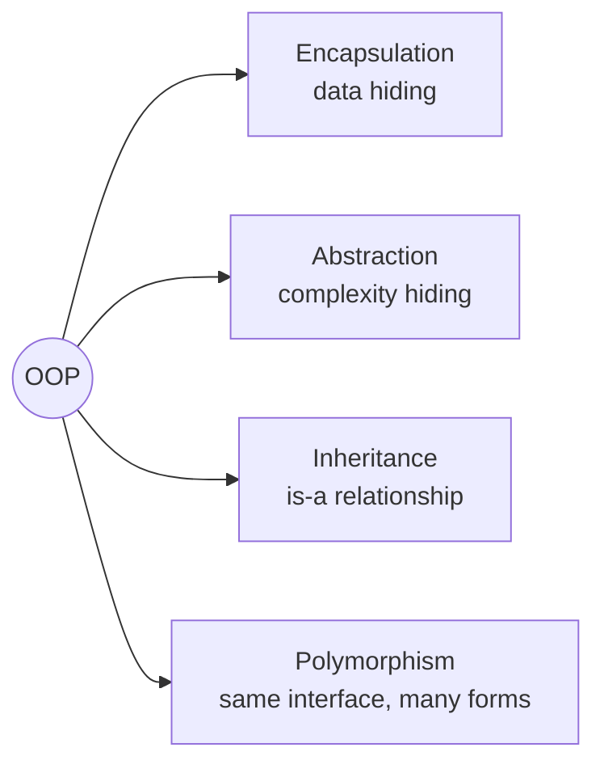
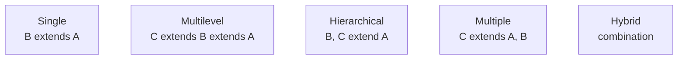
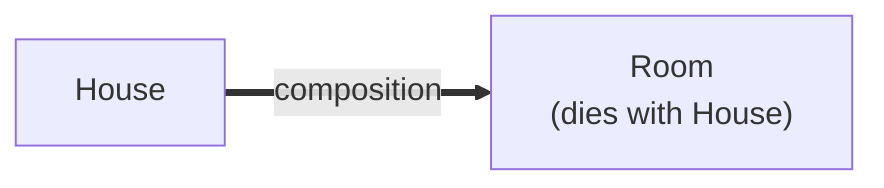
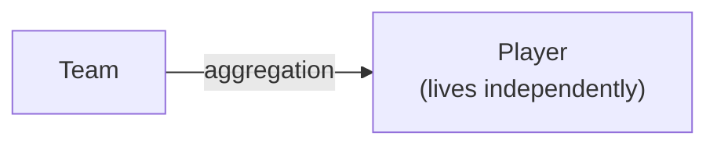
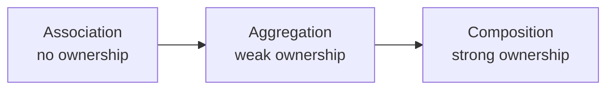
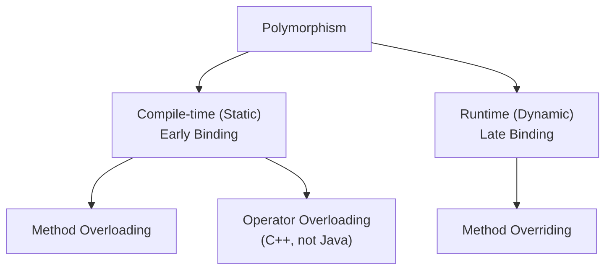
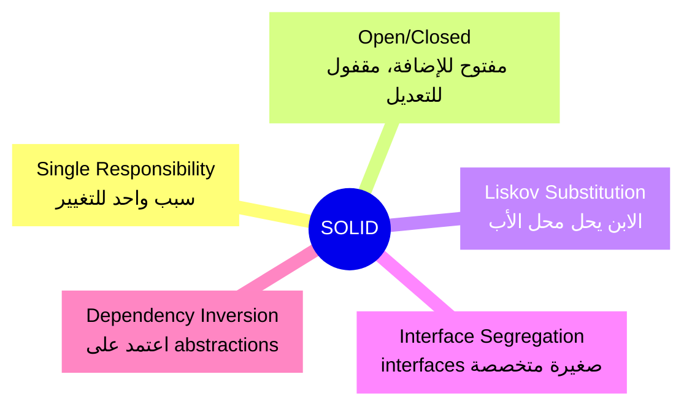
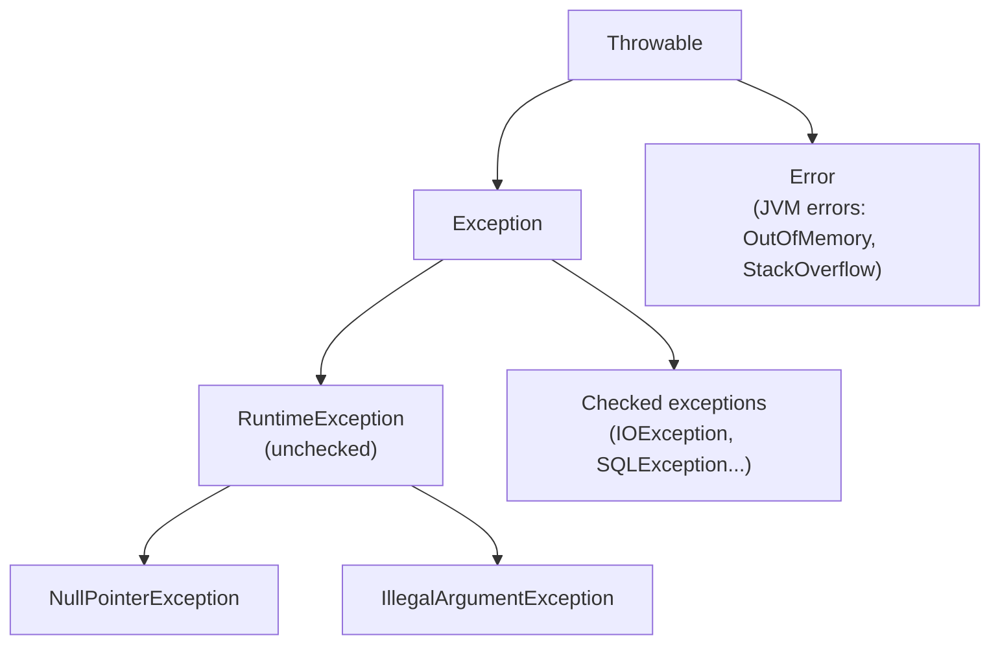
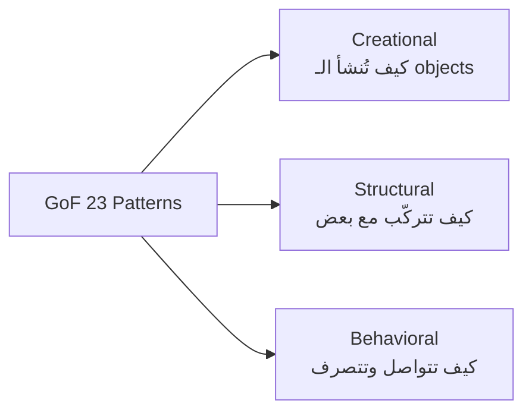

# تراك 1 — OOP: بنك أسئلة إنترفيو (المرحلة 1)

> **الفورمات:** كل سؤال بيبدأ بـ **الشرح العميق** (اللي تذاكره وتفهم منه)، بعده **⚡ الإجابة السريعة** (مراجعة الإنترفيو)، وأخيراً **↳ الفخ / الـ follow-up المتوقع** (اللي المُنترفيور بيرمي بيه بعد إجابتك).

> **اللغة:** Java، كومنتات إنجليزي. الملاحظات الخاصة بـ Java متعلّمة بـ **📌 Java-specific**.

> **حالة الملف:** المرحلة 1 (Q1–30): الأساسيات + العلاقات. المرحلتين 2 و 3 جايين بعد المراجعة.

## 🗺️ خريطة المرحلة 1

- **القسم 1 — مقدمة OOP** (Q1–8): إيه هو، ليه، الـ 4 pillars
- **القسم 2 — Class & Object** (Q9–12): البنية الأساسية
- **القسم 3 — Encapsulation** (Q13–16): تغليف البيانات
- **القسم 4 — Abstraction** (Q17–20): إخفاء التعقيد
- **القسم 5 — Constructors** (Q21–24): إنشاء الـ objects
- **القسم 6 — Inheritance** (Q25–27): الوراثة + أنواعها
- **القسم 7 — Relationships** (Q28–30): Composition, Aggregation, Association

---

# القسم 1 — مقدمة OOP (Q1–8)

### 1. إيه هي الـ OOP؟

الـ **Object-Oriented Programming** أسلوب برمجة بننمذج بيه المشاكل في صورة **objects**، كل object بيجمّع جواه **البيانات** (state/attributes) و**السلوك** (behavior/methods) اللي بيشتغل على البيانات دي في وحدة واحدة بتحمي نفسها.

الفكرة الأساسية: بدل ما الكود يبقى functions طايحة والـ data منفصلة عنها في مكان تاني (procedural style)، بنجمّع الاتنين في كيان واحد بيمثّل حاجة من العالم الحقيقي — سيارة، حساب بنكي، مستخدم — والكيان ده بيتحكم في بياناته بنفسه.

```java
// procedural style: data and functions are separate, no protection
double balance = 5000;
double withdraw(double balance, double amount) { return balance - amount; } // no rules!
balance = -99999;                                    // anyone can set it to anything

// OOP style: data is protected, behavior enforces rules
class BankAccount {
    private double balance;                          // hidden from outside
    public void withdraw(double amount) {
        if (amount > balance) throw new IllegalStateException("insufficient funds");
        balance -= amount;                           // object protects its own state
    }
}
```

**⚡ الإجابة السريعة:** أسلوب برمجة بننمذج المشاكل في صورة objects، كل object بيجمّع الـ state والـ behavior في وحدة واحدة بتحمي نفسها.

**↳ الفخ:** لو قلت "OOP يعني classes و objects" دي إجابة junior. الكلمة المفتاح: *نجمّع الـ state والـ behavior في وحدة تحمي بياناتها*.

---

### 2. ليه ظهرت الـ OOP؟

في الستينات والسبعينات، البرامج كبرت لدرجة إن الـ procedural code بقى مستحيل يتصان. المشاكل الرئيسية كانت:

1. **الـ data مكشوفة لأي كود** — أي function تقدر تغيّر أي متغيّر → آثار جانبية غير متوقعة.
2. **صعوبة إعادة الاستخدام** — الكود مربوط بسياقه، صعب تنقله لمكان تاني.
3. **صعوبة الصيانة** — تعديل بسيط في مكان بيكسر 10 حاجات في أماكن تانية.
4. **الـ spaghetti code** — تدفّق التنفيذ بيتشابك ويبقى صعب المتابعة.

الـ OOP بيحل الأربعة بـ:
- **Encapsulation** → البيانات محمية.
- **Inheritance** → إعادة استخدام بلا نسخ.
- **Abstraction** → واجهات بسيطة على تعقيد داخلي.
- **Polymorphism** → مرونة في التوسّع بلا كسر القديم.

**⚡ الإجابة السريعة:** ظهرت لحل مشاكل الـ procedural code لما المشاريع كبرت: data مكشوفة، صعوبة إعادة استخدام، صعوبة صيانة، spaghetti code.

**↳ الفخ / follow-up:** "طب OOP دايماً الأحسن؟" → **لأ**. للـ data pipelines البسيطة والـ stateless transformations، الـ functional style أنضف. OOP بتلمع لما فيه كيانات ليها هوية وحالة وسلوك بيتغيّر.

---

### 3. إيه هي مميزات (فوائد) OOP؟

| الفايدة | معناها | مثال |
|---|---|---|
| **Modularity** | كل كيان منعزل في class | تعدّل في `BankAccount` مبيأثرش على `User` |
| **Reusability** | تكتب مرة، تستخدم كتير | `SavingsAccount extends BankAccount` |
| **Maintainability** | الباج في مكان واحد | مشكلة في السحب؟ method واحدة بس |
| **Extensibility** | تضيف بلا كسر القديم | نوع حساب جديد بلا لمس القديم |
| **Data Hiding** | حماية الـ state | private + getters/setters |
| **Testability** | كل class تختبره لوحده | mock الـ dependencies |

**⚡ الإجابة السريعة:** modularity, reusability, maintainability, extensibility, data hiding, testability.

**↳ الفخ:** لو المُنترفيور سأل "قدّر تدّيني مثال حي من شغلك؟" — جهّز قصة قصيرة (STAR): "في مشروع كنت شغّال عليه، احتجت أضيف نوع جديد من X، الـ polymorphism خلّاني أضيفه بلا لمس القديم." الإجابة المجرّدة بتقلّل قيمتك.

---

### 4. إيه هي الـ 4 pillars الأساسية للـ OOP؟

الأربعة الأساسية: **Encapsulation** (التغليف) · **Abstraction** (التجريد) · **Inheritance** (الوراثة) · **Polymorphism** (تعدد الأشكال).



كل واحد بيخدم غرض مختلف:
- **Encapsulation** بيخبّي **إزاي البيانات محفوظة** (implementation).
- **Abstraction** بيخبّي **إزاي الشغل بيتم** (complexity).
- **Inheritance** بيدّي إعادة استخدام عبر علاقة "is-a".
- **Polymorphism** بيدّي مرونة عبر "same interface, different behavior".

**⚡ الإجابة السريعة:** Encapsulation, Abstraction, Inheritance, Polymorphism (حيلة الحفظ: **A PIE**).

**↳ الفخ:** لو المُنترفيور سأل "أنهي واحد الأهم؟" — الأصح: "كلهم بيخدموا هدف واحد. بس عملياً الـ **Polymorphism** بيحقق أعمق فايدة لأنه بيمكّن الـ Open/Closed principle." ده بيوري نضج مش حفظ.

---

### 5. Procedural vs OOP — الفرق الجوهري؟

| | Procedural | OOP |
|---|---|---|
| الوحدة | Function | Object |
| الـ data | منفصلة عن الـ functions | متجمّعة مع الـ behavior |
| الحماية | لا (global variables) | Encapsulation |
| إعادة الاستخدام | نسخ / include | Inheritance / composition |
| المدخل | top-down | bottom-up |
| المثال | C, Pascal | Java, C++, Python |

**⚡ الإجابة السريعة:** Procedural = data + functions منفصلين (top-down). OOP = data + behavior في object واحد (bottom-up).

**↳ الفخ:** OOP مش دايماً "أحسن" — للنصوص البسيطة والـ scripts، procedural أوضح وأقصر. الاختيار حسب المشكلة.

---

### 6. إيه الفرق بين OOP و Structured Programming؟

**Structured Programming** = تنظيم الكود في blocks منطقية (if/else, loops, functions) بلا `goto`. **OOP** بيبني فوقه بإضافة الـ **objects** كوحدة تنظيم أعلى.

بمعنى تاني: كل OOP هو structured، بس مش كل structured هو OOP. الـ C code منظّم لكن procedural. Java code منظّم و OOP.

**⚡ الإجابة السريعة:** Structured = تنظيم داخل الـ function (بلا goto). OOP = تنظيم حوالين الـ object (data + behavior معاً).

**↳ الفخ:** الاتنين مش متضادين — الـ methods جوّه الـ class في OOP لسه بتتبع مبادئ structured programming.

---

### 7. إيه هي أشهر لغات OOP؟

- **Java** — pure OOP تقريباً (بلا global functions).
- **C++** — hybrid (بيدعم OOP و procedural).
- **Python** — multi-paradigm (OOP + functional + procedural).
- **C#** — زي Java مع إضافات.
- **JavaScript** — prototype-based OOP.
- **Kotlin, Swift, Ruby** — OOP حديثة.

الاختلافات الجوهرية:
- Java و C# ما بيدعموش multiple class inheritance، C++ و Python بيدعموه.
- Java كل حاجة جوّه class، C++ ممكن functions بره الـ classes.
- JavaScript بيستخدم prototypes بدل classes التقليدية (لحد ES6).

**⚡ الإجابة السريعة:** Java, C++, C#, Python, JavaScript, Kotlin, Swift, Ruby.

**↳ الفخ:** لو سُئلت عن الفرق بين لغات — ركّز على واحد أو اتنين تعرفهم كويس، متغطّيش كل حاجة سطحياً.

---

### 8. ليه الـ OOP منتشرة أوي؟

- **بتنمذج العالم الحقيقي** بشكل طبيعي (سيارة، مستخدم، حساب) → التفكير أسهل.
- **بتوسّع للمشاريع الكبيرة** — الـ modularity والـ encapsulation بيخلّوا فرق كبيرة تشتغل معاً بلا تصادم.
- **الـ frameworks الحديثة** كلها OOP (Spring, .NET, Django) — الاستثمار في اللغات دي كبير.
- **الـ patterns والـ best practices** ناضجة (GoF، SOLID، Clean Architecture).

**⚡ الإجابة السريعة:** بتنمذج العالم الحقيقي طبيعياً، بتتوسّع للمشاريع الكبيرة، الـ frameworks الرئيسية OOP، والـ patterns ناضجة.

**↳ الفخ:** الـ functional programming بيرجع بقوة (Scala, Elixir, حتى في JS)، وكتير من مشاكل OOP (deep inheritance, mutable state) بتحلها. الإنترفيو الناضج يقدّر إنك تعرف حدود الأداة.

---

# القسم 2 — Class & Object (Q9–12)

### 9. إيه هو الـ Class؟

الـ **class** هو **blueprint / template / قالب** بيحدد بنية الـ objects: أنهي attributes (data) هيكون عندهم، وأنهي methods (behavior) هيقدروا يعملوها. الكلاس نفسه **مش بياخد ميموري** — هو مجرد تعريف. الميموري بيتاخد لما تعمل object من الكلاس.

```java
// blueprint: defines what a Car looks like and what it can do
class Car {
    private String color;          // attribute (state)
    private int speed;             // attribute (state)

    public void accelerate() {     // behavior
        speed += 10;
    }
}
// no memory allocated yet — just a definition
```

**⚡ الإجابة السريعة:** blueprint/template بيحدد بنية الـ objects (attributes + methods). الكلاس نفسه ما بياخدش ميموري.

**↳ الفخ / follow-up:** "الـ class بياخد ميموري؟" → **لأ**. الميموري بتتاخد للـ objects. الاستثناء: `static` members بيتحطوا في مكان مشترك مرة واحدة.

---

### 10. إيه هو الـ Object؟

الـ **object** هو **instance فعلي** من الكلاس، بياخد ميموري، وبيحمل قيم حقيقية لكل attribute. لو الكلاس زي التصميم الهندسي للسيارة، الـ object هو السيارة الحقيقية اللي في الشارع بلونها ورقمها.

```java
Car myCar = new Car();             // object 1: takes memory
Car yourCar = new Car();           // object 2: separate memory, own state
myCar.accelerate();                // affects myCar's speed only
```

كل object عنده:
- **Identity** (المكان في الميموري / الـ reference).
- **State** (قيم الـ attributes).
- **Behavior** (methods اللي يقدر ينفّذها).

**⚡ الإجابة السريعة:** instance فعلي من الكلاس، بياخد ميموري، بيحمل state خاص بيه، ويقدر ينفّذ methods الكلاس.

**↳ الفخ:** objectين ليهم نفس القيم مش بالضرورة "متساويين" — عندهم **identity مختلفة** (references مختلفة). قارن بـ `equals()` مش `==`.

---

### 11. لازم أعمل object من كل class؟

**لأ**. الاستثناءات:
1. **Utility classes** بـ static methods بس (`Math`, `Collections`) — بتتنادى عبر اسم الكلاس مباشرة.
2. **Abstract classes** — مينفعش تعمل منها object مباشرة، لازم subclass.
3. **Interfaces** — تعريف بس، مينفعش instance.
4. **Classes بـ private constructor** — زي Singleton، بيتحكم في الإنشاء داخلياً.

```java
class MathUtils {
    private MathUtils() {}                          // prevent instantiation
    public static int square(int x) { return x * x; }
}
MathUtils.square(5);                                // no object needed
```

**⚡ الإجابة السريعة:** لأ. static-only classes، abstract classes، interfaces، وSingletons ما بتحتاجش (أو ما بتسمحش بـ) instantiation عادي.

**↳ الفخ:** "طب ليه ما تحطش كل الـ methods static وتوفّر إنشاء objects؟" — لأنك بتفقد كل مزايا OOP: polymorphism، dependency injection، testability. static state = tight coupling.

---

### 12. كام object أقدر أعمل من class واحد؟

**عدد غير محدود** — طول ما فيه ميموري كافية. كل `new` بينشئ instance منفصل بـ state خاص. الكلاس بيبقى الـ blueprint، والـ objects instances متعددة من نفس الـ blueprint.

```java
for (int i = 0; i < 1000; i++) {
    User u = new User("user" + i);      // 1000 separate objects, each with own state
}
```

الحد الوحيد: **الميموري المتاحة** (heap). بعد كده بتلاقي `OutOfMemoryError`.

**⚡ الإجابة السريعة:** عدد غير محدود، طول ما فيه ميموري في الـ heap.

**↳ الفخ:** لو محتاج نسخة واحدة بس (زي DB connection pool)، استخدم **Singleton pattern** أو **DI container scope singleton**. تكرار الإنشاء بلا داعي = memory waste.

---

# القسم 3 — Encapsulation (Q13–16)

### 13. إيه هو الـ Encapsulation؟

الـ **Encapsulation** = تغليف الـ state (البيانات) والـ behavior (اللي بيشتغل عليها) في وحدة واحدة، مع **إخفاء البيانات** (data hiding) بحيث ما يوصلهاش حد من بره مباشرة. الوصول بيتم عبر methods بتحمي **الـ invariants** (شروط صحة الـ state).

الفكرة الجوهرية: الـ object بيحمي بياناته بنفسه. لو أي حاجة عايزة تغيّرها، لازم تعدّي من "الحرّاس" (methods) اللي هما اللي بيقرروا هل التغيير مسموح ولا لأ.

```java
class BankAccount {
    private double balance;                         // hidden: no direct access

    public void deposit(double amount) {
        if (amount <= 0) throw new IllegalArgumentException("must be positive");
        balance += amount;                          // guarded change
    }

    public double getBalance() { return balance; }  // controlled read
}

BankAccount acc = new BankAccount();
// acc.balance = -99999;                            // compile error: private
acc.deposit(500);                                    // must go through the method
```

**⚡ الإجابة السريعة:** تغليف الـ state والـ behavior في وحدة واحدة، مع إخفاء البيانات (private) والوصول عبر methods بتحمي الـ invariants.

**↳ الفخ:** كتير بيلخبطوا بين encapsulation و abstraction. **Encapsulation = data hiding** (إزاي البيانات محفوظة). **Abstraction = complexity hiding** (إزاي الشغل بيتم). التفريق ده مهم جداً.

---

### 14. الـ getters/setters مش كسر للـ encapsulation؟

**سؤال شائك ومهم**. الإجابة: **معتمدة على التنفيذ**.

**Setter بيكسر encapsulation** لو بيحط القيمة على طول بلا أي منطق:
```java
public void setBalance(double b) { this.balance = b; }  // NOT encapsulation — same as public field
```
ده بيخلي الـ field عملياً public بخطوة زيادة — أي قيمة تقدر توصل، مفيش أي حماية.

**Setter بيحقق encapsulation** لو بيحمي الـ invariants:
```java
public void setBalance(double b) {
    if (b < 0) throw new IllegalArgumentException("negative not allowed");
    this.balance = b;
}
```

**الأفضل من setters** في التصميم الحديث:
1. **Immutability** — مفيش setters خالص، القيم بتتحط في الـ constructor بس.
2. **Methods بمعنى domain** — `deposit()`/`withdraw()` بدل `setBalance()`. الاسم بيعبّر عن العملية مش عن الـ field.

**⚡ الإجابة السريعة:** الـ getter/setter لوحده مش encapsulation. الـ encapsulation الحقيقي بيحمي invariants (`if (b < 0) throw...`). الأفضل: immutability + methods domain-driven.

**↳ الفخ:** لو المُنترفيور رمى الكود ده وسأل "ده encapsulation؟":
```java
private int age;
public int getAge() { return age; }
public void setAge(int age) { this.age = age; }
```
الإجابة: "syntactically أيوة، semantically لأ — الـ setter بلا validation عملياً كأنه field عام."

---

### 15. Encapsulation بيفيد في إيه عملياً؟

**1. حماية الـ invariants**: تضمن إن الـ object دايماً في حالة صحيحة. مفيش رصيد سالب، مفيش عمر أقل من 0، مفيش state متناقض.

**2. تغيير التنفيذ الداخلي بلا كسر الـ callers**: تقدر تغيّر إزاي الـ balance متخزّن (مثلاً من `double` لـ `BigDecimal`) بلا ما أي حد يعرف — طول ما الـ API متغيّرش.

**3. Thread safety محلية**: لو الـ access كله عبر methods، تقدر تحط `synchronized` في مكان واحد وتحمي الـ object.

**4. Debugging أسهل**: أي تغيير في الـ state لازم يعدي من methods محدودة → تضع breakpoint فيها وتلحق أي تعديل.

**5. Auditing و logging**: تضيف logging في الـ setters بلا لمس أي كود تاني.

**⚡ الإجابة السريعة:** حماية invariants، تغيير التنفيذ الداخلي بلا كسر الـ callers، thread safety محلية، debugging وauditing أسهل.

**↳ الفخ:** بلا encapsulation، الـ state ممكن يبقى corrupted من أي مكان في الكود، والـ bugs بتاعته بتبقى مستحيلة الـ trace.

---

### 16. Access Modifiers في Java — إيه الفرق؟

من الأوسع للأضيق:

| Modifier | نفس الكلاس | نفس الـ package | Subclass (package تاني) | أي مكان |
|---|---|---|---|---|
| `public` | ✅ | ✅ | ✅ | ✅ |
| `protected` | ✅ | ✅ | ✅ | ❌ |
| **default** (بلا modifier) | ✅ | ✅ | ❌ | ❌ |
| `private` | ✅ | ❌ | ❌ | ❌ |

📌 **Java-specific:** مفيش كلمة `default` تكتبها كـ access modifier. لو مكتبتش أي حاجة، تلقائياً بيبقى **package-private**.

```java
public class Foo {
    public    int a;      // anyone
    protected int b;      // same package + subclasses (even in other packages)
    /* pkg */ int c;      // same package only
    private   int d;      // this class only
}
```

**⚡ الإجابة السريعة:** `public` (أي مكان) > `protected` (package + subclasses) > default (package بس) > `private` (نفس الكلاس بس).

**↳ الفخ:** الفرق بين `protected` و default (package-private): `protected` بيوصل للـ subclass **حتى في package تاني**. default = نفس الـ package بس. سؤال دقيق بيتسأل كتير.

---

# القسم 4 — Abstraction (Q17–20)

### 17. إيه هو الـ Abstraction؟

الـ **Abstraction** = إخفاء التعقيد الداخلي وكشف واجهة بسيطة تركّز على **"إيه"** بدل **"إزاي"**. المستخدم بيتعامل مع الفكرة العامة، والتفاصيل مخفية.

**التشبيه الكلاسيكي**: عجلة القيادة في السيارة. بتلفّها يمين، السيارة بتروح يمين. مش محتاج تعرف الـ steering rack والـ hydraulics والـ power steering pump. الواجهة (العجلة) بسيطة، التعقيد مخفي.

في الكود:
```java
interface PaymentGateway {
    void pay(double amount);                        // WHAT, not HOW
}

class StripeGateway implements PaymentGateway {
    public void pay(double amount) {
        // 200 lines of Stripe API calls hidden here
    }
}

// caller doesn't know or care which gateway
void checkout(PaymentGateway gw, double total) {
    gw.pay(total);
}
```

الأدوات في Java: **abstract class** و **interface**.

**⚡ الإجابة السريعة:** إخفاء التعقيد وكشف واجهة بسيطة تركّز على "إيه" بدل "إزاي". الأدوات: abstract class و interface.

**↳ الفخ:** لو المُنترفيور سأل "الفرق بين abstraction و encapsulation؟" — دي **من أشهر أسئلة الـ follow-up**، جاي في السؤال الجاي.

---

### 18. Abstraction vs Encapsulation — الفرق الدقيق؟

**السؤال الأشهر في إنترفيوهات OOP.** الفرق:

| | Encapsulation | Abstraction |
|---|---|---|
| بيخبّي | **البيانات** (data / implementation) | **التعقيد** (complexity / details) |
| السؤال اللي بيجاوبه | إزاي أحمي الـ state؟ | إزاي أبسّط الاستخدام؟ |
| الأداة | `private`, getters/setters, invariants | `abstract class`, `interface` |
| المستوى | تنفيذي (implementation-level) | تصميمي (design-level) |
| بجملة | إخفاء **إزاي البيانات محفوظة** | إخفاء **إزاي الشغل بيتم** |

مثال يوضّح الاتنين معاً:
```java
interface Vehicle {                                  // abstraction: hides "how"
    void start();
}
class ElectricCar implements Vehicle {
    private int batteryLevel;                        // encapsulation: hides "state"
    public void start() {
        if (batteryLevel < 10) throw new RuntimeException("charge first");
        // 100 lines of ignition sequence hidden
    }
}
```

**⚡ الإجابة السريعة:** Encapsulation بيخبّي **إزاي البيانات محفوظة** (data hiding). Abstraction بيخبّي **إزاي الشغل بيتم** (complexity hiding).

**↳ الفخ:** لو خلطت بينهم، ده أوضح دليل على fundamental gap. اتمرّن على الفرق ده لحد ما تقوله في نومك.

---

### 19. Abstract Class vs Interface — الفرق؟

| | Abstract Class | Interface |
|---|---|---|
| بيحتوي تنفيذ (method body)؟ | أيوة | من Java 8: default methods بس |
| Fields (state)؟ | أيوة (instance fields) | لأ (constants بس — `public static final`) |
| وراثة | واحدة بس (single) | متعددة (multiple `implements`) |
| Constructor؟ | أيوة | لأ |
| السؤال اللي بيجاوبه | **is-a** (إيه نوع الحاجة دي؟) | **can-do** (إيه القدرات؟) |
| مناسب لـ | classes قريبة بتشارك كود | عقود لأنواع مختلفة |

```java
// abstract class: shared code + is-a relationship
abstract class Animal {
    protected String name;
    public Animal(String name) { this.name = name; }
    public void sleep() { /* shared for all animals */ }
    public abstract void makeSound();                // subclasses must implement
}

// interface: capability contract
interface Swimmer {
    void swim();
}

class Dolphin extends Animal implements Swimmer {   // is-a Animal, can-do Swim
    public Dolphin(String name) { super(name); }
    public void makeSound() { /* ... */ }
    public void swim() { /* ... */ }
}
```

**⚡ الإجابة السريعة:** abstract class للـ **is-a** مع كود مشترك + state (وراثة واحدة). interface للـ **can-do** بلا state (وراثة متعددة).

**↳ الفخ:** "الـ default methods في Java 8 ألغت الفرق؟" → **قرّبت الشبه، بس الفرق باقي**: الـ interface لسه ما بيحملش instance state، والوراثة single vs multiple.

---

### 20. Abstract method — إيه هو؟

**Abstract method** = تعريف method **بلا body** (بلا تنفيذ). الكلاس اللي فيه abstract method لازم يبقى `abstract` كمان، ومينفعش تعمل منه instance مباشرة. الـ subclasses ملزومة تنفّذه.

```java
abstract class Shape {
    abstract double area();                          // no body — subclasses must implement
}

class Circle extends Shape {
    private double radius;
    Circle(double r) { this.radius = r; }
    @Override
    double area() { return Math.PI * radius * radius; }
}

// Shape s = new Shape();                            // compile error: cannot instantiate abstract
Shape s = new Circle(5);                             // OK: instantiate a concrete subclass
```

**فايدته**: بتفرض على الأبناء إنهم يوفّروا تنفيذ. بتقدر تكتب كود عام يشتغل مع الـ abstract type، والـ runtime بيقرر أنهي subclass ينفّذ.

**⚡ الإجابة السريعة:** method بلا body في abstract class، الـ subclasses ملزومة تنفّذها. الكلاس اللي فيه abstract method لازم يبقى abstract.

**↳ الفخ:** الـ abstract class ممكن يكون فيه constructor؟ — **أيوة**. بيتنادى من الأبناء عبر `super()`. مفيد لتهيئة state مشترك.

---

# القسم 5 — Constructors (Q21–24)

### 21. إيه هو الـ Constructor؟

الـ **Constructor** method خاصة بتتنفّذ **تلقائياً عند إنشاء object** لتهيئة الـ state الابتدائي. اسمها لازم يكون نفس اسم الكلاس، ومفيش return type (ولا حتى `void`).

```java
class User {
    private String name;
    private int age;

    User(String name, int age) {                     // constructor
        this.name = name;
        this.age = age;
    }
}

User u = new User("Mohamed", 30);                    // constructor runs automatically
```

**الغرض الأساسي**: تضمن إن الـ object يبدأ في **حالة صحيحة**. لو محتاج قيم إلزامية (زي `email`)، خلّيها في الـ constructor، مش setter منفصل يمكن ينساه المستخدم.

**⚡ الإجابة السريعة:** method خاصة بنفس اسم الكلاس، بلا return type، بتتنفّذ تلقائياً عند إنشاء object لتهيئة الـ state.

**↳ الفخ:** "ينفع الـ constructor يكون private؟" → **أيوة**. لتمنع الإنشاء المباشر (Singleton، factory pattern).

---

### 22. أنواع الـ Constructors في Java؟

**1. Default (No-arg) Constructor**: بلا parameters. لو مكتبتش أي constructor، الكومبايلر بيدّيك واحد فاضي تلقائياً.
```java
class User {
    String name;
    // compiler adds: User() {} automatically
}
```

**2. Parameterized Constructor**: بياخد arguments لتهيئة الـ state.
```java
class User {
    String name;
    User(String name) { this.name = name; }
}
```

**3. Copy Constructor**: بينشئ object جديد بنسخ قيم object تاني من نفس النوع.
```java
class Point {
    int x, y;
    Point(Point other) {                             // copy constructor
        this.x = other.x;
        this.y = other.y;
    }
}
```

📌 **Java-specific:** Java ما بتدعمش copy constructor كـ concept مدمج زي C++. بتعمله يدوياً. البديل الشائع في Java: `clone()` (بس ليها مشاكل) أو **copy factory method**.

**⚡ الإجابة السريعة:** Default (بلا params), Parameterized (بـ params), Copy (بيستقبل object من نفس النوع).

**↳ الفخ:** "لو كتبت constructor بـ params، الـ default بيفضل موجود؟" → **لأ**. أول ما تكتب أي constructor بـ params، الـ default بيختفي. لو محتاجه، اكتبه صراحة.

---

### 23. يعني إيه Constructor Overloading؟

نفس اسم الكلاس، لكن كذا constructor بـ **parameters مختلفة** (عدد أو نوع). المستخدم بيختار الأنسب حسب البيانات المتاحة.

```java
class Rectangle {
    int width, height;

    Rectangle() {                                    // default: unit square
        this(1, 1);                                  // delegates to another constructor
    }
    Rectangle(int side) {                            // square
        this(side, side);
    }
    Rectangle(int width, int height) {               // full spec
        this.width = width;
        this.height = height;
    }
}
```

الـ `this(...)` بينادي constructor تاني في نفس الكلاس (constructor chaining). لازم يكون **أول سطر** في الـ constructor.

**⚡ الإجابة السريعة:** كذا constructor بنفس الاسم لكن بـ parameters مختلفة. `this(...)` للـ chaining، لازم أول سطر.

**↳ الفخ:** لو الـ params كتير جداً (5+)، الـ constructor overloading بيبقى فوضى. الحل: **Builder pattern**. تفصيله في المرحلة 3.

---

### 24. إيه هو الـ Destructor؟ Java عندها destructor؟

**Destructor** = method بتتنفّذ عند تدمير الـ object لتحرير الموارد (memory, file handles, connections).

📌 **Java-specific:** **Java ما عندهاش destructor** بالمعنى التقليدي. عندها:

1. **Garbage Collector (GC)** — بيدير الميموري تلقائياً. لما مفيش references لـ object، الـ GC بيحرّرها لاحقاً.
2. **`finalize()` method** — كانت تحاول تلعب دور destructor. **deprecated من Java 9** لأنها غير موثوقة (مش مضمون تتنفّذ).
3. **`try-with-resources`** — للموارد اللي محتاجة تحرير حتمي (files, connections). يشتغل مع `AutoCloseable`.

```java
// modern Java: use try-with-resources for deterministic cleanup
try (FileReader r = new FileReader("file.txt")) {
    // use r
}                                                    // r.close() called automatically
```

في C++ الوضع مختلف — فيه destructor حقيقي (`~ClassName()`) بيتنفّذ deterministically.

**⚡ الإجابة السريعة:** Java مفيهاش destructor. الـ Garbage Collector بيدير الميموري. للموارد الأخرى، استخدم `try-with-resources` مع `AutoCloseable`.

**↳ الفخ:** "استخدم finalize()" = **علامة تحذير**. الـ modern Java بتتجنّبها تماماً — غير موثوقة وعندها أداء سيئ.

---

# القسم 6 — Inheritance (Q25–27)

### 25. إيه هي الـ Inheritance؟

الـ **Inheritance** = آلية بيرث بيها class (child/subclass) الـ state والـ behavior من class تاني (parent/superclass)، ويقدر يضيف أو يعدّل. بتمثّل علاقة **"is-a"**.

```java
class Animal {
    protected String name;
    public Animal(String name) { this.name = name; }
    public void eat() { System.out.println(name + " is eating"); }
}

class Dog extends Animal {                           // Dog is-a Animal
    public Dog(String name) { super(name); }         // call parent constructor
    public void bark() { System.out.println(name + " says woof"); }
}

Dog d = new Dog("Rex");
d.eat();                                             // inherited from Animal
d.bark();                                            // Dog's own
```

**الفوائد**:
1. **إعادة استخدام** — مش بتكتب الـ `eat()` تاني في كل نوع حيوان.
2. **تنظيم هرمي** — تصنيف طبيعي (`Dog → Animal → LivingBeing`).
3. **Polymorphism** — تتعامل مع الأب، الابن ينفّذ.

**العيوب**:
1. **Tight coupling** بين الأب والابن.
2. **Fragile base class** — تعديل في الأب ممكن يكسر أبناء ما تعرفش عنهم.
3. **Deep hierarchies** بتبقى صعبة الصيانة.

**⚡ الإجابة السريعة:** class بيرث state وbehavior من class تاني (is-a relationship). فوائد: إعادة استخدام + polymorphism. عيوب: tight coupling + fragility.

**↳ الفخ:** القاعدة الذهبية الحديثة: **"Favor composition over inheritance"**. تفصيلها في القسم 7.

---

### 26. أنواع الـ Inheritance؟



1. **Single**: class واحد بيرث من class واحد. `B extends A`.
2. **Multilevel**: سلسلة وراثة. `C extends B extends A`.
3. **Hierarchical**: كذا class بيرثوا من نفس الأب. `B, C, D extend A`.
4. **Multiple**: class بيرث من كذا parent. `C extends A, B` — **مش مسموح في Java للـ classes** (بس مسموح للـ interfaces).
5. **Hybrid**: خليط من الأنواع اللي فوق.

📌 **Java-specific:** Java ما بتدعمش **multiple class inheritance** لتجنّب الـ **diamond problem**. بتدعم multiple interface inheritance لأن الـ interfaces (تقليدياً) بلا state.

```java
// multiple interface inheritance is OK
class Duck extends Animal implements Swimmer, Flyer { /* ... */ }
```

**⚡ الإجابة السريعة:** Single, Multilevel, Hierarchical, Multiple (مش في Java للـ classes), Hybrid. Java بتدعم multiple **interface** inheritance بس.

**↳ الفخ:** "ليه Java ما بتدعمش multiple class inheritance؟" → **Diamond problem**. لو `D` بيرث من `B` و`C`، والاتنين ورثوا method من `A` وعملوها override مختلف، مين النسخة اللي تتنفّذ؟ Java تجنّبتها بمنع multiple class inheritance.

---

### 27. إيه هي حدود / مشاكل الـ Inheritance؟

**1. Tight Coupling**: الابن معتمد على تفاصيل الأب. تغيير الأب = خطر كسر الأبناء (Fragile Base Class).

**2. Deep Hierarchies**: `Employee → Manager → SeniorManager → RegionalManager` — تعديل بسيط في الأعلى يمشي في كل السلسلة.

**3. Inheritance بيكسر الـ Encapsulation**: الأبناء بيوصلوا لـ `protected` members في الأب — كأنهم بيلمسوا الـ implementation بتاعه.

**4. is-a المزيّفة**: كتير بيستخدموا وراثة لمجرد إعادة استخدام كود، حتى لو مفيش علاقة is-a حقيقية → تصميم سيئ.
   - مثال شهير: `Stack extends Vector` في Java. الـ Stack مش نوع من الـ Vector منطقياً، والوراثة كشفت methods زي `add(index, element)` اللي بتكسر مبدأ LIFO.

**5. Diamond Problem**: في اللغات اللي بتدعم multiple inheritance.

**6. مش مرن وقت التشغيل**: الوراثة **compile-time**. مبتقدرش تغيّر الـ parent runtime. الـ composition بيدّيك ده.

**⚡ الإجابة السريعة:** tight coupling, deep hierarchies, بيكسر encapsulation, is-a مزيّفة، diamond problem، compile-time بس.

**↳ الفخ:** "طب امتى الوراثة تبقى الاختيار الصح؟" → لما فيه is-a **حقيقية** + سلوك مشترك متماسك + الأبناء ما محتاجينش يخالفوا الأب في السلوك الأساسي.

---

# القسم 7 — Relationships: Composition, Aggregation, Association (Q28–30)

### 28. إيه هي الـ Composition؟

الـ **Composition** = علاقة **"has-a"** بملكية **قوية**: الجزء بيتخلق ويموت مع الكل. لو الكل راح، الجزء يراح. الجزء ما لهوش وجود مستقل.

```java
class Room {
    private String name;
    Room(String name) { this.name = name; }
}

class House {
    private final List<Room> rooms = new ArrayList<>();
    House() {
        rooms.add(new Room("kitchen"));              // rooms created inside the house
        rooms.add(new Room("bedroom"));
    }
}
// when House is garbage collected, Rooms go too — they have no external reference
```



**العلامات**:
- الجزء بيتخلق داخل الكل (`new Room()` جوّه `House`).
- مفيش reference خارجي للجزء.
- في UML: **معيّن مصمّت ◆**.

**⚡ الإجابة السريعة:** علاقة has-a بملكية قوية. الجزء بيتخلق ويموت مع الكل (بيت وأوض).

**↳ الفخ:** "composition" ليها معنيين — (1) المبدأ العام (has-a بدل is-a)، (2) العلاقة القوية دي بالذات. السياق بيحدد.

---

### 29. إيه هي الـ Aggregation؟

الـ **Aggregation** = علاقة **"has-a"** بملكية **ضعيفة**: الكل بيحتوي الأجزاء، بس الأجزاء بتعيش لوحدها لو الكل اتفكّ.

```java
class Player {
    private String name;
    Player(String name) { this.name = name; }
}

class Team {
    private List<Player> players;
    Team(List<Player> players) { this.players = players; }  // players exist independently
}

// players created outside, passed in
List<Player> squad = List.of(new Player("Ali"), new Player("Omar"));
Team team = new Team(squad);
// if team is dissolved, players still exist and can join other teams
```



**العلامات**:
- الأجزاء بتتنشأ خارج الكل وبتتحقن جواه.
- الأجزاء ممكن تنتمي لأكتر من "كل" في وقت واحد.
- في UML: **معيّن فاضي ◇**.

**⚡ الإجابة السريعة:** علاقة has-a بملكية ضعيفة. الجزء بيعيش مستقل عن الكل (فريق ولاعيبة).

**↳ الفخ:** الفرق بين composition و aggregation دقيق ومهم. السؤال الأشهر: "لو Team اتحل، اللاعيبة بيحصلهم إيه؟" — لو "بيموتوا" → composition. لو "بيروحوا فرق تانية" → aggregation.

---

### 30. إيه هي الـ Association؟ والفرق بين الثلاثة؟

الـ **Association** = أضعف علاقة: مجرد إن objectين بيعرفوا بعض ويتفاعلوا، **بلا ملكية**. الاتنين مستقلين تماماً.

```java
class Doctor {
    public void treat(Patient p) { /* ... */ }       // Doctor uses Patient
}
class Patient {
    public void consult(Doctor d) { /* ... */ }      // Patient uses Doctor
}
// neither owns the other; they just interact
```


**جدول المقارنة النهائي**:

| | Association | Aggregation | Composition |
|---|---|---|---|
| الملكية | مفيش | ضعيفة | قوية |
| دورة الحياة | مستقلة تماماً | الجزء يعيش لوحده | الجزء يموت مع الكل |
| المثال | دكتور ↔ مريض | فريق ◇ لاعيبة | بيت ◆ أوض |
| UML | خط عادي | معيّن فاضي ◇ | معيّن مصمّت ◆ |
| القوة | الأضعف | متوسطة | الأقوى |



**⚡ الإجابة السريعة:** Association (بلا ملكية، مستقلين) < Aggregation (has-a ضعيفة، جزء يعيش لوحده) < Composition (has-a قوية، جزء يموت مع الكل).

**↳ الفخ:** الاختبار العملي: "لو الـ container انحذف، الجزء بيحصله إيه؟" — يعيش لوحده = Aggregation. يموت = Composition. مالوش علاقة أصلاً = Association.

---

## ✅ Checkpoint — المرحلة 1

1. الـ 4 pillars: **A PIE** (Abstraction, Polymorphism, Inheritance, Encapsulation)
2. Class = blueprint (ما بياخدش ميموري) · Object = instance (بياخد ميموري)
3. Encapsulation ≠ getters/setters عشوائية — لازم يحمي invariants
4. Encapsulation (data hiding) vs Abstraction (complexity hiding) — الفرق الجوهري
5. Access modifiers: `public > protected > default > private`
6. Abstract class (is-a + shared code) vs Interface (can-do + no state)
7. Java مفيهاش destructor — GC + try-with-resources
8. Constructor overloading + `this(...)` chaining
9. Inheritance حدودها: tight coupling, fragile base class, Stack/Vector example
10. Java مبتدعمش multiple class inheritance (diamond problem)
11. Association < Aggregation < Composition (الفرق في الملكية ودورة الحياة)

---

*المرحلة 2 جاية → **Polymorphism بعمق** (القسم الأهم): تعريف + أنواع · Overloading كامل (rules, return type, autoboxing, varargs) · Overriding كامل (rules, covariant return, access, exceptions) · Static vs Dynamic binding · Method hiding vs Overriding · Field hiding · Constructor calling overridable method (الفخ) · Upcasting/Downcasting.*

---
---

# تراك 1 — OOP: المرحلة 2 (Polymorphism بعمق)

> **ليه القسم ده الأهم؟** لأن الـ Polymorphism هو أكتر concept بيتسأل بعمق في إنترفيوهات OOP، وأكتر واحد الناس بتقع فيه. الأسئلة هنا بتفرّق junior عن senior فرق واضح.

## 🗺️ خريطة المرحلة 2

- **القسم 8 — تعريف Polymorphism** (Q31–34): الفكرة، الأنواع، الفوائد
- **القسم 9 — Overloading كامل** (Q35–41): rules, return type, autoboxing, varargs, null ambiguity
- **القسم 10 — Overriding كامل** (Q42–49): rules, covariant return, access rules, exceptions, @Override
- **القسم 11 — Binding & Dispatch** (Q50–53): static vs dynamic, virtual method invocation
- **القسم 12 — الفخاخ الشائكة** (Q54–60): method hiding, field hiding, constructor trap, up/downcasting

---

# القسم 8 — تعريف Polymorphism (Q31–34)

### 31. إيه هو الـ Polymorphism؟

الكلمة يونانية: **poly** (متعدد) + **morph** (شكل). في الكود، معناها إن **نفس الـ interface / method name** بيتصرف بأشكال مختلفة حسب الـ context أو النوع الفعلي للـ object.

الفكرة الجوهرية: تكتب كود بيتعامل مع "الفكرة العامة"، والـ runtime بيقرر الشكل الفعلي.

```java
abstract class Shape {
    abstract double area();
}

class Circle extends Shape {
    private double r;
    Circle(double r) { this.r = r; }
    double area() { return Math.PI * r * r; }
}

class Square extends Shape {
    private double side;
    Square(double side) { this.side = side; }
    double area() { return side * side; }
}

// caller code doesn't know which shape — just calls area()
Shape[] shapes = { new Circle(5), new Square(4) };
for (Shape s : shapes) {
    System.out.println(s.area());              // each computes its own area
}
```

**السحر**: لو ضفت `Triangle` بكرة، الـ loop مش هيتغيّر ولا حرف. ده جوهر القوة.

**⚡ الإجابة السريعة:** نفس الـ interface بيتصرف بأشكال مختلفة حسب نوع الـ object الفعلي. من `poly` (متعدد) + `morph` (شكل).

**↳ الفخ:** لو قلت "polymorphism = overriding" دي إجابة ناقصة. Polymorphism نوعان: **compile-time** (overloading) و **runtime** (overriding).

---

### 32. إيه أنواع الـ Polymorphism؟

نوعان أساسيان:



**1. Compile-time Polymorphism (Static / Early Binding)**:
- الكومبايلر بيقرر أنهي method تتنادى **وقت الـ compile**.
- بيتحقق عبر **Method Overloading**.
- مبني على الـ **signature** (اسم + parameters).

**2. Runtime Polymorphism (Dynamic / Late Binding)**:
- الـ JVM بيقرر أنهي method تتنادى **وقت التشغيل** حسب النوع الفعلي للـ object.
- بيتحقق عبر **Method Overriding**.
- مبني على الـ **type الفعلي** للـ object (مش النوع المكتوب).

📌 **Java-specific:** Java ما بتدعمش **operator overloading** (عكس C++). بس فيه استثناء: `+` بيشتغل مع `String` (compiler-level).

**⚡ الإجابة السريعة:** نوعان — **Compile-time** (static, overloading) و **Runtime** (dynamic, overriding).

**↳ الفخ:** المُنترفيور ممكن يسأل "compile-time polymorphism ده polymorphism حقيقي؟" — فيه جدل نظري: البعض بيعتبر overloading مجرد "syntactic sugar"، والـ polymorphism الحقيقي هو الـ runtime. الإجابة الآمنة: "التصنيف التقليدي بيعتبرهم الاتنين polymorphism، لكن الـ runtime أعمق وأقوى."

---

### 33. Polymorphism بيفيد في إيه عملياً؟

**1. Open/Closed Principle**: تضيف سلوك جديد بلا تعديل القديم.
```java
// old code doesn't change when a new shape is added
double totalArea(List<Shape> shapes) {
    double sum = 0;
    for (Shape s : shapes) sum += s.area();     // works for any future Shape subclass
    return sum;
}
```

**2. إلغاء الـ if/else الطويلة**: بدل ما تسأل "إنت مين؟" وتتصرف، بتقول "اعمل شغلك" وكل نوع يعرف نفسه.
```java
// before (violates OCP)
double area(Shape s) {
    if (s instanceof Circle) return /*...*/;
    else if (s instanceof Square) return /*...*/;
    // adding a new shape = modifying this code
}
// after (polymorphism)
double area(Shape s) { return s.area(); }       // shape knows itself
```

**3. Testability**: بتقدر تحقن mock implementations.
```java
void checkout(PaymentGateway gw, double total) { gw.pay(total); }
// in test: pass MockPaymentGateway
// in prod: pass StripeGateway
```

**4. Framework Extensibility**: الـ frameworks بتعتمد على polymorphism للإضافات (Spring, JDBC, Servlets).

**⚡ الإجابة السريعة:** يحقق Open/Closed، يشيل الـ if/else، يمكّن testability بالـ mocks، ويسمح للـ frameworks بالتوسّع.

**↳ الفخ:** الجملة الذهبية اللي تقولها: **"الـ polymorphism بيحوّل الـ if/else من الكود لنظام الأنواع."** بتوري نضج تصميمي.

---

### 34. Static vs Dynamic Polymorphism — الفرق في جدول؟

| | Static (Compile-time) | Dynamic (Runtime) |
|---|---|---|
| متى بيتحدد | Compile-time | Runtime |
| الآلية | Method Overloading | Method Overriding |
| السرعة | أسرع (بيتحدد مبكر) | أبطأ شوية (virtual dispatch) |
| المرونة | أقل | أعلى |
| مبني على | Method signature | النوع الفعلي للـ object |
| Binding | Early binding | Late binding |
| مثال | `add(int, int)` vs `add(double, double)` | `Animal a = new Dog(); a.sound()` |

**⚡ الإجابة السريعة:** Static = compile-time + overloading + early binding + signature-based. Dynamic = runtime + overriding + late binding + actual-type-based.

**↳ الفخ:** أي واحد "أحسن"؟ — سؤال غلط. الاتنين بيخدموا أغراض مختلفة. Static أسرع، Dynamic أمرن. التصميم الجيد بيستخدم الاتنين.

---

# القسم 9 — Overloading كامل (Q35–41)

### 35. إيه هو الـ Method Overloading؟

**Method Overloading** = تعريف كذا method في نفس الكلاس **بنفس الاسم** لكن بـ **parameters مختلفة** (عدد، نوع، أو ترتيب). الكومبايلر بيقرر أنهي واحدة تتنادى بناءً على الـ arguments.

```java
class Calculator {
    int add(int a, int b) { return a + b; }
    int add(int a, int b, int c) { return a + b + c; }   // different count
    double add(double a, double b) { return a + b; }     // different type
    int add(String a, String b) { return Integer.parseInt(a) + Integer.parseInt(b); }
}

Calculator c = new Calculator();
c.add(2, 3);              // calls first
c.add(2, 3, 4);           // calls second (count)
c.add(2.5, 3.5);          // calls third (type)
c.add("2", "3");          // calls fourth (type)
```

**قواعد الـ Overloading الصحيح**:
1. **نفس الاسم**.
2. **parameters مختلفة** (عدد أو نوع أو ترتيب).
3. **الـ return type مش كافي وحده** — لازم الـ parameters تختلف.

**⚡ الإجابة السريعة:** كذا method بنفس الاسم في نفس الكلاس، مختلفين في الـ parameters (عدد/نوع/ترتيب). الكومبايلر بيقرر أنهي واحدة تتنادى.

**↳ الفخ:** "الـ Overloading يحصل بين parent و child؟" → **مش overloading تقليدي**. لو الابن كتب method بنفس الاسم بـ params مختلفة، دي method جديدة (overload)، مش override.

---

### 36. الـ Return Type بيأثر على الـ Signature؟

**لأ**. الـ **method signature = اسم الـ method + عدد وأنواع وترتيب الـ parameters** بس. الـ return type **مش جزء** من الـ signature.

```java
class Foo {
    int getValue()    { return 1; }
    String getValue() { return "x"; }         // compile error: duplicate method
}
```

**ليه؟** لأن الكومبايلر بيختار الـ method عند النداء بناءً على الـ arguments، مش الـ return. لو الـ methods متطابقة في الـ params، مفيش طريقة يفرّق بيهم.

**الاستثناء المهم — Covariant Return Types في Overriding**:
```java
class AnimalShelter {
    Animal adopt() { return new Animal(); }
}
class DogShelter extends AnimalShelter {
    @Override
    Dog adopt() { return new Dog(); }         // return type is narrower — allowed
}
```
ده مسموح في الـ overriding (مش overloading) — الابن يقدر يرجّع نوع **أضيق** من الأب.

**⚡ الإجابة السريعة:** الـ return type **مش** جزء من الـ signature — مينفعش overload بالـ return type لوحده. لكن في الـ **overriding**، فيه استثناء اسمه **covariant return type** (الابن يرجّع subtype).

**↳ الفخ:** ده سؤال شائك بيتسأل كتير. الإجابة الكاملة: "return type مش signature، ماعدا في overriding covariant returns."

---

### 37. Method Signature — إيه بالظبط؟

**Method Signature** = **اسم الـ method + parameters list** (عدد + نوع + ترتيب).

**مش جزء من الـ signature**:
- Return type
- Access modifier (public/private)
- `throws` clause
- Parameter names (`int x` vs `int y` نفس الـ signature)
- `final`, `static`, `abstract` modifiers

```java
// same signature — will conflict
public int foo(int x) { }
private String foo(int y) throws IOException { }
```

**⚡ الإجابة السريعة:** Signature = اسم + عدد وأنواع وترتيب الـ parameters. مش شامل: return type, access modifier, throws, parameter names.

**↳ الفخ:** لو المُنترفيور رمى الكود ده وسأل "ده overload صحيح؟":
```java
void foo(int x, String y) { }
void foo(String y, int x) { }               // different order — VALID overload
```
**أيوة صحيح** — ترتيب الأنواع مختلف = signature مختلفة.

---

### 38. Overloading مع Autoboxing — إيه اللي بيتنادى؟

📌 **Java-specific** — قواعد Java في اختيار الـ overload:

الكومبايلر بيمشي بالترتيب:
1. **Exact match** (نفس النوع بالظبط).
2. **Widening** (`int` → `long` → `double`).
3. **Autoboxing** (`int` → `Integer`).
4. **Varargs**.

```java
void handle(int x)     { System.out.println("primitive"); }
void handle(Integer x) { System.out.println("boxed"); }
void handle(long x)    { System.out.println("widened"); }

handle(5);           // "primitive" — exact match beats everything
```

لو شلت `handle(int)`:
```java
void handle(Integer x) { }
void handle(long x)    { }

handle(5);           // "widened" — widening beats autoboxing
```

**القاعدة الحاسمة**: الكومبايلر بيفضّل **exact match > widening > autoboxing > varargs**.

**⚡ الإجابة السريعة:** الترتيب: exact match → widening → autoboxing → varargs. الأبكر بيفوز.

**↳ الفخ:** "طب لو `handle(Integer)` و `handle(Long)` بس، وباعت `int`؟" → **compile error**. `int` مش هيتـ widen لـ `Long` (بس بيتـ widen لـ `long`)، ومش هيتـ box لـ `Long` (بس لـ `Integer`).

---

### 39. Overloading مع Varargs — إيه القواعد؟

📌 **Java-specific** — الـ varargs (`...`) عندهم **أقل أولوية**.

```java
void log(String a, String b)  { System.out.println("two args"); }
void log(String... args)      { System.out.println("varargs"); }

log("x", "y");        // "two args" — fixed-arity beats varargs
log("x");             // "varargs" — no fixed match
log();                // "varargs"
```

**قواعد مهمة**:
1. varargs لازم يكون **آخر parameter**.
2. method واحد بس يقدر يكون له varargs.
3. varargs جوا فترة الإعتبار بس لو مفيش method تاني بيطابق مباشرة.

**فخ خطير — Ambiguity**:
```java
void print(String... args) { }
void print(String a, String... args) { }

print("hi");          // ambiguous — which overload?
```

**⚡ الإجابة السريعة:** varargs "ملاذ أخير" للكومبايلر — بيتم اختياره بس لو مفيش fixed-arity method بيطابق. لازم يكون آخر parameter.

**↳ الفخ:** بلا حذر، varargs بيسبب ambiguities. جنّبها لو ممكن، أو اعمل casts صريحة عند النداء.

---

### 40. Overloading مع Null — الغموض؟

📌 **Java-specific** — أحد أخبث فخاخ Java:

```java
void save(String s)        { System.out.println("String"); }
void save(StringBuilder b) { System.out.println("StringBuilder"); }

save(null);           // compile error: ambiguous
```

**ليه؟** `null` يقدر يبقى `String` أو `StringBuilder` أو أي reference type. الكومبايلر بيختار **الأضيق (most specific)**. لو الأنواع في نفس المستوى (مالهمش علاقة وراثة)، بيبقى ambiguous.

**الحل — Cast صريح**:
```java
save((String) null);          // "String"
save((StringBuilder) null);   // "StringBuilder"
```

**استثناء**: لو نوع أضيق فعلاً من التاني (subclass)، الكومبايلر بيختاره.
```java
void save(Object o)       { }
void save(String s)       { }    // String is subclass of Object
save(null);                       // "String" — most specific wins
```

**⚡ الإجابة السريعة:** `null` مع overloaded methods بيبقى ambiguous لو الأنواع في نفس المستوى. الحل: cast صريح. لو نوع أضيق، بيتم اختياره.

**↳ الفخ:** كتير من الـ bugs الغريبة بتيجي من passing `null` لـ overloaded APIs. اتجنّب overloading بأنواع reference قريبة من بعض.

---

### 41. Operator Overloading — Java بتدعمه؟

📌 **Java-specific:** **Java مبتدعمش operator overloading** (عكس C++, C#, Python).

**الاستثناء الوحيد**: الـ `+` بيشتغل مع `String` (concatenation) — بس ده معالج على مستوى الكومبايلر، مش overloading عام تقدر تعمله.

```java
// Java: cannot define + for custom classes
class Money { double amount; }
Money m1 = ..., m2 = ...;
Money sum = m1 + m2;              // compile error

// must use methods
Money sum = m1.plus(m2);
```

**ليه Java اختارت كده؟** الفلسفة: operator overloading بيسمح بكود مضلّل ("`a + b` بيعمل إيه؟ مش معروف بلا قراءة الكلاس"). الوضوح أهم من الاختصار.

**في C++**:
```cpp
Money operator+(const Money& other) { /* ... */ }
Money sum = m1 + m2;              // works
```

**⚡ الإجابة السريعة:** Java مبتدعمش operator overloading. الاستثناء: `+` مع String. C++ بتدعمه.

**↳ الفخ:** "طب إزاي بتعمل addition لـ BigDecimal؟" → عبر method: `a.add(b)`. Java مصرّة على الوضوح فوق الاختصار.

---

# القسم 10 — Overriding كامل (Q42–49)

### 42. إيه هو الـ Method Overriding؟

**Method Overriding** = الـ subclass بيعيد تعريف method موجودة في الـ superclass **بنفس الـ signature بالظبط**، فيتغيّر السلوك. القرار بأي نسخة تتنفّذ بيتحدد **وقت التشغيل** حسب النوع الفعلي للـ object.

```java
class Notification {
    void send() { System.out.println("generic notification"); }
}

class EmailNotification extends Notification {
    @Override
    void send() { System.out.println("sending email"); }   // same signature, new behavior
}

Notification n = new EmailNotification();
n.send();             // "sending email" — runtime decides, not the declared type
```

**الشرط الأساسي**: نفس الاسم + نفس الـ parameters + وراثة.

**⚡ الإجابة السريعة:** الابن بيعيد تعريف method من الأب بنفس الـ signature بالظبط، والسلوك بيتحدد runtime حسب نوع الـ object الفعلي.

**↳ الفخ:** لو الـ signature اتغيّرت (params مختلفة)، دي **overload** في الابن، مش override.

---

### 43. Overriding vs Overloading — الفرق في جدول؟

| | Overriding | Overloading |
|---|---|---|
| العلاقة | parent ↔ child | نفس الكلاس عادةً |
| الـ signature | نفسها بالظبط | مختلفة (params) |
| متى بيتحدد | Runtime | Compile-time |
| النوع | Runtime polymorphism | Compile-time polymorphism |
| Return type | نفسه أو covariant | ممكن مختلف (بس مش وحده كافي) |
| Access | يوسّع بس (protected → public OK) | حر |
| Exceptions | يضيّق بس | حر |

```java
// Overriding: same signature, in child
class Animal { void sound() { } }
class Dog extends Animal {
    @Override void sound() { }        // same signature
}

// Overloading: different params, in same class (usually)
class Calc {
    int add(int a, int b) { }
    int add(int a, int b, int c) { }  // different signature
}
```

**⚡ الإجابة السريعة:** Overriding = وراثة + نفس signature + runtime. Overloading = نفس اسم + params مختلفة + compile-time.

**↳ الفخ:** احفظه نايم — أشهر سؤال في الإنترفيوهات على الإطلاق.

---

### 44. قواعد الـ Access Modifiers في Overriding؟

الابن يقدر **يوسّع** الـ access، مبيقدرش يضيّقه.

**مسموح**:
- `protected` في الأب → `public` في الابن ✅
- `default` في الأب → `protected` أو `public` في الابن ✅

**مش مسموح**:
- `public` في الأب → `protected` في الابن ❌ (compile error)
- `protected` في الأب → `default` في الابن ❌

```java
class Base { protected void run() { } }
class Derived extends Base {
    @Override public void run() { }        // widening OK
    // @Override private void run() { }    // compile error: narrowing
}
```

**ليه؟** لأن **Liskov Substitution Principle** — الابن لازم يقدر يحل محل الأب في أي مكان. لو ضيّقت الـ access، كود بيستخدم الأب هيفشل مع الابن.

**⚡ الإجابة السريعة:** الابن يوسّع access بس، مش يضيّقه (protected → public OK، والعكس لأ). السبب: Liskov.

**↳ الفخ:** "ليه Liskov بيهم هنا؟" → لو كتبت `Base b = new Derived(); b.run();` والابن ضيّق الـ run لـ private، الاستدعاء هيفشل — الابن كسر عقد الأب.

---

### 45. قواعد الـ Exceptions في Overriding؟

الابن يقدر:
- **يرمي checked exceptions أضيق أو أقل** من الأب ✅
- **متعملش throw لأي checked exception** ✅
- **يرمي unchecked exceptions بحرية** ✅ (RuntimeException و subclasses)

مش يقدر:
- يرمي checked exception أوسع من اللي الأب بيرميه ❌
- يرمي checked exception جديد مش في الأب ❌

```java
class Base {
    void read() throws IOException { }
}

class Derived extends Base {
    @Override
    void read() throws FileNotFoundException { }    // narrower — OK
    // void read() throws Exception { }             // broader — compile error
    // void read() throws SQLException { }          // new checked — compile error
    void read() throws RuntimeException { }         // unchecked always OK
}
```

**السبب مرة تانية**: Liskov. الكود اللي بيستخدم الأب متوقّع مجموعة exceptions محدودة. الابن مايفاجئوش بحاجة أوسع.

**⚡ الإجابة السريعة:** الابن يرمي checked exceptions أضيق أو أقل من الأب. الـ unchecked حر تماماً. السبب: Liskov.

**↳ الفخ:** الـ unchecked exceptions (RuntimeException) ما بتتحسب — الابن يقدر يرمي أي منها بلا قيود.

---

### 46. إيه هو الـ Covariant Return Type؟

في الـ overriding، الابن يقدر يرجّع نوع **أضيق (subtype)** من اللي الأب بيرجّعه. ده **مسموح ومفيد**.

```java
class AnimalShelter {
    Animal adopt() { return new Animal(); }
}

class DogShelter extends AnimalShelter {
    @Override
    Dog adopt() { return new Dog(); }               // Dog is subtype of Animal — allowed
}

DogShelter ds = new DogShelter();
Dog d = ds.adopt();                                  // no cast needed — returns Dog directly
```

بلا covariant return، الأبناء كانوا لازم يرجّعوا نفس النوع، والـ callers هيحتاجوا cast دايماً.

**الفايدة العملية**: بتظهر كتير في design patterns زي Factory Method و Prototype.

**⚡ الإجابة السريعة:** في الـ overriding، الابن يرجّع نوع أضيق (subtype) من الأب. مسموح ومفيد.

**↳ الفخ:** ده استثناء لقاعدة "return type مش signature" — بس بيتطبق في الـ **overriding** بس، مش overloading.

---

### 47. `@Override` Annotation — ليه مهمة؟

📌 **Java-specific:** الـ `@Override` بتخلي الكومبايلر يتأكد إنك فعلاً بتعمل override لـ method موجودة في الأب. لو غلطت في التوقيع، بيدّيك error بدل ما يعدّي صامت.

```java
class Base {
    void process() { }
}

class Child extends Base {
    @Override
    void proccess() { }        // typo! compile error thanks to @Override
}
```

بلا `@Override`، الغلطة دي كانت هتبقى method جديدة بالغلط (overload)، والـ base's `process()` هيتنفّذ في كل الحالات — bug خفي.

**best practice**: استخدم `@Override` **دايماً** لما تعمل override. مفيش عذر.

**⚡ الإجابة السريعة:** بتخلي الكومبايلر يتحقق من صحة الـ override. بتمسك الـ typos في الـ signature وبتمنع bugs خفية.

**↳ الفخ:** الـ `@Override` مش شرط للـ override يشتغل — الـ override بيحصل بلا الـ annotation. لكن استخدامها best practice قوي.

---

### 48. Overriding + private/static/final — إيه اللي بيحصل؟

**private methods**: مش بتتعمل override أصلاً. مش مرئية للأبناء.
```java
class Base { private void hidden() { } }
class Child extends Base {
    private void hidden() { }         // NEW method, not override
}
```

**static methods**: بتتعمل **hiding** مش overriding.
```java
class Base { static void info() { System.out.println("Base"); } }
class Child extends Base {
    static void info() { System.out.println("Child"); }   // hiding, not override
}
Base ref = new Child();
ref.info();                            // "Base" — type decides, not object
```

**final methods**: مينفعش تتعمل override.
```java
class Base { final void locked() { } }
class Child extends Base {
    void locked() { }                  // compile error
}
```

**⚡ الإجابة السريعة:** private → مش override (invisible). static → hiding مش override. final → مينفعش يتعمل override.

**↳ الفخ:** ده أساس القسم الجاي (الفخاخ الشائكة).

---

### 49. Constructor Overriding — موجود؟

**لأ**. الـ **constructors مش بتتعمل override**. الأسباب:

1. **مش بتتورّث**: الابن مش بيرث constructor الأب، لازم يستخدم `super(...)` لينادي واحد.
2. **الاسم مختلف**: constructor الابن اسمه اسم الابن، constructor الأب اسمه اسم الأب. مفيش تطابق أسماء.

اللي بيحصل: **constructor chaining** — الابن بينادي constructor الأب في السطر الأول.

```java
class Animal {
    Animal(String name) { /* ... */ }
}

class Dog extends Animal {
    Dog(String name) {
        super(name);                   // chain to parent constructor
    }
}
```

**⚡ الإجابة السريعة:** لأ، الـ constructors مش بتتورّث ومش بتتعمل override. الابن بينادي constructor الأب بـ `super(...)`.

**↳ الفخ:** لو الأب مفيهوش no-arg constructor، الابن **لازم** ينادي `super(args)` صراحة. نسيان ده = compile error.

---

# القسم 11 — Binding & Dispatch (Q50–53)

### 50. Static Binding vs Dynamic Binding — الفرق؟

**Binding** = الربط بين method call والـ implementation اللي هتتنفّذ.

**Static Binding (Early Binding)**:
- بيتحدد **وقت الـ compile**.
- بيحصل لـ: `static` methods, `private` methods, `final` methods, الـ overloaded methods.
- الأسرع.

**Dynamic Binding (Late Binding)**:
- بيتحدد **وقت الـ runtime**.
- بيحصل لـ: instance methods اللي متعملها override.
- أساس الـ runtime polymorphism.

```java
class Animal {
    static void staticSound()  { System.out.println("static Animal"); }
    void instanceSound()       { System.out.println("instance Animal"); }
}

class Dog extends Animal {
    static void staticSound()  { System.out.println("static Dog"); }
    @Override
    void instanceSound()       { System.out.println("instance Dog"); }
}

Animal a = new Dog();
a.staticSound();          // "static Animal" — static binding (declared type)
a.instanceSound();        // "instance Dog" — dynamic binding (actual type)
```

**⚡ الإجابة السريعة:** Static = compile-time (static/private/final/overloaded). Dynamic = runtime (instance overridden methods). الـ static أسرع، الـ dynamic أمرن.

**↳ الفخ:** الجملة اللي تحفظها: **"static bound by declared type, dynamic bound by actual type."**

---

### 51. Dynamic Dispatch (Virtual Method Invocation) — إيه؟

الآلية اللي بيها الـ JVM بيقرر **وقت التشغيل** أنهي نسخة من الـ method تتنفّذ بناءً على **النوع الفعلي** للـ object، مش النوع المكتوب في المتغيّر.

```java
Animal a = new Dog();
a.sound();                // JVM at runtime: "a points to a Dog object,
                          //  so I'll call Dog.sound()"
```

**كل instance method في Java "virtual" افتراضياً** (عكس C++ اللي محتاج كلمة `virtual` صريحة). الاستثناءات: private, static, final — دي بتتربط static.

📌 **Java-specific:** ده معناه Java by default بتـدفع سعر صغير للـ virtual dispatch (lookup في vtable) على كل استدعاء instance method. الـ JIT بيـ optimize ده بشكل كبير.

**⚡ الإجابة السريعة:** الآلية اللي بيها الـ JVM بيقرر runtime أنهي method نسخة تتنفّذ حسب نوع الـ object الفعلي. أساس الـ runtime polymorphism.

**↳ الفخ:** "طب overhead الـ virtual dispatch مهم؟" → عملياً لأ، الـ JIT بيـ inline استدعاءات كتير. لكن في hot loops، `final` بيسمح للكومبايلر بـ static binding.

---

### 52. Upcasting — إيه؟

**Upcasting** = تحويل reference من نوع الابن لنوع الأب. **آمن دايماً** وضمني (بلا cast صريح).

```java
Dog d = new Dog();
Animal a = d;                    // upcasting — implicit, always safe
a.eat();                         // OK: eat() is in Animal
// a.bark();                     // compile error: bark() not in Animal
```

**ليه آمن؟** لأن الابن **بالتعريف** فيه كل ما في الأب. لو Dog is-a Animal، فأي `Dog` تقدر تعامله كـ `Animal`.

**الفايدة الرئيسية**: بيمكّن الـ polymorphism. تكتب كود بيتعامل مع `Animal`، والـ runtime بيقرر الابن الفعلي.

```java
void feed(Animal a) { a.eat(); }
feed(new Dog());                 // upcasted automatically
feed(new Cat());                 // upcasted automatically
```

**⚡ الإجابة السريعة:** تحويل reference من الابن للأب. آمن دايماً وضمني. أساس الـ polymorphism.

**↳ الفخ:** الـ upcasting بيخفي methods الابن الخاصة — بس مش بيمسحها. الـ object لسه Dog، بس الـ compiler بيقلّل ما تقدر تعمله عبر الـ reference.

---

### 53. Downcasting — إيه؟ وإمتى بيرمي ClassCastException؟

**Downcasting** = تحويل reference من الأب للابن. **مش آمن**، محتاج cast صريح. لو الـ object مش فعلاً من نوع الابن، بيرمي `ClassCastException` runtime.

```java
Animal a = new Cat();
Dog d = (Dog) a;                 // compiles, but throws ClassCastException at runtime
```

**الحل — `instanceof` قبل الـ downcast**:
```java
if (a instanceof Dog) {
    Dog d = (Dog) a;             // safe now
    d.bark();
}
```

**Java 16+ pattern matching**:
```java
if (a instanceof Dog d) {        // check + cast in one step
    d.bark();
}
```

**متى تحتاج downcasting؟**
- لما فيه method خاصة بالابن مش في الأب.
- لما تتعامل مع نظام قديم (مش generic).

**علامة تحذير**: كتير من الـ downcasts + `instanceof` = **polymorphism ضايع**. حاول تعيد التصميم عشان الأب يعرّف الـ method العامة.

**⚡ الإجابة السريعة:** تحويل من الأب للابن. مش آمن، محتاج cast صريح. لو الـ object مش فعلاً subtype، بيرمي ClassCastException. استخدم `instanceof` قبله.

**↳ الفخ:** كود مليان `instanceof + cast` = ريحة polymorphism ضايع. الحل: خلّي كل نوع ينفّذ method مشتركة والـ runtime يقرر.

---

# القسم 12 — الفخاخ الشائكة (Q54–60)

### 54. Overriding vs Method Hiding — الفرق؟

**Overriding** = instance methods بتُربط **runtime** بالنوع الفعلي.
**Method Hiding** = static methods بتُربط **compile-time** بالنوع المكتوب.

```java
class Parent {
    static void staticMethod()  { System.out.println("Parent static"); }
    void instanceMethod()       { System.out.println("Parent instance"); }
}

class Child extends Parent {
    static void staticMethod()  { System.out.println("Child static"); }   // hiding
    @Override
    void instanceMethod()       { System.out.println("Child instance"); }  // overriding
}

Parent p = new Child();
p.staticMethod();       // "Parent static" — hiding: declared type decides
p.instanceMethod();     // "Child instance" — overriding: actual type decides
```

**السبب**: الـ static methods بتنتمي للكلاس، مش للـ object. مفيش "polymorphism" على مستوى الكلاسات.

📌 **Java-specific:** استدعاء static method عبر instance reference (`p.staticMethod()`) أصلاً ممارسة سيئة والـ compiler بيحذّر منها. الأصح: `Parent.staticMethod()`.

**⚡ الإجابة السريعة:** Overriding (instance) = runtime + actual type. Hiding (static) = compile-time + declared type. الـ static ما بتخضعش للـ polymorphism.

**↳ الفخ:** من أخبث الفخاخ. القاعدة الحاسمة: **static → hiding, instance → overriding**.

---

### 55. Field Hiding — الـ fields بتخضع للـ polymorphism؟

**لأ**. الـ **fields بتتحدد بالنوع المكتوب** (declared type)، مش النوع الفعلي. الـ polymorphism للـ **methods بس**.

```java
class Parent {
    String label = "parent";
}

class Child extends Parent {
    String label = "child";                // hides parent's field
}

Parent p = new Child();
System.out.println(p.label);                // "parent" — declared type wins!

// but if we access via method:
class Parent2 {
    String label = "parent";
    String getLabel() { return label; }
}
class Child2 extends Parent2 {
    String label = "child";
    @Override
    String getLabel() { return label; }
}
Parent2 p2 = new Child2();
System.out.println(p2.getLabel());          // "child" — method IS polymorphic
```

**السبب**: الـ fields ما بتتحطش في vtable. الوصول لـ field عبر reference بيتحدد وقت الـ compile بناءً على نوع الـ reference.

**⚡ الإجابة السريعة:** الـ fields مش polymorphic — بتتحدد بالنوع المكتوب. الـ polymorphism للـ methods بس.

**↳ الفخ:** من أخبث فخاخ Java. لو محتاج polymorphic access للـ state، عرّفه عبر method (`getField()`).

---

### 56. الفخ الأخطر: نداء overridable method جوّه constructor

**من أخطر الأخطاء في Java**. لو الأب نادى method في الـ constructor بتاعه، والابن عمل override للـ method دي، النسخة اللي هتتنفّذ هي **بتاعت الابن** — بس فوق object **نص مبني**.

```java
class Base {
    Base() {
        init();                            // calls overridable method during construction
    }
    void init() { System.out.println("Base init"); }
}

class Child extends Base {
    private String name = "ready";         // field initialization

    @Override
    void init() {
        System.out.println("Child init, name = " + name);
    }
}

new Child();
// Output:
// Child init, name = null
```

**ليه `null`؟** لأن الترتيب:
1. `Child()` بينادي `super()` تلقائياً.
2. `Base()` بيشتغل، بينادي `init()`.
3. الـ `init()` بتاع الابن بيشتغل — بس الابن **لسه ما اتبنيش**! الـ `name = "ready"` لسه ما اتنفّذش.
4. النتيجة: `name` لسه `null`.

**القاعدة الذهبية**: **متناديش overridable methods من الـ constructor**. لو محتاج، خلّيها:
- `private` (مبتتعملهاش override).
- `final` (مينفعش تتعمل override).
- `static`.

**⚡ الإجابة السريعة:** لو نديت method قابلة للـ override من constructor، النسخة اللي بتتنفّذ هي بتاعت الابن، بس على object نص مبني (الابن لسه ما اتهيّأش). النتيجة: `null`s وأخطاء خفية.

**↳ الفخ:** ده من أخطر فخاخ الوراثة. Effective Java لجوشوا بلوخ عنده Item كامل عنه: "Item 19: Design and document for inheritance or else prohibit it."

---

### 57. الكود ده override ولا overload ولا hiding؟

```java
class Parent {
    void greet(Object o)   { System.out.println("Object"); }
    static void run()      { System.out.println("Parent static"); }
}

class Child extends Parent {
    void greet(String s)   { System.out.println("String"); }   // (1)
    static void run()      { System.out.println("Child static"); }  // (2)
    @Override
    void greet(Object o)   { System.out.println("Child Object"); }  // (3)
}
```

**(1) `greet(String)`**: **Overload** — الـ param type مختلف (`Object` vs `String`). دي method جديدة في الابن بنفس الاسم بس بـ signature مختلفة.

**(2) `static run()`**: **Method Hiding** — الـ static methods ما بتتعملش override، بيحصلهم hiding.

**(3) `greet(Object)`**: **Override** — نفس الاسم + نفس الـ signature بالظبط + وراثة.

**القاعدة الحاسمة**:
- نفس الاسم + params مختلفة → **Overload**
- نفس الاسم + نفس الـ signature + static → **Hiding**
- نفس الاسم + نفس الـ signature + instance → **Overriding**

**⚡ الإجابة السريعة:** بيحدده الـ signature + الـ static/instance:
- signature مختلف = overload
- signature زي بعضه + static = hiding
- signature زي بعضه + instance = overriding

**↳ الفخ:** التلاتة بيتلخبطوا مع بعض. الـ `@Override` بيمسك أخطاء الـ override بس، مش overload/hiding.

---

### 58. Autoboxing Trap — الكود ده بيطبع إيه؟

```java
public class Test {
    public static void main(String[] args) {
        Integer a = 127;
        Integer b = 127;
        System.out.println(a == b);            // ?

        Integer c = 128;
        Integer d = 128;
        System.out.println(c == d);            // ?
    }
}
```

**النتيجة**:
- `a == b` → **true**
- `c == d` → **false**

📌 **Java-specific — Integer Cache**: Java بتـ cache الـ `Integer` من `-128` لـ `127`. أي قيمة في المدى ده = نفس الـ object في الميموري. خارجها = objects جديدة.

**الدرس**: **متقارنش Integer objects بـ `==`**. استخدم `.equals()`.

```java
Integer c = 128;
Integer d = 128;
System.out.println(c.equals(d));               // true — value comparison
```

**⚡ الإجابة السريعة:** Java بتـ cache الـ Integer من -128 لـ 127. `Integer a = 127; Integer b = 127; a == b` → true. لأرقام أكبر → false. استخدم `.equals()` دايماً.

**↳ الفخ:** هذا فخ Java-specific 100%. المفهوم العام: قارن الـ objects بـ `equals`، مش `==`.

---

### 59. الكود ده يـ compile؟ (Return type overload)

```java
class Foo {
    int getValue()    { return 1; }
    String getValue() { return "x"; }
}
```

**لأ — compile error**. مينفعش overload بالـ return type لوحده. الـ signature زي بعضها بالظبط (نفس الاسم + نفس الـ params).

**ليه؟** لأن الكومبايلر بيختار الـ method بناءً على الـ arguments، مش الـ return المطلوب.

**استثناء overriding — covariant return**:
```java
class Base {
    Object getValue() { return "x"; }
}
class Derived extends Base {
    @Override
    String getValue() { return "y"; }         // narrower return — OK in overriding
}
```

**⚡ الإجابة السريعة:** لأ، مينفعش overload بالـ return type لوحده. الاستثناء: covariant return في overriding.

**↳ الفخ:** ربطها بسؤال 36. المُنترفيور بيسأل السؤالين مع بعض عشان يتأكد إنك فاهم الاتنين.

---

### 60. Initialization Order — الكود ده بيطبع إيه؟

```java
class Base {
    static { System.out.println("Base static"); }
    { System.out.println("Base instance"); }
    Base() { System.out.println("Base constructor"); }
}

class Child extends Base {
    static { System.out.println("Child static"); }
    { System.out.println("Child instance"); }
    Child() { System.out.println("Child constructor"); }
}

public class Test {
    public static void main(String[] args) {
        new Child();
        System.out.println("---");
        new Child();
    }
}
```

**النتيجة**:
```
Base static
Child static
Base instance
Base constructor
Child instance
Child constructor
---
Base instance
Base constructor
Child instance
Child constructor
```

**القواعد**:
1. **Static blocks** بتتنفّذ **مرة واحدة** لما الـ class يتحمّل. Base قبل Child.
2. **Instance init blocks** بتتنفّذ **قبل الـ constructor**، مع كل object.
3. الترتيب مع الوراثة: **Base static → Child static → (لكل object) → Base instance → Base constructor → Child instance → Child constructor**.

**⚡ الإجابة السريعة:** Static (مرة، parent→child) ثم لكل object: instance init + constructor بالترتيب من الأب للابن.

**↳ الفخ:** لو المُنترفيور رمى الكود ده، اتبع الترتيب بدقة: static parent → static child → (per object) → instance parent → ctor parent → instance child → ctor child.

---

## ✅ Checkpoint — المرحلة 2

1. Polymorphism نوعان: **Compile-time (overloading)** و **Runtime (overriding)**
2. Return type **مش signature** — بس فيه استثناء covariant return في overriding
3. Overloading resolution: exact match → widening → autoboxing → varargs
4. Overriding rules: **widen access** + **narrow exceptions** + **covariant return** (Liskov)
5. `@Override` دايماً — بيمسك typos
6. **Static → hiding, instance → overriding, private/final → مبتتعملش override**
7. **Fields مش polymorphic** — بتتحدد بالنوع المكتوب
8. **الفخ الأكبر**: overridable method في constructor = null values على object نص مبني
9. **Integer cache** (-128 to 127): استخدم `.equals()` دايماً
10. Upcasting آمن + implicit. Downcasting محتاج `instanceof` + cast

---

*المرحلة 3 جاية → SOLID (خاصة Liskov بيتكسر) · Exception Handling · Garbage Collection · Fragile Base Class · Composition over Inheritance بمثال Stack/Vector · Immutability & Defensive Copying · Design Patterns bridge.*

---
---

# تراك 1 — OOP: المرحلة 3 (SOLID + التصميم المتقدم)

## 🗺️ خريطة المرحلة 3

- **القسم 13 — SOLID** (Q61–70): المبادئ الخمسة + Liskov بيتكسر
- **القسم 14 — Fragile Base Class + Composition over Inheritance** (Q71–75): مشاكل الوراثة والحلول
- **القسم 15 — Immutability** (Q76–79): objects غير قابلة للتغيير + defensive copying
- **القسم 16 — Exception Handling + GC** (Q80–85): إدارة الأخطاء والذاكرة
- **القسم 17 — Design Patterns Bridge** (Q86–90): الربط بين OOP و patterns

---

# القسم 13 — SOLID (Q61–70)

### 61. إيه هي مبادئ SOLID؟

خمسة مبادئ للكود النظيف الموسّع:



كلهم بيخدموا هدف واحد: **كود قابل للتغيير من غير ما يتكسر**. صاغهم Robert C. Martin (Uncle Bob) في أوائل الألفينات، وبقوا أساس أي مناقشة تصميم OOP.

**⚡ الإجابة السريعة:** Single Responsibility, Open/Closed, Liskov Substitution, Interface Segregation, Dependency Inversion. الهدف: كود قابل للتغيير بلا كسر.

**↳ الفخ:** لو المُنترفيور سأل "أنهي الأصعب فهماً؟" — **Liskov** الإجابة الشائعة. الأصعب تطبيقاً غالباً **Interface Segregation** لأن المطورين ميّالين لـ interfaces عملاقة.

---

### 62. Single Responsibility Principle (S) — إيه هو؟

**كل class ليه سبب واحد بس للتغيير**. لو الـ class بيعمل تلات حاجات مالهاش علاقة ببعض، أي تغيير في واحدة ممكن يكسر التانيتين.

**مثال بيكسر SRP**:
```java
class Report {
    void calculate() { /* business logic */ }
    void printPdf()  { /* PDF formatting */ }
    void saveToDb()  { /* persistence */ }
}
```
تلات أسباب مختلفة للتغيير: تغيير الحساب، تغيير الـ PDF library، تغيير الـ DB. كل واحد ممكن يكسر التانيين.

**الحل — تقسيم**:
```java
class ReportCalculator { void calculate() { } }
class PdfExporter     { void export(Report r) { } }
class ReportRepository{ void save(Report r) { } }
```

**⚡ الإجابة السريعة:** كل class ليه سبب واحد بس للتغيير. لو بيعمل حاجات مالهاش علاقة، قسّمه.

**↳ الفخ:** "طب امتى class يبقى صغير أوي؟" — الـ SRP مش عن السطور، عن **الـ cohesion**. class ب 200 سطر بيعمل حاجة واحدة متماسكة أفضل من class 20 سطر بيعمل 3 حاجات.

---

### 63. Open/Closed Principle (O) — إيه هو؟

**مفتوح للإضافة، مقفول للتعديل**: تضيف سلوك جديد بـ class جديد، مش بتعديل الموجود.

**مثال بيكسر OCP**:
```java
class DiscountCalculator {
    double calculate(String type, double price) {
        if (type.equals("vip"))       return price * 0.8;
        else if (type.equals("student")) return price * 0.9;
        else if (type.equals("staff"))   return price * 0.7;
        // adding a new type = modifying this method = risk of breaking existing types
    }
}
```

**الحل — polymorphism**:
```java
interface DiscountStrategy {
    double apply(double price);
}
class VipDiscount     implements DiscountStrategy { public double apply(double p) { return p * 0.8; } }
class StudentDiscount implements DiscountStrategy { public double apply(double p) { return p * 0.9; } }

class Checkout {
    double total(DiscountStrategy d, double price) {
        return d.apply(price);       // new discount = new class, this code doesn't change
    }
}
```

**⚡ الإجابة السريعة:** مفتوح للإضافة (بـ classes جديدة)، مقفول للتعديل (الكود القديم مبيتلمسش). الأداة الأساسية: polymorphism.

**↳ الفخ:** الـ OCP بيتحقق عبر **polymorphism** و **abstraction**. أي `if/else` طويل على أنواع = علامة على كسر OCP.

---

### 64. Liskov Substitution Principle (L) — إيه هو؟

**أي subtype لازم يقدر يحل محل الـ supertype من غير ما يكسر السلوك المتوقع**.

يعني لو الكود بيشتغل مع `Animal`، لازم يشتغل مع أي `Dog` أو `Cat` بلا مفاجآت.

**الشروط الدقيقة**:
1. **Preconditions ما تتشدّدش** في الابن (متطلب مش أكتر).
2. **Postconditions ما تضعفش** في الابن (النتيجة مش أقل).
3. **Invariants** بتاعت الأب محفوظة.
4. الابن ما يرميش exceptions جديدة (unless subtype).

**كود بيحترم Liskov**:
```java
class Bird {
    void eat() { }
}
class Sparrow extends Bird {
    @Override void eat() { }         // does what parent does
}
// caller code works for any Bird — including Sparrow
```

**⚡ الإجابة السريعة:** أي subtype يحل محل الـ supertype بلا كسر السلوك المتوقع. الأشد من الـ 5 SOLID.

**↳ الفخ:** الـ Liskov ليه شكل رياضي دقيق، لكن الفهم العملي: "لو تقدر تكتب `Parent p = new Child();` وكل الكود اللي بيستخدم `Parent` يشتغل صح، فأنت محترم Liskov."

---

### 65. مثال Liskov بيتكسر — Square vs Rectangle

**المثال الكلاسيكي** للـ Liskov violation:

```java
class Rectangle {
    protected int width, height;
    public void setWidth(int w)  { this.width = w; }
    public void setHeight(int h) { this.height = h; }
    public int getArea()         { return width * height; }
}

class Square extends Rectangle {
    @Override
    public void setWidth(int w) {
        this.width = w;
        this.height = w;             // squares must have equal sides
    }
    @Override
    public void setHeight(int h) {
        this.width = h;
        this.height = h;
    }
}
```

**الكود اللي بيكسر**:
```java
void resize(Rectangle r) {
    r.setWidth(5);
    r.setHeight(4);
    assert r.getArea() == 20;        // FAILS for Square! area = 16
}
```

الـ caller متوقّع "لما أحط width و height، الـ area = width × height". Square كسر التوقّع ده — تغيير `setHeight(4)` غيّر الـ width كمان.

**الدرس الأعمق**: العلاقة الرياضية "المربع نوع من المستطيل" **مش دايماً بتترجم لعلاقة وراثة سليمة في الكود**. الوراثة عن السلوك، مش عن التصنيف.

**الحل**:
- خلّي `Rectangle` و `Square` sibling classes، مش parent/child.
- أو اجعلهم **immutable**: مفيش `setWidth/setHeight`، القيم في الـ constructor بس.

**⚡ الإجابة السريعة:** `Square extends Rectangle` بيكسر Liskov لأن تغيير عرض المربع بيغيّر طوله، فيكسر توقّعات الـ caller. العلاقة الرياضية مش دايماً وراثة صحيحة.

**↳ الفخ:** المُنترفيور بيسأله كتير. الإجابة الناضجة: "الوراثة عن الـ **behavior contract**، مش عن التصنيف. لو الابن ما يقدرش يحافظ على عقد الأب، فمش subtype حقيقي."

---

### 66. Interface Segregation Principle (I) — إيه هو؟

**interfaces صغيرة متخصصة أحسن من واحدة عملاقة**. متجبرش الـ class ينفّذ methods مالهاش لازمة.

**مثال بيكسر ISP**:
```java
interface Worker {
    void work();
    void eat();
    void sleep();
}

class Robot implements Worker {
    public void work()  { /* ... */ }
    public void eat()   { throw new UnsupportedOperationException(); }  // smell
    public void sleep() { throw new UnsupportedOperationException(); }  // smell
}
```

الـ `Robot` مجبور ينفّذ methods مالوش لازمة بيها = تصميم سيئ.

**الحل — تقسيم**:
```java
interface Workable  { void work(); }
interface Eatable   { void eat(); }
interface Sleepable { void sleep(); }

class Human implements Workable, Eatable, Sleepable { /* ... */ }
class Robot implements Workable { /* only what makes sense */ }
```

**⚡ الإجابة السريعة:** interfaces صغيرة متخصصة أحسن من عملاقة. classes ما تجبرهاش تنفّذ methods مالهاش لازمة.

**↳ الفخ:** العلامة الأشهر لـ كسر ISP: method بترمي `UnsupportedOperationException` أو بـ empty body. علامة إن الكلاس مش محتاج الـ method دي أصلاً.

---

### 67. Dependency Inversion Principle (D) — إيه هو؟

**اعتمد على abstractions، مش على concretes**. الـ high-level modules ما تعرفش تفاصيل الـ low-level.

**مثال بيكسر DIP**:
```java
class EmailSender {
    void send(String msg) { /* SMTP code */ }
}

class NotificationService {
    private EmailSender sender = new EmailSender();   // depends on concrete class

    void notify(String msg) { sender.send(msg); }
}
```
مشاكل: مش قابل للاختبار (مينفعش mock)، مش قابل للتوسّع (لو عايز SMS بدل email، غيّر الـ NotificationService).

**الحل**:
```java
interface MessageSender {                              // abstraction
    void send(String msg);
}

class EmailSender implements MessageSender { public void send(String msg) { } }
class SmsSender   implements MessageSender { public void send(String msg) { } }

class NotificationService {
    private final MessageSender sender;                // depends on abstraction

    NotificationService(MessageSender sender) {        // injected
        this.sender = sender;
    }
    void notify(String msg) { sender.send(msg); }
}
```

**⚡ الإجابة السريعة:** اعتمد على abstractions مش concretes. الـ high-level ما تعرفش تفاصيل الـ low-level. الأداة: Dependency Injection.

**↳ الفخ:** الفرق بين **Dependency Inversion** (المبدأ) و **Dependency Injection** (التقنية). الأول الهدف، الثاني الأداة.

---

### 68. Dependency Inversion vs Dependency Injection — الفرق؟

من أكتر الأسئلة اللي بتلخبط:

- **Dependency Inversion (DIP)**: **مبدأ تصميم**. اعتمد على abstractions.
- **Dependency Injection (DI)**: **تقنية**. حقن الـ dependency من بره (constructor / setter / field).

الأولى الهدف، الثانية أداة لتحقيقه.

```java
// Dependency Injection (technique)
class Service {
    private final Repo repo;
    Service(Repo repo) { this.repo = repo; }    // constructor injection
}

// Dependency Inversion (principle) — depend on abstraction:
class Service {
    private final Repo repo;                     // Repo is an interface
    Service(Repo repo) { this.repo = repo; }
}
```

الفرق مش في الـ syntax، في اللي إنت بتحقنه: interface (DIP + DI) أو concrete class (DI بس، بلا DIP).

**⚡ الإجابة السريعة:** Inversion = مبدأ (اعتمد على abstractions). Injection = تقنية (حقن الـ dependency من بره). الأولى الهدف، الثانية الأداة.

**↳ الفخ:** DI بلا DIP = injection لـ concrete class. مش فايدة كاملة.

---

### 69. SOLID في الـ Frameworks اللي بتستخدمها؟

**Spring / NestJS**: مثال حي على SOLID:
- **S**: كل service ليه مسؤولية واحدة.
- **O**: تضيف endpoints/features بـ classes جديدة، بلا لمس الموجود.
- **L**: الـ interfaces بتضمن إن الـ implementations قابلة للاستبدال.
- **I**: interfaces صغيرة (`Repository`, `Service`, `Controller`).
- **D**: **الـ DI container** = تجسيد مباشر لـ Dependency Inversion.

```java
@Service
public class OrderService {
    private final PaymentGateway gateway;              // depends on interface

    public OrderService(PaymentGateway gateway) {      // Spring injects the impl
        this.gateway = gateway;
    }
}
```

**⚡ الإجابة السريعة:** الـ DI container في Spring/NestJS هو تجسيد Dependency Inversion. الـ services الصغيرة المتخصصة = SRP + ISP. الـ interfaces = OCP + DIP.

**↳ الفخ:** لما المُنترفيور يسأل "إزاي بتطبق SOLID عملياً؟" — اربطه بالفريمورك اللي بتستخدمه. جواب مجرّد "بحاول أطبق SOLID" ضعيف.

---

### 70. أنهي مبدأ الأصعب فهماً وتطبيقاً؟

**الأصعب فهماً**: **Liskov Substitution**. لأنه رياضي في جوهره ("subtype يحل محل supertype")، وأمثلته دقيقة (Square/Rectangle).

**الأصعب تطبيقاً**: **Interface Segregation**. لأن المطورين ميّالين لـ interfaces عملاقة "عشان تريّح"، والفصل بيحتاج تفكير حقيقي في اللي فعلاً محتاجه كل client.

**الأشهر تطبيقاً في Java**: **Dependency Inversion + Injection**. أساس Spring كله.

**الأسهل تطبيقاً**: **Open/Closed**. لما تفهم polymorphism، بتطبقه تلقائياً.

**⚡ الإجابة السريعة:** أصعب فهماً: Liskov (رياضي). أصعب تطبيقاً: ISP (المطورين بيميلوا لـ interfaces عملاقة). أشهر تطبيقاً: DIP + DI.

**↳ الفخ:** لو المُنترفيور سأل "أنت بتطبّق أنهي منهم أكتر في شغلك؟" — اختار واحد وحكيله قصة حقيقية. جواب "كلهم" ضعيف.

---

# القسم 14 — Fragile Base Class + Composition over Inheritance (Q71–75)

### 71. إيه هي مشكلة Fragile Base Class؟

**تعديل بسيط في الـ superclass ممكن يكسر الـ subclasses من غير ما تقصد**، لأنهم معتمدين على تفاصيل تنفيذه الداخلية.

**مثال**:
```java
class Base {
    public void doStuff() {
        helper();                     // subclass may depend on this behavior
    }
    protected void helper() { /* v1 */ }
}

class Child extends Base {
    @Override
    protected void helper() {
        // subclass overrides based on assumption about how Base calls helper()
    }
}

// later, Base is refactored:
class Base {
    public void doStuff() {
        // helper() no longer called — refactored inline
    }
    protected void helper() { /* v1 */ }
}
// Child is silently broken — its override is never called anymore!
```

الابن معتمد على **تنفيذ داخلي** بتاع الأب. تغيير التنفيذ = كسر الابن.

**⚡ الإجابة السريعة:** تعديل بسيط في الأب ممكن يكسر الأبناء من غير قصد، لأنهم معتمدين على تفاصيل تنفيذه الداخلية.

**↳ الفخ:** ده أقوى حجة لصالح الـ **composition over inheritance**. الوراثة بتـ expose التنفيذ للأبناء بشكل خطر.

---

### 72. Favor Composition over Inheritance — يعني إيه؟

القاعدة الذهبية في التصميم الحديث: **استخدم composition (has-a) بدل inheritance (is-a) لو ممكن**.

**ليه؟**:
1. **مرونة runtime**: تقدر تبدّل الجزء وقت التشغيل.
2. **بيفكّ الترابط**: الأجزاء لا تعرف تفاصيل بعض.
3. **مبيكسرش encapsulation**: مفيش وصول لـ `protected` internals.
4. **مبيعانيش من fragile base class**.
5. **بيسمح بـ multiple inheritance غير مباشرة**: تحتوي على كذا جزء.

**مثال - Inheritance غلط**:
```java
class Engine { void start() { } }
class Car extends Engine {                   // Car IS-A Engine? NO
    void drive() { start(); }
}
```

**مثال - Composition صح**:
```java
class Engine { void start() { } }
class Car {
    private final Engine engine;             // Car HAS-AN Engine
    Car(Engine engine) { this.engine = engine; }
    void drive() { engine.start(); }
}
```

**متى الوراثة تبقى الصح؟**
- علاقة **is-a حقيقية** (`Dog extends Animal`).
- السلوك المشترك كبير ومستقر.
- الأبناء ما محتاجينش يخالفوا الأب في السلوك الأساسي.

**⚡ الإجابة السريعة:** استخدم has-a (composition) بدل is-a (inheritance) لو ممكن. مرن أكتر، بيفكّ الترابط، بيحمي encapsulation، وبيتجنب fragile base class.

**↳ الفخ:** ده مش "متستخدمش inheritance أبداً". القاعدة: **is-a حقيقي → inheritance، غير كده → composition**.

---

### 73. مثال حقيقي: ليه Stack extends Vector غلطة؟

في Java، `java.util.Stack` بيرث من `java.util.Vector`. المشكلة: الـ Stack مفروض LIFO (last-in first-out)، لكن الوراثة كشفت methods من Vector بتكسر ده.

```java
Stack<Integer> stack = new Stack<>();
stack.push(1);
stack.push(2);
stack.push(3);
// intended: pop returns 3, then 2, then 1

stack.add(0, 99);         // inherited from Vector — inserts at index 0!
// now stack is [99, 1, 2, 3]
// LIFO principle violated
```

الوراثة كشفت `add(int, E)` و `remove(int)` و `get(int)` من Vector، اللي مالهمش معنى في Stack.

**الحل الصح كان composition**:
```java
class Stack<E> {
    private final Vector<E> internal = new Vector<>();   // has-a
    public void push(E e) { internal.add(e); }
    public E pop() { return internal.remove(internal.size() - 1); }
    // no leaked methods
}
```

Java أدركت الغلطة بعد كده وطرحت `ArrayDeque` كبديل أفضل: `ArrayDeque` بيقدّم Stack و Queue بلا الـ leakage.

**⚡ الإجابة السريعة:** `Stack extends Vector` كشف methods زي `add(index, element)` بتكسر مبدأ LIFO. الصح كان composition (`Stack` بيحتوي `Vector` بدل ما يرث منه).

**↳ الفخ:** ده مثال حي على "is-a المزيّفة". Stack مش نوع من Vector — Stack كيان له عقد سلوكي خاص (LIFO). الوراثة كسرت العقد ده.

---

### 74. Deep Inheritance Hierarchies — المشكلة؟

الوراثة العميقة (5+ مستويات) بتخلق مشاكل خطيرة:

**1. صعوبة التتبع**:
```java
Employee → Manager → SeniorManager → VP → CxO → CEO
```
لما تقرا `CEO.doWork()`، محتاج تفتح 6 كلاسات عشان تعرف السلوك النهائي.

**2. Fragile inheritance**: تغيير في الأعلى بيموج لكل الأبناء.

**3. Diamond-like issues**: مع multiple interfaces أو multiple levels + defaults.

**4. Rigid**: صعب تغيّر الهرم بعد ما اتبنى.

**5. Testing hard**: كل test لازم يعمل mock/setup للـ hierarchy.

**القاعدة العملية**: **حاول تخلي الوراثة مش أعمق من مستويين أو تلاتة**. غير كده، فكّر في composition أو interface segregation.

**⚡ الإجابة السريعة:** hierarchies عميقة (5+ مستويات) بتخلي التتبع صعب، تعديل الأب بيموج، ومصيدة صعبة الصيانة. القاعدة: لا تزيد عن 2-3 مستويات.

**↳ الفخ:** الـ frameworks القديمة (Swing, EJB القديم) عانت من ده. الـ frameworks الحديثة (Spring, NestJS) بتفضّل composition + DI.

---

### 75. Effective Java: "Design for inheritance or prohibit it"

القاعدة الذهبية من Joshua Bloch: **إما تصمّم كلاسك للوراثة بوعي، أو تمنعها تماماً**.

**"Design for inheritance"** يعني:
1. **وثّق كل method قابلة للـ override**: إيه بيحصل، إمتى، وإيه توقعاتك من الابن.
2. **متناديش overridable methods في constructor** (سؤال 56).
3. **حدّد الـ hooks** (methods الأبناء يقدروا يعدّلوها) بوضوح.
4. **اختبر الوراثة بنفسك** — اكتب subclass كـ test.

**"Or prohibit it"** يعني:
- الكلاس `final` (مينفعش يتورّث).
- Constructor `private` + static factory (مينفعش يتعمل subclass).

**ليه الاختيار binary؟** لأن الحالة الوسطى (كلاس مش مصمّم للوراثة لكن مسموح بيها) = fragile base class جاي.

**⚡ الإجابة السريعة:** إما تصمّم للـ inheritance بوعي (تدوّق كل الـ hooks) أو تمنعها تماماً (`final class`). الوسط = ألم.

**↳ الفخ:** Kotlin (لغة modern) أخدت الدرس ده — الكلاسات في Kotlin `final` by default. عايز وراثة؟ اكتب `open class` صراحة.

---

# القسم 15 — Immutability & Defensive Copying (Q76–79)

### 76. إيه هو الـ Immutable Object؟

Object **مبيتغيّرش بعد إنشائه**. كل الـ fields `final`، مفيش setters، أي "تعديل" بيرجّع object جديد.

```java
final class Money {
    private final double amount;
    private final String currency;

    Money(double amount, String currency) {
        this.amount = amount;
        this.currency = currency;
    }

    double getAmount()    { return amount; }
    String getCurrency()  { return currency; }

    Money plus(double x) {
        return new Money(this.amount + x, this.currency);   // returns NEW object
    }
}

Money m1 = new Money(100, "USD");
Money m2 = m1.plus(50);          // m1 unchanged, m2 is a new object
```

**الفوائد**:
1. **Thread-safe بطبيعته**: مفيش mutation = مفيش race conditions.
2. **آمن للمشاركة**: تقدر تمرّره لأي كود بلا قلق.
3. **Predictable**: حالته ثابتة طول عمره.
4. **قابل للـ caching**: hash code بيتحسب مرة واحدة.
5. **يمنع bugs غريبة**: مفيش "مين غيّر ده؟".

**العيوب**:
1. **إنشاء objects كتيرة**: كل "تعديل" = object جديد.
2. **صعب مع graphs معقّدة**: تحديث node واحد في tree يحتاج إعادة إنشاء الطريق كله.

**⚡ الإجابة السريعة:** object مبيتغيّرش بعد إنشائه. Fields final، مفيش setters، التعديل بيرجّع object جديد. thread-safe بطبيعته.

**↳ الفخ:** أشهر immutable class في Java: **`String`**. عشان كده `s.replace("a", "b")` بترجّع String جديد، مش بتعدّل الأصلي.

---

### 77. إزاي تبني Immutable Class صح؟ (5 خطوات)

الخطوات الحاسمة من Effective Java:

**1. الكلاس `final`**: يمنع الوراثة (subclass ممكن يضيف mutable state).
**2. كل الـ fields `private final`**.
**3. مفيش setters** ولا methods بتعدّل الـ state.
**4. Defensive copy للـ mutable fields** في الـ constructor والـ getters.
**5. التهيئة كاملة في الـ constructor**.

```java
final class ImmutablePerson {
    private final String name;
    private final Date birthDate;                       // Date is mutable!
    private final List<String> hobbies;                 // List is mutable!

    ImmutablePerson(String name, Date birthDate, List<String> hobbies) {
        this.name = name;
        this.birthDate = new Date(birthDate.getTime()); // defensive copy IN
        this.hobbies = new ArrayList<>(hobbies);        // defensive copy IN
    }

    String getName()      { return name; }              // String is already immutable
    Date getBirthDate()   { return new Date(birthDate.getTime()); }  // defensive copy OUT
    List<String> getHobbies() {
        return Collections.unmodifiableList(hobbies);   // or new ArrayList<>(hobbies)
    }
}
```

**⚡ الإجابة السريعة:** (1) class final (2) fields private final (3) مفيش setters (4) defensive copy للـ mutable fields in and out (5) تهيئة كاملة في constructor.

**↳ الفخ:** نسيان الـ defensive copy = الـ immutability كاذبة. لو returned `Date` reference، الـ caller يقدر يعدّله من بره.

---

### 78. Defensive Copying — إيه هو وليه؟

**Defensive Copying** = لما الـ object بيرجّع أو بياخد mutable object، بينسخه بدل ما يشارك الـ reference — عشان محدش من بره يعدّل حالته الداخلية.

**بدون defensive copy — الـ immutability كاذبة**:
```java
final class Schedule {
    private final List<String> slots;
    Schedule(List<String> slots) {
        this.slots = slots;                     // dangerous!
    }
    List<String> getSlots() {
        return slots;                            // dangerous!
    }
}

List<String> original = new ArrayList<>(List.of("9am", "10am"));
Schedule s = new Schedule(original);
original.add("11am");                            // s.slots also has "11am" now!
s.getSlots().add("12pm");                        // internal state modified from outside!
```

**مع defensive copy**:
```java
final class Schedule {
    private final List<String> slots;
    Schedule(List<String> slots) {
        this.slots = new ArrayList<>(slots);     // copy on the way in
    }
    List<String> getSlots() {
        return new ArrayList<>(slots);           // copy on the way out
    }
}
```

**متى ضروري؟**:
- الـ field من نوع mutable (Date, Collection, arrays, custom mutable classes).
- الـ field ممكن يتأثر من بره.

**متى مش ضروري؟**:
- الـ field من نوع immutable (String, Integer, primitives).

**⚡ الإجابة السريعة:** نسخ الـ mutable object عند الدخول والخروج، عشان محدش يعدّله من بره. ضروري لأي mutable field.

**↳ الفخ:** بدون defensive copy، الـ `final` field ما بيمنعش الـ mutation — بيمنع تغيير الـ reference بس، مش محتوى الـ object.

---

### 79. ليه String في Java Immutable؟

الأسباب:

**1. Security**: الـ String بتستخدم في file paths، network connections، class loading. لو mutable، حد يقدر يغيّر filename بعد التحقق من الأمان.

**2. Thread Safety**: String بتتشارك بين threads بلا locks.

**3. Hash Code Caching**: hash code بيتحسب مرة واحدة ويتـ cache — بيسرّع الـ HashMap.

**4. String Pool**: الـ literals ("hello") بتتشارك في الـ pool. لو mutable، تعديل واحد يغيّر كل استخدامات الـ literal.

**5. Class Loading**: الـ class names strings — لو تغيّرت بعد التحميل، كارثة.

```java
String s = "hello";
s.toUpperCase();                          // returns NEW String "HELLO"
System.out.println(s);                    // still "hello" — original unchanged
```

عشان كده أي "تعديل" على String بيعمل object جديد. سبب مشاكل الأداء في concatenation في loops:
```java
String result = "";
for (int i = 0; i < 1000; i++) {
    result += i;                          // creates a new String each iteration!
}
// use StringBuilder for that
```

**⚡ الإجابة السريعة:** Security (paths, class loading)، thread safety، hash code caching، string pool sharing، class loading integrity.

**↳ الفخ:** لو محتاج mutable string (للـ concatenation في loops)، استخدم `StringBuilder` (single-thread) أو `StringBuffer` (thread-safe).

---

# القسم 16 — Exception Handling + Garbage Collection (Q80–85)

### 80. إيه هو الـ Exception؟

**Exception** = حدث بيوقف التدفّق العادي للبرنامج بسبب حالة غير متوقعة (input غلط، file مش موجود، connection فشل، إلخ). في Java، الـ exception object بيحمل معلومات عن الخطأ (message, stack trace).

**هرمية الـ Exceptions في Java**:


- **Checked**: لازم تعالجها أو `throws`. الكومبايلر بيلزمك.
- **Unchecked (RuntimeException)**: مش مطلوبة معالجتها.
- **Error**: مشاكل JVM، مش المفروض تعالجها (`OutOfMemoryError`).

**⚡ الإجابة السريعة:** حدث بيوقف التدفّق العادي بسبب مشكلة. Java عندها Checked (لازم تعالجها) و Unchecked (اختياري).

**↳ الفخ:** الـ **`Error`** مختلف عن الـ **`Exception`**. الأول لمشاكل JVM (OutOfMemory)، الثاني للأخطاء اللي البرنامج يقدر يتعامل معاها.

---

### 81. Checked vs Unchecked Exceptions — الفرق؟

📌 **Java-specific** — Java من اللغات القليلة اللي عندها checked exceptions.

**Checked** (بترث من `Exception` مش من `RuntimeException`):
- الكومبايلر بيلزمك تعالجها.
- أمثلة: `IOException`, `SQLException`, `ClassNotFoundException`.
- للأخطاء اللي "متوقعة ومعقولة" (file مش موجود).

**Unchecked** (`RuntimeException` وأبناؤها):
- مش لازم تعالجها.
- أمثلة: `NullPointerException`, `IllegalArgumentException`, `IndexOutOfBoundsException`.
- للأخطاء اللي بتيجي من "أخطاء برمجية".

```java
// checked — compiler forces handling
try {
    Files.readString(Path.of("file.txt"));
} catch (IOException e) { /* handle */ }

// unchecked — no obligation
int[] arr = new int[5];
arr[10] = 1;                              // throws IndexOutOfBoundsException
```

**فلسفياً**: 
- Java اختارت checked لتفرض على المطورين التفكير في الأخطاء.
- كتير من اللغات الحديثة (C#, Kotlin, Scala) قررت **تلغي checked exceptions** لأنها بتؤدي لـ `catch (Exception e) {}` كسول أو `throws` كتيرة.

**⚡ الإجابة السريعة:** Checked = الكومبايلر بيلزمك تعالجها (IOException). Unchecked = RuntimeException وأبناؤها، اختيارية. Java عندها الاتنين، لغات حديثة بتلغي checked.

**↳ الفخ:** كتير من الـ senior المطورين بيعتبروا checked exceptions "غلطة تصميم" في Java. الإجابة الناضجة: تفهم الاتنين وعارف متى تستخدم كل واحد.

---

### 82. try-catch-finally — إيه هو؟

آلية معالجة الـ exceptions في Java:

```java
try {
    // code that might throw
    riskyOperation();
} catch (SpecificException e) {
    // handle this specific type
    log(e);
} catch (Exception e) {
    // catch-all for other exceptions
} finally {
    // always runs, whether exception thrown or not
    cleanupResources();
}
```

**قواعد مهمة**:
1. `catch` بلوكات بتتحقق بالترتيب — الأخص قبل الأعم.
2. `finally` بيتنفّذ **دايماً** — حتى لو الـ try عملت `return` أو رمت exception (تقريباً).
3. من Java 7: `try-with-resources` للـ auto-cleanup.

**try-with-resources** (الحديث والأنضف):
```java
try (FileReader r = new FileReader("file.txt")) {
    // use r
}                                          // r.close() called automatically
```

**⚡ الإجابة السريعة:** try للكود اللي ممكن يفشل، catch للتعامل مع الأخطاء، finally للـ cleanup اللي دايماً بيتنفّذ. Java 7+: try-with-resources للـ AutoCloseable.

**↳ الفخ:** `finally` بيتنفّذ حتى لو الـ try عملت `return`. الاستثناءات النادرة: `System.exit()`، JVM crash، أو thread killed.

---

### 83. إيه هو الـ Garbage Collection؟

📌 **Java-specific** — Java بتدير الذاكرة تلقائياً عبر **Garbage Collector (GC)**. لما مفيش references لـ object، الـ GC بيحرّرها لاحقاً.

**كيف يشتغل (مبسّط)**:
1. **Mark**: يحدد الـ objects اللي لسه مربوطة بـ references من الـ roots (thread stacks, static fields).
2. **Sweep**: يحرّر الـ objects غير المربوطة.
3. **Compact**: يعيد ترتيب الذاكرة لتقليل fragmentation.

```java
public void method() {
    User u = new User();          // object allocated on heap
    // ...
}                                 // u goes out of scope
// no more references to that User → GC will collect it eventually
```

**الأنواع الحديثة من GCs**:
- **Serial GC**: single-thread، للتطبيقات الصغيرة.
- **Parallel GC**: multi-thread.
- **G1GC**: الافتراضي من Java 9.
- **ZGC / Shenandoah**: low-latency، للتطبيقات الحساسة.

**⚡ الإجابة السريعة:** آلية Java لإدارة الذاكرة تلقائياً. بيحدد وبيحرّر الـ objects اللي مفيش references ليها. أشهر الأنواع: G1GC (default), ZGC (low-latency).

**↳ الفخ:** الـ GC بيمنع memory leaks بسبب النسيان، مش كل الـ memory leaks. لو حافظ على references لـ objects مش محتاجها (زي في Map)، ده memory leak حقيقي.

---

### 84. `finalize()` — إيه ولماذا deprecated؟

📌 **Java-specific:** الـ `finalize()` كانت method في `Object` بتحاول تلعب دور destructor:

```java
class Resource {
    @Override
    protected void finalize() throws Throwable {
        // called by GC before collecting
        closeConnection();
    }
}
```

**مشاكلها**:
1. **مش مضمون تتنفّذ** — لو الـ JVM اتقفل قبل، بتفوت.
2. **مش مضمون متى** — GC ما بيضمنش timing.
3. **أداء سيئ** — الـ finalizer objects بيتم collection متأخراً.
4. **بتسبب bugs غامضة**.

**Deprecated من Java 9** والبديل:
- **`try-with-resources`** للموارد الحتمية التحرير.
- **`Cleaner`** (Java 9+) بديل أنظف لـ finalize.

**⚡ الإجابة السريعة:** كانت destructor-like method. Deprecated من Java 9 لأنها غير موثوقة. البديل: try-with-resources أو Cleaner.

**↳ الفخ:** لو شفت `finalize()` في كود قديم = علامة تحذير. الكود الحديث ما بيستخدمهاش.

---

### 85. Memory Leaks في Java — بتحصل ازاي رغم الـ GC؟

الـ GC مبيمنعش memory leaks تماماً. الأشهر:

**1. References غير ضرورية في Collections**:
```java
static List<Session> sessions = new ArrayList<>();
void createSession() {
    sessions.add(new Session());
    // never removed → grows forever
}
```

**2. Static references**:
```java
static Map<String, Data> cache = new HashMap<>();
// keeps everything alive as long as JVM runs
```

**3. Listeners غير مُلغاة**:
```java
button.addActionListener(new Listener());
// if the listener isn't removed, it keeps its enclosing object alive
```

**4. ThreadLocal**:
```java
ThreadLocal<BigObject> tl = new ThreadLocal<>();
tl.set(new BigObject());
// in thread pools, threads live forever → BigObject leaks
```

**5. Inner classes**: الـ inner class implicitly بتمسك reference للـ outer class.

**الحل**: 
- **WeakReference / SoftReference** للـ caches.
- **remove()** من Collections لما مش محتاج.
- **Profiling tools** (VisualVM, JProfiler) لاكتشاف الـ leaks.

**⚡ الإجابة السريعة:** GC مبيمنعش memory leaks. الأشهر: static collections، listeners غير مُلغاة، ThreadLocal في thread pools. استخدم WeakReference وprofilers.

**↳ الفخ:** "طب Java نظيف من الـ leaks لأنه فيه GC" = خطأ شائع. الـ GC بيدير الذاكرة، مش بيمنع الغباء البرمجي.

---

# القسم 17 — Design Patterns Bridge (Q86–90)

### 86. الـ Design Patterns وعلاقتها بـ OOP؟

**Design Patterns** = حلول متكررة لمشاكل تصميم شائعة. صياغتها الأشهر: **GoF (Gang of Four) 1994**، 23 pattern في 3 عائلات:



**العلاقة بـ OOP**: 
- الـ patterns بتستخدم الـ 4 pillars كأدوات.
- كتير منها مبني على **polymorphism** (Strategy, Template Method, Observer).
- كتير مبني على **composition** (Decorator, Composite).
- بيحقق SOLID (خاصة OCP و DIP).

**⚡ الإجابة السريعة:** حلول متكررة لمشاكل تصميم شائعة. مبنية على OOP pillars (خاصة polymorphism + composition) وبتحقق SOLID.

**↳ الفخ:** الـ patterns مش وصفات جامدة — إطار تفكير. الاستخدام الزائد (over-engineering) بيسوء أكتر من إفادة.

---

### 87. أنهي pattern فيه polymorphism؟

معظمهم! أشهرهم:

**Strategy Pattern** — كل استراتيجية بتنفّذ نفس الـ interface بشكل مختلف:
```java
interface SortStrategy {
    int[] sort(int[] data);
}
class QuickSort  implements SortStrategy { public int[] sort(int[] d) { /* ... */ return d; } }
class BubbleSort implements SortStrategy { public int[] sort(int[] d) { /* ... */ return d; } }

class Sorter {
    private final SortStrategy strategy;
    Sorter(SortStrategy s) { this.strategy = s; }
    int[] run(int[] data) { return strategy.sort(data); }   // polymorphism decides
}
```

**patterns تانية جوهرها polymorphism**:
- **Template Method**: الأب بيحدد الهيكل، الأبناء بيعملوا override للخطوات.
- **State**: كل حالة بتنفّذ نفس الـ interface.
- **Factory**: بيرجّع أنواع مختلفة ورا interface واحد.
- **Observer**: كل observer بيعمل override لـ `update()`.

**⚡ الإجابة السريعة:** Strategy, Template Method, State, Factory, Observer — كلهم بيعتمدوا على polymorphism.

**↳ الفخ:** لو المُنترفيور سأل "أنهي pattern الأكثر استخداماً في الـ frameworks؟" — **Strategy** الأشهر (الـ `Comparator` في Java مثال حي).

---

### 88. أنهي pattern لمشكلة X؟

إطار عام للاختيار:

**1. المشكلة إنشاء (creation)؟**
- object واحد ثابت → **Singleton** (بحذر).
- إنشاء بلا معرفة النوع الصريح → **Factory** / **Factory Method**.
- بناء object معقّد بخطوات → **Builder**.
- إنشاء نسخة من existing object → **Prototype**.

**2. المشكلة هيكلة (structure)؟**
- تكييف interfaces مش متوافقة → **Adapter**.
- إضافة سلوك لـ object dynamically → **Decorator**.
- شجرة تراتبية موحّدة → **Composite**.

**3. المشكلة سلوك (behavior)؟**
- اختيار خوارزمية runtime → **Strategy**.
- سلسلة معالجات → **Chain of Responsibility**.
- إشعار كذا observer بتغيير → **Observer**.
- حالة object بتغيّر سلوكه → **State**.

**⚡ الإجابة السريعة:** اسأل: creation, structure, behavior؟ ثم اختار الـ pattern اللي بيعزل الجزء المتغيّر. برّر بمبدأ (OCP, SRP, DIP).

**↳ الفخ:** لا تسمّي pattern بلا تبرير. المُنترفيور عايز يشوف **كيف** بتفكر، مش اسم محفوظ.

---

### 89. الـ Frameworks المشهورة اتعملت بأنهي patterns؟

- **Spring**: DI/IoC (Dependency Inversion), Proxy (AOP - @Transactional), Template Method (JdbcTemplate), Singleton (default bean scope).
- **NestJS**: DI + Decorators, Chain of Responsibility (guards/interceptors/pipes), Module pattern.
- **Express**: Chain of Responsibility (middleware).
- **React**: Composite (component tree), Observer (state/hooks).
- **Redux**: Observer (subscribers), Command (actions), Single source of truth.
- **JDBC**: Template Method, Factory.
- **JPA/Hibernate**: Data Mapper, Repository, Proxy (lazy loading).
- **Java IO**: Decorator (BufferedReader wraps FileReader).

**⚡ الإجابة السريعة:** Spring/NestJS = DI + Decorator + Chain. Express = Chain. React = Composite + Observer. Redux = Observer + Command. Java IO = Decorator.

**↳ الفخ:** المُنترفيور بيسأل ده عشان يشوف هل بتعرف الـ frameworks اللي بتستخدمها من الداخل. اربطه بمشروعك الحقيقي.

---

### 90. الجملة النهائية اللي تلخّص OOP كلها؟

> **"الـ OOP في جوهرها طريقة تفكير بننمذج بيها المشاكل في صورة كيانات بتحمي بياناتها (Encapsulation) وبتقدّم واجهات بسيطة على تعقيد داخلي (Abstraction). الأربع أعمدة كلهم بيخدموا كود قابل للتوسّع والصيانة، وأقواهم الـ Polymorphism لأنه بيحوّل الـ if/else من الكود لنظام الأنواع، فبيحقق الـ Open/Closed. ولما أصمم، بفضّل الـ composition على الوراثة للمرونة (وتجنّب Fragile Base Class و is-a المزيّفة زي Stack/Vector)، وبعتمد على الـ abstractions مش الـ implementations (Dependency Inversion) — وده اللي بيخلي frameworks زي Spring وNestJS تشتغل بالـ DI. والـ SOLID كله في الآخر بيخدم هدف واحد: كود أقدر أغيّره بلا ما يتكسر. والـ patterns هي الحلول المتكررة اللي بتطبق كل ده عملياً."**

استخدمها كـ **زتونة الإنترفيو** لو المُنترفيور سأل سؤال ختامي عام.

**⚡ الإجابة السريعة:** OOP = نمذجة المشاكل في objects بتحمي بياناتها وبتقدّم واجهات بسيطة. أقوى pillar: Polymorphism (يحقق OCP). التصميم الحديث: composition + DI + SOLID.

**↳ الفخ:** لو قلت "OOP encapsulation, inheritance, polymorphism, abstraction" وسكت — دي إجابة حفظ. أضف "الهدف: كود قابل للتغيير بلا كسر" عشان تبيّن فهم.

---

## ✅ Checkpoint نهائي — OOP كامل

### المرحلة 1: الأساسيات
- 4 pillars: **A PIE** (Abstraction, Polymorphism, Inheritance, Encapsulation)
- Class ≠ Object (blueprint vs instance)
- Encapsulation ≠ getters/setters عشوائية — يحمي invariants
- Abstraction (complexity hiding) ≠ Encapsulation (data hiding)
- Abstract class (is-a) vs Interface (can-do)
- Java مفيهاش destructor — GC + try-with-resources
- Composition (◆) > Aggregation (◇) > Association

### المرحلة 2: Polymorphism
- نوعان: Compile-time (overloading) + Runtime (overriding)
- Return type مش signature (استثناء: covariant return في overriding)
- Overloading resolution: exact → widening → autoboxing → varargs
- Overriding rules: widen access + narrow exceptions + covariant return (Liskov)
- Static → hiding, Instance → overriding, Fields مش polymorphic
- **الفخ الأكبر**: overridable method في constructor
- Upcasting آمن + implicit. Downcasting محتاج `instanceof`

### المرحلة 3: التصميم المتقدم
- SOLID (S/O/L/I/D) — Liskov بيتكسر (Square/Rectangle)
- Fragile Base Class + Stack/Vector example
- Effective Java: "Design for inheritance or prohibit it"
- Immutability: 5 steps + defensive copying
- ليه String immutable في Java
- Checked vs Unchecked exceptions (Java-specific)
- GC + memory leaks بتحصل رغم الـ GC
- Design Patterns bridge (Strategy, Factory, Decorator...)

---

## 🫒 زتونة الإنترفيو

> **"الـ OOP في جوهرها طريقة تفكير بننمذج بيها المشاكل في صورة كيانات بتحمي بياناتها (Encapsulation) وبتقدّم واجهات بسيطة على تعقيد داخلي (Abstraction). الأربع أعمدة كلهم بيخدموا كود قابل للتوسّع والصيانة، وأقواهم الـ Polymorphism لأنه بيحوّل الـ if/else من الكود لنظام الأنواع، فبيحقق الـ Open/Closed. ولما أصمم، بفضّل الـ composition على الوراثة للمرونة، وبعتمد على الـ abstractions مش الـ implementations (Dependency Inversion) — وده اللي بيخلي frameworks زي Spring وNestJS تشتغل بالـ DI. والـ SOLID كله في الآخر بيخدم هدف واحد: كود أقدر أغيّره بلا ما يتكسر."**

---

*التراك التالي → **02 — Design Patterns** بعمق (الملف موجود بالفعل)، أو نراجع تراك OOP كامل ونعدّل حاجة.*
